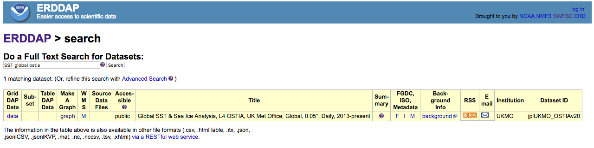

# Exploring the data catalog 
 

There are many ERDDAP servers to chose from. For this example, we will use the ERDDAP operative by the CoastWatch West Coast Node.  

* Enter the following URL into your browser: `https://coastwatch.pfeg.noaa.gov/erddap/`  or Google `"ERDDAP west coast"`.

To view all the available datasets, click "View a List of All 1,429 Datasets"  
You will see all 1400+ datasets listed on the page. You don't have to look through them all. There is a search feature to help find datasets of interests.  

## Finding datasets on ERDDAP 
ERDDAP  offers several ways to search for interesting datasets. We will use the full text search in this example. Full documentation of the search options is available at: `https://coastwatch.pfeg.noaa.gov/erddap/information.html#search`  

*Enter search criteria display SST datasets*   

* Us the back button on your browser to go back to the landing page (`https://coastwatch.pfeg.noaa.gov/erddap/`)   

* In the search box type "sst" and click the "Search' button   

Further narrow the choices to datasets that have global coverage  

* Add "global' to the search box [i.e. sst and global] and click the "Search' button.  

## Gather information about a dataset 

Within the search results you have access to information about each dataset to help you decide with which dataset is useful for your application. The search results For this example we will use the global SST & Sea Ice Analysis (OSTIA) from the UK Met Office.  

* Add "ostia" in the search box (e.g. sst global ostia) and click the "Search' button.  

* In the results you should several datasets, including the one displayed below.  

  

* The listing (pictured above) gives access to a lot of information about the dataset. In a browser, try the following:
    *  Mouse over the question mark `?` under `"Summary"` to get an overview of the dataset.
    *  Click `"background"` to get more complete information from the data provider about the dataset. Now go back to the search results page. 
    *  Click the `"M"` under `"FGDC,ISO,Metadata"` to see all of the dataset metadata. A lot of information is displayed. Some important fields are:
       *  `"geospatial_lat_min"`, `"geospatial_lat_max"`, `"geospatial_lon_min"`, and `"geospatial_lon_max"` for the spatial coverage
       *  `"geospatial_lat_resolution"` and `"geospatial_lon_resolution"` for the size of each pixel
       *  `"time_coverage_start"` and `"time_coverage_end"` for the temporal coverage
       *  `"references"` for citing the dataset in publications
       *  `"license"` for restrictions on using the data 
       *  `"acknowledgement"` often used to describe how to acknowledge use of the dataset 
       *  `"creator_name"` for the entity that created the dataset
       
* When you are finished exploring the metadata, go back to the search results page.  
 