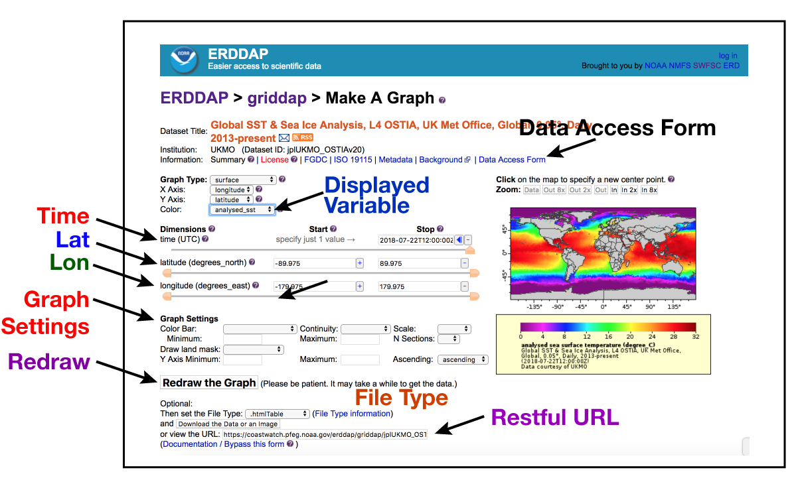
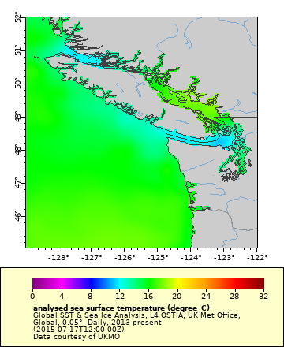

# Visualization and download data 

## ERRDAP "Make A Graph" feature    

Each ERDDAP dataset has a “Make A Graph” page that allows you to browse data by date and narrow down the spatial range of your of interest.  

Make sure you are on the search results page you generated in Chapter 1 by entering “sst global ostia” in the ERDDAP search box or by putting the following link in a browser: `https://coastwatch.pfeg.noaa.gov/erddap/search/index.html?page=1&itemsPerPage=1000&searchFor=ID+%3DjplUKMO_OSTIAv20`    

 

On the OSTIA listing in the search results, click on the "graph" link in the “Make A Graph” column. The Make A Graph page for the OSTIA SST dataset will load.

  
    
Use the widgets to adjust the map that appears on the right side of the "Make A Graph" page.  

* __"Color" widget__ - This widget has a misleading name. Use it to select the variable that displays on the map. By default `"analysed_sst"` is displayed. Click on the drop down menu to see the other choices. Try selecting `"sea_ice_fraction"` and watch how the map changes. When you are done, reselect `"analysed_sst"`.  
* __"time (UTC)" widget__ - Use it to select the date of interest. By default it is set on the most recent date. There are several ways to select a different date.  
    * With the slider bar, pulling the slider all the way to the left takes you to the first date entry in the dataset or any date in between. Take the slider and select a date midway on the slider bar. Click "Redraw the Graph" to display the new map.  
    * On the date display (under the "Stop" column), clicking the minus (`"-"`) or plus (`"+"`) takes you one day back or forward. Clicking the solid blue left-pointing arrow takes you to the first date entry in the dataset. Clicking the solid blue right-pointing arrow takes you to the most recent entry in the dataset.  
    * Try typing a date, e.g. 2018-06-15T12:00:00Z, directly into the date display. Then click "Redraw the Graph".  
* __"latitude" and "longitude" widgets__ - These widgets work like the time widget, except that you can set with minimum and maximum values with the slider, the `"-"` and `"+"` buttons, and the solid blue left- and right-pointing arrows.  
* __“File Type” widget__ - Use this widget to select the output file type. There are over 30 types to choose from. Some of the most useful for data and image file types are listed below. A full description of file types can be found at this link:   
https://coastwatch.pfeg.noaa.gov/erddap/griddap/documentation.html  
    * .nc - netCDF files  
    * .mat - Matlab files  
    * .json - JSON format  
    * .png, .smallPng, .largePng, transparentPng  
    * .geotif  
    * .pdf, .smallPdf, .largePdf  

## Subsetting the area and selecting a date   

For this example, select an area off of the Washington coast for July 15, 2015 by doing the following:  

* Put in the following minimum and maximum latitude and longitude values using the widgets.   
    * `Latitudes: 45, 52`  
    * `Longitudes: -129, -122`  
* Then click the `"Redraw the Graph"` button.  
* Next, use the "time (UTC)" widget to select a time of July 15, 2015 (`2015-07-15T12:00:00Z`).  
* Then click the `"Redraw the Graph"` button.  

 

*There is very little difference in the map color, so adjust the map color scale.* 
* In the "Graph Settings" under  "Color Bar", 
    * for "Minimum" input `12` 
    * for "Maximum" input `20` 
    * Then click the `"Redraw the Graph"` button  

*You can even change the color palette. *
* Click the drop down next to `"Color Bar"` to see a selection of palettes.  
* The palettes beginning with `"KT"` are designed to show certain parameters best and with ADA compliance. Select the `KT_thermal palette`, which is designed for temperature maps, and click `"Redraw the Graph"`.  

## Setting the file format
You can request the data in many formats. Find the drop down box below the “Redraw the Graph” button that is labeled `"File Type"`. Click on the drop down box to view a list of about 30 file formats.  

Some of the most useful for data download are:  
    * .nc - netCDF files  
    * .mat - Matlab files  
    * .json - JSON format  
* Image files are available, too  
    * .png, .smallPng, .largePng, transparentPng  
    * .geotif  
    * .pdf, .smallPdf, .largePdf  
* A full description of file types can be found here: https://coastwatch.pfeg.noaa.gov/erddap/griddap/documentation.html    
    
For demonstration purposes, select `".largePng"`  

## Download the image  

You can download the data directly to your computer by clicking "Download the Data or an image"  

Alternatively, you can copy the URL in the "or view the URL" box. This URL contains the complete request of the data as you defined it. Put the URL in any browser to download the data. You can even send the URL to a colleague and they can download the data. More importantly, you can use the URL to import the data directly into analysis programs like R, Python, or Matlab.  

For this example use an image file. * With the "File Type" set to .largePng, copy the URL in the "or view the URL" box (see below).  
> `https://coastwatch.pfeg.noaa.gov/erddap/griddap/jplUKMO_OSTIAv20.png?analysed_sst[(2015-07-17T12:00:00Z)][(45.025):(52.025)][(-128.975):(-121.975)]&.draw=surface&.vars=longitude|latitude|analysed_sst&.colorBar=KT_thermal|||12|20|&.bgColor=0xffccccff`

* Now open a new browser tab, paste in the URL, and hit return.
* The map should appear as a PNG file in your browser.
  

**A few tricks**

* You can adjust the way the image looks, e.g. remove the legend, change the size. The documentation for this is at this link:
    https://coastwatch.pfeg.noaa.gov/erddap/griddap/documentation.html#GraphicsCommands
* If you would like a map like this on a website you are building, just put the URL above into an HTML  tag. The image will be automatically included on your webpage.

## Refining the data request
Now that you have defined the area of interest, you can add a time range and refine your data request. Make sure navigate you browser back to the `"Make A Graph"` page for the OSTIA dataset. The link is below if you do not have the page in your browser.   
https://coastwatch.pfeg.noaa.gov/erddap/griddap/jplUKMO_OSTIAv20.graph?analysed_sst[(2015-07-17T12:00:00Z)][(45.025):(52.025)][(-128.975):(-121.975)]&.draw=surface&.vars=longitude|latitude|analysed_sst&.colorBar=KT_thermal|||12|20|&.bgColor=0xffccccf

On the upper right part of the `"Make A Graph"` page below the dataset title, click on the `"Data Access Form"` link. The Data Access Form that loads (figure below) has been populated with selections you made in the "Make A Graph" page. 

   

**Note the following:**

The time widget now has a start and stop date, so you can pick a range of dates to download.

The time, latitude, and longitude widgets all have a “Stride” associated with them. The stride gives you additional control over subsetting by reducing the data density. For example:  

* If you wanted to get every other day, the stride would be “2”. A stride of “3” would get every third day.
* Similarly, a stride of “5” in the latitude (or longitude) widgets would sample the data every fifth latitude value.
* The stride value is helpful when you do not need as high a resolution as found in the dataset.

**Setting the time range**

Find the "time" widget. Use it to adjust the time range to the following one (1) month period:  

* Start: 2015-06-17T12:00:00Z
* Stop: 2015-07-17T12:00:00Z   

This is a daily dataset, so if we requested every day in the time period we would get about 30 days of data.  

* Set the stride to 7 to get the data for just one time per week, resulting in a netCDF file with 4 or 5 days of data.

**Selecting the variables to include**

In the Grid Variables section you can request that additional variables be added to the download. The analysed_sst variable you selected has been preselected. If you want, you could include any of the other three variables.

In this example the addition variables are “analysis_error”, “sea_ice_fraction”, and “mask”. In the polar regions, for example, sea_ice_fraction might be an important variable to include.

* Check the box next to “analysis_error” and  “sea_ice_fraction” to include them in the download file  

**Selecting the file type**  

You can request the data in many formats. We use the netCDF format for NOAA satellite courses and for many examples in this tutorial so select the format now.  

* Find the "File type" drop down and select "nc", which is the alias for netCDF.  

**Download the data**  

You can download the data directly to your computer by clicking "Submit" button.  

Alternatively, you can generate and copy the URL that defines your data request. Put the URL in any browser to download the data.  You can even send the URL to a colleague and they can download the data. More importantly, you can use the URL to import the data directly into analysis programs like R, Python, or Matlab.

For now let’s get the URL and put it in a browser.

* Find the button labeled "Just get the URL" and click on it.
* In the box to the right an URL will appear. Copy the URL.
* Open a new tab on your browser, paste the URL in the address box, and hit return. The file should start to download.

**View the netCDF file using Panoply**

Hopefully you were able to install the NASA netCDF viewer, Panoply. If so, try to load into Panoply the netCDF file you just downloaded.

## Try this on you own  
Select a dataset and create a surface map of an area of the world that interests you. 

