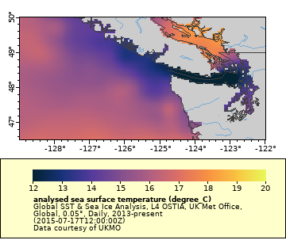
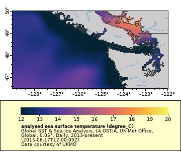

# Automating ERDDAP requests  

Download requests to ERDDAP are completely defined within a URL, allowing:  

* machine-to-machine data exchange,   
* bringing data directly into analysis tools,  
* and the use ERDDAP as a back end to drive customized online interfaces.  

## Deconstructing the URL 
The URL is composed of several parts that define the data request. Let's try breaking the URL down into its component parts.  

Copy the following URL paste it into a browser to see what the data looks like.
`https://coastwatch.pfeg.noaa.gov/erddap/griddap/jplUKMO_OSTIAv20.largePng?analysed_sst[(2015-07-17T12:00:00Z):(2015-07-17T12:00:00Z)][(45.025):(52.025)][(-128.975):(-121.975)]&.draw=surface&.trim=2&.vars=longitude|latitude|analysed_sst&.colorBar=KT_thermal|||12|20|&.bgColor=0xffccccff`  

**NOTE: If you get an error similar to "code=404, Not Found: Currently unknown datasetID=jplUKMO_OSTIAv20.nc", it means that the dataset is temporarily not available. Try using the following URL, which switches to the "nesdisGeoPolarSSTN5SQ" dataset, instead of the one above:**    
`https://coastwatch.pfeg.noaa.gov/erddap/griddap/nesdisGeoPolarSSTN5SQ.largePng?analysed_sst[(2015-07-17T12:00:00Z):(2015-07-17T12:00:00Z)][(45.025):(52.025)][(-128.975):(-121.975)]&.draw=surface&.trim=2&.vars=longitude|latitude|analysed_sst&.colorBar=KT_thermal|||12|20|&.bgColor=0xffccccff`  

Open simple word processor (not Word) and paste in the URL   

Try breaking the URL down into its component parts as described below.  

* Base URL 
    * `https://coastwatch.pfeg.noaa.gov/erddap/griddap/`  
* dataset ID
    * `jplUKMO_OSTIAv20` (or `nesdisGeoPolarSSTN5SQ` if you changed the URL above)
* File type
    * `.largePng`
* Everything after `?` is the data request -> `?`
* Variable of interest
    * `analysed_sst`
* Time
    * `[(2015-07-17T12:00:00Z):(2015-07-17T12:00:00Z)]` 
* Latitude range
    * `[(45.025):(52.025)]`
* Longitude range
    * `[(-128.975):(-121.975)]`
* Everything beginning with `&.draw` adjusts the look of the image  
    * `&.draw=surface&.trim=2&.vars=longitude|latitude|analysed_sst&.colorBar=KT_thermal|||12|20|&.bgColor=0xffccccff`

## Adjust the area in the URL

__NOTE__: You could do the following on the ERDDAP "Data Access Form" page and have ERDDAP generate the modified URL, but we will do it by hand in the browser. 

Change the latitude range to remove Oregon and most of Canada from the map. In the browser, look through the URL and find the part that defines the latitude. Change the lower latitude value from 45.025 to 46.5 and the higher latitude value from 52.025 to 50.0.  

* Change this: `[(45.025):(52.025)]`  
* To this: `[(46.5):(50.0)]`
* Hit return in the browser to see the new edited map.



## Adjust the time in the URL

The time is adjusted the similarly to the latitude.

In the browser, look through the URL and find the part that defines the time. Change the both values to be one (1) month earlier.

* Change this: [(2015-07-17T12:00:00Z):(2015-07-17T12:00:00Z)]
* To this: [(2015-06-17T12:00:00Z):(2015-06-17T12:00:00Z)]
* Hit return in the browser to see the new edited map.



**Getting the most recent data**  

ERDDAP allows you to call the most recent image without knowing the date of the most recent data.

In the browser, look through the URL and find the part that defines the time. Change the both values `"last"`.  

* Change this: [(2015-06-17T12:00:00Z):(2015-06-17T12:00:00Z)]  
* To this: [(last):(last)]
* Hit return in the browser to see the new edited map.

:(last)][(46.5):(50.0)][(-128.975):(-121.975)]&.draw=surface&.trim=2&.vars=longitude|latitude|analysed_sst&.colorBar=KT_thermal|||12|20|&.bgColor=0xffccccff)

The image that appears is most recent data. You can even due math while using `"last"`. 
For example, to get the image one week before the most recent image.  

* Change this: [(last):(last)]  
* To this: [(last-7):(last-7)]
* Hit return in the browser to see the new edited map.

You may have to adjust the color bar minimum and maximum a little. If so, find the part of the URL that defines the color bar

* colorBar=KT_thermal|||12|20|

The minimum is set to 12 and maximum is set to 20. Play around with the numbers until your image looks good.

## Changing the file type in the URL

So far we have been downloading  PGN files in our URL requests to visualize the changes brought about by altering the URL. In the URL the  PGN format is represented in the URL by ".png"   
`https://coastwatch.pfeg.noaa.gov/erddap/griddap/jplUKMO_OSTIAv20__.png__?analysed_sst[(last):(last)][(46.5):(50.0)][(-128.975):(-121.975)]&.draw=surface&.trim=2&.vars=longitude|latitude|analysed_sst&.colorBar=KT_thermal|||12|20|&.bgColor=0xffccccff`

To download the data, we need to change the file type section of the URL request. There are over 30 file types to choose from, but useful formats for data are MATLAB and netCDF formats. The URL representations for those file types are:  

* .nc - netCDF files  
* .mat - Matlab files  
 
We will select a netCDF file.  

* In the browser, locate the `.png` in the URL and replace it with `.nc`  
* Hit return in the browser and the netCDF file will download onto your computer
* View the netCDF file you just downloaded in Panoply

A full description of file types can be found at this link:   
https://coastwatch.pfeg.noaa.gov/erddap/griddap/documentation.html  

## Pull data into a scripting language  

Now that you know how the ERDDAP URL is constructed, it easy to imagine how to write a script within an analysis tool like R, MATLAB or Python to build a URL, download data, and use the data to accomplish a task. The next example, we will build a simple script in R that downloads the data from the PNG image we produced above, show some information about the file (metadata), and generate a simple plot.       

**Review the parts of the ERDDAP URL**  

Using this URL as an example, the component parts of the URL are reviewed below.   
`https://coastwatch.pfeg.noaa.gov/erddap/griddap/jplUKMO_OSTIAv20.nc?analysed_sst[(2015-07-13T12:00:00Z):1:(2015-07-14T12:00:00Z)][(46.5):(50.0)][(-128.975):(-121.975)]`

* Base URL -> https://coastwatch.pfeg.noaa.gov/erddap/griddap/
* dataset ID: jplUKMO_OSTIAv20
* File type: .nc
* Variable of interest -> analysed_sst
* Time range -> [(2015-07-13T12:00:00Z):1:(2015-07-14T12:00:00Z)] The "1" between times is the stride
* Latitude range -> [(45.025):1:(52.025)] The "1" between times is the stride
* Longitude range -> [(-128.975):1:(-121.975)] The "1" between times is the stride

**Create a function in R to build the URL**  

The code block below contains a simple function to build an ERDDAP URL.   


```r
# A function that generates the URL
myURL <- function(burl, data_id, ftype, data_var, dates, lats, lons) {
  url1 = paste(burl, "griddap/", data_id, ftype, "?", data_var, sep="")
  urltime = paste("[(", dates[1], "):1:(", dates[2], ")]", sep="")
  urllat = paste("[(", lats[1], "):1:(", lats[2], ")]", sep="")
  urllon = paste("[(", lons[1], "):1:(",  lons[2], ")]", sep="")
  
   erddapURL <- paste(url1, urltime, urllat, urllon, sep="")
}
```

**Use the function in R to build the URL**  
Use the function to generate a URL and download the data. The input information for the URL is hard coded below. It is likely that in a script you would write there would be a process to generate the input information.  

**NOTE: If you get an error similar to "Not Found: Currently unknown datasetID=jplUKMO_OSTIAv20.nc", it means that the dataset is temporarily not available. Try the following to get the exercise to work:**      
* Switch the dataset ID from ID <- "jplUKMO_OSTIAv20" to ID <- "nesdisGeoPolarSSTN5SQ"
   * Below, put a # in front of ID <- "jplUKMO_OSTIAv20" i.e. # ID <- "jplUKMO_OSTIAv20"
   * Below, remove the # in front of # ID <- "nesdisGeoPolarSSTN5SQ", i.e. ID <- "nesdisGeoPolarSSTN5SQ"


```r
# The location of the ERDDAP server
baseurl <- "https://coastwatch.pfeg.noaa.gov/erddap/"
# The id of the dataset
ID <- "jplUKMO_OSTIAv20"
# ID <- "nesdisGeoPolarSSTN5SQ"
# The name of the variable 
mydata_var <- "analysed_sst"
# A list containing the beginning and end dates
mydates <- c("2015-07-13T12:00:00Z", "2015-07-14T12:00:00Z")
# A list containing the beginning and end latitudes
mylats <- c(45, 52)
# A list containing the beginning and end longitudes
mylons <- c(-128, -121)
# The file type
file_type <- ".nc"

# Generate the URL
erddap_url <- myURL(baseurl, ID, file_type, mydata_var, mydates, mylats, mylons)
erddap_url
```

```
## [1] "https://coastwatch.pfeg.noaa.gov/erddap/griddap/jplUKMO_OSTIAv20.nc?analysed_sst[(2015-07-13T12:00:00Z):1:(2015-07-14T12:00:00Z)][(45):1:(52)][(-128):1:(-121)]"
```

```r
# Download the data as a netCDF file

junk <- GET(erddap_url, write_disk("myDataFile.nc", overwrite=TRUE))  

# The following code will also work for Mac, but not Windows:  
# download.file(url=erddap_url, destfile="myDataFile.nc", quiet=TRUE)

```

**Bring the data into R**  
Open the downloaded data file, load the SST data, and display some information about the SST variable.


```r
# open the netCDF file
library(ncdf4)
nc <- ncdf4::nc_open("myDataFile.nc")
# attributes(nc$var)$names
# load the SST data 
sst <- ncvar_get(nc, mydata_var)
# Get the shape of the array
dim(sst)
```

```
## [1] 142 141   2
```

```r
# print out some metadata about the varialbe
ncatt_get(nc, mydata_var)
```

```
## $`_FillValue`
## [1] -327.68
## 
## $colorBarMaximum
## [1] 32
## 
## $colorBarMinimum
## [1] 0
## 
## $comment
## [1] "OSTIA foundation SST"
## 
## $ioos_category
## [1] "Temperature"
## 
## $long_name
## [1] "analysed sea surface temperature"
## 
## $references
## [1] "C.J. Donlon, M. Martin, J.D. Stark, J. Roberts-Jones, E. Fiedler, W. Wimmer. The operational sea surface temperature and sea ice analysis (OSTIA) system. Remote Sensing Environ., 116 (2012), pp. 140u2013158 https://dx.doi.org/10.1016/j.rse.2010.10.017"
## 
## $source
## [1] "AVHRR18_G-NAVO-L2P-V1.0, AVHRR19_G-NAVO-L2P-V1.0, AVHRR_SST_METOP_B-OSISAF-L2P-V1.0, VIIRS_NPP-OSPO-L2P-V2.3, AMSR2-REMSS-L2P-V07.2, GOES13-OSISAF-L3C-V1.0, SEVIRI_SST-OSISAF-L3C-V1.0, OSISAF_ICE, NCEP_ICE"
## 
## $standard_name
## [1] "sea_surface_foundation_temperature"
## 
## $units
## [1] "degree_C"
## 
## $valid_max
## [1] 44.99999
## 
## $valid_min
## [1] -3.000006
```

Plot a simple visualization of the SST data.  


```r
# Get the data for the first time step
sst1 <- (sst[,,1])
# Visualize teh data
#image(sst1, col=matlab.like2(255)) blue2green2red
image(sst1, col = rainbow(225))
```


