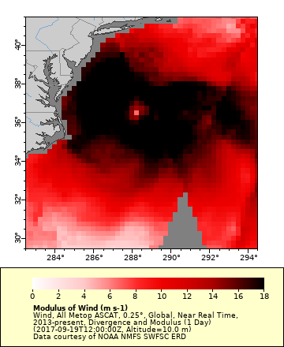
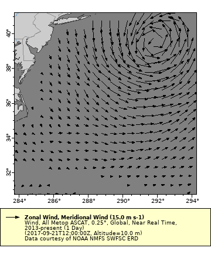
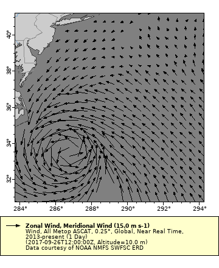

# Mapping Hurricane Jose with winds

Hurricane Jose formed on September 5, 2017 and, on September 8, it reached its peak intensity as a high-end Category 4 hurricane. Jose worked its way northward along the US East Coast, finally dissipating on September 25, 2017. In this exercise we will try to capture the hurricane event using wind data from the ASCAT instruments on board all EUMETSAT's MetOp satellites.  ASCAT is a microwave scatterometer designed to measure surface winds over the global ocean.  

**The exercise demonstrates the following ERDDAP features**  

* mapping scalar data   
* mapping vector data   
* creating a Hovmoller diagram   

## Visualize Hurricane Jose with scalar winds

**Selecting the scalar winds dataset**  

* Enter the following URL into your browser: `https://coastwatch.pfeg.noaa.gov/erddap/`  or Google `"ERDDAP west coast"`.  
* In the search box type `"ASCAT all"` and click the `"Search"` button.  

Several MUR datasets show up in the search results. In the ASCAT datasets, scalar winds (wind speed only) are called Modulus of Wind.  

* Locate the dataset with the title `"Wind, All Metop ASCAT, 0.25°, Global, Near Real Time, 2013-present, Divergence and __Modulus__ (1 Day)"`. Alternately, you can add the dataset ID `"erdQMdivmod1day"` to the search box to narrow your search. 
* Click on `"graph"` in the `"Make A Graph"` column to the left of the dataset title.  

**Zoom the map in on the waters off the US East Coast**

* Change the minimum and maximum latitude and longitude values using the latitude and longitude widgets: 
    * Latitudes: `30.75, 41.25`
    * Longitudes: `283.75, 294.25`  

**Create a map for a time when Hurricane Jose present (Sept. 19, 2017)**     

* Change time widget to select Sept. 19 2017 (2017-09-19T00:00:00Z)
* Make sure that the `"color"` drop down menu has `"mod"` selected
* Click `"Redraw the Graph"`  

Jose was weakening at this time, but maximum wind speeds were greater that 22 m/s (50 mph). Note the eye of the hurricane in the center of the highest winds. 

**Download the data and view in Panoply**  
Download the data as a netCDF file.  

* Find the “File type” drop down menu and select “.nc”, which is the alias for netCDF.
* Download the data directly to your computer by clicking “Submit” button. 
* Load the netCDF file in Panoply. 

## Visualize Hurricane Jose with vector winds  

**Selecting the vector winds dataset**  

* Enter the following URL into your browser: `https://coastwatch.pfeg.noaa.gov/erddap/`  or Google `"ERDDAP west coast"`.  
* In the search box type `"ASCAT all"` and click the `"Search"` button.  

Several MUR datasets show up in the search results. In the ASCAT datasets, vector winds (wind speed and direction) are calculated from wind speeds in the north-south direction (meridional winds) and wind speeds in the east-west direction (zonal winds). ERDDAP can make this calculation for you to visualize wind vectors.  

* Locate the dataset with the title `"Wind, All Metop ASCAT, 0.25°, Global, Near Real Time, 2013-present (1 Day)"`. Alternately, you can add the dataset ID `"erdQMwind1day"` to the search box to narrow your search. 
* Click on `"graph"` in the `"Make A Graph"` column to the left of the dataset title.  

**Zoom the map in on the waters off the US East Coast**

* Change the minimum and maximum latitude and longitude values using the latitude and longitude widgets: 
    * Latitudes: `30.75, 41.25`
    * Longitudes: `283.75, 294.25`  

Note that the following on the `Make A Graph` page:  

* `"Graph Type:"` is `"vector"`
* `"Vector X:"` is `"x_wind"` (Zonal Wind)
* `"Vector Y:"` is `"y_wind"` (Meridional Wind)

**Create a map for a time when Hurricane Jose present (Sept. 19, 2017)**     

* Change time widget to select Sept. 19 2017 (2017-09-19T00:00:00Z)
* Click `"Redraw the Graph"`

The vector arrows show the wind direction.  You can see the counter-clockwise movement of the hurricane winds. The length of the arrows indicates the wind speed. The legend shows the arrow length that equals 25 m/s. 

## Continue tracking Hurricanes  

Move the time ahead 2 days to Sept. 21, 2017 (`2017-09-21T12:00:00Z`) and redraw the graph (map). Hurricane Jose has moved to the northeast. Hurricane Jose has weakened. Note that the arrow length legend has changed to equals 15 m/s.

Move the time ahead to Sept. 26, 2017 (`2017-09-26T12:00:00Z`) and redraw the graph (map). Hurricane Maria has moved into the southwest corner of the map.  

  

## Try this on your own  

Try to locate Hurricane Gert. Gert traveled up the US East Coast between August 12-17, 2017.  
https://en.wikipedia.org/wiki/2017_Atlantic_hurricane_season#Hurricane_Gert  

*Hint: Start looking at about 30N and 287.5E on August 15*

