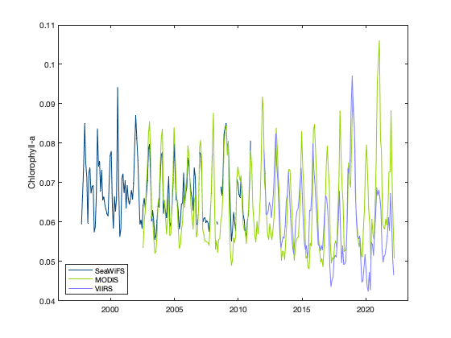
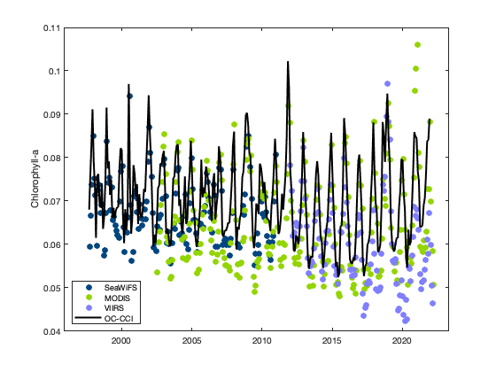

## Tutorial 2. Comparison of chlorophyll data from different sensors
As an example, we are going to plot time-series of mean chlorophyll-a concentration from various sensors from 1997 to 2018 to look at the periods of overlap. 

We are going to download data from SeaWiFS (1997-2010), MODIS (2002-present) and VIIRS (2012-present) and compare it to the ESA-CCI data which combines all 3 sensors into a homogeneous time-series.  
In this tutorial, the URLs to the data are provided so you don't have to search for them.  But, if you weren't sure what the URLs were, you could find them by searing the list of datasets hosted on the OceanWatch ERDDAP (https://oceanwatch.pifsc.noaa.gov/erddap/index.html) and following the steps at the beginning of Tutoral 1. 

**For this tutoral, we're interested in all time steps in the area bounded by 15 - 25N, 198 - 208E.**

### Get monthly SeaWiFS data, which starts in 1997
In Matlab, run the following code to view details about the data:

```matlab
% View data attributes and variables
ncdisp('https://oceanwatch.pifsc.noaa.gov/erddap/griddap/sw_chla_monthly_2018_0');
```

This allows us to see the variable names that we need for the code below, which downloads the data we're interested in.  After we download the data, we're going to average the values of the area of interest for each month.

```matlab
% Download the data over area of interest
% Read the time indices, in their native units (seconds since
% 1970-01-01T00:00:00Z')
sw_time = ncread('https://oceanwatch.pifsc.noaa.gov/erddap/griddap/sw_chla_monthly_2018_0', 'time');

% Convert this to [Y M D H M S]
sw_time_ymdhms = datevec(sw_time/86400 + datenum([1970 1 1 0 0 0])); 
lat_full = ncread('https://oceanwatch.pifsc.noaa.gov/erddap/griddap/sw_chla_monthly_2018_0', 'latitude');
lon_full = ncread('https://oceanwatch.pifsc.noaa.gov/erddap/griddap/sw_chla_monthly_2018_0', 'longitude');

% Find longitudes from 198 - 208 E
lon_aoi = find(lon_full >= 198 & lon_full <= 208);

% Find latitudes from 15 - 25 N
lat_aoi = find(lat_full >= 15 & lat_full <= 25);

% Start coordinates
aoi_start = [lon_aoi(1) lat_aoi(1) 1];

% Coordinates to span
aoi_span = [length(lon_aoi) length(lat_aoi) length(sw_time)];
% Download the data of interest
sw = ncread('https://oceanwatch.pifsc.noaa.gov/erddap/griddap/sw_chla_monthly_2018_0', ...
    'chlor_a', aoi_start, aoi_span);

% Spatially average
swAVG(1:length(sw_time),1) = NaN;
for m = 1:1:length(sw_time)
    swAVG(m,1) = mean(sw(:,:,m), "all", "omitnan");
end

% Tidy up by deleting the variables we won't need again
clear lat* lon* aoi* sw m 

```

### Get monthly MODIS data, which starts in 2002
In Matlab, run the following code to view details about the data:
```matlab
% View data attributes and variables
ncdisp('https://oceanwatch.pifsc.noaa.gov/erddap/griddap/aqua_chla_monthly_2018_0');
```

This allows us to see the variable names that we need for the code below, which downloads the data we're interested in.  After we download the data, we're going to average the values of the area of interest for each month.

```matlab
% Download the data over area of interest
% Read the time indices, in their native units (seconds since
% 1970-01-01T00:00:00Z')
modis_time = ncread('https://oceanwatch.pifsc.noaa.gov/erddap/griddap/aqua_chla_monthly_2018_0', 'time'); 

% Convert this to [Y M D H M S]
modis_time_ymdhms = datevec(modis_time/86400 + datenum([1970 1 1 0 0 0])); 
lat_full = ncread('https://oceanwatch.pifsc.noaa.gov/erddap/griddap/aqua_chla_monthly_2018_0', 'latitude');
lon_full = ncread('https://oceanwatch.pifsc.noaa.gov/erddap/griddap/aqua_chla_monthly_2018_0', 'longitude');

% Find longitudes from 198 - 208 E
lon_aoi = find(lon_full >= 198 & lon_full <= 208);
% Find latitudes from 15 - 25 N
lat_aoi = find(lat_full >= 15 & lat_full <= 25);

% Start coordinates
aoi_start = [lon_aoi(1) lat_aoi(1) 1];

% Coordinates to span
aoi_span = [length(lon_aoi) length(lat_aoi) length(modis_time)];

% Download the data of interest
modis = ncread('https://oceanwatch.pifsc.noaa.gov/erddap/griddap/aqua_chla_monthly_2018_0', ...
    'chlor_a', aoi_start, aoi_span);

% Spatially average
modisAVG(1:length(modis_time),1) = NaN;
for m = 1:1:length(modis_time)
    modisAVG(m,1) = mean(modis(:,:,m), "all", "omitnan");
end

% Tidy up by deleting the variables we won't need again
clear lat* lon* aoi* modis m 
```

### Get monthly VIIRS data, which starts in 2012
In Matlab, run the following code to view details about the data:


```matlab
% View data attributes and variables
ncdisp('https://oceanwatch.pifsc.noaa.gov/erddap/griddap/noaa_snpp_chla_monthly');
```


This allows us to see the variable names that we need for the code below, which downloads the data we're interested in.  After we download the data, we're going to average the values of the area of interest for each month.

```matlab
% Download the data over area of interest
% Read the time indices, in their native units (seconds since
% 1970-01-01T00:00:00Z')
viirs_time = ncread('https://oceanwatch.pifsc.noaa.gov/erddap/griddap/noaa_snpp_chla_monthly', 'time');

% Convert this to [Y M D H M S]
viirs_time_ymdhms = datevec(viirs_time/86400 + datenum([1970 1 1 0 0 0])); 
lat_full = ncread('https://oceanwatch.pifsc.noaa.gov/erddap/griddap/noaa_snpp_chla_monthly', 'latitude');
lon_full = ncread('https://oceanwatch.pifsc.noaa.gov/erddap/griddap/noaa_snpp_chla_monthly', 'longitude');

% Find longitudes from 198 - 208 E
lon_aoi = find(lon_full >= 198 & lon_full <= 208);

% Find latitudes from 15 - 25 N
lat_aoi = find(lat_full >= 15 & lat_full <= 25);

% Start coordinates
aoi_start = [lon_aoi(1) lat_aoi(1) 1];

% Coordinates to span
aoi_span = [length(lon_aoi) length(lat_aoi) length(viirs_time)];
% Download the data of interest
viirs = ncread('https://oceanwatch.pifsc.noaa.gov/erddap/griddap/noaa_snpp_chla_monthly', ...
    'chlor_a', aoi_start, aoi_span);

% Spatially average
viirsAVG(1:length(viirs_time),1) = NaN;
for m = 1:1:length(viirs_time)
    viirsAVG(m,1) = mean(viirs(:,:,m), "all", "omitnan");
end

% Tidy up by deleting the variables we won't need again
clear lat* lon* aoi* viirs m 
```

### Get monthly ESA OC-CCI data, which span Sept 1997 through Dec 2021
In Matlab, run the following code to view details about the data:

```matlab
% View data attributes and variables
ncdisp('https://oceanwatch.pifsc.noaa.gov/erddap/griddap/esa-cci-chla-monthly-v5-0');
```


This allows us to see the variable names that we need for the code below, which downloads the data we're interested in.  After we download the data, we're going to average the values of the area of interest for each month.


```matlab
% Download the data over area of interest
% Read the time indices, in their native units (seconds since
% 1970-01-01T00:00:00Z')
esa_time = ncread('https://oceanwatch.pifsc.noaa.gov/erddap/griddap/esa-cci-chla-monthly-v5-0', 'time');

% Convert this to [Y M D H M S]
esa_time_ymdhms = datevec(esa_time/86400 + datenum([1970 1 1 0 0 0])); 
lat_full = ncread('https://oceanwatch.pifsc.noaa.gov/erddap/griddap/esa-cci-chla-monthly-v5-0', 'latitude');
lon_full = ncread('https://oceanwatch.pifsc.noaa.gov/erddap/griddap/esa-cci-chla-monthly-v5-0', 'longitude');

% Find longitudes from 198 - 208 E
lon_aoi = find(lon_full >= 198 & lon_full <= 208);

% Find latitudes from 15 - 25 N
lat_aoi = find(lat_full >= 15 & lat_full <= 25);

% Start coordinates
aoi_start = [lon_aoi(1) lat_aoi(1) 1];

% Coordinates to span
aoi_span = [length(lon_aoi) length(lat_aoi) length(esa_time)];

% Download the data of interest
esa = ncread('https://oceanwatch.pifsc.noaa.gov/erddap/griddap/esa-cci-chla-monthly-v5-0', ...
    'chlor_a', aoi_start, aoi_span);

% Spatially average
esaAVG(1:length(esa_time),1) = NaN;
for m = 1:1:length(esa_time)
    esaAVG(m,1) = mean(esa(:,:,m), "all", "omitnan");
end

% Tidy up by deleting the variables we won't need again
clear lat* lon* aoi* esa m 
```
### Plot time series comparison
Now we can compare the spatial averages across the three sensors: SeaWiFS, MODIS, and VIIRS.  We'll do this by generating a plot the includes all three time series, which overlap to varying degrees.
```matlab
figure
plot(datenum(sw_time_ymdhms), swAVG, 'Color', [0 70 127]/255);
hold on
plot(datenum(modis_time_ymdhms), modisAVG, 'Color', [147 213 0]/255);
plot(datenum(viirs_time_ymdhms), viirsAVG, 'Color', [127 127 255]/255);
set(gca,'XTick', datenum([2000 1 1 0 0 0]):5*365:datenum([2020 1 1 0 0 0]));
set(gca,'XTickLabel', 2000:5:2020);
legend('SeaWiFS', 'MODIS', 'VIIRS', 'Location', 'southwest');
ylabel('Chlorophyll-a');
```


You can see that the values of chlorophyll-a concentration don't match across sensors.

### Make another plot with the ESA OC-CCI data to compare
The OC-CCI data are from a blended product, that merges the three sensors.


```matlab
figure
plot(datenum(sw_time_ymdhms), swAVG, 'o', 'MarkerFaceColor', [0 70 127]/255, 'MarkerEdgeColor', ...
    [0 70 127]/255); 
hold on
plot(datenum(modis_time_ymdhms), modisAVG, 'o', 'MarkerFaceColor', [147 213 0]/255, ...
    'MarkerEdgeColor', [147 213 0]/255);
plot(datenum(viirs_time_ymdhms), viirsAVG, 'o', 'MarkerFaceColor', [127 127 255]/255, ...
    'MarkerEdgeColor', [127 127 255]/255);
plot(datenum(esa_time_ymdhms), esaAVG, 'k', 'LineWidth', 2);
set(gca,'XTick', datenum([2000 1 1 0 0 0]):5*365:datenum([2020 1 1 0 0 0]));
set(gca,'XTickLabel', 2000:5:2020);
legend('SeaWiFS', 'MODIS', 'VIIRS', 'OC-CCI', 'Location', 'southwest');
ylabel('Chlorophyll-a');
```

