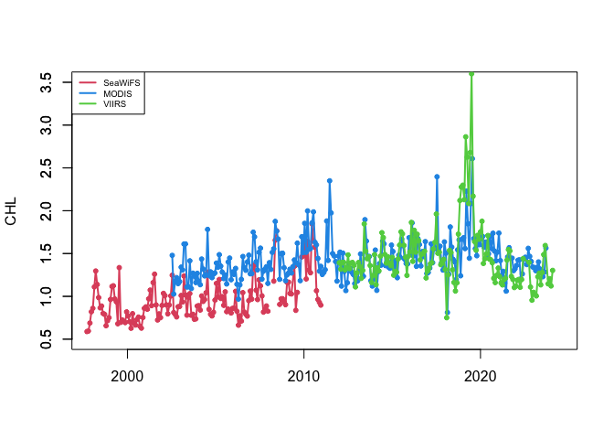
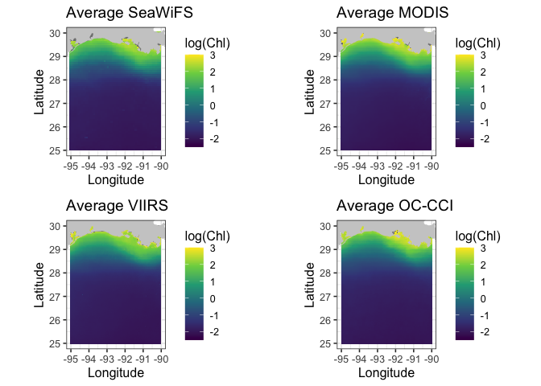

A tidyverse/ggplot version is also available here:
<https://github.com/jebyrnes/noaa_coastwatch_tutorial_1/blob/main/tutorial2-1.md>
Links to an external site.

courtesy of Jarrett Byrnes from UMass Boston - <http://byrneslab.net>
(Thank you Jarrett!!)

## Background

Several ocean color sensors have been launched since 1997 to provide
continuous global coverage for ocean color data. The sensors have
differences in design and calibration, and different algorithms may be
applied to generate chlorophyll values. Consequently, chlorophyll-a
values can vary among the sensors during periods where measurements
overlap.

To examine this phenomenon, we will download and plot time-series of
chlorophyll-a concentrations from various sensors from 1997 to the
present and see how the measurements compare during periods of overlap.

## Objective

This tutorial will show how to extract a time-series from four different
monthly satellite chlorophyll datasets for the period that each was in
operation between 1997-present. It will showcase the use of the rerddap
and rerddapXtracto packages, which have been developed to make it easier
to interact with ERDDAP servers from R.

More information about the rerddap package can be found here:
[https://cran.r-project.org/web/packages/rerddap/index.html](%5Bhttps://cran.r-project.org/web/packages/rerddap/index.html)

and here:
<https://cran.r-project.org/web/packages/rerddap/vignettes/Using_rerddap.html>

More information about the rerddapXtracto package can be found here:
<https://cran.r-project.org/web/packages/rerddapXtracto/index.html>

and here:
<https://cran.r-project.org/web/packages/rerddapXtracto/vignettes/UsingrerddapXtracto.html>

## The tutorial demonstrates the following techniques

-   Using **rerddapXtracto** package to extract data from a rectangular
    area of the ocean over time
-   Using **rerddap** to retrieving information about a dataset from
    ERDDAP
-   Comparing results from different sensors
-   Averaging data spatially
-   Producing timeseries plots
-   Drawing maps with satellite data

## Datasets used

SeaWiFS Chlorophyll-a, V.2018, Monthly, Global, 4km, 1997-2012
<https://coastwatch.pfeg.noaa.gov/erddap/griddap/erdSW2018chlamday>

MODIS Aqua, Chlorophyll-a, V.2022, Monthly, Global, 4km, 2002-present
<https://coastwatch.pfeg.noaa.gov/erddap/griddap/erdMH1chlamday_R2022SQ>

NOAA VIIRS S-NPP, Chlorophyll-a, Monthly, Global, 4km, 2012-present
<https://coastwatch.pfeg.noaa.gov/erddap/griddap/nesdisVHNSQchlaMonthly>

ESA CCI Ocean Colour Dataset, v6.0, Monthly, Global, 4km, 1997-Present
This dataset was developed by the European Space Agency’s Climate Change
Initiative. The dataset merges data from multiple sensors (MERIS, MODIS,
VIIRS and SeaWiFS) to create a long timeseries (1997 to present) with
better spatial coverage than any single sensor. Parameters include
chlorophyll-a, remote sensing reflectance, diffuse attenuation
coefficients, absorption coefficients, backscatter coefficients, and
water classification.
<https://coastwatch.pfeg.noaa.gov/erddap/griddap/pmlEsaCCI60OceanColorMonthly>

## Load packages

    packages <- c( "ncdf4","plyr","lubridate","rerddap","ggplot2","plotdap",
                   "rerddapXtracto","maps", "mapdata","grid", "reshape2", "gridExtra")

    # Install packages not yet installed
    installed_packages <- packages %in% rownames(installed.packages())

    if (any(installed_packages == FALSE)) {
      install.packages(packages[!installed_packages])
    }

    # Load packages 
    invisible(lapply(packages, library, character.only = TRUE))

## Define the area to extract

First we define the longitude-latitude boundaries of the region. The
coordinates used here, between -95 to -90°W longitude and 25-30°N
latitude, define an area in teh Gulf of Mexico.

    xcoord <- c(-95,-90)
    ycoord <- c(25,30)

## Get information about the dataset we will be downloading

Define the URL of the ERDDAP we will be using:

    ERDDAP_Node <- "https://coastwatch.pfeg.noaa.gov/erddap/"

### Get monthly SeaWiFS data, which starts in 1997.

Go to ERDDAP to find the name of the dataset for monthly SeaWIFS data:
erdSW2018chlamday

You should always examine the dataset in ERDDAP to check the date range,
names of the variables and dataset ID, to make sure your griddap calls
are correct:
<https://coastwatch.pfeg.noaa.gov/erddap/griddap/erdSW2018chlamday>

First we need to know what our variable is called. Let’s retrieve some
metadata using the **info** function of the **rerddap** package:

    dataInfo <- rerddap::info('erdSW2018chlamday', url=ERDDAP_Node)
    var <- dataInfo$variable$variable_name

    # Display the dataset metadata
    dataInfo

    ## <ERDDAP info> erdSW2018chlamday 
    ##  Base URL: https://coastwatch.pfeg.noaa.gov/erddap 
    ##  Dataset Type: griddap 
    ##  Dimensions (range):  
    ##      time: (1997-09-16T00:00:00Z, 2010-12-16T00:00:00Z) 
    ##      latitude: (-89.95834, 89.95834) 
    ##      longitude: (-179.9583, 179.9584) 
    ##  Variables:  
    ##      chlorophyll: 
    ##          Units: mg m^-3

### Extract satellite data with rxtracto\_3D

For each dataset, we will extract satellite data for the entire length
of the available timeseries.

-   Dates must be defined separately for each dataset. **rxtracto\_3D**
    will crash if dates are entered that are not part of the
    timeseries.  
-   The beginning (earliest) date to use in timeseries is obtained from
    the information returned in dataInfo.  
-   To get the end (most recent) date to use in the timeseries, use the
    `last` option for time.
-   The variable name can change between datasets. For this dataset, the
    chloropyll variable is called *chlorophyll*, as seen in the metadata
    returned by dataInfo

<!-- -->

    # Extract the parameter name from the metadata in dataInfo
    parameter <- dataInfo$variable$variable_name

    # Set the altitude coordinate to zero
    zcoord <- 0.

    # Extract the beginning and ending dates of the dataset from the metadata in dataInfo
    global <- dataInfo$alldata$NC_GLOBAL
    tt <- global[ global$attribute_name %in% c('time_coverage_end','time_coverage_start'), "value", ]

    # Populate the time vector with the time_coverage_start from dataInfo
    # Use the "last" option for the ending date
    tcoord <- c(tt[2],"last")

\*\* Run the SeaWiFS data extraction with rxtracto\_3D:

    # Extract the timeseries data using rxtracto_3D
    chlSeaWiFS<-rxtracto_3D(dataInfo,
                            parameter=parameter,
                            tcoord=tcoord,
                            xcoord=xcoord,
                            ycoord=ycoord)

### Plot data to show where it is in the world

We will use the *plotBBox* function of the rerddapXtracto package to
make a quick map of the data

    myFunc <- function(x) log(x)
    plotBBox(chlSeaWiFS, plotColor = 'algae', myFunc = myFunc)

### Get monthly MODIS data, which starts in 2002.

    dataInfo <- rerddap::info('erdMH1chlamday_R2022SQ', url=ERDDAP_Node)
    # Extract the parameter name from the metadata in dataInfo
    parameter <- dataInfo$variable$variable_name

    #Extract the start and end times of the dataset from the metadata in dataInfo
    global <- dataInfo$alldata$NC_GLOBAL

    # Populate the time vector with the time_coverage_start from dataInfo
    # Use the "last" option for the ending date
    tt <- global[ global$attribute_name %in% c('time_coverage_end','time_coverage_start'), "value", ]
    tcoord <- c(tt[2],"last")

    #Run rxtracto_3D
    chlMODIS<-rxtracto_3D(dataInfo,
                          parameter=parameter,
                          tcoord=tcoord,
                          xcoord=xcoord,
                          ycoord=ycoord)

### Get monthly VIIRS data, which starts in 2012.

    dataInfo <- rerddap::info('nesdisVHNSQchlaMonthly', url=ERDDAP_Node)
    # Extract the parameter name from the metadata in dataInfo
    parameter <- dataInfo$variable$variable_name

    #Extract the start and end times of the dataset from the metadata in dataInfo
    global <- dataInfo$alldata$NC_GLOBAL

    # This dataset has an altitude dimensionm, so must include zcoord as an argument in the rxtracto_3D function Set the altitude coordinate to zero
    zcoord <- 0.

    # Populate the time vector with the time_coverage_start from dataInfo
    # Use the "last" option for the ending date
    tt <- global[ global$attribute_name %in% c('time_coverage_end','time_coverage_start'), "value", ]
    tcoord <- c(tt[2],"last")

    #Run rxtracto_3D
    chlVIIRS <- rxtracto_3D(dataInfo,
                          parameter=parameter,
                          tcoord=tcoord,
                          xcoord=xcoord,
                          ycoord=ycoord,
                          zcoord=zcoord)

    # Remove extraneous zcoord dimension for chlorophyll 
    chlVIIRS$chlor_a <- drop(chlVIIRS$chlor_a)

### Average data spatially and temporally

-   spatially averages data for each time step within the area
    boundaries for each dataset.  
-   temporally averages data for data in each timeseries onto a map, for
    each dataset.

<!-- -->

    ## Spatially average all the data within the box for each dataset.
    ## The c(3) indicates the dimension to keep - in this case time 
    chlSeaWiFS$avg <- apply(chlSeaWiFS$chlorophyll, c(3),function(x) mean(x,na.rm=TRUE))
    chlMODIS$avg <- apply(chlMODIS$chlor_a, c(3),function(x) mean(x,na.rm=TRUE))
    chlVIIRS$avg <- apply(chlVIIRS$chlor_a, c(3),function(x) mean(x,na.rm=TRUE))

    ## Temporally average all of the data into one map 
    ## The c(1,2) indicates the dimensions to keep - in this case latitude and longitude  
    chlSeaWiFS$avgmap <- apply(chlSeaWiFS$chlorophyll,c(1,2),function(x) mean(x,na.rm=TRUE))
    chlMODIS$avgmap <- apply(chlMODIS$chlor_a,c(1,2),function(x) mean(x,na.rm=TRUE))
    chlVIIRS$avgmap <- apply(chlVIIRS$chlor_a,c(1,2),function(x) mean(x,na.rm=TRUE))

### Plot time series for the three datasets

    plot(as.Date(chlSeaWiFS$time), chlSeaWiFS$avg, type='l', col=2,lwd=2, 
         xlab="", xlim=as.Date(c("1997-12-01","2024-06-01")), 
         ylim=c(0.5,3.5), ylab="CHL")
    axis(2)
    points(as.Date(chlSeaWiFS$time), chlSeaWiFS$avg,pch=20,col=2)

    lines(as.Date(chlMODIS$time), chlMODIS$avg, col=4, lwd=2)
    points(as.Date(chlMODIS$time), chlMODIS$avg,pch=20,col=4)

    lines(as.Date(chlVIIRS$time), chlVIIRS$avg, col=3, lwd=2)
    points(as.Date(chlVIIRS$time), chlVIIRS$avg,pch=20,col=3)

    legend('topleft',legend=c('SeaWiFS','MODIS','VIIRS'),cex=0.6,col=c(2,4,3),lwd=2)

You can see that the values of chl-a concentration doesn’t always match
between sensors.

### Get OC-CCI data (September 1997 to Dec 2022)

If you needed a single time series from 1997 to present, you would have
to use the plot above to devise some method to reconcile the difference
in values where two datasets overlap. Alternatively, you could use the
ESA OC-CCI (ocean color climate change initiative) dataset, which blends
data from many satellite missions into a single dataset, including data
from SeaWiFS, MODIS, and VIIRS.

Add the ESA OC-CCI dataset to the plot above to see how it compares with
data from the individual satellite missions.

    dataInfo <- rerddap::info('pmlEsaCCI60OceanColorMonthly', url=ERDDAP_Node)

    # This identifies the parameter to choose - there are > 60 in this dataset!
    parameter <- 'chlor_a'

    global <- dataInfo$alldata$NC_GLOBAL
    tt <- global[ global$attribute_name %in% c('time_coverage_end','time_coverage_start'), "value", ]
    tcoord <- c(tt[2],"last")

    chlOCCCI<-rxtracto_3D(dataInfo,
                          parameter=parameter,
                          tcoord=tcoord,
                          xcoord=xcoord,
                          ycoord=ycoord)

    # Now spatially average the data into a timeseries
    chlOCCCI$avg <- apply(chlOCCCI$chlor_a, c(3),function(x) mean(x,na.rm=TRUE))

    # Now temporally average the data into one map 
    chlOCCCI$avgmap <- apply(chlOCCCI$chlor_a,c(1,2),function(x) mean(x,na.rm=TRUE))

### Make another plot with CCI as well to compare

    plot(as.Date(chlSeaWiFS$time), chlSeaWiFS$avg, type='l', col=2,lwd=2, 
         xlab="", xlim=as.Date(c("1997-12-01","2024-06-01")), 
         ylim=c(0.5,3.5), ylab="CHL")
    axis(2)
    points(as.Date(chlSeaWiFS$time), chlSeaWiFS$avg,pch=20,col=2)
    points(as.Date(chlMODIS$time), chlMODIS$avg,pch=20,col=4)
    points(as.Date(chlVIIRS$time), chlVIIRS$avg,pch=20,col=3)
    lines(as.Date(chlOCCCI$time),chlOCCCI$avg,lwd=2)

    legend('topleft',legend=c('SeaWiFS','MODIS','VIIRS','OC-CCI'),cex=0.6,col=c(2,4,3,1),
           pch=c(20,20,20,NA),lty=c(NA,NA,NA,1),lwd=2)

    coast <- map_data("worldHires", ylim = ycoord, xlim = xcoord)

    # Put arrays into format for ggplot
    melt_map <- function(lon,lat,var) {
      dimnames(var) <- list(Longitude=lon, Latitude=lat)
      ret <- melt(var,value.name="Chl")
    }

    # Loop for making 4 maps
    datasetnames <- c("SeaWiFS","MODIS","VIIRS","OC-CCI")

    plot_list = list()

    for(i in 1:4) {
      
      if(i == 1) chl <- chlSeaWiFS
      if(i == 2) chl <- chlMODIS
      if(i == 3) chl <- chlVIIRS
      if(i == 4) chl <- chlOCCCI
      
       chlmap <- melt_map(chl$longitude, chl$latitude, chl$avgmap)

       p = ggplot(
         data = chlmap, 
         aes(x = Longitude, y = Latitude, fill = log(Chl))) +
             geom_tile(na.rm=T) +
             geom_polygon(data = coast, aes(x=long, y = lat, group = group), fill = "grey80") +
             theme_bw(base_size = 12) + ylab("Latitude") + xlab("Longitude") +
             coord_fixed(1.3, xlim = c(-95,-90), ylim = ycoord) +
             scale_fill_viridis_c(limits=c(-2.5,3)) +
             ggtitle(paste("Average", datasetnames[i])
          ) 

      plot_list[[i]] = p
    }

    # Now print out maps into a png file.  Can't use par function with **ggplpot** to get 
    # multiple plots per page.  Here using a function in the **grid** package

    grid.arrange(plot_list[[1]],plot_list[[2]],plot_list[[3]],plot_list[[4]], nrow = 2)

