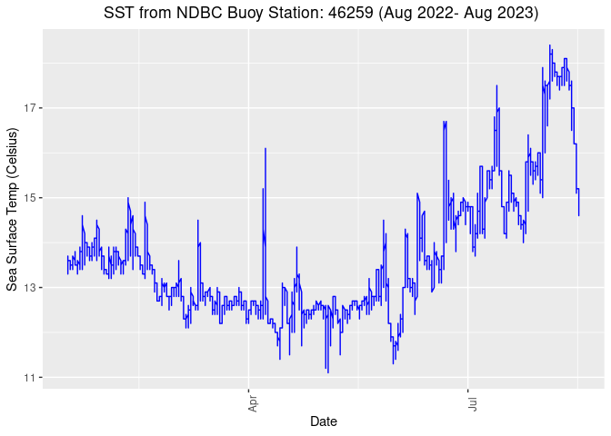
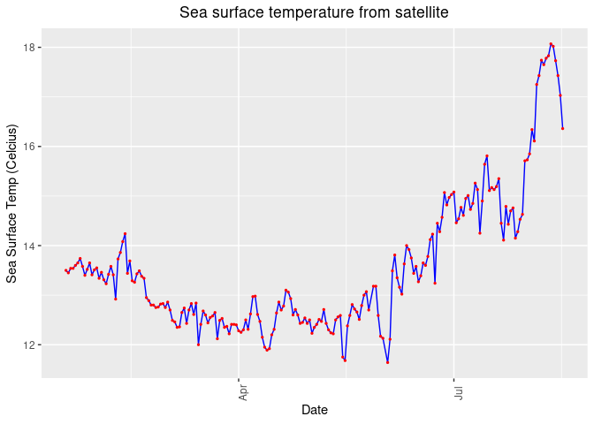
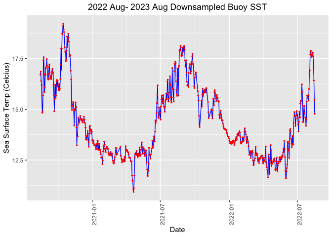
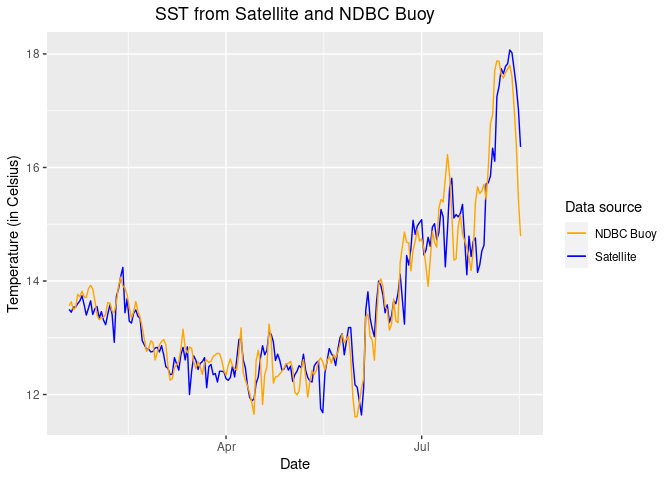
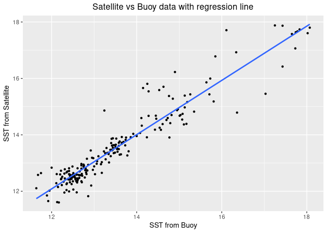

# Virtual Buoy example

> Updated August 2023  

There are buoys in many locations around the world that provide data
streams of oceanic and atmospheric parameters. The data are often
available through data centers like the National Data Buoy Center (NDBC
<https://www.ndbc.noaa.gov>), ARGO floats program
(<http://www.argo.ucsd.edu>) or CoastWatch ERDDAP data servers
(<https://coastwatch.pfeg.noaa.gov/erddap/>). In situ buoy data are
widely used to monitor environmental conditions. In the absence of in
situ buoy data - whether the buoy operation is discontinued,
interrupted, or limited - satellite data within temporal and spatial
coverage of the desired locationcan be used to create a time series of a
parameter of interest.

## Objective

This tutorial will demonstrate how to create a time series from
satellite data to gap-fill or replace buoy data.

## The tutorial demonstrates the following techniques

-   Downloading the satellite and buoy data from ERDDAP data server
-   Visualizing the datasets
-   Reshaping the satellite data into a buoy data format
-   Resampling buoy data (aggregation) to match satellite data temporal
    resolution
-   Validating the satellite data with the actual buoy data
-   Performing a linear regression of satellite vs. buoy data
-   Creating a scatter plot of satellite vs. buoy data with the
    regression line

## Datasets used

**Sea-Surface Temperature, NOAA Geo-polar Blended Analysis Day+Night,
GHRSST,Near Real-Time, Global 5km, 2019-Present, Daily**  
<a href="https://coastwatch.pfeg.noaa.gov/erddap/griddap/nesdisBLENDEDsstDNDaily.graph" target="_blank">.

**NDBC Standard Meteorological Buoy Data, 1970-present**
<a href="https://coastwatch.pfeg.noaa.gov/erddap/tabledap/cwwcNDBCMet.graph?time%2Cwtmp%2Cwd&station=%2246259%22&time%3E=2020-09-15T00%3A00%3A00Z&time%3C=2022-09-15T00%3A00%3A00Z&.draw=markers&.marker=5%7C5&.color=0x000000&.colorBar=%7C%7C%7C%7C%7C&.bgColor=0xffccccff">
NDBC Standard Meteorological Buoy Data </a> from the buoy station no.
**46259** are from off the California coast at 34.737N latitude and
121.664E longitude.

## References

-   <a href="https://coastwatch.pfeg.noaa.gov/data.html">NOAA CoastWatch
    Westcoast Node Data Catalog</a>
-   <a href="https://www.ndbc.noaa.gov/download_data.php?filename=46259h2017.txt.gz&dir=data/historical/stdme ">NOAA
    National Data Buoy Center</a>

## Install required packages and load libraries

    # Function to check if pkgs are installed, and install any missing pkgs
    pkgTest <- function(x)
    {
      if (!require(x,character.only = TRUE))
      {
        install.packages(x,dep=TRUE,repos='http://cran.us.r-project.org')
        if(!require(x,character.only = TRUE)) stop(x, " :Package not found")
      }
    }

    # Create list of required packages
    list.of.packages <- c("utils", "ggplot2", "dplyr", "lubridate")

    # Create list of installed packages
    pkges = installed.packages()[,"Package"]

    # Install and load all required pkgs
    for (pk in list.of.packages) {
      pkgTest(pk)
    }

## Download NDBC buoy data

We will download NDBC buoy data between January 16, 2022 and August 16,
2022 from the CoastWatch ERDDAP server.

The data can be downloaded by sending a data request to the ERDDAP
server via URL. The data request URL includes the dataset ID of interest
and other query conditions if subset of the data product is of interest.

To learn more about how to set up ERDDAP URL data requests, please go to
the <a href="" target="_blank">ERDDAP module page</a>.

    # Set the ERDDAP data request URL
     
    buoy_url <- "https://coastwatch.pfeg.noaa.gov/erddap/tabledap/cwwcNDBCMet.csv?time%2Clongitude%2Clatitude%2Cwtmp&station%3E=%2246259%22&station%3C=%2246259%22&time%3E=2022-01-16T00%3A00%3A00Z&time%3C=2022-08-16T17%3A52%3A00Z"

    # Set file name
    fname = 'buoy.csv'

    # Download file
    download.file(buoy_url, fname)

     
    # Read into data frame, skip first 2 rows that contain variable names and units
     
    buoy_df <- read.csv(fname, skip=2, header=TRUE)

    # Name the columns
    names(buoy_df) <- c("utc", "lon", "lat", "sst" )

    # Add additional date column
    buoy_df$date <- as.Date(buoy_df$utc, tz = "UTC")

    # Show the first 3 rows
    head(buoy_df, 3)

    ##                    utc      lon    lat  sst       date
    ## 1 2022-01-16T00:56:00Z -121.664 34.732 13.4 2022-01-16
    ## 2 2022-01-16T01:26:00Z -121.664 34.732 13.4 2022-01-16
    ## 3 2022-01-16T01:56:00Z -121.664 34.732 13.3 2022-01-16

## Visualize SST from the Buoy

    options(repr.plot.width = 10)

    ggplot(buoy_df, aes(x = date, y = sst)) +
      geom_line(color='blue') +
     # geom_point(size=.2, color='red')+
      theme(axis.text.x = element_text(angle = 90),plot.title=element_text(hjust=0.5))+
       labs(x="Date", y="Sea Surface Temp (Celsius)", title="SST from NDBC Buoy Station: 46259 (Aug 2022- Aug 2023) ")

## Download the Satellite Sea Surface Temperature (SST) Data

The satellite Sea Surface Temperature (SST) product we will use is the
NOAA GeoPolar Blended SST dataset (in Celsius), which blends data from
many satellite sensors to obtain good daily coverage of the globe at 5km
resolution, and then an interpolation method is applied to fill in data
gaps.

The data request can be sent to a CoastWatch ERDDAP server via URL with
a query string to specify the temporal and spatial coverage of interest.
In this case, we want to subset the satellite data to match the buoy
station location and time range.

### Send the satellite data request to the CoastWatch ERDDAP Server

    # Set ERDDAP URL for the satellite data
    url <- "https://coastwatch.pfeg.noaa.gov/erddap/griddap/nesdisBLENDEDsstDNDaily.csv?analysed_sst%5B(2022-01-16T12:00:00Z):1:(2022-08-16T12:00:00Z)%5D%5B(34.737):1:(34.737)%5D%5B(-121.664):1:(-121.664)%5D"

    # Set file name
    fname = 'sst.csv'

    # Download file
    download.file(url, fname)

    # Read into data frame, skip first 2 rows that contain variable names and units
    sst_df <- read.csv(fname, skip=2, header=TRUE)
    names(sst_df) <- c("utc", "lat", "lon", "sst")

    # Add formatted data column
    sst_df$date <- as.Date(sst_df$utc, tz = "UTC")

    # Show the first 3 rows
    head(sst_df, 3)

    ##                    utc    lat      lon      sst       date
    ## 1 2022-01-18T12:00:00Z 34.725 -121.675 13.49999 2022-01-18
    ## 2 2022-01-19T12:00:00Z 34.725 -121.675 13.44999 2022-01-19
    ## 3 2022-01-20T12:00:00Z 34.725 -121.675 13.53999 2022-01-20

## Clean up the data

Apply a conservative allowable data range. For the lower end of the
range, the freezing point of seawater (ca. -2). For the high end of the
range, a value unlikely to be seen in the area of interest (e.g. 45
degrees C).

    # Filter data that are within the valid range (-2 and 45)
    sst_df_clean = sst_df %>%
      filter(sst >=-2 & sst <= 45)

## Visualize the satellite SST data

    # Plot sea surface temperature values from satellite
    p <- ggplot(sst_df, aes(x = date, y = sst)) +
      geom_line(color='blue') +
      geom_point(size=.5, color='red')+
      theme(axis.text.x = element_text(angle = 90),plot.title=element_text(hjust=0.5))+
       labs(x="Date", y="Sea Surface Temp (Celcius)", title="Sea surface temperature from satellite")
    p

## Resample the buoy data to match the satellite data

The sampling resolution for the buoy data is a sample every 30 minutes.
However, the temporal resolution for the satellite dataset is daily. We
will downsample the buoy data by computing daily mean to match the
temporal resolution of the satellite data.

    # Aggregating (taking a mean value) grouped by day
    buoy_ds <- buoy_df %>%
      group_by(date = floor_date(date, unit="days")) %>%
      summarise(mean_sst = mean(sst))

    # Show first 3 rows
    head(buoy_ds, 3)

    ## # A tibble: 3 × 2
    ##   date       mean_sst
    ##   <date>        <dbl>
    ## 1 2022-01-16     13.4
    ## 2 2022-01-17     13.5
    ## 3 2022-01-18     13.6

## Clean up the downsampled data

Apply a conservative allowable data range. For the lower end of the
range, the freezing point of seawater (ca. -2). For the high end of the
range, value unlikely to be seen in the area of interest (e.g. 45
degrees C).

    # Remove outliers sst values outside of -2 and 45 deg C
    buoy_ds_clean = buoy_ds %>%
      filter(mean_sst >=-2 & mean_sst <= 45)

## Visualize the downsampled buoy data

    # Plot daily mean sst
    ggplot(buoy_ds_clean, aes(x = date, y = mean_sst)) +
      geom_line(color='blue') +
      geom_point(size=.5, color='red')+
      theme(axis.text.x = element_text(angle = 90),plot.title=element_text(hjust=0.5))+
       labs(x="Date", y="Sea Surface Temp (Celcius)", title="2022 Aug- 2023 Aug Downsampled Buoy SST")

## Merge Satellite and Buoy data

We will use dplyr::inner\_join() function to merge the two data frames
(satellite and buoy data) based on the dates that appear in both data
frames.

    # Combine two data frames with date column where dates exist in both data frames
    merged_df <- inner_join(sst_df_clean[c("date", "sst")],  buoy_ds_clean, by = "date")

## Plot both satellite and buoy data

    # Plot satellite sst and buoy daily mean sst 
    p <- ggplot(merged_df, aes(x = date)) +  
        geom_line(aes(y = sst, color = "Satellite")) +   
        geom_line(aes(y = mean_sst, color = "NDBC Buoy")) +   
        scale_color_manual(name = "Data source", 
                           values = c("Satellite" = "blue", "NDBC Buoy" = "orange"))+
        labs( x = "Date", y = "Temperature (in Celsius)", title="SST from Satellite and NDBC Buoy" )+
        theme(axis.text.x = element_text(angle = 0),plot.title=element_text(hjust=0.5))
    p

 \## Perform a simple linear
regression

    # Run linear regression 
    model <- lm(mean_sst ~ sst, data = merged_df)   
    summary(model)

    ## 
    ## Call:
    ## lm(formula = mean_sst ~ sst, data = merged_df)
    ## 
    ## Residuals:
    ##      Min       1Q   Median       3Q      Max 
    ## -1.48812 -0.21354 -0.02782  0.14581  1.67408 
    ## 
    ## Coefficients:
    ##             Estimate Std. Error t value Pr(>|t|)    
    ## (Intercept)  0.54793    0.30272    1.81   0.0718 .  
    ## sst          0.96142    0.02221   43.29   <2e-16 ***
    ## ---
    ## Signif. codes:  0 '***' 0.001 '**' 0.01 '*' 0.05 '.' 0.1 ' ' 1
    ## 
    ## Residual standard error: 0.4462 on 203 degrees of freedom
    ## Multiple R-squared:  0.9023, Adjusted R-squared:  0.9018 
    ## F-statistic:  1874 on 1 and 203 DF,  p-value: < 2.2e-16

## Plot satellite vs. buoy data and overlay the regression line

    ggplot(merged_df, aes(x=sst, y=mean_sst)) +
      geom_point(color="black", size=1) +                      # Plot the data points
      geom_smooth(method="lm", se=FALSE) +
      labs(x = "SST from Buoy", y = "SST from Satellite", title = "Satellite vs Buoy data with regression line") +
      theme(plot.title=element_text(hjust=0.5))

    ## `geom_smooth()` using formula = 'y ~ x'

