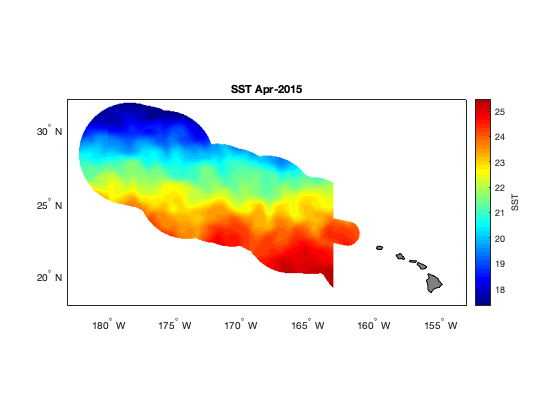

## Extract data within a shapefile using ERDDAP
This tutorial uses the Xtractomatic package to download data from within the boundaries of the Papahanaumokuakea Marine National Monument (PMNM).

**This tutorial will teach you how to extract and display SST values for a particular time period or average SST over the whole time-series available within a shapefile.**

The shapefile for the PMNM boundaries can be downloaded here: http://sanctuaries.noaa.gov/library/imast_gis.html.  Save the file https://sanctuaries.noaa.gov/library/imast/pmnm_py.zip on your computer and extract it.  It would be easiest for the purposes of this tutorial if you place the pmnm_py folder in the directory you're working in.  But, if you want to keep it elsewhere, you'll just need to edit the path name accordingly.

### Data extraction
We'll do this in two steps.  First, we'll download the satellite data for a footprint that's slightly larger than our area of interest.  Then, we'll clip these data to only those which fall within the Monument.  

#### Download satellite data of interest
```matlab
% As always, it's helpful it take a look at what we're working with: 
ncdisp('https://oceanwatch.pifsc.noaa.gov/erddap/griddap/goes-poes-monthly-ghrsst-RAN');
```matlab


We can see in the information above that longitude is in the 0 - 360 degree format.  And we know from reading the ReadMe file for the monument boundaries that the shapefile longitude is in the -180 - 180 degree format.  This means we need convert the shapefile longitudes to a 0 - 360 format for indexing puposes (the native format will plot just fine). 

```matlab
% Access the Lat and Lon coordinates
PMNM = shaperead('pmnm_py/PMNM_py_files/PMNM_py.shp','UseGeoCoords',true);

% Convert negative longitudes to positive values
neg_lon = find(PMNM.Lon < 0);
PMNM.Lon(neg_lon) = PMNM.Lon(neg_lon) + 360;
clear neg_lon

% Find the minimum and maximum lat and lon values, for using to download
% SST data
[Lon_min, Lon_max] = bounds(PMNM.Lon);
[Lat_min, Lat_max] = bounds(PMNM.Lat);

% Now we can follow the steps we used in the earlier tutorials to download
% the SST data
time_full = ncread('https://oceanwatch.pifsc.noaa.gov/erddap/griddap/goes-poes-monthly-ghrsst-RAN', ...
   'time');

% Convert this to [Y M D H M S]
time_full_ymdhms = datevec(time_full/86400 + datenum([1970 1 1 0 0 0])); 

% In this particular example, we're interested in March - November 2015
time_aoi = find(time_full_ymdhms(:,1) == 2015 & time_full_ymdhms(:,2) >= 3 & ...
    time_full_ymdhms(:,2) <= 11);
lat_full = ncread('https://oceanwatch.pifsc.noaa.gov/erddap/griddap/goes-poes-monthly-ghrsst-RAN', ...
    'latitude');
lon_full = ncread('https://oceanwatch.pifsc.noaa.gov/erddap/griddap/goes-poes-monthly-ghrsst-RAN', ...
    'longitude');

% Find longitudes that span our area of interest
% Rounding the minimum down and the maximum up
lon_aoi = find(lon_full >= floor(Lon_min) & lon_full <= ceil(Lon_max));
% Find latitudes that span our area of interest
% Rounding the minimum down and the maximum up
lat_aoi = find(lat_full >= floor(Lat_min) & lat_full <= ceil(Lat_max));
% Start coordinates
aoi_start = [lon_aoi(1) lat_aoi(1) time_aoi(1)];

% Coordinates to span
aoi_span = [length(lon_aoi) length(lat_aoi) length(time_aoi)];

% Download the data of interest
sst = ncread('https://oceanwatch.pifsc.noaa.gov/erddap/griddap/goes-poes-monthly-ghrsst-RAN', ...
    'analysed_sst', aoi_start, aoi_span);

% Area and time indices, in a format Matlab is expecting
lat = double(lat_full(lat_aoi));
lon = double(lon_full(lon_aoi));
time = time_full(time_aoi);
time_ymdhms = time_full_ymdhms(time_aoi,:); % Note that this variable has 6 columns, unlike the others

% Tidying up
clear *aoi* *full* *min *max
```

#### Clip the data to fit the Monument boundaries

Now we have everything we need to clip the SST data to just those within the boundaries of the Monument.  The code below borrows from the no-longer-supported xtractoMatlab: https://github.com/rmendels/xtractoMatlab. You can learn about other avenues to use this tool at: https://coastwatch.pfeg.noaa.gov/xtracto/. 

```matlab
% The general premise here is that we're going to create a mesh grid of our
% full domain (what we downloaded), identify all the points that are within
% or on the polygon that defines the Monument, and set to NaN those that
% are not.
% Make the meshgrid and the mask
[XLON, XLAT] = meshgrid(lon, lat);
[IN ON] = inpolygon(XLON, XLAT, PMNM.Lon, PMNM.Lat);
mask2D = IN | ON;

% Replicate it over the number of time steps, which is the third dimension
% of our sst variable
mask3D = permute(repmat(mask2D,[1 1 size(sst,3)]),[2 1 3]);

% Set to NaN all points not within the polygon
sst(~mask3D) = NaN;
```

### Plotting the data
The extracted data contains several time steps (months) of sst data in the monument boundaries.  Let's make a plot of the second time step.   Also, we can see above where we used 'ncdisp', that the units for these data are Kelvin.  Let's changes this to degrees Celsius when we make our map. 

```matlab
figure
axesm('mercator', 'MapLatLimit', [18 32], 'MapLonLimit', [177 207], 'MeridianLabel', 'on', ...
    'ParallelLabel', 'on', 'MLabelLocation', -180:5:-155, 'PLabelLocation', 20:5:30, ...
    'MLabelParallel', 'south'); % This is the basemap

% Plot SST for the second time step, in degrees C, with 50 contour levels
contourm(lat, lon, sst(:,:,2)'-273.15, 50, 'fill', 'on'); 

% Title the map
title(sprintf('SST %s', datestr(time_ymdhms(2,:), 'mmm-yyyy')));

% Set the color map to jet colors, with 50 levels
colormap(jet(50));

% Add a color bar and label it
c = colorbar;
c.Label.String = 'SST';

% Add land and color it grey
geoshow('landareas.shp', 'FaceColor', [0.5 0.5 0.5]);
tightmap
```

On your own!
Plot the average SST for the period we downloaded.  Here's a hint to get you started:
```matlab
sst_avg = mean(sst, 3, "omitnan");
```

