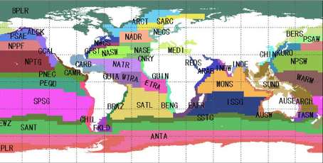

history | Updated August 2023    

```{r setup, include=FALSE, echo=FALSE}
knitr::opts_chunk$set(
  echo = TRUE,
  fig.path = "images/",
  warning = FALSE, message = FALSE
)
```

# Extract data within a boundary
> Update: August 2023  

## Background
One use for satellite observations is to supplement in situ sampling of geographical locations where the timespan, frequency measurements, spatial dimensions or remoteness of the locations, make physical sampling impossible or impractical. One drawback is that satellite data are often rectangular, whereas geographical locations can have irregular boundaries. Examples of boundaries include marine protected areas or marine physical, biological, and ecological divisions like the Longhurst Marine Provinces.  

## Objectives
In this tutorial we will learn how to download a timeseries of SST satellite data from an ERDDAP server, and then mask the data to retain only the data within an irregular geographical boundary (polygon). We will then plot a yearly seasonal cycle from within the boundary. 

## The tutorial demonstrates the following techniques
-   Downloading data from an ERDDAP data server for a non-rectangular region using the *rerddapXtracto* package
-   Visualizing data on a map
-   Plotting a time-series of mean SST 

## Datasets used
__NOAA Geo-polar Blended Analysis Sea-Surface Temperature, Global, Monthlyly, 5km, 2019-Present__    
The NOAA geo-polar blended SST is a high resolution satellite-based gap-free sea surface temperature (SST) product that combines SST data from US, Japanese and European geostationary infrared imagers, and low-earth orbiting infrared (U.S. and European) SST data, into a single product. We will use the monthly composite.
https://coastwatch.pfeg.noaa.gov/erddap/griddap/NOAA_DHW_monthly

__Longhurst Marine Provinces__  
The dataset represents the division of the world oceans into provinces as defined by Longhurst (1995; 1998; 2006). This division has been based on the prevailing role of physical forcing as a regulator of phytoplankton distribution. The Longhurst Marine Provinces dataset is available online (https://www.marineregions.org/downloads.php) and within the shapes folder associated with this repository. For this tutorial we will use the Gulf Stream province (ProvCode: GFST)  



## Install packages and load libraries
```{r install,message=FALSE,warning=FALSE}
pkges = installed.packages()[,"Package"]
# Function to check if pkgs are installed, install missing pkgs, and load
pkgTest <- function(x)
{
  if (!require(x,character.only = TRUE))
  {
    install.packages(x,dep=TRUE,repos='http://cran.us.r-project.org')
    if(!require(x,character.only = TRUE)) stop(x, " :Package not found")
  }
}

# create list of required packages
list.of.packages <- c("ncdf4", "rerddap","plotdap", "parsedate", 
                      "sp", "ggplot2", "RColorBrewer", "sf", 
                      "reshape2", "maps", "mapdata", 
                      "jsonlite", "rerddapXtracto")

# Run install and load function
for (pk in list.of.packages) {
  pkgTest(pk)
}

# create list of installed packages
pkges = installed.packages()[,"Package"]

```

## Load boundary coordinates 

The shapefile for the Longhurst marine provinces includes a list of regions.  For this exercise, we will only use the boundary of one province, the Gulf Stream region ("GFST"). 

```{r read province boundaries from shapefiles}

# Set directory path
dir_path <- '../resources/longhurst_v4_2010/'

# Import shape files (Longhurst coordinates)
shapes <- read_sf(dsn = dir_path, layer = "Longhurst_world_v4_2010")

# Example List of all the province names
shapes$ProvCode

# Get boundary coordinates for Gulf Stream region (GFST)
GFST <- shapes[shapes$ProvCode == "GFST",]

xcoord <- st_coordinates(GFST)[,1]
ycoord <- st_coordinates(GFST)[,2]

```

## Select the satellite dataset  

We will load the sea surface temperature data from the geo-polar blended SST satellite data product hosted on the CoastWatch ERDDAP. The dataset ID for this data product is **nesdisBLENDEDsstDNDaily**.

We will use the *info* function from the **rerddap** package to first obtain information about the dataset of interest, then we will import the data.

```{r dataInfo}

# Set ERDDAP URL
erd_url = "http://coastwatch.pfeg.noaa.gov/erddap/"

# Obtain data info using the erddap url and dataset ID
dataInfo <- rerddap::info('NOAA_DHW_monthly',url=erd_url)  

# Examine the metadata dataset info
dataInfo
```

## Set the options for the polygon data extract
Using the **rxtractogon** function, we will import the satellite data from erddap.
The **rxtractogon** function takes the variable(s) of interest and the coordinates as input. 

* For the coordinates: determine the range of x, y, z, and time.
* time coordinate: select the entire year of 2020

```{r options}
# set the parameter to extract
parameter <- 'sea_surface_temperature'
# set the time range
tcoord <- c("2020-01-16", "2020-12-16")

# We already extracted the xcoord (longitude) and ycoord (latitude) from the shapefiles 
# The dummy code below is just a placeholder indicating it is necessary to define what the longitude and latitude vectors are that make up the boundary of the polygon.
xcoord <- xcoord
ycoord <- ycoord
 
```
## Extract data and mask it using rxtractogon  
* the **rxtractogon** function automatically extracts data from the satellite dataset and masks out any data outside the polygon boundary.  
* List the data
```{r octogon}
## Request the data
satdata <- rxtractogon(dataInfo, parameter=parameter, xcoord=xcoord, ycoord=ycoord,tcoord=tcoord)

## List the returned data
str(satdata)
```


### Plot the data
* Use the plotBBox function in the **rerddapXtracto** package to quickly plot the data

```{r map}
plotBBox(satdata, plotColor = 'thermal',maxpixels=1000000)

```

### Plot the mean seasonal temperature for the province

```{r}
sst_mean=apply(satdata$sea_surface_temperature,3,mean,na.rm=TRUE)
```

```{r}
plot(satdata$time,sst_mean,main='Gulf Stream Province Monthly Mean Temperature 2020',ylab='SSt (ºC)',xlab='',type='b')
```


