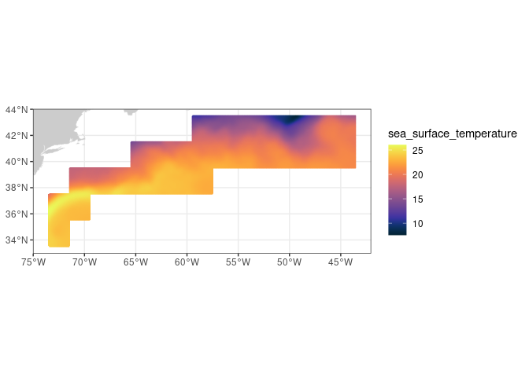

history \| Updated August 2023

# Extract data within a boundary

> Update: August 2023

## Background

One use for satellite observations is to supplement in situ sampling of
geographical locations where the timespan or frequency measurements, or
spatial dimensions or remoteness of the locations, make physical
sampling impossible or impractical. One drawback is that satellite data
are often rectangular, whereas geographical locations can have irregular
boundaries. Examples of boundaries include marine protected areas or
marine physical, biological, and ecological divisions like the Longhurst
Marine Provinces.

## Objectives

In this tutorial we will learn how to download a timeseries of SST
satellite data from an ERDDAP server, and then mask the data to retain
only the data within an irregular geographical boundary (polygon). We
will then plot a yearly seasonal cycle from within the boundary.

## The tutorial demonstrates the following techniques

- Downloading data from an ERDDAP data server
- Visualizing data on a map
- Masking satellite data using a shape file

## Datasets used

**NOAA Geo-polar Blended Analysis Sea-Surface Temperature, Global,
Daily, 5km, 2019-Present**  
The NOAA geo-polar blended SST is a high resolution satellite-based
gap-free sea surface temperature (SST) product that combines SST data
from US, Japanese and European geostationary infrared imagers, and
low-earth orbiting infrared (U.S. and European) SST data, into a single
product.  
<https://coastwatch.pfeg.noaa.gov/erddap/griddap/NOAA_DHW_monthly>

**Longhurst Marine Provinces**  
The dataset represents the division of the world oceans into provinces
as defined by Longhurst (1995; 1998; 2006). This division has been based
on the prevailing role of physical forcing as a regulator of
phytoplankton distribution. The Longhurst Marine Provinces dataset is
available online (<https://www.marineregions.org/downloads.php>) and
within the shapes folder associated with this repository. For this
tutorial we will use the Gulf Stream province (ProvCode: GFST)


## Install packages and load libraries

``` r
pkges = installed.packages()[,"Package"]
# Function to check if pkgs are installed, install missing pkgs, and load
pkgTest <- function(x)
{
  if (!require(x,character.only = TRUE))
  {
    install.packages(x,dep=TRUE,repos='http://cran.us.r-project.org')
    if(!require(x,character.only = TRUE)) stop(x, " :Package not found")
  }
}

# create list of required packages
list.of.packages <- c("ncdf4", "rerddap","plotdap", "parsedate", 
                      "sp", "ggplot2", "RColorBrewer", "sf", 
                      "reshape2", "maps", "mapdata", 
                      "jsonlite", "rerddapXtracto")

# Run install and load function
for (pk in list.of.packages) {
  pkgTest(pk)
}

# create list of installed packages
pkges = installed.packages()[,"Package"]
```

## Load boundary coordinates

The shapefile for the Longhurst marine provinces includes a list of
regions. For this exercise, we will only use the boundary of one
province, the Gulf Stream region (“GFST”).

``` r
# Set directory path
dir_path <- '../resources/longhurst_v4_2010/'

# Import shape files (Longhurst coordinates)
shapes <- read_sf(dsn = dir_path, layer = "Longhurst_world_v4_2010")

# Example List of all the province names
shapes$ProvCode
```

    ##  [1] "BPLR" "ARCT" "SARC" "NADR" "GFST" "NASW" "NATR" "WTRA" "ETRA" "SATL"
    ## [11] "NECS" "CNRY" "GUIN" "GUIA" "NWCS" "MEDI" "CARB" "NASE" "BRAZ" "FKLD"
    ## [21] "BENG" "MONS" "ISSG" "EAFR" "REDS" "ARAB" "INDE" "INDW" "AUSW" "BERS"
    ## [31] "PSAE" "PSAW" "KURO" "NPPF" "NPSW" "TASM" "SPSG" "NPTG" "PNEC" "PEQD"
    ## [41] "WARM" "ARCH" "ALSK" "CCAL" "CAMR" "CHIL" "CHIN" "SUND" "AUSE" "NEWZ"
    ## [51] "SSTC" "SANT" "ANTA" "APLR"

``` r
# Get boundary coordinates for Gulf Stream region (GFST)
GFST <- shapes[shapes$ProvCode == "GFST",]

xcoord <- st_coordinates(GFST)[,1]
ycoord <- st_coordinates(GFST)[,2]
```

## Select the satellite dataset

We will load the sea surface temperature data from the geo-polar blended
SST satellite data product hosted on the CoastWatch ERDDAP. The dataset
ID for this data product is **nesdisBLENDEDsstDNDaily**.

We will use the *info* function from the **rerddap** package first
obtains information about the dataset of interest, then we will import
the data.

``` r
# Set ERDDAP URL
erd_url = "http://coastwatch.pfeg.noaa.gov/erddap/"

# Obtain data info using the erddap url and dataset ID
dataInfo <- rerddap::info('nesdisBLENDEDsstDNDaily',url=erd_url)  

# Examine the metadata dataset info
dataInfo
```

    ## <ERDDAP info> nesdisBLENDEDsstDNDaily 
    ##  Base URL: http://coastwatch.pfeg.noaa.gov/erddap 
    ##  Dataset Type: griddap 
    ##  Dimensions (range):  
    ##      time: (2019-07-22T12:00:00Z, 2023-09-03T12:00:00Z) 
    ##      latitude: (-89.975, 89.975) 
    ##      longitude: (-179.975, 179.975) 
    ##  Variables:  
    ##      analysed_sst: 
    ##          Units: degree_C 
    ##      analysis_error: 
    ##          Units: degree_C 
    ##      mask: 
    ##      sea_ice_fraction: 
    ##          Units: 1

## Set the options for the polygon data extract

Using **rxtractogon** function, we will import the satellite data from
erddap. The **rxtractogon** function takes the variable(s) of interest
and the coordinates as input.

- For the coordinates: determine the range of x, y, z, and time.
- time coordinate: The time variable passed to xtractogon must contain
  two elements, the start and end points of the desired time period.
  This example uses ERDDAP’s **last** option to retrieve data from the
  most recent time step. The **last** option also accepts the minus
  **-** operator. To request the time step with the second most recent
  data use “last-1”. In the script below the time variable (tcoord) is
  defined as **tcoord \<- c(“last-5”, “last”)**

``` r
# set the parameter to extract
parameter <- 'analysed_sst'
# set the time range
tcoord <- c("last-5", "last-1")

# We already extracted the xcoord (longitude) and ycoord (latitude) from the shapefiles 
# The dummy code below is just a placeholder indicating it is necessary to define what the longitude and latitude vectors are that make up the boundary of the polygon.
xcoord <- xcoord
ycoord <- ycoord
```

## Extract data and mask it using rxtractogon

- the **rxtractogon** function automatically extracts data from the
  satellite dataset and masks out any data outside the polygon
  boundary.  
- List the data

``` r
## Request the data
satdata <- rxtractogon(dataInfo, parameter=parameter, xcoord=xcoord, ycoord=ycoord,tcoord=tcoord)

## List the returned data
str(satdata)
```

    ## List of 6
    ##  $ analysed_sst: num [1:600, 1:201, 1:5] 28.6 28.6 28.6 28.7 28.7 ...
    ##  $ datasetname : chr "nesdisBLENDEDsstDNDaily"
    ##  $ longitude   : num [1:600(1d)] -73.5 -73.4 -73.4 -73.3 -73.3 ...
    ##  $ latitude    : num [1:201(1d)] 33.5 33.6 33.6 33.7 33.7 ...
    ##  $ altitude    : logi NA
    ##  $ time        : POSIXlt[1:5], format: "2023-08-29 12:00:00" "2023-08-30 12:00:00" ...
    ##  - attr(*, "class")= chr [1:2] "list" "rxtracto3D"

### Plot the data

- Use the plotBBox function in the **rerddapXtracto** package to quickly
  plot the data

``` r
plotBBox(satdata, plotColor = 'thermal',maxpixels=1000000)
```

<!-- -->
