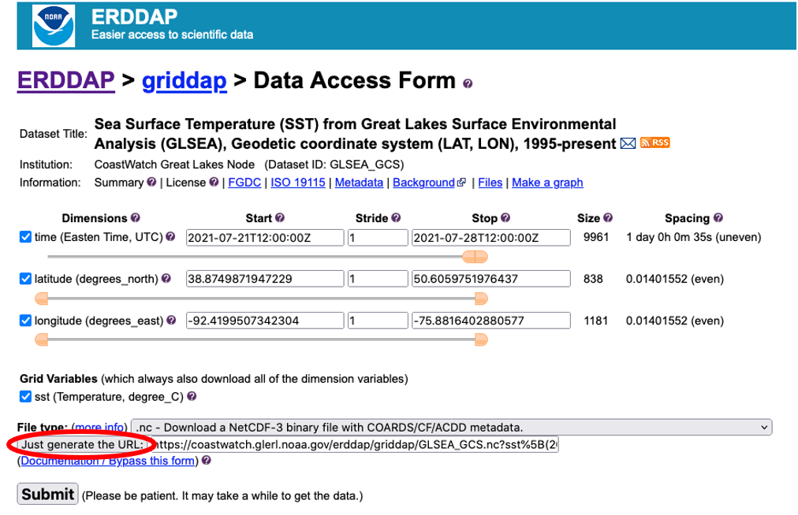
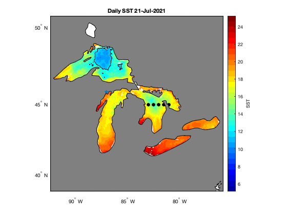
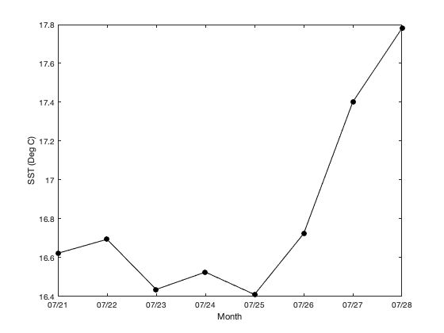
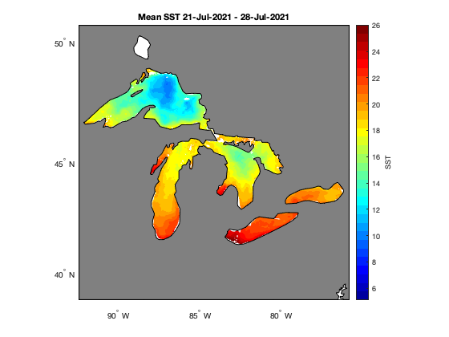

## How to work with satellite data in Matlab

This tutorial will show the steps to grab data in ERDDAP from Matlab, how to work with NetCDF files in Matlab, and how to make some maps and time-series of sea surface temperature (SST) around the main Hawaiian islands.

_Note: The mapping code in this tutorial uses the Mapping Toolbox.  If you don't have access to the Mapping Toolbox, you can still create things like filled contour plots of your data using 'contourf' or an open source package like M_map (https://www.eoas.ubc.ca/~rich/map.html) or the Climate Data Toolbox for Matlab (https://github.com/chadagreene/CDT)._

### Downloading data in Matlab
Because ERDDAP includes RESTful services, you can download data listed on any ERDDAP platform from Matlab using the URL structure.  For example, the following page allows you to subset daily SST data: 

https://coastwatch.glerl.noaa.gov/erddap/griddap/GLSEA_GCS.html 

Select your region and date range of interest, then select the '.nc' (NetCDF) file type and click on **"Just Generate the URL"**.



In this specific example, the URL we generated is:

`https://coastwatch.glerl.noaa.gov/erddap/griddap/GLSEA_GCS.nc?sst%5B(2021-07-21T12:00:00Z):1:(2021-07-28T12:00:00Z)%5D%5B(38.8749871947229):1:(50.6059751976437)%5D%5B(-92.4199507342304):1:(-75.8816402880577)%5D`

You can also edit this URL manually. 

### Importing the data in Matlab
In Matlab, run the following code to view details about the data using a portion of the generated URL:
```matlab
% View data attributes and variables
ncdisp('https://coastwatch.glerl.noaa.gov/erddap/griddap/GLSEA_GCS');
```

Notice that the full data set has four variables: time, latitude, longitude, and sst.  Rather than downloading all these data, which would be very slow, we'll use this information to access just the data we're interested in.  Note: this tutorial uses NetCDF files, but ERDDAP also allows you to download your data of interest as a MATLAB binary file (.mat).  A number of other data format options are avalable in the 'File type' drop down shown above.

#### Time
Notice in the output above that the units for time are 'seconds since 1970-01-01T00:00:00Z'.  We can convert this into something that's easier for us to work with.  Matlab will convert this type of time to a friendly format using the 'datevec' function.  But, Matlab does this assuming that the number you give it represents the number of days since January 0, 0000.  We'll get around these differences using the code below to align the two different ways of keeping time by:

1. Converting 'seconds since...' to 'days since...' by dividing the output time by 86400 (60 seconds in a minute x 60 minutes in an hour x 24 hours in a day). 

2. Adding the time between Jan 0, 0000 and 1970-01-01 using the 'datenum' fuction.  'datenum' does the opposite of 'datevec'.  It converts time in [Y M D H M S] to days since January 0, 0000.

And then we'll convert the time to a friendly [Y M D H M S] format using the 'datevec' function.

```matlab
% Read the time indices, in their native units (seconds since
% 1970-01-01T00:00:00Z')
time_full = ncread('https://coastwatch.glerl.noaa.gov/erddap/griddap/GLSEA_GCS', 'time');

% Convert this to [Y M D H M S]
time_full_ymdhms = datevec(time_full/86400 + datenum([1970 1 1 0 0 0])); 
```

Now we have an easy-to-use time index ('time_ymdhms') so we can access just the week we're interested in: 21 - 28 July 2021.

```matlab
% Find 2018 (aoi = area of interest)
time_aoi = find(time_full_ymdhms(:,1) == 2021 & time_full_ymdhms(:,2) == 7 ...
    & time_full_ymdhms(:,3) >= 21 & time_full_ymdhms(:,3) <= 28);
```

#### Latitude and Longitude

Before we can create a map, we also need to create indices for latitude and longitude.  The output above shows us that the units for these are 'degrees_north' and 'degrees_east', repectively.  

```matlab
lat = ncread('https://coastwatch.glerl.noaa.gov/erddap/griddap/GLSEA_GCS', 'latitude');
lon = ncread('https://coastwatch.glerl.noaa.gov/erddap/griddap/GLSEA_GCS', 'longitude');
```

Notice in the output above that sst has the dimensions of longitude x latitude x time which means it has a size of 1181 x 838 x 9961. 

#### Sea Surface Temperature
Now, we'll access just the small amount of sst data we're interested in.  We'll do this by telling the computer to access the variable 'sst', beginning at a specific time and spanning our time of interest. 

```matlab
% Start coordinates
aoi_start = [1 1 time_aoi(1)];

% Coordinates to span
aoi_span = [length(lon) length(lat) length(time_aoi)];
sst = ncread('https://coastwatch.glerl.noaa.gov/erddap/griddap/GLSEA_GCS', 'sst', aoi_start, aoi_span);
```

Notice that our workspace now has a sst variable that's sized 1181 x 838 x 8.  Before we see what these data look like, let's create indices for the timespan of data we downloaded and then tidy up our workspace.  We'll need the indices when we plot the data.

```matlab
% Area and time indices, in a format Matlab is expecting
time = time_full(time_aoi);
time_ymdhms = time_full_ymdhms(time_aoi,:); % Note that this variable has 6 columns, unlike the others

% Tidying up
clear *aoi*  % Delete every variable with 'aoi' in its name
```

### Working with the extracted data 
Let's create a map for a single day, 21 July 2021, the first day in the time span we downloaded.

```matlab
figure
axesm('mercator', 'MapLatLimit', [38.8 50.7], 'MapLonLimit', [-92.4 -75.8], 'MeridianLabel', 'on', ...
    'ParallelLabel', 'on', 'MLabelLocation', -90:5:-80, 'PLabelLocation', 40:5:50, ...
    'MLabelParallel', 'south');
contourm(lat, lon, sst(:,:,1)', 10:0.5:25.5, 'fill', 'on');
title(sprintf('Daily SST %s', datestr(time_ymdhms(1,:), 'dd-mmm-yyyy')));
% Set the color map to jet colors, with 100 levels
colormap(jet(32));

% Add a color bar and label it
c = colorbar;
c.Label.String = 'SST';

% Example of how to mark points on the map
plotm(repelem(45,5), -83:0.5:-81, 'ko', 'MarkerFaceColor', 'k');

% Example of how to add a specific contour, here 15
contourm(lat, lon, sst(:,:,1)', [15 15], 'k');

% Add land and color it grey
geoshow('landareas.shp', 'FaceColor', [0.5 0.5 0.5]);

% Example of how to add a marker to tutorial author's home town, just for
% fun
plotm(45.8527, -87.0218, 'p');
tightmap % This removes an additional frame around the map that can interfere with the labeling
```


### Plotting a Time Series

Let's pick a box encompassing Lake Superior: north of 46N and west of 84W.  We are going to generate a time series of mean SST within that box. To do this, we'll use the same strategy we used above for time to identify a subsetted area of interest.

```matlab
% Find longitudes west of 84 W
lon_aoi = find(lon <= -84);

% Find latitudes north of 46 N
lat_aoi = find(lat >= 46);

% Subset our new area of interest
sst_subset = sst(lon_aoi, lat_aoi,:);

% Average over the area for each of the 8 days
sst_ts(1:8,1) = NaN;
for d = 1:1:8 
    sst_ts(d,1) = mean(sst_subset(:,:,d), "all", "omitnan");
end

% Plot
figure
plot(time_ymdhms(:,3), sst_ts, 'k-o', 'MarkerFaceColor', 'k');
xlabel('Month');
ylabel('SST (Deg C)');
set(gca, 'XTick', time_ymdhms(:,3));
set(gca, 'XTickLabel', datestr(time_ymdhms(:,:), 'mm/dd'))
```


### Creating a map of average SST over a year
We can also create a map of SST averaged of our full time period of interest.  Let's go back to using the full area we downloaded, too.

```matlab
% Average over time, which is the third dimention of our data
sst_wk = mean(sst, 3, "omitnan");
figure
axesm('mercator', 'MapLatLimit', [38.8 50.7], 'MapLonLimit', [-92.4 -75.8], 'MeridianLabel', 'on', ...
    'ParallelLabel', 'on', 'MLabelLocation', -90:5:-80, 'PLabelLocation', 40:5:50, ...
    'MLabelParallel', 'south');
contourm(lat, lon, sst_wk', 10:0.5:25.5, 'fill', 'on');
title([sprintf('Mean SST %s', datestr(time_ymdhms(1,:),'dd-mmm-yyyy')) ...
    sprintf(' - %s', datestr(time_ymdhms(8,:),'dd-mmm-yyyy'))]);

% Set the color map to jet colors, with 100 levels
colormap(jet(32));

% Add a color bar and label it
c = colorbar;
c.Label.String = 'SST';

% Add land and color it grey
geoshow('landareas.shp', 'FaceColor', [0.5 0.5 0.5]);
tightmap
```

