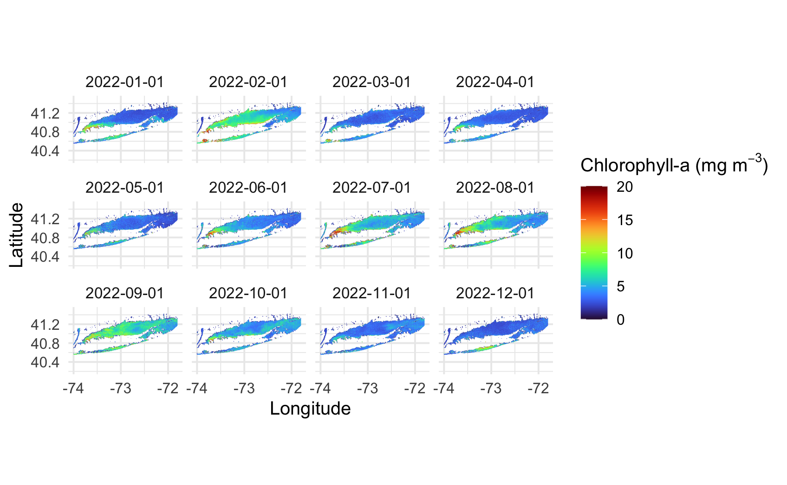
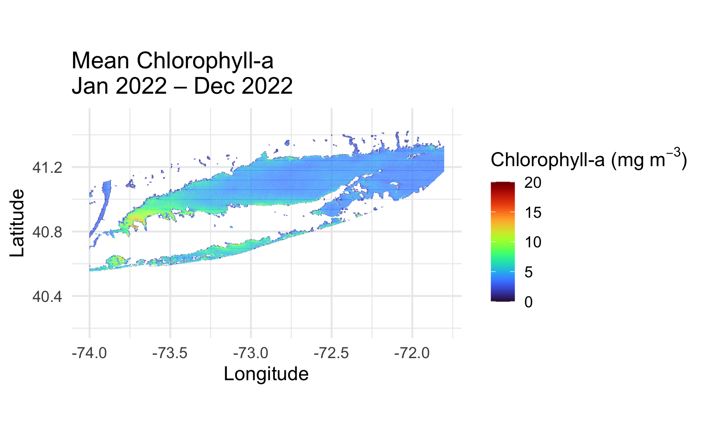
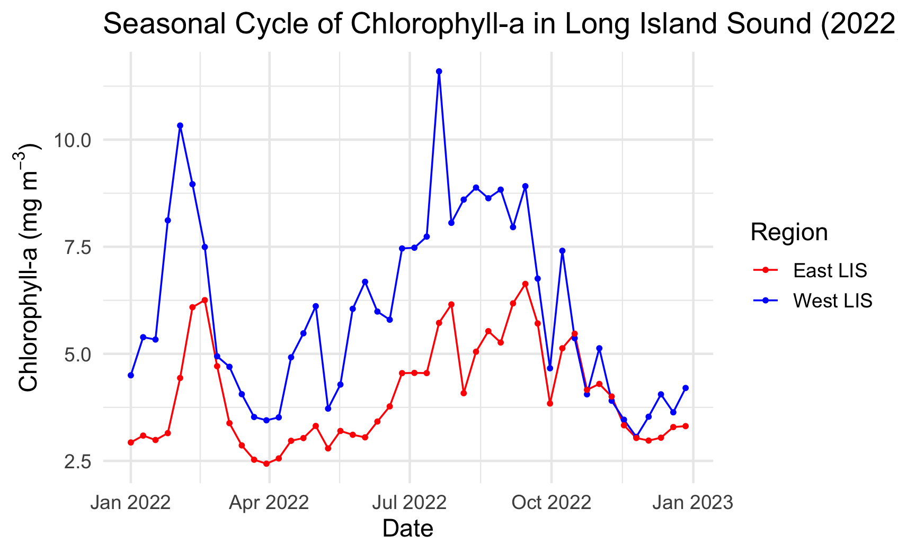

History \| Updated Apr 2025

# Long Island Sound Chlorophyll-a Dynamics Tutorial

> Update: Apr 2025

## Objective

This tutorial will show the steps to grab daily chlorophyll-a data hosted on an ERDDAP server using the `griddap` function in the `rerrdap` package, how to make temporal composites in R and how to make some maps and time-series of chlorophyll-a.

## The tutorial demonstrates the following techniques:

-   Accessing gridded satellite data from an ERDDAP server using the `rerddap` package.
-   Subsetting spatial and temporal data using latitude, longitude, and date ranges.
-   Converting gridded data to tidy format for analysis using `dplyr` and `lubridate`.
-   Calculating monthly and annual spatial averages of chlorophyll-a concentrations.
-   Creating faceted maps of monthly chlorophyll-a using `ggplot2` and `viridis` color scales.
-   Creating an 8-day time series to analyze seasonal chlorophyll-a patterns.
-   Comparing chlorophyll-a seasonal cycles between regions (West vs. East Long Island Sound).

## Datasets used

**Long Island Sound Optimized water quailty datasets from OLCI** Products developed by academic collaborators that have partnered with NOAA CoastWatch through a Sea Grant project titled “Actionable satellite water-quality data products in Long Island Sound for improved management and societal benefits”. The dataset includes daily Sentinal-3 OLCI (300 m) water quality indicators:

-   Chlorophyll-a (Chla “chlor_a”)
-   Absorption coefficient of Chromophoric Dissolved Organic Material at 300 nm (aCDOM(300) “cdom”)
-   Dissolved Organic Carbon (DOC “doc”)
-   Suspended Particulate Matter (SPM “spm”). Chlor_a, cdom and doc are based on Long Island Sound optimized algorithms. Spm retrieved using the Nechad Algorithm.

This dataset covers the Long Island Sound region between 40.2° N - 41.5° N and 74° W - 71.8° W

In this tutorial we will use the daily Chlorophyll-a dataset. The data will be downloaded from the CoastWatch ERRDAP server: <https://coastwatch.noaa.gov/erddap/griddap/noaacwappsS3ABcolorLISDaily.html>

For more information on each product refer to:

-   Chla: <https://www.sciencedirect.com/science/article/pii/S1569843223000456>
-   CDOM and DOC: <https://agupubs.onlinelibrary.wiley.com/doi/abs/10.1029/2023JG007767>
-   SPM: <https://www.sciencedirect.com/science/article/abs/pii/S0034425709003617>

## Install and load packages

```{r}
pkgTest <- function(x)
{
  if (!require(x,character.only = TRUE))
  {
    install.packages(x,dep=TRUE,repos='http://cran.us.r-project.org')
    if(!require(x,character.only = TRUE)) stop(x, " :Package not found")
  }
}

# Create list of required packages
list.of.packages <- c("rerddap", "tidyverse", "lubridate", "viridis", "ggplot2")

# Create list of installed packages
pkges = installed.packages()[,"Package"]

# Install and load all required pkgs
for (pk in list.of.packages) {
  pkgTest(pk)
}

```

## Select the satellite dataset

We will load the daily Chlorophyll-a dataset from the CoastWatch ERDDAP server. The dataset ID is **noaacwappsS3ABcolorLISDaily**.

We will use the `info` function from the `rerddap` package to first obtain information about the dataset of interest, then we will import the data.

```{r}
# Set the ERDDAP URL
erddap_url <- "https://coastwatch.noaa.gov/erddap"

# Set the dataset ID
dataset_id <- "noaacwappsS3ABcolorLISDaily"

# Obtain data info using the erddap url and dataset ID
dataInfo <- rerddap::info(dataset_id,url=erddap_url)  

# Examine the metadata dataset info
dataInfo

```

```{r}
## <ERDDAP info> noaacwappsS3ABcolorLISDaily 
## Base URL: https://coastwatch.noaa.gov/erddap 
## Dataset Type: griddap 
## Dimensions (range):  
##     time: (2017-01-01T00:00:00Z, 2025-02-28T00:00:00Z) 
##     latitude: (40.204, 41.5) 
##     longitude: (-74.0, -71.8049) 
## Variables:  
##     cdom: 
##         Units: m^-1 
##     chlor_a: 
##         Units: mg m^-3 
##     doc: 
##         Units: µmole/liter 
##     spm: 
##         Units: mg L^-1 
```

## Subset the data

For this tutorial, we will be focusing on chloropyhll-a throughout 2022 in the Long Island Sound Range.

```{r}
# Set the time range
time_range <- c("2022-01-01", "2022-12-31")

# Set the ranges for latitude and longitude
lat_range <- c(40.204, 41.5)
lon_range <- c(-74.0, -71.8049)

# Set the parameter
parameter <- 'chlor_a'

```

## Extract the dataset

```{r}
# Download the chlorophyll-a data
chlor_data <- griddap(
  datasetx = dataset_id,
  url = erddap_url,
  time = time_range,
  latitude = lat_range,       
  longitude = lon_range,
  fields = parameter
)

# View the data
head(chlor_data)

```

## Convert to a tibble and add date/month columns

Converting to a tibble makes the dataset tidy-verse friendly, so we can manipulate the data without headaches.

```{r}
# Convert to tibble and add date/month columns
df <- chlor_data$data %>%
  as_tibble() %>%
  mutate(
    time = as.Date(time),
    month = floor_date(time, "month")
  )

# View the data
print(df)
```

## Calculate monthly mean chlorophyll-a

We group the data by month, latitude, and longitude and compute the average chlorophyll-a for each pixel for each month. We also remove any missing values.

```{r}
# Calculate monthly mean chlor_a
monthly_mean <- df %>%
  group_by(month, latitude, longitude) %>%
  summarise(chlor_a = mean(chlor_a, na.rm = TRUE), .groups = "drop")

# View the data
print(monthly_mean)

```

## List the dates for each time step after calculating the monthly means

The dataset now has 12 time steps, one for each month between January 2022 and December 2022.

```{r}
unique(monthly_mean$month)

```

```{r}
##[1] "2022-01-01" "2022-02-01" "2022-03-01" "2022-04-01" "2022-05-01" "2022-06-01" 
##"2022-07-01" "2022-08-01" "2022-09-01" "2022-10-01" "2022-11-01"
##[12] "2022-12-01"
```

## Create a faceted plot of monthly mean chlorophyll-a for 2022

Using `ggplot`, we create a faceted spatial plot of chlorophyll-a with tiles colored by value, and one map per month of 2022.

`facet_wrap` tells ggplot to split the plot in 12 facets (one for each month) and **ncol = 4** puts the 12 plots into 3 rows and 4 columns.

```{r}
ggplot(monthly_mean, aes(x = longitude, y = latitude, fill = chlor_a)) +
  geom_tile() +
  scale_fill_viridis(
    name = bquote("Chlorophyll-a (mg "*m^{-3}*")"),
    option = "turbo",
    limits = c(0, 20),
    na.value = "transparent"
  ) +
  scale_x_continuous(
    breaks = c(-74, -73, -72),
    labels = c("-74", "-73", "-72")
  ) +
  coord_equal() +
  facet_wrap(~format(month, "%Y-%m-%d"), ncol = 4) +
  labs(x = "Longitude", y = "Latitude") +
  theme_minimal(base_size = 12) +
  theme(strip.text = element_text(size = 10))

```



## Compute the annual average for the region

Calculate the annual average chlorophyll-a at each pixel by grouping the monthly data by latitude and longitude, then taking the mean across all months. We also remove any missing values.

```{r}
yearly_mean <- monthly_mean %>%
  group_by(latitude, longitude) %>%
  summarise(chlor_a = mean(chlor_a, na.rm = TRUE), .groups = "drop")

```

## Plot the map of the 2022 average chlorophyll-a in the region

```{r}
ggplot(yearly_mean, aes(x = longitude, y = latitude, fill = chlor_a)) +
  geom_tile() +
  scale_fill_viridis(
    name = bquote("Chlorophyll-a (mg "*m^{-3}*")"),
    option = "turbo",
    limits = c(0, 20),
    na.value = "transparent"
  ) +
  coord_equal() +
  labs(
    title = "Mean Chlorophyll-a\nJan 2022 – Dec 2022",
    x = "Longitude", y = "Latitude"
  ) +
  theme_minimal(base_size = 14)

```



## Spatial Subset and Time Series Comparing Chlorophyll-a Seasonal Cycles in Western and Eastern Long Island Sound

Subset the data

-   West Long Island Sound between -73.9° to -73.1° W longitude
-   East Long Island Sound between -72.9° to -71.8° W longitude

We are going to generate a time series of mean chlorophyll-a within each box.

```{r}
# Subset West Long Island
west_df <- df %>%
  filter(longitude >= -73.9, longitude <= -73.1)

# Subset East Long Island
east_df <- df %>%
  filter(longitude >= -72.9, longitude <= -71.8)

```

## Examine the structure of the subsetted data

```{r}
str(west_df)

str(east_df)
```

## Resample each subset to 8-day means

```{r}
# Resample west_df
west_df <- west_df %>%
  mutate(
    period = as.Date("2022-01-01") +
      floor(as.numeric(difftime(time, as.Date("2022-01-01"), units = "days")) / 8) * 8
  )

# Resample east_df
east_df <- east_df %>%
  mutate(
    period = as.Date("2022-01-01") +
      floor(as.numeric(difftime(time, as.Date("2022-01-01"), units = "days")) / 8) * 8
  )

```

## Compute a time series

Now, we will average all data within each subset across the latitude and longitude dimensions to produce a single time series.

```{r}
west_ts <- west_df %>%
  group_by(period) %>%
  summarise(chlor_a = mean(chlor_a, na.rm = TRUE), .groups = "drop") %>%
  mutate(region = "West LIS")

east_ts <- east_df %>%
  group_by(period) %>%
  summarise(chlor_a = mean(chlor_a, na.rm = TRUE), .groups = "drop") %>%
  mutate(region = "East LIS")


```

## Plot the time series

```{r}
# Combine for plotting
ts_combined <- bind_rows(west_ts, east_ts)

# Plot the time series
ggplot(ts_combined, aes(x = period, y = chlor_a, color = region)) +
  geom_line() +
  geom_point(size = 1) +
  scale_color_manual(values = c("West LIS" = "blue", "East LIS" = "red")) +
  labs(
    title = "Seasonal Cycle of Chlorophyll-a in Long Island Sound (2022)",
    x = "Date",
    y = bquote("Chlorophyll-a (mg "*m^{-3}*")"),
    color = "Region"
  ) +
  theme_minimal(base_size = 14)

```


