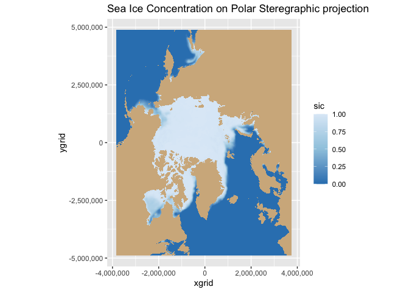
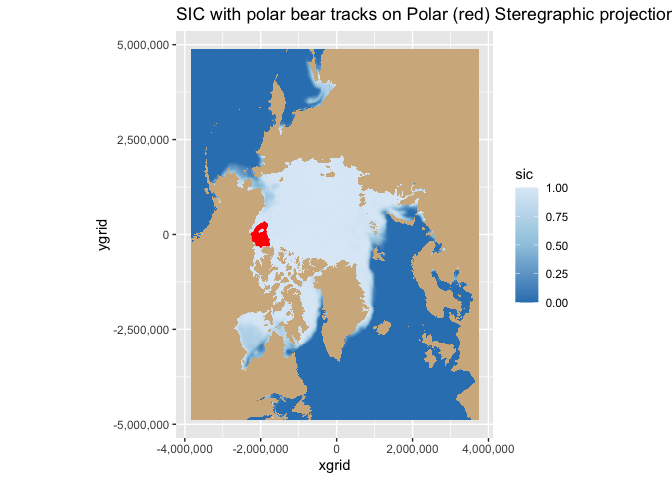

# Virtual Buoy example

> history | Updated September 2023  

<a href="https://polarwatch.noaa.gov/" target="_blank">NOAA
PolarWatch</a> distributes gridded and tabular oceanographic data for
polar regions. Satellite data include geospatial information and most of
them are in geographical coordinates (latitude and longitude).
PolarWatch satellite data are often projected using
<a href="https://nsidc.org/data/user-resources/help-center/guide-nsidcs-polar-stereographic-projection" target="_blank">Polar
Stereographic Projections</a> in x and y coordinates.

## Objective

This tutorial will demonstrate how to plot a polar stereographic
projected data on a projected map, and to add another dataset with
geographical coordinates (latitude and longitude) onto the map.

## The tutorial demonstrates the following techniques

-   Accessing satellite data from ERDDAP
-   Making a projected map
-   Adding projected data
-   Adding geographical data

## Datasets used

**Sea Ice Concentration, NOAA/NSIDC Climate Data Record V4, Northern
Hemisphere, 25km, Science Quality, 1978-Present, Monthly**  
This dataset includes sea ice concentration data from the northern
hemisphere, and is produced by the NOAA/NSIDC using the Climate Data
Record algorithm. The resolution is 25km, meaning each grid in this data
set represents a value that covers a 25km by 25km area. The dataset is
avaialble from
<a href="https://polarwatch.noaa.gov/catalog/ice-sq-nh-nsidc-cdr-v4/preview/?dataset=daily&var=cdr_seaice_conc&time_min=2022-12-31T00:00:00Z&time_max=2022-12-31T00:00:00Z&proj=epsg3413&colorBar=KT_ice|||0|1|">the
NOAA PolarWatch Catalog</a>.

**Polar bear tracking data**   For the demonstrative purpose of
adding a dataset in geographical coords (lat, lon) to the projected map,
GPS data for a polar bear track were used. More information about the
data can be found at
<https://borealisdata.ca/file.xhtml?fileId=151017&version=1.0>

**R Packages**

-   ncdf4 (reading data and metadata in netCDF format)
-   ggplot2, RColorBrewer, scales (mapping)
-   reshape2 (data manipulation)
-   rgdal (projection)

### Install required packages

    # Function to check if pkgs are installed, install missing pkgs, and load
    pkgTest <- function(x)
    {
      if (!require(x,character.only = TRUE))
      {
        install.packages(x,dep=TRUE,repos='http://cran.us.r-project.org')
        if(!require(x,character.only = TRUE)) stop(x, " :Package not found")
      }
    }

    list.of.packages <- c("rgdal","sp", "ggplot2" ,"ncdf4",  "RColorBrewer", "scales", "reshape2")

    # create list of installed packages
    pkges = installed.packages()[,"Package"]
    for (pk in list.of.packages) {
      pkgTest(pk)
    }

    # download the sea ice data NetCDF file
    seaice_url <- "https://polarwatch.noaa.gov/erddap/griddap/nsidcG02202v4nhmday.nc?cdr_seaice_conc_monthly[(2022-12-01T00:00:00Z):1:(2022-12-01T00:00:00Z)][(4851137.11):1:(-4850758.92)][(-3850000.0):1:(3750000.0)]"
    sea_ice_data_nc <- download.file(seaice_url, destfile="../data/sea_ice_data.nc", mode='wb')

    # file open
    seaice <- nc_open('../data/sea_ice_data.nc')

    # print metadata
    #print(seaice)

    # get data into r variables 
    xgrid <- ncvar_get(seaice, "xgrid")
    ygrid <- ncvar_get(seaice, "ygrid")
    sic <- ncvar_get(seaice, "cdr_seaice_conc_monthly")  #lat and lon
    fillvalue <- ncatt_get(seaice, "cdr_seaice_conc_monthly", "_FillValue") #checkout fill value for missing data points

    # close 
    nc_close(seaice)

    # create dataframe
    sicd <- expand.grid(xgrid=xgrid, ygrid=ygrid)
    sicd$sic <- array(sic, dim(xgrid)*dim(ygrid))

    # exclude fillvalue
    sicd$sic[sicd$sic > 2] <- NA 

    # map sea ice concentration
    ggplot(data = sicd, aes(x = xgrid, y = ygrid, fill=sic) ) + 
           geom_tile() + 
           coord_fixed(ratio = 1) + 
           scale_y_continuous(labels=comma) + 
           scale_x_continuous(labels=comma) +
           scale_fill_gradientn(colours=rev(brewer.pal(n = 3, name = "Blues")),na.value="tan") +
          ggtitle("Sea Ice Concentration on Polar Steregraphic projection")

 \### Adding Polar bear track data onto
the polar stereographic projection

    # read csv polar bear track data 
    polartrack <- read.csv("../data/PB_Argos.csv")
    polarB <- polartrack[polartrack$QualClass=="B",]

    # specify coordinate columns
    coordinates(polarB) <- c("Lon", "Lat")

    # set data crs to 4326
    proj4string(polarB) <-CRS("+init=epsg:4326")

    # transform the data crs from EPSG:4326 to EPSG: 3413
    polar.3413 <- spTransform(polarB, CRS("+init=epsg:3413"))

    # for ggplot, convert spatial data to data.frame
    polar.3413.df<-data.frame(polar.3413)
    names(polar.3413.df)[names(polar.3413.df)=="Lon"]<-"x"
    names(polar.3413.df)[names(polar.3413.df)=="Lat"]<-"y"

## Combine the sea ice concentration data and the polar bear tracking data

    ggplot(data = sicd, aes(x = xgrid, y = ygrid) ) + 
            geom_tile(aes(fill=sic)) + 
           coord_fixed(ratio = 1) + 
           scale_y_continuous(labels = comma) + 
           scale_x_continuous(labels = comma) +
           scale_fill_gradientn(colours=rev(brewer.pal(n = 3, name = "Blues")),na.value="tan")+
           ggtitle("SIC with polar bear tracks on Polar (red) Steregraphic projection")+
          geom_point(data=polar.3413.df, aes(x=x, y=y), color="red", size=0.5)

## References

-   <a href="https://nsidc.org/data/g02202/versions/4" target="_blank">NSIDC
    Data Product Description</a>
-   <a href="https://nsidc.org/sites/default/files/g02202-v004-userguide_1_1.pdf" target="_blank">NSIDC
    Data Product User Guide (pdf)</a>
-   <a href="https://polarwatch.noaa.gov/catalog/ice-sq-nh-nsidc-cdr-v4/preview/?dataset=daily&var=cdr_seaice_conc&time_min=2022-05-31T00:00:00Z&time_max=2022-05-31T00:00:00Z&proj=epsg3413&colorBar=KT_ice|||0|1|" target="_blank">NOAA
    PolarWatch Data Product Page (download, preview)</a>
