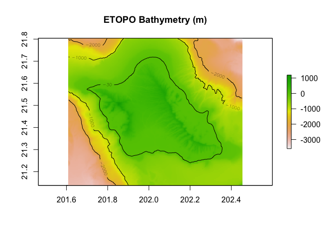
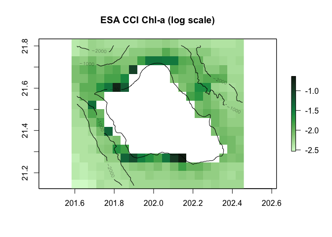
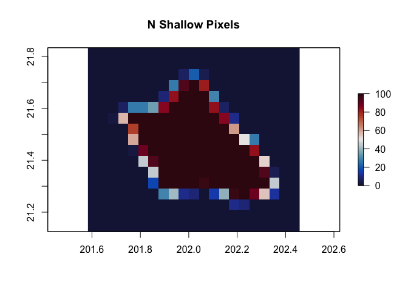
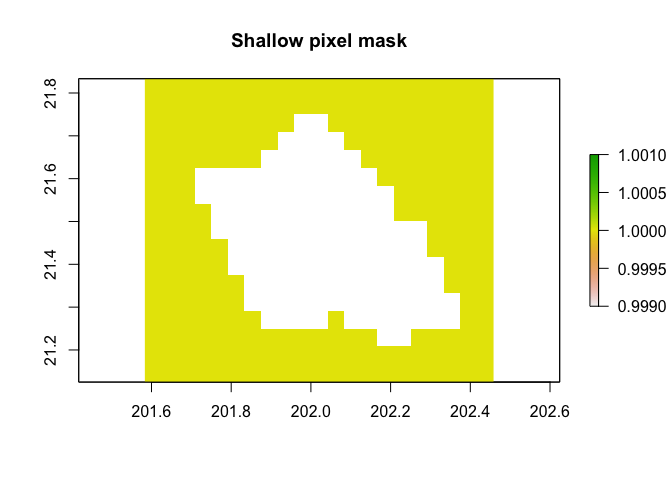
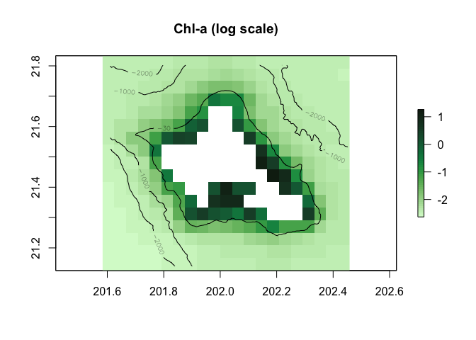
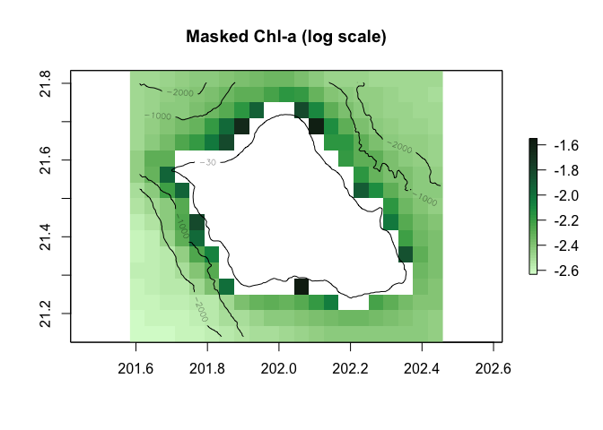

## Tutorial: Mask shallow water pixels for satellite ocean color datasets

Satellite sensed ocean color data in the coastal shallow water can be
contaminated by bottom reflectance. Here we use a high resolution
bathymetry data to generate a mask to remove ocean color pixels that
contain a portion (more than 5%) of shallow water area (less than 30m)
(Couch et al., 2023).

The bathymetry data is the ETOPO Global Relief Model integrates
topography, bathymetry, and shoreline data version 2022 in 15 arc-second
resolution
(<https://www.ncei.noaa.gov/products/etopo-global-relief-model>).

The ocean color data is the ESA CCI monthly chlorophyll-a concentration
(<https://climate.esa.int/en/projects/ocean-colour>).

Reference: Couch CS, Oliver TA, Dettloff K, Huntington B, Tanaka KR and
Vargas-Ángel B (2023) Ecological and environmental predictors of
juvenile coral density across the central and western Pacific. Front.
Mar. Sci. 10:1192102. doi: 10.3389/fmars.2023.1192102

    ### Load libraries
    library(rerddap)
    library(raster) 

    ## Loading required package: sp

    ## The legacy packages maptools, rgdal, and rgeos, underpinning the sp package,
    ## which was just loaded, will retire in October 2023.
    ## Please refer to R-spatial evolution reports for details, especially
    ## https://r-spatial.org/r/2023/05/15/evolution4.html.
    ## It may be desirable to make the sf package available;
    ## package maintainers should consider adding sf to Suggests:.
    ## The sp package is now running under evolution status 2
    ##      (status 2 uses the sf package in place of rgdal)

    library(sp) 
    library(cmocean)
    library(here)

    ## here() starts at /Users/daisyhuishi/github/coastwatch-training-modules

    library(ncdf4)

    # This is where the data are and where the plots will go
    Dir <- here()

    # Thanks to Kisei Tanaka, the tutorial is modified based on the scripts he developed for the EDS. And part of the tutorial is modified based on the previous version developed by Melanie Abecassis and Thomas Oliver.

    ### Load data

    # Bounding box for Oahu:
    lon_range = c(-158.39+360, -157.55+360)
    lat_range = c(21.14, 21.8)

    # Access bathymetry and chl-a data from OceanWatch ERDDAP server
    ERDDAP_Node = "https://oceanwatch.pifsc.noaa.gov/erddap/"

    ETOPO_id = 'ETOPO_2022_v1_15s'
    ETOPO_info=info(datasetid = ETOPO_id,url = ERDDAP_Node)
    bathy =  griddap(url = ERDDAP_Node, ETOPO_id, 
                     latitude = lat_range, longitude = lon_range)

    # Download ocean color to local as a netCDF file
    CCI_id = 'esa-cci-chla-monthly-v6-0'
    CCI_info=info(datasetid = CCI_id,url = ERDDAP_Node)
    var=CCI_info$variable$variable_name
    chl = griddap(url = ERDDAP_Node, CCI_id, 
                       time = c('1998-01-01', '2022-12-01'),
                       latitude = lat_range, longitude = lon_range,
                       fields = var[1],
                       store=disk('chl_data'))

    # Take a look at bathymetry data
    r_bathy=raster(bathy$summary$filename)

    plot(r_bathy,main="ETOPO Bathymetry (m)")
    contour(r_bathy,levels=c(-30,-1000,-2000),add=TRUE) 

    # Take a look at chlorophyll-a data
    r_chl=raster(chl$summary$filename,varname=var[1]) 

    plot(log(r_chl),main="ESA CCI Chl-a (log scale)",col=cmocean('algae')(50))
    contour(r_bathy,levels=c(-30,-1000,-2000),add=TRUE) 

    ### Create a mask for shallow water pixels
    #Convert raster bathymetry to dataframe for counting
    df_bathy = data.frame(rasterToPoints(r_bathy))
    coordinates(df_bathy) <- ~x+y
    crs(df_bathy) = crs(r_chl[[1]])

    # Examine number of shallow water pixels in each chl-a grid point
    count_shallow_pixels=function(depths,threshold=-30,na.rm=F){ 
      return(length(which(depths>threshold))) 
    } 
    N_shallow = rasterize(x = df_bathy,y=r_chl,fun=count_shallow_pixels)[[2]]
    plot(N_shallow,main="N Shallow Pixels", col=cmocean('balance')(50))

    # Examine percentage of shallow water pixels in each chl-a grid point
    percent_shallow_pixels=function(depths,threshold=-30, na.rm=F){ 
      return(length(which(depths>threshold))/length(depths)) 
    } 
    per_shallow =  rasterize(x = df_bathy,y=r_chl,fun=percent_shallow_pixels)[[2]]
    plot(per_shallow,main="% Shallow Pixels", col=cmocean('amp')(50))

    # Set a percentage threshold to create the shallow water pixel mask
    percent_threshold = 0.05
    depth_mask = r_chl/r_chl
    depth_mask[,]= 1
    depth_mask[per_shallow>= percent_threshold]= NA
    plot(depth_mask,main="Shallow water mask")

    ### Apply created shallow water mask to chl-a data and compare unmasked and masked maps 
    # Read in the files previousely downloaded
    files = list.files('chl_data/', full.names = T)
    # Read the file into R and make it to rasterstack
    stack_chl = stack(files)
    # Convert raster data to dataframe for calculating climatology
    df_chl = as.data.frame(rasterToPoints(stack_chl))
    df_chl$z = rowMeans(df_chl[,3:dim(df_chl)[2]], na.rm = T)
    # Convert dataframe to raster for mapping
    r_chl_clim = rasterFromXYZ(df_chl[,c("x", "y", "z")])
    # Map unmasked climatology
    plot(log(r_chl_clim),main="Chl-a (log scale)",col=cmocean('algae')(50))
    contour(r_bathy,levels=c(-30,-1000,-2000),add=TRUE) 

    # Apply Mask, calculate climatology and map
    r_chl_masked = mask(x = stack_chl, mask = depth_mask)
    # Convert masked raster data to dataframe for calculating climatology
    df_chl_masked = as.data.frame(rasterToPoints(r_chl_masked))
    df_chl_masked$z = rowMeans(df_chl_masked[,3:dim(df_chl_masked)[2]], na.rm = T)
    # Convert dataframe to raster for mapping
    r_chl_masked_clim = rasterFromXYZ(df_chl_masked[,c("x", "y", "z")])
    # Map masked climatology
    plot(log(r_chl_masked_clim),main="Masked Chl-a (log scale)",col=cmocean('algae')(50))
    contour(r_bathy,levels=c(-30,-1000,-2000),add=TRUE) 

    ###Output masked chl-a to netcdf file
    # Grab var name and unit from unmasked nc file
    nc = nc_open(paste0(files))
    variable_name = as.character(nc$var[[1]][2])
    variable_unit = as.character(nc$var[[1]][8])
    x_name = nc$dim$longitude$name
    y_name = nc$dim$latitude$name
    z_name = nc$dim$time$name
    z_unit = nc$dim$time$units
    nc_close(nc)
    # Set a file name and output path for the masked data
    masked_fln = 'esa_cci_monthly_chl-a_masked.nc'
    mask_path = paste0(Dir,  "/output/")
    if (!dir.exists(mask_path)) {
      dir.create(mask_path)
    }
    # Write out masked nc.file
    writeRaster(r_chl_masked,
                paste0(mask_path, masked_fln),
                overwrite = T,
                varname = variable_name,
                varunit = variable_unit,
                xname = x_name,
                yname = y_name,
                zname = z_name,
                zunit = z_unit)
