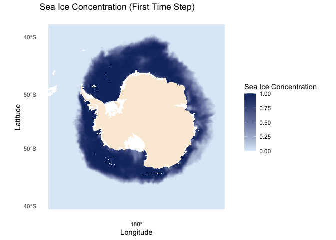
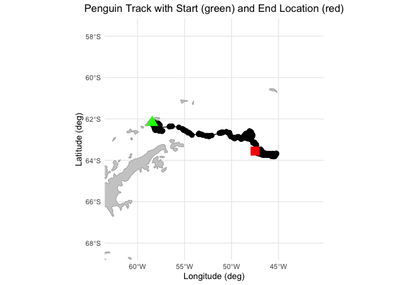
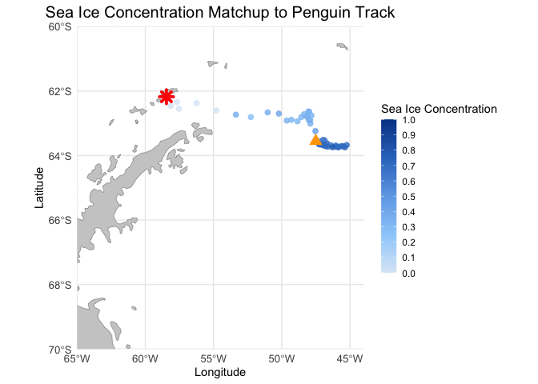

# Tracking Penguins in Antarctica

> Modified October 2024

### Overview

In this exercise, you will learn how to extract satellite data in polar
stereographic projection (defined by xgrid and ygrid) around a set of
points specified by longitude, latitude, and time coordinates. These
coordinates could represent data from animal telemetry tags, ship
tracks, or glider tracks.

### The exercise demonstrates the following techniques:

- Loading animal telemetry tags data from tab- or comma-separated files
- Extracting satellite data along a track
- Plotting animal tracks and satellite data on a map

### Datasets used in this exercise:

**Sea Ice Concentration Satellite Data**

This dataset contains daily and monthly Climate Data Records (CDR) of
sea ice concentration, processed by the NOAA/NSIDC team for the Arctic
at a 25 km resolution, spanning from 1978 to the most recent annual data
processing update. The sea ice concentration data are derived from
microwave remote sensing. Due to processing and quality control, CDR
data has a slight delay in availability, but [near real-time data is
available for more recent
dates.](https://polarwatch.noaa.gov/catalog/ice-sq-sh-nsidc-cdr-v4/preview).

For this tutorial, the monthly sea ice concentration data is used. To
preview and download CDR data, [visit NOAA PolarWatch CDR
Data](https://polarwatch.noaa.gov/catalog/ice-sq-sh-nsidc-cdr-v4/preview/?).

**Adelie Penguin Telemetry Track**

Telemetry data from Adelie penguins (*Pygoscelis adeliae*) were
collected via Argos satellites in the Southern Ocean between October 29,
1996, and February 19, 2013, as part of the U.S. Antarctic Marine Living
Resources project. Additionally, a turtle raised in captivity in Japan
was tagged and released on May 4, 2005, in the Central Pacific.

The telemetry track dataset is included in the data/ folder of this
module. For more information about the project and to download the full
dataset, visit the [NOAA NCEI
webpage](https://www.ncei.noaa.gov/access/metadata/landing-page/bin/iso?id=gov.noaa.nodc:0244399).

### Install the required R libraries

``` r
pkgTest <- function(x)
{
  if (!require(x,character.only = TRUE))
  {
    install.packages(x,dep=TRUE,repos='http://cran.us.r-project.org')
    if(!require(x,character.only = TRUE)) stop(x, " :Package not found")
  }
}


# Create list of required packages
list.of.packages <- c("rerddap", "plotdap", "parsedate", "ggplot2", "rerddapXtracto",
                      "date", "maps", "mapdata", "RColorBrewer","viridis", "dplyr",
                      "sf", "ggspatial", "rnaturalearth")

# Create list of installed packages
pkges = installed.packages()[,"Package"]

# Install and load all required pkgs
for (pk in list.of.packages) {
  pkgTest(pk)
}
```

### Load the sea ice data from PolarWatch ERDDAP

``` r
# ERDDAP URL
ERDDAP_Node = "https://polarwatch.noaa.gov/erddap"

# Dataset ID
NDBC_id = 'nsidcG02202v4shmday'
NDBC_info=info(datasetid = NDBC_id,url = ERDDAP_Node)

# Check the metadata
print(NDBC_info)
```

    ## <ERDDAP info> nsidcG02202v4shmday 
    ##  Base URL: https://polarwatch.noaa.gov/erddap 
    ##  Dataset Type: griddap 
    ##  Dimensions (range):  
    ##      time: (1978-11-01T00:00:00Z, 2024-03-01T00:00:00Z) 
    ##      ygrid: (-3937500.0, 4337500.0) 
    ##      xgrid: (-3937500.0, 3937500.0) 
    ##  Variables:  
    ##      cdr_seaice_conc_monthly: 
    ##          Units: 1 
    ##      nsidc_bt_seaice_conc_monthly: 
    ##          Units: 1 
    ##      nsidc_nt_seaice_conc_monthly: 
    ##          Units: 1 
    ##      qa_of_cdr_seaice_conc_monthly: 
    ##      stdev_of_cdr_seaice_conc_monthly:

``` r
# Set the parameters to get the first time step of the sea ice concentration data
time_range <- c('1978-11-01T00:00:00Z', '1978-11-01T23:59:59Z')
#y_range <- c(-3950000.0, 4350000.0) # if the entire range is desired one doesn't have to include a range 
#x_range <- c(-3950000.0, 3950000.0) # if the entire range is desired one doesn't have to include a range 
field <- 'cdr_seaice_conc_monthly'

# Extract data
sic <- griddap(
  url = ERDDAP_Node,
  NDBC_id,
  time = time_range,
# ygrid = y_range,      # uncomment if subsetting is desired 
# xgrid = x_range,      # uncomment if subsetting is desired
  fields = field
)

# Extract data into the data frame
sic.df <- data.frame(
  x = sic$data$xgrid,
  y = sic$data$ygrid,
  cdr_seaice_conc_monthly = sic$data$cdr_seaice_conc_monthly
)

# Remove values greater than 1
sic.df <- sic.df[sic.df$cdr_seaice_conc_monthly < 1, ]
```

### Plot sea ice data on a map

``` r
# Load map of Antarctica
antarctica <- ne_countries(scale = "medium", continent = "Antarctica", returnclass = "sf")

# Plot the data
ggplot() +
  geom_tile(data = sic.df, aes(x = x, y = y, fill = cdr_seaice_conc_monthly)) +
  scale_fill_gradient(name = "Sea Ice Concentration", low = "#deebf7", high = "#08306b", limits = c(0, 1)) +
  geom_sf(data = antarctica, fill = "antiquewhite", color = NA) +
  coord_sf(crs = st_crs(3412)) +
  theme_minimal() +
  theme(legend.position = "right") +
  labs(title = "Sea Ice Concentration (First Time Step)", x = "Longitude", y = "Latitude") +
  theme(panel.grid = element_blank())
```

<!-- -->

### Load penguin telemetry data from a local file

``` r
# Import csv file into a data frame
penguin_df <- read.csv("../data/copa_adpe_ncei.csv")

# Show 3 rows from the data frame
head(penguin_df, 3)
```

    ##   BirdId    Sex   Age Breed.Stage    DateGMT  TimeGMT  Latitude Longitude
    ## 1  ADPE1 female adult  incubation 28/10/1997  7:54:00 -62.17167 -58.44500
    ## 2  ADPE1 female adult  incubation 28/10/1997  9:32:00 -62.17333 -58.46333
    ## 3  ADPE1 female adult  incubation 28/10/1997 18:15:00 -62.15833 -58.42667
    ##   ArgosQuality
    ## 1            2
    ## 2            2
    ## 3            1

### Process Penguin Data

For this exercise, we will select ADPE24, a penguin whose recorded
tracks are highest within the female group, and will follow her journey
in the Antarctic.

``` r
# Find BirdID with the most count by sex
most_bird_count <- penguin_df %>%
  group_by(Sex) %>%
  summarize(BirdId = names(which.max(table(BirdId))))

head(most_bird_count, 1)
```

    ## # A tibble: 1 × 2
    ##   Sex    BirdId
    ##   <chr>  <chr> 
    ## 1 female ADPE24

``` r
# Extract ADPE24 track data
adpe24 <- penguin_df %>% filter(BirdId == 'ADPE24')

# Inspect the data
head(adpe24)
```

    ##   BirdId    Sex   Age Breed.Stage    DateGMT  TimeGMT Latitude Longitude
    ## 1 ADPE24 female adult      creche 16/01/2003 21:32:00  -62.173   -58.446
    ## 2 ADPE24 female adult      creche 16/01/2003 22:02:00  -62.175   -58.451
    ## 3 ADPE24 female adult      creche 16/01/2003 23:10:00  -62.184   -58.466
    ## 4 ADPE24 female adult      creche 16/01/2003 23:10:00  -62.176   -58.448
    ## 5 ADPE24 female adult      creche 16/01/2003 23:43:00  -62.177   -58.452
    ## 6 ADPE24 female adult      creche 17/01/2003  0:07:00  -62.173   -58.445
    ##   ArgosQuality
    ## 1            3
    ## 2            3
    ## 3            1
    ## 4            3
    ## 5            3
    ## 6            1

``` r
# Convert DateGMT to Date format
adpe24$DateGMT <- as.Date(adpe24$DateGMT, format = "%d/%m/%Y")

# Create Year_Month column
adpe24$Year_Month <- format(adpe24$DateGMT, "%Y-%m")

# Convert TimeGMT to POSIXct format for times
adpe24$TimeGMT <- format(strptime(adpe24$TimeGMT, format = "%H:%M:%S"), "%H:%M:%S")

# Get unique penguin dates
adpe_dates <- unique(adpe24$Year_Month)

date_range <- range(adpe24$DateGMT)

# Print results
print(paste("Date Range:", date_range[1], "to", date_range[2]))
```

    ## [1] "Date Range: 2003-01-16 to 2003-03-09"

``` r
print(paste("Unique Months:", paste(adpe_dates, collapse = ", ")))
```

    ## [1] "Unique Months: 2003-01, 2003-02, 2003-03"

### Visualize penguin tracks

``` r
# Create the plot
ggplot() +
  geom_sf(data = antarctica, fill = "gray80", color = "gray50") +
  geom_path(data = adpe24, aes(x = Longitude, y = Latitude), color = "black", fill = "black") +
  geom_point(data = adpe24, aes(x = Longitude, y = Latitude), shape = 20, size = 4) +
  geom_point(data = adpe24[1, ], aes(x = Longitude, y = Latitude), color = "green", size = 5, shape = 17) +
  geom_point(data = adpe24[nrow(adpe24), ], aes(x = Longitude, y = Latitude), color = "red", size = 5, shape = 15) +
  coord_sf(xlim = c(min(adpe24$Longitude) - 5, max(adpe24$Longitude) + 5),
           ylim = c(min(adpe24$Latitude) - 5, max(adpe24$Latitude) + 5),
           expand = FALSE) +
  labs(title = "Penguin Track with Start (green) and End Location (red)",
       x = "Longitude (deg)", y = "Latitude (deg)") +
  theme_minimal() +
  theme(plot.title = element_text(hjust = 0.5))
```

<!-- --> \### Resample Penguin data to
match satellite data

``` r
# Subset the penguin track data
adpe24 <- adpe24 %>%
  select(DateGMT, Latitude, Longitude) %>%
  mutate(DateGMT = as.Date(DateGMT, format = "%d/%m/%Y"))

# Resample data daily
adpe24_df <- adpe24 %>%
  group_by(DateGMT) %>%
  summarise(Latitude = mean(Latitude, na.rm = TRUE),
            Longitude = mean(Longitude, na.rm = TRUE))
```

### Transform the projection of the penguin locations

``` r
# Convert to an sf object and transform to Polar Stereographic Projection
penguin_sf <- st_as_sf(adpe24_df, coords = c("Longitude", "Latitude"), crs = 4326)
penguin_sf <- st_transform(penguin_sf, crs = 3412)

# Extract x and y coordinates
transformed_coords <- st_coordinates(penguin_sf)
adpe24_df$xgrid <- transformed_coords[, "X"]
adpe24_df$ygrid <- transformed_coords[, "Y"]

head(adpe24_df)
```

    ## # A tibble: 6 × 5
    ##   DateGMT    Latitude Longitude     xgrid    ygrid
    ##   <date>        <dbl>     <dbl>     <dbl>    <dbl>
    ## 1 2003-01-16    -62.2     -58.5 -2618200. 1607416.
    ## 2 2003-01-17    -62.2     -58.4 -2617487. 1608715.
    ## 3 2003-01-18    -62.3     -57.7 -2580637. 1632458.
    ## 4 2003-01-19    -62.5     -57.5 -2556440. 1626139.
    ## 5 2003-01-20    -62.2     -58.5 -2619622. 1607983.
    ## 6 2003-01-21    -62.2     -58.5 -2618872. 1607944.

### Extract satellite data to match penguin locations and date

``` r
# Extract sea ice concentration data
sic_penguin <- rxtracto(
  NDBC_info,
  xName = "xgrid",
  yName = "ygrid",
  tName = "time",
  parameter = "cdr_seaice_conc_monthly",
  xcoord = adpe24_df$xgrid,
  ycoord = adpe24_df$ygrid,
  tcoord = adpe24_df$DateGMT,
)

head(sic_penguin)
```

    ## $`mean cdr_seaice_conc_monthly`
    ##  [1] 0.00 0.00 0.00 0.00 0.00 0.00 0.00 0.01 0.00 0.00 0.00 0.00 0.00 0.37 0.27
    ## [16] 0.37 0.41 0.36 0.33 0.33 0.35 0.35 0.35 0.35 0.37 0.33 0.35 0.35 0.34 0.37
    ## [31] 0.46 0.64 0.64 0.64 0.71 0.63 0.70 0.70 0.71 0.71 0.71 0.71 0.70 0.70 0.78
    ## [46] 0.71 0.71 0.71 0.71 0.71 0.70 0.70 0.70
    ## 
    ## $`stdev cdr_seaice_conc_monthly`
    ##  [1] NA NA NA NA NA NA NA NA NA NA NA NA NA NA NA NA NA NA NA NA NA NA NA NA NA
    ## [26] NA NA NA NA NA NA NA NA NA NA NA NA NA NA NA NA NA NA NA NA NA NA NA NA NA
    ## [51] NA NA NA
    ## 
    ## $n
    ##  [1] 1 1 1 1 1 1 1 1 1 1 1 1 1 1 1 1 1 1 1 1 1 1 1 1 1 1 1 1 1 1 1 1 1 1 1 1 1 1
    ## [39] 1 1 1 1 1 1 1 1 1 1 1 1 1 1 1
    ## 
    ## $`satellite date`
    ##  [1] "2003-01-01T00:00:00Z" "2003-02-01T00:00:00Z" "2003-02-01T00:00:00Z"
    ##  [4] "2003-02-01T00:00:00Z" "2003-02-01T00:00:00Z" "2003-02-01T00:00:00Z"
    ##  [7] "2003-02-01T00:00:00Z" "2003-02-01T00:00:00Z" "2003-02-01T00:00:00Z"
    ## [10] "2003-02-01T00:00:00Z" "2003-02-01T00:00:00Z" "2003-02-01T00:00:00Z"
    ## [13] "2003-02-01T00:00:00Z" "2003-02-01T00:00:00Z" "2003-02-01T00:00:00Z"
    ## [16] "2003-02-01T00:00:00Z" "2003-02-01T00:00:00Z" "2003-02-01T00:00:00Z"
    ## [19] "2003-02-01T00:00:00Z" "2003-02-01T00:00:00Z" "2003-02-01T00:00:00Z"
    ## [22] "2003-02-01T00:00:00Z" "2003-02-01T00:00:00Z" "2003-02-01T00:00:00Z"
    ## [25] "2003-02-01T00:00:00Z" "2003-02-01T00:00:00Z" "2003-02-01T00:00:00Z"
    ## [28] "2003-02-01T00:00:00Z" "2003-02-01T00:00:00Z" "2003-02-01T00:00:00Z"
    ## [31] "2003-02-01T00:00:00Z" "2003-03-01T00:00:00Z" "2003-03-01T00:00:00Z"
    ## [34] "2003-03-01T00:00:00Z" "2003-03-01T00:00:00Z" "2003-03-01T00:00:00Z"
    ## [37] "2003-03-01T00:00:00Z" "2003-03-01T00:00:00Z" "2003-03-01T00:00:00Z"
    ## [40] "2003-03-01T00:00:00Z" "2003-03-01T00:00:00Z" "2003-03-01T00:00:00Z"
    ## [43] "2003-03-01T00:00:00Z" "2003-03-01T00:00:00Z" "2003-03-01T00:00:00Z"
    ## [46] "2003-03-01T00:00:00Z" "2003-03-01T00:00:00Z" "2003-03-01T00:00:00Z"
    ## [49] "2003-03-01T00:00:00Z" "2003-03-01T00:00:00Z" "2003-03-01T00:00:00Z"
    ## [52] "2003-03-01T00:00:00Z" "2003-03-01T00:00:00Z"
    ## 
    ## $`requested x min`
    ##  [1] -2618200 -2617487 -2580637 -2556440 -2619622 -2618872 -2609300 -2581762
    ##  [9] -2617878 -2618061 -2614421 -2535191 -2470714 -2414195 -2372472 -2345538
    ## [17] -2314721 -2276201 -2266618 -2247613 -2234056 -2243316 -2245819 -2227527
    ## [25] -2221971 -2248918 -2249757 -2237957 -2218441 -2209007 -2176294 -2139759
    ## [33] -2134079 -2129105 -2114272 -2100165 -2083425 -2076899 -2070131 -2064975
    ## [41] -2059881 -2058637 -2075336 -2086747 -2091354 -2104230 -2110452 -2114260
    ## [49] -2118197 -2124732 -2131630 -2134295 -2149253
    ## 
    ## $`requested x max`
    ##  [1] -2618200 -2617487 -2580637 -2556440 -2619622 -2618872 -2609300 -2581762
    ##  [9] -2617878 -2618061 -2614421 -2535191 -2470714 -2414195 -2372472 -2345538
    ## [17] -2314721 -2276201 -2266618 -2247613 -2234056 -2243316 -2245819 -2227527
    ## [25] -2221971 -2248918 -2249757 -2237957 -2218441 -2209007 -2176294 -2139759
    ## [33] -2134079 -2129105 -2114272 -2100165 -2083425 -2076899 -2070131 -2064975
    ## [41] -2059881 -2058637 -2075336 -2086747 -2091354 -2104230 -2110452 -2114260
    ## [49] -2118197 -2124732 -2131630 -2134295 -2149253

``` r
sic_penguin_df <- data.frame(
  time = as.Date(sic_penguin$`satellite date`),
  xgrid = sic_penguin$`requested x min`,
  ygrid = sic_penguin$`requested y min`,
  matched_seaice_concen = sic_penguin$'mean cdr_seaice_conc_monthly'
)


# Merge the extracted data back into the penguin data frame
adpe24_df <- adpe24_df %>%
  mutate(matched_seaice_concen = sic_penguin$'mean cdr_seaice_conc_monthly')

head(adpe24_df)
```

    ## # A tibble: 6 × 6
    ##   DateGMT    Latitude Longitude     xgrid    ygrid matched_seaice_concen
    ##   <date>        <dbl>     <dbl>     <dbl>    <dbl>                 <dbl>
    ## 1 2003-01-16    -62.2     -58.5 -2618200. 1607416.                     0
    ## 2 2003-01-17    -62.2     -58.4 -2617487. 1608715.                     0
    ## 3 2003-01-18    -62.3     -57.7 -2580637. 1632458.                     0
    ## 4 2003-01-19    -62.5     -57.5 -2556440. 1626139.                     0
    ## 5 2003-01-20    -62.2     -58.5 -2619622. 1607983.                     0
    ## 6 2003-01-21    -62.2     -58.5 -2618872. 1607944.                     0

### Plot penguin tracks with matched sea ice concentration data

``` r
# Create the base map with longitude and latitude limits, grid lines, and geographical features
ggplot() +
  # Add a polygon layer for landmasses (adjust as needed for better visual presentation)
  geom_sf(data = antarctica, fill = "gray80", color = "gray50") +  # Use world map or other basemap
  
  # Add penguin track with sea ice concentration
  geom_point(data = adpe24_df, aes(x = Longitude, y = Latitude, color = matched_seaice_concen),
             size = 2, alpha = 0.8) +
  
  # Start and end points
  geom_point(data = adpe24_df[1,], aes(x = Longitude, y = Latitude), color = "red", size = 3, shape = 8, stroke = 2) +  # Start point
  geom_point(data = adpe24_df[nrow(adpe24_df),], aes(x = Longitude, y = Latitude), color = "orange", size = 3, shape = 17, stroke = 2) +  # End point
  
  # Set the map projection and focus on South Pole region
  coord_sf(xlim = c(-65, -44), ylim = c(-70, -60), expand = FALSE) +
  
  # Custom blue color palette for sea ice concentration (from light blue to dark blue)
  scale_color_gradientn(
    name = "Sea Ice Concentration", 
    colors = c("#dbe9f6", "#9ccffb", "#6fa9e7", "#3177c6", "#004494"),  # Custom blue gradient
    limits = c(0, 1), 
    breaks = seq(0, 1, by = 0.1),
    guide = guide_colorbar(direction = "vertical")
  ) +
  
  labs(title = "Sea Ice Concentration Matchup to Penguin Track",
       x = "Longitude", y = "Latitude") +
  
  theme_minimal() +
  theme(plot.title = element_text(hjust = 0.5, size = 15), 
        axis.text = element_text(size = 10),
        legend.position = "right") +
  
  guides(color = guide_colorbar(barwidth = 1, barheight = 10))
```

<!-- -->
