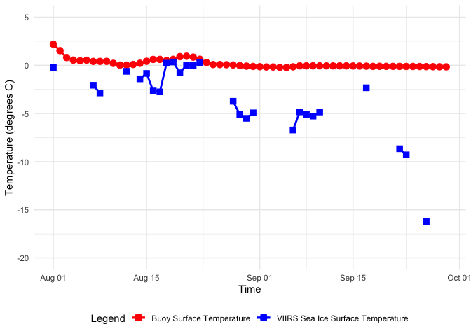
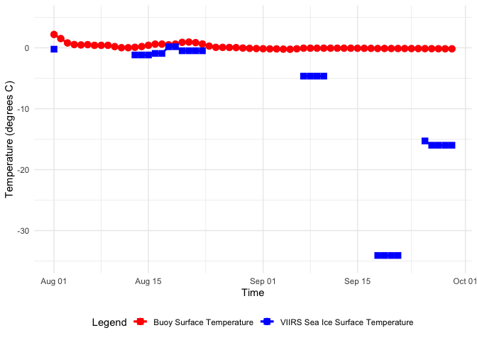

# Matching Satellite and Buoy Data

In this exercise, you will combine satellite and buoy data by extracting
satellite measurements around specific points defined by buoy locations
and dates.  
- The focus of this exercise is on matching two data sources from
different projections.  
- Similar tutorials for mid to lower latitudes can be found at
[https://github.com/coastwatch-training/CoastWatch-Tutorials](https://github.com/coastwatch-training/CoastWatch-Tutorials?tab=readme-ov-file#readme).

## This exercise demonstrates the following techniques:

- Using ERDDAP to retrieve buoy data in CSV format and satellite data in
  netCDF format
- Importing and manipulating data with the pandas and xarray libraries
- Resampling data to lower-resolution time steps
- Converting latitude and longitude coordinates to the polar
  stereographic projection

## Data used in this exercise

**[Ice Surface Temperature, NOAA-20 VIIRS, Near Real-Time, Polar
Stereographic (North),
4-day](https://polarwatch.noaa.gov/erddap/info/noaacwVIIRSn20icesrftempNP06Daily4Day/index.html)**

This dataset provides VIIRS sea ice surface temperature for the Arctic
at a 750m resolution, collected by the NOAA-20 satellite. It includes
near-real-time daily data and 4-day composites for the past three weeks.
For this exercise, we will use 4-day composites data. This dataset is in
a polar stereographic projection.

**[International Arctic Buoy Programme (IABP) Buoy Data,
Daily](https://polarwatch.noaa.gov/erddap/info/iabpv2_buoys/index.html)**

This dataset is from the US International Arctic Buoy Programme and
includes meteorological and oceanographic data from buoys. Dataset is
updated daily and includes multiple variables. For this exercise, we
will extract surface temperature data.

**Satellite Ice Surface Temperature (IST)** is measured by the Visible
Infrared Imaging Radiometer Suite (VIIRS) and captures the temperature
of the surface layer of ice.

**Buoy Surface Temperature (Ts)** is measured from the bottom of the
buoy hull. If the buoy is floating, the reported temperature is of the
sea surface. If the buoy is frozen into the ice or sitting on top of it,
the reported temperature is of the ground or ice. The freezing
temperature of seawater is about -1.8°C, so temperature readings below
this indicate ground or ice temperatures.

More details can be found in the metadata section of the data products
(click on the data links above).

## Load packages

``` r
pkgTest <- function(x)
{
  if (!require(x,character.only = TRUE))
  {
    install.packages(x,dep=TRUE)
    if(!require(x,character.only = TRUE)) stop("Package not found")
  }
}

list.of.packages <- c( "ncdf4", "rerddap", "plotdap", "httr",
                       "lubridate", "gridGraphics",  "mapdata",
                       "ggplot2", "RColorBrewer", "grid", "PBSmapping", 
                       "rerddapXtracto","dplyr","viridis","cmocean", "sf")

# create list of installed packages
pkges = installed.packages()[,"Package"]

for (pk in list.of.packages) {
  pkgTest(pk)
}
```

## Load buoy data (IABP) from PolarWatch ERDDAP data server

### First view information about the data

Use the info function from the `rerddap` package. The variable
`surface_temp` will be used for this exercise.

``` r
ERDDAP_Node = "https://polarwatch.noaa.gov/erddap"

NDBC_id = 'iabpv2_buoys'
NDBC_info=info(datasetid = NDBC_id,url = ERDDAP_Node)

print(NDBC_info)
```

    ## <ERDDAP info> iabpv2_buoys 
    ##  Base URL: https://polarwatch.noaa.gov/erddap 
    ##  Dataset Type: tabledap 
    ##  Variables:  
    ##      air_temp: 
    ##          Range: -90.0, 44.78 
    ##          Units: degree_C 
    ##      bp: 
    ##          Range: 850.0, 1185.9 
    ##          Units: mBars 
    ##      buoy_id: 
    ##      buoy_owner: 
    ##      buoy_type: 
    ##      day_of_year: 
    ##          Range: 6.0E-4, 366.999 
    ##      has_air_temp: 
    ##      has_bp: 
    ##      has_surface_temp: 
    ##      hemisphere: 
    ##      hour: 
    ##          Range: 0.0, 24.0 
    ##      latitude: 
    ##          Range: -90.0, 90.0 
    ##          Units: degrees_north 
    ##      logistics: 
    ##      longitude: 
    ##          Range: -180.0, 180.0 
    ##          Units: degrees_east 
    ##      minute: 
    ##          Range: 0.0, 59.0 
    ##      surface_temp: 
    ##          Range: -72.88, 45.0 
    ##          Units: degree_C 
    ##      time: 
    ##          Range: 1.189717571E9, 1.729396802E9 
    ##          Units: seconds since 1970-01-01T00:00:00Z 
    ##      year: 
    ##          Range: 2007.0, 2024.0

### Load the data and put into a data frame

``` r
buoy <- rerddap::tabledap(url = ERDDAP_Node, NDBC_id,
                           fields=c('buoy_id', 'latitude',  'longitude', 'time', 'surface_temp', 
                           'has_surface_temp'), 'time>=2023-08-01',   'time<=2023-09-30'
)

# Create data frame with the downloaded data
buoy.df <-data.frame(buoy_id=as.character(buoy$buoy_id),
                     longitude=as.numeric(buoy$longitude),
                     latitude=as.numeric(buoy$latitude),
                     time=as.POSIXct(buoy$time, "%Y-%m-%dT%H:%M:%S", tz="UTC"),
                     surface_temp=as.numeric(buoy$surface_temp))

summary(buoy.df)
```

    ##    buoy_id            longitude          latitude     
    ##  Length:471572      Min.   :-180.00   Min.   :-74.00  
    ##  Class :character   1st Qu.:-129.15   1st Qu.: 73.93  
    ##  Mode  :character   Median : -25.04   Median : 82.74  
    ##                     Mean   : -21.90   Mean   : 72.16  
    ##                     3rd Qu.:  97.57   3rd Qu.: 85.20  
    ##                     Max.   : 180.00   Max.   : 90.00  
    ##                                                       
    ##       time                         surface_temp   
    ##  Min.   :2023-08-01 00:00:00.00   Min.   :-60.00  
    ##  1st Qu.:2023-08-21 16:00:02.00   1st Qu.: -0.95  
    ##  Median :2023-09-06 15:00:00.00   Median :  0.30  
    ##  Mean   :2023-09-04 05:39:11.03   Mean   :  1.96  
    ##  3rd Qu.:2023-09-18 17:00:23.00   3rd Qu.:  2.69  
    ##  Max.   :2023-09-30 00:00:00.00   Max.   : 40.00  
    ##                                   NA's   :144689

``` r
head(buoy.df)
```

    ##           buoy_id longitude latitude                time surface_temp
    ## 1 300234066034140  -28.5226  55.0168 2023-08-01 00:00:00         13.5
    ## 2 300234066034140  -28.5226  55.0168 2023-08-01 01:00:02         13.4
    ## 3 300234066034140  -28.5226  55.0168 2023-08-01 01:59:57         13.4
    ## 4 300234066034140  -28.5618  55.0032 2023-08-01 03:00:00         13.4
    ## 5 300234066034140  -28.5618  55.0032 2023-08-01 04:00:02         13.3
    ## 6 300234066034140  -28.5618  55.0032 2023-08-01 04:59:57         13.3

## Select one buoy and process data

We will first select one buoy (buoy id = “300534062897730”). The buoy
records measurements at intervals of minutes, resulting in a
high-resolution dataset. To align it with the daily resolution of the
satellite dataset, we will downsample the buoy data.

### Load the data for the target buoy

Check the number of timesteps

``` r
# Select one buoy (buoy id = "300534062897730")
target.buoy <- buoy.df %>% filter(buoy_id == "300534062897730")

# Print the number of timestamps before resampling
# cat("# of timesteps before =", nrow(target.buoy), "\n")
#print(c("# of timesteps before =", nrow(target.buoy.daily)))
steps_before <- length(buoy.df$time)

# Resample to daily mean by averaging surface_temp values for each day
# And rename surface_temp to temp_buoy
target.buoy.daily <- target.buoy %>%
  mutate(time = as.Date(time)) %>% 
  group_by(time) %>%
  summarize(
    buoy_id = first(buoy_id),
    longitude = first(longitude),
    latitude = first(latitude),
    temp_buoy = mean(surface_temp, na.rm = TRUE))

# Print the number of timesteps after resampling
# cat("# of timesteps before =", nrow(target.buoy.daily), "\n")
steps_after <- length(target.buoy.daily$time)


head(target.buoy.daily)
```

    ## # A tibble: 6 × 5
    ##   time       buoy_id         longitude latitude temp_buoy
    ##   <date>     <chr>               <dbl>    <dbl>     <dbl>
    ## 1 2023-08-01 300534062897730     -144.     86.4     2.19 
    ## 2 2023-08-02 300534062897730     -144.     86.4     1.52 
    ## 3 2023-08-03 300534062897730     -142.     86.3     0.803
    ## 4 2023-08-04 300534062897730     -142.     86.3     0.542
    ## 5 2023-08-05 300534062897730     -142.     86.4     0.475
    ## 6 2023-08-06 300534062897730     -142.     86.5     0.522

### Verify the reduced number of timesteps

``` r
cat("# of timesteps before =", steps_before, "# of timesteps after =", steps_after)
```

    ## # of timesteps before = 471572 # of timesteps after = 60

``` r
#length(buoy.df$time)
```

## Transform buoy coordinates to polar projection

The buoy locations are provided in latitude and longitude coordinates,
whereas the satellite data are in a polar stereographic projection with
locations in units of meters. We will convert the buoy locations from
latitude and longitude to the corresponding columns and rows in the
polar projection.

``` r
# Define the projection using the PROJ4 string format
proj4text <- "+proj=stere +lat_0=90 +lat_ts=70 +lon_0=-45 +k=1 +x_0=0 +y_0=0 +datum=WGS84 +units=m +no_defs"

# Convert the dataframe into an sf object (Spatial Dataframe)
target.buoy.sf <- st_as_sf(target.buoy.daily, coords = c("longitude", "latitude"), crs = 4326)

# Reproject the data to the Polar Stereographic projection using the PROJ4 string
target.buoy.projected <- st_transform(target.buoy.sf, crs = proj4text)

# Extract the projected coordinates
target.buoy.projected$cols <- st_coordinates(target.buoy.projected)[,1] # X (columns)
target.buoy.projected$rows <- st_coordinates(target.buoy.projected)[,2] # Y (rows)

# Show the first 2 rows to verify that the 'cols' and 'rows' columns were added
head(target.buoy.projected, 2)
```

    ## Simple feature collection with 2 features and 5 fields
    ## Geometry type: POINT
    ## Dimension:     XY
    ## Bounding box:  xmin: -389549.6 ymin: 58944.53 xmax: -385824.4 ymax: 59121.58
    ## Projected CRS: +proj=stere +lat_0=90 +lat_ts=70 +lon_0=-45 +k=1 +x_0=0 +y_0=0 +datum=WGS84 +units=m +no_defs
    ## # A tibble: 2 × 6
    ##   time       buoy_id         temp_buoy             geometry     cols   rows
    ##   <date>     <chr>               <dbl>          <POINT [m]>    <dbl>  <dbl>
    ## 1 2023-08-01 300534062897730      2.19 (-385824.4 58944.53) -385824. 58945.
    ## 2 2023-08-02 300534062897730      1.52 (-389549.6 59121.58) -389550. 59122.

``` r
# Select the first buoy location to pull corresponding satellite data
target.buoy.cols <- target.buoy.projected$cols[1]
target.buoy.rows <- target.buoy.projected$rows[1]

# Verify the data
print(target.buoy.cols)
```

    ## [1] -385824.4

``` r
print(target.buoy.rows)
```

    ## [1] 58944.53

### Load satellite data from PolarWatch

Look at the metadata to check the metadata Note that the temperature is
in degrees Kelvin.

``` r
NDBC_id_2 = 'noaacwVIIRSn20icesrftempNP06Daily4Day'
NDBC_info_2=info(datasetid = NDBC_id_2,url = ERDDAP_Node)

print(NDBC_info_2)
```

    ## <ERDDAP info> noaacwVIIRSn20icesrftempNP06Daily4Day 
    ##  Base URL: https://polarwatch.noaa.gov/erddap 
    ##  Dataset Type: griddap 
    ##  Dimensions (range):  
    ##      time: (2021-04-13T00:00:00Z, 2024-10-15T00:00:00Z) 
    ##      altitude: (0.0, 0.0) 
    ##      rows: (-3434002.5, 3434002.5) 
    ##      cols: (-3434002.5, 3434002.5) 
    ##  Variables:  
    ##      IceSrfTemp: 
    ##          Units: Kelvin(K)

## Extract the satellite ice surface temperture timeseries

Use the rxtracto function from the rerddapXtracto package

``` r
zpos <- rep(0., length(target.buoy.projected$time))

sat_data <- rxtracto(NDBC_info_2,
                    xName="cols",
                    yName="rows",
                    tName="time",
                    zName="altitude",
                    parameter="IceSrfTemp",
                    xcoord = target.buoy.projected$cols,
                    ycoord = target.buoy.projected$rows,
                    tcoord = target.buoy.projected$time,
                    zcoord = zpos
                    )
head(sat_data)
```

    ## $`mean IceSrfTemp`
    ##  [1] 272.9286      NaN      NaN      NaN      NaN      NaN 271.0790 270.2815
    ##  [9]      NaN      NaN      NaN 272.5218      NaN 271.7425 272.3054 270.4868
    ## [17] 270.3914 273.3692 273.4933 272.3756 273.1550 273.1486 273.4222      NaN
    ## [25]      NaN      NaN      NaN 269.4200 268.0554 267.6486 268.2197      NaN
    ## [33]      NaN      NaN      NaN      NaN 266.4402 268.3176 268.0433 267.8826
    ## [41] 268.3053      NaN      NaN      NaN      NaN      NaN      NaN 270.8179
    ## [49]      NaN      NaN      NaN      NaN 264.4946 263.8606      NaN      NaN
    ## [57] 256.9289      NaN      NaN      NaN
    ## 
    ## $`stdev IceSrfTemp`
    ##  [1] NA NA NA NA NA NA NA NA NA NA NA NA NA NA NA NA NA NA NA NA NA NA NA NA NA
    ## [26] NA NA NA NA NA NA NA NA NA NA NA NA NA NA NA NA NA NA NA NA NA NA NA NA NA
    ## [51] NA NA NA NA NA NA NA NA NA NA
    ## 
    ## $n
    ##  [1] 1 0 0 0 0 0 1 1 0 0 0 1 0 1 1 1 1 1 1 1 1 1 1 0 0 0 0 1 1 1 1 0 0 0 0 0 1 1
    ## [39] 1 1 1 0 0 0 0 0 0 1 0 0 0 0 1 1 0 0 1 0 0 0
    ## 
    ## $`satellite date`
    ##  [1] "2023-08-01T00:00:00Z" "2023-08-02T00:00:00Z" "2023-08-03T00:00:00Z"
    ##  [4] "2023-08-04T00:00:00Z" "2023-08-05T00:00:00Z" "2023-08-06T00:00:00Z"
    ##  [7] "2023-08-07T00:00:00Z" "2023-08-08T00:00:00Z" "2023-08-09T00:00:00Z"
    ## [10] "2023-08-10T00:00:00Z" "2023-08-11T00:00:00Z" "2023-08-12T00:00:00Z"
    ## [13] "2023-08-13T00:00:00Z" "2023-08-14T00:00:00Z" "2023-08-15T00:00:00Z"
    ## [16] "2023-08-16T00:00:00Z" "2023-08-17T00:00:00Z" "2023-08-18T00:00:00Z"
    ## [19] "2023-08-19T00:00:00Z" "2023-08-20T00:00:00Z" "2023-08-21T00:00:00Z"
    ## [22] "2023-08-22T00:00:00Z" "2023-08-23T00:00:00Z" "2023-08-24T00:00:00Z"
    ## [25] "2023-08-25T00:00:00Z" "2023-08-26T00:00:00Z" "2023-08-27T00:00:00Z"
    ## [28] "2023-08-28T00:00:00Z" "2023-08-29T00:00:00Z" "2023-08-30T00:00:00Z"
    ## [31] "2023-08-31T00:00:00Z" "2023-09-01T00:00:00Z" "2023-09-02T00:00:00Z"
    ## [34] "2023-09-03T00:00:00Z" "2023-09-04T00:00:00Z" "2023-09-05T00:00:00Z"
    ## [37] "2023-09-06T00:00:00Z" "2023-09-07T00:00:00Z" "2023-09-08T00:00:00Z"
    ## [40] "2023-09-09T00:00:00Z" "2023-09-10T00:00:00Z" "2023-09-11T00:00:00Z"
    ## [43] "2023-09-12T00:00:00Z" "2023-09-13T00:00:00Z" "2023-09-14T00:00:00Z"
    ## [46] "2023-09-15T00:00:00Z" "2023-09-16T00:00:00Z" "2023-09-17T00:00:00Z"
    ## [49] "2023-09-18T00:00:00Z" "2023-09-19T00:00:00Z" "2023-09-20T00:00:00Z"
    ## [52] "2023-09-21T00:00:00Z" "2023-09-22T00:00:00Z" "2023-09-23T00:00:00Z"
    ## [55] "2023-09-24T00:00:00Z" "2023-09-25T00:00:00Z" "2023-09-26T00:00:00Z"
    ## [58] "2023-09-27T00:00:00Z" "2023-09-28T00:00:00Z" "2023-09-29T00:00:00Z"
    ## 
    ## $`requested x min`
    ##  [1] -385824.4 -389549.6 -398253.9 -399928.2 -383575.3 -376519.9 -373178.9
    ##  [8] -369485.9 -364101.8 -358053.1 -344667.3 -339413.6 -325379.7 -308859.0
    ## [15] -297005.5 -290218.6 -283776.4 -280170.8 -271276.3 -263223.8 -263830.1
    ## [22] -269754.9 -268728.9 -262726.0 -258730.5 -262527.7 -277050.1 -274674.6
    ## [29] -261436.0 -250715.5 -248618.1 -253833.2 -247254.1 -241801.9 -248913.6
    ## [36] -253308.9 -253242.1 -259535.5 -256109.5 -263955.3 -260399.8 -254873.5
    ## [43] -244906.9 -239308.2 -230283.9 -227856.9 -220466.8 -213128.6 -205585.0
    ## [50] -194830.9 -185590.9 -183007.2 -178188.9 -176271.0 -179406.9 -180725.3
    ## [57] -176656.0 -171027.2 -162577.7 -149611.3
    ## 
    ## $`requested x max`
    ##  [1] -385824.4 -389549.6 -398253.9 -399928.2 -383575.3 -376519.9 -373178.9
    ##  [8] -369485.9 -364101.8 -358053.1 -344667.3 -339413.6 -325379.7 -308859.0
    ## [15] -297005.5 -290218.6 -283776.4 -280170.8 -271276.3 -263223.8 -263830.1
    ## [22] -269754.9 -268728.9 -262726.0 -258730.5 -262527.7 -277050.1 -274674.6
    ## [29] -261436.0 -250715.5 -248618.1 -253833.2 -247254.1 -241801.9 -248913.6
    ## [36] -253308.9 -253242.1 -259535.5 -256109.5 -263955.3 -260399.8 -254873.5
    ## [43] -244906.9 -239308.2 -230283.9 -227856.9 -220466.8 -213128.6 -205585.0
    ## [50] -194830.9 -185590.9 -183007.2 -178188.9 -176271.0 -179406.9 -180725.3
    ## [57] -176656.0 -171027.2 -162577.7 -149611.3

### Convert degrees K to degrees C

``` r
#sftemp_ds_subset$temp_sat <- sftemp_ds_subset$IceSrfTemp - 273.15
temp_sat <- sat_data$mean - 273.15
temp_sat
```

    ##  [1]  -0.221441650           NaN           NaN           NaN           NaN
    ##  [6]           NaN  -2.070959473  -2.868536377           NaN           NaN
    ## [11]           NaN  -0.628179932           NaN  -1.407537842  -0.844641113
    ## [16]  -2.663214111  -2.758581543   0.219171143   0.343347168  -0.774359131
    ## [21]   0.004998779  -0.001409912   0.272210693           NaN           NaN
    ## [26]           NaN           NaN  -3.729956055  -5.094610596  -5.501409912
    ## [31]  -4.930303955           NaN           NaN           NaN           NaN
    ## [36]           NaN  -6.709814453  -4.832434082  -5.106665039  -5.267431641
    ## [41]  -4.844671631           NaN           NaN           NaN           NaN
    ## [46]           NaN           NaN  -2.332067871           NaN           NaN
    ## [51]           NaN           NaN  -8.655371094  -9.289373779           NaN
    ## [56]           NaN -16.221136475           NaN           NaN           NaN

``` r
#extract$mean
```

### Merge Buoy and Satellite Data

Add the satellite ice temperature to the buoy dataset. Not all buoy
dates have corresponding satellite data. Any unmatched dates will be
filled with NaN values.

``` r
target.buoy.projected$temp_sat <- temp_sat
head(target.buoy.projected)
```

    ## Simple feature collection with 6 features and 6 fields
    ## Geometry type: POINT
    ## Dimension:     XY
    ## Bounding box:  xmin: -399928.2 ymin: 46312.22 xmax: -376519.9 ymax: 59121.58
    ## Projected CRS: +proj=stere +lat_0=90 +lat_ts=70 +lon_0=-45 +k=1 +x_0=0 +y_0=0 +datum=WGS84 +units=m +no_defs
    ## # A tibble: 6 × 7
    ##   time       buoy_id temp_buoy             geometry     cols   rows temp_sat
    ##   <date>     <chr>       <dbl>          <POINT [m]>    <dbl>  <dbl>    <dbl>
    ## 1 2023-08-01 300534…     2.19  (-385824.4 58944.53) -385824. 58945.   -0.221
    ## 2 2023-08-02 300534…     1.52  (-389549.6 59121.58) -389550. 59122.  NaN    
    ## 3 2023-08-03 300534…     0.803 (-398253.9 50891.54) -398254. 50892.  NaN    
    ## 4 2023-08-04 300534…     0.542 (-399928.2 48358.67) -399928. 48359.  NaN    
    ## 5 2023-08-05 300534…     0.475 (-383575.3 49983.71) -383575. 49984.  NaN    
    ## 6 2023-08-06 300534…     0.522 (-376519.9 46312.22) -376520. 46312.  NaN

### Visualize Matched DataSets

Visualize the matched buoy and satellite datasets to assess the data
alignment.

``` r
# Create the plot
ggplot(target.buoy.projected, aes(x = time)) +
  # Plot the buoy data
  geom_point(aes(y = temp_buoy, color = 'Buoy Surface Temperature'), size =3) +
  geom_line(aes(y = temp_buoy, color = 'Buoy Surface Temperature'), linewidth = 1, na.rm = TRUE) +
  
  # Plot the satellite (VIIRS Sea Ice Surface Temperature) data
  geom_point(aes(y = temp_sat, color = 'VIIRS Sea Ice Surface Temperature'), shape = 15, size = 3) +
  geom_line(aes(y = temp_sat, color = 'VIIRS Sea Ice Surface Temperature'), linewidth = 1, na.rm = TRUE) +
  
  # Set the y-axis limits
  ylim(-20, 5) +
  
  # Labels and theme
  labs(x = 'Time', y = 'Temperature (degrees C)', color = 'Legend') +
  scale_color_manual(values = c('Buoy Surface Temperature' = 'red',
                                'VIIRS Sea Ice Surface Temperature' = 'blue')) +
  theme_minimal() +
  theme(legend.position = "bottom")
```

<!-- -->

# Madi and Cara - End here

## Below is pure R code from Madi

### Select satellite data to match buoy location and dates

Next, subset the satellite data using the buoy’s first location and the
corresponding start and end dates.

``` r
# Set the coordinate variable ranges
time_range <- c('2023-08-01', '2023-09-30')
rows_range <- c(49687.5, 99772.5)
cols_range <- c(-400282.5, -350197.5)
field <- 'IceSrfTemp'

# extract satellite data
gridded.data <- griddap(
  url = ERDDAP_Node,
  NDBC_id_2,
  time = time_range,
  rows = rows_range,
  cols = cols_range,
  fields = c(field)
)

head(gridded.data)
```

    ## $summary
    ## $summary$filename
    ## [1] "/var/folders/zx/c1782k2s50b2qc1v5yhfb6rw0000gn/T//RtmpY71gB1/R/rerddap/1a26c42e7f55817b259f1cd01561852f.nc"
    ## 
    ## $summary$writable
    ## [1] FALSE
    ## 
    ## $summary$id
    ## [1] 65536
    ## 
    ## $summary$error
    ## [1] FALSE
    ## 
    ## $summary$safemode
    ## [1] FALSE
    ## 
    ## $summary$format
    ## [1] "NC_FORMAT_CLASSIC"
    ## 
    ## $summary$is_GMT
    ## [1] FALSE
    ## 
    ## $summary$groups
    ## $summary$groups[[1]]
    ## $id
    ## [1] 65536
    ## 
    ## $name
    ## [1] ""
    ## 
    ## $ndims
    ## [1] 4
    ## 
    ## $nvars
    ## [1] 5
    ## 
    ## $natts
    ## [1] 36
    ## 
    ## $dimid
    ## [1] 0 1 2 3
    ## 
    ## $fqgn
    ## [1] ""
    ## 
    ## attr(,"class")
    ## [1] "ncgroup4"
    ## 
    ## 
    ## $summary$fqgn2Rindex
    ## $summary$fqgn2Rindex[[1]]
    ## [1] 1
    ## 
    ## 
    ## $summary$ndims
    ## [1] 4
    ## 
    ## $summary$natts
    ## [1] 36
    ## 
    ## $summary$dim
    ## $summary$dim$time
    ## $name
    ## [1] "time"
    ## 
    ## $len
    ## [1] 61
    ## 
    ## $unlim
    ## [1] FALSE
    ## 
    ## $group_index
    ## [1] 1
    ## 
    ## $group_id
    ## [1] 65536
    ## 
    ## $id
    ## [1] 0
    ## 
    ## $dimvarid
    ## $id
    ## [1] 0
    ## 
    ## $group_index
    ## [1] 1
    ## 
    ## $group_id
    ## [1] 65536
    ## 
    ## $list_index
    ## [1] -1
    ## 
    ## $isdimvar
    ## [1] TRUE
    ## 
    ## attr(,"class")
    ## [1] "ncid4"
    ## 
    ## $units
    ## [1] "seconds since 1970-01-01T00:00:00Z"
    ## 
    ## $calendar
    ## [1] "gregorian"
    ## 
    ## $vals
    ##  [1] 1690848000 1690934400 1691020800 1691107200 1691193600 1691280000
    ##  [7] 1691366400 1691452800 1691539200 1691625600 1691712000 1691798400
    ## [13] 1691884800 1691971200 1692057600 1692144000 1692230400 1692316800
    ## [19] 1692403200 1692489600 1692576000 1692662400 1692748800 1692835200
    ## [25] 1692921600 1693008000 1693094400 1693180800 1693267200 1693353600
    ## [31] 1693440000 1693526400 1693612800 1693699200 1693785600 1693872000
    ## [37] 1693958400 1694044800 1694131200 1694217600 1694304000 1694390400
    ## [43] 1694476800 1694563200 1694649600 1694736000 1694822400 1694908800
    ## [49] 1694995200 1695081600 1695168000 1695254400 1695340800 1695427200
    ## [55] 1695513600 1695600000 1695686400 1695772800 1695859200 1695945600
    ## [61] 1696032000
    ## 
    ## $create_dimvar
    ## [1] TRUE
    ## 
    ## attr(,"class")
    ## [1] "ncdim4"
    ## 
    ## $summary$dim$altitude
    ## $name
    ## [1] "altitude"
    ## 
    ## $len
    ## [1] 1
    ## 
    ## $unlim
    ## [1] FALSE
    ## 
    ## $group_index
    ## [1] 1
    ## 
    ## $group_id
    ## [1] 65536
    ## 
    ## $id
    ## [1] 1
    ## 
    ## $dimvarid
    ## $id
    ## [1] 1
    ## 
    ## $group_index
    ## [1] 1
    ## 
    ## $group_id
    ## [1] 65536
    ## 
    ## $list_index
    ## [1] -1
    ## 
    ## $isdimvar
    ## [1] TRUE
    ## 
    ## attr(,"class")
    ## [1] "ncid4"
    ## 
    ## $units
    ## [1] "m"
    ## 
    ## $vals
    ## [1] 0
    ## 
    ## $create_dimvar
    ## [1] TRUE
    ## 
    ## attr(,"class")
    ## [1] "ncdim4"
    ## 
    ## $summary$dim$rows
    ## $name
    ## [1] "rows"
    ## 
    ## $len
    ## [1] 64
    ## 
    ## $unlim
    ## [1] FALSE
    ## 
    ## $group_index
    ## [1] 1
    ## 
    ## $group_id
    ## [1] 65536
    ## 
    ## $id
    ## [1] 2
    ## 
    ## $dimvarid
    ## $id
    ## [1] 2
    ## 
    ## $group_index
    ## [1] 1
    ## 
    ## $group_id
    ## [1] 65536
    ## 
    ## $list_index
    ## [1] -1
    ## 
    ## $isdimvar
    ## [1] TRUE
    ## 
    ## attr(,"class")
    ## [1] "ncid4"
    ## 
    ## $units
    ## [1] "m"
    ## 
    ## $vals
    ##  [1] 99772.5 98977.5 98182.5 97387.5 96592.5 95797.5 95002.5 94207.5 93412.5
    ## [10] 92617.5 91822.5 91027.5 90232.5 89437.5 88642.5 87847.5 87052.5 86257.5
    ## [19] 85462.5 84667.5 83872.5 83077.5 82282.5 81487.5 80692.5 79897.5 79102.5
    ## [28] 78307.5 77512.5 76717.5 75922.5 75127.5 74332.5 73537.5 72742.5 71947.5
    ## [37] 71152.5 70357.5 69562.5 68767.5 67972.5 67177.5 66382.5 65587.5 64792.5
    ## [46] 63997.5 63202.5 62407.5 61612.5 60817.5 60022.5 59227.5 58432.5 57637.5
    ## [55] 56842.5 56047.5 55252.5 54457.5 53662.5 52867.5 52072.5 51277.5 50482.5
    ## [64] 49687.5
    ## 
    ## $create_dimvar
    ## [1] TRUE
    ## 
    ## attr(,"class")
    ## [1] "ncdim4"
    ## 
    ## $summary$dim$cols
    ## $name
    ## [1] "cols"
    ## 
    ## $len
    ## [1] 64
    ## 
    ## $unlim
    ## [1] FALSE
    ## 
    ## $group_index
    ## [1] 1
    ## 
    ## $group_id
    ## [1] 65536
    ## 
    ## $id
    ## [1] 3
    ## 
    ## $dimvarid
    ## $id
    ## [1] 3
    ## 
    ## $group_index
    ## [1] 1
    ## 
    ## $group_id
    ## [1] 65536
    ## 
    ## $list_index
    ## [1] -1
    ## 
    ## $isdimvar
    ## [1] TRUE
    ## 
    ## attr(,"class")
    ## [1] "ncid4"
    ## 
    ## $units
    ## [1] "m"
    ## 
    ## $vals
    ##  [1] -400282.5 -399487.5 -398692.5 -397897.5 -397102.5 -396307.5 -395512.5
    ##  [8] -394717.5 -393922.5 -393127.5 -392332.5 -391537.5 -390742.5 -389947.5
    ## [15] -389152.5 -388357.5 -387562.5 -386767.5 -385972.5 -385177.5 -384382.5
    ## [22] -383587.5 -382792.5 -381997.5 -381202.5 -380407.5 -379612.5 -378817.5
    ## [29] -378022.5 -377227.5 -376432.5 -375637.5 -374842.5 -374047.5 -373252.5
    ## [36] -372457.5 -371662.5 -370867.5 -370072.5 -369277.5 -368482.5 -367687.5
    ## [43] -366892.5 -366097.5 -365302.5 -364507.5 -363712.5 -362917.5 -362122.5
    ## [50] -361327.5 -360532.5 -359737.5 -358942.5 -358147.5 -357352.5 -356557.5
    ## [57] -355762.5 -354967.5 -354172.5 -353377.5 -352582.5 -351787.5 -350992.5
    ## [64] -350197.5
    ## 
    ## $create_dimvar
    ## [1] TRUE
    ## 
    ## attr(,"class")
    ## [1] "ncdim4"
    ## 
    ## 
    ## $summary$unlimdimid
    ## [1] -1
    ## 
    ## $summary$nvars
    ## [1] 1
    ## 
    ## $summary$var
    ## $summary$var$IceSrfTemp
    ## $id
    ## $id
    ## [1] 4
    ## 
    ## $group_index
    ## [1] -1
    ## 
    ## $group_id
    ## [1] 65536
    ## 
    ## $list_index
    ## [1] 1
    ## 
    ## $isdimvar
    ## [1] FALSE
    ## 
    ## attr(,"class")
    ## [1] "ncid4"
    ## 
    ## $name
    ## [1] "IceSrfTemp"
    ## 
    ## $ndims
    ## [1] 4
    ## 
    ## $natts
    ## [1] 11
    ## 
    ## $size
    ## [1] 64 64  1 61
    ## 
    ## $dimids
    ## [1] 3 2 1 0
    ## 
    ## $prec
    ## [1] "float"
    ## 
    ## $units
    ## [1] "Kelvin(K)"
    ## 
    ## $longname
    ## [1] "Ice Surface Temp"
    ## 
    ## $group_index
    ## [1] 1
    ## 
    ## $chunksizes
    ## [1] NA
    ## 
    ## $storage
    ## [1] 1
    ## 
    ## $shuffle
    ## [1] FALSE
    ## 
    ## $compression
    ## [1] NA
    ## 
    ## $dims
    ## list()
    ## 
    ## $dim
    ## $dim[[1]]
    ## $name
    ## [1] "cols"
    ## 
    ## $len
    ## [1] 64
    ## 
    ## $unlim
    ## [1] FALSE
    ## 
    ## $group_index
    ## [1] 1
    ## 
    ## $group_id
    ## [1] 65536
    ## 
    ## $id
    ## [1] 3
    ## 
    ## $dimvarid
    ## $id
    ## [1] 3
    ## 
    ## $group_index
    ## [1] 1
    ## 
    ## $group_id
    ## [1] 65536
    ## 
    ## $list_index
    ## [1] -1
    ## 
    ## $isdimvar
    ## [1] TRUE
    ## 
    ## attr(,"class")
    ## [1] "ncid4"
    ## 
    ## $units
    ## [1] "m"
    ## 
    ## $vals
    ##  [1] -400282.5 -399487.5 -398692.5 -397897.5 -397102.5 -396307.5 -395512.5
    ##  [8] -394717.5 -393922.5 -393127.5 -392332.5 -391537.5 -390742.5 -389947.5
    ## [15] -389152.5 -388357.5 -387562.5 -386767.5 -385972.5 -385177.5 -384382.5
    ## [22] -383587.5 -382792.5 -381997.5 -381202.5 -380407.5 -379612.5 -378817.5
    ## [29] -378022.5 -377227.5 -376432.5 -375637.5 -374842.5 -374047.5 -373252.5
    ## [36] -372457.5 -371662.5 -370867.5 -370072.5 -369277.5 -368482.5 -367687.5
    ## [43] -366892.5 -366097.5 -365302.5 -364507.5 -363712.5 -362917.5 -362122.5
    ## [50] -361327.5 -360532.5 -359737.5 -358942.5 -358147.5 -357352.5 -356557.5
    ## [57] -355762.5 -354967.5 -354172.5 -353377.5 -352582.5 -351787.5 -350992.5
    ## [64] -350197.5
    ## 
    ## $create_dimvar
    ## [1] TRUE
    ## 
    ## attr(,"class")
    ## [1] "ncdim4"
    ## 
    ## $dim[[2]]
    ## $name
    ## [1] "rows"
    ## 
    ## $len
    ## [1] 64
    ## 
    ## $unlim
    ## [1] FALSE
    ## 
    ## $group_index
    ## [1] 1
    ## 
    ## $group_id
    ## [1] 65536
    ## 
    ## $id
    ## [1] 2
    ## 
    ## $dimvarid
    ## $id
    ## [1] 2
    ## 
    ## $group_index
    ## [1] 1
    ## 
    ## $group_id
    ## [1] 65536
    ## 
    ## $list_index
    ## [1] -1
    ## 
    ## $isdimvar
    ## [1] TRUE
    ## 
    ## attr(,"class")
    ## [1] "ncid4"
    ## 
    ## $units
    ## [1] "m"
    ## 
    ## $vals
    ##  [1] 99772.5 98977.5 98182.5 97387.5 96592.5 95797.5 95002.5 94207.5 93412.5
    ## [10] 92617.5 91822.5 91027.5 90232.5 89437.5 88642.5 87847.5 87052.5 86257.5
    ## [19] 85462.5 84667.5 83872.5 83077.5 82282.5 81487.5 80692.5 79897.5 79102.5
    ## [28] 78307.5 77512.5 76717.5 75922.5 75127.5 74332.5 73537.5 72742.5 71947.5
    ## [37] 71152.5 70357.5 69562.5 68767.5 67972.5 67177.5 66382.5 65587.5 64792.5
    ## [46] 63997.5 63202.5 62407.5 61612.5 60817.5 60022.5 59227.5 58432.5 57637.5
    ## [55] 56842.5 56047.5 55252.5 54457.5 53662.5 52867.5 52072.5 51277.5 50482.5
    ## [64] 49687.5
    ## 
    ## $create_dimvar
    ## [1] TRUE
    ## 
    ## attr(,"class")
    ## [1] "ncdim4"
    ## 
    ## $dim[[3]]
    ## $name
    ## [1] "altitude"
    ## 
    ## $len
    ## [1] 1
    ## 
    ## $unlim
    ## [1] FALSE
    ## 
    ## $group_index
    ## [1] 1
    ## 
    ## $group_id
    ## [1] 65536
    ## 
    ## $id
    ## [1] 1
    ## 
    ## $dimvarid
    ## $id
    ## [1] 1
    ## 
    ## $group_index
    ## [1] 1
    ## 
    ## $group_id
    ## [1] 65536
    ## 
    ## $list_index
    ## [1] -1
    ## 
    ## $isdimvar
    ## [1] TRUE
    ## 
    ## attr(,"class")
    ## [1] "ncid4"
    ## 
    ## $units
    ## [1] "m"
    ## 
    ## $vals
    ## [1] 0
    ## 
    ## $create_dimvar
    ## [1] TRUE
    ## 
    ## attr(,"class")
    ## [1] "ncdim4"
    ## 
    ## $dim[[4]]
    ## $name
    ## [1] "time"
    ## 
    ## $len
    ## [1] 61
    ## 
    ## $unlim
    ## [1] FALSE
    ## 
    ## $group_index
    ## [1] 1
    ## 
    ## $group_id
    ## [1] 65536
    ## 
    ## $id
    ## [1] 0
    ## 
    ## $dimvarid
    ## $id
    ## [1] 0
    ## 
    ## $group_index
    ## [1] 1
    ## 
    ## $group_id
    ## [1] 65536
    ## 
    ## $list_index
    ## [1] -1
    ## 
    ## $isdimvar
    ## [1] TRUE
    ## 
    ## attr(,"class")
    ## [1] "ncid4"
    ## 
    ## $units
    ## [1] "seconds since 1970-01-01T00:00:00Z"
    ## 
    ## $calendar
    ## [1] "gregorian"
    ## 
    ## $vals
    ##  [1] 1690848000 1690934400 1691020800 1691107200 1691193600 1691280000
    ##  [7] 1691366400 1691452800 1691539200 1691625600 1691712000 1691798400
    ## [13] 1691884800 1691971200 1692057600 1692144000 1692230400 1692316800
    ## [19] 1692403200 1692489600 1692576000 1692662400 1692748800 1692835200
    ## [25] 1692921600 1693008000 1693094400 1693180800 1693267200 1693353600
    ## [31] 1693440000 1693526400 1693612800 1693699200 1693785600 1693872000
    ## [37] 1693958400 1694044800 1694131200 1694217600 1694304000 1694390400
    ## [43] 1694476800 1694563200 1694649600 1694736000 1694822400 1694908800
    ## [49] 1694995200 1695081600 1695168000 1695254400 1695340800 1695427200
    ## [55] 1695513600 1695600000 1695686400 1695772800 1695859200 1695945600
    ## [61] 1696032000
    ## 
    ## $create_dimvar
    ## [1] TRUE
    ## 
    ## attr(,"class")
    ## [1] "ncdim4"
    ## 
    ## 
    ## $varsize
    ## [1] 64 64  1 61
    ## 
    ## $unlim
    ## [1] FALSE
    ## 
    ## $make_missing_value
    ## [1] TRUE
    ## 
    ## $missval
    ## [1] -999
    ## 
    ## $hasAddOffset
    ## [1] FALSE
    ## 
    ## $hasScaleFact
    ## [1] FALSE
    ## 
    ## attr(,"class")
    ## [1] "ncvar4"
    ## 
    ## 
    ## 
    ## $data
    ##            cols    rows altitude                 time IceSrfTemp
    ## 1     -400282.5 99772.5        0 2023-08-01T00:00:00Z   272.8652
    ## 2     -399487.5 99772.5        0 2023-08-01T00:00:00Z   272.9810
    ## 3     -398692.5 99772.5        0 2023-08-01T00:00:00Z   272.7278
    ## 4     -397897.5 99772.5        0 2023-08-01T00:00:00Z   270.8119
    ## 5     -397102.5 99772.5        0 2023-08-01T00:00:00Z   270.8119
    ## 6     -396307.5 99772.5        0 2023-08-01T00:00:00Z   272.9836
    ## 7     -395512.5 99772.5        0 2023-08-01T00:00:00Z   270.4442
    ## 8     -394717.5 99772.5        0 2023-08-01T00:00:00Z   270.4442
    ## 9     -393922.5 99772.5        0 2023-08-01T00:00:00Z   270.4899
    ## 10    -393127.5 99772.5        0 2023-08-01T00:00:00Z   270.7630
    ## 11    -392332.5 99772.5        0 2023-08-01T00:00:00Z   270.7630
    ## 12    -391537.5 99772.5        0 2023-08-01T00:00:00Z   271.0563
    ## 13    -390742.5 99772.5        0 2023-08-01T00:00:00Z   271.0563
    ## 14    -389947.5 99772.5        0 2023-08-01T00:00:00Z   270.4933
    ## 15    -389152.5 99772.5        0 2023-08-01T00:00:00Z   270.6289
    ## 16    -388357.5 99772.5        0 2023-08-01T00:00:00Z   270.6289
    ## 17    -387562.5 99772.5        0 2023-08-01T00:00:00Z   270.6343
    ## 18    -386767.5 99772.5        0 2023-08-01T00:00:00Z   271.1024
    ## 19    -385972.5 99772.5        0 2023-08-01T00:00:00Z   271.1024
    ## 20    -385177.5 99772.5        0 2023-08-01T00:00:00Z   271.0145
    ## 21    -384382.5 99772.5        0 2023-08-01T00:00:00Z   270.7991
    ## 22    -383587.5 99772.5        0 2023-08-01T00:00:00Z   273.1438
    ## 23    -382792.5 99772.5        0 2023-08-01T00:00:00Z   273.1438
    ## 24    -381997.5 99772.5        0 2023-08-01T00:00:00Z   272.7724
    ## 25    -381202.5 99772.5        0 2023-08-01T00:00:00Z   272.8500
    ## 26    -380407.5 99772.5        0 2023-08-01T00:00:00Z   273.0414
    ## 27    -379612.5 99772.5        0 2023-08-01T00:00:00Z   272.8782
    ## 28    -378817.5 99772.5        0 2023-08-01T00:00:00Z   272.8782
    ## 29    -378022.5 99772.5        0 2023-08-01T00:00:00Z   272.8608
    ## 30    -377227.5 99772.5        0 2023-08-01T00:00:00Z   272.3730
    ## 31    -376432.5 99772.5        0 2023-08-01T00:00:00Z   273.2188
    ## 32    -375637.5 99772.5        0 2023-08-01T00:00:00Z   272.7916
    ## 33    -374842.5 99772.5        0 2023-08-01T00:00:00Z   272.3133
    ## 34    -374047.5 99772.5        0 2023-08-01T00:00:00Z   272.3593
    ## 35    -373252.5 99772.5        0 2023-08-01T00:00:00Z   272.2272
    ## 36    -372457.5 99772.5        0 2023-08-01T00:00:00Z   272.5587
    ## 37    -371662.5 99772.5        0 2023-08-01T00:00:00Z   272.7932
    ## 38    -370867.5 99772.5        0 2023-08-01T00:00:00Z   272.2495
    ## 39    -370072.5 99772.5        0 2023-08-01T00:00:00Z   272.4111
    ## 40    -369277.5 99772.5        0 2023-08-01T00:00:00Z   272.6905
    ## 41    -368482.5 99772.5        0 2023-08-01T00:00:00Z   272.6905
    ## 42    -367687.5 99772.5        0 2023-08-01T00:00:00Z   272.3606
    ## 43    -366892.5 99772.5        0 2023-08-01T00:00:00Z   272.3606
    ## 44    -366097.5 99772.5        0 2023-08-01T00:00:00Z   271.9648
    ## 45    -365302.5 99772.5        0 2023-08-01T00:00:00Z   271.9305
    ## 46    -364507.5 99772.5        0 2023-08-01T00:00:00Z   271.9305
    ## 47    -363712.5 99772.5        0 2023-08-01T00:00:00Z   271.9210
    ## 48    -362917.5 99772.5        0 2023-08-01T00:00:00Z   272.4323
    ## 49    -362122.5 99772.5        0 2023-08-01T00:00:00Z   270.8839
    ## 50    -361327.5 99772.5        0 2023-08-01T00:00:00Z   271.1089
    ## 51    -360532.5 99772.5        0 2023-08-01T00:00:00Z   271.9828
    ## 52    -359737.5 99772.5        0 2023-08-01T00:00:00Z   271.0126
    ## 53    -358942.5 99772.5        0 2023-08-01T00:00:00Z   272.3932
    ## 54    -358147.5 99772.5        0 2023-08-01T00:00:00Z   271.3884
    ## 55    -357352.5 99772.5        0 2023-08-01T00:00:00Z   271.3651
    ## 56    -356557.5 99772.5        0 2023-08-01T00:00:00Z   271.3651
    ## 57    -355762.5 99772.5        0 2023-08-01T00:00:00Z   271.1740
    ## 58    -354967.5 99772.5        0 2023-08-01T00:00:00Z   271.1054
    ## 59    -354172.5 99772.5        0 2023-08-01T00:00:00Z   271.8713
    ## 60    -353377.5 99772.5        0 2023-08-01T00:00:00Z   271.9195
    ## 61    -352582.5 99772.5        0 2023-08-01T00:00:00Z   271.9195
    ## 62    -351787.5 99772.5        0 2023-08-01T00:00:00Z   271.4871
    ## 63    -350992.5 99772.5        0 2023-08-01T00:00:00Z   271.5471
    ## 64    -350197.5 99772.5        0 2023-08-01T00:00:00Z   271.1994
    ## 65    -400282.5 98977.5        0 2023-08-01T00:00:00Z   272.8652
    ## 66    -399487.5 98977.5        0 2023-08-01T00:00:00Z   272.4961
    ## 67    -398692.5 98977.5        0 2023-08-01T00:00:00Z   272.5650
    ## 68    -397897.5 98977.5        0 2023-08-01T00:00:00Z   273.5843
    ## 69    -397102.5 98977.5        0 2023-08-01T00:00:00Z   270.8119
    ## 70    -396307.5 98977.5        0 2023-08-01T00:00:00Z   270.0232
    ## 71    -395512.5 98977.5        0 2023-08-01T00:00:00Z   270.0232
    ## 72    -394717.5 98977.5        0 2023-08-01T00:00:00Z   270.0689
    ## 73    -393922.5 98977.5        0 2023-08-01T00:00:00Z   270.4899
    ## 74    -393127.5 98977.5        0 2023-08-01T00:00:00Z   270.4899
    ## 75    -392332.5 98977.5        0 2023-08-01T00:00:00Z   270.7630
    ## 76    -391537.5 98977.5        0 2023-08-01T00:00:00Z   271.0691
    ## 77    -390742.5 98977.5        0 2023-08-01T00:00:00Z   271.0691
    ## 78    -389947.5 98977.5        0 2023-08-01T00:00:00Z   270.7598
    ## 79    -389152.5 98977.5        0 2023-08-01T00:00:00Z   270.6289
    ## 80    -388357.5 98977.5        0 2023-08-01T00:00:00Z   270.6289
    ## 81    -387562.5 98977.5        0 2023-08-01T00:00:00Z   270.6343
    ## 82    -386767.5 98977.5        0 2023-08-01T00:00:00Z   271.1739
    ## 83    -385972.5 98977.5        0 2023-08-01T00:00:00Z   271.3172
    ## 84    -385177.5 98977.5        0 2023-08-01T00:00:00Z   270.9983
    ## 85    -384382.5 98977.5        0 2023-08-01T00:00:00Z   270.7991
    ## 86    -383587.5 98977.5        0 2023-08-01T00:00:00Z   270.7233
    ## 87    -382792.5 98977.5        0 2023-08-01T00:00:00Z   272.9356
    ## 88    -381997.5 98977.5        0 2023-08-01T00:00:00Z   272.9356
    ## 89    -381202.5 98977.5        0 2023-08-01T00:00:00Z   272.8109
    ## 90    -380407.5 98977.5        0 2023-08-01T00:00:00Z   273.0414
    ## 91    -379612.5 98977.5        0 2023-08-01T00:00:00Z   273.0414
    ## 92    -378817.5 98977.5        0 2023-08-01T00:00:00Z   272.7459
    ## 93    -378022.5 98977.5        0 2023-08-01T00:00:00Z   272.7459
    ## 94    -377227.5 98977.5        0 2023-08-01T00:00:00Z   272.8732
    ## 95    -376432.5 98977.5        0 2023-08-01T00:00:00Z   273.2188
    ## 96    -375637.5 98977.5        0 2023-08-01T00:00:00Z   272.4078
    ## 97    -374842.5 98977.5        0 2023-08-01T00:00:00Z   272.3133
    ## 98    -374047.5 98977.5        0 2023-08-01T00:00:00Z   272.5929
    ## 99    -373252.5 98977.5        0 2023-08-01T00:00:00Z   272.4557
    ## 100   -372457.5 98977.5        0 2023-08-01T00:00:00Z   272.5587
    ## 101   -371662.5 98977.5        0 2023-08-01T00:00:00Z   272.6667
    ## 102   -370867.5 98977.5        0 2023-08-01T00:00:00Z   272.1583
    ## 103   -370072.5 98977.5        0 2023-08-01T00:00:00Z   272.1583
    ## 104   -369277.5 98977.5        0 2023-08-01T00:00:00Z   272.2048
    ## 105   -368482.5 98977.5        0 2023-08-01T00:00:00Z   272.4927
    ## 106   -367687.5 98977.5        0 2023-08-01T00:00:00Z   272.4927
    ## 107   -366892.5 98977.5        0 2023-08-01T00:00:00Z   272.0497
    ## 108   -366097.5 98977.5        0 2023-08-01T00:00:00Z   272.0497
    ## 109   -365302.5 98977.5        0 2023-08-01T00:00:00Z   271.9648
    ## 110   -364507.5 98977.5        0 2023-08-01T00:00:00Z   271.8786
    ## 111   -363712.5 98977.5        0 2023-08-01T00:00:00Z   271.8786
    ## 112   -362917.5 98977.5        0 2023-08-01T00:00:00Z   272.1951
    ## 113   -362122.5 98977.5        0 2023-08-01T00:00:00Z   270.8839
    ## 114   -361327.5 98977.5        0 2023-08-01T00:00:00Z   271.1089
    ## 115   -360532.5 98977.5        0 2023-08-01T00:00:00Z   271.0367
    ## 116   -359737.5 98977.5        0 2023-08-01T00:00:00Z   271.0126
    ## 117   -358942.5 98977.5        0 2023-08-01T00:00:00Z   271.2371
    ## 118   -358147.5 98977.5        0 2023-08-01T00:00:00Z   271.3419
    ## 119   -357352.5 98977.5        0 2023-08-01T00:00:00Z   271.2224
    ## 120   -356557.5 98977.5        0 2023-08-01T00:00:00Z   271.2224
    ## 121   -355762.5 98977.5        0 2023-08-01T00:00:00Z   271.1185
    ## 122   -354967.5 98977.5        0 2023-08-01T00:00:00Z   270.9993
    ## 123   -354172.5 98977.5        0 2023-08-01T00:00:00Z   270.6385
    ## 124   -353377.5 98977.5        0 2023-08-01T00:00:00Z   271.9671
    ## 125   -352582.5 98977.5        0 2023-08-01T00:00:00Z   271.7094
    ## 126   -351787.5 98977.5        0 2023-08-01T00:00:00Z   271.4871
    ## 127   -350992.5 98977.5        0 2023-08-01T00:00:00Z   271.2593
    ## 128   -350197.5 98977.5        0 2023-08-01T00:00:00Z   271.1077
    ## 129   -400282.5 98182.5        0 2023-08-01T00:00:00Z   273.0097
    ## 130   -399487.5 98182.5        0 2023-08-01T00:00:00Z   272.4961
    ## 131   -398692.5 98182.5        0 2023-08-01T00:00:00Z   273.2707
    ## 132   -397897.5 98182.5        0 2023-08-01T00:00:00Z   273.5843
    ## 133   -397102.5 98182.5        0 2023-08-01T00:00:00Z   272.8210
    ## 134   -396307.5 98182.5        0 2023-08-01T00:00:00Z   270.0232
    ## 135   -395512.5 98182.5        0 2023-08-01T00:00:00Z   270.0232
    ## 136   -394717.5 98182.5        0 2023-08-01T00:00:00Z   270.0689
    ## 137   -393922.5 98182.5        0 2023-08-01T00:00:00Z   270.1811
    ## 138   -393127.5 98182.5        0 2023-08-01T00:00:00Z   270.3808
    ## 139   -392332.5 98182.5        0 2023-08-01T00:00:00Z   271.2043
    ## 140   -391537.5 98182.5        0 2023-08-01T00:00:00Z   271.2043
    ## 141   -390742.5 98182.5        0 2023-08-01T00:00:00Z   271.0691
    ## 142   -389947.5 98182.5        0 2023-08-01T00:00:00Z   273.1027
    ## 143   -389152.5 98182.5        0 2023-08-01T00:00:00Z   270.6991
    ## 144   -388357.5 98182.5        0 2023-08-01T00:00:00Z   270.4060
    ## 145   -387562.5 98182.5        0 2023-08-01T00:00:00Z   272.8963
    ## 146   -386767.5 98182.5        0 2023-08-01T00:00:00Z   271.1739
    ## 147   -385972.5 98182.5        0 2023-08-01T00:00:00Z   271.2368
    ## 148   -385177.5 98182.5        0 2023-08-01T00:00:00Z   271.0294
    ## 149   -384382.5 98182.5        0 2023-08-01T00:00:00Z   270.6998
    ## 150   -383587.5 98182.5        0 2023-08-01T00:00:00Z   270.7803
    ## 151   -382792.5 98182.5        0 2023-08-01T00:00:00Z   273.0147
    ## 152   -381997.5 98182.5        0 2023-08-01T00:00:00Z   272.8115
    ## 153   -381202.5 98182.5        0 2023-08-01T00:00:00Z   272.8115
    ## 154   -380407.5 98182.5        0 2023-08-01T00:00:00Z   272.8109
    ## 155   -379612.5 98182.5        0 2023-08-01T00:00:00Z   272.7465
    ## 156   -378817.5 98182.5        0 2023-08-01T00:00:00Z   272.7465
    ## 157   -378022.5 98182.5        0 2023-08-01T00:00:00Z   272.8738
    ## 158   -377227.5 98182.5        0 2023-08-01T00:00:00Z   272.8738
    ## 159   -376432.5 98182.5        0 2023-08-01T00:00:00Z   272.7546
    ## 160   -375637.5 98182.5        0 2023-08-01T00:00:00Z   272.4078
    ## 161   -374842.5 98182.5        0 2023-08-01T00:00:00Z   272.7558
    ## 162   -374047.5 98182.5        0 2023-08-01T00:00:00Z   272.7482
    ## 163   -373252.5 98182.5        0 2023-08-01T00:00:00Z   272.7686
    ## 164   -372457.5 98182.5        0 2023-08-01T00:00:00Z   272.5733
    ## 165   -371662.5 98182.5        0 2023-08-01T00:00:00Z   271.9939
    ## 166   -370867.5 98182.5        0 2023-08-01T00:00:00Z   271.9939
    ## 167   -370072.5 98182.5        0 2023-08-01T00:00:00Z   272.1583
    ## 168   -369277.5 98182.5        0 2023-08-01T00:00:00Z   272.1745
    ## 169   -368482.5 98182.5        0 2023-08-01T00:00:00Z   272.4300
    ## 170   -367687.5 98182.5        0 2023-08-01T00:00:00Z   272.1443
    ## 171   -366892.5 98182.5        0 2023-08-01T00:00:00Z   272.1443
    ## 172   -366097.5 98182.5        0 2023-08-01T00:00:00Z   272.0497
    ## 173   -365302.5 98182.5        0 2023-08-01T00:00:00Z   271.8115
    ## 174   -364507.5 98182.5        0 2023-08-01T00:00:00Z   271.8115
    ## 175   -363712.5 98182.5        0 2023-08-01T00:00:00Z   271.6129
    ## 176   -362917.5 98182.5        0 2023-08-01T00:00:00Z   271.6129
    ## 177   -362122.5 98182.5        0 2023-08-01T00:00:00Z   271.0407
    ## 178   -361327.5 98182.5        0 2023-08-01T00:00:00Z   271.0916
    ## 179   -360532.5 98182.5        0 2023-08-01T00:00:00Z         NA
    ## 180   -359737.5 98182.5        0 2023-08-01T00:00:00Z   270.9119
    ## 181   -358942.5 98182.5        0 2023-08-01T00:00:00Z   270.9119
    ## 182   -358147.5 98182.5        0 2023-08-01T00:00:00Z   270.9204
    ## 183   -357352.5 98182.5        0 2023-08-01T00:00:00Z   271.1364
    ## 184   -356557.5 98182.5        0 2023-08-01T00:00:00Z   271.1364
    ## 185   -355762.5 98182.5        0 2023-08-01T00:00:00Z   271.0324
    ## 186   -354967.5 98182.5        0 2023-08-01T00:00:00Z   270.9131
    ## 187   -354172.5 98182.5        0 2023-08-01T00:00:00Z   270.6385
    ## 188   -353377.5 98182.5        0 2023-08-01T00:00:00Z   271.7570
    ## 189   -352582.5 98182.5        0 2023-08-01T00:00:00Z   271.7570
    ## 190   -351787.5 98182.5        0 2023-08-01T00:00:00Z   271.2996
    ## 191   -350992.5 98182.5        0 2023-08-01T00:00:00Z   271.4035
    ## 192   -350197.5 98182.5        0 2023-08-01T00:00:00Z   271.2083
    ## 193   -400282.5 97387.5        0 2023-08-01T00:00:00Z   273.0097
    ## 194   -399487.5 97387.5        0 2023-08-01T00:00:00Z   273.0097
    ## 195   -398692.5 97387.5        0 2023-08-01T00:00:00Z   273.2707
    ## 196   -397897.5 97387.5        0 2023-08-01T00:00:00Z   273.5332
    ## 197   -397102.5 97387.5        0 2023-08-01T00:00:00Z   272.9204
    ## 198   -396307.5 97387.5        0 2023-08-01T00:00:00Z   272.6870
    ## 199   -395512.5 97387.5        0 2023-08-01T00:00:00Z   270.1822
    ## 200   -394717.5 97387.5        0 2023-08-01T00:00:00Z   270.1811
    ## 201   -393922.5 97387.5        0 2023-08-01T00:00:00Z   270.1811
    ## 202   -393127.5 97387.5        0 2023-08-01T00:00:00Z   270.3808
    ## 203   -392332.5 97387.5        0 2023-08-01T00:00:00Z   272.9156
    ## 204   -391537.5 97387.5        0 2023-08-01T00:00:00Z   273.2647
    ## 205   -390742.5 97387.5        0 2023-08-01T00:00:00Z   270.8524
    ## 206   -389947.5 97387.5        0 2023-08-01T00:00:00Z   273.4431
    ## 207   -389152.5 97387.5        0 2023-08-01T00:00:00Z   270.3665
    ## 208   -388357.5 97387.5        0 2023-08-01T00:00:00Z   270.4060
    ## 209   -387562.5 97387.5        0 2023-08-01T00:00:00Z   270.7026
    ## 210   -386767.5 97387.5        0 2023-08-01T00:00:00Z   271.1642
    ## 211   -385972.5 97387.5        0 2023-08-01T00:00:00Z   270.9923
    ## 212   -385177.5 97387.5        0 2023-08-01T00:00:00Z   271.0294
    ## 213   -384382.5 97387.5        0 2023-08-01T00:00:00Z   271.1722
    ## 214   -383587.5 97387.5        0 2023-08-01T00:00:00Z   270.7803
    ## 215   -382792.5 97387.5        0 2023-08-01T00:00:00Z   273.0436
    ## 216   -381997.5 97387.5        0 2023-08-01T00:00:00Z   273.0436
    ## 217   -381202.5 97387.5        0 2023-08-01T00:00:00Z   272.8164
    ## 218   -380407.5 97387.5        0 2023-08-01T00:00:00Z   272.8164
    ## 219   -379612.5 97387.5        0 2023-08-01T00:00:00Z   272.7940
    ## 220   -378817.5 97387.5        0 2023-08-01T00:00:00Z   272.7255
    ## 221   -378022.5 97387.5        0 2023-08-01T00:00:00Z   272.7255
    ## 222   -377227.5 97387.5        0 2023-08-01T00:00:00Z   272.8707
    ## 223   -376432.5 97387.5        0 2023-08-01T00:00:00Z   272.8707
    ## 224   -375637.5 97387.5        0 2023-08-01T00:00:00Z   272.8345
    ## 225   -374842.5 97387.5        0 2023-08-01T00:00:00Z   272.8524
    ## 226   -374047.5 97387.5        0 2023-08-01T00:00:00Z   272.7758
    ## 227   -373252.5 97387.5        0 2023-08-01T00:00:00Z   272.7686
    ## 228   -372457.5 97387.5        0 2023-08-01T00:00:00Z   272.7313
    ## 229   -371662.5 97387.5        0 2023-08-01T00:00:00Z   271.9473
    ## 230   -370867.5 97387.5        0 2023-08-01T00:00:00Z   271.9939
    ## 231   -370072.5 97387.5        0 2023-08-01T00:00:00Z   272.3075
    ## 232   -369277.5 97387.5        0 2023-08-01T00:00:00Z   272.1745
    ## 233   -368482.5 97387.5        0 2023-08-01T00:00:00Z   272.2099
    ## 234   -367687.5 97387.5        0 2023-08-01T00:00:00Z   272.2099
    ## 235   -366892.5 97387.5        0 2023-08-01T00:00:00Z   272.2471
    ## 236   -366097.5 97387.5        0 2023-08-01T00:00:00Z   272.2471
    ## 237   -365302.5 97387.5        0 2023-08-01T00:00:00Z   272.4764
    ## 238   -364507.5 97387.5        0 2023-08-01T00:00:00Z   271.9414
    ## 239   -363712.5 97387.5        0 2023-08-01T00:00:00Z   271.9414
    ## 240   -362917.5 97387.5        0 2023-08-01T00:00:00Z   271.9658
    ## 241   -362122.5 97387.5        0 2023-08-01T00:00:00Z   271.0407
    ## 242   -361327.5 97387.5        0 2023-08-01T00:00:00Z   271.0916
    ## 243   -360532.5 97387.5        0 2023-08-01T00:00:00Z   271.0365
    ## 244   -359737.5 97387.5        0 2023-08-01T00:00:00Z   270.9119
    ## 245   -358942.5 97387.5        0 2023-08-01T00:00:00Z   270.9119
    ## 246   -358147.5 97387.5        0 2023-08-01T00:00:00Z   270.9204
    ## 247   -357352.5 97387.5        0 2023-08-01T00:00:00Z   271.1364
    ## 248   -356557.5 97387.5        0 2023-08-01T00:00:00Z   271.1364
    ## 249   -355762.5 97387.5        0 2023-08-01T00:00:00Z   271.0324
    ## 250   -354967.5 97387.5        0 2023-08-01T00:00:00Z   270.9131
    ## 251   -354172.5 97387.5        0 2023-08-01T00:00:00Z   269.9904
    ## 252   -353377.5 97387.5        0 2023-08-01T00:00:00Z   272.0805
    ## 253   -352582.5 97387.5        0 2023-08-01T00:00:00Z   271.7570
    ## 254   -351787.5 97387.5        0 2023-08-01T00:00:00Z   271.2996
    ## 255   -350992.5 97387.5        0 2023-08-01T00:00:00Z   271.4035
    ## 256   -350197.5 97387.5        0 2023-08-01T00:00:00Z   271.2083
    ## 257   -400282.5 96592.5        0 2023-08-01T00:00:00Z   272.7158
    ## 258   -399487.5 96592.5        0 2023-08-01T00:00:00Z   273.2293
    ## 259   -398692.5 96592.5        0 2023-08-01T00:00:00Z   273.2293
    ## 260   -397897.5 96592.5        0 2023-08-01T00:00:00Z   273.5332
    ## 261   -397102.5 96592.5        0 2023-08-01T00:00:00Z   273.4454
    ## 262   -396307.5 96592.5        0 2023-08-01T00:00:00Z   273.0428
    ## 263   -395512.5 96592.5        0 2023-08-01T00:00:00Z   270.1822
    ## 264   -394717.5 96592.5        0 2023-08-01T00:00:00Z   273.0197
    ## 265   -393922.5 96592.5        0 2023-08-01T00:00:00Z   272.9171
    ## 266   -393127.5 96592.5        0 2023-08-01T00:00:00Z   270.4503
    ## 267   -392332.5 96592.5        0 2023-08-01T00:00:00Z   273.2656
    ## 268   -391537.5 96592.5        0 2023-08-01T00:00:00Z   270.4759
    ## 269   -390742.5 96592.5        0 2023-08-01T00:00:00Z   270.8524
    ## 270   -389947.5 96592.5        0 2023-08-01T00:00:00Z   273.4431
    ## 271   -389152.5 96592.5        0 2023-08-01T00:00:00Z   270.7807
    ## 272   -388357.5 96592.5        0 2023-08-01T00:00:00Z   272.7816
    ## 273   -387562.5 96592.5        0 2023-08-01T00:00:00Z   271.0313
    ## 274   -386767.5 96592.5        0 2023-08-01T00:00:00Z   271.2401
    ## 275   -385972.5 96592.5        0 2023-08-01T00:00:00Z   270.9554
    ## 276   -385177.5 96592.5        0 2023-08-01T00:00:00Z   270.5100
    ## 277   -384382.5 96592.5        0 2023-08-01T00:00:00Z   270.5100
    ## 278   -383587.5 96592.5        0 2023-08-01T00:00:00Z   272.7194
    ## 279   -382792.5 96592.5        0 2023-08-01T00:00:00Z   272.9034
    ## 280   -381997.5 96592.5        0 2023-08-01T00:00:00Z   273.0268
    ## 281   -381202.5 96592.5        0 2023-08-01T00:00:00Z   273.0268
    ## 282   -380407.5 96592.5        0 2023-08-01T00:00:00Z   272.8164
    ## 283   -379612.5 96592.5        0 2023-08-01T00:00:00Z   273.0730
    ## 284   -378817.5 96592.5        0 2023-08-01T00:00:00Z   273.0730
    ## 285   -378022.5 96592.5        0 2023-08-01T00:00:00Z   272.8713
    ## 286   -377227.5 96592.5        0 2023-08-01T00:00:00Z   272.8713
    ## 287   -376432.5 96592.5        0 2023-08-01T00:00:00Z   273.0312
    ## 288   -375637.5 96592.5        0 2023-08-01T00:00:00Z   272.9588
    ## 289   -374842.5 96592.5        0 2023-08-01T00:00:00Z   272.7899
    ## 290   -374047.5 96592.5        0 2023-08-01T00:00:00Z   272.7758
    ## 291   -373252.5 96592.5        0 2023-08-01T00:00:00Z   272.7479
    ## 292   -372457.5 96592.5        0 2023-08-01T00:00:00Z   272.7313
    ## 293   -371662.5 96592.5        0 2023-08-01T00:00:00Z   272.7313
    ## 294   -370867.5 96592.5        0 2023-08-01T00:00:00Z   272.1758
    ## 295   -370072.5 96592.5        0 2023-08-01T00:00:00Z   272.3075
    ## 296   -369277.5 96592.5        0 2023-08-01T00:00:00Z   271.8025
    ## 297   -368482.5 96592.5        0 2023-08-01T00:00:00Z   271.9170
    ## 298   -367687.5 96592.5        0 2023-08-01T00:00:00Z   272.1537
    ## 299   -366892.5 96592.5        0 2023-08-01T00:00:00Z   272.1537
    ## 300   -366097.5 96592.5        0 2023-08-01T00:00:00Z   272.2471
    ## 301   -365302.5 96592.5        0 2023-08-01T00:00:00Z   272.1505
    ## 302   -364507.5 96592.5        0 2023-08-01T00:00:00Z   271.9848
    ## 303   -363712.5 96592.5        0 2023-08-01T00:00:00Z   271.9140
    ## 304   -362917.5 96592.5        0 2023-08-01T00:00:00Z   271.9140
    ## 305   -362122.5 96592.5        0 2023-08-01T00:00:00Z   271.9658
    ## 306   -361327.5 96592.5        0 2023-08-01T00:00:00Z   271.8120
    ## 307   -360532.5 96592.5        0 2023-08-01T00:00:00Z   272.4452
    ## 308   -359737.5 96592.5        0 2023-08-01T00:00:00Z   271.9759
    ## 309   -358942.5 96592.5        0 2023-08-01T00:00:00Z   271.8833
    ## 310   -358147.5 96592.5        0 2023-08-01T00:00:00Z   271.0656
    ## 311   -357352.5 96592.5        0 2023-08-01T00:00:00Z   271.4652
    ## 312   -356557.5 96592.5        0 2023-08-01T00:00:00Z   271.4652
    ## 313   -355762.5 96592.5        0 2023-08-01T00:00:00Z   271.5133
    ## 314   -354967.5 96592.5        0 2023-08-01T00:00:00Z   271.3005
    ## 315   -354172.5 96592.5        0 2023-08-01T00:00:00Z   271.2720
    ## 316   -353377.5 96592.5        0 2023-08-01T00:00:00Z   271.2720
    ## 317   -352582.5 96592.5        0 2023-08-01T00:00:00Z   271.4727
    ## 318   -351787.5 96592.5        0 2023-08-01T00:00:00Z   271.3008
    ## 319   -350992.5 96592.5        0 2023-08-01T00:00:00Z   271.2607
    ## 320   -350197.5 96592.5        0 2023-08-01T00:00:00Z   271.1619
    ## 321   -400282.5 95797.5        0 2023-08-01T00:00:00Z   272.7767
    ## 322   -399487.5 95797.5        0 2023-08-01T00:00:00Z   272.7767
    ## 323   -398692.5 95797.5        0 2023-08-01T00:00:00Z   273.5046
    ## 324   -397897.5 95797.5        0 2023-08-01T00:00:00Z   273.4960
    ## 325   -397102.5 95797.5        0 2023-08-01T00:00:00Z   273.4454
    ## 326   -396307.5 95797.5        0 2023-08-01T00:00:00Z   273.0428
    ## 327   -395512.5 95797.5        0 2023-08-01T00:00:00Z   273.0428
    ## 328   -394717.5 95797.5        0 2023-08-01T00:00:00Z   272.9649
    ## 329   -393922.5 95797.5        0 2023-08-01T00:00:00Z   269.9419
    ## 330   -393127.5 95797.5        0 2023-08-01T00:00:00Z   273.2196
    ## 331   -392332.5 95797.5        0 2023-08-01T00:00:00Z   273.0120
    ## 332   -391537.5 95797.5        0 2023-08-01T00:00:00Z   271.1584
    ## 333   -390742.5 95797.5        0 2023-08-01T00:00:00Z   273.2808
    ## 334   -389947.5 95797.5        0 2023-08-01T00:00:00Z   271.0946
    ## 335   -389152.5 95797.5        0 2023-08-01T00:00:00Z   270.7807
    ## 336   -388357.5 95797.5        0 2023-08-01T00:00:00Z   273.0303
    ## 337   -387562.5 95797.5        0 2023-08-01T00:00:00Z   271.1162
    ## 338   -386767.5 95797.5        0 2023-08-01T00:00:00Z   271.1162
    ## 339   -385972.5 95797.5        0 2023-08-01T00:00:00Z   270.9554
    ## 340   -385177.5 95797.5        0 2023-08-01T00:00:00Z   270.5100
    ## 341   -384382.5 95797.5        0 2023-08-01T00:00:00Z   270.5100
    ## 342   -383587.5 95797.5        0 2023-08-01T00:00:00Z   272.7194
    ## 343   -382792.5 95797.5        0 2023-08-01T00:00:00Z   273.0963
    ## 344   -381997.5 95797.5        0 2023-08-01T00:00:00Z   273.0963
    ## 345   -381202.5 95797.5        0 2023-08-01T00:00:00Z   273.0268
    ## 346   -380407.5 95797.5        0 2023-08-01T00:00:00Z   272.9587
    ## 347   -379612.5 95797.5        0 2023-08-01T00:00:00Z   272.9580
    ## 348   -378817.5 95797.5        0 2023-08-01T00:00:00Z   272.9310
    ## 349   -378022.5 95797.5        0 2023-08-01T00:00:00Z   272.9310
    ## 350   -377227.5 95797.5        0 2023-08-01T00:00:00Z   272.7576
    ## 351   -376432.5 95797.5        0 2023-08-01T00:00:00Z   273.0758
    ## 352   -375637.5 95797.5        0 2023-08-01T00:00:00Z   272.9530
    ## 353   -374842.5 95797.5        0 2023-08-01T00:00:00Z   272.9530
    ## 354   -374047.5 95797.5        0 2023-08-01T00:00:00Z   272.4236
    ## 355   -373252.5 95797.5        0 2023-08-01T00:00:00Z   272.7479
    ## 356   -372457.5 95797.5        0 2023-08-01T00:00:00Z   272.7479
    ## 357   -371662.5 95797.5        0 2023-08-01T00:00:00Z   272.6583
    ## 358   -370867.5 95797.5        0 2023-08-01T00:00:00Z   272.1758
    ## 359   -370072.5 95797.5        0 2023-08-01T00:00:00Z   272.1746
    ## 360   -369277.5 95797.5        0 2023-08-01T00:00:00Z   271.8025
    ## 361   -368482.5 95797.5        0 2023-08-01T00:00:00Z   272.1599
    ## 362   -367687.5 95797.5        0 2023-08-01T00:00:00Z   272.3213
    ## 363   -366892.5 95797.5        0 2023-08-01T00:00:00Z   272.1537
    ## 364   -366097.5 95797.5        0 2023-08-01T00:00:00Z   272.1951
    ## 365   -365302.5 95797.5        0 2023-08-01T00:00:00Z   272.1505
    ## 366   -364507.5 95797.5        0 2023-08-01T00:00:00Z   272.1557
    ## 367   -363712.5 95797.5        0 2023-08-01T00:00:00Z   272.1499
    ## 368   -362917.5 95797.5        0 2023-08-01T00:00:00Z   271.9314
    ## 369   -362122.5 95797.5        0 2023-08-01T00:00:00Z   271.9314
    ## 370   -361327.5 95797.5        0 2023-08-01T00:00:00Z   272.1691
    ## 371   -360532.5 95797.5        0 2023-08-01T00:00:00Z   270.6135
    ## 372   -359737.5 95797.5        0 2023-08-01T00:00:00Z   271.8838
    ## 373   -358942.5 95797.5        0 2023-08-01T00:00:00Z   271.8443
    ## 374   -358147.5 95797.5        0 2023-08-01T00:00:00Z   271.0002
    ## 375   -357352.5 95797.5        0 2023-08-01T00:00:00Z   271.5631
    ## 376   -356557.5 95797.5        0 2023-08-01T00:00:00Z   271.4391
    ## 377   -355762.5 95797.5        0 2023-08-01T00:00:00Z   271.4391
    ## 378   -354967.5 95797.5        0 2023-08-01T00:00:00Z   271.5410
    ## 379   -354172.5 95797.5        0 2023-08-01T00:00:00Z   271.6581
    ## 380   -353377.5 95797.5        0 2023-08-01T00:00:00Z   271.6581
    ## 381   -352582.5 95797.5        0 2023-08-01T00:00:00Z   271.4727
    ## 382   -351787.5 95797.5        0 2023-08-01T00:00:00Z   271.3008
    ## 383   -350992.5 95797.5        0 2023-08-01T00:00:00Z   271.2607
    ## 384   -350197.5 95797.5        0 2023-08-01T00:00:00Z   271.1619
    ## 385   -400282.5 95002.5        0 2023-08-01T00:00:00Z   272.7774
    ## 386   -399487.5 95002.5        0 2023-08-01T00:00:00Z   272.7591
    ## 387   -398692.5 95002.5        0 2023-08-01T00:00:00Z   272.7591
    ## 388   -397897.5 95002.5        0 2023-08-01T00:00:00Z   273.4960
    ## 389   -397102.5 95002.5        0 2023-08-01T00:00:00Z   273.1610
    ## 390   -396307.5 95002.5        0 2023-08-01T00:00:00Z   273.1601
    ## 391   -395512.5 95002.5        0 2023-08-01T00:00:00Z   272.9881
    ## 392   -394717.5 95002.5        0 2023-08-01T00:00:00Z   272.9881
    ## 393   -393922.5 95002.5        0 2023-08-01T00:00:00Z   272.7440
    ## 394   -393127.5 95002.5        0 2023-08-01T00:00:00Z   272.6392
    ## 395   -392332.5 95002.5        0 2023-08-01T00:00:00Z   273.2356
    ## 396   -391537.5 95002.5        0 2023-08-01T00:00:00Z   271.1584
    ## 397   -390742.5 95002.5        0 2023-08-01T00:00:00Z   273.0949
    ## 398   -389947.5 95002.5        0 2023-08-01T00:00:00Z   273.0248
    ## 399   -389152.5 95002.5        0 2023-08-01T00:00:00Z   272.9619
    ## 400   -388357.5 95002.5        0 2023-08-01T00:00:00Z   273.0303
    ## 401   -387562.5 95002.5        0 2023-08-01T00:00:00Z   273.0303
    ## 402   -386767.5 95002.5        0 2023-08-01T00:00:00Z   271.1162
    ## 403   -385972.5 95002.5        0 2023-08-01T00:00:00Z   271.1587
    ## 404   -385177.5 95002.5        0 2023-08-01T00:00:00Z   271.1587
    ## 405   -384382.5 95002.5        0 2023-08-01T00:00:00Z   270.5187
    ## 406   -383587.5 95002.5        0 2023-08-01T00:00:00Z   272.7721
    ## 407   -382792.5 95002.5        0 2023-08-01T00:00:00Z   272.8183
    ## 408   -381997.5 95002.5        0 2023-08-01T00:00:00Z   273.0963
    ## 409   -381202.5 95002.5        0 2023-08-01T00:00:00Z   272.9594
    ## 410   -380407.5 95002.5        0 2023-08-01T00:00:00Z   272.9587
    ## 411   -379612.5 95002.5        0 2023-08-01T00:00:00Z   272.8264
    ## 412   -378817.5 95002.5        0 2023-08-01T00:00:00Z   273.0219
    ## 413   -378022.5 95002.5        0 2023-08-01T00:00:00Z   272.9521
    ## 414   -377227.5 95002.5        0 2023-08-01T00:00:00Z   272.9139
    ## 415   -376432.5 95002.5        0 2023-08-01T00:00:00Z   272.6931
    ## 416   -375637.5 95002.5        0 2023-08-01T00:00:00Z   272.6931
    ## 417   -374842.5 95002.5        0 2023-08-01T00:00:00Z   272.6647
    ## 418   -374047.5 95002.5        0 2023-08-01T00:00:00Z   272.4236
    ## 419   -373252.5 95002.5        0 2023-08-01T00:00:00Z   272.4236
    ## 420   -372457.5 95002.5        0 2023-08-01T00:00:00Z   272.7316
    ## 421   -371662.5 95002.5        0 2023-08-01T00:00:00Z   272.7316
    ## 422   -370867.5 95002.5        0 2023-08-01T00:00:00Z   272.5870
    ## 423   -370072.5 95002.5        0 2023-08-01T00:00:00Z   272.1746
    ## 424   -369277.5 95002.5        0 2023-08-01T00:00:00Z   272.2546
    ## 425   -368482.5 95002.5        0 2023-08-01T00:00:00Z   272.1599
    ## 426   -367687.5 95002.5        0 2023-08-01T00:00:00Z   272.1599
    ## 427   -366892.5 95002.5        0 2023-08-01T00:00:00Z   272.0336
    ## 428   -366097.5 95002.5        0 2023-08-01T00:00:00Z   272.1951
    ## 429   -365302.5 95002.5        0 2023-08-01T00:00:00Z   272.2713
    ## 430   -364507.5 95002.5        0 2023-08-01T00:00:00Z   272.1557
    ## 431   -363712.5 95002.5        0 2023-08-01T00:00:00Z   272.0435
    ## 432   -362917.5 95002.5        0 2023-08-01T00:00:00Z   271.8172
    ## 433   -362122.5 95002.5        0 2023-08-01T00:00:00Z   272.0351
    ## 434   -361327.5 95002.5        0 2023-08-01T00:00:00Z   272.0351
    ## 435   -360532.5 95002.5        0 2023-08-01T00:00:00Z   272.1817
    ## 436   -359737.5 95002.5        0 2023-08-01T00:00:00Z   272.0845
    ## 437   -358942.5 95002.5        0 2023-08-01T00:00:00Z   272.2459
    ## 438   -358147.5 95002.5        0 2023-08-01T00:00:00Z   271.0002
    ## 439   -357352.5 95002.5        0 2023-08-01T00:00:00Z   271.5631
    ## 440   -356557.5 95002.5        0 2023-08-01T00:00:00Z   271.4391
    ## 441   -355762.5 95002.5        0 2023-08-01T00:00:00Z   271.4391
    ## 442   -354967.5 95002.5        0 2023-08-01T00:00:00Z   271.5410
    ## 443   -354172.5 95002.5        0 2023-08-01T00:00:00Z   271.6581
    ## 444   -353377.5 95002.5        0 2023-08-01T00:00:00Z   271.6581
    ## 445   -352582.5 95002.5        0 2023-08-01T00:00:00Z   271.5230
    ## 446   -351787.5 95002.5        0 2023-08-01T00:00:00Z   271.2532
    ## 447   -350992.5 95002.5        0 2023-08-01T00:00:00Z   271.1665
    ## 448   -350197.5 95002.5        0 2023-08-01T00:00:00Z   271.0638
    ## 449   -400282.5 94207.5        0 2023-08-01T00:00:00Z   272.3567
    ## 450   -399487.5 94207.5        0 2023-08-01T00:00:00Z   272.8067
    ## 451   -398692.5 94207.5        0 2023-08-01T00:00:00Z   272.8817
    ## 452   -397897.5 94207.5        0 2023-08-01T00:00:00Z   272.8817
    ## 453   -397102.5 94207.5        0 2023-08-01T00:00:00Z   273.1610
    ## 454   -396307.5 94207.5        0 2023-08-01T00:00:00Z   272.7232
    ## 455   -395512.5 94207.5        0 2023-08-01T00:00:00Z   272.6613
    ## 456   -394717.5 94207.5        0 2023-08-01T00:00:00Z   272.6613
    ## 457   -393922.5 94207.5        0 2023-08-01T00:00:00Z   272.6868
    ## 458   -393127.5 94207.5        0 2023-08-01T00:00:00Z   272.9098
    ## 459   -392332.5 94207.5        0 2023-08-01T00:00:00Z   272.9098
    ## 460   -391537.5 94207.5        0 2023-08-01T00:00:00Z   272.8161
    ## 461   -390742.5 94207.5        0 2023-08-01T00:00:00Z   272.8161
    ## 462   -389947.5 94207.5        0 2023-08-01T00:00:00Z   272.9404
    ## 463   -389152.5 94207.5        0 2023-08-01T00:00:00Z   272.9619
    ## 464   -388357.5 94207.5        0 2023-08-01T00:00:00Z   272.5190
    ## 465   -387562.5 94207.5        0 2023-08-01T00:00:00Z   272.8446
    ## 466   -386767.5 94207.5        0 2023-08-01T00:00:00Z   272.8446
    ## 467   -385972.5 94207.5        0 2023-08-01T00:00:00Z   271.1587
    ## 468   -385177.5 94207.5        0 2023-08-01T00:00:00Z   271.1587
    ## 469   -384382.5 94207.5        0 2023-08-01T00:00:00Z   270.5187
    ## 470   -383587.5 94207.5        0 2023-08-01T00:00:00Z   272.7721
    ## 471   -382792.5 94207.5        0 2023-08-01T00:00:00Z   272.7721
    ## 472   -381997.5 94207.5        0 2023-08-01T00:00:00Z   272.9601
    ## 473   -381202.5 94207.5        0 2023-08-01T00:00:00Z   272.9594
    ## 474   -380407.5 94207.5        0 2023-08-01T00:00:00Z   272.8174
    ## 475   -379612.5 94207.5        0 2023-08-01T00:00:00Z   272.8264
    ## 476   -378817.5 94207.5        0 2023-08-01T00:00:00Z   272.7594
    ## 477   -378022.5 94207.5        0 2023-08-01T00:00:00Z   273.1243
    ## 478   -377227.5 94207.5        0 2023-08-01T00:00:00Z   272.7720
    ## 479   -376432.5 94207.5        0 2023-08-01T00:00:00Z   272.7720
    ## 480   -375637.5 94207.5        0 2023-08-01T00:00:00Z   272.9435
    ## 481   -374842.5 94207.5        0 2023-08-01T00:00:00Z   272.9435
    ## 482   -374047.5 94207.5        0 2023-08-01T00:00:00Z   272.6647
    ## 483   -373252.5 94207.5        0 2023-08-01T00:00:00Z   272.8476
    ## 484   -372457.5 94207.5        0 2023-08-01T00:00:00Z   272.8476
    ## 485   -371662.5 94207.5        0 2023-08-01T00:00:00Z   272.6977
    ## 486   -370867.5 94207.5        0 2023-08-01T00:00:00Z   272.6977
    ## 487   -370072.5 94207.5        0 2023-08-01T00:00:00Z   272.3655
    ## 488   -369277.5 94207.5        0 2023-08-01T00:00:00Z   272.2546
    ## 489   -368482.5 94207.5        0 2023-08-01T00:00:00Z   272.2546
    ## 490   -367687.5 94207.5        0 2023-08-01T00:00:00Z   271.9402
    ## 491   -366892.5 94207.5        0 2023-08-01T00:00:00Z   271.9402
    ## 492   -366097.5 94207.5        0 2023-08-01T00:00:00Z   272.3402
    ## 493   -365302.5 94207.5        0 2023-08-01T00:00:00Z   272.2713
    ## 494   -364507.5 94207.5        0 2023-08-01T00:00:00Z   272.2062
    ## 495   -363712.5 94207.5        0 2023-08-01T00:00:00Z   272.0435
    ## 496   -362917.5 94207.5        0 2023-08-01T00:00:00Z   271.9924
    ## 497   -362122.5 94207.5        0 2023-08-01T00:00:00Z   271.9043
    ## 498   -361327.5 94207.5        0 2023-08-01T00:00:00Z   271.7719
    ## 499   -360532.5 94207.5        0 2023-08-01T00:00:00Z   270.8253
    ## 500   -359737.5 94207.5        0 2023-08-01T00:00:00Z   272.0845
    ## 501   -358942.5 94207.5        0 2023-08-01T00:00:00Z   272.1339
    ## 502   -358147.5 94207.5        0 2023-08-01T00:00:00Z   271.8469
    ## 503   -357352.5 94207.5        0 2023-08-01T00:00:00Z   271.9689
    ## 504   -356557.5 94207.5        0 2023-08-01T00:00:00Z   270.4090
    ## 505   -355762.5 94207.5        0 2023-08-01T00:00:00Z   270.2397
    ## 506   -354967.5 94207.5        0 2023-08-01T00:00:00Z   271.6743
    ## 507   -354172.5 94207.5        0 2023-08-01T00:00:00Z   271.4185
    ## 508   -353377.5 94207.5        0 2023-08-01T00:00:00Z   271.4185
    ## 509   -352582.5 94207.5        0 2023-08-01T00:00:00Z   271.4753
    ## 510   -351787.5 94207.5        0 2023-08-01T00:00:00Z   271.5931
    ## 511   -350992.5 94207.5        0 2023-08-01T00:00:00Z   271.0235
    ## 512   -350197.5 94207.5        0 2023-08-01T00:00:00Z   270.9113
    ## 513   -400282.5 93412.5        0 2023-08-01T00:00:00Z   272.7605
    ## 514   -399487.5 93412.5        0 2023-08-01T00:00:00Z   273.2333
    ## 515   -398692.5 93412.5        0 2023-08-01T00:00:00Z   272.9521
    ## 516   -397897.5 93412.5        0 2023-08-01T00:00:00Z   272.8817
    ## 517   -397102.5 93412.5        0 2023-08-01T00:00:00Z   272.6770
    ## 518   -396307.5 93412.5        0 2023-08-01T00:00:00Z   272.7089
    ## 519   -395512.5 93412.5        0 2023-08-01T00:00:00Z   272.7089
    ## 520   -394717.5 93412.5        0 2023-08-01T00:00:00Z   272.2658
    ## 521   -393922.5 93412.5        0 2023-08-01T00:00:00Z   273.3164
    ## 522   -393127.5 93412.5        0 2023-08-01T00:00:00Z   273.3164
    ## 523   -392332.5 93412.5        0 2023-08-01T00:00:00Z   273.0495
    ## 524   -391537.5 93412.5        0 2023-08-01T00:00:00Z   273.0495
    ## 525   -390742.5 93412.5        0 2023-08-01T00:00:00Z   273.0105
    ## 526   -389947.5 93412.5        0 2023-08-01T00:00:00Z   273.0105
    ## 527   -389152.5 93412.5        0 2023-08-01T00:00:00Z   272.8931
    ## 528   -388357.5 93412.5        0 2023-08-01T00:00:00Z   272.5190
    ## 529   -387562.5 93412.5        0 2023-08-01T00:00:00Z   272.5190
    ## 530   -386767.5 93412.5        0 2023-08-01T00:00:00Z   273.0703
    ## 531   -385972.5 93412.5        0 2023-08-01T00:00:00Z   273.0703
    ## 532   -385177.5 93412.5        0 2023-08-01T00:00:00Z   270.8471
    ## 533   -384382.5 93412.5        0 2023-08-01T00:00:00Z   270.5215
    ## 534   -383587.5 93412.5        0 2023-08-01T00:00:00Z   270.5215
    ## 535   -382792.5 93412.5        0 2023-08-01T00:00:00Z   272.9138
    ## 536   -381997.5 93412.5        0 2023-08-01T00:00:00Z   272.9138
    ## 537   -381202.5 93412.5        0 2023-08-01T00:00:00Z   272.5959
    ## 538   -380407.5 93412.5        0 2023-08-01T00:00:00Z   272.8174
    ## 539   -379612.5 93412.5        0 2023-08-01T00:00:00Z   272.8854
    ## 540   -378817.5 93412.5        0 2023-08-01T00:00:00Z   273.1250
    ## 541   -378022.5 93412.5        0 2023-08-01T00:00:00Z   272.7929
    ## 542   -377227.5 93412.5        0 2023-08-01T00:00:00Z   272.6296
    ## 543   -376432.5 93412.5        0 2023-08-01T00:00:00Z   272.7346
    ## 544   -375637.5 93412.5        0 2023-08-01T00:00:00Z   272.7346
    ## 545   -374842.5 93412.5        0 2023-08-01T00:00:00Z   272.7550
    ## 546   -374047.5 93412.5        0 2023-08-01T00:00:00Z   272.7550
    ## 547   -373252.5 93412.5        0 2023-08-01T00:00:00Z   273.0108
    ## 548   -372457.5 93412.5        0 2023-08-01T00:00:00Z   272.5829
    ## 549   -371662.5 93412.5        0 2023-08-01T00:00:00Z   272.5829
    ## 550   -370867.5 93412.5        0 2023-08-01T00:00:00Z   272.4309
    ## 551   -370072.5 93412.5        0 2023-08-01T00:00:00Z   272.4309
    ## 552   -369277.5 93412.5        0 2023-08-01T00:00:00Z   272.3655
    ## 553   -368482.5 93412.5        0 2023-08-01T00:00:00Z   272.1714
    ## 554   -367687.5 93412.5        0 2023-08-01T00:00:00Z   272.1714
    ## 555   -366892.5 93412.5        0 2023-08-01T00:00:00Z   272.0635
    ## 556   -366097.5 93412.5        0 2023-08-01T00:00:00Z   272.0635
    ## 557   -365302.5 93412.5        0 2023-08-01T00:00:00Z   272.1599
    ## 558   -364507.5 93412.5        0 2023-08-01T00:00:00Z   272.2062
    ## 559   -363712.5 93412.5        0 2023-08-01T00:00:00Z   271.9154
    ## 560   -362917.5 93412.5        0 2023-08-01T00:00:00Z   272.0425
    ## 561   -362122.5 93412.5        0 2023-08-01T00:00:00Z   271.9554
    ## 562   -361327.5 93412.5        0 2023-08-01T00:00:00Z   271.0541
    ## 563   -360532.5 93412.5        0 2023-08-01T00:00:00Z   272.1531
    ## 564   -359737.5 93412.5        0 2023-08-01T00:00:00Z   271.9724
    ## 565   -358942.5 93412.5        0 2023-08-01T00:00:00Z   272.1339
    ## 566   -358147.5 93412.5        0 2023-08-01T00:00:00Z   271.9701
    ## 567   -357352.5 93412.5        0 2023-08-01T00:00:00Z   272.0844
    ## 568   -356557.5 93412.5        0 2023-08-01T00:00:00Z   270.4090
    ## 569   -355762.5 93412.5        0 2023-08-01T00:00:00Z   270.2397
    ## 570   -354967.5 93412.5        0 2023-08-01T00:00:00Z   271.6743
    ## 571   -354172.5 93412.5        0 2023-08-01T00:00:00Z   271.4185
    ## 572   -353377.5 93412.5        0 2023-08-01T00:00:00Z   271.4753
    ## 573   -352582.5 93412.5        0 2023-08-01T00:00:00Z   271.4753
    ## 574   -351787.5 93412.5        0 2023-08-01T00:00:00Z   271.5931
    ## 575   -350992.5 93412.5        0 2023-08-01T00:00:00Z   271.0235
    ## 576   -350197.5 93412.5        0 2023-08-01T00:00:00Z   270.9113
    ## 577   -400282.5 92617.5        0 2023-08-01T00:00:00Z   272.9537
    ## 578   -399487.5 92617.5        0 2023-08-01T00:00:00Z   273.2333
    ## 579   -398692.5 92617.5        0 2023-08-01T00:00:00Z   272.9521
    ## 580   -397897.5 92617.5        0 2023-08-01T00:00:00Z   272.9579
    ## 581   -397102.5 92617.5        0 2023-08-01T00:00:00Z   273.0741
    ## 582   -396307.5 92617.5        0 2023-08-01T00:00:00Z   273.0741
    ## 583   -395512.5 92617.5        0 2023-08-01T00:00:00Z   273.0281
    ## 584   -394717.5 92617.5        0 2023-08-01T00:00:00Z   272.6643
    ## 585   -393922.5 92617.5        0 2023-08-01T00:00:00Z   272.9757
    ## 586   -393127.5 92617.5        0 2023-08-01T00:00:00Z   272.8163
    ## 587   -392332.5 92617.5        0 2023-08-01T00:00:00Z   272.8163
    ## 588   -391537.5 92617.5        0 2023-08-01T00:00:00Z   272.9642
    ## 589   -390742.5 92617.5        0 2023-08-01T00:00:00Z   272.9642
    ## 590   -389947.5 92617.5        0 2023-08-01T00:00:00Z   273.1264
    ## 591   -389152.5 92617.5        0 2023-08-01T00:00:00Z   272.8931
    ## 592   -388357.5 92617.5        0 2023-08-01T00:00:00Z   272.8931
    ## 593   -387562.5 92617.5        0 2023-08-01T00:00:00Z   273.1872
    ## 594   -386767.5 92617.5        0 2023-08-01T00:00:00Z   273.1872
    ## 595   -385972.5 92617.5        0 2023-08-01T00:00:00Z   273.0532
    ## 596   -385177.5 92617.5        0 2023-08-01T00:00:00Z   270.8471
    ## 597   -384382.5 92617.5        0 2023-08-01T00:00:00Z   273.1215
    ## 598   -383587.5 92617.5        0 2023-08-01T00:00:00Z   273.0775
    ## 599   -382792.5 92617.5        0 2023-08-01T00:00:00Z   273.0775
    ## 600   -381997.5 92617.5        0 2023-08-01T00:00:00Z   272.8187
    ## 601   -381202.5 92617.5        0 2023-08-01T00:00:00Z   272.8187
    ## 602   -380407.5 92617.5        0 2023-08-01T00:00:00Z   273.1179
    ## 603   -379612.5 92617.5        0 2023-08-01T00:00:00Z   272.9630
    ## 604   -378817.5 92617.5        0 2023-08-01T00:00:00Z   272.8719
    ## 605   -378022.5 92617.5        0 2023-08-01T00:00:00Z   272.7929
    ## 606   -377227.5 92617.5        0 2023-08-01T00:00:00Z   272.6358
    ## 607   -376432.5 92617.5        0 2023-08-01T00:00:00Z   272.9919
    ## 608   -375637.5 92617.5        0 2023-08-01T00:00:00Z   272.4775
    ## 609   -374842.5 92617.5        0 2023-08-01T00:00:00Z   272.4775
    ## 610   -374047.5 92617.5        0 2023-08-01T00:00:00Z   272.7550
    ## 611   -373252.5 92617.5        0 2023-08-01T00:00:00Z   272.6527
    ## 612   -372457.5 92617.5        0 2023-08-01T00:00:00Z   272.7460
    ## 613   -371662.5 92617.5        0 2023-08-01T00:00:00Z   272.7565
    ## 614   -370867.5 92617.5        0 2023-08-01T00:00:00Z   272.7565
    ## 615   -370072.5 92617.5        0 2023-08-01T00:00:00Z   272.4309
    ## 616   -369277.5 92617.5        0 2023-08-01T00:00:00Z   272.1796
    ## 617   -368482.5 92617.5        0 2023-08-01T00:00:00Z   272.0354
    ## 618   -367687.5 92617.5        0 2023-08-01T00:00:00Z   271.8078
    ## 619   -366892.5 92617.5        0 2023-08-01T00:00:00Z   271.8078
    ## 620   -366097.5 92617.5        0 2023-08-01T00:00:00Z   271.9982
    ## 621   -365302.5 92617.5        0 2023-08-01T00:00:00Z   272.1599
    ## 622   -364507.5 92617.5        0 2023-08-01T00:00:00Z   272.1558
    ## 623   -363712.5 92617.5        0 2023-08-01T00:00:00Z   271.5828
    ## 624   -362917.5 92617.5        0 2023-08-01T00:00:00Z   271.5828
    ## 625   -362122.5 92617.5        0 2023-08-01T00:00:00Z   272.0700
    ## 626   -361327.5 92617.5        0 2023-08-01T00:00:00Z   271.1799
    ## 627   -360532.5 92617.5        0 2023-08-01T00:00:00Z   272.0851
    ## 628   -359737.5 92617.5        0 2023-08-01T00:00:00Z   271.9724
    ## 629   -358942.5 92617.5        0 2023-08-01T00:00:00Z   271.9707
    ## 630   -358147.5 92617.5        0 2023-08-01T00:00:00Z   271.9701
    ## 631   -357352.5 92617.5        0 2023-08-01T00:00:00Z   272.1370
    ## 632   -356557.5 92617.5        0 2023-08-01T00:00:00Z   270.7323
    ## 633   -355762.5 92617.5        0 2023-08-01T00:00:00Z   270.7323
    ## 634   -354967.5 92617.5        0 2023-08-01T00:00:00Z   270.5121
    ## 635   -354172.5 92617.5        0 2023-08-01T00:00:00Z   271.3736
    ## 636   -353377.5 92617.5        0 2023-08-01T00:00:00Z   271.9587
    ## 637   -352582.5 92617.5        0 2023-08-01T00:00:00Z   271.9587
    ## 638   -351787.5 92617.5        0 2023-08-01T00:00:00Z   271.7254
    ## 639   -350992.5 92617.5        0 2023-08-01T00:00:00Z   270.9279
    ## 640   -350197.5 92617.5        0 2023-08-01T00:00:00Z   270.7205
    ## 641   -400282.5 91822.5        0 2023-08-01T00:00:00Z   272.9537
    ## 642   -399487.5 91822.5        0 2023-08-01T00:00:00Z   272.9537
    ## 643   -398692.5 91822.5        0 2023-08-01T00:00:00Z   273.0755
    ## 644   -397897.5 91822.5        0 2023-08-01T00:00:00Z   272.9915
    ## 645   -397102.5 91822.5        0 2023-08-01T00:00:00Z   272.8740
    ## 646   -396307.5 91822.5        0 2023-08-01T00:00:00Z   272.8524
    ## 647   -395512.5 91822.5        0 2023-08-01T00:00:00Z   272.7493
    ## 648   -394717.5 91822.5        0 2023-08-01T00:00:00Z   272.6643
    ## 649   -393922.5 91822.5        0 2023-08-01T00:00:00Z   272.9021
    ## 650   -393127.5 91822.5        0 2023-08-01T00:00:00Z   272.8171
    ## 651   -392332.5 91822.5        0 2023-08-01T00:00:00Z   272.5219
    ## 652   -391537.5 91822.5        0 2023-08-01T00:00:00Z   272.5219
    ## 653   -390742.5 91822.5        0 2023-08-01T00:00:00Z   273.2063
    ## 654   -389947.5 91822.5        0 2023-08-01T00:00:00Z   273.2063
    ## 655   -389152.5 91822.5        0 2023-08-01T00:00:00Z   273.1264
    ## 656   -388357.5 91822.5        0 2023-08-01T00:00:00Z   272.7453
    ## 657   -387562.5 91822.5        0 2023-08-01T00:00:00Z   272.7453
    ## 658   -386767.5 91822.5        0 2023-08-01T00:00:00Z   272.9735
    ## 659   -385972.5 91822.5        0 2023-08-01T00:00:00Z   272.9735
    ## 660   -385177.5 91822.5        0 2023-08-01T00:00:00Z   273.0532
    ## 661   -384382.5 91822.5        0 2023-08-01T00:00:00Z   273.0312
    ## 662   -383587.5 91822.5        0 2023-08-01T00:00:00Z   273.0312
    ## 663   -382792.5 91822.5        0 2023-08-01T00:00:00Z   272.4934
    ## 664   -381997.5 91822.5        0 2023-08-01T00:00:00Z   272.4934
    ## 665   -381202.5 91822.5        0 2023-08-01T00:00:00Z   273.0344
    ## 666   -380407.5 91822.5        0 2023-08-01T00:00:00Z   273.0326
    ## 667   -379612.5 91822.5        0 2023-08-01T00:00:00Z   272.9885
    ## 668   -378817.5 91822.5        0 2023-08-01T00:00:00Z   272.8719
    ## 669   -378022.5 91822.5        0 2023-08-01T00:00:00Z   272.8679
    ## 670   -377227.5 91822.5        0 2023-08-01T00:00:00Z   272.6358
    ## 671   -376432.5 91822.5        0 2023-08-01T00:00:00Z   272.8041
    ## 672   -375637.5 91822.5        0 2023-08-01T00:00:00Z   272.7250
    ## 673   -374842.5 91822.5        0 2023-08-01T00:00:00Z   272.4775
    ## 674   -374047.5 91822.5        0 2023-08-01T00:00:00Z   272.4221
    ## 675   -373252.5 91822.5        0 2023-08-01T00:00:00Z   272.6527
    ## 676   -372457.5 91822.5        0 2023-08-01T00:00:00Z   272.7108
    ## 677   -371662.5 91822.5        0 2023-08-01T00:00:00Z   272.7571
    ## 678   -370867.5 91822.5        0 2023-08-01T00:00:00Z   272.7565
    ## 679   -370072.5 91822.5        0 2023-08-01T00:00:00Z   272.5991
    ## 680   -369277.5 91822.5        0 2023-08-01T00:00:00Z   272.1796
    ## 681   -368482.5 91822.5        0 2023-08-01T00:00:00Z   271.7774
    ## 682   -367687.5 91822.5        0 2023-08-01T00:00:00Z   271.7774
    ## 683   -366892.5 91822.5        0 2023-08-01T00:00:00Z   271.9518
    ## 684   -366097.5 91822.5        0 2023-08-01T00:00:00Z   271.9518
    ## 685   -365302.5 91822.5        0 2023-08-01T00:00:00Z   272.4339
    ## 686   -364507.5 91822.5        0 2023-08-01T00:00:00Z   272.0438
    ## 687   -363712.5 91822.5        0 2023-08-01T00:00:00Z   272.0438
    ## 688   -362917.5 91822.5        0 2023-08-01T00:00:00Z   272.3172
    ## 689   -362122.5 91822.5        0 2023-08-01T00:00:00Z   271.8257
    ## 690   -361327.5 91822.5        0 2023-08-01T00:00:00Z   272.0858
    ## 691   -360532.5 91822.5        0 2023-08-01T00:00:00Z   272.0858
    ## 692   -359737.5 91822.5        0 2023-08-01T00:00:00Z   272.0697
    ## 693   -358942.5 91822.5        0 2023-08-01T00:00:00Z   271.9707
    ## 694   -358147.5 91822.5        0 2023-08-01T00:00:00Z   271.5751
    ## 695   -357352.5 91822.5        0 2023-08-01T00:00:00Z   271.6895
    ## 696   -356557.5 91822.5        0 2023-08-01T00:00:00Z   272.1370
    ## 697   -355762.5 91822.5        0 2023-08-01T00:00:00Z   270.7323
    ## 698   -354967.5 91822.5        0 2023-08-01T00:00:00Z   271.7493
    ## 699   -354172.5 91822.5        0 2023-08-01T00:00:00Z   271.5177
    ## 700   -353377.5 91822.5        0 2023-08-01T00:00:00Z   271.7191
    ## 701   -352582.5 91822.5        0 2023-08-01T00:00:00Z   271.7191
    ## 702   -351787.5 91822.5        0 2023-08-01T00:00:00Z   271.2089
    ## 703   -350992.5 91822.5        0 2023-08-01T00:00:00Z   270.5433
    ## 704   -350197.5 91822.5        0 2023-08-01T00:00:00Z   270.5771
    ## 705   -400282.5 91027.5        0 2023-08-01T00:00:00Z   273.0016
    ## 706   -399487.5 91027.5        0 2023-08-01T00:00:00Z   272.6790
    ## 707   -398692.5 91027.5        0 2023-08-01T00:00:00Z   272.9129
    ## 708   -397897.5 91027.5        0 2023-08-01T00:00:00Z   272.8539
    ## 709   -397102.5 91027.5        0 2023-08-01T00:00:00Z   272.6896
    ## 710   -396307.5 91027.5        0 2023-08-01T00:00:00Z   273.1566
    ## 711   -395512.5 91027.5        0 2023-08-01T00:00:00Z   272.7393
    ## 712   -394717.5 91027.5        0 2023-08-01T00:00:00Z   272.7393
    ## 713   -393922.5 91027.5        0 2023-08-01T00:00:00Z   272.9021
    ## 714   -393127.5 91027.5        0 2023-08-01T00:00:00Z   272.8726
    ## 715   -392332.5 91027.5        0 2023-08-01T00:00:00Z   272.9188
    ## 716   -391537.5 91027.5        0 2023-08-01T00:00:00Z   273.0812
    ## 717   -390742.5 91027.5        0 2023-08-01T00:00:00Z   273.0812
    ## 718   -389947.5 91027.5        0 2023-08-01T00:00:00Z   273.2063
    ## 719   -389152.5 91027.5        0 2023-08-01T00:00:00Z   272.9794
    ## 720   -388357.5 91027.5        0 2023-08-01T00:00:00Z   273.0256
    ## 721   -387562.5 91027.5        0 2023-08-01T00:00:00Z   272.9743
    ## 722   -386767.5 91027.5        0 2023-08-01T00:00:00Z   272.9743
    ## 723   -385972.5 91027.5        0 2023-08-01T00:00:00Z   272.9387
    ## 724   -385177.5 91027.5        0 2023-08-01T00:00:00Z   272.9387
    ## 725   -384382.5 91027.5        0 2023-08-01T00:00:00Z   272.9850
    ## 726   -383587.5 91027.5        0 2023-08-01T00:00:00Z   273.0521
    ## 727   -382792.5 91027.5        0 2023-08-01T00:00:00Z   273.0521
    ## 728   -381997.5 91027.5        0 2023-08-01T00:00:00Z   272.9565
    ## 729   -381202.5 91027.5        0 2023-08-01T00:00:00Z   272.9872
    ## 730   -380407.5 91027.5        0 2023-08-01T00:00:00Z   273.0208
    ## 731   -379612.5 91027.5        0 2023-08-01T00:00:00Z   273.0208
    ## 732   -378817.5 91027.5        0 2023-08-01T00:00:00Z   273.1100
    ## 733   -378022.5 91027.5        0 2023-08-01T00:00:00Z   272.8679
    ## 734   -377227.5 91027.5        0 2023-08-01T00:00:00Z   272.7578
    ## 735   -376432.5 91027.5        0 2023-08-01T00:00:00Z   272.8041
    ## 736   -375637.5 91027.5        0 2023-08-01T00:00:00Z   272.8041
    ## 737   -374842.5 91027.5        0 2023-08-01T00:00:00Z   272.7009
    ## 738   -374047.5 91027.5        0 2023-08-01T00:00:00Z   272.4221
    ## 739   -373252.5 91027.5        0 2023-08-01T00:00:00Z   272.8741
    ## 740   -372457.5 91027.5        0 2023-08-01T00:00:00Z   272.7108
    ## 741   -371662.5 91027.5        0 2023-08-01T00:00:00Z   272.5998
    ## 742   -370867.5 91027.5        0 2023-08-01T00:00:00Z   272.5998
    ## 743   -370072.5 91027.5        0 2023-08-01T00:00:00Z   272.5991
    ## 744   -369277.5 91027.5        0 2023-08-01T00:00:00Z   272.4284
    ## 745   -368482.5 91027.5        0 2023-08-01T00:00:00Z   272.2906
    ## 746   -367687.5 91027.5        0 2023-08-01T00:00:00Z   271.9994
    ## 747   -366892.5 91027.5        0 2023-08-01T00:00:00Z   271.9994
    ## 748   -366097.5 91027.5        0 2023-08-01T00:00:00Z   272.0767
    ## 749   -365302.5 91027.5        0 2023-08-01T00:00:00Z   272.0451
    ## 750   -364507.5 91027.5        0 2023-08-01T00:00:00Z   271.9473
    ## 751   -363712.5 91027.5        0 2023-08-01T00:00:00Z   271.9473
    ## 752   -362917.5 91027.5        0 2023-08-01T00:00:00Z   271.9413
    ## 753   -362122.5 91027.5        0 2023-08-01T00:00:00Z   271.8257
    ## 754   -361327.5 91027.5        0 2023-08-01T00:00:00Z   271.8257
    ## 755   -360532.5 91027.5        0 2023-08-01T00:00:00Z   271.6687
    ## 756   -359737.5 91027.5        0 2023-08-01T00:00:00Z   272.0697
    ## 757   -358942.5 91027.5        0 2023-08-01T00:00:00Z   271.6665
    ## 758   -358147.5 91027.5        0 2023-08-01T00:00:00Z   271.5751
    ## 759   -357352.5 91027.5        0 2023-08-01T00:00:00Z   270.1711
    ## 760   -356557.5 91027.5        0 2023-08-01T00:00:00Z   270.1711
    ## 761   -355762.5 91027.5        0 2023-08-01T00:00:00Z   270.4833
    ## 762   -354967.5 91027.5        0 2023-08-01T00:00:00Z   271.7106
    ## 763   -354172.5 91027.5        0 2023-08-01T00:00:00Z   271.5177
    ## 764   -353377.5 91027.5        0 2023-08-01T00:00:00Z   271.7191
    ## 765   -352582.5 91027.5        0 2023-08-01T00:00:00Z   271.7191
    ## 766   -351787.5 91027.5        0 2023-08-01T00:00:00Z   271.2089
    ## 767   -350992.5 91027.5        0 2023-08-01T00:00:00Z   270.5433
    ## 768   -350197.5 91027.5        0 2023-08-01T00:00:00Z   270.5771
    ## 769   -400282.5 90232.5        0 2023-08-01T00:00:00Z   272.7736
    ## 770   -399487.5 90232.5        0 2023-08-01T00:00:00Z   272.7968
    ## 771   -398692.5 90232.5        0 2023-08-01T00:00:00Z   273.0184
    ## 772   -397897.5 90232.5        0 2023-08-01T00:00:00Z   273.0184
    ## 773   -397102.5 90232.5        0 2023-08-01T00:00:00Z   272.8771
    ## 774   -396307.5 90232.5        0 2023-08-01T00:00:00Z   272.7400
    ## 775   -395512.5 90232.5        0 2023-08-01T00:00:00Z   272.7400
    ## 776   -394717.5 90232.5        0 2023-08-01T00:00:00Z   272.7393
    ## 777   -393922.5 90232.5        0 2023-08-01T00:00:00Z   272.8038
    ## 778   -393127.5 90232.5        0 2023-08-01T00:00:00Z   272.8726
    ## 779   -392332.5 90232.5        0 2023-08-01T00:00:00Z   272.9194
    ## 780   -391537.5 90232.5        0 2023-08-01T00:00:00Z   272.7551
    ## 781   -390742.5 90232.5        0 2023-08-01T00:00:00Z   273.0812
    ## 782   -389947.5 90232.5        0 2023-08-01T00:00:00Z   272.7835
    ## 783   -389152.5 90232.5        0 2023-08-01T00:00:00Z   272.9794
    ## 784   -388357.5 90232.5        0 2023-08-01T00:00:00Z   272.8125
    ## 785   -387562.5 90232.5        0 2023-08-01T00:00:00Z   273.0913
    ## 786   -386767.5 90232.5        0 2023-08-01T00:00:00Z   273.1623
    ## 787   -385972.5 90232.5        0 2023-08-01T00:00:00Z   273.1623
    ## 788   -385177.5 90232.5        0 2023-08-01T00:00:00Z   272.9387
    ## 789   -384382.5 90232.5        0 2023-08-01T00:00:00Z   272.8571
    ## 790   -383587.5 90232.5        0 2023-08-01T00:00:00Z   272.7267
    ## 791   -382792.5 90232.5        0 2023-08-01T00:00:00Z   272.7942
    ## 792   -381997.5 90232.5        0 2023-08-01T00:00:00Z   273.1040
    ## 793   -381202.5 90232.5        0 2023-08-01T00:00:00Z   272.8451
    ## 794   -380407.5 90232.5        0 2023-08-01T00:00:00Z   272.8451
    ## 795   -379612.5 90232.5        0 2023-08-01T00:00:00Z   272.9009
    ## 796   -378817.5 90232.5        0 2023-08-01T00:00:00Z   273.1100
    ## 797   -378022.5 90232.5        0 2023-08-01T00:00:00Z   273.0842
    ## 798   -377227.5 90232.5        0 2023-08-01T00:00:00Z   272.7578
    ## 799   -376432.5 90232.5        0 2023-08-01T00:00:00Z   272.7578
    ## 800   -375637.5 90232.5        0 2023-08-01T00:00:00Z   272.7859
    ## 801   -374842.5 90232.5        0 2023-08-01T00:00:00Z   272.7009
    ## 802   -374047.5 90232.5        0 2023-08-01T00:00:00Z   273.0846
    ## 803   -373252.5 90232.5        0 2023-08-01T00:00:00Z   272.8741
    ## 804   -372457.5 90232.5        0 2023-08-01T00:00:00Z   272.5540
    ## 805   -371662.5 90232.5        0 2023-08-01T00:00:00Z   272.6689
    ## 806   -370867.5 90232.5        0 2023-08-01T00:00:00Z   272.5998
    ## 807   -370072.5 90232.5        0 2023-08-01T00:00:00Z   272.5445
    ## 808   -369277.5 90232.5        0 2023-08-01T00:00:00Z   272.4284
    ## 809   -368482.5 90232.5        0 2023-08-01T00:00:00Z   272.3163
    ## 810   -367687.5 90232.5        0 2023-08-01T00:00:00Z   272.1412
    ## 811   -366892.5 90232.5        0 2023-08-01T00:00:00Z   271.9181
    ## 812   -366097.5 90232.5        0 2023-08-01T00:00:00Z   271.9304
    ## 813   -365302.5 90232.5        0 2023-08-01T00:00:00Z   272.2351
    ## 814   -364507.5 90232.5        0 2023-08-01T00:00:00Z   272.2351
    ## 815   -363712.5 90232.5        0 2023-08-01T00:00:00Z   271.9890
    ## 816   -362917.5 90232.5        0 2023-08-01T00:00:00Z   271.9413
    ## 817   -362122.5 90232.5        0 2023-08-01T00:00:00Z   271.9413
    ## 818   -361327.5 90232.5        0 2023-08-01T00:00:00Z   272.0876
    ## 819   -360532.5 90232.5        0 2023-08-01T00:00:00Z   272.0876
    ## 820   -359737.5 90232.5        0 2023-08-01T00:00:00Z   271.4580
    ## 821   -358942.5 90232.5        0 2023-08-01T00:00:00Z   271.6665
    ## 822   -358147.5 90232.5        0 2023-08-01T00:00:00Z   271.6103
    ## 823   -357352.5 90232.5        0 2023-08-01T00:00:00Z   271.7717
    ## 824   -356557.5 90232.5        0 2023-08-01T00:00:00Z   271.5105
    ## 825   -355762.5 90232.5        0 2023-08-01T00:00:00Z   271.5105
    ## 826   -354967.5 90232.5        0 2023-08-01T00:00:00Z   271.6905
    ## 827   -354172.5 90232.5        0 2023-08-01T00:00:00Z   271.4238
    ## 828   -353377.5 90232.5        0 2023-08-01T00:00:00Z   271.4809
    ## 829   -352582.5 90232.5        0 2023-08-01T00:00:00Z   271.4809
    ## 830   -351787.5 90232.5        0 2023-08-01T00:00:00Z   270.7765
    ## 831   -350992.5 90232.5        0 2023-08-01T00:00:00Z   271.4149
    ## 832   -350197.5 90232.5        0 2023-08-01T00:00:00Z   271.2626
    ## 833   -400282.5 89437.5        0 2023-08-01T00:00:00Z   273.5107
    ## 834   -399487.5 89437.5        0 2023-08-01T00:00:00Z   272.7987
    ## 835   -398692.5 89437.5        0 2023-08-01T00:00:00Z   272.7987
    ## 836   -397897.5 89437.5        0 2023-08-01T00:00:00Z   273.0788
    ## 837   -397102.5 89437.5        0 2023-08-01T00:00:00Z   272.5777
    ## 838   -396307.5 89437.5        0 2023-08-01T00:00:00Z   273.0211
    ## 839   -395512.5 89437.5        0 2023-08-01T00:00:00Z   272.7400
    ## 840   -394717.5 89437.5        0 2023-08-01T00:00:00Z   272.8045
    ## 841   -393922.5 89437.5        0 2023-08-01T00:00:00Z   272.8038
    ## 842   -393127.5 89437.5        0 2023-08-01T00:00:00Z   272.6870
    ## 843   -392332.5 89437.5        0 2023-08-01T00:00:00Z   272.9194
    ## 844   -391537.5 89437.5        0 2023-08-01T00:00:00Z   272.7551
    ## 845   -390742.5 89437.5        0 2023-08-01T00:00:00Z   273.0172
    ## 846   -389947.5 89437.5        0 2023-08-01T00:00:00Z   272.7835
    ## 847   -389152.5 89437.5        0 2023-08-01T00:00:00Z   272.8358
    ## 848   -388357.5 89437.5        0 2023-08-01T00:00:00Z   272.8125
    ## 849   -387562.5 89437.5        0 2023-08-01T00:00:00Z   273.0007
    ## 850   -386767.5 89437.5        0 2023-08-01T00:00:00Z   273.2102
    ## 851   -385972.5 89437.5        0 2023-08-01T00:00:00Z   273.1623
    ## 852   -385177.5 89437.5        0 2023-08-01T00:00:00Z   273.0074
    ## 853   -384382.5 89437.5        0 2023-08-01T00:00:00Z   272.8571
    ## 854   -383587.5 89437.5        0 2023-08-01T00:00:00Z   272.9906
    ## 855   -382792.5 89437.5        0 2023-08-01T00:00:00Z   273.3744
    ## 856   -381997.5 89437.5        0 2023-08-01T00:00:00Z   272.6828
    ## 857   -381202.5 89437.5        0 2023-08-01T00:00:00Z   272.6828
    ## 858   -380407.5 89437.5        0 2023-08-01T00:00:00Z   273.1807
    ## 859   -379612.5 89437.5        0 2023-08-01T00:00:00Z   273.1807
    ## 860   -378817.5 89437.5        0 2023-08-01T00:00:00Z   273.2616
    ## 861   -378022.5 89437.5        0 2023-08-01T00:00:00Z   273.0842
    ## 862   -377227.5 89437.5        0 2023-08-01T00:00:00Z   273.0842
    ## 863   -376432.5 89437.5        0 2023-08-01T00:00:00Z   272.8650
    ## 864   -375637.5 89437.5        0 2023-08-01T00:00:00Z   272.8650
    ## 865   -374842.5 89437.5        0 2023-08-01T00:00:00Z   272.8069
    ## 866   -374047.5 89437.5        0 2023-08-01T00:00:00Z   273.0846
    ## 867   -373252.5 89437.5        0 2023-08-01T00:00:00Z   272.6017
    ## 868   -372457.5 89437.5        0 2023-08-01T00:00:00Z   272.5540
    ## 869   -371662.5 89437.5        0 2023-08-01T00:00:00Z   272.5540
    ## 870   -370867.5 89437.5        0 2023-08-01T00:00:00Z   272.6176
    ## 871   -370072.5 89437.5        0 2023-08-01T00:00:00Z   272.5445
    ## 872   -369277.5 89437.5        0 2023-08-01T00:00:00Z   272.3639
    ## 873   -368482.5 89437.5        0 2023-08-01T00:00:00Z   272.3163
    ## 874   -367687.5 89437.5        0 2023-08-01T00:00:00Z   272.0971
    ## 875   -366892.5 89437.5        0 2023-08-01T00:00:00Z   271.7473
    ## 876   -366097.5 89437.5        0 2023-08-01T00:00:00Z   272.2732
    ## 877   -365302.5 89437.5        0 2023-08-01T00:00:00Z   272.2732
    ## 878   -364507.5 89437.5        0 2023-08-01T00:00:00Z   271.9426
    ## 879   -363712.5 89437.5        0 2023-08-01T00:00:00Z   271.9426
    ## 880   -362917.5 89437.5        0 2023-08-01T00:00:00Z   271.9890
    ## 881   -362122.5 89437.5        0 2023-08-01T00:00:00Z   271.9261
    ## 882   -361327.5 89437.5        0 2023-08-01T00:00:00Z   271.9261
    ## 883   -360532.5 89437.5        0 2023-08-01T00:00:00Z   271.8297
    ## 884   -359737.5 89437.5        0 2023-08-01T00:00:00Z   271.8297
    ## 885   -358942.5 89437.5        0 2023-08-01T00:00:00Z   271.6109
    ## 886   -358147.5 89437.5        0 2023-08-01T00:00:00Z   271.6103
    ## 887   -357352.5 89437.5        0 2023-08-01T00:00:00Z   271.4238
    ## 888   -356557.5 89437.5        0 2023-08-01T00:00:00Z   271.2128
    ## 889   -355762.5 89437.5        0 2023-08-01T00:00:00Z   271.2128
    ## 890   -354967.5 89437.5        0 2023-08-01T00:00:00Z   271.0676
    ## 891   -354172.5 89437.5        0 2023-08-01T00:00:00Z   271.2330
    ## 892   -353377.5 89437.5        0 2023-08-01T00:00:00Z   271.6251
    ## 893   -352582.5 89437.5        0 2023-08-01T00:00:00Z   271.6251
    ## 894   -351787.5 89437.5        0 2023-08-01T00:00:00Z   271.3480
    ## 895   -350992.5 89437.5        0 2023-08-01T00:00:00Z   270.3406
    ## 896   -350197.5 89437.5        0 2023-08-01T00:00:00Z   270.6838
    ## 897   -400282.5 88642.5        0 2023-08-01T00:00:00Z   273.0802
    ## 898   -399487.5 88642.5        0 2023-08-01T00:00:00Z   273.1602
    ## 899   -398692.5 88642.5        0 2023-08-01T00:00:00Z   273.1593
    ## 900   -397897.5 88642.5        0 2023-08-01T00:00:00Z   273.0228
    ## 901   -397102.5 88642.5        0 2023-08-01T00:00:00Z   272.5777
    ## 902   -396307.5 88642.5        0 2023-08-01T00:00:00Z   272.5777
    ## 903   -395512.5 88642.5        0 2023-08-01T00:00:00Z   272.9219
    ## 904   -394717.5 88642.5        0 2023-08-01T00:00:00Z   272.8045
    ## 905   -393922.5 88642.5        0 2023-08-01T00:00:00Z   273.2109
    ## 906   -393127.5 88642.5        0 2023-08-01T00:00:00Z   272.6870
    ## 907   -392332.5 88642.5        0 2023-08-01T00:00:00Z   272.6870
    ## 908   -391537.5 88642.5        0 2023-08-01T00:00:00Z   273.0180
    ## 909   -390742.5 88642.5        0 2023-08-01T00:00:00Z   273.0172
    ## 910   -389947.5 88642.5        0 2023-08-01T00:00:00Z   272.9530
    ## 911   -389152.5 88642.5        0 2023-08-01T00:00:00Z   272.8358
    ## 912   -388357.5 88642.5        0 2023-08-01T00:00:00Z   273.0016
    ## 913   -387562.5 88642.5        0 2023-08-01T00:00:00Z   273.0007
    ## 914   -386767.5 88642.5        0 2023-08-01T00:00:00Z   273.2102
    ## 915   -385972.5 88642.5        0 2023-08-01T00:00:00Z   272.9749
    ## 916   -385177.5 88642.5        0 2023-08-01T00:00:00Z   273.0074
    ## 917   -384382.5 88642.5        0 2023-08-01T00:00:00Z   272.8752
    ## 918   -383587.5 88642.5        0 2023-08-01T00:00:00Z   273.1057
    ## 919   -382792.5 88642.5        0 2023-08-01T00:00:00Z   272.9079
    ## 920   -381997.5 88642.5        0 2023-08-01T00:00:00Z   273.1393
    ## 921   -381202.5 88642.5        0 2023-08-01T00:00:00Z   272.7712
    ## 922   -380407.5 88642.5        0 2023-08-01T00:00:00Z   272.7712
    ## 923   -379612.5 88642.5        0 2023-08-01T00:00:00Z   273.1465
    ## 924   -378817.5 88642.5        0 2023-08-01T00:00:00Z   273.1465
    ## 925   -378022.5 88642.5        0 2023-08-01T00:00:00Z   273.2616
    ## 926   -377227.5 88642.5        0 2023-08-01T00:00:00Z   273.0286
    ## 927   -376432.5 88642.5        0 2023-08-01T00:00:00Z   273.0286
    ## 928   -375637.5 88642.5        0 2023-08-01T00:00:00Z   272.6917
    ## 929   -374842.5 88642.5        0 2023-08-01T00:00:00Z   272.6917
    ## 930   -374047.5 88642.5        0 2023-08-01T00:00:00Z   272.6826
    ## 931   -373252.5 88642.5        0 2023-08-01T00:00:00Z   272.6017
    ## 932   -372457.5 88642.5        0 2023-08-01T00:00:00Z   272.6017
    ## 933   -371662.5 88642.5        0 2023-08-01T00:00:00Z   272.6183
    ## 934   -370867.5 88642.5        0 2023-08-01T00:00:00Z   272.6183
    ## 935   -370072.5 88642.5        0 2023-08-01T00:00:00Z   272.3644
    ## 936   -369277.5 88642.5        0 2023-08-01T00:00:00Z   272.3639
    ## 937   -368482.5 88642.5        0 2023-08-01T00:00:00Z   272.1917
    ## 938   -367687.5 88642.5        0 2023-08-01T00:00:00Z   271.9023
    ## 939   -366892.5 88642.5        0 2023-08-01T00:00:00Z   271.9657
    ## 940   -366097.5 88642.5        0 2023-08-01T00:00:00Z   272.0431
    ## 941   -365302.5 88642.5        0 2023-08-01T00:00:00Z   271.9432
    ## 942   -364507.5 88642.5        0 2023-08-01T00:00:00Z   271.9432
    ## 943   -363712.5 88642.5        0 2023-08-01T00:00:00Z   271.9426
    ## 944   -362917.5 88642.5        0 2023-08-01T00:00:00Z   271.8803
    ## 945   -362122.5 88642.5        0 2023-08-01T00:00:00Z   272.2041
    ## 946   -361327.5 88642.5        0 2023-08-01T00:00:00Z   271.8542
    ## 947   -360532.5 88642.5        0 2023-08-01T00:00:00Z   271.8542
    ## 948   -359737.5 88642.5        0 2023-08-01T00:00:00Z   271.6585
    ## 949   -358942.5 88642.5        0 2023-08-01T00:00:00Z   271.6585
    ## 950   -358147.5 88642.5        0 2023-08-01T00:00:00Z   271.6109
    ## 951   -357352.5 88642.5        0 2023-08-01T00:00:00Z   271.4238
    ## 952   -356557.5 88642.5        0 2023-08-01T00:00:00Z   271.2128
    ## 953   -355762.5 88642.5        0 2023-08-01T00:00:00Z   271.2128
    ## 954   -354967.5 88642.5        0 2023-08-01T00:00:00Z   271.0676
    ## 955   -354172.5 88642.5        0 2023-08-01T00:00:00Z   271.2330
    ## 956   -353377.5 88642.5        0 2023-08-01T00:00:00Z   271.6251
    ## 957   -352582.5 88642.5        0 2023-08-01T00:00:00Z   271.6251
    ## 958   -351787.5 88642.5        0 2023-08-01T00:00:00Z   271.3480
    ## 959   -350992.5 88642.5        0 2023-08-01T00:00:00Z   270.3406
    ## 960   -350197.5 88642.5        0 2023-08-01T00:00:00Z   270.6838
    ## 961   -400282.5 87847.5        0 2023-08-01T00:00:00Z   272.7163
    ## 962   -399487.5 87847.5        0 2023-08-01T00:00:00Z   273.1602
    ## 963   -398692.5 87847.5        0 2023-08-01T00:00:00Z   272.6959
    ## 964   -397897.5 87847.5        0 2023-08-01T00:00:00Z   273.0228
    ## 965   -397102.5 87847.5        0 2023-08-01T00:00:00Z   273.0228
    ## 966   -396307.5 87847.5        0 2023-08-01T00:00:00Z   272.9227
    ## 967   -395512.5 87847.5        0 2023-08-01T00:00:00Z   272.9227
    ## 968   -394717.5 87847.5        0 2023-08-01T00:00:00Z   272.6414
    ## 969   -393922.5 87847.5        0 2023-08-01T00:00:00Z   273.2109
    ## 970   -393127.5 87847.5        0 2023-08-01T00:00:00Z   272.7865
    ## 971   -392332.5 87847.5        0 2023-08-01T00:00:00Z   273.0659
    ## 972   -391537.5 87847.5        0 2023-08-01T00:00:00Z   273.0659
    ## 973   -390742.5 87847.5        0 2023-08-01T00:00:00Z   272.8373
    ## 974   -389947.5 87847.5        0 2023-08-01T00:00:00Z   272.9530
    ## 975   -389152.5 87847.5        0 2023-08-01T00:00:00Z   272.7360
    ## 976   -388357.5 87847.5        0 2023-08-01T00:00:00Z   273.0016
    ## 977   -387562.5 87847.5        0 2023-08-01T00:00:00Z   273.0016
    ## 978   -386767.5 87847.5        0 2023-08-01T00:00:00Z   272.9757
    ## 979   -385972.5 87847.5        0 2023-08-01T00:00:00Z   272.9749
    ## 980   -385177.5 87847.5        0 2023-08-01T00:00:00Z   273.1086
    ## 981   -384382.5 87847.5        0 2023-08-01T00:00:00Z   273.1065
    ## 982   -383587.5 87847.5        0 2023-08-01T00:00:00Z   273.0248
    ## 983   -382792.5 87847.5        0 2023-08-01T00:00:00Z   272.9079
    ## 984   -381997.5 87847.5        0 2023-08-01T00:00:00Z   272.8569
    ## 985   -381202.5 87847.5        0 2023-08-01T00:00:00Z   272.9031
    ## 986   -380407.5 87847.5        0 2023-08-01T00:00:00Z   273.1473
    ## 987   -379612.5 87847.5        0 2023-08-01T00:00:00Z   273.1473
    ## 988   -378817.5 87847.5        0 2023-08-01T00:00:00Z   273.1461
    ## 989   -378022.5 87847.5        0 2023-08-01T00:00:00Z   273.1461
    ## 990   -377227.5 87847.5        0 2023-08-01T00:00:00Z   272.8664
    ## 991   -376432.5 87847.5        0 2023-08-01T00:00:00Z   273.0180
    ## 992   -375637.5 87847.5        0 2023-08-01T00:00:00Z   273.0180
    ## 993   -374842.5 87847.5        0 2023-08-01T00:00:00Z   273.0089
    ## 994   -374047.5 87847.5        0 2023-08-01T00:00:00Z   273.0089
    ## 995   -373252.5 87847.5        0 2023-08-01T00:00:00Z   272.6826
    ## 996   -372457.5 87847.5        0 2023-08-01T00:00:00Z   272.3287
    ## 997   -371662.5 87847.5        0 2023-08-01T00:00:00Z   272.3287
    ## 998   -370867.5 87847.5        0 2023-08-01T00:00:00Z   272.3181
    ## 999   -370072.5 87847.5        0 2023-08-01T00:00:00Z   272.3181
    ## 1000  -369277.5 87847.5        0 2023-08-01T00:00:00Z   272.4234
    ## 1001  -368482.5 87847.5        0 2023-08-01T00:00:00Z   272.5059
    ## 1002  -367687.5 87847.5        0 2023-08-01T00:00:00Z   272.2363
    ## 1003  -366892.5 87847.5        0 2023-08-01T00:00:00Z   271.9657
    ## 1004  -366097.5 87847.5        0 2023-08-01T00:00:00Z   272.0598
    ## 1005  -365302.5 87847.5        0 2023-08-01T00:00:00Z   272.0592
    ## 1006  -364507.5 87847.5        0 2023-08-01T00:00:00Z   271.9432
    ## 1007  -363712.5 87847.5        0 2023-08-01T00:00:00Z   272.0432
    ## 1008  -362917.5 87847.5        0 2023-08-01T00:00:00Z   271.8803
    ## 1009  -362122.5 87847.5        0 2023-08-01T00:00:00Z   271.8689
    ## 1010  -361327.5 87847.5        0 2023-08-01T00:00:00Z   271.8309
    ## 1011  -360532.5 87847.5        0 2023-08-01T00:00:00Z   271.9365
    ## 1012  -359737.5 87847.5        0 2023-08-01T00:00:00Z   271.9365
    ## 1013  -358942.5 87847.5        0 2023-08-01T00:00:00Z   271.6585
    ## 1014  -358147.5 87847.5        0 2023-08-01T00:00:00Z   271.6194
    ## 1015  -357352.5 87847.5        0 2023-08-01T00:00:00Z   271.2229
    ## 1016  -356557.5 87847.5        0 2023-08-01T00:00:00Z   271.2632
    ## 1017  -355762.5 87847.5        0 2023-08-01T00:00:00Z   271.2632
    ## 1018  -354967.5 87847.5        0 2023-08-01T00:00:00Z   271.5980
    ## 1019  -354172.5 87847.5        0 2023-08-01T00:00:00Z   271.3789
    ## 1020  -353377.5 87847.5        0 2023-08-01T00:00:00Z   271.0480
    ## 1021  -352582.5 87847.5        0 2023-08-01T00:00:00Z   271.0480
    ## 1022  -351787.5 87847.5        0 2023-08-01T00:00:00Z   270.7326
    ## 1023  -350992.5 87847.5        0 2023-08-01T00:00:00Z   271.3931
    ## 1024  -350197.5 87847.5        0 2023-08-01T00:00:00Z   270.5797
    ## 1025  -400282.5 87052.5        0 2023-08-01T00:00:00Z   272.8810
    ## 1026  -399487.5 87052.5        0 2023-08-01T00:00:00Z   272.5326
    ## 1027  -398692.5 87052.5        0 2023-08-01T00:00:00Z   272.6959
    ## 1028  -397897.5 87052.5        0 2023-08-01T00:00:00Z   272.6959
    ## 1029  -397102.5 87052.5        0 2023-08-01T00:00:00Z   272.7597
    ## 1030  -396307.5 87052.5        0 2023-08-01T00:00:00Z   272.7597
    ## 1031  -395512.5 87052.5        0 2023-08-01T00:00:00Z   272.6890
    ## 1032  -394717.5 87052.5        0 2023-08-01T00:00:00Z   272.6414
    ## 1033  -393922.5 87052.5        0 2023-08-01T00:00:00Z   272.6932
    ## 1034  -393127.5 87052.5        0 2023-08-01T00:00:00Z   272.7865
    ## 1035  -392332.5 87052.5        0 2023-08-01T00:00:00Z   272.7865
    ## 1036  -391537.5 87052.5        0 2023-08-01T00:00:00Z   272.7685
    ## 1037  -390742.5 87052.5        0 2023-08-01T00:00:00Z   272.7685
    ## 1038  -389947.5 87052.5        0 2023-08-01T00:00:00Z   272.8533
    ## 1039  -389152.5 87052.5        0 2023-08-01T00:00:00Z   272.7360
    ## 1040  -388357.5 87052.5        0 2023-08-01T00:00:00Z   272.7360
    ## 1041  -387562.5 87052.5        0 2023-08-01T00:00:00Z   272.8824
    ## 1042  -386767.5 87052.5        0 2023-08-01T00:00:00Z   273.0768
    ## 1043  -385972.5 87052.5        0 2023-08-01T00:00:00Z   272.9596
    ## 1044  -385177.5 87052.5        0 2023-08-01T00:00:00Z   273.2139
    ## 1045  -384382.5 87052.5        0 2023-08-01T00:00:00Z   273.1419
    ## 1046  -383587.5 87052.5        0 2023-08-01T00:00:00Z   273.0248
    ## 1047  -382792.5 87052.5        0 2023-08-01T00:00:00Z   273.0209
    ## 1048  -381997.5 87052.5        0 2023-08-01T00:00:00Z   272.8569
    ## 1049  -381202.5 87052.5        0 2023-08-01T00:00:00Z   273.1481
    ## 1050  -380407.5 87052.5        0 2023-08-01T00:00:00Z   273.1481
    ## 1051  -379612.5 87052.5        0 2023-08-01T00:00:00Z   273.1939
    ## 1052  -378817.5 87052.5        0 2023-08-01T00:00:00Z   273.1939
    ## 1053  -378022.5 87052.5        0 2023-08-01T00:00:00Z   273.1461
    ## 1054  -377227.5 87052.5        0 2023-08-01T00:00:00Z   272.7625
    ## 1055  -376432.5 87052.5        0 2023-08-01T00:00:00Z   272.6929
    ## 1056  -375637.5 87052.5        0 2023-08-01T00:00:00Z   272.7997
    ## 1057  -374842.5 87052.5        0 2023-08-01T00:00:00Z   272.7997
    ## 1058  -374047.5 87052.5        0 2023-08-01T00:00:00Z   273.0089
    ## 1059  -373252.5 87052.5        0 2023-08-01T00:00:00Z   272.8515
    ## 1060  -372457.5 87052.5        0 2023-08-01T00:00:00Z   272.8039
    ## 1061  -371662.5 87052.5        0 2023-08-01T00:00:00Z   272.2970
    ## 1062  -370867.5 87052.5        0 2023-08-01T00:00:00Z   272.2970
    ## 1063  -370072.5 87052.5        0 2023-08-01T00:00:00Z   272.3771
    ## 1064  -369277.5 87052.5        0 2023-08-01T00:00:00Z   272.4596
    ## 1065  -368482.5 87052.5        0 2023-08-01T00:00:00Z   272.3055
    ## 1066  -367687.5 87052.5        0 2023-08-01T00:00:00Z   272.2363
    ## 1067  -366892.5 87052.5        0 2023-08-01T00:00:00Z   272.0293
    ## 1068  -366097.5 87052.5        0 2023-08-01T00:00:00Z   272.0598
    ## 1069  -365302.5 87052.5        0 2023-08-01T00:00:00Z   271.8350
    ## 1070  -364507.5 87052.5        0 2023-08-01T00:00:00Z   271.7874
    ## 1071  -363712.5 87052.5        0 2023-08-01T00:00:00Z   271.1575
    ## 1072  -362917.5 87052.5        0 2023-08-01T00:00:00Z   271.1575
    ## 1073  -362122.5 87052.5        0 2023-08-01T00:00:00Z   271.7344
    ## 1074  -361327.5 87052.5        0 2023-08-01T00:00:00Z   271.8907
    ## 1075  -360532.5 87052.5        0 2023-08-01T00:00:00Z   271.8219
    ## 1076  -359737.5 87052.5        0 2023-08-01T00:00:00Z   271.9365
    ## 1077  -358942.5 87052.5        0 2023-08-01T00:00:00Z   271.2963
    ## 1078  -358147.5 87052.5        0 2023-08-01T00:00:00Z   271.2963
    ## 1079  -357352.5 87052.5        0 2023-08-01T00:00:00Z   271.2240
    ## 1080  -356557.5 87052.5        0 2023-08-01T00:00:00Z   270.9574
    ## 1081  -355762.5 87052.5        0 2023-08-01T00:00:00Z   271.0205
    ## 1082  -354967.5 87052.5        0 2023-08-01T00:00:00Z   271.0205
    ## 1083  -354172.5 87052.5        0 2023-08-01T00:00:00Z   271.2831
    ## 1084  -353377.5 87052.5        0 2023-08-01T00:00:00Z   271.2433
    ## 1085  -352582.5 87052.5        0 2023-08-01T00:00:00Z   271.0480
    ## 1086  -351787.5 87052.5        0 2023-08-01T00:00:00Z   270.7326
    ## 1087  -350992.5 87052.5        0 2023-08-01T00:00:00Z   271.3936
    ## 1088  -350197.5 87052.5        0 2023-08-01T00:00:00Z   270.5797
    ## 1089  -400282.5 86257.5        0 2023-08-01T00:00:00Z   272.6273
    ## 1090  -399487.5 86257.5        0 2023-08-01T00:00:00Z   272.6273
    ## 1091  -398692.5 86257.5        0 2023-08-01T00:00:00Z   272.5326
    ## 1092  -397897.5 86257.5        0 2023-08-01T00:00:00Z   272.6905
    ## 1093  -397102.5 86257.5        0 2023-08-01T00:00:00Z   272.6905
    ## 1094  -396307.5 86257.5        0 2023-08-01T00:00:00Z   272.8065
    ## 1095  -395512.5 86257.5        0 2023-08-01T00:00:00Z   272.8065
    ## 1096  -394717.5 86257.5        0 2023-08-01T00:00:00Z   272.8350
    ## 1097  -393922.5 86257.5        0 2023-08-01T00:00:00Z   272.6932
    ## 1098  -393127.5 86257.5        0 2023-08-01T00:00:00Z   272.6932
    ## 1099  -392332.5 86257.5        0 2023-08-01T00:00:00Z   273.0495
    ## 1100  -391537.5 86257.5        0 2023-08-01T00:00:00Z   273.0495
    ## 1101  -390742.5 86257.5        0 2023-08-01T00:00:00Z   272.6435
    ## 1102  -389947.5 86257.5        0 2023-08-01T00:00:00Z   272.6435
    ## 1103  -389152.5 86257.5        0 2023-08-01T00:00:00Z   272.8533
    ## 1104  -388357.5 86257.5        0 2023-08-01T00:00:00Z   273.1633
    ## 1105  -387562.5 86257.5        0 2023-08-01T00:00:00Z   273.3204
    ## 1106  -386767.5 86257.5        0 2023-08-01T00:00:00Z   273.0768
    ## 1107  -385972.5 86257.5        0 2023-08-01T00:00:00Z   272.9583
    ## 1108  -385177.5 86257.5        0 2023-08-01T00:00:00Z   273.1055
    ## 1109  -384382.5 86257.5        0 2023-08-01T00:00:00Z   273.1419
    ## 1110  -383587.5 86257.5        0 2023-08-01T00:00:00Z   272.8584
    ## 1111  -382792.5 86257.5        0 2023-08-01T00:00:00Z   273.0209
    ## 1112  -381997.5 86257.5        0 2023-08-01T00:00:00Z   272.9865
    ## 1113  -381202.5 86257.5        0 2023-08-01T00:00:00Z   272.9387
    ## 1114  -380407.5 86257.5        0 2023-08-01T00:00:00Z   273.3109
    ## 1115  -379612.5 86257.5        0 2023-08-01T00:00:00Z   273.3109
    ## 1116  -378817.5 86257.5        0 2023-08-01T00:00:00Z   273.1939
    ## 1117  -378022.5 86257.5        0 2023-08-01T00:00:00Z   272.9732
    ## 1118  -377227.5 86257.5        0 2023-08-01T00:00:00Z   272.7625
    ## 1119  -376432.5 86257.5        0 2023-08-01T00:00:00Z   272.8475
    ## 1120  -375637.5 86257.5        0 2023-08-01T00:00:00Z   272.8475
    ## 1121  -374842.5 86257.5        0 2023-08-01T00:00:00Z   272.7997
    ## 1122  -374047.5 86257.5        0 2023-08-01T00:00:00Z   272.7363
    ## 1123  -373252.5 86257.5        0 2023-08-01T00:00:00Z   272.8515
    ## 1124  -372457.5 86257.5        0 2023-08-01T00:00:00Z   272.8193
    ## 1125  -371662.5 86257.5        0 2023-08-01T00:00:00Z   272.8193
    ## 1126  -370867.5 86257.5        0 2023-08-01T00:00:00Z   272.7032
    ## 1127  -370072.5 86257.5        0 2023-08-01T00:00:00Z   272.6236
    ## 1128  -369277.5 86257.5        0 2023-08-01T00:00:00Z   272.3062
    ## 1129  -368482.5 86257.5        0 2023-08-01T00:00:00Z   272.3062
    ## 1130  -367687.5 86257.5        0 2023-08-01T00:00:00Z   272.1925
    ## 1131  -366892.5 86257.5        0 2023-08-01T00:00:00Z   272.0293
    ## 1132  -366097.5 86257.5        0 2023-08-01T00:00:00Z   272.0452
    ## 1133  -365302.5 86257.5        0 2023-08-01T00:00:00Z   271.8350
    ## 1134  -364507.5 86257.5        0 2023-08-01T00:00:00Z   271.8350
    ## 1135  -363712.5 86257.5        0 2023-08-01T00:00:00Z   271.1575
    ## 1136  -362917.5 86257.5        0 2023-08-01T00:00:00Z   271.1575
    ## 1137  -362122.5 86257.5        0 2023-08-01T00:00:00Z   271.7344
    ## 1138  -361327.5 86257.5        0 2023-08-01T00:00:00Z   271.8907
    ## 1139  -360532.5 86257.5        0 2023-08-01T00:00:00Z   271.8907
    ## 1140  -359737.5 86257.5        0 2023-08-01T00:00:00Z   271.5264
    ## 1141  -358942.5 86257.5        0 2023-08-01T00:00:00Z   271.2963
    ## 1142  -358147.5 86257.5        0 2023-08-01T00:00:00Z   271.2963
    ## 1143  -357352.5 86257.5        0 2023-08-01T00:00:00Z   271.2240
    ## 1144  -356557.5 86257.5        0 2023-08-01T00:00:00Z   270.9574
    ## 1145  -355762.5 86257.5        0 2023-08-01T00:00:00Z   271.0205
    ## 1146  -354967.5 86257.5        0 2023-08-01T00:00:00Z   271.0205
    ## 1147  -354172.5 86257.5        0 2023-08-01T00:00:00Z   271.2831
    ## 1148  -353377.5 86257.5        0 2023-08-01T00:00:00Z   271.2433
    ## 1149  -352582.5 86257.5        0 2023-08-01T00:00:00Z   271.2433
    ## 1150  -351787.5 86257.5        0 2023-08-01T00:00:00Z   271.1163
    ## 1151  -350992.5 86257.5        0 2023-08-01T00:00:00Z   270.5363
    ## 1152  -350197.5 86257.5        0 2023-08-01T00:00:00Z   271.2745
    ## 1153  -400282.5 85462.5        0 2023-08-01T00:00:00Z   272.7451
    ## 1154  -399487.5 85462.5        0 2023-08-01T00:00:00Z   272.7149
    ## 1155  -398692.5 85462.5        0 2023-08-01T00:00:00Z   272.7149
    ## 1156  -397897.5 85462.5        0 2023-08-01T00:00:00Z   272.6911
    ## 1157  -397102.5 85462.5        0 2023-08-01T00:00:00Z   272.6434
    ## 1158  -396307.5 85462.5        0 2023-08-01T00:00:00Z   272.6434
    ## 1159  -395512.5 85462.5        0 2023-08-01T00:00:00Z   272.8358
    ## 1160  -394717.5 85462.5        0 2023-08-01T00:00:00Z   272.8358
    ## 1161  -393922.5 85462.5        0 2023-08-01T00:00:00Z   272.8350
    ## 1162  -393127.5 85462.5        0 2023-08-01T00:00:00Z   272.7229
    ## 1163  -392332.5 85462.5        0 2023-08-01T00:00:00Z   272.7229
    ## 1164  -391537.5 85462.5        0 2023-08-01T00:00:00Z   272.9018
    ## 1165  -390742.5 85462.5        0 2023-08-01T00:00:00Z   272.9018
    ## 1166  -389947.5 85462.5        0 2023-08-01T00:00:00Z   272.6435
    ## 1167  -389152.5 85462.5        0 2023-08-01T00:00:00Z   273.0477
    ## 1168  -388357.5 85462.5        0 2023-08-01T00:00:00Z   273.2049
    ## 1169  -387562.5 85462.5        0 2023-08-01T00:00:00Z   273.3556
    ## 1170  -386767.5 85462.5        0 2023-08-01T00:00:00Z   273.3556
    ## 1171  -385972.5 85462.5        0 2023-08-01T00:00:00Z   273.2698
    ## 1172  -385177.5 85462.5        0 2023-08-01T00:00:00Z   273.2698
    ## 1173  -384382.5 85462.5        0 2023-08-01T00:00:00Z   272.9852
    ## 1174  -383587.5 85462.5        0 2023-08-01T00:00:00Z   272.8584
    ## 1175  -382792.5 85462.5        0 2023-08-01T00:00:00Z   273.2668
    ## 1176  -381997.5 85462.5        0 2023-08-01T00:00:00Z   272.9865
    ## 1177  -381202.5 85462.5        0 2023-08-01T00:00:00Z   273.0332
    ## 1178  -380407.5 85462.5        0 2023-08-01T00:00:00Z   273.1017
    ## 1179  -379612.5 85462.5        0 2023-08-01T00:00:00Z   273.3109
    ## 1180  -378817.5 85462.5        0 2023-08-01T00:00:00Z   272.8109
    ## 1181  -378022.5 85462.5        0 2023-08-01T00:00:00Z   272.9732
    ## 1182  -377227.5 85462.5        0 2023-08-01T00:00:00Z   273.1971
    ## 1183  -376432.5 85462.5        0 2023-08-01T00:00:00Z   272.7321
    ## 1184  -375637.5 85462.5        0 2023-08-01T00:00:00Z   272.9469
    ## 1185  -374842.5 85462.5        0 2023-08-01T00:00:00Z   272.9469
    ## 1186  -374047.5 85462.5        0 2023-08-01T00:00:00Z   272.7363
    ## 1187  -373252.5 85462.5        0 2023-08-01T00:00:00Z   273.0305
    ## 1188  -372457.5 85462.5        0 2023-08-01T00:00:00Z   272.7511
    ## 1189  -371662.5 85462.5        0 2023-08-01T00:00:00Z   272.7536
    ## 1190  -370867.5 85462.5        0 2023-08-01T00:00:00Z   272.7184
    ## 1191  -370072.5 85462.5        0 2023-08-01T00:00:00Z   272.5165
    ## 1192  -369277.5 85462.5        0 2023-08-01T00:00:00Z   272.5165
    ## 1193  -368482.5 85462.5        0 2023-08-01T00:00:00Z   272.1931
    ## 1194  -367687.5 85462.5        0 2023-08-01T00:00:00Z   272.1931
    ## 1195  -366892.5 85462.5        0 2023-08-01T00:00:00Z   272.2084
    ## 1196  -366097.5 85462.5        0 2023-08-01T00:00:00Z   272.0452
    ## 1197  -365302.5 85462.5        0 2023-08-01T00:00:00Z   272.0452
    ## 1198  -364507.5 85462.5        0 2023-08-01T00:00:00Z   272.0641
    ## 1199  -363712.5 85462.5        0 2023-08-01T00:00:00Z   272.0641
    ## 1200  -362917.5 85462.5        0 2023-08-01T00:00:00Z   271.9392
    ## 1201  -362122.5 85462.5        0 2023-08-01T00:00:00Z   271.4379
    ## 1202  -361327.5 85462.5        0 2023-08-01T00:00:00Z   271.4558
    ## 1203  -360532.5 85462.5        0 2023-08-01T00:00:00Z   271.0546
    ## 1204  -359737.5 85462.5        0 2023-08-01T00:00:00Z   271.5264
    ## 1205  -358942.5 85462.5        0 2023-08-01T00:00:00Z   271.5294
    ## 1206  -358147.5 85462.5        0 2023-08-01T00:00:00Z   271.5294
    ## 1207  -357352.5 85462.5        0 2023-08-01T00:00:00Z   270.7137
    ## 1208  -356557.5 85462.5        0 2023-08-01T00:00:00Z   270.6689
    ## 1209  -355762.5 85462.5        0 2023-08-01T00:00:00Z   271.1682
    ## 1210  -354967.5 85462.5        0 2023-08-01T00:00:00Z   271.1682
    ## 1211  -354172.5 85462.5        0 2023-08-01T00:00:00Z   271.3319
    ## 1212  -353377.5 85462.5        0 2023-08-01T00:00:00Z   271.2566
    ## 1213  -352582.5 85462.5        0 2023-08-01T00:00:00Z   271.2566
    ## 1214  -351787.5 85462.5        0 2023-08-01T00:00:00Z   271.3123
    ## 1215  -350992.5 85462.5        0 2023-08-01T00:00:00Z   271.3123
    ## 1216  -350197.5 85462.5        0 2023-08-01T00:00:00Z   271.5928
    ## 1217  -400282.5 84667.5        0 2023-08-01T00:00:00Z   272.9968
    ## 1218  -399487.5 84667.5        0 2023-08-01T00:00:00Z   272.9968
    ## 1219  -398692.5 84667.5        0 2023-08-01T00:00:00Z   272.7149
    ## 1220  -397897.5 84667.5        0 2023-08-01T00:00:00Z   272.8877
    ## 1221  -397102.5 84667.5        0 2023-08-01T00:00:00Z   272.8877
    ## 1222  -396307.5 84667.5        0 2023-08-01T00:00:00Z   272.7895
    ## 1223  -395512.5 84667.5        0 2023-08-01T00:00:00Z   272.7895
    ## 1224  -394717.5 84667.5        0 2023-08-01T00:00:00Z   272.8358
    ## 1225  -393922.5 84667.5        0 2023-08-01T00:00:00Z   272.7141
    ## 1226  -393127.5 84667.5        0 2023-08-01T00:00:00Z   272.9239
    ## 1227  -392332.5 84667.5        0 2023-08-01T00:00:00Z   272.9724
    ## 1228  -391537.5 84667.5        0 2023-08-01T00:00:00Z   272.9724
    ## 1229  -390742.5 84667.5        0 2023-08-01T00:00:00Z   272.7918
    ## 1230  -389947.5 84667.5        0 2023-08-01T00:00:00Z   272.7918
    ## 1231  -389152.5 84667.5        0 2023-08-01T00:00:00Z   272.9159
    ## 1232  -388357.5 84667.5        0 2023-08-01T00:00:00Z   273.2870
    ## 1233  -387562.5 84667.5        0 2023-08-01T00:00:00Z   273.2870
    ## 1234  -386767.5 84667.5        0 2023-08-01T00:00:00Z   273.1767
    ## 1235  -385972.5 84667.5        0 2023-08-01T00:00:00Z   272.7899
    ## 1236  -385177.5 84667.5        0 2023-08-01T00:00:00Z   272.9861
    ## 1237  -384382.5 84667.5        0 2023-08-01T00:00:00Z   272.9861
    ## 1238  -383587.5 84667.5        0 2023-08-01T00:00:00Z   273.0573
    ## 1239  -382792.5 84667.5        0 2023-08-01T00:00:00Z   273.2668
    ## 1240  -381997.5 84667.5        0 2023-08-01T00:00:00Z   273.1972
    ## 1241  -381202.5 84667.5        0 2023-08-01T00:00:00Z   273.0332
    ## 1242  -380407.5 84667.5        0 2023-08-01T00:00:00Z   273.0332
    ## 1243  -379612.5 84667.5        0 2023-08-01T00:00:00Z   272.9277
    ## 1244  -378817.5 84667.5        0 2023-08-01T00:00:00Z   272.8109
    ## 1245  -378022.5 84667.5        0 2023-08-01T00:00:00Z   273.1979
    ## 1246  -377227.5 84667.5        0 2023-08-01T00:00:00Z   273.1971
    ## 1247  -376432.5 84667.5        0 2023-08-01T00:00:00Z   272.9704
    ## 1248  -375637.5 84667.5        0 2023-08-01T00:00:00Z   272.7847
    ## 1249  -374842.5 84667.5        0 2023-08-01T00:00:00Z   272.9469
    ## 1250  -374047.5 84667.5        0 2023-08-01T00:00:00Z   272.7054
    ## 1251  -373252.5 84667.5        0 2023-08-01T00:00:00Z   273.0305
    ## 1252  -372457.5 84667.5        0 2023-08-01T00:00:00Z   272.6384
    ## 1253  -371662.5 84667.5        0 2023-08-01T00:00:00Z   272.6047
    ## 1254  -370867.5 84667.5        0 2023-08-01T00:00:00Z   272.5710
    ## 1255  -370072.5 84667.5        0 2023-08-01T00:00:00Z   272.6017
    ## 1256  -369277.5 84667.5        0 2023-08-01T00:00:00Z   272.1938
    ## 1257  -368482.5 84667.5        0 2023-08-01T00:00:00Z   272.1938
    ## 1258  -367687.5 84667.5        0 2023-08-01T00:00:00Z   272.2563
    ## 1259  -366892.5 84667.5        0 2023-08-01T00:00:00Z   272.2084
    ## 1260  -366097.5 84667.5        0 2023-08-01T00:00:00Z   272.2084
    ## 1261  -365302.5 84667.5        0 2023-08-01T00:00:00Z   271.9494
    ## 1262  -364507.5 84667.5        0 2023-08-01T00:00:00Z   271.9494
    ## 1263  -363712.5 84667.5        0 2023-08-01T00:00:00Z   271.7773
    ## 1264  -362917.5 84667.5        0 2023-08-01T00:00:00Z   271.9392
    ## 1265  -362122.5 84667.5        0 2023-08-01T00:00:00Z   271.3335
    ## 1266  -361327.5 84667.5        0 2023-08-01T00:00:00Z   271.4571
    ## 1267  -360532.5 84667.5        0 2023-08-01T00:00:00Z   271.2757
    ## 1268  -359737.5 84667.5        0 2023-08-01T00:00:00Z   271.2542
    ## 1269  -358942.5 84667.5        0 2023-08-01T00:00:00Z   271.2013
    ## 1270  -358147.5 84667.5        0 2023-08-01T00:00:00Z   271.2013
    ## 1271  -357352.5 84667.5        0 2023-08-01T00:00:00Z   270.7147
    ## 1272  -356557.5 84667.5        0 2023-08-01T00:00:00Z   270.9119
    ## 1273  -355762.5 84667.5        0 2023-08-01T00:00:00Z   271.1682
    ## 1274  -354967.5 84667.5        0 2023-08-01T00:00:00Z   271.1682
    ## 1275  -354172.5 84667.5        0 2023-08-01T00:00:00Z   271.3319
    ## 1276  -353377.5 84667.5        0 2023-08-01T00:00:00Z   271.2566
    ## 1277  -352582.5 84667.5        0 2023-08-01T00:00:00Z   271.4283
    ## 1278  -351787.5 84667.5        0 2023-08-01T00:00:00Z   271.3128
    ## 1279  -350992.5 84667.5        0 2023-08-01T00:00:00Z   271.3542
    ## 1280  -350197.5 84667.5        0 2023-08-01T00:00:00Z   271.3542
    ## 1281  -400282.5 83872.5        0 2023-08-01T00:00:00Z   273.3480
    ## 1282  -399487.5 83872.5        0 2023-08-01T00:00:00Z   272.9968
    ## 1283  -398692.5 83872.5        0 2023-08-01T00:00:00Z   272.9266
    ## 1284  -397897.5 83872.5        0 2023-08-01T00:00:00Z   272.7618
    ## 1285  -397102.5 83872.5        0 2023-08-01T00:00:00Z   273.0712
    ## 1286  -396307.5 83872.5        0 2023-08-01T00:00:00Z   273.0712
    ## 1287  -395512.5 83872.5        0 2023-08-01T00:00:00Z   272.7895
    ## 1288  -394717.5 83872.5        0 2023-08-01T00:00:00Z   272.8557
    ## 1289  -393922.5 83872.5        0 2023-08-01T00:00:00Z   272.7141
    ## 1290  -393127.5 83872.5        0 2023-08-01T00:00:00Z   272.8800
    ## 1291  -392332.5 83872.5        0 2023-08-01T00:00:00Z   272.7624
    ## 1292  -391537.5 83872.5        0 2023-08-01T00:00:00Z   272.8396
    ## 1293  -390742.5 83872.5        0 2023-08-01T00:00:00Z   272.8396
    ## 1294  -389947.5 83872.5        0 2023-08-01T00:00:00Z   272.9492
    ## 1295  -389152.5 83872.5        0 2023-08-01T00:00:00Z   273.3116
    ## 1296  -388357.5 83872.5        0 2023-08-01T00:00:00Z   273.4046
    ## 1297  -387562.5 83872.5        0 2023-08-01T00:00:00Z   272.9445
    ## 1298  -386767.5 83872.5        0 2023-08-01T00:00:00Z   272.7907
    ## 1299  -385972.5 83872.5        0 2023-08-01T00:00:00Z   272.7899
    ## 1300  -385177.5 83872.5        0 2023-08-01T00:00:00Z   272.7899
    ## 1301  -384382.5 83872.5        0 2023-08-01T00:00:00Z   273.0581
    ## 1302  -383587.5 83872.5        0 2023-08-01T00:00:00Z   273.0581
    ## 1303  -382792.5 83872.5        0 2023-08-01T00:00:00Z   272.6612
    ## 1304  -381997.5 83872.5        0 2023-08-01T00:00:00Z   273.1972
    ## 1305  -381202.5 83872.5        0 2023-08-01T00:00:00Z   273.1972
    ## 1306  -380407.5 83872.5        0 2023-08-01T00:00:00Z   273.0916
    ## 1307  -379612.5 83872.5        0 2023-08-01T00:00:00Z   273.0916
    ## 1308  -378817.5 83872.5        0 2023-08-01T00:00:00Z   273.0827
    ## 1309  -378022.5 83872.5        0 2023-08-01T00:00:00Z   273.1979
    ## 1310  -377227.5 83872.5        0 2023-08-01T00:00:00Z   272.9973
    ## 1311  -376432.5 83872.5        0 2023-08-01T00:00:00Z   272.9704
    ## 1312  -375637.5 83872.5        0 2023-08-01T00:00:00Z   272.9704
    ## 1313  -374842.5 83872.5        0 2023-08-01T00:00:00Z   272.5901
    ## 1314  -374047.5 83872.5        0 2023-08-01T00:00:00Z   272.7054
    ## 1315  -373252.5 83872.5        0 2023-08-01T00:00:00Z   273.0672
    ## 1316  -372457.5 83872.5        0 2023-08-01T00:00:00Z   272.7682
    ## 1317  -371662.5 83872.5        0 2023-08-01T00:00:00Z   272.8974
    ## 1318  -370867.5 83872.5        0 2023-08-01T00:00:00Z   272.5710
    ## 1319  -370072.5 83872.5        0 2023-08-01T00:00:00Z   272.0339
    ## 1320  -369277.5 83872.5        0 2023-08-01T00:00:00Z   272.0339
    ## 1321  -368482.5 83872.5        0 2023-08-01T00:00:00Z   272.1412
    ## 1322  -367687.5 83872.5        0 2023-08-01T00:00:00Z   272.1412
    ## 1323  -366892.5 83872.5        0 2023-08-01T00:00:00Z   272.2563
    ## 1324  -366097.5 83872.5        0 2023-08-01T00:00:00Z   271.9971
    ## 1325  -365302.5 83872.5        0 2023-08-01T00:00:00Z   271.9971
    ## 1326  -364507.5 83872.5        0 2023-08-01T00:00:00Z   271.8251
    ## 1327  -363712.5 83872.5        0 2023-08-01T00:00:00Z   271.8251
    ## 1328  -362917.5 83872.5        0 2023-08-01T00:00:00Z   271.7542
    ## 1329  -362122.5 83872.5        0 2023-08-01T00:00:00Z   271.0341
    ## 1330  -361327.5 83872.5        0 2023-08-01T00:00:00Z   271.4571
    ## 1331  -360532.5 83872.5        0 2023-08-01T00:00:00Z   271.2757
    ## 1332  -359737.5 83872.5        0 2023-08-01T00:00:00Z   271.2542
    ## 1333  -358942.5 83872.5        0 2023-08-01T00:00:00Z   271.2013
    ## 1334  -358147.5 83872.5        0 2023-08-01T00:00:00Z   271.2013
    ## 1335  -357352.5 83872.5        0 2023-08-01T00:00:00Z   270.7147
    ## 1336  -356557.5 83872.5        0 2023-08-01T00:00:00Z   270.9119
    ## 1337  -355762.5 83872.5        0 2023-08-01T00:00:00Z   270.7329
    ## 1338  -354967.5 83872.5        0 2023-08-01T00:00:00Z   270.7329
    ## 1339  -354172.5 83872.5        0 2023-08-01T00:00:00Z   270.8629
    ## 1340  -353377.5 83872.5        0 2023-08-01T00:00:00Z   271.1517
    ## 1341  -352582.5 83872.5        0 2023-08-01T00:00:00Z   271.4283
    ## 1342  -351787.5 83872.5        0 2023-08-01T00:00:00Z   271.4327
    ## 1343  -350992.5 83872.5        0 2023-08-01T00:00:00Z   271.3547
    ## 1344  -350197.5 83872.5        0 2023-08-01T00:00:00Z   271.0131
    ## 1345  -400282.5 83077.5        0 2023-08-01T00:00:00Z   273.2320
    ## 1346  -399487.5 83077.5        0 2023-08-01T00:00:00Z   272.8099
    ## 1347  -398692.5 83077.5        0 2023-08-01T00:00:00Z   272.9266
    ## 1348  -397897.5 83077.5        0 2023-08-01T00:00:00Z   272.8388
    ## 1349  -397102.5 83077.5        0 2023-08-01T00:00:00Z   272.6740
    ## 1350  -396307.5 83077.5        0 2023-08-01T00:00:00Z   273.0712
    ## 1351  -395512.5 83077.5        0 2023-08-01T00:00:00Z   272.8565
    ## 1352  -394717.5 83077.5        0 2023-08-01T00:00:00Z   272.8557
    ## 1353  -393922.5 83077.5        0 2023-08-01T00:00:00Z   273.0917
    ## 1354  -393127.5 83077.5        0 2023-08-01T00:00:00Z   272.8800
    ## 1355  -392332.5 83077.5        0 2023-08-01T00:00:00Z   272.3157
    ## 1356  -391537.5 83077.5        0 2023-08-01T00:00:00Z   272.3157
    ## 1357  -390742.5 83077.5        0 2023-08-01T00:00:00Z   272.9501
    ## 1358  -389947.5 83077.5        0 2023-08-01T00:00:00Z   273.1490
    ## 1359  -389152.5 83077.5        0 2023-08-01T00:00:00Z   273.3116
    ## 1360  -388357.5 83077.5        0 2023-08-01T00:00:00Z   272.9650
    ## 1361  -387562.5 83077.5        0 2023-08-01T00:00:00Z   272.7915
    ## 1362  -386767.5 83077.5        0 2023-08-01T00:00:00Z   272.7907
    ## 1363  -385972.5 83077.5        0 2023-08-01T00:00:00Z   272.7907
    ## 1364  -385177.5 83077.5        0 2023-08-01T00:00:00Z   272.9650
    ## 1365  -384382.5 83077.5        0 2023-08-01T00:00:00Z   272.9650
    ## 1366  -383587.5 83077.5        0 2023-08-01T00:00:00Z   272.9416
    ## 1367  -382792.5 83077.5        0 2023-08-01T00:00:00Z   272.6612
    ## 1368  -381997.5 83077.5        0 2023-08-01T00:00:00Z   272.6612
    ## 1369  -381202.5 83077.5        0 2023-08-01T00:00:00Z   272.8821
    ## 1370  -380407.5 83077.5        0 2023-08-01T00:00:00Z   272.8821
    ## 1371  -379612.5 83077.5        0 2023-08-01T00:00:00Z   273.2824
    ## 1372  -378817.5 83077.5        0 2023-08-01T00:00:00Z   273.2824
    ## 1373  -378022.5 83077.5        0 2023-08-01T00:00:00Z   272.8088
    ## 1374  -377227.5 83077.5        0 2023-08-01T00:00:00Z   272.9973
    ## 1375  -376432.5 83077.5        0 2023-08-01T00:00:00Z   272.9973
    ## 1376  -375637.5 83077.5        0 2023-08-01T00:00:00Z   272.8228
    ## 1377  -374842.5 83077.5        0 2023-08-01T00:00:00Z   272.5243
    ## 1378  -374047.5 83077.5        0 2023-08-01T00:00:00Z   272.9187
    ## 1379  -373252.5 83077.5        0 2023-08-01T00:00:00Z   273.0478
    ## 1380  -372457.5 83077.5        0 2023-08-01T00:00:00Z   272.7821
    ## 1381  -371662.5 83077.5        0 2023-08-01T00:00:00Z   272.8974
    ## 1382  -370867.5 83077.5        0 2023-08-01T00:00:00Z   272.7804
    ## 1383  -370072.5 83077.5        0 2023-08-01T00:00:00Z   272.4540
    ## 1384  -369277.5 83077.5        0 2023-08-01T00:00:00Z   272.1104
    ## 1385  -368482.5 83077.5        0 2023-08-01T00:00:00Z   272.1104
    ## 1386  -367687.5 83077.5        0 2023-08-01T00:00:00Z   272.1412
    ## 1387  -366892.5 83077.5        0 2023-08-01T00:00:00Z   271.9984
    ## 1388  -366097.5 83077.5        0 2023-08-01T00:00:00Z   271.9507
    ## 1389  -365302.5 83077.5        0 2023-08-01T00:00:00Z   271.8727
    ## 1390  -364507.5 83077.5        0 2023-08-01T00:00:00Z   271.8727
    ## 1391  -363712.5 83077.5        0 2023-08-01T00:00:00Z   270.3046
    ## 1392  -362917.5 83077.5        0 2023-08-01T00:00:00Z   271.6704
    ## 1393  -362122.5 83077.5        0 2023-08-01T00:00:00Z   271.4218
    ## 1394  -361327.5 83077.5        0 2023-08-01T00:00:00Z   271.6428
    ## 1395  -360532.5 83077.5        0 2023-08-01T00:00:00Z   271.4591
    ## 1396  -359737.5 83077.5        0 2023-08-01T00:00:00Z   270.8267
    ## 1397  -358942.5 83077.5        0 2023-08-01T00:00:00Z   270.7898
    ## 1398  -358147.5 83077.5        0 2023-08-01T00:00:00Z   270.7898
    ## 1399  -357352.5 83077.5        0 2023-08-01T00:00:00Z   270.5128
    ## 1400  -356557.5 83077.5        0 2023-08-01T00:00:00Z   270.5652
    ## 1401  -355762.5 83077.5        0 2023-08-01T00:00:00Z   271.0732
    ## 1402  -354967.5 83077.5        0 2023-08-01T00:00:00Z   271.0732
    ## 1403  -354172.5 83077.5        0 2023-08-01T00:00:00Z   270.6714
    ## 1404  -353377.5 83077.5        0 2023-08-01T00:00:00Z   271.1517
    ## 1405  -352582.5 83077.5        0 2023-08-01T00:00:00Z   271.8724
    ## 1406  -351787.5 83077.5        0 2023-08-01T00:00:00Z   271.4327
    ## 1407  -350992.5 83077.5        0 2023-08-01T00:00:00Z   271.4153
    ## 1408  -350197.5 83077.5        0 2023-08-01T00:00:00Z   271.1754
    ## 1409  -400282.5 82282.5        0 2023-08-01T00:00:00Z   273.1391
    ## 1410  -399487.5 82282.5        0 2023-08-01T00:00:00Z   272.8099
    ## 1411  -398692.5 82282.5        0 2023-08-01T00:00:00Z   272.7224
    ## 1412  -397897.5 82282.5        0 2023-08-01T00:00:00Z   272.8388
    ## 1413  -397102.5 82282.5        0 2023-08-01T00:00:00Z   272.8388
    ## 1414  -396307.5 82282.5        0 2023-08-01T00:00:00Z   272.8906
    ## 1415  -395512.5 82282.5        0 2023-08-01T00:00:00Z   272.8565
    ## 1416  -394717.5 82282.5        0 2023-08-01T00:00:00Z   272.9287
    ## 1417  -393922.5 82282.5        0 2023-08-01T00:00:00Z   273.0917
    ## 1418  -393127.5 82282.5        0 2023-08-01T00:00:00Z   272.7250
    ## 1419  -392332.5 82282.5        0 2023-08-01T00:00:00Z   272.3164
    ## 1420  -391537.5 82282.5        0 2023-08-01T00:00:00Z   273.0677
    ## 1421  -390742.5 82282.5        0 2023-08-01T00:00:00Z   273.3137
    ## 1422  -389947.5 82282.5        0 2023-08-01T00:00:00Z   273.1490
    ## 1423  -389152.5 82282.5        0 2023-08-01T00:00:00Z   273.2599
    ## 1424  -388357.5 82282.5        0 2023-08-01T00:00:00Z   272.9090
    ## 1425  -387562.5 82282.5        0 2023-08-01T00:00:00Z   272.9090
    ## 1426  -386767.5 82282.5        0 2023-08-01T00:00:00Z   272.7915
    ## 1427  -385972.5 82282.5        0 2023-08-01T00:00:00Z   273.1294
    ## 1428  -385177.5 82282.5        0 2023-08-01T00:00:00Z   273.1294
    ## 1429  -384382.5 82282.5        0 2023-08-01T00:00:00Z   272.8955
    ## 1430  -383587.5 82282.5        0 2023-08-01T00:00:00Z   272.8955
    ## 1431  -382792.5 82282.5        0 2023-08-01T00:00:00Z   272.9416
    ## 1432  -381997.5 82282.5        0 2023-08-01T00:00:00Z   273.2319
    ## 1433  -381202.5 82282.5        0 2023-08-01T00:00:00Z   273.2319
    ## 1434  -380407.5 82282.5        0 2023-08-01T00:00:00Z   272.9345
    ## 1435  -379612.5 82282.5        0 2023-08-01T00:00:00Z   272.9345
    ## 1436  -378817.5 82282.5        0 2023-08-01T00:00:00Z   273.1263
    ## 1437  -378022.5 82282.5        0 2023-08-01T00:00:00Z   272.8088
    ## 1438  -377227.5 82282.5        0 2023-08-01T00:00:00Z   272.8088
    ## 1439  -376432.5 82282.5        0 2023-08-01T00:00:00Z   272.9062
    ## 1440  -375637.5 82282.5        0 2023-08-01T00:00:00Z   272.9202
    ## 1441  -374842.5 82282.5        0 2023-08-01T00:00:00Z   272.5243
    ## 1442  -374047.5 82282.5        0 2023-08-01T00:00:00Z   273.2115
    ## 1443  -373252.5 82282.5        0 2023-08-01T00:00:00Z   272.7829
    ## 1444  -372457.5 82282.5        0 2023-08-01T00:00:00Z   272.7821
    ## 1445  -371662.5 82282.5        0 2023-08-01T00:00:00Z   272.6556
    ## 1446  -370867.5 82282.5        0 2023-08-01T00:00:00Z   272.7804
    ## 1447  -370072.5 82282.5        0 2023-08-01T00:00:00Z   272.4980
    ## 1448  -369277.5 82282.5        0 2023-08-01T00:00:00Z   272.3814
    ## 1449  -368482.5 82282.5        0 2023-08-01T00:00:00Z   272.1104
    ## 1450  -367687.5 82282.5        0 2023-08-01T00:00:00Z   271.9207
    ## 1451  -366892.5 82282.5        0 2023-08-01T00:00:00Z   271.9984
    ## 1452  -366097.5 82282.5        0 2023-08-01T00:00:00Z   271.9897
    ## 1453  -365302.5 82282.5        0 2023-08-01T00:00:00Z   272.2672
    ## 1454  -364507.5 82282.5        0 2023-08-01T00:00:00Z   271.7865
    ## 1455  -363712.5 82282.5        0 2023-08-01T00:00:00Z   271.7865
    ## 1456  -362917.5 82282.5        0 2023-08-01T00:00:00Z   271.6704
    ## 1457  -362122.5 82282.5        0 2023-08-01T00:00:00Z   271.3729
    ## 1458  -361327.5 82282.5        0 2023-08-01T00:00:00Z   271.7018
    ## 1459  -360532.5 82282.5        0 2023-08-01T00:00:00Z   271.4124
    ## 1460  -359737.5 82282.5        0 2023-08-01T00:00:00Z   270.7218
    ## 1461  -358942.5 82282.5        0 2023-08-01T00:00:00Z   270.7430
    ## 1462  -358147.5 82282.5        0 2023-08-01T00:00:00Z   271.2788
    ## 1463  -357352.5 82282.5        0 2023-08-01T00:00:00Z   271.1892
    ## 1464  -356557.5 82282.5        0 2023-08-01T00:00:00Z   271.2460
    ## 1465  -355762.5 82282.5        0 2023-08-01T00:00:00Z   271.0732
    ## 1466  -354967.5 82282.5        0 2023-08-01T00:00:00Z   271.0732
    ## 1467  -354172.5 82282.5        0 2023-08-01T00:00:00Z   270.6714
    ## 1468  -353377.5 82282.5        0 2023-08-01T00:00:00Z   271.7110
    ## 1469  -352582.5 82282.5        0 2023-08-01T00:00:00Z   271.8724
    ## 1470  -351787.5 82282.5        0 2023-08-01T00:00:00Z   271.1292
    ## 1471  -350992.5 82282.5        0 2023-08-01T00:00:00Z   271.4153
    ## 1472  -350197.5 82282.5        0 2023-08-01T00:00:00Z   271.4513
    ## 1473  -400282.5 81487.5        0 2023-08-01T00:00:00Z   273.1391
    ## 1474  -399487.5 81487.5        0 2023-08-01T00:00:00Z   273.1217
    ## 1475  -398692.5 81487.5        0 2023-08-01T00:00:00Z   272.7224
    ## 1476  -397897.5 81487.5        0 2023-08-01T00:00:00Z   272.8589
    ## 1477  -397102.5 81487.5        0 2023-08-01T00:00:00Z   273.0555
    ## 1478  -396307.5 81487.5        0 2023-08-01T00:00:00Z   273.0555
    ## 1479  -395512.5 81487.5        0 2023-08-01T00:00:00Z   273.0235
    ## 1480  -394717.5 81487.5        0 2023-08-01T00:00:00Z   272.9287
    ## 1481  -393922.5 81487.5        0 2023-08-01T00:00:00Z   273.0537
    ## 1482  -393127.5 81487.5        0 2023-08-01T00:00:00Z   272.7250
    ## 1483  -392332.5 81487.5        0 2023-08-01T00:00:00Z   272.7190
    ## 1484  -391537.5 81487.5        0 2023-08-01T00:00:00Z   273.1978
    ## 1485  -390742.5 81487.5        0 2023-08-01T00:00:00Z   273.3137
    ## 1486  -389947.5 81487.5        0 2023-08-01T00:00:00Z   272.8402
    ## 1487  -389152.5 81487.5        0 2023-08-01T00:00:00Z   272.7930
    ## 1488  -388357.5 81487.5        0 2023-08-01T00:00:00Z   272.7930
    ## 1489  -387562.5 81487.5        0 2023-08-01T00:00:00Z   272.9090
    ## 1490  -386767.5 81487.5        0 2023-08-01T00:00:00Z   273.0145
    ## 1491  -385972.5 81487.5        0 2023-08-01T00:00:00Z   273.0606
    ## 1492  -385177.5 81487.5        0 2023-08-01T00:00:00Z   273.0225
    ## 1493  -384382.5 81487.5        0 2023-08-01T00:00:00Z   273.0225
    ## 1494  -383587.5 81487.5        0 2023-08-01T00:00:00Z   272.7903
    ## 1495  -382792.5 81487.5        0 2023-08-01T00:00:00Z   272.7903
    ## 1496  -381997.5 81487.5        0 2023-08-01T00:00:00Z   272.9060
    ## 1497  -381202.5 81487.5        0 2023-08-01T00:00:00Z   273.0516
    ## 1498  -380407.5 81487.5        0 2023-08-01T00:00:00Z   273.0516
    ## 1499  -379612.5 81487.5        0 2023-08-01T00:00:00Z   272.9638
    ## 1500  -378817.5 81487.5        0 2023-08-01T00:00:00Z   272.9638
    ## 1501  -378022.5 81487.5        0 2023-08-01T00:00:00Z   273.1263
    ## 1502  -377227.5 81487.5        0 2023-08-01T00:00:00Z   272.9874
    ## 1503  -376432.5 81487.5        0 2023-08-01T00:00:00Z   273.0841
    ## 1504  -375637.5 81487.5        0 2023-08-01T00:00:00Z   272.9202
    ## 1505  -374842.5 81487.5        0 2023-08-01T00:00:00Z   272.7019
    ## 1506  -374047.5 81487.5        0 2023-08-01T00:00:00Z   272.7836
    ## 1507  -373252.5 81487.5        0 2023-08-01T00:00:00Z   272.7836
    ## 1508  -372457.5 81487.5        0 2023-08-01T00:00:00Z   272.6563
    ## 1509  -371662.5 81487.5        0 2023-08-01T00:00:00Z   272.6556
    ## 1510  -370867.5 81487.5        0 2023-08-01T00:00:00Z   272.7555
    ## 1511  -370072.5 81487.5        0 2023-08-01T00:00:00Z   272.4980
    ## 1512  -369277.5 81487.5        0 2023-08-01T00:00:00Z   272.2120
    ## 1513  -368482.5 81487.5        0 2023-08-01T00:00:00Z   272.1174
    ## 1514  -367687.5 81487.5        0 2023-08-01T00:00:00Z   271.9207
    ## 1515  -366892.5 81487.5        0 2023-08-01T00:00:00Z   272.0592
    ## 1516  -366097.5 81487.5        0 2023-08-01T00:00:00Z   271.9897
    ## 1517  -365302.5 81487.5        0 2023-08-01T00:00:00Z   271.8722
    ## 1518  -364507.5 81487.5        0 2023-08-01T00:00:00Z   271.9969
    ## 1519  -363712.5 81487.5        0 2023-08-01T00:00:00Z   271.7865
    ## 1520  -362917.5 81487.5        0 2023-08-01T00:00:00Z   270.4320
    ## 1521  -362122.5 81487.5        0 2023-08-01T00:00:00Z   271.5306
    ## 1522  -361327.5 81487.5        0 2023-08-01T00:00:00Z   271.8870
    ## 1523  -360532.5 81487.5        0 2023-08-01T00:00:00Z   271.3259
    ## 1524  -359737.5 81487.5        0 2023-08-01T00:00:00Z   271.3444
    ## 1525  -358942.5 81487.5        0 2023-08-01T00:00:00Z   271.3109
    ## 1526  -358147.5 81487.5        0 2023-08-01T00:00:00Z   271.3052
    ## 1527  -357352.5 81487.5        0 2023-08-01T00:00:00Z   271.3052
    ## 1528  -356557.5 81487.5        0 2023-08-01T00:00:00Z   270.9417
    ## 1529  -355762.5 81487.5        0 2023-08-01T00:00:00Z   271.2788
    ## 1530  -354967.5 81487.5        0 2023-08-01T00:00:00Z   271.2788
    ## 1531  -354172.5 81487.5        0 2023-08-01T00:00:00Z   270.4192
    ## 1532  -353377.5 81487.5        0 2023-08-01T00:00:00Z   271.5025
    ## 1533  -352582.5 81487.5        0 2023-08-01T00:00:00Z   271.3388
    ## 1534  -351787.5 81487.5        0 2023-08-01T00:00:00Z   271.1292
    ## 1535  -350992.5 81487.5        0 2023-08-01T00:00:00Z   271.0342
    ## 1536  -350197.5 81487.5        0 2023-08-01T00:00:00Z   271.2429
    ## 1537  -400282.5 80692.5        0 2023-08-01T00:00:00Z   272.9114
    ## 1538  -399487.5 80692.5        0 2023-08-01T00:00:00Z   273.1217
    ## 1539  -398692.5 80692.5        0 2023-08-01T00:00:00Z   272.8930
    ## 1540  -397897.5 80692.5        0 2023-08-01T00:00:00Z   272.8589
    ## 1541  -397102.5 80692.5        0 2023-08-01T00:00:00Z   272.8589
    ## 1542  -396307.5 80692.5        0 2023-08-01T00:00:00Z   273.2217
    ## 1543  -395512.5 80692.5        0 2023-08-01T00:00:00Z   273.0235
    ## 1544  -394717.5 80692.5        0 2023-08-01T00:00:00Z   272.8436
    ## 1545  -393922.5 80692.5        0 2023-08-01T00:00:00Z   273.0537
    ## 1546  -393127.5 80692.5        0 2023-08-01T00:00:00Z   272.8837
    ## 1547  -392332.5 80692.5        0 2023-08-01T00:00:00Z   272.9313
    ## 1548  -391537.5 80692.5        0 2023-08-01T00:00:00Z   272.7577
    ## 1549  -390742.5 80692.5        0 2023-08-01T00:00:00Z   272.8547
    ## 1550  -389947.5 80692.5        0 2023-08-01T00:00:00Z   272.7938
    ## 1551  -389152.5 80692.5        0 2023-08-01T00:00:00Z   272.7938
    ## 1552  -388357.5 80692.5        0 2023-08-01T00:00:00Z   272.7930
    ## 1553  -387562.5 80692.5        0 2023-08-01T00:00:00Z   272.9214
    ## 1554  -386767.5 80692.5        0 2023-08-01T00:00:00Z   273.0145
    ## 1555  -385972.5 80692.5        0 2023-08-01T00:00:00Z   272.9764
    ## 1556  -385177.5 80692.5        0 2023-08-01T00:00:00Z   272.9764
    ## 1557  -384382.5 80692.5        0 2023-08-01T00:00:00Z   272.7910
    ## 1558  -383587.5 80692.5        0 2023-08-01T00:00:00Z   272.7910
    ## 1559  -382792.5 80692.5        0 2023-08-01T00:00:00Z   272.7903
    ## 1560  -381997.5 80692.5        0 2023-08-01T00:00:00Z   273.0533
    ## 1561  -381202.5 80692.5        0 2023-08-01T00:00:00Z   272.9360
    ## 1562  -380407.5 80692.5        0 2023-08-01T00:00:00Z   273.1280
    ## 1563  -379612.5 80692.5        0 2023-08-01T00:00:00Z   273.1280
    ## 1564  -378817.5 80692.5        0 2023-08-01T00:00:00Z   272.9638
    ## 1565  -378022.5 80692.5        0 2023-08-01T00:00:00Z   273.1053
    ## 1566  -377227.5 80692.5        0 2023-08-01T00:00:00Z   273.2012
    ## 1567  -376432.5 80692.5        0 2023-08-01T00:00:00Z   272.7025
    ## 1568  -375637.5 80692.5        0 2023-08-01T00:00:00Z   272.7025
    ## 1569  -374842.5 80692.5        0 2023-08-01T00:00:00Z   273.1104
    ## 1570  -374047.5 80692.5        0 2023-08-01T00:00:00Z   273.1104
    ## 1571  -373252.5 80692.5        0 2023-08-01T00:00:00Z   273.0952
    ## 1572  -372457.5 80692.5        0 2023-08-01T00:00:00Z   273.0952
    ## 1573  -371662.5 80692.5        0 2023-08-01T00:00:00Z   272.3143
    ## 1574  -370867.5 80692.5        0 2023-08-01T00:00:00Z   272.7555
    ## 1575  -370072.5 80692.5        0 2023-08-01T00:00:00Z   272.1340
    ## 1576  -369277.5 80692.5        0 2023-08-01T00:00:00Z   272.2120
    ## 1577  -368482.5 80692.5        0 2023-08-01T00:00:00Z   272.2120
    ## 1578  -367687.5 80692.5        0 2023-08-01T00:00:00Z   271.8345
    ## 1579  -366892.5 80692.5        0 2023-08-01T00:00:00Z   272.0592
    ## 1580  -366097.5 80692.5        0 2023-08-01T00:00:00Z   271.9041
    ## 1581  -365302.5 80692.5        0 2023-08-01T00:00:00Z   271.8722
    ## 1582  -364507.5 80692.5        0 2023-08-01T00:00:00Z   271.8722
    ## 1583  -363712.5 80692.5        0 2023-08-01T00:00:00Z   271.5941
    ## 1584  -362917.5 80692.5        0 2023-08-01T00:00:00Z   271.8030
    ## 1585  -362122.5 80692.5        0 2023-08-01T00:00:00Z   271.5707
    ## 1586  -361327.5 80692.5        0 2023-08-01T00:00:00Z   271.8355
    ## 1587  -360532.5 80692.5        0 2023-08-01T00:00:00Z   271.7038
    ## 1588  -359737.5 80692.5        0 2023-08-01T00:00:00Z   271.7697
    ## 1589  -358942.5 80692.5        0 2023-08-01T00:00:00Z   271.6134
    ## 1590  -358147.5 80692.5        0 2023-08-01T00:00:00Z   271.6134
    ## 1591  -357352.5 80692.5        0 2023-08-01T00:00:00Z   271.0107
    ## 1592  -356557.5 80692.5        0 2023-08-01T00:00:00Z   271.0107
    ## 1593  -355762.5 80692.5        0 2023-08-01T00:00:00Z   271.4070
    ## 1594  -354967.5 80692.5        0 2023-08-01T00:00:00Z   271.2429
    ## 1595  -354172.5 80692.5        0 2023-08-01T00:00:00Z   271.2429
    ## 1596  -353377.5 80692.5        0 2023-08-01T00:00:00Z   271.6003
    ## 1597  -352582.5 80692.5        0 2023-08-01T00:00:00Z   271.3388
    ## 1598  -351787.5 80692.5        0 2023-08-01T00:00:00Z   271.5211
    ## 1599  -350992.5 80692.5        0 2023-08-01T00:00:00Z   271.0342
    ## 1600  -350197.5 80692.5        0 2023-08-01T00:00:00Z   271.0342
    ## 1601  -400282.5 79897.5        0 2023-08-01T00:00:00Z   272.9114
    ## 1602  -399487.5 79897.5        0 2023-08-01T00:00:00Z   272.8938
    ## 1603  -398692.5 79897.5        0 2023-08-01T00:00:00Z   272.8930
    ## 1604  -397897.5 79897.5        0 2023-08-01T00:00:00Z   272.8930
    ## 1605  -397102.5 79897.5        0 2023-08-01T00:00:00Z   272.7439
    ## 1606  -396307.5 79897.5        0 2023-08-01T00:00:00Z   272.7439
    ## 1607  -395512.5 79897.5        0 2023-08-01T00:00:00Z   272.8913
    ## 1608  -394717.5 79897.5        0 2023-08-01T00:00:00Z   272.8436
    ## 1609  -393922.5 79897.5        0 2023-08-01T00:00:00Z   272.8845
    ## 1610  -393127.5 79897.5        0 2023-08-01T00:00:00Z   272.3934
    ## 1611  -392332.5 79897.5        0 2023-08-01T00:00:00Z   272.6274
    ## 1612  -391537.5 79897.5        0 2023-08-01T00:00:00Z   272.7577
    ## 1613  -390742.5 79897.5        0 2023-08-01T00:00:00Z   273.1089
    ## 1614  -389947.5 79897.5        0 2023-08-01T00:00:00Z   272.8273
    ## 1615  -389152.5 79897.5        0 2023-08-01T00:00:00Z   272.7938
    ## 1616  -388357.5 79897.5        0 2023-08-01T00:00:00Z   272.9222
    ## 1617  -387562.5 79897.5        0 2023-08-01T00:00:00Z   272.9214
    ## 1618  -386767.5 79897.5        0 2023-08-01T00:00:00Z   272.9781
    ## 1619  -385972.5 79897.5        0 2023-08-01T00:00:00Z   272.9772
    ## 1620  -385177.5 79897.5        0 2023-08-01T00:00:00Z   273.0720
    ## 1621  -384382.5 79897.5        0 2023-08-01T00:00:00Z   273.0720
    ## 1622  -383587.5 79897.5        0 2023-08-01T00:00:00Z   272.7910
    ## 1623  -382792.5 79897.5        0 2023-08-01T00:00:00Z   273.1237
    ## 1624  -381997.5 79897.5        0 2023-08-01T00:00:00Z   273.0533
    ## 1625  -381202.5 79897.5        0 2023-08-01T00:00:00Z   273.0818
    ## 1626  -380407.5 79897.5        0 2023-08-01T00:00:00Z   273.0818
    ## 1627  -379612.5 79897.5        0 2023-08-01T00:00:00Z   273.1280
    ## 1628  -378817.5 79897.5        0 2023-08-01T00:00:00Z   272.8264
    ## 1629  -378022.5 79897.5        0 2023-08-01T00:00:00Z   272.9225
    ## 1630  -377227.5 79897.5        0 2023-08-01T00:00:00Z   272.9225
    ## 1631  -376432.5 79897.5        0 2023-08-01T00:00:00Z   273.0518
    ## 1632  -375637.5 79897.5        0 2023-08-01T00:00:00Z   272.8320
    ## 1633  -374842.5 79897.5        0 2023-08-01T00:00:00Z   272.8320
    ## 1634  -374047.5 79897.5        0 2023-08-01T00:00:00Z   272.9466
    ## 1635  -373252.5 79897.5        0 2023-08-01T00:00:00Z   272.9466
    ## 1636  -372457.5 79897.5        0 2023-08-01T00:00:00Z   272.8040
    ## 1637  -371662.5 79897.5        0 2023-08-01T00:00:00Z   272.3143
    ## 1638  -370867.5 79897.5        0 2023-08-01T00:00:00Z   272.2507
    ## 1639  -370072.5 79897.5        0 2023-08-01T00:00:00Z   272.1340
    ## 1640  -369277.5 79897.5        0 2023-08-01T00:00:00Z   272.1340
    ## 1641  -368482.5 79897.5        0 2023-08-01T00:00:00Z   272.2235
    ## 1642  -367687.5 79897.5        0 2023-08-01T00:00:00Z   271.8345
    ## 1643  -366892.5 79897.5        0 2023-08-01T00:00:00Z   271.9737
    ## 1644  -366097.5 79897.5        0 2023-08-01T00:00:00Z   271.9041
    ## 1645  -365302.5 79897.5        0 2023-08-01T00:00:00Z   271.9041
    ## 1646  -364507.5 79897.5        0 2023-08-01T00:00:00Z   271.7574
    ## 1647  -363712.5 79897.5        0 2023-08-01T00:00:00Z   271.5941
    ## 1648  -362917.5 79897.5        0 2023-08-01T00:00:00Z   271.7833
    ## 1649  -362122.5 79897.5        0 2023-08-01T00:00:00Z   271.5714
    ## 1650  -361327.5 79897.5        0 2023-08-01T00:00:00Z   271.8837
    ## 1651  -360532.5 79897.5        0 2023-08-01T00:00:00Z   271.5963
    ## 1652  -359737.5 79897.5        0 2023-08-01T00:00:00Z   271.6609
    ## 1653  -358942.5 79897.5        0 2023-08-01T00:00:00Z   270.2588
    ## 1654  -358147.5 79897.5        0 2023-08-01T00:00:00Z   271.1427
    ## 1655  -357352.5 79897.5        0 2023-08-01T00:00:00Z   271.1427
    ## 1656  -356557.5 79897.5        0 2023-08-01T00:00:00Z   271.0333
    ## 1657  -355762.5 79897.5        0 2023-08-01T00:00:00Z   271.4070
    ## 1658  -354967.5 79897.5        0 2023-08-01T00:00:00Z   271.4070
    ## 1659  -354172.5 79897.5        0 2023-08-01T00:00:00Z   271.1142
    ## 1660  -353377.5 79897.5        0 2023-08-01T00:00:00Z   271.1142
    ## 1661  -352582.5 79897.5        0 2023-08-01T00:00:00Z   271.3288
    ## 1662  -351787.5 79897.5        0 2023-08-01T00:00:00Z   271.5211
    ## 1663  -350992.5 79897.5        0 2023-08-01T00:00:00Z   271.5211
    ## 1664  -350197.5 79897.5        0 2023-08-01T00:00:00Z   271.2352
    ## 1665  -400282.5 79102.5        0 2023-08-01T00:00:00Z   272.8613
    ## 1666  -399487.5 79102.5        0 2023-08-01T00:00:00Z   272.8938
    ## 1667  -398692.5 79102.5        0 2023-08-01T00:00:00Z   272.8938
    ## 1668  -397897.5 79102.5        0 2023-08-01T00:00:00Z   273.0260
    ## 1669  -397102.5 79102.5        0 2023-08-01T00:00:00Z   273.0260
    ## 1670  -396307.5 79102.5        0 2023-08-01T00:00:00Z   272.7280
    ## 1671  -395512.5 79102.5        0 2023-08-01T00:00:00Z   272.7280
    ## 1672  -394717.5 79102.5        0 2023-08-01T00:00:00Z   273.2835
    ## 1673  -393922.5 79102.5        0 2023-08-01T00:00:00Z   272.8258
    ## 1674  -393127.5 79102.5        0 2023-08-01T00:00:00Z   272.5953
    ## 1675  -392332.5 79102.5        0 2023-08-01T00:00:00Z   272.6274
    ## 1676  -391537.5 79102.5        0 2023-08-01T00:00:00Z   273.0301
    ## 1677  -390742.5 79102.5        0 2023-08-01T00:00:00Z   273.1089
    ## 1678  -389947.5 79102.5        0 2023-08-01T00:00:00Z   272.8770
    ## 1679  -389152.5 79102.5        0 2023-08-01T00:00:00Z   272.9231
    ## 1680  -388357.5 79102.5        0 2023-08-01T00:00:00Z   272.9222
    ## 1681  -387562.5 79102.5        0 2023-08-01T00:00:00Z   273.0631
    ## 1682  -386767.5 79102.5        0 2023-08-01T00:00:00Z   272.9781
    ## 1683  -385972.5 79102.5        0 2023-08-01T00:00:00Z   272.7463
    ## 1684  -385177.5 79102.5        0 2023-08-01T00:00:00Z   272.9092
    ## 1685  -384382.5 79102.5        0 2023-08-01T00:00:00Z   273.0720
    ## 1686  -383587.5 79102.5        0 2023-08-01T00:00:00Z   272.9610
    ## 1687  -382792.5 79102.5        0 2023-08-01T00:00:00Z   273.1237
    ## 1688  -381997.5 79102.5        0 2023-08-01T00:00:00Z   273.0834
    ## 1689  -381202.5 79102.5        0 2023-08-01T00:00:00Z   273.1296
    ## 1690  -380407.5 79102.5        0 2023-08-01T00:00:00Z   273.0818
    ## 1691  -379612.5 79102.5        0 2023-08-01T00:00:00Z   272.9905
    ## 1692  -378817.5 79102.5        0 2023-08-01T00:00:00Z   273.0397
    ## 1693  -378022.5 79102.5        0 2023-08-01T00:00:00Z   273.0397
    ## 1694  -377227.5 79102.5        0 2023-08-01T00:00:00Z   273.0527
    ## 1695  -376432.5 79102.5        0 2023-08-01T00:00:00Z   272.7864
    ## 1696  -375637.5 79102.5        0 2023-08-01T00:00:00Z   273.0652
    ## 1697  -374842.5 79102.5        0 2023-08-01T00:00:00Z   272.6584
    ## 1698  -374047.5 79102.5        0 2023-08-01T00:00:00Z   272.6584
    ## 1699  -373252.5 79102.5        0 2023-08-01T00:00:00Z   272.7578
    ## 1700  -372457.5 79102.5        0 2023-08-01T00:00:00Z   272.7578
    ## 1701  -371662.5 79102.5        0 2023-08-01T00:00:00Z   272.6244
    ## 1702  -370867.5 79102.5        0 2023-08-01T00:00:00Z   272.2507
    ## 1703  -370072.5 79102.5        0 2023-08-01T00:00:00Z   272.2507
    ## 1704  -369277.5 79102.5        0 2023-08-01T00:00:00Z   272.3003
    ## 1705  -368482.5 79102.5        0 2023-08-01T00:00:00Z   272.3003
    ## 1706  -367687.5 79102.5        0 2023-08-01T00:00:00Z   272.1373
    ## 1707  -366892.5 79102.5        0 2023-08-01T00:00:00Z   271.9737
    ## 1708  -366097.5 79102.5        0 2023-08-01T00:00:00Z   271.9737
    ## 1709  -365302.5 79102.5        0 2023-08-01T00:00:00Z   272.0835
    ## 1710  -364507.5 79102.5        0 2023-08-01T00:00:00Z   271.2188
    ## 1711  -363712.5 79102.5        0 2023-08-01T00:00:00Z   271.7708
    ## 1712  -362917.5 79102.5        0 2023-08-01T00:00:00Z   271.9896
    ## 1713  -362122.5 79102.5        0 2023-08-01T00:00:00Z   271.7760
    ## 1714  -361327.5 79102.5        0 2023-08-01T00:00:00Z   271.6416
    ## 1715  -360532.5 79102.5        0 2023-08-01T00:00:00Z   271.4047
    ## 1716  -359737.5 79102.5        0 2023-08-01T00:00:00Z   271.6609
    ## 1717  -358942.5 79102.5        0 2023-08-01T00:00:00Z   271.2750
    ## 1718  -358147.5 79102.5        0 2023-08-01T00:00:00Z   271.2750
    ## 1719  -357352.5 79102.5        0 2023-08-01T00:00:00Z   271.3415
    ## 1720  -356557.5 79102.5        0 2023-08-01T00:00:00Z   271.3415
    ## 1721  -355762.5 79102.5        0 2023-08-01T00:00:00Z   271.0333
    ## 1722  -354967.5 79102.5        0 2023-08-01T00:00:00Z   271.2396
    ## 1723  -354172.5 79102.5        0 2023-08-01T00:00:00Z   271.2396
    ## 1724  -353377.5 79102.5        0 2023-08-01T00:00:00Z   271.4072
    ## 1725  -352582.5 79102.5        0 2023-08-01T00:00:00Z   271.4072
    ## 1726  -351787.5 79102.5        0 2023-08-01T00:00:00Z   271.3288
    ## 1727  -350992.5 79102.5        0 2023-08-01T00:00:00Z   271.2828
    ## 1728  -350197.5 79102.5        0 2023-08-01T00:00:00Z   271.2828
    ## 1729  -400282.5 78307.5        0 2023-08-01T00:00:00Z   272.9795
    ## 1730  -399487.5 78307.5        0 2023-08-01T00:00:00Z   272.8613
    ## 1731  -398692.5 78307.5        0 2023-08-01T00:00:00Z   272.8626
    ## 1732  -397897.5 78307.5        0 2023-08-01T00:00:00Z   272.8626
    ## 1733  -397102.5 78307.5        0 2023-08-01T00:00:00Z   273.0102
    ## 1734  -396307.5 78307.5        0 2023-08-01T00:00:00Z   273.0102
    ## 1735  -395512.5 78307.5        0 2023-08-01T00:00:00Z   272.7592
    ## 1736  -394717.5 78307.5        0 2023-08-01T00:00:00Z   273.3668
    ## 1737  -393922.5 78307.5        0 2023-08-01T00:00:00Z   273.0221
    ## 1738  -393127.5 78307.5        0 2023-08-01T00:00:00Z   272.5953
    ## 1739  -392332.5 78307.5        0 2023-08-01T00:00:00Z   272.7030
    ## 1740  -391537.5 78307.5        0 2023-08-01T00:00:00Z   273.0301
    ## 1741  -390742.5 78307.5        0 2023-08-01T00:00:00Z   273.1685
    ## 1742  -389947.5 78307.5        0 2023-08-01T00:00:00Z   272.8770
    ## 1743  -389152.5 78307.5        0 2023-08-01T00:00:00Z   272.9231
    ## 1744  -388357.5 78307.5        0 2023-08-01T00:00:00Z   272.8532
    ## 1745  -387562.5 78307.5        0 2023-08-01T00:00:00Z   273.0631
    ## 1746  -386767.5 78307.5        0 2023-08-01T00:00:00Z   272.9108
    ## 1747  -385972.5 78307.5        0 2023-08-01T00:00:00Z   272.7463
    ## 1748  -385177.5 78307.5        0 2023-08-01T00:00:00Z   272.7463
    ## 1749  -384382.5 78307.5        0 2023-08-01T00:00:00Z   272.9149
    ## 1750  -383587.5 78307.5        0 2023-08-01T00:00:00Z   272.9610
    ## 1751  -382792.5 78307.5        0 2023-08-01T00:00:00Z   272.8873
    ## 1752  -381997.5 78307.5        0 2023-08-01T00:00:00Z   273.0834
    ## 1753  -381202.5 78307.5        0 2023-08-01T00:00:00Z   272.8422
    ## 1754  -380407.5 78307.5        0 2023-08-01T00:00:00Z   272.9913
    ## 1755  -379612.5 78307.5        0 2023-08-01T00:00:00Z   273.0883
    ## 1756  -378817.5 78307.5        0 2023-08-01T00:00:00Z   272.9379
    ## 1757  -378022.5 78307.5        0 2023-08-01T00:00:00Z   273.1602
    ## 1758  -377227.5 78307.5        0 2023-08-01T00:00:00Z   272.8662
    ## 1759  -376432.5 78307.5        0 2023-08-01T00:00:00Z   272.7857
    ## 1760  -375637.5 78307.5        0 2023-08-01T00:00:00Z   272.7857
    ## 1761  -374842.5 78307.5        0 2023-08-01T00:00:00Z   272.8542
    ## 1762  -374047.5 78307.5        0 2023-08-01T00:00:00Z   273.0158
    ## 1763  -373252.5 78307.5        0 2023-08-01T00:00:00Z   273.0158
    ## 1764  -372457.5 78307.5        0 2023-08-01T00:00:00Z   272.5560
    ## 1765  -371662.5 78307.5        0 2023-08-01T00:00:00Z   272.5560
    ## 1766  -370867.5 78307.5        0 2023-08-01T00:00:00Z   272.6244
    ## 1767  -370072.5 78307.5        0 2023-08-01T00:00:00Z   272.2790
    ## 1768  -369277.5 78307.5        0 2023-08-01T00:00:00Z   272.2790
    ## 1769  -368482.5 78307.5        0 2023-08-01T00:00:00Z   272.1535
    ## 1770  -367687.5 78307.5        0 2023-08-01T00:00:00Z   272.1535
    ## 1771  -366892.5 78307.5        0 2023-08-01T00:00:00Z   272.1321
    ## 1772  -366097.5 78307.5        0 2023-08-01T00:00:00Z   272.1313
    ## 1773  -365302.5 78307.5        0 2023-08-01T00:00:00Z   272.1313
    ## 1774  -364507.5 78307.5        0 2023-08-01T00:00:00Z   271.7245
    ## 1775  -363712.5 78307.5        0 2023-08-01T00:00:00Z   271.9759
    ## 1776  -362917.5 78307.5        0 2023-08-01T00:00:00Z   271.5996
    ## 1777  -362122.5 78307.5        0 2023-08-01T00:00:00Z   271.6208
    ## 1778  -361327.5 78307.5        0 2023-08-01T00:00:00Z   271.6200
    ## 1779  -360532.5 78307.5        0 2023-08-01T00:00:00Z   271.2968
    ## 1780  -359737.5 78307.5        0 2023-08-01T00:00:00Z   271.3544
    ## 1781  -358942.5 78307.5        0 2023-08-01T00:00:00Z   271.5112
    ## 1782  -358147.5 78307.5        0 2023-08-01T00:00:00Z   271.3249
    ## 1783  -357352.5 78307.5        0 2023-08-01T00:00:00Z   271.3249
    ## 1784  -356557.5 78307.5        0 2023-08-01T00:00:00Z   271.3415
    ## 1785  -355762.5 78307.5        0 2023-08-01T00:00:00Z   270.6769
    ## 1786  -354967.5 78307.5        0 2023-08-01T00:00:00Z   270.9638
    ## 1787  -354172.5 78307.5        0 2023-08-01T00:00:00Z   271.4547
    ## 1788  -353377.5 78307.5        0 2023-08-01T00:00:00Z   271.4547
    ## 1789  -352582.5 78307.5        0 2023-08-01T00:00:00Z   271.3684
    ## 1790  -351787.5 78307.5        0 2023-08-01T00:00:00Z   271.3684
    ## 1791  -350992.5 78307.5        0 2023-08-01T00:00:00Z   271.2056
    ## 1792  -350197.5 78307.5        0 2023-08-01T00:00:00Z   271.1398
    ## 1793  -400282.5 77512.5        0 2023-08-01T00:00:00Z   268.5257
    ## 1794  -399487.5 77512.5        0 2023-08-01T00:00:00Z   272.9816
    ## 1795  -398692.5 77512.5        0 2023-08-01T00:00:00Z   272.7460
    ## 1796  -397897.5 77512.5        0 2023-08-01T00:00:00Z   272.8937
    ## 1797  -397102.5 77512.5        0 2023-08-01T00:00:00Z   272.8937
    ## 1798  -396307.5 77512.5        0 2023-08-01T00:00:00Z   272.9242
    ## 1799  -395512.5 77512.5        0 2023-08-01T00:00:00Z   273.2036
    ## 1800  -394717.5 77512.5        0 2023-08-01T00:00:00Z   272.7886
    ## 1801  -393922.5 77512.5        0 2023-08-01T00:00:00Z   272.7886
    ## 1802  -393127.5 77512.5        0 2023-08-01T00:00:00Z   272.7507
    ## 1803  -392332.5 77512.5        0 2023-08-01T00:00:00Z   272.7030
    ## 1804  -391537.5 77512.5        0 2023-08-01T00:00:00Z   272.8415
    ## 1805  -390742.5 77512.5        0 2023-08-01T00:00:00Z   273.1685
    ## 1806  -389947.5 77512.5        0 2023-08-01T00:00:00Z   273.1685
    ## 1807  -389152.5 77512.5        0 2023-08-01T00:00:00Z   272.7834
    ## 1808  -388357.5 77512.5        0 2023-08-01T00:00:00Z   272.8532
    ## 1809  -387562.5 77512.5        0 2023-08-01T00:00:00Z   272.8646
    ## 1810  -386767.5 77512.5        0 2023-08-01T00:00:00Z   272.9108
    ## 1811  -385972.5 77512.5        0 2023-08-01T00:00:00Z   272.9108
    ## 1812  -385177.5 77512.5        0 2023-08-01T00:00:00Z   272.9157
    ## 1813  -384382.5 77512.5        0 2023-08-01T00:00:00Z   272.9157
    ## 1814  -383587.5 77512.5        0 2023-08-01T00:00:00Z   273.1684
    ## 1815  -382792.5 77512.5        0 2023-08-01T00:00:00Z   272.8873
    ## 1816  -381997.5 77512.5        0 2023-08-01T00:00:00Z   272.9595
    ## 1817  -381202.5 77512.5        0 2023-08-01T00:00:00Z   272.8422
    ## 1818  -380407.5 77512.5        0 2023-08-01T00:00:00Z   273.0891
    ## 1819  -379612.5 77512.5        0 2023-08-01T00:00:00Z   272.9387
    ## 1820  -378817.5 77512.5        0 2023-08-01T00:00:00Z   272.9379
    ## 1821  -378022.5 77512.5        0 2023-08-01T00:00:00Z   273.1938
    ## 1822  -377227.5 77512.5        0 2023-08-01T00:00:00Z   272.6605
    ## 1823  -376432.5 77512.5        0 2023-08-01T00:00:00Z   272.6605
    ## 1824  -375637.5 77512.5        0 2023-08-01T00:00:00Z   272.7857
    ## 1825  -374842.5 77512.5        0 2023-08-01T00:00:00Z   272.5648
    ## 1826  -374047.5 77512.5        0 2023-08-01T00:00:00Z   272.6431
    ## 1827  -373252.5 77512.5        0 2023-08-01T00:00:00Z   272.8361
    ## 1828  -372457.5 77512.5        0 2023-08-01T00:00:00Z   272.8361
    ## 1829  -371662.5 77512.5        0 2023-08-01T00:00:00Z   272.5560
    ## 1830  -370867.5 77512.5        0 2023-08-01T00:00:00Z   272.3051
    ## 1831  -370072.5 77512.5        0 2023-08-01T00:00:00Z   272.3736
    ## 1832  -369277.5 77512.5        0 2023-08-01T00:00:00Z   271.9692
    ## 1833  -368482.5 77512.5        0 2023-08-01T00:00:00Z   271.9692
    ## 1834  -367687.5 77512.5        0 2023-08-01T00:00:00Z   272.1329
    ## 1835  -366892.5 77512.5        0 2023-08-01T00:00:00Z   272.1329
    ## 1836  -366097.5 77512.5        0 2023-08-01T00:00:00Z   272.1321
    ## 1837  -365302.5 77512.5        0 2023-08-01T00:00:00Z   271.7722
    ## 1838  -364507.5 77512.5        0 2023-08-01T00:00:00Z   271.7722
    ## 1839  -363712.5 77512.5        0 2023-08-01T00:00:00Z   271.9634
    ## 1840  -362917.5 77512.5        0 2023-08-01T00:00:00Z   271.8380
    ## 1841  -362122.5 77512.5        0 2023-08-01T00:00:00Z   271.6978
    ## 1842  -361327.5 77512.5        0 2023-08-01T00:00:00Z   271.4250
    ## 1843  -360532.5 77512.5        0 2023-08-01T00:00:00Z   271.4528
    ## 1844  -359737.5 77512.5        0 2023-08-01T00:00:00Z   271.4528
    ## 1845  -358942.5 77512.5        0 2023-08-01T00:00:00Z   271.0843
    ## 1846  -358147.5 77512.5        0 2023-08-01T00:00:00Z   271.8800
    ## 1847  -357352.5 77512.5        0 2023-08-01T00:00:00Z   271.3249
    ## 1848  -356557.5 77512.5        0 2023-08-01T00:00:00Z   271.3583
    ## 1849  -355762.5 77512.5        0 2023-08-01T00:00:00Z   270.6769
    ## 1850  -354967.5 77512.5        0 2023-08-01T00:00:00Z   271.1995
    ## 1851  -354172.5 77512.5        0 2023-08-01T00:00:00Z   271.3144
    ## 1852  -353377.5 77512.5        0 2023-08-01T00:00:00Z   271.5312
    ## 1853  -352582.5 77512.5        0 2023-08-01T00:00:00Z   271.5312
    ## 1854  -351787.5 77512.5        0 2023-08-01T00:00:00Z   271.3684
    ## 1855  -350992.5 77512.5        0 2023-08-01T00:00:00Z   271.2349
    ## 1856  -350197.5 77512.5        0 2023-08-01T00:00:00Z   271.2344
    ## 1857  -400282.5 76717.5        0 2023-08-01T00:00:00Z   273.2014
    ## 1858  -399487.5 76717.5        0 2023-08-01T00:00:00Z   272.9816
    ## 1859  -398692.5 76717.5        0 2023-08-01T00:00:00Z   272.6267
    ## 1860  -397897.5 76717.5        0 2023-08-01T00:00:00Z   272.6267
    ## 1861  -397102.5 76717.5        0 2023-08-01T00:00:00Z   272.9250
    ## 1862  -396307.5 76717.5        0 2023-08-01T00:00:00Z   273.3689
    ## 1863  -395512.5 76717.5        0 2023-08-01T00:00:00Z   272.9066
    ## 1864  -394717.5 76717.5        0 2023-08-01T00:00:00Z   272.9066
    ## 1865  -393922.5 76717.5        0 2023-08-01T00:00:00Z   272.9156
    ## 1866  -393127.5 76717.5        0 2023-08-01T00:00:00Z   272.7507
    ## 1867  -392332.5 76717.5        0 2023-08-01T00:00:00Z   273.0435
    ## 1868  -391537.5 76717.5        0 2023-08-01T00:00:00Z   272.8415
    ## 1869  -390742.5 76717.5        0 2023-08-01T00:00:00Z   272.8415
    ## 1870  -389947.5 76717.5        0 2023-08-01T00:00:00Z   272.7842
    ## 1871  -389152.5 76717.5        0 2023-08-01T00:00:00Z   272.7842
    ## 1872  -388357.5 76717.5        0 2023-08-01T00:00:00Z   273.1462
    ## 1873  -387562.5 76717.5        0 2023-08-01T00:00:00Z   272.8646
    ## 1874  -386767.5 76717.5        0 2023-08-01T00:00:00Z   272.8646
    ## 1875  -385972.5 76717.5        0 2023-08-01T00:00:00Z   272.6025
    ## 1876  -385177.5 76717.5        0 2023-08-01T00:00:00Z   272.6025
    ## 1877  -384382.5 76717.5        0 2023-08-01T00:00:00Z   273.0753
    ## 1878  -383587.5 76717.5        0 2023-08-01T00:00:00Z   273.1684
    ## 1879  -382792.5 76717.5        0 2023-08-01T00:00:00Z   273.0770
    ## 1880  -381997.5 76717.5        0 2023-08-01T00:00:00Z   272.9595
    ## 1881  -381202.5 76717.5        0 2023-08-01T00:00:00Z   272.9263
    ## 1882  -380407.5 76717.5        0 2023-08-01T00:00:00Z   273.1029
    ## 1883  -379612.5 76717.5        0 2023-08-01T00:00:00Z   273.1301
    ## 1884  -378817.5 76717.5        0 2023-08-01T00:00:00Z   272.7886
    ## 1885  -378022.5 76717.5        0 2023-08-01T00:00:00Z   272.8715
    ## 1886  -377227.5 76717.5        0 2023-08-01T00:00:00Z   272.8715
    ## 1887  -376432.5 76717.5        0 2023-08-01T00:00:00Z   272.6605
    ## 1888  -375637.5 76717.5        0 2023-08-01T00:00:00Z   272.8079
    ## 1889  -374842.5 76717.5        0 2023-08-01T00:00:00Z   272.5648
    ## 1890  -374047.5 76717.5        0 2023-08-01T00:00:00Z   272.8703
    ## 1891  -373252.5 76717.5        0 2023-08-01T00:00:00Z   272.8703
    ## 1892  -372457.5 76717.5        0 2023-08-01T00:00:00Z   272.8361
    ## 1893  -371662.5 76717.5        0 2023-08-01T00:00:00Z   272.5159
    ## 1894  -370867.5 76717.5        0 2023-08-01T00:00:00Z   272.3051
    ## 1895  -370072.5 76717.5        0 2023-08-01T00:00:00Z   272.0979
    ## 1896  -369277.5 76717.5        0 2023-08-01T00:00:00Z   272.3294
    ## 1897  -368482.5 76717.5        0 2023-08-01T00:00:00Z   272.2027
    ## 1898  -367687.5 76717.5        0 2023-08-01T00:00:00Z   272.2027
    ## 1899  -366892.5 76717.5        0 2023-08-01T00:00:00Z   272.1329
    ## 1900  -366097.5 76717.5        0 2023-08-01T00:00:00Z   271.5417
    ## 1901  -365302.5 76717.5        0 2023-08-01T00:00:00Z   271.9828
    ## 1902  -364507.5 76717.5        0 2023-08-01T00:00:00Z   271.6901
    ## 1903  -363712.5 76717.5        0 2023-08-01T00:00:00Z   271.7657
    ## 1904  -362917.5 76717.5        0 2023-08-01T00:00:00Z   271.7435
    ## 1905  -362122.5 76717.5        0 2023-08-01T00:00:00Z   271.7961
    ## 1906  -361327.5 76717.5        0 2023-08-01T00:00:00Z   271.8247
    ## 1907  -360532.5 76717.5        0 2023-08-01T00:00:00Z   271.5117
    ## 1908  -359737.5 76717.5        0 2023-08-01T00:00:00Z   271.5117
    ## 1909  -358942.5 76717.5        0 2023-08-01T00:00:00Z   270.9790
    ## 1910  -358147.5 76717.5        0 2023-08-01T00:00:00Z   272.0417
    ## 1911  -357352.5 76717.5        0 2023-08-01T00:00:00Z   271.2125
    ## 1912  -356557.5 76717.5        0 2023-08-01T00:00:00Z   271.3583
    ## 1913  -355762.5 76717.5        0 2023-08-01T00:00:00Z   271.2859
    ## 1914  -354967.5 76717.5        0 2023-08-01T00:00:00Z   271.1995
    ## 1915  -354172.5 76717.5        0 2023-08-01T00:00:00Z   271.0452
    ## 1916  -353377.5 76717.5        0 2023-08-01T00:00:00Z   271.2542
    ## 1917  -352582.5 76717.5        0 2023-08-01T00:00:00Z   271.5312
    ## 1918  -351787.5 76717.5        0 2023-08-01T00:00:00Z   271.4190
    ## 1919  -350992.5 76717.5        0 2023-08-01T00:00:00Z   271.2349
    ## 1920  -350197.5 76717.5        0 2023-08-01T00:00:00Z   271.3318
    ## 1921  -400282.5 75922.5        0 2023-08-01T00:00:00Z   273.2908
    ## 1922  -399487.5 75922.5        0 2023-08-01T00:00:00Z   273.2816
    ## 1923  -398692.5 75922.5        0 2023-08-01T00:00:00Z   272.8623
    ## 1924  -397897.5 75922.5        0 2023-08-01T00:00:00Z   272.8797
    ## 1925  -397102.5 75922.5        0 2023-08-01T00:00:00Z   272.9709
    ## 1926  -396307.5 75922.5        0 2023-08-01T00:00:00Z   272.9876
    ## 1927  -395512.5 75922.5        0 2023-08-01T00:00:00Z   272.9876
    ## 1928  -394717.5 75922.5        0 2023-08-01T00:00:00Z   272.7991
    ## 1929  -393922.5 75922.5        0 2023-08-01T00:00:00Z   272.7991
    ## 1930  -393127.5 75922.5        0 2023-08-01T00:00:00Z   272.9603
    ## 1931  -392332.5 75922.5        0 2023-08-01T00:00:00Z   273.0435
    ## 1932  -391537.5 75922.5        0 2023-08-01T00:00:00Z   273.0435
    ## 1933  -390742.5 75922.5        0 2023-08-01T00:00:00Z   272.6210
    ## 1934  -389947.5 75922.5        0 2023-08-01T00:00:00Z   272.6210
    ## 1935  -389152.5 75922.5        0 2023-08-01T00:00:00Z   272.9832
    ## 1936  -388357.5 75922.5        0 2023-08-01T00:00:00Z   272.9832
    ## 1937  -387562.5 75922.5        0 2023-08-01T00:00:00Z   273.1462
    ## 1938  -386767.5 75922.5        0 2023-08-01T00:00:00Z   272.6366
    ## 1939  -385972.5 75922.5        0 2023-08-01T00:00:00Z   272.6366
    ## 1940  -385177.5 75922.5        0 2023-08-01T00:00:00Z   273.0293
    ## 1941  -384382.5 75922.5        0 2023-08-01T00:00:00Z   273.0293
    ## 1942  -383587.5 75922.5        0 2023-08-01T00:00:00Z   273.1476
    ## 1943  -382792.5 75922.5        0 2023-08-01T00:00:00Z   273.0770
    ## 1944  -381997.5 75922.5        0 2023-08-01T00:00:00Z   272.9271
    ## 1945  -381202.5 75922.5        0 2023-08-01T00:00:00Z   272.9872
    ## 1946  -380407.5 75922.5        0 2023-08-01T00:00:00Z   273.1309
    ## 1947  -379612.5 75922.5        0 2023-08-01T00:00:00Z   273.1301
    ## 1948  -378817.5 75922.5        0 2023-08-01T00:00:00Z   272.8261
    ## 1949  -378022.5 75922.5        0 2023-08-01T00:00:00Z   273.1149
    ## 1950  -377227.5 75922.5        0 2023-08-01T00:00:00Z   272.8715
    ## 1951  -376432.5 75922.5        0 2023-08-01T00:00:00Z   273.0191
    ## 1952  -375637.5 75922.5        0 2023-08-01T00:00:00Z   272.8079
    ## 1953  -374842.5 75922.5        0 2023-08-01T00:00:00Z   272.6295
    ## 1954  -374047.5 75922.5        0 2023-08-01T00:00:00Z   272.6051
    ## 1955  -373252.5 75922.5        0 2023-08-01T00:00:00Z   272.8703
    ## 1956  -372457.5 75922.5        0 2023-08-01T00:00:00Z   272.5166
    ## 1957  -371662.5 75922.5        0 2023-08-01T00:00:00Z   272.5159
    ## 1958  -370867.5 75922.5        0 2023-08-01T00:00:00Z   272.0293
    ## 1959  -370072.5 75922.5        0 2023-08-01T00:00:00Z   272.0979
    ## 1960  -369277.5 75922.5        0 2023-08-01T00:00:00Z   272.0875
    ## 1961  -368482.5 75922.5        0 2023-08-01T00:00:00Z   272.0875
    ## 1962  -367687.5 75922.5        0 2023-08-01T00:00:00Z   272.2027
    ## 1963  -366892.5 75922.5        0 2023-08-01T00:00:00Z   271.8432
    ## 1964  -366097.5 75922.5        0 2023-08-01T00:00:00Z   271.5417
    ## 1965  -365302.5 75922.5        0 2023-08-01T00:00:00Z   271.7287
    ## 1966  -364507.5 75922.5        0 2023-08-01T00:00:00Z   271.7746
    ## 1967  -363712.5 75922.5        0 2023-08-01T00:00:00Z   271.7426
    ## 1968  -362917.5 75922.5        0 2023-08-01T00:00:00Z   271.7474
    ## 1969  -362122.5 75922.5        0 2023-08-01T00:00:00Z   271.6627
    ## 1970  -361327.5 75922.5        0 2023-08-01T00:00:00Z   271.4515
    ## 1971  -360532.5 75922.5        0 2023-08-01T00:00:00Z   271.4260
    ## 1972  -359737.5 75922.5        0 2023-08-01T00:00:00Z   271.3194
    ## 1973  -358942.5 75922.5        0 2023-08-01T00:00:00Z   271.1248
    ## 1974  -358147.5 75922.5        0 2023-08-01T00:00:00Z   271.5738
    ## 1975  -357352.5 75922.5        0 2023-08-01T00:00:00Z   271.5738
    ## 1976  -356557.5 75922.5        0 2023-08-01T00:00:00Z   271.0300
    ## 1977  -355762.5 75922.5        0 2023-08-01T00:00:00Z   271.2859
    ## 1978  -354967.5 75922.5        0 2023-08-01T00:00:00Z   271.2233
    ## 1979  -354172.5 75922.5        0 2023-08-01T00:00:00Z   271.0452
    ## 1980  -353377.5 75922.5        0 2023-08-01T00:00:00Z   271.2542
    ## 1981  -352582.5 75922.5        0 2023-08-01T00:00:00Z   271.3513
    ## 1982  -351787.5 75922.5        0 2023-08-01T00:00:00Z   271.4190
    ## 1983  -350992.5 75922.5        0 2023-08-01T00:00:00Z   271.4012
    ## 1984  -350197.5 75922.5        0 2023-08-01T00:00:00Z   271.4476
    ## 1985  -400282.5 75127.5        0 2023-08-01T00:00:00Z   272.8169
    ## 1986  -399487.5 75127.5        0 2023-08-01T00:00:00Z   273.2816
    ## 1987  -398692.5 75127.5        0 2023-08-01T00:00:00Z   273.0631
    ## 1988  -397897.5 75127.5        0 2023-08-01T00:00:00Z   273.0891
    ## 1989  -397102.5 75127.5        0 2023-08-01T00:00:00Z   272.8613
    ## 1990  -396307.5 75127.5        0 2023-08-01T00:00:00Z   272.8613
    ## 1991  -395512.5 75127.5        0 2023-08-01T00:00:00Z   272.7530
    ## 1992  -394717.5 75127.5        0 2023-08-01T00:00:00Z   272.7530
    ## 1993  -393922.5 75127.5        0 2023-08-01T00:00:00Z   273.2896
    ## 1994  -393127.5 75127.5        0 2023-08-01T00:00:00Z   273.2896
    ## 1995  -392332.5 75127.5        0 2023-08-01T00:00:00Z   272.9603
    ## 1996  -391537.5 75127.5        0 2023-08-01T00:00:00Z   272.9499
    ## 1997  -390742.5 75127.5        0 2023-08-01T00:00:00Z   272.9499
    ## 1998  -389947.5 75127.5        0 2023-08-01T00:00:00Z   273.0542
    ## 1999  -389152.5 75127.5        0 2023-08-01T00:00:00Z   273.0542
    ## 2000  -388357.5 75127.5        0 2023-08-01T00:00:00Z   272.8020
    ## 2001  -387562.5 75127.5        0 2023-08-01T00:00:00Z   272.8020
    ## 2002  -386767.5 75127.5        0 2023-08-01T00:00:00Z   272.8711
    ## 2003  -385972.5 75127.5        0 2023-08-01T00:00:00Z   273.0073
    ## 2004  -385177.5 75127.5        0 2023-08-01T00:00:00Z   273.0073
    ## 2005  -384382.5 75127.5        0 2023-08-01T00:00:00Z   272.8209
    ## 2006  -383587.5 75127.5        0 2023-08-01T00:00:00Z   272.8209
    ## 2007  -382792.5 75127.5        0 2023-08-01T00:00:00Z   273.1614
    ## 2008  -381997.5 75127.5        0 2023-08-01T00:00:00Z   272.8940
    ## 2009  -381202.5 75127.5        0 2023-08-01T00:00:00Z   272.9211
    ## 2010  -380407.5 75127.5        0 2023-08-01T00:00:00Z   273.1309
    ## 2011  -379612.5 75127.5        0 2023-08-01T00:00:00Z   272.7102
    ## 2012  -378817.5 75127.5        0 2023-08-01T00:00:00Z   272.8261
    ## 2013  -378022.5 75127.5        0 2023-08-01T00:00:00Z   272.8261
    ## 2014  -377227.5 75127.5        0 2023-08-01T00:00:00Z   272.6929
    ## 2015  -376432.5 75127.5        0 2023-08-01T00:00:00Z   273.0191
    ## 2016  -375637.5 75127.5        0 2023-08-01T00:00:00Z   272.6437
    ## 2017  -374842.5 75127.5        0 2023-08-01T00:00:00Z   272.6295
    ## 2018  -374047.5 75127.5        0 2023-08-01T00:00:00Z   272.6813
    ## 2019  -373252.5 75127.5        0 2023-08-01T00:00:00Z   272.2847
    ## 2020  -372457.5 75127.5        0 2023-08-01T00:00:00Z   272.5166
    ## 2021  -371662.5 75127.5        0 2023-08-01T00:00:00Z   272.0298
    ## 2022  -370867.5 75127.5        0 2023-08-01T00:00:00Z   272.0293
    ## 2023  -370072.5 75127.5        0 2023-08-01T00:00:00Z   272.1387
    ## 2024  -369277.5 75127.5        0 2023-08-01T00:00:00Z   272.3924
    ## 2025  -368482.5 75127.5        0 2023-08-01T00:00:00Z   272.0875
    ## 2026  -367687.5 75127.5        0 2023-08-01T00:00:00Z   271.6227
    ## 2027  -366892.5 75127.5        0 2023-08-01T00:00:00Z   271.8081
    ## 2028  -366097.5 75127.5        0 2023-08-01T00:00:00Z   271.8081
    ## 2029  -365302.5 75127.5        0 2023-08-01T00:00:00Z   271.8442
    ## 2030  -364507.5 75127.5        0 2023-08-01T00:00:00Z   272.0641
    ## 2031  -363712.5 75127.5        0 2023-08-01T00:00:00Z   271.6453
    ## 2032  -362917.5 75127.5        0 2023-08-01T00:00:00Z   271.5522
    ## 2033  -362122.5 75127.5        0 2023-08-01T00:00:00Z   271.5179
    ## 2034  -361327.5 75127.5        0 2023-08-01T00:00:00Z   271.2733
    ## 2035  -360532.5 75127.5        0 2023-08-01T00:00:00Z   271.3682
    ## 2036  -359737.5 75127.5        0 2023-08-01T00:00:00Z   271.3682
    ## 2037  -358942.5 75127.5        0 2023-08-01T00:00:00Z   270.0142
    ## 2038  -358147.5 75127.5        0 2023-08-01T00:00:00Z   271.4118
    ## 2039  -357352.5 75127.5        0 2023-08-01T00:00:00Z   271.1070
    ## 2040  -356557.5 75127.5        0 2023-08-01T00:00:00Z   271.0300
    ## 2041  -355762.5 75127.5        0 2023-08-01T00:00:00Z   270.9515
    ## 2042  -354967.5 75127.5        0 2023-08-01T00:00:00Z   271.2233
    ## 2043  -354172.5 75127.5        0 2023-08-01T00:00:00Z   271.2233
    ## 2044  -353377.5 75127.5        0 2023-08-01T00:00:00Z   271.4203
    ## 2045  -352582.5 75127.5        0 2023-08-01T00:00:00Z   271.3513
    ## 2046  -351787.5 75127.5        0 2023-08-01T00:00:00Z   271.3079
    ## 2047  -350992.5 75127.5        0 2023-08-01T00:00:00Z   271.4012
    ## 2048  -350197.5 75127.5        0 2023-08-01T00:00:00Z         NA
    ## 2049  -400282.5 74332.5        0 2023-08-01T00:00:00Z   272.8169
    ## 2050  -399487.5 74332.5        0 2023-08-01T00:00:00Z   272.9283
    ## 2051  -398692.5 74332.5        0 2023-08-01T00:00:00Z   273.0631
    ## 2052  -397897.5 74332.5        0 2023-08-01T00:00:00Z   272.7924
    ## 2053  -397102.5 74332.5        0 2023-08-01T00:00:00Z   272.9560
    ## 2054  -396307.5 74332.5        0 2023-08-01T00:00:00Z   272.9181
    ## 2055  -395512.5 74332.5        0 2023-08-01T00:00:00Z   272.9181
    ## 2056  -394717.5 74332.5        0 2023-08-01T00:00:00Z   273.0091
    ## 2057  -393922.5 74332.5        0 2023-08-01T00:00:00Z   273.0091
    ## 2058  -393127.5 74332.5        0 2023-08-01T00:00:00Z   273.2896
    ## 2059  -392332.5 74332.5        0 2023-08-01T00:00:00Z   272.2148
    ## 2060  -391537.5 74332.5        0 2023-08-01T00:00:00Z   272.6225
    ## 2061  -390742.5 74332.5        0 2023-08-01T00:00:00Z   272.8209
    ## 2062  -389947.5 74332.5        0 2023-08-01T00:00:00Z   272.8209
    ## 2063  -389152.5 74332.5        0 2023-08-01T00:00:00Z   272.9899
    ## 2064  -388357.5 74332.5        0 2023-08-01T00:00:00Z   272.9899
    ## 2065  -387562.5 74332.5        0 2023-08-01T00:00:00Z   272.8020
    ## 2066  -386767.5 74332.5        0 2023-08-01T00:00:00Z   273.1720
    ## 2067  -385972.5 74332.5        0 2023-08-01T00:00:00Z   273.1720
    ## 2068  -385177.5 74332.5        0 2023-08-01T00:00:00Z   272.8687
    ## 2069  -384382.5 74332.5        0 2023-08-01T00:00:00Z   272.8687
    ## 2070  -383587.5 74332.5        0 2023-08-01T00:00:00Z   272.9986
    ## 2071  -382792.5 74332.5        0 2023-08-01T00:00:00Z   273.0026
    ## 2072  -381997.5 74332.5        0 2023-08-01T00:00:00Z   273.0386
    ## 2073  -381202.5 74332.5        0 2023-08-01T00:00:00Z   272.9211
    ## 2074  -380407.5 74332.5        0 2023-08-01T00:00:00Z   273.0381
    ## 2075  -379612.5 74332.5        0 2023-08-01T00:00:00Z   272.7102
    ## 2076  -378817.5 74332.5        0 2023-08-01T00:00:00Z   272.7102
    ## 2077  -378022.5 74332.5        0 2023-08-01T00:00:00Z   273.0580
    ## 2078  -377227.5 74332.5        0 2023-08-01T00:00:00Z   273.0580
    ## 2079  -376432.5 74332.5        0 2023-08-01T00:00:00Z   272.7943
    ## 2080  -375637.5 74332.5        0 2023-08-01T00:00:00Z   272.6437
    ## 2081  -374842.5 74332.5        0 2023-08-01T00:00:00Z   272.6820
    ## 2082  -374047.5 74332.5        0 2023-08-01T00:00:00Z   272.6813
    ## 2083  -373252.5 74332.5        0 2023-08-01T00:00:00Z   272.6813
    ## 2084  -372457.5 74332.5        0 2023-08-01T00:00:00Z   272.2876
    ## 2085  -371662.5 74332.5        0 2023-08-01T00:00:00Z   272.0298
    ## 2086  -370867.5 74332.5        0 2023-08-01T00:00:00Z   272.3495
    ## 2087  -370072.5 74332.5        0 2023-08-01T00:00:00Z   272.1387
    ## 2088  -369277.5 74332.5        0 2023-08-01T00:00:00Z   272.1387
    ## 2089  -368482.5 74332.5        0 2023-08-01T00:00:00Z   271.7175
    ## 2090  -367687.5 74332.5        0 2023-08-01T00:00:00Z   271.6774
    ## 2091  -366892.5 74332.5        0 2023-08-01T00:00:00Z   271.6774
    ## 2092  -366097.5 74332.5        0 2023-08-01T00:00:00Z   271.7979
    ## 2093  -365302.5 74332.5        0 2023-08-01T00:00:00Z   271.5624
    ## 2094  -364507.5 74332.5        0 2023-08-01T00:00:00Z   272.0641
    ## 2095  -363712.5 74332.5        0 2023-08-01T00:00:00Z   271.5464
    ## 2096  -362917.5 74332.5        0 2023-08-01T00:00:00Z   271.6032
    ## 2097  -362122.5 74332.5        0 2023-08-01T00:00:00Z   271.7225
    ## 2098  -361327.5 74332.5        0 2023-08-01T00:00:00Z   271.2738
    ## 2099  -360532.5 74332.5        0 2023-08-01T00:00:00Z   271.5143
    ## 2100  -359737.5 74332.5        0 2023-08-01T00:00:00Z   271.5143
    ## 2101  -358942.5 74332.5        0 2023-08-01T00:00:00Z   271.4124
    ## 2102  -358147.5 74332.5        0 2023-08-01T00:00:00Z   271.2702
    ## 2103  -357352.5 74332.5        0 2023-08-01T00:00:00Z   271.2702
    ## 2104  -356557.5 74332.5        0 2023-08-01T00:00:00Z   271.2716
    ## 2105  -355762.5 74332.5        0 2023-08-01T00:00:00Z   270.9515
    ## 2106  -354967.5 74332.5        0 2023-08-01T00:00:00Z   270.9515
    ## 2107  -354172.5 74332.5        0 2023-08-01T00:00:00Z   271.1956
    ## 2108  -353377.5 74332.5        0 2023-08-01T00:00:00Z   271.1956
    ## 2109  -352582.5 74332.5        0 2023-08-01T00:00:00Z   270.8053
    ## 2110  -351787.5 74332.5        0 2023-08-01T00:00:00Z   271.3079
    ## 2111  -350992.5 74332.5        0 2023-08-01T00:00:00Z         NA
    ## 2112  -350197.5 74332.5        0 2023-08-01T00:00:00Z   271.1919
    ## 2113  -400282.5 73537.5        0 2023-08-01T00:00:00Z   272.8822
    ## 2114  -399487.5 73537.5        0 2023-08-01T00:00:00Z   273.0909
    ## 2115  -398692.5 73537.5        0 2023-08-01T00:00:00Z   273.0283
    ## 2116  -397897.5 73537.5        0 2023-08-01T00:00:00Z   272.7924
    ## 2117  -397102.5 73537.5        0 2023-08-01T00:00:00Z   272.7553
    ## 2118  -396307.5 73537.5        0 2023-08-01T00:00:00Z   272.8720
    ## 2119  -395512.5 73537.5        0 2023-08-01T00:00:00Z   273.0472
    ## 2120  -394717.5 73537.5        0 2023-08-01T00:00:00Z   273.0472
    ## 2121  -393922.5 73537.5        0 2023-08-01T00:00:00Z   273.0091
    ## 2122  -393127.5 73537.5        0 2023-08-01T00:00:00Z   272.9525
    ## 2123  -392332.5 73537.5        0 2023-08-01T00:00:00Z   272.2148
    ## 2124  -391537.5 73537.5        0 2023-08-01T00:00:00Z   272.4942
    ## 2125  -390742.5 73537.5        0 2023-08-01T00:00:00Z   272.8217
    ## 2126  -389947.5 73537.5        0 2023-08-01T00:00:00Z   273.0045
    ## 2127  -389152.5 73537.5        0 2023-08-01T00:00:00Z   273.0045
    ## 2128  -388357.5 73537.5        0 2023-08-01T00:00:00Z   272.9899
    ## 2129  -387562.5 73537.5        0 2023-08-01T00:00:00Z   272.9628
    ## 2130  -386767.5 73537.5        0 2023-08-01T00:00:00Z   272.8450
    ## 2131  -385972.5 73537.5        0 2023-08-01T00:00:00Z   272.5887
    ## 2132  -385177.5 73537.5        0 2023-08-01T00:00:00Z   272.5887
    ## 2133  -384382.5 73537.5        0 2023-08-01T00:00:00Z   272.7657
    ## 2134  -383587.5 73537.5        0 2023-08-01T00:00:00Z   273.0034
    ## 2135  -382792.5 73537.5        0 2023-08-01T00:00:00Z   273.1660
    ## 2136  -381997.5 73537.5        0 2023-08-01T00:00:00Z   273.1660
    ## 2137  -381202.5 73537.5        0 2023-08-01T00:00:00Z   272.9921
    ## 2138  -380407.5 73537.5        0 2023-08-01T00:00:00Z   273.0381
    ## 2139  -379612.5 73537.5        0 2023-08-01T00:00:00Z   273.0381
    ## 2140  -378817.5 73537.5        0 2023-08-01T00:00:00Z   273.3018
    ## 2141  -378022.5 73537.5        0 2023-08-01T00:00:00Z   273.3018
    ## 2142  -377227.5 73537.5        0 2023-08-01T00:00:00Z   273.0848
    ## 2143  -376432.5 73537.5        0 2023-08-01T00:00:00Z   272.7943
    ## 2144  -375637.5 73537.5        0 2023-08-01T00:00:00Z   273.1263
    ## 2145  -374842.5 73537.5        0 2023-08-01T00:00:00Z   272.6820
    ## 2146  -374047.5 73537.5        0 2023-08-01T00:00:00Z   272.6820
    ## 2147  -373252.5 73537.5        0 2023-08-01T00:00:00Z   272.4517
    ## 2148  -372457.5 73537.5        0 2023-08-01T00:00:00Z   272.4517
    ## 2149  -371662.5 73537.5        0 2023-08-01T00:00:00Z   270.4470
    ## 2150  -370867.5 73537.5        0 2023-08-01T00:00:00Z   272.3495
    ## 2151  -370072.5 73537.5        0 2023-08-01T00:00:00Z   272.3495
    ## 2152  -369277.5 73537.5        0 2023-08-01T00:00:00Z   272.1497
    ## 2153  -368482.5 73537.5        0 2023-08-01T00:00:00Z   271.9735
    ## 2154  -367687.5 73537.5        0 2023-08-01T00:00:00Z   271.8040
    ## 2155  -366892.5 73537.5        0 2023-08-01T00:00:00Z   271.9838
    ## 2156  -366097.5 73537.5        0 2023-08-01T00:00:00Z   271.6418
    ## 2157  -365302.5 73537.5        0 2023-08-01T00:00:00Z   271.5624
    ## 2158  -364507.5 73537.5        0 2023-08-01T00:00:00Z   271.3474
    ## 2159  -363712.5 73537.5        0 2023-08-01T00:00:00Z   271.6726
    ## 2160  -362917.5 73537.5        0 2023-08-01T00:00:00Z   271.8674
    ## 2161  -362122.5 73537.5        0 2023-08-01T00:00:00Z   271.6252
    ## 2162  -361327.5 73537.5        0 2023-08-01T00:00:00Z   271.7478
    ## 2163  -360532.5 73537.5        0 2023-08-01T00:00:00Z   271.4563
    ## 2164  -359737.5 73537.5        0 2023-08-01T00:00:00Z   271.4563
    ## 2165  -358942.5 73537.5        0 2023-08-01T00:00:00Z   271.1270
    ## 2166  -358147.5 73537.5        0 2023-08-01T00:00:00Z   271.6432
    ## 2167  -357352.5 73537.5        0 2023-08-01T00:00:00Z   271.2252
    ## 2168  -356557.5 73537.5        0 2023-08-01T00:00:00Z   271.2252
    ## 2169  -355762.5 73537.5        0 2023-08-01T00:00:00Z   271.2716
    ## 2170  -354967.5 73537.5        0 2023-08-01T00:00:00Z   270.9572
    ## 2171  -354172.5 73537.5        0 2023-08-01T00:00:00Z   270.9572
    ## 2172  -353377.5 73537.5        0 2023-08-01T00:00:00Z         NA
    ## 2173  -352582.5 73537.5        0 2023-08-01T00:00:00Z         NA
    ## 2174  -351787.5 73537.5        0 2023-08-01T00:00:00Z         NA
    ## 2175  -350992.5 73537.5        0 2023-08-01T00:00:00Z   270.8363
    ## 2176  -350197.5 73537.5        0 2023-08-01T00:00:00Z         NA
    ## 2177  -400282.5 72742.5        0 2023-08-01T00:00:00Z   273.2094
    ## 2178  -399487.5 72742.5        0 2023-08-01T00:00:00Z   273.1566
    ## 2179  -398692.5 72742.5        0 2023-08-01T00:00:00Z   273.0283
    ## 2180  -397897.5 72742.5        0 2023-08-01T00:00:00Z   272.6385
    ## 2181  -397102.5 72742.5        0 2023-08-01T00:00:00Z   272.7553
    ## 2182  -396307.5 72742.5        0 2023-08-01T00:00:00Z   272.7202
    ## 2183  -395512.5 72742.5        0 2023-08-01T00:00:00Z   272.8837
    ## 2184  -394717.5 72742.5        0 2023-08-01T00:00:00Z   273.1176
    ## 2185  -393922.5 72742.5        0 2023-08-01T00:00:00Z   273.1176
    ## 2186  -393127.5 72742.5        0 2023-08-01T00:00:00Z   272.9525
    ## 2187  -392332.5 72742.5        0 2023-08-01T00:00:00Z   272.9876
    ## 2188  -391537.5 72742.5        0 2023-08-01T00:00:00Z   272.4942
    ## 2189  -390742.5 72742.5        0 2023-08-01T00:00:00Z   272.7240
    ## 2190  -389947.5 72742.5        0 2023-08-01T00:00:00Z   272.7240
    ## 2191  -389152.5 72742.5        0 2023-08-01T00:00:00Z   273.0045
    ## 2192  -388357.5 72742.5        0 2023-08-01T00:00:00Z   272.7996
    ## 2193  -387562.5 72742.5        0 2023-08-01T00:00:00Z   272.9628
    ## 2194  -386767.5 72742.5        0 2023-08-01T00:00:00Z   272.8711
    ## 2195  -385972.5 72742.5        0 2023-08-01T00:00:00Z   272.8703
    ## 2196  -385177.5 72742.5        0 2023-08-01T00:00:00Z   272.8135
    ## 2197  -384382.5 72742.5        0 2023-08-01T00:00:00Z   272.7234
    ## 2198  -383587.5 72742.5        0 2023-08-01T00:00:00Z   272.8765
    ## 2199  -382792.5 72742.5        0 2023-08-01T00:00:00Z   272.8765
    ## 2200  -381997.5 72742.5        0 2023-08-01T00:00:00Z   272.8292
    ## 2201  -381202.5 72742.5        0 2023-08-01T00:00:00Z   272.8292
    ## 2202  -380407.5 72742.5        0 2023-08-01T00:00:00Z   273.1399
    ## 2203  -379612.5 72742.5        0 2023-08-01T00:00:00Z   273.2557
    ## 2204  -378817.5 72742.5        0 2023-08-01T00:00:00Z   273.2557
    ## 2205  -378022.5 72742.5        0 2023-08-01T00:00:00Z   272.8887
    ## 2206  -377227.5 72742.5        0 2023-08-01T00:00:00Z   272.8887
    ## 2207  -376432.5 72742.5        0 2023-08-01T00:00:00Z   272.7775
    ## 2208  -375637.5 72742.5        0 2023-08-01T00:00:00Z   273.1263
    ## 2209  -374842.5 72742.5        0 2023-08-01T00:00:00Z   273.1263
    ## 2210  -374047.5 72742.5        0 2023-08-01T00:00:00Z   272.5229
    ## 2211  -373252.5 72742.5        0 2023-08-01T00:00:00Z   272.5229
    ## 2212  -372457.5 72742.5        0 2023-08-01T00:00:00Z   272.4225
    ## 2213  -371662.5 72742.5        0 2023-08-01T00:00:00Z   272.6768
    ## 2214  -370867.5 72742.5        0 2023-08-01T00:00:00Z   272.6768
    ## 2215  -370072.5 72742.5        0 2023-08-01T00:00:00Z   271.9554
    ## 2216  -369277.5 72742.5        0 2023-08-01T00:00:00Z   271.8633
    ## 2217  -368482.5 72742.5        0 2023-08-01T00:00:00Z   272.1736
    ## 2218  -367687.5 72742.5        0 2023-08-01T00:00:00Z   272.1736
    ## 2219  -366892.5 72742.5        0 2023-08-01T00:00:00Z   271.7587
    ## 2220  -366097.5 72742.5        0 2023-08-01T00:00:00Z   271.6418
    ## 2221  -365302.5 72742.5        0 2023-08-01T00:00:00Z   271.4584
    ## 2222  -364507.5 72742.5        0 2023-08-01T00:00:00Z   271.3474
    ## 2223  -363712.5 72742.5        0 2023-08-01T00:00:00Z   271.6771
    ## 2224  -362917.5 72742.5        0 2023-08-01T00:00:00Z   271.6073
    ## 2225  -362122.5 72742.5        0 2023-08-01T00:00:00Z   271.1884
    ## 2226  -361327.5 72742.5        0 2023-08-01T00:00:00Z   271.7125
    ## 2227  -360532.5 72742.5        0 2023-08-01T00:00:00Z   271.3588
    ## 2228  -359737.5 72742.5        0 2023-08-01T00:00:00Z   271.3588
    ## 2229  -358942.5 72742.5        0 2023-08-01T00:00:00Z   271.0011
    ## 2230  -358147.5 72742.5        0 2023-08-01T00:00:00Z   271.0848
    ## 2231  -357352.5 72742.5        0 2023-08-01T00:00:00Z   271.0848
    ## 2232  -356557.5 72742.5        0 2023-08-01T00:00:00Z   271.3385
    ## 2233  -355762.5 72742.5        0 2023-08-01T00:00:00Z   271.3385
    ## 2234  -354967.5 72742.5        0 2023-08-01T00:00:00Z   271.4222
    ## 2235  -354172.5 72742.5        0 2023-08-01T00:00:00Z         NA
    ## 2236  -353377.5 72742.5        0 2023-08-01T00:00:00Z         NA
    ## 2237  -352582.5 72742.5        0 2023-08-01T00:00:00Z         NA
    ## 2238  -351787.5 72742.5        0 2023-08-01T00:00:00Z         NA
    ## 2239  -350992.5 72742.5        0 2023-08-01T00:00:00Z         NA
    ## 2240  -350197.5 72742.5        0 2023-08-01T00:00:00Z         NA
    ## 2241  -400282.5 71947.5        0 2023-08-01T00:00:00Z   272.9930
    ## 2242  -399487.5 71947.5        0 2023-08-01T00:00:00Z   273.1566
    ## 2243  -398692.5 71947.5        0 2023-08-01T00:00:00Z   272.7100
    ## 2244  -397897.5 71947.5        0 2023-08-01T00:00:00Z   272.6385
    ## 2245  -397102.5 71947.5        0 2023-08-01T00:00:00Z   273.1772
    ## 2246  -396307.5 71947.5        0 2023-08-01T00:00:00Z   272.7202
    ## 2247  -395512.5 71947.5        0 2023-08-01T00:00:00Z   272.9542
    ## 2248  -394717.5 71947.5        0 2023-08-01T00:00:00Z   272.9542
    ## 2249  -393922.5 71947.5        0 2023-08-01T00:00:00Z   273.1176
    ## 2250  -393127.5 71947.5        0 2023-08-01T00:00:00Z   272.9415
    ## 2251  -392332.5 71947.5        0 2023-08-01T00:00:00Z   272.9876
    ## 2252  -391537.5 71947.5        0 2023-08-01T00:00:00Z   272.8898
    ## 2253  -390742.5 71947.5        0 2023-08-01T00:00:00Z   272.6076
    ## 2254  -389947.5 71947.5        0 2023-08-01T00:00:00Z   272.7240
    ## 2255  -389152.5 71947.5        0 2023-08-01T00:00:00Z   272.9175
    ## 2256  -388357.5 71947.5        0 2023-08-01T00:00:00Z   272.7996
    ## 2257  -387562.5 71947.5        0 2023-08-01T00:00:00Z   272.8719
    ## 2258  -386767.5 71947.5        0 2023-08-01T00:00:00Z   272.8711
    ## 2259  -385972.5 71947.5        0 2023-08-01T00:00:00Z   272.9647
    ## 2260  -385177.5 71947.5        0 2023-08-01T00:00:00Z   272.8412
    ## 2261  -384382.5 71947.5        0 2023-08-01T00:00:00Z   273.1679
    ## 2262  -383587.5 71947.5        0 2023-08-01T00:00:00Z   273.1679
    ## 2263  -382792.5 71947.5        0 2023-08-01T00:00:00Z   272.8768
    ## 2264  -381997.5 71947.5        0 2023-08-01T00:00:00Z   272.8768
    ## 2265  -381202.5 71947.5        0 2023-08-01T00:00:00Z   273.1408
    ## 2266  -380407.5 71947.5        0 2023-08-01T00:00:00Z   273.1408
    ## 2267  -379612.5 71947.5        0 2023-08-01T00:00:00Z   273.1399
    ## 2268  -378817.5 71947.5        0 2023-08-01T00:00:00Z   272.7259
    ## 2269  -378022.5 71947.5        0 2023-08-01T00:00:00Z   272.7259
    ## 2270  -377227.5 71947.5        0 2023-08-01T00:00:00Z   273.0115
    ## 2271  -376432.5 71947.5        0 2023-08-01T00:00:00Z   273.0115
    ## 2272  -375637.5 71947.5        0 2023-08-01T00:00:00Z   272.7775
    ## 2273  -374842.5 71947.5        0 2023-08-01T00:00:00Z   272.7340
    ## 2274  -374047.5 71947.5        0 2023-08-01T00:00:00Z   272.7340
    ## 2275  -373252.5 71947.5        0 2023-08-01T00:00:00Z   272.3871
    ## 2276  -372457.5 71947.5        0 2023-08-01T00:00:00Z   272.3871
    ## 2277  -371662.5 71947.5        0 2023-08-01T00:00:00Z   272.1085
    ## 2278  -370867.5 71947.5        0 2023-08-01T00:00:00Z   272.2936
    ## 2279  -370072.5 71947.5        0 2023-08-01T00:00:00Z   271.8790
    ## 2280  -369277.5 71947.5        0 2023-08-01T00:00:00Z   271.9429
    ## 2281  -368482.5 71947.5        0 2023-08-01T00:00:00Z   271.9429
    ## 2282  -367687.5 71947.5        0 2023-08-01T00:00:00Z   272.1465
    ## 2283  -366892.5 71947.5        0 2023-08-01T00:00:00Z   271.4183
    ## 2284  -366097.5 71947.5        0 2023-08-01T00:00:00Z   271.4121
    ## 2285  -365302.5 71947.5        0 2023-08-01T00:00:00Z   271.4584
    ## 2286  -364507.5 71947.5        0 2023-08-01T00:00:00Z   271.9197
    ## 2287  -363712.5 71947.5        0 2023-08-01T00:00:00Z   271.6771
    ## 2288  -362917.5 71947.5        0 2023-08-01T00:00:00Z   271.3464
    ## 2289  -362122.5 71947.5        0 2023-08-01T00:00:00Z   271.2002
    ## 2290  -361327.5 71947.5        0 2023-08-01T00:00:00Z   271.2012
    ## 2291  -360532.5 71947.5        0 2023-08-01T00:00:00Z   271.3124
    ## 2292  -359737.5 71947.5        0 2023-08-01T00:00:00Z   271.3124
    ## 2293  -358942.5 71947.5        0 2023-08-01T00:00:00Z   270.9323
    ## 2294  -358147.5 71947.5        0 2023-08-01T00:00:00Z   271.5206
    ## 2295  -357352.5 71947.5        0 2023-08-01T00:00:00Z   270.9592
    ## 2296  -356557.5 71947.5        0 2023-08-01T00:00:00Z   270.9592
    ## 2297  -355762.5 71947.5        0 2023-08-01T00:00:00Z   271.3385
    ## 2298  -354967.5 71947.5        0 2023-08-01T00:00:00Z   271.3581
    ## 2299  -354172.5 71947.5        0 2023-08-01T00:00:00Z         NA
    ## 2300  -353377.5 71947.5        0 2023-08-01T00:00:00Z         NA
    ## 2301  -352582.5 71947.5        0 2023-08-01T00:00:00Z         NA
    ## 2302  -351787.5 71947.5        0 2023-08-01T00:00:00Z         NA
    ## 2303  -350992.5 71947.5        0 2023-08-01T00:00:00Z         NA
    ## 2304  -350197.5 71947.5        0 2023-08-01T00:00:00Z         NA
    ## 2305  -400282.5 71152.5        0 2023-08-01T00:00:00Z   273.2042
    ## 2306  -399487.5 71152.5        0 2023-08-01T00:00:00Z   270.4976
    ## 2307  -398692.5 71152.5        0 2023-08-01T00:00:00Z   270.4976
    ## 2308  -397897.5 71152.5        0 2023-08-01T00:00:00Z   272.9667
    ## 2309  -397102.5 71152.5        0 2023-08-01T00:00:00Z   273.1772
    ## 2310  -396307.5 71152.5        0 2023-08-01T00:00:00Z   272.9089
    ## 2311  -395512.5 71152.5        0 2023-08-01T00:00:00Z   272.9550
    ## 2312  -394717.5 71152.5        0 2023-08-01T00:00:00Z   272.9542
    ## 2313  -393922.5 71152.5        0 2023-08-01T00:00:00Z   272.8250
    ## 2314  -393127.5 71152.5        0 2023-08-01T00:00:00Z   272.9415
    ## 2315  -392332.5 71152.5        0 2023-08-01T00:00:00Z   272.8438
    ## 2316  -391537.5 71152.5        0 2023-08-01T00:00:00Z   272.8898
    ## 2317  -390742.5 71152.5        0 2023-08-01T00:00:00Z   272.8898
    ## 2318  -389947.5 71152.5        0 2023-08-01T00:00:00Z   272.5900
    ## 2319  -389152.5 71152.5        0 2023-08-01T00:00:00Z   272.9175
    ## 2320  -388357.5 71152.5        0 2023-08-01T00:00:00Z   272.6985
    ## 2321  -387562.5 71152.5        0 2023-08-01T00:00:00Z   272.8719
    ## 2322  -386767.5 71152.5        0 2023-08-01T00:00:00Z   272.9656
    ## 2323  -385972.5 71152.5        0 2023-08-01T00:00:00Z   273.0060
    ## 2324  -385177.5 71152.5        0 2023-08-01T00:00:00Z   272.8788
    ## 2325  -384382.5 71152.5        0 2023-08-01T00:00:00Z   272.8781
    ## 2326  -383587.5 71152.5        0 2023-08-01T00:00:00Z   273.1211
    ## 2327  -382792.5 71152.5        0 2023-08-01T00:00:00Z   273.1211
    ## 2328  -381997.5 71152.5        0 2023-08-01T00:00:00Z   273.1417
    ## 2329  -381202.5 71152.5        0 2023-08-01T00:00:00Z   273.1417
    ## 2330  -380407.5 71152.5        0 2023-08-01T00:00:00Z   273.1408
    ## 2331  -379612.5 71152.5        0 2023-08-01T00:00:00Z   272.8903
    ## 2332  -378817.5 71152.5        0 2023-08-01T00:00:00Z   272.8903
    ## 2333  -378022.5 71152.5        0 2023-08-01T00:00:00Z   273.2456
    ## 2334  -377227.5 71152.5        0 2023-08-01T00:00:00Z   273.2456
    ## 2335  -376432.5 71152.5        0 2023-08-01T00:00:00Z   273.0115
    ## 2336  -375637.5 71152.5        0 2023-08-01T00:00:00Z   272.6187
    ## 2337  -374842.5 71152.5        0 2023-08-01T00:00:00Z   272.7817
    ## 2338  -374047.5 71152.5        0 2023-08-01T00:00:00Z   272.5511
    ## 2339  -373252.5 71152.5        0 2023-08-01T00:00:00Z   272.5511
    ## 2340  -372457.5 71152.5        0 2023-08-01T00:00:00Z   272.3195
    ## 2341  -371662.5 71152.5        0 2023-08-01T00:00:00Z   272.3195
    ## 2342  -370867.5 71152.5        0 2023-08-01T00:00:00Z   272.4403
    ## 2343  -370072.5 71152.5        0 2023-08-01T00:00:00Z   272.1316
    ## 2344  -369277.5 71152.5        0 2023-08-01T00:00:00Z   272.1316
    ## 2345  -368482.5 71152.5        0 2023-08-01T00:00:00Z   272.1059
    ## 2346  -367687.5 71152.5        0 2023-08-01T00:00:00Z   271.7456
    ## 2347  -366892.5 71152.5        0 2023-08-01T00:00:00Z   271.4183
    ## 2348  -366097.5 71152.5        0 2023-08-01T00:00:00Z   271.4121
    ## 2349  -365302.5 71152.5        0 2023-08-01T00:00:00Z   271.5945
    ## 2350  -364507.5 71152.5        0 2023-08-01T00:00:00Z   271.9197
    ## 2351  -363712.5 71152.5        0 2023-08-01T00:00:00Z   271.3949
    ## 2352  -362917.5 71152.5        0 2023-08-01T00:00:00Z   271.3977
    ## 2353  -362122.5 71152.5        0 2023-08-01T00:00:00Z   270.8617
    ## 2354  -361327.5 71152.5        0 2023-08-01T00:00:00Z   270.8626
    ## 2355  -360532.5 71152.5        0 2023-08-01T00:00:00Z   271.2542
    ## 2356  -359737.5 71152.5        0 2023-08-01T00:00:00Z   271.2542
    ## 2357  -358942.5 71152.5        0 2023-08-01T00:00:00Z   271.5213
    ## 2358  -358147.5 71152.5        0 2023-08-01T00:00:00Z   271.5188
    ## 2359  -357352.5 71152.5        0 2023-08-01T00:00:00Z   271.1771
    ## 2360  -356557.5 71152.5        0 2023-08-01T00:00:00Z   270.9592
    ## 2361  -355762.5 71152.5        0 2023-08-01T00:00:00Z   270.9258
    ## 2362  -354967.5 71152.5        0 2023-08-01T00:00:00Z   271.3581
    ## 2363  -354172.5 71152.5        0 2023-08-01T00:00:00Z         NA
    ## 2364  -353377.5 71152.5        0 2023-08-01T00:00:00Z         NA
    ## 2365  -352582.5 71152.5        0 2023-08-01T00:00:00Z         NA
    ## 2366  -351787.5 71152.5        0 2023-08-01T00:00:00Z         NA
    ## 2367  -350992.5 71152.5        0 2023-08-01T00:00:00Z         NA
    ## 2368  -350197.5 71152.5        0 2023-08-01T00:00:00Z         NA
    ## 2369  -400282.5 70357.5        0 2023-08-01T00:00:00Z   273.3545
    ## 2370  -399487.5 70357.5        0 2023-08-01T00:00:00Z   273.0028
    ## 2371  -398692.5 70357.5        0 2023-08-01T00:00:00Z   270.8935
    ## 2372  -397897.5 70357.5        0 2023-08-01T00:00:00Z   272.9667
    ## 2373  -397102.5 70357.5        0 2023-08-01T00:00:00Z   273.0274
    ## 2374  -396307.5 70357.5        0 2023-08-01T00:00:00Z   272.9089
    ## 2375  -395512.5 70357.5        0 2023-08-01T00:00:00Z   272.9089
    ## 2376  -394717.5 70357.5        0 2023-08-01T00:00:00Z   272.6614
    ## 2377  -393922.5 70357.5        0 2023-08-01T00:00:00Z   272.8250
    ## 2378  -393127.5 70357.5        0 2023-08-01T00:00:00Z   272.6097
    ## 2379  -392332.5 70357.5        0 2023-08-01T00:00:00Z   272.8438
    ## 2380  -391537.5 70357.5        0 2023-08-01T00:00:00Z   272.8438
    ## 2381  -390742.5 70357.5        0 2023-08-01T00:00:00Z   272.8722
    ## 2382  -389947.5 70357.5        0 2023-08-01T00:00:00Z   272.8722
    ## 2383  -389152.5 70357.5        0 2023-08-01T00:00:00Z   272.5821
    ## 2384  -388357.5 70357.5        0 2023-08-01T00:00:00Z   272.6985
    ## 2385  -387562.5 70357.5        0 2023-08-01T00:00:00Z   272.7221
    ## 2386  -386767.5 70357.5        0 2023-08-01T00:00:00Z   272.7958
    ## 2387  -385972.5 70357.5        0 2023-08-01T00:00:00Z   272.8425
    ## 2388  -385177.5 70357.5        0 2023-08-01T00:00:00Z   272.8788
    ## 2389  -384382.5 70357.5        0 2023-08-01T00:00:00Z   272.6682
    ## 2390  -383587.5 70357.5        0 2023-08-01T00:00:00Z   272.8783
    ## 2391  -382792.5 70357.5        0 2023-08-01T00:00:00Z   273.2595
    ## 2392  -381997.5 70357.5        0 2023-08-01T00:00:00Z   273.2595
    ## 2393  -381202.5 70357.5        0 2023-08-01T00:00:00Z   273.1417
    ## 2394  -380407.5 70357.5        0 2023-08-01T00:00:00Z   272.7653
    ## 2395  -379612.5 70357.5        0 2023-08-01T00:00:00Z   272.9148
    ## 2396  -378817.5 70357.5        0 2023-08-01T00:00:00Z   272.8495
    ## 2397  -378022.5 70357.5        0 2023-08-01T00:00:00Z   272.8495
    ## 2398  -377227.5 70357.5        0 2023-08-01T00:00:00Z   273.2456
    ## 2399  -376432.5 70357.5        0 2023-08-01T00:00:00Z   272.6422
    ## 2400  -375637.5 70357.5        0 2023-08-01T00:00:00Z   272.6187
    ## 2401  -374842.5 70357.5        0 2023-08-01T00:00:00Z   272.8796
    ## 2402  -374047.5 70357.5        0 2023-08-01T00:00:00Z   272.5987
    ## 2403  -373252.5 70357.5        0 2023-08-01T00:00:00Z   272.6109
    ## 2404  -372457.5 70357.5        0 2023-08-01T00:00:00Z   272.6109
    ## 2405  -371662.5 70357.5        0 2023-08-01T00:00:00Z   272.0821
    ## 2406  -370867.5 70357.5        0 2023-08-01T00:00:00Z   272.6143
    ## 2407  -370072.5 70357.5        0 2023-08-01T00:00:00Z   272.4502
    ## 2408  -369277.5 70357.5        0 2023-08-01T00:00:00Z   272.2986
    ## 2409  -368482.5 70357.5        0 2023-08-01T00:00:00Z   271.7612
    ## 2410  -367687.5 70357.5        0 2023-08-01T00:00:00Z   271.7456
    ## 2411  -366892.5 70357.5        0 2023-08-01T00:00:00Z   271.7456
    ## 2412  -366097.5 70357.5        0 2023-08-01T00:00:00Z   271.9217
    ## 2413  -365302.5 70357.5        0 2023-08-01T00:00:00Z   271.5945
    ## 2414  -364507.5 70357.5        0 2023-08-01T00:00:00Z   271.8698
    ## 2415  -363712.5 70357.5        0 2023-08-01T00:00:00Z   271.3949
    ## 2416  -362917.5 70357.5        0 2023-08-01T00:00:00Z   271.3487
    ## 2417  -362122.5 70357.5        0 2023-08-01T00:00:00Z   271.2014
    ## 2418  -361327.5 70357.5        0 2023-08-01T00:00:00Z   270.9977
    ## 2419  -360532.5 70357.5        0 2023-08-01T00:00:00Z   271.2153
    ## 2420  -359737.5 70357.5        0 2023-08-01T00:00:00Z   271.2153
    ## 2421  -358942.5 70357.5        0 2023-08-01T00:00:00Z   271.9141
    ## 2422  -358147.5 70357.5        0 2023-08-01T00:00:00Z   271.5188
    ## 2423  -357352.5 70357.5        0 2023-08-01T00:00:00Z   271.1771
    ## 2424  -356557.5 70357.5        0 2023-08-01T00:00:00Z   271.4596
    ## 2425  -355762.5 70357.5        0 2023-08-01T00:00:00Z   270.9258
    ## 2426  -354967.5 70357.5        0 2023-08-01T00:00:00Z   270.7757
    ## 2427  -354172.5 70357.5        0 2023-08-01T00:00:00Z   270.7757
    ## 2428  -353377.5 70357.5        0 2023-08-01T00:00:00Z         NA
    ## 2429  -352582.5 70357.5        0 2023-08-01T00:00:00Z         NA
    ## 2430  -351787.5 70357.5        0 2023-08-01T00:00:00Z         NA
    ## 2431  -350992.5 70357.5        0 2023-08-01T00:00:00Z         NA
    ## 2432  -350197.5 70357.5        0 2023-08-01T00:00:00Z         NA
    ## 2433  -400282.5 69562.5        0 2023-08-01T00:00:00Z   270.7610
    ## 2434  -399487.5 69562.5        0 2023-08-01T00:00:00Z   270.7610
    ## 2435  -398692.5 69562.5        0 2023-08-01T00:00:00Z   273.0048
    ## 2436  -397897.5 69562.5        0 2023-08-01T00:00:00Z   273.0753
    ## 2437  -397102.5 69562.5        0 2023-08-01T00:00:00Z   273.0274
    ## 2438  -396307.5 69562.5        0 2023-08-01T00:00:00Z   273.0274
    ## 2439  -395512.5 69562.5        0 2023-08-01T00:00:00Z   272.6621
    ## 2440  -394717.5 69562.5        0 2023-08-01T00:00:00Z   272.6621
    ## 2441  -393922.5 69562.5        0 2023-08-01T00:00:00Z   272.4461
    ## 2442  -393127.5 69562.5        0 2023-08-01T00:00:00Z   272.6097
    ## 2443  -392332.5 69562.5        0 2023-08-01T00:00:00Z   272.6097
    ## 2444  -391537.5 69562.5        0 2023-08-01T00:00:00Z   272.8731
    ## 2445  -390742.5 69562.5        0 2023-08-01T00:00:00Z   272.8731
    ## 2446  -389947.5 69562.5        0 2023-08-01T00:00:00Z   272.7001
    ## 2447  -389152.5 69562.5        0 2023-08-01T00:00:00Z   272.5821
    ## 2448  -388357.5 69562.5        0 2023-08-01T00:00:00Z   272.8870
    ## 2449  -387562.5 69562.5        0 2023-08-01T00:00:00Z   272.7496
    ## 2450  -386767.5 69562.5        0 2023-08-01T00:00:00Z   272.9604
    ## 2451  -385972.5 69562.5        0 2023-08-01T00:00:00Z   272.8425
    ## 2452  -385177.5 69562.5        0 2023-08-01T00:00:00Z   272.7487
    ## 2453  -384382.5 69562.5        0 2023-08-01T00:00:00Z   272.6682
    ## 2454  -383587.5 69562.5        0 2023-08-01T00:00:00Z   272.5725
    ## 2455  -382792.5 69562.5        0 2023-08-01T00:00:00Z   272.7358
    ## 2456  -381997.5 69562.5        0 2023-08-01T00:00:00Z   273.2595
    ## 2457  -381202.5 69562.5        0 2023-08-01T00:00:00Z   272.8130
    ## 2458  -380407.5 69562.5        0 2023-08-01T00:00:00Z   272.7653
    ## 2459  -379612.5 69562.5        0 2023-08-01T00:00:00Z   272.9679
    ## 2460  -378817.5 69562.5        0 2023-08-01T00:00:00Z   273.2476
    ## 2461  -378022.5 69562.5        0 2023-08-01T00:00:00Z   272.7733
    ## 2462  -377227.5 69562.5        0 2023-08-01T00:00:00Z   272.7733
    ## 2463  -376432.5 69562.5        0 2023-08-01T00:00:00Z   272.6422
    ## 2464  -375637.5 69562.5        0 2023-08-01T00:00:00Z   272.6697
    ## 2465  -374842.5 69562.5        0 2023-08-01T00:00:00Z   272.8796
    ## 2466  -374047.5 69562.5        0 2023-08-01T00:00:00Z   272.3785
    ## 2467  -373252.5 69562.5        0 2023-08-01T00:00:00Z   272.3785
    ## 2468  -372457.5 69562.5        0 2023-08-01T00:00:00Z   272.2931
    ## 2469  -371662.5 69562.5        0 2023-08-01T00:00:00Z   272.4987
    ## 2470  -370867.5 69562.5        0 2023-08-01T00:00:00Z   272.6143
    ## 2471  -370072.5 69562.5        0 2023-08-01T00:00:00Z   272.5668
    ## 2472  -369277.5 69562.5        0 2023-08-01T00:00:00Z   271.8932
    ## 2473  -368482.5 69562.5        0 2023-08-01T00:00:00Z   271.7612
    ## 2474  -367687.5 69562.5        0 2023-08-01T00:00:00Z   271.7612
    ## 2475  -366892.5 69562.5        0 2023-08-01T00:00:00Z   272.0388
    ## 2476  -366097.5 69562.5        0 2023-08-01T00:00:00Z   269.2100
    ## 2477  -365302.5 69562.5        0 2023-08-01T00:00:00Z   271.5443
    ## 2478  -364507.5 69562.5        0 2023-08-01T00:00:00Z   271.8698
    ## 2479  -363712.5 69562.5        0 2023-08-01T00:00:00Z   271.8698
    ## 2480  -362917.5 69562.5        0 2023-08-01T00:00:00Z   271.5902
    ## 2481  -362122.5 69562.5        0 2023-08-01T00:00:00Z   271.8261
    ## 2482  -361327.5 69562.5        0 2023-08-01T00:00:00Z   271.2029
    ## 2483  -360532.5 69562.5        0 2023-08-01T00:00:00Z   270.9355
    ## 2484  -359737.5 69562.5        0 2023-08-01T00:00:00Z   271.7836
    ## 2485  -358942.5 69562.5        0 2023-08-01T00:00:00Z   271.9141
    ## 2486  -358147.5 69562.5        0 2023-08-01T00:00:00Z   271.9141
    ## 2487  -357352.5 69562.5        0 2023-08-01T00:00:00Z   271.7108
    ## 2488  -356557.5 69562.5        0 2023-08-01T00:00:00Z   271.4183
    ## 2489  -355762.5 69562.5        0 2023-08-01T00:00:00Z         NA
    ## 2490  -354967.5 69562.5        0 2023-08-01T00:00:00Z         NA
    ## 2491  -354172.5 69562.5        0 2023-08-01T00:00:00Z         NA
    ## 2492  -353377.5 69562.5        0 2023-08-01T00:00:00Z         NA
    ## 2493  -352582.5 69562.5        0 2023-08-01T00:00:00Z         NA
    ## 2494  -351787.5 69562.5        0 2023-08-01T00:00:00Z         NA
    ## 2495  -350992.5 69562.5        0 2023-08-01T00:00:00Z         NA
    ## 2496  -350197.5 69562.5        0 2023-08-01T00:00:00Z         NA
    ## 2497  -400282.5 68767.5        0 2023-08-01T00:00:00Z   273.3698
    ## 2498  -399487.5 68767.5        0 2023-08-01T00:00:00Z   270.5699
    ## 2499  -398692.5 68767.5        0 2023-08-01T00:00:00Z   270.6416
    ## 2500  -397897.5 68767.5        0 2023-08-01T00:00:00Z   270.6416
    ## 2501  -397102.5 68767.5        0 2023-08-01T00:00:00Z   273.0753
    ## 2502  -396307.5 68767.5        0 2023-08-01T00:00:00Z   272.9450
    ## 2503  -395512.5 68767.5        0 2023-08-01T00:00:00Z   272.9450
    ## 2504  -394717.5 68767.5        0 2023-08-01T00:00:00Z   273.0576
    ## 2505  -393922.5 68767.5        0 2023-08-01T00:00:00Z   273.0576
    ## 2506  -393127.5 68767.5        0 2023-08-01T00:00:00Z   272.8748
    ## 2507  -392332.5 68767.5        0 2023-08-01T00:00:00Z   272.8739
    ## 2508  -391537.5 68767.5        0 2023-08-01T00:00:00Z   272.8739
    ## 2509  -390742.5 68767.5        0 2023-08-01T00:00:00Z   272.5367
    ## 2510  -389947.5 68767.5        0 2023-08-01T00:00:00Z   272.5367
    ## 2511  -389152.5 68767.5        0 2023-08-01T00:00:00Z   272.5125
    ## 2512  -388357.5 68767.5        0 2023-08-01T00:00:00Z   273.1490
    ## 2513  -387562.5 68767.5        0 2023-08-01T00:00:00Z   272.7971
    ## 2514  -386767.5 68767.5        0 2023-08-01T00:00:00Z   272.9604
    ## 2515  -385972.5 68767.5        0 2023-08-01T00:00:00Z   272.8197
    ## 2516  -385177.5 68767.5        0 2023-08-01T00:00:00Z   272.7487
    ## 2517  -384382.5 68767.5        0 2023-08-01T00:00:00Z   272.8171
    ## 2518  -383587.5 68767.5        0 2023-08-01T00:00:00Z   272.5725
    ## 2519  -382792.5 68767.5        0 2023-08-01T00:00:00Z   272.7358
    ## 2520  -381997.5 68767.5        0 2023-08-01T00:00:00Z   272.6498
    ## 2521  -381202.5 68767.5        0 2023-08-01T00:00:00Z   272.8130
    ## 2522  -380407.5 68767.5        0 2023-08-01T00:00:00Z   272.8048
    ## 2523  -379612.5 68767.5        0 2023-08-01T00:00:00Z   272.9679
    ## 2524  -378817.5 68767.5        0 2023-08-01T00:00:00Z   272.6580
    ## 2525  -378022.5 68767.5        0 2023-08-01T00:00:00Z   272.7741
    ## 2526  -377227.5 68767.5        0 2023-08-01T00:00:00Z   272.7733
    ## 2527  -376432.5 68767.5        0 2023-08-01T00:00:00Z   272.7173
    ## 2528  -375637.5 68767.5        0 2023-08-01T00:00:00Z   272.6697
    ## 2529  -374842.5 68767.5        0 2023-08-01T00:00:00Z   272.5433
    ## 2530  -374047.5 68767.5        0 2023-08-01T00:00:00Z   272.6593
    ## 2531  -373252.5 68767.5        0 2023-08-01T00:00:00Z   272.2614
    ## 2532  -372457.5 68767.5        0 2023-08-01T00:00:00Z   272.6501
    ## 2533  -371662.5 68767.5        0 2023-08-01T00:00:00Z   272.0919
    ## 2534  -370867.5 68767.5        0 2023-08-01T00:00:00Z   272.0919
    ## 2535  -370072.5 68767.5        0 2023-08-01T00:00:00Z   271.9783
    ## 2536  -369277.5 68767.5        0 2023-08-01T00:00:00Z   271.9783
    ## 2537  -368482.5 68767.5        0 2023-08-01T00:00:00Z   271.8932
    ## 2538  -367687.5 68767.5        0 2023-08-01T00:00:00Z   271.9608
    ## 2539  -366892.5 68767.5        0 2023-08-01T00:00:00Z   271.9608
    ## 2540  -366097.5 68767.5        0 2023-08-01T00:00:00Z   271.7084
    ## 2541  -365302.5 68767.5        0 2023-08-01T00:00:00Z   271.7084
    ## 2542  -364507.5 68767.5        0 2023-08-01T00:00:00Z   271.6272
    ## 2543  -363712.5 68767.5        0 2023-08-01T00:00:00Z   271.4185
    ## 2544  -362917.5 68767.5        0 2023-08-01T00:00:00Z   271.6898
    ## 2545  -362122.5 68767.5        0 2023-08-01T00:00:00Z   271.2901
    ## 2546  -361327.5 68767.5        0 2023-08-01T00:00:00Z   271.1450
    ## 2547  -360532.5 68767.5        0 2023-08-01T00:00:00Z   270.6432
    ## 2548  -359737.5 68767.5        0 2023-08-01T00:00:00Z   271.7836
    ## 2549  -358942.5 68767.5        0 2023-08-01T00:00:00Z   271.7836
    ## 2550  -358147.5 68767.5        0 2023-08-01T00:00:00Z   271.6330
    ## 2551  -357352.5 68767.5        0 2023-08-01T00:00:00Z   271.3463
    ## 2552  -356557.5 68767.5        0 2023-08-01T00:00:00Z   271.4183
    ## 2553  -355762.5 68767.5        0 2023-08-01T00:00:00Z         NA
    ## 2554  -354967.5 68767.5        0 2023-08-01T00:00:00Z         NA
    ## 2555  -354172.5 68767.5        0 2023-08-01T00:00:00Z         NA
    ## 2556  -353377.5 68767.5        0 2023-08-01T00:00:00Z         NA
    ## 2557  -352582.5 68767.5        0 2023-08-01T00:00:00Z         NA
    ## 2558  -351787.5 68767.5        0 2023-08-01T00:00:00Z   271.3521
    ## 2559  -350992.5 68767.5        0 2023-08-01T00:00:00Z         NA
    ## 2560  -350197.5 68767.5        0 2023-08-01T00:00:00Z         NA
    ## 2561  -400282.5 67972.5        0 2023-08-01T00:00:00Z   270.3906
    ## 2562  -399487.5 67972.5        0 2023-08-01T00:00:00Z   270.5699
    ## 2563  -398692.5 67972.5        0 2023-08-01T00:00:00Z   270.6416
    ## 2564  -397897.5 67972.5        0 2023-08-01T00:00:00Z   270.6416
    ## 2565  -397102.5 67972.5        0 2023-08-01T00:00:00Z   273.0636
    ## 2566  -396307.5 67972.5        0 2023-08-01T00:00:00Z   273.0636
    ## 2567  -395512.5 67972.5        0 2023-08-01T00:00:00Z   272.7295
    ## 2568  -394717.5 67972.5        0 2023-08-01T00:00:00Z   272.7295
    ## 2569  -393922.5 67972.5        0 2023-08-01T00:00:00Z   273.1578
    ## 2570  -393127.5 67972.5        0 2023-08-01T00:00:00Z   272.8748
    ## 2571  -392332.5 67972.5        0 2023-08-01T00:00:00Z   272.8748
    ## 2572  -391537.5 67972.5        0 2023-08-01T00:00:00Z   272.7017
    ## 2573  -390742.5 67972.5        0 2023-08-01T00:00:00Z   272.6412
    ## 2574  -389947.5 67972.5        0 2023-08-01T00:00:00Z   272.3254
    ## 2575  -389152.5 67972.5        0 2023-08-01T00:00:00Z   272.6678
    ## 2576  -388357.5 67972.5        0 2023-08-01T00:00:00Z   272.7979
    ## 2577  -387562.5 67972.5        0 2023-08-01T00:00:00Z   272.7979
    ## 2578  -386767.5 67972.5        0 2023-08-01T00:00:00Z   272.9146
    ## 2579  -385972.5 67972.5        0 2023-08-01T00:00:00Z   272.8197
    ## 2580  -385177.5 67972.5        0 2023-08-01T00:00:00Z   273.0522
    ## 2581  -384382.5 67972.5        0 2023-08-01T00:00:00Z   272.8171
    ## 2582  -383587.5 67972.5        0 2023-08-01T00:00:00Z   272.8171
    ## 2583  -382792.5 67972.5        0 2023-08-01T00:00:00Z   272.6975
    ## 2584  -381997.5 67972.5        0 2023-08-01T00:00:00Z   272.6498
    ## 2585  -381202.5 67972.5        0 2023-08-01T00:00:00Z   272.7357
    ## 2586  -380407.5 67972.5        0 2023-08-01T00:00:00Z   272.8048
    ## 2587  -379612.5 67972.5        0 2023-08-01T00:00:00Z   272.6920
    ## 2588  -378817.5 67972.5        0 2023-08-01T00:00:00Z   272.6580
    ## 2589  -378022.5 67972.5        0 2023-08-01T00:00:00Z   272.6580
    ## 2590  -377227.5 67972.5        0 2023-08-01T00:00:00Z   272.7410
    ## 2591  -376432.5 67972.5        0 2023-08-01T00:00:00Z   272.7173
    ## 2592  -375637.5 67972.5        0 2023-08-01T00:00:00Z   272.4272
    ## 2593  -374842.5 67972.5        0 2023-08-01T00:00:00Z   272.5433
    ## 2594  -374047.5 67972.5        0 2023-08-01T00:00:00Z   272.7534
    ## 2595  -373252.5 67972.5        0 2023-08-01T00:00:00Z   272.7448
    ## 2596  -372457.5 67972.5        0 2023-08-01T00:00:00Z   272.1767
    ## 2597  -371662.5 67972.5        0 2023-08-01T00:00:00Z   272.1767
    ## 2598  -370867.5 67972.5        0 2023-08-01T00:00:00Z   272.3206
    ## 2599  -370072.5 67972.5        0 2023-08-01T00:00:00Z   272.3206
    ## 2600  -369277.5 67972.5        0 2023-08-01T00:00:00Z   271.9783
    ## 2601  -368482.5 67972.5        0 2023-08-01T00:00:00Z   272.1978
    ## 2602  -367687.5 67972.5        0 2023-08-01T00:00:00Z   272.2476
    ## 2603  -366892.5 67972.5        0 2023-08-01T00:00:00Z   271.6773
    ## 2604  -366097.5 67972.5        0 2023-08-01T00:00:00Z   271.6773
    ## 2605  -365302.5 67972.5        0 2023-08-01T00:00:00Z   271.6752
    ## 2606  -364507.5 67972.5        0 2023-08-01T00:00:00Z   271.6752
    ## 2607  -363712.5 67972.5        0 2023-08-01T00:00:00Z   271.3716
    ## 2608  -362917.5 67972.5        0 2023-08-01T00:00:00Z   271.5921
    ## 2609  -362122.5 67972.5        0 2023-08-01T00:00:00Z   271.3898
    ## 2610  -361327.5 67972.5        0 2023-08-01T00:00:00Z   271.6222
    ## 2611  -360532.5 67972.5        0 2023-08-01T00:00:00Z   271.6222
    ## 2612  -359737.5 67972.5        0 2023-08-01T00:00:00Z   271.7374
    ## 2613  -358942.5 67972.5        0 2023-08-01T00:00:00Z   271.5024
    ## 2614  -358147.5 67972.5        0 2023-08-01T00:00:00Z   271.5883
    ## 2615  -357352.5 67972.5        0 2023-08-01T00:00:00Z   271.9016
    ## 2616  -356557.5 67972.5        0 2023-08-01T00:00:00Z   271.9016
    ## 2617  -355762.5 67972.5        0 2023-08-01T00:00:00Z         NA
    ## 2618  -354967.5 67972.5        0 2023-08-01T00:00:00Z         NA
    ## 2619  -354172.5 67972.5        0 2023-08-01T00:00:00Z         NA
    ## 2620  -353377.5 67972.5        0 2023-08-01T00:00:00Z         NA
    ## 2621  -352582.5 67972.5        0 2023-08-01T00:00:00Z         NA
    ## 2622  -351787.5 67972.5        0 2023-08-01T00:00:00Z         NA
    ## 2623  -350992.5 67972.5        0 2023-08-01T00:00:00Z         NA
    ## 2624  -350197.5 67972.5        0 2023-08-01T00:00:00Z         NA
    ## 2625  -400282.5 67177.5        0 2023-08-01T00:00:00Z   270.3906
    ## 2626  -399487.5 67177.5        0 2023-08-01T00:00:00Z   270.4633
    ## 2627  -398692.5 67177.5        0 2023-08-01T00:00:00Z   270.4633
    ## 2628  -397897.5 67177.5        0 2023-08-01T00:00:00Z   270.6064
    ## 2629  -397102.5 67177.5        0 2023-08-01T00:00:00Z   272.8999
    ## 2630  -396307.5 67177.5        0 2023-08-01T00:00:00Z   272.8480
    ## 2631  -395512.5 67177.5        0 2023-08-01T00:00:00Z   272.8480
    ## 2632  -394717.5 67177.5        0 2023-08-01T00:00:00Z   272.8765
    ## 2633  -393922.5 67177.5        0 2023-08-01T00:00:00Z   272.8765
    ## 2634  -393127.5 67177.5        0 2023-08-01T00:00:00Z   273.1578
    ## 2635  -392332.5 67177.5        0 2023-08-01T00:00:00Z   272.7496
    ## 2636  -391537.5 67177.5        0 2023-08-01T00:00:00Z   272.8770
    ## 2637  -390742.5 67177.5        0 2023-08-01T00:00:00Z   272.6412
    ## 2638  -389947.5 67177.5        0 2023-08-01T00:00:00Z   272.5512
    ## 2639  -389152.5 67177.5        0 2023-08-01T00:00:00Z   272.2453
    ## 2640  -388357.5 67177.5        0 2023-08-01T00:00:00Z   272.2453
    ## 2641  -387562.5 67177.5        0 2023-08-01T00:00:00Z   272.6337
    ## 2642  -386767.5 67177.5        0 2023-08-01T00:00:00Z   272.9146
    ## 2643  -385972.5 67177.5        0 2023-08-01T00:00:00Z   272.8890
    ## 2644  -385177.5 67177.5        0 2023-08-01T00:00:00Z   273.0522
    ## 2645  -384382.5 67177.5        0 2023-08-01T00:00:00Z   273.0522
    ## 2646  -383587.5 67177.5        0 2023-08-01T00:00:00Z   272.4872
    ## 2647  -382792.5 67177.5        0 2023-08-01T00:00:00Z   272.4872
    ## 2648  -381997.5 67177.5        0 2023-08-01T00:00:00Z   272.5024
    ## 2649  -381202.5 67177.5        0 2023-08-01T00:00:00Z   272.7357
    ## 2650  -380407.5 67177.5        0 2023-08-01T00:00:00Z   272.6928
    ## 2651  -379612.5 67177.5        0 2023-08-01T00:00:00Z   272.6920
    ## 2652  -378817.5 67177.5        0 2023-08-01T00:00:00Z   272.6920
    ## 2653  -378022.5 67177.5        0 2023-08-01T00:00:00Z   272.7418
    ## 2654  -377227.5 67177.5        0 2023-08-01T00:00:00Z   272.7410
    ## 2655  -376432.5 67177.5        0 2023-08-01T00:00:00Z   272.6614
    ## 2656  -375637.5 67177.5        0 2023-08-01T00:00:00Z   272.4272
    ## 2657  -374842.5 67177.5        0 2023-08-01T00:00:00Z   272.4738
    ## 2658  -374047.5 67177.5        0 2023-08-01T00:00:00Z   272.6758
    ## 2659  -373252.5 67177.5        0 2023-08-01T00:00:00Z   272.4864
    ## 2660  -372457.5 67177.5        0 2023-08-01T00:00:00Z   272.5651
    ## 2661  -371662.5 67177.5        0 2023-08-01T00:00:00Z   271.9620
    ## 2662  -370867.5 67177.5        0 2023-08-01T00:00:00Z   271.9620
    ## 2663  -370072.5 67177.5        0 2023-08-01T00:00:00Z   272.3206
    ## 2664  -369277.5 67177.5        0 2023-08-01T00:00:00Z   272.2926
    ## 2665  -368482.5 67177.5        0 2023-08-01T00:00:00Z   272.1978
    ## 2666  -367687.5 67177.5        0 2023-08-01T00:00:00Z   272.0197
    ## 2667  -366892.5 67177.5        0 2023-08-01T00:00:00Z   272.0197
    ## 2668  -366097.5 67177.5        0 2023-08-01T00:00:00Z   271.5970
    ## 2669  -365302.5 67177.5        0 2023-08-01T00:00:00Z   271.7141
    ## 2670  -364507.5 67177.5        0 2023-08-01T00:00:00Z   271.7141
    ## 2671  -363712.5 67177.5        0 2023-08-01T00:00:00Z   271.4706
    ## 2672  -362917.5 67177.5        0 2023-08-01T00:00:00Z   271.5541
    ## 2673  -362122.5 67177.5        0 2023-08-01T00:00:00Z   271.0247
    ## 2674  -361327.5 67177.5        0 2023-08-01T00:00:00Z   271.5291
    ## 2675  -360532.5 67177.5        0 2023-08-01T00:00:00Z   271.6222
    ## 2676  -359737.5 67177.5        0 2023-08-01T00:00:00Z   271.9211
    ## 2677  -358942.5 67177.5        0 2023-08-01T00:00:00Z   271.4260
    ## 2678  -358147.5 67177.5        0 2023-08-01T00:00:00Z   271.4260
    ## 2679  -357352.5 67177.5        0 2023-08-01T00:00:00Z   271.4470
    ## 2680  -356557.5 67177.5        0 2023-08-01T00:00:00Z   271.4925
    ## 2681  -355762.5 67177.5        0 2023-08-01T00:00:00Z   271.4925
    ## 2682  -354967.5 67177.5        0 2023-08-01T00:00:00Z         NA
    ## 2683  -354172.5 67177.5        0 2023-08-01T00:00:00Z         NA
    ## 2684  -353377.5 67177.5        0 2023-08-01T00:00:00Z         NA
    ## 2685  -352582.5 67177.5        0 2023-08-01T00:00:00Z         NA
    ## 2686  -351787.5 67177.5        0 2023-08-01T00:00:00Z         NA
    ## 2687  -350992.5 67177.5        0 2023-08-01T00:00:00Z         NA
    ## 2688  -350197.5 67177.5        0 2023-08-01T00:00:00Z         NA
    ## 2689  -400282.5 66382.5        0 2023-08-01T00:00:00Z   270.6777
    ## 2690  -399487.5 66382.5        0 2023-08-01T00:00:00Z   270.4633
    ## 2691  -398692.5 66382.5        0 2023-08-01T00:00:00Z   270.4633
    ## 2692  -397897.5 66382.5        0 2023-08-01T00:00:00Z   270.8909
    ## 2693  -397102.5 66382.5        0 2023-08-01T00:00:00Z   270.8909
    ## 2694  -396307.5 66382.5        0 2023-08-01T00:00:00Z   272.8489
    ## 2695  -395512.5 66382.5        0 2023-08-01T00:00:00Z   272.8773
    ## 2696  -394717.5 66382.5        0 2023-08-01T00:00:00Z   272.8773
    ## 2697  -393922.5 66382.5        0 2023-08-01T00:00:00Z   272.8765
    ## 2698  -393127.5 66382.5        0 2023-08-01T00:00:00Z   272.7981
    ## 2699  -392332.5 66382.5        0 2023-08-01T00:00:00Z   272.6428
    ## 2700  -391537.5 66382.5        0 2023-08-01T00:00:00Z   272.8770
    ## 2701  -390742.5 66382.5        0 2023-08-01T00:00:00Z   272.3875
    ## 2702  -389947.5 66382.5        0 2023-08-01T00:00:00Z   272.6548
    ## 2703  -389152.5 66382.5        0 2023-08-01T00:00:00Z   272.6548
    ## 2704  -388357.5 66382.5        0 2023-08-01T00:00:00Z   272.9162
    ## 2705  -387562.5 66382.5        0 2023-08-01T00:00:00Z   272.9162
    ## 2706  -386767.5 66382.5        0 2023-08-01T00:00:00Z   272.7726
    ## 2707  -385972.5 66382.5        0 2023-08-01T00:00:00Z   272.8890
    ## 2708  -385177.5 66382.5        0 2023-08-01T00:00:00Z   272.7698
    ## 2709  -384382.5 66382.5        0 2023-08-01T00:00:00Z   272.7691
    ## 2710  -383587.5 66382.5        0 2023-08-01T00:00:00Z   272.7691
    ## 2711  -382792.5 66382.5        0 2023-08-01T00:00:00Z   272.6201
    ## 2712  -381997.5 66382.5        0 2023-08-01T00:00:00Z   272.6201
    ## 2713  -381202.5 66382.5        0 2023-08-01T00:00:00Z   272.4261
    ## 2714  -380407.5 66382.5        0 2023-08-01T00:00:00Z   272.6928
    ## 2715  -379612.5 66382.5        0 2023-08-01T00:00:00Z   272.6928
    ## 2716  -378817.5 66382.5        0 2023-08-01T00:00:00Z   272.7092
    ## 2717  -378022.5 66382.5        0 2023-08-01T00:00:00Z   272.7092
    ## 2718  -377227.5 66382.5        0 2023-08-01T00:00:00Z   272.7790
    ## 2719  -376432.5 66382.5        0 2023-08-01T00:00:00Z   272.6614
    ## 2720  -375637.5 66382.5        0 2023-08-01T00:00:00Z   272.6381
    ## 2721  -374842.5 66382.5        0 2023-08-01T00:00:00Z   272.7932
    ## 2722  -374047.5 66382.5        0 2023-08-01T00:00:00Z   272.9409
    ## 2723  -373252.5 66382.5        0 2023-08-01T00:00:00Z   272.4864
    ## 2724  -372457.5 66382.5        0 2023-08-01T00:00:00Z   272.2581
    ## 2725  -371662.5 66382.5        0 2023-08-01T00:00:00Z   272.2104
    ## 2726  -370867.5 66382.5        0 2023-08-01T00:00:00Z   272.3403
    ## 2727  -370072.5 66382.5        0 2023-08-01T00:00:00Z   272.3403
    ## 2728  -369277.5 66382.5        0 2023-08-01T00:00:00Z   272.2926
    ## 2729  -368482.5 66382.5        0 2023-08-01T00:00:00Z   271.8778
    ## 2730  -367687.5 66382.5        0 2023-08-01T00:00:00Z   272.0728
    ## 2731  -366892.5 66382.5        0 2023-08-01T00:00:00Z   271.7994
    ## 2732  -366097.5 66382.5        0 2023-08-01T00:00:00Z   271.7994
    ## 2733  -365302.5 66382.5        0 2023-08-01T00:00:00Z   271.6197
    ## 2734  -364507.5 66382.5        0 2023-08-01T00:00:00Z   271.6197
    ## 2735  -363712.5 66382.5        0 2023-08-01T00:00:00Z   271.0299
    ## 2736  -362917.5 66382.5        0 2023-08-01T00:00:00Z   271.8467
    ## 2737  -362122.5 66382.5        0 2023-08-01T00:00:00Z   271.4123
    ## 2738  -361327.5 66382.5        0 2023-08-01T00:00:00Z   271.2334
    ## 2739  -360532.5 66382.5        0 2023-08-01T00:00:00Z   271.7588
    ## 2740  -359737.5 66382.5        0 2023-08-01T00:00:00Z   271.9211
    ## 2741  -358942.5 66382.5        0 2023-08-01T00:00:00Z   271.5371
    ## 2742  -358147.5 66382.5        0 2023-08-01T00:00:00Z   271.9586
    ## 2743  -357352.5 66382.5        0 2023-08-01T00:00:00Z   271.6567
    ## 2744  -356557.5 66382.5        0 2023-08-01T00:00:00Z   271.8189
    ## 2745  -355762.5 66382.5        0 2023-08-01T00:00:00Z   271.3387
    ## 2746  -354967.5 66382.5        0 2023-08-01T00:00:00Z   270.9754
    ## 2747  -354172.5 66382.5        0 2023-08-01T00:00:00Z         NA
    ## 2748  -353377.5 66382.5        0 2023-08-01T00:00:00Z         NA
    ## 2749  -352582.5 66382.5        0 2023-08-01T00:00:00Z         NA
    ## 2750  -351787.5 66382.5        0 2023-08-01T00:00:00Z         NA
    ## 2751  -350992.5 66382.5        0 2023-08-01T00:00:00Z         NA
    ## 2752  -350197.5 66382.5        0 2023-08-01T00:00:00Z         NA
    ## 2753  -400282.5 65587.5        0 2023-08-01T00:00:00Z   270.6711
    ## 2754  -399487.5 65587.5        0 2023-08-01T00:00:00Z   270.6711
    ## 2755  -398692.5 65587.5        0 2023-08-01T00:00:00Z   270.7947
    ## 2756  -397897.5 65587.5        0 2023-08-01T00:00:00Z   270.8909
    ## 2757  -397102.5 65587.5        0 2023-08-01T00:00:00Z   270.8909
    ## 2758  -396307.5 65587.5        0 2023-08-01T00:00:00Z   273.2784
    ## 2759  -395512.5 65587.5        0 2023-08-01T00:00:00Z   273.2784
    ## 2760  -394717.5 65587.5        0 2023-08-01T00:00:00Z   272.8773
    ## 2761  -393922.5 65587.5        0 2023-08-01T00:00:00Z   272.9166
    ## 2762  -393127.5 65587.5        0 2023-08-01T00:00:00Z   272.8922
    ## 2763  -392332.5 65587.5        0 2023-08-01T00:00:00Z   272.8922
    ## 2764  -391537.5 65587.5        0 2023-08-01T00:00:00Z   272.7779
    ## 2765  -390742.5 65587.5        0 2023-08-01T00:00:00Z   272.6087
    ## 2766  -389947.5 65587.5        0 2023-08-01T00:00:00Z   272.6087
    ## 2767  -389152.5 65587.5        0 2023-08-01T00:00:00Z   272.9503
    ## 2768  -388357.5 65587.5        0 2023-08-01T00:00:00Z   272.9503
    ## 2769  -387562.5 65587.5        0 2023-08-01T00:00:00Z   272.8907
    ## 2770  -386767.5 65587.5        0 2023-08-01T00:00:00Z   272.8907
    ## 2771  -385972.5 65587.5        0 2023-08-01T00:00:00Z   272.7706
    ## 2772  -385177.5 65587.5        0 2023-08-01T00:00:00Z   272.7698
    ## 2773  -384382.5 65587.5        0 2023-08-01T00:00:00Z   272.7698
    ## 2774  -383587.5 65587.5        0 2023-08-01T00:00:00Z   272.6208
    ## 2775  -382792.5 65587.5        0 2023-08-01T00:00:00Z   272.6208
    ## 2776  -381997.5 65587.5        0 2023-08-01T00:00:00Z   272.3429
    ## 2777  -381202.5 65587.5        0 2023-08-01T00:00:00Z   272.3429
    ## 2778  -380407.5 65587.5        0 2023-08-01T00:00:00Z   272.4261
    ## 2779  -379612.5 65587.5        0 2023-08-01T00:00:00Z   272.7570
    ## 2780  -378817.5 65587.5        0 2023-08-01T00:00:00Z   272.7570
    ## 2781  -378022.5 65587.5        0 2023-08-01T00:00:00Z   272.4989
    ## 2782  -377227.5 65587.5        0 2023-08-01T00:00:00Z   272.4989
    ## 2783  -376432.5 65587.5        0 2023-08-01T00:00:00Z   272.8026
    ## 2784  -375637.5 65587.5        0 2023-08-01T00:00:00Z   272.5740
    ## 2785  -374842.5 65587.5        0 2023-08-01T00:00:00Z   272.7780
    ## 2786  -374047.5 65587.5        0 2023-08-01T00:00:00Z   272.9409
    ## 2787  -373252.5 65587.5        0 2023-08-01T00:00:00Z   272.5861
    ## 2788  -372457.5 65587.5        0 2023-08-01T00:00:00Z   272.2581
    ## 2789  -371662.5 65587.5        0 2023-08-01T00:00:00Z   272.4544
    ## 2790  -370867.5 65587.5        0 2023-08-01T00:00:00Z   272.4390
    ## 2791  -370072.5 65587.5        0 2023-08-01T00:00:00Z   272.3403
    ## 2792  -369277.5 65587.5        0 2023-08-01T00:00:00Z   271.9256
    ## 2793  -368482.5 65587.5        0 2023-08-01T00:00:00Z   271.8778
    ## 2794  -367687.5 65587.5        0 2023-08-01T00:00:00Z   271.8911
    ## 2795  -366892.5 65587.5        0 2023-08-01T00:00:00Z   271.5958
    ## 2796  -366097.5 65587.5        0 2023-08-01T00:00:00Z   271.2356
    ## 2797  -365302.5 65587.5        0 2023-08-01T00:00:00Z   271.3764
    ## 2798  -364507.5 65587.5        0 2023-08-01T00:00:00Z   270.7061
    ## 2799  -363712.5 65587.5        0 2023-08-01T00:00:00Z   270.7061
    ## 2800  -362917.5 65587.5        0 2023-08-01T00:00:00Z   271.1000
    ## 2801  -362122.5 65587.5        0 2023-08-01T00:00:00Z   271.4333
    ## 2802  -361327.5 65587.5        0 2023-08-01T00:00:00Z   271.4333
    ## 2803  -360532.5 65587.5        0 2023-08-01T00:00:00Z   271.7018
    ## 2804  -359737.5 65587.5        0 2023-08-01T00:00:00Z   271.7010
    ## 2805  -358942.5 65587.5        0 2023-08-01T00:00:00Z   271.7024
    ## 2806  -358147.5 65587.5        0 2023-08-01T00:00:00Z   271.5731
    ## 2807  -357352.5 65587.5        0 2023-08-01T00:00:00Z   271.5498
    ## 2808  -356557.5 65587.5        0 2023-08-01T00:00:00Z   271.5498
    ## 2809  -355762.5 65587.5        0 2023-08-01T00:00:00Z   271.7121
    ## 2810  -354967.5 65587.5        0 2023-08-01T00:00:00Z         NA
    ## 2811  -354172.5 65587.5        0 2023-08-01T00:00:00Z         NA
    ## 2812  -353377.5 65587.5        0 2023-08-01T00:00:00Z         NA
    ## 2813  -352582.5 65587.5        0 2023-08-01T00:00:00Z   269.0110
    ## 2814  -351787.5 65587.5        0 2023-08-01T00:00:00Z         NA
    ## 2815  -350992.5 65587.5        0 2023-08-01T00:00:00Z         NA
    ## 2816  -350197.5 65587.5        0 2023-08-01T00:00:00Z         NA
    ## 2817  -400282.5 64792.5        0 2023-08-01T00:00:00Z   270.6711
    ## 2818  -399487.5 64792.5        0 2023-08-01T00:00:00Z   270.6711
    ## 2819  -398692.5 64792.5        0 2023-08-01T00:00:00Z   270.7947
    ## 2820  -397897.5 64792.5        0 2023-08-01T00:00:00Z   270.8492
    ## 2821  -397102.5 64792.5        0 2023-08-01T00:00:00Z   272.7143
    ## 2822  -396307.5 64792.5        0 2023-08-01T00:00:00Z   272.7143
    ## 2823  -395512.5 64792.5        0 2023-08-01T00:00:00Z   273.2784
    ## 2824  -394717.5 64792.5        0 2023-08-01T00:00:00Z   273.1862
    ## 2825  -393922.5 64792.5        0 2023-08-01T00:00:00Z   272.8931
    ## 2826  -393127.5 64792.5        0 2023-08-01T00:00:00Z   272.8931
    ## 2827  -392332.5 64792.5        0 2023-08-01T00:00:00Z   273.0609
    ## 2828  -391537.5 64792.5        0 2023-08-01T00:00:00Z   272.7180
    ## 2829  -390742.5 64792.5        0 2023-08-01T00:00:00Z   272.6271
    ## 2830  -389947.5 64792.5        0 2023-08-01T00:00:00Z   272.8711
    ## 2831  -389152.5 64792.5        0 2023-08-01T00:00:00Z   272.8711
    ## 2832  -388357.5 64792.5        0 2023-08-01T00:00:00Z   272.9620
    ## 2833  -387562.5 64792.5        0 2023-08-01T00:00:00Z   272.9620
    ## 2834  -386767.5 64792.5        0 2023-08-01T00:00:00Z   272.8516
    ## 2835  -385972.5 64792.5        0 2023-08-01T00:00:00Z   272.8516
    ## 2836  -385177.5 64792.5        0 2023-08-01T00:00:00Z   272.7706
    ## 2837  -384382.5 64792.5        0 2023-08-01T00:00:00Z   272.5744
    ## 2838  -383587.5 64792.5        0 2023-08-01T00:00:00Z   272.5744
    ## 2839  -382792.5 64792.5        0 2023-08-01T00:00:00Z   272.3101
    ## 2840  -381997.5 64792.5        0 2023-08-01T00:00:00Z   272.3101
    ## 2841  -381202.5 64792.5        0 2023-08-01T00:00:00Z   272.3429
    ## 2842  -380407.5 64792.5        0 2023-08-01T00:00:00Z   272.9081
    ## 2843  -379612.5 64792.5        0 2023-08-01T00:00:00Z   272.9081
    ## 2844  -378817.5 64792.5        0 2023-08-01T00:00:00Z   272.1854
    ## 2845  -378022.5 64792.5        0 2023-08-01T00:00:00Z   272.1854
    ## 2846  -377227.5 64792.5        0 2023-08-01T00:00:00Z   272.5926
    ## 2847  -376432.5 64792.5        0 2023-08-01T00:00:00Z   272.7486
    ## 2848  -375637.5 64792.5        0 2023-08-01T00:00:00Z   272.6522
    ## 2849  -374842.5 64792.5        0 2023-08-01T00:00:00Z   272.7780
    ## 2850  -374047.5 64792.5        0 2023-08-01T00:00:00Z   272.3435
    ## 2851  -373252.5 64792.5        0 2023-08-01T00:00:00Z   272.5861
    ## 2852  -372457.5 64792.5        0 2023-08-01T00:00:00Z   272.7825
    ## 2853  -371662.5 64792.5        0 2023-08-01T00:00:00Z   272.4544
    ## 2854  -370867.5 64792.5        0 2023-08-01T00:00:00Z   272.4390
    ## 2855  -370072.5 64792.5        0 2023-08-01T00:00:00Z   272.1367
    ## 2856  -369277.5 64792.5        0 2023-08-01T00:00:00Z   271.9256
    ## 2857  -368482.5 64792.5        0 2023-08-01T00:00:00Z   272.0553
    ## 2858  -367687.5 64792.5        0 2023-08-01T00:00:00Z   271.8911
    ## 2859  -366892.5 64792.5        0 2023-08-01T00:00:00Z   271.8911
    ## 2860  -366097.5 64792.5        0 2023-08-01T00:00:00Z   271.4950
    ## 2861  -365302.5 64792.5        0 2023-08-01T00:00:00Z   271.4756
    ## 2862  -364507.5 64792.5        0 2023-08-01T00:00:00Z   271.0859
    ## 2863  -363712.5 64792.5        0 2023-08-01T00:00:00Z   271.0859
    ## 2864  -362917.5 64792.5        0 2023-08-01T00:00:00Z   270.7097
    ## 2865  -362122.5 64792.5        0 2023-08-01T00:00:00Z   271.3497
    ## 2866  -361327.5 64792.5        0 2023-08-01T00:00:00Z   271.1658
    ## 2867  -360532.5 64792.5        0 2023-08-01T00:00:00Z   271.4803
    ## 2868  -359737.5 64792.5        0 2023-08-01T00:00:00Z   271.8194
    ## 2869  -358942.5 64792.5        0 2023-08-01T00:00:00Z   271.6389
    ## 2870  -358147.5 64792.5        0 2023-08-01T00:00:00Z   271.9553
    ## 2871  -357352.5 64792.5        0 2023-08-01T00:00:00Z   269.0280
    ## 2872  -356557.5 64792.5        0 2023-08-01T00:00:00Z   271.5498
    ## 2873  -355762.5 64792.5        0 2023-08-01T00:00:00Z   271.8652
    ## 2874  -354967.5 64792.5        0 2023-08-01T00:00:00Z   271.1552
    ## 2875  -354172.5 64792.5        0 2023-08-01T00:00:00Z   269.2720
    ## 2876  -353377.5 64792.5        0 2023-08-01T00:00:00Z         NA
    ## 2877  -352582.5 64792.5        0 2023-08-01T00:00:00Z         NA
    ## 2878  -351787.5 64792.5        0 2023-08-01T00:00:00Z         NA
    ## 2879  -350992.5 64792.5        0 2023-08-01T00:00:00Z         NA
    ## 2880  -350197.5 64792.5        0 2023-08-01T00:00:00Z         NA
    ## 2881  -400282.5 63997.5        0 2023-08-01T00:00:00Z   270.9489
    ## 2882  -399487.5 63997.5        0 2023-08-01T00:00:00Z   270.8125
    ## 2883  -398692.5 63997.5        0 2023-08-01T00:00:00Z   270.8492
    ## 2884  -397897.5 63997.5        0 2023-08-01T00:00:00Z   270.8492
    ## 2885  -397102.5 63997.5        0 2023-08-01T00:00:00Z   272.9039
    ## 2886  -396307.5 63997.5        0 2023-08-01T00:00:00Z   272.7143
    ## 2887  -395512.5 63997.5        0 2023-08-01T00:00:00Z   272.8715
    ## 2888  -394717.5 63997.5        0 2023-08-01T00:00:00Z   272.9746
    ## 2889  -393922.5 63997.5        0 2023-08-01T00:00:00Z   272.9746
    ## 2890  -393127.5 63997.5        0 2023-08-01T00:00:00Z   272.9442
    ## 2891  -392332.5 63997.5        0 2023-08-01T00:00:00Z   272.7188
    ## 2892  -391537.5 63997.5        0 2023-08-01T00:00:00Z   272.4633
    ## 2893  -390742.5 63997.5        0 2023-08-01T00:00:00Z   272.4633
    ## 2894  -389947.5 63997.5        0 2023-08-01T00:00:00Z   272.6271
    ## 2895  -389152.5 63997.5        0 2023-08-01T00:00:00Z   272.7985
    ## 2896  -388357.5 63997.5        0 2023-08-01T00:00:00Z   272.7985
    ## 2897  -387562.5 63997.5        0 2023-08-01T00:00:00Z   272.6880
    ## 2898  -386767.5 63997.5        0 2023-08-01T00:00:00Z   272.6880
    ## 2899  -385972.5 63997.5        0 2023-08-01T00:00:00Z   272.8516
    ## 2900  -385177.5 63997.5        0 2023-08-01T00:00:00Z   272.6924
    ## 2901  -384382.5 63997.5        0 2023-08-01T00:00:00Z   272.6924
    ## 2902  -383587.5 63997.5        0 2023-08-01T00:00:00Z   272.3439
    ## 2903  -382792.5 63997.5        0 2023-08-01T00:00:00Z   272.3439
    ## 2904  -381997.5 63997.5        0 2023-08-01T00:00:00Z   272.3101
    ## 2905  -381202.5 63997.5        0 2023-08-01T00:00:00Z   272.7925
    ## 2906  -380407.5 63997.5        0 2023-08-01T00:00:00Z   272.6747
    ## 2907  -379612.5 63997.5        0 2023-08-01T00:00:00Z   272.6172
    ## 2908  -378817.5 63997.5        0 2023-08-01T00:00:00Z   272.6172
    ## 2909  -378022.5 63997.5        0 2023-08-01T00:00:00Z   272.3823
    ## 2910  -377227.5 63997.5        0 2023-08-01T00:00:00Z   272.7023
    ## 2911  -376432.5 63997.5        0 2023-08-01T00:00:00Z   272.7326
    ## 2912  -375637.5 63997.5        0 2023-08-01T00:00:00Z   272.7326
    ## 2913  -374842.5 63997.5        0 2023-08-01T00:00:00Z   272.9152
    ## 2914  -374047.5 63997.5        0 2023-08-01T00:00:00Z   272.3435
    ## 2915  -373252.5 63997.5        0 2023-08-01T00:00:00Z   272.3390
    ## 2916  -372457.5 63997.5        0 2023-08-01T00:00:00Z   272.7825
    ## 2917  -371662.5 63997.5        0 2023-08-01T00:00:00Z   272.7825
    ## 2918  -370867.5 63997.5        0 2023-08-01T00:00:00Z   272.1518
    ## 2919  -370072.5 63997.5        0 2023-08-01T00:00:00Z   272.1367
    ## 2920  -369277.5 63997.5        0 2023-08-01T00:00:00Z   272.2334
    ## 2921  -368482.5 63997.5        0 2023-08-01T00:00:00Z   272.0553
    ## 2922  -367687.5 63997.5        0 2023-08-01T00:00:00Z   272.0553
    ## 2923  -366892.5 63997.5        0 2023-08-01T00:00:00Z   272.0009
    ## 2924  -366097.5 63997.5        0 2023-08-01T00:00:00Z   272.0009
    ## 2925  -365302.5 63997.5        0 2023-08-01T00:00:00Z   271.6224
    ## 2926  -364507.5 63997.5        0 2023-08-01T00:00:00Z   271.1340
    ## 2927  -363712.5 63997.5        0 2023-08-01T00:00:00Z   271.1340
    ## 2928  -362917.5 63997.5        0 2023-08-01T00:00:00Z   270.5604
    ## 2929  -362122.5 63997.5        0 2023-08-01T00:00:00Z   271.3245
    ## 2930  -361327.5 63997.5        0 2023-08-01T00:00:00Z   271.5973
    ## 2931  -360532.5 63997.5        0 2023-08-01T00:00:00Z   271.4803
    ## 2932  -359737.5 63997.5        0 2023-08-01T00:00:00Z   270.5344
    ## 2933  -358942.5 63997.5        0 2023-08-01T00:00:00Z   270.5344
    ## 2934  -358147.5 63997.5        0 2023-08-01T00:00:00Z   270.7333
    ## 2935  -357352.5 63997.5        0 2023-08-01T00:00:00Z   271.1620
    ## 2936  -356557.5 63997.5        0 2023-08-01T00:00:00Z   271.7499
    ## 2937  -355762.5 63997.5        0 2023-08-01T00:00:00Z   271.8652
    ## 2938  -354967.5 63997.5        0 2023-08-01T00:00:00Z   271.2345
    ## 2939  -354172.5 63997.5        0 2023-08-01T00:00:00Z   271.2345
    ## 2940  -353377.5 63997.5        0 2023-08-01T00:00:00Z         NA
    ## 2941  -352582.5 63997.5        0 2023-08-01T00:00:00Z   269.3145
    ## 2942  -351787.5 63997.5        0 2023-08-01T00:00:00Z         NA
    ## 2943  -350992.5 63997.5        0 2023-08-01T00:00:00Z         NA
    ## 2944  -350197.5 63997.5        0 2023-08-01T00:00:00Z         NA
    ## 2945  -400282.5 63202.5        0 2023-08-01T00:00:00Z   270.9489
    ## 2946  -399487.5 63202.5        0 2023-08-01T00:00:00Z   270.8125
    ## 2947  -398692.5 63202.5        0 2023-08-01T00:00:00Z   270.8125
    ## 2948  -397897.5 63202.5        0 2023-08-01T00:00:00Z   270.6064
    ## 2949  -397102.5 63202.5        0 2023-08-01T00:00:00Z   272.9048
    ## 2950  -396307.5 63202.5        0 2023-08-01T00:00:00Z   272.9193
    ## 2951  -395512.5 63202.5        0 2023-08-01T00:00:00Z   272.8957
    ## 2952  -394717.5 63202.5        0 2023-08-01T00:00:00Z   272.8282
    ## 2953  -393922.5 63202.5        0 2023-08-01T00:00:00Z   272.8274
    ## 2954  -393127.5 63202.5        0 2023-08-01T00:00:00Z   273.1667
    ## 2955  -392332.5 63202.5        0 2023-08-01T00:00:00Z   272.5445
    ## 2956  -391537.5 63202.5        0 2023-08-01T00:00:00Z   272.5445
    ## 2957  -390742.5 63202.5        0 2023-08-01T00:00:00Z   272.4633
    ## 2958  -389947.5 63202.5        0 2023-08-01T00:00:00Z   272.6357
    ## 2959  -389152.5 63202.5        0 2023-08-01T00:00:00Z   272.6349
    ## 2960  -388357.5 63202.5        0 2023-08-01T00:00:00Z   272.8062
    ## 2961  -387562.5 63202.5        0 2023-08-01T00:00:00Z   272.8062
    ## 2962  -386767.5 63202.5        0 2023-08-01T00:00:00Z   272.6880
    ## 2963  -385972.5 63202.5        0 2023-08-01T00:00:00Z   272.6469
    ## 2964  -385177.5 63202.5        0 2023-08-01T00:00:00Z   272.6931
    ## 2965  -384382.5 63202.5        0 2023-08-01T00:00:00Z   272.3112
    ## 2966  -383587.5 63202.5        0 2023-08-01T00:00:00Z   272.3112
    ## 2967  -382792.5 63202.5        0 2023-08-01T00:00:00Z   272.3439
    ## 2968  -381997.5 63202.5        0 2023-08-01T00:00:00Z   272.5959
    ## 2969  -381202.5 63202.5        0 2023-08-01T00:00:00Z   272.7925
    ## 2970  -380407.5 63202.5        0 2023-08-01T00:00:00Z   272.4313
    ## 2971  -379612.5 63202.5        0 2023-08-01T00:00:00Z   272.3837
    ## 2972  -378817.5 63202.5        0 2023-08-01T00:00:00Z   272.3830
    ## 2973  -378022.5 63202.5        0 2023-08-01T00:00:00Z   272.6562
    ## 2974  -377227.5 63202.5        0 2023-08-01T00:00:00Z   272.6067
    ## 2975  -376432.5 63202.5        0 2023-08-01T00:00:00Z   272.6067
    ## 2976  -375637.5 63202.5        0 2023-08-01T00:00:00Z   272.5085
    ## 2977  -374842.5 63202.5        0 2023-08-01T00:00:00Z   272.5085
    ## 2978  -374047.5 63202.5        0 2023-08-01T00:00:00Z   272.5035
    ## 2979  -373252.5 63202.5        0 2023-08-01T00:00:00Z   272.3390
    ## 2980  -372457.5 63202.5        0 2023-08-01T00:00:00Z   272.3390
    ## 2981  -371662.5 63202.5        0 2023-08-01T00:00:00Z   272.3633
    ## 2982  -370867.5 63202.5        0 2023-08-01T00:00:00Z   272.3633
    ## 2983  -370072.5 63202.5        0 2023-08-01T00:00:00Z   272.0478
    ## 2984  -369277.5 63202.5        0 2023-08-01T00:00:00Z   272.2334
    ## 2985  -368482.5 63202.5        0 2023-08-01T00:00:00Z   271.6996
    ## 2986  -367687.5 63202.5        0 2023-08-01T00:00:00Z   271.6520
    ## 2987  -366892.5 63202.5        0 2023-08-01T00:00:00Z   271.6520
    ## 2988  -366097.5 63202.5        0 2023-08-01T00:00:00Z   271.6561
    ## 2989  -365302.5 63202.5        0 2023-08-01T00:00:00Z   271.5244
    ## 2990  -364507.5 63202.5        0 2023-08-01T00:00:00Z   271.2261
    ## 2991  -363712.5 63202.5        0 2023-08-01T00:00:00Z   271.2261
    ## 2992  -362917.5 63202.5        0 2023-08-01T00:00:00Z   271.2088
    ## 2993  -362122.5 63202.5        0 2023-08-01T00:00:00Z   271.6761
    ## 2994  -361327.5 63202.5        0 2023-08-01T00:00:00Z   271.5100
    ## 2995  -360532.5 63202.5        0 2023-08-01T00:00:00Z   270.4614
    ## 2996  -359737.5 63202.5        0 2023-08-01T00:00:00Z   270.5943
    ## 2997  -358942.5 63202.5        0 2023-08-01T00:00:00Z   270.5943
    ## 2998  -358147.5 63202.5        0 2023-08-01T00:00:00Z   270.8290
    ## 2999  -357352.5 63202.5        0 2023-08-01T00:00:00Z   271.1032
    ## 3000  -356557.5 63202.5        0 2023-08-01T00:00:00Z   271.7499
    ## 3001  -355762.5 63202.5        0 2023-08-01T00:00:00Z   271.4911
    ## 3002  -354967.5 63202.5        0 2023-08-01T00:00:00Z   271.4451
    ## 3003  -354172.5 63202.5        0 2023-08-01T00:00:00Z   271.2152
    ## 3004  -353377.5 63202.5        0 2023-08-01T00:00:00Z   271.2152
    ## 3005  -352582.5 63202.5        0 2023-08-01T00:00:00Z         NA
    ## 3006  -351787.5 63202.5        0 2023-08-01T00:00:00Z         NA
    ## 3007  -350992.5 63202.5        0 2023-08-01T00:00:00Z         NA
    ## 3008  -350197.5 63202.5        0 2023-08-01T00:00:00Z         NA
    ## 3009  -400282.5 62407.5        0 2023-08-01T00:00:00Z   271.1596
    ## 3010  -399487.5 62407.5        0 2023-08-01T00:00:00Z   270.9505
    ## 3011  -398692.5 62407.5        0 2023-08-01T00:00:00Z   270.9505
    ## 3012  -397897.5 62407.5        0 2023-08-01T00:00:00Z   270.6064
    ## 3013  -397102.5 62407.5        0 2023-08-01T00:00:00Z   270.6064
    ## 3014  -396307.5 62407.5        0 2023-08-01T00:00:00Z   272.9774
    ## 3015  -395512.5 62407.5        0 2023-08-01T00:00:00Z   272.9469
    ## 3016  -394717.5 62407.5        0 2023-08-01T00:00:00Z   272.8282
    ## 3017  -393922.5 62407.5        0 2023-08-01T00:00:00Z   273.2855
    ## 3018  -393127.5 62407.5        0 2023-08-01T00:00:00Z   272.7570
    ## 3019  -392332.5 62407.5        0 2023-08-01T00:00:00Z   272.7570
    ## 3020  -391537.5 62407.5        0 2023-08-01T00:00:00Z   272.5445
    ## 3021  -390742.5 62407.5        0 2023-08-01T00:00:00Z   272.3542
    ## 3022  -389947.5 62407.5        0 2023-08-01T00:00:00Z   272.6357
    ## 3023  -389152.5 62407.5        0 2023-08-01T00:00:00Z   272.7602
    ## 3024  -388357.5 62407.5        0 2023-08-01T00:00:00Z   272.7602
    ## 3025  -387562.5 62407.5        0 2023-08-01T00:00:00Z   272.8062
    ## 3026  -386767.5 62407.5        0 2023-08-01T00:00:00Z   272.6477
    ## 3027  -385972.5 62407.5        0 2023-08-01T00:00:00Z   272.6469
    ## 3028  -385177.5 62407.5        0 2023-08-01T00:00:00Z   272.6176
    ## 3029  -384382.5 62407.5        0 2023-08-01T00:00:00Z   272.6638
    ## 3030  -383587.5 62407.5        0 2023-08-01T00:00:00Z   272.7139
    ## 3031  -382792.5 62407.5        0 2023-08-01T00:00:00Z   272.7139
    ## 3032  -381997.5 62407.5        0 2023-08-01T00:00:00Z   272.5959
    ## 3033  -381202.5 62407.5        0 2023-08-01T00:00:00Z         NA
    ## 3034  -380407.5 62407.5        0 2023-08-01T00:00:00Z   272.4313
    ## 3035  -379612.5 62407.5        0 2023-08-01T00:00:00Z   272.4312
    ## 3036  -378817.5 62407.5        0 2023-08-01T00:00:00Z   272.5867
    ## 3037  -378022.5 62407.5        0 2023-08-01T00:00:00Z   272.8043
    ## 3038  -377227.5 62407.5        0 2023-08-01T00:00:00Z   272.8043
    ## 3039  -376432.5 62407.5        0 2023-08-01T00:00:00Z   272.3453
    ## 3040  -375637.5 62407.5        0 2023-08-01T00:00:00Z   272.3453
    ## 3041  -374842.5 62407.5        0 2023-08-01T00:00:00Z   272.7151
    ## 3042  -374047.5 62407.5        0 2023-08-01T00:00:00Z   272.5035
    ## 3043  -373252.5 62407.5        0 2023-08-01T00:00:00Z   272.5035
    ## 3044  -372457.5 62407.5        0 2023-08-01T00:00:00Z   272.4482
    ## 3045  -371662.5 62407.5        0 2023-08-01T00:00:00Z   272.4482
    ## 3046  -370867.5 62407.5        0 2023-08-01T00:00:00Z   272.3433
    ## 3047  -370072.5 62407.5        0 2023-08-01T00:00:00Z   272.3433
    ## 3048  -369277.5 62407.5        0 2023-08-01T00:00:00Z   271.4752
    ## 3049  -368482.5 62407.5        0 2023-08-01T00:00:00Z   271.6996
    ## 3050  -367687.5 62407.5        0 2023-08-01T00:00:00Z   271.6996
    ## 3051  -366892.5 62407.5        0 2023-08-01T00:00:00Z   272.1943
    ## 3052  -366097.5 62407.5        0 2023-08-01T00:00:00Z   271.8202
    ## 3053  -365302.5 62407.5        0 2023-08-01T00:00:00Z   271.4149
    ## 3054  -364507.5 62407.5        0 2023-08-01T00:00:00Z   272.0526
    ## 3055  -363712.5 62407.5        0 2023-08-01T00:00:00Z   271.7371
    ## 3056  -362917.5 62407.5        0 2023-08-01T00:00:00Z   271.2115
    ## 3057  -362122.5 62407.5        0 2023-08-01T00:00:00Z   271.5898
    ## 3058  -361327.5 62407.5        0 2023-08-01T00:00:00Z   271.5100
    ## 3059  -360532.5 62407.5        0 2023-08-01T00:00:00Z   271.5328
    ## 3060  -359737.5 62407.5        0 2023-08-01T00:00:00Z   271.6163
    ## 3061  -358942.5 62407.5        0 2023-08-01T00:00:00Z   271.6163
    ## 3062  -358147.5 62407.5        0 2023-08-01T00:00:00Z   270.9164
    ## 3063  -357352.5 62407.5        0 2023-08-01T00:00:00Z   271.6098
    ## 3064  -356557.5 62407.5        0 2023-08-01T00:00:00Z   271.3978
    ## 3065  -355762.5 62407.5        0 2023-08-01T00:00:00Z   271.4911
    ## 3066  -354967.5 62407.5        0 2023-08-01T00:00:00Z   271.5206
    ## 3067  -354172.5 62407.5        0 2023-08-01T00:00:00Z   271.5804
    ## 3068  -353377.5 62407.5        0 2023-08-01T00:00:00Z   271.2152
    ## 3069  -352582.5 62407.5        0 2023-08-01T00:00:00Z   271.2683
    ## 3070  -351787.5 62407.5        0 2023-08-01T00:00:00Z         NA
    ## 3071  -350992.5 62407.5        0 2023-08-01T00:00:00Z         NA
    ## 3072  -350197.5 62407.5        0 2023-08-01T00:00:00Z         NA
    ## 3073  -400282.5 61612.5        0 2023-08-01T00:00:00Z   271.1596
    ## 3074  -399487.5 61612.5        0 2023-08-01T00:00:00Z   271.1596
    ## 3075  -398692.5 61612.5        0 2023-08-01T00:00:00Z   270.8492
    ## 3076  -397897.5 61612.5        0 2023-08-01T00:00:00Z   270.5882
    ## 3077  -397102.5 61612.5        0 2023-08-01T00:00:00Z   270.5882
    ## 3078  -396307.5 61612.5        0 2023-08-01T00:00:00Z   273.0657
    ## 3079  -395512.5 61612.5        0 2023-08-01T00:00:00Z   273.0049
    ## 3080  -394717.5 61612.5        0 2023-08-01T00:00:00Z   272.8860
    ## 3081  -393922.5 61612.5        0 2023-08-01T00:00:00Z   272.9226
    ## 3082  -393127.5 61612.5        0 2023-08-01T00:00:00Z   272.9226
    ## 3083  -392332.5 61612.5        0 2023-08-01T00:00:00Z   272.7570
    ## 3084  -391537.5 61612.5        0 2023-08-01T00:00:00Z   272.4257
    ## 3085  -390742.5 61612.5        0 2023-08-01T00:00:00Z   272.3542
    ## 3086  -389947.5 61612.5        0 2023-08-01T00:00:00Z   272.3619
    ## 3087  -389152.5 61612.5        0 2023-08-01T00:00:00Z   273.0060
    ## 3088  -388357.5 61612.5        0 2023-08-01T00:00:00Z   272.7602
    ## 3089  -387562.5 61612.5        0 2023-08-01T00:00:00Z   272.7660
    ## 3090  -386767.5 61612.5        0 2023-08-01T00:00:00Z   272.6477
    ## 3091  -385972.5 61612.5        0 2023-08-01T00:00:00Z   272.7828
    ## 3092  -385177.5 61612.5        0 2023-08-01T00:00:00Z   272.6176
    ## 3093  -384382.5 61612.5        0 2023-08-01T00:00:00Z   272.8799
    ## 3094  -383587.5 61612.5        0 2023-08-01T00:00:00Z   272.5974
    ## 3095  -382792.5 61612.5        0 2023-08-01T00:00:00Z   272.7139
    ## 3096  -381997.5 61612.5        0 2023-08-01T00:00:00Z   272.3053
    ## 3097  -381202.5 61612.5        0 2023-08-01T00:00:00Z         NA
    ## 3098  -380407.5 61612.5        0 2023-08-01T00:00:00Z   272.4318
    ## 3099  -379612.5 61612.5        0 2023-08-01T00:00:00Z   272.4839
    ## 3100  -378817.5 61612.5        0 2023-08-01T00:00:00Z   272.6089
    ## 3101  -378022.5 61612.5        0 2023-08-01T00:00:00Z   272.8052
    ## 3102  -377227.5 61612.5        0 2023-08-01T00:00:00Z   272.3788
    ## 3103  -376432.5 61612.5        0 2023-08-01T00:00:00Z   272.3788
    ## 3104  -375637.5 61612.5        0 2023-08-01T00:00:00Z   272.4350
    ## 3105  -374842.5 61612.5        0 2023-08-01T00:00:00Z   272.4350
    ## 3106  -374047.5 61612.5        0 2023-08-01T00:00:00Z   272.7151
    ## 3107  -373252.5 61612.5        0 2023-08-01T00:00:00Z   272.5657
    ## 3108  -372457.5 61612.5        0 2023-08-01T00:00:00Z   272.5657
    ## 3109  -371662.5 61612.5        0 2023-08-01T00:00:00Z   272.3440
    ## 3110  -370867.5 61612.5        0 2023-08-01T00:00:00Z   272.3440
    ## 3111  -370072.5 61612.5        0 2023-08-01T00:00:00Z   271.9669
    ## 3112  -369277.5 61612.5        0 2023-08-01T00:00:00Z   271.9669
    ## 3113  -368482.5 61612.5        0 2023-08-01T00:00:00Z   271.4752
    ## 3114  -367687.5 61612.5        0 2023-08-01T00:00:00Z   271.9620
    ## 3115  -366892.5 61612.5        0 2023-08-01T00:00:00Z   271.9620
    ## 3116  -366097.5 61612.5        0 2023-08-01T00:00:00Z   271.5280
    ## 3117  -365302.5 61612.5        0 2023-08-01T00:00:00Z   271.5618
    ## 3118  -364507.5 61612.5        0 2023-08-01T00:00:00Z   271.5422
    ## 3119  -363712.5 61612.5        0 2023-08-01T00:00:00Z   271.7160
    ## 3120  -362917.5 61612.5        0 2023-08-01T00:00:00Z   271.5907
    ## 3121  -362122.5 61612.5        0 2023-08-01T00:00:00Z   271.5907
    ## 3122  -361327.5 61612.5        0 2023-08-01T00:00:00Z   271.3703
    ## 3123  -360532.5 61612.5        0 2023-08-01T00:00:00Z   271.5328
    ## 3124  -359737.5 61612.5        0 2023-08-01T00:00:00Z   271.5328
    ## 3125  -358942.5 61612.5        0 2023-08-01T00:00:00Z   271.3318
    ## 3126  -358147.5 61612.5        0 2023-08-01T00:00:00Z   271.1591
    ## 3127  -357352.5 61612.5        0 2023-08-01T00:00:00Z   271.2470
    ## 3128  -356557.5 61612.5        0 2023-08-01T00:00:00Z   269.3633
    ## 3129  -355762.5 61612.5        0 2023-08-01T00:00:00Z   271.5434
    ## 3130  -354967.5 61612.5        0 2023-08-01T00:00:00Z   271.5206
    ## 3131  -354172.5 61612.5        0 2023-08-01T00:00:00Z   271.5206
    ## 3132  -353377.5 61612.5        0 2023-08-01T00:00:00Z   271.6199
    ## 3133  -352582.5 61612.5        0 2023-08-01T00:00:00Z   271.2683
    ## 3134  -351787.5 61612.5        0 2023-08-01T00:00:00Z   270.9545
    ## 3135  -350992.5 61612.5        0 2023-08-01T00:00:00Z         NA
    ## 3136  -350197.5 61612.5        0 2023-08-01T00:00:00Z         NA
    ## 3137  -400282.5 60817.5        0 2023-08-01T00:00:00Z   270.5539
    ## 3138  -399487.5 60817.5        0 2023-08-01T00:00:00Z   270.5539
    ## 3139  -398692.5 60817.5        0 2023-08-01T00:00:00Z   270.8492
    ## 3140  -397897.5 60817.5        0 2023-08-01T00:00:00Z   270.8492
    ## 3141  -397102.5 60817.5        0 2023-08-01T00:00:00Z   273.0667
    ## 3142  -396307.5 60817.5        0 2023-08-01T00:00:00Z   273.0527
    ## 3143  -395512.5 60817.5        0 2023-08-01T00:00:00Z   273.0049
    ## 3144  -394717.5 60817.5        0 2023-08-01T00:00:00Z   272.6319
    ## 3145  -393922.5 60817.5        0 2023-08-01T00:00:00Z   272.8766
    ## 3146  -393127.5 60817.5        0 2023-08-01T00:00:00Z   272.9226
    ## 3147  -392332.5 60817.5        0 2023-08-01T00:00:00Z   272.9207
    ## 3148  -391537.5 60817.5        0 2023-08-01T00:00:00Z   272.4257
    ## 3149  -390742.5 60817.5        0 2023-08-01T00:00:00Z   272.7158
    ## 3150  -389947.5 60817.5        0 2023-08-01T00:00:00Z   272.3619
    ## 3151  -389152.5 60817.5        0 2023-08-01T00:00:00Z   272.3619
    ## 3152  -388357.5 60817.5        0 2023-08-01T00:00:00Z   272.7668
    ## 3153  -387562.5 60817.5        0 2023-08-01T00:00:00Z   272.7660
    ## 3154  -386767.5 60817.5        0 2023-08-01T00:00:00Z   272.7367
    ## 3155  -385972.5 60817.5        0 2023-08-01T00:00:00Z   272.7828
    ## 3156  -385177.5 60817.5        0 2023-08-01T00:00:00Z   272.6457
    ## 3157  -384382.5 60817.5        0 2023-08-01T00:00:00Z   272.8799
    ## 3158  -383587.5 60817.5        0 2023-08-01T00:00:00Z   272.8799
    ## 3159  -382792.5 60817.5        0 2023-08-01T00:00:00Z   272.5876
    ## 3160  -381997.5 60817.5        0 2023-08-01T00:00:00Z   272.3053
    ## 3161  -381202.5 60817.5        0 2023-08-01T00:00:00Z         NA
    ## 3162  -380407.5 60817.5        0 2023-08-01T00:00:00Z   272.3067
    ## 3163  -379612.5 60817.5        0 2023-08-01T00:00:00Z   272.5724
    ## 3164  -378817.5 60817.5        0 2023-08-01T00:00:00Z   272.6089
    ## 3165  -378022.5 60817.5        0 2023-08-01T00:00:00Z   272.5905
    ## 3166  -377227.5 60817.5        0 2023-08-01T00:00:00Z   272.5905
    ## 3167  -376432.5 60817.5        0 2023-08-01T00:00:00Z   272.6227
    ## 3168  -375637.5 60817.5        0 2023-08-01T00:00:00Z   272.6227
    ## 3169  -374842.5 60817.5        0 2023-08-01T00:00:00Z   272.2022
    ## 3170  -374047.5 60817.5        0 2023-08-01T00:00:00Z   272.2022
    ## 3171  -373252.5 60817.5        0 2023-08-01T00:00:00Z   272.7304
    ## 3172  -372457.5 60817.5        0 2023-08-01T00:00:00Z   272.1810
    ## 3173  -371662.5 60817.5        0 2023-08-01T00:00:00Z   272.1810
    ## 3174  -370867.5 60817.5        0 2023-08-01T00:00:00Z   271.8183
    ## 3175  -370072.5 60817.5        0 2023-08-01T00:00:00Z   271.8183
    ## 3176  -369277.5 60817.5        0 2023-08-01T00:00:00Z   271.9669
    ## 3177  -368482.5 60817.5        0 2023-08-01T00:00:00Z   271.9855
    ## 3178  -367687.5 60817.5        0 2023-08-01T00:00:00Z   271.1309
    ## 3179  -366892.5 60817.5        0 2023-08-01T00:00:00Z   271.5287
    ## 3180  -366097.5 60817.5        0 2023-08-01T00:00:00Z   271.5287
    ## 3181  -365302.5 60817.5        0 2023-08-01T00:00:00Z   271.8078
    ## 3182  -364507.5 60817.5        0 2023-08-01T00:00:00Z   271.6990
    ## 3183  -363712.5 60817.5        0 2023-08-01T00:00:00Z   271.4751
    ## 3184  -362917.5 60817.5        0 2023-08-01T00:00:00Z   271.4751
    ## 3185  -362122.5 60817.5        0 2023-08-01T00:00:00Z   271.4875
    ## 3186  -361327.5 60817.5        0 2023-08-01T00:00:00Z   271.3703
    ## 3187  -360532.5 60817.5        0 2023-08-01T00:00:00Z   271.3703
    ## 3188  -359737.5 60817.5        0 2023-08-01T00:00:00Z   271.4201
    ## 3189  -358942.5 60817.5        0 2023-08-01T00:00:00Z   271.1241
    ## 3190  -358147.5 60817.5        0 2023-08-01T00:00:00Z   271.1241
    ## 3191  -357352.5 60817.5        0 2023-08-01T00:00:00Z   271.5624
    ## 3192  -356557.5 60817.5        0 2023-08-01T00:00:00Z   271.4501
    ## 3193  -355762.5 60817.5        0 2023-08-01T00:00:00Z   271.5434
    ## 3194  -354967.5 60817.5        0 2023-08-01T00:00:00Z   271.5434
    ## 3195  -354172.5 60817.5        0 2023-08-01T00:00:00Z   271.6207
    ## 3196  -353377.5 60817.5        0 2023-08-01T00:00:00Z   271.6207
    ## 3197  -352582.5 60817.5        0 2023-08-01T00:00:00Z   271.1720
    ## 3198  -351787.5 60817.5        0 2023-08-01T00:00:00Z   270.9545
    ## 3199  -350992.5 60817.5        0 2023-08-01T00:00:00Z   270.9545
    ## 3200  -350197.5 60817.5        0 2023-08-01T00:00:00Z   271.0717
    ## 3201  -400282.5 60022.5        0 2023-08-01T00:00:00Z   270.4664
    ## 3202  -399487.5 60022.5        0 2023-08-01T00:00:00Z   273.0409
    ## 3203  -398692.5 60022.5        0 2023-08-01T00:00:00Z   272.8992
    ## 3204  -397897.5 60022.5        0 2023-08-01T00:00:00Z   272.8316
    ## 3205  -397102.5 60022.5        0 2023-08-01T00:00:00Z   272.8887
    ## 3206  -396307.5 60022.5        0 2023-08-01T00:00:00Z   273.0527
    ## 3207  -395512.5 60022.5        0 2023-08-01T00:00:00Z   272.9254
    ## 3208  -394717.5 60022.5        0 2023-08-01T00:00:00Z   272.6319
    ## 3209  -393922.5 60022.5        0 2023-08-01T00:00:00Z   272.6319
    ## 3210  -393127.5 60022.5        0 2023-08-01T00:00:00Z   272.9216
    ## 3211  -392332.5 60022.5        0 2023-08-01T00:00:00Z   272.9207
    ## 3212  -391537.5 60022.5        0 2023-08-01T00:00:00Z   272.7166
    ## 3213  -390742.5 60022.5        0 2023-08-01T00:00:00Z   272.7158
    ## 3214  -389947.5 60022.5        0 2023-08-01T00:00:00Z   272.6745
    ## 3215  -389152.5 60022.5        0 2023-08-01T00:00:00Z   272.6030
    ## 3216  -388357.5 60022.5        0 2023-08-01T00:00:00Z   272.6030
    ## 3217  -387562.5 60022.5        0 2023-08-01T00:00:00Z   272.6198
    ## 3218  -386767.5 60022.5        0 2023-08-01T00:00:00Z   272.7367
    ## 3219  -385972.5 60022.5        0 2023-08-01T00:00:00Z   272.9286
    ## 3220  -385177.5 60022.5        0 2023-08-01T00:00:00Z   272.6457
    ## 3221  -384382.5 60022.5        0 2023-08-01T00:00:00Z   272.6457
    ## 3222  -383587.5 60022.5        0 2023-08-01T00:00:00Z   272.7859
    ## 3223  -382792.5 60022.5        0 2023-08-01T00:00:00Z   272.6685
    ## 3224  -381997.5 60022.5        0 2023-08-01T00:00:00Z   272.4663
    ## 3225  -381202.5 60022.5        0 2023-08-01T00:00:00Z   272.2134
    ## 3226  -380407.5 60022.5        0 2023-08-01T00:00:00Z   272.4793
    ## 3227  -379612.5 60022.5        0 2023-08-01T00:00:00Z   272.5724
    ## 3228  -378817.5 60022.5        0 2023-08-01T00:00:00Z   272.0194
    ## 3229  -378022.5 60022.5        0 2023-08-01T00:00:00Z   272.4643
    ## 3230  -377227.5 60022.5        0 2023-08-01T00:00:00Z   272.5064
    ## 3231  -376432.5 60022.5        0 2023-08-01T00:00:00Z   272.5064
    ## 3232  -375637.5 60022.5        0 2023-08-01T00:00:00Z   272.5681
    ## 3233  -374842.5 60022.5        0 2023-08-01T00:00:00Z   272.5681
    ## 3234  -374047.5 60022.5        0 2023-08-01T00:00:00Z   272.2022
    ## 3235  -373252.5 60022.5        0 2023-08-01T00:00:00Z   272.2764
    ## 3236  -372457.5 60022.5        0 2023-08-01T00:00:00Z   272.3926
    ## 3237  -371662.5 60022.5        0 2023-08-01T00:00:00Z   272.0998
    ## 3238  -370867.5 60022.5        0 2023-08-01T00:00:00Z   272.0998
    ## 3239  -370072.5 60022.5        0 2023-08-01T00:00:00Z   271.8183
    ## 3240  -369277.5 60022.5        0 2023-08-01T00:00:00Z   271.8183
    ## 3241  -368482.5 60022.5        0 2023-08-01T00:00:00Z   271.7288
    ## 3242  -367687.5 60022.5        0 2023-08-01T00:00:00Z   271.3730
    ## 3243  -366892.5 60022.5        0 2023-08-01T00:00:00Z   272.0201
    ## 3244  -366097.5 60022.5        0 2023-08-01T00:00:00Z   272.0201
    ## 3245  -365302.5 60022.5        0 2023-08-01T00:00:00Z   271.7095
    ## 3246  -364507.5 60022.5        0 2023-08-01T00:00:00Z   271.6990
    ## 3247  -363712.5 60022.5        0 2023-08-01T00:00:00Z   271.5601
    ## 3248  -362917.5 60022.5        0 2023-08-01T00:00:00Z   271.4883
    ## 3249  -362122.5 60022.5        0 2023-08-01T00:00:00Z   271.4883
    ## 3250  -361327.5 60022.5        0 2023-08-01T00:00:00Z   271.7247
    ## 3251  -360532.5 60022.5        0 2023-08-01T00:00:00Z   271.4529
    ## 3252  -359737.5 60022.5        0 2023-08-01T00:00:00Z   271.2454
    ## 3253  -358942.5 60022.5        0 2023-08-01T00:00:00Z   271.5005
    ## 3254  -358147.5 60022.5        0 2023-08-01T00:00:00Z   271.5005
    ## 3255  -357352.5 60022.5        0 2023-08-01T00:00:00Z   271.5768
    ## 3256  -356557.5 60022.5        0 2023-08-01T00:00:00Z   271.4501
    ## 3257  -355762.5 60022.5        0 2023-08-01T00:00:00Z   271.4501
    ## 3258  -354967.5 60022.5        0 2023-08-01T00:00:00Z   271.6588
    ## 3259  -354172.5 60022.5        0 2023-08-01T00:00:00Z   271.6588
    ## 3260  -353377.5 60022.5        0 2023-08-01T00:00:00Z   271.4047
    ## 3261  -352582.5 60022.5        0 2023-08-01T00:00:00Z   271.4047
    ## 3262  -351787.5 60022.5        0 2023-08-01T00:00:00Z   271.2142
    ## 3263  -350992.5 60022.5        0 2023-08-01T00:00:00Z   270.9882
    ## 3264  -350197.5 60022.5        0 2023-08-01T00:00:00Z   270.8484
    ## 3265  -400282.5 59227.5        0 2023-08-01T00:00:00Z   270.5717
    ## 3266  -399487.5 59227.5        0 2023-08-01T00:00:00Z   272.9000
    ## 3267  -398692.5 59227.5        0 2023-08-01T00:00:00Z   272.8794
    ## 3268  -397897.5 59227.5        0 2023-08-01T00:00:00Z   272.9267
    ## 3269  -397102.5 59227.5        0 2023-08-01T00:00:00Z   272.8887
    ## 3270  -396307.5 59227.5        0 2023-08-01T00:00:00Z   273.2093
    ## 3271  -395512.5 59227.5        0 2023-08-01T00:00:00Z   272.9254
    ## 3272  -394717.5 59227.5        0 2023-08-01T00:00:00Z   272.9254
    ## 3273  -393922.5 59227.5        0 2023-08-01T00:00:00Z   272.8755
    ## 3274  -393127.5 59227.5        0 2023-08-01T00:00:00Z   272.9216
    ## 3275  -392332.5 59227.5        0 2023-08-01T00:00:00Z   272.5663
    ## 3276  -391537.5 59227.5        0 2023-08-01T00:00:00Z   272.7166
    ## 3277  -390742.5 59227.5        0 2023-08-01T00:00:00Z   272.3929
    ## 3278  -389947.5 59227.5        0 2023-08-01T00:00:00Z   272.6745
    ## 3279  -389152.5 59227.5        0 2023-08-01T00:00:00Z   272.6745
    ## 3280  -388357.5 59227.5        0 2023-08-01T00:00:00Z   272.0935
    ## 3281  -387562.5 59227.5        0 2023-08-01T00:00:00Z   272.6198
    ## 3282  -386767.5 59227.5        0 2023-08-01T00:00:00Z   272.7648
    ## 3283  -385972.5 59227.5        0 2023-08-01T00:00:00Z   272.9286
    ## 3284  -385177.5 59227.5        0 2023-08-01T00:00:00Z   272.9286
    ## 3285  -384382.5 59227.5        0 2023-08-01T00:00:00Z   272.6360
    ## 3286  -383587.5 59227.5        0 2023-08-01T00:00:00Z   272.9610
    ## 3287  -382792.5 59227.5        0 2023-08-01T00:00:00Z   272.6685
    ## 3288  -381997.5 59227.5        0 2023-08-01T00:00:00Z   272.6032
    ## 3289  -381202.5 59227.5        0 2023-08-01T00:00:00Z   272.3627
    ## 3290  -380407.5 59227.5        0 2023-08-01T00:00:00Z   272.4793
    ## 3291  -379612.5 59227.5        0 2023-08-01T00:00:00Z   272.0199
    ## 3292  -378817.5 59227.5        0 2023-08-01T00:00:00Z   272.0194
    ## 3293  -378022.5 59227.5        0 2023-08-01T00:00:00Z   272.3437
    ## 3294  -377227.5 59227.5        0 2023-08-01T00:00:00Z   272.2729
    ## 3295  -376432.5 59227.5        0 2023-08-01T00:00:00Z   272.6158
    ## 3296  -375637.5 59227.5        0 2023-08-01T00:00:00Z   272.6158
    ## 3297  -374842.5 59227.5        0 2023-08-01T00:00:00Z   272.5681
    ## 3298  -374047.5 59227.5        0 2023-08-01T00:00:00Z   272.3710
    ## 3299  -373252.5 59227.5        0 2023-08-01T00:00:00Z   272.2764
    ## 3300  -372457.5 59227.5        0 2023-08-01T00:00:00Z   272.4068
    ## 3301  -371662.5 59227.5        0 2023-08-01T00:00:00Z   272.1252
    ## 3302  -370867.5 59227.5        0 2023-08-01T00:00:00Z   272.0998
    ## 3303  -370072.5 59227.5        0 2023-08-01T00:00:00Z   272.0111
    ## 3304  -369277.5 59227.5        0 2023-08-01T00:00:00Z   271.8183
    ## 3305  -368482.5 59227.5        0 2023-08-01T00:00:00Z   271.3008
    ## 3306  -367687.5 59227.5        0 2023-08-01T00:00:00Z   271.9605
    ## 3307  -366892.5 59227.5        0 2023-08-01T00:00:00Z   272.2632
    ## 3308  -366097.5 59227.5        0 2023-08-01T00:00:00Z   272.2632
    ## 3309  -365302.5 59227.5        0 2023-08-01T00:00:00Z   271.6112
    ## 3310  -364507.5 59227.5        0 2023-08-01T00:00:00Z   271.5981
    ## 3311  -363712.5 59227.5        0 2023-08-01T00:00:00Z   271.5497
    ## 3312  -362917.5 59227.5        0 2023-08-01T00:00:00Z   271.5497
    ## 3313  -362122.5 59227.5        0 2023-08-01T00:00:00Z   271.2589
    ## 3314  -361327.5 59227.5        0 2023-08-01T00:00:00Z   271.2589
    ## 3315  -360532.5 59227.5        0 2023-08-01T00:00:00Z   271.7247
    ## 3316  -359737.5 59227.5        0 2023-08-01T00:00:00Z   271.3925
    ## 3317  -358942.5 59227.5        0 2023-08-01T00:00:00Z   271.1999
    ## 3318  -358147.5 59227.5        0 2023-08-01T00:00:00Z   271.5456
    ## 3319  -357352.5 59227.5        0 2023-08-01T00:00:00Z   271.5456
    ## 3320  -356557.5 59227.5        0 2023-08-01T00:00:00Z   271.5768
    ## 3321  -355762.5 59227.5        0 2023-08-01T00:00:00Z   271.3651
    ## 3322  -354967.5 59227.5        0 2023-08-01T00:00:00Z   271.3651
    ## 3323  -354172.5 59227.5        0 2023-08-01T00:00:00Z   271.6155
    ## 3324  -353377.5 59227.5        0 2023-08-01T00:00:00Z   271.6155
    ## 3325  -352582.5 59227.5        0 2023-08-01T00:00:00Z   271.3780
    ## 3326  -351787.5 59227.5        0 2023-08-01T00:00:00Z   271.2142
    ## 3327  -350992.5 59227.5        0 2023-08-01T00:00:00Z   271.0313
    ## 3328  -350197.5 59227.5        0 2023-08-01T00:00:00Z   271.0307
    ## 3329  -400282.5 58432.5        0 2023-08-01T00:00:00Z   270.6263
    ## 3330  -399487.5 58432.5        0 2023-08-01T00:00:00Z   272.7621
    ## 3331  -398692.5 58432.5        0 2023-08-01T00:00:00Z   272.8093
    ## 3332  -397897.5 58432.5        0 2023-08-01T00:00:00Z   272.9267
    ## 3333  -397102.5 58432.5        0 2023-08-01T00:00:00Z   273.1293
    ## 3334  -396307.5 58432.5        0 2023-08-01T00:00:00Z   273.2093
    ## 3335  -395512.5 58432.5        0 2023-08-01T00:00:00Z   273.0424
    ## 3336  -394717.5 58432.5        0 2023-08-01T00:00:00Z   273.0414
    ## 3337  -393922.5 58432.5        0 2023-08-01T00:00:00Z   273.0414
    ## 3338  -393127.5 58432.5        0 2023-08-01T00:00:00Z   272.9776
    ## 3339  -392332.5 58432.5        0 2023-08-01T00:00:00Z   272.5663
    ## 3340  -391537.5 58432.5        0 2023-08-01T00:00:00Z   272.8410
    ## 3341  -390742.5 58432.5        0 2023-08-01T00:00:00Z   272.3929
    ## 3342  -389947.5 58432.5        0 2023-08-01T00:00:00Z   272.3929
    ## 3343  -389152.5 58432.5        0 2023-08-01T00:00:00Z   272.2118
    ## 3344  -388357.5 58432.5        0 2023-08-01T00:00:00Z   272.2118
    ## 3345  -387562.5 58432.5        0 2023-08-01T00:00:00Z   272.3894
    ## 3346  -386767.5 58432.5        0 2023-08-01T00:00:00Z   272.7648
    ## 3347  -385972.5 58432.5        0 2023-08-01T00:00:00Z   272.7648
    ## 3348  -385177.5 58432.5        0 2023-08-01T00:00:00Z   273.0695
    ## 3349  -384382.5 58432.5        0 2023-08-01T00:00:00Z   272.7169
    ## 3350  -383587.5 58432.5        0 2023-08-01T00:00:00Z   272.9610
    ## 3351  -382792.5 58432.5        0 2023-08-01T00:00:00Z   272.7690
    ## 3352  -381997.5 58432.5        0 2023-08-01T00:00:00Z   272.5746
    ## 3353  -381202.5 58432.5        0 2023-08-01T00:00:00Z   271.9031
    ## 3354  -380407.5 58432.5        0 2023-08-01T00:00:00Z   271.9031
    ## 3355  -379612.5 58432.5        0 2023-08-01T00:00:00Z   272.0199
    ## 3356  -378817.5 58432.5        0 2023-08-01T00:00:00Z   272.1568
    ## 3357  -378022.5 58432.5        0 2023-08-01T00:00:00Z   272.3437
    ## 3358  -377227.5 58432.5        0 2023-08-01T00:00:00Z   272.3359
    ## 3359  -376432.5 58432.5        0 2023-08-01T00:00:00Z   272.0912
    ## 3360  -375637.5 58432.5        0 2023-08-01T00:00:00Z   272.6158
    ## 3361  -374842.5 58432.5        0 2023-08-01T00:00:00Z   272.3621
    ## 3362  -374047.5 58432.5        0 2023-08-01T00:00:00Z   272.3710
    ## 3363  -373252.5 58432.5        0 2023-08-01T00:00:00Z   272.2576
    ## 3364  -372457.5 58432.5        0 2023-08-01T00:00:00Z   272.4068
    ## 3365  -371662.5 58432.5        0 2023-08-01T00:00:00Z   272.1252
    ## 3366  -370867.5 58432.5        0 2023-08-01T00:00:00Z   271.7561
    ## 3367  -370072.5 58432.5        0 2023-08-01T00:00:00Z   272.0111
    ## 3368  -369277.5 58432.5        0 2023-08-01T00:00:00Z   271.9711
    ## 3369  -368482.5 58432.5        0 2023-08-01T00:00:00Z   271.3008
    ## 3370  -367687.5 58432.5        0 2023-08-01T00:00:00Z   272.0564
    ## 3371  -366892.5 58432.5        0 2023-08-01T00:00:00Z   272.0062
    ## 3372  -366097.5 58432.5        0 2023-08-01T00:00:00Z   272.0062
    ## 3373  -365302.5 58432.5        0 2023-08-01T00:00:00Z   271.5429
    ## 3374  -364507.5 58432.5        0 2023-08-01T00:00:00Z   271.5886
    ## 3375  -363712.5 58432.5        0 2023-08-01T00:00:00Z   271.4899
    ## 3376  -362917.5 58432.5        0 2023-08-01T00:00:00Z   271.5308
    ## 3377  -362122.5 58432.5        0 2023-08-01T00:00:00Z   271.5308
    ## 3378  -361327.5 58432.5        0 2023-08-01T00:00:00Z   271.2589
    ## 3379  -360532.5 58432.5        0 2023-08-01T00:00:00Z   271.4830
    ## 3380  -359737.5 58432.5        0 2023-08-01T00:00:00Z   271.0647
    ## 3381  -358942.5 58432.5        0 2023-08-01T00:00:00Z   271.6627
    ## 3382  -358147.5 58432.5        0 2023-08-01T00:00:00Z   271.6627
    ## 3383  -357352.5 58432.5        0 2023-08-01T00:00:00Z   271.5456
    ## 3384  -356557.5 58432.5        0 2023-08-01T00:00:00Z   271.5149
    ## 3385  -355762.5 58432.5        0 2023-08-01T00:00:00Z   271.6772
    ## 3386  -354967.5 58432.5        0 2023-08-01T00:00:00Z   271.6162
    ## 3387  -354172.5 58432.5        0 2023-08-01T00:00:00Z   271.6162
    ## 3388  -353377.5 58432.5        0 2023-08-01T00:00:00Z   271.5197
    ## 3389  -352582.5 58432.5        0 2023-08-01T00:00:00Z   271.5197
    ## 3390  -351787.5 58432.5        0 2023-08-01T00:00:00Z         NA
    ## 3391  -350992.5 58432.5        0 2023-08-01T00:00:00Z   270.8936
    ## 3392  -350197.5 58432.5        0 2023-08-01T00:00:00Z   270.8936
    ## 3393  -400282.5 57637.5        0 2023-08-01T00:00:00Z   270.6706
    ## 3394  -399487.5 57637.5        0 2023-08-01T00:00:00Z   270.7864
    ## 3395  -398692.5 57637.5        0 2023-08-01T00:00:00Z   272.7164
    ## 3396  -397897.5 57637.5        0 2023-08-01T00:00:00Z   272.7289
    ## 3397  -397102.5 57637.5        0 2023-08-01T00:00:00Z   273.1293
    ## 3398  -396307.5 57637.5        0 2023-08-01T00:00:00Z   272.9253
    ## 3399  -395512.5 57637.5        0 2023-08-01T00:00:00Z   273.0424
    ## 3400  -394717.5 57637.5        0 2023-08-01T00:00:00Z   273.0424
    ## 3401  -393922.5 57637.5        0 2023-08-01T00:00:00Z   273.0966
    ## 3402  -393127.5 57637.5        0 2023-08-01T00:00:00Z   273.0966
    ## 3403  -392332.5 57637.5        0 2023-08-01T00:00:00Z   272.5591
    ## 3404  -391537.5 57637.5        0 2023-08-01T00:00:00Z   272.8410
    ## 3405  -390742.5 57637.5        0 2023-08-01T00:00:00Z   272.8410
    ## 3406  -389947.5 57637.5        0 2023-08-01T00:00:00Z   272.5281
    ## 3407  -389152.5 57637.5        0 2023-08-01T00:00:00Z   272.5281
    ## 3408  -388357.5 57637.5        0 2023-08-01T00:00:00Z   272.7903
    ## 3409  -387562.5 57637.5        0 2023-08-01T00:00:00Z   272.7903
    ## 3410  -386767.5 57637.5        0 2023-08-01T00:00:00Z   272.3894
    ## 3411  -385972.5 57637.5        0 2023-08-01T00:00:00Z   272.7550
    ## 3412  -385177.5 57637.5        0 2023-08-01T00:00:00Z   272.8689
    ## 3413  -384382.5 57637.5        0 2023-08-01T00:00:00Z   272.7698
    ## 3414  -383587.5 57637.5        0 2023-08-01T00:00:00Z   272.7698
    ## 3415  -382792.5 57637.5        0 2023-08-01T00:00:00Z   272.2502
    ## 3416  -381997.5 57637.5        0 2023-08-01T00:00:00Z   272.2662
    ## 3417  -381202.5 57637.5        0 2023-08-01T00:00:00Z         NA
    ## 3418  -380407.5 57637.5        0 2023-08-01T00:00:00Z   271.9031
    ## 3419  -379612.5 57637.5        0 2023-08-01T00:00:00Z         NA
    ## 3420  -378817.5 57637.5        0 2023-08-01T00:00:00Z   272.1568
    ## 3421  -378022.5 57637.5        0 2023-08-01T00:00:00Z   272.6181
    ## 3422  -377227.5 57637.5        0 2023-08-01T00:00:00Z   272.3359
    ## 3423  -376432.5 57637.5        0 2023-08-01T00:00:00Z   272.3359
    ## 3424  -375637.5 57637.5        0 2023-08-01T00:00:00Z   272.3157
    ## 3425  -374842.5 57637.5        0 2023-08-01T00:00:00Z   272.3621
    ## 3426  -374047.5 57637.5        0 2023-08-01T00:00:00Z   272.3052
    ## 3427  -373252.5 57637.5        0 2023-08-01T00:00:00Z   272.2576
    ## 3428  -372457.5 57637.5        0 2023-08-01T00:00:00Z   272.2576
    ## 3429  -371662.5 57637.5        0 2023-08-01T00:00:00Z   272.2484
    ## 3430  -370867.5 57637.5        0 2023-08-01T00:00:00Z   271.7561
    ## 3431  -370072.5 57637.5        0 2023-08-01T00:00:00Z   271.9490
    ## 3432  -369277.5 57637.5        0 2023-08-01T00:00:00Z   271.9711
    ## 3433  -368482.5 57637.5        0 2023-08-01T00:00:00Z   271.8041
    ## 3434  -367687.5 57637.5        0 2023-08-01T00:00:00Z   272.2514
    ## 3435  -366892.5 57637.5        0 2023-08-01T00:00:00Z   271.7612
    ## 3436  -366097.5 57637.5        0 2023-08-01T00:00:00Z   271.7612
    ## 3437  -365302.5 57637.5        0 2023-08-01T00:00:00Z   271.5568
    ## 3438  -364507.5 57637.5        0 2023-08-01T00:00:00Z   271.5886
    ## 3439  -363712.5 57637.5        0 2023-08-01T00:00:00Z   271.5785
    ## 3440  -362917.5 57637.5        0 2023-08-01T00:00:00Z   271.5785
    ## 3441  -362122.5 57637.5        0 2023-08-01T00:00:00Z   271.0956
    ## 3442  -361327.5 57637.5        0 2023-08-01T00:00:00Z   271.5984
    ## 3443  -360532.5 57637.5        0 2023-08-01T00:00:00Z   271.4443
    ## 3444  -359737.5 57637.5        0 2023-08-01T00:00:00Z   271.5804
    ## 3445  -358942.5 57637.5        0 2023-08-01T00:00:00Z   271.4531
    ## 3446  -358147.5 57637.5        0 2023-08-01T00:00:00Z   271.6627
    ## 3447  -357352.5 57637.5        0 2023-08-01T00:00:00Z   271.4686
    ## 3448  -356557.5 57637.5        0 2023-08-01T00:00:00Z   271.5149
    ## 3449  -355762.5 57637.5        0 2023-08-01T00:00:00Z         NA
    ## 3450  -354967.5 57637.5        0 2023-08-01T00:00:00Z   271.4139
    ## 3451  -354172.5 57637.5        0 2023-08-01T00:00:00Z   271.5577
    ## 3452  -353377.5 57637.5        0 2023-08-01T00:00:00Z   271.5577
    ## 3453  -352582.5 57637.5        0 2023-08-01T00:00:00Z         NA
    ## 3454  -351787.5 57637.5        0 2023-08-01T00:00:00Z   271.2816
    ## 3455  -350992.5 57637.5        0 2023-08-01T00:00:00Z   270.8385
    ## 3456  -350197.5 57637.5        0 2023-08-01T00:00:00Z         NA
    ## 3457  -400282.5 56842.5        0 2023-08-01T00:00:00Z   270.7864
    ## 3458  -399487.5 56842.5        0 2023-08-01T00:00:00Z   272.6802
    ## 3459  -398692.5 56842.5        0 2023-08-01T00:00:00Z   272.8010
    ## 3460  -397897.5 56842.5        0 2023-08-01T00:00:00Z   272.8010
    ## 3461  -397102.5 56842.5        0 2023-08-01T00:00:00Z   272.6898
    ## 3462  -396307.5 56842.5        0 2023-08-01T00:00:00Z   272.9253
    ## 3463  -395512.5 56842.5        0 2023-08-01T00:00:00Z   272.9253
    ## 3464  -394717.5 56842.5        0 2023-08-01T00:00:00Z   272.5218
    ## 3465  -393922.5 56842.5        0 2023-08-01T00:00:00Z   272.5218
    ## 3466  -393127.5 56842.5        0 2023-08-01T00:00:00Z   273.0077
    ## 3467  -392332.5 56842.5        0 2023-08-01T00:00:00Z   273.0077
    ## 3468  -391537.5 56842.5        0 2023-08-01T00:00:00Z   272.5591
    ## 3469  -390742.5 56842.5        0 2023-08-01T00:00:00Z   272.6565
    ## 3470  -389947.5 56842.5        0 2023-08-01T00:00:00Z   272.6565
    ## 3471  -389152.5 56842.5        0 2023-08-01T00:00:00Z   272.6733
    ## 3472  -388357.5 56842.5        0 2023-08-01T00:00:00Z   272.6733
    ## 3473  -387562.5 56842.5        0 2023-08-01T00:00:00Z   272.7903
    ## 3474  -386767.5 56842.5        0 2023-08-01T00:00:00Z   272.7334
    ## 3475  -385972.5 56842.5        0 2023-08-01T00:00:00Z   272.7521
    ## 3476  -385177.5 56842.5        0 2023-08-01T00:00:00Z   272.8315
    ## 3477  -384382.5 56842.5        0 2023-08-01T00:00:00Z   272.8315
    ## 3478  -383587.5 56842.5        0 2023-08-01T00:00:00Z   272.8246
    ## 3479  -382792.5 56842.5        0 2023-08-01T00:00:00Z   272.4684
    ## 3480  -381997.5 56842.5        0 2023-08-01T00:00:00Z   272.2662
    ## 3481  -381202.5 56842.5        0 2023-08-01T00:00:00Z   272.2662
    ## 3482  -380407.5 56842.5        0 2023-08-01T00:00:00Z   271.8996
    ## 3483  -379612.5 56842.5        0 2023-08-01T00:00:00Z         NA
    ## 3484  -378817.5 56842.5        0 2023-08-01T00:00:00Z   272.0555
    ## 3485  -378022.5 56842.5        0 2023-08-01T00:00:00Z   272.6181
    ## 3486  -377227.5 56842.5        0 2023-08-01T00:00:00Z   272.6181
    ## 3487  -376432.5 56842.5        0 2023-08-01T00:00:00Z   272.1522
    ## 3488  -375637.5 56842.5        0 2023-08-01T00:00:00Z   272.3157
    ## 3489  -374842.5 56842.5        0 2023-08-01T00:00:00Z   272.0246
    ## 3490  -374047.5 56842.5        0 2023-08-01T00:00:00Z   272.3052
    ## 3491  -373252.5 56842.5        0 2023-08-01T00:00:00Z   272.0999
    ## 3492  -372457.5 56842.5        0 2023-08-01T00:00:00Z   272.2261
    ## 3493  -371662.5 56842.5        0 2023-08-01T00:00:00Z   272.2261
    ## 3494  -370867.5 56842.5        0 2023-08-01T00:00:00Z   272.0435
    ## 3495  -370072.5 56842.5        0 2023-08-01T00:00:00Z   271.9490
    ## 3496  -369277.5 56842.5        0 2023-08-01T00:00:00Z   271.9000
    ## 3497  -368482.5 56842.5        0 2023-08-01T00:00:00Z   271.9000
    ## 3498  -367687.5 56842.5        0 2023-08-01T00:00:00Z   271.8474
    ## 3499  -366892.5 56842.5        0 2023-08-01T00:00:00Z   271.5677
    ## 3500  -366097.5 56842.5        0 2023-08-01T00:00:00Z   271.5677
    ## 3501  -365302.5 56842.5        0 2023-08-01T00:00:00Z   271.5568
    ## 3502  -364507.5 56842.5        0 2023-08-01T00:00:00Z   271.1775
    ## 3503  -363712.5 56842.5        0 2023-08-01T00:00:00Z   271.6490
    ## 3504  -362917.5 56842.5        0 2023-08-01T00:00:00Z   271.5785
    ## 3505  -362122.5 56842.5        0 2023-08-01T00:00:00Z   271.1830
    ## 3506  -361327.5 56842.5        0 2023-08-01T00:00:00Z   271.6309
    ## 3507  -360532.5 56842.5        0 2023-08-01T00:00:00Z   271.6309
    ## 3508  -359737.5 56842.5        0 2023-08-01T00:00:00Z   271.3352
    ## 3509  -358942.5 56842.5        0 2023-08-01T00:00:00Z   271.3904
    ## 3510  -358147.5 56842.5        0 2023-08-01T00:00:00Z   271.3904
    ## 3511  -357352.5 56842.5        0 2023-08-01T00:00:00Z   271.4686
    ## 3512  -356557.5 56842.5        0 2023-08-01T00:00:00Z         NA
    ## 3513  -355762.5 56842.5        0 2023-08-01T00:00:00Z         NA
    ## 3514  -354967.5 56842.5        0 2023-08-01T00:00:00Z         NA
    ## 3515  -354172.5 56842.5        0 2023-08-01T00:00:00Z         NA
    ## 3516  -353377.5 56842.5        0 2023-08-01T00:00:00Z         NA
    ## 3517  -352582.5 56842.5        0 2023-08-01T00:00:00Z   271.1882
    ## 3518  -351787.5 56842.5        0 2023-08-01T00:00:00Z   271.2816
    ## 3519  -350992.5 56842.5        0 2023-08-01T00:00:00Z         NA
    ## 3520  -350197.5 56842.5        0 2023-08-01T00:00:00Z         NA
    ## 3521  -400282.5 56047.5        0 2023-08-01T00:00:00Z   270.7862
    ## 3522  -399487.5 56047.5        0 2023-08-01T00:00:00Z   272.4714
    ## 3523  -398692.5 56047.5        0 2023-08-01T00:00:00Z   272.4714
    ## 3524  -397897.5 56047.5        0 2023-08-01T00:00:00Z   273.0208
    ## 3525  -397102.5 56047.5        0 2023-08-01T00:00:00Z   272.6898
    ## 3526  -396307.5 56047.5        0 2023-08-01T00:00:00Z   272.6898
    ## 3527  -395512.5 56047.5        0 2023-08-01T00:00:00Z   272.6164
    ## 3528  -394717.5 56047.5        0 2023-08-01T00:00:00Z   272.6164
    ## 3529  -393922.5 56047.5        0 2023-08-01T00:00:00Z   272.6786
    ## 3530  -393127.5 56047.5        0 2023-08-01T00:00:00Z   272.6786
    ## 3531  -392332.5 56047.5        0 2023-08-01T00:00:00Z   273.0077
    ## 3532  -391537.5 56047.5        0 2023-08-01T00:00:00Z   272.5063
    ## 3533  -390742.5 56047.5        0 2023-08-01T00:00:00Z   272.5063
    ## 3534  -389947.5 56047.5        0 2023-08-01T00:00:00Z   272.7450
    ## 3535  -389152.5 56047.5        0 2023-08-01T00:00:00Z   272.7450
    ## 3536  -388357.5 56047.5        0 2023-08-01T00:00:00Z   272.6733
    ## 3537  -387562.5 56047.5        0 2023-08-01T00:00:00Z   272.5696
    ## 3538  -386767.5 56047.5        0 2023-08-01T00:00:00Z   272.7196
    ## 3539  -385972.5 56047.5        0 2023-08-01T00:00:00Z   272.7854
    ## 3540  -385177.5 56047.5        0 2023-08-01T00:00:00Z   272.7854
    ## 3541  -384382.5 56047.5        0 2023-08-01T00:00:00Z   272.7785
    ## 3542  -383587.5 56047.5        0 2023-08-01T00:00:00Z   272.4691
    ## 3543  -382792.5 56047.5        0 2023-08-01T00:00:00Z   272.4684
    ## 3544  -381997.5 56047.5        0 2023-08-01T00:00:00Z   272.4684
    ## 3545  -381202.5 56047.5        0 2023-08-01T00:00:00Z   271.8530
    ## 3546  -380407.5 56047.5        0 2023-08-01T00:00:00Z   271.8996
    ## 3547  -379612.5 56047.5        0 2023-08-01T00:00:00Z         NA
    ## 3548  -378817.5 56047.5        0 2023-08-01T00:00:00Z   272.0555
    ## 3549  -378022.5 56047.5        0 2023-08-01T00:00:00Z   272.0555
    ## 3550  -377227.5 56047.5        0 2023-08-01T00:00:00Z   272.1997
    ## 3551  -376432.5 56047.5        0 2023-08-01T00:00:00Z   272.1997
    ## 3552  -375637.5 56047.5        0 2023-08-01T00:00:00Z   272.0251
    ## 3553  -374842.5 56047.5        0 2023-08-01T00:00:00Z   272.0246
    ## 3554  -374047.5 56047.5        0 2023-08-01T00:00:00Z   271.9364
    ## 3555  -373252.5 56047.5        0 2023-08-01T00:00:00Z   272.0999
    ## 3556  -372457.5 56047.5        0 2023-08-01T00:00:00Z   272.0999
    ## 3557  -371662.5 56047.5        0 2023-08-01T00:00:00Z   272.2082
    ## 3558  -370867.5 56047.5        0 2023-08-01T00:00:00Z   272.1435
    ## 3559  -370072.5 56047.5        0 2023-08-01T00:00:00Z   271.8148
    ## 3560  -369277.5 56047.5        0 2023-08-01T00:00:00Z   271.9489
    ## 3561  -368482.5 56047.5        0 2023-08-01T00:00:00Z   271.9006
    ## 3562  -367687.5 56047.5        0 2023-08-01T00:00:00Z   271.8439
    ## 3563  -366892.5 56047.5        0 2023-08-01T00:00:00Z   271.7221
    ## 3564  -366097.5 56047.5        0 2023-08-01T00:00:00Z   271.4408
    ## 3565  -365302.5 56047.5        0 2023-08-01T00:00:00Z   271.8144
    ## 3566  -364507.5 56047.5        0 2023-08-01T00:00:00Z   271.1775
    ## 3567  -363712.5 56047.5        0 2023-08-01T00:00:00Z   271.1775
    ## 3568  -362917.5 56047.5        0 2023-08-01T00:00:00Z   271.7265
    ## 3569  -362122.5 56047.5        0 2023-08-01T00:00:00Z   271.5992
    ## 3570  -361327.5 56047.5        0 2023-08-01T00:00:00Z   271.4849
    ## 3571  -360532.5 56047.5        0 2023-08-01T00:00:00Z   271.4849
    ## 3572  -359737.5 56047.5        0 2023-08-01T00:00:00Z   271.6891
    ## 3573  -358942.5 56047.5        0 2023-08-01T00:00:00Z   271.8120
    ## 3574  -358147.5 56047.5        0 2023-08-01T00:00:00Z   271.3904
    ## 3575  -357352.5 56047.5        0 2023-08-01T00:00:00Z         NA
    ## 3576  -356557.5 56047.5        0 2023-08-01T00:00:00Z         NA
    ## 3577  -355762.5 56047.5        0 2023-08-01T00:00:00Z         NA
    ## 3578  -354967.5 56047.5        0 2023-08-01T00:00:00Z         NA
    ## 3579  -354172.5 56047.5        0 2023-08-01T00:00:00Z         NA
    ## 3580  -353377.5 56047.5        0 2023-08-01T00:00:00Z         NA
    ## 3581  -352582.5 56047.5        0 2023-08-01T00:00:00Z         NA
    ## 3582  -351787.5 56047.5        0 2023-08-01T00:00:00Z         NA
    ## 3583  -350992.5 56047.5        0 2023-08-01T00:00:00Z         NA
    ## 3584  -350197.5 56047.5        0 2023-08-01T00:00:00Z         NA
    ## 3585  -400282.5 55252.5        0 2023-08-01T00:00:00Z   272.7657
    ## 3586  -399487.5 55252.5        0 2023-08-01T00:00:00Z   272.7657
    ## 3587  -398692.5 55252.5        0 2023-08-01T00:00:00Z   272.6914
    ## 3588  -397897.5 55252.5        0 2023-08-01T00:00:00Z   272.6914
    ## 3589  -397102.5 55252.5        0 2023-08-01T00:00:00Z   273.0208
    ## 3590  -396307.5 55252.5        0 2023-08-01T00:00:00Z   272.4989
    ## 3591  -395512.5 55252.5        0 2023-08-01T00:00:00Z   272.4989
    ## 3592  -394717.5 55252.5        0 2023-08-01T00:00:00Z   272.7507
    ## 3593  -393922.5 55252.5        0 2023-08-01T00:00:00Z   272.7507
    ## 3594  -393127.5 55252.5        0 2023-08-01T00:00:00Z   272.6786
    ## 3595  -392332.5 55252.5        0 2023-08-01T00:00:00Z   272.3800
    ## 3596  -391537.5 55252.5        0 2023-08-01T00:00:00Z   272.3793
    ## 3597  -390742.5 55252.5        0 2023-08-01T00:00:00Z   272.7458
    ## 3598  -389947.5 55252.5        0 2023-08-01T00:00:00Z   272.7458
    ## 3599  -389152.5 55252.5        0 2023-08-01T00:00:00Z   272.7351
    ## 3600  -388357.5 55252.5        0 2023-08-01T00:00:00Z   272.7351
    ## 3601  -387562.5 55252.5        0 2023-08-01T00:00:00Z   272.7205
    ## 3602  -386767.5 55252.5        0 2023-08-01T00:00:00Z   272.7871
    ## 3603  -385972.5 55252.5        0 2023-08-01T00:00:00Z   272.6685
    ## 3604  -385177.5 55252.5        0 2023-08-01T00:00:00Z   272.9775
    ## 3605  -384382.5 55252.5        0 2023-08-01T00:00:00Z   272.5972
    ## 3606  -383587.5 55252.5        0 2023-08-01T00:00:00Z   272.4691
    ## 3607  -382792.5 55252.5        0 2023-08-01T00:00:00Z   272.4691
    ## 3608  -381997.5 55252.5        0 2023-08-01T00:00:00Z   272.3940
    ## 3609  -381202.5 55252.5        0 2023-08-01T00:00:00Z   272.3940
    ## 3610  -380407.5 55252.5        0 2023-08-01T00:00:00Z         NA
    ## 3611  -379612.5 55252.5        0 2023-08-01T00:00:00Z         NA
    ## 3612  -378817.5 55252.5        0 2023-08-01T00:00:00Z         NA
    ## 3613  -378022.5 55252.5        0 2023-08-01T00:00:00Z   272.2473
    ## 3614  -377227.5 55252.5        0 2023-08-01T00:00:00Z   272.2473
    ## 3615  -376432.5 55252.5        0 2023-08-01T00:00:00Z         NA
    ## 3616  -375637.5 55252.5        0 2023-08-01T00:00:00Z         NA
    ## 3617  -374842.5 55252.5        0 2023-08-01T00:00:00Z   272.1481
    ## 3618  -374047.5 55252.5        0 2023-08-01T00:00:00Z   271.9364
    ## 3619  -373252.5 55252.5        0 2023-08-01T00:00:00Z   271.9364
    ## 3620  -372457.5 55252.5        0 2023-08-01T00:00:00Z   272.2462
    ## 3621  -371662.5 55252.5        0 2023-08-01T00:00:00Z   271.9802
    ## 3622  -370867.5 55252.5        0 2023-08-01T00:00:00Z   272.1435
    ## 3623  -370072.5 55252.5        0 2023-08-01T00:00:00Z   271.9299
    ## 3624  -369277.5 55252.5        0 2023-08-01T00:00:00Z   271.9496
    ## 3625  -368482.5 55252.5        0 2023-08-01T00:00:00Z   271.9496
    ## 3626  -367687.5 55252.5        0 2023-08-01T00:00:00Z   271.1195
    ## 3627  -366892.5 55252.5        0 2023-08-01T00:00:00Z   271.7221
    ## 3628  -366097.5 55252.5        0 2023-08-01T00:00:00Z   271.6985
    ## 3629  -365302.5 55252.5        0 2023-08-01T00:00:00Z   271.2658
    ## 3630  -364507.5 55252.5        0 2023-08-01T00:00:00Z   271.8144
    ## 3631  -363712.5 55252.5        0 2023-08-01T00:00:00Z   271.4372
    ## 3632  -362917.5 55252.5        0 2023-08-01T00:00:00Z   271.4372
    ## 3633  -362122.5 55252.5        0 2023-08-01T00:00:00Z   271.3719
    ## 3634  -361327.5 55252.5        0 2023-08-01T00:00:00Z   271.4378
    ## 3635  -360532.5 55252.5        0 2023-08-01T00:00:00Z   271.4378
    ## 3636  -359737.5 55252.5        0 2023-08-01T00:00:00Z   271.0905
    ## 3637  -358942.5 55252.5        0 2023-08-01T00:00:00Z   271.4632
    ## 3638  -358147.5 55252.5        0 2023-08-01T00:00:00Z         NA
    ## 3639  -357352.5 55252.5        0 2023-08-01T00:00:00Z         NA
    ## 3640  -356557.5 55252.5        0 2023-08-01T00:00:00Z         NA
    ## 3641  -355762.5 55252.5        0 2023-08-01T00:00:00Z         NA
    ## 3642  -354967.5 55252.5        0 2023-08-01T00:00:00Z         NA
    ## 3643  -354172.5 55252.5        0 2023-08-01T00:00:00Z         NA
    ## 3644  -353377.5 55252.5        0 2023-08-01T00:00:00Z         NA
    ## 3645  -352582.5 55252.5        0 2023-08-01T00:00:00Z         NA
    ## 3646  -351787.5 55252.5        0 2023-08-01T00:00:00Z         NA
    ## 3647  -350992.5 55252.5        0 2023-08-01T00:00:00Z         NA
    ## 3648  -350197.5 55252.5        0 2023-08-01T00:00:00Z         NA
    ## 3649  -400282.5 54457.5        0 2023-08-01T00:00:00Z   272.8036
    ## 3650  -399487.5 54457.5        0 2023-08-01T00:00:00Z   272.6453
    ## 3651  -398692.5 54457.5        0 2023-08-01T00:00:00Z   272.6453
    ## 3652  -397897.5 54457.5        0 2023-08-01T00:00:00Z   272.6914
    ## 3653  -397102.5 54457.5        0 2023-08-01T00:00:00Z   272.6187
    ## 3654  -396307.5 54457.5        0 2023-08-01T00:00:00Z   272.7361
    ## 3655  -395512.5 54457.5        0 2023-08-01T00:00:00Z   272.6334
    ## 3656  -394717.5 54457.5        0 2023-08-01T00:00:00Z   272.6334
    ## 3657  -393922.5 54457.5        0 2023-08-01T00:00:00Z   272.7507
    ## 3658  -393127.5 54457.5        0 2023-08-01T00:00:00Z   272.3807
    ## 3659  -392332.5 54457.5        0 2023-08-01T00:00:00Z   272.3800
    ## 3660  -391537.5 54457.5        0 2023-08-01T00:00:00Z   272.9126
    ## 3661  -390742.5 54457.5        0 2023-08-01T00:00:00Z   272.6287
    ## 3662  -389947.5 54457.5        0 2023-08-01T00:00:00Z   272.6891
    ## 3663  -389152.5 54457.5        0 2023-08-01T00:00:00Z   272.6891
    ## 3664  -388357.5 54457.5        0 2023-08-01T00:00:00Z   272.4388
    ## 3665  -387562.5 54457.5        0 2023-08-01T00:00:00Z   272.7410
    ## 3666  -386767.5 54457.5        0 2023-08-01T00:00:00Z   272.7871
    ## 3667  -385972.5 54457.5        0 2023-08-01T00:00:00Z   272.8147
    ## 3668  -385177.5 54457.5        0 2023-08-01T00:00:00Z   273.0450
    ## 3669  -384382.5 54457.5        0 2023-08-01T00:00:00Z   272.5972
    ## 3670  -383587.5 54457.5        0 2023-08-01T00:00:00Z   272.5972
    ## 3671  -382792.5 54457.5        0 2023-08-01T00:00:00Z   272.7238
    ## 3672  -381997.5 54457.5        0 2023-08-01T00:00:00Z   272.7238
    ## 3673  -381202.5 54457.5        0 2023-08-01T00:00:00Z   272.4097
    ## 3674  -380407.5 54457.5        0 2023-08-01T00:00:00Z   272.4097
    ## 3675  -379612.5 54457.5        0 2023-08-01T00:00:00Z         NA
    ## 3676  -378817.5 54457.5        0 2023-08-01T00:00:00Z         NA
    ## 3677  -378022.5 54457.5        0 2023-08-01T00:00:00Z         NA
    ## 3678  -377227.5 54457.5        0 2023-08-01T00:00:00Z         NA
    ## 3679  -376432.5 54457.5        0 2023-08-01T00:00:00Z         NA
    ## 3680  -375637.5 54457.5        0 2023-08-01T00:00:00Z   272.1018
    ## 3681  -374842.5 54457.5        0 2023-08-01T00:00:00Z   272.1018
    ## 3682  -374047.5 54457.5        0 2023-08-01T00:00:00Z   272.1481
    ## 3683  -373252.5 54457.5        0 2023-08-01T00:00:00Z   271.9656
    ## 3684  -372457.5 54457.5        0 2023-08-01T00:00:00Z   271.9106
    ## 3685  -371662.5 54457.5        0 2023-08-01T00:00:00Z   271.9315
    ## 3686  -370867.5 54457.5        0 2023-08-01T00:00:00Z   271.9315
    ## 3687  -370072.5 54457.5        0 2023-08-01T00:00:00Z   271.9772
    ## 3688  -369277.5 54457.5        0 2023-08-01T00:00:00Z   271.2428
    ## 3689  -368482.5 54457.5        0 2023-08-01T00:00:00Z   271.2428
    ## 3690  -367687.5 54457.5        0 2023-08-01T00:00:00Z   271.5740
    ## 3691  -366892.5 54457.5        0 2023-08-01T00:00:00Z   271.8632
    ## 3692  -366097.5 54457.5        0 2023-08-01T00:00:00Z   271.6985
    ## 3693  -365302.5 54457.5        0 2023-08-01T00:00:00Z   271.6496
    ## 3694  -364507.5 54457.5        0 2023-08-01T00:00:00Z   271.3681
    ## 3695  -363712.5 54457.5        0 2023-08-01T00:00:00Z   271.3681
    ## 3696  -362917.5 54457.5        0 2023-08-01T00:00:00Z   271.6531
    ## 3697  -362122.5 54457.5        0 2023-08-01T00:00:00Z   271.6531
    ## 3698  -361327.5 54457.5        0 2023-08-01T00:00:00Z   271.3876
    ## 3699  -360532.5 54457.5        0 2023-08-01T00:00:00Z   271.3876
    ## 3700  -359737.5 54457.5        0 2023-08-01T00:00:00Z   271.2633
    ## 3701  -358942.5 54457.5        0 2023-08-01T00:00:00Z   271.5495
    ## 3702  -358147.5 54457.5        0 2023-08-01T00:00:00Z   271.5495
    ## 3703  -357352.5 54457.5        0 2023-08-01T00:00:00Z         NA
    ## 3704  -356557.5 54457.5        0 2023-08-01T00:00:00Z         NA
    ## 3705  -355762.5 54457.5        0 2023-08-01T00:00:00Z         NA
    ## 3706  -354967.5 54457.5        0 2023-08-01T00:00:00Z         NA
    ## 3707  -354172.5 54457.5        0 2023-08-01T00:00:00Z         NA
    ## 3708  -353377.5 54457.5        0 2023-08-01T00:00:00Z         NA
    ## 3709  -352582.5 54457.5        0 2023-08-01T00:00:00Z         NA
    ## 3710  -351787.5 54457.5        0 2023-08-01T00:00:00Z         NA
    ## 3711  -350992.5 54457.5        0 2023-08-01T00:00:00Z         NA
    ## 3712  -350197.5 54457.5        0 2023-08-01T00:00:00Z         NA
    ## 3713  -400282.5 53662.5        0 2023-08-01T00:00:00Z   272.8114
    ## 3714  -399487.5 53662.5        0 2023-08-01T00:00:00Z   272.8114
    ## 3715  -398692.5 53662.5        0 2023-08-01T00:00:00Z   272.6453
    ## 3716  -397897.5 53662.5        0 2023-08-01T00:00:00Z   272.5726
    ## 3717  -397102.5 53662.5        0 2023-08-01T00:00:00Z   272.6187
    ## 3718  -396307.5 53662.5        0 2023-08-01T00:00:00Z   272.6811
    ## 3719  -395512.5 53662.5        0 2023-08-01T00:00:00Z   272.6811
    ## 3720  -394717.5 53662.5        0 2023-08-01T00:00:00Z   272.5326
    ## 3721  -393922.5 53662.5        0 2023-08-01T00:00:00Z   272.5326
    ## 3722  -393127.5 53662.5        0 2023-08-01T00:00:00Z   272.3807
    ## 3723  -392332.5 53662.5        0 2023-08-01T00:00:00Z   272.5122
    ## 3724  -391537.5 53662.5        0 2023-08-01T00:00:00Z   272.9126
    ## 3725  -390742.5 53662.5        0 2023-08-01T00:00:00Z   272.1855
    ## 3726  -389947.5 53662.5        0 2023-08-01T00:00:00Z   272.3360
    ## 3727  -389152.5 53662.5        0 2023-08-01T00:00:00Z   272.7222
    ## 3728  -388357.5 53662.5        0 2023-08-01T00:00:00Z   272.4453
    ## 3729  -387562.5 53662.5        0 2023-08-01T00:00:00Z   272.7410
    ## 3730  -386767.5 53662.5        0 2023-08-01T00:00:00Z   272.5329
    ## 3731  -385972.5 53662.5        0 2023-08-01T00:00:00Z   272.7635
    ## 3732  -385177.5 53662.5        0 2023-08-01T00:00:00Z   272.7635
    ## 3733  -384382.5 53662.5        0 2023-08-01T00:00:00Z   273.0450
    ## 3734  -383587.5 53662.5        0 2023-08-01T00:00:00Z   273.2422
    ## 3735  -382792.5 53662.5        0 2023-08-01T00:00:00Z   273.2422
    ## 3736  -381997.5 53662.5        0 2023-08-01T00:00:00Z   272.6689
    ## 3737  -381202.5 53662.5        0 2023-08-01T00:00:00Z   272.6689
    ## 3738  -380407.5 53662.5        0 2023-08-01T00:00:00Z   272.0005
    ## 3739  -379612.5 53662.5        0 2023-08-01T00:00:00Z   272.0005
    ## 3740  -378817.5 53662.5        0 2023-08-01T00:00:00Z         NA
    ## 3741  -378022.5 53662.5        0 2023-08-01T00:00:00Z         NA
    ## 3742  -377227.5 53662.5        0 2023-08-01T00:00:00Z         NA
    ## 3743  -376432.5 53662.5        0 2023-08-01T00:00:00Z   271.9851
    ## 3744  -375637.5 53662.5        0 2023-08-01T00:00:00Z   271.9851
    ## 3745  -374842.5 53662.5        0 2023-08-01T00:00:00Z   272.1018
    ## 3746  -374047.5 53662.5        0 2023-08-01T00:00:00Z   272.2242
    ## 3747  -373252.5 53662.5        0 2023-08-01T00:00:00Z   272.2242
    ## 3748  -372457.5 53662.5        0 2023-08-01T00:00:00Z   271.9348
    ## 3749  -371662.5 53662.5        0 2023-08-01T00:00:00Z   272.3211
    ## 3750  -370867.5 53662.5        0 2023-08-01T00:00:00Z   271.8981
    ## 3751  -370072.5 53662.5        0 2023-08-01T00:00:00Z   271.8981
    ## 3752  -369277.5 53662.5        0 2023-08-01T00:00:00Z   271.0221
    ## 3753  -368482.5 53662.5        0 2023-08-01T00:00:00Z   271.0221
    ## 3754  -367687.5 53662.5        0 2023-08-01T00:00:00Z   271.4564
    ## 3755  -366892.5 53662.5        0 2023-08-01T00:00:00Z   271.4564
    ## 3756  -366097.5 53662.5        0 2023-08-01T00:00:00Z   271.6034
    ## 3757  -365302.5 53662.5        0 2023-08-01T00:00:00Z   271.6496
    ## 3758  -364507.5 53662.5        0 2023-08-01T00:00:00Z   271.6496
    ## 3759  -363712.5 53662.5        0 2023-08-01T00:00:00Z   271.4576
    ## 3760  -362917.5 53662.5        0 2023-08-01T00:00:00Z   271.4576
    ## 3761  -362122.5 53662.5        0 2023-08-01T00:00:00Z   271.4156
    ## 3762  -361327.5 53662.5        0 2023-08-01T00:00:00Z   271.9880
    ## 3763  -360532.5 53662.5        0 2023-08-01T00:00:00Z   271.9880
    ## 3764  -359737.5 53662.5        0 2023-08-01T00:00:00Z   271.0094
    ## 3765  -358942.5 53662.5        0 2023-08-01T00:00:00Z   271.5974
    ## 3766  -358147.5 53662.5        0 2023-08-01T00:00:00Z         NA
    ## 3767  -357352.5 53662.5        0 2023-08-01T00:00:00Z         NA
    ## 3768  -356557.5 53662.5        0 2023-08-01T00:00:00Z         NA
    ## 3769  -355762.5 53662.5        0 2023-08-01T00:00:00Z         NA
    ## 3770  -354967.5 53662.5        0 2023-08-01T00:00:00Z         NA
    ## 3771  -354172.5 53662.5        0 2023-08-01T00:00:00Z         NA
    ## 3772  -353377.5 53662.5        0 2023-08-01T00:00:00Z         NA
    ## 3773  -352582.5 53662.5        0 2023-08-01T00:00:00Z         NA
    ## 3774  -351787.5 53662.5        0 2023-08-01T00:00:00Z         NA
    ## 3775  -350992.5 53662.5        0 2023-08-01T00:00:00Z         NA
    ## 3776  -350197.5 53662.5        0 2023-08-01T00:00:00Z         NA
    ## 3777  -400282.5 52867.5        0 2023-08-01T00:00:00Z   272.6469
    ## 3778  -399487.5 52867.5        0 2023-08-01T00:00:00Z   272.8114
    ## 3779  -398692.5 52867.5        0 2023-08-01T00:00:00Z   272.7387
    ## 3780  -397897.5 52867.5        0 2023-08-01T00:00:00Z   272.5726
    ## 3781  -397102.5 52867.5        0 2023-08-01T00:00:00Z   272.5175
    ## 3782  -396307.5 52867.5        0 2023-08-01T00:00:00Z   272.5637
    ## 3783  -395512.5 52867.5        0 2023-08-01T00:00:00Z   272.6614
    ## 3784  -394717.5 52867.5        0 2023-08-01T00:00:00Z   272.6614
    ## 3785  -393922.5 52867.5        0 2023-08-01T00:00:00Z   272.5326
    ## 3786  -393127.5 52867.5        0 2023-08-01T00:00:00Z   272.3010
    ## 3787  -392332.5 52867.5        0 2023-08-01T00:00:00Z   272.5122
    ## 3788  -391537.5 52867.5        0 2023-08-01T00:00:00Z   272.2573
    ## 3789  -390742.5 52867.5        0 2023-08-01T00:00:00Z   272.1855
    ## 3790  -389947.5 52867.5        0 2023-08-01T00:00:00Z   272.6769
    ## 3791  -389152.5 52867.5        0 2023-08-01T00:00:00Z   272.5170
    ## 3792  -388357.5 52867.5        0 2023-08-01T00:00:00Z   272.5337
    ## 3793  -387562.5 52867.5        0 2023-08-01T00:00:00Z   272.5337
    ## 3794  -386767.5 52867.5        0 2023-08-01T00:00:00Z   272.6365
    ## 3795  -385972.5 52867.5        0 2023-08-01T00:00:00Z   272.6365
    ## 3796  -385177.5 52867.5        0 2023-08-01T00:00:00Z   272.7635
    ## 3797  -384382.5 52867.5        0 2023-08-01T00:00:00Z   272.7502
    ## 3798  -383587.5 52867.5        0 2023-08-01T00:00:00Z   272.8900
    ## 3799  -382792.5 52867.5        0 2023-08-01T00:00:00Z   272.6697
    ## 3800  -381997.5 52867.5        0 2023-08-01T00:00:00Z   272.6697
    ## 3801  -381202.5 52867.5        0 2023-08-01T00:00:00Z         NA
    ## 3802  -380407.5 52867.5        0 2023-08-01T00:00:00Z         NA
    ## 3803  -379612.5 52867.5        0 2023-08-01T00:00:00Z   272.0005
    ## 3804  -378817.5 52867.5        0 2023-08-01T00:00:00Z         NA
    ## 3805  -378022.5 52867.5        0 2023-08-01T00:00:00Z         NA
    ## 3806  -377227.5 52867.5        0 2023-08-01T00:00:00Z   271.8683
    ## 3807  -376432.5 52867.5        0 2023-08-01T00:00:00Z   271.8683
    ## 3808  -375637.5 52867.5        0 2023-08-01T00:00:00Z   271.9851
    ## 3809  -374842.5 52867.5        0 2023-08-01T00:00:00Z   271.9909
    ## 3810  -374047.5 52867.5        0 2023-08-01T00:00:00Z   272.2249
    ## 3811  -373252.5 52867.5        0 2023-08-01T00:00:00Z   271.8651
    ## 3812  -372457.5 52867.5        0 2023-08-01T00:00:00Z   271.8627
    ## 3813  -371662.5 52867.5        0 2023-08-01T00:00:00Z   271.8291
    ## 3814  -370867.5 52867.5        0 2023-08-01T00:00:00Z   272.1098
    ## 3815  -370072.5 52867.5        0 2023-08-01T00:00:00Z   271.5425
    ## 3816  -369277.5 52867.5        0 2023-08-01T00:00:00Z   271.5425
    ## 3817  -368482.5 52867.5        0 2023-08-01T00:00:00Z   271.5042
    ## 3818  -367687.5 52867.5        0 2023-08-01T00:00:00Z   271.5042
    ## 3819  -366892.5 52867.5        0 2023-08-01T00:00:00Z   271.3702
    ## 3820  -366097.5 52867.5        0 2023-08-01T00:00:00Z   271.3702
    ## 3821  -365302.5 52867.5        0 2023-08-01T00:00:00Z   271.6034
    ## 3822  -364507.5 52867.5        0 2023-08-01T00:00:00Z   271.6223
    ## 3823  -363712.5 52867.5        0 2023-08-01T00:00:00Z   271.6223
    ## 3824  -362917.5 52867.5        0 2023-08-01T00:00:00Z   271.3950
    ## 3825  -362122.5 52867.5        0 2023-08-01T00:00:00Z   271.3950
    ## 3826  -361327.5 52867.5        0 2023-08-01T00:00:00Z   271.6949
    ## 3827  -360532.5 52867.5        0 2023-08-01T00:00:00Z   271.6949
    ## 3828  -359737.5 52867.5        0 2023-08-01T00:00:00Z   271.4815
    ## 3829  -358942.5 52867.5        0 2023-08-01T00:00:00Z   271.1743
    ## 3830  -358147.5 52867.5        0 2023-08-01T00:00:00Z   271.1743
    ## 3831  -357352.5 52867.5        0 2023-08-01T00:00:00Z         NA
    ## 3832  -356557.5 52867.5        0 2023-08-01T00:00:00Z         NA
    ## 3833  -355762.5 52867.5        0 2023-08-01T00:00:00Z         NA
    ## 3834  -354967.5 52867.5        0 2023-08-01T00:00:00Z         NA
    ## 3835  -354172.5 52867.5        0 2023-08-01T00:00:00Z         NA
    ## 3836  -353377.5 52867.5        0 2023-08-01T00:00:00Z         NA
    ## 3837  -352582.5 52867.5        0 2023-08-01T00:00:00Z         NA
    ## 3838  -351787.5 52867.5        0 2023-08-01T00:00:00Z         NA
    ## 3839  -350992.5 52867.5        0 2023-08-01T00:00:00Z         NA
    ## 3840  -350197.5 52867.5        0 2023-08-01T00:00:00Z         NA
    ## 3841  -400282.5 52072.5        0 2023-08-01T00:00:00Z   271.1370
    ## 3842  -399487.5 52072.5        0 2023-08-01T00:00:00Z   272.6211
    ## 3843  -398692.5 52072.5        0 2023-08-01T00:00:00Z   272.7387
    ## 3844  -397897.5 52072.5        0 2023-08-01T00:00:00Z   272.5322
    ## 3845  -397102.5 52072.5        0 2023-08-01T00:00:00Z   272.5175
    ## 3846  -396307.5 52072.5        0 2023-08-01T00:00:00Z   272.2181
    ## 3847  -395512.5 52072.5        0 2023-08-01T00:00:00Z   272.0992
    ## 3848  -394717.5 52072.5        0 2023-08-01T00:00:00Z   272.6614
    ## 3849  -393922.5 52072.5        0 2023-08-01T00:00:00Z   272.2547
    ## 3850  -393127.5 52072.5        0 2023-08-01T00:00:00Z   272.3010
    ## 3851  -392332.5 52072.5        0 2023-08-01T00:00:00Z   272.3761
    ## 3852  -391537.5 52072.5        0 2023-08-01T00:00:00Z   272.2573
    ## 3853  -390742.5 52072.5        0 2023-08-01T00:00:00Z   272.4757
    ## 3854  -389947.5 52072.5        0 2023-08-01T00:00:00Z   272.6358
    ## 3855  -389152.5 52072.5        0 2023-08-01T00:00:00Z   272.4503
    ## 3856  -388357.5 52072.5        0 2023-08-01T00:00:00Z   272.4503
    ## 3857  -387562.5 52072.5        0 2023-08-01T00:00:00Z   272.4256
    ## 3858  -386767.5 52072.5        0 2023-08-01T00:00:00Z   272.4256
    ## 3859  -385972.5 52072.5        0 2023-08-01T00:00:00Z   272.7979
    ## 3860  -385177.5 52072.5        0 2023-08-01T00:00:00Z   272.7979
    ## 3861  -384382.5 52072.5        0 2023-08-01T00:00:00Z   272.7502
    ## 3862  -383587.5 52072.5        0 2023-08-01T00:00:00Z   272.5898
    ## 3863  -382792.5 52072.5        0 2023-08-01T00:00:00Z   272.5898
    ## 3864  -381997.5 52072.5        0 2023-08-01T00:00:00Z   272.1561
    ## 3865  -381202.5 52072.5        0 2023-08-01T00:00:00Z   272.1561
    ## 3866  -380407.5 52072.5        0 2023-08-01T00:00:00Z         NA
    ## 3867  -379612.5 52072.5        0 2023-08-01T00:00:00Z         NA
    ## 3868  -378817.5 52072.5        0 2023-08-01T00:00:00Z         NA
    ## 3869  -378022.5 52072.5        0 2023-08-01T00:00:00Z         NA
    ## 3870  -377227.5 52072.5        0 2023-08-01T00:00:00Z         NA
    ## 3871  -376432.5 52072.5        0 2023-08-01T00:00:00Z   271.8683
    ## 3872  -375637.5 52072.5        0 2023-08-01T00:00:00Z   271.9915
    ## 3873  -374842.5 52072.5        0 2023-08-01T00:00:00Z   271.9909
    ## 3874  -374047.5 52072.5        0 2023-08-01T00:00:00Z   271.8656
    ## 3875  -373252.5 52072.5        0 2023-08-01T00:00:00Z   271.9709
    ## 3876  -372457.5 52072.5        0 2023-08-01T00:00:00Z   272.0449
    ## 3877  -371662.5 52072.5        0 2023-08-01T00:00:00Z   270.6386
    ## 3878  -370867.5 52072.5        0 2023-08-01T00:00:00Z   270.6386
    ## 3879  -370072.5 52072.5        0 2023-08-01T00:00:00Z   271.8243
    ## 3880  -369277.5 52072.5        0 2023-08-01T00:00:00Z   271.5049
    ## 3881  -368482.5 52072.5        0 2023-08-01T00:00:00Z   271.5049
    ## 3882  -367687.5 52072.5        0 2023-08-01T00:00:00Z   271.4880
    ## 3883  -366892.5 52072.5        0 2023-08-01T00:00:00Z   271.4880
    ## 3884  -366097.5 52072.5        0 2023-08-01T00:00:00Z   271.3702
    ## 3885  -365302.5 52072.5        0 2023-08-01T00:00:00Z   271.2588
    ## 3886  -364507.5 52072.5        0 2023-08-01T00:00:00Z   271.4219
    ## 3887  -363712.5 52072.5        0 2023-08-01T00:00:00Z   271.4427
    ## 3888  -362917.5 52072.5        0 2023-08-01T00:00:00Z   271.4427
    ## 3889  -362122.5 52072.5        0 2023-08-01T00:00:00Z   271.3950
    ## 3890  -361327.5 52072.5        0 2023-08-01T00:00:00Z   271.9421
    ## 3891  -360532.5 52072.5        0 2023-08-01T00:00:00Z   271.9421
    ## 3892  -359737.5 52072.5        0 2023-08-01T00:00:00Z   271.3241
    ## 3893  -358942.5 52072.5        0 2023-08-01T00:00:00Z   271.3241
    ## 3894  -358147.5 52072.5        0 2023-08-01T00:00:00Z         NA
    ## 3895  -357352.5 52072.5        0 2023-08-01T00:00:00Z         NA
    ## 3896  -356557.5 52072.5        0 2023-08-01T00:00:00Z         NA
    ## 3897  -355762.5 52072.5        0 2023-08-01T00:00:00Z         NA
    ## 3898  -354967.5 52072.5        0 2023-08-01T00:00:00Z         NA
    ## 3899  -354172.5 52072.5        0 2023-08-01T00:00:00Z         NA
    ## 3900  -353377.5 52072.5        0 2023-08-01T00:00:00Z         NA
    ## 3901  -352582.5 52072.5        0 2023-08-01T00:00:00Z         NA
    ## 3902  -351787.5 52072.5        0 2023-08-01T00:00:00Z         NA
    ## 3903  -350992.5 52072.5        0 2023-08-01T00:00:00Z         NA
    ## 3904  -350197.5 52072.5        0 2023-08-01T00:00:00Z         NA
    ## 3905  -400282.5 51277.5        0 2023-08-01T00:00:00Z   271.1370
    ## 3906  -399487.5 51277.5        0 2023-08-01T00:00:00Z   272.6211
    ## 3907  -398692.5 51277.5        0 2023-08-01T00:00:00Z   272.4145
    ## 3908  -397897.5 51277.5        0 2023-08-01T00:00:00Z   272.5322
    ## 3909  -397102.5 51277.5        0 2023-08-01T00:00:00Z   272.1003
    ## 3910  -396307.5 51277.5        0 2023-08-01T00:00:00Z   272.2181
    ## 3911  -395512.5 51277.5        0 2023-08-01T00:00:00Z   272.2181
    ## 3912  -394717.5 51277.5        0 2023-08-01T00:00:00Z   272.2554
    ## 3913  -393922.5 51277.5        0 2023-08-01T00:00:00Z   272.2547
    ## 3914  -393127.5 51277.5        0 2023-08-01T00:00:00Z   272.4238
    ## 3915  -392332.5 51277.5        0 2023-08-01T00:00:00Z   272.3761
    ## 3916  -391537.5 51277.5        0 2023-08-01T00:00:00Z   272.3114
    ## 3917  -390742.5 51277.5        0 2023-08-01T00:00:00Z   272.7548
    ## 3918  -389947.5 51277.5        0 2023-08-01T00:00:00Z   272.8532
    ## 3919  -389152.5 51277.5        0 2023-08-01T00:00:00Z   272.5691
    ## 3920  -388357.5 51277.5        0 2023-08-01T00:00:00Z   272.5071
    ## 3921  -387562.5 51277.5        0 2023-08-01T00:00:00Z   272.5071
    ## 3922  -386767.5 51277.5        0 2023-08-01T00:00:00Z   272.4691
    ## 3923  -385972.5 51277.5        0 2023-08-01T00:00:00Z   272.4691
    ## 3924  -385177.5 51277.5        0 2023-08-01T00:00:00Z   272.7979
    ## 3925  -384382.5 51277.5        0 2023-08-01T00:00:00Z   272.9077
    ## 3926  -383587.5 51277.5        0 2023-08-01T00:00:00Z   272.5535
    ## 3927  -382792.5 51277.5        0 2023-08-01T00:00:00Z   272.6038
    ## 3928  -381997.5 51277.5        0 2023-08-01T00:00:00Z   272.6038
    ## 3929  -381202.5 51277.5        0 2023-08-01T00:00:00Z   272.1561
    ## 3930  -380407.5 51277.5        0 2023-08-01T00:00:00Z         NA
    ## 3931  -379612.5 51277.5        0 2023-08-01T00:00:00Z         NA
    ## 3932  -378817.5 51277.5        0 2023-08-01T00:00:00Z         NA
    ## 3933  -378022.5 51277.5        0 2023-08-01T00:00:00Z         NA
    ## 3934  -377227.5 51277.5        0 2023-08-01T00:00:00Z         NA
    ## 3935  -376432.5 51277.5        0 2023-08-01T00:00:00Z         NA
    ## 3936  -375637.5 51277.5        0 2023-08-01T00:00:00Z         NA
    ## 3937  -374842.5 51277.5        0 2023-08-01T00:00:00Z   272.0677
    ## 3938  -374047.5 51277.5        0 2023-08-01T00:00:00Z   271.9715
    ## 3939  -373252.5 51277.5        0 2023-08-01T00:00:00Z   271.9752
    ## 3940  -372457.5 51277.5        0 2023-08-01T00:00:00Z   271.8395
    ## 3941  -371662.5 51277.5        0 2023-08-01T00:00:00Z   270.7605
    ## 3942  -370867.5 51277.5        0 2023-08-01T00:00:00Z   270.7605
    ## 3943  -370072.5 51277.5        0 2023-08-01T00:00:00Z   271.9794
    ## 3944  -369277.5 51277.5        0 2023-08-01T00:00:00Z   271.5525
    ## 3945  -368482.5 51277.5        0 2023-08-01T00:00:00Z   271.5730
    ## 3946  -367687.5 51277.5        0 2023-08-01T00:00:00Z   271.5730
    ## 3947  -366892.5 51277.5        0 2023-08-01T00:00:00Z   271.4880
    ## 3948  -366097.5 51277.5        0 2023-08-01T00:00:00Z   271.2595
    ## 3949  -365302.5 51277.5        0 2023-08-01T00:00:00Z   271.2588
    ## 3950  -364507.5 51277.5        0 2023-08-01T00:00:00Z   271.3593
    ## 3951  -363712.5 51277.5        0 2023-08-01T00:00:00Z   271.3593
    ## 3952  -362917.5 51277.5        0 2023-08-01T00:00:00Z   271.4427
    ## 3953  -362122.5 51277.5        0 2023-08-01T00:00:00Z         NA
    ## 3954  -361327.5 51277.5        0 2023-08-01T00:00:00Z   271.8434
    ## 3955  -360532.5 51277.5        0 2023-08-01T00:00:00Z   271.8434
    ## 3956  -359737.5 51277.5        0 2023-08-01T00:00:00Z   271.3947
    ## 3957  -358942.5 51277.5        0 2023-08-01T00:00:00Z         NA
    ## 3958  -358147.5 51277.5        0 2023-08-01T00:00:00Z         NA
    ## 3959  -357352.5 51277.5        0 2023-08-01T00:00:00Z         NA
    ## 3960  -356557.5 51277.5        0 2023-08-01T00:00:00Z         NA
    ## 3961  -355762.5 51277.5        0 2023-08-01T00:00:00Z         NA
    ## 3962  -354967.5 51277.5        0 2023-08-01T00:00:00Z         NA
    ## 3963  -354172.5 51277.5        0 2023-08-01T00:00:00Z         NA
    ## 3964  -353377.5 51277.5        0 2023-08-01T00:00:00Z         NA
    ## 3965  -352582.5 51277.5        0 2023-08-01T00:00:00Z         NA
    ## 3966  -351787.5 51277.5        0 2023-08-01T00:00:00Z         NA
    ## 3967  -350992.5 51277.5        0 2023-08-01T00:00:00Z         NA
    ## 3968  -350197.5 51277.5        0 2023-08-01T00:00:00Z         NA
    ## 3969  -400282.5 50482.5        0 2023-08-01T00:00:00Z   272.6219
    ## 3970  -399487.5 50482.5        0 2023-08-01T00:00:00Z   272.8178
    ## 3971  -398692.5 50482.5        0 2023-08-01T00:00:00Z   272.4145
    ## 3972  -397897.5 50482.5        0 2023-08-01T00:00:00Z         NA
    ## 3973  -397102.5 50482.5        0 2023-08-01T00:00:00Z   272.1003
    ## 3974  -396307.5 50482.5        0 2023-08-01T00:00:00Z   272.1003
    ## 3975  -395512.5 50482.5        0 2023-08-01T00:00:00Z   272.4214
    ## 3976  -394717.5 50482.5        0 2023-08-01T00:00:00Z   272.2554
    ## 3977  -393922.5 50482.5        0 2023-08-01T00:00:00Z   271.8574
    ## 3978  -393127.5 50482.5        0 2023-08-01T00:00:00Z   272.4238
    ## 3979  -392332.5 50482.5        0 2023-08-01T00:00:00Z   272.3122
    ## 3980  -391537.5 50482.5        0 2023-08-01T00:00:00Z   272.6375
    ## 3981  -390742.5 50482.5        0 2023-08-01T00:00:00Z   272.5707
    ## 3982  -389947.5 50482.5        0 2023-08-01T00:00:00Z   272.8532
    ## 3983  -389152.5 50482.5        0 2023-08-01T00:00:00Z   272.4384
    ## 3984  -388357.5 50482.5        0 2023-08-01T00:00:00Z   272.1917
    ## 3985  -387562.5 50482.5        0 2023-08-01T00:00:00Z   272.7996
    ## 3986  -386767.5 50482.5        0 2023-08-01T00:00:00Z   272.7996
    ## 3987  -385972.5 50482.5        0 2023-08-01T00:00:00Z   272.4691
    ## 3988  -385177.5 50482.5        0 2023-08-01T00:00:00Z   272.5789
    ## 3989  -384382.5 50482.5        0 2023-08-01T00:00:00Z   272.9077
    ## 3990  -383587.5 50482.5        0 2023-08-01T00:00:00Z   272.6523
    ## 3991  -382792.5 50482.5        0 2023-08-01T00:00:00Z   272.4868
    ## 3992  -381997.5 50482.5        0 2023-08-01T00:00:00Z   272.6038
    ## 3993  -381202.5 50482.5        0 2023-08-01T00:00:00Z   272.3120
    ## 3994  -380407.5 50482.5        0 2023-08-01T00:00:00Z         NA
    ## 3995  -379612.5 50482.5        0 2023-08-01T00:00:00Z         NA
    ## 3996  -378817.5 50482.5        0 2023-08-01T00:00:00Z         NA
    ## 3997  -378022.5 50482.5        0 2023-08-01T00:00:00Z         NA
    ## 3998  -377227.5 50482.5        0 2023-08-01T00:00:00Z         NA
    ## 3999  -376432.5 50482.5        0 2023-08-01T00:00:00Z   271.4248
    ## 4000  -375637.5 50482.5        0 2023-08-01T00:00:00Z         NA
    ## 4001  -374842.5 50482.5        0 2023-08-01T00:00:00Z         NA
    ## 4002  -374047.5 50482.5        0 2023-08-01T00:00:00Z         NA
    ## 4003  -373252.5 50482.5        0 2023-08-01T00:00:00Z   271.9713
    ## 4004  -372457.5 50482.5        0 2023-08-01T00:00:00Z   271.9713
    ## 4005  -371662.5 50482.5        0 2023-08-01T00:00:00Z   270.8130
    ## 4006  -370867.5 50482.5        0 2023-08-01T00:00:00Z   270.8130
    ## 4007  -370072.5 50482.5        0 2023-08-01T00:00:00Z   271.9794
    ## 4008  -369277.5 50482.5        0 2023-08-01T00:00:00Z   271.7856
    ## 4009  -368482.5 50482.5        0 2023-08-01T00:00:00Z   271.8648
    ## 4010  -367687.5 50482.5        0 2023-08-01T00:00:00Z   271.5730
    ## 4011  -366892.5 50482.5        0 2023-08-01T00:00:00Z   271.5085
    ## 4012  -366097.5 50482.5        0 2023-08-01T00:00:00Z   271.2595
    ## 4013  -365302.5 50482.5        0 2023-08-01T00:00:00Z   271.4779
    ## 4014  -364507.5 50482.5        0 2023-08-01T00:00:00Z   271.4771
    ## 4015  -363712.5 50482.5        0 2023-08-01T00:00:00Z         NA
    ## 4016  -362917.5 50482.5        0 2023-08-01T00:00:00Z   270.8914
    ## 4017  -362122.5 50482.5        0 2023-08-01T00:00:00Z   271.5660
    ## 4018  -361327.5 50482.5        0 2023-08-01T00:00:00Z   271.5296
    ## 4019  -360532.5 50482.5        0 2023-08-01T00:00:00Z   271.5296
    ## 4020  -359737.5 50482.5        0 2023-08-01T00:00:00Z         NA
    ## 4021  -358942.5 50482.5        0 2023-08-01T00:00:00Z         NA
    ## 4022  -358147.5 50482.5        0 2023-08-01T00:00:00Z         NA
    ## 4023  -357352.5 50482.5        0 2023-08-01T00:00:00Z         NA
    ## 4024  -356557.5 50482.5        0 2023-08-01T00:00:00Z         NA
    ## 4025  -355762.5 50482.5        0 2023-08-01T00:00:00Z         NA
    ## 4026  -354967.5 50482.5        0 2023-08-01T00:00:00Z         NA
    ## 4027  -354172.5 50482.5        0 2023-08-01T00:00:00Z         NA
    ## 4028  -353377.5 50482.5        0 2023-08-01T00:00:00Z         NA
    ## 4029  -352582.5 50482.5        0 2023-08-01T00:00:00Z         NA
    ## 4030  -351787.5 50482.5        0 2023-08-01T00:00:00Z         NA
    ## 4031  -350992.5 50482.5        0 2023-08-01T00:00:00Z         NA
    ## 4032  -350197.5 50482.5        0 2023-08-01T00:00:00Z         NA
    ## 4033  -400282.5 49687.5        0 2023-08-01T00:00:00Z   272.9373
    ## 4034  -399487.5 49687.5        0 2023-08-01T00:00:00Z   272.8178
    ## 4035  -398692.5 49687.5        0 2023-08-01T00:00:00Z         NA
    ## 4036  -397897.5 49687.5        0 2023-08-01T00:00:00Z         NA
    ## 4037  -397102.5 49687.5        0 2023-08-01T00:00:00Z         NA
    ## 4038  -396307.5 49687.5        0 2023-08-01T00:00:00Z   272.4221
    ## 4039  -395512.5 49687.5        0 2023-08-01T00:00:00Z   272.4221
    ## 4040  -394717.5 49687.5        0 2023-08-01T00:00:00Z         NA
    ## 4041  -393922.5 49687.5        0 2023-08-01T00:00:00Z   271.8574
    ## 4042  -393127.5 49687.5        0 2023-08-01T00:00:00Z   272.2316
    ## 4043  -392332.5 49687.5        0 2023-08-01T00:00:00Z   272.3549
    ## 4044  -391537.5 49687.5        0 2023-08-01T00:00:00Z   272.5716
    ## 4045  -390742.5 49687.5        0 2023-08-01T00:00:00Z   272.5707
    ## 4046  -389947.5 49687.5        0 2023-08-01T00:00:00Z   272.5094
    ## 4047  -389152.5 49687.5        0 2023-08-01T00:00:00Z   272.4384
    ## 4048  -388357.5 49687.5        0 2023-08-01T00:00:00Z   272.4713
    ## 4049  -387562.5 49687.5        0 2023-08-01T00:00:00Z   272.6824
    ## 4050  -386767.5 49687.5        0 2023-08-01T00:00:00Z   272.7996
    ## 4051  -385972.5 49687.5        0 2023-08-01T00:00:00Z   272.6267
    ## 4052  -385177.5 49687.5        0 2023-08-01T00:00:00Z   272.5789
    ## 4053  -384382.5 49687.5        0 2023-08-01T00:00:00Z   272.4412
    ## 4054  -383587.5 49687.5        0 2023-08-01T00:00:00Z   272.6523
    ## 4055  -382792.5 49687.5        0 2023-08-01T00:00:00Z   272.6523
    ## 4056  -381997.5 49687.5        0 2023-08-01T00:00:00Z   272.4773
    ## 4057  -381202.5 49687.5        0 2023-08-01T00:00:00Z   272.3120
    ## 4058  -380407.5 49687.5        0 2023-08-01T00:00:00Z         NA
    ## 4059  -379612.5 49687.5        0 2023-08-01T00:00:00Z         NA
    ## 4060  -378817.5 49687.5        0 2023-08-01T00:00:00Z         NA
    ## 4061  -378022.5 49687.5        0 2023-08-01T00:00:00Z         NA
    ## 4062  -377227.5 49687.5        0 2023-08-01T00:00:00Z         NA
    ## 4063  -376432.5 49687.5        0 2023-08-01T00:00:00Z   271.8557
    ## 4064  -375637.5 49687.5        0 2023-08-01T00:00:00Z         NA
    ## 4065  -374842.5 49687.5        0 2023-08-01T00:00:00Z         NA
    ## 4066  -374047.5 49687.5        0 2023-08-01T00:00:00Z         NA
    ## 4067  -373252.5 49687.5        0 2023-08-01T00:00:00Z         NA
    ## 4068  -372457.5 49687.5        0 2023-08-01T00:00:00Z   271.9713
    ## 4069  -371662.5 49687.5        0 2023-08-01T00:00:00Z   271.8773
    ## 4070  -370867.5 49687.5        0 2023-08-01T00:00:00Z   271.9098
    ## 4071  -370072.5 49687.5        0 2023-08-01T00:00:00Z   271.5559
    ## 4072  -369277.5 49687.5        0 2023-08-01T00:00:00Z   271.7856
    ## 4073  -368482.5 49687.5        0 2023-08-01T00:00:00Z   271.8648
    ## 4074  -367687.5 49687.5        0 2023-08-01T00:00:00Z   271.2748
    ## 4075  -366892.5 49687.5        0 2023-08-01T00:00:00Z   271.5085
    ## 4076  -366097.5 49687.5        0 2023-08-01T00:00:00Z   271.3616
    ## 4077  -365302.5 49687.5        0 2023-08-01T00:00:00Z   271.4779
    ## 4078  -364507.5 49687.5        0 2023-08-01T00:00:00Z   270.9702
    ## 4079  -363712.5 49687.5        0 2023-08-01T00:00:00Z   271.3445
    ## 4080  -362917.5 49687.5        0 2023-08-01T00:00:00Z   271.3327
    ## 4081  -362122.5 49687.5        0 2023-08-01T00:00:00Z   271.6617
    ## 4082  -361327.5 49687.5        0 2023-08-01T00:00:00Z   271.5905
    ## 4083  -360532.5 49687.5        0 2023-08-01T00:00:00Z   271.5905
    ## 4084  -359737.5 49687.5        0 2023-08-01T00:00:00Z         NA
    ## 4085  -358942.5 49687.5        0 2023-08-01T00:00:00Z         NA
    ## 4086  -358147.5 49687.5        0 2023-08-01T00:00:00Z         NA
    ## 4087  -357352.5 49687.5        0 2023-08-01T00:00:00Z         NA
    ## 4088  -356557.5 49687.5        0 2023-08-01T00:00:00Z         NA
    ## 4089  -355762.5 49687.5        0 2023-08-01T00:00:00Z         NA
    ## 4090  -354967.5 49687.5        0 2023-08-01T00:00:00Z         NA
    ## 4091  -354172.5 49687.5        0 2023-08-01T00:00:00Z         NA
    ## 4092  -353377.5 49687.5        0 2023-08-01T00:00:00Z         NA
    ## 4093  -352582.5 49687.5        0 2023-08-01T00:00:00Z         NA
    ## 4094  -351787.5 49687.5        0 2023-08-01T00:00:00Z         NA
    ## 4095  -350992.5 49687.5        0 2023-08-01T00:00:00Z         NA
    ## 4096  -350197.5 49687.5        0 2023-08-01T00:00:00Z         NA
    ## 4097  -400282.5 99772.5        0 2023-08-02T00:00:00Z         NA
    ## 4098  -399487.5 99772.5        0 2023-08-02T00:00:00Z         NA
    ## 4099  -398692.5 99772.5        0 2023-08-02T00:00:00Z         NA
    ## 4100  -397897.5 99772.5        0 2023-08-02T00:00:00Z         NA
    ## 4101  -397102.5 99772.5        0 2023-08-02T00:00:00Z         NA
    ## 4102  -396307.5 99772.5        0 2023-08-02T00:00:00Z         NA
    ## 4103  -395512.5 99772.5        0 2023-08-02T00:00:00Z         NA
    ## 4104  -394717.5 99772.5        0 2023-08-02T00:00:00Z         NA
    ## 4105  -393922.5 99772.5        0 2023-08-02T00:00:00Z         NA
    ## 4106  -393127.5 99772.5        0 2023-08-02T00:00:00Z         NA
    ## 4107  -392332.5 99772.5        0 2023-08-02T00:00:00Z         NA
    ## 4108  -391537.5 99772.5        0 2023-08-02T00:00:00Z         NA
    ## 4109  -390742.5 99772.5        0 2023-08-02T00:00:00Z         NA
    ## 4110  -389947.5 99772.5        0 2023-08-02T00:00:00Z         NA
    ## 4111  -389152.5 99772.5        0 2023-08-02T00:00:00Z         NA
    ## 4112  -388357.5 99772.5        0 2023-08-02T00:00:00Z         NA
    ## 4113  -387562.5 99772.5        0 2023-08-02T00:00:00Z         NA
    ## 4114  -386767.5 99772.5        0 2023-08-02T00:00:00Z         NA
    ## 4115  -385972.5 99772.5        0 2023-08-02T00:00:00Z         NA
    ## 4116  -385177.5 99772.5        0 2023-08-02T00:00:00Z         NA
    ## 4117  -384382.5 99772.5        0 2023-08-02T00:00:00Z         NA
    ## 4118  -383587.5 99772.5        0 2023-08-02T00:00:00Z         NA
    ## 4119  -382792.5 99772.5        0 2023-08-02T00:00:00Z         NA
    ## 4120  -381997.5 99772.5        0 2023-08-02T00:00:00Z         NA
    ## 4121  -381202.5 99772.5        0 2023-08-02T00:00:00Z         NA
    ## 4122  -380407.5 99772.5        0 2023-08-02T00:00:00Z         NA
    ## 4123  -379612.5 99772.5        0 2023-08-02T00:00:00Z         NA
    ## 4124  -378817.5 99772.5        0 2023-08-02T00:00:00Z         NA
    ## 4125  -378022.5 99772.5        0 2023-08-02T00:00:00Z         NA
    ## 4126  -377227.5 99772.5        0 2023-08-02T00:00:00Z         NA
    ## 4127  -376432.5 99772.5        0 2023-08-02T00:00:00Z         NA
    ## 4128  -375637.5 99772.5        0 2023-08-02T00:00:00Z         NA
    ## 4129  -374842.5 99772.5        0 2023-08-02T00:00:00Z         NA
    ## 4130  -374047.5 99772.5        0 2023-08-02T00:00:00Z         NA
    ## 4131  -373252.5 99772.5        0 2023-08-02T00:00:00Z         NA
    ## 4132  -372457.5 99772.5        0 2023-08-02T00:00:00Z         NA
    ## 4133  -371662.5 99772.5        0 2023-08-02T00:00:00Z         NA
    ## 4134  -370867.5 99772.5        0 2023-08-02T00:00:00Z         NA
    ## 4135  -370072.5 99772.5        0 2023-08-02T00:00:00Z         NA
    ## 4136  -369277.5 99772.5        0 2023-08-02T00:00:00Z         NA
    ## 4137  -368482.5 99772.5        0 2023-08-02T00:00:00Z         NA
    ## 4138  -367687.5 99772.5        0 2023-08-02T00:00:00Z         NA
    ## 4139  -366892.5 99772.5        0 2023-08-02T00:00:00Z         NA
    ## 4140  -366097.5 99772.5        0 2023-08-02T00:00:00Z         NA
    ## 4141  -365302.5 99772.5        0 2023-08-02T00:00:00Z         NA
    ## 4142  -364507.5 99772.5        0 2023-08-02T00:00:00Z         NA
    ## 4143  -363712.5 99772.5        0 2023-08-02T00:00:00Z         NA
    ## 4144  -362917.5 99772.5        0 2023-08-02T00:00:00Z         NA
    ## 4145  -362122.5 99772.5        0 2023-08-02T00:00:00Z   270.8839
    ## 4146  -361327.5 99772.5        0 2023-08-02T00:00:00Z   271.1089
    ## 4147  -360532.5 99772.5        0 2023-08-02T00:00:00Z         NA
    ## 4148  -359737.5 99772.5        0 2023-08-02T00:00:00Z   271.0126
    ## 4149  -358942.5 99772.5        0 2023-08-02T00:00:00Z         NA
    ## 4150  -358147.5 99772.5        0 2023-08-02T00:00:00Z   271.3884
    ## 4151  -357352.5 99772.5        0 2023-08-02T00:00:00Z   271.3651
    ## 4152  -356557.5 99772.5        0 2023-08-02T00:00:00Z   271.3651
    ## 4153  -355762.5 99772.5        0 2023-08-02T00:00:00Z   271.1740
    ## 4154  -354967.5 99772.5        0 2023-08-02T00:00:00Z   271.1054
    ## 4155  -354172.5 99772.5        0 2023-08-02T00:00:00Z         NA
    ## 4156  -353377.5 99772.5        0 2023-08-02T00:00:00Z         NA
    ## 4157  -352582.5 99772.5        0 2023-08-02T00:00:00Z         NA
    ## 4158  -351787.5 99772.5        0 2023-08-02T00:00:00Z         NA
    ## 4159  -350992.5 99772.5        0 2023-08-02T00:00:00Z         NA
    ## 4160  -350197.5 99772.5        0 2023-08-02T00:00:00Z   271.1994
    ## 4161  -400282.5 98977.5        0 2023-08-02T00:00:00Z         NA
    ## 4162  -399487.5 98977.5        0 2023-08-02T00:00:00Z         NA
    ## 4163  -398692.5 98977.5        0 2023-08-02T00:00:00Z         NA
    ## 4164  -397897.5 98977.5        0 2023-08-02T00:00:00Z         NA
    ## 4165  -397102.5 98977.5        0 2023-08-02T00:00:00Z         NA
    ## 4166  -396307.5 98977.5        0 2023-08-02T00:00:00Z         NA
    ## 4167  -395512.5 98977.5        0 2023-08-02T00:00:00Z         NA
    ## 4168  -394717.5 98977.5        0 2023-08-02T00:00:00Z         NA
    ## 4169  -393922.5 98977.5        0 2023-08-02T00:00:00Z         NA
    ## 4170  -393127.5 98977.5        0 2023-08-02T00:00:00Z         NA
    ## 4171  -392332.5 98977.5        0 2023-08-02T00:00:00Z         NA
    ## 4172  -391537.5 98977.5        0 2023-08-02T00:00:00Z         NA
    ## 4173  -390742.5 98977.5        0 2023-08-02T00:00:00Z         NA
    ## 4174  -389947.5 98977.5        0 2023-08-02T00:00:00Z         NA
    ## 4175  -389152.5 98977.5        0 2023-08-02T00:00:00Z         NA
    ## 4176  -388357.5 98977.5        0 2023-08-02T00:00:00Z         NA
    ## 4177  -387562.5 98977.5        0 2023-08-02T00:00:00Z         NA
    ## 4178  -386767.5 98977.5        0 2023-08-02T00:00:00Z         NA
    ## 4179  -385972.5 98977.5        0 2023-08-02T00:00:00Z         NA
    ## 4180  -385177.5 98977.5        0 2023-08-02T00:00:00Z         NA
    ## 4181  -384382.5 98977.5        0 2023-08-02T00:00:00Z         NA
    ## 4182  -383587.5 98977.5        0 2023-08-02T00:00:00Z         NA
    ## 4183  -382792.5 98977.5        0 2023-08-02T00:00:00Z         NA
    ## 4184  -381997.5 98977.5        0 2023-08-02T00:00:00Z         NA
    ## 4185  -381202.5 98977.5        0 2023-08-02T00:00:00Z         NA
    ## 4186  -380407.5 98977.5        0 2023-08-02T00:00:00Z         NA
    ## 4187  -379612.5 98977.5        0 2023-08-02T00:00:00Z         NA
    ## 4188  -378817.5 98977.5        0 2023-08-02T00:00:00Z         NA
    ## 4189  -378022.5 98977.5        0 2023-08-02T00:00:00Z         NA
    ## 4190  -377227.5 98977.5        0 2023-08-02T00:00:00Z         NA
    ## 4191  -376432.5 98977.5        0 2023-08-02T00:00:00Z         NA
    ## 4192  -375637.5 98977.5        0 2023-08-02T00:00:00Z         NA
    ## 4193  -374842.5 98977.5        0 2023-08-02T00:00:00Z         NA
    ## 4194  -374047.5 98977.5        0 2023-08-02T00:00:00Z         NA
    ## 4195  -373252.5 98977.5        0 2023-08-02T00:00:00Z         NA
    ## 4196  -372457.5 98977.5        0 2023-08-02T00:00:00Z         NA
    ## 4197  -371662.5 98977.5        0 2023-08-02T00:00:00Z         NA
    ## 4198  -370867.5 98977.5        0 2023-08-02T00:00:00Z         NA
    ## 4199  -370072.5 98977.5        0 2023-08-02T00:00:00Z         NA
    ## 4200  -369277.5 98977.5        0 2023-08-02T00:00:00Z         NA
    ## 4201  -368482.5 98977.5        0 2023-08-02T00:00:00Z         NA
    ## 4202  -367687.5 98977.5        0 2023-08-02T00:00:00Z         NA
    ## 4203  -366892.5 98977.5        0 2023-08-02T00:00:00Z         NA
    ## 4204  -366097.5 98977.5        0 2023-08-02T00:00:00Z         NA
    ## 4205  -365302.5 98977.5        0 2023-08-02T00:00:00Z         NA
    ## 4206  -364507.5 98977.5        0 2023-08-02T00:00:00Z         NA
    ## 4207  -363712.5 98977.5        0 2023-08-02T00:00:00Z         NA
    ## 4208  -362917.5 98977.5        0 2023-08-02T00:00:00Z         NA
    ## 4209  -362122.5 98977.5        0 2023-08-02T00:00:00Z   270.8839
    ## 4210  -361327.5 98977.5        0 2023-08-02T00:00:00Z   271.1089
    ## 4211  -360532.5 98977.5        0 2023-08-02T00:00:00Z   271.0367
    ## 4212  -359737.5 98977.5        0 2023-08-02T00:00:00Z   271.0126
    ## 4213  -358942.5 98977.5        0 2023-08-02T00:00:00Z   271.2371
    ## 4214  -358147.5 98977.5        0 2023-08-02T00:00:00Z   271.3419
    ## 4215  -357352.5 98977.5        0 2023-08-02T00:00:00Z   271.2224
    ## 4216  -356557.5 98977.5        0 2023-08-02T00:00:00Z   271.2224
    ## 4217  -355762.5 98977.5        0 2023-08-02T00:00:00Z   271.1185
    ## 4218  -354967.5 98977.5        0 2023-08-02T00:00:00Z   270.9993
    ## 4219  -354172.5 98977.5        0 2023-08-02T00:00:00Z         NA
    ## 4220  -353377.5 98977.5        0 2023-08-02T00:00:00Z         NA
    ## 4221  -352582.5 98977.5        0 2023-08-02T00:00:00Z         NA
    ## 4222  -351787.5 98977.5        0 2023-08-02T00:00:00Z         NA
    ## 4223  -350992.5 98977.5        0 2023-08-02T00:00:00Z   271.2593
    ## 4224  -350197.5 98977.5        0 2023-08-02T00:00:00Z   271.1077
    ## 4225  -400282.5 98182.5        0 2023-08-02T00:00:00Z         NA
    ## 4226  -399487.5 98182.5        0 2023-08-02T00:00:00Z         NA
    ## 4227  -398692.5 98182.5        0 2023-08-02T00:00:00Z         NA
    ## 4228  -397897.5 98182.5        0 2023-08-02T00:00:00Z         NA
    ## 4229  -397102.5 98182.5        0 2023-08-02T00:00:00Z         NA
    ## 4230  -396307.5 98182.5        0 2023-08-02T00:00:00Z         NA
    ## 4231  -395512.5 98182.5        0 2023-08-02T00:00:00Z         NA
    ## 4232  -394717.5 98182.5        0 2023-08-02T00:00:00Z         NA
    ## 4233  -393922.5 98182.5        0 2023-08-02T00:00:00Z         NA
    ## 4234  -393127.5 98182.5        0 2023-08-02T00:00:00Z         NA
    ## 4235  -392332.5 98182.5        0 2023-08-02T00:00:00Z         NA
    ## 4236  -391537.5 98182.5        0 2023-08-02T00:00:00Z         NA
    ## 4237  -390742.5 98182.5        0 2023-08-02T00:00:00Z         NA
    ## 4238  -389947.5 98182.5        0 2023-08-02T00:00:00Z         NA
    ## 4239  -389152.5 98182.5        0 2023-08-02T00:00:00Z         NA
    ## 4240  -388357.5 98182.5        0 2023-08-02T00:00:00Z         NA
    ## 4241  -387562.5 98182.5        0 2023-08-02T00:00:00Z         NA
    ## 4242  -386767.5 98182.5        0 2023-08-02T00:00:00Z         NA
    ## 4243  -385972.5 98182.5        0 2023-08-02T00:00:00Z         NA
    ## 4244  -385177.5 98182.5        0 2023-08-02T00:00:00Z         NA
    ## 4245  -384382.5 98182.5        0 2023-08-02T00:00:00Z         NA
    ## 4246  -383587.5 98182.5        0 2023-08-02T00:00:00Z         NA
    ## 4247  -382792.5 98182.5        0 2023-08-02T00:00:00Z         NA
    ## 4248  -381997.5 98182.5        0 2023-08-02T00:00:00Z         NA
    ## 4249  -381202.5 98182.5        0 2023-08-02T00:00:00Z         NA
    ## 4250  -380407.5 98182.5        0 2023-08-02T00:00:00Z         NA
    ## 4251  -379612.5 98182.5        0 2023-08-02T00:00:00Z         NA
    ## 4252  -378817.5 98182.5        0 2023-08-02T00:00:00Z         NA
    ## 4253  -378022.5 98182.5        0 2023-08-02T00:00:00Z         NA
    ## 4254  -377227.5 98182.5        0 2023-08-02T00:00:00Z         NA
    ## 4255  -376432.5 98182.5        0 2023-08-02T00:00:00Z         NA
    ## 4256  -375637.5 98182.5        0 2023-08-02T00:00:00Z         NA
    ## 4257  -374842.5 98182.5        0 2023-08-02T00:00:00Z         NA
    ## 4258  -374047.5 98182.5        0 2023-08-02T00:00:00Z         NA
    ## 4259  -373252.5 98182.5        0 2023-08-02T00:00:00Z         NA
    ## 4260  -372457.5 98182.5        0 2023-08-02T00:00:00Z         NA
    ## 4261  -371662.5 98182.5        0 2023-08-02T00:00:00Z         NA
    ## 4262  -370867.5 98182.5        0 2023-08-02T00:00:00Z         NA
    ## 4263  -370072.5 98182.5        0 2023-08-02T00:00:00Z         NA
    ## 4264  -369277.5 98182.5        0 2023-08-02T00:00:00Z         NA
    ## 4265  -368482.5 98182.5        0 2023-08-02T00:00:00Z         NA
    ## 4266  -367687.5 98182.5        0 2023-08-02T00:00:00Z         NA
    ## 4267  -366892.5 98182.5        0 2023-08-02T00:00:00Z         NA
    ## 4268  -366097.5 98182.5        0 2023-08-02T00:00:00Z         NA
    ## 4269  -365302.5 98182.5        0 2023-08-02T00:00:00Z         NA
    ## 4270  -364507.5 98182.5        0 2023-08-02T00:00:00Z         NA
    ## 4271  -363712.5 98182.5        0 2023-08-02T00:00:00Z         NA
    ## 4272  -362917.5 98182.5        0 2023-08-02T00:00:00Z         NA
    ## 4273  -362122.5 98182.5        0 2023-08-02T00:00:00Z   271.0407
    ## 4274  -361327.5 98182.5        0 2023-08-02T00:00:00Z   271.0916
    ## 4275  -360532.5 98182.5        0 2023-08-02T00:00:00Z         NA
    ## 4276  -359737.5 98182.5        0 2023-08-02T00:00:00Z   270.9119
    ## 4277  -358942.5 98182.5        0 2023-08-02T00:00:00Z   270.9119
    ## 4278  -358147.5 98182.5        0 2023-08-02T00:00:00Z   270.9204
    ## 4279  -357352.5 98182.5        0 2023-08-02T00:00:00Z   271.1364
    ## 4280  -356557.5 98182.5        0 2023-08-02T00:00:00Z   271.1364
    ## 4281  -355762.5 98182.5        0 2023-08-02T00:00:00Z   271.0324
    ## 4282  -354967.5 98182.5        0 2023-08-02T00:00:00Z   270.9131
    ## 4283  -354172.5 98182.5        0 2023-08-02T00:00:00Z         NA
    ## 4284  -353377.5 98182.5        0 2023-08-02T00:00:00Z         NA
    ## 4285  -352582.5 98182.5        0 2023-08-02T00:00:00Z         NA
    ## 4286  -351787.5 98182.5        0 2023-08-02T00:00:00Z   271.2996
    ## 4287  -350992.5 98182.5        0 2023-08-02T00:00:00Z   271.4035
    ## 4288  -350197.5 98182.5        0 2023-08-02T00:00:00Z   271.2083
    ## 4289  -400282.5 97387.5        0 2023-08-02T00:00:00Z         NA
    ## 4290  -399487.5 97387.5        0 2023-08-02T00:00:00Z         NA
    ## 4291  -398692.5 97387.5        0 2023-08-02T00:00:00Z         NA
    ## 4292  -397897.5 97387.5        0 2023-08-02T00:00:00Z         NA
    ## 4293  -397102.5 97387.5        0 2023-08-02T00:00:00Z         NA
    ## 4294  -396307.5 97387.5        0 2023-08-02T00:00:00Z         NA
    ## 4295  -395512.5 97387.5        0 2023-08-02T00:00:00Z         NA
    ## 4296  -394717.5 97387.5        0 2023-08-02T00:00:00Z         NA
    ## 4297  -393922.5 97387.5        0 2023-08-02T00:00:00Z         NA
    ## 4298  -393127.5 97387.5        0 2023-08-02T00:00:00Z         NA
    ## 4299  -392332.5 97387.5        0 2023-08-02T00:00:00Z         NA
    ## 4300  -391537.5 97387.5        0 2023-08-02T00:00:00Z         NA
    ## 4301  -390742.5 97387.5        0 2023-08-02T00:00:00Z         NA
    ## 4302  -389947.5 97387.5        0 2023-08-02T00:00:00Z         NA
    ## 4303  -389152.5 97387.5        0 2023-08-02T00:00:00Z         NA
    ## 4304  -388357.5 97387.5        0 2023-08-02T00:00:00Z         NA
    ## 4305  -387562.5 97387.5        0 2023-08-02T00:00:00Z         NA
    ## 4306  -386767.5 97387.5        0 2023-08-02T00:00:00Z         NA
    ## 4307  -385972.5 97387.5        0 2023-08-02T00:00:00Z         NA
    ## 4308  -385177.5 97387.5        0 2023-08-02T00:00:00Z         NA
    ## 4309  -384382.5 97387.5        0 2023-08-02T00:00:00Z         NA
    ## 4310  -383587.5 97387.5        0 2023-08-02T00:00:00Z         NA
    ## 4311  -382792.5 97387.5        0 2023-08-02T00:00:00Z         NA
    ## 4312  -381997.5 97387.5        0 2023-08-02T00:00:00Z         NA
    ## 4313  -381202.5 97387.5        0 2023-08-02T00:00:00Z         NA
    ## 4314  -380407.5 97387.5        0 2023-08-02T00:00:00Z         NA
    ## 4315  -379612.5 97387.5        0 2023-08-02T00:00:00Z         NA
    ## 4316  -378817.5 97387.5        0 2023-08-02T00:00:00Z         NA
    ## 4317  -378022.5 97387.5        0 2023-08-02T00:00:00Z         NA
    ## 4318  -377227.5 97387.5        0 2023-08-02T00:00:00Z         NA
    ## 4319  -376432.5 97387.5        0 2023-08-02T00:00:00Z         NA
    ## 4320  -375637.5 97387.5        0 2023-08-02T00:00:00Z         NA
    ## 4321  -374842.5 97387.5        0 2023-08-02T00:00:00Z         NA
    ## 4322  -374047.5 97387.5        0 2023-08-02T00:00:00Z         NA
    ## 4323  -373252.5 97387.5        0 2023-08-02T00:00:00Z         NA
    ## 4324  -372457.5 97387.5        0 2023-08-02T00:00:00Z         NA
    ## 4325  -371662.5 97387.5        0 2023-08-02T00:00:00Z         NA
    ## 4326  -370867.5 97387.5        0 2023-08-02T00:00:00Z         NA
    ## 4327  -370072.5 97387.5        0 2023-08-02T00:00:00Z         NA
    ## 4328  -369277.5 97387.5        0 2023-08-02T00:00:00Z         NA
    ## 4329  -368482.5 97387.5        0 2023-08-02T00:00:00Z         NA
    ## 4330  -367687.5 97387.5        0 2023-08-02T00:00:00Z         NA
    ## 4331  -366892.5 97387.5        0 2023-08-02T00:00:00Z         NA
    ## 4332  -366097.5 97387.5        0 2023-08-02T00:00:00Z         NA
    ## 4333  -365302.5 97387.5        0 2023-08-02T00:00:00Z         NA
    ## 4334  -364507.5 97387.5        0 2023-08-02T00:00:00Z         NA
    ## 4335  -363712.5 97387.5        0 2023-08-02T00:00:00Z         NA
    ## 4336  -362917.5 97387.5        0 2023-08-02T00:00:00Z         NA
    ## 4337  -362122.5 97387.5        0 2023-08-02T00:00:00Z   271.0407
    ## 4338  -361327.5 97387.5        0 2023-08-02T00:00:00Z   271.0916
    ## 4339  -360532.5 97387.5        0 2023-08-02T00:00:00Z   271.0365
    ## 4340  -359737.5 97387.5        0 2023-08-02T00:00:00Z   270.9119
    ## 4341  -358942.5 97387.5        0 2023-08-02T00:00:00Z   270.9119
    ## 4342  -358147.5 97387.5        0 2023-08-02T00:00:00Z   270.9204
    ## 4343  -357352.5 97387.5        0 2023-08-02T00:00:00Z   271.1364
    ## 4344  -356557.5 97387.5        0 2023-08-02T00:00:00Z   271.1364
    ## 4345  -355762.5 97387.5        0 2023-08-02T00:00:00Z   271.0324
    ## 4346  -354967.5 97387.5        0 2023-08-02T00:00:00Z   270.9131
    ## 4347  -354172.5 97387.5        0 2023-08-02T00:00:00Z         NA
    ## 4348  -353377.5 97387.5        0 2023-08-02T00:00:00Z         NA
    ## 4349  -352582.5 97387.5        0 2023-08-02T00:00:00Z         NA
    ## 4350  -351787.5 97387.5        0 2023-08-02T00:00:00Z   271.2996
    ## 4351  -350992.5 97387.5        0 2023-08-02T00:00:00Z   271.4035
    ## 4352  -350197.5 97387.5        0 2023-08-02T00:00:00Z   271.2083
    ## 4353  -400282.5 96592.5        0 2023-08-02T00:00:00Z         NA
    ## 4354  -399487.5 96592.5        0 2023-08-02T00:00:00Z         NA
    ## 4355  -398692.5 96592.5        0 2023-08-02T00:00:00Z         NA
    ## 4356  -397897.5 96592.5        0 2023-08-02T00:00:00Z         NA
    ## 4357  -397102.5 96592.5        0 2023-08-02T00:00:00Z         NA
    ## 4358  -396307.5 96592.5        0 2023-08-02T00:00:00Z         NA
    ## 4359  -395512.5 96592.5        0 2023-08-02T00:00:00Z         NA
    ## 4360  -394717.5 96592.5        0 2023-08-02T00:00:00Z         NA
    ## 4361  -393922.5 96592.5        0 2023-08-02T00:00:00Z         NA
    ## 4362  -393127.5 96592.5        0 2023-08-02T00:00:00Z         NA
    ## 4363  -392332.5 96592.5        0 2023-08-02T00:00:00Z         NA
    ## 4364  -391537.5 96592.5        0 2023-08-02T00:00:00Z         NA
    ## 4365  -390742.5 96592.5        0 2023-08-02T00:00:00Z         NA
    ## 4366  -389947.5 96592.5        0 2023-08-02T00:00:00Z         NA
    ## 4367  -389152.5 96592.5        0 2023-08-02T00:00:00Z         NA
    ## 4368  -388357.5 96592.5        0 2023-08-02T00:00:00Z         NA
    ## 4369  -387562.5 96592.5        0 2023-08-02T00:00:00Z         NA
    ## 4370  -386767.5 96592.5        0 2023-08-02T00:00:00Z         NA
    ## 4371  -385972.5 96592.5        0 2023-08-02T00:00:00Z         NA
    ## 4372  -385177.5 96592.5        0 2023-08-02T00:00:00Z         NA
    ## 4373  -384382.5 96592.5        0 2023-08-02T00:00:00Z         NA
    ## 4374  -383587.5 96592.5        0 2023-08-02T00:00:00Z         NA
    ## 4375  -382792.5 96592.5        0 2023-08-02T00:00:00Z         NA
    ## 4376  -381997.5 96592.5        0 2023-08-02T00:00:00Z         NA
    ## 4377  -381202.5 96592.5        0 2023-08-02T00:00:00Z         NA
    ## 4378  -380407.5 96592.5        0 2023-08-02T00:00:00Z         NA
    ## 4379  -379612.5 96592.5        0 2023-08-02T00:00:00Z         NA
    ## 4380  -378817.5 96592.5        0 2023-08-02T00:00:00Z         NA
    ## 4381  -378022.5 96592.5        0 2023-08-02T00:00:00Z         NA
    ## 4382  -377227.5 96592.5        0 2023-08-02T00:00:00Z         NA
    ## 4383  -376432.5 96592.5        0 2023-08-02T00:00:00Z         NA
    ## 4384  -375637.5 96592.5        0 2023-08-02T00:00:00Z         NA
    ## 4385  -374842.5 96592.5        0 2023-08-02T00:00:00Z         NA
    ## 4386  -374047.5 96592.5        0 2023-08-02T00:00:00Z         NA
    ## 4387  -373252.5 96592.5        0 2023-08-02T00:00:00Z         NA
    ## 4388  -372457.5 96592.5        0 2023-08-02T00:00:00Z         NA
    ## 4389  -371662.5 96592.5        0 2023-08-02T00:00:00Z         NA
    ## 4390  -370867.5 96592.5        0 2023-08-02T00:00:00Z         NA
    ## 4391  -370072.5 96592.5        0 2023-08-02T00:00:00Z         NA
    ## 4392  -369277.5 96592.5        0 2023-08-02T00:00:00Z         NA
    ## 4393  -368482.5 96592.5        0 2023-08-02T00:00:00Z         NA
    ## 4394  -367687.5 96592.5        0 2023-08-02T00:00:00Z         NA
    ## 4395  -366892.5 96592.5        0 2023-08-02T00:00:00Z         NA
    ## 4396  -366097.5 96592.5        0 2023-08-02T00:00:00Z         NA
    ## 4397  -365302.5 96592.5        0 2023-08-02T00:00:00Z         NA
    ## 4398  -364507.5 96592.5        0 2023-08-02T00:00:00Z         NA
    ## 4399  -363712.5 96592.5        0 2023-08-02T00:00:00Z         NA
    ## 4400  -362917.5 96592.5        0 2023-08-02T00:00:00Z         NA
    ## 4401  -362122.5 96592.5        0 2023-08-02T00:00:00Z         NA
    ## 4402  -361327.5 96592.5        0 2023-08-02T00:00:00Z         NA
    ## 4403  -360532.5 96592.5        0 2023-08-02T00:00:00Z         NA
    ## 4404  -359737.5 96592.5        0 2023-08-02T00:00:00Z         NA
    ## 4405  -358942.5 96592.5        0 2023-08-02T00:00:00Z         NA
    ## 4406  -358147.5 96592.5        0 2023-08-02T00:00:00Z   271.0656
    ## 4407  -357352.5 96592.5        0 2023-08-02T00:00:00Z   271.4652
    ## 4408  -356557.5 96592.5        0 2023-08-02T00:00:00Z   271.4652
    ## 4409  -355762.5 96592.5        0 2023-08-02T00:00:00Z   271.5133
    ## 4410  -354967.5 96592.5        0 2023-08-02T00:00:00Z   271.3005
    ## 4411  -354172.5 96592.5        0 2023-08-02T00:00:00Z   271.2720
    ## 4412  -353377.5 96592.5        0 2023-08-02T00:00:00Z   271.2720
    ## 4413  -352582.5 96592.5        0 2023-08-02T00:00:00Z   271.4727
    ## 4414  -351787.5 96592.5        0 2023-08-02T00:00:00Z   271.3008
    ## 4415  -350992.5 96592.5        0 2023-08-02T00:00:00Z   271.2607
    ## 4416  -350197.5 96592.5        0 2023-08-02T00:00:00Z   271.1619
    ## 4417  -400282.5 95797.5        0 2023-08-02T00:00:00Z         NA
    ## 4418  -399487.5 95797.5        0 2023-08-02T00:00:00Z         NA
    ## 4419  -398692.5 95797.5        0 2023-08-02T00:00:00Z         NA
    ## 4420  -397897.5 95797.5        0 2023-08-02T00:00:00Z         NA
    ## 4421  -397102.5 95797.5        0 2023-08-02T00:00:00Z         NA
    ## 4422  -396307.5 95797.5        0 2023-08-02T00:00:00Z         NA
    ## 4423  -395512.5 95797.5        0 2023-08-02T00:00:00Z         NA
    ## 4424  -394717.5 95797.5        0 2023-08-02T00:00:00Z         NA
    ## 4425  -393922.5 95797.5        0 2023-08-02T00:00:00Z         NA
    ## 4426  -393127.5 95797.5        0 2023-08-02T00:00:00Z         NA
    ## 4427  -392332.5 95797.5        0 2023-08-02T00:00:00Z         NA
    ## 4428  -391537.5 95797.5        0 2023-08-02T00:00:00Z         NA
    ## 4429  -390742.5 95797.5        0 2023-08-02T00:00:00Z         NA
    ## 4430  -389947.5 95797.5        0 2023-08-02T00:00:00Z         NA
    ## 4431  -389152.5 95797.5        0 2023-08-02T00:00:00Z         NA
    ## 4432  -388357.5 95797.5        0 2023-08-02T00:00:00Z         NA
    ## 4433  -387562.5 95797.5        0 2023-08-02T00:00:00Z         NA
    ## 4434  -386767.5 95797.5        0 2023-08-02T00:00:00Z         NA
    ## 4435  -385972.5 95797.5        0 2023-08-02T00:00:00Z         NA
    ## 4436  -385177.5 95797.5        0 2023-08-02T00:00:00Z         NA
    ## 4437  -384382.5 95797.5        0 2023-08-02T00:00:00Z         NA
    ## 4438  -383587.5 95797.5        0 2023-08-02T00:00:00Z         NA
    ## 4439  -382792.5 95797.5        0 2023-08-02T00:00:00Z         NA
    ## 4440  -381997.5 95797.5        0 2023-08-02T00:00:00Z         NA
    ## 4441  -381202.5 95797.5        0 2023-08-02T00:00:00Z         NA
    ## 4442  -380407.5 95797.5        0 2023-08-02T00:00:00Z         NA
    ## 4443  -379612.5 95797.5        0 2023-08-02T00:00:00Z         NA
    ## 4444  -378817.5 95797.5        0 2023-08-02T00:00:00Z         NA
    ## 4445  -378022.5 95797.5        0 2023-08-02T00:00:00Z         NA
    ## 4446  -377227.5 95797.5        0 2023-08-02T00:00:00Z         NA
    ## 4447  -376432.5 95797.5        0 2023-08-02T00:00:00Z         NA
    ## 4448  -375637.5 95797.5        0 2023-08-02T00:00:00Z         NA
    ## 4449  -374842.5 95797.5        0 2023-08-02T00:00:00Z         NA
    ## 4450  -374047.5 95797.5        0 2023-08-02T00:00:00Z         NA
    ## 4451  -373252.5 95797.5        0 2023-08-02T00:00:00Z         NA
    ## 4452  -372457.5 95797.5        0 2023-08-02T00:00:00Z         NA
    ## 4453  -371662.5 95797.5        0 2023-08-02T00:00:00Z         NA
    ## 4454  -370867.5 95797.5        0 2023-08-02T00:00:00Z         NA
    ## 4455  -370072.5 95797.5        0 2023-08-02T00:00:00Z         NA
    ## 4456  -369277.5 95797.5        0 2023-08-02T00:00:00Z         NA
    ## 4457  -368482.5 95797.5        0 2023-08-02T00:00:00Z         NA
    ## 4458  -367687.5 95797.5        0 2023-08-02T00:00:00Z         NA
    ## 4459  -366892.5 95797.5        0 2023-08-02T00:00:00Z         NA
    ## 4460  -366097.5 95797.5        0 2023-08-02T00:00:00Z         NA
    ## 4461  -365302.5 95797.5        0 2023-08-02T00:00:00Z         NA
    ## 4462  -364507.5 95797.5        0 2023-08-02T00:00:00Z         NA
    ## 4463  -363712.5 95797.5        0 2023-08-02T00:00:00Z         NA
    ## 4464  -362917.5 95797.5        0 2023-08-02T00:00:00Z         NA
    ## 4465  -362122.5 95797.5        0 2023-08-02T00:00:00Z         NA
    ## 4466  -361327.5 95797.5        0 2023-08-02T00:00:00Z         NA
    ## 4467  -360532.5 95797.5        0 2023-08-02T00:00:00Z   270.6135
    ## 4468  -359737.5 95797.5        0 2023-08-02T00:00:00Z         NA
    ## 4469  -358942.5 95797.5        0 2023-08-02T00:00:00Z         NA
    ## 4470  -358147.5 95797.5        0 2023-08-02T00:00:00Z   271.0002
    ## 4471  -357352.5 95797.5        0 2023-08-02T00:00:00Z   271.5631
    ## 4472  -356557.5 95797.5        0 2023-08-02T00:00:00Z   271.4391
    ## 4473  -355762.5 95797.5        0 2023-08-02T00:00:00Z   271.4391
    ## 4474  -354967.5 95797.5        0 2023-08-02T00:00:00Z   271.5410
    ## 4475  -354172.5 95797.5        0 2023-08-02T00:00:00Z   271.6581
    ## 4476  -353377.5 95797.5        0 2023-08-02T00:00:00Z   271.6581
    ## 4477  -352582.5 95797.5        0 2023-08-02T00:00:00Z   271.4727
    ## 4478  -351787.5 95797.5        0 2023-08-02T00:00:00Z   271.3008
    ## 4479  -350992.5 95797.5        0 2023-08-02T00:00:00Z   271.2607
    ## 4480  -350197.5 95797.5        0 2023-08-02T00:00:00Z   271.1619
    ## 4481  -400282.5 95002.5        0 2023-08-02T00:00:00Z         NA
    ## 4482  -399487.5 95002.5        0 2023-08-02T00:00:00Z         NA
    ## 4483  -398692.5 95002.5        0 2023-08-02T00:00:00Z         NA
    ## 4484  -397897.5 95002.5        0 2023-08-02T00:00:00Z         NA
    ## 4485  -397102.5 95002.5        0 2023-08-02T00:00:00Z         NA
    ## 4486  -396307.5 95002.5        0 2023-08-02T00:00:00Z         NA
    ## 4487  -395512.5 95002.5        0 2023-08-02T00:00:00Z         NA
    ## 4488  -394717.5 95002.5        0 2023-08-02T00:00:00Z         NA
    ## 4489  -393922.5 95002.5        0 2023-08-02T00:00:00Z         NA
    ## 4490  -393127.5 95002.5        0 2023-08-02T00:00:00Z         NA
    ## 4491  -392332.5 95002.5        0 2023-08-02T00:00:00Z         NA
    ## 4492  -391537.5 95002.5        0 2023-08-02T00:00:00Z         NA
    ## 4493  -390742.5 95002.5        0 2023-08-02T00:00:00Z         NA
    ## 4494  -389947.5 95002.5        0 2023-08-02T00:00:00Z         NA
    ## 4495  -389152.5 95002.5        0 2023-08-02T00:00:00Z         NA
    ## 4496  -388357.5 95002.5        0 2023-08-02T00:00:00Z         NA
    ## 4497  -387562.5 95002.5        0 2023-08-02T00:00:00Z         NA
    ## 4498  -386767.5 95002.5        0 2023-08-02T00:00:00Z         NA
    ## 4499  -385972.5 95002.5        0 2023-08-02T00:00:00Z         NA
    ## 4500  -385177.5 95002.5        0 2023-08-02T00:00:00Z         NA
    ## 4501  -384382.5 95002.5        0 2023-08-02T00:00:00Z         NA
    ## 4502  -383587.5 95002.5        0 2023-08-02T00:00:00Z         NA
    ## 4503  -382792.5 95002.5        0 2023-08-02T00:00:00Z         NA
    ## 4504  -381997.5 95002.5        0 2023-08-02T00:00:00Z         NA
    ## 4505  -381202.5 95002.5        0 2023-08-02T00:00:00Z         NA
    ## 4506  -380407.5 95002.5        0 2023-08-02T00:00:00Z         NA
    ## 4507  -379612.5 95002.5        0 2023-08-02T00:00:00Z         NA
    ## 4508  -378817.5 95002.5        0 2023-08-02T00:00:00Z         NA
    ## 4509  -378022.5 95002.5        0 2023-08-02T00:00:00Z         NA
    ## 4510  -377227.5 95002.5        0 2023-08-02T00:00:00Z         NA
    ## 4511  -376432.5 95002.5        0 2023-08-02T00:00:00Z         NA
    ## 4512  -375637.5 95002.5        0 2023-08-02T00:00:00Z         NA
    ## 4513  -374842.5 95002.5        0 2023-08-02T00:00:00Z         NA
    ## 4514  -374047.5 95002.5        0 2023-08-02T00:00:00Z         NA
    ## 4515  -373252.5 95002.5        0 2023-08-02T00:00:00Z         NA
    ## 4516  -372457.5 95002.5        0 2023-08-02T00:00:00Z         NA
    ## 4517  -371662.5 95002.5        0 2023-08-02T00:00:00Z         NA
    ## 4518  -370867.5 95002.5        0 2023-08-02T00:00:00Z         NA
    ## 4519  -370072.5 95002.5        0 2023-08-02T00:00:00Z         NA
    ## 4520  -369277.5 95002.5        0 2023-08-02T00:00:00Z         NA
    ## 4521  -368482.5 95002.5        0 2023-08-02T00:00:00Z         NA
    ## 4522  -367687.5 95002.5        0 2023-08-02T00:00:00Z         NA
    ## 4523  -366892.5 95002.5        0 2023-08-02T00:00:00Z         NA
    ## 4524  -366097.5 95002.5        0 2023-08-02T00:00:00Z         NA
    ## 4525  -365302.5 95002.5        0 2023-08-02T00:00:00Z         NA
    ## 4526  -364507.5 95002.5        0 2023-08-02T00:00:00Z         NA
    ## 4527  -363712.5 95002.5        0 2023-08-02T00:00:00Z         NA
    ## 4528  -362917.5 95002.5        0 2023-08-02T00:00:00Z         NA
    ## 4529  -362122.5 95002.5        0 2023-08-02T00:00:00Z         NA
    ## 4530  -361327.5 95002.5        0 2023-08-02T00:00:00Z         NA
    ## 4531  -360532.5 95002.5        0 2023-08-02T00:00:00Z         NA
    ## 4532  -359737.5 95002.5        0 2023-08-02T00:00:00Z         NA
    ## 4533  -358942.5 95002.5        0 2023-08-02T00:00:00Z         NA
    ## 4534  -358147.5 95002.5        0 2023-08-02T00:00:00Z   271.0002
    ## 4535  -357352.5 95002.5        0 2023-08-02T00:00:00Z   271.5631
    ## 4536  -356557.5 95002.5        0 2023-08-02T00:00:00Z   271.4391
    ## 4537  -355762.5 95002.5        0 2023-08-02T00:00:00Z   271.4391
    ## 4538  -354967.5 95002.5        0 2023-08-02T00:00:00Z   271.5410
    ## 4539  -354172.5 95002.5        0 2023-08-02T00:00:00Z   271.6581
    ## 4540  -353377.5 95002.5        0 2023-08-02T00:00:00Z   271.6581
    ## 4541  -352582.5 95002.5        0 2023-08-02T00:00:00Z   271.5230
    ## 4542  -351787.5 95002.5        0 2023-08-02T00:00:00Z   271.2532
    ## 4543  -350992.5 95002.5        0 2023-08-02T00:00:00Z   271.1665
    ## 4544  -350197.5 95002.5        0 2023-08-02T00:00:00Z   271.0638
    ## 4545  -400282.5 94207.5        0 2023-08-02T00:00:00Z         NA
    ## 4546  -399487.5 94207.5        0 2023-08-02T00:00:00Z         NA
    ## 4547  -398692.5 94207.5        0 2023-08-02T00:00:00Z         NA
    ## 4548  -397897.5 94207.5        0 2023-08-02T00:00:00Z         NA
    ## 4549  -397102.5 94207.5        0 2023-08-02T00:00:00Z         NA
    ## 4550  -396307.5 94207.5        0 2023-08-02T00:00:00Z         NA
    ## 4551  -395512.5 94207.5        0 2023-08-02T00:00:00Z         NA
    ## 4552  -394717.5 94207.5        0 2023-08-02T00:00:00Z         NA
    ## 4553  -393922.5 94207.5        0 2023-08-02T00:00:00Z         NA
    ## 4554  -393127.5 94207.5        0 2023-08-02T00:00:00Z         NA
    ## 4555  -392332.5 94207.5        0 2023-08-02T00:00:00Z         NA
    ## 4556  -391537.5 94207.5        0 2023-08-02T00:00:00Z         NA
    ## 4557  -390742.5 94207.5        0 2023-08-02T00:00:00Z         NA
    ## 4558  -389947.5 94207.5        0 2023-08-02T00:00:00Z         NA
    ## 4559  -389152.5 94207.5        0 2023-08-02T00:00:00Z         NA
    ## 4560  -388357.5 94207.5        0 2023-08-02T00:00:00Z         NA
    ## 4561  -387562.5 94207.5        0 2023-08-02T00:00:00Z         NA
    ## 4562  -386767.5 94207.5        0 2023-08-02T00:00:00Z         NA
    ## 4563  -385972.5 94207.5        0 2023-08-02T00:00:00Z         NA
    ## 4564  -385177.5 94207.5        0 2023-08-02T00:00:00Z         NA
    ## 4565  -384382.5 94207.5        0 2023-08-02T00:00:00Z         NA
    ## 4566  -383587.5 94207.5        0 2023-08-02T00:00:00Z         NA
    ## 4567  -382792.5 94207.5        0 2023-08-02T00:00:00Z         NA
    ## 4568  -381997.5 94207.5        0 2023-08-02T00:00:00Z         NA
    ## 4569  -381202.5 94207.5        0 2023-08-02T00:00:00Z         NA
    ## 4570  -380407.5 94207.5        0 2023-08-02T00:00:00Z         NA
    ## 4571  -379612.5 94207.5        0 2023-08-02T00:00:00Z         NA
    ## 4572  -378817.5 94207.5        0 2023-08-02T00:00:00Z         NA
    ## 4573  -378022.5 94207.5        0 2023-08-02T00:00:00Z         NA
    ## 4574  -377227.5 94207.5        0 2023-08-02T00:00:00Z         NA
    ## 4575  -376432.5 94207.5        0 2023-08-02T00:00:00Z         NA
    ## 4576  -375637.5 94207.5        0 2023-08-02T00:00:00Z         NA
    ## 4577  -374842.5 94207.5        0 2023-08-02T00:00:00Z         NA
    ## 4578  -374047.5 94207.5        0 2023-08-02T00:00:00Z         NA
    ## 4579  -373252.5 94207.5        0 2023-08-02T00:00:00Z         NA
    ## 4580  -372457.5 94207.5        0 2023-08-02T00:00:00Z         NA
    ## 4581  -371662.5 94207.5        0 2023-08-02T00:00:00Z         NA
    ## 4582  -370867.5 94207.5        0 2023-08-02T00:00:00Z         NA
    ## 4583  -370072.5 94207.5        0 2023-08-02T00:00:00Z         NA
    ## 4584  -369277.5 94207.5        0 2023-08-02T00:00:00Z         NA
    ## 4585  -368482.5 94207.5        0 2023-08-02T00:00:00Z         NA
    ## 4586  -367687.5 94207.5        0 2023-08-02T00:00:00Z         NA
    ## 4587  -366892.5 94207.5        0 2023-08-02T00:00:00Z         NA
    ## 4588  -366097.5 94207.5        0 2023-08-02T00:00:00Z         NA
    ## 4589  -365302.5 94207.5        0 2023-08-02T00:00:00Z         NA
    ## 4590  -364507.5 94207.5        0 2023-08-02T00:00:00Z         NA
    ## 4591  -363712.5 94207.5        0 2023-08-02T00:00:00Z         NA
    ## 4592  -362917.5 94207.5        0 2023-08-02T00:00:00Z         NA
    ## 4593  -362122.5 94207.5        0 2023-08-02T00:00:00Z         NA
    ## 4594  -361327.5 94207.5        0 2023-08-02T00:00:00Z         NA
    ## 4595  -360532.5 94207.5        0 2023-08-02T00:00:00Z   270.8253
    ## 4596  -359737.5 94207.5        0 2023-08-02T00:00:00Z         NA
    ## 4597  -358942.5 94207.5        0 2023-08-02T00:00:00Z         NA
    ## 4598  -358147.5 94207.5        0 2023-08-02T00:00:00Z         NA
    ## 4599  -357352.5 94207.5        0 2023-08-02T00:00:00Z         NA
    ## 4600  -356557.5 94207.5        0 2023-08-02T00:00:00Z         NA
    ## 4601  -355762.5 94207.5        0 2023-08-02T00:00:00Z         NA
    ## 4602  -354967.5 94207.5        0 2023-08-02T00:00:00Z   271.6743
    ## 4603  -354172.5 94207.5        0 2023-08-02T00:00:00Z   271.4185
    ## 4604  -353377.5 94207.5        0 2023-08-02T00:00:00Z   271.4185
    ## 4605  -352582.5 94207.5        0 2023-08-02T00:00:00Z   271.4753
    ## 4606  -351787.5 94207.5        0 2023-08-02T00:00:00Z   271.5931
    ## 4607  -350992.5 94207.5        0 2023-08-02T00:00:00Z   271.0235
    ## 4608  -350197.5 94207.5        0 2023-08-02T00:00:00Z   270.9113
    ## 4609  -400282.5 93412.5        0 2023-08-02T00:00:00Z         NA
    ## 4610  -399487.5 93412.5        0 2023-08-02T00:00:00Z         NA
    ## 4611  -398692.5 93412.5        0 2023-08-02T00:00:00Z         NA
    ## 4612  -397897.5 93412.5        0 2023-08-02T00:00:00Z         NA
    ## 4613  -397102.5 93412.5        0 2023-08-02T00:00:00Z         NA
    ## 4614  -396307.5 93412.5        0 2023-08-02T00:00:00Z         NA
    ## 4615  -395512.5 93412.5        0 2023-08-02T00:00:00Z         NA
    ## 4616  -394717.5 93412.5        0 2023-08-02T00:00:00Z         NA
    ## 4617  -393922.5 93412.5        0 2023-08-02T00:00:00Z         NA
    ## 4618  -393127.5 93412.5        0 2023-08-02T00:00:00Z         NA
    ## 4619  -392332.5 93412.5        0 2023-08-02T00:00:00Z         NA
    ## 4620  -391537.5 93412.5        0 2023-08-02T00:00:00Z         NA
    ## 4621  -390742.5 93412.5        0 2023-08-02T00:00:00Z         NA
    ## 4622  -389947.5 93412.5        0 2023-08-02T00:00:00Z         NA
    ## 4623  -389152.5 93412.5        0 2023-08-02T00:00:00Z         NA
    ## 4624  -388357.5 93412.5        0 2023-08-02T00:00:00Z         NA
    ## 4625  -387562.5 93412.5        0 2023-08-02T00:00:00Z         NA
    ## 4626  -386767.5 93412.5        0 2023-08-02T00:00:00Z         NA
    ## 4627  -385972.5 93412.5        0 2023-08-02T00:00:00Z         NA
    ## 4628  -385177.5 93412.5        0 2023-08-02T00:00:00Z         NA
    ## 4629  -384382.5 93412.5        0 2023-08-02T00:00:00Z         NA
    ## 4630  -383587.5 93412.5        0 2023-08-02T00:00:00Z         NA
    ## 4631  -382792.5 93412.5        0 2023-08-02T00:00:00Z         NA
    ## 4632  -381997.5 93412.5        0 2023-08-02T00:00:00Z         NA
    ## 4633  -381202.5 93412.5        0 2023-08-02T00:00:00Z         NA
    ## 4634  -380407.5 93412.5        0 2023-08-02T00:00:00Z         NA
    ## 4635  -379612.5 93412.5        0 2023-08-02T00:00:00Z         NA
    ## 4636  -378817.5 93412.5        0 2023-08-02T00:00:00Z         NA
    ## 4637  -378022.5 93412.5        0 2023-08-02T00:00:00Z         NA
    ## 4638  -377227.5 93412.5        0 2023-08-02T00:00:00Z         NA
    ## 4639  -376432.5 93412.5        0 2023-08-02T00:00:00Z         NA
    ## 4640  -375637.5 93412.5        0 2023-08-02T00:00:00Z         NA
    ## 4641  -374842.5 93412.5        0 2023-08-02T00:00:00Z         NA
    ## 4642  -374047.5 93412.5        0 2023-08-02T00:00:00Z         NA
    ## 4643  -373252.5 93412.5        0 2023-08-02T00:00:00Z         NA
    ## 4644  -372457.5 93412.5        0 2023-08-02T00:00:00Z         NA
    ## 4645  -371662.5 93412.5        0 2023-08-02T00:00:00Z         NA
    ## 4646  -370867.5 93412.5        0 2023-08-02T00:00:00Z         NA
    ## 4647  -370072.5 93412.5        0 2023-08-02T00:00:00Z         NA
    ## 4648  -369277.5 93412.5        0 2023-08-02T00:00:00Z         NA
    ## 4649  -368482.5 93412.5        0 2023-08-02T00:00:00Z         NA
    ## 4650  -367687.5 93412.5        0 2023-08-02T00:00:00Z         NA
    ## 4651  -366892.5 93412.5        0 2023-08-02T00:00:00Z         NA
    ## 4652  -366097.5 93412.5        0 2023-08-02T00:00:00Z         NA
    ## 4653  -365302.5 93412.5        0 2023-08-02T00:00:00Z         NA
    ## 4654  -364507.5 93412.5        0 2023-08-02T00:00:00Z         NA
    ## 4655  -363712.5 93412.5        0 2023-08-02T00:00:00Z         NA
    ## 4656  -362917.5 93412.5        0 2023-08-02T00:00:00Z         NA
    ## 4657  -362122.5 93412.5        0 2023-08-02T00:00:00Z         NA
    ## 4658  -361327.5 93412.5        0 2023-08-02T00:00:00Z   271.0541
    ## 4659  -360532.5 93412.5        0 2023-08-02T00:00:00Z         NA
    ## 4660  -359737.5 93412.5        0 2023-08-02T00:00:00Z         NA
    ## 4661  -358942.5 93412.5        0 2023-08-02T00:00:00Z         NA
    ## 4662  -358147.5 93412.5        0 2023-08-02T00:00:00Z         NA
    ## 4663  -357352.5 93412.5        0 2023-08-02T00:00:00Z         NA
    ## 4664  -356557.5 93412.5        0 2023-08-02T00:00:00Z         NA
    ## 4665  -355762.5 93412.5        0 2023-08-02T00:00:00Z         NA
    ## 4666  -354967.5 93412.5        0 2023-08-02T00:00:00Z   271.6743
    ## 4667  -354172.5 93412.5        0 2023-08-02T00:00:00Z   271.4185
    ## 4668  -353377.5 93412.5        0 2023-08-02T00:00:00Z   271.4753
    ## 4669  -352582.5 93412.5        0 2023-08-02T00:00:00Z   271.4753
    ## 4670  -351787.5 93412.5        0 2023-08-02T00:00:00Z   271.5931
    ## 4671  -350992.5 93412.5        0 2023-08-02T00:00:00Z   271.0235
    ## 4672  -350197.5 93412.5        0 2023-08-02T00:00:00Z   270.9113
    ## 4673  -400282.5 92617.5        0 2023-08-02T00:00:00Z         NA
    ## 4674  -399487.5 92617.5        0 2023-08-02T00:00:00Z         NA
    ## 4675  -398692.5 92617.5        0 2023-08-02T00:00:00Z         NA
    ## 4676  -397897.5 92617.5        0 2023-08-02T00:00:00Z         NA
    ## 4677  -397102.5 92617.5        0 2023-08-02T00:00:00Z         NA
    ## 4678  -396307.5 92617.5        0 2023-08-02T00:00:00Z         NA
    ## 4679  -395512.5 92617.5        0 2023-08-02T00:00:00Z         NA
    ## 4680  -394717.5 92617.5        0 2023-08-02T00:00:00Z         NA
    ## 4681  -393922.5 92617.5        0 2023-08-02T00:00:00Z         NA
    ## 4682  -393127.5 92617.5        0 2023-08-02T00:00:00Z         NA
    ## 4683  -392332.5 92617.5        0 2023-08-02T00:00:00Z         NA
    ## 4684  -391537.5 92617.5        0 2023-08-02T00:00:00Z         NA
    ## 4685  -390742.5 92617.5        0 2023-08-02T00:00:00Z         NA
    ## 4686  -389947.5 92617.5        0 2023-08-02T00:00:00Z         NA
    ## 4687  -389152.5 92617.5        0 2023-08-02T00:00:00Z         NA
    ## 4688  -388357.5 92617.5        0 2023-08-02T00:00:00Z         NA
    ## 4689  -387562.5 92617.5        0 2023-08-02T00:00:00Z         NA
    ## 4690  -386767.5 92617.5        0 2023-08-02T00:00:00Z         NA
    ## 4691  -385972.5 92617.5        0 2023-08-02T00:00:00Z         NA
    ## 4692  -385177.5 92617.5        0 2023-08-02T00:00:00Z         NA
    ## 4693  -384382.5 92617.5        0 2023-08-02T00:00:00Z         NA
    ## 4694  -383587.5 92617.5        0 2023-08-02T00:00:00Z         NA
    ## 4695  -382792.5 92617.5        0 2023-08-02T00:00:00Z         NA
    ## 4696  -381997.5 92617.5        0 2023-08-02T00:00:00Z         NA
    ## 4697  -381202.5 92617.5        0 2023-08-02T00:00:00Z         NA
    ## 4698  -380407.5 92617.5        0 2023-08-02T00:00:00Z         NA
    ## 4699  -379612.5 92617.5        0 2023-08-02T00:00:00Z         NA
    ## 4700  -378817.5 92617.5        0 2023-08-02T00:00:00Z         NA
    ## 4701  -378022.5 92617.5        0 2023-08-02T00:00:00Z         NA
    ## 4702  -377227.5 92617.5        0 2023-08-02T00:00:00Z         NA
    ## 4703  -376432.5 92617.5        0 2023-08-02T00:00:00Z   270.3079
    ## 4704  -375637.5 92617.5        0 2023-08-02T00:00:00Z         NA
    ## 4705  -374842.5 92617.5        0 2023-08-02T00:00:00Z         NA
    ## 4706  -374047.5 92617.5        0 2023-08-02T00:00:00Z         NA
    ## 4707  -373252.5 92617.5        0 2023-08-02T00:00:00Z         NA
    ## 4708  -372457.5 92617.5        0 2023-08-02T00:00:00Z         NA
    ## 4709  -371662.5 92617.5        0 2023-08-02T00:00:00Z         NA
    ## 4710  -370867.5 92617.5        0 2023-08-02T00:00:00Z         NA
    ## 4711  -370072.5 92617.5        0 2023-08-02T00:00:00Z         NA
    ## 4712  -369277.5 92617.5        0 2023-08-02T00:00:00Z         NA
    ## 4713  -368482.5 92617.5        0 2023-08-02T00:00:00Z         NA
    ## 4714  -367687.5 92617.5        0 2023-08-02T00:00:00Z         NA
    ## 4715  -366892.5 92617.5        0 2023-08-02T00:00:00Z         NA
    ## 4716  -366097.5 92617.5        0 2023-08-02T00:00:00Z         NA
    ## 4717  -365302.5 92617.5        0 2023-08-02T00:00:00Z         NA
    ## 4718  -364507.5 92617.5        0 2023-08-02T00:00:00Z         NA
    ## 4719  -363712.5 92617.5        0 2023-08-02T00:00:00Z         NA
    ## 4720  -362917.5 92617.5        0 2023-08-02T00:00:00Z         NA
    ## 4721  -362122.5 92617.5        0 2023-08-02T00:00:00Z         NA
    ## 4722  -361327.5 92617.5        0 2023-08-02T00:00:00Z   271.1799
    ## 4723  -360532.5 92617.5        0 2023-08-02T00:00:00Z         NA
    ## 4724  -359737.5 92617.5        0 2023-08-02T00:00:00Z         NA
    ## 4725  -358942.5 92617.5        0 2023-08-02T00:00:00Z         NA
    ## 4726  -358147.5 92617.5        0 2023-08-02T00:00:00Z         NA
    ## 4727  -357352.5 92617.5        0 2023-08-02T00:00:00Z         NA
    ## 4728  -356557.5 92617.5        0 2023-08-02T00:00:00Z         NA
    ## 4729  -355762.5 92617.5        0 2023-08-02T00:00:00Z         NA
    ## 4730  -354967.5 92617.5        0 2023-08-02T00:00:00Z         NA
    ## 4731  -354172.5 92617.5        0 2023-08-02T00:00:00Z   271.3736
    ## 4732  -353377.5 92617.5        0 2023-08-02T00:00:00Z   271.9587
    ## 4733  -352582.5 92617.5        0 2023-08-02T00:00:00Z   271.9587
    ## 4734  -351787.5 92617.5        0 2023-08-02T00:00:00Z   271.7254
    ## 4735  -350992.5 92617.5        0 2023-08-02T00:00:00Z   270.9279
    ## 4736  -350197.5 92617.5        0 2023-08-02T00:00:00Z   270.7205
    ## 4737  -400282.5 91822.5        0 2023-08-02T00:00:00Z         NA
    ## 4738  -399487.5 91822.5        0 2023-08-02T00:00:00Z         NA
    ## 4739  -398692.5 91822.5        0 2023-08-02T00:00:00Z         NA
    ## 4740  -397897.5 91822.5        0 2023-08-02T00:00:00Z         NA
    ## 4741  -397102.5 91822.5        0 2023-08-02T00:00:00Z         NA
    ## 4742  -396307.5 91822.5        0 2023-08-02T00:00:00Z         NA
    ## 4743  -395512.5 91822.5        0 2023-08-02T00:00:00Z         NA
    ## 4744  -394717.5 91822.5        0 2023-08-02T00:00:00Z         NA
    ## 4745  -393922.5 91822.5        0 2023-08-02T00:00:00Z         NA
    ## 4746  -393127.5 91822.5        0 2023-08-02T00:00:00Z         NA
    ## 4747  -392332.5 91822.5        0 2023-08-02T00:00:00Z         NA
    ## 4748  -391537.5 91822.5        0 2023-08-02T00:00:00Z         NA
    ## 4749  -390742.5 91822.5        0 2023-08-02T00:00:00Z         NA
    ## 4750  -389947.5 91822.5        0 2023-08-02T00:00:00Z         NA
    ## 4751  -389152.5 91822.5        0 2023-08-02T00:00:00Z         NA
    ## 4752  -388357.5 91822.5        0 2023-08-02T00:00:00Z         NA
    ## 4753  -387562.5 91822.5        0 2023-08-02T00:00:00Z         NA
    ## 4754  -386767.5 91822.5        0 2023-08-02T00:00:00Z         NA
    ## 4755  -385972.5 91822.5        0 2023-08-02T00:00:00Z         NA
    ## 4756  -385177.5 91822.5        0 2023-08-02T00:00:00Z         NA
    ## 4757  -384382.5 91822.5        0 2023-08-02T00:00:00Z         NA
    ## 4758  -383587.5 91822.5        0 2023-08-02T00:00:00Z         NA
    ## 4759  -382792.5 91822.5        0 2023-08-02T00:00:00Z         NA
    ## 4760  -381997.5 91822.5        0 2023-08-02T00:00:00Z         NA
    ## 4761  -381202.5 91822.5        0 2023-08-02T00:00:00Z         NA
    ## 4762  -380407.5 91822.5        0 2023-08-02T00:00:00Z         NA
    ## 4763  -379612.5 91822.5        0 2023-08-02T00:00:00Z         NA
    ## 4764  -378817.5 91822.5        0 2023-08-02T00:00:00Z         NA
    ## 4765  -378022.5 91822.5        0 2023-08-02T00:00:00Z         NA
    ## 4766  -377227.5 91822.5        0 2023-08-02T00:00:00Z         NA
    ## 4767  -376432.5 91822.5        0 2023-08-02T00:00:00Z         NA
    ## 4768  -375637.5 91822.5        0 2023-08-02T00:00:00Z         NA
    ## 4769  -374842.5 91822.5        0 2023-08-02T00:00:00Z         NA
    ## 4770  -374047.5 91822.5        0 2023-08-02T00:00:00Z         NA
    ## 4771  -373252.5 91822.5        0 2023-08-02T00:00:00Z         NA
    ## 4772  -372457.5 91822.5        0 2023-08-02T00:00:00Z         NA
    ## 4773  -371662.5 91822.5        0 2023-08-02T00:00:00Z         NA
    ## 4774  -370867.5 91822.5        0 2023-08-02T00:00:00Z         NA
    ## 4775  -370072.5 91822.5        0 2023-08-02T00:00:00Z         NA
    ## 4776  -369277.5 91822.5        0 2023-08-02T00:00:00Z         NA
    ## 4777  -368482.5 91822.5        0 2023-08-02T00:00:00Z         NA
    ## 4778  -367687.5 91822.5        0 2023-08-02T00:00:00Z         NA
    ## 4779  -366892.5 91822.5        0 2023-08-02T00:00:00Z         NA
    ## 4780  -366097.5 91822.5        0 2023-08-02T00:00:00Z         NA
    ## 4781  -365302.5 91822.5        0 2023-08-02T00:00:00Z         NA
    ## 4782  -364507.5 91822.5        0 2023-08-02T00:00:00Z         NA
    ## 4783  -363712.5 91822.5        0 2023-08-02T00:00:00Z         NA
    ## 4784  -362917.5 91822.5        0 2023-08-02T00:00:00Z         NA
    ## 4785  -362122.5 91822.5        0 2023-08-02T00:00:00Z         NA
    ## 4786  -361327.5 91822.5        0 2023-08-02T00:00:00Z         NA
    ## 4787  -360532.5 91822.5        0 2023-08-02T00:00:00Z         NA
    ## 4788  -359737.5 91822.5        0 2023-08-02T00:00:00Z         NA
    ## 4789  -358942.5 91822.5        0 2023-08-02T00:00:00Z         NA
    ## 4790  -358147.5 91822.5        0 2023-08-02T00:00:00Z         NA
    ## 4791  -357352.5 91822.5        0 2023-08-02T00:00:00Z         NA
    ## 4792  -356557.5 91822.5        0 2023-08-02T00:00:00Z         NA
    ## 4793  -355762.5 91822.5        0 2023-08-02T00:00:00Z         NA
    ## 4794  -354967.5 91822.5        0 2023-08-02T00:00:00Z         NA
    ## 4795  -354172.5 91822.5        0 2023-08-02T00:00:00Z   271.5177
    ## 4796  -353377.5 91822.5        0 2023-08-02T00:00:00Z   271.7191
    ## 4797  -352582.5 91822.5        0 2023-08-02T00:00:00Z   271.7191
    ## 4798  -351787.5 91822.5        0 2023-08-02T00:00:00Z   271.2089
    ## 4799  -350992.5 91822.5        0 2023-08-02T00:00:00Z   270.5433
    ## 4800  -350197.5 91822.5        0 2023-08-02T00:00:00Z   270.5771
    ## 4801  -400282.5 91027.5        0 2023-08-02T00:00:00Z         NA
    ## 4802  -399487.5 91027.5        0 2023-08-02T00:00:00Z         NA
    ## 4803  -398692.5 91027.5        0 2023-08-02T00:00:00Z         NA
    ## 4804  -397897.5 91027.5        0 2023-08-02T00:00:00Z         NA
    ## 4805  -397102.5 91027.5        0 2023-08-02T00:00:00Z         NA
    ## 4806  -396307.5 91027.5        0 2023-08-02T00:00:00Z         NA
    ## 4807  -395512.5 91027.5        0 2023-08-02T00:00:00Z         NA
    ## 4808  -394717.5 91027.5        0 2023-08-02T00:00:00Z         NA
    ## 4809  -393922.5 91027.5        0 2023-08-02T00:00:00Z         NA
    ## 4810  -393127.5 91027.5        0 2023-08-02T00:00:00Z         NA
    ## 4811  -392332.5 91027.5        0 2023-08-02T00:00:00Z         NA
    ## 4812  -391537.5 91027.5        0 2023-08-02T00:00:00Z         NA
    ## 4813  -390742.5 91027.5        0 2023-08-02T00:00:00Z         NA
    ## 4814  -389947.5 91027.5        0 2023-08-02T00:00:00Z         NA
    ## 4815  -389152.5 91027.5        0 2023-08-02T00:00:00Z         NA
    ## 4816  -388357.5 91027.5        0 2023-08-02T00:00:00Z         NA
    ## 4817  -387562.5 91027.5        0 2023-08-02T00:00:00Z         NA
    ## 4818  -386767.5 91027.5        0 2023-08-02T00:00:00Z         NA
    ## 4819  -385972.5 91027.5        0 2023-08-02T00:00:00Z         NA
    ## 4820  -385177.5 91027.5        0 2023-08-02T00:00:00Z         NA
    ## 4821  -384382.5 91027.5        0 2023-08-02T00:00:00Z         NA
    ## 4822  -383587.5 91027.5        0 2023-08-02T00:00:00Z         NA
    ## 4823  -382792.5 91027.5        0 2023-08-02T00:00:00Z         NA
    ## 4824  -381997.5 91027.5        0 2023-08-02T00:00:00Z         NA
    ## 4825  -381202.5 91027.5        0 2023-08-02T00:00:00Z         NA
    ## 4826  -380407.5 91027.5        0 2023-08-02T00:00:00Z         NA
    ## 4827  -379612.5 91027.5        0 2023-08-02T00:00:00Z         NA
    ## 4828  -378817.5 91027.5        0 2023-08-02T00:00:00Z         NA
    ## 4829  -378022.5 91027.5        0 2023-08-02T00:00:00Z         NA
    ## 4830  -377227.5 91027.5        0 2023-08-02T00:00:00Z         NA
    ## 4831  -376432.5 91027.5        0 2023-08-02T00:00:00Z         NA
    ## 4832  -375637.5 91027.5        0 2023-08-02T00:00:00Z         NA
    ## 4833  -374842.5 91027.5        0 2023-08-02T00:00:00Z         NA
    ## 4834  -374047.5 91027.5        0 2023-08-02T00:00:00Z         NA
    ## 4835  -373252.5 91027.5        0 2023-08-02T00:00:00Z         NA
    ## 4836  -372457.5 91027.5        0 2023-08-02T00:00:00Z         NA
    ## 4837  -371662.5 91027.5        0 2023-08-02T00:00:00Z         NA
    ## 4838  -370867.5 91027.5        0 2023-08-02T00:00:00Z         NA
    ## 4839  -370072.5 91027.5        0 2023-08-02T00:00:00Z         NA
    ## 4840  -369277.5 91027.5        0 2023-08-02T00:00:00Z         NA
    ## 4841  -368482.5 91027.5        0 2023-08-02T00:00:00Z         NA
    ## 4842  -367687.5 91027.5        0 2023-08-02T00:00:00Z         NA
    ## 4843  -366892.5 91027.5        0 2023-08-02T00:00:00Z         NA
    ## 4844  -366097.5 91027.5        0 2023-08-02T00:00:00Z         NA
    ## 4845  -365302.5 91027.5        0 2023-08-02T00:00:00Z         NA
    ## 4846  -364507.5 91027.5        0 2023-08-02T00:00:00Z         NA
    ## 4847  -363712.5 91027.5        0 2023-08-02T00:00:00Z         NA
    ## 4848  -362917.5 91027.5        0 2023-08-02T00:00:00Z         NA
    ## 4849  -362122.5 91027.5        0 2023-08-02T00:00:00Z         NA
    ## 4850  -361327.5 91027.5        0 2023-08-02T00:00:00Z         NA
    ## 4851  -360532.5 91027.5        0 2023-08-02T00:00:00Z         NA
    ## 4852  -359737.5 91027.5        0 2023-08-02T00:00:00Z         NA
    ## 4853  -358942.5 91027.5        0 2023-08-02T00:00:00Z         NA
    ## 4854  -358147.5 91027.5        0 2023-08-02T00:00:00Z         NA
    ## 4855  -357352.5 91027.5        0 2023-08-02T00:00:00Z         NA
    ## 4856  -356557.5 91027.5        0 2023-08-02T00:00:00Z         NA
    ## 4857  -355762.5 91027.5        0 2023-08-02T00:00:00Z         NA
    ## 4858  -354967.5 91027.5        0 2023-08-02T00:00:00Z         NA
    ## 4859  -354172.5 91027.5        0 2023-08-02T00:00:00Z   271.5177
    ## 4860  -353377.5 91027.5        0 2023-08-02T00:00:00Z   271.7191
    ## 4861  -352582.5 91027.5        0 2023-08-02T00:00:00Z   271.7191
    ## 4862  -351787.5 91027.5        0 2023-08-02T00:00:00Z   271.2089
    ## 4863  -350992.5 91027.5        0 2023-08-02T00:00:00Z   270.5433
    ## 4864  -350197.5 91027.5        0 2023-08-02T00:00:00Z   270.5771
    ## 4865  -400282.5 90232.5        0 2023-08-02T00:00:00Z         NA
    ## 4866  -399487.5 90232.5        0 2023-08-02T00:00:00Z         NA
    ## 4867  -398692.5 90232.5        0 2023-08-02T00:00:00Z         NA
    ## 4868  -397897.5 90232.5        0 2023-08-02T00:00:00Z         NA
    ## 4869  -397102.5 90232.5        0 2023-08-02T00:00:00Z         NA
    ## 4870  -396307.5 90232.5        0 2023-08-02T00:00:00Z         NA
    ## 4871  -395512.5 90232.5        0 2023-08-02T00:00:00Z         NA
    ## 4872  -394717.5 90232.5        0 2023-08-02T00:00:00Z         NA
    ## 4873  -393922.5 90232.5        0 2023-08-02T00:00:00Z         NA
    ## 4874  -393127.5 90232.5        0 2023-08-02T00:00:00Z         NA
    ## 4875  -392332.5 90232.5        0 2023-08-02T00:00:00Z         NA
    ## 4876  -391537.5 90232.5        0 2023-08-02T00:00:00Z         NA
    ## 4877  -390742.5 90232.5        0 2023-08-02T00:00:00Z         NA
    ## 4878  -389947.5 90232.5        0 2023-08-02T00:00:00Z         NA
    ## 4879  -389152.5 90232.5        0 2023-08-02T00:00:00Z         NA
    ## 4880  -388357.5 90232.5        0 2023-08-02T00:00:00Z         NA
    ## 4881  -387562.5 90232.5        0 2023-08-02T00:00:00Z         NA
    ## 4882  -386767.5 90232.5        0 2023-08-02T00:00:00Z         NA
    ## 4883  -385972.5 90232.5        0 2023-08-02T00:00:00Z         NA
    ## 4884  -385177.5 90232.5        0 2023-08-02T00:00:00Z         NA
    ## 4885  -384382.5 90232.5        0 2023-08-02T00:00:00Z         NA
    ## 4886  -383587.5 90232.5        0 2023-08-02T00:00:00Z         NA
    ## 4887  -382792.5 90232.5        0 2023-08-02T00:00:00Z         NA
    ## 4888  -381997.5 90232.5        0 2023-08-02T00:00:00Z         NA
    ## 4889  -381202.5 90232.5        0 2023-08-02T00:00:00Z         NA
    ## 4890  -380407.5 90232.5        0 2023-08-02T00:00:00Z         NA
    ## 4891  -379612.5 90232.5        0 2023-08-02T00:00:00Z         NA
    ## 4892  -378817.5 90232.5        0 2023-08-02T00:00:00Z         NA
    ## 4893  -378022.5 90232.5        0 2023-08-02T00:00:00Z         NA
    ## 4894  -377227.5 90232.5        0 2023-08-02T00:00:00Z         NA
    ## 4895  -376432.5 90232.5        0 2023-08-02T00:00:00Z         NA
    ## 4896  -375637.5 90232.5        0 2023-08-02T00:00:00Z         NA
    ## 4897  -374842.5 90232.5        0 2023-08-02T00:00:00Z         NA
    ## 4898  -374047.5 90232.5        0 2023-08-02T00:00:00Z         NA
    ## 4899  -373252.5 90232.5        0 2023-08-02T00:00:00Z         NA
    ## 4900  -372457.5 90232.5        0 2023-08-02T00:00:00Z         NA
    ## 4901  -371662.5 90232.5        0 2023-08-02T00:00:00Z         NA
    ## 4902  -370867.5 90232.5        0 2023-08-02T00:00:00Z         NA
    ## 4903  -370072.5 90232.5        0 2023-08-02T00:00:00Z         NA
    ## 4904  -369277.5 90232.5        0 2023-08-02T00:00:00Z         NA
    ## 4905  -368482.5 90232.5        0 2023-08-02T00:00:00Z         NA
    ## 4906  -367687.5 90232.5        0 2023-08-02T00:00:00Z         NA
    ## 4907  -366892.5 90232.5        0 2023-08-02T00:00:00Z         NA
    ## 4908  -366097.5 90232.5        0 2023-08-02T00:00:00Z         NA
    ## 4909  -365302.5 90232.5        0 2023-08-02T00:00:00Z         NA
    ## 4910  -364507.5 90232.5        0 2023-08-02T00:00:00Z         NA
    ## 4911  -363712.5 90232.5        0 2023-08-02T00:00:00Z         NA
    ## 4912  -362917.5 90232.5        0 2023-08-02T00:00:00Z         NA
    ## 4913  -362122.5 90232.5        0 2023-08-02T00:00:00Z         NA
    ## 4914  -361327.5 90232.5        0 2023-08-02T00:00:00Z         NA
    ## 4915  -360532.5 90232.5        0 2023-08-02T00:00:00Z         NA
    ## 4916  -359737.5 90232.5        0 2023-08-02T00:00:00Z         NA
    ## 4917  -358942.5 90232.5        0 2023-08-02T00:00:00Z         NA
    ## 4918  -358147.5 90232.5        0 2023-08-02T00:00:00Z         NA
    ## 4919  -357352.5 90232.5        0 2023-08-02T00:00:00Z         NA
    ## 4920  -356557.5 90232.5        0 2023-08-02T00:00:00Z   271.5105
    ## 4921  -355762.5 90232.5        0 2023-08-02T00:00:00Z   271.5105
    ## 4922  -354967.5 90232.5        0 2023-08-02T00:00:00Z   271.6905
    ## 4923  -354172.5 90232.5        0 2023-08-02T00:00:00Z   271.4238
    ## 4924  -353377.5 90232.5        0 2023-08-02T00:00:00Z   271.4809
    ## 4925  -352582.5 90232.5        0 2023-08-02T00:00:00Z   271.4809
    ## 4926  -351787.5 90232.5        0 2023-08-02T00:00:00Z   270.7765
    ## 4927  -350992.5 90232.5        0 2023-08-02T00:00:00Z         NA
    ## 4928  -350197.5 90232.5        0 2023-08-02T00:00:00Z         NA
    ## 4929  -400282.5 89437.5        0 2023-08-02T00:00:00Z         NA
    ## 4930  -399487.5 89437.5        0 2023-08-02T00:00:00Z         NA
    ## 4931  -398692.5 89437.5        0 2023-08-02T00:00:00Z         NA
    ## 4932  -397897.5 89437.5        0 2023-08-02T00:00:00Z         NA
    ## 4933  -397102.5 89437.5        0 2023-08-02T00:00:00Z         NA
    ## 4934  -396307.5 89437.5        0 2023-08-02T00:00:00Z         NA
    ## 4935  -395512.5 89437.5        0 2023-08-02T00:00:00Z         NA
    ## 4936  -394717.5 89437.5        0 2023-08-02T00:00:00Z         NA
    ## 4937  -393922.5 89437.5        0 2023-08-02T00:00:00Z         NA
    ## 4938  -393127.5 89437.5        0 2023-08-02T00:00:00Z         NA
    ## 4939  -392332.5 89437.5        0 2023-08-02T00:00:00Z         NA
    ## 4940  -391537.5 89437.5        0 2023-08-02T00:00:00Z         NA
    ## 4941  -390742.5 89437.5        0 2023-08-02T00:00:00Z         NA
    ## 4942  -389947.5 89437.5        0 2023-08-02T00:00:00Z         NA
    ## 4943  -389152.5 89437.5        0 2023-08-02T00:00:00Z         NA
    ## 4944  -388357.5 89437.5        0 2023-08-02T00:00:00Z         NA
    ## 4945  -387562.5 89437.5        0 2023-08-02T00:00:00Z         NA
    ## 4946  -386767.5 89437.5        0 2023-08-02T00:00:00Z         NA
    ## 4947  -385972.5 89437.5        0 2023-08-02T00:00:00Z         NA
    ## 4948  -385177.5 89437.5        0 2023-08-02T00:00:00Z         NA
    ## 4949  -384382.5 89437.5        0 2023-08-02T00:00:00Z         NA
    ## 4950  -383587.5 89437.5        0 2023-08-02T00:00:00Z         NA
    ## 4951  -382792.5 89437.5        0 2023-08-02T00:00:00Z         NA
    ## 4952  -381997.5 89437.5        0 2023-08-02T00:00:00Z         NA
    ## 4953  -381202.5 89437.5        0 2023-08-02T00:00:00Z         NA
    ## 4954  -380407.5 89437.5        0 2023-08-02T00:00:00Z         NA
    ## 4955  -379612.5 89437.5        0 2023-08-02T00:00:00Z         NA
    ## 4956  -378817.5 89437.5        0 2023-08-02T00:00:00Z         NA
    ## 4957  -378022.5 89437.5        0 2023-08-02T00:00:00Z         NA
    ## 4958  -377227.5 89437.5        0 2023-08-02T00:00:00Z         NA
    ## 4959  -376432.5 89437.5        0 2023-08-02T00:00:00Z         NA
    ## 4960  -375637.5 89437.5        0 2023-08-02T00:00:00Z         NA
    ## 4961  -374842.5 89437.5        0 2023-08-02T00:00:00Z         NA
    ## 4962  -374047.5 89437.5        0 2023-08-02T00:00:00Z         NA
    ## 4963  -373252.5 89437.5        0 2023-08-02T00:00:00Z         NA
    ## 4964  -372457.5 89437.5        0 2023-08-02T00:00:00Z         NA
    ## 4965  -371662.5 89437.5        0 2023-08-02T00:00:00Z         NA
    ## 4966  -370867.5 89437.5        0 2023-08-02T00:00:00Z         NA
    ## 4967  -370072.5 89437.5        0 2023-08-02T00:00:00Z         NA
    ## 4968  -369277.5 89437.5        0 2023-08-02T00:00:00Z         NA
    ## 4969  -368482.5 89437.5        0 2023-08-02T00:00:00Z         NA
    ## 4970  -367687.5 89437.5        0 2023-08-02T00:00:00Z         NA
    ## 4971  -366892.5 89437.5        0 2023-08-02T00:00:00Z         NA
    ## 4972  -366097.5 89437.5        0 2023-08-02T00:00:00Z         NA
    ## 4973  -365302.5 89437.5        0 2023-08-02T00:00:00Z         NA
    ## 4974  -364507.5 89437.5        0 2023-08-02T00:00:00Z         NA
    ## 4975  -363712.5 89437.5        0 2023-08-02T00:00:00Z         NA
    ## 4976  -362917.5 89437.5        0 2023-08-02T00:00:00Z         NA
    ## 4977  -362122.5 89437.5        0 2023-08-02T00:00:00Z         NA
    ## 4978  -361327.5 89437.5        0 2023-08-02T00:00:00Z         NA
    ## 4979  -360532.5 89437.5        0 2023-08-02T00:00:00Z         NA
    ## 4980  -359737.5 89437.5        0 2023-08-02T00:00:00Z         NA
    ## 4981  -358942.5 89437.5        0 2023-08-02T00:00:00Z         NA
    ## 4982  -358147.5 89437.5        0 2023-08-02T00:00:00Z         NA
    ## 4983  -357352.5 89437.5        0 2023-08-02T00:00:00Z   271.4238
    ## 4984  -356557.5 89437.5        0 2023-08-02T00:00:00Z   271.2128
    ## 4985  -355762.5 89437.5        0 2023-08-02T00:00:00Z   271.2128
    ## 4986  -354967.5 89437.5        0 2023-08-02T00:00:00Z   271.0676
    ## 4987  -354172.5 89437.5        0 2023-08-02T00:00:00Z   271.2330
    ## 4988  -353377.5 89437.5        0 2023-08-02T00:00:00Z   271.6251
    ## 4989  -352582.5 89437.5        0 2023-08-02T00:00:00Z   271.6251
    ## 4990  -351787.5 89437.5        0 2023-08-02T00:00:00Z         NA
    ## 4991  -350992.5 89437.5        0 2023-08-02T00:00:00Z   270.3406
    ## 4992  -350197.5 89437.5        0 2023-08-02T00:00:00Z   270.6838
    ## 4993  -400282.5 88642.5        0 2023-08-02T00:00:00Z         NA
    ## 4994  -399487.5 88642.5        0 2023-08-02T00:00:00Z         NA
    ## 4995  -398692.5 88642.5        0 2023-08-02T00:00:00Z         NA
    ## 4996  -397897.5 88642.5        0 2023-08-02T00:00:00Z         NA
    ## 4997  -397102.5 88642.5        0 2023-08-02T00:00:00Z         NA
    ## 4998  -396307.5 88642.5        0 2023-08-02T00:00:00Z         NA
    ## 4999  -395512.5 88642.5        0 2023-08-02T00:00:00Z         NA
    ## 5000  -394717.5 88642.5        0 2023-08-02T00:00:00Z         NA
    ## 5001  -393922.5 88642.5        0 2023-08-02T00:00:00Z         NA
    ## 5002  -393127.5 88642.5        0 2023-08-02T00:00:00Z         NA
    ## 5003  -392332.5 88642.5        0 2023-08-02T00:00:00Z         NA
    ## 5004  -391537.5 88642.5        0 2023-08-02T00:00:00Z         NA
    ## 5005  -390742.5 88642.5        0 2023-08-02T00:00:00Z         NA
    ## 5006  -389947.5 88642.5        0 2023-08-02T00:00:00Z         NA
    ## 5007  -389152.5 88642.5        0 2023-08-02T00:00:00Z         NA
    ## 5008  -388357.5 88642.5        0 2023-08-02T00:00:00Z         NA
    ## 5009  -387562.5 88642.5        0 2023-08-02T00:00:00Z         NA
    ## 5010  -386767.5 88642.5        0 2023-08-02T00:00:00Z         NA
    ## 5011  -385972.5 88642.5        0 2023-08-02T00:00:00Z         NA
    ## 5012  -385177.5 88642.5        0 2023-08-02T00:00:00Z         NA
    ## 5013  -384382.5 88642.5        0 2023-08-02T00:00:00Z         NA
    ## 5014  -383587.5 88642.5        0 2023-08-02T00:00:00Z         NA
    ## 5015  -382792.5 88642.5        0 2023-08-02T00:00:00Z         NA
    ## 5016  -381997.5 88642.5        0 2023-08-02T00:00:00Z         NA
    ## 5017  -381202.5 88642.5        0 2023-08-02T00:00:00Z         NA
    ## 5018  -380407.5 88642.5        0 2023-08-02T00:00:00Z         NA
    ## 5019  -379612.5 88642.5        0 2023-08-02T00:00:00Z         NA
    ## 5020  -378817.5 88642.5        0 2023-08-02T00:00:00Z         NA
    ## 5021  -378022.5 88642.5        0 2023-08-02T00:00:00Z         NA
    ## 5022  -377227.5 88642.5        0 2023-08-02T00:00:00Z         NA
    ## 5023  -376432.5 88642.5        0 2023-08-02T00:00:00Z         NA
    ## 5024  -375637.5 88642.5        0 2023-08-02T00:00:00Z         NA
    ## 5025  -374842.5 88642.5        0 2023-08-02T00:00:00Z         NA
    ## 5026  -374047.5 88642.5        0 2023-08-02T00:00:00Z         NA
    ## 5027  -373252.5 88642.5        0 2023-08-02T00:00:00Z         NA
    ## 5028  -372457.5 88642.5        0 2023-08-02T00:00:00Z         NA
    ## 5029  -371662.5 88642.5        0 2023-08-02T00:00:00Z         NA
    ## 5030  -370867.5 88642.5        0 2023-08-02T00:00:00Z         NA
    ## 5031  -370072.5 88642.5        0 2023-08-02T00:00:00Z         NA
    ## 5032  -369277.5 88642.5        0 2023-08-02T00:00:00Z         NA
    ## 5033  -368482.5 88642.5        0 2023-08-02T00:00:00Z         NA
    ## 5034  -367687.5 88642.5        0 2023-08-02T00:00:00Z         NA
    ## 5035  -366892.5 88642.5        0 2023-08-02T00:00:00Z         NA
    ## 5036  -366097.5 88642.5        0 2023-08-02T00:00:00Z         NA
    ## 5037  -365302.5 88642.5        0 2023-08-02T00:00:00Z         NA
    ## 5038  -364507.5 88642.5        0 2023-08-02T00:00:00Z         NA
    ## 5039  -363712.5 88642.5        0 2023-08-02T00:00:00Z         NA
    ## 5040  -362917.5 88642.5        0 2023-08-02T00:00:00Z         NA
    ## 5041  -362122.5 88642.5        0 2023-08-02T00:00:00Z         NA
    ## 5042  -361327.5 88642.5        0 2023-08-02T00:00:00Z         NA
    ## 5043  -360532.5 88642.5        0 2023-08-02T00:00:00Z         NA
    ## 5044  -359737.5 88642.5        0 2023-08-02T00:00:00Z         NA
    ## 5045  -358942.5 88642.5        0 2023-08-02T00:00:00Z         NA
    ## 5046  -358147.5 88642.5        0 2023-08-02T00:00:00Z         NA
    ## 5047  -357352.5 88642.5        0 2023-08-02T00:00:00Z   271.4238
    ## 5048  -356557.5 88642.5        0 2023-08-02T00:00:00Z   271.2128
    ## 5049  -355762.5 88642.5        0 2023-08-02T00:00:00Z   271.2128
    ## 5050  -354967.5 88642.5        0 2023-08-02T00:00:00Z   271.0676
    ## 5051  -354172.5 88642.5        0 2023-08-02T00:00:00Z   271.2330
    ## 5052  -353377.5 88642.5        0 2023-08-02T00:00:00Z   271.6251
    ## 5053  -352582.5 88642.5        0 2023-08-02T00:00:00Z   271.6251
    ## 5054  -351787.5 88642.5        0 2023-08-02T00:00:00Z         NA
    ## 5055  -350992.5 88642.5        0 2023-08-02T00:00:00Z   270.3406
    ## 5056  -350197.5 88642.5        0 2023-08-02T00:00:00Z   270.6838
    ## 5057  -400282.5 87847.5        0 2023-08-02T00:00:00Z         NA
    ## 5058  -399487.5 87847.5        0 2023-08-02T00:00:00Z         NA
    ## 5059  -398692.5 87847.5        0 2023-08-02T00:00:00Z         NA
    ## 5060  -397897.5 87847.5        0 2023-08-02T00:00:00Z         NA
    ## 5061  -397102.5 87847.5        0 2023-08-02T00:00:00Z         NA
    ## 5062  -396307.5 87847.5        0 2023-08-02T00:00:00Z         NA
    ## 5063  -395512.5 87847.5        0 2023-08-02T00:00:00Z         NA
    ## 5064  -394717.5 87847.5        0 2023-08-02T00:00:00Z         NA
    ## 5065  -393922.5 87847.5        0 2023-08-02T00:00:00Z         NA
    ## 5066  -393127.5 87847.5        0 2023-08-02T00:00:00Z         NA
    ## 5067  -392332.5 87847.5        0 2023-08-02T00:00:00Z         NA
    ## 5068  -391537.5 87847.5        0 2023-08-02T00:00:00Z         NA
    ## 5069  -390742.5 87847.5        0 2023-08-02T00:00:00Z         NA
    ## 5070  -389947.5 87847.5        0 2023-08-02T00:00:00Z         NA
    ## 5071  -389152.5 87847.5        0 2023-08-02T00:00:00Z         NA
    ## 5072  -388357.5 87847.5        0 2023-08-02T00:00:00Z         NA
    ## 5073  -387562.5 87847.5        0 2023-08-02T00:00:00Z         NA
    ## 5074  -386767.5 87847.5        0 2023-08-02T00:00:00Z         NA
    ## 5075  -385972.5 87847.5        0 2023-08-02T00:00:00Z         NA
    ## 5076  -385177.5 87847.5        0 2023-08-02T00:00:00Z         NA
    ## 5077  -384382.5 87847.5        0 2023-08-02T00:00:00Z         NA
    ## 5078  -383587.5 87847.5        0 2023-08-02T00:00:00Z         NA
    ## 5079  -382792.5 87847.5        0 2023-08-02T00:00:00Z         NA
    ## 5080  -381997.5 87847.5        0 2023-08-02T00:00:00Z         NA
    ## 5081  -381202.5 87847.5        0 2023-08-02T00:00:00Z         NA
    ## 5082  -380407.5 87847.5        0 2023-08-02T00:00:00Z         NA
    ## 5083  -379612.5 87847.5        0 2023-08-02T00:00:00Z         NA
    ## 5084  -378817.5 87847.5        0 2023-08-02T00:00:00Z         NA
    ## 5085  -378022.5 87847.5        0 2023-08-02T00:00:00Z         NA
    ## 5086  -377227.5 87847.5        0 2023-08-02T00:00:00Z         NA
    ## 5087  -376432.5 87847.5        0 2023-08-02T00:00:00Z         NA
    ## 5088  -375637.5 87847.5        0 2023-08-02T00:00:00Z         NA
    ## 5089  -374842.5 87847.5        0 2023-08-02T00:00:00Z         NA
    ## 5090  -374047.5 87847.5        0 2023-08-02T00:00:00Z         NA
    ## 5091  -373252.5 87847.5        0 2023-08-02T00:00:00Z         NA
    ## 5092  -372457.5 87847.5        0 2023-08-02T00:00:00Z         NA
    ## 5093  -371662.5 87847.5        0 2023-08-02T00:00:00Z         NA
    ## 5094  -370867.5 87847.5        0 2023-08-02T00:00:00Z         NA
    ## 5095  -370072.5 87847.5        0 2023-08-02T00:00:00Z         NA
    ## 5096  -369277.5 87847.5        0 2023-08-02T00:00:00Z         NA
    ## 5097  -368482.5 87847.5        0 2023-08-02T00:00:00Z         NA
    ## 5098  -367687.5 87847.5        0 2023-08-02T00:00:00Z         NA
    ## 5099  -366892.5 87847.5        0 2023-08-02T00:00:00Z         NA
    ## 5100  -366097.5 87847.5        0 2023-08-02T00:00:00Z         NA
    ## 5101  -365302.5 87847.5        0 2023-08-02T00:00:00Z         NA
    ## 5102  -364507.5 87847.5        0 2023-08-02T00:00:00Z         NA
    ## 5103  -363712.5 87847.5        0 2023-08-02T00:00:00Z         NA
    ## 5104  -362917.5 87847.5        0 2023-08-02T00:00:00Z         NA
    ## 5105  -362122.5 87847.5        0 2023-08-02T00:00:00Z         NA
    ## 5106  -361327.5 87847.5        0 2023-08-02T00:00:00Z         NA
    ## 5107  -360532.5 87847.5        0 2023-08-02T00:00:00Z         NA
    ## 5108  -359737.5 87847.5        0 2023-08-02T00:00:00Z         NA
    ## 5109  -358942.5 87847.5        0 2023-08-02T00:00:00Z         NA
    ## 5110  -358147.5 87847.5        0 2023-08-02T00:00:00Z         NA
    ## 5111  -357352.5 87847.5        0 2023-08-02T00:00:00Z   271.2229
    ## 5112  -356557.5 87847.5        0 2023-08-02T00:00:00Z   271.2632
    ## 5113  -355762.5 87847.5        0 2023-08-02T00:00:00Z   271.2632
    ## 5114  -354967.5 87847.5        0 2023-08-02T00:00:00Z   271.5980
    ## 5115  -354172.5 87847.5        0 2023-08-02T00:00:00Z   271.3789
    ## 5116  -353377.5 87847.5        0 2023-08-02T00:00:00Z   271.0480
    ## 5117  -352582.5 87847.5        0 2023-08-02T00:00:00Z   271.0480
    ## 5118  -351787.5 87847.5        0 2023-08-02T00:00:00Z   270.7326
    ## 5119  -350992.5 87847.5        0 2023-08-02T00:00:00Z         NA
    ## 5120  -350197.5 87847.5        0 2023-08-02T00:00:00Z   270.5797
    ## 5121  -400282.5 87052.5        0 2023-08-02T00:00:00Z         NA
    ## 5122  -399487.5 87052.5        0 2023-08-02T00:00:00Z         NA
    ## 5123  -398692.5 87052.5        0 2023-08-02T00:00:00Z         NA
    ## 5124  -397897.5 87052.5        0 2023-08-02T00:00:00Z         NA
    ## 5125  -397102.5 87052.5        0 2023-08-02T00:00:00Z         NA
    ## 5126  -396307.5 87052.5        0 2023-08-02T00:00:00Z         NA
    ## 5127  -395512.5 87052.5        0 2023-08-02T00:00:00Z         NA
    ## 5128  -394717.5 87052.5        0 2023-08-02T00:00:00Z         NA
    ## 5129  -393922.5 87052.5        0 2023-08-02T00:00:00Z         NA
    ## 5130  -393127.5 87052.5        0 2023-08-02T00:00:00Z         NA
    ## 5131  -392332.5 87052.5        0 2023-08-02T00:00:00Z         NA
    ## 5132  -391537.5 87052.5        0 2023-08-02T00:00:00Z         NA
    ## 5133  -390742.5 87052.5        0 2023-08-02T00:00:00Z         NA
    ## 5134  -389947.5 87052.5        0 2023-08-02T00:00:00Z         NA
    ## 5135  -389152.5 87052.5        0 2023-08-02T00:00:00Z         NA
    ## 5136  -388357.5 87052.5        0 2023-08-02T00:00:00Z         NA
    ## 5137  -387562.5 87052.5        0 2023-08-02T00:00:00Z         NA
    ## 5138  -386767.5 87052.5        0 2023-08-02T00:00:00Z         NA
    ## 5139  -385972.5 87052.5        0 2023-08-02T00:00:00Z         NA
    ## 5140  -385177.5 87052.5        0 2023-08-02T00:00:00Z         NA
    ## 5141  -384382.5 87052.5        0 2023-08-02T00:00:00Z         NA
    ## 5142  -383587.5 87052.5        0 2023-08-02T00:00:00Z         NA
    ## 5143  -382792.5 87052.5        0 2023-08-02T00:00:00Z         NA
    ## 5144  -381997.5 87052.5        0 2023-08-02T00:00:00Z         NA
    ## 5145  -381202.5 87052.5        0 2023-08-02T00:00:00Z         NA
    ## 5146  -380407.5 87052.5        0 2023-08-02T00:00:00Z         NA
    ## 5147  -379612.5 87052.5        0 2023-08-02T00:00:00Z         NA
    ## 5148  -378817.5 87052.5        0 2023-08-02T00:00:00Z         NA
    ## 5149  -378022.5 87052.5        0 2023-08-02T00:00:00Z         NA
    ## 5150  -377227.5 87052.5        0 2023-08-02T00:00:00Z         NA
    ## 5151  -376432.5 87052.5        0 2023-08-02T00:00:00Z         NA
    ## 5152  -375637.5 87052.5        0 2023-08-02T00:00:00Z         NA
    ## 5153  -374842.5 87052.5        0 2023-08-02T00:00:00Z         NA
    ## 5154  -374047.5 87052.5        0 2023-08-02T00:00:00Z         NA
    ## 5155  -373252.5 87052.5        0 2023-08-02T00:00:00Z         NA
    ## 5156  -372457.5 87052.5        0 2023-08-02T00:00:00Z         NA
    ## 5157  -371662.5 87052.5        0 2023-08-02T00:00:00Z         NA
    ## 5158  -370867.5 87052.5        0 2023-08-02T00:00:00Z         NA
    ## 5159  -370072.5 87052.5        0 2023-08-02T00:00:00Z         NA
    ## 5160  -369277.5 87052.5        0 2023-08-02T00:00:00Z         NA
    ## 5161  -368482.5 87052.5        0 2023-08-02T00:00:00Z         NA
    ## 5162  -367687.5 87052.5        0 2023-08-02T00:00:00Z         NA
    ## 5163  -366892.5 87052.5        0 2023-08-02T00:00:00Z         NA
    ## 5164  -366097.5 87052.5        0 2023-08-02T00:00:00Z         NA
    ## 5165  -365302.5 87052.5        0 2023-08-02T00:00:00Z         NA
    ## 5166  -364507.5 87052.5        0 2023-08-02T00:00:00Z         NA
    ## 5167  -363712.5 87052.5        0 2023-08-02T00:00:00Z   271.1575
    ## 5168  -362917.5 87052.5        0 2023-08-02T00:00:00Z   271.1575
    ## 5169  -362122.5 87052.5        0 2023-08-02T00:00:00Z   271.7344
    ## 5170  -361327.5 87052.5        0 2023-08-02T00:00:00Z         NA
    ## 5171  -360532.5 87052.5        0 2023-08-02T00:00:00Z         NA
    ## 5172  -359737.5 87052.5        0 2023-08-02T00:00:00Z         NA
    ## 5173  -358942.5 87052.5        0 2023-08-02T00:00:00Z   271.2963
    ## 5174  -358147.5 87052.5        0 2023-08-02T00:00:00Z   271.2963
    ## 5175  -357352.5 87052.5        0 2023-08-02T00:00:00Z   271.2240
    ## 5176  -356557.5 87052.5        0 2023-08-02T00:00:00Z   270.9574
    ## 5177  -355762.5 87052.5        0 2023-08-02T00:00:00Z   271.0205
    ## 5178  -354967.5 87052.5        0 2023-08-02T00:00:00Z   271.0205
    ## 5179  -354172.5 87052.5        0 2023-08-02T00:00:00Z   271.2831
    ## 5180  -353377.5 87052.5        0 2023-08-02T00:00:00Z   271.2433
    ## 5181  -352582.5 87052.5        0 2023-08-02T00:00:00Z   271.0480
    ## 5182  -351787.5 87052.5        0 2023-08-02T00:00:00Z   270.7326
    ## 5183  -350992.5 87052.5        0 2023-08-02T00:00:00Z         NA
    ## 5184  -350197.5 87052.5        0 2023-08-02T00:00:00Z   270.5797
    ## 5185  -400282.5 86257.5        0 2023-08-02T00:00:00Z         NA
    ## 5186  -399487.5 86257.5        0 2023-08-02T00:00:00Z         NA
    ## 5187  -398692.5 86257.5        0 2023-08-02T00:00:00Z         NA
    ## 5188  -397897.5 86257.5        0 2023-08-02T00:00:00Z         NA
    ## 5189  -397102.5 86257.5        0 2023-08-02T00:00:00Z         NA
    ## 5190  -396307.5 86257.5        0 2023-08-02T00:00:00Z         NA
    ## 5191  -395512.5 86257.5        0 2023-08-02T00:00:00Z         NA
    ## 5192  -394717.5 86257.5        0 2023-08-02T00:00:00Z         NA
    ## 5193  -393922.5 86257.5        0 2023-08-02T00:00:00Z         NA
    ## 5194  -393127.5 86257.5        0 2023-08-02T00:00:00Z         NA
    ## 5195  -392332.5 86257.5        0 2023-08-02T00:00:00Z         NA
    ## 5196  -391537.5 86257.5        0 2023-08-02T00:00:00Z         NA
    ## 5197  -390742.5 86257.5        0 2023-08-02T00:00:00Z         NA
    ## 5198  -389947.5 86257.5        0 2023-08-02T00:00:00Z         NA
    ## 5199  -389152.5 86257.5        0 2023-08-02T00:00:00Z         NA
    ## 5200  -388357.5 86257.5        0 2023-08-02T00:00:00Z         NA
    ## 5201  -387562.5 86257.5        0 2023-08-02T00:00:00Z         NA
    ## 5202  -386767.5 86257.5        0 2023-08-02T00:00:00Z         NA
    ## 5203  -385972.5 86257.5        0 2023-08-02T00:00:00Z         NA
    ## 5204  -385177.5 86257.5        0 2023-08-02T00:00:00Z         NA
    ## 5205  -384382.5 86257.5        0 2023-08-02T00:00:00Z         NA
    ## 5206  -383587.5 86257.5        0 2023-08-02T00:00:00Z         NA
    ## 5207  -382792.5 86257.5        0 2023-08-02T00:00:00Z         NA
    ## 5208  -381997.5 86257.5        0 2023-08-02T00:00:00Z         NA
    ## 5209  -381202.5 86257.5        0 2023-08-02T00:00:00Z         NA
    ## 5210  -380407.5 86257.5        0 2023-08-02T00:00:00Z         NA
    ## 5211  -379612.5 86257.5        0 2023-08-02T00:00:00Z         NA
    ## 5212  -378817.5 86257.5        0 2023-08-02T00:00:00Z         NA
    ## 5213  -378022.5 86257.5        0 2023-08-02T00:00:00Z         NA
    ## 5214  -377227.5 86257.5        0 2023-08-02T00:00:00Z         NA
    ## 5215  -376432.5 86257.5        0 2023-08-02T00:00:00Z         NA
    ## 5216  -375637.5 86257.5        0 2023-08-02T00:00:00Z         NA
    ## 5217  -374842.5 86257.5        0 2023-08-02T00:00:00Z         NA
    ## 5218  -374047.5 86257.5        0 2023-08-02T00:00:00Z         NA
    ## 5219  -373252.5 86257.5        0 2023-08-02T00:00:00Z         NA
    ## 5220  -372457.5 86257.5        0 2023-08-02T00:00:00Z         NA
    ## 5221  -371662.5 86257.5        0 2023-08-02T00:00:00Z         NA
    ## 5222  -370867.5 86257.5        0 2023-08-02T00:00:00Z         NA
    ## 5223  -370072.5 86257.5        0 2023-08-02T00:00:00Z         NA
    ## 5224  -369277.5 86257.5        0 2023-08-02T00:00:00Z         NA
    ## 5225  -368482.5 86257.5        0 2023-08-02T00:00:00Z         NA
    ## 5226  -367687.5 86257.5        0 2023-08-02T00:00:00Z         NA
    ## 5227  -366892.5 86257.5        0 2023-08-02T00:00:00Z         NA
    ## 5228  -366097.5 86257.5        0 2023-08-02T00:00:00Z         NA
    ## 5229  -365302.5 86257.5        0 2023-08-02T00:00:00Z         NA
    ## 5230  -364507.5 86257.5        0 2023-08-02T00:00:00Z         NA
    ## 5231  -363712.5 86257.5        0 2023-08-02T00:00:00Z   271.1575
    ## 5232  -362917.5 86257.5        0 2023-08-02T00:00:00Z   271.1575
    ## 5233  -362122.5 86257.5        0 2023-08-02T00:00:00Z   271.7344
    ## 5234  -361327.5 86257.5        0 2023-08-02T00:00:00Z         NA
    ## 5235  -360532.5 86257.5        0 2023-08-02T00:00:00Z         NA
    ## 5236  -359737.5 86257.5        0 2023-08-02T00:00:00Z         NA
    ## 5237  -358942.5 86257.5        0 2023-08-02T00:00:00Z   271.2963
    ## 5238  -358147.5 86257.5        0 2023-08-02T00:00:00Z   271.2963
    ## 5239  -357352.5 86257.5        0 2023-08-02T00:00:00Z   271.2240
    ## 5240  -356557.5 86257.5        0 2023-08-02T00:00:00Z   270.9574
    ## 5241  -355762.5 86257.5        0 2023-08-02T00:00:00Z   271.0205
    ## 5242  -354967.5 86257.5        0 2023-08-02T00:00:00Z   271.0205
    ## 5243  -354172.5 86257.5        0 2023-08-02T00:00:00Z   271.2831
    ## 5244  -353377.5 86257.5        0 2023-08-02T00:00:00Z   271.2433
    ## 5245  -352582.5 86257.5        0 2023-08-02T00:00:00Z   271.2433
    ## 5246  -351787.5 86257.5        0 2023-08-02T00:00:00Z   271.1163
    ## 5247  -350992.5 86257.5        0 2023-08-02T00:00:00Z   270.5363
    ## 5248  -350197.5 86257.5        0 2023-08-02T00:00:00Z         NA
    ## 5249  -400282.5 85462.5        0 2023-08-02T00:00:00Z         NA
    ## 5250  -399487.5 85462.5        0 2023-08-02T00:00:00Z         NA
    ## 5251  -398692.5 85462.5        0 2023-08-02T00:00:00Z         NA
    ## 5252  -397897.5 85462.5        0 2023-08-02T00:00:00Z         NA
    ## 5253  -397102.5 85462.5        0 2023-08-02T00:00:00Z         NA
    ## 5254  -396307.5 85462.5        0 2023-08-02T00:00:00Z         NA
    ## 5255  -395512.5 85462.5        0 2023-08-02T00:00:00Z         NA
    ## 5256  -394717.5 85462.5        0 2023-08-02T00:00:00Z         NA
    ## 5257  -393922.5 85462.5        0 2023-08-02T00:00:00Z         NA
    ## 5258  -393127.5 85462.5        0 2023-08-02T00:00:00Z         NA
    ## 5259  -392332.5 85462.5        0 2023-08-02T00:00:00Z         NA
    ## 5260  -391537.5 85462.5        0 2023-08-02T00:00:00Z         NA
    ## 5261  -390742.5 85462.5        0 2023-08-02T00:00:00Z         NA
    ## 5262  -389947.5 85462.5        0 2023-08-02T00:00:00Z         NA
    ## 5263  -389152.5 85462.5        0 2023-08-02T00:00:00Z         NA
    ## 5264  -388357.5 85462.5        0 2023-08-02T00:00:00Z         NA
    ## 5265  -387562.5 85462.5        0 2023-08-02T00:00:00Z         NA
    ## 5266  -386767.5 85462.5        0 2023-08-02T00:00:00Z         NA
    ## 5267  -385972.5 85462.5        0 2023-08-02T00:00:00Z         NA
    ## 5268  -385177.5 85462.5        0 2023-08-02T00:00:00Z         NA
    ## 5269  -384382.5 85462.5        0 2023-08-02T00:00:00Z         NA
    ## 5270  -383587.5 85462.5        0 2023-08-02T00:00:00Z         NA
    ## 5271  -382792.5 85462.5        0 2023-08-02T00:00:00Z         NA
    ## 5272  -381997.5 85462.5        0 2023-08-02T00:00:00Z         NA
    ## 5273  -381202.5 85462.5        0 2023-08-02T00:00:00Z         NA
    ## 5274  -380407.5 85462.5        0 2023-08-02T00:00:00Z         NA
    ## 5275  -379612.5 85462.5        0 2023-08-02T00:00:00Z         NA
    ## 5276  -378817.5 85462.5        0 2023-08-02T00:00:00Z         NA
    ## 5277  -378022.5 85462.5        0 2023-08-02T00:00:00Z         NA
    ## 5278  -377227.5 85462.5        0 2023-08-02T00:00:00Z         NA
    ## 5279  -376432.5 85462.5        0 2023-08-02T00:00:00Z         NA
    ## 5280  -375637.5 85462.5        0 2023-08-02T00:00:00Z         NA
    ## 5281  -374842.5 85462.5        0 2023-08-02T00:00:00Z         NA
    ## 5282  -374047.5 85462.5        0 2023-08-02T00:00:00Z         NA
    ## 5283  -373252.5 85462.5        0 2023-08-02T00:00:00Z   271.2875
    ## 5284  -372457.5 85462.5        0 2023-08-02T00:00:00Z   271.5124
    ## 5285  -371662.5 85462.5        0 2023-08-02T00:00:00Z   270.7867
    ## 5286  -370867.5 85462.5        0 2023-08-02T00:00:00Z         NA
    ## 5287  -370072.5 85462.5        0 2023-08-02T00:00:00Z         NA
    ## 5288  -369277.5 85462.5        0 2023-08-02T00:00:00Z         NA
    ## 5289  -368482.5 85462.5        0 2023-08-02T00:00:00Z         NA
    ## 5290  -367687.5 85462.5        0 2023-08-02T00:00:00Z         NA
    ## 5291  -366892.5 85462.5        0 2023-08-02T00:00:00Z         NA
    ## 5292  -366097.5 85462.5        0 2023-08-02T00:00:00Z         NA
    ## 5293  -365302.5 85462.5        0 2023-08-02T00:00:00Z         NA
    ## 5294  -364507.5 85462.5        0 2023-08-02T00:00:00Z         NA
    ## 5295  -363712.5 85462.5        0 2023-08-02T00:00:00Z         NA
    ## 5296  -362917.5 85462.5        0 2023-08-02T00:00:00Z         NA
    ## 5297  -362122.5 85462.5        0 2023-08-02T00:00:00Z   271.4379
    ## 5298  -361327.5 85462.5        0 2023-08-02T00:00:00Z   271.4558
    ## 5299  -360532.5 85462.5        0 2023-08-02T00:00:00Z   271.0546
    ## 5300  -359737.5 85462.5        0 2023-08-02T00:00:00Z         NA
    ## 5301  -358942.5 85462.5        0 2023-08-02T00:00:00Z   271.5294
    ## 5302  -358147.5 85462.5        0 2023-08-02T00:00:00Z   271.5294
    ## 5303  -357352.5 85462.5        0 2023-08-02T00:00:00Z   270.7137
    ## 5304  -356557.5 85462.5        0 2023-08-02T00:00:00Z   270.6689
    ## 5305  -355762.5 85462.5        0 2023-08-02T00:00:00Z   271.1682
    ## 5306  -354967.5 85462.5        0 2023-08-02T00:00:00Z   271.1682
    ## 5307  -354172.5 85462.5        0 2023-08-02T00:00:00Z   271.3319
    ## 5308  -353377.5 85462.5        0 2023-08-02T00:00:00Z   271.2566
    ## 5309  -352582.5 85462.5        0 2023-08-02T00:00:00Z   271.2566
    ## 5310  -351787.5 85462.5        0 2023-08-02T00:00:00Z         NA
    ## 5311  -350992.5 85462.5        0 2023-08-02T00:00:00Z         NA
    ## 5312  -350197.5 85462.5        0 2023-08-02T00:00:00Z         NA
    ## 5313  -400282.5 84667.5        0 2023-08-02T00:00:00Z         NA
    ## 5314  -399487.5 84667.5        0 2023-08-02T00:00:00Z         NA
    ## 5315  -398692.5 84667.5        0 2023-08-02T00:00:00Z         NA
    ## 5316  -397897.5 84667.5        0 2023-08-02T00:00:00Z         NA
    ## 5317  -397102.5 84667.5        0 2023-08-02T00:00:00Z         NA
    ## 5318  -396307.5 84667.5        0 2023-08-02T00:00:00Z         NA
    ## 5319  -395512.5 84667.5        0 2023-08-02T00:00:00Z         NA
    ## 5320  -394717.5 84667.5        0 2023-08-02T00:00:00Z         NA
    ## 5321  -393922.5 84667.5        0 2023-08-02T00:00:00Z         NA
    ## 5322  -393127.5 84667.5        0 2023-08-02T00:00:00Z         NA
    ## 5323  -392332.5 84667.5        0 2023-08-02T00:00:00Z         NA
    ## 5324  -391537.5 84667.5        0 2023-08-02T00:00:00Z         NA
    ## 5325  -390742.5 84667.5        0 2023-08-02T00:00:00Z         NA
    ## 5326  -389947.5 84667.5        0 2023-08-02T00:00:00Z         NA
    ## 5327  -389152.5 84667.5        0 2023-08-02T00:00:00Z         NA
    ## 5328  -388357.5 84667.5        0 2023-08-02T00:00:00Z         NA
    ## 5329  -387562.5 84667.5        0 2023-08-02T00:00:00Z         NA
    ## 5330  -386767.5 84667.5        0 2023-08-02T00:00:00Z         NA
    ## 5331  -385972.5 84667.5        0 2023-08-02T00:00:00Z         NA
    ## 5332  -385177.5 84667.5        0 2023-08-02T00:00:00Z         NA
    ## 5333  -384382.5 84667.5        0 2023-08-02T00:00:00Z         NA
    ## 5334  -383587.5 84667.5        0 2023-08-02T00:00:00Z         NA
    ## 5335  -382792.5 84667.5        0 2023-08-02T00:00:00Z         NA
    ## 5336  -381997.5 84667.5        0 2023-08-02T00:00:00Z         NA
    ## 5337  -381202.5 84667.5        0 2023-08-02T00:00:00Z         NA
    ## 5338  -380407.5 84667.5        0 2023-08-02T00:00:00Z         NA
    ## 5339  -379612.5 84667.5        0 2023-08-02T00:00:00Z         NA
    ## 5340  -378817.5 84667.5        0 2023-08-02T00:00:00Z         NA
    ## 5341  -378022.5 84667.5        0 2023-08-02T00:00:00Z         NA
    ## 5342  -377227.5 84667.5        0 2023-08-02T00:00:00Z         NA
    ## 5343  -376432.5 84667.5        0 2023-08-02T00:00:00Z         NA
    ## 5344  -375637.5 84667.5        0 2023-08-02T00:00:00Z         NA
    ## 5345  -374842.5 84667.5        0 2023-08-02T00:00:00Z         NA
    ## 5346  -374047.5 84667.5        0 2023-08-02T00:00:00Z         NA
    ## 5347  -373252.5 84667.5        0 2023-08-02T00:00:00Z         NA
    ## 5348  -372457.5 84667.5        0 2023-08-02T00:00:00Z   270.7553
    ## 5349  -371662.5 84667.5        0 2023-08-02T00:00:00Z   270.7553
    ## 5350  -370867.5 84667.5        0 2023-08-02T00:00:00Z         NA
    ## 5351  -370072.5 84667.5        0 2023-08-02T00:00:00Z         NA
    ## 5352  -369277.5 84667.5        0 2023-08-02T00:00:00Z         NA
    ## 5353  -368482.5 84667.5        0 2023-08-02T00:00:00Z         NA
    ## 5354  -367687.5 84667.5        0 2023-08-02T00:00:00Z         NA
    ## 5355  -366892.5 84667.5        0 2023-08-02T00:00:00Z         NA
    ## 5356  -366097.5 84667.5        0 2023-08-02T00:00:00Z         NA
    ## 5357  -365302.5 84667.5        0 2023-08-02T00:00:00Z         NA
    ## 5358  -364507.5 84667.5        0 2023-08-02T00:00:00Z         NA
    ## 5359  -363712.5 84667.5        0 2023-08-02T00:00:00Z         NA
    ## 5360  -362917.5 84667.5        0 2023-08-02T00:00:00Z         NA
    ## 5361  -362122.5 84667.5        0 2023-08-02T00:00:00Z   271.3335
    ## 5362  -361327.5 84667.5        0 2023-08-02T00:00:00Z   271.4571
    ## 5363  -360532.5 84667.5        0 2023-08-02T00:00:00Z   271.2757
    ## 5364  -359737.5 84667.5        0 2023-08-02T00:00:00Z   271.2542
    ## 5365  -358942.5 84667.5        0 2023-08-02T00:00:00Z   271.2013
    ## 5366  -358147.5 84667.5        0 2023-08-02T00:00:00Z   271.2013
    ## 5367  -357352.5 84667.5        0 2023-08-02T00:00:00Z   270.7147
    ## 5368  -356557.5 84667.5        0 2023-08-02T00:00:00Z   270.9119
    ## 5369  -355762.5 84667.5        0 2023-08-02T00:00:00Z   271.1682
    ## 5370  -354967.5 84667.5        0 2023-08-02T00:00:00Z   271.1682
    ## 5371  -354172.5 84667.5        0 2023-08-02T00:00:00Z   271.3319
    ## 5372  -353377.5 84667.5        0 2023-08-02T00:00:00Z   271.2566
    ## 5373  -352582.5 84667.5        0 2023-08-02T00:00:00Z         NA
    ## 5374  -351787.5 84667.5        0 2023-08-02T00:00:00Z         NA
    ## 5375  -350992.5 84667.5        0 2023-08-02T00:00:00Z         NA
    ## 5376  -350197.5 84667.5        0 2023-08-02T00:00:00Z         NA
    ## 5377  -400282.5 83872.5        0 2023-08-02T00:00:00Z         NA
    ## 5378  -399487.5 83872.5        0 2023-08-02T00:00:00Z         NA
    ## 5379  -398692.5 83872.5        0 2023-08-02T00:00:00Z         NA
    ## 5380  -397897.5 83872.5        0 2023-08-02T00:00:00Z         NA
    ## 5381  -397102.5 83872.5        0 2023-08-02T00:00:00Z         NA
    ## 5382  -396307.5 83872.5        0 2023-08-02T00:00:00Z         NA
    ## 5383  -395512.5 83872.5        0 2023-08-02T00:00:00Z         NA
    ## 5384  -394717.5 83872.5        0 2023-08-02T00:00:00Z         NA
    ## 5385  -393922.5 83872.5        0 2023-08-02T00:00:00Z         NA
    ## 5386  -393127.5 83872.5        0 2023-08-02T00:00:00Z         NA
    ## 5387  -392332.5 83872.5        0 2023-08-02T00:00:00Z         NA
    ## 5388  -391537.5 83872.5        0 2023-08-02T00:00:00Z         NA
    ## 5389  -390742.5 83872.5        0 2023-08-02T00:00:00Z         NA
    ## 5390  -389947.5 83872.5        0 2023-08-02T00:00:00Z         NA
    ## 5391  -389152.5 83872.5        0 2023-08-02T00:00:00Z         NA
    ## 5392  -388357.5 83872.5        0 2023-08-02T00:00:00Z         NA
    ## 5393  -387562.5 83872.5        0 2023-08-02T00:00:00Z         NA
    ## 5394  -386767.5 83872.5        0 2023-08-02T00:00:00Z         NA
    ## 5395  -385972.5 83872.5        0 2023-08-02T00:00:00Z         NA
    ## 5396  -385177.5 83872.5        0 2023-08-02T00:00:00Z         NA
    ## 5397  -384382.5 83872.5        0 2023-08-02T00:00:00Z         NA
    ## 5398  -383587.5 83872.5        0 2023-08-02T00:00:00Z         NA
    ## 5399  -382792.5 83872.5        0 2023-08-02T00:00:00Z         NA
    ## 5400  -381997.5 83872.5        0 2023-08-02T00:00:00Z         NA
    ## 5401  -381202.5 83872.5        0 2023-08-02T00:00:00Z         NA
    ## 5402  -380407.5 83872.5        0 2023-08-02T00:00:00Z         NA
    ## 5403  -379612.5 83872.5        0 2023-08-02T00:00:00Z         NA
    ## 5404  -378817.5 83872.5        0 2023-08-02T00:00:00Z         NA
    ## 5405  -378022.5 83872.5        0 2023-08-02T00:00:00Z         NA
    ## 5406  -377227.5 83872.5        0 2023-08-02T00:00:00Z         NA
    ## 5407  -376432.5 83872.5        0 2023-08-02T00:00:00Z         NA
    ## 5408  -375637.5 83872.5        0 2023-08-02T00:00:00Z         NA
    ## 5409  -374842.5 83872.5        0 2023-08-02T00:00:00Z         NA
    ## 5410  -374047.5 83872.5        0 2023-08-02T00:00:00Z         NA
    ## 5411  -373252.5 83872.5        0 2023-08-02T00:00:00Z         NA
    ## 5412  -372457.5 83872.5        0 2023-08-02T00:00:00Z   270.5772
    ## 5413  -371662.5 83872.5        0 2023-08-02T00:00:00Z   270.5772
    ## 5414  -370867.5 83872.5        0 2023-08-02T00:00:00Z         NA
    ## 5415  -370072.5 83872.5        0 2023-08-02T00:00:00Z         NA
    ## 5416  -369277.5 83872.5        0 2023-08-02T00:00:00Z         NA
    ## 5417  -368482.5 83872.5        0 2023-08-02T00:00:00Z         NA
    ## 5418  -367687.5 83872.5        0 2023-08-02T00:00:00Z         NA
    ## 5419  -366892.5 83872.5        0 2023-08-02T00:00:00Z         NA
    ## 5420  -366097.5 83872.5        0 2023-08-02T00:00:00Z         NA
    ## 5421  -365302.5 83872.5        0 2023-08-02T00:00:00Z         NA
    ## 5422  -364507.5 83872.5        0 2023-08-02T00:00:00Z         NA
    ## 5423  -363712.5 83872.5        0 2023-08-02T00:00:00Z         NA
    ## 5424  -362917.5 83872.5        0 2023-08-02T00:00:00Z         NA
    ## 5425  -362122.5 83872.5        0 2023-08-02T00:00:00Z   271.0341
    ## 5426  -361327.5 83872.5        0 2023-08-02T00:00:00Z   271.4571
    ## 5427  -360532.5 83872.5        0 2023-08-02T00:00:00Z   271.2757
    ## 5428  -359737.5 83872.5        0 2023-08-02T00:00:00Z   271.2542
    ## 5429  -358942.5 83872.5        0 2023-08-02T00:00:00Z   271.2013
    ## 5430  -358147.5 83872.5        0 2023-08-02T00:00:00Z   271.2013
    ## 5431  -357352.5 83872.5        0 2023-08-02T00:00:00Z   270.7147
    ## 5432  -356557.5 83872.5        0 2023-08-02T00:00:00Z   270.9119
    ## 5433  -355762.5 83872.5        0 2023-08-02T00:00:00Z   270.7329
    ## 5434  -354967.5 83872.5        0 2023-08-02T00:00:00Z   270.7329
    ## 5435  -354172.5 83872.5        0 2023-08-02T00:00:00Z   270.8629
    ## 5436  -353377.5 83872.5        0 2023-08-02T00:00:00Z         NA
    ## 5437  -352582.5 83872.5        0 2023-08-02T00:00:00Z         NA
    ## 5438  -351787.5 83872.5        0 2023-08-02T00:00:00Z         NA
    ## 5439  -350992.5 83872.5        0 2023-08-02T00:00:00Z         NA
    ## 5440  -350197.5 83872.5        0 2023-08-02T00:00:00Z         NA
    ## 5441  -400282.5 83077.5        0 2023-08-02T00:00:00Z         NA
    ## 5442  -399487.5 83077.5        0 2023-08-02T00:00:00Z         NA
    ## 5443  -398692.5 83077.5        0 2023-08-02T00:00:00Z         NA
    ## 5444  -397897.5 83077.5        0 2023-08-02T00:00:00Z         NA
    ## 5445  -397102.5 83077.5        0 2023-08-02T00:00:00Z         NA
    ## 5446  -396307.5 83077.5        0 2023-08-02T00:00:00Z         NA
    ## 5447  -395512.5 83077.5        0 2023-08-02T00:00:00Z         NA
    ## 5448  -394717.5 83077.5        0 2023-08-02T00:00:00Z         NA
    ## 5449  -393922.5 83077.5        0 2023-08-02T00:00:00Z         NA
    ## 5450  -393127.5 83077.5        0 2023-08-02T00:00:00Z         NA
    ## 5451  -392332.5 83077.5        0 2023-08-02T00:00:00Z         NA
    ## 5452  -391537.5 83077.5        0 2023-08-02T00:00:00Z         NA
    ## 5453  -390742.5 83077.5        0 2023-08-02T00:00:00Z         NA
    ## 5454  -389947.5 83077.5        0 2023-08-02T00:00:00Z         NA
    ## 5455  -389152.5 83077.5        0 2023-08-02T00:00:00Z         NA
    ## 5456  -388357.5 83077.5        0 2023-08-02T00:00:00Z         NA
    ## 5457  -387562.5 83077.5        0 2023-08-02T00:00:00Z         NA
    ## 5458  -386767.5 83077.5        0 2023-08-02T00:00:00Z         NA
    ## 5459  -385972.5 83077.5        0 2023-08-02T00:00:00Z         NA
    ## 5460  -385177.5 83077.5        0 2023-08-02T00:00:00Z         NA
    ## 5461  -384382.5 83077.5        0 2023-08-02T00:00:00Z         NA
    ## 5462  -383587.5 83077.5        0 2023-08-02T00:00:00Z         NA
    ## 5463  -382792.5 83077.5        0 2023-08-02T00:00:00Z         NA
    ## 5464  -381997.5 83077.5        0 2023-08-02T00:00:00Z         NA
    ## 5465  -381202.5 83077.5        0 2023-08-02T00:00:00Z         NA
    ## 5466  -380407.5 83077.5        0 2023-08-02T00:00:00Z         NA
    ## 5467  -379612.5 83077.5        0 2023-08-02T00:00:00Z         NA
    ## 5468  -378817.5 83077.5        0 2023-08-02T00:00:00Z         NA
    ## 5469  -378022.5 83077.5        0 2023-08-02T00:00:00Z         NA
    ## 5470  -377227.5 83077.5        0 2023-08-02T00:00:00Z         NA
    ## 5471  -376432.5 83077.5        0 2023-08-02T00:00:00Z         NA
    ## 5472  -375637.5 83077.5        0 2023-08-02T00:00:00Z         NA
    ## 5473  -374842.5 83077.5        0 2023-08-02T00:00:00Z         NA
    ## 5474  -374047.5 83077.5        0 2023-08-02T00:00:00Z         NA
    ## 5475  -373252.5 83077.5        0 2023-08-02T00:00:00Z         NA
    ## 5476  -372457.5 83077.5        0 2023-08-02T00:00:00Z         NA
    ## 5477  -371662.5 83077.5        0 2023-08-02T00:00:00Z         NA
    ## 5478  -370867.5 83077.5        0 2023-08-02T00:00:00Z         NA
    ## 5479  -370072.5 83077.5        0 2023-08-02T00:00:00Z         NA
    ## 5480  -369277.5 83077.5        0 2023-08-02T00:00:00Z         NA
    ## 5481  -368482.5 83077.5        0 2023-08-02T00:00:00Z         NA
    ## 5482  -367687.5 83077.5        0 2023-08-02T00:00:00Z         NA
    ## 5483  -366892.5 83077.5        0 2023-08-02T00:00:00Z         NA
    ## 5484  -366097.5 83077.5        0 2023-08-02T00:00:00Z         NA
    ## 5485  -365302.5 83077.5        0 2023-08-02T00:00:00Z         NA
    ## 5486  -364507.5 83077.5        0 2023-08-02T00:00:00Z         NA
    ## 5487  -363712.5 83077.5        0 2023-08-02T00:00:00Z         NA
    ## 5488  -362917.5 83077.5        0 2023-08-02T00:00:00Z         NA
    ## 5489  -362122.5 83077.5        0 2023-08-02T00:00:00Z   271.4218
    ## 5490  -361327.5 83077.5        0 2023-08-02T00:00:00Z   271.6428
    ## 5491  -360532.5 83077.5        0 2023-08-02T00:00:00Z   271.4591
    ## 5492  -359737.5 83077.5        0 2023-08-02T00:00:00Z   270.8267
    ## 5493  -358942.5 83077.5        0 2023-08-02T00:00:00Z   270.7898
    ## 5494  -358147.5 83077.5        0 2023-08-02T00:00:00Z   270.7898
    ## 5495  -357352.5 83077.5        0 2023-08-02T00:00:00Z   270.5128
    ## 5496  -356557.5 83077.5        0 2023-08-02T00:00:00Z   270.5652
    ## 5497  -355762.5 83077.5        0 2023-08-02T00:00:00Z   271.0732
    ## 5498  -354967.5 83077.5        0 2023-08-02T00:00:00Z   271.0732
    ## 5499  -354172.5 83077.5        0 2023-08-02T00:00:00Z   270.6714
    ## 5500  -353377.5 83077.5        0 2023-08-02T00:00:00Z         NA
    ## 5501  -352582.5 83077.5        0 2023-08-02T00:00:00Z         NA
    ## 5502  -351787.5 83077.5        0 2023-08-02T00:00:00Z         NA
    ## 5503  -350992.5 83077.5        0 2023-08-02T00:00:00Z         NA
    ## 5504  -350197.5 83077.5        0 2023-08-02T00:00:00Z         NA
    ## 5505  -400282.5 82282.5        0 2023-08-02T00:00:00Z         NA
    ## 5506  -399487.5 82282.5        0 2023-08-02T00:00:00Z         NA
    ## 5507  -398692.5 82282.5        0 2023-08-02T00:00:00Z         NA
    ## 5508  -397897.5 82282.5        0 2023-08-02T00:00:00Z         NA
    ## 5509  -397102.5 82282.5        0 2023-08-02T00:00:00Z         NA
    ## 5510  -396307.5 82282.5        0 2023-08-02T00:00:00Z         NA
    ## 5511  -395512.5 82282.5        0 2023-08-02T00:00:00Z         NA
    ## 5512  -394717.5 82282.5        0 2023-08-02T00:00:00Z         NA
    ## 5513  -393922.5 82282.5        0 2023-08-02T00:00:00Z         NA
    ## 5514  -393127.5 82282.5        0 2023-08-02T00:00:00Z         NA
    ## 5515  -392332.5 82282.5        0 2023-08-02T00:00:00Z         NA
    ## 5516  -391537.5 82282.5        0 2023-08-02T00:00:00Z         NA
    ## 5517  -390742.5 82282.5        0 2023-08-02T00:00:00Z         NA
    ## 5518  -389947.5 82282.5        0 2023-08-02T00:00:00Z         NA
    ## 5519  -389152.5 82282.5        0 2023-08-02T00:00:00Z         NA
    ## 5520  -388357.5 82282.5        0 2023-08-02T00:00:00Z         NA
    ## 5521  -387562.5 82282.5        0 2023-08-02T00:00:00Z         NA
    ## 5522  -386767.5 82282.5        0 2023-08-02T00:00:00Z         NA
    ## 5523  -385972.5 82282.5        0 2023-08-02T00:00:00Z         NA
    ## 5524  -385177.5 82282.5        0 2023-08-02T00:00:00Z         NA
    ## 5525  -384382.5 82282.5        0 2023-08-02T00:00:00Z         NA
    ## 5526  -383587.5 82282.5        0 2023-08-02T00:00:00Z         NA
    ## 5527  -382792.5 82282.5        0 2023-08-02T00:00:00Z         NA
    ## 5528  -381997.5 82282.5        0 2023-08-02T00:00:00Z         NA
    ## 5529  -381202.5 82282.5        0 2023-08-02T00:00:00Z         NA
    ## 5530  -380407.5 82282.5        0 2023-08-02T00:00:00Z         NA
    ## 5531  -379612.5 82282.5        0 2023-08-02T00:00:00Z         NA
    ## 5532  -378817.5 82282.5        0 2023-08-02T00:00:00Z         NA
    ## 5533  -378022.5 82282.5        0 2023-08-02T00:00:00Z         NA
    ## 5534  -377227.5 82282.5        0 2023-08-02T00:00:00Z         NA
    ## 5535  -376432.5 82282.5        0 2023-08-02T00:00:00Z         NA
    ## 5536  -375637.5 82282.5        0 2023-08-02T00:00:00Z         NA
    ## 5537  -374842.5 82282.5        0 2023-08-02T00:00:00Z         NA
    ## 5538  -374047.5 82282.5        0 2023-08-02T00:00:00Z         NA
    ## 5539  -373252.5 82282.5        0 2023-08-02T00:00:00Z         NA
    ## 5540  -372457.5 82282.5        0 2023-08-02T00:00:00Z         NA
    ## 5541  -371662.5 82282.5        0 2023-08-02T00:00:00Z         NA
    ## 5542  -370867.5 82282.5        0 2023-08-02T00:00:00Z         NA
    ## 5543  -370072.5 82282.5        0 2023-08-02T00:00:00Z         NA
    ## 5544  -369277.5 82282.5        0 2023-08-02T00:00:00Z         NA
    ## 5545  -368482.5 82282.5        0 2023-08-02T00:00:00Z         NA
    ## 5546  -367687.5 82282.5        0 2023-08-02T00:00:00Z         NA
    ## 5547  -366892.5 82282.5        0 2023-08-02T00:00:00Z         NA
    ## 5548  -366097.5 82282.5        0 2023-08-02T00:00:00Z         NA
    ## 5549  -365302.5 82282.5        0 2023-08-02T00:00:00Z         NA
    ## 5550  -364507.5 82282.5        0 2023-08-02T00:00:00Z         NA
    ## 5551  -363712.5 82282.5        0 2023-08-02T00:00:00Z         NA
    ## 5552  -362917.5 82282.5        0 2023-08-02T00:00:00Z         NA
    ## 5553  -362122.5 82282.5        0 2023-08-02T00:00:00Z   271.3729
    ## 5554  -361327.5 82282.5        0 2023-08-02T00:00:00Z   271.7018
    ## 5555  -360532.5 82282.5        0 2023-08-02T00:00:00Z   271.4124
    ## 5556  -359737.5 82282.5        0 2023-08-02T00:00:00Z   270.7218
    ## 5557  -358942.5 82282.5        0 2023-08-02T00:00:00Z   270.7430
    ## 5558  -358147.5 82282.5        0 2023-08-02T00:00:00Z         NA
    ## 5559  -357352.5 82282.5        0 2023-08-02T00:00:00Z         NA
    ## 5560  -356557.5 82282.5        0 2023-08-02T00:00:00Z         NA
    ## 5561  -355762.5 82282.5        0 2023-08-02T00:00:00Z   271.0732
    ## 5562  -354967.5 82282.5        0 2023-08-02T00:00:00Z   271.0732
    ## 5563  -354172.5 82282.5        0 2023-08-02T00:00:00Z   270.6714
    ## 5564  -353377.5 82282.5        0 2023-08-02T00:00:00Z         NA
    ## 5565  -352582.5 82282.5        0 2023-08-02T00:00:00Z         NA
    ## 5566  -351787.5 82282.5        0 2023-08-02T00:00:00Z         NA
    ## 5567  -350992.5 82282.5        0 2023-08-02T00:00:00Z         NA
    ## 5568  -350197.5 82282.5        0 2023-08-02T00:00:00Z         NA
    ## 5569  -400282.5 81487.5        0 2023-08-02T00:00:00Z         NA
    ## 5570  -399487.5 81487.5        0 2023-08-02T00:00:00Z         NA
    ## 5571  -398692.5 81487.5        0 2023-08-02T00:00:00Z         NA
    ## 5572  -397897.5 81487.5        0 2023-08-02T00:00:00Z         NA
    ## 5573  -397102.5 81487.5        0 2023-08-02T00:00:00Z         NA
    ## 5574  -396307.5 81487.5        0 2023-08-02T00:00:00Z         NA
    ## 5575  -395512.5 81487.5        0 2023-08-02T00:00:00Z         NA
    ## 5576  -394717.5 81487.5        0 2023-08-02T00:00:00Z         NA
    ## 5577  -393922.5 81487.5        0 2023-08-02T00:00:00Z         NA
    ## 5578  -393127.5 81487.5        0 2023-08-02T00:00:00Z         NA
    ## 5579  -392332.5 81487.5        0 2023-08-02T00:00:00Z         NA
    ## 5580  -391537.5 81487.5        0 2023-08-02T00:00:00Z         NA
    ## 5581  -390742.5 81487.5        0 2023-08-02T00:00:00Z         NA
    ## 5582  -389947.5 81487.5        0 2023-08-02T00:00:00Z         NA
    ## 5583  -389152.5 81487.5        0 2023-08-02T00:00:00Z         NA
    ## 5584  -388357.5 81487.5        0 2023-08-02T00:00:00Z         NA
    ## 5585  -387562.5 81487.5        0 2023-08-02T00:00:00Z         NA
    ## 5586  -386767.5 81487.5        0 2023-08-02T00:00:00Z         NA
    ## 5587  -385972.5 81487.5        0 2023-08-02T00:00:00Z         NA
    ## 5588  -385177.5 81487.5        0 2023-08-02T00:00:00Z         NA
    ## 5589  -384382.5 81487.5        0 2023-08-02T00:00:00Z         NA
    ## 5590  -383587.5 81487.5        0 2023-08-02T00:00:00Z         NA
    ## 5591  -382792.5 81487.5        0 2023-08-02T00:00:00Z         NA
    ## 5592  -381997.5 81487.5        0 2023-08-02T00:00:00Z         NA
    ## 5593  -381202.5 81487.5        0 2023-08-02T00:00:00Z         NA
    ## 5594  -380407.5 81487.5        0 2023-08-02T00:00:00Z         NA
    ## 5595  -379612.5 81487.5        0 2023-08-02T00:00:00Z         NA
    ## 5596  -378817.5 81487.5        0 2023-08-02T00:00:00Z         NA
    ## 5597  -378022.5 81487.5        0 2023-08-02T00:00:00Z         NA
    ## 5598  -377227.5 81487.5        0 2023-08-02T00:00:00Z         NA
    ## 5599  -376432.5 81487.5        0 2023-08-02T00:00:00Z         NA
    ## 5600  -375637.5 81487.5        0 2023-08-02T00:00:00Z         NA
    ## 5601  -374842.5 81487.5        0 2023-08-02T00:00:00Z         NA
    ## 5602  -374047.5 81487.5        0 2023-08-02T00:00:00Z         NA
    ## 5603  -373252.5 81487.5        0 2023-08-02T00:00:00Z         NA
    ## 5604  -372457.5 81487.5        0 2023-08-02T00:00:00Z         NA
    ## 5605  -371662.5 81487.5        0 2023-08-02T00:00:00Z         NA
    ## 5606  -370867.5 81487.5        0 2023-08-02T00:00:00Z         NA
    ## 5607  -370072.5 81487.5        0 2023-08-02T00:00:00Z         NA
    ## 5608  -369277.5 81487.5        0 2023-08-02T00:00:00Z         NA
    ## 5609  -368482.5 81487.5        0 2023-08-02T00:00:00Z         NA
    ## 5610  -367687.5 81487.5        0 2023-08-02T00:00:00Z         NA
    ## 5611  -366892.5 81487.5        0 2023-08-02T00:00:00Z         NA
    ## 5612  -366097.5 81487.5        0 2023-08-02T00:00:00Z         NA
    ## 5613  -365302.5 81487.5        0 2023-08-02T00:00:00Z         NA
    ## 5614  -364507.5 81487.5        0 2023-08-02T00:00:00Z         NA
    ## 5615  -363712.5 81487.5        0 2023-08-02T00:00:00Z         NA
    ## 5616  -362917.5 81487.5        0 2023-08-02T00:00:00Z         NA
    ## 5617  -362122.5 81487.5        0 2023-08-02T00:00:00Z   271.5306
    ## 5618  -361327.5 81487.5        0 2023-08-02T00:00:00Z   271.8870
    ## 5619  -360532.5 81487.5        0 2023-08-02T00:00:00Z   271.3259
    ## 5620  -359737.5 81487.5        0 2023-08-02T00:00:00Z         NA
    ## 5621  -358942.5 81487.5        0 2023-08-02T00:00:00Z         NA
    ## 5622  -358147.5 81487.5        0 2023-08-02T00:00:00Z         NA
    ## 5623  -357352.5 81487.5        0 2023-08-02T00:00:00Z         NA
    ## 5624  -356557.5 81487.5        0 2023-08-02T00:00:00Z         NA
    ## 5625  -355762.5 81487.5        0 2023-08-02T00:00:00Z         NA
    ## 5626  -354967.5 81487.5        0 2023-08-02T00:00:00Z         NA
    ## 5627  -354172.5 81487.5        0 2023-08-02T00:00:00Z   270.4192
    ## 5628  -353377.5 81487.5        0 2023-08-02T00:00:00Z         NA
    ## 5629  -352582.5 81487.5        0 2023-08-02T00:00:00Z         NA
    ## 5630  -351787.5 81487.5        0 2023-08-02T00:00:00Z         NA
    ## 5631  -350992.5 81487.5        0 2023-08-02T00:00:00Z         NA
    ## 5632  -350197.5 81487.5        0 2023-08-02T00:00:00Z         NA
    ## 5633  -400282.5 80692.5        0 2023-08-02T00:00:00Z         NA
    ## 5634  -399487.5 80692.5        0 2023-08-02T00:00:00Z         NA
    ## 5635  -398692.5 80692.5        0 2023-08-02T00:00:00Z         NA
    ## 5636  -397897.5 80692.5        0 2023-08-02T00:00:00Z         NA
    ## 5637  -397102.5 80692.5        0 2023-08-02T00:00:00Z         NA
    ## 5638  -396307.5 80692.5        0 2023-08-02T00:00:00Z         NA
    ## 5639  -395512.5 80692.5        0 2023-08-02T00:00:00Z         NA
    ## 5640  -394717.5 80692.5        0 2023-08-02T00:00:00Z         NA
    ## 5641  -393922.5 80692.5        0 2023-08-02T00:00:00Z         NA
    ## 5642  -393127.5 80692.5        0 2023-08-02T00:00:00Z         NA
    ## 5643  -392332.5 80692.5        0 2023-08-02T00:00:00Z         NA
    ## 5644  -391537.5 80692.5        0 2023-08-02T00:00:00Z         NA
    ## 5645  -390742.5 80692.5        0 2023-08-02T00:00:00Z         NA
    ## 5646  -389947.5 80692.5        0 2023-08-02T00:00:00Z         NA
    ## 5647  -389152.5 80692.5        0 2023-08-02T00:00:00Z         NA
    ## 5648  -388357.5 80692.5        0 2023-08-02T00:00:00Z         NA
    ## 5649  -387562.5 80692.5        0 2023-08-02T00:00:00Z         NA
    ## 5650  -386767.5 80692.5        0 2023-08-02T00:00:00Z         NA
    ## 5651  -385972.5 80692.5        0 2023-08-02T00:00:00Z         NA
    ## 5652  -385177.5 80692.5        0 2023-08-02T00:00:00Z         NA
    ## 5653  -384382.5 80692.5        0 2023-08-02T00:00:00Z         NA
    ## 5654  -383587.5 80692.5        0 2023-08-02T00:00:00Z         NA
    ## 5655  -382792.5 80692.5        0 2023-08-02T00:00:00Z         NA
    ## 5656  -381997.5 80692.5        0 2023-08-02T00:00:00Z         NA
    ## 5657  -381202.5 80692.5        0 2023-08-02T00:00:00Z         NA
    ## 5658  -380407.5 80692.5        0 2023-08-02T00:00:00Z         NA
    ## 5659  -379612.5 80692.5        0 2023-08-02T00:00:00Z         NA
    ## 5660  -378817.5 80692.5        0 2023-08-02T00:00:00Z         NA
    ## 5661  -378022.5 80692.5        0 2023-08-02T00:00:00Z         NA
    ## 5662  -377227.5 80692.5        0 2023-08-02T00:00:00Z         NA
    ## 5663  -376432.5 80692.5        0 2023-08-02T00:00:00Z         NA
    ## 5664  -375637.5 80692.5        0 2023-08-02T00:00:00Z         NA
    ## 5665  -374842.5 80692.5        0 2023-08-02T00:00:00Z         NA
    ## 5666  -374047.5 80692.5        0 2023-08-02T00:00:00Z         NA
    ## 5667  -373252.5 80692.5        0 2023-08-02T00:00:00Z         NA
    ## 5668  -372457.5 80692.5        0 2023-08-02T00:00:00Z         NA
    ## 5669  -371662.5 80692.5        0 2023-08-02T00:00:00Z         NA
    ## 5670  -370867.5 80692.5        0 2023-08-02T00:00:00Z         NA
    ## 5671  -370072.5 80692.5        0 2023-08-02T00:00:00Z         NA
    ## 5672  -369277.5 80692.5        0 2023-08-02T00:00:00Z         NA
    ## 5673  -368482.5 80692.5        0 2023-08-02T00:00:00Z         NA
    ## 5674  -367687.5 80692.5        0 2023-08-02T00:00:00Z         NA
    ## 5675  -366892.5 80692.5        0 2023-08-02T00:00:00Z         NA
    ## 5676  -366097.5 80692.5        0 2023-08-02T00:00:00Z         NA
    ## 5677  -365302.5 80692.5        0 2023-08-02T00:00:00Z         NA
    ## 5678  -364507.5 80692.5        0 2023-08-02T00:00:00Z         NA
    ## 5679  -363712.5 80692.5        0 2023-08-02T00:00:00Z         NA
    ## 5680  -362917.5 80692.5        0 2023-08-02T00:00:00Z         NA
    ## 5681  -362122.5 80692.5        0 2023-08-02T00:00:00Z   271.5707
    ## 5682  -361327.5 80692.5        0 2023-08-02T00:00:00Z   271.8355
    ## 5683  -360532.5 80692.5        0 2023-08-02T00:00:00Z   271.7038
    ## 5684  -359737.5 80692.5        0 2023-08-02T00:00:00Z         NA
    ## 5685  -358942.5 80692.5        0 2023-08-02T00:00:00Z         NA
    ## 5686  -358147.5 80692.5        0 2023-08-02T00:00:00Z         NA
    ## 5687  -357352.5 80692.5        0 2023-08-02T00:00:00Z         NA
    ## 5688  -356557.5 80692.5        0 2023-08-02T00:00:00Z         NA
    ## 5689  -355762.5 80692.5        0 2023-08-02T00:00:00Z         NA
    ## 5690  -354967.5 80692.5        0 2023-08-02T00:00:00Z         NA
    ## 5691  -354172.5 80692.5        0 2023-08-02T00:00:00Z         NA
    ## 5692  -353377.5 80692.5        0 2023-08-02T00:00:00Z         NA
    ## 5693  -352582.5 80692.5        0 2023-08-02T00:00:00Z         NA
    ## 5694  -351787.5 80692.5        0 2023-08-02T00:00:00Z         NA
    ## 5695  -350992.5 80692.5        0 2023-08-02T00:00:00Z         NA
    ## 5696  -350197.5 80692.5        0 2023-08-02T00:00:00Z         NA
    ## 5697  -400282.5 79897.5        0 2023-08-02T00:00:00Z         NA
    ## 5698  -399487.5 79897.5        0 2023-08-02T00:00:00Z         NA
    ## 5699  -398692.5 79897.5        0 2023-08-02T00:00:00Z         NA
    ## 5700  -397897.5 79897.5        0 2023-08-02T00:00:00Z         NA
    ## 5701  -397102.5 79897.5        0 2023-08-02T00:00:00Z         NA
    ## 5702  -396307.5 79897.5        0 2023-08-02T00:00:00Z         NA
    ## 5703  -395512.5 79897.5        0 2023-08-02T00:00:00Z         NA
    ## 5704  -394717.5 79897.5        0 2023-08-02T00:00:00Z         NA
    ## 5705  -393922.5 79897.5        0 2023-08-02T00:00:00Z         NA
    ## 5706  -393127.5 79897.5        0 2023-08-02T00:00:00Z         NA
    ## 5707  -392332.5 79897.5        0 2023-08-02T00:00:00Z         NA
    ## 5708  -391537.5 79897.5        0 2023-08-02T00:00:00Z         NA
    ## 5709  -390742.5 79897.5        0 2023-08-02T00:00:00Z         NA
    ## 5710  -389947.5 79897.5        0 2023-08-02T00:00:00Z         NA
    ## 5711  -389152.5 79897.5        0 2023-08-02T00:00:00Z         NA
    ## 5712  -388357.5 79897.5        0 2023-08-02T00:00:00Z         NA
    ## 5713  -387562.5 79897.5        0 2023-08-02T00:00:00Z         NA
    ## 5714  -386767.5 79897.5        0 2023-08-02T00:00:00Z         NA
    ## 5715  -385972.5 79897.5        0 2023-08-02T00:00:00Z         NA
    ## 5716  -385177.5 79897.5        0 2023-08-02T00:00:00Z         NA
    ## 5717  -384382.5 79897.5        0 2023-08-02T00:00:00Z         NA
    ## 5718  -383587.5 79897.5        0 2023-08-02T00:00:00Z         NA
    ## 5719  -382792.5 79897.5        0 2023-08-02T00:00:00Z         NA
    ## 5720  -381997.5 79897.5        0 2023-08-02T00:00:00Z         NA
    ## 5721  -381202.5 79897.5        0 2023-08-02T00:00:00Z         NA
    ## 5722  -380407.5 79897.5        0 2023-08-02T00:00:00Z         NA
    ## 5723  -379612.5 79897.5        0 2023-08-02T00:00:00Z         NA
    ## 5724  -378817.5 79897.5        0 2023-08-02T00:00:00Z         NA
    ## 5725  -378022.5 79897.5        0 2023-08-02T00:00:00Z         NA
    ## 5726  -377227.5 79897.5        0 2023-08-02T00:00:00Z         NA
    ## 5727  -376432.5 79897.5        0 2023-08-02T00:00:00Z         NA
    ## 5728  -375637.5 79897.5        0 2023-08-02T00:00:00Z         NA
    ## 5729  -374842.5 79897.5        0 2023-08-02T00:00:00Z         NA
    ## 5730  -374047.5 79897.5        0 2023-08-02T00:00:00Z         NA
    ## 5731  -373252.5 79897.5        0 2023-08-02T00:00:00Z         NA
    ## 5732  -372457.5 79897.5        0 2023-08-02T00:00:00Z         NA
    ## 5733  -371662.5 79897.5        0 2023-08-02T00:00:00Z         NA
    ## 5734  -370867.5 79897.5        0 2023-08-02T00:00:00Z         NA
    ## 5735  -370072.5 79897.5        0 2023-08-02T00:00:00Z         NA
    ## 5736  -369277.5 79897.5        0 2023-08-02T00:00:00Z         NA
    ## 5737  -368482.5 79897.5        0 2023-08-02T00:00:00Z         NA
    ## 5738  -367687.5 79897.5        0 2023-08-02T00:00:00Z         NA
    ## 5739  -366892.5 79897.5        0 2023-08-02T00:00:00Z         NA
    ## 5740  -366097.5 79897.5        0 2023-08-02T00:00:00Z         NA
    ## 5741  -365302.5 79897.5        0 2023-08-02T00:00:00Z         NA
    ## 5742  -364507.5 79897.5        0 2023-08-02T00:00:00Z         NA
    ## 5743  -363712.5 79897.5        0 2023-08-02T00:00:00Z         NA
    ## 5744  -362917.5 79897.5        0 2023-08-02T00:00:00Z   271.7833
    ## 5745  -362122.5 79897.5        0 2023-08-02T00:00:00Z   271.5714
    ## 5746  -361327.5 79897.5        0 2023-08-02T00:00:00Z   271.8837
    ## 5747  -360532.5 79897.5        0 2023-08-02T00:00:00Z   271.5963
    ## 5748  -359737.5 79897.5        0 2023-08-02T00:00:00Z         NA
    ## 5749  -358942.5 79897.5        0 2023-08-02T00:00:00Z   270.2588
    ## 5750  -358147.5 79897.5        0 2023-08-02T00:00:00Z         NA
    ## 5751  -357352.5 79897.5        0 2023-08-02T00:00:00Z         NA
    ## 5752  -356557.5 79897.5        0 2023-08-02T00:00:00Z         NA
    ## 5753  -355762.5 79897.5        0 2023-08-02T00:00:00Z         NA
    ## 5754  -354967.5 79897.5        0 2023-08-02T00:00:00Z         NA
    ## 5755  -354172.5 79897.5        0 2023-08-02T00:00:00Z         NA
    ## 5756  -353377.5 79897.5        0 2023-08-02T00:00:00Z         NA
    ## 5757  -352582.5 79897.5        0 2023-08-02T00:00:00Z         NA
    ## 5758  -351787.5 79897.5        0 2023-08-02T00:00:00Z         NA
    ## 5759  -350992.5 79897.5        0 2023-08-02T00:00:00Z         NA
    ## 5760  -350197.5 79897.5        0 2023-08-02T00:00:00Z         NA
    ## 5761  -400282.5 79102.5        0 2023-08-02T00:00:00Z         NA
    ## 5762  -399487.5 79102.5        0 2023-08-02T00:00:00Z         NA
    ## 5763  -398692.5 79102.5        0 2023-08-02T00:00:00Z         NA
    ## 5764  -397897.5 79102.5        0 2023-08-02T00:00:00Z         NA
    ## 5765  -397102.5 79102.5        0 2023-08-02T00:00:00Z         NA
    ## 5766  -396307.5 79102.5        0 2023-08-02T00:00:00Z         NA
    ## 5767  -395512.5 79102.5        0 2023-08-02T00:00:00Z         NA
    ## 5768  -394717.5 79102.5        0 2023-08-02T00:00:00Z         NA
    ## 5769  -393922.5 79102.5        0 2023-08-02T00:00:00Z         NA
    ## 5770  -393127.5 79102.5        0 2023-08-02T00:00:00Z         NA
    ## 5771  -392332.5 79102.5        0 2023-08-02T00:00:00Z         NA
    ## 5772  -391537.5 79102.5        0 2023-08-02T00:00:00Z         NA
    ## 5773  -390742.5 79102.5        0 2023-08-02T00:00:00Z         NA
    ## 5774  -389947.5 79102.5        0 2023-08-02T00:00:00Z         NA
    ## 5775  -389152.5 79102.5        0 2023-08-02T00:00:00Z         NA
    ## 5776  -388357.5 79102.5        0 2023-08-02T00:00:00Z         NA
    ## 5777  -387562.5 79102.5        0 2023-08-02T00:00:00Z         NA
    ## 5778  -386767.5 79102.5        0 2023-08-02T00:00:00Z         NA
    ## 5779  -385972.5 79102.5        0 2023-08-02T00:00:00Z         NA
    ## 5780  -385177.5 79102.5        0 2023-08-02T00:00:00Z         NA
    ## 5781  -384382.5 79102.5        0 2023-08-02T00:00:00Z         NA
    ## 5782  -383587.5 79102.5        0 2023-08-02T00:00:00Z         NA
    ## 5783  -382792.5 79102.5        0 2023-08-02T00:00:00Z         NA
    ## 5784  -381997.5 79102.5        0 2023-08-02T00:00:00Z         NA
    ## 5785  -381202.5 79102.5        0 2023-08-02T00:00:00Z         NA
    ## 5786  -380407.5 79102.5        0 2023-08-02T00:00:00Z         NA
    ## 5787  -379612.5 79102.5        0 2023-08-02T00:00:00Z         NA
    ## 5788  -378817.5 79102.5        0 2023-08-02T00:00:00Z         NA
    ## 5789  -378022.5 79102.5        0 2023-08-02T00:00:00Z         NA
    ## 5790  -377227.5 79102.5        0 2023-08-02T00:00:00Z         NA
    ## 5791  -376432.5 79102.5        0 2023-08-02T00:00:00Z         NA
    ## 5792  -375637.5 79102.5        0 2023-08-02T00:00:00Z         NA
    ## 5793  -374842.5 79102.5        0 2023-08-02T00:00:00Z         NA
    ## 5794  -374047.5 79102.5        0 2023-08-02T00:00:00Z         NA
    ## 5795  -373252.5 79102.5        0 2023-08-02T00:00:00Z         NA
    ## 5796  -372457.5 79102.5        0 2023-08-02T00:00:00Z         NA
    ## 5797  -371662.5 79102.5        0 2023-08-02T00:00:00Z         NA
    ## 5798  -370867.5 79102.5        0 2023-08-02T00:00:00Z         NA
    ## 5799  -370072.5 79102.5        0 2023-08-02T00:00:00Z         NA
    ## 5800  -369277.5 79102.5        0 2023-08-02T00:00:00Z         NA
    ## 5801  -368482.5 79102.5        0 2023-08-02T00:00:00Z         NA
    ## 5802  -367687.5 79102.5        0 2023-08-02T00:00:00Z         NA
    ## 5803  -366892.5 79102.5        0 2023-08-02T00:00:00Z         NA
    ## 5804  -366097.5 79102.5        0 2023-08-02T00:00:00Z         NA
    ## 5805  -365302.5 79102.5        0 2023-08-02T00:00:00Z         NA
    ## 5806  -364507.5 79102.5        0 2023-08-02T00:00:00Z   271.2188
    ## 5807  -363712.5 79102.5        0 2023-08-02T00:00:00Z         NA
    ## 5808  -362917.5 79102.5        0 2023-08-02T00:00:00Z   271.9896
    ## 5809  -362122.5 79102.5        0 2023-08-02T00:00:00Z   271.7760
    ## 5810  -361327.5 79102.5        0 2023-08-02T00:00:00Z   271.6416
    ## 5811  -360532.5 79102.5        0 2023-08-02T00:00:00Z   271.4047
    ## 5812  -359737.5 79102.5        0 2023-08-02T00:00:00Z         NA
    ## 5813  -358942.5 79102.5        0 2023-08-02T00:00:00Z         NA
    ## 5814  -358147.5 79102.5        0 2023-08-02T00:00:00Z         NA
    ## 5815  -357352.5 79102.5        0 2023-08-02T00:00:00Z         NA
    ## 5816  -356557.5 79102.5        0 2023-08-02T00:00:00Z         NA
    ## 5817  -355762.5 79102.5        0 2023-08-02T00:00:00Z         NA
    ## 5818  -354967.5 79102.5        0 2023-08-02T00:00:00Z         NA
    ## 5819  -354172.5 79102.5        0 2023-08-02T00:00:00Z         NA
    ## 5820  -353377.5 79102.5        0 2023-08-02T00:00:00Z         NA
    ## 5821  -352582.5 79102.5        0 2023-08-02T00:00:00Z         NA
    ## 5822  -351787.5 79102.5        0 2023-08-02T00:00:00Z         NA
    ## 5823  -350992.5 79102.5        0 2023-08-02T00:00:00Z         NA
    ## 5824  -350197.5 79102.5        0 2023-08-02T00:00:00Z         NA
    ## 5825  -400282.5 78307.5        0 2023-08-02T00:00:00Z         NA
    ## 5826  -399487.5 78307.5        0 2023-08-02T00:00:00Z         NA
    ## 5827  -398692.5 78307.5        0 2023-08-02T00:00:00Z         NA
    ## 5828  -397897.5 78307.5        0 2023-08-02T00:00:00Z         NA
    ## 5829  -397102.5 78307.5        0 2023-08-02T00:00:00Z         NA
    ## 5830  -396307.5 78307.5        0 2023-08-02T00:00:00Z         NA
    ## 5831  -395512.5 78307.5        0 2023-08-02T00:00:00Z         NA
    ## 5832  -394717.5 78307.5        0 2023-08-02T00:00:00Z         NA
    ## 5833  -393922.5 78307.5        0 2023-08-02T00:00:00Z         NA
    ## 5834  -393127.5 78307.5        0 2023-08-02T00:00:00Z         NA
    ## 5835  -392332.5 78307.5        0 2023-08-02T00:00:00Z         NA
    ## 5836  -391537.5 78307.5        0 2023-08-02T00:00:00Z         NA
    ## 5837  -390742.5 78307.5        0 2023-08-02T00:00:00Z         NA
    ## 5838  -389947.5 78307.5        0 2023-08-02T00:00:00Z         NA
    ## 5839  -389152.5 78307.5        0 2023-08-02T00:00:00Z         NA
    ## 5840  -388357.5 78307.5        0 2023-08-02T00:00:00Z         NA
    ## 5841  -387562.5 78307.5        0 2023-08-02T00:00:00Z         NA
    ## 5842  -386767.5 78307.5        0 2023-08-02T00:00:00Z         NA
    ## 5843  -385972.5 78307.5        0 2023-08-02T00:00:00Z         NA
    ## 5844  -385177.5 78307.5        0 2023-08-02T00:00:00Z         NA
    ## 5845  -384382.5 78307.5        0 2023-08-02T00:00:00Z         NA
    ## 5846  -383587.5 78307.5        0 2023-08-02T00:00:00Z         NA
    ## 5847  -382792.5 78307.5        0 2023-08-02T00:00:00Z         NA
    ## 5848  -381997.5 78307.5        0 2023-08-02T00:00:00Z         NA
    ## 5849  -381202.5 78307.5        0 2023-08-02T00:00:00Z         NA
    ## 5850  -380407.5 78307.5        0 2023-08-02T00:00:00Z         NA
    ## 5851  -379612.5 78307.5        0 2023-08-02T00:00:00Z         NA
    ## 5852  -378817.5 78307.5        0 2023-08-02T00:00:00Z         NA
    ## 5853  -378022.5 78307.5        0 2023-08-02T00:00:00Z         NA
    ## 5854  -377227.5 78307.5        0 2023-08-02T00:00:00Z         NA
    ## 5855  -376432.5 78307.5        0 2023-08-02T00:00:00Z         NA
    ## 5856  -375637.5 78307.5        0 2023-08-02T00:00:00Z         NA
    ## 5857  -374842.5 78307.5        0 2023-08-02T00:00:00Z         NA
    ## 5858  -374047.5 78307.5        0 2023-08-02T00:00:00Z         NA
    ## 5859  -373252.5 78307.5        0 2023-08-02T00:00:00Z         NA
    ## 5860  -372457.5 78307.5        0 2023-08-02T00:00:00Z         NA
    ## 5861  -371662.5 78307.5        0 2023-08-02T00:00:00Z         NA
    ## 5862  -370867.5 78307.5        0 2023-08-02T00:00:00Z         NA
    ## 5863  -370072.5 78307.5        0 2023-08-02T00:00:00Z         NA
    ## 5864  -369277.5 78307.5        0 2023-08-02T00:00:00Z         NA
    ## 5865  -368482.5 78307.5        0 2023-08-02T00:00:00Z         NA
    ## 5866  -367687.5 78307.5        0 2023-08-02T00:00:00Z         NA
    ## 5867  -366892.5 78307.5        0 2023-08-02T00:00:00Z         NA
    ## 5868  -366097.5 78307.5        0 2023-08-02T00:00:00Z         NA
    ## 5869  -365302.5 78307.5        0 2023-08-02T00:00:00Z         NA
    ## 5870  -364507.5 78307.5        0 2023-08-02T00:00:00Z         NA
    ## 5871  -363712.5 78307.5        0 2023-08-02T00:00:00Z   271.9759
    ## 5872  -362917.5 78307.5        0 2023-08-02T00:00:00Z   271.5996
    ## 5873  -362122.5 78307.5        0 2023-08-02T00:00:00Z   271.6208
    ## 5874  -361327.5 78307.5        0 2023-08-02T00:00:00Z   271.6200
    ## 5875  -360532.5 78307.5        0 2023-08-02T00:00:00Z   271.2968
    ## 5876  -359737.5 78307.5        0 2023-08-02T00:00:00Z   271.3544
    ## 5877  -358942.5 78307.5        0 2023-08-02T00:00:00Z         NA
    ## 5878  -358147.5 78307.5        0 2023-08-02T00:00:00Z         NA
    ## 5879  -357352.5 78307.5        0 2023-08-02T00:00:00Z         NA
    ## 5880  -356557.5 78307.5        0 2023-08-02T00:00:00Z         NA
    ## 5881  -355762.5 78307.5        0 2023-08-02T00:00:00Z         NA
    ## 5882  -354967.5 78307.5        0 2023-08-02T00:00:00Z         NA
    ## 5883  -354172.5 78307.5        0 2023-08-02T00:00:00Z         NA
    ## 5884  -353377.5 78307.5        0 2023-08-02T00:00:00Z         NA
    ## 5885  -352582.5 78307.5        0 2023-08-02T00:00:00Z         NA
    ## 5886  -351787.5 78307.5        0 2023-08-02T00:00:00Z         NA
    ## 5887  -350992.5 78307.5        0 2023-08-02T00:00:00Z         NA
    ## 5888  -350197.5 78307.5        0 2023-08-02T00:00:00Z         NA
    ## 5889  -400282.5 77512.5        0 2023-08-02T00:00:00Z   268.5257
    ## 5890  -399487.5 77512.5        0 2023-08-02T00:00:00Z         NA
    ## 5891  -398692.5 77512.5        0 2023-08-02T00:00:00Z         NA
    ## 5892  -397897.5 77512.5        0 2023-08-02T00:00:00Z         NA
    ## 5893  -397102.5 77512.5        0 2023-08-02T00:00:00Z         NA
    ## 5894  -396307.5 77512.5        0 2023-08-02T00:00:00Z         NA
    ## 5895  -395512.5 77512.5        0 2023-08-02T00:00:00Z         NA
    ## 5896  -394717.5 77512.5        0 2023-08-02T00:00:00Z         NA
    ## 5897  -393922.5 77512.5        0 2023-08-02T00:00:00Z         NA
    ## 5898  -393127.5 77512.5        0 2023-08-02T00:00:00Z         NA
    ## 5899  -392332.5 77512.5        0 2023-08-02T00:00:00Z         NA
    ## 5900  -391537.5 77512.5        0 2023-08-02T00:00:00Z         NA
    ## 5901  -390742.5 77512.5        0 2023-08-02T00:00:00Z         NA
    ## 5902  -389947.5 77512.5        0 2023-08-02T00:00:00Z         NA
    ## 5903  -389152.5 77512.5        0 2023-08-02T00:00:00Z         NA
    ## 5904  -388357.5 77512.5        0 2023-08-02T00:00:00Z         NA
    ## 5905  -387562.5 77512.5        0 2023-08-02T00:00:00Z         NA
    ## 5906  -386767.5 77512.5        0 2023-08-02T00:00:00Z         NA
    ## 5907  -385972.5 77512.5        0 2023-08-02T00:00:00Z         NA
    ## 5908  -385177.5 77512.5        0 2023-08-02T00:00:00Z         NA
    ## 5909  -384382.5 77512.5        0 2023-08-02T00:00:00Z         NA
    ## 5910  -383587.5 77512.5        0 2023-08-02T00:00:00Z         NA
    ## 5911  -382792.5 77512.5        0 2023-08-02T00:00:00Z         NA
    ## 5912  -381997.5 77512.5        0 2023-08-02T00:00:00Z         NA
    ## 5913  -381202.5 77512.5        0 2023-08-02T00:00:00Z         NA
    ## 5914  -380407.5 77512.5        0 2023-08-02T00:00:00Z         NA
    ## 5915  -379612.5 77512.5        0 2023-08-02T00:00:00Z         NA
    ## 5916  -378817.5 77512.5        0 2023-08-02T00:00:00Z         NA
    ## 5917  -378022.5 77512.5        0 2023-08-02T00:00:00Z         NA
    ## 5918  -377227.5 77512.5        0 2023-08-02T00:00:00Z         NA
    ## 5919  -376432.5 77512.5        0 2023-08-02T00:00:00Z         NA
    ## 5920  -375637.5 77512.5        0 2023-08-02T00:00:00Z         NA
    ## 5921  -374842.5 77512.5        0 2023-08-02T00:00:00Z         NA
    ## 5922  -374047.5 77512.5        0 2023-08-02T00:00:00Z         NA
    ## 5923  -373252.5 77512.5        0 2023-08-02T00:00:00Z         NA
    ## 5924  -372457.5 77512.5        0 2023-08-02T00:00:00Z         NA
    ## 5925  -371662.5 77512.5        0 2023-08-02T00:00:00Z         NA
    ## 5926  -370867.5 77512.5        0 2023-08-02T00:00:00Z         NA
    ## 5927  -370072.5 77512.5        0 2023-08-02T00:00:00Z         NA
    ## 5928  -369277.5 77512.5        0 2023-08-02T00:00:00Z         NA
    ## 5929  -368482.5 77512.5        0 2023-08-02T00:00:00Z         NA
    ## 5930  -367687.5 77512.5        0 2023-08-02T00:00:00Z         NA
    ## 5931  -366892.5 77512.5        0 2023-08-02T00:00:00Z         NA
    ## 5932  -366097.5 77512.5        0 2023-08-02T00:00:00Z         NA
    ## 5933  -365302.5 77512.5        0 2023-08-02T00:00:00Z         NA
    ## 5934  -364507.5 77512.5        0 2023-08-02T00:00:00Z         NA
    ## 5935  -363712.5 77512.5        0 2023-08-02T00:00:00Z   271.9634
    ## 5936  -362917.5 77512.5        0 2023-08-02T00:00:00Z   271.8380
    ## 5937  -362122.5 77512.5        0 2023-08-02T00:00:00Z   271.6978
    ## 5938  -361327.5 77512.5        0 2023-08-02T00:00:00Z   271.4250
    ## 5939  -360532.5 77512.5        0 2023-08-02T00:00:00Z   271.4528
    ## 5940  -359737.5 77512.5        0 2023-08-02T00:00:00Z   271.4528
    ## 5941  -358942.5 77512.5        0 2023-08-02T00:00:00Z   271.0843
    ## 5942  -358147.5 77512.5        0 2023-08-02T00:00:00Z         NA
    ## 5943  -357352.5 77512.5        0 2023-08-02T00:00:00Z         NA
    ## 5944  -356557.5 77512.5        0 2023-08-02T00:00:00Z         NA
    ## 5945  -355762.5 77512.5        0 2023-08-02T00:00:00Z         NA
    ## 5946  -354967.5 77512.5        0 2023-08-02T00:00:00Z         NA
    ## 5947  -354172.5 77512.5        0 2023-08-02T00:00:00Z         NA
    ## 5948  -353377.5 77512.5        0 2023-08-02T00:00:00Z         NA
    ## 5949  -352582.5 77512.5        0 2023-08-02T00:00:00Z         NA
    ## 5950  -351787.5 77512.5        0 2023-08-02T00:00:00Z         NA
    ## 5951  -350992.5 77512.5        0 2023-08-02T00:00:00Z         NA
    ## 5952  -350197.5 77512.5        0 2023-08-02T00:00:00Z         NA
    ## 5953  -400282.5 76717.5        0 2023-08-02T00:00:00Z         NA
    ## 5954  -399487.5 76717.5        0 2023-08-02T00:00:00Z         NA
    ## 5955  -398692.5 76717.5        0 2023-08-02T00:00:00Z         NA
    ## 5956  -397897.5 76717.5        0 2023-08-02T00:00:00Z         NA
    ## 5957  -397102.5 76717.5        0 2023-08-02T00:00:00Z         NA
    ## 5958  -396307.5 76717.5        0 2023-08-02T00:00:00Z         NA
    ## 5959  -395512.5 76717.5        0 2023-08-02T00:00:00Z         NA
    ## 5960  -394717.5 76717.5        0 2023-08-02T00:00:00Z         NA
    ## 5961  -393922.5 76717.5        0 2023-08-02T00:00:00Z         NA
    ## 5962  -393127.5 76717.5        0 2023-08-02T00:00:00Z         NA
    ## 5963  -392332.5 76717.5        0 2023-08-02T00:00:00Z         NA
    ## 5964  -391537.5 76717.5        0 2023-08-02T00:00:00Z         NA
    ## 5965  -390742.5 76717.5        0 2023-08-02T00:00:00Z         NA
    ## 5966  -389947.5 76717.5        0 2023-08-02T00:00:00Z         NA
    ## 5967  -389152.5 76717.5        0 2023-08-02T00:00:00Z         NA
    ## 5968  -388357.5 76717.5        0 2023-08-02T00:00:00Z         NA
    ## 5969  -387562.5 76717.5        0 2023-08-02T00:00:00Z         NA
    ## 5970  -386767.5 76717.5        0 2023-08-02T00:00:00Z         NA
    ## 5971  -385972.5 76717.5        0 2023-08-02T00:00:00Z         NA
    ## 5972  -385177.5 76717.5        0 2023-08-02T00:00:00Z         NA
    ## 5973  -384382.5 76717.5        0 2023-08-02T00:00:00Z         NA
    ## 5974  -383587.5 76717.5        0 2023-08-02T00:00:00Z         NA
    ## 5975  -382792.5 76717.5        0 2023-08-02T00:00:00Z         NA
    ## 5976  -381997.5 76717.5        0 2023-08-02T00:00:00Z         NA
    ## 5977  -381202.5 76717.5        0 2023-08-02T00:00:00Z         NA
    ## 5978  -380407.5 76717.5        0 2023-08-02T00:00:00Z         NA
    ## 5979  -379612.5 76717.5        0 2023-08-02T00:00:00Z         NA
    ## 5980  -378817.5 76717.5        0 2023-08-02T00:00:00Z         NA
    ## 5981  -378022.5 76717.5        0 2023-08-02T00:00:00Z         NA
    ## 5982  -377227.5 76717.5        0 2023-08-02T00:00:00Z         NA
    ## 5983  -376432.5 76717.5        0 2023-08-02T00:00:00Z         NA
    ## 5984  -375637.5 76717.5        0 2023-08-02T00:00:00Z         NA
    ## 5985  -374842.5 76717.5        0 2023-08-02T00:00:00Z         NA
    ## 5986  -374047.5 76717.5        0 2023-08-02T00:00:00Z         NA
    ## 5987  -373252.5 76717.5        0 2023-08-02T00:00:00Z         NA
    ## 5988  -372457.5 76717.5        0 2023-08-02T00:00:00Z         NA
    ## 5989  -371662.5 76717.5        0 2023-08-02T00:00:00Z         NA
    ## 5990  -370867.5 76717.5        0 2023-08-02T00:00:00Z         NA
    ## 5991  -370072.5 76717.5        0 2023-08-02T00:00:00Z         NA
    ## 5992  -369277.5 76717.5        0 2023-08-02T00:00:00Z         NA
    ## 5993  -368482.5 76717.5        0 2023-08-02T00:00:00Z         NA
    ## 5994  -367687.5 76717.5        0 2023-08-02T00:00:00Z         NA
    ## 5995  -366892.5 76717.5        0 2023-08-02T00:00:00Z         NA
    ## 5996  -366097.5 76717.5        0 2023-08-02T00:00:00Z         NA
    ## 5997  -365302.5 76717.5        0 2023-08-02T00:00:00Z         NA
    ## 5998  -364507.5 76717.5        0 2023-08-02T00:00:00Z         NA
    ## 5999  -363712.5 76717.5        0 2023-08-02T00:00:00Z   271.7657
    ## 6000  -362917.5 76717.5        0 2023-08-02T00:00:00Z   271.7435
    ## 6001  -362122.5 76717.5        0 2023-08-02T00:00:00Z   271.7961
    ## 6002  -361327.5 76717.5        0 2023-08-02T00:00:00Z   271.8247
    ## 6003  -360532.5 76717.5        0 2023-08-02T00:00:00Z   271.5117
    ## 6004  -359737.5 76717.5        0 2023-08-02T00:00:00Z   271.5117
    ## 6005  -358942.5 76717.5        0 2023-08-02T00:00:00Z   270.9790
    ## 6006  -358147.5 76717.5        0 2023-08-02T00:00:00Z         NA
    ## 6007  -357352.5 76717.5        0 2023-08-02T00:00:00Z         NA
    ## 6008  -356557.5 76717.5        0 2023-08-02T00:00:00Z         NA
    ## 6009  -355762.5 76717.5        0 2023-08-02T00:00:00Z         NA
    ## 6010  -354967.5 76717.5        0 2023-08-02T00:00:00Z         NA
    ## 6011  -354172.5 76717.5        0 2023-08-02T00:00:00Z         NA
    ## 6012  -353377.5 76717.5        0 2023-08-02T00:00:00Z         NA
    ## 6013  -352582.5 76717.5        0 2023-08-02T00:00:00Z         NA
    ## 6014  -351787.5 76717.5        0 2023-08-02T00:00:00Z         NA
    ## 6015  -350992.5 76717.5        0 2023-08-02T00:00:00Z         NA
    ## 6016  -350197.5 76717.5        0 2023-08-02T00:00:00Z         NA
    ## 6017  -400282.5 75922.5        0 2023-08-02T00:00:00Z         NA
    ## 6018  -399487.5 75922.5        0 2023-08-02T00:00:00Z         NA
    ## 6019  -398692.5 75922.5        0 2023-08-02T00:00:00Z         NA
    ## 6020  -397897.5 75922.5        0 2023-08-02T00:00:00Z         NA
    ## 6021  -397102.5 75922.5        0 2023-08-02T00:00:00Z         NA
    ## 6022  -396307.5 75922.5        0 2023-08-02T00:00:00Z         NA
    ## 6023  -395512.5 75922.5        0 2023-08-02T00:00:00Z         NA
    ## 6024  -394717.5 75922.5        0 2023-08-02T00:00:00Z         NA
    ## 6025  -393922.5 75922.5        0 2023-08-02T00:00:00Z         NA
    ## 6026  -393127.5 75922.5        0 2023-08-02T00:00:00Z         NA
    ## 6027  -392332.5 75922.5        0 2023-08-02T00:00:00Z         NA
    ## 6028  -391537.5 75922.5        0 2023-08-02T00:00:00Z         NA
    ## 6029  -390742.5 75922.5        0 2023-08-02T00:00:00Z         NA
    ## 6030  -389947.5 75922.5        0 2023-08-02T00:00:00Z         NA
    ## 6031  -389152.5 75922.5        0 2023-08-02T00:00:00Z         NA
    ## 6032  -388357.5 75922.5        0 2023-08-02T00:00:00Z         NA
    ## 6033  -387562.5 75922.5        0 2023-08-02T00:00:00Z         NA
    ## 6034  -386767.5 75922.5        0 2023-08-02T00:00:00Z         NA
    ## 6035  -385972.5 75922.5        0 2023-08-02T00:00:00Z         NA
    ## 6036  -385177.5 75922.5        0 2023-08-02T00:00:00Z         NA
    ## 6037  -384382.5 75922.5        0 2023-08-02T00:00:00Z         NA
    ## 6038  -383587.5 75922.5        0 2023-08-02T00:00:00Z         NA
    ## 6039  -382792.5 75922.5        0 2023-08-02T00:00:00Z         NA
    ## 6040  -381997.5 75922.5        0 2023-08-02T00:00:00Z         NA
    ## 6041  -381202.5 75922.5        0 2023-08-02T00:00:00Z         NA
    ## 6042  -380407.5 75922.5        0 2023-08-02T00:00:00Z         NA
    ## 6043  -379612.5 75922.5        0 2023-08-02T00:00:00Z         NA
    ## 6044  -378817.5 75922.5        0 2023-08-02T00:00:00Z         NA
    ## 6045  -378022.5 75922.5        0 2023-08-02T00:00:00Z         NA
    ## 6046  -377227.5 75922.5        0 2023-08-02T00:00:00Z         NA
    ## 6047  -376432.5 75922.5        0 2023-08-02T00:00:00Z         NA
    ## 6048  -375637.5 75922.5        0 2023-08-02T00:00:00Z         NA
    ## 6049  -374842.5 75922.5        0 2023-08-02T00:00:00Z         NA
    ## 6050  -374047.5 75922.5        0 2023-08-02T00:00:00Z         NA
    ## 6051  -373252.5 75922.5        0 2023-08-02T00:00:00Z         NA
    ## 6052  -372457.5 75922.5        0 2023-08-02T00:00:00Z         NA
    ## 6053  -371662.5 75922.5        0 2023-08-02T00:00:00Z         NA
    ## 6054  -370867.5 75922.5        0 2023-08-02T00:00:00Z         NA
    ## 6055  -370072.5 75922.5        0 2023-08-02T00:00:00Z         NA
    ## 6056  -369277.5 75922.5        0 2023-08-02T00:00:00Z         NA
    ## 6057  -368482.5 75922.5        0 2023-08-02T00:00:00Z         NA
    ## 6058  -367687.5 75922.5        0 2023-08-02T00:00:00Z         NA
    ## 6059  -366892.5 75922.5        0 2023-08-02T00:00:00Z         NA
    ## 6060  -366097.5 75922.5        0 2023-08-02T00:00:00Z         NA
    ## 6061  -365302.5 75922.5        0 2023-08-02T00:00:00Z         NA
    ## 6062  -364507.5 75922.5        0 2023-08-02T00:00:00Z         NA
    ## 6063  -363712.5 75922.5        0 2023-08-02T00:00:00Z         NA
    ## 6064  -362917.5 75922.5        0 2023-08-02T00:00:00Z   271.7474
    ## 6065  -362122.5 75922.5        0 2023-08-02T00:00:00Z   271.6627
    ## 6066  -361327.5 75922.5        0 2023-08-02T00:00:00Z   271.4515
    ## 6067  -360532.5 75922.5        0 2023-08-02T00:00:00Z   271.4260
    ## 6068  -359737.5 75922.5        0 2023-08-02T00:00:00Z   271.3194
    ## 6069  -358942.5 75922.5        0 2023-08-02T00:00:00Z   271.1248
    ## 6070  -358147.5 75922.5        0 2023-08-02T00:00:00Z         NA
    ## 6071  -357352.5 75922.5        0 2023-08-02T00:00:00Z         NA
    ## 6072  -356557.5 75922.5        0 2023-08-02T00:00:00Z         NA
    ## 6073  -355762.5 75922.5        0 2023-08-02T00:00:00Z         NA
    ## 6074  -354967.5 75922.5        0 2023-08-02T00:00:00Z         NA
    ## 6075  -354172.5 75922.5        0 2023-08-02T00:00:00Z         NA
    ## 6076  -353377.5 75922.5        0 2023-08-02T00:00:00Z         NA
    ## 6077  -352582.5 75922.5        0 2023-08-02T00:00:00Z         NA
    ## 6078  -351787.5 75922.5        0 2023-08-02T00:00:00Z         NA
    ## 6079  -350992.5 75922.5        0 2023-08-02T00:00:00Z         NA
    ## 6080  -350197.5 75922.5        0 2023-08-02T00:00:00Z         NA
    ## 6081  -400282.5 75127.5        0 2023-08-02T00:00:00Z         NA
    ## 6082  -399487.5 75127.5        0 2023-08-02T00:00:00Z         NA
    ## 6083  -398692.5 75127.5        0 2023-08-02T00:00:00Z         NA
    ## 6084  -397897.5 75127.5        0 2023-08-02T00:00:00Z         NA
    ## 6085  -397102.5 75127.5        0 2023-08-02T00:00:00Z         NA
    ## 6086  -396307.5 75127.5        0 2023-08-02T00:00:00Z         NA
    ## 6087  -395512.5 75127.5        0 2023-08-02T00:00:00Z         NA
    ## 6088  -394717.5 75127.5        0 2023-08-02T00:00:00Z         NA
    ## 6089  -393922.5 75127.5        0 2023-08-02T00:00:00Z         NA
    ## 6090  -393127.5 75127.5        0 2023-08-02T00:00:00Z         NA
    ## 6091  -392332.5 75127.5        0 2023-08-02T00:00:00Z         NA
    ## 6092  -391537.5 75127.5        0 2023-08-02T00:00:00Z         NA
    ## 6093  -390742.5 75127.5        0 2023-08-02T00:00:00Z         NA
    ## 6094  -389947.5 75127.5        0 2023-08-02T00:00:00Z         NA
    ## 6095  -389152.5 75127.5        0 2023-08-02T00:00:00Z         NA
    ## 6096  -388357.5 75127.5        0 2023-08-02T00:00:00Z         NA
    ## 6097  -387562.5 75127.5        0 2023-08-02T00:00:00Z         NA
    ## 6098  -386767.5 75127.5        0 2023-08-02T00:00:00Z         NA
    ## 6099  -385972.5 75127.5        0 2023-08-02T00:00:00Z         NA
    ## 6100  -385177.5 75127.5        0 2023-08-02T00:00:00Z         NA
    ## 6101  -384382.5 75127.5        0 2023-08-02T00:00:00Z         NA
    ## 6102  -383587.5 75127.5        0 2023-08-02T00:00:00Z         NA
    ## 6103  -382792.5 75127.5        0 2023-08-02T00:00:00Z         NA
    ## 6104  -381997.5 75127.5        0 2023-08-02T00:00:00Z         NA
    ## 6105  -381202.5 75127.5        0 2023-08-02T00:00:00Z         NA
    ## 6106  -380407.5 75127.5        0 2023-08-02T00:00:00Z         NA
    ## 6107  -379612.5 75127.5        0 2023-08-02T00:00:00Z         NA
    ## 6108  -378817.5 75127.5        0 2023-08-02T00:00:00Z         NA
    ## 6109  -378022.5 75127.5        0 2023-08-02T00:00:00Z         NA
    ## 6110  -377227.5 75127.5        0 2023-08-02T00:00:00Z         NA
    ## 6111  -376432.5 75127.5        0 2023-08-02T00:00:00Z         NA
    ## 6112  -375637.5 75127.5        0 2023-08-02T00:00:00Z         NA
    ## 6113  -374842.5 75127.5        0 2023-08-02T00:00:00Z         NA
    ## 6114  -374047.5 75127.5        0 2023-08-02T00:00:00Z         NA
    ## 6115  -373252.5 75127.5        0 2023-08-02T00:00:00Z         NA
    ## 6116  -372457.5 75127.5        0 2023-08-02T00:00:00Z         NA
    ## 6117  -371662.5 75127.5        0 2023-08-02T00:00:00Z         NA
    ## 6118  -370867.5 75127.5        0 2023-08-02T00:00:00Z         NA
    ## 6119  -370072.5 75127.5        0 2023-08-02T00:00:00Z         NA
    ## 6120  -369277.5 75127.5        0 2023-08-02T00:00:00Z         NA
    ## 6121  -368482.5 75127.5        0 2023-08-02T00:00:00Z         NA
    ## 6122  -367687.5 75127.5        0 2023-08-02T00:00:00Z         NA
    ## 6123  -366892.5 75127.5        0 2023-08-02T00:00:00Z         NA
    ## 6124  -366097.5 75127.5        0 2023-08-02T00:00:00Z         NA
    ## 6125  -365302.5 75127.5        0 2023-08-02T00:00:00Z         NA
    ## 6126  -364507.5 75127.5        0 2023-08-02T00:00:00Z         NA
    ## 6127  -363712.5 75127.5        0 2023-08-02T00:00:00Z         NA
    ## 6128  -362917.5 75127.5        0 2023-08-02T00:00:00Z   271.5522
    ## 6129  -362122.5 75127.5        0 2023-08-02T00:00:00Z   271.5179
    ## 6130  -361327.5 75127.5        0 2023-08-02T00:00:00Z   271.2733
    ## 6131  -360532.5 75127.5        0 2023-08-02T00:00:00Z   271.3682
    ## 6132  -359737.5 75127.5        0 2023-08-02T00:00:00Z   271.3682
    ## 6133  -358942.5 75127.5        0 2023-08-02T00:00:00Z         NA
    ## 6134  -358147.5 75127.5        0 2023-08-02T00:00:00Z         NA
    ## 6135  -357352.5 75127.5        0 2023-08-02T00:00:00Z         NA
    ## 6136  -356557.5 75127.5        0 2023-08-02T00:00:00Z         NA
    ## 6137  -355762.5 75127.5        0 2023-08-02T00:00:00Z         NA
    ## 6138  -354967.5 75127.5        0 2023-08-02T00:00:00Z         NA
    ## 6139  -354172.5 75127.5        0 2023-08-02T00:00:00Z         NA
    ## 6140  -353377.5 75127.5        0 2023-08-02T00:00:00Z         NA
    ## 6141  -352582.5 75127.5        0 2023-08-02T00:00:00Z         NA
    ## 6142  -351787.5 75127.5        0 2023-08-02T00:00:00Z         NA
    ## 6143  -350992.5 75127.5        0 2023-08-02T00:00:00Z         NA
    ## 6144  -350197.5 75127.5        0 2023-08-02T00:00:00Z         NA
    ## 6145  -400282.5 74332.5        0 2023-08-02T00:00:00Z         NA
    ## 6146  -399487.5 74332.5        0 2023-08-02T00:00:00Z         NA
    ## 6147  -398692.5 74332.5        0 2023-08-02T00:00:00Z         NA
    ## 6148  -397897.5 74332.5        0 2023-08-02T00:00:00Z         NA
    ## 6149  -397102.5 74332.5        0 2023-08-02T00:00:00Z         NA
    ## 6150  -396307.5 74332.5        0 2023-08-02T00:00:00Z         NA
    ## 6151  -395512.5 74332.5        0 2023-08-02T00:00:00Z         NA
    ## 6152  -394717.5 74332.5        0 2023-08-02T00:00:00Z         NA
    ## 6153  -393922.5 74332.5        0 2023-08-02T00:00:00Z         NA
    ## 6154  -393127.5 74332.5        0 2023-08-02T00:00:00Z         NA
    ## 6155  -392332.5 74332.5        0 2023-08-02T00:00:00Z         NA
    ## 6156  -391537.5 74332.5        0 2023-08-02T00:00:00Z         NA
    ## 6157  -390742.5 74332.5        0 2023-08-02T00:00:00Z         NA
    ## 6158  -389947.5 74332.5        0 2023-08-02T00:00:00Z         NA
    ## 6159  -389152.5 74332.5        0 2023-08-02T00:00:00Z         NA
    ## 6160  -388357.5 74332.5        0 2023-08-02T00:00:00Z         NA
    ## 6161  -387562.5 74332.5        0 2023-08-02T00:00:00Z         NA
    ## 6162  -386767.5 74332.5        0 2023-08-02T00:00:00Z         NA
    ## 6163  -385972.5 74332.5        0 2023-08-02T00:00:00Z         NA
    ## 6164  -385177.5 74332.5        0 2023-08-02T00:00:00Z         NA
    ## 6165  -384382.5 74332.5        0 2023-08-02T00:00:00Z         NA
    ## 6166  -383587.5 74332.5        0 2023-08-02T00:00:00Z         NA
    ## 6167  -382792.5 74332.5        0 2023-08-02T00:00:00Z         NA
    ## 6168  -381997.5 74332.5        0 2023-08-02T00:00:00Z         NA
    ## 6169  -381202.5 74332.5        0 2023-08-02T00:00:00Z         NA
    ## 6170  -380407.5 74332.5        0 2023-08-02T00:00:00Z         NA
    ## 6171  -379612.5 74332.5        0 2023-08-02T00:00:00Z         NA
    ## 6172  -378817.5 74332.5        0 2023-08-02T00:00:00Z         NA
    ## 6173  -378022.5 74332.5        0 2023-08-02T00:00:00Z         NA
    ## 6174  -377227.5 74332.5        0 2023-08-02T00:00:00Z         NA
    ## 6175  -376432.5 74332.5        0 2023-08-02T00:00:00Z         NA
    ## 6176  -375637.5 74332.5        0 2023-08-02T00:00:00Z         NA
    ## 6177  -374842.5 74332.5        0 2023-08-02T00:00:00Z         NA
    ## 6178  -374047.5 74332.5        0 2023-08-02T00:00:00Z         NA
    ## 6179  -373252.5 74332.5        0 2023-08-02T00:00:00Z         NA
    ## 6180  -372457.5 74332.5        0 2023-08-02T00:00:00Z         NA
    ## 6181  -371662.5 74332.5        0 2023-08-02T00:00:00Z         NA
    ## 6182  -370867.5 74332.5        0 2023-08-02T00:00:00Z         NA
    ## 6183  -370072.5 74332.5        0 2023-08-02T00:00:00Z         NA
    ## 6184  -369277.5 74332.5        0 2023-08-02T00:00:00Z         NA
    ## 6185  -368482.5 74332.5        0 2023-08-02T00:00:00Z         NA
    ## 6186  -367687.5 74332.5        0 2023-08-02T00:00:00Z         NA
    ## 6187  -366892.5 74332.5        0 2023-08-02T00:00:00Z         NA
    ## 6188  -366097.5 74332.5        0 2023-08-02T00:00:00Z         NA
    ## 6189  -365302.5 74332.5        0 2023-08-02T00:00:00Z         NA
    ## 6190  -364507.5 74332.5        0 2023-08-02T00:00:00Z         NA
    ## 6191  -363712.5 74332.5        0 2023-08-02T00:00:00Z         NA
    ## 6192  -362917.5 74332.5        0 2023-08-02T00:00:00Z   271.6032
    ## 6193  -362122.5 74332.5        0 2023-08-02T00:00:00Z   271.7225
    ## 6194  -361327.5 74332.5        0 2023-08-02T00:00:00Z   271.2738
    ## 6195  -360532.5 74332.5        0 2023-08-02T00:00:00Z   271.5143
    ## 6196  -359737.5 74332.5        0 2023-08-02T00:00:00Z   271.5143
    ## 6197  -358942.5 74332.5        0 2023-08-02T00:00:00Z         NA
    ## 6198  -358147.5 74332.5        0 2023-08-02T00:00:00Z         NA
    ## 6199  -357352.5 74332.5        0 2023-08-02T00:00:00Z         NA
    ## 6200  -356557.5 74332.5        0 2023-08-02T00:00:00Z         NA
    ## 6201  -355762.5 74332.5        0 2023-08-02T00:00:00Z         NA
    ## 6202  -354967.5 74332.5        0 2023-08-02T00:00:00Z         NA
    ## 6203  -354172.5 74332.5        0 2023-08-02T00:00:00Z         NA
    ## 6204  -353377.5 74332.5        0 2023-08-02T00:00:00Z         NA
    ## 6205  -352582.5 74332.5        0 2023-08-02T00:00:00Z         NA
    ## 6206  -351787.5 74332.5        0 2023-08-02T00:00:00Z         NA
    ## 6207  -350992.5 74332.5        0 2023-08-02T00:00:00Z         NA
    ## 6208  -350197.5 74332.5        0 2023-08-02T00:00:00Z         NA
    ## 6209  -400282.5 73537.5        0 2023-08-02T00:00:00Z         NA
    ## 6210  -399487.5 73537.5        0 2023-08-02T00:00:00Z         NA
    ## 6211  -398692.5 73537.5        0 2023-08-02T00:00:00Z         NA
    ## 6212  -397897.5 73537.5        0 2023-08-02T00:00:00Z         NA
    ## 6213  -397102.5 73537.5        0 2023-08-02T00:00:00Z         NA
    ## 6214  -396307.5 73537.5        0 2023-08-02T00:00:00Z         NA
    ## 6215  -395512.5 73537.5        0 2023-08-02T00:00:00Z         NA
    ## 6216  -394717.5 73537.5        0 2023-08-02T00:00:00Z         NA
    ## 6217  -393922.5 73537.5        0 2023-08-02T00:00:00Z         NA
    ## 6218  -393127.5 73537.5        0 2023-08-02T00:00:00Z         NA
    ## 6219  -392332.5 73537.5        0 2023-08-02T00:00:00Z         NA
    ## 6220  -391537.5 73537.5        0 2023-08-02T00:00:00Z         NA
    ## 6221  -390742.5 73537.5        0 2023-08-02T00:00:00Z         NA
    ## 6222  -389947.5 73537.5        0 2023-08-02T00:00:00Z         NA
    ## 6223  -389152.5 73537.5        0 2023-08-02T00:00:00Z         NA
    ## 6224  -388357.5 73537.5        0 2023-08-02T00:00:00Z         NA
    ## 6225  -387562.5 73537.5        0 2023-08-02T00:00:00Z         NA
    ## 6226  -386767.5 73537.5        0 2023-08-02T00:00:00Z         NA
    ## 6227  -385972.5 73537.5        0 2023-08-02T00:00:00Z         NA
    ## 6228  -385177.5 73537.5        0 2023-08-02T00:00:00Z         NA
    ## 6229  -384382.5 73537.5        0 2023-08-02T00:00:00Z         NA
    ## 6230  -383587.5 73537.5        0 2023-08-02T00:00:00Z         NA
    ## 6231  -382792.5 73537.5        0 2023-08-02T00:00:00Z         NA
    ## 6232  -381997.5 73537.5        0 2023-08-02T00:00:00Z         NA
    ## 6233  -381202.5 73537.5        0 2023-08-02T00:00:00Z         NA
    ## 6234  -380407.5 73537.5        0 2023-08-02T00:00:00Z         NA
    ## 6235  -379612.5 73537.5        0 2023-08-02T00:00:00Z         NA
    ## 6236  -378817.5 73537.5        0 2023-08-02T00:00:00Z         NA
    ## 6237  -378022.5 73537.5        0 2023-08-02T00:00:00Z         NA
    ## 6238  -377227.5 73537.5        0 2023-08-02T00:00:00Z         NA
    ## 6239  -376432.5 73537.5        0 2023-08-02T00:00:00Z         NA
    ## 6240  -375637.5 73537.5        0 2023-08-02T00:00:00Z         NA
    ## 6241  -374842.5 73537.5        0 2023-08-02T00:00:00Z         NA
    ## 6242  -374047.5 73537.5        0 2023-08-02T00:00:00Z         NA
    ## 6243  -373252.5 73537.5        0 2023-08-02T00:00:00Z         NA
    ## 6244  -372457.5 73537.5        0 2023-08-02T00:00:00Z         NA
    ## 6245  -371662.5 73537.5        0 2023-08-02T00:00:00Z   270.4470
    ## 6246  -370867.5 73537.5        0 2023-08-02T00:00:00Z         NA
    ## 6247  -370072.5 73537.5        0 2023-08-02T00:00:00Z         NA
    ## 6248  -369277.5 73537.5        0 2023-08-02T00:00:00Z         NA
    ## 6249  -368482.5 73537.5        0 2023-08-02T00:00:00Z         NA
    ## 6250  -367687.5 73537.5        0 2023-08-02T00:00:00Z         NA
    ## 6251  -366892.5 73537.5        0 2023-08-02T00:00:00Z         NA
    ## 6252  -366097.5 73537.5        0 2023-08-02T00:00:00Z         NA
    ## 6253  -365302.5 73537.5        0 2023-08-02T00:00:00Z         NA
    ## 6254  -364507.5 73537.5        0 2023-08-02T00:00:00Z         NA
    ## 6255  -363712.5 73537.5        0 2023-08-02T00:00:00Z         NA
    ## 6256  -362917.5 73537.5        0 2023-08-02T00:00:00Z         NA
    ## 6257  -362122.5 73537.5        0 2023-08-02T00:00:00Z   271.6252
    ## 6258  -361327.5 73537.5        0 2023-08-02T00:00:00Z   271.7478
    ## 6259  -360532.5 73537.5        0 2023-08-02T00:00:00Z   271.4563
    ## 6260  -359737.5 73537.5        0 2023-08-02T00:00:00Z   271.4563
    ## 6261  -358942.5 73537.5        0 2023-08-02T00:00:00Z   271.1270
    ## 6262  -358147.5 73537.5        0 2023-08-02T00:00:00Z         NA
    ## 6263  -357352.5 73537.5        0 2023-08-02T00:00:00Z         NA
    ## 6264  -356557.5 73537.5        0 2023-08-02T00:00:00Z         NA
    ## 6265  -355762.5 73537.5        0 2023-08-02T00:00:00Z         NA
    ## 6266  -354967.5 73537.5        0 2023-08-02T00:00:00Z         NA
    ## 6267  -354172.5 73537.5        0 2023-08-02T00:00:00Z         NA
    ## 6268  -353377.5 73537.5        0 2023-08-02T00:00:00Z         NA
    ## 6269  -352582.5 73537.5        0 2023-08-02T00:00:00Z         NA
    ## 6270  -351787.5 73537.5        0 2023-08-02T00:00:00Z         NA
    ## 6271  -350992.5 73537.5        0 2023-08-02T00:00:00Z         NA
    ## 6272  -350197.5 73537.5        0 2023-08-02T00:00:00Z         NA
    ## 6273  -400282.5 72742.5        0 2023-08-02T00:00:00Z         NA
    ## 6274  -399487.5 72742.5        0 2023-08-02T00:00:00Z         NA
    ## 6275  -398692.5 72742.5        0 2023-08-02T00:00:00Z         NA
    ## 6276  -397897.5 72742.5        0 2023-08-02T00:00:00Z         NA
    ## 6277  -397102.5 72742.5        0 2023-08-02T00:00:00Z         NA
    ## 6278  -396307.5 72742.5        0 2023-08-02T00:00:00Z         NA
    ## 6279  -395512.5 72742.5        0 2023-08-02T00:00:00Z         NA
    ## 6280  -394717.5 72742.5        0 2023-08-02T00:00:00Z         NA
    ## 6281  -393922.5 72742.5        0 2023-08-02T00:00:00Z         NA
    ## 6282  -393127.5 72742.5        0 2023-08-02T00:00:00Z         NA
    ## 6283  -392332.5 72742.5        0 2023-08-02T00:00:00Z         NA
    ## 6284  -391537.5 72742.5        0 2023-08-02T00:00:00Z         NA
    ## 6285  -390742.5 72742.5        0 2023-08-02T00:00:00Z         NA
    ## 6286  -389947.5 72742.5        0 2023-08-02T00:00:00Z         NA
    ## 6287  -389152.5 72742.5        0 2023-08-02T00:00:00Z         NA
    ## 6288  -388357.5 72742.5        0 2023-08-02T00:00:00Z         NA
    ## 6289  -387562.5 72742.5        0 2023-08-02T00:00:00Z         NA
    ## 6290  -386767.5 72742.5        0 2023-08-02T00:00:00Z         NA
    ## 6291  -385972.5 72742.5        0 2023-08-02T00:00:00Z         NA
    ## 6292  -385177.5 72742.5        0 2023-08-02T00:00:00Z         NA
    ## 6293  -384382.5 72742.5        0 2023-08-02T00:00:00Z         NA
    ## 6294  -383587.5 72742.5        0 2023-08-02T00:00:00Z         NA
    ## 6295  -382792.5 72742.5        0 2023-08-02T00:00:00Z         NA
    ## 6296  -381997.5 72742.5        0 2023-08-02T00:00:00Z         NA
    ## 6297  -381202.5 72742.5        0 2023-08-02T00:00:00Z         NA
    ## 6298  -380407.5 72742.5        0 2023-08-02T00:00:00Z         NA
    ## 6299  -379612.5 72742.5        0 2023-08-02T00:00:00Z         NA
    ## 6300  -378817.5 72742.5        0 2023-08-02T00:00:00Z         NA
    ## 6301  -378022.5 72742.5        0 2023-08-02T00:00:00Z         NA
    ## 6302  -377227.5 72742.5        0 2023-08-02T00:00:00Z         NA
    ## 6303  -376432.5 72742.5        0 2023-08-02T00:00:00Z         NA
    ## 6304  -375637.5 72742.5        0 2023-08-02T00:00:00Z         NA
    ## 6305  -374842.5 72742.5        0 2023-08-02T00:00:00Z         NA
    ## 6306  -374047.5 72742.5        0 2023-08-02T00:00:00Z         NA
    ## 6307  -373252.5 72742.5        0 2023-08-02T00:00:00Z         NA
    ## 6308  -372457.5 72742.5        0 2023-08-02T00:00:00Z         NA
    ## 6309  -371662.5 72742.5        0 2023-08-02T00:00:00Z         NA
    ## 6310  -370867.5 72742.5        0 2023-08-02T00:00:00Z         NA
    ## 6311  -370072.5 72742.5        0 2023-08-02T00:00:00Z         NA
    ## 6312  -369277.5 72742.5        0 2023-08-02T00:00:00Z         NA
    ## 6313  -368482.5 72742.5        0 2023-08-02T00:00:00Z         NA
    ## 6314  -367687.5 72742.5        0 2023-08-02T00:00:00Z         NA
    ## 6315  -366892.5 72742.5        0 2023-08-02T00:00:00Z         NA
    ## 6316  -366097.5 72742.5        0 2023-08-02T00:00:00Z         NA
    ## 6317  -365302.5 72742.5        0 2023-08-02T00:00:00Z         NA
    ## 6318  -364507.5 72742.5        0 2023-08-02T00:00:00Z         NA
    ## 6319  -363712.5 72742.5        0 2023-08-02T00:00:00Z         NA
    ## 6320  -362917.5 72742.5        0 2023-08-02T00:00:00Z         NA
    ## 6321  -362122.5 72742.5        0 2023-08-02T00:00:00Z   271.1884
    ## 6322  -361327.5 72742.5        0 2023-08-02T00:00:00Z   271.7125
    ## 6323  -360532.5 72742.5        0 2023-08-02T00:00:00Z   271.3588
    ## 6324  -359737.5 72742.5        0 2023-08-02T00:00:00Z   271.3588
    ## 6325  -358942.5 72742.5        0 2023-08-02T00:00:00Z   271.0011
    ## 6326  -358147.5 72742.5        0 2023-08-02T00:00:00Z         NA
    ## 6327  -357352.5 72742.5        0 2023-08-02T00:00:00Z         NA
    ## 6328  -356557.5 72742.5        0 2023-08-02T00:00:00Z         NA
    ## 6329  -355762.5 72742.5        0 2023-08-02T00:00:00Z         NA
    ## 6330  -354967.5 72742.5        0 2023-08-02T00:00:00Z         NA
    ## 6331  -354172.5 72742.5        0 2023-08-02T00:00:00Z         NA
    ## 6332  -353377.5 72742.5        0 2023-08-02T00:00:00Z         NA
    ## 6333  -352582.5 72742.5        0 2023-08-02T00:00:00Z         NA
    ## 6334  -351787.5 72742.5        0 2023-08-02T00:00:00Z         NA
    ## 6335  -350992.5 72742.5        0 2023-08-02T00:00:00Z         NA
    ## 6336  -350197.5 72742.5        0 2023-08-02T00:00:00Z         NA
    ## 6337  -400282.5 71947.5        0 2023-08-02T00:00:00Z         NA
    ## 6338  -399487.5 71947.5        0 2023-08-02T00:00:00Z         NA
    ## 6339  -398692.5 71947.5        0 2023-08-02T00:00:00Z         NA
    ## 6340  -397897.5 71947.5        0 2023-08-02T00:00:00Z         NA
    ## 6341  -397102.5 71947.5        0 2023-08-02T00:00:00Z         NA
    ## 6342  -396307.5 71947.5        0 2023-08-02T00:00:00Z         NA
    ## 6343  -395512.5 71947.5        0 2023-08-02T00:00:00Z         NA
    ## 6344  -394717.5 71947.5        0 2023-08-02T00:00:00Z         NA
    ## 6345  -393922.5 71947.5        0 2023-08-02T00:00:00Z         NA
    ## 6346  -393127.5 71947.5        0 2023-08-02T00:00:00Z         NA
    ## 6347  -392332.5 71947.5        0 2023-08-02T00:00:00Z         NA
    ## 6348  -391537.5 71947.5        0 2023-08-02T00:00:00Z         NA
    ## 6349  -390742.5 71947.5        0 2023-08-02T00:00:00Z         NA
    ## 6350  -389947.5 71947.5        0 2023-08-02T00:00:00Z         NA
    ## 6351  -389152.5 71947.5        0 2023-08-02T00:00:00Z         NA
    ## 6352  -388357.5 71947.5        0 2023-08-02T00:00:00Z         NA
    ## 6353  -387562.5 71947.5        0 2023-08-02T00:00:00Z         NA
    ## 6354  -386767.5 71947.5        0 2023-08-02T00:00:00Z         NA
    ## 6355  -385972.5 71947.5        0 2023-08-02T00:00:00Z         NA
    ## 6356  -385177.5 71947.5        0 2023-08-02T00:00:00Z         NA
    ## 6357  -384382.5 71947.5        0 2023-08-02T00:00:00Z         NA
    ## 6358  -383587.5 71947.5        0 2023-08-02T00:00:00Z         NA
    ## 6359  -382792.5 71947.5        0 2023-08-02T00:00:00Z         NA
    ## 6360  -381997.5 71947.5        0 2023-08-02T00:00:00Z         NA
    ## 6361  -381202.5 71947.5        0 2023-08-02T00:00:00Z         NA
    ## 6362  -380407.5 71947.5        0 2023-08-02T00:00:00Z         NA
    ## 6363  -379612.5 71947.5        0 2023-08-02T00:00:00Z         NA
    ## 6364  -378817.5 71947.5        0 2023-08-02T00:00:00Z         NA
    ## 6365  -378022.5 71947.5        0 2023-08-02T00:00:00Z         NA
    ## 6366  -377227.5 71947.5        0 2023-08-02T00:00:00Z         NA
    ## 6367  -376432.5 71947.5        0 2023-08-02T00:00:00Z         NA
    ## 6368  -375637.5 71947.5        0 2023-08-02T00:00:00Z         NA
    ## 6369  -374842.5 71947.5        0 2023-08-02T00:00:00Z         NA
    ## 6370  -374047.5 71947.5        0 2023-08-02T00:00:00Z         NA
    ## 6371  -373252.5 71947.5        0 2023-08-02T00:00:00Z         NA
    ## 6372  -372457.5 71947.5        0 2023-08-02T00:00:00Z         NA
    ## 6373  -371662.5 71947.5        0 2023-08-02T00:00:00Z         NA
    ## 6374  -370867.5 71947.5        0 2023-08-02T00:00:00Z         NA
    ## 6375  -370072.5 71947.5        0 2023-08-02T00:00:00Z         NA
    ## 6376  -369277.5 71947.5        0 2023-08-02T00:00:00Z         NA
    ## 6377  -368482.5 71947.5        0 2023-08-02T00:00:00Z         NA
    ## 6378  -367687.5 71947.5        0 2023-08-02T00:00:00Z         NA
    ## 6379  -366892.5 71947.5        0 2023-08-02T00:00:00Z         NA
    ## 6380  -366097.5 71947.5        0 2023-08-02T00:00:00Z         NA
    ## 6381  -365302.5 71947.5        0 2023-08-02T00:00:00Z         NA
    ## 6382  -364507.5 71947.5        0 2023-08-02T00:00:00Z         NA
    ## 6383  -363712.5 71947.5        0 2023-08-02T00:00:00Z         NA
    ## 6384  -362917.5 71947.5        0 2023-08-02T00:00:00Z   271.3464
    ## 6385  -362122.5 71947.5        0 2023-08-02T00:00:00Z   271.2002
    ## 6386  -361327.5 71947.5        0 2023-08-02T00:00:00Z   271.2012
    ## 6387  -360532.5 71947.5        0 2023-08-02T00:00:00Z   271.3124
    ## 6388  -359737.5 71947.5        0 2023-08-02T00:00:00Z   271.3124
    ## 6389  -358942.5 71947.5        0 2023-08-02T00:00:00Z   270.9323
    ## 6390  -358147.5 71947.5        0 2023-08-02T00:00:00Z         NA
    ## 6391  -357352.5 71947.5        0 2023-08-02T00:00:00Z         NA
    ## 6392  -356557.5 71947.5        0 2023-08-02T00:00:00Z         NA
    ## 6393  -355762.5 71947.5        0 2023-08-02T00:00:00Z         NA
    ## 6394  -354967.5 71947.5        0 2023-08-02T00:00:00Z         NA
    ## 6395  -354172.5 71947.5        0 2023-08-02T00:00:00Z         NA
    ## 6396  -353377.5 71947.5        0 2023-08-02T00:00:00Z         NA
    ## 6397  -352582.5 71947.5        0 2023-08-02T00:00:00Z         NA
    ## 6398  -351787.5 71947.5        0 2023-08-02T00:00:00Z         NA
    ## 6399  -350992.5 71947.5        0 2023-08-02T00:00:00Z         NA
    ## 6400  -350197.5 71947.5        0 2023-08-02T00:00:00Z         NA
    ## 6401  -400282.5 71152.5        0 2023-08-02T00:00:00Z         NA
    ## 6402  -399487.5 71152.5        0 2023-08-02T00:00:00Z         NA
    ## 6403  -398692.5 71152.5        0 2023-08-02T00:00:00Z         NA
    ## 6404  -397897.5 71152.5        0 2023-08-02T00:00:00Z         NA
    ## 6405  -397102.5 71152.5        0 2023-08-02T00:00:00Z         NA
    ## 6406  -396307.5 71152.5        0 2023-08-02T00:00:00Z         NA
    ## 6407  -395512.5 71152.5        0 2023-08-02T00:00:00Z         NA
    ## 6408  -394717.5 71152.5        0 2023-08-02T00:00:00Z         NA
    ## 6409  -393922.5 71152.5        0 2023-08-02T00:00:00Z         NA
    ## 6410  -393127.5 71152.5        0 2023-08-02T00:00:00Z         NA
    ## 6411  -392332.5 71152.5        0 2023-08-02T00:00:00Z         NA
    ## 6412  -391537.5 71152.5        0 2023-08-02T00:00:00Z         NA
    ## 6413  -390742.5 71152.5        0 2023-08-02T00:00:00Z         NA
    ## 6414  -389947.5 71152.5        0 2023-08-02T00:00:00Z         NA
    ## 6415  -389152.5 71152.5        0 2023-08-02T00:00:00Z         NA
    ## 6416  -388357.5 71152.5        0 2023-08-02T00:00:00Z         NA
    ## 6417  -387562.5 71152.5        0 2023-08-02T00:00:00Z         NA
    ## 6418  -386767.5 71152.5        0 2023-08-02T00:00:00Z         NA
    ## 6419  -385972.5 71152.5        0 2023-08-02T00:00:00Z         NA
    ## 6420  -385177.5 71152.5        0 2023-08-02T00:00:00Z         NA
    ## 6421  -384382.5 71152.5        0 2023-08-02T00:00:00Z         NA
    ## 6422  -383587.5 71152.5        0 2023-08-02T00:00:00Z         NA
    ## 6423  -382792.5 71152.5        0 2023-08-02T00:00:00Z         NA
    ## 6424  -381997.5 71152.5        0 2023-08-02T00:00:00Z         NA
    ## 6425  -381202.5 71152.5        0 2023-08-02T00:00:00Z         NA
    ## 6426  -380407.5 71152.5        0 2023-08-02T00:00:00Z         NA
    ## 6427  -379612.5 71152.5        0 2023-08-02T00:00:00Z         NA
    ## 6428  -378817.5 71152.5        0 2023-08-02T00:00:00Z         NA
    ## 6429  -378022.5 71152.5        0 2023-08-02T00:00:00Z         NA
    ## 6430  -377227.5 71152.5        0 2023-08-02T00:00:00Z         NA
    ## 6431  -376432.5 71152.5        0 2023-08-02T00:00:00Z         NA
    ## 6432  -375637.5 71152.5        0 2023-08-02T00:00:00Z         NA
    ## 6433  -374842.5 71152.5        0 2023-08-02T00:00:00Z         NA
    ## 6434  -374047.5 71152.5        0 2023-08-02T00:00:00Z         NA
    ## 6435  -373252.5 71152.5        0 2023-08-02T00:00:00Z         NA
    ## 6436  -372457.5 71152.5        0 2023-08-02T00:00:00Z         NA
    ## 6437  -371662.5 71152.5        0 2023-08-02T00:00:00Z         NA
    ## 6438  -370867.5 71152.5        0 2023-08-02T00:00:00Z         NA
    ## 6439  -370072.5 71152.5        0 2023-08-02T00:00:00Z         NA
    ## 6440  -369277.5 71152.5        0 2023-08-02T00:00:00Z         NA
    ## 6441  -368482.5 71152.5        0 2023-08-02T00:00:00Z         NA
    ## 6442  -367687.5 71152.5        0 2023-08-02T00:00:00Z         NA
    ## 6443  -366892.5 71152.5        0 2023-08-02T00:00:00Z         NA
    ## 6444  -366097.5 71152.5        0 2023-08-02T00:00:00Z         NA
    ## 6445  -365302.5 71152.5        0 2023-08-02T00:00:00Z         NA
    ## 6446  -364507.5 71152.5        0 2023-08-02T00:00:00Z         NA
    ## 6447  -363712.5 71152.5        0 2023-08-02T00:00:00Z         NA
    ## 6448  -362917.5 71152.5        0 2023-08-02T00:00:00Z   271.3977
    ## 6449  -362122.5 71152.5        0 2023-08-02T00:00:00Z   270.8617
    ## 6450  -361327.5 71152.5        0 2023-08-02T00:00:00Z   270.8626
    ## 6451  -360532.5 71152.5        0 2023-08-02T00:00:00Z   271.2542
    ## 6452  -359737.5 71152.5        0 2023-08-02T00:00:00Z   271.2542
    ## 6453  -358942.5 71152.5        0 2023-08-02T00:00:00Z         NA
    ## 6454  -358147.5 71152.5        0 2023-08-02T00:00:00Z         NA
    ## 6455  -357352.5 71152.5        0 2023-08-02T00:00:00Z         NA
    ## 6456  -356557.5 71152.5        0 2023-08-02T00:00:00Z         NA
    ## 6457  -355762.5 71152.5        0 2023-08-02T00:00:00Z         NA
    ## 6458  -354967.5 71152.5        0 2023-08-02T00:00:00Z         NA
    ## 6459  -354172.5 71152.5        0 2023-08-02T00:00:00Z         NA
    ## 6460  -353377.5 71152.5        0 2023-08-02T00:00:00Z         NA
    ## 6461  -352582.5 71152.5        0 2023-08-02T00:00:00Z         NA
    ## 6462  -351787.5 71152.5        0 2023-08-02T00:00:00Z         NA
    ## 6463  -350992.5 71152.5        0 2023-08-02T00:00:00Z         NA
    ## 6464  -350197.5 71152.5        0 2023-08-02T00:00:00Z         NA
    ## 6465  -400282.5 70357.5        0 2023-08-02T00:00:00Z         NA
    ## 6466  -399487.5 70357.5        0 2023-08-02T00:00:00Z         NA
    ## 6467  -398692.5 70357.5        0 2023-08-02T00:00:00Z         NA
    ## 6468  -397897.5 70357.5        0 2023-08-02T00:00:00Z         NA
    ## 6469  -397102.5 70357.5        0 2023-08-02T00:00:00Z         NA
    ## 6470  -396307.5 70357.5        0 2023-08-02T00:00:00Z         NA
    ## 6471  -395512.5 70357.5        0 2023-08-02T00:00:00Z         NA
    ## 6472  -394717.5 70357.5        0 2023-08-02T00:00:00Z         NA
    ## 6473  -393922.5 70357.5        0 2023-08-02T00:00:00Z         NA
    ## 6474  -393127.5 70357.5        0 2023-08-02T00:00:00Z         NA
    ## 6475  -392332.5 70357.5        0 2023-08-02T00:00:00Z         NA
    ## 6476  -391537.5 70357.5        0 2023-08-02T00:00:00Z         NA
    ## 6477  -390742.5 70357.5        0 2023-08-02T00:00:00Z         NA
    ## 6478  -389947.5 70357.5        0 2023-08-02T00:00:00Z         NA
    ## 6479  -389152.5 70357.5        0 2023-08-02T00:00:00Z         NA
    ## 6480  -388357.5 70357.5        0 2023-08-02T00:00:00Z         NA
    ## 6481  -387562.5 70357.5        0 2023-08-02T00:00:00Z         NA
    ## 6482  -386767.5 70357.5        0 2023-08-02T00:00:00Z         NA
    ## 6483  -385972.5 70357.5        0 2023-08-02T00:00:00Z         NA
    ## 6484  -385177.5 70357.5        0 2023-08-02T00:00:00Z         NA
    ## 6485  -384382.5 70357.5        0 2023-08-02T00:00:00Z         NA
    ## 6486  -383587.5 70357.5        0 2023-08-02T00:00:00Z         NA
    ## 6487  -382792.5 70357.5        0 2023-08-02T00:00:00Z         NA
    ## 6488  -381997.5 70357.5        0 2023-08-02T00:00:00Z         NA
    ## 6489  -381202.5 70357.5        0 2023-08-02T00:00:00Z         NA
    ## 6490  -380407.5 70357.5        0 2023-08-02T00:00:00Z         NA
    ## 6491  -379612.5 70357.5        0 2023-08-02T00:00:00Z         NA
    ## 6492  -378817.5 70357.5        0 2023-08-02T00:00:00Z         NA
    ## 6493  -378022.5 70357.5        0 2023-08-02T00:00:00Z         NA
    ## 6494  -377227.5 70357.5        0 2023-08-02T00:00:00Z         NA
    ## 6495  -376432.5 70357.5        0 2023-08-02T00:00:00Z         NA
    ## 6496  -375637.5 70357.5        0 2023-08-02T00:00:00Z         NA
    ## 6497  -374842.5 70357.5        0 2023-08-02T00:00:00Z         NA
    ## 6498  -374047.5 70357.5        0 2023-08-02T00:00:00Z         NA
    ## 6499  -373252.5 70357.5        0 2023-08-02T00:00:00Z         NA
    ## 6500  -372457.5 70357.5        0 2023-08-02T00:00:00Z         NA
    ## 6501  -371662.5 70357.5        0 2023-08-02T00:00:00Z         NA
    ## 6502  -370867.5 70357.5        0 2023-08-02T00:00:00Z         NA
    ## 6503  -370072.5 70357.5        0 2023-08-02T00:00:00Z         NA
    ## 6504  -369277.5 70357.5        0 2023-08-02T00:00:00Z         NA
    ## 6505  -368482.5 70357.5        0 2023-08-02T00:00:00Z         NA
    ## 6506  -367687.5 70357.5        0 2023-08-02T00:00:00Z         NA
    ## 6507  -366892.5 70357.5        0 2023-08-02T00:00:00Z         NA
    ## 6508  -366097.5 70357.5        0 2023-08-02T00:00:00Z         NA
    ## 6509  -365302.5 70357.5        0 2023-08-02T00:00:00Z         NA
    ## 6510  -364507.5 70357.5        0 2023-08-02T00:00:00Z         NA
    ## 6511  -363712.5 70357.5        0 2023-08-02T00:00:00Z         NA
    ## 6512  -362917.5 70357.5        0 2023-08-02T00:00:00Z   271.3487
    ## 6513  -362122.5 70357.5        0 2023-08-02T00:00:00Z   271.2014
    ## 6514  -361327.5 70357.5        0 2023-08-02T00:00:00Z   270.9977
    ## 6515  -360532.5 70357.5        0 2023-08-02T00:00:00Z   271.2153
    ## 6516  -359737.5 70357.5        0 2023-08-02T00:00:00Z   271.2153
    ## 6517  -358942.5 70357.5        0 2023-08-02T00:00:00Z         NA
    ## 6518  -358147.5 70357.5        0 2023-08-02T00:00:00Z         NA
    ## 6519  -357352.5 70357.5        0 2023-08-02T00:00:00Z         NA
    ## 6520  -356557.5 70357.5        0 2023-08-02T00:00:00Z         NA
    ## 6521  -355762.5 70357.5        0 2023-08-02T00:00:00Z         NA
    ## 6522  -354967.5 70357.5        0 2023-08-02T00:00:00Z   270.7757
    ## 6523  -354172.5 70357.5        0 2023-08-02T00:00:00Z   270.7757
    ## 6524  -353377.5 70357.5        0 2023-08-02T00:00:00Z         NA
    ## 6525  -352582.5 70357.5        0 2023-08-02T00:00:00Z         NA
    ## 6526  -351787.5 70357.5        0 2023-08-02T00:00:00Z         NA
    ## 6527  -350992.5 70357.5        0 2023-08-02T00:00:00Z         NA
    ## 6528  -350197.5 70357.5        0 2023-08-02T00:00:00Z         NA
    ## 6529  -400282.5 69562.5        0 2023-08-02T00:00:00Z         NA
    ## 6530  -399487.5 69562.5        0 2023-08-02T00:00:00Z         NA
    ## 6531  -398692.5 69562.5        0 2023-08-02T00:00:00Z         NA
    ## 6532  -397897.5 69562.5        0 2023-08-02T00:00:00Z         NA
    ## 6533  -397102.5 69562.5        0 2023-08-02T00:00:00Z         NA
    ## 6534  -396307.5 69562.5        0 2023-08-02T00:00:00Z         NA
    ## 6535  -395512.5 69562.5        0 2023-08-02T00:00:00Z         NA
    ## 6536  -394717.5 69562.5        0 2023-08-02T00:00:00Z         NA
    ## 6537  -393922.5 69562.5        0 2023-08-02T00:00:00Z         NA
    ## 6538  -393127.5 69562.5        0 2023-08-02T00:00:00Z         NA
    ## 6539  -392332.5 69562.5        0 2023-08-02T00:00:00Z         NA
    ## 6540  -391537.5 69562.5        0 2023-08-02T00:00:00Z         NA
    ## 6541  -390742.5 69562.5        0 2023-08-02T00:00:00Z         NA
    ## 6542  -389947.5 69562.5        0 2023-08-02T00:00:00Z         NA
    ## 6543  -389152.5 69562.5        0 2023-08-02T00:00:00Z         NA
    ## 6544  -388357.5 69562.5        0 2023-08-02T00:00:00Z         NA
    ## 6545  -387562.5 69562.5        0 2023-08-02T00:00:00Z         NA
    ## 6546  -386767.5 69562.5        0 2023-08-02T00:00:00Z         NA
    ## 6547  -385972.5 69562.5        0 2023-08-02T00:00:00Z         NA
    ## 6548  -385177.5 69562.5        0 2023-08-02T00:00:00Z         NA
    ## 6549  -384382.5 69562.5        0 2023-08-02T00:00:00Z         NA
    ## 6550  -383587.5 69562.5        0 2023-08-02T00:00:00Z         NA
    ## 6551  -382792.5 69562.5        0 2023-08-02T00:00:00Z         NA
    ## 6552  -381997.5 69562.5        0 2023-08-02T00:00:00Z         NA
    ## 6553  -381202.5 69562.5        0 2023-08-02T00:00:00Z         NA
    ## 6554  -380407.5 69562.5        0 2023-08-02T00:00:00Z         NA
    ## 6555  -379612.5 69562.5        0 2023-08-02T00:00:00Z         NA
    ## 6556  -378817.5 69562.5        0 2023-08-02T00:00:00Z         NA
    ## 6557  -378022.5 69562.5        0 2023-08-02T00:00:00Z         NA
    ## 6558  -377227.5 69562.5        0 2023-08-02T00:00:00Z         NA
    ## 6559  -376432.5 69562.5        0 2023-08-02T00:00:00Z         NA
    ## 6560  -375637.5 69562.5        0 2023-08-02T00:00:00Z         NA
    ## 6561  -374842.5 69562.5        0 2023-08-02T00:00:00Z         NA
    ## 6562  -374047.5 69562.5        0 2023-08-02T00:00:00Z         NA
    ## 6563  -373252.5 69562.5        0 2023-08-02T00:00:00Z         NA
    ## 6564  -372457.5 69562.5        0 2023-08-02T00:00:00Z         NA
    ## 6565  -371662.5 69562.5        0 2023-08-02T00:00:00Z         NA
    ## 6566  -370867.5 69562.5        0 2023-08-02T00:00:00Z         NA
    ## 6567  -370072.5 69562.5        0 2023-08-02T00:00:00Z         NA
    ## 6568  -369277.5 69562.5        0 2023-08-02T00:00:00Z         NA
    ## 6569  -368482.5 69562.5        0 2023-08-02T00:00:00Z         NA
    ## 6570  -367687.5 69562.5        0 2023-08-02T00:00:00Z         NA
    ## 6571  -366892.5 69562.5        0 2023-08-02T00:00:00Z         NA
    ## 6572  -366097.5 69562.5        0 2023-08-02T00:00:00Z   269.2100
    ## 6573  -365302.5 69562.5        0 2023-08-02T00:00:00Z         NA
    ## 6574  -364507.5 69562.5        0 2023-08-02T00:00:00Z         NA
    ## 6575  -363712.5 69562.5        0 2023-08-02T00:00:00Z         NA
    ## 6576  -362917.5 69562.5        0 2023-08-02T00:00:00Z   271.5902
    ## 6577  -362122.5 69562.5        0 2023-08-02T00:00:00Z   271.8261
    ## 6578  -361327.5 69562.5        0 2023-08-02T00:00:00Z   271.2029
    ## 6579  -360532.5 69562.5        0 2023-08-02T00:00:00Z   270.9355
    ## 6580  -359737.5 69562.5        0 2023-08-02T00:00:00Z         NA
    ## 6581  -358942.5 69562.5        0 2023-08-02T00:00:00Z         NA
    ## 6582  -358147.5 69562.5        0 2023-08-02T00:00:00Z         NA
    ## 6583  -357352.5 69562.5        0 2023-08-02T00:00:00Z         NA
    ## 6584  -356557.5 69562.5        0 2023-08-02T00:00:00Z         NA
    ## 6585  -355762.5 69562.5        0 2023-08-02T00:00:00Z         NA
    ## 6586  -354967.5 69562.5        0 2023-08-02T00:00:00Z         NA
    ## 6587  -354172.5 69562.5        0 2023-08-02T00:00:00Z         NA
    ## 6588  -353377.5 69562.5        0 2023-08-02T00:00:00Z         NA
    ## 6589  -352582.5 69562.5        0 2023-08-02T00:00:00Z         NA
    ## 6590  -351787.5 69562.5        0 2023-08-02T00:00:00Z         NA
    ## 6591  -350992.5 69562.5        0 2023-08-02T00:00:00Z         NA
    ## 6592  -350197.5 69562.5        0 2023-08-02T00:00:00Z         NA
    ## 6593  -400282.5 68767.5        0 2023-08-02T00:00:00Z         NA
    ## 6594  -399487.5 68767.5        0 2023-08-02T00:00:00Z         NA
    ## 6595  -398692.5 68767.5        0 2023-08-02T00:00:00Z         NA
    ## 6596  -397897.5 68767.5        0 2023-08-02T00:00:00Z         NA
    ## 6597  -397102.5 68767.5        0 2023-08-02T00:00:00Z         NA
    ## 6598  -396307.5 68767.5        0 2023-08-02T00:00:00Z         NA
    ## 6599  -395512.5 68767.5        0 2023-08-02T00:00:00Z         NA
    ## 6600  -394717.5 68767.5        0 2023-08-02T00:00:00Z         NA
    ## 6601  -393922.5 68767.5        0 2023-08-02T00:00:00Z         NA
    ## 6602  -393127.5 68767.5        0 2023-08-02T00:00:00Z         NA
    ## 6603  -392332.5 68767.5        0 2023-08-02T00:00:00Z         NA
    ## 6604  -391537.5 68767.5        0 2023-08-02T00:00:00Z         NA
    ## 6605  -390742.5 68767.5        0 2023-08-02T00:00:00Z         NA
    ## 6606  -389947.5 68767.5        0 2023-08-02T00:00:00Z         NA
    ## 6607  -389152.5 68767.5        0 2023-08-02T00:00:00Z         NA
    ## 6608  -388357.5 68767.5        0 2023-08-02T00:00:00Z         NA
    ## 6609  -387562.5 68767.5        0 2023-08-02T00:00:00Z         NA
    ## 6610  -386767.5 68767.5        0 2023-08-02T00:00:00Z         NA
    ## 6611  -385972.5 68767.5        0 2023-08-02T00:00:00Z         NA
    ## 6612  -385177.5 68767.5        0 2023-08-02T00:00:00Z         NA
    ## 6613  -384382.5 68767.5        0 2023-08-02T00:00:00Z         NA
    ## 6614  -383587.5 68767.5        0 2023-08-02T00:00:00Z         NA
    ## 6615  -382792.5 68767.5        0 2023-08-02T00:00:00Z         NA
    ## 6616  -381997.5 68767.5        0 2023-08-02T00:00:00Z         NA
    ## 6617  -381202.5 68767.5        0 2023-08-02T00:00:00Z         NA
    ## 6618  -380407.5 68767.5        0 2023-08-02T00:00:00Z         NA
    ## 6619  -379612.5 68767.5        0 2023-08-02T00:00:00Z         NA
    ## 6620  -378817.5 68767.5        0 2023-08-02T00:00:00Z         NA
    ## 6621  -378022.5 68767.5        0 2023-08-02T00:00:00Z         NA
    ## 6622  -377227.5 68767.5        0 2023-08-02T00:00:00Z         NA
    ## 6623  -376432.5 68767.5        0 2023-08-02T00:00:00Z         NA
    ## 6624  -375637.5 68767.5        0 2023-08-02T00:00:00Z         NA
    ## 6625  -374842.5 68767.5        0 2023-08-02T00:00:00Z         NA
    ## 6626  -374047.5 68767.5        0 2023-08-02T00:00:00Z         NA
    ## 6627  -373252.5 68767.5        0 2023-08-02T00:00:00Z         NA
    ## 6628  -372457.5 68767.5        0 2023-08-02T00:00:00Z         NA
    ## 6629  -371662.5 68767.5        0 2023-08-02T00:00:00Z         NA
    ## 6630  -370867.5 68767.5        0 2023-08-02T00:00:00Z         NA
    ## 6631  -370072.5 68767.5        0 2023-08-02T00:00:00Z         NA
    ## 6632  -369277.5 68767.5        0 2023-08-02T00:00:00Z         NA
    ## 6633  -368482.5 68767.5        0 2023-08-02T00:00:00Z         NA
    ## 6634  -367687.5 68767.5        0 2023-08-02T00:00:00Z         NA
    ## 6635  -366892.5 68767.5        0 2023-08-02T00:00:00Z         NA
    ## 6636  -366097.5 68767.5        0 2023-08-02T00:00:00Z         NA
    ## 6637  -365302.5 68767.5        0 2023-08-02T00:00:00Z         NA
    ## 6638  -364507.5 68767.5        0 2023-08-02T00:00:00Z         NA
    ## 6639  -363712.5 68767.5        0 2023-08-02T00:00:00Z   271.4185
    ## 6640  -362917.5 68767.5        0 2023-08-02T00:00:00Z   271.6898
    ## 6641  -362122.5 68767.5        0 2023-08-02T00:00:00Z   271.2901
    ## 6642  -361327.5 68767.5        0 2023-08-02T00:00:00Z   271.1450
    ## 6643  -360532.5 68767.5        0 2023-08-02T00:00:00Z   270.6432
    ## 6644  -359737.5 68767.5        0 2023-08-02T00:00:00Z         NA
    ## 6645  -358942.5 68767.5        0 2023-08-02T00:00:00Z         NA
    ## 6646  -358147.5 68767.5        0 2023-08-02T00:00:00Z         NA
    ## 6647  -357352.5 68767.5        0 2023-08-02T00:00:00Z         NA
    ## 6648  -356557.5 68767.5        0 2023-08-02T00:00:00Z         NA
    ## 6649  -355762.5 68767.5        0 2023-08-02T00:00:00Z         NA
    ## 6650  -354967.5 68767.5        0 2023-08-02T00:00:00Z         NA
    ## 6651  -354172.5 68767.5        0 2023-08-02T00:00:00Z         NA
    ## 6652  -353377.5 68767.5        0 2023-08-02T00:00:00Z         NA
    ## 6653  -352582.5 68767.5        0 2023-08-02T00:00:00Z         NA
    ## 6654  -351787.5 68767.5        0 2023-08-02T00:00:00Z   271.3521
    ## 6655  -350992.5 68767.5        0 2023-08-02T00:00:00Z         NA
    ## 6656  -350197.5 68767.5        0 2023-08-02T00:00:00Z         NA
    ## 6657  -400282.5 67972.5        0 2023-08-02T00:00:00Z         NA
    ## 6658  -399487.5 67972.5        0 2023-08-02T00:00:00Z         NA
    ## 6659  -398692.5 67972.5        0 2023-08-02T00:00:00Z         NA
    ## 6660  -397897.5 67972.5        0 2023-08-02T00:00:00Z         NA
    ## 6661  -397102.5 67972.5        0 2023-08-02T00:00:00Z         NA
    ## 6662  -396307.5 67972.5        0 2023-08-02T00:00:00Z         NA
    ## 6663  -395512.5 67972.5        0 2023-08-02T00:00:00Z         NA
    ## 6664  -394717.5 67972.5        0 2023-08-02T00:00:00Z         NA
    ## 6665  -393922.5 67972.5        0 2023-08-02T00:00:00Z         NA
    ## 6666  -393127.5 67972.5        0 2023-08-02T00:00:00Z         NA
    ## 6667  -392332.5 67972.5        0 2023-08-02T00:00:00Z         NA
    ## 6668  -391537.5 67972.5        0 2023-08-02T00:00:00Z         NA
    ## 6669  -390742.5 67972.5        0 2023-08-02T00:00:00Z         NA
    ## 6670  -389947.5 67972.5        0 2023-08-02T00:00:00Z         NA
    ## 6671  -389152.5 67972.5        0 2023-08-02T00:00:00Z         NA
    ## 6672  -388357.5 67972.5        0 2023-08-02T00:00:00Z         NA
    ## 6673  -387562.5 67972.5        0 2023-08-02T00:00:00Z         NA
    ## 6674  -386767.5 67972.5        0 2023-08-02T00:00:00Z         NA
    ## 6675  -385972.5 67972.5        0 2023-08-02T00:00:00Z         NA
    ## 6676  -385177.5 67972.5        0 2023-08-02T00:00:00Z         NA
    ## 6677  -384382.5 67972.5        0 2023-08-02T00:00:00Z         NA
    ## 6678  -383587.5 67972.5        0 2023-08-02T00:00:00Z         NA
    ## 6679  -382792.5 67972.5        0 2023-08-02T00:00:00Z         NA
    ## 6680  -381997.5 67972.5        0 2023-08-02T00:00:00Z         NA
    ## 6681  -381202.5 67972.5        0 2023-08-02T00:00:00Z         NA
    ## 6682  -380407.5 67972.5        0 2023-08-02T00:00:00Z         NA
    ## 6683  -379612.5 67972.5        0 2023-08-02T00:00:00Z         NA
    ## 6684  -378817.5 67972.5        0 2023-08-02T00:00:00Z         NA
    ## 6685  -378022.5 67972.5        0 2023-08-02T00:00:00Z         NA
    ## 6686  -377227.5 67972.5        0 2023-08-02T00:00:00Z         NA
    ## 6687  -376432.5 67972.5        0 2023-08-02T00:00:00Z         NA
    ## 6688  -375637.5 67972.5        0 2023-08-02T00:00:00Z         NA
    ## 6689  -374842.5 67972.5        0 2023-08-02T00:00:00Z         NA
    ## 6690  -374047.5 67972.5        0 2023-08-02T00:00:00Z         NA
    ## 6691  -373252.5 67972.5        0 2023-08-02T00:00:00Z         NA
    ## 6692  -372457.5 67972.5        0 2023-08-02T00:00:00Z         NA
    ## 6693  -371662.5 67972.5        0 2023-08-02T00:00:00Z         NA
    ## 6694  -370867.5 67972.5        0 2023-08-02T00:00:00Z         NA
    ## 6695  -370072.5 67972.5        0 2023-08-02T00:00:00Z         NA
    ## 6696  -369277.5 67972.5        0 2023-08-02T00:00:00Z         NA
    ## 6697  -368482.5 67972.5        0 2023-08-02T00:00:00Z         NA
    ## 6698  -367687.5 67972.5        0 2023-08-02T00:00:00Z         NA
    ## 6699  -366892.5 67972.5        0 2023-08-02T00:00:00Z         NA
    ## 6700  -366097.5 67972.5        0 2023-08-02T00:00:00Z         NA
    ## 6701  -365302.5 67972.5        0 2023-08-02T00:00:00Z         NA
    ## 6702  -364507.5 67972.5        0 2023-08-02T00:00:00Z         NA
    ## 6703  -363712.5 67972.5        0 2023-08-02T00:00:00Z   271.3716
    ## 6704  -362917.5 67972.5        0 2023-08-02T00:00:00Z   271.5921
    ## 6705  -362122.5 67972.5        0 2023-08-02T00:00:00Z   271.3898
    ## 6706  -361327.5 67972.5        0 2023-08-02T00:00:00Z         NA
    ## 6707  -360532.5 67972.5        0 2023-08-02T00:00:00Z         NA
    ## 6708  -359737.5 67972.5        0 2023-08-02T00:00:00Z         NA
    ## 6709  -358942.5 67972.5        0 2023-08-02T00:00:00Z         NA
    ## 6710  -358147.5 67972.5        0 2023-08-02T00:00:00Z         NA
    ## 6711  -357352.5 67972.5        0 2023-08-02T00:00:00Z         NA
    ## 6712  -356557.5 67972.5        0 2023-08-02T00:00:00Z         NA
    ## 6713  -355762.5 67972.5        0 2023-08-02T00:00:00Z         NA
    ## 6714  -354967.5 67972.5        0 2023-08-02T00:00:00Z         NA
    ## 6715  -354172.5 67972.5        0 2023-08-02T00:00:00Z         NA
    ## 6716  -353377.5 67972.5        0 2023-08-02T00:00:00Z         NA
    ## 6717  -352582.5 67972.5        0 2023-08-02T00:00:00Z         NA
    ## 6718  -351787.5 67972.5        0 2023-08-02T00:00:00Z         NA
    ## 6719  -350992.5 67972.5        0 2023-08-02T00:00:00Z         NA
    ## 6720  -350197.5 67972.5        0 2023-08-02T00:00:00Z         NA
    ## 6721  -400282.5 67177.5        0 2023-08-02T00:00:00Z         NA
    ## 6722  -399487.5 67177.5        0 2023-08-02T00:00:00Z         NA
    ## 6723  -398692.5 67177.5        0 2023-08-02T00:00:00Z         NA
    ## 6724  -397897.5 67177.5        0 2023-08-02T00:00:00Z         NA
    ## 6725  -397102.5 67177.5        0 2023-08-02T00:00:00Z         NA
    ## 6726  -396307.5 67177.5        0 2023-08-02T00:00:00Z         NA
    ## 6727  -395512.5 67177.5        0 2023-08-02T00:00:00Z         NA
    ## 6728  -394717.5 67177.5        0 2023-08-02T00:00:00Z         NA
    ## 6729  -393922.5 67177.5        0 2023-08-02T00:00:00Z         NA
    ## 6730  -393127.5 67177.5        0 2023-08-02T00:00:00Z         NA
    ## 6731  -392332.5 67177.5        0 2023-08-02T00:00:00Z         NA
    ## 6732  -391537.5 67177.5        0 2023-08-02T00:00:00Z         NA
    ## 6733  -390742.5 67177.5        0 2023-08-02T00:00:00Z         NA
    ## 6734  -389947.5 67177.5        0 2023-08-02T00:00:00Z         NA
    ## 6735  -389152.5 67177.5        0 2023-08-02T00:00:00Z         NA
    ## 6736  -388357.5 67177.5        0 2023-08-02T00:00:00Z         NA
    ## 6737  -387562.5 67177.5        0 2023-08-02T00:00:00Z         NA
    ## 6738  -386767.5 67177.5        0 2023-08-02T00:00:00Z         NA
    ## 6739  -385972.5 67177.5        0 2023-08-02T00:00:00Z         NA
    ## 6740  -385177.5 67177.5        0 2023-08-02T00:00:00Z         NA
    ## 6741  -384382.5 67177.5        0 2023-08-02T00:00:00Z         NA
    ## 6742  -383587.5 67177.5        0 2023-08-02T00:00:00Z         NA
    ## 6743  -382792.5 67177.5        0 2023-08-02T00:00:00Z         NA
    ## 6744  -381997.5 67177.5        0 2023-08-02T00:00:00Z         NA
    ## 6745  -381202.5 67177.5        0 2023-08-02T00:00:00Z         NA
    ## 6746  -380407.5 67177.5        0 2023-08-02T00:00:00Z         NA
    ## 6747  -379612.5 67177.5        0 2023-08-02T00:00:00Z         NA
    ## 6748  -378817.5 67177.5        0 2023-08-02T00:00:00Z         NA
    ## 6749  -378022.5 67177.5        0 2023-08-02T00:00:00Z         NA
    ## 6750  -377227.5 67177.5        0 2023-08-02T00:00:00Z         NA
    ## 6751  -376432.5 67177.5        0 2023-08-02T00:00:00Z         NA
    ## 6752  -375637.5 67177.5        0 2023-08-02T00:00:00Z         NA
    ## 6753  -374842.5 67177.5        0 2023-08-02T00:00:00Z         NA
    ## 6754  -374047.5 67177.5        0 2023-08-02T00:00:00Z         NA
    ## 6755  -373252.5 67177.5        0 2023-08-02T00:00:00Z         NA
    ## 6756  -372457.5 67177.5        0 2023-08-02T00:00:00Z         NA
    ## 6757  -371662.5 67177.5        0 2023-08-02T00:00:00Z         NA
    ## 6758  -370867.5 67177.5        0 2023-08-02T00:00:00Z         NA
    ## 6759  -370072.5 67177.5        0 2023-08-02T00:00:00Z         NA
    ## 6760  -369277.5 67177.5        0 2023-08-02T00:00:00Z         NA
    ## 6761  -368482.5 67177.5        0 2023-08-02T00:00:00Z         NA
    ## 6762  -367687.5 67177.5        0 2023-08-02T00:00:00Z         NA
    ## 6763  -366892.5 67177.5        0 2023-08-02T00:00:00Z         NA
    ## 6764  -366097.5 67177.5        0 2023-08-02T00:00:00Z         NA
    ## 6765  -365302.5 67177.5        0 2023-08-02T00:00:00Z   271.7141
    ## 6766  -364507.5 67177.5        0 2023-08-02T00:00:00Z   271.7141
    ## 6767  -363712.5 67177.5        0 2023-08-02T00:00:00Z   271.4706
    ## 6768  -362917.5 67177.5        0 2023-08-02T00:00:00Z   271.5541
    ## 6769  -362122.5 67177.5        0 2023-08-02T00:00:00Z   271.0247
    ## 6770  -361327.5 67177.5        0 2023-08-02T00:00:00Z         NA
    ## 6771  -360532.5 67177.5        0 2023-08-02T00:00:00Z         NA
    ## 6772  -359737.5 67177.5        0 2023-08-02T00:00:00Z         NA
    ## 6773  -358942.5 67177.5        0 2023-08-02T00:00:00Z         NA
    ## 6774  -358147.5 67177.5        0 2023-08-02T00:00:00Z         NA
    ## 6775  -357352.5 67177.5        0 2023-08-02T00:00:00Z         NA
    ## 6776  -356557.5 67177.5        0 2023-08-02T00:00:00Z         NA
    ## 6777  -355762.5 67177.5        0 2023-08-02T00:00:00Z         NA
    ## 6778  -354967.5 67177.5        0 2023-08-02T00:00:00Z         NA
    ## 6779  -354172.5 67177.5        0 2023-08-02T00:00:00Z         NA
    ## 6780  -353377.5 67177.5        0 2023-08-02T00:00:00Z         NA
    ## 6781  -352582.5 67177.5        0 2023-08-02T00:00:00Z         NA
    ## 6782  -351787.5 67177.5        0 2023-08-02T00:00:00Z         NA
    ## 6783  -350992.5 67177.5        0 2023-08-02T00:00:00Z         NA
    ## 6784  -350197.5 67177.5        0 2023-08-02T00:00:00Z         NA
    ## 6785  -400282.5 66382.5        0 2023-08-02T00:00:00Z         NA
    ## 6786  -399487.5 66382.5        0 2023-08-02T00:00:00Z         NA
    ## 6787  -398692.5 66382.5        0 2023-08-02T00:00:00Z         NA
    ## 6788  -397897.5 66382.5        0 2023-08-02T00:00:00Z         NA
    ## 6789  -397102.5 66382.5        0 2023-08-02T00:00:00Z         NA
    ## 6790  -396307.5 66382.5        0 2023-08-02T00:00:00Z         NA
    ## 6791  -395512.5 66382.5        0 2023-08-02T00:00:00Z         NA
    ## 6792  -394717.5 66382.5        0 2023-08-02T00:00:00Z         NA
    ## 6793  -393922.5 66382.5        0 2023-08-02T00:00:00Z         NA
    ## 6794  -393127.5 66382.5        0 2023-08-02T00:00:00Z         NA
    ## 6795  -392332.5 66382.5        0 2023-08-02T00:00:00Z         NA
    ## 6796  -391537.5 66382.5        0 2023-08-02T00:00:00Z         NA
    ## 6797  -390742.5 66382.5        0 2023-08-02T00:00:00Z         NA
    ## 6798  -389947.5 66382.5        0 2023-08-02T00:00:00Z         NA
    ## 6799  -389152.5 66382.5        0 2023-08-02T00:00:00Z         NA
    ## 6800  -388357.5 66382.5        0 2023-08-02T00:00:00Z         NA
    ## 6801  -387562.5 66382.5        0 2023-08-02T00:00:00Z         NA
    ## 6802  -386767.5 66382.5        0 2023-08-02T00:00:00Z         NA
    ## 6803  -385972.5 66382.5        0 2023-08-02T00:00:00Z         NA
    ## 6804  -385177.5 66382.5        0 2023-08-02T00:00:00Z         NA
    ## 6805  -384382.5 66382.5        0 2023-08-02T00:00:00Z         NA
    ## 6806  -383587.5 66382.5        0 2023-08-02T00:00:00Z         NA
    ## 6807  -382792.5 66382.5        0 2023-08-02T00:00:00Z         NA
    ## 6808  -381997.5 66382.5        0 2023-08-02T00:00:00Z         NA
    ## 6809  -381202.5 66382.5        0 2023-08-02T00:00:00Z         NA
    ## 6810  -380407.5 66382.5        0 2023-08-02T00:00:00Z         NA
    ## 6811  -379612.5 66382.5        0 2023-08-02T00:00:00Z         NA
    ## 6812  -378817.5 66382.5        0 2023-08-02T00:00:00Z         NA
    ## 6813  -378022.5 66382.5        0 2023-08-02T00:00:00Z         NA
    ## 6814  -377227.5 66382.5        0 2023-08-02T00:00:00Z         NA
    ## 6815  -376432.5 66382.5        0 2023-08-02T00:00:00Z         NA
    ## 6816  -375637.5 66382.5        0 2023-08-02T00:00:00Z         NA
    ## 6817  -374842.5 66382.5        0 2023-08-02T00:00:00Z         NA
    ## 6818  -374047.5 66382.5        0 2023-08-02T00:00:00Z         NA
    ## 6819  -373252.5 66382.5        0 2023-08-02T00:00:00Z         NA
    ## 6820  -372457.5 66382.5        0 2023-08-02T00:00:00Z         NA
    ## 6821  -371662.5 66382.5        0 2023-08-02T00:00:00Z         NA
    ## 6822  -370867.5 66382.5        0 2023-08-02T00:00:00Z         NA
    ## 6823  -370072.5 66382.5        0 2023-08-02T00:00:00Z         NA
    ## 6824  -369277.5 66382.5        0 2023-08-02T00:00:00Z         NA
    ## 6825  -368482.5 66382.5        0 2023-08-02T00:00:00Z         NA
    ## 6826  -367687.5 66382.5        0 2023-08-02T00:00:00Z         NA
    ## 6827  -366892.5 66382.5        0 2023-08-02T00:00:00Z         NA
    ## 6828  -366097.5 66382.5        0 2023-08-02T00:00:00Z         NA
    ## 6829  -365302.5 66382.5        0 2023-08-02T00:00:00Z   271.6197
    ## 6830  -364507.5 66382.5        0 2023-08-02T00:00:00Z   271.6197
    ## 6831  -363712.5 66382.5        0 2023-08-02T00:00:00Z   271.0299
    ## 6832  -362917.5 66382.5        0 2023-08-02T00:00:00Z   271.8467
    ## 6833  -362122.5 66382.5        0 2023-08-02T00:00:00Z   271.4123
    ## 6834  -361327.5 66382.5        0 2023-08-02T00:00:00Z   271.2334
    ## 6835  -360532.5 66382.5        0 2023-08-02T00:00:00Z         NA
    ## 6836  -359737.5 66382.5        0 2023-08-02T00:00:00Z         NA
    ## 6837  -358942.5 66382.5        0 2023-08-02T00:00:00Z         NA
    ## 6838  -358147.5 66382.5        0 2023-08-02T00:00:00Z         NA
    ## 6839  -357352.5 66382.5        0 2023-08-02T00:00:00Z         NA
    ## 6840  -356557.5 66382.5        0 2023-08-02T00:00:00Z         NA
    ## 6841  -355762.5 66382.5        0 2023-08-02T00:00:00Z         NA
    ## 6842  -354967.5 66382.5        0 2023-08-02T00:00:00Z   270.9754
    ## 6843  -354172.5 66382.5        0 2023-08-02T00:00:00Z         NA
    ## 6844  -353377.5 66382.5        0 2023-08-02T00:00:00Z         NA
    ## 6845  -352582.5 66382.5        0 2023-08-02T00:00:00Z         NA
    ## 6846  -351787.5 66382.5        0 2023-08-02T00:00:00Z         NA
    ## 6847  -350992.5 66382.5        0 2023-08-02T00:00:00Z         NA
    ## 6848  -350197.5 66382.5        0 2023-08-02T00:00:00Z         NA
    ## 6849  -400282.5 65587.5        0 2023-08-02T00:00:00Z         NA
    ## 6850  -399487.5 65587.5        0 2023-08-02T00:00:00Z         NA
    ## 6851  -398692.5 65587.5        0 2023-08-02T00:00:00Z         NA
    ## 6852  -397897.5 65587.5        0 2023-08-02T00:00:00Z         NA
    ## 6853  -397102.5 65587.5        0 2023-08-02T00:00:00Z         NA
    ## 6854  -396307.5 65587.5        0 2023-08-02T00:00:00Z         NA
    ## 6855  -395512.5 65587.5        0 2023-08-02T00:00:00Z         NA
    ## 6856  -394717.5 65587.5        0 2023-08-02T00:00:00Z         NA
    ## 6857  -393922.5 65587.5        0 2023-08-02T00:00:00Z         NA
    ## 6858  -393127.5 65587.5        0 2023-08-02T00:00:00Z         NA
    ## 6859  -392332.5 65587.5        0 2023-08-02T00:00:00Z         NA
    ## 6860  -391537.5 65587.5        0 2023-08-02T00:00:00Z         NA
    ## 6861  -390742.5 65587.5        0 2023-08-02T00:00:00Z         NA
    ## 6862  -389947.5 65587.5        0 2023-08-02T00:00:00Z         NA
    ## 6863  -389152.5 65587.5        0 2023-08-02T00:00:00Z         NA
    ## 6864  -388357.5 65587.5        0 2023-08-02T00:00:00Z         NA
    ## 6865  -387562.5 65587.5        0 2023-08-02T00:00:00Z         NA
    ## 6866  -386767.5 65587.5        0 2023-08-02T00:00:00Z         NA
    ## 6867  -385972.5 65587.5        0 2023-08-02T00:00:00Z         NA
    ## 6868  -385177.5 65587.5        0 2023-08-02T00:00:00Z         NA
    ## 6869  -384382.5 65587.5        0 2023-08-02T00:00:00Z         NA
    ## 6870  -383587.5 65587.5        0 2023-08-02T00:00:00Z         NA
    ## 6871  -382792.5 65587.5        0 2023-08-02T00:00:00Z         NA
    ## 6872  -381997.5 65587.5        0 2023-08-02T00:00:00Z         NA
    ## 6873  -381202.5 65587.5        0 2023-08-02T00:00:00Z         NA
    ## 6874  -380407.5 65587.5        0 2023-08-02T00:00:00Z         NA
    ## 6875  -379612.5 65587.5        0 2023-08-02T00:00:00Z         NA
    ## 6876  -378817.5 65587.5        0 2023-08-02T00:00:00Z         NA
    ## 6877  -378022.5 65587.5        0 2023-08-02T00:00:00Z         NA
    ## 6878  -377227.5 65587.5        0 2023-08-02T00:00:00Z         NA
    ## 6879  -376432.5 65587.5        0 2023-08-02T00:00:00Z         NA
    ## 6880  -375637.5 65587.5        0 2023-08-02T00:00:00Z         NA
    ## 6881  -374842.5 65587.5        0 2023-08-02T00:00:00Z         NA
    ## 6882  -374047.5 65587.5        0 2023-08-02T00:00:00Z         NA
    ## 6883  -373252.5 65587.5        0 2023-08-02T00:00:00Z         NA
    ## 6884  -372457.5 65587.5        0 2023-08-02T00:00:00Z         NA
    ## 6885  -371662.5 65587.5        0 2023-08-02T00:00:00Z         NA
    ## 6886  -370867.5 65587.5        0 2023-08-02T00:00:00Z         NA
    ## 6887  -370072.5 65587.5        0 2023-08-02T00:00:00Z         NA
    ## 6888  -369277.5 65587.5        0 2023-08-02T00:00:00Z         NA
    ## 6889  -368482.5 65587.5        0 2023-08-02T00:00:00Z         NA
    ## 6890  -367687.5 65587.5        0 2023-08-02T00:00:00Z         NA
    ## 6891  -366892.5 65587.5        0 2023-08-02T00:00:00Z         NA
    ## 6892  -366097.5 65587.5        0 2023-08-02T00:00:00Z   271.2356
    ## 6893  -365302.5 65587.5        0 2023-08-02T00:00:00Z   271.3764
    ## 6894  -364507.5 65587.5        0 2023-08-02T00:00:00Z   270.7061
    ## 6895  -363712.5 65587.5        0 2023-08-02T00:00:00Z   270.7061
    ## 6896  -362917.5 65587.5        0 2023-08-02T00:00:00Z   271.1000
    ## 6897  -362122.5 65587.5        0 2023-08-02T00:00:00Z         NA
    ## 6898  -361327.5 65587.5        0 2023-08-02T00:00:00Z         NA
    ## 6899  -360532.5 65587.5        0 2023-08-02T00:00:00Z         NA
    ## 6900  -359737.5 65587.5        0 2023-08-02T00:00:00Z         NA
    ## 6901  -358942.5 65587.5        0 2023-08-02T00:00:00Z         NA
    ## 6902  -358147.5 65587.5        0 2023-08-02T00:00:00Z         NA
    ## 6903  -357352.5 65587.5        0 2023-08-02T00:00:00Z         NA
    ## 6904  -356557.5 65587.5        0 2023-08-02T00:00:00Z         NA
    ## 6905  -355762.5 65587.5        0 2023-08-02T00:00:00Z         NA
    ## 6906  -354967.5 65587.5        0 2023-08-02T00:00:00Z         NA
    ## 6907  -354172.5 65587.5        0 2023-08-02T00:00:00Z         NA
    ## 6908  -353377.5 65587.5        0 2023-08-02T00:00:00Z         NA
    ## 6909  -352582.5 65587.5        0 2023-08-02T00:00:00Z   269.0110
    ## 6910  -351787.5 65587.5        0 2023-08-02T00:00:00Z         NA
    ## 6911  -350992.5 65587.5        0 2023-08-02T00:00:00Z         NA
    ## 6912  -350197.5 65587.5        0 2023-08-02T00:00:00Z         NA
    ## 6913  -400282.5 64792.5        0 2023-08-02T00:00:00Z         NA
    ## 6914  -399487.5 64792.5        0 2023-08-02T00:00:00Z         NA
    ## 6915  -398692.5 64792.5        0 2023-08-02T00:00:00Z         NA
    ## 6916  -397897.5 64792.5        0 2023-08-02T00:00:00Z         NA
    ## 6917  -397102.5 64792.5        0 2023-08-02T00:00:00Z         NA
    ## 6918  -396307.5 64792.5        0 2023-08-02T00:00:00Z         NA
    ## 6919  -395512.5 64792.5        0 2023-08-02T00:00:00Z         NA
    ## 6920  -394717.5 64792.5        0 2023-08-02T00:00:00Z         NA
    ## 6921  -393922.5 64792.5        0 2023-08-02T00:00:00Z         NA
    ## 6922  -393127.5 64792.5        0 2023-08-02T00:00:00Z         NA
    ## 6923  -392332.5 64792.5        0 2023-08-02T00:00:00Z         NA
    ## 6924  -391537.5 64792.5        0 2023-08-02T00:00:00Z         NA
    ## 6925  -390742.5 64792.5        0 2023-08-02T00:00:00Z         NA
    ## 6926  -389947.5 64792.5        0 2023-08-02T00:00:00Z         NA
    ## 6927  -389152.5 64792.5        0 2023-08-02T00:00:00Z         NA
    ## 6928  -388357.5 64792.5        0 2023-08-02T00:00:00Z         NA
    ## 6929  -387562.5 64792.5        0 2023-08-02T00:00:00Z         NA
    ## 6930  -386767.5 64792.5        0 2023-08-02T00:00:00Z         NA
    ## 6931  -385972.5 64792.5        0 2023-08-02T00:00:00Z         NA
    ## 6932  -385177.5 64792.5        0 2023-08-02T00:00:00Z         NA
    ## 6933  -384382.5 64792.5        0 2023-08-02T00:00:00Z         NA
    ## 6934  -383587.5 64792.5        0 2023-08-02T00:00:00Z         NA
    ## 6935  -382792.5 64792.5        0 2023-08-02T00:00:00Z         NA
    ## 6936  -381997.5 64792.5        0 2023-08-02T00:00:00Z         NA
    ## 6937  -381202.5 64792.5        0 2023-08-02T00:00:00Z         NA
    ## 6938  -380407.5 64792.5        0 2023-08-02T00:00:00Z         NA
    ## 6939  -379612.5 64792.5        0 2023-08-02T00:00:00Z         NA
    ## 6940  -378817.5 64792.5        0 2023-08-02T00:00:00Z         NA
    ## 6941  -378022.5 64792.5        0 2023-08-02T00:00:00Z         NA
    ## 6942  -377227.5 64792.5        0 2023-08-02T00:00:00Z         NA
    ## 6943  -376432.5 64792.5        0 2023-08-02T00:00:00Z         NA
    ## 6944  -375637.5 64792.5        0 2023-08-02T00:00:00Z         NA
    ## 6945  -374842.5 64792.5        0 2023-08-02T00:00:00Z         NA
    ## 6946  -374047.5 64792.5        0 2023-08-02T00:00:00Z         NA
    ## 6947  -373252.5 64792.5        0 2023-08-02T00:00:00Z         NA
    ## 6948  -372457.5 64792.5        0 2023-08-02T00:00:00Z         NA
    ## 6949  -371662.5 64792.5        0 2023-08-02T00:00:00Z         NA
    ## 6950  -370867.5 64792.5        0 2023-08-02T00:00:00Z         NA
    ## 6951  -370072.5 64792.5        0 2023-08-02T00:00:00Z         NA
    ## 6952  -369277.5 64792.5        0 2023-08-02T00:00:00Z         NA
    ## 6953  -368482.5 64792.5        0 2023-08-02T00:00:00Z         NA
    ## 6954  -367687.5 64792.5        0 2023-08-02T00:00:00Z         NA
    ## 6955  -366892.5 64792.5        0 2023-08-02T00:00:00Z         NA
    ## 6956  -366097.5 64792.5        0 2023-08-02T00:00:00Z         NA
    ## 6957  -365302.5 64792.5        0 2023-08-02T00:00:00Z   271.4756
    ## 6958  -364507.5 64792.5        0 2023-08-02T00:00:00Z   271.0859
    ## 6959  -363712.5 64792.5        0 2023-08-02T00:00:00Z   271.0859
    ## 6960  -362917.5 64792.5        0 2023-08-02T00:00:00Z   270.7097
    ## 6961  -362122.5 64792.5        0 2023-08-02T00:00:00Z         NA
    ## 6962  -361327.5 64792.5        0 2023-08-02T00:00:00Z         NA
    ## 6963  -360532.5 64792.5        0 2023-08-02T00:00:00Z         NA
    ## 6964  -359737.5 64792.5        0 2023-08-02T00:00:00Z         NA
    ## 6965  -358942.5 64792.5        0 2023-08-02T00:00:00Z         NA
    ## 6966  -358147.5 64792.5        0 2023-08-02T00:00:00Z         NA
    ## 6967  -357352.5 64792.5        0 2023-08-02T00:00:00Z   269.0280
    ## 6968  -356557.5 64792.5        0 2023-08-02T00:00:00Z         NA
    ## 6969  -355762.5 64792.5        0 2023-08-02T00:00:00Z         NA
    ## 6970  -354967.5 64792.5        0 2023-08-02T00:00:00Z   271.1552
    ## 6971  -354172.5 64792.5        0 2023-08-02T00:00:00Z   269.2720
    ## 6972  -353377.5 64792.5        0 2023-08-02T00:00:00Z         NA
    ## 6973  -352582.5 64792.5        0 2023-08-02T00:00:00Z         NA
    ## 6974  -351787.5 64792.5        0 2023-08-02T00:00:00Z         NA
    ## 6975  -350992.5 64792.5        0 2023-08-02T00:00:00Z         NA
    ## 6976  -350197.5 64792.5        0 2023-08-02T00:00:00Z         NA
    ## 6977  -400282.5 63997.5        0 2023-08-02T00:00:00Z         NA
    ## 6978  -399487.5 63997.5        0 2023-08-02T00:00:00Z         NA
    ## 6979  -398692.5 63997.5        0 2023-08-02T00:00:00Z         NA
    ## 6980  -397897.5 63997.5        0 2023-08-02T00:00:00Z         NA
    ## 6981  -397102.5 63997.5        0 2023-08-02T00:00:00Z         NA
    ## 6982  -396307.5 63997.5        0 2023-08-02T00:00:00Z         NA
    ## 6983  -395512.5 63997.5        0 2023-08-02T00:00:00Z         NA
    ## 6984  -394717.5 63997.5        0 2023-08-02T00:00:00Z         NA
    ## 6985  -393922.5 63997.5        0 2023-08-02T00:00:00Z         NA
    ## 6986  -393127.5 63997.5        0 2023-08-02T00:00:00Z         NA
    ## 6987  -392332.5 63997.5        0 2023-08-02T00:00:00Z         NA
    ## 6988  -391537.5 63997.5        0 2023-08-02T00:00:00Z         NA
    ## 6989  -390742.5 63997.5        0 2023-08-02T00:00:00Z         NA
    ## 6990  -389947.5 63997.5        0 2023-08-02T00:00:00Z         NA
    ## 6991  -389152.5 63997.5        0 2023-08-02T00:00:00Z         NA
    ## 6992  -388357.5 63997.5        0 2023-08-02T00:00:00Z         NA
    ## 6993  -387562.5 63997.5        0 2023-08-02T00:00:00Z         NA
    ## 6994  -386767.5 63997.5        0 2023-08-02T00:00:00Z         NA
    ## 6995  -385972.5 63997.5        0 2023-08-02T00:00:00Z         NA
    ## 6996  -385177.5 63997.5        0 2023-08-02T00:00:00Z         NA
    ## 6997  -384382.5 63997.5        0 2023-08-02T00:00:00Z         NA
    ## 6998  -383587.5 63997.5        0 2023-08-02T00:00:00Z         NA
    ## 6999  -382792.5 63997.5        0 2023-08-02T00:00:00Z         NA
    ## 7000  -381997.5 63997.5        0 2023-08-02T00:00:00Z         NA
    ## 7001  -381202.5 63997.5        0 2023-08-02T00:00:00Z         NA
    ## 7002  -380407.5 63997.5        0 2023-08-02T00:00:00Z         NA
    ## 7003  -379612.5 63997.5        0 2023-08-02T00:00:00Z         NA
    ## 7004  -378817.5 63997.5        0 2023-08-02T00:00:00Z         NA
    ## 7005  -378022.5 63997.5        0 2023-08-02T00:00:00Z         NA
    ## 7006  -377227.5 63997.5        0 2023-08-02T00:00:00Z         NA
    ## 7007  -376432.5 63997.5        0 2023-08-02T00:00:00Z         NA
    ## 7008  -375637.5 63997.5        0 2023-08-02T00:00:00Z         NA
    ## 7009  -374842.5 63997.5        0 2023-08-02T00:00:00Z         NA
    ## 7010  -374047.5 63997.5        0 2023-08-02T00:00:00Z         NA
    ## 7011  -373252.5 63997.5        0 2023-08-02T00:00:00Z         NA
    ## 7012  -372457.5 63997.5        0 2023-08-02T00:00:00Z         NA
    ## 7013  -371662.5 63997.5        0 2023-08-02T00:00:00Z         NA
    ## 7014  -370867.5 63997.5        0 2023-08-02T00:00:00Z         NA
    ## 7015  -370072.5 63997.5        0 2023-08-02T00:00:00Z         NA
    ## 7016  -369277.5 63997.5        0 2023-08-02T00:00:00Z         NA
    ## 7017  -368482.5 63997.5        0 2023-08-02T00:00:00Z         NA
    ## 7018  -367687.5 63997.5        0 2023-08-02T00:00:00Z         NA
    ## 7019  -366892.5 63997.5        0 2023-08-02T00:00:00Z         NA
    ## 7020  -366097.5 63997.5        0 2023-08-02T00:00:00Z         NA
    ## 7021  -365302.5 63997.5        0 2023-08-02T00:00:00Z   271.6224
    ## 7022  -364507.5 63997.5        0 2023-08-02T00:00:00Z   271.1340
    ## 7023  -363712.5 63997.5        0 2023-08-02T00:00:00Z   271.1340
    ## 7024  -362917.5 63997.5        0 2023-08-02T00:00:00Z   270.5604
    ## 7025  -362122.5 63997.5        0 2023-08-02T00:00:00Z         NA
    ## 7026  -361327.5 63997.5        0 2023-08-02T00:00:00Z         NA
    ## 7027  -360532.5 63997.5        0 2023-08-02T00:00:00Z         NA
    ## 7028  -359737.5 63997.5        0 2023-08-02T00:00:00Z   270.5344
    ## 7029  -358942.5 63997.5        0 2023-08-02T00:00:00Z   270.5344
    ## 7030  -358147.5 63997.5        0 2023-08-02T00:00:00Z   270.7333
    ## 7031  -357352.5 63997.5        0 2023-08-02T00:00:00Z   271.1620
    ## 7032  -356557.5 63997.5        0 2023-08-02T00:00:00Z         NA
    ## 7033  -355762.5 63997.5        0 2023-08-02T00:00:00Z         NA
    ## 7034  -354967.5 63997.5        0 2023-08-02T00:00:00Z         NA
    ## 7035  -354172.5 63997.5        0 2023-08-02T00:00:00Z         NA
    ## 7036  -353377.5 63997.5        0 2023-08-02T00:00:00Z         NA
    ## 7037  -352582.5 63997.5        0 2023-08-02T00:00:00Z   269.3145
    ## 7038  -351787.5 63997.5        0 2023-08-02T00:00:00Z         NA
    ## 7039  -350992.5 63997.5        0 2023-08-02T00:00:00Z         NA
    ## 7040  -350197.5 63997.5        0 2023-08-02T00:00:00Z         NA
    ## 7041  -400282.5 63202.5        0 2023-08-02T00:00:00Z         NA
    ## 7042  -399487.5 63202.5        0 2023-08-02T00:00:00Z         NA
    ## 7043  -398692.5 63202.5        0 2023-08-02T00:00:00Z         NA
    ## 7044  -397897.5 63202.5        0 2023-08-02T00:00:00Z         NA
    ## 7045  -397102.5 63202.5        0 2023-08-02T00:00:00Z         NA
    ## 7046  -396307.5 63202.5        0 2023-08-02T00:00:00Z         NA
    ## 7047  -395512.5 63202.5        0 2023-08-02T00:00:00Z         NA
    ## 7048  -394717.5 63202.5        0 2023-08-02T00:00:00Z         NA
    ## 7049  -393922.5 63202.5        0 2023-08-02T00:00:00Z         NA
    ## 7050  -393127.5 63202.5        0 2023-08-02T00:00:00Z         NA
    ## 7051  -392332.5 63202.5        0 2023-08-02T00:00:00Z         NA
    ## 7052  -391537.5 63202.5        0 2023-08-02T00:00:00Z         NA
    ## 7053  -390742.5 63202.5        0 2023-08-02T00:00:00Z         NA
    ## 7054  -389947.5 63202.5        0 2023-08-02T00:00:00Z         NA
    ## 7055  -389152.5 63202.5        0 2023-08-02T00:00:00Z         NA
    ## 7056  -388357.5 63202.5        0 2023-08-02T00:00:00Z         NA
    ## 7057  -387562.5 63202.5        0 2023-08-02T00:00:00Z         NA
    ## 7058  -386767.5 63202.5        0 2023-08-02T00:00:00Z         NA
    ## 7059  -385972.5 63202.5        0 2023-08-02T00:00:00Z         NA
    ## 7060  -385177.5 63202.5        0 2023-08-02T00:00:00Z         NA
    ## 7061  -384382.5 63202.5        0 2023-08-02T00:00:00Z         NA
    ## 7062  -383587.5 63202.5        0 2023-08-02T00:00:00Z         NA
    ## 7063  -382792.5 63202.5        0 2023-08-02T00:00:00Z         NA
    ## 7064  -381997.5 63202.5        0 2023-08-02T00:00:00Z         NA
    ## 7065  -381202.5 63202.5        0 2023-08-02T00:00:00Z         NA
    ## 7066  -380407.5 63202.5        0 2023-08-02T00:00:00Z         NA
    ## 7067  -379612.5 63202.5        0 2023-08-02T00:00:00Z         NA
    ## 7068  -378817.5 63202.5        0 2023-08-02T00:00:00Z         NA
    ## 7069  -378022.5 63202.5        0 2023-08-02T00:00:00Z         NA
    ## 7070  -377227.5 63202.5        0 2023-08-02T00:00:00Z         NA
    ## 7071  -376432.5 63202.5        0 2023-08-02T00:00:00Z         NA
    ## 7072  -375637.5 63202.5        0 2023-08-02T00:00:00Z         NA
    ## 7073  -374842.5 63202.5        0 2023-08-02T00:00:00Z         NA
    ## 7074  -374047.5 63202.5        0 2023-08-02T00:00:00Z         NA
    ## 7075  -373252.5 63202.5        0 2023-08-02T00:00:00Z         NA
    ## 7076  -372457.5 63202.5        0 2023-08-02T00:00:00Z         NA
    ## 7077  -371662.5 63202.5        0 2023-08-02T00:00:00Z         NA
    ## 7078  -370867.5 63202.5        0 2023-08-02T00:00:00Z         NA
    ## 7079  -370072.5 63202.5        0 2023-08-02T00:00:00Z         NA
    ## 7080  -369277.5 63202.5        0 2023-08-02T00:00:00Z         NA
    ## 7081  -368482.5 63202.5        0 2023-08-02T00:00:00Z         NA
    ## 7082  -367687.5 63202.5        0 2023-08-02T00:00:00Z         NA
    ## 7083  -366892.5 63202.5        0 2023-08-02T00:00:00Z         NA
    ## 7084  -366097.5 63202.5        0 2023-08-02T00:00:00Z         NA
    ## 7085  -365302.5 63202.5        0 2023-08-02T00:00:00Z   271.5244
    ## 7086  -364507.5 63202.5        0 2023-08-02T00:00:00Z   271.2261
    ## 7087  -363712.5 63202.5        0 2023-08-02T00:00:00Z   271.2261
    ## 7088  -362917.5 63202.5        0 2023-08-02T00:00:00Z         NA
    ## 7089  -362122.5 63202.5        0 2023-08-02T00:00:00Z         NA
    ## 7090  -361327.5 63202.5        0 2023-08-02T00:00:00Z         NA
    ## 7091  -360532.5 63202.5        0 2023-08-02T00:00:00Z   270.4614
    ## 7092  -359737.5 63202.5        0 2023-08-02T00:00:00Z   270.5943
    ## 7093  -358942.5 63202.5        0 2023-08-02T00:00:00Z   270.5943
    ## 7094  -358147.5 63202.5        0 2023-08-02T00:00:00Z   270.8290
    ## 7095  -357352.5 63202.5        0 2023-08-02T00:00:00Z   271.1032
    ## 7096  -356557.5 63202.5        0 2023-08-02T00:00:00Z         NA
    ## 7097  -355762.5 63202.5        0 2023-08-02T00:00:00Z         NA
    ## 7098  -354967.5 63202.5        0 2023-08-02T00:00:00Z         NA
    ## 7099  -354172.5 63202.5        0 2023-08-02T00:00:00Z         NA
    ## 7100  -353377.5 63202.5        0 2023-08-02T00:00:00Z         NA
    ## 7101  -352582.5 63202.5        0 2023-08-02T00:00:00Z         NA
    ## 7102  -351787.5 63202.5        0 2023-08-02T00:00:00Z         NA
    ## 7103  -350992.5 63202.5        0 2023-08-02T00:00:00Z         NA
    ## 7104  -350197.5 63202.5        0 2023-08-02T00:00:00Z         NA
    ## 7105  -400282.5 62407.5        0 2023-08-02T00:00:00Z         NA
    ## 7106  -399487.5 62407.5        0 2023-08-02T00:00:00Z         NA
    ## 7107  -398692.5 62407.5        0 2023-08-02T00:00:00Z         NA
    ## 7108  -397897.5 62407.5        0 2023-08-02T00:00:00Z         NA
    ## 7109  -397102.5 62407.5        0 2023-08-02T00:00:00Z         NA
    ## 7110  -396307.5 62407.5        0 2023-08-02T00:00:00Z         NA
    ## 7111  -395512.5 62407.5        0 2023-08-02T00:00:00Z         NA
    ## 7112  -394717.5 62407.5        0 2023-08-02T00:00:00Z         NA
    ## 7113  -393922.5 62407.5        0 2023-08-02T00:00:00Z         NA
    ## 7114  -393127.5 62407.5        0 2023-08-02T00:00:00Z         NA
    ## 7115  -392332.5 62407.5        0 2023-08-02T00:00:00Z         NA
    ## 7116  -391537.5 62407.5        0 2023-08-02T00:00:00Z         NA
    ## 7117  -390742.5 62407.5        0 2023-08-02T00:00:00Z         NA
    ## 7118  -389947.5 62407.5        0 2023-08-02T00:00:00Z         NA
    ## 7119  -389152.5 62407.5        0 2023-08-02T00:00:00Z         NA
    ## 7120  -388357.5 62407.5        0 2023-08-02T00:00:00Z         NA
    ## 7121  -387562.5 62407.5        0 2023-08-02T00:00:00Z         NA
    ## 7122  -386767.5 62407.5        0 2023-08-02T00:00:00Z         NA
    ## 7123  -385972.5 62407.5        0 2023-08-02T00:00:00Z         NA
    ## 7124  -385177.5 62407.5        0 2023-08-02T00:00:00Z         NA
    ## 7125  -384382.5 62407.5        0 2023-08-02T00:00:00Z         NA
    ## 7126  -383587.5 62407.5        0 2023-08-02T00:00:00Z         NA
    ## 7127  -382792.5 62407.5        0 2023-08-02T00:00:00Z         NA
    ## 7128  -381997.5 62407.5        0 2023-08-02T00:00:00Z         NA
    ## 7129  -381202.5 62407.5        0 2023-08-02T00:00:00Z         NA
    ## 7130  -380407.5 62407.5        0 2023-08-02T00:00:00Z         NA
    ## 7131  -379612.5 62407.5        0 2023-08-02T00:00:00Z         NA
    ## 7132  -378817.5 62407.5        0 2023-08-02T00:00:00Z         NA
    ## 7133  -378022.5 62407.5        0 2023-08-02T00:00:00Z         NA
    ## 7134  -377227.5 62407.5        0 2023-08-02T00:00:00Z         NA
    ## 7135  -376432.5 62407.5        0 2023-08-02T00:00:00Z         NA
    ## 7136  -375637.5 62407.5        0 2023-08-02T00:00:00Z         NA
    ## 7137  -374842.5 62407.5        0 2023-08-02T00:00:00Z         NA
    ## 7138  -374047.5 62407.5        0 2023-08-02T00:00:00Z         NA
    ## 7139  -373252.5 62407.5        0 2023-08-02T00:00:00Z         NA
    ## 7140  -372457.5 62407.5        0 2023-08-02T00:00:00Z         NA
    ## 7141  -371662.5 62407.5        0 2023-08-02T00:00:00Z         NA
    ## 7142  -370867.5 62407.5        0 2023-08-02T00:00:00Z         NA
    ## 7143  -370072.5 62407.5        0 2023-08-02T00:00:00Z         NA
    ## 7144  -369277.5 62407.5        0 2023-08-02T00:00:00Z         NA
    ## 7145  -368482.5 62407.5        0 2023-08-02T00:00:00Z         NA
    ## 7146  -367687.5 62407.5        0 2023-08-02T00:00:00Z         NA
    ## 7147  -366892.5 62407.5        0 2023-08-02T00:00:00Z         NA
    ## 7148  -366097.5 62407.5        0 2023-08-02T00:00:00Z   271.8202
    ## 7149  -365302.5 62407.5        0 2023-08-02T00:00:00Z   271.4149
    ## 7150  -364507.5 62407.5        0 2023-08-02T00:00:00Z         NA
    ## 7151  -363712.5 62407.5        0 2023-08-02T00:00:00Z         NA
    ## 7152  -362917.5 62407.5        0 2023-08-02T00:00:00Z         NA
    ## 7153  -362122.5 62407.5        0 2023-08-02T00:00:00Z         NA
    ## 7154  -361327.5 62407.5        0 2023-08-02T00:00:00Z         NA
    ## 7155  -360532.5 62407.5        0 2023-08-02T00:00:00Z         NA
    ## 7156  -359737.5 62407.5        0 2023-08-02T00:00:00Z         NA
    ## 7157  -358942.5 62407.5        0 2023-08-02T00:00:00Z         NA
    ## 7158  -358147.5 62407.5        0 2023-08-02T00:00:00Z   270.9164
    ## 7159  -357352.5 62407.5        0 2023-08-02T00:00:00Z         NA
    ## 7160  -356557.5 62407.5        0 2023-08-02T00:00:00Z         NA
    ## 7161  -355762.5 62407.5        0 2023-08-02T00:00:00Z         NA
    ## 7162  -354967.5 62407.5        0 2023-08-02T00:00:00Z         NA
    ## 7163  -354172.5 62407.5        0 2023-08-02T00:00:00Z         NA
    ## 7164  -353377.5 62407.5        0 2023-08-02T00:00:00Z         NA
    ## 7165  -352582.5 62407.5        0 2023-08-02T00:00:00Z         NA
    ## 7166  -351787.5 62407.5        0 2023-08-02T00:00:00Z         NA
    ## 7167  -350992.5 62407.5        0 2023-08-02T00:00:00Z         NA
    ## 7168  -350197.5 62407.5        0 2023-08-02T00:00:00Z         NA
    ## 7169  -400282.5 61612.5        0 2023-08-02T00:00:00Z         NA
    ## 7170  -399487.5 61612.5        0 2023-08-02T00:00:00Z         NA
    ## 7171  -398692.5 61612.5        0 2023-08-02T00:00:00Z         NA
    ## 7172  -397897.5 61612.5        0 2023-08-02T00:00:00Z         NA
    ## 7173  -397102.5 61612.5        0 2023-08-02T00:00:00Z         NA
    ## 7174  -396307.5 61612.5        0 2023-08-02T00:00:00Z         NA
    ## 7175  -395512.5 61612.5        0 2023-08-02T00:00:00Z         NA
    ## 7176  -394717.5 61612.5        0 2023-08-02T00:00:00Z         NA
    ## 7177  -393922.5 61612.5        0 2023-08-02T00:00:00Z         NA
    ## 7178  -393127.5 61612.5        0 2023-08-02T00:00:00Z         NA
    ## 7179  -392332.5 61612.5        0 2023-08-02T00:00:00Z         NA
    ## 7180  -391537.5 61612.5        0 2023-08-02T00:00:00Z         NA
    ## 7181  -390742.5 61612.5        0 2023-08-02T00:00:00Z         NA
    ## 7182  -389947.5 61612.5        0 2023-08-02T00:00:00Z         NA
    ## 7183  -389152.5 61612.5        0 2023-08-02T00:00:00Z         NA
    ## 7184  -388357.5 61612.5        0 2023-08-02T00:00:00Z         NA
    ## 7185  -387562.5 61612.5        0 2023-08-02T00:00:00Z         NA
    ## 7186  -386767.5 61612.5        0 2023-08-02T00:00:00Z         NA
    ## 7187  -385972.5 61612.5        0 2023-08-02T00:00:00Z         NA
    ## 7188  -385177.5 61612.5        0 2023-08-02T00:00:00Z         NA
    ## 7189  -384382.5 61612.5        0 2023-08-02T00:00:00Z         NA
    ## 7190  -383587.5 61612.5        0 2023-08-02T00:00:00Z         NA
    ## 7191  -382792.5 61612.5        0 2023-08-02T00:00:00Z         NA
    ## 7192  -381997.5 61612.5        0 2023-08-02T00:00:00Z         NA
    ## 7193  -381202.5 61612.5        0 2023-08-02T00:00:00Z         NA
    ## 7194  -380407.5 61612.5        0 2023-08-02T00:00:00Z         NA
    ## 7195  -379612.5 61612.5        0 2023-08-02T00:00:00Z         NA
    ## 7196  -378817.5 61612.5        0 2023-08-02T00:00:00Z         NA
    ## 7197  -378022.5 61612.5        0 2023-08-02T00:00:00Z         NA
    ## 7198  -377227.5 61612.5        0 2023-08-02T00:00:00Z         NA
    ## 7199  -376432.5 61612.5        0 2023-08-02T00:00:00Z         NA
    ## 7200  -375637.5 61612.5        0 2023-08-02T00:00:00Z         NA
    ## 7201  -374842.5 61612.5        0 2023-08-02T00:00:00Z         NA
    ## 7202  -374047.5 61612.5        0 2023-08-02T00:00:00Z         NA
    ## 7203  -373252.5 61612.5        0 2023-08-02T00:00:00Z         NA
    ## 7204  -372457.5 61612.5        0 2023-08-02T00:00:00Z         NA
    ## 7205  -371662.5 61612.5        0 2023-08-02T00:00:00Z         NA
    ## 7206  -370867.5 61612.5        0 2023-08-02T00:00:00Z         NA
    ## 7207  -370072.5 61612.5        0 2023-08-02T00:00:00Z         NA
    ## 7208  -369277.5 61612.5        0 2023-08-02T00:00:00Z         NA
    ## 7209  -368482.5 61612.5        0 2023-08-02T00:00:00Z         NA
    ## 7210  -367687.5 61612.5        0 2023-08-02T00:00:00Z         NA
    ## 7211  -366892.5 61612.5        0 2023-08-02T00:00:00Z         NA
    ## 7212  -366097.5 61612.5        0 2023-08-02T00:00:00Z   271.5280
    ## 7213  -365302.5 61612.5        0 2023-08-02T00:00:00Z   271.5618
    ## 7214  -364507.5 61612.5        0 2023-08-02T00:00:00Z         NA
    ## 7215  -363712.5 61612.5        0 2023-08-02T00:00:00Z         NA
    ## 7216  -362917.5 61612.5        0 2023-08-02T00:00:00Z         NA
    ## 7217  -362122.5 61612.5        0 2023-08-02T00:00:00Z         NA
    ## 7218  -361327.5 61612.5        0 2023-08-02T00:00:00Z         NA
    ## 7219  -360532.5 61612.5        0 2023-08-02T00:00:00Z         NA
    ## 7220  -359737.5 61612.5        0 2023-08-02T00:00:00Z         NA
    ## 7221  -358942.5 61612.5        0 2023-08-02T00:00:00Z         NA
    ## 7222  -358147.5 61612.5        0 2023-08-02T00:00:00Z   271.1591
    ## 7223  -357352.5 61612.5        0 2023-08-02T00:00:00Z   271.2470
    ## 7224  -356557.5 61612.5        0 2023-08-02T00:00:00Z   269.3633
    ## 7225  -355762.5 61612.5        0 2023-08-02T00:00:00Z         NA
    ## 7226  -354967.5 61612.5        0 2023-08-02T00:00:00Z         NA
    ## 7227  -354172.5 61612.5        0 2023-08-02T00:00:00Z         NA
    ## 7228  -353377.5 61612.5        0 2023-08-02T00:00:00Z         NA
    ## 7229  -352582.5 61612.5        0 2023-08-02T00:00:00Z         NA
    ## 7230  -351787.5 61612.5        0 2023-08-02T00:00:00Z         NA
    ## 7231  -350992.5 61612.5        0 2023-08-02T00:00:00Z         NA
    ## 7232  -350197.5 61612.5        0 2023-08-02T00:00:00Z         NA
    ## 7233  -400282.5 60817.5        0 2023-08-02T00:00:00Z         NA
    ## 7234  -399487.5 60817.5        0 2023-08-02T00:00:00Z         NA
    ## 7235  -398692.5 60817.5        0 2023-08-02T00:00:00Z         NA
    ## 7236  -397897.5 60817.5        0 2023-08-02T00:00:00Z         NA
    ## 7237  -397102.5 60817.5        0 2023-08-02T00:00:00Z         NA
    ## 7238  -396307.5 60817.5        0 2023-08-02T00:00:00Z         NA
    ## 7239  -395512.5 60817.5        0 2023-08-02T00:00:00Z         NA
    ## 7240  -394717.5 60817.5        0 2023-08-02T00:00:00Z         NA
    ## 7241  -393922.5 60817.5        0 2023-08-02T00:00:00Z         NA
    ## 7242  -393127.5 60817.5        0 2023-08-02T00:00:00Z         NA
    ## 7243  -392332.5 60817.5        0 2023-08-02T00:00:00Z         NA
    ## 7244  -391537.5 60817.5        0 2023-08-02T00:00:00Z         NA
    ## 7245  -390742.5 60817.5        0 2023-08-02T00:00:00Z         NA
    ## 7246  -389947.5 60817.5        0 2023-08-02T00:00:00Z         NA
    ## 7247  -389152.5 60817.5        0 2023-08-02T00:00:00Z         NA
    ## 7248  -388357.5 60817.5        0 2023-08-02T00:00:00Z         NA
    ## 7249  -387562.5 60817.5        0 2023-08-02T00:00:00Z         NA
    ## 7250  -386767.5 60817.5        0 2023-08-02T00:00:00Z         NA
    ## 7251  -385972.5 60817.5        0 2023-08-02T00:00:00Z         NA
    ## 7252  -385177.5 60817.5        0 2023-08-02T00:00:00Z         NA
    ## 7253  -384382.5 60817.5        0 2023-08-02T00:00:00Z         NA
    ## 7254  -383587.5 60817.5        0 2023-08-02T00:00:00Z         NA
    ## 7255  -382792.5 60817.5        0 2023-08-02T00:00:00Z         NA
    ## 7256  -381997.5 60817.5        0 2023-08-02T00:00:00Z         NA
    ## 7257  -381202.5 60817.5        0 2023-08-02T00:00:00Z         NA
    ## 7258  -380407.5 60817.5        0 2023-08-02T00:00:00Z         NA
    ## 7259  -379612.5 60817.5        0 2023-08-02T00:00:00Z         NA
    ## 7260  -378817.5 60817.5        0 2023-08-02T00:00:00Z         NA
    ## 7261  -378022.5 60817.5        0 2023-08-02T00:00:00Z         NA
    ## 7262  -377227.5 60817.5        0 2023-08-02T00:00:00Z         NA
    ## 7263  -376432.5 60817.5        0 2023-08-02T00:00:00Z         NA
    ## 7264  -375637.5 60817.5        0 2023-08-02T00:00:00Z         NA
    ## 7265  -374842.5 60817.5        0 2023-08-02T00:00:00Z         NA
    ## 7266  -374047.5 60817.5        0 2023-08-02T00:00:00Z         NA
    ## 7267  -373252.5 60817.5        0 2023-08-02T00:00:00Z         NA
    ## 7268  -372457.5 60817.5        0 2023-08-02T00:00:00Z         NA
    ## 7269  -371662.5 60817.5        0 2023-08-02T00:00:00Z         NA
    ## 7270  -370867.5 60817.5        0 2023-08-02T00:00:00Z         NA
    ## 7271  -370072.5 60817.5        0 2023-08-02T00:00:00Z         NA
    ## 7272  -369277.5 60817.5        0 2023-08-02T00:00:00Z         NA
    ## 7273  -368482.5 60817.5        0 2023-08-02T00:00:00Z         NA
    ## 7274  -367687.5 60817.5        0 2023-08-02T00:00:00Z   271.1309
    ## 7275  -366892.5 60817.5        0 2023-08-02T00:00:00Z   271.5287
    ## 7276  -366097.5 60817.5        0 2023-08-02T00:00:00Z   271.5287
    ## 7277  -365302.5 60817.5        0 2023-08-02T00:00:00Z   271.8078
    ## 7278  -364507.5 60817.5        0 2023-08-02T00:00:00Z         NA
    ## 7279  -363712.5 60817.5        0 2023-08-02T00:00:00Z         NA
    ## 7280  -362917.5 60817.5        0 2023-08-02T00:00:00Z         NA
    ## 7281  -362122.5 60817.5        0 2023-08-02T00:00:00Z         NA
    ## 7282  -361327.5 60817.5        0 2023-08-02T00:00:00Z         NA
    ## 7283  -360532.5 60817.5        0 2023-08-02T00:00:00Z         NA
    ## 7284  -359737.5 60817.5        0 2023-08-02T00:00:00Z         NA
    ## 7285  -358942.5 60817.5        0 2023-08-02T00:00:00Z   271.1241
    ## 7286  -358147.5 60817.5        0 2023-08-02T00:00:00Z   271.1241
    ## 7287  -357352.5 60817.5        0 2023-08-02T00:00:00Z         NA
    ## 7288  -356557.5 60817.5        0 2023-08-02T00:00:00Z         NA
    ## 7289  -355762.5 60817.5        0 2023-08-02T00:00:00Z         NA
    ## 7290  -354967.5 60817.5        0 2023-08-02T00:00:00Z         NA
    ## 7291  -354172.5 60817.5        0 2023-08-02T00:00:00Z         NA
    ## 7292  -353377.5 60817.5        0 2023-08-02T00:00:00Z         NA
    ## 7293  -352582.5 60817.5        0 2023-08-02T00:00:00Z         NA
    ## 7294  -351787.5 60817.5        0 2023-08-02T00:00:00Z         NA
    ## 7295  -350992.5 60817.5        0 2023-08-02T00:00:00Z         NA
    ## 7296  -350197.5 60817.5        0 2023-08-02T00:00:00Z         NA
    ## 7297  -400282.5 60022.5        0 2023-08-02T00:00:00Z         NA
    ## 7298  -399487.5 60022.5        0 2023-08-02T00:00:00Z         NA
    ## 7299  -398692.5 60022.5        0 2023-08-02T00:00:00Z         NA
    ## 7300  -397897.5 60022.5        0 2023-08-02T00:00:00Z         NA
    ## 7301  -397102.5 60022.5        0 2023-08-02T00:00:00Z         NA
    ## 7302  -396307.5 60022.5        0 2023-08-02T00:00:00Z         NA
    ## 7303  -395512.5 60022.5        0 2023-08-02T00:00:00Z         NA
    ## 7304  -394717.5 60022.5        0 2023-08-02T00:00:00Z         NA
    ## 7305  -393922.5 60022.5        0 2023-08-02T00:00:00Z         NA
    ## 7306  -393127.5 60022.5        0 2023-08-02T00:00:00Z         NA
    ## 7307  -392332.5 60022.5        0 2023-08-02T00:00:00Z         NA
    ## 7308  -391537.5 60022.5        0 2023-08-02T00:00:00Z         NA
    ## 7309  -390742.5 60022.5        0 2023-08-02T00:00:00Z         NA
    ## 7310  -389947.5 60022.5        0 2023-08-02T00:00:00Z         NA
    ## 7311  -389152.5 60022.5        0 2023-08-02T00:00:00Z         NA
    ## 7312  -388357.5 60022.5        0 2023-08-02T00:00:00Z         NA
    ## 7313  -387562.5 60022.5        0 2023-08-02T00:00:00Z         NA
    ## 7314  -386767.5 60022.5        0 2023-08-02T00:00:00Z         NA
    ## 7315  -385972.5 60022.5        0 2023-08-02T00:00:00Z         NA
    ## 7316  -385177.5 60022.5        0 2023-08-02T00:00:00Z         NA
    ## 7317  -384382.5 60022.5        0 2023-08-02T00:00:00Z         NA
    ## 7318  -383587.5 60022.5        0 2023-08-02T00:00:00Z         NA
    ## 7319  -382792.5 60022.5        0 2023-08-02T00:00:00Z         NA
    ## 7320  -381997.5 60022.5        0 2023-08-02T00:00:00Z         NA
    ## 7321  -381202.5 60022.5        0 2023-08-02T00:00:00Z         NA
    ## 7322  -380407.5 60022.5        0 2023-08-02T00:00:00Z         NA
    ## 7323  -379612.5 60022.5        0 2023-08-02T00:00:00Z         NA
    ## 7324  -378817.5 60022.5        0 2023-08-02T00:00:00Z         NA
    ## 7325  -378022.5 60022.5        0 2023-08-02T00:00:00Z         NA
    ## 7326  -377227.5 60022.5        0 2023-08-02T00:00:00Z         NA
    ## 7327  -376432.5 60022.5        0 2023-08-02T00:00:00Z         NA
    ## 7328  -375637.5 60022.5        0 2023-08-02T00:00:00Z         NA
    ## 7329  -374842.5 60022.5        0 2023-08-02T00:00:00Z         NA
    ## 7330  -374047.5 60022.5        0 2023-08-02T00:00:00Z         NA
    ## 7331  -373252.5 60022.5        0 2023-08-02T00:00:00Z         NA
    ## 7332  -372457.5 60022.5        0 2023-08-02T00:00:00Z         NA
    ## 7333  -371662.5 60022.5        0 2023-08-02T00:00:00Z         NA
    ## 7334  -370867.5 60022.5        0 2023-08-02T00:00:00Z         NA
    ## 7335  -370072.5 60022.5        0 2023-08-02T00:00:00Z         NA
    ## 7336  -369277.5 60022.5        0 2023-08-02T00:00:00Z         NA
    ## 7337  -368482.5 60022.5        0 2023-08-02T00:00:00Z         NA
    ## 7338  -367687.5 60022.5        0 2023-08-02T00:00:00Z   271.3730
    ## 7339  -366892.5 60022.5        0 2023-08-02T00:00:00Z   272.0201
    ## 7340  -366097.5 60022.5        0 2023-08-02T00:00:00Z   272.0201
    ## 7341  -365302.5 60022.5        0 2023-08-02T00:00:00Z   271.7095
    ## 7342  -364507.5 60022.5        0 2023-08-02T00:00:00Z         NA
    ## 7343  -363712.5 60022.5        0 2023-08-02T00:00:00Z         NA
    ## 7344  -362917.5 60022.5        0 2023-08-02T00:00:00Z         NA
    ## 7345  -362122.5 60022.5        0 2023-08-02T00:00:00Z         NA
    ## 7346  -361327.5 60022.5        0 2023-08-02T00:00:00Z         NA
    ## 7347  -360532.5 60022.5        0 2023-08-02T00:00:00Z         NA
    ## 7348  -359737.5 60022.5        0 2023-08-02T00:00:00Z   271.2454
    ## 7349  -358942.5 60022.5        0 2023-08-02T00:00:00Z   271.5005
    ## 7350  -358147.5 60022.5        0 2023-08-02T00:00:00Z   271.5005
    ## 7351  -357352.5 60022.5        0 2023-08-02T00:00:00Z         NA
    ## 7352  -356557.5 60022.5        0 2023-08-02T00:00:00Z         NA
    ## 7353  -355762.5 60022.5        0 2023-08-02T00:00:00Z         NA
    ## 7354  -354967.5 60022.5        0 2023-08-02T00:00:00Z         NA
    ## 7355  -354172.5 60022.5        0 2023-08-02T00:00:00Z         NA
    ## 7356  -353377.5 60022.5        0 2023-08-02T00:00:00Z         NA
    ## 7357  -352582.5 60022.5        0 2023-08-02T00:00:00Z         NA
    ## 7358  -351787.5 60022.5        0 2023-08-02T00:00:00Z         NA
    ## 7359  -350992.5 60022.5        0 2023-08-02T00:00:00Z         NA
    ## 7360  -350197.5 60022.5        0 2023-08-02T00:00:00Z         NA
    ## 7361  -400282.5 59227.5        0 2023-08-02T00:00:00Z         NA
    ## 7362  -399487.5 59227.5        0 2023-08-02T00:00:00Z         NA
    ## 7363  -398692.5 59227.5        0 2023-08-02T00:00:00Z         NA
    ## 7364  -397897.5 59227.5        0 2023-08-02T00:00:00Z         NA
    ## 7365  -397102.5 59227.5        0 2023-08-02T00:00:00Z         NA
    ## 7366  -396307.5 59227.5        0 2023-08-02T00:00:00Z         NA
    ## 7367  -395512.5 59227.5        0 2023-08-02T00:00:00Z         NA
    ## 7368  -394717.5 59227.5        0 2023-08-02T00:00:00Z         NA
    ## 7369  -393922.5 59227.5        0 2023-08-02T00:00:00Z         NA
    ## 7370  -393127.5 59227.5        0 2023-08-02T00:00:00Z         NA
    ## 7371  -392332.5 59227.5        0 2023-08-02T00:00:00Z         NA
    ## 7372  -391537.5 59227.5        0 2023-08-02T00:00:00Z         NA
    ## 7373  -390742.5 59227.5        0 2023-08-02T00:00:00Z         NA
    ## 7374  -389947.5 59227.5        0 2023-08-02T00:00:00Z         NA
    ## 7375  -389152.5 59227.5        0 2023-08-02T00:00:00Z         NA
    ## 7376  -388357.5 59227.5        0 2023-08-02T00:00:00Z         NA
    ## 7377  -387562.5 59227.5        0 2023-08-02T00:00:00Z         NA
    ## 7378  -386767.5 59227.5        0 2023-08-02T00:00:00Z         NA
    ## 7379  -385972.5 59227.5        0 2023-08-02T00:00:00Z         NA
    ## 7380  -385177.5 59227.5        0 2023-08-02T00:00:00Z         NA
    ## 7381  -384382.5 59227.5        0 2023-08-02T00:00:00Z         NA
    ## 7382  -383587.5 59227.5        0 2023-08-02T00:00:00Z         NA
    ## 7383  -382792.5 59227.5        0 2023-08-02T00:00:00Z         NA
    ## 7384  -381997.5 59227.5        0 2023-08-02T00:00:00Z         NA
    ## 7385  -381202.5 59227.5        0 2023-08-02T00:00:00Z         NA
    ## 7386  -380407.5 59227.5        0 2023-08-02T00:00:00Z         NA
    ## 7387  -379612.5 59227.5        0 2023-08-02T00:00:00Z         NA
    ## 7388  -378817.5 59227.5        0 2023-08-02T00:00:00Z         NA
    ## 7389  -378022.5 59227.5        0 2023-08-02T00:00:00Z         NA
    ## 7390  -377227.5 59227.5        0 2023-08-02T00:00:00Z         NA
    ## 7391  -376432.5 59227.5        0 2023-08-02T00:00:00Z         NA
    ## 7392  -375637.5 59227.5        0 2023-08-02T00:00:00Z         NA
    ## 7393  -374842.5 59227.5        0 2023-08-02T00:00:00Z         NA
    ## 7394  -374047.5 59227.5        0 2023-08-02T00:00:00Z         NA
    ## 7395  -373252.5 59227.5        0 2023-08-02T00:00:00Z         NA
    ## 7396  -372457.5 59227.5        0 2023-08-02T00:00:00Z         NA
    ## 7397  -371662.5 59227.5        0 2023-08-02T00:00:00Z         NA
    ## 7398  -370867.5 59227.5        0 2023-08-02T00:00:00Z         NA
    ## 7399  -370072.5 59227.5        0 2023-08-02T00:00:00Z         NA
    ## 7400  -369277.5 59227.5        0 2023-08-02T00:00:00Z         NA
    ## 7401  -368482.5 59227.5        0 2023-08-02T00:00:00Z         NA
    ## 7402  -367687.5 59227.5        0 2023-08-02T00:00:00Z   271.9605
    ## 7403  -366892.5 59227.5        0 2023-08-02T00:00:00Z   272.2632
    ## 7404  -366097.5 59227.5        0 2023-08-02T00:00:00Z   272.2632
    ## 7405  -365302.5 59227.5        0 2023-08-02T00:00:00Z   271.6112
    ## 7406  -364507.5 59227.5        0 2023-08-02T00:00:00Z         NA
    ## 7407  -363712.5 59227.5        0 2023-08-02T00:00:00Z         NA
    ## 7408  -362917.5 59227.5        0 2023-08-02T00:00:00Z         NA
    ## 7409  -362122.5 59227.5        0 2023-08-02T00:00:00Z         NA
    ## 7410  -361327.5 59227.5        0 2023-08-02T00:00:00Z         NA
    ## 7411  -360532.5 59227.5        0 2023-08-02T00:00:00Z         NA
    ## 7412  -359737.5 59227.5        0 2023-08-02T00:00:00Z   271.3925
    ## 7413  -358942.5 59227.5        0 2023-08-02T00:00:00Z         NA
    ## 7414  -358147.5 59227.5        0 2023-08-02T00:00:00Z         NA
    ## 7415  -357352.5 59227.5        0 2023-08-02T00:00:00Z         NA
    ## 7416  -356557.5 59227.5        0 2023-08-02T00:00:00Z         NA
    ## 7417  -355762.5 59227.5        0 2023-08-02T00:00:00Z         NA
    ## 7418  -354967.5 59227.5        0 2023-08-02T00:00:00Z         NA
    ## 7419  -354172.5 59227.5        0 2023-08-02T00:00:00Z         NA
    ## 7420  -353377.5 59227.5        0 2023-08-02T00:00:00Z         NA
    ## 7421  -352582.5 59227.5        0 2023-08-02T00:00:00Z         NA
    ## 7422  -351787.5 59227.5        0 2023-08-02T00:00:00Z         NA
    ## 7423  -350992.5 59227.5        0 2023-08-02T00:00:00Z         NA
    ## 7424  -350197.5 59227.5        0 2023-08-02T00:00:00Z         NA
    ## 7425  -400282.5 58432.5        0 2023-08-02T00:00:00Z         NA
    ## 7426  -399487.5 58432.5        0 2023-08-02T00:00:00Z         NA
    ## 7427  -398692.5 58432.5        0 2023-08-02T00:00:00Z         NA
    ## 7428  -397897.5 58432.5        0 2023-08-02T00:00:00Z         NA
    ## 7429  -397102.5 58432.5        0 2023-08-02T00:00:00Z         NA
    ## 7430  -396307.5 58432.5        0 2023-08-02T00:00:00Z         NA
    ## 7431  -395512.5 58432.5        0 2023-08-02T00:00:00Z         NA
    ## 7432  -394717.5 58432.5        0 2023-08-02T00:00:00Z         NA
    ## 7433  -393922.5 58432.5        0 2023-08-02T00:00:00Z         NA
    ## 7434  -393127.5 58432.5        0 2023-08-02T00:00:00Z         NA
    ## 7435  -392332.5 58432.5        0 2023-08-02T00:00:00Z         NA
    ## 7436  -391537.5 58432.5        0 2023-08-02T00:00:00Z         NA
    ## 7437  -390742.5 58432.5        0 2023-08-02T00:00:00Z         NA
    ## 7438  -389947.5 58432.5        0 2023-08-02T00:00:00Z         NA
    ## 7439  -389152.5 58432.5        0 2023-08-02T00:00:00Z         NA
    ## 7440  -388357.5 58432.5        0 2023-08-02T00:00:00Z         NA
    ## 7441  -387562.5 58432.5        0 2023-08-02T00:00:00Z         NA
    ## 7442  -386767.5 58432.5        0 2023-08-02T00:00:00Z         NA
    ## 7443  -385972.5 58432.5        0 2023-08-02T00:00:00Z         NA
    ## 7444  -385177.5 58432.5        0 2023-08-02T00:00:00Z         NA
    ## 7445  -384382.5 58432.5        0 2023-08-02T00:00:00Z         NA
    ## 7446  -383587.5 58432.5        0 2023-08-02T00:00:00Z         NA
    ## 7447  -382792.5 58432.5        0 2023-08-02T00:00:00Z         NA
    ## 7448  -381997.5 58432.5        0 2023-08-02T00:00:00Z         NA
    ## 7449  -381202.5 58432.5        0 2023-08-02T00:00:00Z         NA
    ## 7450  -380407.5 58432.5        0 2023-08-02T00:00:00Z         NA
    ## 7451  -379612.5 58432.5        0 2023-08-02T00:00:00Z         NA
    ## 7452  -378817.5 58432.5        0 2023-08-02T00:00:00Z         NA
    ## 7453  -378022.5 58432.5        0 2023-08-02T00:00:00Z         NA
    ## 7454  -377227.5 58432.5        0 2023-08-02T00:00:00Z         NA
    ## 7455  -376432.5 58432.5        0 2023-08-02T00:00:00Z         NA
    ## 7456  -375637.5 58432.5        0 2023-08-02T00:00:00Z         NA
    ## 7457  -374842.5 58432.5        0 2023-08-02T00:00:00Z         NA
    ## 7458  -374047.5 58432.5        0 2023-08-02T00:00:00Z         NA
    ## 7459  -373252.5 58432.5        0 2023-08-02T00:00:00Z         NA
    ## 7460  -372457.5 58432.5        0 2023-08-02T00:00:00Z         NA
    ## 7461  -371662.5 58432.5        0 2023-08-02T00:00:00Z         NA
    ## 7462  -370867.5 58432.5        0 2023-08-02T00:00:00Z         NA
    ## 7463  -370072.5 58432.5        0 2023-08-02T00:00:00Z         NA
    ## 7464  -369277.5 58432.5        0 2023-08-02T00:00:00Z         NA
    ## 7465  -368482.5 58432.5        0 2023-08-02T00:00:00Z         NA
    ## 7466  -367687.5 58432.5        0 2023-08-02T00:00:00Z   272.0564
    ## 7467  -366892.5 58432.5        0 2023-08-02T00:00:00Z   272.0062
    ## 7468  -366097.5 58432.5        0 2023-08-02T00:00:00Z   272.0062
    ## 7469  -365302.5 58432.5        0 2023-08-02T00:00:00Z         NA
    ## 7470  -364507.5 58432.5        0 2023-08-02T00:00:00Z         NA
    ## 7471  -363712.5 58432.5        0 2023-08-02T00:00:00Z         NA
    ## 7472  -362917.5 58432.5        0 2023-08-02T00:00:00Z         NA
    ## 7473  -362122.5 58432.5        0 2023-08-02T00:00:00Z         NA
    ## 7474  -361327.5 58432.5        0 2023-08-02T00:00:00Z         NA
    ## 7475  -360532.5 58432.5        0 2023-08-02T00:00:00Z   271.4830
    ## 7476  -359737.5 58432.5        0 2023-08-02T00:00:00Z   271.0647
    ## 7477  -358942.5 58432.5        0 2023-08-02T00:00:00Z         NA
    ## 7478  -358147.5 58432.5        0 2023-08-02T00:00:00Z         NA
    ## 7479  -357352.5 58432.5        0 2023-08-02T00:00:00Z         NA
    ## 7480  -356557.5 58432.5        0 2023-08-02T00:00:00Z         NA
    ## 7481  -355762.5 58432.5        0 2023-08-02T00:00:00Z         NA
    ## 7482  -354967.5 58432.5        0 2023-08-02T00:00:00Z         NA
    ## 7483  -354172.5 58432.5        0 2023-08-02T00:00:00Z         NA
    ## 7484  -353377.5 58432.5        0 2023-08-02T00:00:00Z         NA
    ## 7485  -352582.5 58432.5        0 2023-08-02T00:00:00Z         NA
    ## 7486  -351787.5 58432.5        0 2023-08-02T00:00:00Z         NA
    ## 7487  -350992.5 58432.5        0 2023-08-02T00:00:00Z         NA
    ## 7488  -350197.5 58432.5        0 2023-08-02T00:00:00Z         NA
    ## 7489  -400282.5 57637.5        0 2023-08-02T00:00:00Z         NA
    ## 7490  -399487.5 57637.5        0 2023-08-02T00:00:00Z         NA
    ## 7491  -398692.5 57637.5        0 2023-08-02T00:00:00Z         NA
    ## 7492  -397897.5 57637.5        0 2023-08-02T00:00:00Z         NA
    ## 7493  -397102.5 57637.5        0 2023-08-02T00:00:00Z         NA
    ## 7494  -396307.5 57637.5        0 2023-08-02T00:00:00Z         NA
    ## 7495  -395512.5 57637.5        0 2023-08-02T00:00:00Z         NA
    ## 7496  -394717.5 57637.5        0 2023-08-02T00:00:00Z         NA
    ## 7497  -393922.5 57637.5        0 2023-08-02T00:00:00Z         NA
    ## 7498  -393127.5 57637.5        0 2023-08-02T00:00:00Z         NA
    ## 7499  -392332.5 57637.5        0 2023-08-02T00:00:00Z         NA
    ## 7500  -391537.5 57637.5        0 2023-08-02T00:00:00Z         NA
    ## 7501  -390742.5 57637.5        0 2023-08-02T00:00:00Z         NA
    ## 7502  -389947.5 57637.5        0 2023-08-02T00:00:00Z         NA
    ## 7503  -389152.5 57637.5        0 2023-08-02T00:00:00Z         NA
    ## 7504  -388357.5 57637.5        0 2023-08-02T00:00:00Z         NA
    ## 7505  -387562.5 57637.5        0 2023-08-02T00:00:00Z         NA
    ## 7506  -386767.5 57637.5        0 2023-08-02T00:00:00Z         NA
    ## 7507  -385972.5 57637.5        0 2023-08-02T00:00:00Z         NA
    ## 7508  -385177.5 57637.5        0 2023-08-02T00:00:00Z         NA
    ## 7509  -384382.5 57637.5        0 2023-08-02T00:00:00Z         NA
    ## 7510  -383587.5 57637.5        0 2023-08-02T00:00:00Z         NA
    ## 7511  -382792.5 57637.5        0 2023-08-02T00:00:00Z         NA
    ## 7512  -381997.5 57637.5        0 2023-08-02T00:00:00Z         NA
    ## 7513  -381202.5 57637.5        0 2023-08-02T00:00:00Z         NA
    ## 7514  -380407.5 57637.5        0 2023-08-02T00:00:00Z         NA
    ## 7515  -379612.5 57637.5        0 2023-08-02T00:00:00Z         NA
    ## 7516  -378817.5 57637.5        0 2023-08-02T00:00:00Z         NA
    ## 7517  -378022.5 57637.5        0 2023-08-02T00:00:00Z         NA
    ## 7518  -377227.5 57637.5        0 2023-08-02T00:00:00Z         NA
    ## 7519  -376432.5 57637.5        0 2023-08-02T00:00:00Z         NA
    ## 7520  -375637.5 57637.5        0 2023-08-02T00:00:00Z         NA
    ## 7521  -374842.5 57637.5        0 2023-08-02T00:00:00Z         NA
    ## 7522  -374047.5 57637.5        0 2023-08-02T00:00:00Z         NA
    ## 7523  -373252.5 57637.5        0 2023-08-02T00:00:00Z         NA
    ## 7524  -372457.5 57637.5        0 2023-08-02T00:00:00Z         NA
    ## 7525  -371662.5 57637.5        0 2023-08-02T00:00:00Z         NA
    ## 7526  -370867.5 57637.5        0 2023-08-02T00:00:00Z         NA
    ## 7527  -370072.5 57637.5        0 2023-08-02T00:00:00Z         NA
    ## 7528  -369277.5 57637.5        0 2023-08-02T00:00:00Z         NA
    ## 7529  -368482.5 57637.5        0 2023-08-02T00:00:00Z   271.8041
    ## 7530  -367687.5 57637.5        0 2023-08-02T00:00:00Z   272.2514
    ## 7531  -366892.5 57637.5        0 2023-08-02T00:00:00Z   271.7612
    ## 7532  -366097.5 57637.5        0 2023-08-02T00:00:00Z   271.7612
    ## 7533  -365302.5 57637.5        0 2023-08-02T00:00:00Z         NA
    ## 7534  -364507.5 57637.5        0 2023-08-02T00:00:00Z         NA
    ## 7535  -363712.5 57637.5        0 2023-08-02T00:00:00Z         NA
    ## 7536  -362917.5 57637.5        0 2023-08-02T00:00:00Z         NA
    ## 7537  -362122.5 57637.5        0 2023-08-02T00:00:00Z   271.0956
    ## 7538  -361327.5 57637.5        0 2023-08-02T00:00:00Z         NA
    ## 7539  -360532.5 57637.5        0 2023-08-02T00:00:00Z   271.4443
    ## 7540  -359737.5 57637.5        0 2023-08-02T00:00:00Z   271.5804
    ## 7541  -358942.5 57637.5        0 2023-08-02T00:00:00Z         NA
    ## 7542  -358147.5 57637.5        0 2023-08-02T00:00:00Z         NA
    ## 7543  -357352.5 57637.5        0 2023-08-02T00:00:00Z         NA
    ## 7544  -356557.5 57637.5        0 2023-08-02T00:00:00Z         NA
    ## 7545  -355762.5 57637.5        0 2023-08-02T00:00:00Z         NA
    ## 7546  -354967.5 57637.5        0 2023-08-02T00:00:00Z         NA
    ## 7547  -354172.5 57637.5        0 2023-08-02T00:00:00Z         NA
    ## 7548  -353377.5 57637.5        0 2023-08-02T00:00:00Z         NA
    ## 7549  -352582.5 57637.5        0 2023-08-02T00:00:00Z         NA
    ## 7550  -351787.5 57637.5        0 2023-08-02T00:00:00Z         NA
    ## 7551  -350992.5 57637.5        0 2023-08-02T00:00:00Z         NA
    ## 7552  -350197.5 57637.5        0 2023-08-02T00:00:00Z         NA
    ## 7553  -400282.5 56842.5        0 2023-08-02T00:00:00Z         NA
    ## 7554  -399487.5 56842.5        0 2023-08-02T00:00:00Z         NA
    ## 7555  -398692.5 56842.5        0 2023-08-02T00:00:00Z         NA
    ## 7556  -397897.5 56842.5        0 2023-08-02T00:00:00Z         NA
    ## 7557  -397102.5 56842.5        0 2023-08-02T00:00:00Z         NA
    ## 7558  -396307.5 56842.5        0 2023-08-02T00:00:00Z         NA
    ## 7559  -395512.5 56842.5        0 2023-08-02T00:00:00Z         NA
    ## 7560  -394717.5 56842.5        0 2023-08-02T00:00:00Z         NA
    ## 7561  -393922.5 56842.5        0 2023-08-02T00:00:00Z         NA
    ## 7562  -393127.5 56842.5        0 2023-08-02T00:00:00Z         NA
    ## 7563  -392332.5 56842.5        0 2023-08-02T00:00:00Z         NA
    ## 7564  -391537.5 56842.5        0 2023-08-02T00:00:00Z         NA
    ## 7565  -390742.5 56842.5        0 2023-08-02T00:00:00Z         NA
    ## 7566  -389947.5 56842.5        0 2023-08-02T00:00:00Z         NA
    ## 7567  -389152.5 56842.5        0 2023-08-02T00:00:00Z         NA
    ## 7568  -388357.5 56842.5        0 2023-08-02T00:00:00Z         NA
    ## 7569  -387562.5 56842.5        0 2023-08-02T00:00:00Z         NA
    ## 7570  -386767.5 56842.5        0 2023-08-02T00:00:00Z         NA
    ## 7571  -385972.5 56842.5        0 2023-08-02T00:00:00Z         NA
    ## 7572  -385177.5 56842.5        0 2023-08-02T00:00:00Z         NA
    ## 7573  -384382.5 56842.5        0 2023-08-02T00:00:00Z         NA
    ## 7574  -383587.5 56842.5        0 2023-08-02T00:00:00Z         NA
    ## 7575  -382792.5 56842.5        0 2023-08-02T00:00:00Z         NA
    ## 7576  -381997.5 56842.5        0 2023-08-02T00:00:00Z         NA
    ## 7577  -381202.5 56842.5        0 2023-08-02T00:00:00Z         NA
    ## 7578  -380407.5 56842.5        0 2023-08-02T00:00:00Z         NA
    ## 7579  -379612.5 56842.5        0 2023-08-02T00:00:00Z         NA
    ## 7580  -378817.5 56842.5        0 2023-08-02T00:00:00Z         NA
    ## 7581  -378022.5 56842.5        0 2023-08-02T00:00:00Z         NA
    ## 7582  -377227.5 56842.5        0 2023-08-02T00:00:00Z         NA
    ## 7583  -376432.5 56842.5        0 2023-08-02T00:00:00Z         NA
    ## 7584  -375637.5 56842.5        0 2023-08-02T00:00:00Z         NA
    ## 7585  -374842.5 56842.5        0 2023-08-02T00:00:00Z         NA
    ## 7586  -374047.5 56842.5        0 2023-08-02T00:00:00Z         NA
    ## 7587  -373252.5 56842.5        0 2023-08-02T00:00:00Z         NA
    ## 7588  -372457.5 56842.5        0 2023-08-02T00:00:00Z         NA
    ## 7589  -371662.5 56842.5        0 2023-08-02T00:00:00Z         NA
    ## 7590  -370867.5 56842.5        0 2023-08-02T00:00:00Z         NA
    ## 7591  -370072.5 56842.5        0 2023-08-02T00:00:00Z         NA
    ## 7592  -369277.5 56842.5        0 2023-08-02T00:00:00Z   271.9000
    ## 7593  -368482.5 56842.5        0 2023-08-02T00:00:00Z   271.9000
    ## 7594  -367687.5 56842.5        0 2023-08-02T00:00:00Z   271.8474
    ## 7595  -366892.5 56842.5        0 2023-08-02T00:00:00Z   271.5677
    ## 7596  -366097.5 56842.5        0 2023-08-02T00:00:00Z   271.5677
    ## 7597  -365302.5 56842.5        0 2023-08-02T00:00:00Z         NA
    ## 7598  -364507.5 56842.5        0 2023-08-02T00:00:00Z         NA
    ## 7599  -363712.5 56842.5        0 2023-08-02T00:00:00Z         NA
    ## 7600  -362917.5 56842.5        0 2023-08-02T00:00:00Z         NA
    ## 7601  -362122.5 56842.5        0 2023-08-02T00:00:00Z   271.1830
    ## 7602  -361327.5 56842.5        0 2023-08-02T00:00:00Z   271.6309
    ## 7603  -360532.5 56842.5        0 2023-08-02T00:00:00Z   271.6309
    ## 7604  -359737.5 56842.5        0 2023-08-02T00:00:00Z   271.3352
    ## 7605  -358942.5 56842.5        0 2023-08-02T00:00:00Z         NA
    ## 7606  -358147.5 56842.5        0 2023-08-02T00:00:00Z         NA
    ## 7607  -357352.5 56842.5        0 2023-08-02T00:00:00Z         NA
    ## 7608  -356557.5 56842.5        0 2023-08-02T00:00:00Z         NA
    ## 7609  -355762.5 56842.5        0 2023-08-02T00:00:00Z         NA
    ## 7610  -354967.5 56842.5        0 2023-08-02T00:00:00Z         NA
    ## 7611  -354172.5 56842.5        0 2023-08-02T00:00:00Z         NA
    ## 7612  -353377.5 56842.5        0 2023-08-02T00:00:00Z         NA
    ## 7613  -352582.5 56842.5        0 2023-08-02T00:00:00Z         NA
    ## 7614  -351787.5 56842.5        0 2023-08-02T00:00:00Z         NA
    ## 7615  -350992.5 56842.5        0 2023-08-02T00:00:00Z         NA
    ## 7616  -350197.5 56842.5        0 2023-08-02T00:00:00Z         NA
    ## 7617  -400282.5 56047.5        0 2023-08-02T00:00:00Z         NA
    ## 7618  -399487.5 56047.5        0 2023-08-02T00:00:00Z         NA
    ## 7619  -398692.5 56047.5        0 2023-08-02T00:00:00Z         NA
    ## 7620  -397897.5 56047.5        0 2023-08-02T00:00:00Z         NA
    ## 7621  -397102.5 56047.5        0 2023-08-02T00:00:00Z         NA
    ## 7622  -396307.5 56047.5        0 2023-08-02T00:00:00Z         NA
    ## 7623  -395512.5 56047.5        0 2023-08-02T00:00:00Z         NA
    ## 7624  -394717.5 56047.5        0 2023-08-02T00:00:00Z         NA
    ## 7625  -393922.5 56047.5        0 2023-08-02T00:00:00Z         NA
    ## 7626  -393127.5 56047.5        0 2023-08-02T00:00:00Z         NA
    ## 7627  -392332.5 56047.5        0 2023-08-02T00:00:00Z         NA
    ## 7628  -391537.5 56047.5        0 2023-08-02T00:00:00Z         NA
    ## 7629  -390742.5 56047.5        0 2023-08-02T00:00:00Z         NA
    ## 7630  -389947.5 56047.5        0 2023-08-02T00:00:00Z         NA
    ## 7631  -389152.5 56047.5        0 2023-08-02T00:00:00Z         NA
    ## 7632  -388357.5 56047.5        0 2023-08-02T00:00:00Z         NA
    ## 7633  -387562.5 56047.5        0 2023-08-02T00:00:00Z         NA
    ## 7634  -386767.5 56047.5        0 2023-08-02T00:00:00Z         NA
    ## 7635  -385972.5 56047.5        0 2023-08-02T00:00:00Z         NA
    ## 7636  -385177.5 56047.5        0 2023-08-02T00:00:00Z         NA
    ## 7637  -384382.5 56047.5        0 2023-08-02T00:00:00Z         NA
    ## 7638  -383587.5 56047.5        0 2023-08-02T00:00:00Z         NA
    ## 7639  -382792.5 56047.5        0 2023-08-02T00:00:00Z         NA
    ## 7640  -381997.5 56047.5        0 2023-08-02T00:00:00Z         NA
    ## 7641  -381202.5 56047.5        0 2023-08-02T00:00:00Z         NA
    ## 7642  -380407.5 56047.5        0 2023-08-02T00:00:00Z         NA
    ## 7643  -379612.5 56047.5        0 2023-08-02T00:00:00Z         NA
    ## 7644  -378817.5 56047.5        0 2023-08-02T00:00:00Z         NA
    ## 7645  -378022.5 56047.5        0 2023-08-02T00:00:00Z         NA
    ## 7646  -377227.5 56047.5        0 2023-08-02T00:00:00Z         NA
    ## 7647  -376432.5 56047.5        0 2023-08-02T00:00:00Z         NA
    ## 7648  -375637.5 56047.5        0 2023-08-02T00:00:00Z         NA
    ## 7649  -374842.5 56047.5        0 2023-08-02T00:00:00Z         NA
    ## 7650  -374047.5 56047.5        0 2023-08-02T00:00:00Z         NA
    ## 7651  -373252.5 56047.5        0 2023-08-02T00:00:00Z         NA
    ## 7652  -372457.5 56047.5        0 2023-08-02T00:00:00Z         NA
    ## 7653  -371662.5 56047.5        0 2023-08-02T00:00:00Z         NA
    ## 7654  -370867.5 56047.5        0 2023-08-02T00:00:00Z         NA
    ## 7655  -370072.5 56047.5        0 2023-08-02T00:00:00Z         NA
    ## 7656  -369277.5 56047.5        0 2023-08-02T00:00:00Z   271.9489
    ## 7657  -368482.5 56047.5        0 2023-08-02T00:00:00Z   271.9006
    ## 7658  -367687.5 56047.5        0 2023-08-02T00:00:00Z   271.8439
    ## 7659  -366892.5 56047.5        0 2023-08-02T00:00:00Z         NA
    ## 7660  -366097.5 56047.5        0 2023-08-02T00:00:00Z         NA
    ## 7661  -365302.5 56047.5        0 2023-08-02T00:00:00Z         NA
    ## 7662  -364507.5 56047.5        0 2023-08-02T00:00:00Z         NA
    ## 7663  -363712.5 56047.5        0 2023-08-02T00:00:00Z         NA
    ## 7664  -362917.5 56047.5        0 2023-08-02T00:00:00Z         NA
    ## 7665  -362122.5 56047.5        0 2023-08-02T00:00:00Z         NA
    ## 7666  -361327.5 56047.5        0 2023-08-02T00:00:00Z   271.4849
    ## 7667  -360532.5 56047.5        0 2023-08-02T00:00:00Z   271.4849
    ## 7668  -359737.5 56047.5        0 2023-08-02T00:00:00Z   271.6891
    ## 7669  -358942.5 56047.5        0 2023-08-02T00:00:00Z         NA
    ## 7670  -358147.5 56047.5        0 2023-08-02T00:00:00Z         NA
    ## 7671  -357352.5 56047.5        0 2023-08-02T00:00:00Z         NA
    ## 7672  -356557.5 56047.5        0 2023-08-02T00:00:00Z         NA
    ## 7673  -355762.5 56047.5        0 2023-08-02T00:00:00Z         NA
    ## 7674  -354967.5 56047.5        0 2023-08-02T00:00:00Z         NA
    ## 7675  -354172.5 56047.5        0 2023-08-02T00:00:00Z         NA
    ## 7676  -353377.5 56047.5        0 2023-08-02T00:00:00Z         NA
    ## 7677  -352582.5 56047.5        0 2023-08-02T00:00:00Z         NA
    ## 7678  -351787.5 56047.5        0 2023-08-02T00:00:00Z         NA
    ## 7679  -350992.5 56047.5        0 2023-08-02T00:00:00Z         NA
    ## 7680  -350197.5 56047.5        0 2023-08-02T00:00:00Z         NA
    ## 7681  -400282.5 55252.5        0 2023-08-02T00:00:00Z         NA
    ## 7682  -399487.5 55252.5        0 2023-08-02T00:00:00Z         NA
    ## 7683  -398692.5 55252.5        0 2023-08-02T00:00:00Z         NA
    ## 7684  -397897.5 55252.5        0 2023-08-02T00:00:00Z         NA
    ## 7685  -397102.5 55252.5        0 2023-08-02T00:00:00Z         NA
    ## 7686  -396307.5 55252.5        0 2023-08-02T00:00:00Z         NA
    ## 7687  -395512.5 55252.5        0 2023-08-02T00:00:00Z         NA
    ## 7688  -394717.5 55252.5        0 2023-08-02T00:00:00Z         NA
    ## 7689  -393922.5 55252.5        0 2023-08-02T00:00:00Z         NA
    ## 7690  -393127.5 55252.5        0 2023-08-02T00:00:00Z         NA
    ## 7691  -392332.5 55252.5        0 2023-08-02T00:00:00Z         NA
    ## 7692  -391537.5 55252.5        0 2023-08-02T00:00:00Z         NA
    ## 7693  -390742.5 55252.5        0 2023-08-02T00:00:00Z         NA
    ## 7694  -389947.5 55252.5        0 2023-08-02T00:00:00Z         NA
    ## 7695  -389152.5 55252.5        0 2023-08-02T00:00:00Z         NA
    ## 7696  -388357.5 55252.5        0 2023-08-02T00:00:00Z         NA
    ## 7697  -387562.5 55252.5        0 2023-08-02T00:00:00Z         NA
    ## 7698  -386767.5 55252.5        0 2023-08-02T00:00:00Z         NA
    ## 7699  -385972.5 55252.5        0 2023-08-02T00:00:00Z         NA
    ## 7700  -385177.5 55252.5        0 2023-08-02T00:00:00Z         NA
    ## 7701  -384382.5 55252.5        0 2023-08-02T00:00:00Z         NA
    ## 7702  -383587.5 55252.5        0 2023-08-02T00:00:00Z         NA
    ## 7703  -382792.5 55252.5        0 2023-08-02T00:00:00Z         NA
    ## 7704  -381997.5 55252.5        0 2023-08-02T00:00:00Z         NA
    ## 7705  -381202.5 55252.5        0 2023-08-02T00:00:00Z         NA
    ## 7706  -380407.5 55252.5        0 2023-08-02T00:00:00Z         NA
    ## 7707  -379612.5 55252.5        0 2023-08-02T00:00:00Z         NA
    ## 7708  -378817.5 55252.5        0 2023-08-02T00:00:00Z         NA
    ## 7709  -378022.5 55252.5        0 2023-08-02T00:00:00Z         NA
    ## 7710  -377227.5 55252.5        0 2023-08-02T00:00:00Z         NA
    ## 7711  -376432.5 55252.5        0 2023-08-02T00:00:00Z         NA
    ## 7712  -375637.5 55252.5        0 2023-08-02T00:00:00Z         NA
    ## 7713  -374842.5 55252.5        0 2023-08-02T00:00:00Z         NA
    ## 7714  -374047.5 55252.5        0 2023-08-02T00:00:00Z         NA
    ## 7715  -373252.5 55252.5        0 2023-08-02T00:00:00Z         NA
    ## 7716  -372457.5 55252.5        0 2023-08-02T00:00:00Z         NA
    ## 7717  -371662.5 55252.5        0 2023-08-02T00:00:00Z         NA
    ## 7718  -370867.5 55252.5        0 2023-08-02T00:00:00Z         NA
    ## 7719  -370072.5 55252.5        0 2023-08-02T00:00:00Z         NA
    ## 7720  -369277.5 55252.5        0 2023-08-02T00:00:00Z   271.9496
    ## 7721  -368482.5 55252.5        0 2023-08-02T00:00:00Z   271.9496
    ## 7722  -367687.5 55252.5        0 2023-08-02T00:00:00Z   271.1195
    ## 7723  -366892.5 55252.5        0 2023-08-02T00:00:00Z         NA
    ## 7724  -366097.5 55252.5        0 2023-08-02T00:00:00Z         NA
    ## 7725  -365302.5 55252.5        0 2023-08-02T00:00:00Z   271.2658
    ## 7726  -364507.5 55252.5        0 2023-08-02T00:00:00Z         NA
    ## 7727  -363712.5 55252.5        0 2023-08-02T00:00:00Z         NA
    ## 7728  -362917.5 55252.5        0 2023-08-02T00:00:00Z         NA
    ## 7729  -362122.5 55252.5        0 2023-08-02T00:00:00Z         NA
    ## 7730  -361327.5 55252.5        0 2023-08-02T00:00:00Z   271.4378
    ## 7731  -360532.5 55252.5        0 2023-08-02T00:00:00Z   271.4378
    ## 7732  -359737.5 55252.5        0 2023-08-02T00:00:00Z   271.0905
    ## 7733  -358942.5 55252.5        0 2023-08-02T00:00:00Z         NA
    ## 7734  -358147.5 55252.5        0 2023-08-02T00:00:00Z         NA
    ## 7735  -357352.5 55252.5        0 2023-08-02T00:00:00Z         NA
    ## 7736  -356557.5 55252.5        0 2023-08-02T00:00:00Z         NA
    ## 7737  -355762.5 55252.5        0 2023-08-02T00:00:00Z         NA
    ## 7738  -354967.5 55252.5        0 2023-08-02T00:00:00Z         NA
    ## 7739  -354172.5 55252.5        0 2023-08-02T00:00:00Z         NA
    ## 7740  -353377.5 55252.5        0 2023-08-02T00:00:00Z         NA
    ## 7741  -352582.5 55252.5        0 2023-08-02T00:00:00Z         NA
    ## 7742  -351787.5 55252.5        0 2023-08-02T00:00:00Z         NA
    ## 7743  -350992.5 55252.5        0 2023-08-02T00:00:00Z         NA
    ## 7744  -350197.5 55252.5        0 2023-08-02T00:00:00Z         NA
    ## 7745  -400282.5 54457.5        0 2023-08-02T00:00:00Z         NA
    ## 7746  -399487.5 54457.5        0 2023-08-02T00:00:00Z         NA
    ## 7747  -398692.5 54457.5        0 2023-08-02T00:00:00Z         NA
    ## 7748  -397897.5 54457.5        0 2023-08-02T00:00:00Z         NA
    ## 7749  -397102.5 54457.5        0 2023-08-02T00:00:00Z         NA
    ## 7750  -396307.5 54457.5        0 2023-08-02T00:00:00Z         NA
    ## 7751  -395512.5 54457.5        0 2023-08-02T00:00:00Z         NA
    ## 7752  -394717.5 54457.5        0 2023-08-02T00:00:00Z         NA
    ## 7753  -393922.5 54457.5        0 2023-08-02T00:00:00Z         NA
    ## 7754  -393127.5 54457.5        0 2023-08-02T00:00:00Z         NA
    ## 7755  -392332.5 54457.5        0 2023-08-02T00:00:00Z         NA
    ## 7756  -391537.5 54457.5        0 2023-08-02T00:00:00Z         NA
    ## 7757  -390742.5 54457.5        0 2023-08-02T00:00:00Z         NA
    ## 7758  -389947.5 54457.5        0 2023-08-02T00:00:00Z         NA
    ## 7759  -389152.5 54457.5        0 2023-08-02T00:00:00Z         NA
    ## 7760  -388357.5 54457.5        0 2023-08-02T00:00:00Z         NA
    ## 7761  -387562.5 54457.5        0 2023-08-02T00:00:00Z         NA
    ## 7762  -386767.5 54457.5        0 2023-08-02T00:00:00Z         NA
    ## 7763  -385972.5 54457.5        0 2023-08-02T00:00:00Z         NA
    ## 7764  -385177.5 54457.5        0 2023-08-02T00:00:00Z         NA
    ## 7765  -384382.5 54457.5        0 2023-08-02T00:00:00Z         NA
    ## 7766  -383587.5 54457.5        0 2023-08-02T00:00:00Z         NA
    ## 7767  -382792.5 54457.5        0 2023-08-02T00:00:00Z         NA
    ## 7768  -381997.5 54457.5        0 2023-08-02T00:00:00Z         NA
    ## 7769  -381202.5 54457.5        0 2023-08-02T00:00:00Z         NA
    ## 7770  -380407.5 54457.5        0 2023-08-02T00:00:00Z         NA
    ## 7771  -379612.5 54457.5        0 2023-08-02T00:00:00Z         NA
    ## 7772  -378817.5 54457.5        0 2023-08-02T00:00:00Z         NA
    ## 7773  -378022.5 54457.5        0 2023-08-02T00:00:00Z         NA
    ## 7774  -377227.5 54457.5        0 2023-08-02T00:00:00Z         NA
    ## 7775  -376432.5 54457.5        0 2023-08-02T00:00:00Z         NA
    ## 7776  -375637.5 54457.5        0 2023-08-02T00:00:00Z         NA
    ## 7777  -374842.5 54457.5        0 2023-08-02T00:00:00Z         NA
    ## 7778  -374047.5 54457.5        0 2023-08-02T00:00:00Z         NA
    ## 7779  -373252.5 54457.5        0 2023-08-02T00:00:00Z         NA
    ## 7780  -372457.5 54457.5        0 2023-08-02T00:00:00Z         NA
    ## 7781  -371662.5 54457.5        0 2023-08-02T00:00:00Z         NA
    ## 7782  -370867.5 54457.5        0 2023-08-02T00:00:00Z         NA
    ## 7783  -370072.5 54457.5        0 2023-08-02T00:00:00Z         NA
    ## 7784  -369277.5 54457.5        0 2023-08-02T00:00:00Z   271.2428
    ## 7785  -368482.5 54457.5        0 2023-08-02T00:00:00Z   271.2428
    ## 7786  -367687.5 54457.5        0 2023-08-02T00:00:00Z         NA
    ## 7787  -366892.5 54457.5        0 2023-08-02T00:00:00Z         NA
    ## 7788  -366097.5 54457.5        0 2023-08-02T00:00:00Z         NA
    ## 7789  -365302.5 54457.5        0 2023-08-02T00:00:00Z         NA
    ## 7790  -364507.5 54457.5        0 2023-08-02T00:00:00Z         NA
    ## 7791  -363712.5 54457.5        0 2023-08-02T00:00:00Z         NA
    ## 7792  -362917.5 54457.5        0 2023-08-02T00:00:00Z         NA
    ## 7793  -362122.5 54457.5        0 2023-08-02T00:00:00Z         NA
    ## 7794  -361327.5 54457.5        0 2023-08-02T00:00:00Z   271.3876
    ## 7795  -360532.5 54457.5        0 2023-08-02T00:00:00Z   271.3876
    ## 7796  -359737.5 54457.5        0 2023-08-02T00:00:00Z   271.2633
    ## 7797  -358942.5 54457.5        0 2023-08-02T00:00:00Z         NA
    ## 7798  -358147.5 54457.5        0 2023-08-02T00:00:00Z         NA
    ## 7799  -357352.5 54457.5        0 2023-08-02T00:00:00Z         NA
    ## 7800  -356557.5 54457.5        0 2023-08-02T00:00:00Z         NA
    ## 7801  -355762.5 54457.5        0 2023-08-02T00:00:00Z         NA
    ## 7802  -354967.5 54457.5        0 2023-08-02T00:00:00Z         NA
    ## 7803  -354172.5 54457.5        0 2023-08-02T00:00:00Z         NA
    ## 7804  -353377.5 54457.5        0 2023-08-02T00:00:00Z         NA
    ## 7805  -352582.5 54457.5        0 2023-08-02T00:00:00Z         NA
    ## 7806  -351787.5 54457.5        0 2023-08-02T00:00:00Z         NA
    ## 7807  -350992.5 54457.5        0 2023-08-02T00:00:00Z         NA
    ## 7808  -350197.5 54457.5        0 2023-08-02T00:00:00Z         NA
    ## 7809  -400282.5 53662.5        0 2023-08-02T00:00:00Z         NA
    ## 7810  -399487.5 53662.5        0 2023-08-02T00:00:00Z         NA
    ## 7811  -398692.5 53662.5        0 2023-08-02T00:00:00Z         NA
    ## 7812  -397897.5 53662.5        0 2023-08-02T00:00:00Z         NA
    ## 7813  -397102.5 53662.5        0 2023-08-02T00:00:00Z         NA
    ## 7814  -396307.5 53662.5        0 2023-08-02T00:00:00Z         NA
    ## 7815  -395512.5 53662.5        0 2023-08-02T00:00:00Z         NA
    ## 7816  -394717.5 53662.5        0 2023-08-02T00:00:00Z         NA
    ## 7817  -393922.5 53662.5        0 2023-08-02T00:00:00Z         NA
    ## 7818  -393127.5 53662.5        0 2023-08-02T00:00:00Z         NA
    ## 7819  -392332.5 53662.5        0 2023-08-02T00:00:00Z         NA
    ## 7820  -391537.5 53662.5        0 2023-08-02T00:00:00Z         NA
    ## 7821  -390742.5 53662.5        0 2023-08-02T00:00:00Z         NA
    ## 7822  -389947.5 53662.5        0 2023-08-02T00:00:00Z         NA
    ## 7823  -389152.5 53662.5        0 2023-08-02T00:00:00Z         NA
    ## 7824  -388357.5 53662.5        0 2023-08-02T00:00:00Z         NA
    ## 7825  -387562.5 53662.5        0 2023-08-02T00:00:00Z         NA
    ## 7826  -386767.5 53662.5        0 2023-08-02T00:00:00Z         NA
    ## 7827  -385972.5 53662.5        0 2023-08-02T00:00:00Z         NA
    ## 7828  -385177.5 53662.5        0 2023-08-02T00:00:00Z         NA
    ## 7829  -384382.5 53662.5        0 2023-08-02T00:00:00Z         NA
    ## 7830  -383587.5 53662.5        0 2023-08-02T00:00:00Z         NA
    ## 7831  -382792.5 53662.5        0 2023-08-02T00:00:00Z         NA
    ## 7832  -381997.5 53662.5        0 2023-08-02T00:00:00Z         NA
    ## 7833  -381202.5 53662.5        0 2023-08-02T00:00:00Z         NA
    ## 7834  -380407.5 53662.5        0 2023-08-02T00:00:00Z         NA
    ## 7835  -379612.5 53662.5        0 2023-08-02T00:00:00Z         NA
    ## 7836  -378817.5 53662.5        0 2023-08-02T00:00:00Z         NA
    ## 7837  -378022.5 53662.5        0 2023-08-02T00:00:00Z         NA
    ## 7838  -377227.5 53662.5        0 2023-08-02T00:00:00Z         NA
    ## 7839  -376432.5 53662.5        0 2023-08-02T00:00:00Z         NA
    ## 7840  -375637.5 53662.5        0 2023-08-02T00:00:00Z         NA
    ## 7841  -374842.5 53662.5        0 2023-08-02T00:00:00Z         NA
    ## 7842  -374047.5 53662.5        0 2023-08-02T00:00:00Z         NA
    ## 7843  -373252.5 53662.5        0 2023-08-02T00:00:00Z         NA
    ## 7844  -372457.5 53662.5        0 2023-08-02T00:00:00Z         NA
    ## 7845  -371662.5 53662.5        0 2023-08-02T00:00:00Z         NA
    ## 7846  -370867.5 53662.5        0 2023-08-02T00:00:00Z         NA
    ## 7847  -370072.5 53662.5        0 2023-08-02T00:00:00Z         NA
    ## 7848  -369277.5 53662.5        0 2023-08-02T00:00:00Z   271.0221
    ## 7849  -368482.5 53662.5        0 2023-08-02T00:00:00Z   271.0221
    ## 7850  -367687.5 53662.5        0 2023-08-02T00:00:00Z         NA
    ## 7851  -366892.5 53662.5        0 2023-08-02T00:00:00Z         NA
    ## 7852  -366097.5 53662.5        0 2023-08-02T00:00:00Z         NA
    ## 7853  -365302.5 53662.5        0 2023-08-02T00:00:00Z         NA
    ## 7854  -364507.5 53662.5        0 2023-08-02T00:00:00Z         NA
    ## 7855  -363712.5 53662.5        0 2023-08-02T00:00:00Z         NA
    ## 7856  -362917.5 53662.5        0 2023-08-02T00:00:00Z         NA
    ## 7857  -362122.5 53662.5        0 2023-08-02T00:00:00Z   271.4156
    ## 7858  -361327.5 53662.5        0 2023-08-02T00:00:00Z   271.9880
    ## 7859  -360532.5 53662.5        0 2023-08-02T00:00:00Z   271.9880
    ## 7860  -359737.5 53662.5        0 2023-08-02T00:00:00Z   271.0094
    ## 7861  -358942.5 53662.5        0 2023-08-02T00:00:00Z         NA
    ## 7862  -358147.5 53662.5        0 2023-08-02T00:00:00Z         NA
    ## 7863  -357352.5 53662.5        0 2023-08-02T00:00:00Z         NA
    ## 7864  -356557.5 53662.5        0 2023-08-02T00:00:00Z         NA
    ## 7865  -355762.5 53662.5        0 2023-08-02T00:00:00Z         NA
    ## 7866  -354967.5 53662.5        0 2023-08-02T00:00:00Z         NA
    ## 7867  -354172.5 53662.5        0 2023-08-02T00:00:00Z         NA
    ## 7868  -353377.5 53662.5        0 2023-08-02T00:00:00Z         NA
    ## 7869  -352582.5 53662.5        0 2023-08-02T00:00:00Z         NA
    ## 7870  -351787.5 53662.5        0 2023-08-02T00:00:00Z         NA
    ## 7871  -350992.5 53662.5        0 2023-08-02T00:00:00Z         NA
    ## 7872  -350197.5 53662.5        0 2023-08-02T00:00:00Z         NA
    ## 7873  -400282.5 52867.5        0 2023-08-02T00:00:00Z         NA
    ## 7874  -399487.5 52867.5        0 2023-08-02T00:00:00Z         NA
    ## 7875  -398692.5 52867.5        0 2023-08-02T00:00:00Z         NA
    ## 7876  -397897.5 52867.5        0 2023-08-02T00:00:00Z         NA
    ## 7877  -397102.5 52867.5        0 2023-08-02T00:00:00Z         NA
    ## 7878  -396307.5 52867.5        0 2023-08-02T00:00:00Z         NA
    ## 7879  -395512.5 52867.5        0 2023-08-02T00:00:00Z         NA
    ## 7880  -394717.5 52867.5        0 2023-08-02T00:00:00Z         NA
    ## 7881  -393922.5 52867.5        0 2023-08-02T00:00:00Z         NA
    ## 7882  -393127.5 52867.5        0 2023-08-02T00:00:00Z         NA
    ## 7883  -392332.5 52867.5        0 2023-08-02T00:00:00Z         NA
    ## 7884  -391537.5 52867.5        0 2023-08-02T00:00:00Z         NA
    ## 7885  -390742.5 52867.5        0 2023-08-02T00:00:00Z         NA
    ## 7886  -389947.5 52867.5        0 2023-08-02T00:00:00Z         NA
    ## 7887  -389152.5 52867.5        0 2023-08-02T00:00:00Z         NA
    ## 7888  -388357.5 52867.5        0 2023-08-02T00:00:00Z         NA
    ## 7889  -387562.5 52867.5        0 2023-08-02T00:00:00Z         NA
    ## 7890  -386767.5 52867.5        0 2023-08-02T00:00:00Z         NA
    ## 7891  -385972.5 52867.5        0 2023-08-02T00:00:00Z         NA
    ## 7892  -385177.5 52867.5        0 2023-08-02T00:00:00Z         NA
    ## 7893  -384382.5 52867.5        0 2023-08-02T00:00:00Z         NA
    ## 7894  -383587.5 52867.5        0 2023-08-02T00:00:00Z         NA
    ## 7895  -382792.5 52867.5        0 2023-08-02T00:00:00Z         NA
    ## 7896  -381997.5 52867.5        0 2023-08-02T00:00:00Z         NA
    ## 7897  -381202.5 52867.5        0 2023-08-02T00:00:00Z         NA
    ## 7898  -380407.5 52867.5        0 2023-08-02T00:00:00Z         NA
    ## 7899  -379612.5 52867.5        0 2023-08-02T00:00:00Z         NA
    ## 7900  -378817.5 52867.5        0 2023-08-02T00:00:00Z         NA
    ## 7901  -378022.5 52867.5        0 2023-08-02T00:00:00Z         NA
    ## 7902  -377227.5 52867.5        0 2023-08-02T00:00:00Z         NA
    ## 7903  -376432.5 52867.5        0 2023-08-02T00:00:00Z         NA
    ## 7904  -375637.5 52867.5        0 2023-08-02T00:00:00Z         NA
    ## 7905  -374842.5 52867.5        0 2023-08-02T00:00:00Z         NA
    ## 7906  -374047.5 52867.5        0 2023-08-02T00:00:00Z         NA
    ## 7907  -373252.5 52867.5        0 2023-08-02T00:00:00Z         NA
    ## 7908  -372457.5 52867.5        0 2023-08-02T00:00:00Z         NA
    ## 7909  -371662.5 52867.5        0 2023-08-02T00:00:00Z         NA
    ## 7910  -370867.5 52867.5        0 2023-08-02T00:00:00Z         NA
    ## 7911  -370072.5 52867.5        0 2023-08-02T00:00:00Z         NA
    ## 7912  -369277.5 52867.5        0 2023-08-02T00:00:00Z         NA
    ## 7913  -368482.5 52867.5        0 2023-08-02T00:00:00Z         NA
    ## 7914  -367687.5 52867.5        0 2023-08-02T00:00:00Z         NA
    ## 7915  -366892.5 52867.5        0 2023-08-02T00:00:00Z         NA
    ## 7916  -366097.5 52867.5        0 2023-08-02T00:00:00Z         NA
    ## 7917  -365302.5 52867.5        0 2023-08-02T00:00:00Z         NA
    ## 7918  -364507.5 52867.5        0 2023-08-02T00:00:00Z         NA
    ## 7919  -363712.5 52867.5        0 2023-08-02T00:00:00Z         NA
    ## 7920  -362917.5 52867.5        0 2023-08-02T00:00:00Z         NA
    ## 7921  -362122.5 52867.5        0 2023-08-02T00:00:00Z         NA
    ## 7922  -361327.5 52867.5        0 2023-08-02T00:00:00Z   271.6949
    ## 7923  -360532.5 52867.5        0 2023-08-02T00:00:00Z   271.6949
    ## 7924  -359737.5 52867.5        0 2023-08-02T00:00:00Z         NA
    ## 7925  -358942.5 52867.5        0 2023-08-02T00:00:00Z         NA
    ## 7926  -358147.5 52867.5        0 2023-08-02T00:00:00Z         NA
    ## 7927  -357352.5 52867.5        0 2023-08-02T00:00:00Z         NA
    ## 7928  -356557.5 52867.5        0 2023-08-02T00:00:00Z         NA
    ## 7929  -355762.5 52867.5        0 2023-08-02T00:00:00Z         NA
    ## 7930  -354967.5 52867.5        0 2023-08-02T00:00:00Z         NA
    ## 7931  -354172.5 52867.5        0 2023-08-02T00:00:00Z         NA
    ## 7932  -353377.5 52867.5        0 2023-08-02T00:00:00Z         NA
    ## 7933  -352582.5 52867.5        0 2023-08-02T00:00:00Z         NA
    ## 7934  -351787.5 52867.5        0 2023-08-02T00:00:00Z         NA
    ## 7935  -350992.5 52867.5        0 2023-08-02T00:00:00Z         NA
    ## 7936  -350197.5 52867.5        0 2023-08-02T00:00:00Z         NA
    ## 7937  -400282.5 52072.5        0 2023-08-02T00:00:00Z         NA
    ## 7938  -399487.5 52072.5        0 2023-08-02T00:00:00Z         NA
    ## 7939  -398692.5 52072.5        0 2023-08-02T00:00:00Z         NA
    ## 7940  -397897.5 52072.5        0 2023-08-02T00:00:00Z         NA
    ## 7941  -397102.5 52072.5        0 2023-08-02T00:00:00Z         NA
    ## 7942  -396307.5 52072.5        0 2023-08-02T00:00:00Z         NA
    ## 7943  -395512.5 52072.5        0 2023-08-02T00:00:00Z         NA
    ## 7944  -394717.5 52072.5        0 2023-08-02T00:00:00Z         NA
    ## 7945  -393922.5 52072.5        0 2023-08-02T00:00:00Z         NA
    ## 7946  -393127.5 52072.5        0 2023-08-02T00:00:00Z         NA
    ## 7947  -392332.5 52072.5        0 2023-08-02T00:00:00Z         NA
    ## 7948  -391537.5 52072.5        0 2023-08-02T00:00:00Z         NA
    ## 7949  -390742.5 52072.5        0 2023-08-02T00:00:00Z         NA
    ## 7950  -389947.5 52072.5        0 2023-08-02T00:00:00Z         NA
    ## 7951  -389152.5 52072.5        0 2023-08-02T00:00:00Z         NA
    ## 7952  -388357.5 52072.5        0 2023-08-02T00:00:00Z         NA
    ## 7953  -387562.5 52072.5        0 2023-08-02T00:00:00Z         NA
    ## 7954  -386767.5 52072.5        0 2023-08-02T00:00:00Z         NA
    ## 7955  -385972.5 52072.5        0 2023-08-02T00:00:00Z         NA
    ## 7956  -385177.5 52072.5        0 2023-08-02T00:00:00Z         NA
    ## 7957  -384382.5 52072.5        0 2023-08-02T00:00:00Z         NA
    ## 7958  -383587.5 52072.5        0 2023-08-02T00:00:00Z         NA
    ## 7959  -382792.5 52072.5        0 2023-08-02T00:00:00Z         NA
    ## 7960  -381997.5 52072.5        0 2023-08-02T00:00:00Z         NA
    ## 7961  -381202.5 52072.5        0 2023-08-02T00:00:00Z         NA
    ## 7962  -380407.5 52072.5        0 2023-08-02T00:00:00Z         NA
    ## 7963  -379612.5 52072.5        0 2023-08-02T00:00:00Z         NA
    ## 7964  -378817.5 52072.5        0 2023-08-02T00:00:00Z         NA
    ## 7965  -378022.5 52072.5        0 2023-08-02T00:00:00Z         NA
    ## 7966  -377227.5 52072.5        0 2023-08-02T00:00:00Z         NA
    ## 7967  -376432.5 52072.5        0 2023-08-02T00:00:00Z         NA
    ## 7968  -375637.5 52072.5        0 2023-08-02T00:00:00Z         NA
    ## 7969  -374842.5 52072.5        0 2023-08-02T00:00:00Z         NA
    ## 7970  -374047.5 52072.5        0 2023-08-02T00:00:00Z         NA
    ## 7971  -373252.5 52072.5        0 2023-08-02T00:00:00Z         NA
    ## 7972  -372457.5 52072.5        0 2023-08-02T00:00:00Z         NA
    ## 7973  -371662.5 52072.5        0 2023-08-02T00:00:00Z   270.6386
    ## 7974  -370867.5 52072.5        0 2023-08-02T00:00:00Z   270.6386
    ## 7975  -370072.5 52072.5        0 2023-08-02T00:00:00Z         NA
    ## 7976  -369277.5 52072.5        0 2023-08-02T00:00:00Z         NA
    ## 7977  -368482.5 52072.5        0 2023-08-02T00:00:00Z         NA
    ## 7978  -367687.5 52072.5        0 2023-08-02T00:00:00Z         NA
    ## 7979  -366892.5 52072.5        0 2023-08-02T00:00:00Z         NA
    ## 7980  -366097.5 52072.5        0 2023-08-02T00:00:00Z         NA
    ## 7981  -365302.5 52072.5        0 2023-08-02T00:00:00Z         NA
    ## 7982  -364507.5 52072.5        0 2023-08-02T00:00:00Z         NA
    ## 7983  -363712.5 52072.5        0 2023-08-02T00:00:00Z         NA
    ## 7984  -362917.5 52072.5        0 2023-08-02T00:00:00Z         NA
    ## 7985  -362122.5 52072.5        0 2023-08-02T00:00:00Z         NA
    ## 7986  -361327.5 52072.5        0 2023-08-02T00:00:00Z   271.9421
    ## 7987  -360532.5 52072.5        0 2023-08-02T00:00:00Z   271.9421
    ## 7988  -359737.5 52072.5        0 2023-08-02T00:00:00Z         NA
    ## 7989  -358942.5 52072.5        0 2023-08-02T00:00:00Z         NA
    ## 7990  -358147.5 52072.5        0 2023-08-02T00:00:00Z         NA
    ## 7991  -357352.5 52072.5        0 2023-08-02T00:00:00Z         NA
    ## 7992  -356557.5 52072.5        0 2023-08-02T00:00:00Z         NA
    ## 7993  -355762.5 52072.5        0 2023-08-02T00:00:00Z         NA
    ## 7994  -354967.5 52072.5        0 2023-08-02T00:00:00Z         NA
    ## 7995  -354172.5 52072.5        0 2023-08-02T00:00:00Z         NA
    ## 7996  -353377.5 52072.5        0 2023-08-02T00:00:00Z         NA
    ## 7997  -352582.5 52072.5        0 2023-08-02T00:00:00Z         NA
    ## 7998  -351787.5 52072.5        0 2023-08-02T00:00:00Z         NA
    ## 7999  -350992.5 52072.5        0 2023-08-02T00:00:00Z         NA
    ## 8000  -350197.5 52072.5        0 2023-08-02T00:00:00Z         NA
    ## 8001  -400282.5 51277.5        0 2023-08-02T00:00:00Z         NA
    ## 8002  -399487.5 51277.5        0 2023-08-02T00:00:00Z         NA
    ## 8003  -398692.5 51277.5        0 2023-08-02T00:00:00Z         NA
    ## 8004  -397897.5 51277.5        0 2023-08-02T00:00:00Z         NA
    ## 8005  -397102.5 51277.5        0 2023-08-02T00:00:00Z         NA
    ## 8006  -396307.5 51277.5        0 2023-08-02T00:00:00Z         NA
    ## 8007  -395512.5 51277.5        0 2023-08-02T00:00:00Z         NA
    ## 8008  -394717.5 51277.5        0 2023-08-02T00:00:00Z         NA
    ## 8009  -393922.5 51277.5        0 2023-08-02T00:00:00Z         NA
    ## 8010  -393127.5 51277.5        0 2023-08-02T00:00:00Z         NA
    ## 8011  -392332.5 51277.5        0 2023-08-02T00:00:00Z         NA
    ## 8012  -391537.5 51277.5        0 2023-08-02T00:00:00Z         NA
    ## 8013  -390742.5 51277.5        0 2023-08-02T00:00:00Z         NA
    ## 8014  -389947.5 51277.5        0 2023-08-02T00:00:00Z         NA
    ## 8015  -389152.5 51277.5        0 2023-08-02T00:00:00Z         NA
    ## 8016  -388357.5 51277.5        0 2023-08-02T00:00:00Z         NA
    ## 8017  -387562.5 51277.5        0 2023-08-02T00:00:00Z         NA
    ## 8018  -386767.5 51277.5        0 2023-08-02T00:00:00Z         NA
    ## 8019  -385972.5 51277.5        0 2023-08-02T00:00:00Z         NA
    ## 8020  -385177.5 51277.5        0 2023-08-02T00:00:00Z         NA
    ## 8021  -384382.5 51277.5        0 2023-08-02T00:00:00Z         NA
    ## 8022  -383587.5 51277.5        0 2023-08-02T00:00:00Z         NA
    ## 8023  -382792.5 51277.5        0 2023-08-02T00:00:00Z         NA
    ## 8024  -381997.5 51277.5        0 2023-08-02T00:00:00Z         NA
    ## 8025  -381202.5 51277.5        0 2023-08-02T00:00:00Z         NA
    ## 8026  -380407.5 51277.5        0 2023-08-02T00:00:00Z         NA
    ## 8027  -379612.5 51277.5        0 2023-08-02T00:00:00Z         NA
    ## 8028  -378817.5 51277.5        0 2023-08-02T00:00:00Z         NA
    ## 8029  -378022.5 51277.5        0 2023-08-02T00:00:00Z         NA
    ## 8030  -377227.5 51277.5        0 2023-08-02T00:00:00Z         NA
    ## 8031  -376432.5 51277.5        0 2023-08-02T00:00:00Z         NA
    ## 8032  -375637.5 51277.5        0 2023-08-02T00:00:00Z         NA
    ## 8033  -374842.5 51277.5        0 2023-08-02T00:00:00Z         NA
    ## 8034  -374047.5 51277.5        0 2023-08-02T00:00:00Z         NA
    ## 8035  -373252.5 51277.5        0 2023-08-02T00:00:00Z         NA
    ## 8036  -372457.5 51277.5        0 2023-08-02T00:00:00Z         NA
    ## 8037  -371662.5 51277.5        0 2023-08-02T00:00:00Z   270.7605
    ## 8038  -370867.5 51277.5        0 2023-08-02T00:00:00Z   270.7605
    ## 8039  -370072.5 51277.5        0 2023-08-02T00:00:00Z         NA
    ## 8040  -369277.5 51277.5        0 2023-08-02T00:00:00Z         NA
    ## 8041  -368482.5 51277.5        0 2023-08-02T00:00:00Z         NA
    ## 8042  -367687.5 51277.5        0 2023-08-02T00:00:00Z         NA
    ## 8043  -366892.5 51277.5        0 2023-08-02T00:00:00Z         NA
    ## 8044  -366097.5 51277.5        0 2023-08-02T00:00:00Z         NA
    ## 8045  -365302.5 51277.5        0 2023-08-02T00:00:00Z         NA
    ## 8046  -364507.5 51277.5        0 2023-08-02T00:00:00Z         NA
    ## 8047  -363712.5 51277.5        0 2023-08-02T00:00:00Z         NA
    ## 8048  -362917.5 51277.5        0 2023-08-02T00:00:00Z         NA
    ## 8049  -362122.5 51277.5        0 2023-08-02T00:00:00Z         NA
    ## 8050  -361327.5 51277.5        0 2023-08-02T00:00:00Z   271.8434
    ## 8051  -360532.5 51277.5        0 2023-08-02T00:00:00Z   271.8434
    ## 8052  -359737.5 51277.5        0 2023-08-02T00:00:00Z         NA
    ## 8053  -358942.5 51277.5        0 2023-08-02T00:00:00Z         NA
    ## 8054  -358147.5 51277.5        0 2023-08-02T00:00:00Z         NA
    ## 8055  -357352.5 51277.5        0 2023-08-02T00:00:00Z         NA
    ## 8056  -356557.5 51277.5        0 2023-08-02T00:00:00Z         NA
    ## 8057  -355762.5 51277.5        0 2023-08-02T00:00:00Z         NA
    ## 8058  -354967.5 51277.5        0 2023-08-02T00:00:00Z         NA
    ## 8059  -354172.5 51277.5        0 2023-08-02T00:00:00Z         NA
    ## 8060  -353377.5 51277.5        0 2023-08-02T00:00:00Z         NA
    ## 8061  -352582.5 51277.5        0 2023-08-02T00:00:00Z         NA
    ## 8062  -351787.5 51277.5        0 2023-08-02T00:00:00Z         NA
    ## 8063  -350992.5 51277.5        0 2023-08-02T00:00:00Z         NA
    ## 8064  -350197.5 51277.5        0 2023-08-02T00:00:00Z         NA
    ## 8065  -400282.5 50482.5        0 2023-08-02T00:00:00Z         NA
    ## 8066  -399487.5 50482.5        0 2023-08-02T00:00:00Z         NA
    ## 8067  -398692.5 50482.5        0 2023-08-02T00:00:00Z         NA
    ## 8068  -397897.5 50482.5        0 2023-08-02T00:00:00Z         NA
    ## 8069  -397102.5 50482.5        0 2023-08-02T00:00:00Z         NA
    ## 8070  -396307.5 50482.5        0 2023-08-02T00:00:00Z         NA
    ## 8071  -395512.5 50482.5        0 2023-08-02T00:00:00Z         NA
    ## 8072  -394717.5 50482.5        0 2023-08-02T00:00:00Z         NA
    ## 8073  -393922.5 50482.5        0 2023-08-02T00:00:00Z         NA
    ## 8074  -393127.5 50482.5        0 2023-08-02T00:00:00Z         NA
    ## 8075  -392332.5 50482.5        0 2023-08-02T00:00:00Z         NA
    ## 8076  -391537.5 50482.5        0 2023-08-02T00:00:00Z         NA
    ## 8077  -390742.5 50482.5        0 2023-08-02T00:00:00Z         NA
    ## 8078  -389947.5 50482.5        0 2023-08-02T00:00:00Z         NA
    ## 8079  -389152.5 50482.5        0 2023-08-02T00:00:00Z         NA
    ## 8080  -388357.5 50482.5        0 2023-08-02T00:00:00Z         NA
    ## 8081  -387562.5 50482.5        0 2023-08-02T00:00:00Z         NA
    ## 8082  -386767.5 50482.5        0 2023-08-02T00:00:00Z         NA
    ## 8083  -385972.5 50482.5        0 2023-08-02T00:00:00Z         NA
    ## 8084  -385177.5 50482.5        0 2023-08-02T00:00:00Z         NA
    ## 8085  -384382.5 50482.5        0 2023-08-02T00:00:00Z         NA
    ## 8086  -383587.5 50482.5        0 2023-08-02T00:00:00Z         NA
    ## 8087  -382792.5 50482.5        0 2023-08-02T00:00:00Z         NA
    ## 8088  -381997.5 50482.5        0 2023-08-02T00:00:00Z         NA
    ## 8089  -381202.5 50482.5        0 2023-08-02T00:00:00Z         NA
    ## 8090  -380407.5 50482.5        0 2023-08-02T00:00:00Z         NA
    ## 8091  -379612.5 50482.5        0 2023-08-02T00:00:00Z         NA
    ## 8092  -378817.5 50482.5        0 2023-08-02T00:00:00Z         NA
    ## 8093  -378022.5 50482.5        0 2023-08-02T00:00:00Z         NA
    ## 8094  -377227.5 50482.5        0 2023-08-02T00:00:00Z         NA
    ## 8095  -376432.5 50482.5        0 2023-08-02T00:00:00Z         NA
    ## 8096  -375637.5 50482.5        0 2023-08-02T00:00:00Z         NA
    ## 8097  -374842.5 50482.5        0 2023-08-02T00:00:00Z         NA
    ## 8098  -374047.5 50482.5        0 2023-08-02T00:00:00Z         NA
    ## 8099  -373252.5 50482.5        0 2023-08-02T00:00:00Z         NA
    ## 8100  -372457.5 50482.5        0 2023-08-02T00:00:00Z         NA
    ## 8101  -371662.5 50482.5        0 2023-08-02T00:00:00Z   270.8130
    ## 8102  -370867.5 50482.5        0 2023-08-02T00:00:00Z   270.8130
    ## 8103  -370072.5 50482.5        0 2023-08-02T00:00:00Z         NA
    ## 8104  -369277.5 50482.5        0 2023-08-02T00:00:00Z         NA
    ## 8105  -368482.5 50482.5        0 2023-08-02T00:00:00Z         NA
    ## 8106  -367687.5 50482.5        0 2023-08-02T00:00:00Z         NA
    ## 8107  -366892.5 50482.5        0 2023-08-02T00:00:00Z         NA
    ## 8108  -366097.5 50482.5        0 2023-08-02T00:00:00Z         NA
    ## 8109  -365302.5 50482.5        0 2023-08-02T00:00:00Z         NA
    ## 8110  -364507.5 50482.5        0 2023-08-02T00:00:00Z         NA
    ## 8111  -363712.5 50482.5        0 2023-08-02T00:00:00Z         NA
    ## 8112  -362917.5 50482.5        0 2023-08-02T00:00:00Z   270.8914
    ## 8113  -362122.5 50482.5        0 2023-08-02T00:00:00Z   271.5660
    ## 8114  -361327.5 50482.5        0 2023-08-02T00:00:00Z   271.5296
    ## 8115  -360532.5 50482.5        0 2023-08-02T00:00:00Z   271.5296
    ## 8116  -359737.5 50482.5        0 2023-08-02T00:00:00Z         NA
    ## 8117  -358942.5 50482.5        0 2023-08-02T00:00:00Z         NA
    ## 8118  -358147.5 50482.5        0 2023-08-02T00:00:00Z         NA
    ## 8119  -357352.5 50482.5        0 2023-08-02T00:00:00Z         NA
    ## 8120  -356557.5 50482.5        0 2023-08-02T00:00:00Z         NA
    ## 8121  -355762.5 50482.5        0 2023-08-02T00:00:00Z         NA
    ## 8122  -354967.5 50482.5        0 2023-08-02T00:00:00Z         NA
    ## 8123  -354172.5 50482.5        0 2023-08-02T00:00:00Z         NA
    ## 8124  -353377.5 50482.5        0 2023-08-02T00:00:00Z         NA
    ## 8125  -352582.5 50482.5        0 2023-08-02T00:00:00Z         NA
    ## 8126  -351787.5 50482.5        0 2023-08-02T00:00:00Z         NA
    ## 8127  -350992.5 50482.5        0 2023-08-02T00:00:00Z         NA
    ## 8128  -350197.5 50482.5        0 2023-08-02T00:00:00Z         NA
    ## 8129  -400282.5 49687.5        0 2023-08-02T00:00:00Z         NA
    ## 8130  -399487.5 49687.5        0 2023-08-02T00:00:00Z         NA
    ## 8131  -398692.5 49687.5        0 2023-08-02T00:00:00Z         NA
    ## 8132  -397897.5 49687.5        0 2023-08-02T00:00:00Z         NA
    ## 8133  -397102.5 49687.5        0 2023-08-02T00:00:00Z         NA
    ## 8134  -396307.5 49687.5        0 2023-08-02T00:00:00Z         NA
    ## 8135  -395512.5 49687.5        0 2023-08-02T00:00:00Z         NA
    ## 8136  -394717.5 49687.5        0 2023-08-02T00:00:00Z         NA
    ## 8137  -393922.5 49687.5        0 2023-08-02T00:00:00Z         NA
    ## 8138  -393127.5 49687.5        0 2023-08-02T00:00:00Z         NA
    ## 8139  -392332.5 49687.5        0 2023-08-02T00:00:00Z         NA
    ## 8140  -391537.5 49687.5        0 2023-08-02T00:00:00Z         NA
    ## 8141  -390742.5 49687.5        0 2023-08-02T00:00:00Z         NA
    ## 8142  -389947.5 49687.5        0 2023-08-02T00:00:00Z         NA
    ## 8143  -389152.5 49687.5        0 2023-08-02T00:00:00Z         NA
    ## 8144  -388357.5 49687.5        0 2023-08-02T00:00:00Z         NA
    ## 8145  -387562.5 49687.5        0 2023-08-02T00:00:00Z         NA
    ## 8146  -386767.5 49687.5        0 2023-08-02T00:00:00Z         NA
    ## 8147  -385972.5 49687.5        0 2023-08-02T00:00:00Z         NA
    ## 8148  -385177.5 49687.5        0 2023-08-02T00:00:00Z         NA
    ## 8149  -384382.5 49687.5        0 2023-08-02T00:00:00Z         NA
    ## 8150  -383587.5 49687.5        0 2023-08-02T00:00:00Z         NA
    ## 8151  -382792.5 49687.5        0 2023-08-02T00:00:00Z         NA
    ## 8152  -381997.5 49687.5        0 2023-08-02T00:00:00Z         NA
    ## 8153  -381202.5 49687.5        0 2023-08-02T00:00:00Z         NA
    ## 8154  -380407.5 49687.5        0 2023-08-02T00:00:00Z         NA
    ## 8155  -379612.5 49687.5        0 2023-08-02T00:00:00Z         NA
    ## 8156  -378817.5 49687.5        0 2023-08-02T00:00:00Z         NA
    ## 8157  -378022.5 49687.5        0 2023-08-02T00:00:00Z         NA
    ## 8158  -377227.5 49687.5        0 2023-08-02T00:00:00Z         NA
    ## 8159  -376432.5 49687.5        0 2023-08-02T00:00:00Z         NA
    ## 8160  -375637.5 49687.5        0 2023-08-02T00:00:00Z         NA
    ## 8161  -374842.5 49687.5        0 2023-08-02T00:00:00Z         NA
    ## 8162  -374047.5 49687.5        0 2023-08-02T00:00:00Z         NA
    ## 8163  -373252.5 49687.5        0 2023-08-02T00:00:00Z         NA
    ## 8164  -372457.5 49687.5        0 2023-08-02T00:00:00Z         NA
    ## 8165  -371662.5 49687.5        0 2023-08-02T00:00:00Z         NA
    ## 8166  -370867.5 49687.5        0 2023-08-02T00:00:00Z         NA
    ## 8167  -370072.5 49687.5        0 2023-08-02T00:00:00Z         NA
    ## 8168  -369277.5 49687.5        0 2023-08-02T00:00:00Z         NA
    ## 8169  -368482.5 49687.5        0 2023-08-02T00:00:00Z         NA
    ## 8170  -367687.5 49687.5        0 2023-08-02T00:00:00Z         NA
    ## 8171  -366892.5 49687.5        0 2023-08-02T00:00:00Z         NA
    ## 8172  -366097.5 49687.5        0 2023-08-02T00:00:00Z         NA
    ## 8173  -365302.5 49687.5        0 2023-08-02T00:00:00Z         NA
    ## 8174  -364507.5 49687.5        0 2023-08-02T00:00:00Z         NA
    ## 8175  -363712.5 49687.5        0 2023-08-02T00:00:00Z         NA
    ## 8176  -362917.5 49687.5        0 2023-08-02T00:00:00Z   271.3327
    ## 8177  -362122.5 49687.5        0 2023-08-02T00:00:00Z   271.6617
    ## 8178  -361327.5 49687.5        0 2023-08-02T00:00:00Z   271.5905
    ## 8179  -360532.5 49687.5        0 2023-08-02T00:00:00Z   271.5905
    ## 8180  -359737.5 49687.5        0 2023-08-02T00:00:00Z         NA
    ## 8181  -358942.5 49687.5        0 2023-08-02T00:00:00Z         NA
    ## 8182  -358147.5 49687.5        0 2023-08-02T00:00:00Z         NA
    ## 8183  -357352.5 49687.5        0 2023-08-02T00:00:00Z         NA
    ## 8184  -356557.5 49687.5        0 2023-08-02T00:00:00Z         NA
    ## 8185  -355762.5 49687.5        0 2023-08-02T00:00:00Z         NA
    ## 8186  -354967.5 49687.5        0 2023-08-02T00:00:00Z         NA
    ## 8187  -354172.5 49687.5        0 2023-08-02T00:00:00Z         NA
    ## 8188  -353377.5 49687.5        0 2023-08-02T00:00:00Z         NA
    ## 8189  -352582.5 49687.5        0 2023-08-02T00:00:00Z         NA
    ## 8190  -351787.5 49687.5        0 2023-08-02T00:00:00Z         NA
    ## 8191  -350992.5 49687.5        0 2023-08-02T00:00:00Z         NA
    ## 8192  -350197.5 49687.5        0 2023-08-02T00:00:00Z         NA
    ## 8193  -400282.5 99772.5        0 2023-08-03T00:00:00Z         NA
    ## 8194  -399487.5 99772.5        0 2023-08-03T00:00:00Z         NA
    ## 8195  -398692.5 99772.5        0 2023-08-03T00:00:00Z         NA
    ## 8196  -397897.5 99772.5        0 2023-08-03T00:00:00Z         NA
    ## 8197  -397102.5 99772.5        0 2023-08-03T00:00:00Z         NA
    ## 8198  -396307.5 99772.5        0 2023-08-03T00:00:00Z         NA
    ## 8199  -395512.5 99772.5        0 2023-08-03T00:00:00Z         NA
    ## 8200  -394717.5 99772.5        0 2023-08-03T00:00:00Z         NA
    ## 8201  -393922.5 99772.5        0 2023-08-03T00:00:00Z         NA
    ## 8202  -393127.5 99772.5        0 2023-08-03T00:00:00Z         NA
    ## 8203  -392332.5 99772.5        0 2023-08-03T00:00:00Z         NA
    ## 8204  -391537.5 99772.5        0 2023-08-03T00:00:00Z         NA
    ## 8205  -390742.5 99772.5        0 2023-08-03T00:00:00Z         NA
    ## 8206  -389947.5 99772.5        0 2023-08-03T00:00:00Z         NA
    ## 8207  -389152.5 99772.5        0 2023-08-03T00:00:00Z         NA
    ## 8208  -388357.5 99772.5        0 2023-08-03T00:00:00Z         NA
    ## 8209  -387562.5 99772.5        0 2023-08-03T00:00:00Z         NA
    ## 8210  -386767.5 99772.5        0 2023-08-03T00:00:00Z         NA
    ## 8211  -385972.5 99772.5        0 2023-08-03T00:00:00Z         NA
    ## 8212  -385177.5 99772.5        0 2023-08-03T00:00:00Z         NA
    ## 8213  -384382.5 99772.5        0 2023-08-03T00:00:00Z         NA
    ## 8214  -383587.5 99772.5        0 2023-08-03T00:00:00Z         NA
    ## 8215  -382792.5 99772.5        0 2023-08-03T00:00:00Z         NA
    ## 8216  -381997.5 99772.5        0 2023-08-03T00:00:00Z         NA
    ## 8217  -381202.5 99772.5        0 2023-08-03T00:00:00Z         NA
    ## 8218  -380407.5 99772.5        0 2023-08-03T00:00:00Z         NA
    ## 8219  -379612.5 99772.5        0 2023-08-03T00:00:00Z         NA
    ## 8220  -378817.5 99772.5        0 2023-08-03T00:00:00Z         NA
    ## 8221  -378022.5 99772.5        0 2023-08-03T00:00:00Z         NA
    ## 8222  -377227.5 99772.5        0 2023-08-03T00:00:00Z         NA
    ## 8223  -376432.5 99772.5        0 2023-08-03T00:00:00Z         NA
    ## 8224  -375637.5 99772.5        0 2023-08-03T00:00:00Z         NA
    ## 8225  -374842.5 99772.5        0 2023-08-03T00:00:00Z         NA
    ## 8226  -374047.5 99772.5        0 2023-08-03T00:00:00Z         NA
    ## 8227  -373252.5 99772.5        0 2023-08-03T00:00:00Z         NA
    ## 8228  -372457.5 99772.5        0 2023-08-03T00:00:00Z         NA
    ## 8229  -371662.5 99772.5        0 2023-08-03T00:00:00Z         NA
    ## 8230  -370867.5 99772.5        0 2023-08-03T00:00:00Z         NA
    ## 8231  -370072.5 99772.5        0 2023-08-03T00:00:00Z         NA
    ## 8232  -369277.5 99772.5        0 2023-08-03T00:00:00Z         NA
    ## 8233  -368482.5 99772.5        0 2023-08-03T00:00:00Z         NA
    ## 8234  -367687.5 99772.5        0 2023-08-03T00:00:00Z         NA
    ## 8235  -366892.5 99772.5        0 2023-08-03T00:00:00Z         NA
    ## 8236  -366097.5 99772.5        0 2023-08-03T00:00:00Z         NA
    ## 8237  -365302.5 99772.5        0 2023-08-03T00:00:00Z         NA
    ## 8238  -364507.5 99772.5        0 2023-08-03T00:00:00Z         NA
    ## 8239  -363712.5 99772.5        0 2023-08-03T00:00:00Z         NA
    ## 8240  -362917.5 99772.5        0 2023-08-03T00:00:00Z         NA
    ## 8241  -362122.5 99772.5        0 2023-08-03T00:00:00Z   270.8839
    ## 8242  -361327.5 99772.5        0 2023-08-03T00:00:00Z   271.1089
    ## 8243  -360532.5 99772.5        0 2023-08-03T00:00:00Z         NA
    ## 8244  -359737.5 99772.5        0 2023-08-03T00:00:00Z   271.0126
    ## 8245  -358942.5 99772.5        0 2023-08-03T00:00:00Z         NA
    ## 8246  -358147.5 99772.5        0 2023-08-03T00:00:00Z   271.3884
    ## 8247  -357352.5 99772.5        0 2023-08-03T00:00:00Z   271.3651
    ## 8248  -356557.5 99772.5        0 2023-08-03T00:00:00Z   271.3651
    ## 8249  -355762.5 99772.5        0 2023-08-03T00:00:00Z   271.1740
    ## 8250  -354967.5 99772.5        0 2023-08-03T00:00:00Z   271.1054
    ## 8251  -354172.5 99772.5        0 2023-08-03T00:00:00Z         NA
    ## 8252  -353377.5 99772.5        0 2023-08-03T00:00:00Z         NA
    ## 8253  -352582.5 99772.5        0 2023-08-03T00:00:00Z         NA
    ## 8254  -351787.5 99772.5        0 2023-08-03T00:00:00Z         NA
    ## 8255  -350992.5 99772.5        0 2023-08-03T00:00:00Z         NA
    ## 8256  -350197.5 99772.5        0 2023-08-03T00:00:00Z   271.1994
    ## 8257  -400282.5 98977.5        0 2023-08-03T00:00:00Z         NA
    ## 8258  -399487.5 98977.5        0 2023-08-03T00:00:00Z         NA
    ## 8259  -398692.5 98977.5        0 2023-08-03T00:00:00Z         NA
    ## 8260  -397897.5 98977.5        0 2023-08-03T00:00:00Z         NA
    ## 8261  -397102.5 98977.5        0 2023-08-03T00:00:00Z         NA
    ## 8262  -396307.5 98977.5        0 2023-08-03T00:00:00Z         NA
    ## 8263  -395512.5 98977.5        0 2023-08-03T00:00:00Z         NA
    ## 8264  -394717.5 98977.5        0 2023-08-03T00:00:00Z         NA
    ## 8265  -393922.5 98977.5        0 2023-08-03T00:00:00Z         NA
    ## 8266  -393127.5 98977.5        0 2023-08-03T00:00:00Z         NA
    ## 8267  -392332.5 98977.5        0 2023-08-03T00:00:00Z         NA
    ## 8268  -391537.5 98977.5        0 2023-08-03T00:00:00Z         NA
    ## 8269  -390742.5 98977.5        0 2023-08-03T00:00:00Z         NA
    ## 8270  -389947.5 98977.5        0 2023-08-03T00:00:00Z         NA
    ## 8271  -389152.5 98977.5        0 2023-08-03T00:00:00Z         NA
    ## 8272  -388357.5 98977.5        0 2023-08-03T00:00:00Z         NA
    ## 8273  -387562.5 98977.5        0 2023-08-03T00:00:00Z         NA
    ## 8274  -386767.5 98977.5        0 2023-08-03T00:00:00Z         NA
    ## 8275  -385972.5 98977.5        0 2023-08-03T00:00:00Z         NA
    ## 8276  -385177.5 98977.5        0 2023-08-03T00:00:00Z         NA
    ## 8277  -384382.5 98977.5        0 2023-08-03T00:00:00Z         NA
    ## 8278  -383587.5 98977.5        0 2023-08-03T00:00:00Z         NA
    ## 8279  -382792.5 98977.5        0 2023-08-03T00:00:00Z         NA
    ## 8280  -381997.5 98977.5        0 2023-08-03T00:00:00Z         NA
    ## 8281  -381202.5 98977.5        0 2023-08-03T00:00:00Z         NA
    ## 8282  -380407.5 98977.5        0 2023-08-03T00:00:00Z         NA
    ## 8283  -379612.5 98977.5        0 2023-08-03T00:00:00Z         NA
    ## 8284  -378817.5 98977.5        0 2023-08-03T00:00:00Z         NA
    ## 8285  -378022.5 98977.5        0 2023-08-03T00:00:00Z         NA
    ## 8286  -377227.5 98977.5        0 2023-08-03T00:00:00Z         NA
    ## 8287  -376432.5 98977.5        0 2023-08-03T00:00:00Z         NA
    ## 8288  -375637.5 98977.5        0 2023-08-03T00:00:00Z         NA
    ## 8289  -374842.5 98977.5        0 2023-08-03T00:00:00Z         NA
    ## 8290  -374047.5 98977.5        0 2023-08-03T00:00:00Z         NA
    ## 8291  -373252.5 98977.5        0 2023-08-03T00:00:00Z         NA
    ## 8292  -372457.5 98977.5        0 2023-08-03T00:00:00Z         NA
    ## 8293  -371662.5 98977.5        0 2023-08-03T00:00:00Z         NA
    ## 8294  -370867.5 98977.5        0 2023-08-03T00:00:00Z         NA
    ## 8295  -370072.5 98977.5        0 2023-08-03T00:00:00Z         NA
    ## 8296  -369277.5 98977.5        0 2023-08-03T00:00:00Z         NA
    ## 8297  -368482.5 98977.5        0 2023-08-03T00:00:00Z         NA
    ## 8298  -367687.5 98977.5        0 2023-08-03T00:00:00Z         NA
    ## 8299  -366892.5 98977.5        0 2023-08-03T00:00:00Z         NA
    ## 8300  -366097.5 98977.5        0 2023-08-03T00:00:00Z         NA
    ## 8301  -365302.5 98977.5        0 2023-08-03T00:00:00Z         NA
    ## 8302  -364507.5 98977.5        0 2023-08-03T00:00:00Z         NA
    ## 8303  -363712.5 98977.5        0 2023-08-03T00:00:00Z         NA
    ## 8304  -362917.5 98977.5        0 2023-08-03T00:00:00Z         NA
    ## 8305  -362122.5 98977.5        0 2023-08-03T00:00:00Z   270.8839
    ## 8306  -361327.5 98977.5        0 2023-08-03T00:00:00Z   271.1089
    ## 8307  -360532.5 98977.5        0 2023-08-03T00:00:00Z   271.0367
    ## 8308  -359737.5 98977.5        0 2023-08-03T00:00:00Z   271.0126
    ## 8309  -358942.5 98977.5        0 2023-08-03T00:00:00Z   271.2371
    ## 8310  -358147.5 98977.5        0 2023-08-03T00:00:00Z   271.3419
    ## 8311  -357352.5 98977.5        0 2023-08-03T00:00:00Z   271.2224
    ## 8312  -356557.5 98977.5        0 2023-08-03T00:00:00Z   271.2224
    ## 8313  -355762.5 98977.5        0 2023-08-03T00:00:00Z   271.1185
    ## 8314  -354967.5 98977.5        0 2023-08-03T00:00:00Z   270.9993
    ## 8315  -354172.5 98977.5        0 2023-08-03T00:00:00Z         NA
    ## 8316  -353377.5 98977.5        0 2023-08-03T00:00:00Z         NA
    ## 8317  -352582.5 98977.5        0 2023-08-03T00:00:00Z         NA
    ## 8318  -351787.5 98977.5        0 2023-08-03T00:00:00Z         NA
    ## 8319  -350992.5 98977.5        0 2023-08-03T00:00:00Z   271.2593
    ## 8320  -350197.5 98977.5        0 2023-08-03T00:00:00Z   271.1077
    ## 8321  -400282.5 98182.5        0 2023-08-03T00:00:00Z         NA
    ## 8322  -399487.5 98182.5        0 2023-08-03T00:00:00Z         NA
    ## 8323  -398692.5 98182.5        0 2023-08-03T00:00:00Z         NA
    ## 8324  -397897.5 98182.5        0 2023-08-03T00:00:00Z         NA
    ## 8325  -397102.5 98182.5        0 2023-08-03T00:00:00Z         NA
    ## 8326  -396307.5 98182.5        0 2023-08-03T00:00:00Z         NA
    ## 8327  -395512.5 98182.5        0 2023-08-03T00:00:00Z         NA
    ## 8328  -394717.5 98182.5        0 2023-08-03T00:00:00Z         NA
    ## 8329  -393922.5 98182.5        0 2023-08-03T00:00:00Z         NA
    ## 8330  -393127.5 98182.5        0 2023-08-03T00:00:00Z         NA
    ## 8331  -392332.5 98182.5        0 2023-08-03T00:00:00Z         NA
    ## 8332  -391537.5 98182.5        0 2023-08-03T00:00:00Z         NA
    ## 8333  -390742.5 98182.5        0 2023-08-03T00:00:00Z         NA
    ## 8334  -389947.5 98182.5        0 2023-08-03T00:00:00Z         NA
    ## 8335  -389152.5 98182.5        0 2023-08-03T00:00:00Z         NA
    ## 8336  -388357.5 98182.5        0 2023-08-03T00:00:00Z         NA
    ## 8337  -387562.5 98182.5        0 2023-08-03T00:00:00Z         NA
    ## 8338  -386767.5 98182.5        0 2023-08-03T00:00:00Z         NA
    ## 8339  -385972.5 98182.5        0 2023-08-03T00:00:00Z         NA
    ## 8340  -385177.5 98182.5        0 2023-08-03T00:00:00Z         NA
    ## 8341  -384382.5 98182.5        0 2023-08-03T00:00:00Z         NA
    ## 8342  -383587.5 98182.5        0 2023-08-03T00:00:00Z         NA
    ## 8343  -382792.5 98182.5        0 2023-08-03T00:00:00Z         NA
    ## 8344  -381997.5 98182.5        0 2023-08-03T00:00:00Z         NA
    ## 8345  -381202.5 98182.5        0 2023-08-03T00:00:00Z         NA
    ## 8346  -380407.5 98182.5        0 2023-08-03T00:00:00Z         NA
    ## 8347  -379612.5 98182.5        0 2023-08-03T00:00:00Z         NA
    ## 8348  -378817.5 98182.5        0 2023-08-03T00:00:00Z         NA
    ## 8349  -378022.5 98182.5        0 2023-08-03T00:00:00Z         NA
    ## 8350  -377227.5 98182.5        0 2023-08-03T00:00:00Z         NA
    ## 8351  -376432.5 98182.5        0 2023-08-03T00:00:00Z         NA
    ## 8352  -375637.5 98182.5        0 2023-08-03T00:00:00Z         NA
    ## 8353  -374842.5 98182.5        0 2023-08-03T00:00:00Z         NA
    ## 8354  -374047.5 98182.5        0 2023-08-03T00:00:00Z         NA
    ## 8355  -373252.5 98182.5        0 2023-08-03T00:00:00Z         NA
    ## 8356  -372457.5 98182.5        0 2023-08-03T00:00:00Z         NA
    ## 8357  -371662.5 98182.5        0 2023-08-03T00:00:00Z         NA
    ## 8358  -370867.5 98182.5        0 2023-08-03T00:00:00Z         NA
    ## 8359  -370072.5 98182.5        0 2023-08-03T00:00:00Z         NA
    ## 8360  -369277.5 98182.5        0 2023-08-03T00:00:00Z         NA
    ## 8361  -368482.5 98182.5        0 2023-08-03T00:00:00Z         NA
    ## 8362  -367687.5 98182.5        0 2023-08-03T00:00:00Z         NA
    ## 8363  -366892.5 98182.5        0 2023-08-03T00:00:00Z         NA
    ## 8364  -366097.5 98182.5        0 2023-08-03T00:00:00Z         NA
    ## 8365  -365302.5 98182.5        0 2023-08-03T00:00:00Z         NA
    ## 8366  -364507.5 98182.5        0 2023-08-03T00:00:00Z         NA
    ## 8367  -363712.5 98182.5        0 2023-08-03T00:00:00Z         NA
    ## 8368  -362917.5 98182.5        0 2023-08-03T00:00:00Z         NA
    ## 8369  -362122.5 98182.5        0 2023-08-03T00:00:00Z   271.0407
    ## 8370  -361327.5 98182.5        0 2023-08-03T00:00:00Z   271.0916
    ## 8371  -360532.5 98182.5        0 2023-08-03T00:00:00Z         NA
    ## 8372  -359737.5 98182.5        0 2023-08-03T00:00:00Z   270.9119
    ## 8373  -358942.5 98182.5        0 2023-08-03T00:00:00Z   270.9119
    ## 8374  -358147.5 98182.5        0 2023-08-03T00:00:00Z   270.9204
    ## 8375  -357352.5 98182.5        0 2023-08-03T00:00:00Z   271.1364
    ## 8376  -356557.5 98182.5        0 2023-08-03T00:00:00Z   271.1364
    ## 8377  -355762.5 98182.5        0 2023-08-03T00:00:00Z   271.0324
    ## 8378  -354967.5 98182.5        0 2023-08-03T00:00:00Z   270.9131
    ## 8379  -354172.5 98182.5        0 2023-08-03T00:00:00Z         NA
    ## 8380  -353377.5 98182.5        0 2023-08-03T00:00:00Z         NA
    ## 8381  -352582.5 98182.5        0 2023-08-03T00:00:00Z         NA
    ## 8382  -351787.5 98182.5        0 2023-08-03T00:00:00Z   271.2996
    ## 8383  -350992.5 98182.5        0 2023-08-03T00:00:00Z   271.4035
    ## 8384  -350197.5 98182.5        0 2023-08-03T00:00:00Z   271.2083
    ## 8385  -400282.5 97387.5        0 2023-08-03T00:00:00Z         NA
    ## 8386  -399487.5 97387.5        0 2023-08-03T00:00:00Z         NA
    ## 8387  -398692.5 97387.5        0 2023-08-03T00:00:00Z         NA
    ## 8388  -397897.5 97387.5        0 2023-08-03T00:00:00Z         NA
    ## 8389  -397102.5 97387.5        0 2023-08-03T00:00:00Z         NA
    ## 8390  -396307.5 97387.5        0 2023-08-03T00:00:00Z         NA
    ## 8391  -395512.5 97387.5        0 2023-08-03T00:00:00Z         NA
    ## 8392  -394717.5 97387.5        0 2023-08-03T00:00:00Z         NA
    ## 8393  -393922.5 97387.5        0 2023-08-03T00:00:00Z         NA
    ## 8394  -393127.5 97387.5        0 2023-08-03T00:00:00Z         NA
    ## 8395  -392332.5 97387.5        0 2023-08-03T00:00:00Z         NA
    ## 8396  -391537.5 97387.5        0 2023-08-03T00:00:00Z         NA
    ## 8397  -390742.5 97387.5        0 2023-08-03T00:00:00Z         NA
    ## 8398  -389947.5 97387.5        0 2023-08-03T00:00:00Z         NA
    ## 8399  -389152.5 97387.5        0 2023-08-03T00:00:00Z         NA
    ## 8400  -388357.5 97387.5        0 2023-08-03T00:00:00Z         NA
    ## 8401  -387562.5 97387.5        0 2023-08-03T00:00:00Z         NA
    ## 8402  -386767.5 97387.5        0 2023-08-03T00:00:00Z         NA
    ## 8403  -385972.5 97387.5        0 2023-08-03T00:00:00Z         NA
    ## 8404  -385177.5 97387.5        0 2023-08-03T00:00:00Z         NA
    ## 8405  -384382.5 97387.5        0 2023-08-03T00:00:00Z         NA
    ## 8406  -383587.5 97387.5        0 2023-08-03T00:00:00Z         NA
    ## 8407  -382792.5 97387.5        0 2023-08-03T00:00:00Z         NA
    ## 8408  -381997.5 97387.5        0 2023-08-03T00:00:00Z         NA
    ## 8409  -381202.5 97387.5        0 2023-08-03T00:00:00Z         NA
    ## 8410  -380407.5 97387.5        0 2023-08-03T00:00:00Z         NA
    ## 8411  -379612.5 97387.5        0 2023-08-03T00:00:00Z         NA
    ## 8412  -378817.5 97387.5        0 2023-08-03T00:00:00Z         NA
    ## 8413  -378022.5 97387.5        0 2023-08-03T00:00:00Z         NA
    ## 8414  -377227.5 97387.5        0 2023-08-03T00:00:00Z         NA
    ## 8415  -376432.5 97387.5        0 2023-08-03T00:00:00Z         NA
    ## 8416  -375637.5 97387.5        0 2023-08-03T00:00:00Z         NA
    ## 8417  -374842.5 97387.5        0 2023-08-03T00:00:00Z         NA
    ## 8418  -374047.5 97387.5        0 2023-08-03T00:00:00Z         NA
    ## 8419  -373252.5 97387.5        0 2023-08-03T00:00:00Z         NA
    ## 8420  -372457.5 97387.5        0 2023-08-03T00:00:00Z         NA
    ## 8421  -371662.5 97387.5        0 2023-08-03T00:00:00Z         NA
    ## 8422  -370867.5 97387.5        0 2023-08-03T00:00:00Z         NA
    ## 8423  -370072.5 97387.5        0 2023-08-03T00:00:00Z         NA
    ## 8424  -369277.5 97387.5        0 2023-08-03T00:00:00Z         NA
    ## 8425  -368482.5 97387.5        0 2023-08-03T00:00:00Z         NA
    ## 8426  -367687.5 97387.5        0 2023-08-03T00:00:00Z         NA
    ## 8427  -366892.5 97387.5        0 2023-08-03T00:00:00Z         NA
    ## 8428  -366097.5 97387.5        0 2023-08-03T00:00:00Z         NA
    ## 8429  -365302.5 97387.5        0 2023-08-03T00:00:00Z         NA
    ## 8430  -364507.5 97387.5        0 2023-08-03T00:00:00Z         NA
    ## 8431  -363712.5 97387.5        0 2023-08-03T00:00:00Z         NA
    ## 8432  -362917.5 97387.5        0 2023-08-03T00:00:00Z         NA
    ## 8433  -362122.5 97387.5        0 2023-08-03T00:00:00Z   271.0407
    ## 8434  -361327.5 97387.5        0 2023-08-03T00:00:00Z   271.0916
    ## 8435  -360532.5 97387.5        0 2023-08-03T00:00:00Z   271.0365
    ## 8436  -359737.5 97387.5        0 2023-08-03T00:00:00Z   270.9119
    ## 8437  -358942.5 97387.5        0 2023-08-03T00:00:00Z   270.9119
    ## 8438  -358147.5 97387.5        0 2023-08-03T00:00:00Z   270.9204
    ## 8439  -357352.5 97387.5        0 2023-08-03T00:00:00Z   271.1364
    ## 8440  -356557.5 97387.5        0 2023-08-03T00:00:00Z   271.1364
    ## 8441  -355762.5 97387.5        0 2023-08-03T00:00:00Z   271.0324
    ## 8442  -354967.5 97387.5        0 2023-08-03T00:00:00Z   270.9131
    ## 8443  -354172.5 97387.5        0 2023-08-03T00:00:00Z         NA
    ## 8444  -353377.5 97387.5        0 2023-08-03T00:00:00Z         NA
    ## 8445  -352582.5 97387.5        0 2023-08-03T00:00:00Z         NA
    ## 8446  -351787.5 97387.5        0 2023-08-03T00:00:00Z   271.2996
    ## 8447  -350992.5 97387.5        0 2023-08-03T00:00:00Z   271.4035
    ## 8448  -350197.5 97387.5        0 2023-08-03T00:00:00Z   271.2083
    ## 8449  -400282.5 96592.5        0 2023-08-03T00:00:00Z         NA
    ## 8450  -399487.5 96592.5        0 2023-08-03T00:00:00Z         NA
    ## 8451  -398692.5 96592.5        0 2023-08-03T00:00:00Z         NA
    ## 8452  -397897.5 96592.5        0 2023-08-03T00:00:00Z         NA
    ## 8453  -397102.5 96592.5        0 2023-08-03T00:00:00Z         NA
    ## 8454  -396307.5 96592.5        0 2023-08-03T00:00:00Z         NA
    ## 8455  -395512.5 96592.5        0 2023-08-03T00:00:00Z         NA
    ## 8456  -394717.5 96592.5        0 2023-08-03T00:00:00Z         NA
    ## 8457  -393922.5 96592.5        0 2023-08-03T00:00:00Z         NA
    ## 8458  -393127.5 96592.5        0 2023-08-03T00:00:00Z         NA
    ## 8459  -392332.5 96592.5        0 2023-08-03T00:00:00Z         NA
    ## 8460  -391537.5 96592.5        0 2023-08-03T00:00:00Z         NA
    ## 8461  -390742.5 96592.5        0 2023-08-03T00:00:00Z         NA
    ## 8462  -389947.5 96592.5        0 2023-08-03T00:00:00Z         NA
    ## 8463  -389152.5 96592.5        0 2023-08-03T00:00:00Z         NA
    ## 8464  -388357.5 96592.5        0 2023-08-03T00:00:00Z         NA
    ## 8465  -387562.5 96592.5        0 2023-08-03T00:00:00Z         NA
    ## 8466  -386767.5 96592.5        0 2023-08-03T00:00:00Z         NA
    ## 8467  -385972.5 96592.5        0 2023-08-03T00:00:00Z         NA
    ## 8468  -385177.5 96592.5        0 2023-08-03T00:00:00Z         NA
    ## 8469  -384382.5 96592.5        0 2023-08-03T00:00:00Z         NA
    ## 8470  -383587.5 96592.5        0 2023-08-03T00:00:00Z         NA
    ## 8471  -382792.5 96592.5        0 2023-08-03T00:00:00Z         NA
    ## 8472  -381997.5 96592.5        0 2023-08-03T00:00:00Z         NA
    ## 8473  -381202.5 96592.5        0 2023-08-03T00:00:00Z         NA
    ## 8474  -380407.5 96592.5        0 2023-08-03T00:00:00Z         NA
    ## 8475  -379612.5 96592.5        0 2023-08-03T00:00:00Z         NA
    ## 8476  -378817.5 96592.5        0 2023-08-03T00:00:00Z         NA
    ## 8477  -378022.5 96592.5        0 2023-08-03T00:00:00Z         NA
    ## 8478  -377227.5 96592.5        0 2023-08-03T00:00:00Z         NA
    ## 8479  -376432.5 96592.5        0 2023-08-03T00:00:00Z         NA
    ## 8480  -375637.5 96592.5        0 2023-08-03T00:00:00Z         NA
    ## 8481  -374842.5 96592.5        0 2023-08-03T00:00:00Z         NA
    ## 8482  -374047.5 96592.5        0 2023-08-03T00:00:00Z         NA
    ## 8483  -373252.5 96592.5        0 2023-08-03T00:00:00Z         NA
    ## 8484  -372457.5 96592.5        0 2023-08-03T00:00:00Z         NA
    ## 8485  -371662.5 96592.5        0 2023-08-03T00:00:00Z         NA
    ## 8486  -370867.5 96592.5        0 2023-08-03T00:00:00Z         NA
    ## 8487  -370072.5 96592.5        0 2023-08-03T00:00:00Z         NA
    ## 8488  -369277.5 96592.5        0 2023-08-03T00:00:00Z         NA
    ## 8489  -368482.5 96592.5        0 2023-08-03T00:00:00Z         NA
    ## 8490  -367687.5 96592.5        0 2023-08-03T00:00:00Z         NA
    ## 8491  -366892.5 96592.5        0 2023-08-03T00:00:00Z         NA
    ## 8492  -366097.5 96592.5        0 2023-08-03T00:00:00Z         NA
    ## 8493  -365302.5 96592.5        0 2023-08-03T00:00:00Z         NA
    ## 8494  -364507.5 96592.5        0 2023-08-03T00:00:00Z         NA
    ## 8495  -363712.5 96592.5        0 2023-08-03T00:00:00Z         NA
    ## 8496  -362917.5 96592.5        0 2023-08-03T00:00:00Z         NA
    ## 8497  -362122.5 96592.5        0 2023-08-03T00:00:00Z         NA
    ## 8498  -361327.5 96592.5        0 2023-08-03T00:00:00Z         NA
    ## 8499  -360532.5 96592.5        0 2023-08-03T00:00:00Z         NA
    ## 8500  -359737.5 96592.5        0 2023-08-03T00:00:00Z         NA
    ## 8501  -358942.5 96592.5        0 2023-08-03T00:00:00Z         NA
    ## 8502  -358147.5 96592.5        0 2023-08-03T00:00:00Z   271.0656
    ## 8503  -357352.5 96592.5        0 2023-08-03T00:00:00Z   271.4652
    ## 8504  -356557.5 96592.5        0 2023-08-03T00:00:00Z   271.4652
    ## 8505  -355762.5 96592.5        0 2023-08-03T00:00:00Z   271.5133
    ## 8506  -354967.5 96592.5        0 2023-08-03T00:00:00Z   271.3005
    ## 8507  -354172.5 96592.5        0 2023-08-03T00:00:00Z   271.2720
    ## 8508  -353377.5 96592.5        0 2023-08-03T00:00:00Z   271.2720
    ## 8509  -352582.5 96592.5        0 2023-08-03T00:00:00Z   271.4727
    ## 8510  -351787.5 96592.5        0 2023-08-03T00:00:00Z   271.3008
    ## 8511  -350992.5 96592.5        0 2023-08-03T00:00:00Z   271.2607
    ## 8512  -350197.5 96592.5        0 2023-08-03T00:00:00Z   271.1619
    ## 8513  -400282.5 95797.5        0 2023-08-03T00:00:00Z         NA
    ## 8514  -399487.5 95797.5        0 2023-08-03T00:00:00Z         NA
    ## 8515  -398692.5 95797.5        0 2023-08-03T00:00:00Z         NA
    ## 8516  -397897.5 95797.5        0 2023-08-03T00:00:00Z         NA
    ## 8517  -397102.5 95797.5        0 2023-08-03T00:00:00Z         NA
    ## 8518  -396307.5 95797.5        0 2023-08-03T00:00:00Z         NA
    ## 8519  -395512.5 95797.5        0 2023-08-03T00:00:00Z         NA
    ## 8520  -394717.5 95797.5        0 2023-08-03T00:00:00Z         NA
    ## 8521  -393922.5 95797.5        0 2023-08-03T00:00:00Z         NA
    ## 8522  -393127.5 95797.5        0 2023-08-03T00:00:00Z         NA
    ## 8523  -392332.5 95797.5        0 2023-08-03T00:00:00Z         NA
    ## 8524  -391537.5 95797.5        0 2023-08-03T00:00:00Z         NA
    ## 8525  -390742.5 95797.5        0 2023-08-03T00:00:00Z         NA
    ## 8526  -389947.5 95797.5        0 2023-08-03T00:00:00Z         NA
    ## 8527  -389152.5 95797.5        0 2023-08-03T00:00:00Z         NA
    ## 8528  -388357.5 95797.5        0 2023-08-03T00:00:00Z         NA
    ## 8529  -387562.5 95797.5        0 2023-08-03T00:00:00Z         NA
    ## 8530  -386767.5 95797.5        0 2023-08-03T00:00:00Z         NA
    ## 8531  -385972.5 95797.5        0 2023-08-03T00:00:00Z         NA
    ## 8532  -385177.5 95797.5        0 2023-08-03T00:00:00Z         NA
    ## 8533  -384382.5 95797.5        0 2023-08-03T00:00:00Z         NA
    ## 8534  -383587.5 95797.5        0 2023-08-03T00:00:00Z         NA
    ## 8535  -382792.5 95797.5        0 2023-08-03T00:00:00Z         NA
    ## 8536  -381997.5 95797.5        0 2023-08-03T00:00:00Z         NA
    ## 8537  -381202.5 95797.5        0 2023-08-03T00:00:00Z         NA
    ## 8538  -380407.5 95797.5        0 2023-08-03T00:00:00Z         NA
    ## 8539  -379612.5 95797.5        0 2023-08-03T00:00:00Z         NA
    ## 8540  -378817.5 95797.5        0 2023-08-03T00:00:00Z         NA
    ## 8541  -378022.5 95797.5        0 2023-08-03T00:00:00Z         NA
    ## 8542  -377227.5 95797.5        0 2023-08-03T00:00:00Z         NA
    ## 8543  -376432.5 95797.5        0 2023-08-03T00:00:00Z         NA
    ## 8544  -375637.5 95797.5        0 2023-08-03T00:00:00Z         NA
    ## 8545  -374842.5 95797.5        0 2023-08-03T00:00:00Z         NA
    ## 8546  -374047.5 95797.5        0 2023-08-03T00:00:00Z         NA
    ## 8547  -373252.5 95797.5        0 2023-08-03T00:00:00Z         NA
    ## 8548  -372457.5 95797.5        0 2023-08-03T00:00:00Z         NA
    ## 8549  -371662.5 95797.5        0 2023-08-03T00:00:00Z         NA
    ## 8550  -370867.5 95797.5        0 2023-08-03T00:00:00Z         NA
    ## 8551  -370072.5 95797.5        0 2023-08-03T00:00:00Z         NA
    ## 8552  -369277.5 95797.5        0 2023-08-03T00:00:00Z         NA
    ## 8553  -368482.5 95797.5        0 2023-08-03T00:00:00Z         NA
    ## 8554  -367687.5 95797.5        0 2023-08-03T00:00:00Z         NA
    ## 8555  -366892.5 95797.5        0 2023-08-03T00:00:00Z         NA
    ## 8556  -366097.5 95797.5        0 2023-08-03T00:00:00Z         NA
    ## 8557  -365302.5 95797.5        0 2023-08-03T00:00:00Z         NA
    ## 8558  -364507.5 95797.5        0 2023-08-03T00:00:00Z         NA
    ## 8559  -363712.5 95797.5        0 2023-08-03T00:00:00Z         NA
    ## 8560  -362917.5 95797.5        0 2023-08-03T00:00:00Z         NA
    ## 8561  -362122.5 95797.5        0 2023-08-03T00:00:00Z         NA
    ## 8562  -361327.5 95797.5        0 2023-08-03T00:00:00Z         NA
    ## 8563  -360532.5 95797.5        0 2023-08-03T00:00:00Z   270.6135
    ## 8564  -359737.5 95797.5        0 2023-08-03T00:00:00Z         NA
    ## 8565  -358942.5 95797.5        0 2023-08-03T00:00:00Z         NA
    ## 8566  -358147.5 95797.5        0 2023-08-03T00:00:00Z   271.0002
    ## 8567  -357352.5 95797.5        0 2023-08-03T00:00:00Z   271.5631
    ## 8568  -356557.5 95797.5        0 2023-08-03T00:00:00Z   271.4391
    ## 8569  -355762.5 95797.5        0 2023-08-03T00:00:00Z   271.4391
    ## 8570  -354967.5 95797.5        0 2023-08-03T00:00:00Z   271.5410
    ## 8571  -354172.5 95797.5        0 2023-08-03T00:00:00Z   271.6581
    ## 8572  -353377.5 95797.5        0 2023-08-03T00:00:00Z   271.6581
    ## 8573  -352582.5 95797.5        0 2023-08-03T00:00:00Z   271.4727
    ## 8574  -351787.5 95797.5        0 2023-08-03T00:00:00Z   271.3008
    ## 8575  -350992.5 95797.5        0 2023-08-03T00:00:00Z   271.2607
    ## 8576  -350197.5 95797.5        0 2023-08-03T00:00:00Z   271.1619
    ## 8577  -400282.5 95002.5        0 2023-08-03T00:00:00Z         NA
    ## 8578  -399487.5 95002.5        0 2023-08-03T00:00:00Z         NA
    ## 8579  -398692.5 95002.5        0 2023-08-03T00:00:00Z         NA
    ## 8580  -397897.5 95002.5        0 2023-08-03T00:00:00Z         NA
    ## 8581  -397102.5 95002.5        0 2023-08-03T00:00:00Z         NA
    ## 8582  -396307.5 95002.5        0 2023-08-03T00:00:00Z         NA
    ## 8583  -395512.5 95002.5        0 2023-08-03T00:00:00Z         NA
    ## 8584  -394717.5 95002.5        0 2023-08-03T00:00:00Z         NA
    ## 8585  -393922.5 95002.5        0 2023-08-03T00:00:00Z         NA
    ## 8586  -393127.5 95002.5        0 2023-08-03T00:00:00Z         NA
    ## 8587  -392332.5 95002.5        0 2023-08-03T00:00:00Z         NA
    ## 8588  -391537.5 95002.5        0 2023-08-03T00:00:00Z         NA
    ## 8589  -390742.5 95002.5        0 2023-08-03T00:00:00Z         NA
    ## 8590  -389947.5 95002.5        0 2023-08-03T00:00:00Z         NA
    ## 8591  -389152.5 95002.5        0 2023-08-03T00:00:00Z         NA
    ## 8592  -388357.5 95002.5        0 2023-08-03T00:00:00Z         NA
    ## 8593  -387562.5 95002.5        0 2023-08-03T00:00:00Z         NA
    ## 8594  -386767.5 95002.5        0 2023-08-03T00:00:00Z         NA
    ## 8595  -385972.5 95002.5        0 2023-08-03T00:00:00Z         NA
    ## 8596  -385177.5 95002.5        0 2023-08-03T00:00:00Z         NA
    ## 8597  -384382.5 95002.5        0 2023-08-03T00:00:00Z         NA
    ## 8598  -383587.5 95002.5        0 2023-08-03T00:00:00Z         NA
    ## 8599  -382792.5 95002.5        0 2023-08-03T00:00:00Z         NA
    ## 8600  -381997.5 95002.5        0 2023-08-03T00:00:00Z         NA
    ## 8601  -381202.5 95002.5        0 2023-08-03T00:00:00Z         NA
    ## 8602  -380407.5 95002.5        0 2023-08-03T00:00:00Z         NA
    ## 8603  -379612.5 95002.5        0 2023-08-03T00:00:00Z         NA
    ## 8604  -378817.5 95002.5        0 2023-08-03T00:00:00Z         NA
    ## 8605  -378022.5 95002.5        0 2023-08-03T00:00:00Z         NA
    ## 8606  -377227.5 95002.5        0 2023-08-03T00:00:00Z         NA
    ## 8607  -376432.5 95002.5        0 2023-08-03T00:00:00Z         NA
    ## 8608  -375637.5 95002.5        0 2023-08-03T00:00:00Z         NA
    ## 8609  -374842.5 95002.5        0 2023-08-03T00:00:00Z         NA
    ## 8610  -374047.5 95002.5        0 2023-08-03T00:00:00Z         NA
    ## 8611  -373252.5 95002.5        0 2023-08-03T00:00:00Z         NA
    ## 8612  -372457.5 95002.5        0 2023-08-03T00:00:00Z         NA
    ## 8613  -371662.5 95002.5        0 2023-08-03T00:00:00Z         NA
    ## 8614  -370867.5 95002.5        0 2023-08-03T00:00:00Z         NA
    ## 8615  -370072.5 95002.5        0 2023-08-03T00:00:00Z         NA
    ## 8616  -369277.5 95002.5        0 2023-08-03T00:00:00Z         NA
    ## 8617  -368482.5 95002.5        0 2023-08-03T00:00:00Z         NA
    ## 8618  -367687.5 95002.5        0 2023-08-03T00:00:00Z         NA
    ## 8619  -366892.5 95002.5        0 2023-08-03T00:00:00Z         NA
    ## 8620  -366097.5 95002.5        0 2023-08-03T00:00:00Z         NA
    ## 8621  -365302.5 95002.5        0 2023-08-03T00:00:00Z         NA
    ## 8622  -364507.5 95002.5        0 2023-08-03T00:00:00Z         NA
    ## 8623  -363712.5 95002.5        0 2023-08-03T00:00:00Z         NA
    ## 8624  -362917.5 95002.5        0 2023-08-03T00:00:00Z         NA
    ## 8625  -362122.5 95002.5        0 2023-08-03T00:00:00Z         NA
    ## 8626  -361327.5 95002.5        0 2023-08-03T00:00:00Z         NA
    ## 8627  -360532.5 95002.5        0 2023-08-03T00:00:00Z         NA
    ## 8628  -359737.5 95002.5        0 2023-08-03T00:00:00Z         NA
    ## 8629  -358942.5 95002.5        0 2023-08-03T00:00:00Z         NA
    ## 8630  -358147.5 95002.5        0 2023-08-03T00:00:00Z   271.0002
    ## 8631  -357352.5 95002.5        0 2023-08-03T00:00:00Z   271.5631
    ## 8632  -356557.5 95002.5        0 2023-08-03T00:00:00Z   271.4391
    ## 8633  -355762.5 95002.5        0 2023-08-03T00:00:00Z   271.0901
    ## 8634  -354967.5 95002.5        0 2023-08-03T00:00:00Z   271.5410
    ## 8635  -354172.5 95002.5        0 2023-08-03T00:00:00Z   271.6581
    ## 8636  -353377.5 95002.5        0 2023-08-03T00:00:00Z   271.6581
    ## 8637  -352582.5 95002.5        0 2023-08-03T00:00:00Z   271.5230
    ## 8638  -351787.5 95002.5        0 2023-08-03T00:00:00Z   271.2532
    ## 8639  -350992.5 95002.5        0 2023-08-03T00:00:00Z   271.1665
    ## 8640  -350197.5 95002.5        0 2023-08-03T00:00:00Z   271.0638
    ## 8641  -400282.5 94207.5        0 2023-08-03T00:00:00Z         NA
    ## 8642  -399487.5 94207.5        0 2023-08-03T00:00:00Z         NA
    ## 8643  -398692.5 94207.5        0 2023-08-03T00:00:00Z         NA
    ## 8644  -397897.5 94207.5        0 2023-08-03T00:00:00Z         NA
    ## 8645  -397102.5 94207.5        0 2023-08-03T00:00:00Z         NA
    ## 8646  -396307.5 94207.5        0 2023-08-03T00:00:00Z         NA
    ## 8647  -395512.5 94207.5        0 2023-08-03T00:00:00Z         NA
    ## 8648  -394717.5 94207.5        0 2023-08-03T00:00:00Z         NA
    ## 8649  -393922.5 94207.5        0 2023-08-03T00:00:00Z         NA
    ## 8650  -393127.5 94207.5        0 2023-08-03T00:00:00Z         NA
    ## 8651  -392332.5 94207.5        0 2023-08-03T00:00:00Z         NA
    ## 8652  -391537.5 94207.5        0 2023-08-03T00:00:00Z         NA
    ## 8653  -390742.5 94207.5        0 2023-08-03T00:00:00Z         NA
    ## 8654  -389947.5 94207.5        0 2023-08-03T00:00:00Z         NA
    ## 8655  -389152.5 94207.5        0 2023-08-03T00:00:00Z         NA
    ## 8656  -388357.5 94207.5        0 2023-08-03T00:00:00Z         NA
    ## 8657  -387562.5 94207.5        0 2023-08-03T00:00:00Z         NA
    ## 8658  -386767.5 94207.5        0 2023-08-03T00:00:00Z         NA
    ## 8659  -385972.5 94207.5        0 2023-08-03T00:00:00Z         NA
    ## 8660  -385177.5 94207.5        0 2023-08-03T00:00:00Z         NA
    ## 8661  -384382.5 94207.5        0 2023-08-03T00:00:00Z         NA
    ## 8662  -383587.5 94207.5        0 2023-08-03T00:00:00Z         NA
    ## 8663  -382792.5 94207.5        0 2023-08-03T00:00:00Z         NA
    ## 8664  -381997.5 94207.5        0 2023-08-03T00:00:00Z         NA
    ## 8665  -381202.5 94207.5        0 2023-08-03T00:00:00Z         NA
    ## 8666  -380407.5 94207.5        0 2023-08-03T00:00:00Z         NA
    ## 8667  -379612.5 94207.5        0 2023-08-03T00:00:00Z         NA
    ## 8668  -378817.5 94207.5        0 2023-08-03T00:00:00Z         NA
    ## 8669  -378022.5 94207.5        0 2023-08-03T00:00:00Z         NA
    ## 8670  -377227.5 94207.5        0 2023-08-03T00:00:00Z         NA
    ## 8671  -376432.5 94207.5        0 2023-08-03T00:00:00Z         NA
    ## 8672  -375637.5 94207.5        0 2023-08-03T00:00:00Z         NA
    ## 8673  -374842.5 94207.5        0 2023-08-03T00:00:00Z         NA
    ## 8674  -374047.5 94207.5        0 2023-08-03T00:00:00Z         NA
    ## 8675  -373252.5 94207.5        0 2023-08-03T00:00:00Z         NA
    ## 8676  -372457.5 94207.5        0 2023-08-03T00:00:00Z         NA
    ## 8677  -371662.5 94207.5        0 2023-08-03T00:00:00Z         NA
    ## 8678  -370867.5 94207.5        0 2023-08-03T00:00:00Z   270.8411
    ## 8679  -370072.5 94207.5        0 2023-08-03T00:00:00Z   270.9122
    ## 8680  -369277.5 94207.5        0 2023-08-03T00:00:00Z         NA
    ## 8681  -368482.5 94207.5        0 2023-08-03T00:00:00Z   271.7935
    ## 8682  -367687.5 94207.5        0 2023-08-03T00:00:00Z         NA
    ## 8683  -366892.5 94207.5        0 2023-08-03T00:00:00Z         NA
    ## 8684  -366097.5 94207.5        0 2023-08-03T00:00:00Z         NA
    ## 8685  -365302.5 94207.5        0 2023-08-03T00:00:00Z         NA
    ## 8686  -364507.5 94207.5        0 2023-08-03T00:00:00Z         NA
    ## 8687  -363712.5 94207.5        0 2023-08-03T00:00:00Z         NA
    ## 8688  -362917.5 94207.5        0 2023-08-03T00:00:00Z         NA
    ## 8689  -362122.5 94207.5        0 2023-08-03T00:00:00Z         NA
    ## 8690  -361327.5 94207.5        0 2023-08-03T00:00:00Z         NA
    ## 8691  -360532.5 94207.5        0 2023-08-03T00:00:00Z   270.8253
    ## 8692  -359737.5 94207.5        0 2023-08-03T00:00:00Z         NA
    ## 8693  -358942.5 94207.5        0 2023-08-03T00:00:00Z         NA
    ## 8694  -358147.5 94207.5        0 2023-08-03T00:00:00Z         NA
    ## 8695  -357352.5 94207.5        0 2023-08-03T00:00:00Z         NA
    ## 8696  -356557.5 94207.5        0 2023-08-03T00:00:00Z         NA
    ## 8697  -355762.5 94207.5        0 2023-08-03T00:00:00Z         NA
    ## 8698  -354967.5 94207.5        0 2023-08-03T00:00:00Z   271.6743
    ## 8699  -354172.5 94207.5        0 2023-08-03T00:00:00Z   271.4185
    ## 8700  -353377.5 94207.5        0 2023-08-03T00:00:00Z   271.4185
    ## 8701  -352582.5 94207.5        0 2023-08-03T00:00:00Z   271.4753
    ## 8702  -351787.5 94207.5        0 2023-08-03T00:00:00Z   271.5931
    ## 8703  -350992.5 94207.5        0 2023-08-03T00:00:00Z   271.0235
    ## 8704  -350197.5 94207.5        0 2023-08-03T00:00:00Z   270.9113
    ## 8705  -400282.5 93412.5        0 2023-08-03T00:00:00Z         NA
    ## 8706  -399487.5 93412.5        0 2023-08-03T00:00:00Z         NA
    ## 8707  -398692.5 93412.5        0 2023-08-03T00:00:00Z         NA
    ## 8708  -397897.5 93412.5        0 2023-08-03T00:00:00Z         NA
    ## 8709  -397102.5 93412.5        0 2023-08-03T00:00:00Z         NA
    ## 8710  -396307.5 93412.5        0 2023-08-03T00:00:00Z         NA
    ## 8711  -395512.5 93412.5        0 2023-08-03T00:00:00Z         NA
    ## 8712  -394717.5 93412.5        0 2023-08-03T00:00:00Z         NA
    ## 8713  -393922.5 93412.5        0 2023-08-03T00:00:00Z         NA
    ## 8714  -393127.5 93412.5        0 2023-08-03T00:00:00Z         NA
    ## 8715  -392332.5 93412.5        0 2023-08-03T00:00:00Z         NA
    ## 8716  -391537.5 93412.5        0 2023-08-03T00:00:00Z         NA
    ## 8717  -390742.5 93412.5        0 2023-08-03T00:00:00Z         NA
    ## 8718  -389947.5 93412.5        0 2023-08-03T00:00:00Z         NA
    ## 8719  -389152.5 93412.5        0 2023-08-03T00:00:00Z         NA
    ## 8720  -388357.5 93412.5        0 2023-08-03T00:00:00Z         NA
    ## 8721  -387562.5 93412.5        0 2023-08-03T00:00:00Z         NA
    ## 8722  -386767.5 93412.5        0 2023-08-03T00:00:00Z         NA
    ## 8723  -385972.5 93412.5        0 2023-08-03T00:00:00Z         NA
    ## 8724  -385177.5 93412.5        0 2023-08-03T00:00:00Z         NA
    ## 8725  -384382.5 93412.5        0 2023-08-03T00:00:00Z         NA
    ## 8726  -383587.5 93412.5        0 2023-08-03T00:00:00Z         NA
    ## 8727  -382792.5 93412.5        0 2023-08-03T00:00:00Z         NA
    ## 8728  -381997.5 93412.5        0 2023-08-03T00:00:00Z         NA
    ## 8729  -381202.5 93412.5        0 2023-08-03T00:00:00Z         NA
    ## 8730  -380407.5 93412.5        0 2023-08-03T00:00:00Z         NA
    ## 8731  -379612.5 93412.5        0 2023-08-03T00:00:00Z         NA
    ## 8732  -378817.5 93412.5        0 2023-08-03T00:00:00Z         NA
    ## 8733  -378022.5 93412.5        0 2023-08-03T00:00:00Z         NA
    ## 8734  -377227.5 93412.5        0 2023-08-03T00:00:00Z         NA
    ## 8735  -376432.5 93412.5        0 2023-08-03T00:00:00Z         NA
    ## 8736  -375637.5 93412.5        0 2023-08-03T00:00:00Z         NA
    ## 8737  -374842.5 93412.5        0 2023-08-03T00:00:00Z         NA
    ## 8738  -374047.5 93412.5        0 2023-08-03T00:00:00Z         NA
    ## 8739  -373252.5 93412.5        0 2023-08-03T00:00:00Z         NA
    ## 8740  -372457.5 93412.5        0 2023-08-03T00:00:00Z         NA
    ## 8741  -371662.5 93412.5        0 2023-08-03T00:00:00Z         NA
    ## 8742  -370867.5 93412.5        0 2023-08-03T00:00:00Z         NA
    ## 8743  -370072.5 93412.5        0 2023-08-03T00:00:00Z         NA
    ## 8744  -369277.5 93412.5        0 2023-08-03T00:00:00Z         NA
    ## 8745  -368482.5 93412.5        0 2023-08-03T00:00:00Z         NA
    ## 8746  -367687.5 93412.5        0 2023-08-03T00:00:00Z         NA
    ## 8747  -366892.5 93412.5        0 2023-08-03T00:00:00Z         NA
    ## 8748  -366097.5 93412.5        0 2023-08-03T00:00:00Z         NA
    ## 8749  -365302.5 93412.5        0 2023-08-03T00:00:00Z         NA
    ## 8750  -364507.5 93412.5        0 2023-08-03T00:00:00Z         NA
    ## 8751  -363712.5 93412.5        0 2023-08-03T00:00:00Z         NA
    ## 8752  -362917.5 93412.5        0 2023-08-03T00:00:00Z         NA
    ## 8753  -362122.5 93412.5        0 2023-08-03T00:00:00Z         NA
    ## 8754  -361327.5 93412.5        0 2023-08-03T00:00:00Z   271.0541
    ## 8755  -360532.5 93412.5        0 2023-08-03T00:00:00Z         NA
    ## 8756  -359737.5 93412.5        0 2023-08-03T00:00:00Z         NA
    ## 8757  -358942.5 93412.5        0 2023-08-03T00:00:00Z         NA
    ## 8758  -358147.5 93412.5        0 2023-08-03T00:00:00Z         NA
    ## 8759  -357352.5 93412.5        0 2023-08-03T00:00:00Z         NA
    ## 8760  -356557.5 93412.5        0 2023-08-03T00:00:00Z         NA
    ## 8761  -355762.5 93412.5        0 2023-08-03T00:00:00Z         NA
    ## 8762  -354967.5 93412.5        0 2023-08-03T00:00:00Z   271.6743
    ## 8763  -354172.5 93412.5        0 2023-08-03T00:00:00Z   271.4185
    ## 8764  -353377.5 93412.5        0 2023-08-03T00:00:00Z   271.4753
    ## 8765  -352582.5 93412.5        0 2023-08-03T00:00:00Z   271.4753
    ## 8766  -351787.5 93412.5        0 2023-08-03T00:00:00Z   271.5931
    ## 8767  -350992.5 93412.5        0 2023-08-03T00:00:00Z   271.0235
    ## 8768  -350197.5 93412.5        0 2023-08-03T00:00:00Z   270.9113
    ## 8769  -400282.5 92617.5        0 2023-08-03T00:00:00Z         NA
    ## 8770  -399487.5 92617.5        0 2023-08-03T00:00:00Z         NA
    ## 8771  -398692.5 92617.5        0 2023-08-03T00:00:00Z         NA
    ## 8772  -397897.5 92617.5        0 2023-08-03T00:00:00Z         NA
    ## 8773  -397102.5 92617.5        0 2023-08-03T00:00:00Z         NA
    ## 8774  -396307.5 92617.5        0 2023-08-03T00:00:00Z         NA
    ## 8775  -395512.5 92617.5        0 2023-08-03T00:00:00Z         NA
    ## 8776  -394717.5 92617.5        0 2023-08-03T00:00:00Z         NA
    ## 8777  -393922.5 92617.5        0 2023-08-03T00:00:00Z         NA
    ## 8778  -393127.5 92617.5        0 2023-08-03T00:00:00Z         NA
    ## 8779  -392332.5 92617.5        0 2023-08-03T00:00:00Z         NA
    ## 8780  -391537.5 92617.5        0 2023-08-03T00:00:00Z         NA
    ## 8781  -390742.5 92617.5        0 2023-08-03T00:00:00Z         NA
    ## 8782  -389947.5 92617.5        0 2023-08-03T00:00:00Z         NA
    ## 8783  -389152.5 92617.5        0 2023-08-03T00:00:00Z         NA
    ## 8784  -388357.5 92617.5        0 2023-08-03T00:00:00Z         NA
    ## 8785  -387562.5 92617.5        0 2023-08-03T00:00:00Z         NA
    ## 8786  -386767.5 92617.5        0 2023-08-03T00:00:00Z         NA
    ## 8787  -385972.5 92617.5        0 2023-08-03T00:00:00Z         NA
    ## 8788  -385177.5 92617.5        0 2023-08-03T00:00:00Z         NA
    ## 8789  -384382.5 92617.5        0 2023-08-03T00:00:00Z         NA
    ## 8790  -383587.5 92617.5        0 2023-08-03T00:00:00Z         NA
    ## 8791  -382792.5 92617.5        0 2023-08-03T00:00:00Z         NA
    ## 8792  -381997.5 92617.5        0 2023-08-03T00:00:00Z         NA
    ## 8793  -381202.5 92617.5        0 2023-08-03T00:00:00Z         NA
    ## 8794  -380407.5 92617.5        0 2023-08-03T00:00:00Z         NA
    ## 8795  -379612.5 92617.5        0 2023-08-03T00:00:00Z         NA
    ## 8796  -378817.5 92617.5        0 2023-08-03T00:00:00Z         NA
    ## 8797  -378022.5 92617.5        0 2023-08-03T00:00:00Z         NA
    ## 8798  -377227.5 92617.5        0 2023-08-03T00:00:00Z         NA
    ## 8799  -376432.5 92617.5        0 2023-08-03T00:00:00Z   270.3079
    ## 8800  -375637.5 92617.5        0 2023-08-03T00:00:00Z         NA
    ## 8801  -374842.5 92617.5        0 2023-08-03T00:00:00Z         NA
    ## 8802  -374047.5 92617.5        0 2023-08-03T00:00:00Z         NA
    ## 8803  -373252.5 92617.5        0 2023-08-03T00:00:00Z         NA
    ## 8804  -372457.5 92617.5        0 2023-08-03T00:00:00Z         NA
    ## 8805  -371662.5 92617.5        0 2023-08-03T00:00:00Z         NA
    ## 8806  -370867.5 92617.5        0 2023-08-03T00:00:00Z         NA
    ## 8807  -370072.5 92617.5        0 2023-08-03T00:00:00Z         NA
    ## 8808  -369277.5 92617.5        0 2023-08-03T00:00:00Z         NA
    ## 8809  -368482.5 92617.5        0 2023-08-03T00:00:00Z         NA
    ## 8810  -367687.5 92617.5        0 2023-08-03T00:00:00Z         NA
    ## 8811  -366892.5 92617.5        0 2023-08-03T00:00:00Z         NA
    ## 8812  -366097.5 92617.5        0 2023-08-03T00:00:00Z         NA
    ## 8813  -365302.5 92617.5        0 2023-08-03T00:00:00Z         NA
    ## 8814  -364507.5 92617.5        0 2023-08-03T00:00:00Z         NA
    ## 8815  -363712.5 92617.5        0 2023-08-03T00:00:00Z         NA
    ## 8816  -362917.5 92617.5        0 2023-08-03T00:00:00Z         NA
    ## 8817  -362122.5 92617.5        0 2023-08-03T00:00:00Z         NA
    ## 8818  -361327.5 92617.5        0 2023-08-03T00:00:00Z   271.1799
    ## 8819  -360532.5 92617.5        0 2023-08-03T00:00:00Z         NA
    ## 8820  -359737.5 92617.5        0 2023-08-03T00:00:00Z         NA
    ## 8821  -358942.5 92617.5        0 2023-08-03T00:00:00Z         NA
    ## 8822  -358147.5 92617.5        0 2023-08-03T00:00:00Z         NA
    ## 8823  -357352.5 92617.5        0 2023-08-03T00:00:00Z         NA
    ## 8824  -356557.5 92617.5        0 2023-08-03T00:00:00Z         NA
    ## 8825  -355762.5 92617.5        0 2023-08-03T00:00:00Z         NA
    ## 8826  -354967.5 92617.5        0 2023-08-03T00:00:00Z         NA
    ## 8827  -354172.5 92617.5        0 2023-08-03T00:00:00Z   271.3736
    ## 8828  -353377.5 92617.5        0 2023-08-03T00:00:00Z   271.9587
    ## 8829  -352582.5 92617.5        0 2023-08-03T00:00:00Z   271.9587
    ## 8830  -351787.5 92617.5        0 2023-08-03T00:00:00Z   271.7254
    ## 8831  -350992.5 92617.5        0 2023-08-03T00:00:00Z   270.9279
    ## 8832  -350197.5 92617.5        0 2023-08-03T00:00:00Z   270.7205
    ## 8833  -400282.5 91822.5        0 2023-08-03T00:00:00Z         NA
    ## 8834  -399487.5 91822.5        0 2023-08-03T00:00:00Z         NA
    ## 8835  -398692.5 91822.5        0 2023-08-03T00:00:00Z         NA
    ## 8836  -397897.5 91822.5        0 2023-08-03T00:00:00Z         NA
    ## 8837  -397102.5 91822.5        0 2023-08-03T00:00:00Z         NA
    ## 8838  -396307.5 91822.5        0 2023-08-03T00:00:00Z         NA
    ## 8839  -395512.5 91822.5        0 2023-08-03T00:00:00Z         NA
    ## 8840  -394717.5 91822.5        0 2023-08-03T00:00:00Z         NA
    ## 8841  -393922.5 91822.5        0 2023-08-03T00:00:00Z         NA
    ## 8842  -393127.5 91822.5        0 2023-08-03T00:00:00Z         NA
    ## 8843  -392332.5 91822.5        0 2023-08-03T00:00:00Z         NA
    ## 8844  -391537.5 91822.5        0 2023-08-03T00:00:00Z         NA
    ## 8845  -390742.5 91822.5        0 2023-08-03T00:00:00Z         NA
    ## 8846  -389947.5 91822.5        0 2023-08-03T00:00:00Z         NA
    ## 8847  -389152.5 91822.5        0 2023-08-03T00:00:00Z         NA
    ## 8848  -388357.5 91822.5        0 2023-08-03T00:00:00Z         NA
    ## 8849  -387562.5 91822.5        0 2023-08-03T00:00:00Z         NA
    ## 8850  -386767.5 91822.5        0 2023-08-03T00:00:00Z         NA
    ## 8851  -385972.5 91822.5        0 2023-08-03T00:00:00Z         NA
    ## 8852  -385177.5 91822.5        0 2023-08-03T00:00:00Z         NA
    ## 8853  -384382.5 91822.5        0 2023-08-03T00:00:00Z         NA
    ## 8854  -383587.5 91822.5        0 2023-08-03T00:00:00Z         NA
    ## 8855  -382792.5 91822.5        0 2023-08-03T00:00:00Z         NA
    ## 8856  -381997.5 91822.5        0 2023-08-03T00:00:00Z         NA
    ## 8857  -381202.5 91822.5        0 2023-08-03T00:00:00Z         NA
    ## 8858  -380407.5 91822.5        0 2023-08-03T00:00:00Z         NA
    ## 8859  -379612.5 91822.5        0 2023-08-03T00:00:00Z         NA
    ## 8860  -378817.5 91822.5        0 2023-08-03T00:00:00Z         NA
    ## 8861  -378022.5 91822.5        0 2023-08-03T00:00:00Z         NA
    ## 8862  -377227.5 91822.5        0 2023-08-03T00:00:00Z         NA
    ## 8863  -376432.5 91822.5        0 2023-08-03T00:00:00Z         NA
    ## 8864  -375637.5 91822.5        0 2023-08-03T00:00:00Z         NA
    ## 8865  -374842.5 91822.5        0 2023-08-03T00:00:00Z         NA
    ## 8866  -374047.5 91822.5        0 2023-08-03T00:00:00Z         NA
    ## 8867  -373252.5 91822.5        0 2023-08-03T00:00:00Z         NA
    ## 8868  -372457.5 91822.5        0 2023-08-03T00:00:00Z         NA
    ## 8869  -371662.5 91822.5        0 2023-08-03T00:00:00Z         NA
    ## 8870  -370867.5 91822.5        0 2023-08-03T00:00:00Z         NA
    ## 8871  -370072.5 91822.5        0 2023-08-03T00:00:00Z         NA
    ## 8872  -369277.5 91822.5        0 2023-08-03T00:00:00Z         NA
    ## 8873  -368482.5 91822.5        0 2023-08-03T00:00:00Z         NA
    ## 8874  -367687.5 91822.5        0 2023-08-03T00:00:00Z         NA
    ## 8875  -366892.5 91822.5        0 2023-08-03T00:00:00Z         NA
    ## 8876  -366097.5 91822.5        0 2023-08-03T00:00:00Z         NA
    ## 8877  -365302.5 91822.5        0 2023-08-03T00:00:00Z         NA
    ## 8878  -364507.5 91822.5        0 2023-08-03T00:00:00Z         NA
    ## 8879  -363712.5 91822.5        0 2023-08-03T00:00:00Z         NA
    ## 8880  -362917.5 91822.5        0 2023-08-03T00:00:00Z         NA
    ## 8881  -362122.5 91822.5        0 2023-08-03T00:00:00Z         NA
    ## 8882  -361327.5 91822.5        0 2023-08-03T00:00:00Z         NA
    ## 8883  -360532.5 91822.5        0 2023-08-03T00:00:00Z         NA
    ## 8884  -359737.5 91822.5        0 2023-08-03T00:00:00Z         NA
    ## 8885  -358942.5 91822.5        0 2023-08-03T00:00:00Z         NA
    ## 8886  -358147.5 91822.5        0 2023-08-03T00:00:00Z         NA
    ## 8887  -357352.5 91822.5        0 2023-08-03T00:00:00Z         NA
    ## 8888  -356557.5 91822.5        0 2023-08-03T00:00:00Z         NA
    ## 8889  -355762.5 91822.5        0 2023-08-03T00:00:00Z         NA
    ## 8890  -354967.5 91822.5        0 2023-08-03T00:00:00Z         NA
    ## 8891  -354172.5 91822.5        0 2023-08-03T00:00:00Z   271.5177
    ## 8892  -353377.5 91822.5        0 2023-08-03T00:00:00Z   271.7191
    ## 8893  -352582.5 91822.5        0 2023-08-03T00:00:00Z   271.7191
    ## 8894  -351787.5 91822.5        0 2023-08-03T00:00:00Z   271.2089
    ## 8895  -350992.5 91822.5        0 2023-08-03T00:00:00Z   270.5433
    ## 8896  -350197.5 91822.5        0 2023-08-03T00:00:00Z   270.5771
    ## 8897  -400282.5 91027.5        0 2023-08-03T00:00:00Z         NA
    ## 8898  -399487.5 91027.5        0 2023-08-03T00:00:00Z         NA
    ## 8899  -398692.5 91027.5        0 2023-08-03T00:00:00Z         NA
    ## 8900  -397897.5 91027.5        0 2023-08-03T00:00:00Z         NA
    ## 8901  -397102.5 91027.5        0 2023-08-03T00:00:00Z         NA
    ## 8902  -396307.5 91027.5        0 2023-08-03T00:00:00Z         NA
    ## 8903  -395512.5 91027.5        0 2023-08-03T00:00:00Z         NA
    ## 8904  -394717.5 91027.5        0 2023-08-03T00:00:00Z         NA
    ## 8905  -393922.5 91027.5        0 2023-08-03T00:00:00Z         NA
    ## 8906  -393127.5 91027.5        0 2023-08-03T00:00:00Z         NA
    ## 8907  -392332.5 91027.5        0 2023-08-03T00:00:00Z         NA
    ## 8908  -391537.5 91027.5        0 2023-08-03T00:00:00Z         NA
    ## 8909  -390742.5 91027.5        0 2023-08-03T00:00:00Z         NA
    ## 8910  -389947.5 91027.5        0 2023-08-03T00:00:00Z         NA
    ## 8911  -389152.5 91027.5        0 2023-08-03T00:00:00Z         NA
    ## 8912  -388357.5 91027.5        0 2023-08-03T00:00:00Z         NA
    ## 8913  -387562.5 91027.5        0 2023-08-03T00:00:00Z         NA
    ## 8914  -386767.5 91027.5        0 2023-08-03T00:00:00Z         NA
    ## 8915  -385972.5 91027.5        0 2023-08-03T00:00:00Z         NA
    ## 8916  -385177.5 91027.5        0 2023-08-03T00:00:00Z         NA
    ## 8917  -384382.5 91027.5        0 2023-08-03T00:00:00Z         NA
    ## 8918  -383587.5 91027.5        0 2023-08-03T00:00:00Z         NA
    ## 8919  -382792.5 91027.5        0 2023-08-03T00:00:00Z         NA
    ## 8920  -381997.5 91027.5        0 2023-08-03T00:00:00Z         NA
    ## 8921  -381202.5 91027.5        0 2023-08-03T00:00:00Z         NA
    ## 8922  -380407.5 91027.5        0 2023-08-03T00:00:00Z         NA
    ## 8923  -379612.5 91027.5        0 2023-08-03T00:00:00Z         NA
    ## 8924  -378817.5 91027.5        0 2023-08-03T00:00:00Z         NA
    ## 8925  -378022.5 91027.5        0 2023-08-03T00:00:00Z         NA
    ## 8926  -377227.5 91027.5        0 2023-08-03T00:00:00Z         NA
    ## 8927  -376432.5 91027.5        0 2023-08-03T00:00:00Z         NA
    ## 8928  -375637.5 91027.5        0 2023-08-03T00:00:00Z         NA
    ## 8929  -374842.5 91027.5        0 2023-08-03T00:00:00Z         NA
    ## 8930  -374047.5 91027.5        0 2023-08-03T00:00:00Z         NA
    ## 8931  -373252.5 91027.5        0 2023-08-03T00:00:00Z         NA
    ## 8932  -372457.5 91027.5        0 2023-08-03T00:00:00Z         NA
    ## 8933  -371662.5 91027.5        0 2023-08-03T00:00:00Z         NA
    ## 8934  -370867.5 91027.5        0 2023-08-03T00:00:00Z         NA
    ## 8935  -370072.5 91027.5        0 2023-08-03T00:00:00Z         NA
    ## 8936  -369277.5 91027.5        0 2023-08-03T00:00:00Z         NA
    ## 8937  -368482.5 91027.5        0 2023-08-03T00:00:00Z         NA
    ## 8938  -367687.5 91027.5        0 2023-08-03T00:00:00Z         NA
    ## 8939  -366892.5 91027.5        0 2023-08-03T00:00:00Z         NA
    ## 8940  -366097.5 91027.5        0 2023-08-03T00:00:00Z         NA
    ## 8941  -365302.5 91027.5        0 2023-08-03T00:00:00Z         NA
    ## 8942  -364507.5 91027.5        0 2023-08-03T00:00:00Z         NA
    ## 8943  -363712.5 91027.5        0 2023-08-03T00:00:00Z         NA
    ## 8944  -362917.5 91027.5        0 2023-08-03T00:00:00Z         NA
    ## 8945  -362122.5 91027.5        0 2023-08-03T00:00:00Z         NA
    ## 8946  -361327.5 91027.5        0 2023-08-03T00:00:00Z         NA
    ## 8947  -360532.5 91027.5        0 2023-08-03T00:00:00Z         NA
    ## 8948  -359737.5 91027.5        0 2023-08-03T00:00:00Z         NA
    ## 8949  -358942.5 91027.5        0 2023-08-03T00:00:00Z         NA
    ## 8950  -358147.5 91027.5        0 2023-08-03T00:00:00Z         NA
    ## 8951  -357352.5 91027.5        0 2023-08-03T00:00:00Z         NA
    ## 8952  -356557.5 91027.5        0 2023-08-03T00:00:00Z         NA
    ## 8953  -355762.5 91027.5        0 2023-08-03T00:00:00Z         NA
    ## 8954  -354967.5 91027.5        0 2023-08-03T00:00:00Z         NA
    ## 8955  -354172.5 91027.5        0 2023-08-03T00:00:00Z   271.5177
    ## 8956  -353377.5 91027.5        0 2023-08-03T00:00:00Z   271.7191
    ## 8957  -352582.5 91027.5        0 2023-08-03T00:00:00Z   271.7191
    ## 8958  -351787.5 91027.5        0 2023-08-03T00:00:00Z   271.2089
    ## 8959  -350992.5 91027.5        0 2023-08-03T00:00:00Z   270.5433
    ## 8960  -350197.5 91027.5        0 2023-08-03T00:00:00Z   270.5771
    ## 8961  -400282.5 90232.5        0 2023-08-03T00:00:00Z         NA
    ## 8962  -399487.5 90232.5        0 2023-08-03T00:00:00Z         NA
    ## 8963  -398692.5 90232.5        0 2023-08-03T00:00:00Z         NA
    ## 8964  -397897.5 90232.5        0 2023-08-03T00:00:00Z         NA
    ## 8965  -397102.5 90232.5        0 2023-08-03T00:00:00Z         NA
    ## 8966  -396307.5 90232.5        0 2023-08-03T00:00:00Z         NA
    ## 8967  -395512.5 90232.5        0 2023-08-03T00:00:00Z         NA
    ## 8968  -394717.5 90232.5        0 2023-08-03T00:00:00Z         NA
    ## 8969  -393922.5 90232.5        0 2023-08-03T00:00:00Z         NA
    ## 8970  -393127.5 90232.5        0 2023-08-03T00:00:00Z         NA
    ## 8971  -392332.5 90232.5        0 2023-08-03T00:00:00Z         NA
    ## 8972  -391537.5 90232.5        0 2023-08-03T00:00:00Z         NA
    ## 8973  -390742.5 90232.5        0 2023-08-03T00:00:00Z         NA
    ## 8974  -389947.5 90232.5        0 2023-08-03T00:00:00Z         NA
    ## 8975  -389152.5 90232.5        0 2023-08-03T00:00:00Z         NA
    ## 8976  -388357.5 90232.5        0 2023-08-03T00:00:00Z         NA
    ## 8977  -387562.5 90232.5        0 2023-08-03T00:00:00Z         NA
    ## 8978  -386767.5 90232.5        0 2023-08-03T00:00:00Z         NA
    ## 8979  -385972.5 90232.5        0 2023-08-03T00:00:00Z         NA
    ## 8980  -385177.5 90232.5        0 2023-08-03T00:00:00Z         NA
    ## 8981  -384382.5 90232.5        0 2023-08-03T00:00:00Z         NA
    ## 8982  -383587.5 90232.5        0 2023-08-03T00:00:00Z         NA
    ## 8983  -382792.5 90232.5        0 2023-08-03T00:00:00Z         NA
    ## 8984  -381997.5 90232.5        0 2023-08-03T00:00:00Z         NA
    ## 8985  -381202.5 90232.5        0 2023-08-03T00:00:00Z         NA
    ## 8986  -380407.5 90232.5        0 2023-08-03T00:00:00Z         NA
    ## 8987  -379612.5 90232.5        0 2023-08-03T00:00:00Z         NA
    ## 8988  -378817.5 90232.5        0 2023-08-03T00:00:00Z         NA
    ## 8989  -378022.5 90232.5        0 2023-08-03T00:00:00Z         NA
    ## 8990  -377227.5 90232.5        0 2023-08-03T00:00:00Z         NA
    ## 8991  -376432.5 90232.5        0 2023-08-03T00:00:00Z   271.0592
    ## 8992  -375637.5 90232.5        0 2023-08-03T00:00:00Z         NA
    ## 8993  -374842.5 90232.5        0 2023-08-03T00:00:00Z         NA
    ## 8994  -374047.5 90232.5        0 2023-08-03T00:00:00Z         NA
    ## 8995  -373252.5 90232.5        0 2023-08-03T00:00:00Z         NA
    ## 8996  -372457.5 90232.5        0 2023-08-03T00:00:00Z         NA
    ## 8997  -371662.5 90232.5        0 2023-08-03T00:00:00Z         NA
    ## 8998  -370867.5 90232.5        0 2023-08-03T00:00:00Z         NA
    ## 8999  -370072.5 90232.5        0 2023-08-03T00:00:00Z         NA
    ## 9000  -369277.5 90232.5        0 2023-08-03T00:00:00Z         NA
    ## 9001  -368482.5 90232.5        0 2023-08-03T00:00:00Z         NA
    ## 9002  -367687.5 90232.5        0 2023-08-03T00:00:00Z         NA
    ## 9003  -366892.5 90232.5        0 2023-08-03T00:00:00Z         NA
    ## 9004  -366097.5 90232.5        0 2023-08-03T00:00:00Z         NA
    ## 9005  -365302.5 90232.5        0 2023-08-03T00:00:00Z         NA
    ## 9006  -364507.5 90232.5        0 2023-08-03T00:00:00Z         NA
    ## 9007  -363712.5 90232.5        0 2023-08-03T00:00:00Z         NA
    ## 9008  -362917.5 90232.5        0 2023-08-03T00:00:00Z         NA
    ## 9009  -362122.5 90232.5        0 2023-08-03T00:00:00Z   271.0049
    ## 9010  -361327.5 90232.5        0 2023-08-03T00:00:00Z   271.3430
    ## 9011  -360532.5 90232.5        0 2023-08-03T00:00:00Z         NA
    ## 9012  -359737.5 90232.5        0 2023-08-03T00:00:00Z         NA
    ## 9013  -358942.5 90232.5        0 2023-08-03T00:00:00Z         NA
    ## 9014  -358147.5 90232.5        0 2023-08-03T00:00:00Z         NA
    ## 9015  -357352.5 90232.5        0 2023-08-03T00:00:00Z         NA
    ## 9016  -356557.5 90232.5        0 2023-08-03T00:00:00Z   271.5105
    ## 9017  -355762.5 90232.5        0 2023-08-03T00:00:00Z   271.5105
    ## 9018  -354967.5 90232.5        0 2023-08-03T00:00:00Z   271.6905
    ## 9019  -354172.5 90232.5        0 2023-08-03T00:00:00Z   271.4238
    ## 9020  -353377.5 90232.5        0 2023-08-03T00:00:00Z   271.4809
    ## 9021  -352582.5 90232.5        0 2023-08-03T00:00:00Z   271.4809
    ## 9022  -351787.5 90232.5        0 2023-08-03T00:00:00Z   270.7765
    ## 9023  -350992.5 90232.5        0 2023-08-03T00:00:00Z         NA
    ## 9024  -350197.5 90232.5        0 2023-08-03T00:00:00Z         NA
    ## 9025  -400282.5 89437.5        0 2023-08-03T00:00:00Z         NA
    ## 9026  -399487.5 89437.5        0 2023-08-03T00:00:00Z         NA
    ## 9027  -398692.5 89437.5        0 2023-08-03T00:00:00Z         NA
    ## 9028  -397897.5 89437.5        0 2023-08-03T00:00:00Z         NA
    ## 9029  -397102.5 89437.5        0 2023-08-03T00:00:00Z         NA
    ## 9030  -396307.5 89437.5        0 2023-08-03T00:00:00Z         NA
    ## 9031  -395512.5 89437.5        0 2023-08-03T00:00:00Z         NA
    ## 9032  -394717.5 89437.5        0 2023-08-03T00:00:00Z         NA
    ## 9033  -393922.5 89437.5        0 2023-08-03T00:00:00Z         NA
    ## 9034  -393127.5 89437.5        0 2023-08-03T00:00:00Z         NA
    ## 9035  -392332.5 89437.5        0 2023-08-03T00:00:00Z         NA
    ## 9036  -391537.5 89437.5        0 2023-08-03T00:00:00Z         NA
    ## 9037  -390742.5 89437.5        0 2023-08-03T00:00:00Z         NA
    ## 9038  -389947.5 89437.5        0 2023-08-03T00:00:00Z         NA
    ## 9039  -389152.5 89437.5        0 2023-08-03T00:00:00Z         NA
    ## 9040  -388357.5 89437.5        0 2023-08-03T00:00:00Z         NA
    ## 9041  -387562.5 89437.5        0 2023-08-03T00:00:00Z         NA
    ## 9042  -386767.5 89437.5        0 2023-08-03T00:00:00Z         NA
    ## 9043  -385972.5 89437.5        0 2023-08-03T00:00:00Z         NA
    ## 9044  -385177.5 89437.5        0 2023-08-03T00:00:00Z         NA
    ## 9045  -384382.5 89437.5        0 2023-08-03T00:00:00Z         NA
    ## 9046  -383587.5 89437.5        0 2023-08-03T00:00:00Z         NA
    ## 9047  -382792.5 89437.5        0 2023-08-03T00:00:00Z         NA
    ## 9048  -381997.5 89437.5        0 2023-08-03T00:00:00Z         NA
    ## 9049  -381202.5 89437.5        0 2023-08-03T00:00:00Z         NA
    ## 9050  -380407.5 89437.5        0 2023-08-03T00:00:00Z         NA
    ## 9051  -379612.5 89437.5        0 2023-08-03T00:00:00Z         NA
    ## 9052  -378817.5 89437.5        0 2023-08-03T00:00:00Z         NA
    ## 9053  -378022.5 89437.5        0 2023-08-03T00:00:00Z         NA
    ## 9054  -377227.5 89437.5        0 2023-08-03T00:00:00Z         NA
    ## 9055  -376432.5 89437.5        0 2023-08-03T00:00:00Z         NA
    ## 9056  -375637.5 89437.5        0 2023-08-03T00:00:00Z         NA
    ## 9057  -374842.5 89437.5        0 2023-08-03T00:00:00Z         NA
    ## 9058  -374047.5 89437.5        0 2023-08-03T00:00:00Z         NA
    ## 9059  -373252.5 89437.5        0 2023-08-03T00:00:00Z         NA
    ## 9060  -372457.5 89437.5        0 2023-08-03T00:00:00Z         NA
    ## 9061  -371662.5 89437.5        0 2023-08-03T00:00:00Z         NA
    ## 9062  -370867.5 89437.5        0 2023-08-03T00:00:00Z         NA
    ## 9063  -370072.5 89437.5        0 2023-08-03T00:00:00Z         NA
    ## 9064  -369277.5 89437.5        0 2023-08-03T00:00:00Z         NA
    ## 9065  -368482.5 89437.5        0 2023-08-03T00:00:00Z         NA
    ## 9066  -367687.5 89437.5        0 2023-08-03T00:00:00Z         NA
    ## 9067  -366892.5 89437.5        0 2023-08-03T00:00:00Z         NA
    ## 9068  -366097.5 89437.5        0 2023-08-03T00:00:00Z         NA
    ## 9069  -365302.5 89437.5        0 2023-08-03T00:00:00Z         NA
    ## 9070  -364507.5 89437.5        0 2023-08-03T00:00:00Z         NA
    ## 9071  -363712.5 89437.5        0 2023-08-03T00:00:00Z         NA
    ## 9072  -362917.5 89437.5        0 2023-08-03T00:00:00Z         NA
    ## 9073  -362122.5 89437.5        0 2023-08-03T00:00:00Z         NA
    ## 9074  -361327.5 89437.5        0 2023-08-03T00:00:00Z         NA
    ## 9075  -360532.5 89437.5        0 2023-08-03T00:00:00Z         NA
    ## 9076  -359737.5 89437.5        0 2023-08-03T00:00:00Z         NA
    ## 9077  -358942.5 89437.5        0 2023-08-03T00:00:00Z         NA
    ## 9078  -358147.5 89437.5        0 2023-08-03T00:00:00Z         NA
    ## 9079  -357352.5 89437.5        0 2023-08-03T00:00:00Z   271.4238
    ## 9080  -356557.5 89437.5        0 2023-08-03T00:00:00Z   271.2128
    ## 9081  -355762.5 89437.5        0 2023-08-03T00:00:00Z   271.2128
    ## 9082  -354967.5 89437.5        0 2023-08-03T00:00:00Z   271.0676
    ## 9083  -354172.5 89437.5        0 2023-08-03T00:00:00Z   271.2330
    ## 9084  -353377.5 89437.5        0 2023-08-03T00:00:00Z   271.6251
    ## 9085  -352582.5 89437.5        0 2023-08-03T00:00:00Z   271.6251
    ## 9086  -351787.5 89437.5        0 2023-08-03T00:00:00Z         NA
    ## 9087  -350992.5 89437.5        0 2023-08-03T00:00:00Z   270.3406
    ## 9088  -350197.5 89437.5        0 2023-08-03T00:00:00Z   270.6838
    ## 9089  -400282.5 88642.5        0 2023-08-03T00:00:00Z         NA
    ## 9090  -399487.5 88642.5        0 2023-08-03T00:00:00Z         NA
    ## 9091  -398692.5 88642.5        0 2023-08-03T00:00:00Z         NA
    ## 9092  -397897.5 88642.5        0 2023-08-03T00:00:00Z         NA
    ## 9093  -397102.5 88642.5        0 2023-08-03T00:00:00Z         NA
    ## 9094  -396307.5 88642.5        0 2023-08-03T00:00:00Z         NA
    ## 9095  -395512.5 88642.5        0 2023-08-03T00:00:00Z         NA
    ## 9096  -394717.5 88642.5        0 2023-08-03T00:00:00Z         NA
    ## 9097  -393922.5 88642.5        0 2023-08-03T00:00:00Z         NA
    ## 9098  -393127.5 88642.5        0 2023-08-03T00:00:00Z         NA
    ## 9099  -392332.5 88642.5        0 2023-08-03T00:00:00Z         NA
    ## 9100  -391537.5 88642.5        0 2023-08-03T00:00:00Z         NA
    ## 9101  -390742.5 88642.5        0 2023-08-03T00:00:00Z         NA
    ## 9102  -389947.5 88642.5        0 2023-08-03T00:00:00Z         NA
    ## 9103  -389152.5 88642.5        0 2023-08-03T00:00:00Z         NA
    ## 9104  -388357.5 88642.5        0 2023-08-03T00:00:00Z         NA
    ## 9105  -387562.5 88642.5        0 2023-08-03T00:00:00Z         NA
    ## 9106  -386767.5 88642.5        0 2023-08-03T00:00:00Z         NA
    ## 9107  -385972.5 88642.5        0 2023-08-03T00:00:00Z         NA
    ## 9108  -385177.5 88642.5        0 2023-08-03T00:00:00Z         NA
    ## 9109  -384382.5 88642.5        0 2023-08-03T00:00:00Z         NA
    ## 9110  -383587.5 88642.5        0 2023-08-03T00:00:00Z         NA
    ## 9111  -382792.5 88642.5        0 2023-08-03T00:00:00Z         NA
    ## 9112  -381997.5 88642.5        0 2023-08-03T00:00:00Z         NA
    ## 9113  -381202.5 88642.5        0 2023-08-03T00:00:00Z         NA
    ## 9114  -380407.5 88642.5        0 2023-08-03T00:00:00Z         NA
    ## 9115  -379612.5 88642.5        0 2023-08-03T00:00:00Z         NA
    ## 9116  -378817.5 88642.5        0 2023-08-03T00:00:00Z         NA
    ## 9117  -378022.5 88642.5        0 2023-08-03T00:00:00Z         NA
    ## 9118  -377227.5 88642.5        0 2023-08-03T00:00:00Z         NA
    ## 9119  -376432.5 88642.5        0 2023-08-03T00:00:00Z         NA
    ## 9120  -375637.5 88642.5        0 2023-08-03T00:00:00Z         NA
    ## 9121  -374842.5 88642.5        0 2023-08-03T00:00:00Z         NA
    ## 9122  -374047.5 88642.5        0 2023-08-03T00:00:00Z         NA
    ## 9123  -373252.5 88642.5        0 2023-08-03T00:00:00Z         NA
    ## 9124  -372457.5 88642.5        0 2023-08-03T00:00:00Z         NA
    ## 9125  -371662.5 88642.5        0 2023-08-03T00:00:00Z         NA
    ## 9126  -370867.5 88642.5        0 2023-08-03T00:00:00Z         NA
    ## 9127  -370072.5 88642.5        0 2023-08-03T00:00:00Z         NA
    ## 9128  -369277.5 88642.5        0 2023-08-03T00:00:00Z         NA
    ## 9129  -368482.5 88642.5        0 2023-08-03T00:00:00Z         NA
    ## 9130  -367687.5 88642.5        0 2023-08-03T00:00:00Z         NA
    ## 9131  -366892.5 88642.5        0 2023-08-03T00:00:00Z         NA
    ## 9132  -366097.5 88642.5        0 2023-08-03T00:00:00Z         NA
    ## 9133  -365302.5 88642.5        0 2023-08-03T00:00:00Z         NA
    ## 9134  -364507.5 88642.5        0 2023-08-03T00:00:00Z         NA
    ## 9135  -363712.5 88642.5        0 2023-08-03T00:00:00Z         NA
    ## 9136  -362917.5 88642.5        0 2023-08-03T00:00:00Z         NA
    ## 9137  -362122.5 88642.5        0 2023-08-03T00:00:00Z         NA
    ## 9138  -361327.5 88642.5        0 2023-08-03T00:00:00Z         NA
    ## 9139  -360532.5 88642.5        0 2023-08-03T00:00:00Z         NA
    ## 9140  -359737.5 88642.5        0 2023-08-03T00:00:00Z         NA
    ## 9141  -358942.5 88642.5        0 2023-08-03T00:00:00Z         NA
    ## 9142  -358147.5 88642.5        0 2023-08-03T00:00:00Z         NA
    ## 9143  -357352.5 88642.5        0 2023-08-03T00:00:00Z   271.4238
    ## 9144  -356557.5 88642.5        0 2023-08-03T00:00:00Z   271.2128
    ## 9145  -355762.5 88642.5        0 2023-08-03T00:00:00Z   271.2128
    ## 9146  -354967.5 88642.5        0 2023-08-03T00:00:00Z   271.0676
    ## 9147  -354172.5 88642.5        0 2023-08-03T00:00:00Z   271.2330
    ## 9148  -353377.5 88642.5        0 2023-08-03T00:00:00Z   271.6251
    ## 9149  -352582.5 88642.5        0 2023-08-03T00:00:00Z   271.6251
    ## 9150  -351787.5 88642.5        0 2023-08-03T00:00:00Z         NA
    ## 9151  -350992.5 88642.5        0 2023-08-03T00:00:00Z   270.3406
    ## 9152  -350197.5 88642.5        0 2023-08-03T00:00:00Z   270.6838
    ## 9153  -400282.5 87847.5        0 2023-08-03T00:00:00Z         NA
    ## 9154  -399487.5 87847.5        0 2023-08-03T00:00:00Z         NA
    ## 9155  -398692.5 87847.5        0 2023-08-03T00:00:00Z         NA
    ## 9156  -397897.5 87847.5        0 2023-08-03T00:00:00Z         NA
    ## 9157  -397102.5 87847.5        0 2023-08-03T00:00:00Z         NA
    ## 9158  -396307.5 87847.5        0 2023-08-03T00:00:00Z         NA
    ## 9159  -395512.5 87847.5        0 2023-08-03T00:00:00Z         NA
    ## 9160  -394717.5 87847.5        0 2023-08-03T00:00:00Z         NA
    ## 9161  -393922.5 87847.5        0 2023-08-03T00:00:00Z         NA
    ## 9162  -393127.5 87847.5        0 2023-08-03T00:00:00Z         NA
    ## 9163  -392332.5 87847.5        0 2023-08-03T00:00:00Z         NA
    ## 9164  -391537.5 87847.5        0 2023-08-03T00:00:00Z         NA
    ## 9165  -390742.5 87847.5        0 2023-08-03T00:00:00Z         NA
    ## 9166  -389947.5 87847.5        0 2023-08-03T00:00:00Z         NA
    ## 9167  -389152.5 87847.5        0 2023-08-03T00:00:00Z         NA
    ## 9168  -388357.5 87847.5        0 2023-08-03T00:00:00Z         NA
    ## 9169  -387562.5 87847.5        0 2023-08-03T00:00:00Z         NA
    ## 9170  -386767.5 87847.5        0 2023-08-03T00:00:00Z         NA
    ## 9171  -385972.5 87847.5        0 2023-08-03T00:00:00Z         NA
    ## 9172  -385177.5 87847.5        0 2023-08-03T00:00:00Z         NA
    ## 9173  -384382.5 87847.5        0 2023-08-03T00:00:00Z         NA
    ## 9174  -383587.5 87847.5        0 2023-08-03T00:00:00Z         NA
    ## 9175  -382792.5 87847.5        0 2023-08-03T00:00:00Z         NA
    ## 9176  -381997.5 87847.5        0 2023-08-03T00:00:00Z         NA
    ## 9177  -381202.5 87847.5        0 2023-08-03T00:00:00Z         NA
    ## 9178  -380407.5 87847.5        0 2023-08-03T00:00:00Z         NA
    ## 9179  -379612.5 87847.5        0 2023-08-03T00:00:00Z         NA
    ## 9180  -378817.5 87847.5        0 2023-08-03T00:00:00Z         NA
    ## 9181  -378022.5 87847.5        0 2023-08-03T00:00:00Z         NA
    ## 9182  -377227.5 87847.5        0 2023-08-03T00:00:00Z   271.5268
    ## 9183  -376432.5 87847.5        0 2023-08-03T00:00:00Z         NA
    ## 9184  -375637.5 87847.5        0 2023-08-03T00:00:00Z         NA
    ## 9185  -374842.5 87847.5        0 2023-08-03T00:00:00Z         NA
    ## 9186  -374047.5 87847.5        0 2023-08-03T00:00:00Z         NA
    ## 9187  -373252.5 87847.5        0 2023-08-03T00:00:00Z         NA
    ## 9188  -372457.5 87847.5        0 2023-08-03T00:00:00Z         NA
    ## 9189  -371662.5 87847.5        0 2023-08-03T00:00:00Z         NA
    ## 9190  -370867.5 87847.5        0 2023-08-03T00:00:00Z         NA
    ## 9191  -370072.5 87847.5        0 2023-08-03T00:00:00Z         NA
    ## 9192  -369277.5 87847.5        0 2023-08-03T00:00:00Z         NA
    ## 9193  -368482.5 87847.5        0 2023-08-03T00:00:00Z         NA
    ## 9194  -367687.5 87847.5        0 2023-08-03T00:00:00Z         NA
    ## 9195  -366892.5 87847.5        0 2023-08-03T00:00:00Z         NA
    ## 9196  -366097.5 87847.5        0 2023-08-03T00:00:00Z         NA
    ## 9197  -365302.5 87847.5        0 2023-08-03T00:00:00Z         NA
    ## 9198  -364507.5 87847.5        0 2023-08-03T00:00:00Z         NA
    ## 9199  -363712.5 87847.5        0 2023-08-03T00:00:00Z         NA
    ## 9200  -362917.5 87847.5        0 2023-08-03T00:00:00Z         NA
    ## 9201  -362122.5 87847.5        0 2023-08-03T00:00:00Z         NA
    ## 9202  -361327.5 87847.5        0 2023-08-03T00:00:00Z         NA
    ## 9203  -360532.5 87847.5        0 2023-08-03T00:00:00Z         NA
    ## 9204  -359737.5 87847.5        0 2023-08-03T00:00:00Z         NA
    ## 9205  -358942.5 87847.5        0 2023-08-03T00:00:00Z         NA
    ## 9206  -358147.5 87847.5        0 2023-08-03T00:00:00Z         NA
    ## 9207  -357352.5 87847.5        0 2023-08-03T00:00:00Z   271.2229
    ## 9208  -356557.5 87847.5        0 2023-08-03T00:00:00Z   271.2632
    ## 9209  -355762.5 87847.5        0 2023-08-03T00:00:00Z   271.2632
    ## 9210  -354967.5 87847.5        0 2023-08-03T00:00:00Z   271.5980
    ## 9211  -354172.5 87847.5        0 2023-08-03T00:00:00Z   271.3789
    ## 9212  -353377.5 87847.5        0 2023-08-03T00:00:00Z   271.0480
    ## 9213  -352582.5 87847.5        0 2023-08-03T00:00:00Z   271.0480
    ## 9214  -351787.5 87847.5        0 2023-08-03T00:00:00Z   270.7326
    ## 9215  -350992.5 87847.5        0 2023-08-03T00:00:00Z         NA
    ## 9216  -350197.5 87847.5        0 2023-08-03T00:00:00Z   270.5797
    ## 9217  -400282.5 87052.5        0 2023-08-03T00:00:00Z         NA
    ## 9218  -399487.5 87052.5        0 2023-08-03T00:00:00Z         NA
    ## 9219  -398692.5 87052.5        0 2023-08-03T00:00:00Z         NA
    ## 9220  -397897.5 87052.5        0 2023-08-03T00:00:00Z         NA
    ## 9221  -397102.5 87052.5        0 2023-08-03T00:00:00Z         NA
    ## 9222  -396307.5 87052.5        0 2023-08-03T00:00:00Z         NA
    ## 9223  -395512.5 87052.5        0 2023-08-03T00:00:00Z         NA
    ## 9224  -394717.5 87052.5        0 2023-08-03T00:00:00Z         NA
    ## 9225  -393922.5 87052.5        0 2023-08-03T00:00:00Z         NA
    ## 9226  -393127.5 87052.5        0 2023-08-03T00:00:00Z         NA
    ## 9227  -392332.5 87052.5        0 2023-08-03T00:00:00Z         NA
    ## 9228  -391537.5 87052.5        0 2023-08-03T00:00:00Z         NA
    ## 9229  -390742.5 87052.5        0 2023-08-03T00:00:00Z         NA
    ## 9230  -389947.5 87052.5        0 2023-08-03T00:00:00Z         NA
    ## 9231  -389152.5 87052.5        0 2023-08-03T00:00:00Z         NA
    ## 9232  -388357.5 87052.5        0 2023-08-03T00:00:00Z         NA
    ## 9233  -387562.5 87052.5        0 2023-08-03T00:00:00Z         NA
    ## 9234  -386767.5 87052.5        0 2023-08-03T00:00:00Z         NA
    ## 9235  -385972.5 87052.5        0 2023-08-03T00:00:00Z         NA
    ## 9236  -385177.5 87052.5        0 2023-08-03T00:00:00Z         NA
    ## 9237  -384382.5 87052.5        0 2023-08-03T00:00:00Z         NA
    ## 9238  -383587.5 87052.5        0 2023-08-03T00:00:00Z         NA
    ## 9239  -382792.5 87052.5        0 2023-08-03T00:00:00Z         NA
    ## 9240  -381997.5 87052.5        0 2023-08-03T00:00:00Z         NA
    ## 9241  -381202.5 87052.5        0 2023-08-03T00:00:00Z         NA
    ## 9242  -380407.5 87052.5        0 2023-08-03T00:00:00Z         NA
    ## 9243  -379612.5 87052.5        0 2023-08-03T00:00:00Z         NA
    ## 9244  -378817.5 87052.5        0 2023-08-03T00:00:00Z         NA
    ## 9245  -378022.5 87052.5        0 2023-08-03T00:00:00Z         NA
    ## 9246  -377227.5 87052.5        0 2023-08-03T00:00:00Z         NA
    ## 9247  -376432.5 87052.5        0 2023-08-03T00:00:00Z         NA
    ## 9248  -375637.5 87052.5        0 2023-08-03T00:00:00Z         NA
    ## 9249  -374842.5 87052.5        0 2023-08-03T00:00:00Z         NA
    ## 9250  -374047.5 87052.5        0 2023-08-03T00:00:00Z         NA
    ## 9251  -373252.5 87052.5        0 2023-08-03T00:00:00Z         NA
    ## 9252  -372457.5 87052.5        0 2023-08-03T00:00:00Z         NA
    ## 9253  -371662.5 87052.5        0 2023-08-03T00:00:00Z         NA
    ## 9254  -370867.5 87052.5        0 2023-08-03T00:00:00Z         NA
    ## 9255  -370072.5 87052.5        0 2023-08-03T00:00:00Z         NA
    ## 9256  -369277.5 87052.5        0 2023-08-03T00:00:00Z         NA
    ## 9257  -368482.5 87052.5        0 2023-08-03T00:00:00Z         NA
    ## 9258  -367687.5 87052.5        0 2023-08-03T00:00:00Z         NA
    ## 9259  -366892.5 87052.5        0 2023-08-03T00:00:00Z         NA
    ## 9260  -366097.5 87052.5        0 2023-08-03T00:00:00Z         NA
    ## 9261  -365302.5 87052.5        0 2023-08-03T00:00:00Z         NA
    ## 9262  -364507.5 87052.5        0 2023-08-03T00:00:00Z         NA
    ## 9263  -363712.5 87052.5        0 2023-08-03T00:00:00Z   271.1575
    ## 9264  -362917.5 87052.5        0 2023-08-03T00:00:00Z   271.1575
    ## 9265  -362122.5 87052.5        0 2023-08-03T00:00:00Z   271.7344
    ## 9266  -361327.5 87052.5        0 2023-08-03T00:00:00Z         NA
    ## 9267  -360532.5 87052.5        0 2023-08-03T00:00:00Z         NA
    ## 9268  -359737.5 87052.5        0 2023-08-03T00:00:00Z         NA
    ## 9269  -358942.5 87052.5        0 2023-08-03T00:00:00Z   271.2963
    ## 9270  -358147.5 87052.5        0 2023-08-03T00:00:00Z   271.2963
    ## 9271  -357352.5 87052.5        0 2023-08-03T00:00:00Z   271.2240
    ## 9272  -356557.5 87052.5        0 2023-08-03T00:00:00Z   270.9574
    ## 9273  -355762.5 87052.5        0 2023-08-03T00:00:00Z   271.0205
    ## 9274  -354967.5 87052.5        0 2023-08-03T00:00:00Z   271.0205
    ## 9275  -354172.5 87052.5        0 2023-08-03T00:00:00Z   271.2831
    ## 9276  -353377.5 87052.5        0 2023-08-03T00:00:00Z   271.2433
    ## 9277  -352582.5 87052.5        0 2023-08-03T00:00:00Z   271.0480
    ## 9278  -351787.5 87052.5        0 2023-08-03T00:00:00Z   270.7326
    ## 9279  -350992.5 87052.5        0 2023-08-03T00:00:00Z         NA
    ## 9280  -350197.5 87052.5        0 2023-08-03T00:00:00Z   270.5797
    ## 9281  -400282.5 86257.5        0 2023-08-03T00:00:00Z         NA
    ## 9282  -399487.5 86257.5        0 2023-08-03T00:00:00Z         NA
    ## 9283  -398692.5 86257.5        0 2023-08-03T00:00:00Z         NA
    ## 9284  -397897.5 86257.5        0 2023-08-03T00:00:00Z         NA
    ## 9285  -397102.5 86257.5        0 2023-08-03T00:00:00Z         NA
    ## 9286  -396307.5 86257.5        0 2023-08-03T00:00:00Z         NA
    ## 9287  -395512.5 86257.5        0 2023-08-03T00:00:00Z         NA
    ## 9288  -394717.5 86257.5        0 2023-08-03T00:00:00Z         NA
    ## 9289  -393922.5 86257.5        0 2023-08-03T00:00:00Z         NA
    ## 9290  -393127.5 86257.5        0 2023-08-03T00:00:00Z         NA
    ## 9291  -392332.5 86257.5        0 2023-08-03T00:00:00Z         NA
    ## 9292  -391537.5 86257.5        0 2023-08-03T00:00:00Z         NA
    ## 9293  -390742.5 86257.5        0 2023-08-03T00:00:00Z         NA
    ## 9294  -389947.5 86257.5        0 2023-08-03T00:00:00Z         NA
    ## 9295  -389152.5 86257.5        0 2023-08-03T00:00:00Z         NA
    ## 9296  -388357.5 86257.5        0 2023-08-03T00:00:00Z         NA
    ## 9297  -387562.5 86257.5        0 2023-08-03T00:00:00Z         NA
    ## 9298  -386767.5 86257.5        0 2023-08-03T00:00:00Z         NA
    ## 9299  -385972.5 86257.5        0 2023-08-03T00:00:00Z         NA
    ## 9300  -385177.5 86257.5        0 2023-08-03T00:00:00Z         NA
    ## 9301  -384382.5 86257.5        0 2023-08-03T00:00:00Z         NA
    ## 9302  -383587.5 86257.5        0 2023-08-03T00:00:00Z         NA
    ## 9303  -382792.5 86257.5        0 2023-08-03T00:00:00Z         NA
    ## 9304  -381997.5 86257.5        0 2023-08-03T00:00:00Z         NA
    ## 9305  -381202.5 86257.5        0 2023-08-03T00:00:00Z         NA
    ## 9306  -380407.5 86257.5        0 2023-08-03T00:00:00Z         NA
    ## 9307  -379612.5 86257.5        0 2023-08-03T00:00:00Z         NA
    ## 9308  -378817.5 86257.5        0 2023-08-03T00:00:00Z         NA
    ## 9309  -378022.5 86257.5        0 2023-08-03T00:00:00Z         NA
    ## 9310  -377227.5 86257.5        0 2023-08-03T00:00:00Z         NA
    ## 9311  -376432.5 86257.5        0 2023-08-03T00:00:00Z         NA
    ## 9312  -375637.5 86257.5        0 2023-08-03T00:00:00Z         NA
    ## 9313  -374842.5 86257.5        0 2023-08-03T00:00:00Z         NA
    ## 9314  -374047.5 86257.5        0 2023-08-03T00:00:00Z         NA
    ## 9315  -373252.5 86257.5        0 2023-08-03T00:00:00Z         NA
    ## 9316  -372457.5 86257.5        0 2023-08-03T00:00:00Z         NA
    ## 9317  -371662.5 86257.5        0 2023-08-03T00:00:00Z         NA
    ## 9318  -370867.5 86257.5        0 2023-08-03T00:00:00Z         NA
    ## 9319  -370072.5 86257.5        0 2023-08-03T00:00:00Z         NA
    ## 9320  -369277.5 86257.5        0 2023-08-03T00:00:00Z         NA
    ## 9321  -368482.5 86257.5        0 2023-08-03T00:00:00Z         NA
    ## 9322  -367687.5 86257.5        0 2023-08-03T00:00:00Z         NA
    ## 9323  -366892.5 86257.5        0 2023-08-03T00:00:00Z         NA
    ## 9324  -366097.5 86257.5        0 2023-08-03T00:00:00Z         NA
    ## 9325  -365302.5 86257.5        0 2023-08-03T00:00:00Z         NA
    ## 9326  -364507.5 86257.5        0 2023-08-03T00:00:00Z         NA
    ## 9327  -363712.5 86257.5        0 2023-08-03T00:00:00Z   271.1575
    ## 9328  -362917.5 86257.5        0 2023-08-03T00:00:00Z   271.1575
    ## 9329  -362122.5 86257.5        0 2023-08-03T00:00:00Z   271.7344
    ## 9330  -361327.5 86257.5        0 2023-08-03T00:00:00Z         NA
    ## 9331  -360532.5 86257.5        0 2023-08-03T00:00:00Z         NA
    ## 9332  -359737.5 86257.5        0 2023-08-03T00:00:00Z         NA
    ## 9333  -358942.5 86257.5        0 2023-08-03T00:00:00Z   271.2963
    ## 9334  -358147.5 86257.5        0 2023-08-03T00:00:00Z   271.2963
    ## 9335  -357352.5 86257.5        0 2023-08-03T00:00:00Z   271.2240
    ## 9336  -356557.5 86257.5        0 2023-08-03T00:00:00Z   270.9574
    ## 9337  -355762.5 86257.5        0 2023-08-03T00:00:00Z   271.0205
    ## 9338  -354967.5 86257.5        0 2023-08-03T00:00:00Z   271.0205
    ## 9339  -354172.5 86257.5        0 2023-08-03T00:00:00Z   271.2831
    ## 9340  -353377.5 86257.5        0 2023-08-03T00:00:00Z   271.2433
    ## 9341  -352582.5 86257.5        0 2023-08-03T00:00:00Z   271.2433
    ## 9342  -351787.5 86257.5        0 2023-08-03T00:00:00Z   271.1163
    ## 9343  -350992.5 86257.5        0 2023-08-03T00:00:00Z   270.5363
    ## 9344  -350197.5 86257.5        0 2023-08-03T00:00:00Z         NA
    ## 9345  -400282.5 85462.5        0 2023-08-03T00:00:00Z         NA
    ## 9346  -399487.5 85462.5        0 2023-08-03T00:00:00Z         NA
    ## 9347  -398692.5 85462.5        0 2023-08-03T00:00:00Z         NA
    ## 9348  -397897.5 85462.5        0 2023-08-03T00:00:00Z         NA
    ## 9349  -397102.5 85462.5        0 2023-08-03T00:00:00Z         NA
    ## 9350  -396307.5 85462.5        0 2023-08-03T00:00:00Z         NA
    ## 9351  -395512.5 85462.5        0 2023-08-03T00:00:00Z         NA
    ## 9352  -394717.5 85462.5        0 2023-08-03T00:00:00Z         NA
    ## 9353  -393922.5 85462.5        0 2023-08-03T00:00:00Z         NA
    ## 9354  -393127.5 85462.5        0 2023-08-03T00:00:00Z         NA
    ## 9355  -392332.5 85462.5        0 2023-08-03T00:00:00Z         NA
    ## 9356  -391537.5 85462.5        0 2023-08-03T00:00:00Z         NA
    ## 9357  -390742.5 85462.5        0 2023-08-03T00:00:00Z         NA
    ## 9358  -389947.5 85462.5        0 2023-08-03T00:00:00Z         NA
    ## 9359  -389152.5 85462.5        0 2023-08-03T00:00:00Z         NA
    ## 9360  -388357.5 85462.5        0 2023-08-03T00:00:00Z         NA
    ## 9361  -387562.5 85462.5        0 2023-08-03T00:00:00Z         NA
    ## 9362  -386767.5 85462.5        0 2023-08-03T00:00:00Z         NA
    ## 9363  -385972.5 85462.5        0 2023-08-03T00:00:00Z         NA
    ## 9364  -385177.5 85462.5        0 2023-08-03T00:00:00Z         NA
    ## 9365  -384382.5 85462.5        0 2023-08-03T00:00:00Z         NA
    ## 9366  -383587.5 85462.5        0 2023-08-03T00:00:00Z         NA
    ## 9367  -382792.5 85462.5        0 2023-08-03T00:00:00Z         NA
    ## 9368  -381997.5 85462.5        0 2023-08-03T00:00:00Z         NA
    ## 9369  -381202.5 85462.5        0 2023-08-03T00:00:00Z         NA
    ## 9370  -380407.5 85462.5        0 2023-08-03T00:00:00Z         NA
    ## 9371  -379612.5 85462.5        0 2023-08-03T00:00:00Z         NA
    ## 9372  -378817.5 85462.5        0 2023-08-03T00:00:00Z         NA
    ## 9373  -378022.5 85462.5        0 2023-08-03T00:00:00Z         NA
    ## 9374  -377227.5 85462.5        0 2023-08-03T00:00:00Z         NA
    ## 9375  -376432.5 85462.5        0 2023-08-03T00:00:00Z         NA
    ## 9376  -375637.5 85462.5        0 2023-08-03T00:00:00Z         NA
    ## 9377  -374842.5 85462.5        0 2023-08-03T00:00:00Z         NA
    ## 9378  -374047.5 85462.5        0 2023-08-03T00:00:00Z         NA
    ## 9379  -373252.5 85462.5        0 2023-08-03T00:00:00Z   271.2875
    ## 9380  -372457.5 85462.5        0 2023-08-03T00:00:00Z   271.5124
    ## 9381  -371662.5 85462.5        0 2023-08-03T00:00:00Z   270.7867
    ## 9382  -370867.5 85462.5        0 2023-08-03T00:00:00Z         NA
    ## 9383  -370072.5 85462.5        0 2023-08-03T00:00:00Z         NA
    ## 9384  -369277.5 85462.5        0 2023-08-03T00:00:00Z         NA
    ## 9385  -368482.5 85462.5        0 2023-08-03T00:00:00Z         NA
    ## 9386  -367687.5 85462.5        0 2023-08-03T00:00:00Z         NA
    ## 9387  -366892.5 85462.5        0 2023-08-03T00:00:00Z         NA
    ## 9388  -366097.5 85462.5        0 2023-08-03T00:00:00Z         NA
    ## 9389  -365302.5 85462.5        0 2023-08-03T00:00:00Z         NA
    ## 9390  -364507.5 85462.5        0 2023-08-03T00:00:00Z         NA
    ## 9391  -363712.5 85462.5        0 2023-08-03T00:00:00Z         NA
    ## 9392  -362917.5 85462.5        0 2023-08-03T00:00:00Z         NA
    ## 9393  -362122.5 85462.5        0 2023-08-03T00:00:00Z   271.4379
    ## 9394  -361327.5 85462.5        0 2023-08-03T00:00:00Z   271.4558
    ## 9395  -360532.5 85462.5        0 2023-08-03T00:00:00Z   271.0546
    ## 9396  -359737.5 85462.5        0 2023-08-03T00:00:00Z         NA
    ## 9397  -358942.5 85462.5        0 2023-08-03T00:00:00Z   271.5294
    ## 9398  -358147.5 85462.5        0 2023-08-03T00:00:00Z   271.5294
    ## 9399  -357352.5 85462.5        0 2023-08-03T00:00:00Z   270.7137
    ## 9400  -356557.5 85462.5        0 2023-08-03T00:00:00Z   270.6689
    ## 9401  -355762.5 85462.5        0 2023-08-03T00:00:00Z   271.1682
    ## 9402  -354967.5 85462.5        0 2023-08-03T00:00:00Z   271.1682
    ## 9403  -354172.5 85462.5        0 2023-08-03T00:00:00Z   271.3319
    ## 9404  -353377.5 85462.5        0 2023-08-03T00:00:00Z   271.2566
    ## 9405  -352582.5 85462.5        0 2023-08-03T00:00:00Z   271.2566
    ## 9406  -351787.5 85462.5        0 2023-08-03T00:00:00Z         NA
    ## 9407  -350992.5 85462.5        0 2023-08-03T00:00:00Z         NA
    ## 9408  -350197.5 85462.5        0 2023-08-03T00:00:00Z         NA
    ## 9409  -400282.5 84667.5        0 2023-08-03T00:00:00Z         NA
    ## 9410  -399487.5 84667.5        0 2023-08-03T00:00:00Z         NA
    ## 9411  -398692.5 84667.5        0 2023-08-03T00:00:00Z         NA
    ## 9412  -397897.5 84667.5        0 2023-08-03T00:00:00Z         NA
    ## 9413  -397102.5 84667.5        0 2023-08-03T00:00:00Z         NA
    ## 9414  -396307.5 84667.5        0 2023-08-03T00:00:00Z         NA
    ## 9415  -395512.5 84667.5        0 2023-08-03T00:00:00Z         NA
    ## 9416  -394717.5 84667.5        0 2023-08-03T00:00:00Z         NA
    ## 9417  -393922.5 84667.5        0 2023-08-03T00:00:00Z         NA
    ## 9418  -393127.5 84667.5        0 2023-08-03T00:00:00Z         NA
    ## 9419  -392332.5 84667.5        0 2023-08-03T00:00:00Z         NA
    ## 9420  -391537.5 84667.5        0 2023-08-03T00:00:00Z         NA
    ## 9421  -390742.5 84667.5        0 2023-08-03T00:00:00Z         NA
    ## 9422  -389947.5 84667.5        0 2023-08-03T00:00:00Z         NA
    ## 9423  -389152.5 84667.5        0 2023-08-03T00:00:00Z         NA
    ## 9424  -388357.5 84667.5        0 2023-08-03T00:00:00Z         NA
    ## 9425  -387562.5 84667.5        0 2023-08-03T00:00:00Z         NA
    ## 9426  -386767.5 84667.5        0 2023-08-03T00:00:00Z         NA
    ## 9427  -385972.5 84667.5        0 2023-08-03T00:00:00Z         NA
    ## 9428  -385177.5 84667.5        0 2023-08-03T00:00:00Z         NA
    ## 9429  -384382.5 84667.5        0 2023-08-03T00:00:00Z         NA
    ## 9430  -383587.5 84667.5        0 2023-08-03T00:00:00Z         NA
    ## 9431  -382792.5 84667.5        0 2023-08-03T00:00:00Z         NA
    ## 9432  -381997.5 84667.5        0 2023-08-03T00:00:00Z         NA
    ## 9433  -381202.5 84667.5        0 2023-08-03T00:00:00Z         NA
    ## 9434  -380407.5 84667.5        0 2023-08-03T00:00:00Z         NA
    ## 9435  -379612.5 84667.5        0 2023-08-03T00:00:00Z         NA
    ## 9436  -378817.5 84667.5        0 2023-08-03T00:00:00Z         NA
    ## 9437  -378022.5 84667.5        0 2023-08-03T00:00:00Z         NA
    ## 9438  -377227.5 84667.5        0 2023-08-03T00:00:00Z         NA
    ## 9439  -376432.5 84667.5        0 2023-08-03T00:00:00Z         NA
    ## 9440  -375637.5 84667.5        0 2023-08-03T00:00:00Z         NA
    ## 9441  -374842.5 84667.5        0 2023-08-03T00:00:00Z         NA
    ## 9442  -374047.5 84667.5        0 2023-08-03T00:00:00Z         NA
    ## 9443  -373252.5 84667.5        0 2023-08-03T00:00:00Z         NA
    ## 9444  -372457.5 84667.5        0 2023-08-03T00:00:00Z   270.7553
    ## 9445  -371662.5 84667.5        0 2023-08-03T00:00:00Z   270.7553
    ## 9446  -370867.5 84667.5        0 2023-08-03T00:00:00Z         NA
    ## 9447  -370072.5 84667.5        0 2023-08-03T00:00:00Z         NA
    ## 9448  -369277.5 84667.5        0 2023-08-03T00:00:00Z         NA
    ## 9449  -368482.5 84667.5        0 2023-08-03T00:00:00Z         NA
    ## 9450  -367687.5 84667.5        0 2023-08-03T00:00:00Z         NA
    ## 9451  -366892.5 84667.5        0 2023-08-03T00:00:00Z         NA
    ## 9452  -366097.5 84667.5        0 2023-08-03T00:00:00Z         NA
    ## 9453  -365302.5 84667.5        0 2023-08-03T00:00:00Z         NA
    ## 9454  -364507.5 84667.5        0 2023-08-03T00:00:00Z         NA
    ## 9455  -363712.5 84667.5        0 2023-08-03T00:00:00Z         NA
    ## 9456  -362917.5 84667.5        0 2023-08-03T00:00:00Z         NA
    ## 9457  -362122.5 84667.5        0 2023-08-03T00:00:00Z   271.3335
    ## 9458  -361327.5 84667.5        0 2023-08-03T00:00:00Z   271.4571
    ## 9459  -360532.5 84667.5        0 2023-08-03T00:00:00Z   271.2757
    ## 9460  -359737.5 84667.5        0 2023-08-03T00:00:00Z   271.2542
    ## 9461  -358942.5 84667.5        0 2023-08-03T00:00:00Z   271.2013
    ## 9462  -358147.5 84667.5        0 2023-08-03T00:00:00Z   271.2013
    ## 9463  -357352.5 84667.5        0 2023-08-03T00:00:00Z   270.7147
    ## 9464  -356557.5 84667.5        0 2023-08-03T00:00:00Z   270.9119
    ## 9465  -355762.5 84667.5        0 2023-08-03T00:00:00Z   271.1682
    ## 9466  -354967.5 84667.5        0 2023-08-03T00:00:00Z   271.1682
    ## 9467  -354172.5 84667.5        0 2023-08-03T00:00:00Z   271.3319
    ## 9468  -353377.5 84667.5        0 2023-08-03T00:00:00Z   271.2566
    ## 9469  -352582.5 84667.5        0 2023-08-03T00:00:00Z         NA
    ## 9470  -351787.5 84667.5        0 2023-08-03T00:00:00Z         NA
    ## 9471  -350992.5 84667.5        0 2023-08-03T00:00:00Z         NA
    ## 9472  -350197.5 84667.5        0 2023-08-03T00:00:00Z         NA
    ## 9473  -400282.5 83872.5        0 2023-08-03T00:00:00Z         NA
    ## 9474  -399487.5 83872.5        0 2023-08-03T00:00:00Z         NA
    ## 9475  -398692.5 83872.5        0 2023-08-03T00:00:00Z         NA
    ## 9476  -397897.5 83872.5        0 2023-08-03T00:00:00Z         NA
    ## 9477  -397102.5 83872.5        0 2023-08-03T00:00:00Z         NA
    ## 9478  -396307.5 83872.5        0 2023-08-03T00:00:00Z         NA
    ## 9479  -395512.5 83872.5        0 2023-08-03T00:00:00Z         NA
    ## 9480  -394717.5 83872.5        0 2023-08-03T00:00:00Z         NA
    ## 9481  -393922.5 83872.5        0 2023-08-03T00:00:00Z         NA
    ## 9482  -393127.5 83872.5        0 2023-08-03T00:00:00Z         NA
    ## 9483  -392332.5 83872.5        0 2023-08-03T00:00:00Z         NA
    ## 9484  -391537.5 83872.5        0 2023-08-03T00:00:00Z         NA
    ## 9485  -390742.5 83872.5        0 2023-08-03T00:00:00Z         NA
    ## 9486  -389947.5 83872.5        0 2023-08-03T00:00:00Z         NA
    ## 9487  -389152.5 83872.5        0 2023-08-03T00:00:00Z         NA
    ## 9488  -388357.5 83872.5        0 2023-08-03T00:00:00Z         NA
    ## 9489  -387562.5 83872.5        0 2023-08-03T00:00:00Z         NA
    ## 9490  -386767.5 83872.5        0 2023-08-03T00:00:00Z         NA
    ## 9491  -385972.5 83872.5        0 2023-08-03T00:00:00Z         NA
    ## 9492  -385177.5 83872.5        0 2023-08-03T00:00:00Z         NA
    ## 9493  -384382.5 83872.5        0 2023-08-03T00:00:00Z         NA
    ## 9494  -383587.5 83872.5        0 2023-08-03T00:00:00Z         NA
    ## 9495  -382792.5 83872.5        0 2023-08-03T00:00:00Z         NA
    ## 9496  -381997.5 83872.5        0 2023-08-03T00:00:00Z         NA
    ## 9497  -381202.5 83872.5        0 2023-08-03T00:00:00Z         NA
    ## 9498  -380407.5 83872.5        0 2023-08-03T00:00:00Z         NA
    ## 9499  -379612.5 83872.5        0 2023-08-03T00:00:00Z         NA
    ## 9500  -378817.5 83872.5        0 2023-08-03T00:00:00Z         NA
    ## 9501  -378022.5 83872.5        0 2023-08-03T00:00:00Z         NA
    ## 9502  -377227.5 83872.5        0 2023-08-03T00:00:00Z         NA
    ## 9503  -376432.5 83872.5        0 2023-08-03T00:00:00Z         NA
    ## 9504  -375637.5 83872.5        0 2023-08-03T00:00:00Z         NA
    ## 9505  -374842.5 83872.5        0 2023-08-03T00:00:00Z         NA
    ## 9506  -374047.5 83872.5        0 2023-08-03T00:00:00Z         NA
    ## 9507  -373252.5 83872.5        0 2023-08-03T00:00:00Z         NA
    ## 9508  -372457.5 83872.5        0 2023-08-03T00:00:00Z   270.5772
    ## 9509  -371662.5 83872.5        0 2023-08-03T00:00:00Z   270.5772
    ## 9510  -370867.5 83872.5        0 2023-08-03T00:00:00Z         NA
    ## 9511  -370072.5 83872.5        0 2023-08-03T00:00:00Z         NA
    ## 9512  -369277.5 83872.5        0 2023-08-03T00:00:00Z         NA
    ## 9513  -368482.5 83872.5        0 2023-08-03T00:00:00Z         NA
    ## 9514  -367687.5 83872.5        0 2023-08-03T00:00:00Z         NA
    ## 9515  -366892.5 83872.5        0 2023-08-03T00:00:00Z         NA
    ## 9516  -366097.5 83872.5        0 2023-08-03T00:00:00Z         NA
    ## 9517  -365302.5 83872.5        0 2023-08-03T00:00:00Z         NA
    ## 9518  -364507.5 83872.5        0 2023-08-03T00:00:00Z         NA
    ## 9519  -363712.5 83872.5        0 2023-08-03T00:00:00Z         NA
    ## 9520  -362917.5 83872.5        0 2023-08-03T00:00:00Z         NA
    ## 9521  -362122.5 83872.5        0 2023-08-03T00:00:00Z   271.0341
    ## 9522  -361327.5 83872.5        0 2023-08-03T00:00:00Z   271.4571
    ## 9523  -360532.5 83872.5        0 2023-08-03T00:00:00Z   271.2757
    ## 9524  -359737.5 83872.5        0 2023-08-03T00:00:00Z   271.2542
    ## 9525  -358942.5 83872.5        0 2023-08-03T00:00:00Z   271.2013
    ## 9526  -358147.5 83872.5        0 2023-08-03T00:00:00Z   271.2013
    ## 9527  -357352.5 83872.5        0 2023-08-03T00:00:00Z   270.7147
    ## 9528  -356557.5 83872.5        0 2023-08-03T00:00:00Z   270.9119
    ## 9529  -355762.5 83872.5        0 2023-08-03T00:00:00Z   270.7329
    ## 9530  -354967.5 83872.5        0 2023-08-03T00:00:00Z   270.7329
    ## 9531  -354172.5 83872.5        0 2023-08-03T00:00:00Z   270.8629
    ## 9532  -353377.5 83872.5        0 2023-08-03T00:00:00Z         NA
    ## 9533  -352582.5 83872.5        0 2023-08-03T00:00:00Z         NA
    ## 9534  -351787.5 83872.5        0 2023-08-03T00:00:00Z         NA
    ## 9535  -350992.5 83872.5        0 2023-08-03T00:00:00Z         NA
    ## 9536  -350197.5 83872.5        0 2023-08-03T00:00:00Z         NA
    ## 9537  -400282.5 83077.5        0 2023-08-03T00:00:00Z         NA
    ## 9538  -399487.5 83077.5        0 2023-08-03T00:00:00Z         NA
    ## 9539  -398692.5 83077.5        0 2023-08-03T00:00:00Z         NA
    ## 9540  -397897.5 83077.5        0 2023-08-03T00:00:00Z         NA
    ## 9541  -397102.5 83077.5        0 2023-08-03T00:00:00Z         NA
    ## 9542  -396307.5 83077.5        0 2023-08-03T00:00:00Z         NA
    ## 9543  -395512.5 83077.5        0 2023-08-03T00:00:00Z         NA
    ## 9544  -394717.5 83077.5        0 2023-08-03T00:00:00Z         NA
    ## 9545  -393922.5 83077.5        0 2023-08-03T00:00:00Z         NA
    ## 9546  -393127.5 83077.5        0 2023-08-03T00:00:00Z         NA
    ## 9547  -392332.5 83077.5        0 2023-08-03T00:00:00Z         NA
    ## 9548  -391537.5 83077.5        0 2023-08-03T00:00:00Z         NA
    ## 9549  -390742.5 83077.5        0 2023-08-03T00:00:00Z         NA
    ## 9550  -389947.5 83077.5        0 2023-08-03T00:00:00Z         NA
    ## 9551  -389152.5 83077.5        0 2023-08-03T00:00:00Z         NA
    ## 9552  -388357.5 83077.5        0 2023-08-03T00:00:00Z         NA
    ## 9553  -387562.5 83077.5        0 2023-08-03T00:00:00Z         NA
    ## 9554  -386767.5 83077.5        0 2023-08-03T00:00:00Z         NA
    ## 9555  -385972.5 83077.5        0 2023-08-03T00:00:00Z         NA
    ## 9556  -385177.5 83077.5        0 2023-08-03T00:00:00Z         NA
    ## 9557  -384382.5 83077.5        0 2023-08-03T00:00:00Z         NA
    ## 9558  -383587.5 83077.5        0 2023-08-03T00:00:00Z         NA
    ## 9559  -382792.5 83077.5        0 2023-08-03T00:00:00Z         NA
    ## 9560  -381997.5 83077.5        0 2023-08-03T00:00:00Z         NA
    ## 9561  -381202.5 83077.5        0 2023-08-03T00:00:00Z         NA
    ## 9562  -380407.5 83077.5        0 2023-08-03T00:00:00Z         NA
    ## 9563  -379612.5 83077.5        0 2023-08-03T00:00:00Z         NA
    ## 9564  -378817.5 83077.5        0 2023-08-03T00:00:00Z         NA
    ## 9565  -378022.5 83077.5        0 2023-08-03T00:00:00Z         NA
    ## 9566  -377227.5 83077.5        0 2023-08-03T00:00:00Z         NA
    ## 9567  -376432.5 83077.5        0 2023-08-03T00:00:00Z         NA
    ## 9568  -375637.5 83077.5        0 2023-08-03T00:00:00Z         NA
    ## 9569  -374842.5 83077.5        0 2023-08-03T00:00:00Z         NA
    ## 9570  -374047.5 83077.5        0 2023-08-03T00:00:00Z         NA
    ## 9571  -373252.5 83077.5        0 2023-08-03T00:00:00Z         NA
    ## 9572  -372457.5 83077.5        0 2023-08-03T00:00:00Z         NA
    ## 9573  -371662.5 83077.5        0 2023-08-03T00:00:00Z         NA
    ## 9574  -370867.5 83077.5        0 2023-08-03T00:00:00Z         NA
    ## 9575  -370072.5 83077.5        0 2023-08-03T00:00:00Z         NA
    ## 9576  -369277.5 83077.5        0 2023-08-03T00:00:00Z         NA
    ## 9577  -368482.5 83077.5        0 2023-08-03T00:00:00Z         NA
    ## 9578  -367687.5 83077.5        0 2023-08-03T00:00:00Z         NA
    ## 9579  -366892.5 83077.5        0 2023-08-03T00:00:00Z         NA
    ## 9580  -366097.5 83077.5        0 2023-08-03T00:00:00Z         NA
    ## 9581  -365302.5 83077.5        0 2023-08-03T00:00:00Z         NA
    ## 9582  -364507.5 83077.5        0 2023-08-03T00:00:00Z         NA
    ## 9583  -363712.5 83077.5        0 2023-08-03T00:00:00Z         NA
    ## 9584  -362917.5 83077.5        0 2023-08-03T00:00:00Z         NA
    ## 9585  -362122.5 83077.5        0 2023-08-03T00:00:00Z   271.4218
    ## 9586  -361327.5 83077.5        0 2023-08-03T00:00:00Z   271.6428
    ## 9587  -360532.5 83077.5        0 2023-08-03T00:00:00Z   271.4591
    ## 9588  -359737.5 83077.5        0 2023-08-03T00:00:00Z   270.8267
    ## 9589  -358942.5 83077.5        0 2023-08-03T00:00:00Z   270.7898
    ## 9590  -358147.5 83077.5        0 2023-08-03T00:00:00Z   270.7898
    ## 9591  -357352.5 83077.5        0 2023-08-03T00:00:00Z   270.5128
    ## 9592  -356557.5 83077.5        0 2023-08-03T00:00:00Z   270.5652
    ## 9593  -355762.5 83077.5        0 2023-08-03T00:00:00Z   271.0732
    ## 9594  -354967.5 83077.5        0 2023-08-03T00:00:00Z   271.0732
    ## 9595  -354172.5 83077.5        0 2023-08-03T00:00:00Z   270.6714
    ## 9596  -353377.5 83077.5        0 2023-08-03T00:00:00Z         NA
    ## 9597  -352582.5 83077.5        0 2023-08-03T00:00:00Z         NA
    ## 9598  -351787.5 83077.5        0 2023-08-03T00:00:00Z         NA
    ## 9599  -350992.5 83077.5        0 2023-08-03T00:00:00Z         NA
    ## 9600  -350197.5 83077.5        0 2023-08-03T00:00:00Z         NA
    ## 9601  -400282.5 82282.5        0 2023-08-03T00:00:00Z         NA
    ## 9602  -399487.5 82282.5        0 2023-08-03T00:00:00Z         NA
    ## 9603  -398692.5 82282.5        0 2023-08-03T00:00:00Z         NA
    ## 9604  -397897.5 82282.5        0 2023-08-03T00:00:00Z         NA
    ## 9605  -397102.5 82282.5        0 2023-08-03T00:00:00Z         NA
    ## 9606  -396307.5 82282.5        0 2023-08-03T00:00:00Z         NA
    ## 9607  -395512.5 82282.5        0 2023-08-03T00:00:00Z         NA
    ## 9608  -394717.5 82282.5        0 2023-08-03T00:00:00Z         NA
    ## 9609  -393922.5 82282.5        0 2023-08-03T00:00:00Z         NA
    ## 9610  -393127.5 82282.5        0 2023-08-03T00:00:00Z         NA
    ## 9611  -392332.5 82282.5        0 2023-08-03T00:00:00Z         NA
    ## 9612  -391537.5 82282.5        0 2023-08-03T00:00:00Z         NA
    ## 9613  -390742.5 82282.5        0 2023-08-03T00:00:00Z         NA
    ## 9614  -389947.5 82282.5        0 2023-08-03T00:00:00Z         NA
    ## 9615  -389152.5 82282.5        0 2023-08-03T00:00:00Z         NA
    ## 9616  -388357.5 82282.5        0 2023-08-03T00:00:00Z         NA
    ## 9617  -387562.5 82282.5        0 2023-08-03T00:00:00Z         NA
    ## 9618  -386767.5 82282.5        0 2023-08-03T00:00:00Z         NA
    ## 9619  -385972.5 82282.5        0 2023-08-03T00:00:00Z         NA
    ## 9620  -385177.5 82282.5        0 2023-08-03T00:00:00Z         NA
    ## 9621  -384382.5 82282.5        0 2023-08-03T00:00:00Z         NA
    ## 9622  -383587.5 82282.5        0 2023-08-03T00:00:00Z         NA
    ## 9623  -382792.5 82282.5        0 2023-08-03T00:00:00Z         NA
    ## 9624  -381997.5 82282.5        0 2023-08-03T00:00:00Z         NA
    ## 9625  -381202.5 82282.5        0 2023-08-03T00:00:00Z         NA
    ## 9626  -380407.5 82282.5        0 2023-08-03T00:00:00Z         NA
    ## 9627  -379612.5 82282.5        0 2023-08-03T00:00:00Z         NA
    ## 9628  -378817.5 82282.5        0 2023-08-03T00:00:00Z         NA
    ## 9629  -378022.5 82282.5        0 2023-08-03T00:00:00Z         NA
    ## 9630  -377227.5 82282.5        0 2023-08-03T00:00:00Z         NA
    ## 9631  -376432.5 82282.5        0 2023-08-03T00:00:00Z         NA
    ## 9632  -375637.5 82282.5        0 2023-08-03T00:00:00Z         NA
    ## 9633  -374842.5 82282.5        0 2023-08-03T00:00:00Z         NA
    ## 9634  -374047.5 82282.5        0 2023-08-03T00:00:00Z         NA
    ## 9635  -373252.5 82282.5        0 2023-08-03T00:00:00Z         NA
    ## 9636  -372457.5 82282.5        0 2023-08-03T00:00:00Z         NA
    ## 9637  -371662.5 82282.5        0 2023-08-03T00:00:00Z         NA
    ## 9638  -370867.5 82282.5        0 2023-08-03T00:00:00Z         NA
    ## 9639  -370072.5 82282.5        0 2023-08-03T00:00:00Z         NA
    ## 9640  -369277.5 82282.5        0 2023-08-03T00:00:00Z         NA
    ## 9641  -368482.5 82282.5        0 2023-08-03T00:00:00Z         NA
    ## 9642  -367687.5 82282.5        0 2023-08-03T00:00:00Z         NA
    ## 9643  -366892.5 82282.5        0 2023-08-03T00:00:00Z         NA
    ## 9644  -366097.5 82282.5        0 2023-08-03T00:00:00Z         NA
    ## 9645  -365302.5 82282.5        0 2023-08-03T00:00:00Z         NA
    ## 9646  -364507.5 82282.5        0 2023-08-03T00:00:00Z         NA
    ## 9647  -363712.5 82282.5        0 2023-08-03T00:00:00Z         NA
    ## 9648  -362917.5 82282.5        0 2023-08-03T00:00:00Z         NA
    ## 9649  -362122.5 82282.5        0 2023-08-03T00:00:00Z   271.3729
    ## 9650  -361327.5 82282.5        0 2023-08-03T00:00:00Z   271.7018
    ## 9651  -360532.5 82282.5        0 2023-08-03T00:00:00Z   271.4124
    ## 9652  -359737.5 82282.5        0 2023-08-03T00:00:00Z   270.7218
    ## 9653  -358942.5 82282.5        0 2023-08-03T00:00:00Z   270.7430
    ## 9654  -358147.5 82282.5        0 2023-08-03T00:00:00Z         NA
    ## 9655  -357352.5 82282.5        0 2023-08-03T00:00:00Z         NA
    ## 9656  -356557.5 82282.5        0 2023-08-03T00:00:00Z         NA
    ## 9657  -355762.5 82282.5        0 2023-08-03T00:00:00Z   271.0732
    ## 9658  -354967.5 82282.5        0 2023-08-03T00:00:00Z   271.0732
    ## 9659  -354172.5 82282.5        0 2023-08-03T00:00:00Z   270.6714
    ## 9660  -353377.5 82282.5        0 2023-08-03T00:00:00Z         NA
    ## 9661  -352582.5 82282.5        0 2023-08-03T00:00:00Z         NA
    ## 9662  -351787.5 82282.5        0 2023-08-03T00:00:00Z         NA
    ## 9663  -350992.5 82282.5        0 2023-08-03T00:00:00Z         NA
    ## 9664  -350197.5 82282.5        0 2023-08-03T00:00:00Z         NA
    ## 9665  -400282.5 81487.5        0 2023-08-03T00:00:00Z         NA
    ## 9666  -399487.5 81487.5        0 2023-08-03T00:00:00Z         NA
    ## 9667  -398692.5 81487.5        0 2023-08-03T00:00:00Z         NA
    ## 9668  -397897.5 81487.5        0 2023-08-03T00:00:00Z         NA
    ## 9669  -397102.5 81487.5        0 2023-08-03T00:00:00Z         NA
    ## 9670  -396307.5 81487.5        0 2023-08-03T00:00:00Z         NA
    ## 9671  -395512.5 81487.5        0 2023-08-03T00:00:00Z         NA
    ## 9672  -394717.5 81487.5        0 2023-08-03T00:00:00Z         NA
    ## 9673  -393922.5 81487.5        0 2023-08-03T00:00:00Z         NA
    ## 9674  -393127.5 81487.5        0 2023-08-03T00:00:00Z         NA
    ## 9675  -392332.5 81487.5        0 2023-08-03T00:00:00Z         NA
    ## 9676  -391537.5 81487.5        0 2023-08-03T00:00:00Z         NA
    ## 9677  -390742.5 81487.5        0 2023-08-03T00:00:00Z         NA
    ## 9678  -389947.5 81487.5        0 2023-08-03T00:00:00Z         NA
    ## 9679  -389152.5 81487.5        0 2023-08-03T00:00:00Z         NA
    ## 9680  -388357.5 81487.5        0 2023-08-03T00:00:00Z         NA
    ## 9681  -387562.5 81487.5        0 2023-08-03T00:00:00Z         NA
    ## 9682  -386767.5 81487.5        0 2023-08-03T00:00:00Z         NA
    ## 9683  -385972.5 81487.5        0 2023-08-03T00:00:00Z         NA
    ## 9684  -385177.5 81487.5        0 2023-08-03T00:00:00Z         NA
    ## 9685  -384382.5 81487.5        0 2023-08-03T00:00:00Z         NA
    ## 9686  -383587.5 81487.5        0 2023-08-03T00:00:00Z         NA
    ## 9687  -382792.5 81487.5        0 2023-08-03T00:00:00Z         NA
    ## 9688  -381997.5 81487.5        0 2023-08-03T00:00:00Z         NA
    ## 9689  -381202.5 81487.5        0 2023-08-03T00:00:00Z         NA
    ## 9690  -380407.5 81487.5        0 2023-08-03T00:00:00Z         NA
    ## 9691  -379612.5 81487.5        0 2023-08-03T00:00:00Z         NA
    ## 9692  -378817.5 81487.5        0 2023-08-03T00:00:00Z         NA
    ## 9693  -378022.5 81487.5        0 2023-08-03T00:00:00Z         NA
    ## 9694  -377227.5 81487.5        0 2023-08-03T00:00:00Z         NA
    ## 9695  -376432.5 81487.5        0 2023-08-03T00:00:00Z         NA
    ## 9696  -375637.5 81487.5        0 2023-08-03T00:00:00Z         NA
    ## 9697  -374842.5 81487.5        0 2023-08-03T00:00:00Z         NA
    ## 9698  -374047.5 81487.5        0 2023-08-03T00:00:00Z         NA
    ## 9699  -373252.5 81487.5        0 2023-08-03T00:00:00Z         NA
    ## 9700  -372457.5 81487.5        0 2023-08-03T00:00:00Z         NA
    ## 9701  -371662.5 81487.5        0 2023-08-03T00:00:00Z         NA
    ## 9702  -370867.5 81487.5        0 2023-08-03T00:00:00Z         NA
    ## 9703  -370072.5 81487.5        0 2023-08-03T00:00:00Z         NA
    ## 9704  -369277.5 81487.5        0 2023-08-03T00:00:00Z         NA
    ## 9705  -368482.5 81487.5        0 2023-08-03T00:00:00Z         NA
    ## 9706  -367687.5 81487.5        0 2023-08-03T00:00:00Z         NA
    ## 9707  -366892.5 81487.5        0 2023-08-03T00:00:00Z         NA
    ## 9708  -366097.5 81487.5        0 2023-08-03T00:00:00Z         NA
    ## 9709  -365302.5 81487.5        0 2023-08-03T00:00:00Z         NA
    ## 9710  -364507.5 81487.5        0 2023-08-03T00:00:00Z         NA
    ## 9711  -363712.5 81487.5        0 2023-08-03T00:00:00Z         NA
    ## 9712  -362917.5 81487.5        0 2023-08-03T00:00:00Z         NA
    ## 9713  -362122.5 81487.5        0 2023-08-03T00:00:00Z   271.5306
    ## 9714  -361327.5 81487.5        0 2023-08-03T00:00:00Z   271.8870
    ## 9715  -360532.5 81487.5        0 2023-08-03T00:00:00Z   271.3259
    ## 9716  -359737.5 81487.5        0 2023-08-03T00:00:00Z         NA
    ## 9717  -358942.5 81487.5        0 2023-08-03T00:00:00Z         NA
    ## 9718  -358147.5 81487.5        0 2023-08-03T00:00:00Z         NA
    ## 9719  -357352.5 81487.5        0 2023-08-03T00:00:00Z         NA
    ## 9720  -356557.5 81487.5        0 2023-08-03T00:00:00Z         NA
    ## 9721  -355762.5 81487.5        0 2023-08-03T00:00:00Z         NA
    ## 9722  -354967.5 81487.5        0 2023-08-03T00:00:00Z         NA
    ## 9723  -354172.5 81487.5        0 2023-08-03T00:00:00Z   270.4192
    ## 9724  -353377.5 81487.5        0 2023-08-03T00:00:00Z         NA
    ## 9725  -352582.5 81487.5        0 2023-08-03T00:00:00Z         NA
    ## 9726  -351787.5 81487.5        0 2023-08-03T00:00:00Z         NA
    ## 9727  -350992.5 81487.5        0 2023-08-03T00:00:00Z         NA
    ## 9728  -350197.5 81487.5        0 2023-08-03T00:00:00Z         NA
    ## 9729  -400282.5 80692.5        0 2023-08-03T00:00:00Z         NA
    ## 9730  -399487.5 80692.5        0 2023-08-03T00:00:00Z         NA
    ## 9731  -398692.5 80692.5        0 2023-08-03T00:00:00Z         NA
    ## 9732  -397897.5 80692.5        0 2023-08-03T00:00:00Z         NA
    ## 9733  -397102.5 80692.5        0 2023-08-03T00:00:00Z         NA
    ## 9734  -396307.5 80692.5        0 2023-08-03T00:00:00Z         NA
    ## 9735  -395512.5 80692.5        0 2023-08-03T00:00:00Z         NA
    ## 9736  -394717.5 80692.5        0 2023-08-03T00:00:00Z         NA
    ## 9737  -393922.5 80692.5        0 2023-08-03T00:00:00Z         NA
    ## 9738  -393127.5 80692.5        0 2023-08-03T00:00:00Z         NA
    ## 9739  -392332.5 80692.5        0 2023-08-03T00:00:00Z         NA
    ## 9740  -391537.5 80692.5        0 2023-08-03T00:00:00Z         NA
    ## 9741  -390742.5 80692.5        0 2023-08-03T00:00:00Z         NA
    ## 9742  -389947.5 80692.5        0 2023-08-03T00:00:00Z         NA
    ## 9743  -389152.5 80692.5        0 2023-08-03T00:00:00Z         NA
    ## 9744  -388357.5 80692.5        0 2023-08-03T00:00:00Z         NA
    ## 9745  -387562.5 80692.5        0 2023-08-03T00:00:00Z         NA
    ## 9746  -386767.5 80692.5        0 2023-08-03T00:00:00Z         NA
    ## 9747  -385972.5 80692.5        0 2023-08-03T00:00:00Z         NA
    ## 9748  -385177.5 80692.5        0 2023-08-03T00:00:00Z         NA
    ## 9749  -384382.5 80692.5        0 2023-08-03T00:00:00Z         NA
    ## 9750  -383587.5 80692.5        0 2023-08-03T00:00:00Z         NA
    ## 9751  -382792.5 80692.5        0 2023-08-03T00:00:00Z         NA
    ## 9752  -381997.5 80692.5        0 2023-08-03T00:00:00Z         NA
    ## 9753  -381202.5 80692.5        0 2023-08-03T00:00:00Z         NA
    ## 9754  -380407.5 80692.5        0 2023-08-03T00:00:00Z         NA
    ## 9755  -379612.5 80692.5        0 2023-08-03T00:00:00Z         NA
    ## 9756  -378817.5 80692.5        0 2023-08-03T00:00:00Z         NA
    ## 9757  -378022.5 80692.5        0 2023-08-03T00:00:00Z         NA
    ## 9758  -377227.5 80692.5        0 2023-08-03T00:00:00Z         NA
    ## 9759  -376432.5 80692.5        0 2023-08-03T00:00:00Z         NA
    ## 9760  -375637.5 80692.5        0 2023-08-03T00:00:00Z         NA
    ## 9761  -374842.5 80692.5        0 2023-08-03T00:00:00Z         NA
    ## 9762  -374047.5 80692.5        0 2023-08-03T00:00:00Z         NA
    ## 9763  -373252.5 80692.5        0 2023-08-03T00:00:00Z         NA
    ## 9764  -372457.5 80692.5        0 2023-08-03T00:00:00Z         NA
    ## 9765  -371662.5 80692.5        0 2023-08-03T00:00:00Z         NA
    ## 9766  -370867.5 80692.5        0 2023-08-03T00:00:00Z         NA
    ## 9767  -370072.5 80692.5        0 2023-08-03T00:00:00Z         NA
    ## 9768  -369277.5 80692.5        0 2023-08-03T00:00:00Z         NA
    ## 9769  -368482.5 80692.5        0 2023-08-03T00:00:00Z         NA
    ## 9770  -367687.5 80692.5        0 2023-08-03T00:00:00Z         NA
    ## 9771  -366892.5 80692.5        0 2023-08-03T00:00:00Z         NA
    ## 9772  -366097.5 80692.5        0 2023-08-03T00:00:00Z         NA
    ## 9773  -365302.5 80692.5        0 2023-08-03T00:00:00Z         NA
    ## 9774  -364507.5 80692.5        0 2023-08-03T00:00:00Z         NA
    ## 9775  -363712.5 80692.5        0 2023-08-03T00:00:00Z         NA
    ## 9776  -362917.5 80692.5        0 2023-08-03T00:00:00Z         NA
    ## 9777  -362122.5 80692.5        0 2023-08-03T00:00:00Z   271.5707
    ## 9778  -361327.5 80692.5        0 2023-08-03T00:00:00Z   271.8355
    ## 9779  -360532.5 80692.5        0 2023-08-03T00:00:00Z   271.7038
    ## 9780  -359737.5 80692.5        0 2023-08-03T00:00:00Z         NA
    ## 9781  -358942.5 80692.5        0 2023-08-03T00:00:00Z         NA
    ## 9782  -358147.5 80692.5        0 2023-08-03T00:00:00Z         NA
    ## 9783  -357352.5 80692.5        0 2023-08-03T00:00:00Z         NA
    ## 9784  -356557.5 80692.5        0 2023-08-03T00:00:00Z         NA
    ## 9785  -355762.5 80692.5        0 2023-08-03T00:00:00Z         NA
    ## 9786  -354967.5 80692.5        0 2023-08-03T00:00:00Z         NA
    ## 9787  -354172.5 80692.5        0 2023-08-03T00:00:00Z         NA
    ## 9788  -353377.5 80692.5        0 2023-08-03T00:00:00Z         NA
    ## 9789  -352582.5 80692.5        0 2023-08-03T00:00:00Z         NA
    ## 9790  -351787.5 80692.5        0 2023-08-03T00:00:00Z         NA
    ## 9791  -350992.5 80692.5        0 2023-08-03T00:00:00Z         NA
    ## 9792  -350197.5 80692.5        0 2023-08-03T00:00:00Z         NA
    ## 9793  -400282.5 79897.5        0 2023-08-03T00:00:00Z         NA
    ## 9794  -399487.5 79897.5        0 2023-08-03T00:00:00Z         NA
    ## 9795  -398692.5 79897.5        0 2023-08-03T00:00:00Z         NA
    ## 9796  -397897.5 79897.5        0 2023-08-03T00:00:00Z         NA
    ## 9797  -397102.5 79897.5        0 2023-08-03T00:00:00Z         NA
    ## 9798  -396307.5 79897.5        0 2023-08-03T00:00:00Z         NA
    ## 9799  -395512.5 79897.5        0 2023-08-03T00:00:00Z         NA
    ## 9800  -394717.5 79897.5        0 2023-08-03T00:00:00Z         NA
    ## 9801  -393922.5 79897.5        0 2023-08-03T00:00:00Z         NA
    ## 9802  -393127.5 79897.5        0 2023-08-03T00:00:00Z         NA
    ## 9803  -392332.5 79897.5        0 2023-08-03T00:00:00Z         NA
    ## 9804  -391537.5 79897.5        0 2023-08-03T00:00:00Z         NA
    ## 9805  -390742.5 79897.5        0 2023-08-03T00:00:00Z         NA
    ## 9806  -389947.5 79897.5        0 2023-08-03T00:00:00Z         NA
    ## 9807  -389152.5 79897.5        0 2023-08-03T00:00:00Z         NA
    ## 9808  -388357.5 79897.5        0 2023-08-03T00:00:00Z         NA
    ## 9809  -387562.5 79897.5        0 2023-08-03T00:00:00Z         NA
    ## 9810  -386767.5 79897.5        0 2023-08-03T00:00:00Z         NA
    ## 9811  -385972.5 79897.5        0 2023-08-03T00:00:00Z         NA
    ## 9812  -385177.5 79897.5        0 2023-08-03T00:00:00Z         NA
    ## 9813  -384382.5 79897.5        0 2023-08-03T00:00:00Z         NA
    ## 9814  -383587.5 79897.5        0 2023-08-03T00:00:00Z         NA
    ## 9815  -382792.5 79897.5        0 2023-08-03T00:00:00Z         NA
    ## 9816  -381997.5 79897.5        0 2023-08-03T00:00:00Z         NA
    ## 9817  -381202.5 79897.5        0 2023-08-03T00:00:00Z         NA
    ## 9818  -380407.5 79897.5        0 2023-08-03T00:00:00Z         NA
    ## 9819  -379612.5 79897.5        0 2023-08-03T00:00:00Z         NA
    ## 9820  -378817.5 79897.5        0 2023-08-03T00:00:00Z         NA
    ## 9821  -378022.5 79897.5        0 2023-08-03T00:00:00Z         NA
    ## 9822  -377227.5 79897.5        0 2023-08-03T00:00:00Z         NA
    ## 9823  -376432.5 79897.5        0 2023-08-03T00:00:00Z         NA
    ## 9824  -375637.5 79897.5        0 2023-08-03T00:00:00Z         NA
    ## 9825  -374842.5 79897.5        0 2023-08-03T00:00:00Z         NA
    ## 9826  -374047.5 79897.5        0 2023-08-03T00:00:00Z         NA
    ## 9827  -373252.5 79897.5        0 2023-08-03T00:00:00Z         NA
    ## 9828  -372457.5 79897.5        0 2023-08-03T00:00:00Z         NA
    ## 9829  -371662.5 79897.5        0 2023-08-03T00:00:00Z         NA
    ## 9830  -370867.5 79897.5        0 2023-08-03T00:00:00Z         NA
    ## 9831  -370072.5 79897.5        0 2023-08-03T00:00:00Z         NA
    ## 9832  -369277.5 79897.5        0 2023-08-03T00:00:00Z         NA
    ## 9833  -368482.5 79897.5        0 2023-08-03T00:00:00Z         NA
    ## 9834  -367687.5 79897.5        0 2023-08-03T00:00:00Z         NA
    ## 9835  -366892.5 79897.5        0 2023-08-03T00:00:00Z         NA
    ## 9836  -366097.5 79897.5        0 2023-08-03T00:00:00Z         NA
    ## 9837  -365302.5 79897.5        0 2023-08-03T00:00:00Z         NA
    ## 9838  -364507.5 79897.5        0 2023-08-03T00:00:00Z         NA
    ## 9839  -363712.5 79897.5        0 2023-08-03T00:00:00Z         NA
    ## 9840  -362917.5 79897.5        0 2023-08-03T00:00:00Z   271.7833
    ## 9841  -362122.5 79897.5        0 2023-08-03T00:00:00Z   271.5714
    ## 9842  -361327.5 79897.5        0 2023-08-03T00:00:00Z   271.8837
    ## 9843  -360532.5 79897.5        0 2023-08-03T00:00:00Z   271.5963
    ## 9844  -359737.5 79897.5        0 2023-08-03T00:00:00Z         NA
    ## 9845  -358942.5 79897.5        0 2023-08-03T00:00:00Z   270.2588
    ## 9846  -358147.5 79897.5        0 2023-08-03T00:00:00Z         NA
    ## 9847  -357352.5 79897.5        0 2023-08-03T00:00:00Z         NA
    ## 9848  -356557.5 79897.5        0 2023-08-03T00:00:00Z         NA
    ## 9849  -355762.5 79897.5        0 2023-08-03T00:00:00Z         NA
    ## 9850  -354967.5 79897.5        0 2023-08-03T00:00:00Z         NA
    ## 9851  -354172.5 79897.5        0 2023-08-03T00:00:00Z         NA
    ## 9852  -353377.5 79897.5        0 2023-08-03T00:00:00Z         NA
    ## 9853  -352582.5 79897.5        0 2023-08-03T00:00:00Z         NA
    ## 9854  -351787.5 79897.5        0 2023-08-03T00:00:00Z         NA
    ## 9855  -350992.5 79897.5        0 2023-08-03T00:00:00Z         NA
    ## 9856  -350197.5 79897.5        0 2023-08-03T00:00:00Z         NA
    ## 9857  -400282.5 79102.5        0 2023-08-03T00:00:00Z         NA
    ## 9858  -399487.5 79102.5        0 2023-08-03T00:00:00Z         NA
    ## 9859  -398692.5 79102.5        0 2023-08-03T00:00:00Z         NA
    ## 9860  -397897.5 79102.5        0 2023-08-03T00:00:00Z         NA
    ## 9861  -397102.5 79102.5        0 2023-08-03T00:00:00Z         NA
    ## 9862  -396307.5 79102.5        0 2023-08-03T00:00:00Z         NA
    ## 9863  -395512.5 79102.5        0 2023-08-03T00:00:00Z         NA
    ## 9864  -394717.5 79102.5        0 2023-08-03T00:00:00Z         NA
    ## 9865  -393922.5 79102.5        0 2023-08-03T00:00:00Z         NA
    ## 9866  -393127.5 79102.5        0 2023-08-03T00:00:00Z         NA
    ## 9867  -392332.5 79102.5        0 2023-08-03T00:00:00Z         NA
    ## 9868  -391537.5 79102.5        0 2023-08-03T00:00:00Z         NA
    ## 9869  -390742.5 79102.5        0 2023-08-03T00:00:00Z         NA
    ## 9870  -389947.5 79102.5        0 2023-08-03T00:00:00Z         NA
    ## 9871  -389152.5 79102.5        0 2023-08-03T00:00:00Z         NA
    ## 9872  -388357.5 79102.5        0 2023-08-03T00:00:00Z         NA
    ## 9873  -387562.5 79102.5        0 2023-08-03T00:00:00Z         NA
    ## 9874  -386767.5 79102.5        0 2023-08-03T00:00:00Z         NA
    ## 9875  -385972.5 79102.5        0 2023-08-03T00:00:00Z         NA
    ## 9876  -385177.5 79102.5        0 2023-08-03T00:00:00Z         NA
    ## 9877  -384382.5 79102.5        0 2023-08-03T00:00:00Z         NA
    ## 9878  -383587.5 79102.5        0 2023-08-03T00:00:00Z         NA
    ## 9879  -382792.5 79102.5        0 2023-08-03T00:00:00Z         NA
    ## 9880  -381997.5 79102.5        0 2023-08-03T00:00:00Z         NA
    ## 9881  -381202.5 79102.5        0 2023-08-03T00:00:00Z         NA
    ## 9882  -380407.5 79102.5        0 2023-08-03T00:00:00Z         NA
    ## 9883  -379612.5 79102.5        0 2023-08-03T00:00:00Z         NA
    ## 9884  -378817.5 79102.5        0 2023-08-03T00:00:00Z         NA
    ## 9885  -378022.5 79102.5        0 2023-08-03T00:00:00Z         NA
    ## 9886  -377227.5 79102.5        0 2023-08-03T00:00:00Z         NA
    ## 9887  -376432.5 79102.5        0 2023-08-03T00:00:00Z         NA
    ## 9888  -375637.5 79102.5        0 2023-08-03T00:00:00Z         NA
    ## 9889  -374842.5 79102.5        0 2023-08-03T00:00:00Z         NA
    ## 9890  -374047.5 79102.5        0 2023-08-03T00:00:00Z         NA
    ## 9891  -373252.5 79102.5        0 2023-08-03T00:00:00Z         NA
    ## 9892  -372457.5 79102.5        0 2023-08-03T00:00:00Z         NA
    ## 9893  -371662.5 79102.5        0 2023-08-03T00:00:00Z         NA
    ## 9894  -370867.5 79102.5        0 2023-08-03T00:00:00Z         NA
    ## 9895  -370072.5 79102.5        0 2023-08-03T00:00:00Z         NA
    ## 9896  -369277.5 79102.5        0 2023-08-03T00:00:00Z         NA
    ## 9897  -368482.5 79102.5        0 2023-08-03T00:00:00Z         NA
    ## 9898  -367687.5 79102.5        0 2023-08-03T00:00:00Z         NA
    ## 9899  -366892.5 79102.5        0 2023-08-03T00:00:00Z         NA
    ## 9900  -366097.5 79102.5        0 2023-08-03T00:00:00Z         NA
    ## 9901  -365302.5 79102.5        0 2023-08-03T00:00:00Z         NA
    ## 9902  -364507.5 79102.5        0 2023-08-03T00:00:00Z   271.2188
    ## 9903  -363712.5 79102.5        0 2023-08-03T00:00:00Z         NA
    ## 9904  -362917.5 79102.5        0 2023-08-03T00:00:00Z   271.9896
    ## 9905  -362122.5 79102.5        0 2023-08-03T00:00:00Z   271.7760
    ## 9906  -361327.5 79102.5        0 2023-08-03T00:00:00Z   271.6416
    ## 9907  -360532.5 79102.5        0 2023-08-03T00:00:00Z   271.4047
    ## 9908  -359737.5 79102.5        0 2023-08-03T00:00:00Z         NA
    ## 9909  -358942.5 79102.5        0 2023-08-03T00:00:00Z         NA
    ## 9910  -358147.5 79102.5        0 2023-08-03T00:00:00Z         NA
    ## 9911  -357352.5 79102.5        0 2023-08-03T00:00:00Z         NA
    ## 9912  -356557.5 79102.5        0 2023-08-03T00:00:00Z         NA
    ## 9913  -355762.5 79102.5        0 2023-08-03T00:00:00Z         NA
    ## 9914  -354967.5 79102.5        0 2023-08-03T00:00:00Z         NA
    ## 9915  -354172.5 79102.5        0 2023-08-03T00:00:00Z         NA
    ## 9916  -353377.5 79102.5        0 2023-08-03T00:00:00Z         NA
    ## 9917  -352582.5 79102.5        0 2023-08-03T00:00:00Z         NA
    ## 9918  -351787.5 79102.5        0 2023-08-03T00:00:00Z         NA
    ## 9919  -350992.5 79102.5        0 2023-08-03T00:00:00Z         NA
    ## 9920  -350197.5 79102.5        0 2023-08-03T00:00:00Z         NA
    ## 9921  -400282.5 78307.5        0 2023-08-03T00:00:00Z         NA
    ## 9922  -399487.5 78307.5        0 2023-08-03T00:00:00Z         NA
    ## 9923  -398692.5 78307.5        0 2023-08-03T00:00:00Z         NA
    ## 9924  -397897.5 78307.5        0 2023-08-03T00:00:00Z         NA
    ## 9925  -397102.5 78307.5        0 2023-08-03T00:00:00Z         NA
    ## 9926  -396307.5 78307.5        0 2023-08-03T00:00:00Z         NA
    ## 9927  -395512.5 78307.5        0 2023-08-03T00:00:00Z         NA
    ## 9928  -394717.5 78307.5        0 2023-08-03T00:00:00Z         NA
    ## 9929  -393922.5 78307.5        0 2023-08-03T00:00:00Z         NA
    ## 9930  -393127.5 78307.5        0 2023-08-03T00:00:00Z         NA
    ## 9931  -392332.5 78307.5        0 2023-08-03T00:00:00Z         NA
    ## 9932  -391537.5 78307.5        0 2023-08-03T00:00:00Z         NA
    ## 9933  -390742.5 78307.5        0 2023-08-03T00:00:00Z         NA
    ## 9934  -389947.5 78307.5        0 2023-08-03T00:00:00Z         NA
    ## 9935  -389152.5 78307.5        0 2023-08-03T00:00:00Z         NA
    ## 9936  -388357.5 78307.5        0 2023-08-03T00:00:00Z         NA
    ## 9937  -387562.5 78307.5        0 2023-08-03T00:00:00Z         NA
    ## 9938  -386767.5 78307.5        0 2023-08-03T00:00:00Z         NA
    ## 9939  -385972.5 78307.5        0 2023-08-03T00:00:00Z         NA
    ## 9940  -385177.5 78307.5        0 2023-08-03T00:00:00Z         NA
    ## 9941  -384382.5 78307.5        0 2023-08-03T00:00:00Z         NA
    ## 9942  -383587.5 78307.5        0 2023-08-03T00:00:00Z         NA
    ## 9943  -382792.5 78307.5        0 2023-08-03T00:00:00Z         NA
    ## 9944  -381997.5 78307.5        0 2023-08-03T00:00:00Z         NA
    ## 9945  -381202.5 78307.5        0 2023-08-03T00:00:00Z         NA
    ## 9946  -380407.5 78307.5        0 2023-08-03T00:00:00Z         NA
    ## 9947  -379612.5 78307.5        0 2023-08-03T00:00:00Z         NA
    ## 9948  -378817.5 78307.5        0 2023-08-03T00:00:00Z         NA
    ## 9949  -378022.5 78307.5        0 2023-08-03T00:00:00Z         NA
    ## 9950  -377227.5 78307.5        0 2023-08-03T00:00:00Z         NA
    ## 9951  -376432.5 78307.5        0 2023-08-03T00:00:00Z         NA
    ## 9952  -375637.5 78307.5        0 2023-08-03T00:00:00Z         NA
    ## 9953  -374842.5 78307.5        0 2023-08-03T00:00:00Z         NA
    ## 9954  -374047.5 78307.5        0 2023-08-03T00:00:00Z         NA
    ## 9955  -373252.5 78307.5        0 2023-08-03T00:00:00Z         NA
    ## 9956  -372457.5 78307.5        0 2023-08-03T00:00:00Z         NA
    ## 9957  -371662.5 78307.5        0 2023-08-03T00:00:00Z         NA
    ## 9958  -370867.5 78307.5        0 2023-08-03T00:00:00Z         NA
    ## 9959  -370072.5 78307.5        0 2023-08-03T00:00:00Z         NA
    ## 9960  -369277.5 78307.5        0 2023-08-03T00:00:00Z         NA
    ## 9961  -368482.5 78307.5        0 2023-08-03T00:00:00Z         NA
    ## 9962  -367687.5 78307.5        0 2023-08-03T00:00:00Z         NA
    ## 9963  -366892.5 78307.5        0 2023-08-03T00:00:00Z         NA
    ## 9964  -366097.5 78307.5        0 2023-08-03T00:00:00Z         NA
    ## 9965  -365302.5 78307.5        0 2023-08-03T00:00:00Z         NA
    ## 9966  -364507.5 78307.5        0 2023-08-03T00:00:00Z         NA
    ## 9967  -363712.5 78307.5        0 2023-08-03T00:00:00Z   271.9759
    ## 9968  -362917.5 78307.5        0 2023-08-03T00:00:00Z   271.5996
    ## 9969  -362122.5 78307.5        0 2023-08-03T00:00:00Z   271.6208
    ## 9970  -361327.5 78307.5        0 2023-08-03T00:00:00Z   271.6200
    ## 9971  -360532.5 78307.5        0 2023-08-03T00:00:00Z   271.2968
    ## 9972  -359737.5 78307.5        0 2023-08-03T00:00:00Z   271.3544
    ## 9973  -358942.5 78307.5        0 2023-08-03T00:00:00Z         NA
    ## 9974  -358147.5 78307.5        0 2023-08-03T00:00:00Z         NA
    ## 9975  -357352.5 78307.5        0 2023-08-03T00:00:00Z         NA
    ## 9976  -356557.5 78307.5        0 2023-08-03T00:00:00Z         NA
    ## 9977  -355762.5 78307.5        0 2023-08-03T00:00:00Z         NA
    ## 9978  -354967.5 78307.5        0 2023-08-03T00:00:00Z         NA
    ## 9979  -354172.5 78307.5        0 2023-08-03T00:00:00Z         NA
    ## 9980  -353377.5 78307.5        0 2023-08-03T00:00:00Z         NA
    ## 9981  -352582.5 78307.5        0 2023-08-03T00:00:00Z         NA
    ## 9982  -351787.5 78307.5        0 2023-08-03T00:00:00Z         NA
    ## 9983  -350992.5 78307.5        0 2023-08-03T00:00:00Z         NA
    ## 9984  -350197.5 78307.5        0 2023-08-03T00:00:00Z         NA
    ## 9985  -400282.5 77512.5        0 2023-08-03T00:00:00Z   268.5257
    ## 9986  -399487.5 77512.5        0 2023-08-03T00:00:00Z         NA
    ## 9987  -398692.5 77512.5        0 2023-08-03T00:00:00Z         NA
    ## 9988  -397897.5 77512.5        0 2023-08-03T00:00:00Z         NA
    ## 9989  -397102.5 77512.5        0 2023-08-03T00:00:00Z         NA
    ## 9990  -396307.5 77512.5        0 2023-08-03T00:00:00Z         NA
    ## 9991  -395512.5 77512.5        0 2023-08-03T00:00:00Z         NA
    ## 9992  -394717.5 77512.5        0 2023-08-03T00:00:00Z         NA
    ## 9993  -393922.5 77512.5        0 2023-08-03T00:00:00Z         NA
    ## 9994  -393127.5 77512.5        0 2023-08-03T00:00:00Z         NA
    ## 9995  -392332.5 77512.5        0 2023-08-03T00:00:00Z         NA
    ## 9996  -391537.5 77512.5        0 2023-08-03T00:00:00Z         NA
    ## 9997  -390742.5 77512.5        0 2023-08-03T00:00:00Z         NA
    ## 9998  -389947.5 77512.5        0 2023-08-03T00:00:00Z         NA
    ## 9999  -389152.5 77512.5        0 2023-08-03T00:00:00Z         NA
    ## 10000 -388357.5 77512.5        0 2023-08-03T00:00:00Z         NA
    ## 10001 -387562.5 77512.5        0 2023-08-03T00:00:00Z         NA
    ## 10002 -386767.5 77512.5        0 2023-08-03T00:00:00Z         NA
    ## 10003 -385972.5 77512.5        0 2023-08-03T00:00:00Z         NA
    ## 10004 -385177.5 77512.5        0 2023-08-03T00:00:00Z         NA
    ## 10005 -384382.5 77512.5        0 2023-08-03T00:00:00Z         NA
    ## 10006 -383587.5 77512.5        0 2023-08-03T00:00:00Z         NA
    ## 10007 -382792.5 77512.5        0 2023-08-03T00:00:00Z         NA
    ## 10008 -381997.5 77512.5        0 2023-08-03T00:00:00Z         NA
    ## 10009 -381202.5 77512.5        0 2023-08-03T00:00:00Z         NA
    ## 10010 -380407.5 77512.5        0 2023-08-03T00:00:00Z         NA
    ## 10011 -379612.5 77512.5        0 2023-08-03T00:00:00Z         NA
    ## 10012 -378817.5 77512.5        0 2023-08-03T00:00:00Z         NA
    ## 10013 -378022.5 77512.5        0 2023-08-03T00:00:00Z         NA
    ## 10014 -377227.5 77512.5        0 2023-08-03T00:00:00Z         NA
    ## 10015 -376432.5 77512.5        0 2023-08-03T00:00:00Z         NA
    ## 10016 -375637.5 77512.5        0 2023-08-03T00:00:00Z         NA
    ## 10017 -374842.5 77512.5        0 2023-08-03T00:00:00Z         NA
    ## 10018 -374047.5 77512.5        0 2023-08-03T00:00:00Z         NA
    ## 10019 -373252.5 77512.5        0 2023-08-03T00:00:00Z         NA
    ## 10020 -372457.5 77512.5        0 2023-08-03T00:00:00Z         NA
    ## 10021 -371662.5 77512.5        0 2023-08-03T00:00:00Z         NA
    ## 10022 -370867.5 77512.5        0 2023-08-03T00:00:00Z         NA
    ## 10023 -370072.5 77512.5        0 2023-08-03T00:00:00Z         NA
    ## 10024 -369277.5 77512.5        0 2023-08-03T00:00:00Z         NA
    ## 10025 -368482.5 77512.5        0 2023-08-03T00:00:00Z         NA
    ## 10026 -367687.5 77512.5        0 2023-08-03T00:00:00Z         NA
    ## 10027 -366892.5 77512.5        0 2023-08-03T00:00:00Z         NA
    ## 10028 -366097.5 77512.5        0 2023-08-03T00:00:00Z         NA
    ## 10029 -365302.5 77512.5        0 2023-08-03T00:00:00Z         NA
    ## 10030 -364507.5 77512.5        0 2023-08-03T00:00:00Z         NA
    ## 10031 -363712.5 77512.5        0 2023-08-03T00:00:00Z   271.9634
    ## 10032 -362917.5 77512.5        0 2023-08-03T00:00:00Z   271.8380
    ## 10033 -362122.5 77512.5        0 2023-08-03T00:00:00Z   271.6978
    ## 10034 -361327.5 77512.5        0 2023-08-03T00:00:00Z   271.4250
    ## 10035 -360532.5 77512.5        0 2023-08-03T00:00:00Z   271.4528
    ## 10036 -359737.5 77512.5        0 2023-08-03T00:00:00Z   271.4528
    ## 10037 -358942.5 77512.5        0 2023-08-03T00:00:00Z   271.0843
    ## 10038 -358147.5 77512.5        0 2023-08-03T00:00:00Z         NA
    ## 10039 -357352.5 77512.5        0 2023-08-03T00:00:00Z         NA
    ## 10040 -356557.5 77512.5        0 2023-08-03T00:00:00Z         NA
    ## 10041 -355762.5 77512.5        0 2023-08-03T00:00:00Z         NA
    ## 10042 -354967.5 77512.5        0 2023-08-03T00:00:00Z         NA
    ## 10043 -354172.5 77512.5        0 2023-08-03T00:00:00Z         NA
    ## 10044 -353377.5 77512.5        0 2023-08-03T00:00:00Z         NA
    ## 10045 -352582.5 77512.5        0 2023-08-03T00:00:00Z         NA
    ## 10046 -351787.5 77512.5        0 2023-08-03T00:00:00Z         NA
    ## 10047 -350992.5 77512.5        0 2023-08-03T00:00:00Z         NA
    ## 10048 -350197.5 77512.5        0 2023-08-03T00:00:00Z         NA
    ## 10049 -400282.5 76717.5        0 2023-08-03T00:00:00Z         NA
    ## 10050 -399487.5 76717.5        0 2023-08-03T00:00:00Z         NA
    ## 10051 -398692.5 76717.5        0 2023-08-03T00:00:00Z         NA
    ## 10052 -397897.5 76717.5        0 2023-08-03T00:00:00Z         NA
    ## 10053 -397102.5 76717.5        0 2023-08-03T00:00:00Z         NA
    ## 10054 -396307.5 76717.5        0 2023-08-03T00:00:00Z         NA
    ## 10055 -395512.5 76717.5        0 2023-08-03T00:00:00Z         NA
    ## 10056 -394717.5 76717.5        0 2023-08-03T00:00:00Z         NA
    ## 10057 -393922.5 76717.5        0 2023-08-03T00:00:00Z         NA
    ## 10058 -393127.5 76717.5        0 2023-08-03T00:00:00Z         NA
    ## 10059 -392332.5 76717.5        0 2023-08-03T00:00:00Z         NA
    ## 10060 -391537.5 76717.5        0 2023-08-03T00:00:00Z         NA
    ## 10061 -390742.5 76717.5        0 2023-08-03T00:00:00Z         NA
    ## 10062 -389947.5 76717.5        0 2023-08-03T00:00:00Z         NA
    ## 10063 -389152.5 76717.5        0 2023-08-03T00:00:00Z         NA
    ## 10064 -388357.5 76717.5        0 2023-08-03T00:00:00Z         NA
    ## 10065 -387562.5 76717.5        0 2023-08-03T00:00:00Z         NA
    ## 10066 -386767.5 76717.5        0 2023-08-03T00:00:00Z         NA
    ## 10067 -385972.5 76717.5        0 2023-08-03T00:00:00Z         NA
    ## 10068 -385177.5 76717.5        0 2023-08-03T00:00:00Z         NA
    ## 10069 -384382.5 76717.5        0 2023-08-03T00:00:00Z         NA
    ## 10070 -383587.5 76717.5        0 2023-08-03T00:00:00Z         NA
    ## 10071 -382792.5 76717.5        0 2023-08-03T00:00:00Z         NA
    ## 10072 -381997.5 76717.5        0 2023-08-03T00:00:00Z         NA
    ## 10073 -381202.5 76717.5        0 2023-08-03T00:00:00Z         NA
    ## 10074 -380407.5 76717.5        0 2023-08-03T00:00:00Z         NA
    ## 10075 -379612.5 76717.5        0 2023-08-03T00:00:00Z         NA
    ## 10076 -378817.5 76717.5        0 2023-08-03T00:00:00Z         NA
    ## 10077 -378022.5 76717.5        0 2023-08-03T00:00:00Z         NA
    ## 10078 -377227.5 76717.5        0 2023-08-03T00:00:00Z         NA
    ## 10079 -376432.5 76717.5        0 2023-08-03T00:00:00Z         NA
    ## 10080 -375637.5 76717.5        0 2023-08-03T00:00:00Z         NA
    ## 10081 -374842.5 76717.5        0 2023-08-03T00:00:00Z         NA
    ## 10082 -374047.5 76717.5        0 2023-08-03T00:00:00Z         NA
    ## 10083 -373252.5 76717.5        0 2023-08-03T00:00:00Z         NA
    ## 10084 -372457.5 76717.5        0 2023-08-03T00:00:00Z         NA
    ## 10085 -371662.5 76717.5        0 2023-08-03T00:00:00Z         NA
    ## 10086 -370867.5 76717.5        0 2023-08-03T00:00:00Z         NA
    ## 10087 -370072.5 76717.5        0 2023-08-03T00:00:00Z         NA
    ## 10088 -369277.5 76717.5        0 2023-08-03T00:00:00Z         NA
    ## 10089 -368482.5 76717.5        0 2023-08-03T00:00:00Z         NA
    ## 10090 -367687.5 76717.5        0 2023-08-03T00:00:00Z         NA
    ## 10091 -366892.5 76717.5        0 2023-08-03T00:00:00Z         NA
    ## 10092 -366097.5 76717.5        0 2023-08-03T00:00:00Z         NA
    ## 10093 -365302.5 76717.5        0 2023-08-03T00:00:00Z         NA
    ## 10094 -364507.5 76717.5        0 2023-08-03T00:00:00Z         NA
    ## 10095 -363712.5 76717.5        0 2023-08-03T00:00:00Z   271.7657
    ## 10096 -362917.5 76717.5        0 2023-08-03T00:00:00Z   271.7435
    ## 10097 -362122.5 76717.5        0 2023-08-03T00:00:00Z   271.7961
    ## 10098 -361327.5 76717.5        0 2023-08-03T00:00:00Z   271.8247
    ## 10099 -360532.5 76717.5        0 2023-08-03T00:00:00Z   271.5117
    ## 10100 -359737.5 76717.5        0 2023-08-03T00:00:00Z   271.5117
    ## 10101 -358942.5 76717.5        0 2023-08-03T00:00:00Z   270.9790
    ## 10102 -358147.5 76717.5        0 2023-08-03T00:00:00Z         NA
    ## 10103 -357352.5 76717.5        0 2023-08-03T00:00:00Z         NA
    ## 10104 -356557.5 76717.5        0 2023-08-03T00:00:00Z         NA
    ## 10105 -355762.5 76717.5        0 2023-08-03T00:00:00Z         NA
    ## 10106 -354967.5 76717.5        0 2023-08-03T00:00:00Z         NA
    ## 10107 -354172.5 76717.5        0 2023-08-03T00:00:00Z         NA
    ## 10108 -353377.5 76717.5        0 2023-08-03T00:00:00Z         NA
    ## 10109 -352582.5 76717.5        0 2023-08-03T00:00:00Z         NA
    ## 10110 -351787.5 76717.5        0 2023-08-03T00:00:00Z         NA
    ## 10111 -350992.5 76717.5        0 2023-08-03T00:00:00Z         NA
    ## 10112 -350197.5 76717.5        0 2023-08-03T00:00:00Z         NA
    ## 10113 -400282.5 75922.5        0 2023-08-03T00:00:00Z         NA
    ## 10114 -399487.5 75922.5        0 2023-08-03T00:00:00Z         NA
    ## 10115 -398692.5 75922.5        0 2023-08-03T00:00:00Z         NA
    ## 10116 -397897.5 75922.5        0 2023-08-03T00:00:00Z         NA
    ## 10117 -397102.5 75922.5        0 2023-08-03T00:00:00Z         NA
    ## 10118 -396307.5 75922.5        0 2023-08-03T00:00:00Z         NA
    ## 10119 -395512.5 75922.5        0 2023-08-03T00:00:00Z         NA
    ## 10120 -394717.5 75922.5        0 2023-08-03T00:00:00Z         NA
    ## 10121 -393922.5 75922.5        0 2023-08-03T00:00:00Z         NA
    ## 10122 -393127.5 75922.5        0 2023-08-03T00:00:00Z         NA
    ## 10123 -392332.5 75922.5        0 2023-08-03T00:00:00Z         NA
    ## 10124 -391537.5 75922.5        0 2023-08-03T00:00:00Z         NA
    ## 10125 -390742.5 75922.5        0 2023-08-03T00:00:00Z         NA
    ## 10126 -389947.5 75922.5        0 2023-08-03T00:00:00Z         NA
    ## 10127 -389152.5 75922.5        0 2023-08-03T00:00:00Z         NA
    ## 10128 -388357.5 75922.5        0 2023-08-03T00:00:00Z         NA
    ## 10129 -387562.5 75922.5        0 2023-08-03T00:00:00Z         NA
    ## 10130 -386767.5 75922.5        0 2023-08-03T00:00:00Z         NA
    ## 10131 -385972.5 75922.5        0 2023-08-03T00:00:00Z         NA
    ## 10132 -385177.5 75922.5        0 2023-08-03T00:00:00Z         NA
    ## 10133 -384382.5 75922.5        0 2023-08-03T00:00:00Z         NA
    ## 10134 -383587.5 75922.5        0 2023-08-03T00:00:00Z         NA
    ## 10135 -382792.5 75922.5        0 2023-08-03T00:00:00Z         NA
    ## 10136 -381997.5 75922.5        0 2023-08-03T00:00:00Z         NA
    ## 10137 -381202.5 75922.5        0 2023-08-03T00:00:00Z         NA
    ## 10138 -380407.5 75922.5        0 2023-08-03T00:00:00Z         NA
    ## 10139 -379612.5 75922.5        0 2023-08-03T00:00:00Z         NA
    ## 10140 -378817.5 75922.5        0 2023-08-03T00:00:00Z         NA
    ## 10141 -378022.5 75922.5        0 2023-08-03T00:00:00Z         NA
    ## 10142 -377227.5 75922.5        0 2023-08-03T00:00:00Z         NA
    ## 10143 -376432.5 75922.5        0 2023-08-03T00:00:00Z         NA
    ## 10144 -375637.5 75922.5        0 2023-08-03T00:00:00Z         NA
    ## 10145 -374842.5 75922.5        0 2023-08-03T00:00:00Z         NA
    ## 10146 -374047.5 75922.5        0 2023-08-03T00:00:00Z         NA
    ## 10147 -373252.5 75922.5        0 2023-08-03T00:00:00Z         NA
    ## 10148 -372457.5 75922.5        0 2023-08-03T00:00:00Z         NA
    ## 10149 -371662.5 75922.5        0 2023-08-03T00:00:00Z         NA
    ## 10150 -370867.5 75922.5        0 2023-08-03T00:00:00Z         NA
    ## 10151 -370072.5 75922.5        0 2023-08-03T00:00:00Z         NA
    ## 10152 -369277.5 75922.5        0 2023-08-03T00:00:00Z         NA
    ## 10153 -368482.5 75922.5        0 2023-08-03T00:00:00Z         NA
    ## 10154 -367687.5 75922.5        0 2023-08-03T00:00:00Z         NA
    ## 10155 -366892.5 75922.5        0 2023-08-03T00:00:00Z         NA
    ## 10156 -366097.5 75922.5        0 2023-08-03T00:00:00Z         NA
    ## 10157 -365302.5 75922.5        0 2023-08-03T00:00:00Z         NA
    ## 10158 -364507.5 75922.5        0 2023-08-03T00:00:00Z         NA
    ## 10159 -363712.5 75922.5        0 2023-08-03T00:00:00Z         NA
    ## 10160 -362917.5 75922.5        0 2023-08-03T00:00:00Z   271.7474
    ## 10161 -362122.5 75922.5        0 2023-08-03T00:00:00Z   271.6627
    ## 10162 -361327.5 75922.5        0 2023-08-03T00:00:00Z   271.4515
    ## 10163 -360532.5 75922.5        0 2023-08-03T00:00:00Z   271.4260
    ## 10164 -359737.5 75922.5        0 2023-08-03T00:00:00Z   271.3194
    ## 10165 -358942.5 75922.5        0 2023-08-03T00:00:00Z   271.1248
    ## 10166 -358147.5 75922.5        0 2023-08-03T00:00:00Z         NA
    ## 10167 -357352.5 75922.5        0 2023-08-03T00:00:00Z         NA
    ## 10168 -356557.5 75922.5        0 2023-08-03T00:00:00Z         NA
    ## 10169 -355762.5 75922.5        0 2023-08-03T00:00:00Z         NA
    ## 10170 -354967.5 75922.5        0 2023-08-03T00:00:00Z         NA
    ## 10171 -354172.5 75922.5        0 2023-08-03T00:00:00Z         NA
    ## 10172 -353377.5 75922.5        0 2023-08-03T00:00:00Z         NA
    ## 10173 -352582.5 75922.5        0 2023-08-03T00:00:00Z         NA
    ## 10174 -351787.5 75922.5        0 2023-08-03T00:00:00Z         NA
    ## 10175 -350992.5 75922.5        0 2023-08-03T00:00:00Z         NA
    ## 10176 -350197.5 75922.5        0 2023-08-03T00:00:00Z         NA
    ## 10177 -400282.5 75127.5        0 2023-08-03T00:00:00Z         NA
    ## 10178 -399487.5 75127.5        0 2023-08-03T00:00:00Z         NA
    ## 10179 -398692.5 75127.5        0 2023-08-03T00:00:00Z         NA
    ## 10180 -397897.5 75127.5        0 2023-08-03T00:00:00Z         NA
    ## 10181 -397102.5 75127.5        0 2023-08-03T00:00:00Z         NA
    ## 10182 -396307.5 75127.5        0 2023-08-03T00:00:00Z         NA
    ## 10183 -395512.5 75127.5        0 2023-08-03T00:00:00Z         NA
    ## 10184 -394717.5 75127.5        0 2023-08-03T00:00:00Z         NA
    ## 10185 -393922.5 75127.5        0 2023-08-03T00:00:00Z         NA
    ## 10186 -393127.5 75127.5        0 2023-08-03T00:00:00Z         NA
    ## 10187 -392332.5 75127.5        0 2023-08-03T00:00:00Z         NA
    ## 10188 -391537.5 75127.5        0 2023-08-03T00:00:00Z         NA
    ## 10189 -390742.5 75127.5        0 2023-08-03T00:00:00Z         NA
    ## 10190 -389947.5 75127.5        0 2023-08-03T00:00:00Z         NA
    ## 10191 -389152.5 75127.5        0 2023-08-03T00:00:00Z         NA
    ## 10192 -388357.5 75127.5        0 2023-08-03T00:00:00Z         NA
    ## 10193 -387562.5 75127.5        0 2023-08-03T00:00:00Z         NA
    ## 10194 -386767.5 75127.5        0 2023-08-03T00:00:00Z         NA
    ## 10195 -385972.5 75127.5        0 2023-08-03T00:00:00Z         NA
    ## 10196 -385177.5 75127.5        0 2023-08-03T00:00:00Z         NA
    ## 10197 -384382.5 75127.5        0 2023-08-03T00:00:00Z         NA
    ## 10198 -383587.5 75127.5        0 2023-08-03T00:00:00Z         NA
    ## 10199 -382792.5 75127.5        0 2023-08-03T00:00:00Z         NA
    ## 10200 -381997.5 75127.5        0 2023-08-03T00:00:00Z         NA
    ## 10201 -381202.5 75127.5        0 2023-08-03T00:00:00Z         NA
    ## 10202 -380407.5 75127.5        0 2023-08-03T00:00:00Z         NA
    ## 10203 -379612.5 75127.5        0 2023-08-03T00:00:00Z         NA
    ## 10204 -378817.5 75127.5        0 2023-08-03T00:00:00Z         NA
    ## 10205 -378022.5 75127.5        0 2023-08-03T00:00:00Z         NA
    ## 10206 -377227.5 75127.5        0 2023-08-03T00:00:00Z         NA
    ## 10207 -376432.5 75127.5        0 2023-08-03T00:00:00Z         NA
    ## 10208 -375637.5 75127.5        0 2023-08-03T00:00:00Z         NA
    ## 10209 -374842.5 75127.5        0 2023-08-03T00:00:00Z         NA
    ## 10210 -374047.5 75127.5        0 2023-08-03T00:00:00Z         NA
    ## 10211 -373252.5 75127.5        0 2023-08-03T00:00:00Z         NA
    ## 10212 -372457.5 75127.5        0 2023-08-03T00:00:00Z         NA
    ## 10213 -371662.5 75127.5        0 2023-08-03T00:00:00Z         NA
    ## 10214 -370867.5 75127.5        0 2023-08-03T00:00:00Z         NA
    ## 10215 -370072.5 75127.5        0 2023-08-03T00:00:00Z         NA
    ## 10216 -369277.5 75127.5        0 2023-08-03T00:00:00Z         NA
    ## 10217 -368482.5 75127.5        0 2023-08-03T00:00:00Z         NA
    ## 10218 -367687.5 75127.5        0 2023-08-03T00:00:00Z         NA
    ## 10219 -366892.5 75127.5        0 2023-08-03T00:00:00Z         NA
    ## 10220 -366097.5 75127.5        0 2023-08-03T00:00:00Z         NA
    ## 10221 -365302.5 75127.5        0 2023-08-03T00:00:00Z         NA
    ## 10222 -364507.5 75127.5        0 2023-08-03T00:00:00Z         NA
    ## 10223 -363712.5 75127.5        0 2023-08-03T00:00:00Z         NA
    ## 10224 -362917.5 75127.5        0 2023-08-03T00:00:00Z   271.5522
    ## 10225 -362122.5 75127.5        0 2023-08-03T00:00:00Z   271.5179
    ## 10226 -361327.5 75127.5        0 2023-08-03T00:00:00Z   271.2733
    ## 10227 -360532.5 75127.5        0 2023-08-03T00:00:00Z   271.3682
    ## 10228 -359737.5 75127.5        0 2023-08-03T00:00:00Z   271.3682
    ## 10229 -358942.5 75127.5        0 2023-08-03T00:00:00Z         NA
    ## 10230 -358147.5 75127.5        0 2023-08-03T00:00:00Z         NA
    ## 10231 -357352.5 75127.5        0 2023-08-03T00:00:00Z         NA
    ## 10232 -356557.5 75127.5        0 2023-08-03T00:00:00Z         NA
    ## 10233 -355762.5 75127.5        0 2023-08-03T00:00:00Z         NA
    ## 10234 -354967.5 75127.5        0 2023-08-03T00:00:00Z         NA
    ## 10235 -354172.5 75127.5        0 2023-08-03T00:00:00Z         NA
    ## 10236 -353377.5 75127.5        0 2023-08-03T00:00:00Z         NA
    ## 10237 -352582.5 75127.5        0 2023-08-03T00:00:00Z         NA
    ## 10238 -351787.5 75127.5        0 2023-08-03T00:00:00Z         NA
    ## 10239 -350992.5 75127.5        0 2023-08-03T00:00:00Z         NA
    ## 10240 -350197.5 75127.5        0 2023-08-03T00:00:00Z         NA
    ## 10241 -400282.5 74332.5        0 2023-08-03T00:00:00Z         NA
    ## 10242 -399487.5 74332.5        0 2023-08-03T00:00:00Z         NA
    ## 10243 -398692.5 74332.5        0 2023-08-03T00:00:00Z         NA
    ## 10244 -397897.5 74332.5        0 2023-08-03T00:00:00Z         NA
    ## 10245 -397102.5 74332.5        0 2023-08-03T00:00:00Z         NA
    ## 10246 -396307.5 74332.5        0 2023-08-03T00:00:00Z         NA
    ## 10247 -395512.5 74332.5        0 2023-08-03T00:00:00Z         NA
    ## 10248 -394717.5 74332.5        0 2023-08-03T00:00:00Z         NA
    ## 10249 -393922.5 74332.5        0 2023-08-03T00:00:00Z         NA
    ## 10250 -393127.5 74332.5        0 2023-08-03T00:00:00Z         NA
    ## 10251 -392332.5 74332.5        0 2023-08-03T00:00:00Z         NA
    ## 10252 -391537.5 74332.5        0 2023-08-03T00:00:00Z         NA
    ## 10253 -390742.5 74332.5        0 2023-08-03T00:00:00Z         NA
    ## 10254 -389947.5 74332.5        0 2023-08-03T00:00:00Z         NA
    ## 10255 -389152.5 74332.5        0 2023-08-03T00:00:00Z         NA
    ## 10256 -388357.5 74332.5        0 2023-08-03T00:00:00Z         NA
    ## 10257 -387562.5 74332.5        0 2023-08-03T00:00:00Z         NA
    ## 10258 -386767.5 74332.5        0 2023-08-03T00:00:00Z         NA
    ## 10259 -385972.5 74332.5        0 2023-08-03T00:00:00Z         NA
    ## 10260 -385177.5 74332.5        0 2023-08-03T00:00:00Z         NA
    ## 10261 -384382.5 74332.5        0 2023-08-03T00:00:00Z         NA
    ## 10262 -383587.5 74332.5        0 2023-08-03T00:00:00Z         NA
    ## 10263 -382792.5 74332.5        0 2023-08-03T00:00:00Z         NA
    ## 10264 -381997.5 74332.5        0 2023-08-03T00:00:00Z         NA
    ## 10265 -381202.5 74332.5        0 2023-08-03T00:00:00Z         NA
    ## 10266 -380407.5 74332.5        0 2023-08-03T00:00:00Z         NA
    ## 10267 -379612.5 74332.5        0 2023-08-03T00:00:00Z         NA
    ## 10268 -378817.5 74332.5        0 2023-08-03T00:00:00Z         NA
    ## 10269 -378022.5 74332.5        0 2023-08-03T00:00:00Z         NA
    ## 10270 -377227.5 74332.5        0 2023-08-03T00:00:00Z         NA
    ## 10271 -376432.5 74332.5        0 2023-08-03T00:00:00Z         NA
    ## 10272 -375637.5 74332.5        0 2023-08-03T00:00:00Z         NA
    ## 10273 -374842.5 74332.5        0 2023-08-03T00:00:00Z         NA
    ## 10274 -374047.5 74332.5        0 2023-08-03T00:00:00Z         NA
    ## 10275 -373252.5 74332.5        0 2023-08-03T00:00:00Z         NA
    ## 10276 -372457.5 74332.5        0 2023-08-03T00:00:00Z         NA
    ## 10277 -371662.5 74332.5        0 2023-08-03T00:00:00Z         NA
    ## 10278 -370867.5 74332.5        0 2023-08-03T00:00:00Z         NA
    ## 10279 -370072.5 74332.5        0 2023-08-03T00:00:00Z         NA
    ## 10280 -369277.5 74332.5        0 2023-08-03T00:00:00Z         NA
    ## 10281 -368482.5 74332.5        0 2023-08-03T00:00:00Z         NA
    ## 10282 -367687.5 74332.5        0 2023-08-03T00:00:00Z         NA
    ## 10283 -366892.5 74332.5        0 2023-08-03T00:00:00Z         NA
    ## 10284 -366097.5 74332.5        0 2023-08-03T00:00:00Z         NA
    ## 10285 -365302.5 74332.5        0 2023-08-03T00:00:00Z         NA
    ## 10286 -364507.5 74332.5        0 2023-08-03T00:00:00Z         NA
    ## 10287 -363712.5 74332.5        0 2023-08-03T00:00:00Z         NA
    ## 10288 -362917.5 74332.5        0 2023-08-03T00:00:00Z   271.6032
    ## 10289 -362122.5 74332.5        0 2023-08-03T00:00:00Z   271.7225
    ## 10290 -361327.5 74332.5        0 2023-08-03T00:00:00Z   271.2738
    ## 10291 -360532.5 74332.5        0 2023-08-03T00:00:00Z   271.5143
    ## 10292 -359737.5 74332.5        0 2023-08-03T00:00:00Z   271.5143
    ## 10293 -358942.5 74332.5        0 2023-08-03T00:00:00Z         NA
    ## 10294 -358147.5 74332.5        0 2023-08-03T00:00:00Z         NA
    ## 10295 -357352.5 74332.5        0 2023-08-03T00:00:00Z         NA
    ## 10296 -356557.5 74332.5        0 2023-08-03T00:00:00Z         NA
    ## 10297 -355762.5 74332.5        0 2023-08-03T00:00:00Z         NA
    ## 10298 -354967.5 74332.5        0 2023-08-03T00:00:00Z         NA
    ## 10299 -354172.5 74332.5        0 2023-08-03T00:00:00Z         NA
    ## 10300 -353377.5 74332.5        0 2023-08-03T00:00:00Z         NA
    ## 10301 -352582.5 74332.5        0 2023-08-03T00:00:00Z         NA
    ## 10302 -351787.5 74332.5        0 2023-08-03T00:00:00Z         NA
    ## 10303 -350992.5 74332.5        0 2023-08-03T00:00:00Z         NA
    ## 10304 -350197.5 74332.5        0 2023-08-03T00:00:00Z         NA
    ## 10305 -400282.5 73537.5        0 2023-08-03T00:00:00Z         NA
    ## 10306 -399487.5 73537.5        0 2023-08-03T00:00:00Z         NA
    ## 10307 -398692.5 73537.5        0 2023-08-03T00:00:00Z         NA
    ## 10308 -397897.5 73537.5        0 2023-08-03T00:00:00Z         NA
    ## 10309 -397102.5 73537.5        0 2023-08-03T00:00:00Z         NA
    ## 10310 -396307.5 73537.5        0 2023-08-03T00:00:00Z         NA
    ## 10311 -395512.5 73537.5        0 2023-08-03T00:00:00Z         NA
    ## 10312 -394717.5 73537.5        0 2023-08-03T00:00:00Z         NA
    ## 10313 -393922.5 73537.5        0 2023-08-03T00:00:00Z         NA
    ## 10314 -393127.5 73537.5        0 2023-08-03T00:00:00Z         NA
    ## 10315 -392332.5 73537.5        0 2023-08-03T00:00:00Z         NA
    ## 10316 -391537.5 73537.5        0 2023-08-03T00:00:00Z         NA
    ## 10317 -390742.5 73537.5        0 2023-08-03T00:00:00Z         NA
    ## 10318 -389947.5 73537.5        0 2023-08-03T00:00:00Z         NA
    ## 10319 -389152.5 73537.5        0 2023-08-03T00:00:00Z         NA
    ## 10320 -388357.5 73537.5        0 2023-08-03T00:00:00Z         NA
    ## 10321 -387562.5 73537.5        0 2023-08-03T00:00:00Z         NA
    ## 10322 -386767.5 73537.5        0 2023-08-03T00:00:00Z         NA
    ## 10323 -385972.5 73537.5        0 2023-08-03T00:00:00Z         NA
    ## 10324 -385177.5 73537.5        0 2023-08-03T00:00:00Z         NA
    ## 10325 -384382.5 73537.5        0 2023-08-03T00:00:00Z         NA
    ## 10326 -383587.5 73537.5        0 2023-08-03T00:00:00Z         NA
    ## 10327 -382792.5 73537.5        0 2023-08-03T00:00:00Z         NA
    ## 10328 -381997.5 73537.5        0 2023-08-03T00:00:00Z         NA
    ## 10329 -381202.5 73537.5        0 2023-08-03T00:00:00Z         NA
    ## 10330 -380407.5 73537.5        0 2023-08-03T00:00:00Z         NA
    ## 10331 -379612.5 73537.5        0 2023-08-03T00:00:00Z         NA
    ## 10332 -378817.5 73537.5        0 2023-08-03T00:00:00Z         NA
    ## 10333 -378022.5 73537.5        0 2023-08-03T00:00:00Z         NA
    ## 10334 -377227.5 73537.5        0 2023-08-03T00:00:00Z         NA
    ## 10335 -376432.5 73537.5        0 2023-08-03T00:00:00Z         NA
    ## 10336 -375637.5 73537.5        0 2023-08-03T00:00:00Z         NA
    ## 10337 -374842.5 73537.5        0 2023-08-03T00:00:00Z         NA
    ## 10338 -374047.5 73537.5        0 2023-08-03T00:00:00Z         NA
    ## 10339 -373252.5 73537.5        0 2023-08-03T00:00:00Z         NA
    ## 10340 -372457.5 73537.5        0 2023-08-03T00:00:00Z         NA
    ## 10341 -371662.5 73537.5        0 2023-08-03T00:00:00Z   270.4470
    ## 10342 -370867.5 73537.5        0 2023-08-03T00:00:00Z         NA
    ## 10343 -370072.5 73537.5        0 2023-08-03T00:00:00Z         NA
    ## 10344 -369277.5 73537.5        0 2023-08-03T00:00:00Z         NA
    ## 10345 -368482.5 73537.5        0 2023-08-03T00:00:00Z         NA
    ## 10346 -367687.5 73537.5        0 2023-08-03T00:00:00Z         NA
    ## 10347 -366892.5 73537.5        0 2023-08-03T00:00:00Z         NA
    ## 10348 -366097.5 73537.5        0 2023-08-03T00:00:00Z         NA
    ## 10349 -365302.5 73537.5        0 2023-08-03T00:00:00Z         NA
    ## 10350 -364507.5 73537.5        0 2023-08-03T00:00:00Z         NA
    ## 10351 -363712.5 73537.5        0 2023-08-03T00:00:00Z         NA
    ## 10352 -362917.5 73537.5        0 2023-08-03T00:00:00Z         NA
    ## 10353 -362122.5 73537.5        0 2023-08-03T00:00:00Z   271.6252
    ## 10354 -361327.5 73537.5        0 2023-08-03T00:00:00Z   271.7478
    ## 10355 -360532.5 73537.5        0 2023-08-03T00:00:00Z   271.4563
    ## 10356 -359737.5 73537.5        0 2023-08-03T00:00:00Z   271.4563
    ## 10357 -358942.5 73537.5        0 2023-08-03T00:00:00Z   271.1270
    ## 10358 -358147.5 73537.5        0 2023-08-03T00:00:00Z         NA
    ## 10359 -357352.5 73537.5        0 2023-08-03T00:00:00Z         NA
    ## 10360 -356557.5 73537.5        0 2023-08-03T00:00:00Z         NA
    ## 10361 -355762.5 73537.5        0 2023-08-03T00:00:00Z         NA
    ## 10362 -354967.5 73537.5        0 2023-08-03T00:00:00Z         NA
    ## 10363 -354172.5 73537.5        0 2023-08-03T00:00:00Z         NA
    ## 10364 -353377.5 73537.5        0 2023-08-03T00:00:00Z         NA
    ## 10365 -352582.5 73537.5        0 2023-08-03T00:00:00Z         NA
    ## 10366 -351787.5 73537.5        0 2023-08-03T00:00:00Z         NA
    ## 10367 -350992.5 73537.5        0 2023-08-03T00:00:00Z         NA
    ## 10368 -350197.5 73537.5        0 2023-08-03T00:00:00Z         NA
    ## 10369 -400282.5 72742.5        0 2023-08-03T00:00:00Z         NA
    ## 10370 -399487.5 72742.5        0 2023-08-03T00:00:00Z         NA
    ## 10371 -398692.5 72742.5        0 2023-08-03T00:00:00Z         NA
    ## 10372 -397897.5 72742.5        0 2023-08-03T00:00:00Z         NA
    ## 10373 -397102.5 72742.5        0 2023-08-03T00:00:00Z         NA
    ## 10374 -396307.5 72742.5        0 2023-08-03T00:00:00Z         NA
    ## 10375 -395512.5 72742.5        0 2023-08-03T00:00:00Z         NA
    ## 10376 -394717.5 72742.5        0 2023-08-03T00:00:00Z         NA
    ## 10377 -393922.5 72742.5        0 2023-08-03T00:00:00Z         NA
    ## 10378 -393127.5 72742.5        0 2023-08-03T00:00:00Z         NA
    ## 10379 -392332.5 72742.5        0 2023-08-03T00:00:00Z         NA
    ## 10380 -391537.5 72742.5        0 2023-08-03T00:00:00Z         NA
    ## 10381 -390742.5 72742.5        0 2023-08-03T00:00:00Z         NA
    ## 10382 -389947.5 72742.5        0 2023-08-03T00:00:00Z         NA
    ## 10383 -389152.5 72742.5        0 2023-08-03T00:00:00Z         NA
    ## 10384 -388357.5 72742.5        0 2023-08-03T00:00:00Z         NA
    ## 10385 -387562.5 72742.5        0 2023-08-03T00:00:00Z         NA
    ## 10386 -386767.5 72742.5        0 2023-08-03T00:00:00Z         NA
    ## 10387 -385972.5 72742.5        0 2023-08-03T00:00:00Z         NA
    ## 10388 -385177.5 72742.5        0 2023-08-03T00:00:00Z         NA
    ## 10389 -384382.5 72742.5        0 2023-08-03T00:00:00Z         NA
    ## 10390 -383587.5 72742.5        0 2023-08-03T00:00:00Z         NA
    ## 10391 -382792.5 72742.5        0 2023-08-03T00:00:00Z         NA
    ## 10392 -381997.5 72742.5        0 2023-08-03T00:00:00Z         NA
    ## 10393 -381202.5 72742.5        0 2023-08-03T00:00:00Z         NA
    ## 10394 -380407.5 72742.5        0 2023-08-03T00:00:00Z         NA
    ## 10395 -379612.5 72742.5        0 2023-08-03T00:00:00Z         NA
    ## 10396 -378817.5 72742.5        0 2023-08-03T00:00:00Z         NA
    ## 10397 -378022.5 72742.5        0 2023-08-03T00:00:00Z         NA
    ## 10398 -377227.5 72742.5        0 2023-08-03T00:00:00Z         NA
    ## 10399 -376432.5 72742.5        0 2023-08-03T00:00:00Z         NA
    ## 10400 -375637.5 72742.5        0 2023-08-03T00:00:00Z         NA
    ## 10401 -374842.5 72742.5        0 2023-08-03T00:00:00Z         NA
    ## 10402 -374047.5 72742.5        0 2023-08-03T00:00:00Z         NA
    ## 10403 -373252.5 72742.5        0 2023-08-03T00:00:00Z         NA
    ## 10404 -372457.5 72742.5        0 2023-08-03T00:00:00Z         NA
    ## 10405 -371662.5 72742.5        0 2023-08-03T00:00:00Z         NA
    ## 10406 -370867.5 72742.5        0 2023-08-03T00:00:00Z         NA
    ## 10407 -370072.5 72742.5        0 2023-08-03T00:00:00Z         NA
    ## 10408 -369277.5 72742.5        0 2023-08-03T00:00:00Z         NA
    ## 10409 -368482.5 72742.5        0 2023-08-03T00:00:00Z         NA
    ## 10410 -367687.5 72742.5        0 2023-08-03T00:00:00Z         NA
    ## 10411 -366892.5 72742.5        0 2023-08-03T00:00:00Z         NA
    ## 10412 -366097.5 72742.5        0 2023-08-03T00:00:00Z         NA
    ## 10413 -365302.5 72742.5        0 2023-08-03T00:00:00Z         NA
    ## 10414 -364507.5 72742.5        0 2023-08-03T00:00:00Z         NA
    ## 10415 -363712.5 72742.5        0 2023-08-03T00:00:00Z         NA
    ## 10416 -362917.5 72742.5        0 2023-08-03T00:00:00Z         NA
    ## 10417 -362122.5 72742.5        0 2023-08-03T00:00:00Z   271.1884
    ## 10418 -361327.5 72742.5        0 2023-08-03T00:00:00Z   271.7125
    ## 10419 -360532.5 72742.5        0 2023-08-03T00:00:00Z   271.3588
    ## 10420 -359737.5 72742.5        0 2023-08-03T00:00:00Z   271.3588
    ## 10421 -358942.5 72742.5        0 2023-08-03T00:00:00Z   271.0011
    ## 10422 -358147.5 72742.5        0 2023-08-03T00:00:00Z         NA
    ## 10423 -357352.5 72742.5        0 2023-08-03T00:00:00Z         NA
    ## 10424 -356557.5 72742.5        0 2023-08-03T00:00:00Z         NA
    ## 10425 -355762.5 72742.5        0 2023-08-03T00:00:00Z         NA
    ## 10426 -354967.5 72742.5        0 2023-08-03T00:00:00Z         NA
    ## 10427 -354172.5 72742.5        0 2023-08-03T00:00:00Z         NA
    ## 10428 -353377.5 72742.5        0 2023-08-03T00:00:00Z         NA
    ## 10429 -352582.5 72742.5        0 2023-08-03T00:00:00Z         NA
    ## 10430 -351787.5 72742.5        0 2023-08-03T00:00:00Z         NA
    ## 10431 -350992.5 72742.5        0 2023-08-03T00:00:00Z         NA
    ## 10432 -350197.5 72742.5        0 2023-08-03T00:00:00Z         NA
    ## 10433 -400282.5 71947.5        0 2023-08-03T00:00:00Z         NA
    ## 10434 -399487.5 71947.5        0 2023-08-03T00:00:00Z         NA
    ## 10435 -398692.5 71947.5        0 2023-08-03T00:00:00Z         NA
    ## 10436 -397897.5 71947.5        0 2023-08-03T00:00:00Z         NA
    ## 10437 -397102.5 71947.5        0 2023-08-03T00:00:00Z         NA
    ## 10438 -396307.5 71947.5        0 2023-08-03T00:00:00Z         NA
    ## 10439 -395512.5 71947.5        0 2023-08-03T00:00:00Z         NA
    ## 10440 -394717.5 71947.5        0 2023-08-03T00:00:00Z         NA
    ## 10441 -393922.5 71947.5        0 2023-08-03T00:00:00Z         NA
    ## 10442 -393127.5 71947.5        0 2023-08-03T00:00:00Z         NA
    ## 10443 -392332.5 71947.5        0 2023-08-03T00:00:00Z         NA
    ## 10444 -391537.5 71947.5        0 2023-08-03T00:00:00Z         NA
    ## 10445 -390742.5 71947.5        0 2023-08-03T00:00:00Z         NA
    ## 10446 -389947.5 71947.5        0 2023-08-03T00:00:00Z         NA
    ## 10447 -389152.5 71947.5        0 2023-08-03T00:00:00Z         NA
    ## 10448 -388357.5 71947.5        0 2023-08-03T00:00:00Z         NA
    ## 10449 -387562.5 71947.5        0 2023-08-03T00:00:00Z         NA
    ## 10450 -386767.5 71947.5        0 2023-08-03T00:00:00Z         NA
    ## 10451 -385972.5 71947.5        0 2023-08-03T00:00:00Z         NA
    ## 10452 -385177.5 71947.5        0 2023-08-03T00:00:00Z         NA
    ## 10453 -384382.5 71947.5        0 2023-08-03T00:00:00Z         NA
    ## 10454 -383587.5 71947.5        0 2023-08-03T00:00:00Z         NA
    ## 10455 -382792.5 71947.5        0 2023-08-03T00:00:00Z         NA
    ## 10456 -381997.5 71947.5        0 2023-08-03T00:00:00Z         NA
    ## 10457 -381202.5 71947.5        0 2023-08-03T00:00:00Z         NA
    ## 10458 -380407.5 71947.5        0 2023-08-03T00:00:00Z         NA
    ## 10459 -379612.5 71947.5        0 2023-08-03T00:00:00Z         NA
    ## 10460 -378817.5 71947.5        0 2023-08-03T00:00:00Z         NA
    ## 10461 -378022.5 71947.5        0 2023-08-03T00:00:00Z         NA
    ## 10462 -377227.5 71947.5        0 2023-08-03T00:00:00Z         NA
    ## 10463 -376432.5 71947.5        0 2023-08-03T00:00:00Z         NA
    ## 10464 -375637.5 71947.5        0 2023-08-03T00:00:00Z         NA
    ## 10465 -374842.5 71947.5        0 2023-08-03T00:00:00Z         NA
    ## 10466 -374047.5 71947.5        0 2023-08-03T00:00:00Z         NA
    ## 10467 -373252.5 71947.5        0 2023-08-03T00:00:00Z         NA
    ## 10468 -372457.5 71947.5        0 2023-08-03T00:00:00Z         NA
    ## 10469 -371662.5 71947.5        0 2023-08-03T00:00:00Z         NA
    ## 10470 -370867.5 71947.5        0 2023-08-03T00:00:00Z         NA
    ## 10471 -370072.5 71947.5        0 2023-08-03T00:00:00Z         NA
    ## 10472 -369277.5 71947.5        0 2023-08-03T00:00:00Z         NA
    ## 10473 -368482.5 71947.5        0 2023-08-03T00:00:00Z         NA
    ## 10474 -367687.5 71947.5        0 2023-08-03T00:00:00Z         NA
    ## 10475 -366892.5 71947.5        0 2023-08-03T00:00:00Z         NA
    ## 10476 -366097.5 71947.5        0 2023-08-03T00:00:00Z         NA
    ## 10477 -365302.5 71947.5        0 2023-08-03T00:00:00Z         NA
    ## 10478 -364507.5 71947.5        0 2023-08-03T00:00:00Z         NA
    ## 10479 -363712.5 71947.5        0 2023-08-03T00:00:00Z         NA
    ## 10480 -362917.5 71947.5        0 2023-08-03T00:00:00Z   271.3464
    ## 10481 -362122.5 71947.5        0 2023-08-03T00:00:00Z   271.2002
    ## 10482 -361327.5 71947.5        0 2023-08-03T00:00:00Z   271.2012
    ## 10483 -360532.5 71947.5        0 2023-08-03T00:00:00Z   271.3124
    ## 10484 -359737.5 71947.5        0 2023-08-03T00:00:00Z   271.3124
    ## 10485 -358942.5 71947.5        0 2023-08-03T00:00:00Z   270.9323
    ## 10486 -358147.5 71947.5        0 2023-08-03T00:00:00Z         NA
    ## 10487 -357352.5 71947.5        0 2023-08-03T00:00:00Z         NA
    ## 10488 -356557.5 71947.5        0 2023-08-03T00:00:00Z         NA
    ## 10489 -355762.5 71947.5        0 2023-08-03T00:00:00Z         NA
    ## 10490 -354967.5 71947.5        0 2023-08-03T00:00:00Z         NA
    ## 10491 -354172.5 71947.5        0 2023-08-03T00:00:00Z         NA
    ## 10492 -353377.5 71947.5        0 2023-08-03T00:00:00Z         NA
    ## 10493 -352582.5 71947.5        0 2023-08-03T00:00:00Z         NA
    ## 10494 -351787.5 71947.5        0 2023-08-03T00:00:00Z         NA
    ## 10495 -350992.5 71947.5        0 2023-08-03T00:00:00Z         NA
    ## 10496 -350197.5 71947.5        0 2023-08-03T00:00:00Z         NA
    ## 10497 -400282.5 71152.5        0 2023-08-03T00:00:00Z         NA
    ## 10498 -399487.5 71152.5        0 2023-08-03T00:00:00Z         NA
    ## 10499 -398692.5 71152.5        0 2023-08-03T00:00:00Z         NA
    ## 10500 -397897.5 71152.5        0 2023-08-03T00:00:00Z         NA
    ## 10501 -397102.5 71152.5        0 2023-08-03T00:00:00Z         NA
    ## 10502 -396307.5 71152.5        0 2023-08-03T00:00:00Z         NA
    ## 10503 -395512.5 71152.5        0 2023-08-03T00:00:00Z         NA
    ## 10504 -394717.5 71152.5        0 2023-08-03T00:00:00Z         NA
    ## 10505 -393922.5 71152.5        0 2023-08-03T00:00:00Z         NA
    ## 10506 -393127.5 71152.5        0 2023-08-03T00:00:00Z         NA
    ## 10507 -392332.5 71152.5        0 2023-08-03T00:00:00Z         NA
    ## 10508 -391537.5 71152.5        0 2023-08-03T00:00:00Z         NA
    ## 10509 -390742.5 71152.5        0 2023-08-03T00:00:00Z         NA
    ## 10510 -389947.5 71152.5        0 2023-08-03T00:00:00Z         NA
    ## 10511 -389152.5 71152.5        0 2023-08-03T00:00:00Z         NA
    ## 10512 -388357.5 71152.5        0 2023-08-03T00:00:00Z         NA
    ## 10513 -387562.5 71152.5        0 2023-08-03T00:00:00Z         NA
    ## 10514 -386767.5 71152.5        0 2023-08-03T00:00:00Z         NA
    ## 10515 -385972.5 71152.5        0 2023-08-03T00:00:00Z         NA
    ## 10516 -385177.5 71152.5        0 2023-08-03T00:00:00Z         NA
    ## 10517 -384382.5 71152.5        0 2023-08-03T00:00:00Z         NA
    ## 10518 -383587.5 71152.5        0 2023-08-03T00:00:00Z         NA
    ## 10519 -382792.5 71152.5        0 2023-08-03T00:00:00Z         NA
    ## 10520 -381997.5 71152.5        0 2023-08-03T00:00:00Z         NA
    ## 10521 -381202.5 71152.5        0 2023-08-03T00:00:00Z         NA
    ## 10522 -380407.5 71152.5        0 2023-08-03T00:00:00Z         NA
    ## 10523 -379612.5 71152.5        0 2023-08-03T00:00:00Z         NA
    ## 10524 -378817.5 71152.5        0 2023-08-03T00:00:00Z         NA
    ## 10525 -378022.5 71152.5        0 2023-08-03T00:00:00Z         NA
    ## 10526 -377227.5 71152.5        0 2023-08-03T00:00:00Z         NA
    ## 10527 -376432.5 71152.5        0 2023-08-03T00:00:00Z         NA
    ## 10528 -375637.5 71152.5        0 2023-08-03T00:00:00Z         NA
    ## 10529 -374842.5 71152.5        0 2023-08-03T00:00:00Z         NA
    ## 10530 -374047.5 71152.5        0 2023-08-03T00:00:00Z         NA
    ## 10531 -373252.5 71152.5        0 2023-08-03T00:00:00Z         NA
    ## 10532 -372457.5 71152.5        0 2023-08-03T00:00:00Z         NA
    ## 10533 -371662.5 71152.5        0 2023-08-03T00:00:00Z         NA
    ## 10534 -370867.5 71152.5        0 2023-08-03T00:00:00Z         NA
    ## 10535 -370072.5 71152.5        0 2023-08-03T00:00:00Z         NA
    ## 10536 -369277.5 71152.5        0 2023-08-03T00:00:00Z         NA
    ## 10537 -368482.5 71152.5        0 2023-08-03T00:00:00Z         NA
    ## 10538 -367687.5 71152.5        0 2023-08-03T00:00:00Z         NA
    ## 10539 -366892.5 71152.5        0 2023-08-03T00:00:00Z         NA
    ## 10540 -366097.5 71152.5        0 2023-08-03T00:00:00Z         NA
    ## 10541 -365302.5 71152.5        0 2023-08-03T00:00:00Z         NA
    ## 10542 -364507.5 71152.5        0 2023-08-03T00:00:00Z         NA
    ## 10543 -363712.5 71152.5        0 2023-08-03T00:00:00Z         NA
    ## 10544 -362917.5 71152.5        0 2023-08-03T00:00:00Z   271.3977
    ## 10545 -362122.5 71152.5        0 2023-08-03T00:00:00Z   270.8617
    ## 10546 -361327.5 71152.5        0 2023-08-03T00:00:00Z   270.8626
    ## 10547 -360532.5 71152.5        0 2023-08-03T00:00:00Z   271.2542
    ## 10548 -359737.5 71152.5        0 2023-08-03T00:00:00Z   271.2542
    ## 10549 -358942.5 71152.5        0 2023-08-03T00:00:00Z         NA
    ## 10550 -358147.5 71152.5        0 2023-08-03T00:00:00Z         NA
    ## 10551 -357352.5 71152.5        0 2023-08-03T00:00:00Z         NA
    ## 10552 -356557.5 71152.5        0 2023-08-03T00:00:00Z         NA
    ## 10553 -355762.5 71152.5        0 2023-08-03T00:00:00Z         NA
    ## 10554 -354967.5 71152.5        0 2023-08-03T00:00:00Z         NA
    ## 10555 -354172.5 71152.5        0 2023-08-03T00:00:00Z         NA
    ## 10556 -353377.5 71152.5        0 2023-08-03T00:00:00Z         NA
    ## 10557 -352582.5 71152.5        0 2023-08-03T00:00:00Z         NA
    ## 10558 -351787.5 71152.5        0 2023-08-03T00:00:00Z         NA
    ## 10559 -350992.5 71152.5        0 2023-08-03T00:00:00Z         NA
    ## 10560 -350197.5 71152.5        0 2023-08-03T00:00:00Z         NA
    ## 10561 -400282.5 70357.5        0 2023-08-03T00:00:00Z         NA
    ## 10562 -399487.5 70357.5        0 2023-08-03T00:00:00Z         NA
    ## 10563 -398692.5 70357.5        0 2023-08-03T00:00:00Z         NA
    ## 10564 -397897.5 70357.5        0 2023-08-03T00:00:00Z         NA
    ## 10565 -397102.5 70357.5        0 2023-08-03T00:00:00Z         NA
    ## 10566 -396307.5 70357.5        0 2023-08-03T00:00:00Z         NA
    ## 10567 -395512.5 70357.5        0 2023-08-03T00:00:00Z         NA
    ## 10568 -394717.5 70357.5        0 2023-08-03T00:00:00Z         NA
    ## 10569 -393922.5 70357.5        0 2023-08-03T00:00:00Z         NA
    ## 10570 -393127.5 70357.5        0 2023-08-03T00:00:00Z         NA
    ## 10571 -392332.5 70357.5        0 2023-08-03T00:00:00Z         NA
    ## 10572 -391537.5 70357.5        0 2023-08-03T00:00:00Z         NA
    ## 10573 -390742.5 70357.5        0 2023-08-03T00:00:00Z         NA
    ## 10574 -389947.5 70357.5        0 2023-08-03T00:00:00Z         NA
    ## 10575 -389152.5 70357.5        0 2023-08-03T00:00:00Z         NA
    ## 10576 -388357.5 70357.5        0 2023-08-03T00:00:00Z         NA
    ## 10577 -387562.5 70357.5        0 2023-08-03T00:00:00Z         NA
    ## 10578 -386767.5 70357.5        0 2023-08-03T00:00:00Z         NA
    ## 10579 -385972.5 70357.5        0 2023-08-03T00:00:00Z         NA
    ## 10580 -385177.5 70357.5        0 2023-08-03T00:00:00Z         NA
    ## 10581 -384382.5 70357.5        0 2023-08-03T00:00:00Z         NA
    ## 10582 -383587.5 70357.5        0 2023-08-03T00:00:00Z         NA
    ## 10583 -382792.5 70357.5        0 2023-08-03T00:00:00Z         NA
    ## 10584 -381997.5 70357.5        0 2023-08-03T00:00:00Z         NA
    ## 10585 -381202.5 70357.5        0 2023-08-03T00:00:00Z         NA
    ## 10586 -380407.5 70357.5        0 2023-08-03T00:00:00Z         NA
    ## 10587 -379612.5 70357.5        0 2023-08-03T00:00:00Z         NA
    ## 10588 -378817.5 70357.5        0 2023-08-03T00:00:00Z         NA
    ## 10589 -378022.5 70357.5        0 2023-08-03T00:00:00Z         NA
    ## 10590 -377227.5 70357.5        0 2023-08-03T00:00:00Z         NA
    ## 10591 -376432.5 70357.5        0 2023-08-03T00:00:00Z         NA
    ## 10592 -375637.5 70357.5        0 2023-08-03T00:00:00Z         NA
    ## 10593 -374842.5 70357.5        0 2023-08-03T00:00:00Z         NA
    ## 10594 -374047.5 70357.5        0 2023-08-03T00:00:00Z         NA
    ## 10595 -373252.5 70357.5        0 2023-08-03T00:00:00Z         NA
    ## 10596 -372457.5 70357.5        0 2023-08-03T00:00:00Z         NA
    ## 10597 -371662.5 70357.5        0 2023-08-03T00:00:00Z         NA
    ## 10598 -370867.5 70357.5        0 2023-08-03T00:00:00Z         NA
    ## 10599 -370072.5 70357.5        0 2023-08-03T00:00:00Z         NA
    ## 10600 -369277.5 70357.5        0 2023-08-03T00:00:00Z         NA
    ## 10601 -368482.5 70357.5        0 2023-08-03T00:00:00Z         NA
    ## 10602 -367687.5 70357.5        0 2023-08-03T00:00:00Z         NA
    ## 10603 -366892.5 70357.5        0 2023-08-03T00:00:00Z         NA
    ## 10604 -366097.5 70357.5        0 2023-08-03T00:00:00Z         NA
    ## 10605 -365302.5 70357.5        0 2023-08-03T00:00:00Z         NA
    ## 10606 -364507.5 70357.5        0 2023-08-03T00:00:00Z         NA
    ## 10607 -363712.5 70357.5        0 2023-08-03T00:00:00Z         NA
    ## 10608 -362917.5 70357.5        0 2023-08-03T00:00:00Z   271.3487
    ## 10609 -362122.5 70357.5        0 2023-08-03T00:00:00Z   271.2014
    ## 10610 -361327.5 70357.5        0 2023-08-03T00:00:00Z   270.9977
    ## 10611 -360532.5 70357.5        0 2023-08-03T00:00:00Z   271.2153
    ## 10612 -359737.5 70357.5        0 2023-08-03T00:00:00Z   271.2153
    ## 10613 -358942.5 70357.5        0 2023-08-03T00:00:00Z         NA
    ## 10614 -358147.5 70357.5        0 2023-08-03T00:00:00Z         NA
    ## 10615 -357352.5 70357.5        0 2023-08-03T00:00:00Z         NA
    ## 10616 -356557.5 70357.5        0 2023-08-03T00:00:00Z         NA
    ## 10617 -355762.5 70357.5        0 2023-08-03T00:00:00Z         NA
    ## 10618 -354967.5 70357.5        0 2023-08-03T00:00:00Z   270.7757
    ## 10619 -354172.5 70357.5        0 2023-08-03T00:00:00Z   270.7757
    ## 10620 -353377.5 70357.5        0 2023-08-03T00:00:00Z         NA
    ## 10621 -352582.5 70357.5        0 2023-08-03T00:00:00Z         NA
    ## 10622 -351787.5 70357.5        0 2023-08-03T00:00:00Z         NA
    ## 10623 -350992.5 70357.5        0 2023-08-03T00:00:00Z         NA
    ## 10624 -350197.5 70357.5        0 2023-08-03T00:00:00Z         NA
    ## 10625 -400282.5 69562.5        0 2023-08-03T00:00:00Z         NA
    ## 10626 -399487.5 69562.5        0 2023-08-03T00:00:00Z         NA
    ## 10627 -398692.5 69562.5        0 2023-08-03T00:00:00Z         NA
    ## 10628 -397897.5 69562.5        0 2023-08-03T00:00:00Z         NA
    ## 10629 -397102.5 69562.5        0 2023-08-03T00:00:00Z         NA
    ## 10630 -396307.5 69562.5        0 2023-08-03T00:00:00Z         NA
    ## 10631 -395512.5 69562.5        0 2023-08-03T00:00:00Z         NA
    ## 10632 -394717.5 69562.5        0 2023-08-03T00:00:00Z         NA
    ## 10633 -393922.5 69562.5        0 2023-08-03T00:00:00Z         NA
    ## 10634 -393127.5 69562.5        0 2023-08-03T00:00:00Z         NA
    ## 10635 -392332.5 69562.5        0 2023-08-03T00:00:00Z         NA
    ## 10636 -391537.5 69562.5        0 2023-08-03T00:00:00Z         NA
    ## 10637 -390742.5 69562.5        0 2023-08-03T00:00:00Z         NA
    ## 10638 -389947.5 69562.5        0 2023-08-03T00:00:00Z         NA
    ## 10639 -389152.5 69562.5        0 2023-08-03T00:00:00Z         NA
    ## 10640 -388357.5 69562.5        0 2023-08-03T00:00:00Z         NA
    ## 10641 -387562.5 69562.5        0 2023-08-03T00:00:00Z         NA
    ## 10642 -386767.5 69562.5        0 2023-08-03T00:00:00Z         NA
    ## 10643 -385972.5 69562.5        0 2023-08-03T00:00:00Z         NA
    ## 10644 -385177.5 69562.5        0 2023-08-03T00:00:00Z         NA
    ## 10645 -384382.5 69562.5        0 2023-08-03T00:00:00Z         NA
    ## 10646 -383587.5 69562.5        0 2023-08-03T00:00:00Z         NA
    ## 10647 -382792.5 69562.5        0 2023-08-03T00:00:00Z         NA
    ## 10648 -381997.5 69562.5        0 2023-08-03T00:00:00Z         NA
    ## 10649 -381202.5 69562.5        0 2023-08-03T00:00:00Z         NA
    ## 10650 -380407.5 69562.5        0 2023-08-03T00:00:00Z         NA
    ## 10651 -379612.5 69562.5        0 2023-08-03T00:00:00Z         NA
    ## 10652 -378817.5 69562.5        0 2023-08-03T00:00:00Z         NA
    ## 10653 -378022.5 69562.5        0 2023-08-03T00:00:00Z         NA
    ## 10654 -377227.5 69562.5        0 2023-08-03T00:00:00Z         NA
    ## 10655 -376432.5 69562.5        0 2023-08-03T00:00:00Z         NA
    ## 10656 -375637.5 69562.5        0 2023-08-03T00:00:00Z         NA
    ## 10657 -374842.5 69562.5        0 2023-08-03T00:00:00Z         NA
    ## 10658 -374047.5 69562.5        0 2023-08-03T00:00:00Z         NA
    ## 10659 -373252.5 69562.5        0 2023-08-03T00:00:00Z         NA
    ## 10660 -372457.5 69562.5        0 2023-08-03T00:00:00Z         NA
    ## 10661 -371662.5 69562.5        0 2023-08-03T00:00:00Z         NA
    ## 10662 -370867.5 69562.5        0 2023-08-03T00:00:00Z         NA
    ## 10663 -370072.5 69562.5        0 2023-08-03T00:00:00Z         NA
    ## 10664 -369277.5 69562.5        0 2023-08-03T00:00:00Z         NA
    ## 10665 -368482.5 69562.5        0 2023-08-03T00:00:00Z         NA
    ## 10666 -367687.5 69562.5        0 2023-08-03T00:00:00Z         NA
    ## 10667 -366892.5 69562.5        0 2023-08-03T00:00:00Z         NA
    ## 10668 -366097.5 69562.5        0 2023-08-03T00:00:00Z   269.2100
    ## 10669 -365302.5 69562.5        0 2023-08-03T00:00:00Z         NA
    ## 10670 -364507.5 69562.5        0 2023-08-03T00:00:00Z         NA
    ## 10671 -363712.5 69562.5        0 2023-08-03T00:00:00Z         NA
    ## 10672 -362917.5 69562.5        0 2023-08-03T00:00:00Z   271.5902
    ## 10673 -362122.5 69562.5        0 2023-08-03T00:00:00Z   271.8261
    ## 10674 -361327.5 69562.5        0 2023-08-03T00:00:00Z   271.2029
    ## 10675 -360532.5 69562.5        0 2023-08-03T00:00:00Z   270.9355
    ## 10676 -359737.5 69562.5        0 2023-08-03T00:00:00Z         NA
    ## 10677 -358942.5 69562.5        0 2023-08-03T00:00:00Z         NA
    ## 10678 -358147.5 69562.5        0 2023-08-03T00:00:00Z         NA
    ## 10679 -357352.5 69562.5        0 2023-08-03T00:00:00Z         NA
    ## 10680 -356557.5 69562.5        0 2023-08-03T00:00:00Z         NA
    ## 10681 -355762.5 69562.5        0 2023-08-03T00:00:00Z         NA
    ## 10682 -354967.5 69562.5        0 2023-08-03T00:00:00Z         NA
    ## 10683 -354172.5 69562.5        0 2023-08-03T00:00:00Z         NA
    ## 10684 -353377.5 69562.5        0 2023-08-03T00:00:00Z         NA
    ## 10685 -352582.5 69562.5        0 2023-08-03T00:00:00Z         NA
    ## 10686 -351787.5 69562.5        0 2023-08-03T00:00:00Z         NA
    ## 10687 -350992.5 69562.5        0 2023-08-03T00:00:00Z         NA
    ## 10688 -350197.5 69562.5        0 2023-08-03T00:00:00Z         NA
    ## 10689 -400282.5 68767.5        0 2023-08-03T00:00:00Z         NA
    ## 10690 -399487.5 68767.5        0 2023-08-03T00:00:00Z         NA
    ## 10691 -398692.5 68767.5        0 2023-08-03T00:00:00Z         NA
    ## 10692 -397897.5 68767.5        0 2023-08-03T00:00:00Z         NA
    ## 10693 -397102.5 68767.5        0 2023-08-03T00:00:00Z         NA
    ## 10694 -396307.5 68767.5        0 2023-08-03T00:00:00Z         NA
    ## 10695 -395512.5 68767.5        0 2023-08-03T00:00:00Z         NA
    ## 10696 -394717.5 68767.5        0 2023-08-03T00:00:00Z         NA
    ## 10697 -393922.5 68767.5        0 2023-08-03T00:00:00Z         NA
    ## 10698 -393127.5 68767.5        0 2023-08-03T00:00:00Z         NA
    ## 10699 -392332.5 68767.5        0 2023-08-03T00:00:00Z         NA
    ## 10700 -391537.5 68767.5        0 2023-08-03T00:00:00Z         NA
    ## 10701 -390742.5 68767.5        0 2023-08-03T00:00:00Z         NA
    ## 10702 -389947.5 68767.5        0 2023-08-03T00:00:00Z         NA
    ## 10703 -389152.5 68767.5        0 2023-08-03T00:00:00Z         NA
    ## 10704 -388357.5 68767.5        0 2023-08-03T00:00:00Z         NA
    ## 10705 -387562.5 68767.5        0 2023-08-03T00:00:00Z         NA
    ## 10706 -386767.5 68767.5        0 2023-08-03T00:00:00Z         NA
    ## 10707 -385972.5 68767.5        0 2023-08-03T00:00:00Z         NA
    ## 10708 -385177.5 68767.5        0 2023-08-03T00:00:00Z         NA
    ## 10709 -384382.5 68767.5        0 2023-08-03T00:00:00Z         NA
    ## 10710 -383587.5 68767.5        0 2023-08-03T00:00:00Z         NA
    ## 10711 -382792.5 68767.5        0 2023-08-03T00:00:00Z         NA
    ## 10712 -381997.5 68767.5        0 2023-08-03T00:00:00Z         NA
    ## 10713 -381202.5 68767.5        0 2023-08-03T00:00:00Z         NA
    ## 10714 -380407.5 68767.5        0 2023-08-03T00:00:00Z         NA
    ## 10715 -379612.5 68767.5        0 2023-08-03T00:00:00Z         NA
    ## 10716 -378817.5 68767.5        0 2023-08-03T00:00:00Z         NA
    ## 10717 -378022.5 68767.5        0 2023-08-03T00:00:00Z         NA
    ## 10718 -377227.5 68767.5        0 2023-08-03T00:00:00Z         NA
    ## 10719 -376432.5 68767.5        0 2023-08-03T00:00:00Z         NA
    ## 10720 -375637.5 68767.5        0 2023-08-03T00:00:00Z         NA
    ## 10721 -374842.5 68767.5        0 2023-08-03T00:00:00Z         NA
    ## 10722 -374047.5 68767.5        0 2023-08-03T00:00:00Z         NA
    ## 10723 -373252.5 68767.5        0 2023-08-03T00:00:00Z         NA
    ## 10724 -372457.5 68767.5        0 2023-08-03T00:00:00Z         NA
    ## 10725 -371662.5 68767.5        0 2023-08-03T00:00:00Z         NA
    ## 10726 -370867.5 68767.5        0 2023-08-03T00:00:00Z         NA
    ## 10727 -370072.5 68767.5        0 2023-08-03T00:00:00Z         NA
    ## 10728 -369277.5 68767.5        0 2023-08-03T00:00:00Z         NA
    ## 10729 -368482.5 68767.5        0 2023-08-03T00:00:00Z         NA
    ## 10730 -367687.5 68767.5        0 2023-08-03T00:00:00Z         NA
    ## 10731 -366892.5 68767.5        0 2023-08-03T00:00:00Z         NA
    ## 10732 -366097.5 68767.5        0 2023-08-03T00:00:00Z         NA
    ## 10733 -365302.5 68767.5        0 2023-08-03T00:00:00Z         NA
    ## 10734 -364507.5 68767.5        0 2023-08-03T00:00:00Z         NA
    ## 10735 -363712.5 68767.5        0 2023-08-03T00:00:00Z   271.4185
    ## 10736 -362917.5 68767.5        0 2023-08-03T00:00:00Z   271.6898
    ## 10737 -362122.5 68767.5        0 2023-08-03T00:00:00Z   271.2901
    ## 10738 -361327.5 68767.5        0 2023-08-03T00:00:00Z   271.1450
    ## 10739 -360532.5 68767.5        0 2023-08-03T00:00:00Z   270.6432
    ## 10740 -359737.5 68767.5        0 2023-08-03T00:00:00Z         NA
    ## 10741 -358942.5 68767.5        0 2023-08-03T00:00:00Z         NA
    ## 10742 -358147.5 68767.5        0 2023-08-03T00:00:00Z         NA
    ## 10743 -357352.5 68767.5        0 2023-08-03T00:00:00Z         NA
    ## 10744 -356557.5 68767.5        0 2023-08-03T00:00:00Z         NA
    ## 10745 -355762.5 68767.5        0 2023-08-03T00:00:00Z         NA
    ## 10746 -354967.5 68767.5        0 2023-08-03T00:00:00Z         NA
    ## 10747 -354172.5 68767.5        0 2023-08-03T00:00:00Z         NA
    ## 10748 -353377.5 68767.5        0 2023-08-03T00:00:00Z         NA
    ## 10749 -352582.5 68767.5        0 2023-08-03T00:00:00Z         NA
    ## 10750 -351787.5 68767.5        0 2023-08-03T00:00:00Z   271.3521
    ## 10751 -350992.5 68767.5        0 2023-08-03T00:00:00Z         NA
    ## 10752 -350197.5 68767.5        0 2023-08-03T00:00:00Z         NA
    ## 10753 -400282.5 67972.5        0 2023-08-03T00:00:00Z         NA
    ## 10754 -399487.5 67972.5        0 2023-08-03T00:00:00Z         NA
    ## 10755 -398692.5 67972.5        0 2023-08-03T00:00:00Z         NA
    ## 10756 -397897.5 67972.5        0 2023-08-03T00:00:00Z         NA
    ## 10757 -397102.5 67972.5        0 2023-08-03T00:00:00Z         NA
    ## 10758 -396307.5 67972.5        0 2023-08-03T00:00:00Z         NA
    ## 10759 -395512.5 67972.5        0 2023-08-03T00:00:00Z         NA
    ## 10760 -394717.5 67972.5        0 2023-08-03T00:00:00Z         NA
    ## 10761 -393922.5 67972.5        0 2023-08-03T00:00:00Z         NA
    ## 10762 -393127.5 67972.5        0 2023-08-03T00:00:00Z         NA
    ## 10763 -392332.5 67972.5        0 2023-08-03T00:00:00Z         NA
    ## 10764 -391537.5 67972.5        0 2023-08-03T00:00:00Z         NA
    ## 10765 -390742.5 67972.5        0 2023-08-03T00:00:00Z         NA
    ## 10766 -389947.5 67972.5        0 2023-08-03T00:00:00Z         NA
    ## 10767 -389152.5 67972.5        0 2023-08-03T00:00:00Z         NA
    ## 10768 -388357.5 67972.5        0 2023-08-03T00:00:00Z         NA
    ## 10769 -387562.5 67972.5        0 2023-08-03T00:00:00Z         NA
    ## 10770 -386767.5 67972.5        0 2023-08-03T00:00:00Z         NA
    ## 10771 -385972.5 67972.5        0 2023-08-03T00:00:00Z         NA
    ## 10772 -385177.5 67972.5        0 2023-08-03T00:00:00Z         NA
    ## 10773 -384382.5 67972.5        0 2023-08-03T00:00:00Z         NA
    ## 10774 -383587.5 67972.5        0 2023-08-03T00:00:00Z         NA
    ## 10775 -382792.5 67972.5        0 2023-08-03T00:00:00Z         NA
    ## 10776 -381997.5 67972.5        0 2023-08-03T00:00:00Z         NA
    ## 10777 -381202.5 67972.5        0 2023-08-03T00:00:00Z         NA
    ## 10778 -380407.5 67972.5        0 2023-08-03T00:00:00Z         NA
    ## 10779 -379612.5 67972.5        0 2023-08-03T00:00:00Z         NA
    ## 10780 -378817.5 67972.5        0 2023-08-03T00:00:00Z         NA
    ## 10781 -378022.5 67972.5        0 2023-08-03T00:00:00Z         NA
    ## 10782 -377227.5 67972.5        0 2023-08-03T00:00:00Z         NA
    ## 10783 -376432.5 67972.5        0 2023-08-03T00:00:00Z         NA
    ## 10784 -375637.5 67972.5        0 2023-08-03T00:00:00Z         NA
    ## 10785 -374842.5 67972.5        0 2023-08-03T00:00:00Z         NA
    ## 10786 -374047.5 67972.5        0 2023-08-03T00:00:00Z         NA
    ## 10787 -373252.5 67972.5        0 2023-08-03T00:00:00Z         NA
    ## 10788 -372457.5 67972.5        0 2023-08-03T00:00:00Z         NA
    ## 10789 -371662.5 67972.5        0 2023-08-03T00:00:00Z         NA
    ## 10790 -370867.5 67972.5        0 2023-08-03T00:00:00Z         NA
    ## 10791 -370072.5 67972.5        0 2023-08-03T00:00:00Z         NA
    ## 10792 -369277.5 67972.5        0 2023-08-03T00:00:00Z         NA
    ## 10793 -368482.5 67972.5        0 2023-08-03T00:00:00Z         NA
    ## 10794 -367687.5 67972.5        0 2023-08-03T00:00:00Z         NA
    ## 10795 -366892.5 67972.5        0 2023-08-03T00:00:00Z         NA
    ## 10796 -366097.5 67972.5        0 2023-08-03T00:00:00Z         NA
    ## 10797 -365302.5 67972.5        0 2023-08-03T00:00:00Z         NA
    ## 10798 -364507.5 67972.5        0 2023-08-03T00:00:00Z         NA
    ## 10799 -363712.5 67972.5        0 2023-08-03T00:00:00Z   271.3716
    ## 10800 -362917.5 67972.5        0 2023-08-03T00:00:00Z   271.5921
    ## 10801 -362122.5 67972.5        0 2023-08-03T00:00:00Z   271.3898
    ## 10802 -361327.5 67972.5        0 2023-08-03T00:00:00Z         NA
    ## 10803 -360532.5 67972.5        0 2023-08-03T00:00:00Z         NA
    ## 10804 -359737.5 67972.5        0 2023-08-03T00:00:00Z         NA
    ## 10805 -358942.5 67972.5        0 2023-08-03T00:00:00Z         NA
    ## 10806 -358147.5 67972.5        0 2023-08-03T00:00:00Z         NA
    ## 10807 -357352.5 67972.5        0 2023-08-03T00:00:00Z         NA
    ## 10808 -356557.5 67972.5        0 2023-08-03T00:00:00Z         NA
    ## 10809 -355762.5 67972.5        0 2023-08-03T00:00:00Z         NA
    ## 10810 -354967.5 67972.5        0 2023-08-03T00:00:00Z         NA
    ## 10811 -354172.5 67972.5        0 2023-08-03T00:00:00Z         NA
    ## 10812 -353377.5 67972.5        0 2023-08-03T00:00:00Z         NA
    ## 10813 -352582.5 67972.5        0 2023-08-03T00:00:00Z         NA
    ## 10814 -351787.5 67972.5        0 2023-08-03T00:00:00Z         NA
    ## 10815 -350992.5 67972.5        0 2023-08-03T00:00:00Z         NA
    ## 10816 -350197.5 67972.5        0 2023-08-03T00:00:00Z         NA
    ## 10817 -400282.5 67177.5        0 2023-08-03T00:00:00Z         NA
    ## 10818 -399487.5 67177.5        0 2023-08-03T00:00:00Z         NA
    ## 10819 -398692.5 67177.5        0 2023-08-03T00:00:00Z         NA
    ## 10820 -397897.5 67177.5        0 2023-08-03T00:00:00Z         NA
    ## 10821 -397102.5 67177.5        0 2023-08-03T00:00:00Z         NA
    ## 10822 -396307.5 67177.5        0 2023-08-03T00:00:00Z         NA
    ## 10823 -395512.5 67177.5        0 2023-08-03T00:00:00Z         NA
    ## 10824 -394717.5 67177.5        0 2023-08-03T00:00:00Z         NA
    ## 10825 -393922.5 67177.5        0 2023-08-03T00:00:00Z         NA
    ## 10826 -393127.5 67177.5        0 2023-08-03T00:00:00Z         NA
    ## 10827 -392332.5 67177.5        0 2023-08-03T00:00:00Z         NA
    ## 10828 -391537.5 67177.5        0 2023-08-03T00:00:00Z         NA
    ## 10829 -390742.5 67177.5        0 2023-08-03T00:00:00Z         NA
    ## 10830 -389947.5 67177.5        0 2023-08-03T00:00:00Z         NA
    ## 10831 -389152.5 67177.5        0 2023-08-03T00:00:00Z         NA
    ## 10832 -388357.5 67177.5        0 2023-08-03T00:00:00Z         NA
    ## 10833 -387562.5 67177.5        0 2023-08-03T00:00:00Z         NA
    ## 10834 -386767.5 67177.5        0 2023-08-03T00:00:00Z         NA
    ## 10835 -385972.5 67177.5        0 2023-08-03T00:00:00Z         NA
    ## 10836 -385177.5 67177.5        0 2023-08-03T00:00:00Z         NA
    ## 10837 -384382.5 67177.5        0 2023-08-03T00:00:00Z         NA
    ## 10838 -383587.5 67177.5        0 2023-08-03T00:00:00Z         NA
    ## 10839 -382792.5 67177.5        0 2023-08-03T00:00:00Z         NA
    ## 10840 -381997.5 67177.5        0 2023-08-03T00:00:00Z         NA
    ## 10841 -381202.5 67177.5        0 2023-08-03T00:00:00Z         NA
    ## 10842 -380407.5 67177.5        0 2023-08-03T00:00:00Z         NA
    ## 10843 -379612.5 67177.5        0 2023-08-03T00:00:00Z         NA
    ## 10844 -378817.5 67177.5        0 2023-08-03T00:00:00Z         NA
    ## 10845 -378022.5 67177.5        0 2023-08-03T00:00:00Z         NA
    ## 10846 -377227.5 67177.5        0 2023-08-03T00:00:00Z         NA
    ## 10847 -376432.5 67177.5        0 2023-08-03T00:00:00Z         NA
    ## 10848 -375637.5 67177.5        0 2023-08-03T00:00:00Z         NA
    ## 10849 -374842.5 67177.5        0 2023-08-03T00:00:00Z         NA
    ## 10850 -374047.5 67177.5        0 2023-08-03T00:00:00Z         NA
    ## 10851 -373252.5 67177.5        0 2023-08-03T00:00:00Z         NA
    ## 10852 -372457.5 67177.5        0 2023-08-03T00:00:00Z         NA
    ## 10853 -371662.5 67177.5        0 2023-08-03T00:00:00Z         NA
    ## 10854 -370867.5 67177.5        0 2023-08-03T00:00:00Z         NA
    ## 10855 -370072.5 67177.5        0 2023-08-03T00:00:00Z         NA
    ## 10856 -369277.5 67177.5        0 2023-08-03T00:00:00Z         NA
    ## 10857 -368482.5 67177.5        0 2023-08-03T00:00:00Z         NA
    ## 10858 -367687.5 67177.5        0 2023-08-03T00:00:00Z         NA
    ## 10859 -366892.5 67177.5        0 2023-08-03T00:00:00Z         NA
    ## 10860 -366097.5 67177.5        0 2023-08-03T00:00:00Z         NA
    ## 10861 -365302.5 67177.5        0 2023-08-03T00:00:00Z   271.7141
    ## 10862 -364507.5 67177.5        0 2023-08-03T00:00:00Z   271.7141
    ## 10863 -363712.5 67177.5        0 2023-08-03T00:00:00Z   271.4706
    ## 10864 -362917.5 67177.5        0 2023-08-03T00:00:00Z   271.5541
    ## 10865 -362122.5 67177.5        0 2023-08-03T00:00:00Z   271.0247
    ## 10866 -361327.5 67177.5        0 2023-08-03T00:00:00Z         NA
    ## 10867 -360532.5 67177.5        0 2023-08-03T00:00:00Z         NA
    ## 10868 -359737.5 67177.5        0 2023-08-03T00:00:00Z         NA
    ## 10869 -358942.5 67177.5        0 2023-08-03T00:00:00Z         NA
    ## 10870 -358147.5 67177.5        0 2023-08-03T00:00:00Z         NA
    ## 10871 -357352.5 67177.5        0 2023-08-03T00:00:00Z         NA
    ## 10872 -356557.5 67177.5        0 2023-08-03T00:00:00Z         NA
    ## 10873 -355762.5 67177.5        0 2023-08-03T00:00:00Z         NA
    ## 10874 -354967.5 67177.5        0 2023-08-03T00:00:00Z         NA
    ## 10875 -354172.5 67177.5        0 2023-08-03T00:00:00Z         NA
    ## 10876 -353377.5 67177.5        0 2023-08-03T00:00:00Z         NA
    ## 10877 -352582.5 67177.5        0 2023-08-03T00:00:00Z         NA
    ## 10878 -351787.5 67177.5        0 2023-08-03T00:00:00Z         NA
    ## 10879 -350992.5 67177.5        0 2023-08-03T00:00:00Z         NA
    ## 10880 -350197.5 67177.5        0 2023-08-03T00:00:00Z         NA
    ## 10881 -400282.5 66382.5        0 2023-08-03T00:00:00Z         NA
    ## 10882 -399487.5 66382.5        0 2023-08-03T00:00:00Z         NA
    ## 10883 -398692.5 66382.5        0 2023-08-03T00:00:00Z         NA
    ## 10884 -397897.5 66382.5        0 2023-08-03T00:00:00Z         NA
    ## 10885 -397102.5 66382.5        0 2023-08-03T00:00:00Z         NA
    ## 10886 -396307.5 66382.5        0 2023-08-03T00:00:00Z         NA
    ## 10887 -395512.5 66382.5        0 2023-08-03T00:00:00Z         NA
    ## 10888 -394717.5 66382.5        0 2023-08-03T00:00:00Z         NA
    ## 10889 -393922.5 66382.5        0 2023-08-03T00:00:00Z         NA
    ## 10890 -393127.5 66382.5        0 2023-08-03T00:00:00Z         NA
    ## 10891 -392332.5 66382.5        0 2023-08-03T00:00:00Z         NA
    ## 10892 -391537.5 66382.5        0 2023-08-03T00:00:00Z         NA
    ## 10893 -390742.5 66382.5        0 2023-08-03T00:00:00Z         NA
    ## 10894 -389947.5 66382.5        0 2023-08-03T00:00:00Z         NA
    ## 10895 -389152.5 66382.5        0 2023-08-03T00:00:00Z         NA
    ## 10896 -388357.5 66382.5        0 2023-08-03T00:00:00Z         NA
    ## 10897 -387562.5 66382.5        0 2023-08-03T00:00:00Z         NA
    ## 10898 -386767.5 66382.5        0 2023-08-03T00:00:00Z         NA
    ## 10899 -385972.5 66382.5        0 2023-08-03T00:00:00Z         NA
    ## 10900 -385177.5 66382.5        0 2023-08-03T00:00:00Z         NA
    ## 10901 -384382.5 66382.5        0 2023-08-03T00:00:00Z         NA
    ## 10902 -383587.5 66382.5        0 2023-08-03T00:00:00Z         NA
    ## 10903 -382792.5 66382.5        0 2023-08-03T00:00:00Z         NA
    ## 10904 -381997.5 66382.5        0 2023-08-03T00:00:00Z         NA
    ## 10905 -381202.5 66382.5        0 2023-08-03T00:00:00Z         NA
    ## 10906 -380407.5 66382.5        0 2023-08-03T00:00:00Z         NA
    ## 10907 -379612.5 66382.5        0 2023-08-03T00:00:00Z         NA
    ## 10908 -378817.5 66382.5        0 2023-08-03T00:00:00Z         NA
    ## 10909 -378022.5 66382.5        0 2023-08-03T00:00:00Z         NA
    ## 10910 -377227.5 66382.5        0 2023-08-03T00:00:00Z         NA
    ## 10911 -376432.5 66382.5        0 2023-08-03T00:00:00Z         NA
    ## 10912 -375637.5 66382.5        0 2023-08-03T00:00:00Z         NA
    ## 10913 -374842.5 66382.5        0 2023-08-03T00:00:00Z         NA
    ## 10914 -374047.5 66382.5        0 2023-08-03T00:00:00Z         NA
    ## 10915 -373252.5 66382.5        0 2023-08-03T00:00:00Z         NA
    ## 10916 -372457.5 66382.5        0 2023-08-03T00:00:00Z         NA
    ## 10917 -371662.5 66382.5        0 2023-08-03T00:00:00Z         NA
    ## 10918 -370867.5 66382.5        0 2023-08-03T00:00:00Z         NA
    ## 10919 -370072.5 66382.5        0 2023-08-03T00:00:00Z         NA
    ## 10920 -369277.5 66382.5        0 2023-08-03T00:00:00Z         NA
    ## 10921 -368482.5 66382.5        0 2023-08-03T00:00:00Z         NA
    ## 10922 -367687.5 66382.5        0 2023-08-03T00:00:00Z         NA
    ## 10923 -366892.5 66382.5        0 2023-08-03T00:00:00Z         NA
    ## 10924 -366097.5 66382.5        0 2023-08-03T00:00:00Z         NA
    ## 10925 -365302.5 66382.5        0 2023-08-03T00:00:00Z   271.6197
    ## 10926 -364507.5 66382.5        0 2023-08-03T00:00:00Z   271.6197
    ## 10927 -363712.5 66382.5        0 2023-08-03T00:00:00Z   271.0299
    ## 10928 -362917.5 66382.5        0 2023-08-03T00:00:00Z   271.8467
    ## 10929 -362122.5 66382.5        0 2023-08-03T00:00:00Z   271.4123
    ## 10930 -361327.5 66382.5        0 2023-08-03T00:00:00Z   271.2334
    ## 10931 -360532.5 66382.5        0 2023-08-03T00:00:00Z         NA
    ## 10932 -359737.5 66382.5        0 2023-08-03T00:00:00Z         NA
    ## 10933 -358942.5 66382.5        0 2023-08-03T00:00:00Z         NA
    ## 10934 -358147.5 66382.5        0 2023-08-03T00:00:00Z         NA
    ## 10935 -357352.5 66382.5        0 2023-08-03T00:00:00Z         NA
    ## 10936 -356557.5 66382.5        0 2023-08-03T00:00:00Z         NA
    ## 10937 -355762.5 66382.5        0 2023-08-03T00:00:00Z         NA
    ## 10938 -354967.5 66382.5        0 2023-08-03T00:00:00Z   270.9754
    ## 10939 -354172.5 66382.5        0 2023-08-03T00:00:00Z         NA
    ## 10940 -353377.5 66382.5        0 2023-08-03T00:00:00Z         NA
    ## 10941 -352582.5 66382.5        0 2023-08-03T00:00:00Z         NA
    ## 10942 -351787.5 66382.5        0 2023-08-03T00:00:00Z         NA
    ## 10943 -350992.5 66382.5        0 2023-08-03T00:00:00Z         NA
    ## 10944 -350197.5 66382.5        0 2023-08-03T00:00:00Z         NA
    ## 10945 -400282.5 65587.5        0 2023-08-03T00:00:00Z         NA
    ## 10946 -399487.5 65587.5        0 2023-08-03T00:00:00Z         NA
    ## 10947 -398692.5 65587.5        0 2023-08-03T00:00:00Z         NA
    ## 10948 -397897.5 65587.5        0 2023-08-03T00:00:00Z         NA
    ## 10949 -397102.5 65587.5        0 2023-08-03T00:00:00Z         NA
    ## 10950 -396307.5 65587.5        0 2023-08-03T00:00:00Z         NA
    ## 10951 -395512.5 65587.5        0 2023-08-03T00:00:00Z         NA
    ## 10952 -394717.5 65587.5        0 2023-08-03T00:00:00Z         NA
    ## 10953 -393922.5 65587.5        0 2023-08-03T00:00:00Z         NA
    ## 10954 -393127.5 65587.5        0 2023-08-03T00:00:00Z         NA
    ## 10955 -392332.5 65587.5        0 2023-08-03T00:00:00Z         NA
    ## 10956 -391537.5 65587.5        0 2023-08-03T00:00:00Z         NA
    ## 10957 -390742.5 65587.5        0 2023-08-03T00:00:00Z         NA
    ## 10958 -389947.5 65587.5        0 2023-08-03T00:00:00Z         NA
    ## 10959 -389152.5 65587.5        0 2023-08-03T00:00:00Z         NA
    ## 10960 -388357.5 65587.5        0 2023-08-03T00:00:00Z         NA
    ## 10961 -387562.5 65587.5        0 2023-08-03T00:00:00Z         NA
    ## 10962 -386767.5 65587.5        0 2023-08-03T00:00:00Z         NA
    ## 10963 -385972.5 65587.5        0 2023-08-03T00:00:00Z         NA
    ## 10964 -385177.5 65587.5        0 2023-08-03T00:00:00Z         NA
    ## 10965 -384382.5 65587.5        0 2023-08-03T00:00:00Z         NA
    ## 10966 -383587.5 65587.5        0 2023-08-03T00:00:00Z         NA
    ## 10967 -382792.5 65587.5        0 2023-08-03T00:00:00Z         NA
    ## 10968 -381997.5 65587.5        0 2023-08-03T00:00:00Z         NA
    ## 10969 -381202.5 65587.5        0 2023-08-03T00:00:00Z         NA
    ## 10970 -380407.5 65587.5        0 2023-08-03T00:00:00Z         NA
    ## 10971 -379612.5 65587.5        0 2023-08-03T00:00:00Z         NA
    ## 10972 -378817.5 65587.5        0 2023-08-03T00:00:00Z         NA
    ## 10973 -378022.5 65587.5        0 2023-08-03T00:00:00Z         NA
    ## 10974 -377227.5 65587.5        0 2023-08-03T00:00:00Z         NA
    ## 10975 -376432.5 65587.5        0 2023-08-03T00:00:00Z         NA
    ## 10976 -375637.5 65587.5        0 2023-08-03T00:00:00Z         NA
    ## 10977 -374842.5 65587.5        0 2023-08-03T00:00:00Z         NA
    ## 10978 -374047.5 65587.5        0 2023-08-03T00:00:00Z         NA
    ## 10979 -373252.5 65587.5        0 2023-08-03T00:00:00Z         NA
    ## 10980 -372457.5 65587.5        0 2023-08-03T00:00:00Z         NA
    ## 10981 -371662.5 65587.5        0 2023-08-03T00:00:00Z         NA
    ## 10982 -370867.5 65587.5        0 2023-08-03T00:00:00Z         NA
    ## 10983 -370072.5 65587.5        0 2023-08-03T00:00:00Z         NA
    ## 10984 -369277.5 65587.5        0 2023-08-03T00:00:00Z         NA
    ## 10985 -368482.5 65587.5        0 2023-08-03T00:00:00Z         NA
    ## 10986 -367687.5 65587.5        0 2023-08-03T00:00:00Z         NA
    ## 10987 -366892.5 65587.5        0 2023-08-03T00:00:00Z         NA
    ## 10988 -366097.5 65587.5        0 2023-08-03T00:00:00Z   271.2356
    ## 10989 -365302.5 65587.5        0 2023-08-03T00:00:00Z   271.3764
    ## 10990 -364507.5 65587.5        0 2023-08-03T00:00:00Z   270.7061
    ## 10991 -363712.5 65587.5        0 2023-08-03T00:00:00Z   270.7061
    ## 10992 -362917.5 65587.5        0 2023-08-03T00:00:00Z   271.1000
    ## 10993 -362122.5 65587.5        0 2023-08-03T00:00:00Z         NA
    ## 10994 -361327.5 65587.5        0 2023-08-03T00:00:00Z         NA
    ## 10995 -360532.5 65587.5        0 2023-08-03T00:00:00Z         NA
    ## 10996 -359737.5 65587.5        0 2023-08-03T00:00:00Z         NA
    ## 10997 -358942.5 65587.5        0 2023-08-03T00:00:00Z         NA
    ## 10998 -358147.5 65587.5        0 2023-08-03T00:00:00Z         NA
    ## 10999 -357352.5 65587.5        0 2023-08-03T00:00:00Z         NA
    ## 11000 -356557.5 65587.5        0 2023-08-03T00:00:00Z         NA
    ## 11001 -355762.5 65587.5        0 2023-08-03T00:00:00Z         NA
    ## 11002 -354967.5 65587.5        0 2023-08-03T00:00:00Z         NA
    ## 11003 -354172.5 65587.5        0 2023-08-03T00:00:00Z         NA
    ## 11004 -353377.5 65587.5        0 2023-08-03T00:00:00Z         NA
    ## 11005 -352582.5 65587.5        0 2023-08-03T00:00:00Z   269.0110
    ## 11006 -351787.5 65587.5        0 2023-08-03T00:00:00Z         NA
    ## 11007 -350992.5 65587.5        0 2023-08-03T00:00:00Z         NA
    ## 11008 -350197.5 65587.5        0 2023-08-03T00:00:00Z         NA
    ## 11009 -400282.5 64792.5        0 2023-08-03T00:00:00Z         NA
    ## 11010 -399487.5 64792.5        0 2023-08-03T00:00:00Z         NA
    ## 11011 -398692.5 64792.5        0 2023-08-03T00:00:00Z         NA
    ## 11012 -397897.5 64792.5        0 2023-08-03T00:00:00Z         NA
    ## 11013 -397102.5 64792.5        0 2023-08-03T00:00:00Z         NA
    ## 11014 -396307.5 64792.5        0 2023-08-03T00:00:00Z         NA
    ## 11015 -395512.5 64792.5        0 2023-08-03T00:00:00Z         NA
    ## 11016 -394717.5 64792.5        0 2023-08-03T00:00:00Z         NA
    ## 11017 -393922.5 64792.5        0 2023-08-03T00:00:00Z         NA
    ## 11018 -393127.5 64792.5        0 2023-08-03T00:00:00Z         NA
    ## 11019 -392332.5 64792.5        0 2023-08-03T00:00:00Z         NA
    ## 11020 -391537.5 64792.5        0 2023-08-03T00:00:00Z         NA
    ## 11021 -390742.5 64792.5        0 2023-08-03T00:00:00Z         NA
    ## 11022 -389947.5 64792.5        0 2023-08-03T00:00:00Z         NA
    ## 11023 -389152.5 64792.5        0 2023-08-03T00:00:00Z         NA
    ## 11024 -388357.5 64792.5        0 2023-08-03T00:00:00Z         NA
    ## 11025 -387562.5 64792.5        0 2023-08-03T00:00:00Z         NA
    ## 11026 -386767.5 64792.5        0 2023-08-03T00:00:00Z         NA
    ## 11027 -385972.5 64792.5        0 2023-08-03T00:00:00Z         NA
    ## 11028 -385177.5 64792.5        0 2023-08-03T00:00:00Z         NA
    ## 11029 -384382.5 64792.5        0 2023-08-03T00:00:00Z         NA
    ## 11030 -383587.5 64792.5        0 2023-08-03T00:00:00Z         NA
    ## 11031 -382792.5 64792.5        0 2023-08-03T00:00:00Z         NA
    ## 11032 -381997.5 64792.5        0 2023-08-03T00:00:00Z         NA
    ## 11033 -381202.5 64792.5        0 2023-08-03T00:00:00Z         NA
    ## 11034 -380407.5 64792.5        0 2023-08-03T00:00:00Z         NA
    ## 11035 -379612.5 64792.5        0 2023-08-03T00:00:00Z         NA
    ## 11036 -378817.5 64792.5        0 2023-08-03T00:00:00Z         NA
    ## 11037 -378022.5 64792.5        0 2023-08-03T00:00:00Z         NA
    ## 11038 -377227.5 64792.5        0 2023-08-03T00:00:00Z         NA
    ## 11039 -376432.5 64792.5        0 2023-08-03T00:00:00Z         NA
    ## 11040 -375637.5 64792.5        0 2023-08-03T00:00:00Z         NA
    ## 11041 -374842.5 64792.5        0 2023-08-03T00:00:00Z         NA
    ## 11042 -374047.5 64792.5        0 2023-08-03T00:00:00Z         NA
    ## 11043 -373252.5 64792.5        0 2023-08-03T00:00:00Z         NA
    ## 11044 -372457.5 64792.5        0 2023-08-03T00:00:00Z         NA
    ## 11045 -371662.5 64792.5        0 2023-08-03T00:00:00Z         NA
    ## 11046 -370867.5 64792.5        0 2023-08-03T00:00:00Z         NA
    ## 11047 -370072.5 64792.5        0 2023-08-03T00:00:00Z         NA
    ## 11048 -369277.5 64792.5        0 2023-08-03T00:00:00Z         NA
    ## 11049 -368482.5 64792.5        0 2023-08-03T00:00:00Z         NA
    ## 11050 -367687.5 64792.5        0 2023-08-03T00:00:00Z         NA
    ## 11051 -366892.5 64792.5        0 2023-08-03T00:00:00Z         NA
    ## 11052 -366097.5 64792.5        0 2023-08-03T00:00:00Z         NA
    ## 11053 -365302.5 64792.5        0 2023-08-03T00:00:00Z   271.4756
    ## 11054 -364507.5 64792.5        0 2023-08-03T00:00:00Z   271.0859
    ## 11055 -363712.5 64792.5        0 2023-08-03T00:00:00Z   271.0859
    ## 11056 -362917.5 64792.5        0 2023-08-03T00:00:00Z   270.7097
    ## 11057 -362122.5 64792.5        0 2023-08-03T00:00:00Z         NA
    ## 11058 -361327.5 64792.5        0 2023-08-03T00:00:00Z         NA
    ## 11059 -360532.5 64792.5        0 2023-08-03T00:00:00Z         NA
    ## 11060 -359737.5 64792.5        0 2023-08-03T00:00:00Z         NA
    ## 11061 -358942.5 64792.5        0 2023-08-03T00:00:00Z         NA
    ## 11062 -358147.5 64792.5        0 2023-08-03T00:00:00Z         NA
    ## 11063 -357352.5 64792.5        0 2023-08-03T00:00:00Z   269.0280
    ## 11064 -356557.5 64792.5        0 2023-08-03T00:00:00Z         NA
    ## 11065 -355762.5 64792.5        0 2023-08-03T00:00:00Z         NA
    ## 11066 -354967.5 64792.5        0 2023-08-03T00:00:00Z   271.1552
    ## 11067 -354172.5 64792.5        0 2023-08-03T00:00:00Z   269.2720
    ## 11068 -353377.5 64792.5        0 2023-08-03T00:00:00Z         NA
    ## 11069 -352582.5 64792.5        0 2023-08-03T00:00:00Z         NA
    ## 11070 -351787.5 64792.5        0 2023-08-03T00:00:00Z         NA
    ## 11071 -350992.5 64792.5        0 2023-08-03T00:00:00Z         NA
    ## 11072 -350197.5 64792.5        0 2023-08-03T00:00:00Z         NA
    ## 11073 -400282.5 63997.5        0 2023-08-03T00:00:00Z         NA
    ## 11074 -399487.5 63997.5        0 2023-08-03T00:00:00Z         NA
    ## 11075 -398692.5 63997.5        0 2023-08-03T00:00:00Z         NA
    ## 11076 -397897.5 63997.5        0 2023-08-03T00:00:00Z         NA
    ## 11077 -397102.5 63997.5        0 2023-08-03T00:00:00Z         NA
    ## 11078 -396307.5 63997.5        0 2023-08-03T00:00:00Z         NA
    ## 11079 -395512.5 63997.5        0 2023-08-03T00:00:00Z         NA
    ## 11080 -394717.5 63997.5        0 2023-08-03T00:00:00Z         NA
    ## 11081 -393922.5 63997.5        0 2023-08-03T00:00:00Z         NA
    ## 11082 -393127.5 63997.5        0 2023-08-03T00:00:00Z         NA
    ## 11083 -392332.5 63997.5        0 2023-08-03T00:00:00Z         NA
    ## 11084 -391537.5 63997.5        0 2023-08-03T00:00:00Z         NA
    ## 11085 -390742.5 63997.5        0 2023-08-03T00:00:00Z         NA
    ## 11086 -389947.5 63997.5        0 2023-08-03T00:00:00Z         NA
    ## 11087 -389152.5 63997.5        0 2023-08-03T00:00:00Z         NA
    ## 11088 -388357.5 63997.5        0 2023-08-03T00:00:00Z         NA
    ## 11089 -387562.5 63997.5        0 2023-08-03T00:00:00Z         NA
    ## 11090 -386767.5 63997.5        0 2023-08-03T00:00:00Z         NA
    ## 11091 -385972.5 63997.5        0 2023-08-03T00:00:00Z         NA
    ## 11092 -385177.5 63997.5        0 2023-08-03T00:00:00Z         NA
    ## 11093 -384382.5 63997.5        0 2023-08-03T00:00:00Z         NA
    ## 11094 -383587.5 63997.5        0 2023-08-03T00:00:00Z         NA
    ## 11095 -382792.5 63997.5        0 2023-08-03T00:00:00Z         NA
    ## 11096 -381997.5 63997.5        0 2023-08-03T00:00:00Z         NA
    ## 11097 -381202.5 63997.5        0 2023-08-03T00:00:00Z         NA
    ## 11098 -380407.5 63997.5        0 2023-08-03T00:00:00Z         NA
    ## 11099 -379612.5 63997.5        0 2023-08-03T00:00:00Z         NA
    ## 11100 -378817.5 63997.5        0 2023-08-03T00:00:00Z         NA
    ## 11101 -378022.5 63997.5        0 2023-08-03T00:00:00Z         NA
    ## 11102 -377227.5 63997.5        0 2023-08-03T00:00:00Z         NA
    ## 11103 -376432.5 63997.5        0 2023-08-03T00:00:00Z         NA
    ## 11104 -375637.5 63997.5        0 2023-08-03T00:00:00Z         NA
    ## 11105 -374842.5 63997.5        0 2023-08-03T00:00:00Z         NA
    ## 11106 -374047.5 63997.5        0 2023-08-03T00:00:00Z         NA
    ## 11107 -373252.5 63997.5        0 2023-08-03T00:00:00Z         NA
    ## 11108 -372457.5 63997.5        0 2023-08-03T00:00:00Z         NA
    ## 11109 -371662.5 63997.5        0 2023-08-03T00:00:00Z         NA
    ## 11110 -370867.5 63997.5        0 2023-08-03T00:00:00Z         NA
    ## 11111 -370072.5 63997.5        0 2023-08-03T00:00:00Z         NA
    ## 11112 -369277.5 63997.5        0 2023-08-03T00:00:00Z         NA
    ## 11113 -368482.5 63997.5        0 2023-08-03T00:00:00Z         NA
    ## 11114 -367687.5 63997.5        0 2023-08-03T00:00:00Z         NA
    ## 11115 -366892.5 63997.5        0 2023-08-03T00:00:00Z         NA
    ## 11116 -366097.5 63997.5        0 2023-08-03T00:00:00Z         NA
    ## 11117 -365302.5 63997.5        0 2023-08-03T00:00:00Z   271.6224
    ## 11118 -364507.5 63997.5        0 2023-08-03T00:00:00Z   271.1340
    ## 11119 -363712.5 63997.5        0 2023-08-03T00:00:00Z   271.1340
    ## 11120 -362917.5 63997.5        0 2023-08-03T00:00:00Z   270.5604
    ## 11121 -362122.5 63997.5        0 2023-08-03T00:00:00Z         NA
    ## 11122 -361327.5 63997.5        0 2023-08-03T00:00:00Z         NA
    ## 11123 -360532.5 63997.5        0 2023-08-03T00:00:00Z         NA
    ## 11124 -359737.5 63997.5        0 2023-08-03T00:00:00Z   270.5344
    ## 11125 -358942.5 63997.5        0 2023-08-03T00:00:00Z   270.5344
    ## 11126 -358147.5 63997.5        0 2023-08-03T00:00:00Z   270.7333
    ## 11127 -357352.5 63997.5        0 2023-08-03T00:00:00Z   271.1620
    ## 11128 -356557.5 63997.5        0 2023-08-03T00:00:00Z         NA
    ## 11129 -355762.5 63997.5        0 2023-08-03T00:00:00Z         NA
    ## 11130 -354967.5 63997.5        0 2023-08-03T00:00:00Z         NA
    ## 11131 -354172.5 63997.5        0 2023-08-03T00:00:00Z         NA
    ## 11132 -353377.5 63997.5        0 2023-08-03T00:00:00Z         NA
    ## 11133 -352582.5 63997.5        0 2023-08-03T00:00:00Z   269.3145
    ## 11134 -351787.5 63997.5        0 2023-08-03T00:00:00Z         NA
    ## 11135 -350992.5 63997.5        0 2023-08-03T00:00:00Z         NA
    ## 11136 -350197.5 63997.5        0 2023-08-03T00:00:00Z         NA
    ## 11137 -400282.5 63202.5        0 2023-08-03T00:00:00Z         NA
    ## 11138 -399487.5 63202.5        0 2023-08-03T00:00:00Z         NA
    ## 11139 -398692.5 63202.5        0 2023-08-03T00:00:00Z         NA
    ## 11140 -397897.5 63202.5        0 2023-08-03T00:00:00Z         NA
    ## 11141 -397102.5 63202.5        0 2023-08-03T00:00:00Z         NA
    ## 11142 -396307.5 63202.5        0 2023-08-03T00:00:00Z         NA
    ## 11143 -395512.5 63202.5        0 2023-08-03T00:00:00Z         NA
    ## 11144 -394717.5 63202.5        0 2023-08-03T00:00:00Z         NA
    ## 11145 -393922.5 63202.5        0 2023-08-03T00:00:00Z         NA
    ## 11146 -393127.5 63202.5        0 2023-08-03T00:00:00Z         NA
    ## 11147 -392332.5 63202.5        0 2023-08-03T00:00:00Z         NA
    ## 11148 -391537.5 63202.5        0 2023-08-03T00:00:00Z         NA
    ## 11149 -390742.5 63202.5        0 2023-08-03T00:00:00Z         NA
    ## 11150 -389947.5 63202.5        0 2023-08-03T00:00:00Z         NA
    ## 11151 -389152.5 63202.5        0 2023-08-03T00:00:00Z         NA
    ## 11152 -388357.5 63202.5        0 2023-08-03T00:00:00Z         NA
    ## 11153 -387562.5 63202.5        0 2023-08-03T00:00:00Z         NA
    ## 11154 -386767.5 63202.5        0 2023-08-03T00:00:00Z         NA
    ## 11155 -385972.5 63202.5        0 2023-08-03T00:00:00Z         NA
    ## 11156 -385177.5 63202.5        0 2023-08-03T00:00:00Z         NA
    ## 11157 -384382.5 63202.5        0 2023-08-03T00:00:00Z         NA
    ## 11158 -383587.5 63202.5        0 2023-08-03T00:00:00Z         NA
    ## 11159 -382792.5 63202.5        0 2023-08-03T00:00:00Z         NA
    ## 11160 -381997.5 63202.5        0 2023-08-03T00:00:00Z         NA
    ## 11161 -381202.5 63202.5        0 2023-08-03T00:00:00Z         NA
    ## 11162 -380407.5 63202.5        0 2023-08-03T00:00:00Z         NA
    ## 11163 -379612.5 63202.5        0 2023-08-03T00:00:00Z         NA
    ## 11164 -378817.5 63202.5        0 2023-08-03T00:00:00Z         NA
    ## 11165 -378022.5 63202.5        0 2023-08-03T00:00:00Z         NA
    ## 11166 -377227.5 63202.5        0 2023-08-03T00:00:00Z         NA
    ## 11167 -376432.5 63202.5        0 2023-08-03T00:00:00Z         NA
    ## 11168 -375637.5 63202.5        0 2023-08-03T00:00:00Z         NA
    ## 11169 -374842.5 63202.5        0 2023-08-03T00:00:00Z         NA
    ## 11170 -374047.5 63202.5        0 2023-08-03T00:00:00Z         NA
    ## 11171 -373252.5 63202.5        0 2023-08-03T00:00:00Z         NA
    ## 11172 -372457.5 63202.5        0 2023-08-03T00:00:00Z         NA
    ## 11173 -371662.5 63202.5        0 2023-08-03T00:00:00Z         NA
    ## 11174 -370867.5 63202.5        0 2023-08-03T00:00:00Z         NA
    ## 11175 -370072.5 63202.5        0 2023-08-03T00:00:00Z         NA
    ## 11176 -369277.5 63202.5        0 2023-08-03T00:00:00Z         NA
    ## 11177 -368482.5 63202.5        0 2023-08-03T00:00:00Z         NA
    ## 11178 -367687.5 63202.5        0 2023-08-03T00:00:00Z         NA
    ## 11179 -366892.5 63202.5        0 2023-08-03T00:00:00Z         NA
    ## 11180 -366097.5 63202.5        0 2023-08-03T00:00:00Z         NA
    ## 11181 -365302.5 63202.5        0 2023-08-03T00:00:00Z   271.5244
    ## 11182 -364507.5 63202.5        0 2023-08-03T00:00:00Z   271.2261
    ## 11183 -363712.5 63202.5        0 2023-08-03T00:00:00Z   271.2261
    ## 11184 -362917.5 63202.5        0 2023-08-03T00:00:00Z         NA
    ## 11185 -362122.5 63202.5        0 2023-08-03T00:00:00Z         NA
    ## 11186 -361327.5 63202.5        0 2023-08-03T00:00:00Z         NA
    ## 11187 -360532.5 63202.5        0 2023-08-03T00:00:00Z   270.4614
    ## 11188 -359737.5 63202.5        0 2023-08-03T00:00:00Z   270.5943
    ## 11189 -358942.5 63202.5        0 2023-08-03T00:00:00Z   270.5943
    ## 11190 -358147.5 63202.5        0 2023-08-03T00:00:00Z   270.8290
    ## 11191 -357352.5 63202.5        0 2023-08-03T00:00:00Z   271.1032
    ## 11192 -356557.5 63202.5        0 2023-08-03T00:00:00Z         NA
    ## 11193 -355762.5 63202.5        0 2023-08-03T00:00:00Z         NA
    ## 11194 -354967.5 63202.5        0 2023-08-03T00:00:00Z         NA
    ## 11195 -354172.5 63202.5        0 2023-08-03T00:00:00Z         NA
    ## 11196 -353377.5 63202.5        0 2023-08-03T00:00:00Z         NA
    ## 11197 -352582.5 63202.5        0 2023-08-03T00:00:00Z         NA
    ## 11198 -351787.5 63202.5        0 2023-08-03T00:00:00Z         NA
    ## 11199 -350992.5 63202.5        0 2023-08-03T00:00:00Z         NA
    ## 11200 -350197.5 63202.5        0 2023-08-03T00:00:00Z         NA
    ## 11201 -400282.5 62407.5        0 2023-08-03T00:00:00Z         NA
    ## 11202 -399487.5 62407.5        0 2023-08-03T00:00:00Z         NA
    ## 11203 -398692.5 62407.5        0 2023-08-03T00:00:00Z         NA
    ## 11204 -397897.5 62407.5        0 2023-08-03T00:00:00Z         NA
    ## 11205 -397102.5 62407.5        0 2023-08-03T00:00:00Z         NA
    ## 11206 -396307.5 62407.5        0 2023-08-03T00:00:00Z         NA
    ## 11207 -395512.5 62407.5        0 2023-08-03T00:00:00Z         NA
    ## 11208 -394717.5 62407.5        0 2023-08-03T00:00:00Z         NA
    ## 11209 -393922.5 62407.5        0 2023-08-03T00:00:00Z         NA
    ## 11210 -393127.5 62407.5        0 2023-08-03T00:00:00Z         NA
    ## 11211 -392332.5 62407.5        0 2023-08-03T00:00:00Z         NA
    ## 11212 -391537.5 62407.5        0 2023-08-03T00:00:00Z         NA
    ## 11213 -390742.5 62407.5        0 2023-08-03T00:00:00Z         NA
    ## 11214 -389947.5 62407.5        0 2023-08-03T00:00:00Z         NA
    ## 11215 -389152.5 62407.5        0 2023-08-03T00:00:00Z         NA
    ## 11216 -388357.5 62407.5        0 2023-08-03T00:00:00Z         NA
    ## 11217 -387562.5 62407.5        0 2023-08-03T00:00:00Z         NA
    ## 11218 -386767.5 62407.5        0 2023-08-03T00:00:00Z         NA
    ## 11219 -385972.5 62407.5        0 2023-08-03T00:00:00Z         NA
    ## 11220 -385177.5 62407.5        0 2023-08-03T00:00:00Z         NA
    ## 11221 -384382.5 62407.5        0 2023-08-03T00:00:00Z         NA
    ## 11222 -383587.5 62407.5        0 2023-08-03T00:00:00Z         NA
    ## 11223 -382792.5 62407.5        0 2023-08-03T00:00:00Z         NA
    ## 11224 -381997.5 62407.5        0 2023-08-03T00:00:00Z         NA
    ## 11225 -381202.5 62407.5        0 2023-08-03T00:00:00Z         NA
    ## 11226 -380407.5 62407.5        0 2023-08-03T00:00:00Z         NA
    ## 11227 -379612.5 62407.5        0 2023-08-03T00:00:00Z         NA
    ## 11228 -378817.5 62407.5        0 2023-08-03T00:00:00Z         NA
    ## 11229 -378022.5 62407.5        0 2023-08-03T00:00:00Z         NA
    ## 11230 -377227.5 62407.5        0 2023-08-03T00:00:00Z         NA
    ## 11231 -376432.5 62407.5        0 2023-08-03T00:00:00Z         NA
    ## 11232 -375637.5 62407.5        0 2023-08-03T00:00:00Z         NA
    ## 11233 -374842.5 62407.5        0 2023-08-03T00:00:00Z         NA
    ## 11234 -374047.5 62407.5        0 2023-08-03T00:00:00Z         NA
    ## 11235 -373252.5 62407.5        0 2023-08-03T00:00:00Z         NA
    ## 11236 -372457.5 62407.5        0 2023-08-03T00:00:00Z         NA
    ## 11237 -371662.5 62407.5        0 2023-08-03T00:00:00Z         NA
    ## 11238 -370867.5 62407.5        0 2023-08-03T00:00:00Z         NA
    ## 11239 -370072.5 62407.5        0 2023-08-03T00:00:00Z         NA
    ## 11240 -369277.5 62407.5        0 2023-08-03T00:00:00Z         NA
    ## 11241 -368482.5 62407.5        0 2023-08-03T00:00:00Z         NA
    ## 11242 -367687.5 62407.5        0 2023-08-03T00:00:00Z         NA
    ## 11243 -366892.5 62407.5        0 2023-08-03T00:00:00Z         NA
    ## 11244 -366097.5 62407.5        0 2023-08-03T00:00:00Z   271.8202
    ## 11245 -365302.5 62407.5        0 2023-08-03T00:00:00Z   271.4149
    ## 11246 -364507.5 62407.5        0 2023-08-03T00:00:00Z         NA
    ## 11247 -363712.5 62407.5        0 2023-08-03T00:00:00Z         NA
    ## 11248 -362917.5 62407.5        0 2023-08-03T00:00:00Z         NA
    ## 11249 -362122.5 62407.5        0 2023-08-03T00:00:00Z         NA
    ## 11250 -361327.5 62407.5        0 2023-08-03T00:00:00Z         NA
    ## 11251 -360532.5 62407.5        0 2023-08-03T00:00:00Z         NA
    ## 11252 -359737.5 62407.5        0 2023-08-03T00:00:00Z         NA
    ## 11253 -358942.5 62407.5        0 2023-08-03T00:00:00Z         NA
    ## 11254 -358147.5 62407.5        0 2023-08-03T00:00:00Z   270.9164
    ## 11255 -357352.5 62407.5        0 2023-08-03T00:00:00Z         NA
    ## 11256 -356557.5 62407.5        0 2023-08-03T00:00:00Z         NA
    ## 11257 -355762.5 62407.5        0 2023-08-03T00:00:00Z         NA
    ## 11258 -354967.5 62407.5        0 2023-08-03T00:00:00Z         NA
    ## 11259 -354172.5 62407.5        0 2023-08-03T00:00:00Z         NA
    ## 11260 -353377.5 62407.5        0 2023-08-03T00:00:00Z         NA
    ## 11261 -352582.5 62407.5        0 2023-08-03T00:00:00Z         NA
    ## 11262 -351787.5 62407.5        0 2023-08-03T00:00:00Z         NA
    ## 11263 -350992.5 62407.5        0 2023-08-03T00:00:00Z         NA
    ## 11264 -350197.5 62407.5        0 2023-08-03T00:00:00Z         NA
    ## 11265 -400282.5 61612.5        0 2023-08-03T00:00:00Z         NA
    ## 11266 -399487.5 61612.5        0 2023-08-03T00:00:00Z         NA
    ## 11267 -398692.5 61612.5        0 2023-08-03T00:00:00Z         NA
    ## 11268 -397897.5 61612.5        0 2023-08-03T00:00:00Z         NA
    ## 11269 -397102.5 61612.5        0 2023-08-03T00:00:00Z         NA
    ## 11270 -396307.5 61612.5        0 2023-08-03T00:00:00Z         NA
    ## 11271 -395512.5 61612.5        0 2023-08-03T00:00:00Z         NA
    ## 11272 -394717.5 61612.5        0 2023-08-03T00:00:00Z         NA
    ## 11273 -393922.5 61612.5        0 2023-08-03T00:00:00Z         NA
    ## 11274 -393127.5 61612.5        0 2023-08-03T00:00:00Z         NA
    ## 11275 -392332.5 61612.5        0 2023-08-03T00:00:00Z         NA
    ## 11276 -391537.5 61612.5        0 2023-08-03T00:00:00Z         NA
    ## 11277 -390742.5 61612.5        0 2023-08-03T00:00:00Z         NA
    ## 11278 -389947.5 61612.5        0 2023-08-03T00:00:00Z         NA
    ## 11279 -389152.5 61612.5        0 2023-08-03T00:00:00Z         NA
    ## 11280 -388357.5 61612.5        0 2023-08-03T00:00:00Z         NA
    ## 11281 -387562.5 61612.5        0 2023-08-03T00:00:00Z         NA
    ## 11282 -386767.5 61612.5        0 2023-08-03T00:00:00Z         NA
    ## 11283 -385972.5 61612.5        0 2023-08-03T00:00:00Z         NA
    ## 11284 -385177.5 61612.5        0 2023-08-03T00:00:00Z         NA
    ## 11285 -384382.5 61612.5        0 2023-08-03T00:00:00Z         NA
    ## 11286 -383587.5 61612.5        0 2023-08-03T00:00:00Z         NA
    ## 11287 -382792.5 61612.5        0 2023-08-03T00:00:00Z         NA
    ## 11288 -381997.5 61612.5        0 2023-08-03T00:00:00Z         NA
    ## 11289 -381202.5 61612.5        0 2023-08-03T00:00:00Z         NA
    ## 11290 -380407.5 61612.5        0 2023-08-03T00:00:00Z         NA
    ## 11291 -379612.5 61612.5        0 2023-08-03T00:00:00Z         NA
    ## 11292 -378817.5 61612.5        0 2023-08-03T00:00:00Z         NA
    ## 11293 -378022.5 61612.5        0 2023-08-03T00:00:00Z         NA
    ## 11294 -377227.5 61612.5        0 2023-08-03T00:00:00Z         NA
    ## 11295 -376432.5 61612.5        0 2023-08-03T00:00:00Z         NA
    ## 11296 -375637.5 61612.5        0 2023-08-03T00:00:00Z         NA
    ## 11297 -374842.5 61612.5        0 2023-08-03T00:00:00Z         NA
    ## 11298 -374047.5 61612.5        0 2023-08-03T00:00:00Z         NA
    ## 11299 -373252.5 61612.5        0 2023-08-03T00:00:00Z         NA
    ## 11300 -372457.5 61612.5        0 2023-08-03T00:00:00Z         NA
    ## 11301 -371662.5 61612.5        0 2023-08-03T00:00:00Z         NA
    ## 11302 -370867.5 61612.5        0 2023-08-03T00:00:00Z         NA
    ## 11303 -370072.5 61612.5        0 2023-08-03T00:00:00Z         NA
    ## 11304 -369277.5 61612.5        0 2023-08-03T00:00:00Z         NA
    ## 11305 -368482.5 61612.5        0 2023-08-03T00:00:00Z         NA
    ## 11306 -367687.5 61612.5        0 2023-08-03T00:00:00Z         NA
    ## 11307 -366892.5 61612.5        0 2023-08-03T00:00:00Z         NA
    ## 11308 -366097.5 61612.5        0 2023-08-03T00:00:00Z   271.5280
    ## 11309 -365302.5 61612.5        0 2023-08-03T00:00:00Z   271.5618
    ## 11310 -364507.5 61612.5        0 2023-08-03T00:00:00Z         NA
    ## 11311 -363712.5 61612.5        0 2023-08-03T00:00:00Z         NA
    ## 11312 -362917.5 61612.5        0 2023-08-03T00:00:00Z         NA
    ## 11313 -362122.5 61612.5        0 2023-08-03T00:00:00Z         NA
    ## 11314 -361327.5 61612.5        0 2023-08-03T00:00:00Z         NA
    ## 11315 -360532.5 61612.5        0 2023-08-03T00:00:00Z         NA
    ## 11316 -359737.5 61612.5        0 2023-08-03T00:00:00Z         NA
    ## 11317 -358942.5 61612.5        0 2023-08-03T00:00:00Z         NA
    ## 11318 -358147.5 61612.5        0 2023-08-03T00:00:00Z   271.1591
    ## 11319 -357352.5 61612.5        0 2023-08-03T00:00:00Z   271.2470
    ## 11320 -356557.5 61612.5        0 2023-08-03T00:00:00Z   269.3633
    ## 11321 -355762.5 61612.5        0 2023-08-03T00:00:00Z         NA
    ## 11322 -354967.5 61612.5        0 2023-08-03T00:00:00Z         NA
    ## 11323 -354172.5 61612.5        0 2023-08-03T00:00:00Z         NA
    ## 11324 -353377.5 61612.5        0 2023-08-03T00:00:00Z         NA
    ## 11325 -352582.5 61612.5        0 2023-08-03T00:00:00Z         NA
    ## 11326 -351787.5 61612.5        0 2023-08-03T00:00:00Z         NA
    ## 11327 -350992.5 61612.5        0 2023-08-03T00:00:00Z         NA
    ## 11328 -350197.5 61612.5        0 2023-08-03T00:00:00Z         NA
    ## 11329 -400282.5 60817.5        0 2023-08-03T00:00:00Z         NA
    ## 11330 -399487.5 60817.5        0 2023-08-03T00:00:00Z         NA
    ## 11331 -398692.5 60817.5        0 2023-08-03T00:00:00Z         NA
    ## 11332 -397897.5 60817.5        0 2023-08-03T00:00:00Z         NA
    ## 11333 -397102.5 60817.5        0 2023-08-03T00:00:00Z         NA
    ## 11334 -396307.5 60817.5        0 2023-08-03T00:00:00Z         NA
    ## 11335 -395512.5 60817.5        0 2023-08-03T00:00:00Z         NA
    ## 11336 -394717.5 60817.5        0 2023-08-03T00:00:00Z         NA
    ## 11337 -393922.5 60817.5        0 2023-08-03T00:00:00Z         NA
    ## 11338 -393127.5 60817.5        0 2023-08-03T00:00:00Z         NA
    ## 11339 -392332.5 60817.5        0 2023-08-03T00:00:00Z         NA
    ## 11340 -391537.5 60817.5        0 2023-08-03T00:00:00Z         NA
    ## 11341 -390742.5 60817.5        0 2023-08-03T00:00:00Z         NA
    ## 11342 -389947.5 60817.5        0 2023-08-03T00:00:00Z         NA
    ## 11343 -389152.5 60817.5        0 2023-08-03T00:00:00Z         NA
    ## 11344 -388357.5 60817.5        0 2023-08-03T00:00:00Z         NA
    ## 11345 -387562.5 60817.5        0 2023-08-03T00:00:00Z         NA
    ## 11346 -386767.5 60817.5        0 2023-08-03T00:00:00Z         NA
    ## 11347 -385972.5 60817.5        0 2023-08-03T00:00:00Z         NA
    ## 11348 -385177.5 60817.5        0 2023-08-03T00:00:00Z         NA
    ## 11349 -384382.5 60817.5        0 2023-08-03T00:00:00Z         NA
    ## 11350 -383587.5 60817.5        0 2023-08-03T00:00:00Z         NA
    ## 11351 -382792.5 60817.5        0 2023-08-03T00:00:00Z         NA
    ## 11352 -381997.5 60817.5        0 2023-08-03T00:00:00Z         NA
    ## 11353 -381202.5 60817.5        0 2023-08-03T00:00:00Z         NA
    ## 11354 -380407.5 60817.5        0 2023-08-03T00:00:00Z         NA
    ## 11355 -379612.5 60817.5        0 2023-08-03T00:00:00Z         NA
    ## 11356 -378817.5 60817.5        0 2023-08-03T00:00:00Z         NA
    ## 11357 -378022.5 60817.5        0 2023-08-03T00:00:00Z         NA
    ## 11358 -377227.5 60817.5        0 2023-08-03T00:00:00Z         NA
    ## 11359 -376432.5 60817.5        0 2023-08-03T00:00:00Z         NA
    ## 11360 -375637.5 60817.5        0 2023-08-03T00:00:00Z         NA
    ## 11361 -374842.5 60817.5        0 2023-08-03T00:00:00Z         NA
    ## 11362 -374047.5 60817.5        0 2023-08-03T00:00:00Z         NA
    ## 11363 -373252.5 60817.5        0 2023-08-03T00:00:00Z         NA
    ## 11364 -372457.5 60817.5        0 2023-08-03T00:00:00Z         NA
    ## 11365 -371662.5 60817.5        0 2023-08-03T00:00:00Z         NA
    ## 11366 -370867.5 60817.5        0 2023-08-03T00:00:00Z         NA
    ## 11367 -370072.5 60817.5        0 2023-08-03T00:00:00Z         NA
    ## 11368 -369277.5 60817.5        0 2023-08-03T00:00:00Z         NA
    ## 11369 -368482.5 60817.5        0 2023-08-03T00:00:00Z         NA
    ## 11370 -367687.5 60817.5        0 2023-08-03T00:00:00Z   271.1309
    ## 11371 -366892.5 60817.5        0 2023-08-03T00:00:00Z   271.5287
    ## 11372 -366097.5 60817.5        0 2023-08-03T00:00:00Z   271.5287
    ## 11373 -365302.5 60817.5        0 2023-08-03T00:00:00Z   271.8078
    ## 11374 -364507.5 60817.5        0 2023-08-03T00:00:00Z         NA
    ## 11375 -363712.5 60817.5        0 2023-08-03T00:00:00Z         NA
    ## 11376 -362917.5 60817.5        0 2023-08-03T00:00:00Z         NA
    ## 11377 -362122.5 60817.5        0 2023-08-03T00:00:00Z         NA
    ## 11378 -361327.5 60817.5        0 2023-08-03T00:00:00Z         NA
    ## 11379 -360532.5 60817.5        0 2023-08-03T00:00:00Z         NA
    ## 11380 -359737.5 60817.5        0 2023-08-03T00:00:00Z         NA
    ## 11381 -358942.5 60817.5        0 2023-08-03T00:00:00Z   271.1241
    ## 11382 -358147.5 60817.5        0 2023-08-03T00:00:00Z   271.1241
    ## 11383 -357352.5 60817.5        0 2023-08-03T00:00:00Z         NA
    ## 11384 -356557.5 60817.5        0 2023-08-03T00:00:00Z         NA
    ## 11385 -355762.5 60817.5        0 2023-08-03T00:00:00Z         NA
    ## 11386 -354967.5 60817.5        0 2023-08-03T00:00:00Z         NA
    ## 11387 -354172.5 60817.5        0 2023-08-03T00:00:00Z         NA
    ## 11388 -353377.5 60817.5        0 2023-08-03T00:00:00Z         NA
    ## 11389 -352582.5 60817.5        0 2023-08-03T00:00:00Z         NA
    ## 11390 -351787.5 60817.5        0 2023-08-03T00:00:00Z         NA
    ## 11391 -350992.5 60817.5        0 2023-08-03T00:00:00Z         NA
    ## 11392 -350197.5 60817.5        0 2023-08-03T00:00:00Z         NA
    ## 11393 -400282.5 60022.5        0 2023-08-03T00:00:00Z         NA
    ## 11394 -399487.5 60022.5        0 2023-08-03T00:00:00Z         NA
    ## 11395 -398692.5 60022.5        0 2023-08-03T00:00:00Z         NA
    ## 11396 -397897.5 60022.5        0 2023-08-03T00:00:00Z         NA
    ## 11397 -397102.5 60022.5        0 2023-08-03T00:00:00Z         NA
    ## 11398 -396307.5 60022.5        0 2023-08-03T00:00:00Z         NA
    ## 11399 -395512.5 60022.5        0 2023-08-03T00:00:00Z         NA
    ## 11400 -394717.5 60022.5        0 2023-08-03T00:00:00Z         NA
    ## 11401 -393922.5 60022.5        0 2023-08-03T00:00:00Z         NA
    ## 11402 -393127.5 60022.5        0 2023-08-03T00:00:00Z         NA
    ## 11403 -392332.5 60022.5        0 2023-08-03T00:00:00Z         NA
    ## 11404 -391537.5 60022.5        0 2023-08-03T00:00:00Z         NA
    ## 11405 -390742.5 60022.5        0 2023-08-03T00:00:00Z         NA
    ## 11406 -389947.5 60022.5        0 2023-08-03T00:00:00Z         NA
    ## 11407 -389152.5 60022.5        0 2023-08-03T00:00:00Z         NA
    ## 11408 -388357.5 60022.5        0 2023-08-03T00:00:00Z         NA
    ## 11409 -387562.5 60022.5        0 2023-08-03T00:00:00Z         NA
    ## 11410 -386767.5 60022.5        0 2023-08-03T00:00:00Z         NA
    ## 11411 -385972.5 60022.5        0 2023-08-03T00:00:00Z         NA
    ## 11412 -385177.5 60022.5        0 2023-08-03T00:00:00Z         NA
    ## 11413 -384382.5 60022.5        0 2023-08-03T00:00:00Z         NA
    ## 11414 -383587.5 60022.5        0 2023-08-03T00:00:00Z         NA
    ## 11415 -382792.5 60022.5        0 2023-08-03T00:00:00Z         NA
    ## 11416 -381997.5 60022.5        0 2023-08-03T00:00:00Z         NA
    ## 11417 -381202.5 60022.5        0 2023-08-03T00:00:00Z         NA
    ## 11418 -380407.5 60022.5        0 2023-08-03T00:00:00Z         NA
    ## 11419 -379612.5 60022.5        0 2023-08-03T00:00:00Z         NA
    ## 11420 -378817.5 60022.5        0 2023-08-03T00:00:00Z         NA
    ## 11421 -378022.5 60022.5        0 2023-08-03T00:00:00Z         NA
    ## 11422 -377227.5 60022.5        0 2023-08-03T00:00:00Z         NA
    ## 11423 -376432.5 60022.5        0 2023-08-03T00:00:00Z         NA
    ## 11424 -375637.5 60022.5        0 2023-08-03T00:00:00Z         NA
    ## 11425 -374842.5 60022.5        0 2023-08-03T00:00:00Z         NA
    ## 11426 -374047.5 60022.5        0 2023-08-03T00:00:00Z         NA
    ## 11427 -373252.5 60022.5        0 2023-08-03T00:00:00Z         NA
    ## 11428 -372457.5 60022.5        0 2023-08-03T00:00:00Z         NA
    ## 11429 -371662.5 60022.5        0 2023-08-03T00:00:00Z         NA
    ## 11430 -370867.5 60022.5        0 2023-08-03T00:00:00Z         NA
    ## 11431 -370072.5 60022.5        0 2023-08-03T00:00:00Z         NA
    ## 11432 -369277.5 60022.5        0 2023-08-03T00:00:00Z         NA
    ## 11433 -368482.5 60022.5        0 2023-08-03T00:00:00Z         NA
    ## 11434 -367687.5 60022.5        0 2023-08-03T00:00:00Z   271.3730
    ## 11435 -366892.5 60022.5        0 2023-08-03T00:00:00Z   272.0201
    ## 11436 -366097.5 60022.5        0 2023-08-03T00:00:00Z   272.0201
    ## 11437 -365302.5 60022.5        0 2023-08-03T00:00:00Z   271.7095
    ## 11438 -364507.5 60022.5        0 2023-08-03T00:00:00Z         NA
    ## 11439 -363712.5 60022.5        0 2023-08-03T00:00:00Z         NA
    ## 11440 -362917.5 60022.5        0 2023-08-03T00:00:00Z         NA
    ## 11441 -362122.5 60022.5        0 2023-08-03T00:00:00Z         NA
    ## 11442 -361327.5 60022.5        0 2023-08-03T00:00:00Z         NA
    ## 11443 -360532.5 60022.5        0 2023-08-03T00:00:00Z         NA
    ## 11444 -359737.5 60022.5        0 2023-08-03T00:00:00Z   271.2454
    ## 11445 -358942.5 60022.5        0 2023-08-03T00:00:00Z   271.5005
    ## 11446 -358147.5 60022.5        0 2023-08-03T00:00:00Z   271.5005
    ## 11447 -357352.5 60022.5        0 2023-08-03T00:00:00Z         NA
    ## 11448 -356557.5 60022.5        0 2023-08-03T00:00:00Z         NA
    ## 11449 -355762.5 60022.5        0 2023-08-03T00:00:00Z         NA
    ## 11450 -354967.5 60022.5        0 2023-08-03T00:00:00Z         NA
    ## 11451 -354172.5 60022.5        0 2023-08-03T00:00:00Z         NA
    ## 11452 -353377.5 60022.5        0 2023-08-03T00:00:00Z         NA
    ## 11453 -352582.5 60022.5        0 2023-08-03T00:00:00Z         NA
    ## 11454 -351787.5 60022.5        0 2023-08-03T00:00:00Z         NA
    ## 11455 -350992.5 60022.5        0 2023-08-03T00:00:00Z         NA
    ## 11456 -350197.5 60022.5        0 2023-08-03T00:00:00Z         NA
    ## 11457 -400282.5 59227.5        0 2023-08-03T00:00:00Z         NA
    ## 11458 -399487.5 59227.5        0 2023-08-03T00:00:00Z         NA
    ## 11459 -398692.5 59227.5        0 2023-08-03T00:00:00Z         NA
    ## 11460 -397897.5 59227.5        0 2023-08-03T00:00:00Z         NA
    ## 11461 -397102.5 59227.5        0 2023-08-03T00:00:00Z         NA
    ## 11462 -396307.5 59227.5        0 2023-08-03T00:00:00Z         NA
    ## 11463 -395512.5 59227.5        0 2023-08-03T00:00:00Z         NA
    ## 11464 -394717.5 59227.5        0 2023-08-03T00:00:00Z         NA
    ## 11465 -393922.5 59227.5        0 2023-08-03T00:00:00Z         NA
    ## 11466 -393127.5 59227.5        0 2023-08-03T00:00:00Z         NA
    ## 11467 -392332.5 59227.5        0 2023-08-03T00:00:00Z         NA
    ## 11468 -391537.5 59227.5        0 2023-08-03T00:00:00Z         NA
    ## 11469 -390742.5 59227.5        0 2023-08-03T00:00:00Z         NA
    ## 11470 -389947.5 59227.5        0 2023-08-03T00:00:00Z         NA
    ## 11471 -389152.5 59227.5        0 2023-08-03T00:00:00Z         NA
    ## 11472 -388357.5 59227.5        0 2023-08-03T00:00:00Z         NA
    ## 11473 -387562.5 59227.5        0 2023-08-03T00:00:00Z         NA
    ## 11474 -386767.5 59227.5        0 2023-08-03T00:00:00Z         NA
    ## 11475 -385972.5 59227.5        0 2023-08-03T00:00:00Z         NA
    ## 11476 -385177.5 59227.5        0 2023-08-03T00:00:00Z         NA
    ## 11477 -384382.5 59227.5        0 2023-08-03T00:00:00Z         NA
    ## 11478 -383587.5 59227.5        0 2023-08-03T00:00:00Z         NA
    ## 11479 -382792.5 59227.5        0 2023-08-03T00:00:00Z         NA
    ## 11480 -381997.5 59227.5        0 2023-08-03T00:00:00Z         NA
    ## 11481 -381202.5 59227.5        0 2023-08-03T00:00:00Z         NA
    ## 11482 -380407.5 59227.5        0 2023-08-03T00:00:00Z         NA
    ## 11483 -379612.5 59227.5        0 2023-08-03T00:00:00Z         NA
    ## 11484 -378817.5 59227.5        0 2023-08-03T00:00:00Z         NA
    ## 11485 -378022.5 59227.5        0 2023-08-03T00:00:00Z         NA
    ## 11486 -377227.5 59227.5        0 2023-08-03T00:00:00Z         NA
    ## 11487 -376432.5 59227.5        0 2023-08-03T00:00:00Z         NA
    ## 11488 -375637.5 59227.5        0 2023-08-03T00:00:00Z         NA
    ## 11489 -374842.5 59227.5        0 2023-08-03T00:00:00Z         NA
    ## 11490 -374047.5 59227.5        0 2023-08-03T00:00:00Z         NA
    ## 11491 -373252.5 59227.5        0 2023-08-03T00:00:00Z         NA
    ## 11492 -372457.5 59227.5        0 2023-08-03T00:00:00Z         NA
    ## 11493 -371662.5 59227.5        0 2023-08-03T00:00:00Z         NA
    ## 11494 -370867.5 59227.5        0 2023-08-03T00:00:00Z         NA
    ## 11495 -370072.5 59227.5        0 2023-08-03T00:00:00Z         NA
    ## 11496 -369277.5 59227.5        0 2023-08-03T00:00:00Z         NA
    ## 11497 -368482.5 59227.5        0 2023-08-03T00:00:00Z         NA
    ## 11498 -367687.5 59227.5        0 2023-08-03T00:00:00Z   271.9605
    ## 11499 -366892.5 59227.5        0 2023-08-03T00:00:00Z   272.2632
    ## 11500 -366097.5 59227.5        0 2023-08-03T00:00:00Z   272.2632
    ## 11501 -365302.5 59227.5        0 2023-08-03T00:00:00Z   271.6112
    ## 11502 -364507.5 59227.5        0 2023-08-03T00:00:00Z         NA
    ## 11503 -363712.5 59227.5        0 2023-08-03T00:00:00Z         NA
    ## 11504 -362917.5 59227.5        0 2023-08-03T00:00:00Z         NA
    ## 11505 -362122.5 59227.5        0 2023-08-03T00:00:00Z         NA
    ## 11506 -361327.5 59227.5        0 2023-08-03T00:00:00Z         NA
    ## 11507 -360532.5 59227.5        0 2023-08-03T00:00:00Z         NA
    ## 11508 -359737.5 59227.5        0 2023-08-03T00:00:00Z   271.3925
    ## 11509 -358942.5 59227.5        0 2023-08-03T00:00:00Z         NA
    ## 11510 -358147.5 59227.5        0 2023-08-03T00:00:00Z         NA
    ## 11511 -357352.5 59227.5        0 2023-08-03T00:00:00Z         NA
    ## 11512 -356557.5 59227.5        0 2023-08-03T00:00:00Z         NA
    ## 11513 -355762.5 59227.5        0 2023-08-03T00:00:00Z         NA
    ## 11514 -354967.5 59227.5        0 2023-08-03T00:00:00Z         NA
    ## 11515 -354172.5 59227.5        0 2023-08-03T00:00:00Z         NA
    ## 11516 -353377.5 59227.5        0 2023-08-03T00:00:00Z         NA
    ## 11517 -352582.5 59227.5        0 2023-08-03T00:00:00Z         NA
    ## 11518 -351787.5 59227.5        0 2023-08-03T00:00:00Z         NA
    ## 11519 -350992.5 59227.5        0 2023-08-03T00:00:00Z         NA
    ## 11520 -350197.5 59227.5        0 2023-08-03T00:00:00Z         NA
    ## 11521 -400282.5 58432.5        0 2023-08-03T00:00:00Z         NA
    ## 11522 -399487.5 58432.5        0 2023-08-03T00:00:00Z         NA
    ## 11523 -398692.5 58432.5        0 2023-08-03T00:00:00Z         NA
    ## 11524 -397897.5 58432.5        0 2023-08-03T00:00:00Z         NA
    ## 11525 -397102.5 58432.5        0 2023-08-03T00:00:00Z         NA
    ## 11526 -396307.5 58432.5        0 2023-08-03T00:00:00Z         NA
    ## 11527 -395512.5 58432.5        0 2023-08-03T00:00:00Z         NA
    ## 11528 -394717.5 58432.5        0 2023-08-03T00:00:00Z         NA
    ## 11529 -393922.5 58432.5        0 2023-08-03T00:00:00Z         NA
    ## 11530 -393127.5 58432.5        0 2023-08-03T00:00:00Z         NA
    ## 11531 -392332.5 58432.5        0 2023-08-03T00:00:00Z         NA
    ## 11532 -391537.5 58432.5        0 2023-08-03T00:00:00Z         NA
    ## 11533 -390742.5 58432.5        0 2023-08-03T00:00:00Z         NA
    ## 11534 -389947.5 58432.5        0 2023-08-03T00:00:00Z         NA
    ## 11535 -389152.5 58432.5        0 2023-08-03T00:00:00Z         NA
    ## 11536 -388357.5 58432.5        0 2023-08-03T00:00:00Z         NA
    ## 11537 -387562.5 58432.5        0 2023-08-03T00:00:00Z         NA
    ## 11538 -386767.5 58432.5        0 2023-08-03T00:00:00Z         NA
    ## 11539 -385972.5 58432.5        0 2023-08-03T00:00:00Z         NA
    ## 11540 -385177.5 58432.5        0 2023-08-03T00:00:00Z         NA
    ## 11541 -384382.5 58432.5        0 2023-08-03T00:00:00Z         NA
    ## 11542 -383587.5 58432.5        0 2023-08-03T00:00:00Z         NA
    ## 11543 -382792.5 58432.5        0 2023-08-03T00:00:00Z         NA
    ## 11544 -381997.5 58432.5        0 2023-08-03T00:00:00Z         NA
    ## 11545 -381202.5 58432.5        0 2023-08-03T00:00:00Z         NA
    ## 11546 -380407.5 58432.5        0 2023-08-03T00:00:00Z         NA
    ## 11547 -379612.5 58432.5        0 2023-08-03T00:00:00Z         NA
    ## 11548 -378817.5 58432.5        0 2023-08-03T00:00:00Z         NA
    ## 11549 -378022.5 58432.5        0 2023-08-03T00:00:00Z         NA
    ## 11550 -377227.5 58432.5        0 2023-08-03T00:00:00Z         NA
    ## 11551 -376432.5 58432.5        0 2023-08-03T00:00:00Z         NA
    ## 11552 -375637.5 58432.5        0 2023-08-03T00:00:00Z         NA
    ## 11553 -374842.5 58432.5        0 2023-08-03T00:00:00Z         NA
    ## 11554 -374047.5 58432.5        0 2023-08-03T00:00:00Z         NA
    ## 11555 -373252.5 58432.5        0 2023-08-03T00:00:00Z         NA
    ## 11556 -372457.5 58432.5        0 2023-08-03T00:00:00Z         NA
    ## 11557 -371662.5 58432.5        0 2023-08-03T00:00:00Z         NA
    ## 11558 -370867.5 58432.5        0 2023-08-03T00:00:00Z         NA
    ## 11559 -370072.5 58432.5        0 2023-08-03T00:00:00Z         NA
    ## 11560 -369277.5 58432.5        0 2023-08-03T00:00:00Z         NA
    ## 11561 -368482.5 58432.5        0 2023-08-03T00:00:00Z         NA
    ## 11562 -367687.5 58432.5        0 2023-08-03T00:00:00Z   272.0564
    ## 11563 -366892.5 58432.5        0 2023-08-03T00:00:00Z   272.0062
    ## 11564 -366097.5 58432.5        0 2023-08-03T00:00:00Z   272.0062
    ## 11565 -365302.5 58432.5        0 2023-08-03T00:00:00Z         NA
    ## 11566 -364507.5 58432.5        0 2023-08-03T00:00:00Z         NA
    ## 11567 -363712.5 58432.5        0 2023-08-03T00:00:00Z         NA
    ## 11568 -362917.5 58432.5        0 2023-08-03T00:00:00Z         NA
    ## 11569 -362122.5 58432.5        0 2023-08-03T00:00:00Z         NA
    ## 11570 -361327.5 58432.5        0 2023-08-03T00:00:00Z         NA
    ## 11571 -360532.5 58432.5        0 2023-08-03T00:00:00Z   271.4830
    ## 11572 -359737.5 58432.5        0 2023-08-03T00:00:00Z   271.0647
    ## 11573 -358942.5 58432.5        0 2023-08-03T00:00:00Z         NA
    ## 11574 -358147.5 58432.5        0 2023-08-03T00:00:00Z         NA
    ## 11575 -357352.5 58432.5        0 2023-08-03T00:00:00Z         NA
    ## 11576 -356557.5 58432.5        0 2023-08-03T00:00:00Z         NA
    ## 11577 -355762.5 58432.5        0 2023-08-03T00:00:00Z         NA
    ## 11578 -354967.5 58432.5        0 2023-08-03T00:00:00Z         NA
    ## 11579 -354172.5 58432.5        0 2023-08-03T00:00:00Z         NA
    ## 11580 -353377.5 58432.5        0 2023-08-03T00:00:00Z         NA
    ## 11581 -352582.5 58432.5        0 2023-08-03T00:00:00Z         NA
    ## 11582 -351787.5 58432.5        0 2023-08-03T00:00:00Z         NA
    ## 11583 -350992.5 58432.5        0 2023-08-03T00:00:00Z         NA
    ## 11584 -350197.5 58432.5        0 2023-08-03T00:00:00Z         NA
    ## 11585 -400282.5 57637.5        0 2023-08-03T00:00:00Z         NA
    ## 11586 -399487.5 57637.5        0 2023-08-03T00:00:00Z         NA
    ## 11587 -398692.5 57637.5        0 2023-08-03T00:00:00Z         NA
    ## 11588 -397897.5 57637.5        0 2023-08-03T00:00:00Z         NA
    ## 11589 -397102.5 57637.5        0 2023-08-03T00:00:00Z         NA
    ## 11590 -396307.5 57637.5        0 2023-08-03T00:00:00Z         NA
    ## 11591 -395512.5 57637.5        0 2023-08-03T00:00:00Z         NA
    ## 11592 -394717.5 57637.5        0 2023-08-03T00:00:00Z         NA
    ## 11593 -393922.5 57637.5        0 2023-08-03T00:00:00Z         NA
    ## 11594 -393127.5 57637.5        0 2023-08-03T00:00:00Z         NA
    ## 11595 -392332.5 57637.5        0 2023-08-03T00:00:00Z         NA
    ## 11596 -391537.5 57637.5        0 2023-08-03T00:00:00Z         NA
    ## 11597 -390742.5 57637.5        0 2023-08-03T00:00:00Z         NA
    ## 11598 -389947.5 57637.5        0 2023-08-03T00:00:00Z         NA
    ## 11599 -389152.5 57637.5        0 2023-08-03T00:00:00Z         NA
    ## 11600 -388357.5 57637.5        0 2023-08-03T00:00:00Z         NA
    ## 11601 -387562.5 57637.5        0 2023-08-03T00:00:00Z         NA
    ## 11602 -386767.5 57637.5        0 2023-08-03T00:00:00Z         NA
    ## 11603 -385972.5 57637.5        0 2023-08-03T00:00:00Z         NA
    ## 11604 -385177.5 57637.5        0 2023-08-03T00:00:00Z         NA
    ## 11605 -384382.5 57637.5        0 2023-08-03T00:00:00Z         NA
    ## 11606 -383587.5 57637.5        0 2023-08-03T00:00:00Z         NA
    ## 11607 -382792.5 57637.5        0 2023-08-03T00:00:00Z         NA
    ## 11608 -381997.5 57637.5        0 2023-08-03T00:00:00Z         NA
    ## 11609 -381202.5 57637.5        0 2023-08-03T00:00:00Z         NA
    ## 11610 -380407.5 57637.5        0 2023-08-03T00:00:00Z         NA
    ## 11611 -379612.5 57637.5        0 2023-08-03T00:00:00Z         NA
    ## 11612 -378817.5 57637.5        0 2023-08-03T00:00:00Z         NA
    ## 11613 -378022.5 57637.5        0 2023-08-03T00:00:00Z         NA
    ## 11614 -377227.5 57637.5        0 2023-08-03T00:00:00Z         NA
    ## 11615 -376432.5 57637.5        0 2023-08-03T00:00:00Z         NA
    ## 11616 -375637.5 57637.5        0 2023-08-03T00:00:00Z         NA
    ## 11617 -374842.5 57637.5        0 2023-08-03T00:00:00Z         NA
    ## 11618 -374047.5 57637.5        0 2023-08-03T00:00:00Z         NA
    ## 11619 -373252.5 57637.5        0 2023-08-03T00:00:00Z         NA
    ## 11620 -372457.5 57637.5        0 2023-08-03T00:00:00Z         NA
    ## 11621 -371662.5 57637.5        0 2023-08-03T00:00:00Z         NA
    ## 11622 -370867.5 57637.5        0 2023-08-03T00:00:00Z         NA
    ## 11623 -370072.5 57637.5        0 2023-08-03T00:00:00Z         NA
    ## 11624 -369277.5 57637.5        0 2023-08-03T00:00:00Z         NA
    ## 11625 -368482.5 57637.5        0 2023-08-03T00:00:00Z   271.8041
    ## 11626 -367687.5 57637.5        0 2023-08-03T00:00:00Z   272.2514
    ## 11627 -366892.5 57637.5        0 2023-08-03T00:00:00Z   271.7612
    ## 11628 -366097.5 57637.5        0 2023-08-03T00:00:00Z   271.7612
    ## 11629 -365302.5 57637.5        0 2023-08-03T00:00:00Z         NA
    ## 11630 -364507.5 57637.5        0 2023-08-03T00:00:00Z         NA
    ## 11631 -363712.5 57637.5        0 2023-08-03T00:00:00Z         NA
    ## 11632 -362917.5 57637.5        0 2023-08-03T00:00:00Z         NA
    ## 11633 -362122.5 57637.5        0 2023-08-03T00:00:00Z   271.0956
    ## 11634 -361327.5 57637.5        0 2023-08-03T00:00:00Z         NA
    ## 11635 -360532.5 57637.5        0 2023-08-03T00:00:00Z   271.4443
    ## 11636 -359737.5 57637.5        0 2023-08-03T00:00:00Z   271.5804
    ## 11637 -358942.5 57637.5        0 2023-08-03T00:00:00Z         NA
    ## 11638 -358147.5 57637.5        0 2023-08-03T00:00:00Z         NA
    ## 11639 -357352.5 57637.5        0 2023-08-03T00:00:00Z         NA
    ## 11640 -356557.5 57637.5        0 2023-08-03T00:00:00Z         NA
    ## 11641 -355762.5 57637.5        0 2023-08-03T00:00:00Z         NA
    ## 11642 -354967.5 57637.5        0 2023-08-03T00:00:00Z         NA
    ## 11643 -354172.5 57637.5        0 2023-08-03T00:00:00Z         NA
    ## 11644 -353377.5 57637.5        0 2023-08-03T00:00:00Z         NA
    ## 11645 -352582.5 57637.5        0 2023-08-03T00:00:00Z         NA
    ## 11646 -351787.5 57637.5        0 2023-08-03T00:00:00Z         NA
    ## 11647 -350992.5 57637.5        0 2023-08-03T00:00:00Z         NA
    ## 11648 -350197.5 57637.5        0 2023-08-03T00:00:00Z         NA
    ## 11649 -400282.5 56842.5        0 2023-08-03T00:00:00Z         NA
    ## 11650 -399487.5 56842.5        0 2023-08-03T00:00:00Z         NA
    ## 11651 -398692.5 56842.5        0 2023-08-03T00:00:00Z         NA
    ## 11652 -397897.5 56842.5        0 2023-08-03T00:00:00Z         NA
    ## 11653 -397102.5 56842.5        0 2023-08-03T00:00:00Z         NA
    ## 11654 -396307.5 56842.5        0 2023-08-03T00:00:00Z         NA
    ## 11655 -395512.5 56842.5        0 2023-08-03T00:00:00Z         NA
    ## 11656 -394717.5 56842.5        0 2023-08-03T00:00:00Z         NA
    ## 11657 -393922.5 56842.5        0 2023-08-03T00:00:00Z         NA
    ## 11658 -393127.5 56842.5        0 2023-08-03T00:00:00Z         NA
    ## 11659 -392332.5 56842.5        0 2023-08-03T00:00:00Z         NA
    ## 11660 -391537.5 56842.5        0 2023-08-03T00:00:00Z         NA
    ## 11661 -390742.5 56842.5        0 2023-08-03T00:00:00Z         NA
    ## 11662 -389947.5 56842.5        0 2023-08-03T00:00:00Z         NA
    ## 11663 -389152.5 56842.5        0 2023-08-03T00:00:00Z         NA
    ## 11664 -388357.5 56842.5        0 2023-08-03T00:00:00Z         NA
    ## 11665 -387562.5 56842.5        0 2023-08-03T00:00:00Z         NA
    ## 11666 -386767.5 56842.5        0 2023-08-03T00:00:00Z         NA
    ## 11667 -385972.5 56842.5        0 2023-08-03T00:00:00Z         NA
    ## 11668 -385177.5 56842.5        0 2023-08-03T00:00:00Z         NA
    ## 11669 -384382.5 56842.5        0 2023-08-03T00:00:00Z         NA
    ## 11670 -383587.5 56842.5        0 2023-08-03T00:00:00Z         NA
    ## 11671 -382792.5 56842.5        0 2023-08-03T00:00:00Z         NA
    ## 11672 -381997.5 56842.5        0 2023-08-03T00:00:00Z         NA
    ## 11673 -381202.5 56842.5        0 2023-08-03T00:00:00Z         NA
    ## 11674 -380407.5 56842.5        0 2023-08-03T00:00:00Z         NA
    ## 11675 -379612.5 56842.5        0 2023-08-03T00:00:00Z         NA
    ## 11676 -378817.5 56842.5        0 2023-08-03T00:00:00Z         NA
    ## 11677 -378022.5 56842.5        0 2023-08-03T00:00:00Z         NA
    ## 11678 -377227.5 56842.5        0 2023-08-03T00:00:00Z         NA
    ## 11679 -376432.5 56842.5        0 2023-08-03T00:00:00Z         NA
    ## 11680 -375637.5 56842.5        0 2023-08-03T00:00:00Z         NA
    ## 11681 -374842.5 56842.5        0 2023-08-03T00:00:00Z         NA
    ## 11682 -374047.5 56842.5        0 2023-08-03T00:00:00Z         NA
    ## 11683 -373252.5 56842.5        0 2023-08-03T00:00:00Z         NA
    ## 11684 -372457.5 56842.5        0 2023-08-03T00:00:00Z         NA
    ## 11685 -371662.5 56842.5        0 2023-08-03T00:00:00Z         NA
    ## 11686 -370867.5 56842.5        0 2023-08-03T00:00:00Z         NA
    ## 11687 -370072.5 56842.5        0 2023-08-03T00:00:00Z         NA
    ## 11688 -369277.5 56842.5        0 2023-08-03T00:00:00Z   271.9000
    ## 11689 -368482.5 56842.5        0 2023-08-03T00:00:00Z   271.9000
    ## 11690 -367687.5 56842.5        0 2023-08-03T00:00:00Z   271.8474
    ## 11691 -366892.5 56842.5        0 2023-08-03T00:00:00Z   271.5677
    ## 11692 -366097.5 56842.5        0 2023-08-03T00:00:00Z   271.5677
    ## 11693 -365302.5 56842.5        0 2023-08-03T00:00:00Z         NA
    ## 11694 -364507.5 56842.5        0 2023-08-03T00:00:00Z         NA
    ## 11695 -363712.5 56842.5        0 2023-08-03T00:00:00Z         NA
    ## 11696 -362917.5 56842.5        0 2023-08-03T00:00:00Z         NA
    ## 11697 -362122.5 56842.5        0 2023-08-03T00:00:00Z   271.1830
    ## 11698 -361327.5 56842.5        0 2023-08-03T00:00:00Z   271.6309
    ## 11699 -360532.5 56842.5        0 2023-08-03T00:00:00Z   271.6309
    ## 11700 -359737.5 56842.5        0 2023-08-03T00:00:00Z   271.3352
    ## 11701 -358942.5 56842.5        0 2023-08-03T00:00:00Z         NA
    ## 11702 -358147.5 56842.5        0 2023-08-03T00:00:00Z         NA
    ## 11703 -357352.5 56842.5        0 2023-08-03T00:00:00Z         NA
    ## 11704 -356557.5 56842.5        0 2023-08-03T00:00:00Z         NA
    ## 11705 -355762.5 56842.5        0 2023-08-03T00:00:00Z         NA
    ## 11706 -354967.5 56842.5        0 2023-08-03T00:00:00Z         NA
    ## 11707 -354172.5 56842.5        0 2023-08-03T00:00:00Z         NA
    ## 11708 -353377.5 56842.5        0 2023-08-03T00:00:00Z         NA
    ## 11709 -352582.5 56842.5        0 2023-08-03T00:00:00Z         NA
    ## 11710 -351787.5 56842.5        0 2023-08-03T00:00:00Z         NA
    ## 11711 -350992.5 56842.5        0 2023-08-03T00:00:00Z         NA
    ## 11712 -350197.5 56842.5        0 2023-08-03T00:00:00Z         NA
    ## 11713 -400282.5 56047.5        0 2023-08-03T00:00:00Z         NA
    ## 11714 -399487.5 56047.5        0 2023-08-03T00:00:00Z         NA
    ## 11715 -398692.5 56047.5        0 2023-08-03T00:00:00Z         NA
    ## 11716 -397897.5 56047.5        0 2023-08-03T00:00:00Z         NA
    ## 11717 -397102.5 56047.5        0 2023-08-03T00:00:00Z         NA
    ## 11718 -396307.5 56047.5        0 2023-08-03T00:00:00Z         NA
    ## 11719 -395512.5 56047.5        0 2023-08-03T00:00:00Z         NA
    ## 11720 -394717.5 56047.5        0 2023-08-03T00:00:00Z         NA
    ## 11721 -393922.5 56047.5        0 2023-08-03T00:00:00Z         NA
    ## 11722 -393127.5 56047.5        0 2023-08-03T00:00:00Z         NA
    ## 11723 -392332.5 56047.5        0 2023-08-03T00:00:00Z         NA
    ## 11724 -391537.5 56047.5        0 2023-08-03T00:00:00Z         NA
    ## 11725 -390742.5 56047.5        0 2023-08-03T00:00:00Z         NA
    ## 11726 -389947.5 56047.5        0 2023-08-03T00:00:00Z         NA
    ## 11727 -389152.5 56047.5        0 2023-08-03T00:00:00Z         NA
    ## 11728 -388357.5 56047.5        0 2023-08-03T00:00:00Z         NA
    ## 11729 -387562.5 56047.5        0 2023-08-03T00:00:00Z         NA
    ## 11730 -386767.5 56047.5        0 2023-08-03T00:00:00Z         NA
    ## 11731 -385972.5 56047.5        0 2023-08-03T00:00:00Z         NA
    ## 11732 -385177.5 56047.5        0 2023-08-03T00:00:00Z         NA
    ## 11733 -384382.5 56047.5        0 2023-08-03T00:00:00Z         NA
    ## 11734 -383587.5 56047.5        0 2023-08-03T00:00:00Z         NA
    ## 11735 -382792.5 56047.5        0 2023-08-03T00:00:00Z         NA
    ## 11736 -381997.5 56047.5        0 2023-08-03T00:00:00Z         NA
    ## 11737 -381202.5 56047.5        0 2023-08-03T00:00:00Z         NA
    ## 11738 -380407.5 56047.5        0 2023-08-03T00:00:00Z         NA
    ## 11739 -379612.5 56047.5        0 2023-08-03T00:00:00Z         NA
    ## 11740 -378817.5 56047.5        0 2023-08-03T00:00:00Z         NA
    ## 11741 -378022.5 56047.5        0 2023-08-03T00:00:00Z         NA
    ## 11742 -377227.5 56047.5        0 2023-08-03T00:00:00Z         NA
    ## 11743 -376432.5 56047.5        0 2023-08-03T00:00:00Z         NA
    ## 11744 -375637.5 56047.5        0 2023-08-03T00:00:00Z         NA
    ## 11745 -374842.5 56047.5        0 2023-08-03T00:00:00Z         NA
    ## 11746 -374047.5 56047.5        0 2023-08-03T00:00:00Z         NA
    ## 11747 -373252.5 56047.5        0 2023-08-03T00:00:00Z         NA
    ## 11748 -372457.5 56047.5        0 2023-08-03T00:00:00Z         NA
    ## 11749 -371662.5 56047.5        0 2023-08-03T00:00:00Z         NA
    ## 11750 -370867.5 56047.5        0 2023-08-03T00:00:00Z         NA
    ## 11751 -370072.5 56047.5        0 2023-08-03T00:00:00Z         NA
    ## 11752 -369277.5 56047.5        0 2023-08-03T00:00:00Z   271.9489
    ## 11753 -368482.5 56047.5        0 2023-08-03T00:00:00Z   271.9006
    ## 11754 -367687.5 56047.5        0 2023-08-03T00:00:00Z   271.8439
    ## 11755 -366892.5 56047.5        0 2023-08-03T00:00:00Z         NA
    ## 11756 -366097.5 56047.5        0 2023-08-03T00:00:00Z         NA
    ## 11757 -365302.5 56047.5        0 2023-08-03T00:00:00Z         NA
    ## 11758 -364507.5 56047.5        0 2023-08-03T00:00:00Z         NA
    ## 11759 -363712.5 56047.5        0 2023-08-03T00:00:00Z         NA
    ## 11760 -362917.5 56047.5        0 2023-08-03T00:00:00Z         NA
    ## 11761 -362122.5 56047.5        0 2023-08-03T00:00:00Z         NA
    ## 11762 -361327.5 56047.5        0 2023-08-03T00:00:00Z   271.4849
    ## 11763 -360532.5 56047.5        0 2023-08-03T00:00:00Z   271.4849
    ## 11764 -359737.5 56047.5        0 2023-08-03T00:00:00Z   271.6891
    ## 11765 -358942.5 56047.5        0 2023-08-03T00:00:00Z         NA
    ## 11766 -358147.5 56047.5        0 2023-08-03T00:00:00Z         NA
    ## 11767 -357352.5 56047.5        0 2023-08-03T00:00:00Z         NA
    ## 11768 -356557.5 56047.5        0 2023-08-03T00:00:00Z         NA
    ## 11769 -355762.5 56047.5        0 2023-08-03T00:00:00Z         NA
    ## 11770 -354967.5 56047.5        0 2023-08-03T00:00:00Z         NA
    ## 11771 -354172.5 56047.5        0 2023-08-03T00:00:00Z         NA
    ## 11772 -353377.5 56047.5        0 2023-08-03T00:00:00Z         NA
    ## 11773 -352582.5 56047.5        0 2023-08-03T00:00:00Z         NA
    ## 11774 -351787.5 56047.5        0 2023-08-03T00:00:00Z         NA
    ## 11775 -350992.5 56047.5        0 2023-08-03T00:00:00Z         NA
    ## 11776 -350197.5 56047.5        0 2023-08-03T00:00:00Z         NA
    ## 11777 -400282.5 55252.5        0 2023-08-03T00:00:00Z         NA
    ## 11778 -399487.5 55252.5        0 2023-08-03T00:00:00Z         NA
    ## 11779 -398692.5 55252.5        0 2023-08-03T00:00:00Z         NA
    ## 11780 -397897.5 55252.5        0 2023-08-03T00:00:00Z         NA
    ## 11781 -397102.5 55252.5        0 2023-08-03T00:00:00Z         NA
    ## 11782 -396307.5 55252.5        0 2023-08-03T00:00:00Z         NA
    ## 11783 -395512.5 55252.5        0 2023-08-03T00:00:00Z         NA
    ## 11784 -394717.5 55252.5        0 2023-08-03T00:00:00Z         NA
    ## 11785 -393922.5 55252.5        0 2023-08-03T00:00:00Z         NA
    ## 11786 -393127.5 55252.5        0 2023-08-03T00:00:00Z         NA
    ## 11787 -392332.5 55252.5        0 2023-08-03T00:00:00Z         NA
    ## 11788 -391537.5 55252.5        0 2023-08-03T00:00:00Z         NA
    ## 11789 -390742.5 55252.5        0 2023-08-03T00:00:00Z         NA
    ## 11790 -389947.5 55252.5        0 2023-08-03T00:00:00Z         NA
    ## 11791 -389152.5 55252.5        0 2023-08-03T00:00:00Z         NA
    ## 11792 -388357.5 55252.5        0 2023-08-03T00:00:00Z         NA
    ## 11793 -387562.5 55252.5        0 2023-08-03T00:00:00Z         NA
    ## 11794 -386767.5 55252.5        0 2023-08-03T00:00:00Z         NA
    ## 11795 -385972.5 55252.5        0 2023-08-03T00:00:00Z         NA
    ## 11796 -385177.5 55252.5        0 2023-08-03T00:00:00Z         NA
    ## 11797 -384382.5 55252.5        0 2023-08-03T00:00:00Z         NA
    ## 11798 -383587.5 55252.5        0 2023-08-03T00:00:00Z         NA
    ## 11799 -382792.5 55252.5        0 2023-08-03T00:00:00Z         NA
    ## 11800 -381997.5 55252.5        0 2023-08-03T00:00:00Z         NA
    ## 11801 -381202.5 55252.5        0 2023-08-03T00:00:00Z         NA
    ## 11802 -380407.5 55252.5        0 2023-08-03T00:00:00Z         NA
    ## 11803 -379612.5 55252.5        0 2023-08-03T00:00:00Z         NA
    ## 11804 -378817.5 55252.5        0 2023-08-03T00:00:00Z         NA
    ## 11805 -378022.5 55252.5        0 2023-08-03T00:00:00Z         NA
    ## 11806 -377227.5 55252.5        0 2023-08-03T00:00:00Z         NA
    ## 11807 -376432.5 55252.5        0 2023-08-03T00:00:00Z         NA
    ## 11808 -375637.5 55252.5        0 2023-08-03T00:00:00Z         NA
    ## 11809 -374842.5 55252.5        0 2023-08-03T00:00:00Z         NA
    ## 11810 -374047.5 55252.5        0 2023-08-03T00:00:00Z         NA
    ## 11811 -373252.5 55252.5        0 2023-08-03T00:00:00Z         NA
    ## 11812 -372457.5 55252.5        0 2023-08-03T00:00:00Z         NA
    ## 11813 -371662.5 55252.5        0 2023-08-03T00:00:00Z         NA
    ## 11814 -370867.5 55252.5        0 2023-08-03T00:00:00Z         NA
    ## 11815 -370072.5 55252.5        0 2023-08-03T00:00:00Z         NA
    ## 11816 -369277.5 55252.5        0 2023-08-03T00:00:00Z   271.9496
    ## 11817 -368482.5 55252.5        0 2023-08-03T00:00:00Z   271.9496
    ## 11818 -367687.5 55252.5        0 2023-08-03T00:00:00Z   271.1195
    ## 11819 -366892.5 55252.5        0 2023-08-03T00:00:00Z         NA
    ## 11820 -366097.5 55252.5        0 2023-08-03T00:00:00Z         NA
    ## 11821 -365302.5 55252.5        0 2023-08-03T00:00:00Z   271.2658
    ## 11822 -364507.5 55252.5        0 2023-08-03T00:00:00Z         NA
    ## 11823 -363712.5 55252.5        0 2023-08-03T00:00:00Z         NA
    ## 11824 -362917.5 55252.5        0 2023-08-03T00:00:00Z         NA
    ## 11825 -362122.5 55252.5        0 2023-08-03T00:00:00Z         NA
    ## 11826 -361327.5 55252.5        0 2023-08-03T00:00:00Z   271.4378
    ## 11827 -360532.5 55252.5        0 2023-08-03T00:00:00Z   271.4378
    ## 11828 -359737.5 55252.5        0 2023-08-03T00:00:00Z   271.0905
    ## 11829 -358942.5 55252.5        0 2023-08-03T00:00:00Z         NA
    ## 11830 -358147.5 55252.5        0 2023-08-03T00:00:00Z         NA
    ## 11831 -357352.5 55252.5        0 2023-08-03T00:00:00Z         NA
    ## 11832 -356557.5 55252.5        0 2023-08-03T00:00:00Z         NA
    ## 11833 -355762.5 55252.5        0 2023-08-03T00:00:00Z         NA
    ## 11834 -354967.5 55252.5        0 2023-08-03T00:00:00Z         NA
    ## 11835 -354172.5 55252.5        0 2023-08-03T00:00:00Z         NA
    ## 11836 -353377.5 55252.5        0 2023-08-03T00:00:00Z         NA
    ## 11837 -352582.5 55252.5        0 2023-08-03T00:00:00Z         NA
    ## 11838 -351787.5 55252.5        0 2023-08-03T00:00:00Z         NA
    ## 11839 -350992.5 55252.5        0 2023-08-03T00:00:00Z         NA
    ## 11840 -350197.5 55252.5        0 2023-08-03T00:00:00Z         NA
    ## 11841 -400282.5 54457.5        0 2023-08-03T00:00:00Z         NA
    ## 11842 -399487.5 54457.5        0 2023-08-03T00:00:00Z         NA
    ## 11843 -398692.5 54457.5        0 2023-08-03T00:00:00Z         NA
    ## 11844 -397897.5 54457.5        0 2023-08-03T00:00:00Z         NA
    ## 11845 -397102.5 54457.5        0 2023-08-03T00:00:00Z         NA
    ## 11846 -396307.5 54457.5        0 2023-08-03T00:00:00Z         NA
    ## 11847 -395512.5 54457.5        0 2023-08-03T00:00:00Z         NA
    ## 11848 -394717.5 54457.5        0 2023-08-03T00:00:00Z         NA
    ## 11849 -393922.5 54457.5        0 2023-08-03T00:00:00Z         NA
    ## 11850 -393127.5 54457.5        0 2023-08-03T00:00:00Z         NA
    ## 11851 -392332.5 54457.5        0 2023-08-03T00:00:00Z         NA
    ## 11852 -391537.5 54457.5        0 2023-08-03T00:00:00Z         NA
    ## 11853 -390742.5 54457.5        0 2023-08-03T00:00:00Z         NA
    ## 11854 -389947.5 54457.5        0 2023-08-03T00:00:00Z         NA
    ## 11855 -389152.5 54457.5        0 2023-08-03T00:00:00Z         NA
    ## 11856 -388357.5 54457.5        0 2023-08-03T00:00:00Z         NA
    ## 11857 -387562.5 54457.5        0 2023-08-03T00:00:00Z         NA
    ## 11858 -386767.5 54457.5        0 2023-08-03T00:00:00Z         NA
    ## 11859 -385972.5 54457.5        0 2023-08-03T00:00:00Z         NA
    ## 11860 -385177.5 54457.5        0 2023-08-03T00:00:00Z         NA
    ## 11861 -384382.5 54457.5        0 2023-08-03T00:00:00Z         NA
    ## 11862 -383587.5 54457.5        0 2023-08-03T00:00:00Z         NA
    ## 11863 -382792.5 54457.5        0 2023-08-03T00:00:00Z         NA
    ## 11864 -381997.5 54457.5        0 2023-08-03T00:00:00Z         NA
    ## 11865 -381202.5 54457.5        0 2023-08-03T00:00:00Z         NA
    ## 11866 -380407.5 54457.5        0 2023-08-03T00:00:00Z         NA
    ## 11867 -379612.5 54457.5        0 2023-08-03T00:00:00Z         NA
    ## 11868 -378817.5 54457.5        0 2023-08-03T00:00:00Z         NA
    ## 11869 -378022.5 54457.5        0 2023-08-03T00:00:00Z         NA
    ## 11870 -377227.5 54457.5        0 2023-08-03T00:00:00Z         NA
    ## 11871 -376432.5 54457.5        0 2023-08-03T00:00:00Z         NA
    ## 11872 -375637.5 54457.5        0 2023-08-03T00:00:00Z         NA
    ## 11873 -374842.5 54457.5        0 2023-08-03T00:00:00Z         NA
    ## 11874 -374047.5 54457.5        0 2023-08-03T00:00:00Z         NA
    ## 11875 -373252.5 54457.5        0 2023-08-03T00:00:00Z         NA
    ## 11876 -372457.5 54457.5        0 2023-08-03T00:00:00Z         NA
    ## 11877 -371662.5 54457.5        0 2023-08-03T00:00:00Z         NA
    ## 11878 -370867.5 54457.5        0 2023-08-03T00:00:00Z         NA
    ## 11879 -370072.5 54457.5        0 2023-08-03T00:00:00Z         NA
    ## 11880 -369277.5 54457.5        0 2023-08-03T00:00:00Z   271.2428
    ## 11881 -368482.5 54457.5        0 2023-08-03T00:00:00Z   271.2428
    ## 11882 -367687.5 54457.5        0 2023-08-03T00:00:00Z         NA
    ## 11883 -366892.5 54457.5        0 2023-08-03T00:00:00Z         NA
    ## 11884 -366097.5 54457.5        0 2023-08-03T00:00:00Z         NA
    ## 11885 -365302.5 54457.5        0 2023-08-03T00:00:00Z         NA
    ## 11886 -364507.5 54457.5        0 2023-08-03T00:00:00Z         NA
    ## 11887 -363712.5 54457.5        0 2023-08-03T00:00:00Z         NA
    ## 11888 -362917.5 54457.5        0 2023-08-03T00:00:00Z         NA
    ## 11889 -362122.5 54457.5        0 2023-08-03T00:00:00Z         NA
    ## 11890 -361327.5 54457.5        0 2023-08-03T00:00:00Z   271.3876
    ## 11891 -360532.5 54457.5        0 2023-08-03T00:00:00Z   271.3876
    ## 11892 -359737.5 54457.5        0 2023-08-03T00:00:00Z   271.2633
    ## 11893 -358942.5 54457.5        0 2023-08-03T00:00:00Z         NA
    ## 11894 -358147.5 54457.5        0 2023-08-03T00:00:00Z         NA
    ## 11895 -357352.5 54457.5        0 2023-08-03T00:00:00Z         NA
    ## 11896 -356557.5 54457.5        0 2023-08-03T00:00:00Z         NA
    ## 11897 -355762.5 54457.5        0 2023-08-03T00:00:00Z         NA
    ## 11898 -354967.5 54457.5        0 2023-08-03T00:00:00Z         NA
    ## 11899 -354172.5 54457.5        0 2023-08-03T00:00:00Z         NA
    ## 11900 -353377.5 54457.5        0 2023-08-03T00:00:00Z         NA
    ## 11901 -352582.5 54457.5        0 2023-08-03T00:00:00Z         NA
    ## 11902 -351787.5 54457.5        0 2023-08-03T00:00:00Z         NA
    ## 11903 -350992.5 54457.5        0 2023-08-03T00:00:00Z         NA
    ## 11904 -350197.5 54457.5        0 2023-08-03T00:00:00Z         NA
    ## 11905 -400282.5 53662.5        0 2023-08-03T00:00:00Z         NA
    ## 11906 -399487.5 53662.5        0 2023-08-03T00:00:00Z         NA
    ## 11907 -398692.5 53662.5        0 2023-08-03T00:00:00Z         NA
    ## 11908 -397897.5 53662.5        0 2023-08-03T00:00:00Z         NA
    ## 11909 -397102.5 53662.5        0 2023-08-03T00:00:00Z         NA
    ## 11910 -396307.5 53662.5        0 2023-08-03T00:00:00Z         NA
    ## 11911 -395512.5 53662.5        0 2023-08-03T00:00:00Z         NA
    ## 11912 -394717.5 53662.5        0 2023-08-03T00:00:00Z         NA
    ## 11913 -393922.5 53662.5        0 2023-08-03T00:00:00Z         NA
    ## 11914 -393127.5 53662.5        0 2023-08-03T00:00:00Z         NA
    ## 11915 -392332.5 53662.5        0 2023-08-03T00:00:00Z         NA
    ## 11916 -391537.5 53662.5        0 2023-08-03T00:00:00Z         NA
    ## 11917 -390742.5 53662.5        0 2023-08-03T00:00:00Z         NA
    ## 11918 -389947.5 53662.5        0 2023-08-03T00:00:00Z         NA
    ## 11919 -389152.5 53662.5        0 2023-08-03T00:00:00Z         NA
    ## 11920 -388357.5 53662.5        0 2023-08-03T00:00:00Z         NA
    ## 11921 -387562.5 53662.5        0 2023-08-03T00:00:00Z         NA
    ## 11922 -386767.5 53662.5        0 2023-08-03T00:00:00Z         NA
    ## 11923 -385972.5 53662.5        0 2023-08-03T00:00:00Z         NA
    ## 11924 -385177.5 53662.5        0 2023-08-03T00:00:00Z         NA
    ## 11925 -384382.5 53662.5        0 2023-08-03T00:00:00Z         NA
    ## 11926 -383587.5 53662.5        0 2023-08-03T00:00:00Z         NA
    ## 11927 -382792.5 53662.5        0 2023-08-03T00:00:00Z         NA
    ## 11928 -381997.5 53662.5        0 2023-08-03T00:00:00Z         NA
    ## 11929 -381202.5 53662.5        0 2023-08-03T00:00:00Z         NA
    ## 11930 -380407.5 53662.5        0 2023-08-03T00:00:00Z         NA
    ## 11931 -379612.5 53662.5        0 2023-08-03T00:00:00Z         NA
    ## 11932 -378817.5 53662.5        0 2023-08-03T00:00:00Z         NA
    ## 11933 -378022.5 53662.5        0 2023-08-03T00:00:00Z         NA
    ## 11934 -377227.5 53662.5        0 2023-08-03T00:00:00Z         NA
    ## 11935 -376432.5 53662.5        0 2023-08-03T00:00:00Z         NA
    ## 11936 -375637.5 53662.5        0 2023-08-03T00:00:00Z         NA
    ## 11937 -374842.5 53662.5        0 2023-08-03T00:00:00Z         NA
    ## 11938 -374047.5 53662.5        0 2023-08-03T00:00:00Z         NA
    ## 11939 -373252.5 53662.5        0 2023-08-03T00:00:00Z         NA
    ## 11940 -372457.5 53662.5        0 2023-08-03T00:00:00Z         NA
    ## 11941 -371662.5 53662.5        0 2023-08-03T00:00:00Z         NA
    ## 11942 -370867.5 53662.5        0 2023-08-03T00:00:00Z         NA
    ## 11943 -370072.5 53662.5        0 2023-08-03T00:00:00Z         NA
    ## 11944 -369277.5 53662.5        0 2023-08-03T00:00:00Z   271.0221
    ## 11945 -368482.5 53662.5        0 2023-08-03T00:00:00Z   271.0221
    ## 11946 -367687.5 53662.5        0 2023-08-03T00:00:00Z         NA
    ## 11947 -366892.5 53662.5        0 2023-08-03T00:00:00Z         NA
    ## 11948 -366097.5 53662.5        0 2023-08-03T00:00:00Z         NA
    ## 11949 -365302.5 53662.5        0 2023-08-03T00:00:00Z         NA
    ## 11950 -364507.5 53662.5        0 2023-08-03T00:00:00Z         NA
    ## 11951 -363712.5 53662.5        0 2023-08-03T00:00:00Z         NA
    ## 11952 -362917.5 53662.5        0 2023-08-03T00:00:00Z         NA
    ## 11953 -362122.5 53662.5        0 2023-08-03T00:00:00Z   271.4156
    ## 11954 -361327.5 53662.5        0 2023-08-03T00:00:00Z   271.9880
    ## 11955 -360532.5 53662.5        0 2023-08-03T00:00:00Z   271.9880
    ## 11956 -359737.5 53662.5        0 2023-08-03T00:00:00Z   271.0094
    ## 11957 -358942.5 53662.5        0 2023-08-03T00:00:00Z         NA
    ## 11958 -358147.5 53662.5        0 2023-08-03T00:00:00Z         NA
    ## 11959 -357352.5 53662.5        0 2023-08-03T00:00:00Z         NA
    ## 11960 -356557.5 53662.5        0 2023-08-03T00:00:00Z         NA
    ## 11961 -355762.5 53662.5        0 2023-08-03T00:00:00Z         NA
    ## 11962 -354967.5 53662.5        0 2023-08-03T00:00:00Z         NA
    ## 11963 -354172.5 53662.5        0 2023-08-03T00:00:00Z         NA
    ## 11964 -353377.5 53662.5        0 2023-08-03T00:00:00Z         NA
    ## 11965 -352582.5 53662.5        0 2023-08-03T00:00:00Z         NA
    ## 11966 -351787.5 53662.5        0 2023-08-03T00:00:00Z         NA
    ## 11967 -350992.5 53662.5        0 2023-08-03T00:00:00Z         NA
    ## 11968 -350197.5 53662.5        0 2023-08-03T00:00:00Z         NA
    ## 11969 -400282.5 52867.5        0 2023-08-03T00:00:00Z         NA
    ## 11970 -399487.5 52867.5        0 2023-08-03T00:00:00Z         NA
    ## 11971 -398692.5 52867.5        0 2023-08-03T00:00:00Z         NA
    ## 11972 -397897.5 52867.5        0 2023-08-03T00:00:00Z         NA
    ## 11973 -397102.5 52867.5        0 2023-08-03T00:00:00Z         NA
    ## 11974 -396307.5 52867.5        0 2023-08-03T00:00:00Z         NA
    ## 11975 -395512.5 52867.5        0 2023-08-03T00:00:00Z         NA
    ## 11976 -394717.5 52867.5        0 2023-08-03T00:00:00Z         NA
    ## 11977 -393922.5 52867.5        0 2023-08-03T00:00:00Z         NA
    ## 11978 -393127.5 52867.5        0 2023-08-03T00:00:00Z         NA
    ## 11979 -392332.5 52867.5        0 2023-08-03T00:00:00Z         NA
    ## 11980 -391537.5 52867.5        0 2023-08-03T00:00:00Z         NA
    ## 11981 -390742.5 52867.5        0 2023-08-03T00:00:00Z         NA
    ## 11982 -389947.5 52867.5        0 2023-08-03T00:00:00Z         NA
    ## 11983 -389152.5 52867.5        0 2023-08-03T00:00:00Z         NA
    ## 11984 -388357.5 52867.5        0 2023-08-03T00:00:00Z         NA
    ## 11985 -387562.5 52867.5        0 2023-08-03T00:00:00Z         NA
    ## 11986 -386767.5 52867.5        0 2023-08-03T00:00:00Z         NA
    ## 11987 -385972.5 52867.5        0 2023-08-03T00:00:00Z         NA
    ## 11988 -385177.5 52867.5        0 2023-08-03T00:00:00Z         NA
    ## 11989 -384382.5 52867.5        0 2023-08-03T00:00:00Z         NA
    ## 11990 -383587.5 52867.5        0 2023-08-03T00:00:00Z         NA
    ## 11991 -382792.5 52867.5        0 2023-08-03T00:00:00Z         NA
    ## 11992 -381997.5 52867.5        0 2023-08-03T00:00:00Z         NA
    ## 11993 -381202.5 52867.5        0 2023-08-03T00:00:00Z         NA
    ## 11994 -380407.5 52867.5        0 2023-08-03T00:00:00Z         NA
    ## 11995 -379612.5 52867.5        0 2023-08-03T00:00:00Z         NA
    ## 11996 -378817.5 52867.5        0 2023-08-03T00:00:00Z         NA
    ## 11997 -378022.5 52867.5        0 2023-08-03T00:00:00Z         NA
    ## 11998 -377227.5 52867.5        0 2023-08-03T00:00:00Z         NA
    ## 11999 -376432.5 52867.5        0 2023-08-03T00:00:00Z         NA
    ## 12000 -375637.5 52867.5        0 2023-08-03T00:00:00Z         NA
    ## 12001 -374842.5 52867.5        0 2023-08-03T00:00:00Z         NA
    ## 12002 -374047.5 52867.5        0 2023-08-03T00:00:00Z         NA
    ## 12003 -373252.5 52867.5        0 2023-08-03T00:00:00Z         NA
    ## 12004 -372457.5 52867.5        0 2023-08-03T00:00:00Z         NA
    ## 12005 -371662.5 52867.5        0 2023-08-03T00:00:00Z         NA
    ## 12006 -370867.5 52867.5        0 2023-08-03T00:00:00Z         NA
    ## 12007 -370072.5 52867.5        0 2023-08-03T00:00:00Z         NA
    ## 12008 -369277.5 52867.5        0 2023-08-03T00:00:00Z         NA
    ## 12009 -368482.5 52867.5        0 2023-08-03T00:00:00Z         NA
    ## 12010 -367687.5 52867.5        0 2023-08-03T00:00:00Z         NA
    ## 12011 -366892.5 52867.5        0 2023-08-03T00:00:00Z         NA
    ## 12012 -366097.5 52867.5        0 2023-08-03T00:00:00Z         NA
    ## 12013 -365302.5 52867.5        0 2023-08-03T00:00:00Z         NA
    ## 12014 -364507.5 52867.5        0 2023-08-03T00:00:00Z         NA
    ## 12015 -363712.5 52867.5        0 2023-08-03T00:00:00Z         NA
    ## 12016 -362917.5 52867.5        0 2023-08-03T00:00:00Z         NA
    ## 12017 -362122.5 52867.5        0 2023-08-03T00:00:00Z         NA
    ## 12018 -361327.5 52867.5        0 2023-08-03T00:00:00Z   271.6949
    ## 12019 -360532.5 52867.5        0 2023-08-03T00:00:00Z   271.6949
    ## 12020 -359737.5 52867.5        0 2023-08-03T00:00:00Z         NA
    ## 12021 -358942.5 52867.5        0 2023-08-03T00:00:00Z         NA
    ## 12022 -358147.5 52867.5        0 2023-08-03T00:00:00Z         NA
    ## 12023 -357352.5 52867.5        0 2023-08-03T00:00:00Z         NA
    ## 12024 -356557.5 52867.5        0 2023-08-03T00:00:00Z         NA
    ## 12025 -355762.5 52867.5        0 2023-08-03T00:00:00Z         NA
    ## 12026 -354967.5 52867.5        0 2023-08-03T00:00:00Z         NA
    ## 12027 -354172.5 52867.5        0 2023-08-03T00:00:00Z         NA
    ## 12028 -353377.5 52867.5        0 2023-08-03T00:00:00Z         NA
    ## 12029 -352582.5 52867.5        0 2023-08-03T00:00:00Z         NA
    ## 12030 -351787.5 52867.5        0 2023-08-03T00:00:00Z         NA
    ## 12031 -350992.5 52867.5        0 2023-08-03T00:00:00Z         NA
    ## 12032 -350197.5 52867.5        0 2023-08-03T00:00:00Z         NA
    ## 12033 -400282.5 52072.5        0 2023-08-03T00:00:00Z         NA
    ## 12034 -399487.5 52072.5        0 2023-08-03T00:00:00Z         NA
    ## 12035 -398692.5 52072.5        0 2023-08-03T00:00:00Z         NA
    ## 12036 -397897.5 52072.5        0 2023-08-03T00:00:00Z         NA
    ## 12037 -397102.5 52072.5        0 2023-08-03T00:00:00Z         NA
    ## 12038 -396307.5 52072.5        0 2023-08-03T00:00:00Z         NA
    ## 12039 -395512.5 52072.5        0 2023-08-03T00:00:00Z         NA
    ## 12040 -394717.5 52072.5        0 2023-08-03T00:00:00Z         NA
    ## 12041 -393922.5 52072.5        0 2023-08-03T00:00:00Z         NA
    ## 12042 -393127.5 52072.5        0 2023-08-03T00:00:00Z         NA
    ## 12043 -392332.5 52072.5        0 2023-08-03T00:00:00Z         NA
    ## 12044 -391537.5 52072.5        0 2023-08-03T00:00:00Z         NA
    ## 12045 -390742.5 52072.5        0 2023-08-03T00:00:00Z         NA
    ## 12046 -389947.5 52072.5        0 2023-08-03T00:00:00Z         NA
    ## 12047 -389152.5 52072.5        0 2023-08-03T00:00:00Z         NA
    ## 12048 -388357.5 52072.5        0 2023-08-03T00:00:00Z         NA
    ## 12049 -387562.5 52072.5        0 2023-08-03T00:00:00Z         NA
    ## 12050 -386767.5 52072.5        0 2023-08-03T00:00:00Z         NA
    ## 12051 -385972.5 52072.5        0 2023-08-03T00:00:00Z         NA
    ## 12052 -385177.5 52072.5        0 2023-08-03T00:00:00Z         NA
    ## 12053 -384382.5 52072.5        0 2023-08-03T00:00:00Z         NA
    ## 12054 -383587.5 52072.5        0 2023-08-03T00:00:00Z         NA
    ## 12055 -382792.5 52072.5        0 2023-08-03T00:00:00Z         NA
    ## 12056 -381997.5 52072.5        0 2023-08-03T00:00:00Z         NA
    ## 12057 -381202.5 52072.5        0 2023-08-03T00:00:00Z         NA
    ## 12058 -380407.5 52072.5        0 2023-08-03T00:00:00Z         NA
    ## 12059 -379612.5 52072.5        0 2023-08-03T00:00:00Z         NA
    ## 12060 -378817.5 52072.5        0 2023-08-03T00:00:00Z         NA
    ## 12061 -378022.5 52072.5        0 2023-08-03T00:00:00Z         NA
    ## 12062 -377227.5 52072.5        0 2023-08-03T00:00:00Z         NA
    ## 12063 -376432.5 52072.5        0 2023-08-03T00:00:00Z         NA
    ## 12064 -375637.5 52072.5        0 2023-08-03T00:00:00Z         NA
    ## 12065 -374842.5 52072.5        0 2023-08-03T00:00:00Z         NA
    ## 12066 -374047.5 52072.5        0 2023-08-03T00:00:00Z         NA
    ## 12067 -373252.5 52072.5        0 2023-08-03T00:00:00Z         NA
    ## 12068 -372457.5 52072.5        0 2023-08-03T00:00:00Z         NA
    ## 12069 -371662.5 52072.5        0 2023-08-03T00:00:00Z   270.6386
    ## 12070 -370867.5 52072.5        0 2023-08-03T00:00:00Z   270.6386
    ## 12071 -370072.5 52072.5        0 2023-08-03T00:00:00Z         NA
    ## 12072 -369277.5 52072.5        0 2023-08-03T00:00:00Z         NA
    ## 12073 -368482.5 52072.5        0 2023-08-03T00:00:00Z         NA
    ## 12074 -367687.5 52072.5        0 2023-08-03T00:00:00Z         NA
    ## 12075 -366892.5 52072.5        0 2023-08-03T00:00:00Z         NA
    ## 12076 -366097.5 52072.5        0 2023-08-03T00:00:00Z         NA
    ## 12077 -365302.5 52072.5        0 2023-08-03T00:00:00Z         NA
    ## 12078 -364507.5 52072.5        0 2023-08-03T00:00:00Z         NA
    ## 12079 -363712.5 52072.5        0 2023-08-03T00:00:00Z         NA
    ## 12080 -362917.5 52072.5        0 2023-08-03T00:00:00Z         NA
    ## 12081 -362122.5 52072.5        0 2023-08-03T00:00:00Z         NA
    ## 12082 -361327.5 52072.5        0 2023-08-03T00:00:00Z   271.9421
    ## 12083 -360532.5 52072.5        0 2023-08-03T00:00:00Z   271.9421
    ## 12084 -359737.5 52072.5        0 2023-08-03T00:00:00Z         NA
    ## 12085 -358942.5 52072.5        0 2023-08-03T00:00:00Z         NA
    ## 12086 -358147.5 52072.5        0 2023-08-03T00:00:00Z         NA
    ## 12087 -357352.5 52072.5        0 2023-08-03T00:00:00Z         NA
    ## 12088 -356557.5 52072.5        0 2023-08-03T00:00:00Z         NA
    ## 12089 -355762.5 52072.5        0 2023-08-03T00:00:00Z         NA
    ## 12090 -354967.5 52072.5        0 2023-08-03T00:00:00Z         NA
    ## 12091 -354172.5 52072.5        0 2023-08-03T00:00:00Z         NA
    ## 12092 -353377.5 52072.5        0 2023-08-03T00:00:00Z         NA
    ## 12093 -352582.5 52072.5        0 2023-08-03T00:00:00Z         NA
    ## 12094 -351787.5 52072.5        0 2023-08-03T00:00:00Z         NA
    ## 12095 -350992.5 52072.5        0 2023-08-03T00:00:00Z         NA
    ## 12096 -350197.5 52072.5        0 2023-08-03T00:00:00Z         NA
    ## 12097 -400282.5 51277.5        0 2023-08-03T00:00:00Z         NA
    ## 12098 -399487.5 51277.5        0 2023-08-03T00:00:00Z         NA
    ## 12099 -398692.5 51277.5        0 2023-08-03T00:00:00Z         NA
    ## 12100 -397897.5 51277.5        0 2023-08-03T00:00:00Z         NA
    ## 12101 -397102.5 51277.5        0 2023-08-03T00:00:00Z         NA
    ## 12102 -396307.5 51277.5        0 2023-08-03T00:00:00Z         NA
    ## 12103 -395512.5 51277.5        0 2023-08-03T00:00:00Z         NA
    ## 12104 -394717.5 51277.5        0 2023-08-03T00:00:00Z         NA
    ## 12105 -393922.5 51277.5        0 2023-08-03T00:00:00Z         NA
    ## 12106 -393127.5 51277.5        0 2023-08-03T00:00:00Z         NA
    ## 12107 -392332.5 51277.5        0 2023-08-03T00:00:00Z         NA
    ## 12108 -391537.5 51277.5        0 2023-08-03T00:00:00Z         NA
    ## 12109 -390742.5 51277.5        0 2023-08-03T00:00:00Z         NA
    ## 12110 -389947.5 51277.5        0 2023-08-03T00:00:00Z         NA
    ## 12111 -389152.5 51277.5        0 2023-08-03T00:00:00Z         NA
    ## 12112 -388357.5 51277.5        0 2023-08-03T00:00:00Z         NA
    ## 12113 -387562.5 51277.5        0 2023-08-03T00:00:00Z         NA
    ## 12114 -386767.5 51277.5        0 2023-08-03T00:00:00Z         NA
    ## 12115 -385972.5 51277.5        0 2023-08-03T00:00:00Z         NA
    ## 12116 -385177.5 51277.5        0 2023-08-03T00:00:00Z         NA
    ## 12117 -384382.5 51277.5        0 2023-08-03T00:00:00Z         NA
    ## 12118 -383587.5 51277.5        0 2023-08-03T00:00:00Z         NA
    ## 12119 -382792.5 51277.5        0 2023-08-03T00:00:00Z         NA
    ## 12120 -381997.5 51277.5        0 2023-08-03T00:00:00Z         NA
    ## 12121 -381202.5 51277.5        0 2023-08-03T00:00:00Z         NA
    ## 12122 -380407.5 51277.5        0 2023-08-03T00:00:00Z         NA
    ## 12123 -379612.5 51277.5        0 2023-08-03T00:00:00Z         NA
    ## 12124 -378817.5 51277.5        0 2023-08-03T00:00:00Z         NA
    ## 12125 -378022.5 51277.5        0 2023-08-03T00:00:00Z         NA
    ## 12126 -377227.5 51277.5        0 2023-08-03T00:00:00Z         NA
    ## 12127 -376432.5 51277.5        0 2023-08-03T00:00:00Z         NA
    ## 12128 -375637.5 51277.5        0 2023-08-03T00:00:00Z         NA
    ## 12129 -374842.5 51277.5        0 2023-08-03T00:00:00Z         NA
    ## 12130 -374047.5 51277.5        0 2023-08-03T00:00:00Z         NA
    ## 12131 -373252.5 51277.5        0 2023-08-03T00:00:00Z         NA
    ## 12132 -372457.5 51277.5        0 2023-08-03T00:00:00Z         NA
    ## 12133 -371662.5 51277.5        0 2023-08-03T00:00:00Z   270.7605
    ## 12134 -370867.5 51277.5        0 2023-08-03T00:00:00Z   270.7605
    ## 12135 -370072.5 51277.5        0 2023-08-03T00:00:00Z         NA
    ## 12136 -369277.5 51277.5        0 2023-08-03T00:00:00Z         NA
    ## 12137 -368482.5 51277.5        0 2023-08-03T00:00:00Z         NA
    ## 12138 -367687.5 51277.5        0 2023-08-03T00:00:00Z         NA
    ## 12139 -366892.5 51277.5        0 2023-08-03T00:00:00Z         NA
    ## 12140 -366097.5 51277.5        0 2023-08-03T00:00:00Z         NA
    ## 12141 -365302.5 51277.5        0 2023-08-03T00:00:00Z         NA
    ## 12142 -364507.5 51277.5        0 2023-08-03T00:00:00Z         NA
    ## 12143 -363712.5 51277.5        0 2023-08-03T00:00:00Z         NA
    ## 12144 -362917.5 51277.5        0 2023-08-03T00:00:00Z         NA
    ## 12145 -362122.5 51277.5        0 2023-08-03T00:00:00Z         NA
    ## 12146 -361327.5 51277.5        0 2023-08-03T00:00:00Z   271.8434
    ## 12147 -360532.5 51277.5        0 2023-08-03T00:00:00Z   271.8434
    ## 12148 -359737.5 51277.5        0 2023-08-03T00:00:00Z         NA
    ## 12149 -358942.5 51277.5        0 2023-08-03T00:00:00Z         NA
    ## 12150 -358147.5 51277.5        0 2023-08-03T00:00:00Z         NA
    ## 12151 -357352.5 51277.5        0 2023-08-03T00:00:00Z         NA
    ## 12152 -356557.5 51277.5        0 2023-08-03T00:00:00Z         NA
    ## 12153 -355762.5 51277.5        0 2023-08-03T00:00:00Z         NA
    ## 12154 -354967.5 51277.5        0 2023-08-03T00:00:00Z         NA
    ## 12155 -354172.5 51277.5        0 2023-08-03T00:00:00Z         NA
    ## 12156 -353377.5 51277.5        0 2023-08-03T00:00:00Z         NA
    ## 12157 -352582.5 51277.5        0 2023-08-03T00:00:00Z         NA
    ## 12158 -351787.5 51277.5        0 2023-08-03T00:00:00Z         NA
    ## 12159 -350992.5 51277.5        0 2023-08-03T00:00:00Z         NA
    ## 12160 -350197.5 51277.5        0 2023-08-03T00:00:00Z         NA
    ## 12161 -400282.5 50482.5        0 2023-08-03T00:00:00Z         NA
    ## 12162 -399487.5 50482.5        0 2023-08-03T00:00:00Z         NA
    ## 12163 -398692.5 50482.5        0 2023-08-03T00:00:00Z         NA
    ## 12164 -397897.5 50482.5        0 2023-08-03T00:00:00Z         NA
    ## 12165 -397102.5 50482.5        0 2023-08-03T00:00:00Z         NA
    ## 12166 -396307.5 50482.5        0 2023-08-03T00:00:00Z         NA
    ## 12167 -395512.5 50482.5        0 2023-08-03T00:00:00Z         NA
    ## 12168 -394717.5 50482.5        0 2023-08-03T00:00:00Z         NA
    ## 12169 -393922.5 50482.5        0 2023-08-03T00:00:00Z         NA
    ## 12170 -393127.5 50482.5        0 2023-08-03T00:00:00Z         NA
    ## 12171 -392332.5 50482.5        0 2023-08-03T00:00:00Z         NA
    ## 12172 -391537.5 50482.5        0 2023-08-03T00:00:00Z         NA
    ## 12173 -390742.5 50482.5        0 2023-08-03T00:00:00Z         NA
    ## 12174 -389947.5 50482.5        0 2023-08-03T00:00:00Z         NA
    ## 12175 -389152.5 50482.5        0 2023-08-03T00:00:00Z         NA
    ## 12176 -388357.5 50482.5        0 2023-08-03T00:00:00Z         NA
    ## 12177 -387562.5 50482.5        0 2023-08-03T00:00:00Z         NA
    ## 12178 -386767.5 50482.5        0 2023-08-03T00:00:00Z         NA
    ## 12179 -385972.5 50482.5        0 2023-08-03T00:00:00Z         NA
    ## 12180 -385177.5 50482.5        0 2023-08-03T00:00:00Z         NA
    ## 12181 -384382.5 50482.5        0 2023-08-03T00:00:00Z         NA
    ## 12182 -383587.5 50482.5        0 2023-08-03T00:00:00Z         NA
    ## 12183 -382792.5 50482.5        0 2023-08-03T00:00:00Z         NA
    ## 12184 -381997.5 50482.5        0 2023-08-03T00:00:00Z         NA
    ## 12185 -381202.5 50482.5        0 2023-08-03T00:00:00Z         NA
    ## 12186 -380407.5 50482.5        0 2023-08-03T00:00:00Z         NA
    ## 12187 -379612.5 50482.5        0 2023-08-03T00:00:00Z         NA
    ## 12188 -378817.5 50482.5        0 2023-08-03T00:00:00Z         NA
    ## 12189 -378022.5 50482.5        0 2023-08-03T00:00:00Z         NA
    ## 12190 -377227.5 50482.5        0 2023-08-03T00:00:00Z         NA
    ## 12191 -376432.5 50482.5        0 2023-08-03T00:00:00Z         NA
    ## 12192 -375637.5 50482.5        0 2023-08-03T00:00:00Z         NA
    ## 12193 -374842.5 50482.5        0 2023-08-03T00:00:00Z         NA
    ## 12194 -374047.5 50482.5        0 2023-08-03T00:00:00Z         NA
    ## 12195 -373252.5 50482.5        0 2023-08-03T00:00:00Z         NA
    ## 12196 -372457.5 50482.5        0 2023-08-03T00:00:00Z         NA
    ## 12197 -371662.5 50482.5        0 2023-08-03T00:00:00Z   270.8130
    ## 12198 -370867.5 50482.5        0 2023-08-03T00:00:00Z   270.8130
    ## 12199 -370072.5 50482.5        0 2023-08-03T00:00:00Z         NA
    ## 12200 -369277.5 50482.5        0 2023-08-03T00:00:00Z         NA
    ## 12201 -368482.5 50482.5        0 2023-08-03T00:00:00Z         NA
    ## 12202 -367687.5 50482.5        0 2023-08-03T00:00:00Z         NA
    ## 12203 -366892.5 50482.5        0 2023-08-03T00:00:00Z         NA
    ## 12204 -366097.5 50482.5        0 2023-08-03T00:00:00Z         NA
    ## 12205 -365302.5 50482.5        0 2023-08-03T00:00:00Z         NA
    ## 12206 -364507.5 50482.5        0 2023-08-03T00:00:00Z         NA
    ## 12207 -363712.5 50482.5        0 2023-08-03T00:00:00Z         NA
    ## 12208 -362917.5 50482.5        0 2023-08-03T00:00:00Z   270.8914
    ## 12209 -362122.5 50482.5        0 2023-08-03T00:00:00Z   271.5660
    ## 12210 -361327.5 50482.5        0 2023-08-03T00:00:00Z   271.5296
    ## 12211 -360532.5 50482.5        0 2023-08-03T00:00:00Z   271.5296
    ## 12212 -359737.5 50482.5        0 2023-08-03T00:00:00Z         NA
    ## 12213 -358942.5 50482.5        0 2023-08-03T00:00:00Z         NA
    ## 12214 -358147.5 50482.5        0 2023-08-03T00:00:00Z         NA
    ## 12215 -357352.5 50482.5        0 2023-08-03T00:00:00Z         NA
    ## 12216 -356557.5 50482.5        0 2023-08-03T00:00:00Z         NA
    ## 12217 -355762.5 50482.5        0 2023-08-03T00:00:00Z         NA
    ## 12218 -354967.5 50482.5        0 2023-08-03T00:00:00Z         NA
    ## 12219 -354172.5 50482.5        0 2023-08-03T00:00:00Z         NA
    ## 12220 -353377.5 50482.5        0 2023-08-03T00:00:00Z         NA
    ## 12221 -352582.5 50482.5        0 2023-08-03T00:00:00Z         NA
    ## 12222 -351787.5 50482.5        0 2023-08-03T00:00:00Z         NA
    ## 12223 -350992.5 50482.5        0 2023-08-03T00:00:00Z         NA
    ## 12224 -350197.5 50482.5        0 2023-08-03T00:00:00Z         NA
    ## 12225 -400282.5 49687.5        0 2023-08-03T00:00:00Z         NA
    ## 12226 -399487.5 49687.5        0 2023-08-03T00:00:00Z         NA
    ## 12227 -398692.5 49687.5        0 2023-08-03T00:00:00Z         NA
    ## 12228 -397897.5 49687.5        0 2023-08-03T00:00:00Z         NA
    ## 12229 -397102.5 49687.5        0 2023-08-03T00:00:00Z         NA
    ## 12230 -396307.5 49687.5        0 2023-08-03T00:00:00Z         NA
    ## 12231 -395512.5 49687.5        0 2023-08-03T00:00:00Z         NA
    ## 12232 -394717.5 49687.5        0 2023-08-03T00:00:00Z         NA
    ## 12233 -393922.5 49687.5        0 2023-08-03T00:00:00Z         NA
    ## 12234 -393127.5 49687.5        0 2023-08-03T00:00:00Z         NA
    ## 12235 -392332.5 49687.5        0 2023-08-03T00:00:00Z         NA
    ## 12236 -391537.5 49687.5        0 2023-08-03T00:00:00Z         NA
    ## 12237 -390742.5 49687.5        0 2023-08-03T00:00:00Z         NA
    ## 12238 -389947.5 49687.5        0 2023-08-03T00:00:00Z         NA
    ## 12239 -389152.5 49687.5        0 2023-08-03T00:00:00Z         NA
    ## 12240 -388357.5 49687.5        0 2023-08-03T00:00:00Z         NA
    ## 12241 -387562.5 49687.5        0 2023-08-03T00:00:00Z         NA
    ## 12242 -386767.5 49687.5        0 2023-08-03T00:00:00Z         NA
    ## 12243 -385972.5 49687.5        0 2023-08-03T00:00:00Z         NA
    ## 12244 -385177.5 49687.5        0 2023-08-03T00:00:00Z         NA
    ## 12245 -384382.5 49687.5        0 2023-08-03T00:00:00Z         NA
    ## 12246 -383587.5 49687.5        0 2023-08-03T00:00:00Z         NA
    ## 12247 -382792.5 49687.5        0 2023-08-03T00:00:00Z         NA
    ## 12248 -381997.5 49687.5        0 2023-08-03T00:00:00Z         NA
    ## 12249 -381202.5 49687.5        0 2023-08-03T00:00:00Z         NA
    ## 12250 -380407.5 49687.5        0 2023-08-03T00:00:00Z         NA
    ## 12251 -379612.5 49687.5        0 2023-08-03T00:00:00Z         NA
    ## 12252 -378817.5 49687.5        0 2023-08-03T00:00:00Z         NA
    ## 12253 -378022.5 49687.5        0 2023-08-03T00:00:00Z         NA
    ## 12254 -377227.5 49687.5        0 2023-08-03T00:00:00Z         NA
    ## 12255 -376432.5 49687.5        0 2023-08-03T00:00:00Z         NA
    ## 12256 -375637.5 49687.5        0 2023-08-03T00:00:00Z         NA
    ## 12257 -374842.5 49687.5        0 2023-08-03T00:00:00Z         NA
    ## 12258 -374047.5 49687.5        0 2023-08-03T00:00:00Z         NA
    ## 12259 -373252.5 49687.5        0 2023-08-03T00:00:00Z         NA
    ## 12260 -372457.5 49687.5        0 2023-08-03T00:00:00Z         NA
    ## 12261 -371662.5 49687.5        0 2023-08-03T00:00:00Z         NA
    ## 12262 -370867.5 49687.5        0 2023-08-03T00:00:00Z         NA
    ## 12263 -370072.5 49687.5        0 2023-08-03T00:00:00Z         NA
    ## 12264 -369277.5 49687.5        0 2023-08-03T00:00:00Z         NA
    ## 12265 -368482.5 49687.5        0 2023-08-03T00:00:00Z         NA
    ## 12266 -367687.5 49687.5        0 2023-08-03T00:00:00Z         NA
    ## 12267 -366892.5 49687.5        0 2023-08-03T00:00:00Z         NA
    ## 12268 -366097.5 49687.5        0 2023-08-03T00:00:00Z         NA
    ## 12269 -365302.5 49687.5        0 2023-08-03T00:00:00Z         NA
    ## 12270 -364507.5 49687.5        0 2023-08-03T00:00:00Z         NA
    ## 12271 -363712.5 49687.5        0 2023-08-03T00:00:00Z         NA
    ## 12272 -362917.5 49687.5        0 2023-08-03T00:00:00Z   271.3327
    ## 12273 -362122.5 49687.5        0 2023-08-03T00:00:00Z   271.6617
    ## 12274 -361327.5 49687.5        0 2023-08-03T00:00:00Z   271.5905
    ## 12275 -360532.5 49687.5        0 2023-08-03T00:00:00Z   271.5905
    ## 12276 -359737.5 49687.5        0 2023-08-03T00:00:00Z         NA
    ## 12277 -358942.5 49687.5        0 2023-08-03T00:00:00Z         NA
    ## 12278 -358147.5 49687.5        0 2023-08-03T00:00:00Z         NA
    ## 12279 -357352.5 49687.5        0 2023-08-03T00:00:00Z         NA
    ## 12280 -356557.5 49687.5        0 2023-08-03T00:00:00Z         NA
    ## 12281 -355762.5 49687.5        0 2023-08-03T00:00:00Z         NA
    ## 12282 -354967.5 49687.5        0 2023-08-03T00:00:00Z         NA
    ## 12283 -354172.5 49687.5        0 2023-08-03T00:00:00Z         NA
    ## 12284 -353377.5 49687.5        0 2023-08-03T00:00:00Z         NA
    ## 12285 -352582.5 49687.5        0 2023-08-03T00:00:00Z         NA
    ## 12286 -351787.5 49687.5        0 2023-08-03T00:00:00Z         NA
    ## 12287 -350992.5 49687.5        0 2023-08-03T00:00:00Z         NA
    ## 12288 -350197.5 49687.5        0 2023-08-03T00:00:00Z         NA
    ## 12289 -400282.5 99772.5        0 2023-08-04T00:00:00Z         NA
    ## 12290 -399487.5 99772.5        0 2023-08-04T00:00:00Z         NA
    ## 12291 -398692.5 99772.5        0 2023-08-04T00:00:00Z         NA
    ## 12292 -397897.5 99772.5        0 2023-08-04T00:00:00Z         NA
    ## 12293 -397102.5 99772.5        0 2023-08-04T00:00:00Z         NA
    ## 12294 -396307.5 99772.5        0 2023-08-04T00:00:00Z         NA
    ## 12295 -395512.5 99772.5        0 2023-08-04T00:00:00Z         NA
    ## 12296 -394717.5 99772.5        0 2023-08-04T00:00:00Z         NA
    ## 12297 -393922.5 99772.5        0 2023-08-04T00:00:00Z         NA
    ## 12298 -393127.5 99772.5        0 2023-08-04T00:00:00Z         NA
    ## 12299 -392332.5 99772.5        0 2023-08-04T00:00:00Z         NA
    ## 12300 -391537.5 99772.5        0 2023-08-04T00:00:00Z         NA
    ## 12301 -390742.5 99772.5        0 2023-08-04T00:00:00Z         NA
    ## 12302 -389947.5 99772.5        0 2023-08-04T00:00:00Z         NA
    ## 12303 -389152.5 99772.5        0 2023-08-04T00:00:00Z         NA
    ## 12304 -388357.5 99772.5        0 2023-08-04T00:00:00Z         NA
    ## 12305 -387562.5 99772.5        0 2023-08-04T00:00:00Z         NA
    ## 12306 -386767.5 99772.5        0 2023-08-04T00:00:00Z         NA
    ## 12307 -385972.5 99772.5        0 2023-08-04T00:00:00Z         NA
    ## 12308 -385177.5 99772.5        0 2023-08-04T00:00:00Z         NA
    ## 12309 -384382.5 99772.5        0 2023-08-04T00:00:00Z         NA
    ## 12310 -383587.5 99772.5        0 2023-08-04T00:00:00Z         NA
    ## 12311 -382792.5 99772.5        0 2023-08-04T00:00:00Z         NA
    ## 12312 -381997.5 99772.5        0 2023-08-04T00:00:00Z         NA
    ## 12313 -381202.5 99772.5        0 2023-08-04T00:00:00Z         NA
    ## 12314 -380407.5 99772.5        0 2023-08-04T00:00:00Z         NA
    ## 12315 -379612.5 99772.5        0 2023-08-04T00:00:00Z         NA
    ## 12316 -378817.5 99772.5        0 2023-08-04T00:00:00Z         NA
    ## 12317 -378022.5 99772.5        0 2023-08-04T00:00:00Z         NA
    ## 12318 -377227.5 99772.5        0 2023-08-04T00:00:00Z         NA
    ## 12319 -376432.5 99772.5        0 2023-08-04T00:00:00Z         NA
    ## 12320 -375637.5 99772.5        0 2023-08-04T00:00:00Z         NA
    ## 12321 -374842.5 99772.5        0 2023-08-04T00:00:00Z         NA
    ## 12322 -374047.5 99772.5        0 2023-08-04T00:00:00Z         NA
    ## 12323 -373252.5 99772.5        0 2023-08-04T00:00:00Z         NA
    ## 12324 -372457.5 99772.5        0 2023-08-04T00:00:00Z         NA
    ## 12325 -371662.5 99772.5        0 2023-08-04T00:00:00Z         NA
    ## 12326 -370867.5 99772.5        0 2023-08-04T00:00:00Z         NA
    ## 12327 -370072.5 99772.5        0 2023-08-04T00:00:00Z         NA
    ## 12328 -369277.5 99772.5        0 2023-08-04T00:00:00Z         NA
    ## 12329 -368482.5 99772.5        0 2023-08-04T00:00:00Z         NA
    ## 12330 -367687.5 99772.5        0 2023-08-04T00:00:00Z         NA
    ## 12331 -366892.5 99772.5        0 2023-08-04T00:00:00Z         NA
    ## 12332 -366097.5 99772.5        0 2023-08-04T00:00:00Z         NA
    ## 12333 -365302.5 99772.5        0 2023-08-04T00:00:00Z         NA
    ## 12334 -364507.5 99772.5        0 2023-08-04T00:00:00Z         NA
    ## 12335 -363712.5 99772.5        0 2023-08-04T00:00:00Z         NA
    ## 12336 -362917.5 99772.5        0 2023-08-04T00:00:00Z         NA
    ## 12337 -362122.5 99772.5        0 2023-08-04T00:00:00Z   270.8839
    ## 12338 -361327.5 99772.5        0 2023-08-04T00:00:00Z   271.1089
    ## 12339 -360532.5 99772.5        0 2023-08-04T00:00:00Z         NA
    ## 12340 -359737.5 99772.5        0 2023-08-04T00:00:00Z   271.0126
    ## 12341 -358942.5 99772.5        0 2023-08-04T00:00:00Z         NA
    ## 12342 -358147.5 99772.5        0 2023-08-04T00:00:00Z   271.3884
    ## 12343 -357352.5 99772.5        0 2023-08-04T00:00:00Z   271.3651
    ## 12344 -356557.5 99772.5        0 2023-08-04T00:00:00Z   271.3651
    ## 12345 -355762.5 99772.5        0 2023-08-04T00:00:00Z   271.1740
    ## 12346 -354967.5 99772.5        0 2023-08-04T00:00:00Z   271.1054
    ## 12347 -354172.5 99772.5        0 2023-08-04T00:00:00Z         NA
    ## 12348 -353377.5 99772.5        0 2023-08-04T00:00:00Z         NA
    ## 12349 -352582.5 99772.5        0 2023-08-04T00:00:00Z         NA
    ## 12350 -351787.5 99772.5        0 2023-08-04T00:00:00Z         NA
    ## 12351 -350992.5 99772.5        0 2023-08-04T00:00:00Z         NA
    ## 12352 -350197.5 99772.5        0 2023-08-04T00:00:00Z   271.1994
    ## 12353 -400282.5 98977.5        0 2023-08-04T00:00:00Z         NA
    ## 12354 -399487.5 98977.5        0 2023-08-04T00:00:00Z         NA
    ## 12355 -398692.5 98977.5        0 2023-08-04T00:00:00Z         NA
    ## 12356 -397897.5 98977.5        0 2023-08-04T00:00:00Z         NA
    ## 12357 -397102.5 98977.5        0 2023-08-04T00:00:00Z         NA
    ## 12358 -396307.5 98977.5        0 2023-08-04T00:00:00Z         NA
    ## 12359 -395512.5 98977.5        0 2023-08-04T00:00:00Z         NA
    ## 12360 -394717.5 98977.5        0 2023-08-04T00:00:00Z         NA
    ## 12361 -393922.5 98977.5        0 2023-08-04T00:00:00Z         NA
    ## 12362 -393127.5 98977.5        0 2023-08-04T00:00:00Z         NA
    ## 12363 -392332.5 98977.5        0 2023-08-04T00:00:00Z         NA
    ## 12364 -391537.5 98977.5        0 2023-08-04T00:00:00Z         NA
    ## 12365 -390742.5 98977.5        0 2023-08-04T00:00:00Z         NA
    ## 12366 -389947.5 98977.5        0 2023-08-04T00:00:00Z         NA
    ## 12367 -389152.5 98977.5        0 2023-08-04T00:00:00Z         NA
    ## 12368 -388357.5 98977.5        0 2023-08-04T00:00:00Z         NA
    ## 12369 -387562.5 98977.5        0 2023-08-04T00:00:00Z         NA
    ## 12370 -386767.5 98977.5        0 2023-08-04T00:00:00Z         NA
    ## 12371 -385972.5 98977.5        0 2023-08-04T00:00:00Z         NA
    ## 12372 -385177.5 98977.5        0 2023-08-04T00:00:00Z         NA
    ## 12373 -384382.5 98977.5        0 2023-08-04T00:00:00Z         NA
    ## 12374 -383587.5 98977.5        0 2023-08-04T00:00:00Z         NA
    ## 12375 -382792.5 98977.5        0 2023-08-04T00:00:00Z         NA
    ## 12376 -381997.5 98977.5        0 2023-08-04T00:00:00Z         NA
    ## 12377 -381202.5 98977.5        0 2023-08-04T00:00:00Z         NA
    ## 12378 -380407.5 98977.5        0 2023-08-04T00:00:00Z         NA
    ## 12379 -379612.5 98977.5        0 2023-08-04T00:00:00Z         NA
    ## 12380 -378817.5 98977.5        0 2023-08-04T00:00:00Z         NA
    ## 12381 -378022.5 98977.5        0 2023-08-04T00:00:00Z         NA
    ## 12382 -377227.5 98977.5        0 2023-08-04T00:00:00Z         NA
    ## 12383 -376432.5 98977.5        0 2023-08-04T00:00:00Z         NA
    ## 12384 -375637.5 98977.5        0 2023-08-04T00:00:00Z         NA
    ## 12385 -374842.5 98977.5        0 2023-08-04T00:00:00Z         NA
    ## 12386 -374047.5 98977.5        0 2023-08-04T00:00:00Z         NA
    ## 12387 -373252.5 98977.5        0 2023-08-04T00:00:00Z         NA
    ## 12388 -372457.5 98977.5        0 2023-08-04T00:00:00Z         NA
    ## 12389 -371662.5 98977.5        0 2023-08-04T00:00:00Z         NA
    ## 12390 -370867.5 98977.5        0 2023-08-04T00:00:00Z         NA
    ## 12391 -370072.5 98977.5        0 2023-08-04T00:00:00Z         NA
    ## 12392 -369277.5 98977.5        0 2023-08-04T00:00:00Z         NA
    ## 12393 -368482.5 98977.5        0 2023-08-04T00:00:00Z         NA
    ## 12394 -367687.5 98977.5        0 2023-08-04T00:00:00Z         NA
    ## 12395 -366892.5 98977.5        0 2023-08-04T00:00:00Z         NA
    ## 12396 -366097.5 98977.5        0 2023-08-04T00:00:00Z         NA
    ## 12397 -365302.5 98977.5        0 2023-08-04T00:00:00Z         NA
    ## 12398 -364507.5 98977.5        0 2023-08-04T00:00:00Z         NA
    ## 12399 -363712.5 98977.5        0 2023-08-04T00:00:00Z         NA
    ## 12400 -362917.5 98977.5        0 2023-08-04T00:00:00Z         NA
    ## 12401 -362122.5 98977.5        0 2023-08-04T00:00:00Z   270.8839
    ## 12402 -361327.5 98977.5        0 2023-08-04T00:00:00Z   271.1089
    ## 12403 -360532.5 98977.5        0 2023-08-04T00:00:00Z   271.0367
    ## 12404 -359737.5 98977.5        0 2023-08-04T00:00:00Z   271.0126
    ## 12405 -358942.5 98977.5        0 2023-08-04T00:00:00Z   271.2371
    ## 12406 -358147.5 98977.5        0 2023-08-04T00:00:00Z   271.3419
    ## 12407 -357352.5 98977.5        0 2023-08-04T00:00:00Z   271.2224
    ## 12408 -356557.5 98977.5        0 2023-08-04T00:00:00Z   271.2224
    ## 12409 -355762.5 98977.5        0 2023-08-04T00:00:00Z   271.1185
    ## 12410 -354967.5 98977.5        0 2023-08-04T00:00:00Z   270.9993
    ## 12411 -354172.5 98977.5        0 2023-08-04T00:00:00Z         NA
    ## 12412 -353377.5 98977.5        0 2023-08-04T00:00:00Z         NA
    ## 12413 -352582.5 98977.5        0 2023-08-04T00:00:00Z         NA
    ## 12414 -351787.5 98977.5        0 2023-08-04T00:00:00Z         NA
    ## 12415 -350992.5 98977.5        0 2023-08-04T00:00:00Z   271.2593
    ## 12416 -350197.5 98977.5        0 2023-08-04T00:00:00Z   271.1077
    ## 12417 -400282.5 98182.5        0 2023-08-04T00:00:00Z         NA
    ## 12418 -399487.5 98182.5        0 2023-08-04T00:00:00Z         NA
    ## 12419 -398692.5 98182.5        0 2023-08-04T00:00:00Z         NA
    ## 12420 -397897.5 98182.5        0 2023-08-04T00:00:00Z         NA
    ## 12421 -397102.5 98182.5        0 2023-08-04T00:00:00Z         NA
    ## 12422 -396307.5 98182.5        0 2023-08-04T00:00:00Z         NA
    ## 12423 -395512.5 98182.5        0 2023-08-04T00:00:00Z         NA
    ## 12424 -394717.5 98182.5        0 2023-08-04T00:00:00Z         NA
    ## 12425 -393922.5 98182.5        0 2023-08-04T00:00:00Z         NA
    ## 12426 -393127.5 98182.5        0 2023-08-04T00:00:00Z         NA
    ## 12427 -392332.5 98182.5        0 2023-08-04T00:00:00Z         NA
    ## 12428 -391537.5 98182.5        0 2023-08-04T00:00:00Z         NA
    ## 12429 -390742.5 98182.5        0 2023-08-04T00:00:00Z         NA
    ## 12430 -389947.5 98182.5        0 2023-08-04T00:00:00Z         NA
    ## 12431 -389152.5 98182.5        0 2023-08-04T00:00:00Z         NA
    ## 12432 -388357.5 98182.5        0 2023-08-04T00:00:00Z         NA
    ## 12433 -387562.5 98182.5        0 2023-08-04T00:00:00Z         NA
    ## 12434 -386767.5 98182.5        0 2023-08-04T00:00:00Z         NA
    ## 12435 -385972.5 98182.5        0 2023-08-04T00:00:00Z         NA
    ## 12436 -385177.5 98182.5        0 2023-08-04T00:00:00Z         NA
    ## 12437 -384382.5 98182.5        0 2023-08-04T00:00:00Z         NA
    ## 12438 -383587.5 98182.5        0 2023-08-04T00:00:00Z         NA
    ## 12439 -382792.5 98182.5        0 2023-08-04T00:00:00Z         NA
    ## 12440 -381997.5 98182.5        0 2023-08-04T00:00:00Z         NA
    ## 12441 -381202.5 98182.5        0 2023-08-04T00:00:00Z         NA
    ## 12442 -380407.5 98182.5        0 2023-08-04T00:00:00Z         NA
    ## 12443 -379612.5 98182.5        0 2023-08-04T00:00:00Z         NA
    ## 12444 -378817.5 98182.5        0 2023-08-04T00:00:00Z         NA
    ## 12445 -378022.5 98182.5        0 2023-08-04T00:00:00Z         NA
    ## 12446 -377227.5 98182.5        0 2023-08-04T00:00:00Z         NA
    ## 12447 -376432.5 98182.5        0 2023-08-04T00:00:00Z         NA
    ## 12448 -375637.5 98182.5        0 2023-08-04T00:00:00Z         NA
    ## 12449 -374842.5 98182.5        0 2023-08-04T00:00:00Z         NA
    ## 12450 -374047.5 98182.5        0 2023-08-04T00:00:00Z         NA
    ## 12451 -373252.5 98182.5        0 2023-08-04T00:00:00Z         NA
    ## 12452 -372457.5 98182.5        0 2023-08-04T00:00:00Z         NA
    ## 12453 -371662.5 98182.5        0 2023-08-04T00:00:00Z         NA
    ## 12454 -370867.5 98182.5        0 2023-08-04T00:00:00Z         NA
    ## 12455 -370072.5 98182.5        0 2023-08-04T00:00:00Z         NA
    ## 12456 -369277.5 98182.5        0 2023-08-04T00:00:00Z         NA
    ## 12457 -368482.5 98182.5        0 2023-08-04T00:00:00Z         NA
    ## 12458 -367687.5 98182.5        0 2023-08-04T00:00:00Z         NA
    ## 12459 -366892.5 98182.5        0 2023-08-04T00:00:00Z         NA
    ## 12460 -366097.5 98182.5        0 2023-08-04T00:00:00Z         NA
    ## 12461 -365302.5 98182.5        0 2023-08-04T00:00:00Z         NA
    ## 12462 -364507.5 98182.5        0 2023-08-04T00:00:00Z         NA
    ## 12463 -363712.5 98182.5        0 2023-08-04T00:00:00Z         NA
    ## 12464 -362917.5 98182.5        0 2023-08-04T00:00:00Z         NA
    ## 12465 -362122.5 98182.5        0 2023-08-04T00:00:00Z   271.0407
    ## 12466 -361327.5 98182.5        0 2023-08-04T00:00:00Z   271.0916
    ## 12467 -360532.5 98182.5        0 2023-08-04T00:00:00Z         NA
    ## 12468 -359737.5 98182.5        0 2023-08-04T00:00:00Z   270.9119
    ## 12469 -358942.5 98182.5        0 2023-08-04T00:00:00Z   270.9119
    ## 12470 -358147.5 98182.5        0 2023-08-04T00:00:00Z   270.9204
    ## 12471 -357352.5 98182.5        0 2023-08-04T00:00:00Z   271.1364
    ## 12472 -356557.5 98182.5        0 2023-08-04T00:00:00Z   271.1364
    ## 12473 -355762.5 98182.5        0 2023-08-04T00:00:00Z   271.0324
    ## 12474 -354967.5 98182.5        0 2023-08-04T00:00:00Z   270.9131
    ## 12475 -354172.5 98182.5        0 2023-08-04T00:00:00Z         NA
    ## 12476 -353377.5 98182.5        0 2023-08-04T00:00:00Z         NA
    ## 12477 -352582.5 98182.5        0 2023-08-04T00:00:00Z         NA
    ## 12478 -351787.5 98182.5        0 2023-08-04T00:00:00Z   271.2996
    ## 12479 -350992.5 98182.5        0 2023-08-04T00:00:00Z   271.4035
    ## 12480 -350197.5 98182.5        0 2023-08-04T00:00:00Z   271.2083
    ## 12481 -400282.5 97387.5        0 2023-08-04T00:00:00Z         NA
    ## 12482 -399487.5 97387.5        0 2023-08-04T00:00:00Z         NA
    ## 12483 -398692.5 97387.5        0 2023-08-04T00:00:00Z         NA
    ## 12484 -397897.5 97387.5        0 2023-08-04T00:00:00Z         NA
    ## 12485 -397102.5 97387.5        0 2023-08-04T00:00:00Z         NA
    ## 12486 -396307.5 97387.5        0 2023-08-04T00:00:00Z         NA
    ## 12487 -395512.5 97387.5        0 2023-08-04T00:00:00Z         NA
    ## 12488 -394717.5 97387.5        0 2023-08-04T00:00:00Z         NA
    ## 12489 -393922.5 97387.5        0 2023-08-04T00:00:00Z         NA
    ## 12490 -393127.5 97387.5        0 2023-08-04T00:00:00Z         NA
    ## 12491 -392332.5 97387.5        0 2023-08-04T00:00:00Z         NA
    ## 12492 -391537.5 97387.5        0 2023-08-04T00:00:00Z         NA
    ## 12493 -390742.5 97387.5        0 2023-08-04T00:00:00Z         NA
    ## 12494 -389947.5 97387.5        0 2023-08-04T00:00:00Z         NA
    ## 12495 -389152.5 97387.5        0 2023-08-04T00:00:00Z         NA
    ## 12496 -388357.5 97387.5        0 2023-08-04T00:00:00Z         NA
    ## 12497 -387562.5 97387.5        0 2023-08-04T00:00:00Z         NA
    ## 12498 -386767.5 97387.5        0 2023-08-04T00:00:00Z         NA
    ## 12499 -385972.5 97387.5        0 2023-08-04T00:00:00Z         NA
    ## 12500 -385177.5 97387.5        0 2023-08-04T00:00:00Z         NA
    ## 12501 -384382.5 97387.5        0 2023-08-04T00:00:00Z         NA
    ## 12502 -383587.5 97387.5        0 2023-08-04T00:00:00Z         NA
    ## 12503 -382792.5 97387.5        0 2023-08-04T00:00:00Z         NA
    ## 12504 -381997.5 97387.5        0 2023-08-04T00:00:00Z         NA
    ## 12505 -381202.5 97387.5        0 2023-08-04T00:00:00Z         NA
    ## 12506 -380407.5 97387.5        0 2023-08-04T00:00:00Z         NA
    ## 12507 -379612.5 97387.5        0 2023-08-04T00:00:00Z         NA
    ## 12508 -378817.5 97387.5        0 2023-08-04T00:00:00Z         NA
    ## 12509 -378022.5 97387.5        0 2023-08-04T00:00:00Z         NA
    ## 12510 -377227.5 97387.5        0 2023-08-04T00:00:00Z         NA
    ## 12511 -376432.5 97387.5        0 2023-08-04T00:00:00Z         NA
    ## 12512 -375637.5 97387.5        0 2023-08-04T00:00:00Z         NA
    ## 12513 -374842.5 97387.5        0 2023-08-04T00:00:00Z         NA
    ## 12514 -374047.5 97387.5        0 2023-08-04T00:00:00Z         NA
    ## 12515 -373252.5 97387.5        0 2023-08-04T00:00:00Z         NA
    ## 12516 -372457.5 97387.5        0 2023-08-04T00:00:00Z         NA
    ## 12517 -371662.5 97387.5        0 2023-08-04T00:00:00Z         NA
    ## 12518 -370867.5 97387.5        0 2023-08-04T00:00:00Z         NA
    ## 12519 -370072.5 97387.5        0 2023-08-04T00:00:00Z         NA
    ## 12520 -369277.5 97387.5        0 2023-08-04T00:00:00Z         NA
    ## 12521 -368482.5 97387.5        0 2023-08-04T00:00:00Z         NA
    ## 12522 -367687.5 97387.5        0 2023-08-04T00:00:00Z         NA
    ## 12523 -366892.5 97387.5        0 2023-08-04T00:00:00Z         NA
    ## 12524 -366097.5 97387.5        0 2023-08-04T00:00:00Z         NA
    ## 12525 -365302.5 97387.5        0 2023-08-04T00:00:00Z         NA
    ## 12526 -364507.5 97387.5        0 2023-08-04T00:00:00Z         NA
    ## 12527 -363712.5 97387.5        0 2023-08-04T00:00:00Z         NA
    ## 12528 -362917.5 97387.5        0 2023-08-04T00:00:00Z         NA
    ## 12529 -362122.5 97387.5        0 2023-08-04T00:00:00Z   271.0407
    ## 12530 -361327.5 97387.5        0 2023-08-04T00:00:00Z   271.0916
    ## 12531 -360532.5 97387.5        0 2023-08-04T00:00:00Z   271.0365
    ## 12532 -359737.5 97387.5        0 2023-08-04T00:00:00Z   270.9119
    ## 12533 -358942.5 97387.5        0 2023-08-04T00:00:00Z   270.9119
    ## 12534 -358147.5 97387.5        0 2023-08-04T00:00:00Z   270.9204
    ## 12535 -357352.5 97387.5        0 2023-08-04T00:00:00Z   271.1364
    ## 12536 -356557.5 97387.5        0 2023-08-04T00:00:00Z   271.1364
    ## 12537 -355762.5 97387.5        0 2023-08-04T00:00:00Z   271.0324
    ## 12538 -354967.5 97387.5        0 2023-08-04T00:00:00Z   270.9131
    ## 12539 -354172.5 97387.5        0 2023-08-04T00:00:00Z         NA
    ## 12540 -353377.5 97387.5        0 2023-08-04T00:00:00Z         NA
    ## 12541 -352582.5 97387.5        0 2023-08-04T00:00:00Z         NA
    ## 12542 -351787.5 97387.5        0 2023-08-04T00:00:00Z   271.2996
    ## 12543 -350992.5 97387.5        0 2023-08-04T00:00:00Z   271.4035
    ## 12544 -350197.5 97387.5        0 2023-08-04T00:00:00Z   271.2083
    ## 12545 -400282.5 96592.5        0 2023-08-04T00:00:00Z         NA
    ## 12546 -399487.5 96592.5        0 2023-08-04T00:00:00Z         NA
    ## 12547 -398692.5 96592.5        0 2023-08-04T00:00:00Z         NA
    ## 12548 -397897.5 96592.5        0 2023-08-04T00:00:00Z         NA
    ## 12549 -397102.5 96592.5        0 2023-08-04T00:00:00Z         NA
    ## 12550 -396307.5 96592.5        0 2023-08-04T00:00:00Z         NA
    ## 12551 -395512.5 96592.5        0 2023-08-04T00:00:00Z         NA
    ## 12552 -394717.5 96592.5        0 2023-08-04T00:00:00Z         NA
    ## 12553 -393922.5 96592.5        0 2023-08-04T00:00:00Z         NA
    ## 12554 -393127.5 96592.5        0 2023-08-04T00:00:00Z         NA
    ## 12555 -392332.5 96592.5        0 2023-08-04T00:00:00Z         NA
    ## 12556 -391537.5 96592.5        0 2023-08-04T00:00:00Z         NA
    ## 12557 -390742.5 96592.5        0 2023-08-04T00:00:00Z         NA
    ## 12558 -389947.5 96592.5        0 2023-08-04T00:00:00Z         NA
    ## 12559 -389152.5 96592.5        0 2023-08-04T00:00:00Z         NA
    ## 12560 -388357.5 96592.5        0 2023-08-04T00:00:00Z         NA
    ## 12561 -387562.5 96592.5        0 2023-08-04T00:00:00Z         NA
    ## 12562 -386767.5 96592.5        0 2023-08-04T00:00:00Z         NA
    ## 12563 -385972.5 96592.5        0 2023-08-04T00:00:00Z         NA
    ## 12564 -385177.5 96592.5        0 2023-08-04T00:00:00Z         NA
    ## 12565 -384382.5 96592.5        0 2023-08-04T00:00:00Z         NA
    ## 12566 -383587.5 96592.5        0 2023-08-04T00:00:00Z         NA
    ## 12567 -382792.5 96592.5        0 2023-08-04T00:00:00Z         NA
    ## 12568 -381997.5 96592.5        0 2023-08-04T00:00:00Z         NA
    ## 12569 -381202.5 96592.5        0 2023-08-04T00:00:00Z         NA
    ## 12570 -380407.5 96592.5        0 2023-08-04T00:00:00Z         NA
    ## 12571 -379612.5 96592.5        0 2023-08-04T00:00:00Z         NA
    ## 12572 -378817.5 96592.5        0 2023-08-04T00:00:00Z         NA
    ## 12573 -378022.5 96592.5        0 2023-08-04T00:00:00Z         NA
    ## 12574 -377227.5 96592.5        0 2023-08-04T00:00:00Z         NA
    ## 12575 -376432.5 96592.5        0 2023-08-04T00:00:00Z         NA
    ## 12576 -375637.5 96592.5        0 2023-08-04T00:00:00Z         NA
    ## 12577 -374842.5 96592.5        0 2023-08-04T00:00:00Z         NA
    ## 12578 -374047.5 96592.5        0 2023-08-04T00:00:00Z         NA
    ## 12579 -373252.5 96592.5        0 2023-08-04T00:00:00Z         NA
    ## 12580 -372457.5 96592.5        0 2023-08-04T00:00:00Z         NA
    ## 12581 -371662.5 96592.5        0 2023-08-04T00:00:00Z         NA
    ## 12582 -370867.5 96592.5        0 2023-08-04T00:00:00Z         NA
    ## 12583 -370072.5 96592.5        0 2023-08-04T00:00:00Z         NA
    ## 12584 -369277.5 96592.5        0 2023-08-04T00:00:00Z         NA
    ## 12585 -368482.5 96592.5        0 2023-08-04T00:00:00Z         NA
    ## 12586 -367687.5 96592.5        0 2023-08-04T00:00:00Z         NA
    ## 12587 -366892.5 96592.5        0 2023-08-04T00:00:00Z         NA
    ## 12588 -366097.5 96592.5        0 2023-08-04T00:00:00Z         NA
    ## 12589 -365302.5 96592.5        0 2023-08-04T00:00:00Z         NA
    ## 12590 -364507.5 96592.5        0 2023-08-04T00:00:00Z         NA
    ## 12591 -363712.5 96592.5        0 2023-08-04T00:00:00Z         NA
    ## 12592 -362917.5 96592.5        0 2023-08-04T00:00:00Z         NA
    ## 12593 -362122.5 96592.5        0 2023-08-04T00:00:00Z         NA
    ## 12594 -361327.5 96592.5        0 2023-08-04T00:00:00Z         NA
    ## 12595 -360532.5 96592.5        0 2023-08-04T00:00:00Z         NA
    ## 12596 -359737.5 96592.5        0 2023-08-04T00:00:00Z         NA
    ## 12597 -358942.5 96592.5        0 2023-08-04T00:00:00Z         NA
    ## 12598 -358147.5 96592.5        0 2023-08-04T00:00:00Z   271.0656
    ## 12599 -357352.5 96592.5        0 2023-08-04T00:00:00Z   271.4652
    ## 12600 -356557.5 96592.5        0 2023-08-04T00:00:00Z   271.4652
    ## 12601 -355762.5 96592.5        0 2023-08-04T00:00:00Z   271.5133
    ## 12602 -354967.5 96592.5        0 2023-08-04T00:00:00Z   271.3005
    ## 12603 -354172.5 96592.5        0 2023-08-04T00:00:00Z   271.2720
    ## 12604 -353377.5 96592.5        0 2023-08-04T00:00:00Z   271.2720
    ## 12605 -352582.5 96592.5        0 2023-08-04T00:00:00Z   271.4727
    ## 12606 -351787.5 96592.5        0 2023-08-04T00:00:00Z   271.3008
    ## 12607 -350992.5 96592.5        0 2023-08-04T00:00:00Z   271.2607
    ## 12608 -350197.5 96592.5        0 2023-08-04T00:00:00Z   271.1619
    ## 12609 -400282.5 95797.5        0 2023-08-04T00:00:00Z         NA
    ## 12610 -399487.5 95797.5        0 2023-08-04T00:00:00Z         NA
    ## 12611 -398692.5 95797.5        0 2023-08-04T00:00:00Z         NA
    ## 12612 -397897.5 95797.5        0 2023-08-04T00:00:00Z         NA
    ## 12613 -397102.5 95797.5        0 2023-08-04T00:00:00Z         NA
    ## 12614 -396307.5 95797.5        0 2023-08-04T00:00:00Z         NA
    ## 12615 -395512.5 95797.5        0 2023-08-04T00:00:00Z         NA
    ## 12616 -394717.5 95797.5        0 2023-08-04T00:00:00Z         NA
    ## 12617 -393922.5 95797.5        0 2023-08-04T00:00:00Z         NA
    ## 12618 -393127.5 95797.5        0 2023-08-04T00:00:00Z         NA
    ## 12619 -392332.5 95797.5        0 2023-08-04T00:00:00Z         NA
    ## 12620 -391537.5 95797.5        0 2023-08-04T00:00:00Z         NA
    ## 12621 -390742.5 95797.5        0 2023-08-04T00:00:00Z         NA
    ## 12622 -389947.5 95797.5        0 2023-08-04T00:00:00Z         NA
    ## 12623 -389152.5 95797.5        0 2023-08-04T00:00:00Z         NA
    ## 12624 -388357.5 95797.5        0 2023-08-04T00:00:00Z         NA
    ## 12625 -387562.5 95797.5        0 2023-08-04T00:00:00Z         NA
    ## 12626 -386767.5 95797.5        0 2023-08-04T00:00:00Z         NA
    ## 12627 -385972.5 95797.5        0 2023-08-04T00:00:00Z         NA
    ## 12628 -385177.5 95797.5        0 2023-08-04T00:00:00Z         NA
    ## 12629 -384382.5 95797.5        0 2023-08-04T00:00:00Z         NA
    ## 12630 -383587.5 95797.5        0 2023-08-04T00:00:00Z         NA
    ## 12631 -382792.5 95797.5        0 2023-08-04T00:00:00Z         NA
    ## 12632 -381997.5 95797.5        0 2023-08-04T00:00:00Z         NA
    ## 12633 -381202.5 95797.5        0 2023-08-04T00:00:00Z         NA
    ## 12634 -380407.5 95797.5        0 2023-08-04T00:00:00Z         NA
    ## 12635 -379612.5 95797.5        0 2023-08-04T00:00:00Z         NA
    ## 12636 -378817.5 95797.5        0 2023-08-04T00:00:00Z         NA
    ## 12637 -378022.5 95797.5        0 2023-08-04T00:00:00Z         NA
    ## 12638 -377227.5 95797.5        0 2023-08-04T00:00:00Z         NA
    ## 12639 -376432.5 95797.5        0 2023-08-04T00:00:00Z         NA
    ## 12640 -375637.5 95797.5        0 2023-08-04T00:00:00Z         NA
    ## 12641 -374842.5 95797.5        0 2023-08-04T00:00:00Z         NA
    ## 12642 -374047.5 95797.5        0 2023-08-04T00:00:00Z         NA
    ## 12643 -373252.5 95797.5        0 2023-08-04T00:00:00Z         NA
    ## 12644 -372457.5 95797.5        0 2023-08-04T00:00:00Z         NA
    ## 12645 -371662.5 95797.5        0 2023-08-04T00:00:00Z         NA
    ## 12646 -370867.5 95797.5        0 2023-08-04T00:00:00Z         NA
    ## 12647 -370072.5 95797.5        0 2023-08-04T00:00:00Z         NA
    ## 12648 -369277.5 95797.5        0 2023-08-04T00:00:00Z         NA
    ## 12649 -368482.5 95797.5        0 2023-08-04T00:00:00Z         NA
    ## 12650 -367687.5 95797.5        0 2023-08-04T00:00:00Z         NA
    ## 12651 -366892.5 95797.5        0 2023-08-04T00:00:00Z         NA
    ## 12652 -366097.5 95797.5        0 2023-08-04T00:00:00Z         NA
    ## 12653 -365302.5 95797.5        0 2023-08-04T00:00:00Z         NA
    ## 12654 -364507.5 95797.5        0 2023-08-04T00:00:00Z         NA
    ## 12655 -363712.5 95797.5        0 2023-08-04T00:00:00Z         NA
    ## 12656 -362917.5 95797.5        0 2023-08-04T00:00:00Z         NA
    ## 12657 -362122.5 95797.5        0 2023-08-04T00:00:00Z         NA
    ## 12658 -361327.5 95797.5        0 2023-08-04T00:00:00Z         NA
    ## 12659 -360532.5 95797.5        0 2023-08-04T00:00:00Z   270.6135
    ## 12660 -359737.5 95797.5        0 2023-08-04T00:00:00Z         NA
    ## 12661 -358942.5 95797.5        0 2023-08-04T00:00:00Z         NA
    ## 12662 -358147.5 95797.5        0 2023-08-04T00:00:00Z   271.0002
    ## 12663 -357352.5 95797.5        0 2023-08-04T00:00:00Z   271.5631
    ## 12664 -356557.5 95797.5        0 2023-08-04T00:00:00Z   271.4391
    ## 12665 -355762.5 95797.5        0 2023-08-04T00:00:00Z   271.4391
    ## 12666 -354967.5 95797.5        0 2023-08-04T00:00:00Z   271.5410
    ## 12667 -354172.5 95797.5        0 2023-08-04T00:00:00Z   271.6581
    ## 12668 -353377.5 95797.5        0 2023-08-04T00:00:00Z   271.6581
    ## 12669 -352582.5 95797.5        0 2023-08-04T00:00:00Z   271.4727
    ## 12670 -351787.5 95797.5        0 2023-08-04T00:00:00Z   271.3008
    ## 12671 -350992.5 95797.5        0 2023-08-04T00:00:00Z   271.2607
    ## 12672 -350197.5 95797.5        0 2023-08-04T00:00:00Z   271.1619
    ## 12673 -400282.5 95002.5        0 2023-08-04T00:00:00Z         NA
    ## 12674 -399487.5 95002.5        0 2023-08-04T00:00:00Z         NA
    ## 12675 -398692.5 95002.5        0 2023-08-04T00:00:00Z         NA
    ## 12676 -397897.5 95002.5        0 2023-08-04T00:00:00Z         NA
    ## 12677 -397102.5 95002.5        0 2023-08-04T00:00:00Z         NA
    ## 12678 -396307.5 95002.5        0 2023-08-04T00:00:00Z         NA
    ## 12679 -395512.5 95002.5        0 2023-08-04T00:00:00Z         NA
    ## 12680 -394717.5 95002.5        0 2023-08-04T00:00:00Z         NA
    ## 12681 -393922.5 95002.5        0 2023-08-04T00:00:00Z         NA
    ## 12682 -393127.5 95002.5        0 2023-08-04T00:00:00Z         NA
    ## 12683 -392332.5 95002.5        0 2023-08-04T00:00:00Z         NA
    ## 12684 -391537.5 95002.5        0 2023-08-04T00:00:00Z         NA
    ## 12685 -390742.5 95002.5        0 2023-08-04T00:00:00Z         NA
    ## 12686 -389947.5 95002.5        0 2023-08-04T00:00:00Z         NA
    ## 12687 -389152.5 95002.5        0 2023-08-04T00:00:00Z         NA
    ## 12688 -388357.5 95002.5        0 2023-08-04T00:00:00Z         NA
    ## 12689 -387562.5 95002.5        0 2023-08-04T00:00:00Z         NA
    ## 12690 -386767.5 95002.5        0 2023-08-04T00:00:00Z         NA
    ## 12691 -385972.5 95002.5        0 2023-08-04T00:00:00Z         NA
    ## 12692 -385177.5 95002.5        0 2023-08-04T00:00:00Z         NA
    ## 12693 -384382.5 95002.5        0 2023-08-04T00:00:00Z         NA
    ## 12694 -383587.5 95002.5        0 2023-08-04T00:00:00Z         NA
    ## 12695 -382792.5 95002.5        0 2023-08-04T00:00:00Z         NA
    ## 12696 -381997.5 95002.5        0 2023-08-04T00:00:00Z         NA
    ## 12697 -381202.5 95002.5        0 2023-08-04T00:00:00Z         NA
    ## 12698 -380407.5 95002.5        0 2023-08-04T00:00:00Z         NA
    ## 12699 -379612.5 95002.5        0 2023-08-04T00:00:00Z         NA
    ## 12700 -378817.5 95002.5        0 2023-08-04T00:00:00Z         NA
    ## 12701 -378022.5 95002.5        0 2023-08-04T00:00:00Z         NA
    ## 12702 -377227.5 95002.5        0 2023-08-04T00:00:00Z         NA
    ## 12703 -376432.5 95002.5        0 2023-08-04T00:00:00Z         NA
    ## 12704 -375637.5 95002.5        0 2023-08-04T00:00:00Z         NA
    ## 12705 -374842.5 95002.5        0 2023-08-04T00:00:00Z         NA
    ## 12706 -374047.5 95002.5        0 2023-08-04T00:00:00Z         NA
    ## 12707 -373252.5 95002.5        0 2023-08-04T00:00:00Z         NA
    ## 12708 -372457.5 95002.5        0 2023-08-04T00:00:00Z         NA
    ## 12709 -371662.5 95002.5        0 2023-08-04T00:00:00Z         NA
    ## 12710 -370867.5 95002.5        0 2023-08-04T00:00:00Z         NA
    ## 12711 -370072.5 95002.5        0 2023-08-04T00:00:00Z         NA
    ## 12712 -369277.5 95002.5        0 2023-08-04T00:00:00Z         NA
    ## 12713 -368482.5 95002.5        0 2023-08-04T00:00:00Z         NA
    ## 12714 -367687.5 95002.5        0 2023-08-04T00:00:00Z         NA
    ## 12715 -366892.5 95002.5        0 2023-08-04T00:00:00Z         NA
    ## 12716 -366097.5 95002.5        0 2023-08-04T00:00:00Z         NA
    ## 12717 -365302.5 95002.5        0 2023-08-04T00:00:00Z         NA
    ## 12718 -364507.5 95002.5        0 2023-08-04T00:00:00Z         NA
    ## 12719 -363712.5 95002.5        0 2023-08-04T00:00:00Z         NA
    ## 12720 -362917.5 95002.5        0 2023-08-04T00:00:00Z         NA
    ## 12721 -362122.5 95002.5        0 2023-08-04T00:00:00Z         NA
    ## 12722 -361327.5 95002.5        0 2023-08-04T00:00:00Z         NA
    ## 12723 -360532.5 95002.5        0 2023-08-04T00:00:00Z         NA
    ## 12724 -359737.5 95002.5        0 2023-08-04T00:00:00Z         NA
    ## 12725 -358942.5 95002.5        0 2023-08-04T00:00:00Z         NA
    ## 12726 -358147.5 95002.5        0 2023-08-04T00:00:00Z   271.0002
    ## 12727 -357352.5 95002.5        0 2023-08-04T00:00:00Z   271.5631
    ## 12728 -356557.5 95002.5        0 2023-08-04T00:00:00Z   271.4391
    ## 12729 -355762.5 95002.5        0 2023-08-04T00:00:00Z   271.0901
    ## 12730 -354967.5 95002.5        0 2023-08-04T00:00:00Z   271.5410
    ## 12731 -354172.5 95002.5        0 2023-08-04T00:00:00Z   271.6581
    ## 12732 -353377.5 95002.5        0 2023-08-04T00:00:00Z   271.6581
    ## 12733 -352582.5 95002.5        0 2023-08-04T00:00:00Z   271.5230
    ## 12734 -351787.5 95002.5        0 2023-08-04T00:00:00Z   271.2532
    ## 12735 -350992.5 95002.5        0 2023-08-04T00:00:00Z   271.1665
    ## 12736 -350197.5 95002.5        0 2023-08-04T00:00:00Z   271.0638
    ## 12737 -400282.5 94207.5        0 2023-08-04T00:00:00Z         NA
    ## 12738 -399487.5 94207.5        0 2023-08-04T00:00:00Z         NA
    ## 12739 -398692.5 94207.5        0 2023-08-04T00:00:00Z         NA
    ## 12740 -397897.5 94207.5        0 2023-08-04T00:00:00Z         NA
    ## 12741 -397102.5 94207.5        0 2023-08-04T00:00:00Z         NA
    ## 12742 -396307.5 94207.5        0 2023-08-04T00:00:00Z         NA
    ## 12743 -395512.5 94207.5        0 2023-08-04T00:00:00Z   269.6252
    ## 12744 -394717.5 94207.5        0 2023-08-04T00:00:00Z         NA
    ## 12745 -393922.5 94207.5        0 2023-08-04T00:00:00Z         NA
    ## 12746 -393127.5 94207.5        0 2023-08-04T00:00:00Z         NA
    ## 12747 -392332.5 94207.5        0 2023-08-04T00:00:00Z         NA
    ## 12748 -391537.5 94207.5        0 2023-08-04T00:00:00Z         NA
    ## 12749 -390742.5 94207.5        0 2023-08-04T00:00:00Z         NA
    ## 12750 -389947.5 94207.5        0 2023-08-04T00:00:00Z         NA
    ## 12751 -389152.5 94207.5        0 2023-08-04T00:00:00Z         NA
    ## 12752 -388357.5 94207.5        0 2023-08-04T00:00:00Z         NA
    ## 12753 -387562.5 94207.5        0 2023-08-04T00:00:00Z         NA
    ## 12754 -386767.5 94207.5        0 2023-08-04T00:00:00Z         NA
    ## 12755 -385972.5 94207.5        0 2023-08-04T00:00:00Z         NA
    ## 12756 -385177.5 94207.5        0 2023-08-04T00:00:00Z         NA
    ## 12757 -384382.5 94207.5        0 2023-08-04T00:00:00Z         NA
    ## 12758 -383587.5 94207.5        0 2023-08-04T00:00:00Z         NA
    ## 12759 -382792.5 94207.5        0 2023-08-04T00:00:00Z         NA
    ## 12760 -381997.5 94207.5        0 2023-08-04T00:00:00Z         NA
    ## 12761 -381202.5 94207.5        0 2023-08-04T00:00:00Z         NA
    ## 12762 -380407.5 94207.5        0 2023-08-04T00:00:00Z         NA
    ## 12763 -379612.5 94207.5        0 2023-08-04T00:00:00Z         NA
    ## 12764 -378817.5 94207.5        0 2023-08-04T00:00:00Z         NA
    ## 12765 -378022.5 94207.5        0 2023-08-04T00:00:00Z         NA
    ## 12766 -377227.5 94207.5        0 2023-08-04T00:00:00Z         NA
    ## 12767 -376432.5 94207.5        0 2023-08-04T00:00:00Z         NA
    ## 12768 -375637.5 94207.5        0 2023-08-04T00:00:00Z         NA
    ## 12769 -374842.5 94207.5        0 2023-08-04T00:00:00Z         NA
    ## 12770 -374047.5 94207.5        0 2023-08-04T00:00:00Z         NA
    ## 12771 -373252.5 94207.5        0 2023-08-04T00:00:00Z         NA
    ## 12772 -372457.5 94207.5        0 2023-08-04T00:00:00Z         NA
    ## 12773 -371662.5 94207.5        0 2023-08-04T00:00:00Z         NA
    ## 12774 -370867.5 94207.5        0 2023-08-04T00:00:00Z   270.8411
    ## 12775 -370072.5 94207.5        0 2023-08-04T00:00:00Z   270.9122
    ## 12776 -369277.5 94207.5        0 2023-08-04T00:00:00Z         NA
    ## 12777 -368482.5 94207.5        0 2023-08-04T00:00:00Z   271.7935
    ## 12778 -367687.5 94207.5        0 2023-08-04T00:00:00Z         NA
    ## 12779 -366892.5 94207.5        0 2023-08-04T00:00:00Z         NA
    ## 12780 -366097.5 94207.5        0 2023-08-04T00:00:00Z         NA
    ## 12781 -365302.5 94207.5        0 2023-08-04T00:00:00Z         NA
    ## 12782 -364507.5 94207.5        0 2023-08-04T00:00:00Z         NA
    ## 12783 -363712.5 94207.5        0 2023-08-04T00:00:00Z         NA
    ## 12784 -362917.5 94207.5        0 2023-08-04T00:00:00Z         NA
    ## 12785 -362122.5 94207.5        0 2023-08-04T00:00:00Z         NA
    ## 12786 -361327.5 94207.5        0 2023-08-04T00:00:00Z         NA
    ## 12787 -360532.5 94207.5        0 2023-08-04T00:00:00Z         NA
    ## 12788 -359737.5 94207.5        0 2023-08-04T00:00:00Z         NA
    ## 12789 -358942.5 94207.5        0 2023-08-04T00:00:00Z         NA
    ## 12790 -358147.5 94207.5        0 2023-08-04T00:00:00Z         NA
    ## 12791 -357352.5 94207.5        0 2023-08-04T00:00:00Z         NA
    ## 12792 -356557.5 94207.5        0 2023-08-04T00:00:00Z         NA
    ## 12793 -355762.5 94207.5        0 2023-08-04T00:00:00Z         NA
    ## 12794 -354967.5 94207.5        0 2023-08-04T00:00:00Z   271.6743
    ## 12795 -354172.5 94207.5        0 2023-08-04T00:00:00Z   271.4185
    ## 12796 -353377.5 94207.5        0 2023-08-04T00:00:00Z   271.4185
    ## 12797 -352582.5 94207.5        0 2023-08-04T00:00:00Z   271.4753
    ## 12798 -351787.5 94207.5        0 2023-08-04T00:00:00Z   271.5931
    ## 12799 -350992.5 94207.5        0 2023-08-04T00:00:00Z   271.0235
    ## 12800 -350197.5 94207.5        0 2023-08-04T00:00:00Z   270.9113
    ## 12801 -400282.5 93412.5        0 2023-08-04T00:00:00Z         NA
    ## 12802 -399487.5 93412.5        0 2023-08-04T00:00:00Z         NA
    ## 12803 -398692.5 93412.5        0 2023-08-04T00:00:00Z         NA
    ## 12804 -397897.5 93412.5        0 2023-08-04T00:00:00Z         NA
    ## 12805 -397102.5 93412.5        0 2023-08-04T00:00:00Z         NA
    ## 12806 -396307.5 93412.5        0 2023-08-04T00:00:00Z   270.1833
    ## 12807 -395512.5 93412.5        0 2023-08-04T00:00:00Z   269.6252
    ## 12808 -394717.5 93412.5        0 2023-08-04T00:00:00Z   270.0335
    ## 12809 -393922.5 93412.5        0 2023-08-04T00:00:00Z   269.5979
    ## 12810 -393127.5 93412.5        0 2023-08-04T00:00:00Z         NA
    ## 12811 -392332.5 93412.5        0 2023-08-04T00:00:00Z         NA
    ## 12812 -391537.5 93412.5        0 2023-08-04T00:00:00Z         NA
    ## 12813 -390742.5 93412.5        0 2023-08-04T00:00:00Z         NA
    ## 12814 -389947.5 93412.5        0 2023-08-04T00:00:00Z         NA
    ## 12815 -389152.5 93412.5        0 2023-08-04T00:00:00Z         NA
    ## 12816 -388357.5 93412.5        0 2023-08-04T00:00:00Z         NA
    ## 12817 -387562.5 93412.5        0 2023-08-04T00:00:00Z         NA
    ## 12818 -386767.5 93412.5        0 2023-08-04T00:00:00Z         NA
    ## 12819 -385972.5 93412.5        0 2023-08-04T00:00:00Z         NA
    ## 12820 -385177.5 93412.5        0 2023-08-04T00:00:00Z         NA
    ## 12821 -384382.5 93412.5        0 2023-08-04T00:00:00Z         NA
    ## 12822 -383587.5 93412.5        0 2023-08-04T00:00:00Z         NA
    ## 12823 -382792.5 93412.5        0 2023-08-04T00:00:00Z         NA
    ## 12824 -381997.5 93412.5        0 2023-08-04T00:00:00Z         NA
    ## 12825 -381202.5 93412.5        0 2023-08-04T00:00:00Z         NA
    ## 12826 -380407.5 93412.5        0 2023-08-04T00:00:00Z         NA
    ## 12827 -379612.5 93412.5        0 2023-08-04T00:00:00Z         NA
    ## 12828 -378817.5 93412.5        0 2023-08-04T00:00:00Z         NA
    ## 12829 -378022.5 93412.5        0 2023-08-04T00:00:00Z         NA
    ## 12830 -377227.5 93412.5        0 2023-08-04T00:00:00Z         NA
    ## 12831 -376432.5 93412.5        0 2023-08-04T00:00:00Z         NA
    ## 12832 -375637.5 93412.5        0 2023-08-04T00:00:00Z         NA
    ## 12833 -374842.5 93412.5        0 2023-08-04T00:00:00Z         NA
    ## 12834 -374047.5 93412.5        0 2023-08-04T00:00:00Z         NA
    ## 12835 -373252.5 93412.5        0 2023-08-04T00:00:00Z         NA
    ## 12836 -372457.5 93412.5        0 2023-08-04T00:00:00Z         NA
    ## 12837 -371662.5 93412.5        0 2023-08-04T00:00:00Z         NA
    ## 12838 -370867.5 93412.5        0 2023-08-04T00:00:00Z         NA
    ## 12839 -370072.5 93412.5        0 2023-08-04T00:00:00Z         NA
    ## 12840 -369277.5 93412.5        0 2023-08-04T00:00:00Z         NA
    ## 12841 -368482.5 93412.5        0 2023-08-04T00:00:00Z         NA
    ## 12842 -367687.5 93412.5        0 2023-08-04T00:00:00Z         NA
    ## 12843 -366892.5 93412.5        0 2023-08-04T00:00:00Z         NA
    ## 12844 -366097.5 93412.5        0 2023-08-04T00:00:00Z         NA
    ## 12845 -365302.5 93412.5        0 2023-08-04T00:00:00Z         NA
    ## 12846 -364507.5 93412.5        0 2023-08-04T00:00:00Z         NA
    ## 12847 -363712.5 93412.5        0 2023-08-04T00:00:00Z         NA
    ## 12848 -362917.5 93412.5        0 2023-08-04T00:00:00Z         NA
    ## 12849 -362122.5 93412.5        0 2023-08-04T00:00:00Z         NA
    ## 12850 -361327.5 93412.5        0 2023-08-04T00:00:00Z         NA
    ## 12851 -360532.5 93412.5        0 2023-08-04T00:00:00Z         NA
    ## 12852 -359737.5 93412.5        0 2023-08-04T00:00:00Z         NA
    ## 12853 -358942.5 93412.5        0 2023-08-04T00:00:00Z         NA
    ## 12854 -358147.5 93412.5        0 2023-08-04T00:00:00Z         NA
    ## 12855 -357352.5 93412.5        0 2023-08-04T00:00:00Z         NA
    ## 12856 -356557.5 93412.5        0 2023-08-04T00:00:00Z         NA
    ## 12857 -355762.5 93412.5        0 2023-08-04T00:00:00Z         NA
    ## 12858 -354967.5 93412.5        0 2023-08-04T00:00:00Z   271.6743
    ## 12859 -354172.5 93412.5        0 2023-08-04T00:00:00Z   271.4185
    ## 12860 -353377.5 93412.5        0 2023-08-04T00:00:00Z   271.4753
    ## 12861 -352582.5 93412.5        0 2023-08-04T00:00:00Z   271.4753
    ## 12862 -351787.5 93412.5        0 2023-08-04T00:00:00Z   271.5931
    ## 12863 -350992.5 93412.5        0 2023-08-04T00:00:00Z   271.0235
    ## 12864 -350197.5 93412.5        0 2023-08-04T00:00:00Z   270.9113
    ## 12865 -400282.5 92617.5        0 2023-08-04T00:00:00Z         NA
    ## 12866 -399487.5 92617.5        0 2023-08-04T00:00:00Z         NA
    ## 12867 -398692.5 92617.5        0 2023-08-04T00:00:00Z         NA
    ## 12868 -397897.5 92617.5        0 2023-08-04T00:00:00Z   270.1487
    ## 12869 -397102.5 92617.5        0 2023-08-04T00:00:00Z   270.2051
    ## 12870 -396307.5 92617.5        0 2023-08-04T00:00:00Z   270.2540
    ## 12871 -395512.5 92617.5        0 2023-08-04T00:00:00Z   270.1839
    ## 12872 -394717.5 92617.5        0 2023-08-04T00:00:00Z   269.9836
    ## 12873 -393922.5 92617.5        0 2023-08-04T00:00:00Z   269.5979
    ## 12874 -393127.5 92617.5        0 2023-08-04T00:00:00Z         NA
    ## 12875 -392332.5 92617.5        0 2023-08-04T00:00:00Z         NA
    ## 12876 -391537.5 92617.5        0 2023-08-04T00:00:00Z         NA
    ## 12877 -390742.5 92617.5        0 2023-08-04T00:00:00Z         NA
    ## 12878 -389947.5 92617.5        0 2023-08-04T00:00:00Z         NA
    ## 12879 -389152.5 92617.5        0 2023-08-04T00:00:00Z         NA
    ## 12880 -388357.5 92617.5        0 2023-08-04T00:00:00Z         NA
    ## 12881 -387562.5 92617.5        0 2023-08-04T00:00:00Z         NA
    ## 12882 -386767.5 92617.5        0 2023-08-04T00:00:00Z         NA
    ## 12883 -385972.5 92617.5        0 2023-08-04T00:00:00Z         NA
    ## 12884 -385177.5 92617.5        0 2023-08-04T00:00:00Z         NA
    ## 12885 -384382.5 92617.5        0 2023-08-04T00:00:00Z   268.7774
    ## 12886 -383587.5 92617.5        0 2023-08-04T00:00:00Z         NA
    ## 12887 -382792.5 92617.5        0 2023-08-04T00:00:00Z         NA
    ## 12888 -381997.5 92617.5        0 2023-08-04T00:00:00Z         NA
    ## 12889 -381202.5 92617.5        0 2023-08-04T00:00:00Z         NA
    ## 12890 -380407.5 92617.5        0 2023-08-04T00:00:00Z         NA
    ## 12891 -379612.5 92617.5        0 2023-08-04T00:00:00Z         NA
    ## 12892 -378817.5 92617.5        0 2023-08-04T00:00:00Z         NA
    ## 12893 -378022.5 92617.5        0 2023-08-04T00:00:00Z         NA
    ## 12894 -377227.5 92617.5        0 2023-08-04T00:00:00Z         NA
    ## 12895 -376432.5 92617.5        0 2023-08-04T00:00:00Z   270.3079
    ## 12896 -375637.5 92617.5        0 2023-08-04T00:00:00Z         NA
    ## 12897 -374842.5 92617.5        0 2023-08-04T00:00:00Z         NA
    ## 12898 -374047.5 92617.5        0 2023-08-04T00:00:00Z         NA
    ## 12899 -373252.5 92617.5        0 2023-08-04T00:00:00Z         NA
    ## 12900 -372457.5 92617.5        0 2023-08-04T00:00:00Z         NA
    ## 12901 -371662.5 92617.5        0 2023-08-04T00:00:00Z         NA
    ## 12902 -370867.5 92617.5        0 2023-08-04T00:00:00Z         NA
    ## 12903 -370072.5 92617.5        0 2023-08-04T00:00:00Z         NA
    ## 12904 -369277.5 92617.5        0 2023-08-04T00:00:00Z         NA
    ## 12905 -368482.5 92617.5        0 2023-08-04T00:00:00Z         NA
    ## 12906 -367687.5 92617.5        0 2023-08-04T00:00:00Z         NA
    ## 12907 -366892.5 92617.5        0 2023-08-04T00:00:00Z         NA
    ## 12908 -366097.5 92617.5        0 2023-08-04T00:00:00Z         NA
    ## 12909 -365302.5 92617.5        0 2023-08-04T00:00:00Z         NA
    ## 12910 -364507.5 92617.5        0 2023-08-04T00:00:00Z         NA
    ## 12911 -363712.5 92617.5        0 2023-08-04T00:00:00Z         NA
    ## 12912 -362917.5 92617.5        0 2023-08-04T00:00:00Z         NA
    ## 12913 -362122.5 92617.5        0 2023-08-04T00:00:00Z         NA
    ## 12914 -361327.5 92617.5        0 2023-08-04T00:00:00Z         NA
    ## 12915 -360532.5 92617.5        0 2023-08-04T00:00:00Z         NA
    ## 12916 -359737.5 92617.5        0 2023-08-04T00:00:00Z         NA
    ## 12917 -358942.5 92617.5        0 2023-08-04T00:00:00Z         NA
    ## 12918 -358147.5 92617.5        0 2023-08-04T00:00:00Z         NA
    ## 12919 -357352.5 92617.5        0 2023-08-04T00:00:00Z         NA
    ## 12920 -356557.5 92617.5        0 2023-08-04T00:00:00Z         NA
    ## 12921 -355762.5 92617.5        0 2023-08-04T00:00:00Z         NA
    ## 12922 -354967.5 92617.5        0 2023-08-04T00:00:00Z         NA
    ## 12923 -354172.5 92617.5        0 2023-08-04T00:00:00Z   271.3736
    ## 12924 -353377.5 92617.5        0 2023-08-04T00:00:00Z   271.9587
    ## 12925 -352582.5 92617.5        0 2023-08-04T00:00:00Z   271.9587
    ## 12926 -351787.5 92617.5        0 2023-08-04T00:00:00Z   271.7254
    ## 12927 -350992.5 92617.5        0 2023-08-04T00:00:00Z   270.9279
    ## 12928 -350197.5 92617.5        0 2023-08-04T00:00:00Z   270.7205
    ## 12929 -400282.5 91822.5        0 2023-08-04T00:00:00Z         NA
    ## 12930 -399487.5 91822.5        0 2023-08-04T00:00:00Z         NA
    ## 12931 -398692.5 91822.5        0 2023-08-04T00:00:00Z         NA
    ## 12932 -397897.5 91822.5        0 2023-08-04T00:00:00Z         NA
    ## 12933 -397102.5 91822.5        0 2023-08-04T00:00:00Z         NA
    ## 12934 -396307.5 91822.5        0 2023-08-04T00:00:00Z   270.2540
    ## 12935 -395512.5 91822.5        0 2023-08-04T00:00:00Z         NA
    ## 12936 -394717.5 91822.5        0 2023-08-04T00:00:00Z         NA
    ## 12937 -393922.5 91822.5        0 2023-08-04T00:00:00Z         NA
    ## 12938 -393127.5 91822.5        0 2023-08-04T00:00:00Z         NA
    ## 12939 -392332.5 91822.5        0 2023-08-04T00:00:00Z         NA
    ## 12940 -391537.5 91822.5        0 2023-08-04T00:00:00Z         NA
    ## 12941 -390742.5 91822.5        0 2023-08-04T00:00:00Z         NA
    ## 12942 -389947.5 91822.5        0 2023-08-04T00:00:00Z         NA
    ## 12943 -389152.5 91822.5        0 2023-08-04T00:00:00Z   268.7730
    ## 12944 -388357.5 91822.5        0 2023-08-04T00:00:00Z         NA
    ## 12945 -387562.5 91822.5        0 2023-08-04T00:00:00Z         NA
    ## 12946 -386767.5 91822.5        0 2023-08-04T00:00:00Z         NA
    ## 12947 -385972.5 91822.5        0 2023-08-04T00:00:00Z         NA
    ## 12948 -385177.5 91822.5        0 2023-08-04T00:00:00Z         NA
    ## 12949 -384382.5 91822.5        0 2023-08-04T00:00:00Z         NA
    ## 12950 -383587.5 91822.5        0 2023-08-04T00:00:00Z         NA
    ## 12951 -382792.5 91822.5        0 2023-08-04T00:00:00Z         NA
    ## 12952 -381997.5 91822.5        0 2023-08-04T00:00:00Z         NA
    ## 12953 -381202.5 91822.5        0 2023-08-04T00:00:00Z         NA
    ## 12954 -380407.5 91822.5        0 2023-08-04T00:00:00Z         NA
    ## 12955 -379612.5 91822.5        0 2023-08-04T00:00:00Z         NA
    ## 12956 -378817.5 91822.5        0 2023-08-04T00:00:00Z         NA
    ## 12957 -378022.5 91822.5        0 2023-08-04T00:00:00Z         NA
    ## 12958 -377227.5 91822.5        0 2023-08-04T00:00:00Z         NA
    ## 12959 -376432.5 91822.5        0 2023-08-04T00:00:00Z         NA
    ## 12960 -375637.5 91822.5        0 2023-08-04T00:00:00Z         NA
    ## 12961 -374842.5 91822.5        0 2023-08-04T00:00:00Z         NA
    ## 12962 -374047.5 91822.5        0 2023-08-04T00:00:00Z         NA
    ## 12963 -373252.5 91822.5        0 2023-08-04T00:00:00Z         NA
    ## 12964 -372457.5 91822.5        0 2023-08-04T00:00:00Z         NA
    ## 12965 -371662.5 91822.5        0 2023-08-04T00:00:00Z         NA
    ## 12966 -370867.5 91822.5        0 2023-08-04T00:00:00Z         NA
    ## 12967 -370072.5 91822.5        0 2023-08-04T00:00:00Z         NA
    ## 12968 -369277.5 91822.5        0 2023-08-04T00:00:00Z         NA
    ## 12969 -368482.5 91822.5        0 2023-08-04T00:00:00Z         NA
    ## 12970 -367687.5 91822.5        0 2023-08-04T00:00:00Z         NA
    ## 12971 -366892.5 91822.5        0 2023-08-04T00:00:00Z         NA
    ## 12972 -366097.5 91822.5        0 2023-08-04T00:00:00Z         NA
    ## 12973 -365302.5 91822.5        0 2023-08-04T00:00:00Z         NA
    ## 12974 -364507.5 91822.5        0 2023-08-04T00:00:00Z         NA
    ## 12975 -363712.5 91822.5        0 2023-08-04T00:00:00Z         NA
    ## 12976 -362917.5 91822.5        0 2023-08-04T00:00:00Z         NA
    ## 12977 -362122.5 91822.5        0 2023-08-04T00:00:00Z         NA
    ## 12978 -361327.5 91822.5        0 2023-08-04T00:00:00Z         NA
    ## 12979 -360532.5 91822.5        0 2023-08-04T00:00:00Z         NA
    ## 12980 -359737.5 91822.5        0 2023-08-04T00:00:00Z         NA
    ## 12981 -358942.5 91822.5        0 2023-08-04T00:00:00Z         NA
    ## 12982 -358147.5 91822.5        0 2023-08-04T00:00:00Z         NA
    ## 12983 -357352.5 91822.5        0 2023-08-04T00:00:00Z         NA
    ## 12984 -356557.5 91822.5        0 2023-08-04T00:00:00Z         NA
    ## 12985 -355762.5 91822.5        0 2023-08-04T00:00:00Z         NA
    ## 12986 -354967.5 91822.5        0 2023-08-04T00:00:00Z         NA
    ## 12987 -354172.5 91822.5        0 2023-08-04T00:00:00Z   271.5177
    ## 12988 -353377.5 91822.5        0 2023-08-04T00:00:00Z   271.7191
    ## 12989 -352582.5 91822.5        0 2023-08-04T00:00:00Z   271.7191
    ## 12990 -351787.5 91822.5        0 2023-08-04T00:00:00Z   271.2089
    ## 12991 -350992.5 91822.5        0 2023-08-04T00:00:00Z   270.5433
    ## 12992 -350197.5 91822.5        0 2023-08-04T00:00:00Z   270.5771
    ## 12993 -400282.5 91027.5        0 2023-08-04T00:00:00Z         NA
    ## 12994 -399487.5 91027.5        0 2023-08-04T00:00:00Z         NA
    ## 12995 -398692.5 91027.5        0 2023-08-04T00:00:00Z         NA
    ## 12996 -397897.5 91027.5        0 2023-08-04T00:00:00Z   269.7436
    ## 12997 -397102.5 91027.5        0 2023-08-04T00:00:00Z         NA
    ## 12998 -396307.5 91027.5        0 2023-08-04T00:00:00Z         NA
    ## 12999 -395512.5 91027.5        0 2023-08-04T00:00:00Z         NA
    ## 13000 -394717.5 91027.5        0 2023-08-04T00:00:00Z         NA
    ## 13001 -393922.5 91027.5        0 2023-08-04T00:00:00Z         NA
    ## 13002 -393127.5 91027.5        0 2023-08-04T00:00:00Z         NA
    ## 13003 -392332.5 91027.5        0 2023-08-04T00:00:00Z         NA
    ## 13004 -391537.5 91027.5        0 2023-08-04T00:00:00Z         NA
    ## 13005 -390742.5 91027.5        0 2023-08-04T00:00:00Z         NA
    ## 13006 -389947.5 91027.5        0 2023-08-04T00:00:00Z         NA
    ## 13007 -389152.5 91027.5        0 2023-08-04T00:00:00Z   268.7462
    ## 13008 -388357.5 91027.5        0 2023-08-04T00:00:00Z         NA
    ## 13009 -387562.5 91027.5        0 2023-08-04T00:00:00Z         NA
    ## 13010 -386767.5 91027.5        0 2023-08-04T00:00:00Z         NA
    ## 13011 -385972.5 91027.5        0 2023-08-04T00:00:00Z         NA
    ## 13012 -385177.5 91027.5        0 2023-08-04T00:00:00Z         NA
    ## 13013 -384382.5 91027.5        0 2023-08-04T00:00:00Z         NA
    ## 13014 -383587.5 91027.5        0 2023-08-04T00:00:00Z         NA
    ## 13015 -382792.5 91027.5        0 2023-08-04T00:00:00Z         NA
    ## 13016 -381997.5 91027.5        0 2023-08-04T00:00:00Z         NA
    ## 13017 -381202.5 91027.5        0 2023-08-04T00:00:00Z         NA
    ## 13018 -380407.5 91027.5        0 2023-08-04T00:00:00Z         NA
    ## 13019 -379612.5 91027.5        0 2023-08-04T00:00:00Z         NA
    ## 13020 -378817.5 91027.5        0 2023-08-04T00:00:00Z         NA
    ## 13021 -378022.5 91027.5        0 2023-08-04T00:00:00Z         NA
    ## 13022 -377227.5 91027.5        0 2023-08-04T00:00:00Z         NA
    ## 13023 -376432.5 91027.5        0 2023-08-04T00:00:00Z         NA
    ## 13024 -375637.5 91027.5        0 2023-08-04T00:00:00Z         NA
    ## 13025 -374842.5 91027.5        0 2023-08-04T00:00:00Z         NA
    ## 13026 -374047.5 91027.5        0 2023-08-04T00:00:00Z         NA
    ## 13027 -373252.5 91027.5        0 2023-08-04T00:00:00Z         NA
    ## 13028 -372457.5 91027.5        0 2023-08-04T00:00:00Z         NA
    ## 13029 -371662.5 91027.5        0 2023-08-04T00:00:00Z         NA
    ## 13030 -370867.5 91027.5        0 2023-08-04T00:00:00Z         NA
    ## 13031 -370072.5 91027.5        0 2023-08-04T00:00:00Z         NA
    ## 13032 -369277.5 91027.5        0 2023-08-04T00:00:00Z         NA
    ## 13033 -368482.5 91027.5        0 2023-08-04T00:00:00Z         NA
    ## 13034 -367687.5 91027.5        0 2023-08-04T00:00:00Z         NA
    ## 13035 -366892.5 91027.5        0 2023-08-04T00:00:00Z         NA
    ## 13036 -366097.5 91027.5        0 2023-08-04T00:00:00Z         NA
    ## 13037 -365302.5 91027.5        0 2023-08-04T00:00:00Z         NA
    ## 13038 -364507.5 91027.5        0 2023-08-04T00:00:00Z         NA
    ## 13039 -363712.5 91027.5        0 2023-08-04T00:00:00Z         NA
    ## 13040 -362917.5 91027.5        0 2023-08-04T00:00:00Z         NA
    ## 13041 -362122.5 91027.5        0 2023-08-04T00:00:00Z         NA
    ## 13042 -361327.5 91027.5        0 2023-08-04T00:00:00Z         NA
    ## 13043 -360532.5 91027.5        0 2023-08-04T00:00:00Z         NA
    ## 13044 -359737.5 91027.5        0 2023-08-04T00:00:00Z         NA
    ## 13045 -358942.5 91027.5        0 2023-08-04T00:00:00Z         NA
    ## 13046 -358147.5 91027.5        0 2023-08-04T00:00:00Z         NA
    ## 13047 -357352.5 91027.5        0 2023-08-04T00:00:00Z         NA
    ## 13048 -356557.5 91027.5        0 2023-08-04T00:00:00Z         NA
    ## 13049 -355762.5 91027.5        0 2023-08-04T00:00:00Z         NA
    ## 13050 -354967.5 91027.5        0 2023-08-04T00:00:00Z         NA
    ## 13051 -354172.5 91027.5        0 2023-08-04T00:00:00Z   271.5177
    ## 13052 -353377.5 91027.5        0 2023-08-04T00:00:00Z   271.7191
    ## 13053 -352582.5 91027.5        0 2023-08-04T00:00:00Z   271.7191
    ## 13054 -351787.5 91027.5        0 2023-08-04T00:00:00Z   271.2089
    ## 13055 -350992.5 91027.5        0 2023-08-04T00:00:00Z   270.5433
    ## 13056 -350197.5 91027.5        0 2023-08-04T00:00:00Z   270.5771
    ## 13057 -400282.5 90232.5        0 2023-08-04T00:00:00Z         NA
    ## 13058 -399487.5 90232.5        0 2023-08-04T00:00:00Z         NA
    ## 13059 -398692.5 90232.5        0 2023-08-04T00:00:00Z         NA
    ## 13060 -397897.5 90232.5        0 2023-08-04T00:00:00Z         NA
    ## 13061 -397102.5 90232.5        0 2023-08-04T00:00:00Z         NA
    ## 13062 -396307.5 90232.5        0 2023-08-04T00:00:00Z         NA
    ## 13063 -395512.5 90232.5        0 2023-08-04T00:00:00Z         NA
    ## 13064 -394717.5 90232.5        0 2023-08-04T00:00:00Z   269.7774
    ## 13065 -393922.5 90232.5        0 2023-08-04T00:00:00Z         NA
    ## 13066 -393127.5 90232.5        0 2023-08-04T00:00:00Z         NA
    ## 13067 -392332.5 90232.5        0 2023-08-04T00:00:00Z         NA
    ## 13068 -391537.5 90232.5        0 2023-08-04T00:00:00Z         NA
    ## 13069 -390742.5 90232.5        0 2023-08-04T00:00:00Z   269.6376
    ## 13070 -389947.5 90232.5        0 2023-08-04T00:00:00Z   269.2958
    ## 13071 -389152.5 90232.5        0 2023-08-04T00:00:00Z   269.0581
    ## 13072 -388357.5 90232.5        0 2023-08-04T00:00:00Z         NA
    ## 13073 -387562.5 90232.5        0 2023-08-04T00:00:00Z         NA
    ## 13074 -386767.5 90232.5        0 2023-08-04T00:00:00Z         NA
    ## 13075 -385972.5 90232.5        0 2023-08-04T00:00:00Z         NA
    ## 13076 -385177.5 90232.5        0 2023-08-04T00:00:00Z         NA
    ## 13077 -384382.5 90232.5        0 2023-08-04T00:00:00Z         NA
    ## 13078 -383587.5 90232.5        0 2023-08-04T00:00:00Z         NA
    ## 13079 -382792.5 90232.5        0 2023-08-04T00:00:00Z         NA
    ## 13080 -381997.5 90232.5        0 2023-08-04T00:00:00Z         NA
    ## 13081 -381202.5 90232.5        0 2023-08-04T00:00:00Z         NA
    ## 13082 -380407.5 90232.5        0 2023-08-04T00:00:00Z         NA
    ## 13083 -379612.5 90232.5        0 2023-08-04T00:00:00Z         NA
    ## 13084 -378817.5 90232.5        0 2023-08-04T00:00:00Z         NA
    ## 13085 -378022.5 90232.5        0 2023-08-04T00:00:00Z         NA
    ## 13086 -377227.5 90232.5        0 2023-08-04T00:00:00Z         NA
    ## 13087 -376432.5 90232.5        0 2023-08-04T00:00:00Z   271.0592
    ## 13088 -375637.5 90232.5        0 2023-08-04T00:00:00Z         NA
    ## 13089 -374842.5 90232.5        0 2023-08-04T00:00:00Z         NA
    ## 13090 -374047.5 90232.5        0 2023-08-04T00:00:00Z         NA
    ## 13091 -373252.5 90232.5        0 2023-08-04T00:00:00Z         NA
    ## 13092 -372457.5 90232.5        0 2023-08-04T00:00:00Z         NA
    ## 13093 -371662.5 90232.5        0 2023-08-04T00:00:00Z         NA
    ## 13094 -370867.5 90232.5        0 2023-08-04T00:00:00Z         NA
    ## 13095 -370072.5 90232.5        0 2023-08-04T00:00:00Z         NA
    ## 13096 -369277.5 90232.5        0 2023-08-04T00:00:00Z         NA
    ## 13097 -368482.5 90232.5        0 2023-08-04T00:00:00Z         NA
    ## 13098 -367687.5 90232.5        0 2023-08-04T00:00:00Z         NA
    ## 13099 -366892.5 90232.5        0 2023-08-04T00:00:00Z         NA
    ## 13100 -366097.5 90232.5        0 2023-08-04T00:00:00Z         NA
    ## 13101 -365302.5 90232.5        0 2023-08-04T00:00:00Z         NA
    ## 13102 -364507.5 90232.5        0 2023-08-04T00:00:00Z         NA
    ## 13103 -363712.5 90232.5        0 2023-08-04T00:00:00Z         NA
    ## 13104 -362917.5 90232.5        0 2023-08-04T00:00:00Z         NA
    ## 13105 -362122.5 90232.5        0 2023-08-04T00:00:00Z   271.0049
    ## 13106 -361327.5 90232.5        0 2023-08-04T00:00:00Z   271.3430
    ## 13107 -360532.5 90232.5        0 2023-08-04T00:00:00Z         NA
    ## 13108 -359737.5 90232.5        0 2023-08-04T00:00:00Z         NA
    ## 13109 -358942.5 90232.5        0 2023-08-04T00:00:00Z         NA
    ## 13110 -358147.5 90232.5        0 2023-08-04T00:00:00Z         NA
    ## 13111 -357352.5 90232.5        0 2023-08-04T00:00:00Z         NA
    ## 13112 -356557.5 90232.5        0 2023-08-04T00:00:00Z   271.5105
    ## 13113 -355762.5 90232.5        0 2023-08-04T00:00:00Z   271.5105
    ## 13114 -354967.5 90232.5        0 2023-08-04T00:00:00Z   271.6905
    ## 13115 -354172.5 90232.5        0 2023-08-04T00:00:00Z   271.4238
    ## 13116 -353377.5 90232.5        0 2023-08-04T00:00:00Z   271.4809
    ## 13117 -352582.5 90232.5        0 2023-08-04T00:00:00Z   271.4809
    ## 13118 -351787.5 90232.5        0 2023-08-04T00:00:00Z   270.7765
    ## 13119 -350992.5 90232.5        0 2023-08-04T00:00:00Z         NA
    ## 13120 -350197.5 90232.5        0 2023-08-04T00:00:00Z         NA
    ## 13121 -400282.5 89437.5        0 2023-08-04T00:00:00Z         NA
    ## 13122 -399487.5 89437.5        0 2023-08-04T00:00:00Z         NA
    ## 13123 -398692.5 89437.5        0 2023-08-04T00:00:00Z         NA
    ## 13124 -397897.5 89437.5        0 2023-08-04T00:00:00Z         NA
    ## 13125 -397102.5 89437.5        0 2023-08-04T00:00:00Z         NA
    ## 13126 -396307.5 89437.5        0 2023-08-04T00:00:00Z   268.9326
    ## 13127 -395512.5 89437.5        0 2023-08-04T00:00:00Z         NA
    ## 13128 -394717.5 89437.5        0 2023-08-04T00:00:00Z         NA
    ## 13129 -393922.5 89437.5        0 2023-08-04T00:00:00Z         NA
    ## 13130 -393127.5 89437.5        0 2023-08-04T00:00:00Z         NA
    ## 13131 -392332.5 89437.5        0 2023-08-04T00:00:00Z         NA
    ## 13132 -391537.5 89437.5        0 2023-08-04T00:00:00Z   269.3519
    ## 13133 -390742.5 89437.5        0 2023-08-04T00:00:00Z   269.2277
    ## 13134 -389947.5 89437.5        0 2023-08-04T00:00:00Z   269.7667
    ## 13135 -389152.5 89437.5        0 2023-08-04T00:00:00Z   269.5485
    ## 13136 -388357.5 89437.5        0 2023-08-04T00:00:00Z   269.6370
    ## 13137 -387562.5 89437.5        0 2023-08-04T00:00:00Z         NA
    ## 13138 -386767.5 89437.5        0 2023-08-04T00:00:00Z         NA
    ## 13139 -385972.5 89437.5        0 2023-08-04T00:00:00Z         NA
    ## 13140 -385177.5 89437.5        0 2023-08-04T00:00:00Z         NA
    ## 13141 -384382.5 89437.5        0 2023-08-04T00:00:00Z         NA
    ## 13142 -383587.5 89437.5        0 2023-08-04T00:00:00Z         NA
    ## 13143 -382792.5 89437.5        0 2023-08-04T00:00:00Z         NA
    ## 13144 -381997.5 89437.5        0 2023-08-04T00:00:00Z         NA
    ## 13145 -381202.5 89437.5        0 2023-08-04T00:00:00Z         NA
    ## 13146 -380407.5 89437.5        0 2023-08-04T00:00:00Z         NA
    ## 13147 -379612.5 89437.5        0 2023-08-04T00:00:00Z         NA
    ## 13148 -378817.5 89437.5        0 2023-08-04T00:00:00Z         NA
    ## 13149 -378022.5 89437.5        0 2023-08-04T00:00:00Z         NA
    ## 13150 -377227.5 89437.5        0 2023-08-04T00:00:00Z         NA
    ## 13151 -376432.5 89437.5        0 2023-08-04T00:00:00Z         NA
    ## 13152 -375637.5 89437.5        0 2023-08-04T00:00:00Z         NA
    ## 13153 -374842.5 89437.5        0 2023-08-04T00:00:00Z         NA
    ## 13154 -374047.5 89437.5        0 2023-08-04T00:00:00Z         NA
    ## 13155 -373252.5 89437.5        0 2023-08-04T00:00:00Z         NA
    ## 13156 -372457.5 89437.5        0 2023-08-04T00:00:00Z         NA
    ## 13157 -371662.5 89437.5        0 2023-08-04T00:00:00Z         NA
    ## 13158 -370867.5 89437.5        0 2023-08-04T00:00:00Z         NA
    ## 13159 -370072.5 89437.5        0 2023-08-04T00:00:00Z         NA
    ## 13160 -369277.5 89437.5        0 2023-08-04T00:00:00Z         NA
    ## 13161 -368482.5 89437.5        0 2023-08-04T00:00:00Z         NA
    ## 13162 -367687.5 89437.5        0 2023-08-04T00:00:00Z         NA
    ## 13163 -366892.5 89437.5        0 2023-08-04T00:00:00Z         NA
    ## 13164 -366097.5 89437.5        0 2023-08-04T00:00:00Z         NA
    ## 13165 -365302.5 89437.5        0 2023-08-04T00:00:00Z         NA
    ## 13166 -364507.5 89437.5        0 2023-08-04T00:00:00Z         NA
    ## 13167 -363712.5 89437.5        0 2023-08-04T00:00:00Z         NA
    ## 13168 -362917.5 89437.5        0 2023-08-04T00:00:00Z         NA
    ## 13169 -362122.5 89437.5        0 2023-08-04T00:00:00Z         NA
    ## 13170 -361327.5 89437.5        0 2023-08-04T00:00:00Z         NA
    ## 13171 -360532.5 89437.5        0 2023-08-04T00:00:00Z         NA
    ## 13172 -359737.5 89437.5        0 2023-08-04T00:00:00Z         NA
    ## 13173 -358942.5 89437.5        0 2023-08-04T00:00:00Z         NA
    ## 13174 -358147.5 89437.5        0 2023-08-04T00:00:00Z         NA
    ## 13175 -357352.5 89437.5        0 2023-08-04T00:00:00Z   271.4238
    ## 13176 -356557.5 89437.5        0 2023-08-04T00:00:00Z   271.2128
    ## 13177 -355762.5 89437.5        0 2023-08-04T00:00:00Z   271.2128
    ## 13178 -354967.5 89437.5        0 2023-08-04T00:00:00Z   271.0676
    ## 13179 -354172.5 89437.5        0 2023-08-04T00:00:00Z   271.2330
    ## 13180 -353377.5 89437.5        0 2023-08-04T00:00:00Z   271.6251
    ## 13181 -352582.5 89437.5        0 2023-08-04T00:00:00Z   271.6251
    ## 13182 -351787.5 89437.5        0 2023-08-04T00:00:00Z         NA
    ## 13183 -350992.5 89437.5        0 2023-08-04T00:00:00Z   270.3406
    ## 13184 -350197.5 89437.5        0 2023-08-04T00:00:00Z   270.6838
    ## 13185 -400282.5 88642.5        0 2023-08-04T00:00:00Z         NA
    ## 13186 -399487.5 88642.5        0 2023-08-04T00:00:00Z         NA
    ## 13187 -398692.5 88642.5        0 2023-08-04T00:00:00Z         NA
    ## 13188 -397897.5 88642.5        0 2023-08-04T00:00:00Z         NA
    ## 13189 -397102.5 88642.5        0 2023-08-04T00:00:00Z         NA
    ## 13190 -396307.5 88642.5        0 2023-08-04T00:00:00Z         NA
    ## 13191 -395512.5 88642.5        0 2023-08-04T00:00:00Z         NA
    ## 13192 -394717.5 88642.5        0 2023-08-04T00:00:00Z         NA
    ## 13193 -393922.5 88642.5        0 2023-08-04T00:00:00Z         NA
    ## 13194 -393127.5 88642.5        0 2023-08-04T00:00:00Z         NA
    ## 13195 -392332.5 88642.5        0 2023-08-04T00:00:00Z         NA
    ## 13196 -391537.5 88642.5        0 2023-08-04T00:00:00Z         NA
    ## 13197 -390742.5 88642.5        0 2023-08-04T00:00:00Z   269.4767
    ## 13198 -389947.5 88642.5        0 2023-08-04T00:00:00Z   270.0690
    ## 13199 -389152.5 88642.5        0 2023-08-04T00:00:00Z   270.0737
    ## 13200 -388357.5 88642.5        0 2023-08-04T00:00:00Z   270.5609
    ## 13201 -387562.5 88642.5        0 2023-08-04T00:00:00Z         NA
    ## 13202 -386767.5 88642.5        0 2023-08-04T00:00:00Z         NA
    ## 13203 -385972.5 88642.5        0 2023-08-04T00:00:00Z         NA
    ## 13204 -385177.5 88642.5        0 2023-08-04T00:00:00Z         NA
    ## 13205 -384382.5 88642.5        0 2023-08-04T00:00:00Z         NA
    ## 13206 -383587.5 88642.5        0 2023-08-04T00:00:00Z         NA
    ## 13207 -382792.5 88642.5        0 2023-08-04T00:00:00Z         NA
    ## 13208 -381997.5 88642.5        0 2023-08-04T00:00:00Z         NA
    ## 13209 -381202.5 88642.5        0 2023-08-04T00:00:00Z         NA
    ## 13210 -380407.5 88642.5        0 2023-08-04T00:00:00Z         NA
    ## 13211 -379612.5 88642.5        0 2023-08-04T00:00:00Z         NA
    ## 13212 -378817.5 88642.5        0 2023-08-04T00:00:00Z         NA
    ## 13213 -378022.5 88642.5        0 2023-08-04T00:00:00Z         NA
    ## 13214 -377227.5 88642.5        0 2023-08-04T00:00:00Z         NA
    ## 13215 -376432.5 88642.5        0 2023-08-04T00:00:00Z         NA
    ## 13216 -375637.5 88642.5        0 2023-08-04T00:00:00Z         NA
    ## 13217 -374842.5 88642.5        0 2023-08-04T00:00:00Z         NA
    ## 13218 -374047.5 88642.5        0 2023-08-04T00:00:00Z         NA
    ## 13219 -373252.5 88642.5        0 2023-08-04T00:00:00Z         NA
    ## 13220 -372457.5 88642.5        0 2023-08-04T00:00:00Z         NA
    ## 13221 -371662.5 88642.5        0 2023-08-04T00:00:00Z         NA
    ## 13222 -370867.5 88642.5        0 2023-08-04T00:00:00Z         NA
    ## 13223 -370072.5 88642.5        0 2023-08-04T00:00:00Z         NA
    ## 13224 -369277.5 88642.5        0 2023-08-04T00:00:00Z         NA
    ## 13225 -368482.5 88642.5        0 2023-08-04T00:00:00Z         NA
    ## 13226 -367687.5 88642.5        0 2023-08-04T00:00:00Z         NA
    ## 13227 -366892.5 88642.5        0 2023-08-04T00:00:00Z         NA
    ## 13228 -366097.5 88642.5        0 2023-08-04T00:00:00Z         NA
    ## 13229 -365302.5 88642.5        0 2023-08-04T00:00:00Z         NA
    ## 13230 -364507.5 88642.5        0 2023-08-04T00:00:00Z         NA
    ## 13231 -363712.5 88642.5        0 2023-08-04T00:00:00Z         NA
    ## 13232 -362917.5 88642.5        0 2023-08-04T00:00:00Z         NA
    ## 13233 -362122.5 88642.5        0 2023-08-04T00:00:00Z         NA
    ## 13234 -361327.5 88642.5        0 2023-08-04T00:00:00Z         NA
    ## 13235 -360532.5 88642.5        0 2023-08-04T00:00:00Z         NA
    ## 13236 -359737.5 88642.5        0 2023-08-04T00:00:00Z         NA
    ## 13237 -358942.5 88642.5        0 2023-08-04T00:00:00Z         NA
    ## 13238 -358147.5 88642.5        0 2023-08-04T00:00:00Z         NA
    ## 13239 -357352.5 88642.5        0 2023-08-04T00:00:00Z   271.4238
    ## 13240 -356557.5 88642.5        0 2023-08-04T00:00:00Z   271.2128
    ## 13241 -355762.5 88642.5        0 2023-08-04T00:00:00Z   271.2128
    ## 13242 -354967.5 88642.5        0 2023-08-04T00:00:00Z   271.0676
    ## 13243 -354172.5 88642.5        0 2023-08-04T00:00:00Z   271.2330
    ## 13244 -353377.5 88642.5        0 2023-08-04T00:00:00Z   271.6251
    ## 13245 -352582.5 88642.5        0 2023-08-04T00:00:00Z   271.6251
    ## 13246 -351787.5 88642.5        0 2023-08-04T00:00:00Z         NA
    ## 13247 -350992.5 88642.5        0 2023-08-04T00:00:00Z   270.3406
    ## 13248 -350197.5 88642.5        0 2023-08-04T00:00:00Z   270.6838
    ## 13249 -400282.5 87847.5        0 2023-08-04T00:00:00Z         NA
    ## 13250 -399487.5 87847.5        0 2023-08-04T00:00:00Z         NA
    ## 13251 -398692.5 87847.5        0 2023-08-04T00:00:00Z         NA
    ## 13252 -397897.5 87847.5        0 2023-08-04T00:00:00Z         NA
    ## 13253 -397102.5 87847.5        0 2023-08-04T00:00:00Z         NA
    ## 13254 -396307.5 87847.5        0 2023-08-04T00:00:00Z         NA
    ## 13255 -395512.5 87847.5        0 2023-08-04T00:00:00Z         NA
    ## 13256 -394717.5 87847.5        0 2023-08-04T00:00:00Z         NA
    ## 13257 -393922.5 87847.5        0 2023-08-04T00:00:00Z         NA
    ## 13258 -393127.5 87847.5        0 2023-08-04T00:00:00Z         NA
    ## 13259 -392332.5 87847.5        0 2023-08-04T00:00:00Z         NA
    ## 13260 -391537.5 87847.5        0 2023-08-04T00:00:00Z         NA
    ## 13261 -390742.5 87847.5        0 2023-08-04T00:00:00Z   269.6395
    ## 13262 -389947.5 87847.5        0 2023-08-04T00:00:00Z   270.2221
    ## 13263 -389152.5 87847.5        0 2023-08-04T00:00:00Z   270.2242
    ## 13264 -388357.5 87847.5        0 2023-08-04T00:00:00Z   270.4596
    ## 13265 -387562.5 87847.5        0 2023-08-04T00:00:00Z   270.5611
    ## 13266 -386767.5 87847.5        0 2023-08-04T00:00:00Z   270.5611
    ## 13267 -385972.5 87847.5        0 2023-08-04T00:00:00Z         NA
    ## 13268 -385177.5 87847.5        0 2023-08-04T00:00:00Z         NA
    ## 13269 -384382.5 87847.5        0 2023-08-04T00:00:00Z         NA
    ## 13270 -383587.5 87847.5        0 2023-08-04T00:00:00Z         NA
    ## 13271 -382792.5 87847.5        0 2023-08-04T00:00:00Z         NA
    ## 13272 -381997.5 87847.5        0 2023-08-04T00:00:00Z         NA
    ## 13273 -381202.5 87847.5        0 2023-08-04T00:00:00Z         NA
    ## 13274 -380407.5 87847.5        0 2023-08-04T00:00:00Z         NA
    ## 13275 -379612.5 87847.5        0 2023-08-04T00:00:00Z         NA
    ## 13276 -378817.5 87847.5        0 2023-08-04T00:00:00Z         NA
    ## 13277 -378022.5 87847.5        0 2023-08-04T00:00:00Z         NA
    ## 13278 -377227.5 87847.5        0 2023-08-04T00:00:00Z   271.5268
    ## 13279 -376432.5 87847.5        0 2023-08-04T00:00:00Z         NA
    ## 13280 -375637.5 87847.5        0 2023-08-04T00:00:00Z         NA
    ## 13281 -374842.5 87847.5        0 2023-08-04T00:00:00Z         NA
    ## 13282 -374047.5 87847.5        0 2023-08-04T00:00:00Z         NA
    ## 13283 -373252.5 87847.5        0 2023-08-04T00:00:00Z         NA
    ## 13284 -372457.5 87847.5        0 2023-08-04T00:00:00Z         NA
    ## 13285 -371662.5 87847.5        0 2023-08-04T00:00:00Z         NA
    ## 13286 -370867.5 87847.5        0 2023-08-04T00:00:00Z         NA
    ## 13287 -370072.5 87847.5        0 2023-08-04T00:00:00Z         NA
    ## 13288 -369277.5 87847.5        0 2023-08-04T00:00:00Z         NA
    ## 13289 -368482.5 87847.5        0 2023-08-04T00:00:00Z         NA
    ## 13290 -367687.5 87847.5        0 2023-08-04T00:00:00Z         NA
    ## 13291 -366892.5 87847.5        0 2023-08-04T00:00:00Z         NA
    ## 13292 -366097.5 87847.5        0 2023-08-04T00:00:00Z         NA
    ## 13293 -365302.5 87847.5        0 2023-08-04T00:00:00Z         NA
    ## 13294 -364507.5 87847.5        0 2023-08-04T00:00:00Z         NA
    ## 13295 -363712.5 87847.5        0 2023-08-04T00:00:00Z         NA
    ## 13296 -362917.5 87847.5        0 2023-08-04T00:00:00Z         NA
    ## 13297 -362122.5 87847.5        0 2023-08-04T00:00:00Z         NA
    ## 13298 -361327.5 87847.5        0 2023-08-04T00:00:00Z         NA
    ## 13299 -360532.5 87847.5        0 2023-08-04T00:00:00Z         NA
    ## 13300 -359737.5 87847.5        0 2023-08-04T00:00:00Z         NA
    ## 13301 -358942.5 87847.5        0 2023-08-04T00:00:00Z         NA
    ## 13302 -358147.5 87847.5        0 2023-08-04T00:00:00Z         NA
    ## 13303 -357352.5 87847.5        0 2023-08-04T00:00:00Z   271.2229
    ## 13304 -356557.5 87847.5        0 2023-08-04T00:00:00Z   271.2632
    ## 13305 -355762.5 87847.5        0 2023-08-04T00:00:00Z   271.2632
    ## 13306 -354967.5 87847.5        0 2023-08-04T00:00:00Z   271.5980
    ## 13307 -354172.5 87847.5        0 2023-08-04T00:00:00Z   271.3789
    ## 13308 -353377.5 87847.5        0 2023-08-04T00:00:00Z   271.0480
    ## 13309 -352582.5 87847.5        0 2023-08-04T00:00:00Z   271.0480
    ## 13310 -351787.5 87847.5        0 2023-08-04T00:00:00Z   270.7326
    ## 13311 -350992.5 87847.5        0 2023-08-04T00:00:00Z         NA
    ## 13312 -350197.5 87847.5        0 2023-08-04T00:00:00Z   270.5797
    ## 13313 -400282.5 87052.5        0 2023-08-04T00:00:00Z   269.6946
    ## 13314 -399487.5 87052.5        0 2023-08-04T00:00:00Z         NA
    ## 13315 -398692.5 87052.5        0 2023-08-04T00:00:00Z         NA
    ## 13316 -397897.5 87052.5        0 2023-08-04T00:00:00Z         NA
    ## 13317 -397102.5 87052.5        0 2023-08-04T00:00:00Z         NA
    ## 13318 -396307.5 87052.5        0 2023-08-04T00:00:00Z         NA
    ## 13319 -395512.5 87052.5        0 2023-08-04T00:00:00Z         NA
    ## 13320 -394717.5 87052.5        0 2023-08-04T00:00:00Z         NA
    ## 13321 -393922.5 87052.5        0 2023-08-04T00:00:00Z         NA
    ## 13322 -393127.5 87052.5        0 2023-08-04T00:00:00Z         NA
    ## 13323 -392332.5 87052.5        0 2023-08-04T00:00:00Z         NA
    ## 13324 -391537.5 87052.5        0 2023-08-04T00:00:00Z         NA
    ## 13325 -390742.5 87052.5        0 2023-08-04T00:00:00Z         NA
    ## 13326 -389947.5 87052.5        0 2023-08-04T00:00:00Z   269.9109
    ## 13327 -389152.5 87052.5        0 2023-08-04T00:00:00Z   270.3503
    ## 13328 -388357.5 87052.5        0 2023-08-04T00:00:00Z   270.5382
    ## 13329 -387562.5 87052.5        0 2023-08-04T00:00:00Z   270.1392
    ## 13330 -386767.5 87052.5        0 2023-08-04T00:00:00Z   269.6787
    ## 13331 -385972.5 87052.5        0 2023-08-04T00:00:00Z   269.6787
    ## 13332 -385177.5 87052.5        0 2023-08-04T00:00:00Z         NA
    ## 13333 -384382.5 87052.5        0 2023-08-04T00:00:00Z         NA
    ## 13334 -383587.5 87052.5        0 2023-08-04T00:00:00Z         NA
    ## 13335 -382792.5 87052.5        0 2023-08-04T00:00:00Z         NA
    ## 13336 -381997.5 87052.5        0 2023-08-04T00:00:00Z         NA
    ## 13337 -381202.5 87052.5        0 2023-08-04T00:00:00Z         NA
    ## 13338 -380407.5 87052.5        0 2023-08-04T00:00:00Z         NA
    ## 13339 -379612.5 87052.5        0 2023-08-04T00:00:00Z         NA
    ## 13340 -378817.5 87052.5        0 2023-08-04T00:00:00Z         NA
    ## 13341 -378022.5 87052.5        0 2023-08-04T00:00:00Z         NA
    ## 13342 -377227.5 87052.5        0 2023-08-04T00:00:00Z         NA
    ## 13343 -376432.5 87052.5        0 2023-08-04T00:00:00Z         NA
    ## 13344 -375637.5 87052.5        0 2023-08-04T00:00:00Z         NA
    ## 13345 -374842.5 87052.5        0 2023-08-04T00:00:00Z         NA
    ## 13346 -374047.5 87052.5        0 2023-08-04T00:00:00Z         NA
    ## 13347 -373252.5 87052.5        0 2023-08-04T00:00:00Z         NA
    ## 13348 -372457.5 87052.5        0 2023-08-04T00:00:00Z         NA
    ## 13349 -371662.5 87052.5        0 2023-08-04T00:00:00Z         NA
    ## 13350 -370867.5 87052.5        0 2023-08-04T00:00:00Z         NA
    ## 13351 -370072.5 87052.5        0 2023-08-04T00:00:00Z         NA
    ## 13352 -369277.5 87052.5        0 2023-08-04T00:00:00Z         NA
    ## 13353 -368482.5 87052.5        0 2023-08-04T00:00:00Z         NA
    ## 13354 -367687.5 87052.5        0 2023-08-04T00:00:00Z         NA
    ## 13355 -366892.5 87052.5        0 2023-08-04T00:00:00Z         NA
    ## 13356 -366097.5 87052.5        0 2023-08-04T00:00:00Z         NA
    ## 13357 -365302.5 87052.5        0 2023-08-04T00:00:00Z         NA
    ## 13358 -364507.5 87052.5        0 2023-08-04T00:00:00Z         NA
    ## 13359 -363712.5 87052.5        0 2023-08-04T00:00:00Z   271.1575
    ## 13360 -362917.5 87052.5        0 2023-08-04T00:00:00Z   271.1575
    ## 13361 -362122.5 87052.5        0 2023-08-04T00:00:00Z   271.7344
    ## 13362 -361327.5 87052.5        0 2023-08-04T00:00:00Z         NA
    ## 13363 -360532.5 87052.5        0 2023-08-04T00:00:00Z         NA
    ## 13364 -359737.5 87052.5        0 2023-08-04T00:00:00Z         NA
    ## 13365 -358942.5 87052.5        0 2023-08-04T00:00:00Z   271.2963
    ## 13366 -358147.5 87052.5        0 2023-08-04T00:00:00Z   271.2963
    ## 13367 -357352.5 87052.5        0 2023-08-04T00:00:00Z   271.2240
    ## 13368 -356557.5 87052.5        0 2023-08-04T00:00:00Z   270.9574
    ## 13369 -355762.5 87052.5        0 2023-08-04T00:00:00Z   271.0205
    ## 13370 -354967.5 87052.5        0 2023-08-04T00:00:00Z   271.0205
    ## 13371 -354172.5 87052.5        0 2023-08-04T00:00:00Z   271.2831
    ## 13372 -353377.5 87052.5        0 2023-08-04T00:00:00Z   271.2433
    ## 13373 -352582.5 87052.5        0 2023-08-04T00:00:00Z   271.0480
    ## 13374 -351787.5 87052.5        0 2023-08-04T00:00:00Z   270.7326
    ## 13375 -350992.5 87052.5        0 2023-08-04T00:00:00Z         NA
    ## 13376 -350197.5 87052.5        0 2023-08-04T00:00:00Z   270.5797
    ## 13377 -400282.5 86257.5        0 2023-08-04T00:00:00Z         NA
    ## 13378 -399487.5 86257.5        0 2023-08-04T00:00:00Z         NA
    ## 13379 -398692.5 86257.5        0 2023-08-04T00:00:00Z         NA
    ## 13380 -397897.5 86257.5        0 2023-08-04T00:00:00Z         NA
    ## 13381 -397102.5 86257.5        0 2023-08-04T00:00:00Z         NA
    ## 13382 -396307.5 86257.5        0 2023-08-04T00:00:00Z         NA
    ## 13383 -395512.5 86257.5        0 2023-08-04T00:00:00Z         NA
    ## 13384 -394717.5 86257.5        0 2023-08-04T00:00:00Z         NA
    ## 13385 -393922.5 86257.5        0 2023-08-04T00:00:00Z         NA
    ## 13386 -393127.5 86257.5        0 2023-08-04T00:00:00Z         NA
    ## 13387 -392332.5 86257.5        0 2023-08-04T00:00:00Z         NA
    ## 13388 -391537.5 86257.5        0 2023-08-04T00:00:00Z         NA
    ## 13389 -390742.5 86257.5        0 2023-08-04T00:00:00Z         NA
    ## 13390 -389947.5 86257.5        0 2023-08-04T00:00:00Z   269.9714
    ## 13391 -389152.5 86257.5        0 2023-08-04T00:00:00Z   270.0270
    ## 13392 -388357.5 86257.5        0 2023-08-04T00:00:00Z   270.0270
    ## 13393 -387562.5 86257.5        0 2023-08-04T00:00:00Z   269.9670
    ## 13394 -386767.5 86257.5        0 2023-08-04T00:00:00Z   269.6917
    ## 13395 -385972.5 86257.5        0 2023-08-04T00:00:00Z   269.6917
    ## 13396 -385177.5 86257.5        0 2023-08-04T00:00:00Z   270.3462
    ## 13397 -384382.5 86257.5        0 2023-08-04T00:00:00Z         NA
    ## 13398 -383587.5 86257.5        0 2023-08-04T00:00:00Z         NA
    ## 13399 -382792.5 86257.5        0 2023-08-04T00:00:00Z         NA
    ## 13400 -381997.5 86257.5        0 2023-08-04T00:00:00Z         NA
    ## 13401 -381202.5 86257.5        0 2023-08-04T00:00:00Z         NA
    ## 13402 -380407.5 86257.5        0 2023-08-04T00:00:00Z         NA
    ## 13403 -379612.5 86257.5        0 2023-08-04T00:00:00Z         NA
    ## 13404 -378817.5 86257.5        0 2023-08-04T00:00:00Z         NA
    ## 13405 -378022.5 86257.5        0 2023-08-04T00:00:00Z         NA
    ## 13406 -377227.5 86257.5        0 2023-08-04T00:00:00Z         NA
    ## 13407 -376432.5 86257.5        0 2023-08-04T00:00:00Z         NA
    ## 13408 -375637.5 86257.5        0 2023-08-04T00:00:00Z         NA
    ## 13409 -374842.5 86257.5        0 2023-08-04T00:00:00Z         NA
    ## 13410 -374047.5 86257.5        0 2023-08-04T00:00:00Z         NA
    ## 13411 -373252.5 86257.5        0 2023-08-04T00:00:00Z         NA
    ## 13412 -372457.5 86257.5        0 2023-08-04T00:00:00Z         NA
    ## 13413 -371662.5 86257.5        0 2023-08-04T00:00:00Z         NA
    ## 13414 -370867.5 86257.5        0 2023-08-04T00:00:00Z         NA
    ## 13415 -370072.5 86257.5        0 2023-08-04T00:00:00Z         NA
    ## 13416 -369277.5 86257.5        0 2023-08-04T00:00:00Z         NA
    ## 13417 -368482.5 86257.5        0 2023-08-04T00:00:00Z         NA
    ## 13418 -367687.5 86257.5        0 2023-08-04T00:00:00Z         NA
    ## 13419 -366892.5 86257.5        0 2023-08-04T00:00:00Z         NA
    ## 13420 -366097.5 86257.5        0 2023-08-04T00:00:00Z         NA
    ## 13421 -365302.5 86257.5        0 2023-08-04T00:00:00Z         NA
    ## 13422 -364507.5 86257.5        0 2023-08-04T00:00:00Z         NA
    ## 13423 -363712.5 86257.5        0 2023-08-04T00:00:00Z   271.1575
    ## 13424 -362917.5 86257.5        0 2023-08-04T00:00:00Z   271.1575
    ## 13425 -362122.5 86257.5        0 2023-08-04T00:00:00Z   271.7344
    ## 13426 -361327.5 86257.5        0 2023-08-04T00:00:00Z         NA
    ## 13427 -360532.5 86257.5        0 2023-08-04T00:00:00Z         NA
    ## 13428 -359737.5 86257.5        0 2023-08-04T00:00:00Z         NA
    ## 13429 -358942.5 86257.5        0 2023-08-04T00:00:00Z   271.2963
    ## 13430 -358147.5 86257.5        0 2023-08-04T00:00:00Z   271.2963
    ## 13431 -357352.5 86257.5        0 2023-08-04T00:00:00Z   271.2240
    ## 13432 -356557.5 86257.5        0 2023-08-04T00:00:00Z   270.9574
    ## 13433 -355762.5 86257.5        0 2023-08-04T00:00:00Z   271.0205
    ## 13434 -354967.5 86257.5        0 2023-08-04T00:00:00Z   271.0205
    ## 13435 -354172.5 86257.5        0 2023-08-04T00:00:00Z   271.2831
    ## 13436 -353377.5 86257.5        0 2023-08-04T00:00:00Z   271.2433
    ## 13437 -352582.5 86257.5        0 2023-08-04T00:00:00Z   271.2433
    ## 13438 -351787.5 86257.5        0 2023-08-04T00:00:00Z   271.1163
    ## 13439 -350992.5 86257.5        0 2023-08-04T00:00:00Z   270.5363
    ## 13440 -350197.5 86257.5        0 2023-08-04T00:00:00Z         NA
    ## 13441 -400282.5 85462.5        0 2023-08-04T00:00:00Z         NA
    ## 13442 -399487.5 85462.5        0 2023-08-04T00:00:00Z         NA
    ## 13443 -398692.5 85462.5        0 2023-08-04T00:00:00Z         NA
    ## 13444 -397897.5 85462.5        0 2023-08-04T00:00:00Z         NA
    ## 13445 -397102.5 85462.5        0 2023-08-04T00:00:00Z         NA
    ## 13446 -396307.5 85462.5        0 2023-08-04T00:00:00Z         NA
    ## 13447 -395512.5 85462.5        0 2023-08-04T00:00:00Z         NA
    ## 13448 -394717.5 85462.5        0 2023-08-04T00:00:00Z         NA
    ## 13449 -393922.5 85462.5        0 2023-08-04T00:00:00Z         NA
    ## 13450 -393127.5 85462.5        0 2023-08-04T00:00:00Z         NA
    ## 13451 -392332.5 85462.5        0 2023-08-04T00:00:00Z         NA
    ## 13452 -391537.5 85462.5        0 2023-08-04T00:00:00Z         NA
    ## 13453 -390742.5 85462.5        0 2023-08-04T00:00:00Z         NA
    ## 13454 -389947.5 85462.5        0 2023-08-04T00:00:00Z   269.3546
    ## 13455 -389152.5 85462.5        0 2023-08-04T00:00:00Z   269.8495
    ## 13456 -388357.5 85462.5        0 2023-08-04T00:00:00Z         NA
    ## 13457 -387562.5 85462.5        0 2023-08-04T00:00:00Z         NA
    ## 13458 -386767.5 85462.5        0 2023-08-04T00:00:00Z         NA
    ## 13459 -385972.5 85462.5        0 2023-08-04T00:00:00Z         NA
    ## 13460 -385177.5 85462.5        0 2023-08-04T00:00:00Z         NA
    ## 13461 -384382.5 85462.5        0 2023-08-04T00:00:00Z         NA
    ## 13462 -383587.5 85462.5        0 2023-08-04T00:00:00Z         NA
    ## 13463 -382792.5 85462.5        0 2023-08-04T00:00:00Z         NA
    ## 13464 -381997.5 85462.5        0 2023-08-04T00:00:00Z         NA
    ## 13465 -381202.5 85462.5        0 2023-08-04T00:00:00Z         NA
    ## 13466 -380407.5 85462.5        0 2023-08-04T00:00:00Z         NA
    ## 13467 -379612.5 85462.5        0 2023-08-04T00:00:00Z         NA
    ## 13468 -378817.5 85462.5        0 2023-08-04T00:00:00Z         NA
    ## 13469 -378022.5 85462.5        0 2023-08-04T00:00:00Z         NA
    ## 13470 -377227.5 85462.5        0 2023-08-04T00:00:00Z         NA
    ## 13471 -376432.5 85462.5        0 2023-08-04T00:00:00Z         NA
    ## 13472 -375637.5 85462.5        0 2023-08-04T00:00:00Z         NA
    ## 13473 -374842.5 85462.5        0 2023-08-04T00:00:00Z         NA
    ## 13474 -374047.5 85462.5        0 2023-08-04T00:00:00Z         NA
    ## 13475 -373252.5 85462.5        0 2023-08-04T00:00:00Z   271.2875
    ## 13476 -372457.5 85462.5        0 2023-08-04T00:00:00Z   271.5124
    ## 13477 -371662.5 85462.5        0 2023-08-04T00:00:00Z   270.7867
    ## 13478 -370867.5 85462.5        0 2023-08-04T00:00:00Z         NA
    ## 13479 -370072.5 85462.5        0 2023-08-04T00:00:00Z         NA
    ## 13480 -369277.5 85462.5        0 2023-08-04T00:00:00Z         NA
    ## 13481 -368482.5 85462.5        0 2023-08-04T00:00:00Z         NA
    ## 13482 -367687.5 85462.5        0 2023-08-04T00:00:00Z         NA
    ## 13483 -366892.5 85462.5        0 2023-08-04T00:00:00Z         NA
    ## 13484 -366097.5 85462.5        0 2023-08-04T00:00:00Z         NA
    ## 13485 -365302.5 85462.5        0 2023-08-04T00:00:00Z         NA
    ## 13486 -364507.5 85462.5        0 2023-08-04T00:00:00Z         NA
    ## 13487 -363712.5 85462.5        0 2023-08-04T00:00:00Z         NA
    ## 13488 -362917.5 85462.5        0 2023-08-04T00:00:00Z         NA
    ## 13489 -362122.5 85462.5        0 2023-08-04T00:00:00Z   271.4379
    ## 13490 -361327.5 85462.5        0 2023-08-04T00:00:00Z   271.4558
    ## 13491 -360532.5 85462.5        0 2023-08-04T00:00:00Z   271.0546
    ## 13492 -359737.5 85462.5        0 2023-08-04T00:00:00Z         NA
    ## 13493 -358942.5 85462.5        0 2023-08-04T00:00:00Z   271.5294
    ## 13494 -358147.5 85462.5        0 2023-08-04T00:00:00Z   271.5294
    ## 13495 -357352.5 85462.5        0 2023-08-04T00:00:00Z   270.7137
    ## 13496 -356557.5 85462.5        0 2023-08-04T00:00:00Z   270.6689
    ## 13497 -355762.5 85462.5        0 2023-08-04T00:00:00Z   271.1682
    ## 13498 -354967.5 85462.5        0 2023-08-04T00:00:00Z   271.1682
    ## 13499 -354172.5 85462.5        0 2023-08-04T00:00:00Z   271.3319
    ## 13500 -353377.5 85462.5        0 2023-08-04T00:00:00Z   271.2566
    ## 13501 -352582.5 85462.5        0 2023-08-04T00:00:00Z   271.2566
    ## 13502 -351787.5 85462.5        0 2023-08-04T00:00:00Z         NA
    ## 13503 -350992.5 85462.5        0 2023-08-04T00:00:00Z         NA
    ## 13504 -350197.5 85462.5        0 2023-08-04T00:00:00Z         NA
    ## 13505 -400282.5 84667.5        0 2023-08-04T00:00:00Z         NA
    ## 13506 -399487.5 84667.5        0 2023-08-04T00:00:00Z         NA
    ## 13507 -398692.5 84667.5        0 2023-08-04T00:00:00Z         NA
    ## 13508 -397897.5 84667.5        0 2023-08-04T00:00:00Z         NA
    ## 13509 -397102.5 84667.5        0 2023-08-04T00:00:00Z         NA
    ## 13510 -396307.5 84667.5        0 2023-08-04T00:00:00Z         NA
    ## 13511 -395512.5 84667.5        0 2023-08-04T00:00:00Z         NA
    ## 13512 -394717.5 84667.5        0 2023-08-04T00:00:00Z         NA
    ## 13513 -393922.5 84667.5        0 2023-08-04T00:00:00Z         NA
    ## 13514 -393127.5 84667.5        0 2023-08-04T00:00:00Z         NA
    ## 13515 -392332.5 84667.5        0 2023-08-04T00:00:00Z         NA
    ## 13516 -391537.5 84667.5        0 2023-08-04T00:00:00Z         NA
    ## 13517 -390742.5 84667.5        0 2023-08-04T00:00:00Z         NA
    ## 13518 -389947.5 84667.5        0 2023-08-04T00:00:00Z   269.1502
    ## 13519 -389152.5 84667.5        0 2023-08-04T00:00:00Z         NA
    ## 13520 -388357.5 84667.5        0 2023-08-04T00:00:00Z         NA
    ## 13521 -387562.5 84667.5        0 2023-08-04T00:00:00Z         NA
    ## 13522 -386767.5 84667.5        0 2023-08-04T00:00:00Z         NA
    ## 13523 -385972.5 84667.5        0 2023-08-04T00:00:00Z         NA
    ## 13524 -385177.5 84667.5        0 2023-08-04T00:00:00Z         NA
    ## 13525 -384382.5 84667.5        0 2023-08-04T00:00:00Z         NA
    ## 13526 -383587.5 84667.5        0 2023-08-04T00:00:00Z         NA
    ## 13527 -382792.5 84667.5        0 2023-08-04T00:00:00Z         NA
    ## 13528 -381997.5 84667.5        0 2023-08-04T00:00:00Z         NA
    ## 13529 -381202.5 84667.5        0 2023-08-04T00:00:00Z         NA
    ## 13530 -380407.5 84667.5        0 2023-08-04T00:00:00Z         NA
    ## 13531 -379612.5 84667.5        0 2023-08-04T00:00:00Z         NA
    ## 13532 -378817.5 84667.5        0 2023-08-04T00:00:00Z         NA
    ## 13533 -378022.5 84667.5        0 2023-08-04T00:00:00Z         NA
    ## 13534 -377227.5 84667.5        0 2023-08-04T00:00:00Z         NA
    ## 13535 -376432.5 84667.5        0 2023-08-04T00:00:00Z         NA
    ## 13536 -375637.5 84667.5        0 2023-08-04T00:00:00Z         NA
    ## 13537 -374842.5 84667.5        0 2023-08-04T00:00:00Z         NA
    ## 13538 -374047.5 84667.5        0 2023-08-04T00:00:00Z         NA
    ## 13539 -373252.5 84667.5        0 2023-08-04T00:00:00Z         NA
    ## 13540 -372457.5 84667.5        0 2023-08-04T00:00:00Z   270.7553
    ## 13541 -371662.5 84667.5        0 2023-08-04T00:00:00Z   270.7553
    ## 13542 -370867.5 84667.5        0 2023-08-04T00:00:00Z         NA
    ## 13543 -370072.5 84667.5        0 2023-08-04T00:00:00Z         NA
    ## 13544 -369277.5 84667.5        0 2023-08-04T00:00:00Z         NA
    ## 13545 -368482.5 84667.5        0 2023-08-04T00:00:00Z         NA
    ## 13546 -367687.5 84667.5        0 2023-08-04T00:00:00Z         NA
    ## 13547 -366892.5 84667.5        0 2023-08-04T00:00:00Z         NA
    ## 13548 -366097.5 84667.5        0 2023-08-04T00:00:00Z         NA
    ## 13549 -365302.5 84667.5        0 2023-08-04T00:00:00Z         NA
    ## 13550 -364507.5 84667.5        0 2023-08-04T00:00:00Z         NA
    ## 13551 -363712.5 84667.5        0 2023-08-04T00:00:00Z         NA
    ## 13552 -362917.5 84667.5        0 2023-08-04T00:00:00Z         NA
    ## 13553 -362122.5 84667.5        0 2023-08-04T00:00:00Z   271.3335
    ## 13554 -361327.5 84667.5        0 2023-08-04T00:00:00Z   271.4571
    ## 13555 -360532.5 84667.5        0 2023-08-04T00:00:00Z   271.2757
    ## 13556 -359737.5 84667.5        0 2023-08-04T00:00:00Z   271.2542
    ## 13557 -358942.5 84667.5        0 2023-08-04T00:00:00Z   271.2013
    ## 13558 -358147.5 84667.5        0 2023-08-04T00:00:00Z   271.2013
    ## 13559 -357352.5 84667.5        0 2023-08-04T00:00:00Z   270.7147
    ## 13560 -356557.5 84667.5        0 2023-08-04T00:00:00Z   270.9119
    ## 13561 -355762.5 84667.5        0 2023-08-04T00:00:00Z   271.1682
    ## 13562 -354967.5 84667.5        0 2023-08-04T00:00:00Z   271.1682
    ## 13563 -354172.5 84667.5        0 2023-08-04T00:00:00Z   271.3319
    ## 13564 -353377.5 84667.5        0 2023-08-04T00:00:00Z   271.2566
    ## 13565 -352582.5 84667.5        0 2023-08-04T00:00:00Z         NA
    ## 13566 -351787.5 84667.5        0 2023-08-04T00:00:00Z         NA
    ## 13567 -350992.5 84667.5        0 2023-08-04T00:00:00Z         NA
    ## 13568 -350197.5 84667.5        0 2023-08-04T00:00:00Z         NA
    ## 13569 -400282.5 83872.5        0 2023-08-04T00:00:00Z         NA
    ## 13570 -399487.5 83872.5        0 2023-08-04T00:00:00Z         NA
    ## 13571 -398692.5 83872.5        0 2023-08-04T00:00:00Z         NA
    ## 13572 -397897.5 83872.5        0 2023-08-04T00:00:00Z         NA
    ## 13573 -397102.5 83872.5        0 2023-08-04T00:00:00Z         NA
    ## 13574 -396307.5 83872.5        0 2023-08-04T00:00:00Z         NA
    ## 13575 -395512.5 83872.5        0 2023-08-04T00:00:00Z         NA
    ## 13576 -394717.5 83872.5        0 2023-08-04T00:00:00Z         NA
    ## 13577 -393922.5 83872.5        0 2023-08-04T00:00:00Z         NA
    ## 13578 -393127.5 83872.5        0 2023-08-04T00:00:00Z         NA
    ## 13579 -392332.5 83872.5        0 2023-08-04T00:00:00Z         NA
    ## 13580 -391537.5 83872.5        0 2023-08-04T00:00:00Z         NA
    ## 13581 -390742.5 83872.5        0 2023-08-04T00:00:00Z         NA
    ## 13582 -389947.5 83872.5        0 2023-08-04T00:00:00Z         NA
    ## 13583 -389152.5 83872.5        0 2023-08-04T00:00:00Z         NA
    ## 13584 -388357.5 83872.5        0 2023-08-04T00:00:00Z         NA
    ## 13585 -387562.5 83872.5        0 2023-08-04T00:00:00Z         NA
    ## 13586 -386767.5 83872.5        0 2023-08-04T00:00:00Z         NA
    ## 13587 -385972.5 83872.5        0 2023-08-04T00:00:00Z         NA
    ## 13588 -385177.5 83872.5        0 2023-08-04T00:00:00Z         NA
    ## 13589 -384382.5 83872.5        0 2023-08-04T00:00:00Z         NA
    ## 13590 -383587.5 83872.5        0 2023-08-04T00:00:00Z         NA
    ## 13591 -382792.5 83872.5        0 2023-08-04T00:00:00Z         NA
    ## 13592 -381997.5 83872.5        0 2023-08-04T00:00:00Z         NA
    ## 13593 -381202.5 83872.5        0 2023-08-04T00:00:00Z         NA
    ## 13594 -380407.5 83872.5        0 2023-08-04T00:00:00Z         NA
    ## 13595 -379612.5 83872.5        0 2023-08-04T00:00:00Z         NA
    ## 13596 -378817.5 83872.5        0 2023-08-04T00:00:00Z         NA
    ## 13597 -378022.5 83872.5        0 2023-08-04T00:00:00Z         NA
    ## 13598 -377227.5 83872.5        0 2023-08-04T00:00:00Z         NA
    ## 13599 -376432.5 83872.5        0 2023-08-04T00:00:00Z         NA
    ## 13600 -375637.5 83872.5        0 2023-08-04T00:00:00Z         NA
    ## 13601 -374842.5 83872.5        0 2023-08-04T00:00:00Z         NA
    ## 13602 -374047.5 83872.5        0 2023-08-04T00:00:00Z         NA
    ## 13603 -373252.5 83872.5        0 2023-08-04T00:00:00Z         NA
    ## 13604 -372457.5 83872.5        0 2023-08-04T00:00:00Z   270.5772
    ## 13605 -371662.5 83872.5        0 2023-08-04T00:00:00Z   270.5772
    ## 13606 -370867.5 83872.5        0 2023-08-04T00:00:00Z         NA
    ## 13607 -370072.5 83872.5        0 2023-08-04T00:00:00Z         NA
    ## 13608 -369277.5 83872.5        0 2023-08-04T00:00:00Z         NA
    ## 13609 -368482.5 83872.5        0 2023-08-04T00:00:00Z         NA
    ## 13610 -367687.5 83872.5        0 2023-08-04T00:00:00Z         NA
    ## 13611 -366892.5 83872.5        0 2023-08-04T00:00:00Z         NA
    ## 13612 -366097.5 83872.5        0 2023-08-04T00:00:00Z         NA
    ## 13613 -365302.5 83872.5        0 2023-08-04T00:00:00Z         NA
    ## 13614 -364507.5 83872.5        0 2023-08-04T00:00:00Z         NA
    ## 13615 -363712.5 83872.5        0 2023-08-04T00:00:00Z         NA
    ## 13616 -362917.5 83872.5        0 2023-08-04T00:00:00Z         NA
    ## 13617 -362122.5 83872.5        0 2023-08-04T00:00:00Z   271.0341
    ## 13618 -361327.5 83872.5        0 2023-08-04T00:00:00Z   271.4571
    ## 13619 -360532.5 83872.5        0 2023-08-04T00:00:00Z   271.2757
    ## 13620 -359737.5 83872.5        0 2023-08-04T00:00:00Z   271.2542
    ## 13621 -358942.5 83872.5        0 2023-08-04T00:00:00Z   271.2013
    ## 13622 -358147.5 83872.5        0 2023-08-04T00:00:00Z   271.2013
    ## 13623 -357352.5 83872.5        0 2023-08-04T00:00:00Z   270.7147
    ## 13624 -356557.5 83872.5        0 2023-08-04T00:00:00Z   270.9119
    ## 13625 -355762.5 83872.5        0 2023-08-04T00:00:00Z   270.7329
    ## 13626 -354967.5 83872.5        0 2023-08-04T00:00:00Z   270.7329
    ## 13627 -354172.5 83872.5        0 2023-08-04T00:00:00Z   270.8629
    ## 13628 -353377.5 83872.5        0 2023-08-04T00:00:00Z         NA
    ## 13629 -352582.5 83872.5        0 2023-08-04T00:00:00Z         NA
    ## 13630 -351787.5 83872.5        0 2023-08-04T00:00:00Z         NA
    ## 13631 -350992.5 83872.5        0 2023-08-04T00:00:00Z         NA
    ## 13632 -350197.5 83872.5        0 2023-08-04T00:00:00Z         NA
    ## 13633 -400282.5 83077.5        0 2023-08-04T00:00:00Z         NA
    ## 13634 -399487.5 83077.5        0 2023-08-04T00:00:00Z         NA
    ## 13635 -398692.5 83077.5        0 2023-08-04T00:00:00Z         NA
    ## 13636 -397897.5 83077.5        0 2023-08-04T00:00:00Z         NA
    ## 13637 -397102.5 83077.5        0 2023-08-04T00:00:00Z         NA
    ## 13638 -396307.5 83077.5        0 2023-08-04T00:00:00Z         NA
    ## 13639 -395512.5 83077.5        0 2023-08-04T00:00:00Z         NA
    ## 13640 -394717.5 83077.5        0 2023-08-04T00:00:00Z         NA
    ## 13641 -393922.5 83077.5        0 2023-08-04T00:00:00Z         NA
    ## 13642 -393127.5 83077.5        0 2023-08-04T00:00:00Z         NA
    ## 13643 -392332.5 83077.5        0 2023-08-04T00:00:00Z         NA
    ## 13644 -391537.5 83077.5        0 2023-08-04T00:00:00Z         NA
    ## 13645 -390742.5 83077.5        0 2023-08-04T00:00:00Z         NA
    ## 13646 -389947.5 83077.5        0 2023-08-04T00:00:00Z         NA
    ## 13647 -389152.5 83077.5        0 2023-08-04T00:00:00Z         NA
    ## 13648 -388357.5 83077.5        0 2023-08-04T00:00:00Z         NA
    ## 13649 -387562.5 83077.5        0 2023-08-04T00:00:00Z         NA
    ## 13650 -386767.5 83077.5        0 2023-08-04T00:00:00Z         NA
    ## 13651 -385972.5 83077.5        0 2023-08-04T00:00:00Z         NA
    ## 13652 -385177.5 83077.5        0 2023-08-04T00:00:00Z         NA
    ## 13653 -384382.5 83077.5        0 2023-08-04T00:00:00Z         NA
    ## 13654 -383587.5 83077.5        0 2023-08-04T00:00:00Z         NA
    ## 13655 -382792.5 83077.5        0 2023-08-04T00:00:00Z         NA
    ## 13656 -381997.5 83077.5        0 2023-08-04T00:00:00Z         NA
    ## 13657 -381202.5 83077.5        0 2023-08-04T00:00:00Z         NA
    ## 13658 -380407.5 83077.5        0 2023-08-04T00:00:00Z         NA
    ## 13659 -379612.5 83077.5        0 2023-08-04T00:00:00Z         NA
    ## 13660 -378817.5 83077.5        0 2023-08-04T00:00:00Z         NA
    ## 13661 -378022.5 83077.5        0 2023-08-04T00:00:00Z         NA
    ## 13662 -377227.5 83077.5        0 2023-08-04T00:00:00Z         NA
    ## 13663 -376432.5 83077.5        0 2023-08-04T00:00:00Z         NA
    ## 13664 -375637.5 83077.5        0 2023-08-04T00:00:00Z         NA
    ## 13665 -374842.5 83077.5        0 2023-08-04T00:00:00Z         NA
    ## 13666 -374047.5 83077.5        0 2023-08-04T00:00:00Z         NA
    ## 13667 -373252.5 83077.5        0 2023-08-04T00:00:00Z         NA
    ## 13668 -372457.5 83077.5        0 2023-08-04T00:00:00Z         NA
    ## 13669 -371662.5 83077.5        0 2023-08-04T00:00:00Z         NA
    ## 13670 -370867.5 83077.5        0 2023-08-04T00:00:00Z         NA
    ## 13671 -370072.5 83077.5        0 2023-08-04T00:00:00Z         NA
    ## 13672 -369277.5 83077.5        0 2023-08-04T00:00:00Z         NA
    ## 13673 -368482.5 83077.5        0 2023-08-04T00:00:00Z         NA
    ## 13674 -367687.5 83077.5        0 2023-08-04T00:00:00Z         NA
    ## 13675 -366892.5 83077.5        0 2023-08-04T00:00:00Z         NA
    ## 13676 -366097.5 83077.5        0 2023-08-04T00:00:00Z         NA
    ## 13677 -365302.5 83077.5        0 2023-08-04T00:00:00Z         NA
    ## 13678 -364507.5 83077.5        0 2023-08-04T00:00:00Z         NA
    ## 13679 -363712.5 83077.5        0 2023-08-04T00:00:00Z         NA
    ## 13680 -362917.5 83077.5        0 2023-08-04T00:00:00Z         NA
    ## 13681 -362122.5 83077.5        0 2023-08-04T00:00:00Z   271.4218
    ## 13682 -361327.5 83077.5        0 2023-08-04T00:00:00Z   271.6428
    ## 13683 -360532.5 83077.5        0 2023-08-04T00:00:00Z   271.4591
    ## 13684 -359737.5 83077.5        0 2023-08-04T00:00:00Z   270.8267
    ## 13685 -358942.5 83077.5        0 2023-08-04T00:00:00Z   270.7898
    ## 13686 -358147.5 83077.5        0 2023-08-04T00:00:00Z   270.7898
    ## 13687 -357352.5 83077.5        0 2023-08-04T00:00:00Z   270.5128
    ## 13688 -356557.5 83077.5        0 2023-08-04T00:00:00Z   270.5652
    ## 13689 -355762.5 83077.5        0 2023-08-04T00:00:00Z   271.0732
    ## 13690 -354967.5 83077.5        0 2023-08-04T00:00:00Z   271.0732
    ## 13691 -354172.5 83077.5        0 2023-08-04T00:00:00Z   270.6714
    ## 13692 -353377.5 83077.5        0 2023-08-04T00:00:00Z         NA
    ## 13693 -352582.5 83077.5        0 2023-08-04T00:00:00Z         NA
    ## 13694 -351787.5 83077.5        0 2023-08-04T00:00:00Z         NA
    ## 13695 -350992.5 83077.5        0 2023-08-04T00:00:00Z         NA
    ## 13696 -350197.5 83077.5        0 2023-08-04T00:00:00Z         NA
    ## 13697 -400282.5 82282.5        0 2023-08-04T00:00:00Z         NA
    ## 13698 -399487.5 82282.5        0 2023-08-04T00:00:00Z         NA
    ## 13699 -398692.5 82282.5        0 2023-08-04T00:00:00Z         NA
    ## 13700 -397897.5 82282.5        0 2023-08-04T00:00:00Z         NA
    ## 13701 -397102.5 82282.5        0 2023-08-04T00:00:00Z         NA
    ## 13702 -396307.5 82282.5        0 2023-08-04T00:00:00Z         NA
    ## 13703 -395512.5 82282.5        0 2023-08-04T00:00:00Z         NA
    ## 13704 -394717.5 82282.5        0 2023-08-04T00:00:00Z         NA
    ## 13705 -393922.5 82282.5        0 2023-08-04T00:00:00Z         NA
    ## 13706 -393127.5 82282.5        0 2023-08-04T00:00:00Z         NA
    ## 13707 -392332.5 82282.5        0 2023-08-04T00:00:00Z         NA
    ## 13708 -391537.5 82282.5        0 2023-08-04T00:00:00Z         NA
    ## 13709 -390742.5 82282.5        0 2023-08-04T00:00:00Z         NA
    ## 13710 -389947.5 82282.5        0 2023-08-04T00:00:00Z         NA
    ## 13711 -389152.5 82282.5        0 2023-08-04T00:00:00Z         NA
    ## 13712 -388357.5 82282.5        0 2023-08-04T00:00:00Z         NA
    ## 13713 -387562.5 82282.5        0 2023-08-04T00:00:00Z         NA
    ## 13714 -386767.5 82282.5        0 2023-08-04T00:00:00Z         NA
    ## 13715 -385972.5 82282.5        0 2023-08-04T00:00:00Z         NA
    ## 13716 -385177.5 82282.5        0 2023-08-04T00:00:00Z         NA
    ## 13717 -384382.5 82282.5        0 2023-08-04T00:00:00Z         NA
    ## 13718 -383587.5 82282.5        0 2023-08-04T00:00:00Z         NA
    ## 13719 -382792.5 82282.5        0 2023-08-04T00:00:00Z         NA
    ## 13720 -381997.5 82282.5        0 2023-08-04T00:00:00Z         NA
    ## 13721 -381202.5 82282.5        0 2023-08-04T00:00:00Z         NA
    ## 13722 -380407.5 82282.5        0 2023-08-04T00:00:00Z         NA
    ## 13723 -379612.5 82282.5        0 2023-08-04T00:00:00Z         NA
    ## 13724 -378817.5 82282.5        0 2023-08-04T00:00:00Z         NA
    ## 13725 -378022.5 82282.5        0 2023-08-04T00:00:00Z         NA
    ## 13726 -377227.5 82282.5        0 2023-08-04T00:00:00Z         NA
    ## 13727 -376432.5 82282.5        0 2023-08-04T00:00:00Z         NA
    ## 13728 -375637.5 82282.5        0 2023-08-04T00:00:00Z         NA
    ## 13729 -374842.5 82282.5        0 2023-08-04T00:00:00Z         NA
    ## 13730 -374047.5 82282.5        0 2023-08-04T00:00:00Z         NA
    ## 13731 -373252.5 82282.5        0 2023-08-04T00:00:00Z         NA
    ## 13732 -372457.5 82282.5        0 2023-08-04T00:00:00Z         NA
    ## 13733 -371662.5 82282.5        0 2023-08-04T00:00:00Z         NA
    ## 13734 -370867.5 82282.5        0 2023-08-04T00:00:00Z         NA
    ## 13735 -370072.5 82282.5        0 2023-08-04T00:00:00Z         NA
    ## 13736 -369277.5 82282.5        0 2023-08-04T00:00:00Z         NA
    ## 13737 -368482.5 82282.5        0 2023-08-04T00:00:00Z         NA
    ## 13738 -367687.5 82282.5        0 2023-08-04T00:00:00Z         NA
    ## 13739 -366892.5 82282.5        0 2023-08-04T00:00:00Z         NA
    ## 13740 -366097.5 82282.5        0 2023-08-04T00:00:00Z         NA
    ## 13741 -365302.5 82282.5        0 2023-08-04T00:00:00Z         NA
    ## 13742 -364507.5 82282.5        0 2023-08-04T00:00:00Z         NA
    ## 13743 -363712.5 82282.5        0 2023-08-04T00:00:00Z         NA
    ## 13744 -362917.5 82282.5        0 2023-08-04T00:00:00Z         NA
    ## 13745 -362122.5 82282.5        0 2023-08-04T00:00:00Z   271.3729
    ## 13746 -361327.5 82282.5        0 2023-08-04T00:00:00Z   271.7018
    ## 13747 -360532.5 82282.5        0 2023-08-04T00:00:00Z   271.4124
    ## 13748 -359737.5 82282.5        0 2023-08-04T00:00:00Z   270.7218
    ## 13749 -358942.5 82282.5        0 2023-08-04T00:00:00Z   270.7430
    ## 13750 -358147.5 82282.5        0 2023-08-04T00:00:00Z         NA
    ## 13751 -357352.5 82282.5        0 2023-08-04T00:00:00Z         NA
    ## 13752 -356557.5 82282.5        0 2023-08-04T00:00:00Z         NA
    ## 13753 -355762.5 82282.5        0 2023-08-04T00:00:00Z   271.0732
    ## 13754 -354967.5 82282.5        0 2023-08-04T00:00:00Z   271.0732
    ## 13755 -354172.5 82282.5        0 2023-08-04T00:00:00Z   270.6714
    ## 13756 -353377.5 82282.5        0 2023-08-04T00:00:00Z         NA
    ## 13757 -352582.5 82282.5        0 2023-08-04T00:00:00Z         NA
    ## 13758 -351787.5 82282.5        0 2023-08-04T00:00:00Z         NA
    ## 13759 -350992.5 82282.5        0 2023-08-04T00:00:00Z         NA
    ## 13760 -350197.5 82282.5        0 2023-08-04T00:00:00Z         NA
    ## 13761 -400282.5 81487.5        0 2023-08-04T00:00:00Z         NA
    ## 13762 -399487.5 81487.5        0 2023-08-04T00:00:00Z         NA
    ## 13763 -398692.5 81487.5        0 2023-08-04T00:00:00Z         NA
    ## 13764 -397897.5 81487.5        0 2023-08-04T00:00:00Z         NA
    ## 13765 -397102.5 81487.5        0 2023-08-04T00:00:00Z         NA
    ## 13766 -396307.5 81487.5        0 2023-08-04T00:00:00Z         NA
    ## 13767 -395512.5 81487.5        0 2023-08-04T00:00:00Z         NA
    ## 13768 -394717.5 81487.5        0 2023-08-04T00:00:00Z         NA
    ## 13769 -393922.5 81487.5        0 2023-08-04T00:00:00Z         NA
    ## 13770 -393127.5 81487.5        0 2023-08-04T00:00:00Z         NA
    ## 13771 -392332.5 81487.5        0 2023-08-04T00:00:00Z         NA
    ## 13772 -391537.5 81487.5        0 2023-08-04T00:00:00Z         NA
    ## 13773 -390742.5 81487.5        0 2023-08-04T00:00:00Z         NA
    ## 13774 -389947.5 81487.5        0 2023-08-04T00:00:00Z         NA
    ## 13775 -389152.5 81487.5        0 2023-08-04T00:00:00Z         NA
    ## 13776 -388357.5 81487.5        0 2023-08-04T00:00:00Z         NA
    ## 13777 -387562.5 81487.5        0 2023-08-04T00:00:00Z         NA
    ## 13778 -386767.5 81487.5        0 2023-08-04T00:00:00Z         NA
    ## 13779 -385972.5 81487.5        0 2023-08-04T00:00:00Z         NA
    ## 13780 -385177.5 81487.5        0 2023-08-04T00:00:00Z         NA
    ## 13781 -384382.5 81487.5        0 2023-08-04T00:00:00Z         NA
    ## 13782 -383587.5 81487.5        0 2023-08-04T00:00:00Z         NA
    ## 13783 -382792.5 81487.5        0 2023-08-04T00:00:00Z         NA
    ## 13784 -381997.5 81487.5        0 2023-08-04T00:00:00Z         NA
    ## 13785 -381202.5 81487.5        0 2023-08-04T00:00:00Z         NA
    ## 13786 -380407.5 81487.5        0 2023-08-04T00:00:00Z         NA
    ## 13787 -379612.5 81487.5        0 2023-08-04T00:00:00Z         NA
    ## 13788 -378817.5 81487.5        0 2023-08-04T00:00:00Z         NA
    ## 13789 -378022.5 81487.5        0 2023-08-04T00:00:00Z         NA
    ## 13790 -377227.5 81487.5        0 2023-08-04T00:00:00Z         NA
    ## 13791 -376432.5 81487.5        0 2023-08-04T00:00:00Z         NA
    ## 13792 -375637.5 81487.5        0 2023-08-04T00:00:00Z         NA
    ## 13793 -374842.5 81487.5        0 2023-08-04T00:00:00Z         NA
    ## 13794 -374047.5 81487.5        0 2023-08-04T00:00:00Z         NA
    ## 13795 -373252.5 81487.5        0 2023-08-04T00:00:00Z         NA
    ## 13796 -372457.5 81487.5        0 2023-08-04T00:00:00Z         NA
    ## 13797 -371662.5 81487.5        0 2023-08-04T00:00:00Z         NA
    ## 13798 -370867.5 81487.5        0 2023-08-04T00:00:00Z         NA
    ## 13799 -370072.5 81487.5        0 2023-08-04T00:00:00Z         NA
    ## 13800 -369277.5 81487.5        0 2023-08-04T00:00:00Z         NA
    ## 13801 -368482.5 81487.5        0 2023-08-04T00:00:00Z         NA
    ## 13802 -367687.5 81487.5        0 2023-08-04T00:00:00Z         NA
    ## 13803 -366892.5 81487.5        0 2023-08-04T00:00:00Z         NA
    ## 13804 -366097.5 81487.5        0 2023-08-04T00:00:00Z         NA
    ## 13805 -365302.5 81487.5        0 2023-08-04T00:00:00Z         NA
    ## 13806 -364507.5 81487.5        0 2023-08-04T00:00:00Z         NA
    ## 13807 -363712.5 81487.5        0 2023-08-04T00:00:00Z         NA
    ## 13808 -362917.5 81487.5        0 2023-08-04T00:00:00Z         NA
    ## 13809 -362122.5 81487.5        0 2023-08-04T00:00:00Z   271.5306
    ## 13810 -361327.5 81487.5        0 2023-08-04T00:00:00Z   271.8870
    ## 13811 -360532.5 81487.5        0 2023-08-04T00:00:00Z   271.3259
    ## 13812 -359737.5 81487.5        0 2023-08-04T00:00:00Z         NA
    ## 13813 -358942.5 81487.5        0 2023-08-04T00:00:00Z         NA
    ## 13814 -358147.5 81487.5        0 2023-08-04T00:00:00Z         NA
    ## 13815 -357352.5 81487.5        0 2023-08-04T00:00:00Z         NA
    ## 13816 -356557.5 81487.5        0 2023-08-04T00:00:00Z         NA
    ## 13817 -355762.5 81487.5        0 2023-08-04T00:00:00Z         NA
    ## 13818 -354967.5 81487.5        0 2023-08-04T00:00:00Z         NA
    ## 13819 -354172.5 81487.5        0 2023-08-04T00:00:00Z   270.4192
    ## 13820 -353377.5 81487.5        0 2023-08-04T00:00:00Z         NA
    ## 13821 -352582.5 81487.5        0 2023-08-04T00:00:00Z         NA
    ## 13822 -351787.5 81487.5        0 2023-08-04T00:00:00Z         NA
    ## 13823 -350992.5 81487.5        0 2023-08-04T00:00:00Z         NA
    ## 13824 -350197.5 81487.5        0 2023-08-04T00:00:00Z         NA
    ## 13825 -400282.5 80692.5        0 2023-08-04T00:00:00Z         NA
    ## 13826 -399487.5 80692.5        0 2023-08-04T00:00:00Z         NA
    ## 13827 -398692.5 80692.5        0 2023-08-04T00:00:00Z         NA
    ## 13828 -397897.5 80692.5        0 2023-08-04T00:00:00Z         NA
    ## 13829 -397102.5 80692.5        0 2023-08-04T00:00:00Z         NA
    ## 13830 -396307.5 80692.5        0 2023-08-04T00:00:00Z         NA
    ## 13831 -395512.5 80692.5        0 2023-08-04T00:00:00Z         NA
    ## 13832 -394717.5 80692.5        0 2023-08-04T00:00:00Z         NA
    ## 13833 -393922.5 80692.5        0 2023-08-04T00:00:00Z         NA
    ## 13834 -393127.5 80692.5        0 2023-08-04T00:00:00Z         NA
    ## 13835 -392332.5 80692.5        0 2023-08-04T00:00:00Z         NA
    ## 13836 -391537.5 80692.5        0 2023-08-04T00:00:00Z         NA
    ## 13837 -390742.5 80692.5        0 2023-08-04T00:00:00Z         NA
    ## 13838 -389947.5 80692.5        0 2023-08-04T00:00:00Z         NA
    ## 13839 -389152.5 80692.5        0 2023-08-04T00:00:00Z         NA
    ## 13840 -388357.5 80692.5        0 2023-08-04T00:00:00Z         NA
    ## 13841 -387562.5 80692.5        0 2023-08-04T00:00:00Z         NA
    ## 13842 -386767.5 80692.5        0 2023-08-04T00:00:00Z         NA
    ## 13843 -385972.5 80692.5        0 2023-08-04T00:00:00Z         NA
    ## 13844 -385177.5 80692.5        0 2023-08-04T00:00:00Z         NA
    ## 13845 -384382.5 80692.5        0 2023-08-04T00:00:00Z         NA
    ## 13846 -383587.5 80692.5        0 2023-08-04T00:00:00Z         NA
    ## 13847 -382792.5 80692.5        0 2023-08-04T00:00:00Z         NA
    ## 13848 -381997.5 80692.5        0 2023-08-04T00:00:00Z         NA
    ## 13849 -381202.5 80692.5        0 2023-08-04T00:00:00Z         NA
    ## 13850 -380407.5 80692.5        0 2023-08-04T00:00:00Z         NA
    ## 13851 -379612.5 80692.5        0 2023-08-04T00:00:00Z         NA
    ## 13852 -378817.5 80692.5        0 2023-08-04T00:00:00Z         NA
    ## 13853 -378022.5 80692.5        0 2023-08-04T00:00:00Z         NA
    ## 13854 -377227.5 80692.5        0 2023-08-04T00:00:00Z         NA
    ## 13855 -376432.5 80692.5        0 2023-08-04T00:00:00Z         NA
    ## 13856 -375637.5 80692.5        0 2023-08-04T00:00:00Z         NA
    ## 13857 -374842.5 80692.5        0 2023-08-04T00:00:00Z         NA
    ## 13858 -374047.5 80692.5        0 2023-08-04T00:00:00Z         NA
    ## 13859 -373252.5 80692.5        0 2023-08-04T00:00:00Z         NA
    ## 13860 -372457.5 80692.5        0 2023-08-04T00:00:00Z         NA
    ## 13861 -371662.5 80692.5        0 2023-08-04T00:00:00Z         NA
    ## 13862 -370867.5 80692.5        0 2023-08-04T00:00:00Z         NA
    ## 13863 -370072.5 80692.5        0 2023-08-04T00:00:00Z         NA
    ## 13864 -369277.5 80692.5        0 2023-08-04T00:00:00Z         NA
    ## 13865 -368482.5 80692.5        0 2023-08-04T00:00:00Z         NA
    ## 13866 -367687.5 80692.5        0 2023-08-04T00:00:00Z         NA
    ## 13867 -366892.5 80692.5        0 2023-08-04T00:00:00Z         NA
    ## 13868 -366097.5 80692.5        0 2023-08-04T00:00:00Z         NA
    ## 13869 -365302.5 80692.5        0 2023-08-04T00:00:00Z         NA
    ## 13870 -364507.5 80692.5        0 2023-08-04T00:00:00Z         NA
    ## 13871 -363712.5 80692.5        0 2023-08-04T00:00:00Z         NA
    ## 13872 -362917.5 80692.5        0 2023-08-04T00:00:00Z         NA
    ## 13873 -362122.5 80692.5        0 2023-08-04T00:00:00Z   271.5707
    ## 13874 -361327.5 80692.5        0 2023-08-04T00:00:00Z   271.8355
    ## 13875 -360532.5 80692.5        0 2023-08-04T00:00:00Z   271.7038
    ## 13876 -359737.5 80692.5        0 2023-08-04T00:00:00Z         NA
    ## 13877 -358942.5 80692.5        0 2023-08-04T00:00:00Z         NA
    ## 13878 -358147.5 80692.5        0 2023-08-04T00:00:00Z         NA
    ## 13879 -357352.5 80692.5        0 2023-08-04T00:00:00Z         NA
    ## 13880 -356557.5 80692.5        0 2023-08-04T00:00:00Z         NA
    ## 13881 -355762.5 80692.5        0 2023-08-04T00:00:00Z         NA
    ## 13882 -354967.5 80692.5        0 2023-08-04T00:00:00Z         NA
    ## 13883 -354172.5 80692.5        0 2023-08-04T00:00:00Z         NA
    ## 13884 -353377.5 80692.5        0 2023-08-04T00:00:00Z         NA
    ## 13885 -352582.5 80692.5        0 2023-08-04T00:00:00Z         NA
    ## 13886 -351787.5 80692.5        0 2023-08-04T00:00:00Z         NA
    ## 13887 -350992.5 80692.5        0 2023-08-04T00:00:00Z         NA
    ## 13888 -350197.5 80692.5        0 2023-08-04T00:00:00Z         NA
    ## 13889 -400282.5 79897.5        0 2023-08-04T00:00:00Z         NA
    ## 13890 -399487.5 79897.5        0 2023-08-04T00:00:00Z         NA
    ## 13891 -398692.5 79897.5        0 2023-08-04T00:00:00Z         NA
    ## 13892 -397897.5 79897.5        0 2023-08-04T00:00:00Z         NA
    ## 13893 -397102.5 79897.5        0 2023-08-04T00:00:00Z         NA
    ## 13894 -396307.5 79897.5        0 2023-08-04T00:00:00Z         NA
    ## 13895 -395512.5 79897.5        0 2023-08-04T00:00:00Z         NA
    ## 13896 -394717.5 79897.5        0 2023-08-04T00:00:00Z         NA
    ## 13897 -393922.5 79897.5        0 2023-08-04T00:00:00Z         NA
    ## 13898 -393127.5 79897.5        0 2023-08-04T00:00:00Z         NA
    ## 13899 -392332.5 79897.5        0 2023-08-04T00:00:00Z         NA
    ## 13900 -391537.5 79897.5        0 2023-08-04T00:00:00Z         NA
    ## 13901 -390742.5 79897.5        0 2023-08-04T00:00:00Z         NA
    ## 13902 -389947.5 79897.5        0 2023-08-04T00:00:00Z         NA
    ## 13903 -389152.5 79897.5        0 2023-08-04T00:00:00Z         NA
    ## 13904 -388357.5 79897.5        0 2023-08-04T00:00:00Z         NA
    ## 13905 -387562.5 79897.5        0 2023-08-04T00:00:00Z         NA
    ## 13906 -386767.5 79897.5        0 2023-08-04T00:00:00Z         NA
    ## 13907 -385972.5 79897.5        0 2023-08-04T00:00:00Z         NA
    ## 13908 -385177.5 79897.5        0 2023-08-04T00:00:00Z         NA
    ## 13909 -384382.5 79897.5        0 2023-08-04T00:00:00Z         NA
    ## 13910 -383587.5 79897.5        0 2023-08-04T00:00:00Z         NA
    ## 13911 -382792.5 79897.5        0 2023-08-04T00:00:00Z         NA
    ## 13912 -381997.5 79897.5        0 2023-08-04T00:00:00Z         NA
    ## 13913 -381202.5 79897.5        0 2023-08-04T00:00:00Z         NA
    ## 13914 -380407.5 79897.5        0 2023-08-04T00:00:00Z         NA
    ## 13915 -379612.5 79897.5        0 2023-08-04T00:00:00Z         NA
    ## 13916 -378817.5 79897.5        0 2023-08-04T00:00:00Z         NA
    ## 13917 -378022.5 79897.5        0 2023-08-04T00:00:00Z         NA
    ## 13918 -377227.5 79897.5        0 2023-08-04T00:00:00Z         NA
    ## 13919 -376432.5 79897.5        0 2023-08-04T00:00:00Z         NA
    ## 13920 -375637.5 79897.5        0 2023-08-04T00:00:00Z         NA
    ## 13921 -374842.5 79897.5        0 2023-08-04T00:00:00Z         NA
    ## 13922 -374047.5 79897.5        0 2023-08-04T00:00:00Z         NA
    ## 13923 -373252.5 79897.5        0 2023-08-04T00:00:00Z         NA
    ## 13924 -372457.5 79897.5        0 2023-08-04T00:00:00Z         NA
    ## 13925 -371662.5 79897.5        0 2023-08-04T00:00:00Z         NA
    ## 13926 -370867.5 79897.5        0 2023-08-04T00:00:00Z         NA
    ## 13927 -370072.5 79897.5        0 2023-08-04T00:00:00Z         NA
    ## 13928 -369277.5 79897.5        0 2023-08-04T00:00:00Z         NA
    ## 13929 -368482.5 79897.5        0 2023-08-04T00:00:00Z         NA
    ## 13930 -367687.5 79897.5        0 2023-08-04T00:00:00Z         NA
    ## 13931 -366892.5 79897.5        0 2023-08-04T00:00:00Z         NA
    ## 13932 -366097.5 79897.5        0 2023-08-04T00:00:00Z         NA
    ## 13933 -365302.5 79897.5        0 2023-08-04T00:00:00Z         NA
    ## 13934 -364507.5 79897.5        0 2023-08-04T00:00:00Z         NA
    ## 13935 -363712.5 79897.5        0 2023-08-04T00:00:00Z         NA
    ## 13936 -362917.5 79897.5        0 2023-08-04T00:00:00Z   271.7833
    ## 13937 -362122.5 79897.5        0 2023-08-04T00:00:00Z   271.5714
    ## 13938 -361327.5 79897.5        0 2023-08-04T00:00:00Z   271.8837
    ## 13939 -360532.5 79897.5        0 2023-08-04T00:00:00Z   271.5963
    ## 13940 -359737.5 79897.5        0 2023-08-04T00:00:00Z         NA
    ## 13941 -358942.5 79897.5        0 2023-08-04T00:00:00Z   270.2588
    ## 13942 -358147.5 79897.5        0 2023-08-04T00:00:00Z         NA
    ## 13943 -357352.5 79897.5        0 2023-08-04T00:00:00Z         NA
    ## 13944 -356557.5 79897.5        0 2023-08-04T00:00:00Z         NA
    ## 13945 -355762.5 79897.5        0 2023-08-04T00:00:00Z         NA
    ## 13946 -354967.5 79897.5        0 2023-08-04T00:00:00Z         NA
    ## 13947 -354172.5 79897.5        0 2023-08-04T00:00:00Z         NA
    ## 13948 -353377.5 79897.5        0 2023-08-04T00:00:00Z         NA
    ## 13949 -352582.5 79897.5        0 2023-08-04T00:00:00Z         NA
    ## 13950 -351787.5 79897.5        0 2023-08-04T00:00:00Z         NA
    ## 13951 -350992.5 79897.5        0 2023-08-04T00:00:00Z         NA
    ## 13952 -350197.5 79897.5        0 2023-08-04T00:00:00Z         NA
    ## 13953 -400282.5 79102.5        0 2023-08-04T00:00:00Z         NA
    ## 13954 -399487.5 79102.5        0 2023-08-04T00:00:00Z         NA
    ## 13955 -398692.5 79102.5        0 2023-08-04T00:00:00Z         NA
    ## 13956 -397897.5 79102.5        0 2023-08-04T00:00:00Z         NA
    ## 13957 -397102.5 79102.5        0 2023-08-04T00:00:00Z         NA
    ## 13958 -396307.5 79102.5        0 2023-08-04T00:00:00Z         NA
    ## 13959 -395512.5 79102.5        0 2023-08-04T00:00:00Z         NA
    ## 13960 -394717.5 79102.5        0 2023-08-04T00:00:00Z         NA
    ## 13961 -393922.5 79102.5        0 2023-08-04T00:00:00Z         NA
    ## 13962 -393127.5 79102.5        0 2023-08-04T00:00:00Z         NA
    ## 13963 -392332.5 79102.5        0 2023-08-04T00:00:00Z         NA
    ## 13964 -391537.5 79102.5        0 2023-08-04T00:00:00Z         NA
    ## 13965 -390742.5 79102.5        0 2023-08-04T00:00:00Z         NA
    ## 13966 -389947.5 79102.5        0 2023-08-04T00:00:00Z         NA
    ## 13967 -389152.5 79102.5        0 2023-08-04T00:00:00Z         NA
    ## 13968 -388357.5 79102.5        0 2023-08-04T00:00:00Z   269.7821
    ## 13969 -387562.5 79102.5        0 2023-08-04T00:00:00Z         NA
    ## 13970 -386767.5 79102.5        0 2023-08-04T00:00:00Z         NA
    ## 13971 -385972.5 79102.5        0 2023-08-04T00:00:00Z         NA
    ## 13972 -385177.5 79102.5        0 2023-08-04T00:00:00Z         NA
    ## 13973 -384382.5 79102.5        0 2023-08-04T00:00:00Z         NA
    ## 13974 -383587.5 79102.5        0 2023-08-04T00:00:00Z         NA
    ## 13975 -382792.5 79102.5        0 2023-08-04T00:00:00Z         NA
    ## 13976 -381997.5 79102.5        0 2023-08-04T00:00:00Z         NA
    ## 13977 -381202.5 79102.5        0 2023-08-04T00:00:00Z         NA
    ## 13978 -380407.5 79102.5        0 2023-08-04T00:00:00Z         NA
    ## 13979 -379612.5 79102.5        0 2023-08-04T00:00:00Z         NA
    ## 13980 -378817.5 79102.5        0 2023-08-04T00:00:00Z         NA
    ## 13981 -378022.5 79102.5        0 2023-08-04T00:00:00Z         NA
    ## 13982 -377227.5 79102.5        0 2023-08-04T00:00:00Z         NA
    ## 13983 -376432.5 79102.5        0 2023-08-04T00:00:00Z         NA
    ## 13984 -375637.5 79102.5        0 2023-08-04T00:00:00Z         NA
    ## 13985 -374842.5 79102.5        0 2023-08-04T00:00:00Z         NA
    ## 13986 -374047.5 79102.5        0 2023-08-04T00:00:00Z         NA
    ## 13987 -373252.5 79102.5        0 2023-08-04T00:00:00Z         NA
    ## 13988 -372457.5 79102.5        0 2023-08-04T00:00:00Z         NA
    ## 13989 -371662.5 79102.5        0 2023-08-04T00:00:00Z         NA
    ## 13990 -370867.5 79102.5        0 2023-08-04T00:00:00Z         NA
    ## 13991 -370072.5 79102.5        0 2023-08-04T00:00:00Z         NA
    ## 13992 -369277.5 79102.5        0 2023-08-04T00:00:00Z         NA
    ## 13993 -368482.5 79102.5        0 2023-08-04T00:00:00Z         NA
    ## 13994 -367687.5 79102.5        0 2023-08-04T00:00:00Z         NA
    ## 13995 -366892.5 79102.5        0 2023-08-04T00:00:00Z         NA
    ## 13996 -366097.5 79102.5        0 2023-08-04T00:00:00Z         NA
    ## 13997 -365302.5 79102.5        0 2023-08-04T00:00:00Z         NA
    ## 13998 -364507.5 79102.5        0 2023-08-04T00:00:00Z   271.2188
    ## 13999 -363712.5 79102.5        0 2023-08-04T00:00:00Z         NA
    ## 14000 -362917.5 79102.5        0 2023-08-04T00:00:00Z   271.9896
    ## 14001 -362122.5 79102.5        0 2023-08-04T00:00:00Z   271.7760
    ## 14002 -361327.5 79102.5        0 2023-08-04T00:00:00Z   271.6416
    ## 14003 -360532.5 79102.5        0 2023-08-04T00:00:00Z   271.4047
    ## 14004 -359737.5 79102.5        0 2023-08-04T00:00:00Z         NA
    ## 14005 -358942.5 79102.5        0 2023-08-04T00:00:00Z         NA
    ## 14006 -358147.5 79102.5        0 2023-08-04T00:00:00Z         NA
    ## 14007 -357352.5 79102.5        0 2023-08-04T00:00:00Z         NA
    ## 14008 -356557.5 79102.5        0 2023-08-04T00:00:00Z         NA
    ## 14009 -355762.5 79102.5        0 2023-08-04T00:00:00Z         NA
    ## 14010 -354967.5 79102.5        0 2023-08-04T00:00:00Z         NA
    ## 14011 -354172.5 79102.5        0 2023-08-04T00:00:00Z         NA
    ## 14012 -353377.5 79102.5        0 2023-08-04T00:00:00Z         NA
    ## 14013 -352582.5 79102.5        0 2023-08-04T00:00:00Z         NA
    ## 14014 -351787.5 79102.5        0 2023-08-04T00:00:00Z         NA
    ## 14015 -350992.5 79102.5        0 2023-08-04T00:00:00Z         NA
    ## 14016 -350197.5 79102.5        0 2023-08-04T00:00:00Z         NA
    ## 14017 -400282.5 78307.5        0 2023-08-04T00:00:00Z         NA
    ## 14018 -399487.5 78307.5        0 2023-08-04T00:00:00Z         NA
    ## 14019 -398692.5 78307.5        0 2023-08-04T00:00:00Z         NA
    ## 14020 -397897.5 78307.5        0 2023-08-04T00:00:00Z         NA
    ## 14021 -397102.5 78307.5        0 2023-08-04T00:00:00Z         NA
    ## 14022 -396307.5 78307.5        0 2023-08-04T00:00:00Z         NA
    ## 14023 -395512.5 78307.5        0 2023-08-04T00:00:00Z         NA
    ## 14024 -394717.5 78307.5        0 2023-08-04T00:00:00Z         NA
    ## 14025 -393922.5 78307.5        0 2023-08-04T00:00:00Z         NA
    ## 14026 -393127.5 78307.5        0 2023-08-04T00:00:00Z         NA
    ## 14027 -392332.5 78307.5        0 2023-08-04T00:00:00Z         NA
    ## 14028 -391537.5 78307.5        0 2023-08-04T00:00:00Z         NA
    ## 14029 -390742.5 78307.5        0 2023-08-04T00:00:00Z         NA
    ## 14030 -389947.5 78307.5        0 2023-08-04T00:00:00Z         NA
    ## 14031 -389152.5 78307.5        0 2023-08-04T00:00:00Z         NA
    ## 14032 -388357.5 78307.5        0 2023-08-04T00:00:00Z         NA
    ## 14033 -387562.5 78307.5        0 2023-08-04T00:00:00Z         NA
    ## 14034 -386767.5 78307.5        0 2023-08-04T00:00:00Z         NA
    ## 14035 -385972.5 78307.5        0 2023-08-04T00:00:00Z         NA
    ## 14036 -385177.5 78307.5        0 2023-08-04T00:00:00Z         NA
    ## 14037 -384382.5 78307.5        0 2023-08-04T00:00:00Z         NA
    ## 14038 -383587.5 78307.5        0 2023-08-04T00:00:00Z         NA
    ## 14039 -382792.5 78307.5        0 2023-08-04T00:00:00Z         NA
    ## 14040 -381997.5 78307.5        0 2023-08-04T00:00:00Z         NA
    ## 14041 -381202.5 78307.5        0 2023-08-04T00:00:00Z         NA
    ## 14042 -380407.5 78307.5        0 2023-08-04T00:00:00Z         NA
    ## 14043 -379612.5 78307.5        0 2023-08-04T00:00:00Z         NA
    ## 14044 -378817.5 78307.5        0 2023-08-04T00:00:00Z         NA
    ## 14045 -378022.5 78307.5        0 2023-08-04T00:00:00Z         NA
    ## 14046 -377227.5 78307.5        0 2023-08-04T00:00:00Z         NA
    ## 14047 -376432.5 78307.5        0 2023-08-04T00:00:00Z         NA
    ## 14048 -375637.5 78307.5        0 2023-08-04T00:00:00Z         NA
    ## 14049 -374842.5 78307.5        0 2023-08-04T00:00:00Z         NA
    ## 14050 -374047.5 78307.5        0 2023-08-04T00:00:00Z         NA
    ## 14051 -373252.5 78307.5        0 2023-08-04T00:00:00Z         NA
    ## 14052 -372457.5 78307.5        0 2023-08-04T00:00:00Z         NA
    ## 14053 -371662.5 78307.5        0 2023-08-04T00:00:00Z         NA
    ## 14054 -370867.5 78307.5        0 2023-08-04T00:00:00Z         NA
    ## 14055 -370072.5 78307.5        0 2023-08-04T00:00:00Z         NA
    ## 14056 -369277.5 78307.5        0 2023-08-04T00:00:00Z         NA
    ## 14057 -368482.5 78307.5        0 2023-08-04T00:00:00Z         NA
    ## 14058 -367687.5 78307.5        0 2023-08-04T00:00:00Z         NA
    ## 14059 -366892.5 78307.5        0 2023-08-04T00:00:00Z         NA
    ## 14060 -366097.5 78307.5        0 2023-08-04T00:00:00Z         NA
    ## 14061 -365302.5 78307.5        0 2023-08-04T00:00:00Z         NA
    ## 14062 -364507.5 78307.5        0 2023-08-04T00:00:00Z         NA
    ## 14063 -363712.5 78307.5        0 2023-08-04T00:00:00Z   271.9759
    ## 14064 -362917.5 78307.5        0 2023-08-04T00:00:00Z   271.5996
    ## 14065 -362122.5 78307.5        0 2023-08-04T00:00:00Z   271.6208
    ## 14066 -361327.5 78307.5        0 2023-08-04T00:00:00Z   271.6200
    ## 14067 -360532.5 78307.5        0 2023-08-04T00:00:00Z   271.2968
    ## 14068 -359737.5 78307.5        0 2023-08-04T00:00:00Z   271.3544
    ## 14069 -358942.5 78307.5        0 2023-08-04T00:00:00Z         NA
    ## 14070 -358147.5 78307.5        0 2023-08-04T00:00:00Z         NA
    ## 14071 -357352.5 78307.5        0 2023-08-04T00:00:00Z         NA
    ## 14072 -356557.5 78307.5        0 2023-08-04T00:00:00Z         NA
    ## 14073 -355762.5 78307.5        0 2023-08-04T00:00:00Z         NA
    ## 14074 -354967.5 78307.5        0 2023-08-04T00:00:00Z         NA
    ## 14075 -354172.5 78307.5        0 2023-08-04T00:00:00Z         NA
    ## 14076 -353377.5 78307.5        0 2023-08-04T00:00:00Z         NA
    ## 14077 -352582.5 78307.5        0 2023-08-04T00:00:00Z         NA
    ## 14078 -351787.5 78307.5        0 2023-08-04T00:00:00Z         NA
    ## 14079 -350992.5 78307.5        0 2023-08-04T00:00:00Z         NA
    ## 14080 -350197.5 78307.5        0 2023-08-04T00:00:00Z         NA
    ## 14081 -400282.5 77512.5        0 2023-08-04T00:00:00Z         NA
    ## 14082 -399487.5 77512.5        0 2023-08-04T00:00:00Z         NA
    ## 14083 -398692.5 77512.5        0 2023-08-04T00:00:00Z         NA
    ## 14084 -397897.5 77512.5        0 2023-08-04T00:00:00Z         NA
    ## 14085 -397102.5 77512.5        0 2023-08-04T00:00:00Z         NA
    ## 14086 -396307.5 77512.5        0 2023-08-04T00:00:00Z         NA
    ## 14087 -395512.5 77512.5        0 2023-08-04T00:00:00Z         NA
    ## 14088 -394717.5 77512.5        0 2023-08-04T00:00:00Z         NA
    ## 14089 -393922.5 77512.5        0 2023-08-04T00:00:00Z         NA
    ## 14090 -393127.5 77512.5        0 2023-08-04T00:00:00Z         NA
    ## 14091 -392332.5 77512.5        0 2023-08-04T00:00:00Z         NA
    ## 14092 -391537.5 77512.5        0 2023-08-04T00:00:00Z         NA
    ## 14093 -390742.5 77512.5        0 2023-08-04T00:00:00Z         NA
    ## 14094 -389947.5 77512.5        0 2023-08-04T00:00:00Z         NA
    ## 14095 -389152.5 77512.5        0 2023-08-04T00:00:00Z         NA
    ## 14096 -388357.5 77512.5        0 2023-08-04T00:00:00Z         NA
    ## 14097 -387562.5 77512.5        0 2023-08-04T00:00:00Z         NA
    ## 14098 -386767.5 77512.5        0 2023-08-04T00:00:00Z         NA
    ## 14099 -385972.5 77512.5        0 2023-08-04T00:00:00Z         NA
    ## 14100 -385177.5 77512.5        0 2023-08-04T00:00:00Z         NA
    ## 14101 -384382.5 77512.5        0 2023-08-04T00:00:00Z         NA
    ## 14102 -383587.5 77512.5        0 2023-08-04T00:00:00Z         NA
    ## 14103 -382792.5 77512.5        0 2023-08-04T00:00:00Z         NA
    ## 14104 -381997.5 77512.5        0 2023-08-04T00:00:00Z         NA
    ## 14105 -381202.5 77512.5        0 2023-08-04T00:00:00Z         NA
    ## 14106 -380407.5 77512.5        0 2023-08-04T00:00:00Z         NA
    ## 14107 -379612.5 77512.5        0 2023-08-04T00:00:00Z         NA
    ## 14108 -378817.5 77512.5        0 2023-08-04T00:00:00Z         NA
    ## 14109 -378022.5 77512.5        0 2023-08-04T00:00:00Z         NA
    ## 14110 -377227.5 77512.5        0 2023-08-04T00:00:00Z         NA
    ## 14111 -376432.5 77512.5        0 2023-08-04T00:00:00Z         NA
    ## 14112 -375637.5 77512.5        0 2023-08-04T00:00:00Z         NA
    ## 14113 -374842.5 77512.5        0 2023-08-04T00:00:00Z         NA
    ## 14114 -374047.5 77512.5        0 2023-08-04T00:00:00Z         NA
    ## 14115 -373252.5 77512.5        0 2023-08-04T00:00:00Z         NA
    ## 14116 -372457.5 77512.5        0 2023-08-04T00:00:00Z         NA
    ## 14117 -371662.5 77512.5        0 2023-08-04T00:00:00Z         NA
    ## 14118 -370867.5 77512.5        0 2023-08-04T00:00:00Z         NA
    ## 14119 -370072.5 77512.5        0 2023-08-04T00:00:00Z         NA
    ## 14120 -369277.5 77512.5        0 2023-08-04T00:00:00Z         NA
    ## 14121 -368482.5 77512.5        0 2023-08-04T00:00:00Z         NA
    ## 14122 -367687.5 77512.5        0 2023-08-04T00:00:00Z         NA
    ## 14123 -366892.5 77512.5        0 2023-08-04T00:00:00Z         NA
    ## 14124 -366097.5 77512.5        0 2023-08-04T00:00:00Z         NA
    ## 14125 -365302.5 77512.5        0 2023-08-04T00:00:00Z         NA
    ## 14126 -364507.5 77512.5        0 2023-08-04T00:00:00Z         NA
    ## 14127 -363712.5 77512.5        0 2023-08-04T00:00:00Z   271.9634
    ## 14128 -362917.5 77512.5        0 2023-08-04T00:00:00Z   271.8380
    ## 14129 -362122.5 77512.5        0 2023-08-04T00:00:00Z   271.6978
    ## 14130 -361327.5 77512.5        0 2023-08-04T00:00:00Z   271.4250
    ## 14131 -360532.5 77512.5        0 2023-08-04T00:00:00Z   271.4528
    ## 14132 -359737.5 77512.5        0 2023-08-04T00:00:00Z   271.4528
    ## 14133 -358942.5 77512.5        0 2023-08-04T00:00:00Z   271.0843
    ## 14134 -358147.5 77512.5        0 2023-08-04T00:00:00Z         NA
    ## 14135 -357352.5 77512.5        0 2023-08-04T00:00:00Z         NA
    ## 14136 -356557.5 77512.5        0 2023-08-04T00:00:00Z         NA
    ## 14137 -355762.5 77512.5        0 2023-08-04T00:00:00Z         NA
    ## 14138 -354967.5 77512.5        0 2023-08-04T00:00:00Z         NA
    ## 14139 -354172.5 77512.5        0 2023-08-04T00:00:00Z         NA
    ## 14140 -353377.5 77512.5        0 2023-08-04T00:00:00Z         NA
    ## 14141 -352582.5 77512.5        0 2023-08-04T00:00:00Z         NA
    ## 14142 -351787.5 77512.5        0 2023-08-04T00:00:00Z         NA
    ## 14143 -350992.5 77512.5        0 2023-08-04T00:00:00Z         NA
    ## 14144 -350197.5 77512.5        0 2023-08-04T00:00:00Z         NA
    ## 14145 -400282.5 76717.5        0 2023-08-04T00:00:00Z         NA
    ## 14146 -399487.5 76717.5        0 2023-08-04T00:00:00Z         NA
    ## 14147 -398692.5 76717.5        0 2023-08-04T00:00:00Z         NA
    ## 14148 -397897.5 76717.5        0 2023-08-04T00:00:00Z         NA
    ## 14149 -397102.5 76717.5        0 2023-08-04T00:00:00Z         NA
    ## 14150 -396307.5 76717.5        0 2023-08-04T00:00:00Z         NA
    ## 14151 -395512.5 76717.5        0 2023-08-04T00:00:00Z         NA
    ## 14152 -394717.5 76717.5        0 2023-08-04T00:00:00Z         NA
    ## 14153 -393922.5 76717.5        0 2023-08-04T00:00:00Z         NA
    ## 14154 -393127.5 76717.5        0 2023-08-04T00:00:00Z         NA
    ## 14155 -392332.5 76717.5        0 2023-08-04T00:00:00Z         NA
    ## 14156 -391537.5 76717.5        0 2023-08-04T00:00:00Z         NA
    ## 14157 -390742.5 76717.5        0 2023-08-04T00:00:00Z         NA
    ## 14158 -389947.5 76717.5        0 2023-08-04T00:00:00Z         NA
    ## 14159 -389152.5 76717.5        0 2023-08-04T00:00:00Z         NA
    ## 14160 -388357.5 76717.5        0 2023-08-04T00:00:00Z         NA
    ## 14161 -387562.5 76717.5        0 2023-08-04T00:00:00Z         NA
    ## 14162 -386767.5 76717.5        0 2023-08-04T00:00:00Z         NA
    ## 14163 -385972.5 76717.5        0 2023-08-04T00:00:00Z         NA
    ## 14164 -385177.5 76717.5        0 2023-08-04T00:00:00Z         NA
    ## 14165 -384382.5 76717.5        0 2023-08-04T00:00:00Z         NA
    ## 14166 -383587.5 76717.5        0 2023-08-04T00:00:00Z         NA
    ## 14167 -382792.5 76717.5        0 2023-08-04T00:00:00Z         NA
    ## 14168 -381997.5 76717.5        0 2023-08-04T00:00:00Z         NA
    ## 14169 -381202.5 76717.5        0 2023-08-04T00:00:00Z         NA
    ## 14170 -380407.5 76717.5        0 2023-08-04T00:00:00Z         NA
    ## 14171 -379612.5 76717.5        0 2023-08-04T00:00:00Z         NA
    ## 14172 -378817.5 76717.5        0 2023-08-04T00:00:00Z         NA
    ## 14173 -378022.5 76717.5        0 2023-08-04T00:00:00Z         NA
    ## 14174 -377227.5 76717.5        0 2023-08-04T00:00:00Z         NA
    ## 14175 -376432.5 76717.5        0 2023-08-04T00:00:00Z         NA
    ## 14176 -375637.5 76717.5        0 2023-08-04T00:00:00Z         NA
    ## 14177 -374842.5 76717.5        0 2023-08-04T00:00:00Z         NA
    ## 14178 -374047.5 76717.5        0 2023-08-04T00:00:00Z         NA
    ## 14179 -373252.5 76717.5        0 2023-08-04T00:00:00Z         NA
    ## 14180 -372457.5 76717.5        0 2023-08-04T00:00:00Z         NA
    ## 14181 -371662.5 76717.5        0 2023-08-04T00:00:00Z         NA
    ## 14182 -370867.5 76717.5        0 2023-08-04T00:00:00Z         NA
    ## 14183 -370072.5 76717.5        0 2023-08-04T00:00:00Z         NA
    ## 14184 -369277.5 76717.5        0 2023-08-04T00:00:00Z         NA
    ## 14185 -368482.5 76717.5        0 2023-08-04T00:00:00Z         NA
    ## 14186 -367687.5 76717.5        0 2023-08-04T00:00:00Z         NA
    ## 14187 -366892.5 76717.5        0 2023-08-04T00:00:00Z         NA
    ## 14188 -366097.5 76717.5        0 2023-08-04T00:00:00Z         NA
    ## 14189 -365302.5 76717.5        0 2023-08-04T00:00:00Z         NA
    ## 14190 -364507.5 76717.5        0 2023-08-04T00:00:00Z         NA
    ## 14191 -363712.5 76717.5        0 2023-08-04T00:00:00Z   271.7657
    ## 14192 -362917.5 76717.5        0 2023-08-04T00:00:00Z   271.7435
    ## 14193 -362122.5 76717.5        0 2023-08-04T00:00:00Z   271.7961
    ## 14194 -361327.5 76717.5        0 2023-08-04T00:00:00Z   271.8247
    ## 14195 -360532.5 76717.5        0 2023-08-04T00:00:00Z   271.5117
    ## 14196 -359737.5 76717.5        0 2023-08-04T00:00:00Z   271.5117
    ## 14197 -358942.5 76717.5        0 2023-08-04T00:00:00Z   270.9790
    ## 14198 -358147.5 76717.5        0 2023-08-04T00:00:00Z         NA
    ## 14199 -357352.5 76717.5        0 2023-08-04T00:00:00Z         NA
    ## 14200 -356557.5 76717.5        0 2023-08-04T00:00:00Z         NA
    ## 14201 -355762.5 76717.5        0 2023-08-04T00:00:00Z         NA
    ## 14202 -354967.5 76717.5        0 2023-08-04T00:00:00Z         NA
    ## 14203 -354172.5 76717.5        0 2023-08-04T00:00:00Z         NA
    ## 14204 -353377.5 76717.5        0 2023-08-04T00:00:00Z         NA
    ## 14205 -352582.5 76717.5        0 2023-08-04T00:00:00Z         NA
    ## 14206 -351787.5 76717.5        0 2023-08-04T00:00:00Z         NA
    ## 14207 -350992.5 76717.5        0 2023-08-04T00:00:00Z         NA
    ## 14208 -350197.5 76717.5        0 2023-08-04T00:00:00Z         NA
    ## 14209 -400282.5 75922.5        0 2023-08-04T00:00:00Z         NA
    ## 14210 -399487.5 75922.5        0 2023-08-04T00:00:00Z         NA
    ## 14211 -398692.5 75922.5        0 2023-08-04T00:00:00Z         NA
    ## 14212 -397897.5 75922.5        0 2023-08-04T00:00:00Z         NA
    ## 14213 -397102.5 75922.5        0 2023-08-04T00:00:00Z         NA
    ## 14214 -396307.5 75922.5        0 2023-08-04T00:00:00Z         NA
    ## 14215 -395512.5 75922.5        0 2023-08-04T00:00:00Z         NA
    ## 14216 -394717.5 75922.5        0 2023-08-04T00:00:00Z         NA
    ## 14217 -393922.5 75922.5        0 2023-08-04T00:00:00Z         NA
    ## 14218 -393127.5 75922.5        0 2023-08-04T00:00:00Z         NA
    ## 14219 -392332.5 75922.5        0 2023-08-04T00:00:00Z         NA
    ## 14220 -391537.5 75922.5        0 2023-08-04T00:00:00Z         NA
    ## 14221 -390742.5 75922.5        0 2023-08-04T00:00:00Z         NA
    ## 14222 -389947.5 75922.5        0 2023-08-04T00:00:00Z         NA
    ## 14223 -389152.5 75922.5        0 2023-08-04T00:00:00Z         NA
    ## 14224 -388357.5 75922.5        0 2023-08-04T00:00:00Z         NA
    ## 14225 -387562.5 75922.5        0 2023-08-04T00:00:00Z         NA
    ## 14226 -386767.5 75922.5        0 2023-08-04T00:00:00Z         NA
    ## 14227 -385972.5 75922.5        0 2023-08-04T00:00:00Z         NA
    ## 14228 -385177.5 75922.5        0 2023-08-04T00:00:00Z         NA
    ## 14229 -384382.5 75922.5        0 2023-08-04T00:00:00Z         NA
    ## 14230 -383587.5 75922.5        0 2023-08-04T00:00:00Z         NA
    ## 14231 -382792.5 75922.5        0 2023-08-04T00:00:00Z         NA
    ## 14232 -381997.5 75922.5        0 2023-08-04T00:00:00Z         NA
    ## 14233 -381202.5 75922.5        0 2023-08-04T00:00:00Z         NA
    ## 14234 -380407.5 75922.5        0 2023-08-04T00:00:00Z         NA
    ## 14235 -379612.5 75922.5        0 2023-08-04T00:00:00Z         NA
    ## 14236 -378817.5 75922.5        0 2023-08-04T00:00:00Z         NA
    ## 14237 -378022.5 75922.5        0 2023-08-04T00:00:00Z         NA
    ## 14238 -377227.5 75922.5        0 2023-08-04T00:00:00Z         NA
    ## 14239 -376432.5 75922.5        0 2023-08-04T00:00:00Z         NA
    ## 14240 -375637.5 75922.5        0 2023-08-04T00:00:00Z         NA
    ## 14241 -374842.5 75922.5        0 2023-08-04T00:00:00Z         NA
    ## 14242 -374047.5 75922.5        0 2023-08-04T00:00:00Z         NA
    ## 14243 -373252.5 75922.5        0 2023-08-04T00:00:00Z         NA
    ## 14244 -372457.5 75922.5        0 2023-08-04T00:00:00Z         NA
    ## 14245 -371662.5 75922.5        0 2023-08-04T00:00:00Z         NA
    ## 14246 -370867.5 75922.5        0 2023-08-04T00:00:00Z         NA
    ## 14247 -370072.5 75922.5        0 2023-08-04T00:00:00Z         NA
    ## 14248 -369277.5 75922.5        0 2023-08-04T00:00:00Z         NA
    ## 14249 -368482.5 75922.5        0 2023-08-04T00:00:00Z         NA
    ## 14250 -367687.5 75922.5        0 2023-08-04T00:00:00Z         NA
    ## 14251 -366892.5 75922.5        0 2023-08-04T00:00:00Z         NA
    ## 14252 -366097.5 75922.5        0 2023-08-04T00:00:00Z         NA
    ## 14253 -365302.5 75922.5        0 2023-08-04T00:00:00Z         NA
    ## 14254 -364507.5 75922.5        0 2023-08-04T00:00:00Z         NA
    ## 14255 -363712.5 75922.5        0 2023-08-04T00:00:00Z         NA
    ## 14256 -362917.5 75922.5        0 2023-08-04T00:00:00Z   271.7474
    ## 14257 -362122.5 75922.5        0 2023-08-04T00:00:00Z   271.6627
    ## 14258 -361327.5 75922.5        0 2023-08-04T00:00:00Z   271.4515
    ## 14259 -360532.5 75922.5        0 2023-08-04T00:00:00Z   271.4260
    ## 14260 -359737.5 75922.5        0 2023-08-04T00:00:00Z   271.3194
    ## 14261 -358942.5 75922.5        0 2023-08-04T00:00:00Z   271.1248
    ## 14262 -358147.5 75922.5        0 2023-08-04T00:00:00Z         NA
    ## 14263 -357352.5 75922.5        0 2023-08-04T00:00:00Z         NA
    ## 14264 -356557.5 75922.5        0 2023-08-04T00:00:00Z         NA
    ## 14265 -355762.5 75922.5        0 2023-08-04T00:00:00Z         NA
    ## 14266 -354967.5 75922.5        0 2023-08-04T00:00:00Z         NA
    ## 14267 -354172.5 75922.5        0 2023-08-04T00:00:00Z         NA
    ## 14268 -353377.5 75922.5        0 2023-08-04T00:00:00Z         NA
    ## 14269 -352582.5 75922.5        0 2023-08-04T00:00:00Z         NA
    ## 14270 -351787.5 75922.5        0 2023-08-04T00:00:00Z         NA
    ## 14271 -350992.5 75922.5        0 2023-08-04T00:00:00Z         NA
    ## 14272 -350197.5 75922.5        0 2023-08-04T00:00:00Z         NA
    ## 14273 -400282.5 75127.5        0 2023-08-04T00:00:00Z         NA
    ## 14274 -399487.5 75127.5        0 2023-08-04T00:00:00Z         NA
    ## 14275 -398692.5 75127.5        0 2023-08-04T00:00:00Z         NA
    ## 14276 -397897.5 75127.5        0 2023-08-04T00:00:00Z         NA
    ## 14277 -397102.5 75127.5        0 2023-08-04T00:00:00Z         NA
    ## 14278 -396307.5 75127.5        0 2023-08-04T00:00:00Z         NA
    ## 14279 -395512.5 75127.5        0 2023-08-04T00:00:00Z         NA
    ## 14280 -394717.5 75127.5        0 2023-08-04T00:00:00Z         NA
    ## 14281 -393922.5 75127.5        0 2023-08-04T00:00:00Z         NA
    ## 14282 -393127.5 75127.5        0 2023-08-04T00:00:00Z         NA
    ## 14283 -392332.5 75127.5        0 2023-08-04T00:00:00Z         NA
    ## 14284 -391537.5 75127.5        0 2023-08-04T00:00:00Z         NA
    ## 14285 -390742.5 75127.5        0 2023-08-04T00:00:00Z         NA
    ## 14286 -389947.5 75127.5        0 2023-08-04T00:00:00Z         NA
    ## 14287 -389152.5 75127.5        0 2023-08-04T00:00:00Z         NA
    ## 14288 -388357.5 75127.5        0 2023-08-04T00:00:00Z         NA
    ## 14289 -387562.5 75127.5        0 2023-08-04T00:00:00Z         NA
    ## 14290 -386767.5 75127.5        0 2023-08-04T00:00:00Z         NA
    ## 14291 -385972.5 75127.5        0 2023-08-04T00:00:00Z         NA
    ## 14292 -385177.5 75127.5        0 2023-08-04T00:00:00Z         NA
    ## 14293 -384382.5 75127.5        0 2023-08-04T00:00:00Z         NA
    ## 14294 -383587.5 75127.5        0 2023-08-04T00:00:00Z         NA
    ## 14295 -382792.5 75127.5        0 2023-08-04T00:00:00Z         NA
    ## 14296 -381997.5 75127.5        0 2023-08-04T00:00:00Z         NA
    ## 14297 -381202.5 75127.5        0 2023-08-04T00:00:00Z         NA
    ## 14298 -380407.5 75127.5        0 2023-08-04T00:00:00Z         NA
    ## 14299 -379612.5 75127.5        0 2023-08-04T00:00:00Z         NA
    ## 14300 -378817.5 75127.5        0 2023-08-04T00:00:00Z         NA
    ## 14301 -378022.5 75127.5        0 2023-08-04T00:00:00Z         NA
    ## 14302 -377227.5 75127.5        0 2023-08-04T00:00:00Z         NA
    ## 14303 -376432.5 75127.5        0 2023-08-04T00:00:00Z         NA
    ## 14304 -375637.5 75127.5        0 2023-08-04T00:00:00Z         NA
    ## 14305 -374842.5 75127.5        0 2023-08-04T00:00:00Z         NA
    ## 14306 -374047.5 75127.5        0 2023-08-04T00:00:00Z         NA
    ## 14307 -373252.5 75127.5        0 2023-08-04T00:00:00Z         NA
    ## 14308 -372457.5 75127.5        0 2023-08-04T00:00:00Z         NA
    ## 14309 -371662.5 75127.5        0 2023-08-04T00:00:00Z         NA
    ## 14310 -370867.5 75127.5        0 2023-08-04T00:00:00Z         NA
    ## 14311 -370072.5 75127.5        0 2023-08-04T00:00:00Z         NA
    ## 14312 -369277.5 75127.5        0 2023-08-04T00:00:00Z         NA
    ## 14313 -368482.5 75127.5        0 2023-08-04T00:00:00Z         NA
    ## 14314 -367687.5 75127.5        0 2023-08-04T00:00:00Z         NA
    ## 14315 -366892.5 75127.5        0 2023-08-04T00:00:00Z         NA
    ## 14316 -366097.5 75127.5        0 2023-08-04T00:00:00Z         NA
    ## 14317 -365302.5 75127.5        0 2023-08-04T00:00:00Z         NA
    ## 14318 -364507.5 75127.5        0 2023-08-04T00:00:00Z         NA
    ## 14319 -363712.5 75127.5        0 2023-08-04T00:00:00Z         NA
    ## 14320 -362917.5 75127.5        0 2023-08-04T00:00:00Z   271.5522
    ## 14321 -362122.5 75127.5        0 2023-08-04T00:00:00Z   271.5179
    ## 14322 -361327.5 75127.5        0 2023-08-04T00:00:00Z   271.2733
    ## 14323 -360532.5 75127.5        0 2023-08-04T00:00:00Z   271.3682
    ## 14324 -359737.5 75127.5        0 2023-08-04T00:00:00Z   271.3682
    ## 14325 -358942.5 75127.5        0 2023-08-04T00:00:00Z         NA
    ## 14326 -358147.5 75127.5        0 2023-08-04T00:00:00Z         NA
    ## 14327 -357352.5 75127.5        0 2023-08-04T00:00:00Z         NA
    ## 14328 -356557.5 75127.5        0 2023-08-04T00:00:00Z         NA
    ## 14329 -355762.5 75127.5        0 2023-08-04T00:00:00Z         NA
    ## 14330 -354967.5 75127.5        0 2023-08-04T00:00:00Z         NA
    ## 14331 -354172.5 75127.5        0 2023-08-04T00:00:00Z         NA
    ## 14332 -353377.5 75127.5        0 2023-08-04T00:00:00Z         NA
    ## 14333 -352582.5 75127.5        0 2023-08-04T00:00:00Z         NA
    ## 14334 -351787.5 75127.5        0 2023-08-04T00:00:00Z         NA
    ## 14335 -350992.5 75127.5        0 2023-08-04T00:00:00Z         NA
    ## 14336 -350197.5 75127.5        0 2023-08-04T00:00:00Z         NA
    ## 14337 -400282.5 74332.5        0 2023-08-04T00:00:00Z         NA
    ## 14338 -399487.5 74332.5        0 2023-08-04T00:00:00Z         NA
    ## 14339 -398692.5 74332.5        0 2023-08-04T00:00:00Z         NA
    ## 14340 -397897.5 74332.5        0 2023-08-04T00:00:00Z         NA
    ## 14341 -397102.5 74332.5        0 2023-08-04T00:00:00Z         NA
    ## 14342 -396307.5 74332.5        0 2023-08-04T00:00:00Z         NA
    ## 14343 -395512.5 74332.5        0 2023-08-04T00:00:00Z         NA
    ## 14344 -394717.5 74332.5        0 2023-08-04T00:00:00Z         NA
    ## 14345 -393922.5 74332.5        0 2023-08-04T00:00:00Z         NA
    ## 14346 -393127.5 74332.5        0 2023-08-04T00:00:00Z         NA
    ## 14347 -392332.5 74332.5        0 2023-08-04T00:00:00Z         NA
    ## 14348 -391537.5 74332.5        0 2023-08-04T00:00:00Z         NA
    ## 14349 -390742.5 74332.5        0 2023-08-04T00:00:00Z         NA
    ## 14350 -389947.5 74332.5        0 2023-08-04T00:00:00Z         NA
    ## 14351 -389152.5 74332.5        0 2023-08-04T00:00:00Z         NA
    ## 14352 -388357.5 74332.5        0 2023-08-04T00:00:00Z         NA
    ## 14353 -387562.5 74332.5        0 2023-08-04T00:00:00Z         NA
    ## 14354 -386767.5 74332.5        0 2023-08-04T00:00:00Z         NA
    ## 14355 -385972.5 74332.5        0 2023-08-04T00:00:00Z         NA
    ## 14356 -385177.5 74332.5        0 2023-08-04T00:00:00Z         NA
    ## 14357 -384382.5 74332.5        0 2023-08-04T00:00:00Z         NA
    ## 14358 -383587.5 74332.5        0 2023-08-04T00:00:00Z         NA
    ## 14359 -382792.5 74332.5        0 2023-08-04T00:00:00Z         NA
    ## 14360 -381997.5 74332.5        0 2023-08-04T00:00:00Z         NA
    ## 14361 -381202.5 74332.5        0 2023-08-04T00:00:00Z         NA
    ## 14362 -380407.5 74332.5        0 2023-08-04T00:00:00Z         NA
    ## 14363 -379612.5 74332.5        0 2023-08-04T00:00:00Z         NA
    ## 14364 -378817.5 74332.5        0 2023-08-04T00:00:00Z         NA
    ## 14365 -378022.5 74332.5        0 2023-08-04T00:00:00Z         NA
    ## 14366 -377227.5 74332.5        0 2023-08-04T00:00:00Z         NA
    ## 14367 -376432.5 74332.5        0 2023-08-04T00:00:00Z         NA
    ## 14368 -375637.5 74332.5        0 2023-08-04T00:00:00Z         NA
    ## 14369 -374842.5 74332.5        0 2023-08-04T00:00:00Z         NA
    ## 14370 -374047.5 74332.5        0 2023-08-04T00:00:00Z         NA
    ## 14371 -373252.5 74332.5        0 2023-08-04T00:00:00Z         NA
    ## 14372 -372457.5 74332.5        0 2023-08-04T00:00:00Z         NA
    ## 14373 -371662.5 74332.5        0 2023-08-04T00:00:00Z         NA
    ## 14374 -370867.5 74332.5        0 2023-08-04T00:00:00Z         NA
    ## 14375 -370072.5 74332.5        0 2023-08-04T00:00:00Z         NA
    ## 14376 -369277.5 74332.5        0 2023-08-04T00:00:00Z         NA
    ## 14377 -368482.5 74332.5        0 2023-08-04T00:00:00Z         NA
    ## 14378 -367687.5 74332.5        0 2023-08-04T00:00:00Z         NA
    ## 14379 -366892.5 74332.5        0 2023-08-04T00:00:00Z         NA
    ## 14380 -366097.5 74332.5        0 2023-08-04T00:00:00Z         NA
    ## 14381 -365302.5 74332.5        0 2023-08-04T00:00:00Z         NA
    ## 14382 -364507.5 74332.5        0 2023-08-04T00:00:00Z         NA
    ## 14383 -363712.5 74332.5        0 2023-08-04T00:00:00Z         NA
    ## 14384 -362917.5 74332.5        0 2023-08-04T00:00:00Z   271.6032
    ## 14385 -362122.5 74332.5        0 2023-08-04T00:00:00Z   271.7225
    ## 14386 -361327.5 74332.5        0 2023-08-04T00:00:00Z   271.2738
    ## 14387 -360532.5 74332.5        0 2023-08-04T00:00:00Z   271.5143
    ## 14388 -359737.5 74332.5        0 2023-08-04T00:00:00Z   271.5143
    ## 14389 -358942.5 74332.5        0 2023-08-04T00:00:00Z         NA
    ## 14390 -358147.5 74332.5        0 2023-08-04T00:00:00Z         NA
    ## 14391 -357352.5 74332.5        0 2023-08-04T00:00:00Z         NA
    ## 14392 -356557.5 74332.5        0 2023-08-04T00:00:00Z         NA
    ## 14393 -355762.5 74332.5        0 2023-08-04T00:00:00Z         NA
    ## 14394 -354967.5 74332.5        0 2023-08-04T00:00:00Z         NA
    ## 14395 -354172.5 74332.5        0 2023-08-04T00:00:00Z         NA
    ## 14396 -353377.5 74332.5        0 2023-08-04T00:00:00Z         NA
    ## 14397 -352582.5 74332.5        0 2023-08-04T00:00:00Z         NA
    ## 14398 -351787.5 74332.5        0 2023-08-04T00:00:00Z         NA
    ## 14399 -350992.5 74332.5        0 2023-08-04T00:00:00Z         NA
    ## 14400 -350197.5 74332.5        0 2023-08-04T00:00:00Z         NA
    ## 14401 -400282.5 73537.5        0 2023-08-04T00:00:00Z         NA
    ## 14402 -399487.5 73537.5        0 2023-08-04T00:00:00Z         NA
    ## 14403 -398692.5 73537.5        0 2023-08-04T00:00:00Z         NA
    ## 14404 -397897.5 73537.5        0 2023-08-04T00:00:00Z         NA
    ## 14405 -397102.5 73537.5        0 2023-08-04T00:00:00Z         NA
    ## 14406 -396307.5 73537.5        0 2023-08-04T00:00:00Z         NA
    ## 14407 -395512.5 73537.5        0 2023-08-04T00:00:00Z         NA
    ## 14408 -394717.5 73537.5        0 2023-08-04T00:00:00Z         NA
    ## 14409 -393922.5 73537.5        0 2023-08-04T00:00:00Z         NA
    ## 14410 -393127.5 73537.5        0 2023-08-04T00:00:00Z         NA
    ## 14411 -392332.5 73537.5        0 2023-08-04T00:00:00Z         NA
    ## 14412 -391537.5 73537.5        0 2023-08-04T00:00:00Z         NA
    ## 14413 -390742.5 73537.5        0 2023-08-04T00:00:00Z         NA
    ## 14414 -389947.5 73537.5        0 2023-08-04T00:00:00Z         NA
    ## 14415 -389152.5 73537.5        0 2023-08-04T00:00:00Z         NA
    ## 14416 -388357.5 73537.5        0 2023-08-04T00:00:00Z         NA
    ## 14417 -387562.5 73537.5        0 2023-08-04T00:00:00Z         NA
    ## 14418 -386767.5 73537.5        0 2023-08-04T00:00:00Z         NA
    ## 14419 -385972.5 73537.5        0 2023-08-04T00:00:00Z         NA
    ## 14420 -385177.5 73537.5        0 2023-08-04T00:00:00Z         NA
    ## 14421 -384382.5 73537.5        0 2023-08-04T00:00:00Z         NA
    ## 14422 -383587.5 73537.5        0 2023-08-04T00:00:00Z         NA
    ## 14423 -382792.5 73537.5        0 2023-08-04T00:00:00Z         NA
    ## 14424 -381997.5 73537.5        0 2023-08-04T00:00:00Z         NA
    ## 14425 -381202.5 73537.5        0 2023-08-04T00:00:00Z         NA
    ## 14426 -380407.5 73537.5        0 2023-08-04T00:00:00Z         NA
    ## 14427 -379612.5 73537.5        0 2023-08-04T00:00:00Z         NA
    ## 14428 -378817.5 73537.5        0 2023-08-04T00:00:00Z         NA
    ## 14429 -378022.5 73537.5        0 2023-08-04T00:00:00Z         NA
    ## 14430 -377227.5 73537.5        0 2023-08-04T00:00:00Z         NA
    ## 14431 -376432.5 73537.5        0 2023-08-04T00:00:00Z         NA
    ## 14432 -375637.5 73537.5        0 2023-08-04T00:00:00Z         NA
    ## 14433 -374842.5 73537.5        0 2023-08-04T00:00:00Z         NA
    ## 14434 -374047.5 73537.5        0 2023-08-04T00:00:00Z         NA
    ## 14435 -373252.5 73537.5        0 2023-08-04T00:00:00Z         NA
    ## 14436 -372457.5 73537.5        0 2023-08-04T00:00:00Z         NA
    ## 14437 -371662.5 73537.5        0 2023-08-04T00:00:00Z   270.4470
    ## 14438 -370867.5 73537.5        0 2023-08-04T00:00:00Z         NA
    ## 14439 -370072.5 73537.5        0 2023-08-04T00:00:00Z         NA
    ## 14440 -369277.5 73537.5        0 2023-08-04T00:00:00Z         NA
    ## 14441 -368482.5 73537.5        0 2023-08-04T00:00:00Z         NA
    ## 14442 -367687.5 73537.5        0 2023-08-04T00:00:00Z         NA
    ## 14443 -366892.5 73537.5        0 2023-08-04T00:00:00Z         NA
    ## 14444 -366097.5 73537.5        0 2023-08-04T00:00:00Z         NA
    ## 14445 -365302.5 73537.5        0 2023-08-04T00:00:00Z         NA
    ## 14446 -364507.5 73537.5        0 2023-08-04T00:00:00Z         NA
    ## 14447 -363712.5 73537.5        0 2023-08-04T00:00:00Z         NA
    ## 14448 -362917.5 73537.5        0 2023-08-04T00:00:00Z         NA
    ## 14449 -362122.5 73537.5        0 2023-08-04T00:00:00Z   271.6252
    ## 14450 -361327.5 73537.5        0 2023-08-04T00:00:00Z   271.7478
    ## 14451 -360532.5 73537.5        0 2023-08-04T00:00:00Z   271.4563
    ## 14452 -359737.5 73537.5        0 2023-08-04T00:00:00Z   271.4563
    ## 14453 -358942.5 73537.5        0 2023-08-04T00:00:00Z   271.1270
    ## 14454 -358147.5 73537.5        0 2023-08-04T00:00:00Z         NA
    ## 14455 -357352.5 73537.5        0 2023-08-04T00:00:00Z         NA
    ## 14456 -356557.5 73537.5        0 2023-08-04T00:00:00Z         NA
    ## 14457 -355762.5 73537.5        0 2023-08-04T00:00:00Z         NA
    ## 14458 -354967.5 73537.5        0 2023-08-04T00:00:00Z         NA
    ## 14459 -354172.5 73537.5        0 2023-08-04T00:00:00Z         NA
    ## 14460 -353377.5 73537.5        0 2023-08-04T00:00:00Z         NA
    ## 14461 -352582.5 73537.5        0 2023-08-04T00:00:00Z         NA
    ## 14462 -351787.5 73537.5        0 2023-08-04T00:00:00Z         NA
    ## 14463 -350992.5 73537.5        0 2023-08-04T00:00:00Z         NA
    ## 14464 -350197.5 73537.5        0 2023-08-04T00:00:00Z         NA
    ## 14465 -400282.5 72742.5        0 2023-08-04T00:00:00Z         NA
    ## 14466 -399487.5 72742.5        0 2023-08-04T00:00:00Z         NA
    ## 14467 -398692.5 72742.5        0 2023-08-04T00:00:00Z         NA
    ## 14468 -397897.5 72742.5        0 2023-08-04T00:00:00Z         NA
    ## 14469 -397102.5 72742.5        0 2023-08-04T00:00:00Z         NA
    ## 14470 -396307.5 72742.5        0 2023-08-04T00:00:00Z         NA
    ## 14471 -395512.5 72742.5        0 2023-08-04T00:00:00Z         NA
    ## 14472 -394717.5 72742.5        0 2023-08-04T00:00:00Z         NA
    ## 14473 -393922.5 72742.5        0 2023-08-04T00:00:00Z         NA
    ## 14474 -393127.5 72742.5        0 2023-08-04T00:00:00Z         NA
    ## 14475 -392332.5 72742.5        0 2023-08-04T00:00:00Z         NA
    ## 14476 -391537.5 72742.5        0 2023-08-04T00:00:00Z         NA
    ## 14477 -390742.5 72742.5        0 2023-08-04T00:00:00Z         NA
    ## 14478 -389947.5 72742.5        0 2023-08-04T00:00:00Z         NA
    ## 14479 -389152.5 72742.5        0 2023-08-04T00:00:00Z         NA
    ## 14480 -388357.5 72742.5        0 2023-08-04T00:00:00Z         NA
    ## 14481 -387562.5 72742.5        0 2023-08-04T00:00:00Z         NA
    ## 14482 -386767.5 72742.5        0 2023-08-04T00:00:00Z         NA
    ## 14483 -385972.5 72742.5        0 2023-08-04T00:00:00Z         NA
    ## 14484 -385177.5 72742.5        0 2023-08-04T00:00:00Z         NA
    ## 14485 -384382.5 72742.5        0 2023-08-04T00:00:00Z         NA
    ## 14486 -383587.5 72742.5        0 2023-08-04T00:00:00Z         NA
    ## 14487 -382792.5 72742.5        0 2023-08-04T00:00:00Z         NA
    ## 14488 -381997.5 72742.5        0 2023-08-04T00:00:00Z         NA
    ## 14489 -381202.5 72742.5        0 2023-08-04T00:00:00Z         NA
    ## 14490 -380407.5 72742.5        0 2023-08-04T00:00:00Z         NA
    ## 14491 -379612.5 72742.5        0 2023-08-04T00:00:00Z         NA
    ## 14492 -378817.5 72742.5        0 2023-08-04T00:00:00Z         NA
    ## 14493 -378022.5 72742.5        0 2023-08-04T00:00:00Z         NA
    ## 14494 -377227.5 72742.5        0 2023-08-04T00:00:00Z         NA
    ## 14495 -376432.5 72742.5        0 2023-08-04T00:00:00Z         NA
    ## 14496 -375637.5 72742.5        0 2023-08-04T00:00:00Z         NA
    ## 14497 -374842.5 72742.5        0 2023-08-04T00:00:00Z         NA
    ## 14498 -374047.5 72742.5        0 2023-08-04T00:00:00Z         NA
    ## 14499 -373252.5 72742.5        0 2023-08-04T00:00:00Z         NA
    ## 14500 -372457.5 72742.5        0 2023-08-04T00:00:00Z         NA
    ## 14501 -371662.5 72742.5        0 2023-08-04T00:00:00Z         NA
    ## 14502 -370867.5 72742.5        0 2023-08-04T00:00:00Z         NA
    ## 14503 -370072.5 72742.5        0 2023-08-04T00:00:00Z         NA
    ## 14504 -369277.5 72742.5        0 2023-08-04T00:00:00Z         NA
    ## 14505 -368482.5 72742.5        0 2023-08-04T00:00:00Z         NA
    ## 14506 -367687.5 72742.5        0 2023-08-04T00:00:00Z         NA
    ## 14507 -366892.5 72742.5        0 2023-08-04T00:00:00Z         NA
    ## 14508 -366097.5 72742.5        0 2023-08-04T00:00:00Z         NA
    ## 14509 -365302.5 72742.5        0 2023-08-04T00:00:00Z         NA
    ## 14510 -364507.5 72742.5        0 2023-08-04T00:00:00Z         NA
    ## 14511 -363712.5 72742.5        0 2023-08-04T00:00:00Z         NA
    ## 14512 -362917.5 72742.5        0 2023-08-04T00:00:00Z         NA
    ## 14513 -362122.5 72742.5        0 2023-08-04T00:00:00Z   271.1884
    ## 14514 -361327.5 72742.5        0 2023-08-04T00:00:00Z   271.7125
    ## 14515 -360532.5 72742.5        0 2023-08-04T00:00:00Z   271.3588
    ## 14516 -359737.5 72742.5        0 2023-08-04T00:00:00Z   271.3588
    ## 14517 -358942.5 72742.5        0 2023-08-04T00:00:00Z   271.0011
    ## 14518 -358147.5 72742.5        0 2023-08-04T00:00:00Z         NA
    ## 14519 -357352.5 72742.5        0 2023-08-04T00:00:00Z         NA
    ## 14520 -356557.5 72742.5        0 2023-08-04T00:00:00Z         NA
    ## 14521 -355762.5 72742.5        0 2023-08-04T00:00:00Z         NA
    ## 14522 -354967.5 72742.5        0 2023-08-04T00:00:00Z         NA
    ## 14523 -354172.5 72742.5        0 2023-08-04T00:00:00Z         NA
    ## 14524 -353377.5 72742.5        0 2023-08-04T00:00:00Z         NA
    ## 14525 -352582.5 72742.5        0 2023-08-04T00:00:00Z         NA
    ## 14526 -351787.5 72742.5        0 2023-08-04T00:00:00Z         NA
    ## 14527 -350992.5 72742.5        0 2023-08-04T00:00:00Z         NA
    ## 14528 -350197.5 72742.5        0 2023-08-04T00:00:00Z         NA
    ## 14529 -400282.5 71947.5        0 2023-08-04T00:00:00Z         NA
    ## 14530 -399487.5 71947.5        0 2023-08-04T00:00:00Z         NA
    ## 14531 -398692.5 71947.5        0 2023-08-04T00:00:00Z         NA
    ## 14532 -397897.5 71947.5        0 2023-08-04T00:00:00Z         NA
    ## 14533 -397102.5 71947.5        0 2023-08-04T00:00:00Z         NA
    ## 14534 -396307.5 71947.5        0 2023-08-04T00:00:00Z         NA
    ## 14535 -395512.5 71947.5        0 2023-08-04T00:00:00Z         NA
    ## 14536 -394717.5 71947.5        0 2023-08-04T00:00:00Z         NA
    ## 14537 -393922.5 71947.5        0 2023-08-04T00:00:00Z         NA
    ## 14538 -393127.5 71947.5        0 2023-08-04T00:00:00Z         NA
    ## 14539 -392332.5 71947.5        0 2023-08-04T00:00:00Z         NA
    ## 14540 -391537.5 71947.5        0 2023-08-04T00:00:00Z         NA
    ## 14541 -390742.5 71947.5        0 2023-08-04T00:00:00Z         NA
    ## 14542 -389947.5 71947.5        0 2023-08-04T00:00:00Z         NA
    ## 14543 -389152.5 71947.5        0 2023-08-04T00:00:00Z         NA
    ## 14544 -388357.5 71947.5        0 2023-08-04T00:00:00Z         NA
    ## 14545 -387562.5 71947.5        0 2023-08-04T00:00:00Z         NA
    ## 14546 -386767.5 71947.5        0 2023-08-04T00:00:00Z         NA
    ## 14547 -385972.5 71947.5        0 2023-08-04T00:00:00Z         NA
    ## 14548 -385177.5 71947.5        0 2023-08-04T00:00:00Z         NA
    ## 14549 -384382.5 71947.5        0 2023-08-04T00:00:00Z         NA
    ## 14550 -383587.5 71947.5        0 2023-08-04T00:00:00Z         NA
    ## 14551 -382792.5 71947.5        0 2023-08-04T00:00:00Z         NA
    ## 14552 -381997.5 71947.5        0 2023-08-04T00:00:00Z         NA
    ## 14553 -381202.5 71947.5        0 2023-08-04T00:00:00Z         NA
    ## 14554 -380407.5 71947.5        0 2023-08-04T00:00:00Z         NA
    ## 14555 -379612.5 71947.5        0 2023-08-04T00:00:00Z         NA
    ## 14556 -378817.5 71947.5        0 2023-08-04T00:00:00Z         NA
    ## 14557 -378022.5 71947.5        0 2023-08-04T00:00:00Z         NA
    ## 14558 -377227.5 71947.5        0 2023-08-04T00:00:00Z         NA
    ## 14559 -376432.5 71947.5        0 2023-08-04T00:00:00Z         NA
    ## 14560 -375637.5 71947.5        0 2023-08-04T00:00:00Z         NA
    ## 14561 -374842.5 71947.5        0 2023-08-04T00:00:00Z         NA
    ## 14562 -374047.5 71947.5        0 2023-08-04T00:00:00Z         NA
    ## 14563 -373252.5 71947.5        0 2023-08-04T00:00:00Z         NA
    ## 14564 -372457.5 71947.5        0 2023-08-04T00:00:00Z         NA
    ## 14565 -371662.5 71947.5        0 2023-08-04T00:00:00Z         NA
    ## 14566 -370867.5 71947.5        0 2023-08-04T00:00:00Z         NA
    ## 14567 -370072.5 71947.5        0 2023-08-04T00:00:00Z         NA
    ## 14568 -369277.5 71947.5        0 2023-08-04T00:00:00Z         NA
    ## 14569 -368482.5 71947.5        0 2023-08-04T00:00:00Z         NA
    ## 14570 -367687.5 71947.5        0 2023-08-04T00:00:00Z         NA
    ## 14571 -366892.5 71947.5        0 2023-08-04T00:00:00Z         NA
    ## 14572 -366097.5 71947.5        0 2023-08-04T00:00:00Z         NA
    ## 14573 -365302.5 71947.5        0 2023-08-04T00:00:00Z         NA
    ## 14574 -364507.5 71947.5        0 2023-08-04T00:00:00Z         NA
    ## 14575 -363712.5 71947.5        0 2023-08-04T00:00:00Z         NA
    ## 14576 -362917.5 71947.5        0 2023-08-04T00:00:00Z   271.3464
    ## 14577 -362122.5 71947.5        0 2023-08-04T00:00:00Z   271.2002
    ## 14578 -361327.5 71947.5        0 2023-08-04T00:00:00Z   271.2012
    ## 14579 -360532.5 71947.5        0 2023-08-04T00:00:00Z   271.3124
    ## 14580 -359737.5 71947.5        0 2023-08-04T00:00:00Z   271.3124
    ## 14581 -358942.5 71947.5        0 2023-08-04T00:00:00Z   270.9323
    ## 14582 -358147.5 71947.5        0 2023-08-04T00:00:00Z         NA
    ## 14583 -357352.5 71947.5        0 2023-08-04T00:00:00Z         NA
    ## 14584 -356557.5 71947.5        0 2023-08-04T00:00:00Z         NA
    ## 14585 -355762.5 71947.5        0 2023-08-04T00:00:00Z         NA
    ## 14586 -354967.5 71947.5        0 2023-08-04T00:00:00Z         NA
    ## 14587 -354172.5 71947.5        0 2023-08-04T00:00:00Z         NA
    ## 14588 -353377.5 71947.5        0 2023-08-04T00:00:00Z         NA
    ## 14589 -352582.5 71947.5        0 2023-08-04T00:00:00Z         NA
    ## 14590 -351787.5 71947.5        0 2023-08-04T00:00:00Z         NA
    ## 14591 -350992.5 71947.5        0 2023-08-04T00:00:00Z         NA
    ## 14592 -350197.5 71947.5        0 2023-08-04T00:00:00Z         NA
    ## 14593 -400282.5 71152.5        0 2023-08-04T00:00:00Z         NA
    ## 14594 -399487.5 71152.5        0 2023-08-04T00:00:00Z         NA
    ## 14595 -398692.5 71152.5        0 2023-08-04T00:00:00Z         NA
    ## 14596 -397897.5 71152.5        0 2023-08-04T00:00:00Z         NA
    ## 14597 -397102.5 71152.5        0 2023-08-04T00:00:00Z         NA
    ## 14598 -396307.5 71152.5        0 2023-08-04T00:00:00Z         NA
    ## 14599 -395512.5 71152.5        0 2023-08-04T00:00:00Z         NA
    ## 14600 -394717.5 71152.5        0 2023-08-04T00:00:00Z         NA
    ## 14601 -393922.5 71152.5        0 2023-08-04T00:00:00Z         NA
    ## 14602 -393127.5 71152.5        0 2023-08-04T00:00:00Z         NA
    ## 14603 -392332.5 71152.5        0 2023-08-04T00:00:00Z         NA
    ## 14604 -391537.5 71152.5        0 2023-08-04T00:00:00Z         NA
    ## 14605 -390742.5 71152.5        0 2023-08-04T00:00:00Z         NA
    ## 14606 -389947.5 71152.5        0 2023-08-04T00:00:00Z         NA
    ## 14607 -389152.5 71152.5        0 2023-08-04T00:00:00Z         NA
    ## 14608 -388357.5 71152.5        0 2023-08-04T00:00:00Z         NA
    ## 14609 -387562.5 71152.5        0 2023-08-04T00:00:00Z         NA
    ## 14610 -386767.5 71152.5        0 2023-08-04T00:00:00Z         NA
    ## 14611 -385972.5 71152.5        0 2023-08-04T00:00:00Z         NA
    ## 14612 -385177.5 71152.5        0 2023-08-04T00:00:00Z         NA
    ## 14613 -384382.5 71152.5        0 2023-08-04T00:00:00Z         NA
    ## 14614 -383587.5 71152.5        0 2023-08-04T00:00:00Z         NA
    ## 14615 -382792.5 71152.5        0 2023-08-04T00:00:00Z         NA
    ## 14616 -381997.5 71152.5        0 2023-08-04T00:00:00Z         NA
    ## 14617 -381202.5 71152.5        0 2023-08-04T00:00:00Z         NA
    ## 14618 -380407.5 71152.5        0 2023-08-04T00:00:00Z         NA
    ## 14619 -379612.5 71152.5        0 2023-08-04T00:00:00Z         NA
    ## 14620 -378817.5 71152.5        0 2023-08-04T00:00:00Z         NA
    ## 14621 -378022.5 71152.5        0 2023-08-04T00:00:00Z         NA
    ## 14622 -377227.5 71152.5        0 2023-08-04T00:00:00Z         NA
    ## 14623 -376432.5 71152.5        0 2023-08-04T00:00:00Z         NA
    ## 14624 -375637.5 71152.5        0 2023-08-04T00:00:00Z         NA
    ## 14625 -374842.5 71152.5        0 2023-08-04T00:00:00Z         NA
    ## 14626 -374047.5 71152.5        0 2023-08-04T00:00:00Z         NA
    ## 14627 -373252.5 71152.5        0 2023-08-04T00:00:00Z         NA
    ## 14628 -372457.5 71152.5        0 2023-08-04T00:00:00Z         NA
    ## 14629 -371662.5 71152.5        0 2023-08-04T00:00:00Z         NA
    ## 14630 -370867.5 71152.5        0 2023-08-04T00:00:00Z         NA
    ## 14631 -370072.5 71152.5        0 2023-08-04T00:00:00Z         NA
    ## 14632 -369277.5 71152.5        0 2023-08-04T00:00:00Z         NA
    ## 14633 -368482.5 71152.5        0 2023-08-04T00:00:00Z         NA
    ## 14634 -367687.5 71152.5        0 2023-08-04T00:00:00Z         NA
    ## 14635 -366892.5 71152.5        0 2023-08-04T00:00:00Z         NA
    ## 14636 -366097.5 71152.5        0 2023-08-04T00:00:00Z         NA
    ## 14637 -365302.5 71152.5        0 2023-08-04T00:00:00Z         NA
    ## 14638 -364507.5 71152.5        0 2023-08-04T00:00:00Z         NA
    ## 14639 -363712.5 71152.5        0 2023-08-04T00:00:00Z         NA
    ## 14640 -362917.5 71152.5        0 2023-08-04T00:00:00Z   271.3977
    ## 14641 -362122.5 71152.5        0 2023-08-04T00:00:00Z   270.8617
    ## 14642 -361327.5 71152.5        0 2023-08-04T00:00:00Z   270.8626
    ## 14643 -360532.5 71152.5        0 2023-08-04T00:00:00Z   271.2542
    ## 14644 -359737.5 71152.5        0 2023-08-04T00:00:00Z   271.2542
    ## 14645 -358942.5 71152.5        0 2023-08-04T00:00:00Z         NA
    ## 14646 -358147.5 71152.5        0 2023-08-04T00:00:00Z         NA
    ## 14647 -357352.5 71152.5        0 2023-08-04T00:00:00Z         NA
    ## 14648 -356557.5 71152.5        0 2023-08-04T00:00:00Z         NA
    ## 14649 -355762.5 71152.5        0 2023-08-04T00:00:00Z         NA
    ## 14650 -354967.5 71152.5        0 2023-08-04T00:00:00Z         NA
    ## 14651 -354172.5 71152.5        0 2023-08-04T00:00:00Z         NA
    ## 14652 -353377.5 71152.5        0 2023-08-04T00:00:00Z         NA
    ## 14653 -352582.5 71152.5        0 2023-08-04T00:00:00Z         NA
    ## 14654 -351787.5 71152.5        0 2023-08-04T00:00:00Z         NA
    ## 14655 -350992.5 71152.5        0 2023-08-04T00:00:00Z         NA
    ## 14656 -350197.5 71152.5        0 2023-08-04T00:00:00Z         NA
    ## 14657 -400282.5 70357.5        0 2023-08-04T00:00:00Z         NA
    ## 14658 -399487.5 70357.5        0 2023-08-04T00:00:00Z         NA
    ## 14659 -398692.5 70357.5        0 2023-08-04T00:00:00Z         NA
    ## 14660 -397897.5 70357.5        0 2023-08-04T00:00:00Z         NA
    ## 14661 -397102.5 70357.5        0 2023-08-04T00:00:00Z         NA
    ## 14662 -396307.5 70357.5        0 2023-08-04T00:00:00Z         NA
    ## 14663 -395512.5 70357.5        0 2023-08-04T00:00:00Z         NA
    ## 14664 -394717.5 70357.5        0 2023-08-04T00:00:00Z         NA
    ## 14665 -393922.5 70357.5        0 2023-08-04T00:00:00Z         NA
    ## 14666 -393127.5 70357.5        0 2023-08-04T00:00:00Z         NA
    ## 14667 -392332.5 70357.5        0 2023-08-04T00:00:00Z         NA
    ## 14668 -391537.5 70357.5        0 2023-08-04T00:00:00Z         NA
    ## 14669 -390742.5 70357.5        0 2023-08-04T00:00:00Z         NA
    ## 14670 -389947.5 70357.5        0 2023-08-04T00:00:00Z         NA
    ## 14671 -389152.5 70357.5        0 2023-08-04T00:00:00Z         NA
    ## 14672 -388357.5 70357.5        0 2023-08-04T00:00:00Z         NA
    ## 14673 -387562.5 70357.5        0 2023-08-04T00:00:00Z         NA
    ## 14674 -386767.5 70357.5        0 2023-08-04T00:00:00Z         NA
    ## 14675 -385972.5 70357.5        0 2023-08-04T00:00:00Z         NA
    ## 14676 -385177.5 70357.5        0 2023-08-04T00:00:00Z         NA
    ## 14677 -384382.5 70357.5        0 2023-08-04T00:00:00Z         NA
    ## 14678 -383587.5 70357.5        0 2023-08-04T00:00:00Z         NA
    ## 14679 -382792.5 70357.5        0 2023-08-04T00:00:00Z         NA
    ## 14680 -381997.5 70357.5        0 2023-08-04T00:00:00Z         NA
    ## 14681 -381202.5 70357.5        0 2023-08-04T00:00:00Z         NA
    ## 14682 -380407.5 70357.5        0 2023-08-04T00:00:00Z         NA
    ## 14683 -379612.5 70357.5        0 2023-08-04T00:00:00Z         NA
    ## 14684 -378817.5 70357.5        0 2023-08-04T00:00:00Z         NA
    ## 14685 -378022.5 70357.5        0 2023-08-04T00:00:00Z         NA
    ## 14686 -377227.5 70357.5        0 2023-08-04T00:00:00Z         NA
    ## 14687 -376432.5 70357.5        0 2023-08-04T00:00:00Z         NA
    ## 14688 -375637.5 70357.5        0 2023-08-04T00:00:00Z         NA
    ## 14689 -374842.5 70357.5        0 2023-08-04T00:00:00Z         NA
    ## 14690 -374047.5 70357.5        0 2023-08-04T00:00:00Z         NA
    ## 14691 -373252.5 70357.5        0 2023-08-04T00:00:00Z         NA
    ## 14692 -372457.5 70357.5        0 2023-08-04T00:00:00Z         NA
    ## 14693 -371662.5 70357.5        0 2023-08-04T00:00:00Z         NA
    ## 14694 -370867.5 70357.5        0 2023-08-04T00:00:00Z         NA
    ## 14695 -370072.5 70357.5        0 2023-08-04T00:00:00Z         NA
    ## 14696 -369277.5 70357.5        0 2023-08-04T00:00:00Z         NA
    ## 14697 -368482.5 70357.5        0 2023-08-04T00:00:00Z         NA
    ## 14698 -367687.5 70357.5        0 2023-08-04T00:00:00Z         NA
    ## 14699 -366892.5 70357.5        0 2023-08-04T00:00:00Z         NA
    ## 14700 -366097.5 70357.5        0 2023-08-04T00:00:00Z         NA
    ## 14701 -365302.5 70357.5        0 2023-08-04T00:00:00Z         NA
    ## 14702 -364507.5 70357.5        0 2023-08-04T00:00:00Z         NA
    ## 14703 -363712.5 70357.5        0 2023-08-04T00:00:00Z         NA
    ## 14704 -362917.5 70357.5        0 2023-08-04T00:00:00Z   271.3487
    ## 14705 -362122.5 70357.5        0 2023-08-04T00:00:00Z   271.2014
    ## 14706 -361327.5 70357.5        0 2023-08-04T00:00:00Z   270.9977
    ## 14707 -360532.5 70357.5        0 2023-08-04T00:00:00Z   271.2153
    ## 14708 -359737.5 70357.5        0 2023-08-04T00:00:00Z   271.2153
    ## 14709 -358942.5 70357.5        0 2023-08-04T00:00:00Z         NA
    ## 14710 -358147.5 70357.5        0 2023-08-04T00:00:00Z         NA
    ## 14711 -357352.5 70357.5        0 2023-08-04T00:00:00Z         NA
    ## 14712 -356557.5 70357.5        0 2023-08-04T00:00:00Z         NA
    ## 14713 -355762.5 70357.5        0 2023-08-04T00:00:00Z         NA
    ## 14714 -354967.5 70357.5        0 2023-08-04T00:00:00Z   270.7757
    ## 14715 -354172.5 70357.5        0 2023-08-04T00:00:00Z   270.7757
    ## 14716 -353377.5 70357.5        0 2023-08-04T00:00:00Z         NA
    ## 14717 -352582.5 70357.5        0 2023-08-04T00:00:00Z   269.5161
    ## 14718 -351787.5 70357.5        0 2023-08-04T00:00:00Z         NA
    ## 14719 -350992.5 70357.5        0 2023-08-04T00:00:00Z         NA
    ## 14720 -350197.5 70357.5        0 2023-08-04T00:00:00Z         NA
    ## 14721 -400282.5 69562.5        0 2023-08-04T00:00:00Z         NA
    ## 14722 -399487.5 69562.5        0 2023-08-04T00:00:00Z         NA
    ## 14723 -398692.5 69562.5        0 2023-08-04T00:00:00Z         NA
    ## 14724 -397897.5 69562.5        0 2023-08-04T00:00:00Z         NA
    ## 14725 -397102.5 69562.5        0 2023-08-04T00:00:00Z         NA
    ## 14726 -396307.5 69562.5        0 2023-08-04T00:00:00Z         NA
    ## 14727 -395512.5 69562.5        0 2023-08-04T00:00:00Z         NA
    ## 14728 -394717.5 69562.5        0 2023-08-04T00:00:00Z         NA
    ## 14729 -393922.5 69562.5        0 2023-08-04T00:00:00Z         NA
    ## 14730 -393127.5 69562.5        0 2023-08-04T00:00:00Z         NA
    ## 14731 -392332.5 69562.5        0 2023-08-04T00:00:00Z         NA
    ## 14732 -391537.5 69562.5        0 2023-08-04T00:00:00Z         NA
    ## 14733 -390742.5 69562.5        0 2023-08-04T00:00:00Z         NA
    ## 14734 -389947.5 69562.5        0 2023-08-04T00:00:00Z         NA
    ## 14735 -389152.5 69562.5        0 2023-08-04T00:00:00Z         NA
    ## 14736 -388357.5 69562.5        0 2023-08-04T00:00:00Z         NA
    ## 14737 -387562.5 69562.5        0 2023-08-04T00:00:00Z         NA
    ## 14738 -386767.5 69562.5        0 2023-08-04T00:00:00Z         NA
    ## 14739 -385972.5 69562.5        0 2023-08-04T00:00:00Z         NA
    ## 14740 -385177.5 69562.5        0 2023-08-04T00:00:00Z         NA
    ## 14741 -384382.5 69562.5        0 2023-08-04T00:00:00Z         NA
    ## 14742 -383587.5 69562.5        0 2023-08-04T00:00:00Z         NA
    ## 14743 -382792.5 69562.5        0 2023-08-04T00:00:00Z         NA
    ## 14744 -381997.5 69562.5        0 2023-08-04T00:00:00Z         NA
    ## 14745 -381202.5 69562.5        0 2023-08-04T00:00:00Z         NA
    ## 14746 -380407.5 69562.5        0 2023-08-04T00:00:00Z         NA
    ## 14747 -379612.5 69562.5        0 2023-08-04T00:00:00Z         NA
    ## 14748 -378817.5 69562.5        0 2023-08-04T00:00:00Z         NA
    ## 14749 -378022.5 69562.5        0 2023-08-04T00:00:00Z         NA
    ## 14750 -377227.5 69562.5        0 2023-08-04T00:00:00Z         NA
    ## 14751 -376432.5 69562.5        0 2023-08-04T00:00:00Z         NA
    ## 14752 -375637.5 69562.5        0 2023-08-04T00:00:00Z         NA
    ## 14753 -374842.5 69562.5        0 2023-08-04T00:00:00Z         NA
    ## 14754 -374047.5 69562.5        0 2023-08-04T00:00:00Z         NA
    ## 14755 -373252.5 69562.5        0 2023-08-04T00:00:00Z         NA
    ## 14756 -372457.5 69562.5        0 2023-08-04T00:00:00Z         NA
    ## 14757 -371662.5 69562.5        0 2023-08-04T00:00:00Z         NA
    ## 14758 -370867.5 69562.5        0 2023-08-04T00:00:00Z         NA
    ## 14759 -370072.5 69562.5        0 2023-08-04T00:00:00Z         NA
    ## 14760 -369277.5 69562.5        0 2023-08-04T00:00:00Z         NA
    ## 14761 -368482.5 69562.5        0 2023-08-04T00:00:00Z         NA
    ## 14762 -367687.5 69562.5        0 2023-08-04T00:00:00Z         NA
    ## 14763 -366892.5 69562.5        0 2023-08-04T00:00:00Z         NA
    ## 14764 -366097.5 69562.5        0 2023-08-04T00:00:00Z         NA
    ## 14765 -365302.5 69562.5        0 2023-08-04T00:00:00Z         NA
    ## 14766 -364507.5 69562.5        0 2023-08-04T00:00:00Z         NA
    ## 14767 -363712.5 69562.5        0 2023-08-04T00:00:00Z         NA
    ## 14768 -362917.5 69562.5        0 2023-08-04T00:00:00Z   271.5902
    ## 14769 -362122.5 69562.5        0 2023-08-04T00:00:00Z   271.8261
    ## 14770 -361327.5 69562.5        0 2023-08-04T00:00:00Z   271.2029
    ## 14771 -360532.5 69562.5        0 2023-08-04T00:00:00Z   270.9355
    ## 14772 -359737.5 69562.5        0 2023-08-04T00:00:00Z         NA
    ## 14773 -358942.5 69562.5        0 2023-08-04T00:00:00Z         NA
    ## 14774 -358147.5 69562.5        0 2023-08-04T00:00:00Z         NA
    ## 14775 -357352.5 69562.5        0 2023-08-04T00:00:00Z         NA
    ## 14776 -356557.5 69562.5        0 2023-08-04T00:00:00Z         NA
    ## 14777 -355762.5 69562.5        0 2023-08-04T00:00:00Z         NA
    ## 14778 -354967.5 69562.5        0 2023-08-04T00:00:00Z   269.6809
    ## 14779 -354172.5 69562.5        0 2023-08-04T00:00:00Z         NA
    ## 14780 -353377.5 69562.5        0 2023-08-04T00:00:00Z         NA
    ## 14781 -352582.5 69562.5        0 2023-08-04T00:00:00Z         NA
    ## 14782 -351787.5 69562.5        0 2023-08-04T00:00:00Z         NA
    ## 14783 -350992.5 69562.5        0 2023-08-04T00:00:00Z         NA
    ## 14784 -350197.5 69562.5        0 2023-08-04T00:00:00Z         NA
    ## 14785 -400282.5 68767.5        0 2023-08-04T00:00:00Z         NA
    ## 14786 -399487.5 68767.5        0 2023-08-04T00:00:00Z         NA
    ## 14787 -398692.5 68767.5        0 2023-08-04T00:00:00Z         NA
    ## 14788 -397897.5 68767.5        0 2023-08-04T00:00:00Z         NA
    ## 14789 -397102.5 68767.5        0 2023-08-04T00:00:00Z         NA
    ## 14790 -396307.5 68767.5        0 2023-08-04T00:00:00Z         NA
    ## 14791 -395512.5 68767.5        0 2023-08-04T00:00:00Z         NA
    ## 14792 -394717.5 68767.5        0 2023-08-04T00:00:00Z         NA
    ## 14793 -393922.5 68767.5        0 2023-08-04T00:00:00Z         NA
    ## 14794 -393127.5 68767.5        0 2023-08-04T00:00:00Z         NA
    ## 14795 -392332.5 68767.5        0 2023-08-04T00:00:00Z         NA
    ## 14796 -391537.5 68767.5        0 2023-08-04T00:00:00Z         NA
    ## 14797 -390742.5 68767.5        0 2023-08-04T00:00:00Z         NA
    ## 14798 -389947.5 68767.5        0 2023-08-04T00:00:00Z         NA
    ## 14799 -389152.5 68767.5        0 2023-08-04T00:00:00Z         NA
    ## 14800 -388357.5 68767.5        0 2023-08-04T00:00:00Z         NA
    ## 14801 -387562.5 68767.5        0 2023-08-04T00:00:00Z         NA
    ## 14802 -386767.5 68767.5        0 2023-08-04T00:00:00Z         NA
    ## 14803 -385972.5 68767.5        0 2023-08-04T00:00:00Z         NA
    ## 14804 -385177.5 68767.5        0 2023-08-04T00:00:00Z         NA
    ## 14805 -384382.5 68767.5        0 2023-08-04T00:00:00Z         NA
    ## 14806 -383587.5 68767.5        0 2023-08-04T00:00:00Z         NA
    ## 14807 -382792.5 68767.5        0 2023-08-04T00:00:00Z         NA
    ## 14808 -381997.5 68767.5        0 2023-08-04T00:00:00Z         NA
    ## 14809 -381202.5 68767.5        0 2023-08-04T00:00:00Z         NA
    ## 14810 -380407.5 68767.5        0 2023-08-04T00:00:00Z         NA
    ## 14811 -379612.5 68767.5        0 2023-08-04T00:00:00Z         NA
    ## 14812 -378817.5 68767.5        0 2023-08-04T00:00:00Z         NA
    ## 14813 -378022.5 68767.5        0 2023-08-04T00:00:00Z         NA
    ## 14814 -377227.5 68767.5        0 2023-08-04T00:00:00Z         NA
    ## 14815 -376432.5 68767.5        0 2023-08-04T00:00:00Z         NA
    ## 14816 -375637.5 68767.5        0 2023-08-04T00:00:00Z         NA
    ## 14817 -374842.5 68767.5        0 2023-08-04T00:00:00Z         NA
    ## 14818 -374047.5 68767.5        0 2023-08-04T00:00:00Z         NA
    ## 14819 -373252.5 68767.5        0 2023-08-04T00:00:00Z         NA
    ## 14820 -372457.5 68767.5        0 2023-08-04T00:00:00Z         NA
    ## 14821 -371662.5 68767.5        0 2023-08-04T00:00:00Z         NA
    ## 14822 -370867.5 68767.5        0 2023-08-04T00:00:00Z         NA
    ## 14823 -370072.5 68767.5        0 2023-08-04T00:00:00Z         NA
    ## 14824 -369277.5 68767.5        0 2023-08-04T00:00:00Z         NA
    ## 14825 -368482.5 68767.5        0 2023-08-04T00:00:00Z         NA
    ## 14826 -367687.5 68767.5        0 2023-08-04T00:00:00Z         NA
    ## 14827 -366892.5 68767.5        0 2023-08-04T00:00:00Z         NA
    ## 14828 -366097.5 68767.5        0 2023-08-04T00:00:00Z         NA
    ## 14829 -365302.5 68767.5        0 2023-08-04T00:00:00Z         NA
    ## 14830 -364507.5 68767.5        0 2023-08-04T00:00:00Z         NA
    ## 14831 -363712.5 68767.5        0 2023-08-04T00:00:00Z   271.4185
    ## 14832 -362917.5 68767.5        0 2023-08-04T00:00:00Z   271.6898
    ## 14833 -362122.5 68767.5        0 2023-08-04T00:00:00Z   271.2901
    ## 14834 -361327.5 68767.5        0 2023-08-04T00:00:00Z   271.1450
    ## 14835 -360532.5 68767.5        0 2023-08-04T00:00:00Z   270.6432
    ## 14836 -359737.5 68767.5        0 2023-08-04T00:00:00Z   269.3177
    ## 14837 -358942.5 68767.5        0 2023-08-04T00:00:00Z         NA
    ## 14838 -358147.5 68767.5        0 2023-08-04T00:00:00Z         NA
    ## 14839 -357352.5 68767.5        0 2023-08-04T00:00:00Z         NA
    ## 14840 -356557.5 68767.5        0 2023-08-04T00:00:00Z         NA
    ## 14841 -355762.5 68767.5        0 2023-08-04T00:00:00Z         NA
    ## 14842 -354967.5 68767.5        0 2023-08-04T00:00:00Z   269.5217
    ## 14843 -354172.5 68767.5        0 2023-08-04T00:00:00Z         NA
    ## 14844 -353377.5 68767.5        0 2023-08-04T00:00:00Z         NA
    ## 14845 -352582.5 68767.5        0 2023-08-04T00:00:00Z         NA
    ## 14846 -351787.5 68767.5        0 2023-08-04T00:00:00Z   271.3521
    ## 14847 -350992.5 68767.5        0 2023-08-04T00:00:00Z         NA
    ## 14848 -350197.5 68767.5        0 2023-08-04T00:00:00Z         NA
    ## 14849 -400282.5 67972.5        0 2023-08-04T00:00:00Z         NA
    ## 14850 -399487.5 67972.5        0 2023-08-04T00:00:00Z         NA
    ## 14851 -398692.5 67972.5        0 2023-08-04T00:00:00Z         NA
    ## 14852 -397897.5 67972.5        0 2023-08-04T00:00:00Z         NA
    ## 14853 -397102.5 67972.5        0 2023-08-04T00:00:00Z         NA
    ## 14854 -396307.5 67972.5        0 2023-08-04T00:00:00Z         NA
    ## 14855 -395512.5 67972.5        0 2023-08-04T00:00:00Z         NA
    ## 14856 -394717.5 67972.5        0 2023-08-04T00:00:00Z         NA
    ## 14857 -393922.5 67972.5        0 2023-08-04T00:00:00Z         NA
    ## 14858 -393127.5 67972.5        0 2023-08-04T00:00:00Z         NA
    ## 14859 -392332.5 67972.5        0 2023-08-04T00:00:00Z         NA
    ## 14860 -391537.5 67972.5        0 2023-08-04T00:00:00Z         NA
    ## 14861 -390742.5 67972.5        0 2023-08-04T00:00:00Z         NA
    ## 14862 -389947.5 67972.5        0 2023-08-04T00:00:00Z         NA
    ## 14863 -389152.5 67972.5        0 2023-08-04T00:00:00Z         NA
    ## 14864 -388357.5 67972.5        0 2023-08-04T00:00:00Z         NA
    ## 14865 -387562.5 67972.5        0 2023-08-04T00:00:00Z         NA
    ## 14866 -386767.5 67972.5        0 2023-08-04T00:00:00Z         NA
    ## 14867 -385972.5 67972.5        0 2023-08-04T00:00:00Z         NA
    ## 14868 -385177.5 67972.5        0 2023-08-04T00:00:00Z         NA
    ## 14869 -384382.5 67972.5        0 2023-08-04T00:00:00Z         NA
    ## 14870 -383587.5 67972.5        0 2023-08-04T00:00:00Z         NA
    ## 14871 -382792.5 67972.5        0 2023-08-04T00:00:00Z         NA
    ## 14872 -381997.5 67972.5        0 2023-08-04T00:00:00Z         NA
    ## 14873 -381202.5 67972.5        0 2023-08-04T00:00:00Z         NA
    ## 14874 -380407.5 67972.5        0 2023-08-04T00:00:00Z         NA
    ## 14875 -379612.5 67972.5        0 2023-08-04T00:00:00Z         NA
    ## 14876 -378817.5 67972.5        0 2023-08-04T00:00:00Z         NA
    ## 14877 -378022.5 67972.5        0 2023-08-04T00:00:00Z         NA
    ## 14878 -377227.5 67972.5        0 2023-08-04T00:00:00Z         NA
    ## 14879 -376432.5 67972.5        0 2023-08-04T00:00:00Z   269.7720
    ## 14880 -375637.5 67972.5        0 2023-08-04T00:00:00Z         NA
    ## 14881 -374842.5 67972.5        0 2023-08-04T00:00:00Z         NA
    ## 14882 -374047.5 67972.5        0 2023-08-04T00:00:00Z         NA
    ## 14883 -373252.5 67972.5        0 2023-08-04T00:00:00Z         NA
    ## 14884 -372457.5 67972.5        0 2023-08-04T00:00:00Z         NA
    ## 14885 -371662.5 67972.5        0 2023-08-04T00:00:00Z         NA
    ## 14886 -370867.5 67972.5        0 2023-08-04T00:00:00Z         NA
    ## 14887 -370072.5 67972.5        0 2023-08-04T00:00:00Z         NA
    ## 14888 -369277.5 67972.5        0 2023-08-04T00:00:00Z         NA
    ## 14889 -368482.5 67972.5        0 2023-08-04T00:00:00Z         NA
    ## 14890 -367687.5 67972.5        0 2023-08-04T00:00:00Z         NA
    ## 14891 -366892.5 67972.5        0 2023-08-04T00:00:00Z         NA
    ## 14892 -366097.5 67972.5        0 2023-08-04T00:00:00Z         NA
    ## 14893 -365302.5 67972.5        0 2023-08-04T00:00:00Z         NA
    ## 14894 -364507.5 67972.5        0 2023-08-04T00:00:00Z         NA
    ## 14895 -363712.5 67972.5        0 2023-08-04T00:00:00Z   271.3716
    ## 14896 -362917.5 67972.5        0 2023-08-04T00:00:00Z   271.5921
    ## 14897 -362122.5 67972.5        0 2023-08-04T00:00:00Z   271.3898
    ## 14898 -361327.5 67972.5        0 2023-08-04T00:00:00Z         NA
    ## 14899 -360532.5 67972.5        0 2023-08-04T00:00:00Z         NA
    ## 14900 -359737.5 67972.5        0 2023-08-04T00:00:00Z         NA
    ## 14901 -358942.5 67972.5        0 2023-08-04T00:00:00Z         NA
    ## 14902 -358147.5 67972.5        0 2023-08-04T00:00:00Z         NA
    ## 14903 -357352.5 67972.5        0 2023-08-04T00:00:00Z         NA
    ## 14904 -356557.5 67972.5        0 2023-08-04T00:00:00Z         NA
    ## 14905 -355762.5 67972.5        0 2023-08-04T00:00:00Z         NA
    ## 14906 -354967.5 67972.5        0 2023-08-04T00:00:00Z   269.5217
    ## 14907 -354172.5 67972.5        0 2023-08-04T00:00:00Z         NA
    ## 14908 -353377.5 67972.5        0 2023-08-04T00:00:00Z         NA
    ## 14909 -352582.5 67972.5        0 2023-08-04T00:00:00Z         NA
    ## 14910 -351787.5 67972.5        0 2023-08-04T00:00:00Z         NA
    ## 14911 -350992.5 67972.5        0 2023-08-04T00:00:00Z         NA
    ## 14912 -350197.5 67972.5        0 2023-08-04T00:00:00Z         NA
    ## 14913 -400282.5 67177.5        0 2023-08-04T00:00:00Z         NA
    ## 14914 -399487.5 67177.5        0 2023-08-04T00:00:00Z         NA
    ## 14915 -398692.5 67177.5        0 2023-08-04T00:00:00Z         NA
    ## 14916 -397897.5 67177.5        0 2023-08-04T00:00:00Z         NA
    ## 14917 -397102.5 67177.5        0 2023-08-04T00:00:00Z         NA
    ## 14918 -396307.5 67177.5        0 2023-08-04T00:00:00Z         NA
    ## 14919 -395512.5 67177.5        0 2023-08-04T00:00:00Z         NA
    ## 14920 -394717.5 67177.5        0 2023-08-04T00:00:00Z         NA
    ## 14921 -393922.5 67177.5        0 2023-08-04T00:00:00Z         NA
    ## 14922 -393127.5 67177.5        0 2023-08-04T00:00:00Z         NA
    ## 14923 -392332.5 67177.5        0 2023-08-04T00:00:00Z         NA
    ## 14924 -391537.5 67177.5        0 2023-08-04T00:00:00Z         NA
    ## 14925 -390742.5 67177.5        0 2023-08-04T00:00:00Z         NA
    ## 14926 -389947.5 67177.5        0 2023-08-04T00:00:00Z         NA
    ## 14927 -389152.5 67177.5        0 2023-08-04T00:00:00Z         NA
    ## 14928 -388357.5 67177.5        0 2023-08-04T00:00:00Z         NA
    ## 14929 -387562.5 67177.5        0 2023-08-04T00:00:00Z         NA
    ## 14930 -386767.5 67177.5        0 2023-08-04T00:00:00Z         NA
    ## 14931 -385972.5 67177.5        0 2023-08-04T00:00:00Z         NA
    ## 14932 -385177.5 67177.5        0 2023-08-04T00:00:00Z         NA
    ## 14933 -384382.5 67177.5        0 2023-08-04T00:00:00Z         NA
    ## 14934 -383587.5 67177.5        0 2023-08-04T00:00:00Z         NA
    ## 14935 -382792.5 67177.5        0 2023-08-04T00:00:00Z         NA
    ## 14936 -381997.5 67177.5        0 2023-08-04T00:00:00Z         NA
    ## 14937 -381202.5 67177.5        0 2023-08-04T00:00:00Z         NA
    ## 14938 -380407.5 67177.5        0 2023-08-04T00:00:00Z         NA
    ## 14939 -379612.5 67177.5        0 2023-08-04T00:00:00Z         NA
    ## 14940 -378817.5 67177.5        0 2023-08-04T00:00:00Z         NA
    ## 14941 -378022.5 67177.5        0 2023-08-04T00:00:00Z         NA
    ## 14942 -377227.5 67177.5        0 2023-08-04T00:00:00Z         NA
    ## 14943 -376432.5 67177.5        0 2023-08-04T00:00:00Z         NA
    ## 14944 -375637.5 67177.5        0 2023-08-04T00:00:00Z   269.4189
    ## 14945 -374842.5 67177.5        0 2023-08-04T00:00:00Z         NA
    ## 14946 -374047.5 67177.5        0 2023-08-04T00:00:00Z         NA
    ## 14947 -373252.5 67177.5        0 2023-08-04T00:00:00Z         NA
    ## 14948 -372457.5 67177.5        0 2023-08-04T00:00:00Z         NA
    ## 14949 -371662.5 67177.5        0 2023-08-04T00:00:00Z         NA
    ## 14950 -370867.5 67177.5        0 2023-08-04T00:00:00Z         NA
    ## 14951 -370072.5 67177.5        0 2023-08-04T00:00:00Z         NA
    ## 14952 -369277.5 67177.5        0 2023-08-04T00:00:00Z         NA
    ## 14953 -368482.5 67177.5        0 2023-08-04T00:00:00Z         NA
    ## 14954 -367687.5 67177.5        0 2023-08-04T00:00:00Z         NA
    ## 14955 -366892.5 67177.5        0 2023-08-04T00:00:00Z         NA
    ## 14956 -366097.5 67177.5        0 2023-08-04T00:00:00Z         NA
    ## 14957 -365302.5 67177.5        0 2023-08-04T00:00:00Z   271.7141
    ## 14958 -364507.5 67177.5        0 2023-08-04T00:00:00Z   271.7141
    ## 14959 -363712.5 67177.5        0 2023-08-04T00:00:00Z   271.4706
    ## 14960 -362917.5 67177.5        0 2023-08-04T00:00:00Z   271.5541
    ## 14961 -362122.5 67177.5        0 2023-08-04T00:00:00Z   271.0247
    ## 14962 -361327.5 67177.5        0 2023-08-04T00:00:00Z         NA
    ## 14963 -360532.5 67177.5        0 2023-08-04T00:00:00Z         NA
    ## 14964 -359737.5 67177.5        0 2023-08-04T00:00:00Z         NA
    ## 14965 -358942.5 67177.5        0 2023-08-04T00:00:00Z         NA
    ## 14966 -358147.5 67177.5        0 2023-08-04T00:00:00Z         NA
    ## 14967 -357352.5 67177.5        0 2023-08-04T00:00:00Z         NA
    ## 14968 -356557.5 67177.5        0 2023-08-04T00:00:00Z         NA
    ## 14969 -355762.5 67177.5        0 2023-08-04T00:00:00Z         NA
    ## 14970 -354967.5 67177.5        0 2023-08-04T00:00:00Z         NA
    ## 14971 -354172.5 67177.5        0 2023-08-04T00:00:00Z         NA
    ## 14972 -353377.5 67177.5        0 2023-08-04T00:00:00Z         NA
    ## 14973 -352582.5 67177.5        0 2023-08-04T00:00:00Z         NA
    ## 14974 -351787.5 67177.5        0 2023-08-04T00:00:00Z         NA
    ## 14975 -350992.5 67177.5        0 2023-08-04T00:00:00Z         NA
    ## 14976 -350197.5 67177.5        0 2023-08-04T00:00:00Z         NA
    ## 14977 -400282.5 66382.5        0 2023-08-04T00:00:00Z         NA
    ## 14978 -399487.5 66382.5        0 2023-08-04T00:00:00Z         NA
    ## 14979 -398692.5 66382.5        0 2023-08-04T00:00:00Z         NA
    ## 14980 -397897.5 66382.5        0 2023-08-04T00:00:00Z         NA
    ## 14981 -397102.5 66382.5        0 2023-08-04T00:00:00Z         NA
    ## 14982 -396307.5 66382.5        0 2023-08-04T00:00:00Z         NA
    ## 14983 -395512.5 66382.5        0 2023-08-04T00:00:00Z         NA
    ## 14984 -394717.5 66382.5        0 2023-08-04T00:00:00Z         NA
    ## 14985 -393922.5 66382.5        0 2023-08-04T00:00:00Z         NA
    ## 14986 -393127.5 66382.5        0 2023-08-04T00:00:00Z         NA
    ## 14987 -392332.5 66382.5        0 2023-08-04T00:00:00Z         NA
    ## 14988 -391537.5 66382.5        0 2023-08-04T00:00:00Z         NA
    ## 14989 -390742.5 66382.5        0 2023-08-04T00:00:00Z         NA
    ## 14990 -389947.5 66382.5        0 2023-08-04T00:00:00Z         NA
    ## 14991 -389152.5 66382.5        0 2023-08-04T00:00:00Z         NA
    ## 14992 -388357.5 66382.5        0 2023-08-04T00:00:00Z         NA
    ## 14993 -387562.5 66382.5        0 2023-08-04T00:00:00Z         NA
    ## 14994 -386767.5 66382.5        0 2023-08-04T00:00:00Z         NA
    ## 14995 -385972.5 66382.5        0 2023-08-04T00:00:00Z         NA
    ## 14996 -385177.5 66382.5        0 2023-08-04T00:00:00Z         NA
    ## 14997 -384382.5 66382.5        0 2023-08-04T00:00:00Z         NA
    ## 14998 -383587.5 66382.5        0 2023-08-04T00:00:00Z         NA
    ## 14999 -382792.5 66382.5        0 2023-08-04T00:00:00Z         NA
    ## 15000 -381997.5 66382.5        0 2023-08-04T00:00:00Z         NA
    ## 15001 -381202.5 66382.5        0 2023-08-04T00:00:00Z         NA
    ## 15002 -380407.5 66382.5        0 2023-08-04T00:00:00Z         NA
    ## 15003 -379612.5 66382.5        0 2023-08-04T00:00:00Z         NA
    ## 15004 -378817.5 66382.5        0 2023-08-04T00:00:00Z         NA
    ## 15005 -378022.5 66382.5        0 2023-08-04T00:00:00Z         NA
    ## 15006 -377227.5 66382.5        0 2023-08-04T00:00:00Z         NA
    ## 15007 -376432.5 66382.5        0 2023-08-04T00:00:00Z         NA
    ## 15008 -375637.5 66382.5        0 2023-08-04T00:00:00Z         NA
    ## 15009 -374842.5 66382.5        0 2023-08-04T00:00:00Z         NA
    ## 15010 -374047.5 66382.5        0 2023-08-04T00:00:00Z         NA
    ## 15011 -373252.5 66382.5        0 2023-08-04T00:00:00Z         NA
    ## 15012 -372457.5 66382.5        0 2023-08-04T00:00:00Z         NA
    ## 15013 -371662.5 66382.5        0 2023-08-04T00:00:00Z         NA
    ## 15014 -370867.5 66382.5        0 2023-08-04T00:00:00Z         NA
    ## 15015 -370072.5 66382.5        0 2023-08-04T00:00:00Z         NA
    ## 15016 -369277.5 66382.5        0 2023-08-04T00:00:00Z         NA
    ## 15017 -368482.5 66382.5        0 2023-08-04T00:00:00Z         NA
    ## 15018 -367687.5 66382.5        0 2023-08-04T00:00:00Z         NA
    ## 15019 -366892.5 66382.5        0 2023-08-04T00:00:00Z         NA
    ## 15020 -366097.5 66382.5        0 2023-08-04T00:00:00Z         NA
    ## 15021 -365302.5 66382.5        0 2023-08-04T00:00:00Z   271.6197
    ## 15022 -364507.5 66382.5        0 2023-08-04T00:00:00Z   271.6197
    ## 15023 -363712.5 66382.5        0 2023-08-04T00:00:00Z   271.0299
    ## 15024 -362917.5 66382.5        0 2023-08-04T00:00:00Z   271.8467
    ## 15025 -362122.5 66382.5        0 2023-08-04T00:00:00Z   271.4123
    ## 15026 -361327.5 66382.5        0 2023-08-04T00:00:00Z   271.2334
    ## 15027 -360532.5 66382.5        0 2023-08-04T00:00:00Z         NA
    ## 15028 -359737.5 66382.5        0 2023-08-04T00:00:00Z         NA
    ## 15029 -358942.5 66382.5        0 2023-08-04T00:00:00Z         NA
    ## 15030 -358147.5 66382.5        0 2023-08-04T00:00:00Z         NA
    ## 15031 -357352.5 66382.5        0 2023-08-04T00:00:00Z         NA
    ## 15032 -356557.5 66382.5        0 2023-08-04T00:00:00Z         NA
    ## 15033 -355762.5 66382.5        0 2023-08-04T00:00:00Z         NA
    ## 15034 -354967.5 66382.5        0 2023-08-04T00:00:00Z   270.9754
    ## 15035 -354172.5 66382.5        0 2023-08-04T00:00:00Z         NA
    ## 15036 -353377.5 66382.5        0 2023-08-04T00:00:00Z         NA
    ## 15037 -352582.5 66382.5        0 2023-08-04T00:00:00Z         NA
    ## 15038 -351787.5 66382.5        0 2023-08-04T00:00:00Z         NA
    ## 15039 -350992.5 66382.5        0 2023-08-04T00:00:00Z         NA
    ## 15040 -350197.5 66382.5        0 2023-08-04T00:00:00Z         NA
    ## 15041 -400282.5 65587.5        0 2023-08-04T00:00:00Z         NA
    ## 15042 -399487.5 65587.5        0 2023-08-04T00:00:00Z         NA
    ## 15043 -398692.5 65587.5        0 2023-08-04T00:00:00Z         NA
    ## 15044 -397897.5 65587.5        0 2023-08-04T00:00:00Z         NA
    ## 15045 -397102.5 65587.5        0 2023-08-04T00:00:00Z         NA
    ## 15046 -396307.5 65587.5        0 2023-08-04T00:00:00Z         NA
    ## 15047 -395512.5 65587.5        0 2023-08-04T00:00:00Z         NA
    ## 15048 -394717.5 65587.5        0 2023-08-04T00:00:00Z         NA
    ## 15049 -393922.5 65587.5        0 2023-08-04T00:00:00Z         NA
    ## 15050 -393127.5 65587.5        0 2023-08-04T00:00:00Z         NA
    ## 15051 -392332.5 65587.5        0 2023-08-04T00:00:00Z         NA
    ## 15052 -391537.5 65587.5        0 2023-08-04T00:00:00Z         NA
    ## 15053 -390742.5 65587.5        0 2023-08-04T00:00:00Z         NA
    ## 15054 -389947.5 65587.5        0 2023-08-04T00:00:00Z         NA
    ## 15055 -389152.5 65587.5        0 2023-08-04T00:00:00Z         NA
    ## 15056 -388357.5 65587.5        0 2023-08-04T00:00:00Z         NA
    ## 15057 -387562.5 65587.5        0 2023-08-04T00:00:00Z         NA
    ## 15058 -386767.5 65587.5        0 2023-08-04T00:00:00Z         NA
    ## 15059 -385972.5 65587.5        0 2023-08-04T00:00:00Z         NA
    ## 15060 -385177.5 65587.5        0 2023-08-04T00:00:00Z         NA
    ## 15061 -384382.5 65587.5        0 2023-08-04T00:00:00Z         NA
    ## 15062 -383587.5 65587.5        0 2023-08-04T00:00:00Z         NA
    ## 15063 -382792.5 65587.5        0 2023-08-04T00:00:00Z         NA
    ## 15064 -381997.5 65587.5        0 2023-08-04T00:00:00Z         NA
    ## 15065 -381202.5 65587.5        0 2023-08-04T00:00:00Z         NA
    ## 15066 -380407.5 65587.5        0 2023-08-04T00:00:00Z         NA
    ## 15067 -379612.5 65587.5        0 2023-08-04T00:00:00Z         NA
    ## 15068 -378817.5 65587.5        0 2023-08-04T00:00:00Z         NA
    ## 15069 -378022.5 65587.5        0 2023-08-04T00:00:00Z         NA
    ## 15070 -377227.5 65587.5        0 2023-08-04T00:00:00Z         NA
    ## 15071 -376432.5 65587.5        0 2023-08-04T00:00:00Z         NA
    ## 15072 -375637.5 65587.5        0 2023-08-04T00:00:00Z         NA
    ## 15073 -374842.5 65587.5        0 2023-08-04T00:00:00Z         NA
    ## 15074 -374047.5 65587.5        0 2023-08-04T00:00:00Z         NA
    ## 15075 -373252.5 65587.5        0 2023-08-04T00:00:00Z         NA
    ## 15076 -372457.5 65587.5        0 2023-08-04T00:00:00Z         NA
    ## 15077 -371662.5 65587.5        0 2023-08-04T00:00:00Z         NA
    ## 15078 -370867.5 65587.5        0 2023-08-04T00:00:00Z         NA
    ## 15079 -370072.5 65587.5        0 2023-08-04T00:00:00Z         NA
    ## 15080 -369277.5 65587.5        0 2023-08-04T00:00:00Z         NA
    ## 15081 -368482.5 65587.5        0 2023-08-04T00:00:00Z         NA
    ## 15082 -367687.5 65587.5        0 2023-08-04T00:00:00Z         NA
    ## 15083 -366892.5 65587.5        0 2023-08-04T00:00:00Z         NA
    ## 15084 -366097.5 65587.5        0 2023-08-04T00:00:00Z   271.2356
    ## 15085 -365302.5 65587.5        0 2023-08-04T00:00:00Z   271.3764
    ## 15086 -364507.5 65587.5        0 2023-08-04T00:00:00Z   270.7061
    ## 15087 -363712.5 65587.5        0 2023-08-04T00:00:00Z   270.7061
    ## 15088 -362917.5 65587.5        0 2023-08-04T00:00:00Z   271.1000
    ## 15089 -362122.5 65587.5        0 2023-08-04T00:00:00Z         NA
    ## 15090 -361327.5 65587.5        0 2023-08-04T00:00:00Z         NA
    ## 15091 -360532.5 65587.5        0 2023-08-04T00:00:00Z         NA
    ## 15092 -359737.5 65587.5        0 2023-08-04T00:00:00Z         NA
    ## 15093 -358942.5 65587.5        0 2023-08-04T00:00:00Z         NA
    ## 15094 -358147.5 65587.5        0 2023-08-04T00:00:00Z         NA
    ## 15095 -357352.5 65587.5        0 2023-08-04T00:00:00Z         NA
    ## 15096 -356557.5 65587.5        0 2023-08-04T00:00:00Z         NA
    ## 15097 -355762.5 65587.5        0 2023-08-04T00:00:00Z         NA
    ## 15098 -354967.5 65587.5        0 2023-08-04T00:00:00Z         NA
    ## 15099 -354172.5 65587.5        0 2023-08-04T00:00:00Z         NA
    ## 15100 -353377.5 65587.5        0 2023-08-04T00:00:00Z         NA
    ## 15101 -352582.5 65587.5        0 2023-08-04T00:00:00Z         NA
    ## 15102 -351787.5 65587.5        0 2023-08-04T00:00:00Z         NA
    ## 15103 -350992.5 65587.5        0 2023-08-04T00:00:00Z         NA
    ## 15104 -350197.5 65587.5        0 2023-08-04T00:00:00Z         NA
    ## 15105 -400282.5 64792.5        0 2023-08-04T00:00:00Z         NA
    ## 15106 -399487.5 64792.5        0 2023-08-04T00:00:00Z         NA
    ## 15107 -398692.5 64792.5        0 2023-08-04T00:00:00Z         NA
    ## 15108 -397897.5 64792.5        0 2023-08-04T00:00:00Z         NA
    ## 15109 -397102.5 64792.5        0 2023-08-04T00:00:00Z         NA
    ## 15110 -396307.5 64792.5        0 2023-08-04T00:00:00Z         NA
    ## 15111 -395512.5 64792.5        0 2023-08-04T00:00:00Z         NA
    ## 15112 -394717.5 64792.5        0 2023-08-04T00:00:00Z         NA
    ## 15113 -393922.5 64792.5        0 2023-08-04T00:00:00Z         NA
    ## 15114 -393127.5 64792.5        0 2023-08-04T00:00:00Z         NA
    ## 15115 -392332.5 64792.5        0 2023-08-04T00:00:00Z         NA
    ## 15116 -391537.5 64792.5        0 2023-08-04T00:00:00Z         NA
    ## 15117 -390742.5 64792.5        0 2023-08-04T00:00:00Z         NA
    ## 15118 -389947.5 64792.5        0 2023-08-04T00:00:00Z         NA
    ## 15119 -389152.5 64792.5        0 2023-08-04T00:00:00Z         NA
    ## 15120 -388357.5 64792.5        0 2023-08-04T00:00:00Z         NA
    ## 15121 -387562.5 64792.5        0 2023-08-04T00:00:00Z         NA
    ## 15122 -386767.5 64792.5        0 2023-08-04T00:00:00Z         NA
    ## 15123 -385972.5 64792.5        0 2023-08-04T00:00:00Z         NA
    ## 15124 -385177.5 64792.5        0 2023-08-04T00:00:00Z         NA
    ## 15125 -384382.5 64792.5        0 2023-08-04T00:00:00Z         NA
    ## 15126 -383587.5 64792.5        0 2023-08-04T00:00:00Z         NA
    ## 15127 -382792.5 64792.5        0 2023-08-04T00:00:00Z         NA
    ## 15128 -381997.5 64792.5        0 2023-08-04T00:00:00Z         NA
    ## 15129 -381202.5 64792.5        0 2023-08-04T00:00:00Z         NA
    ## 15130 -380407.5 64792.5        0 2023-08-04T00:00:00Z         NA
    ## 15131 -379612.5 64792.5        0 2023-08-04T00:00:00Z         NA
    ## 15132 -378817.5 64792.5        0 2023-08-04T00:00:00Z         NA
    ## 15133 -378022.5 64792.5        0 2023-08-04T00:00:00Z         NA
    ## 15134 -377227.5 64792.5        0 2023-08-04T00:00:00Z         NA
    ## 15135 -376432.5 64792.5        0 2023-08-04T00:00:00Z         NA
    ## 15136 -375637.5 64792.5        0 2023-08-04T00:00:00Z         NA
    ## 15137 -374842.5 64792.5        0 2023-08-04T00:00:00Z         NA
    ## 15138 -374047.5 64792.5        0 2023-08-04T00:00:00Z         NA
    ## 15139 -373252.5 64792.5        0 2023-08-04T00:00:00Z         NA
    ## 15140 -372457.5 64792.5        0 2023-08-04T00:00:00Z         NA
    ## 15141 -371662.5 64792.5        0 2023-08-04T00:00:00Z         NA
    ## 15142 -370867.5 64792.5        0 2023-08-04T00:00:00Z         NA
    ## 15143 -370072.5 64792.5        0 2023-08-04T00:00:00Z         NA
    ## 15144 -369277.5 64792.5        0 2023-08-04T00:00:00Z         NA
    ## 15145 -368482.5 64792.5        0 2023-08-04T00:00:00Z         NA
    ## 15146 -367687.5 64792.5        0 2023-08-04T00:00:00Z         NA
    ## 15147 -366892.5 64792.5        0 2023-08-04T00:00:00Z         NA
    ## 15148 -366097.5 64792.5        0 2023-08-04T00:00:00Z         NA
    ## 15149 -365302.5 64792.5        0 2023-08-04T00:00:00Z   271.4756
    ## 15150 -364507.5 64792.5        0 2023-08-04T00:00:00Z   271.0859
    ## 15151 -363712.5 64792.5        0 2023-08-04T00:00:00Z   271.0859
    ## 15152 -362917.5 64792.5        0 2023-08-04T00:00:00Z   270.7097
    ## 15153 -362122.5 64792.5        0 2023-08-04T00:00:00Z         NA
    ## 15154 -361327.5 64792.5        0 2023-08-04T00:00:00Z         NA
    ## 15155 -360532.5 64792.5        0 2023-08-04T00:00:00Z         NA
    ## 15156 -359737.5 64792.5        0 2023-08-04T00:00:00Z         NA
    ## 15157 -358942.5 64792.5        0 2023-08-04T00:00:00Z         NA
    ## 15158 -358147.5 64792.5        0 2023-08-04T00:00:00Z         NA
    ## 15159 -357352.5 64792.5        0 2023-08-04T00:00:00Z         NA
    ## 15160 -356557.5 64792.5        0 2023-08-04T00:00:00Z         NA
    ## 15161 -355762.5 64792.5        0 2023-08-04T00:00:00Z         NA
    ## 15162 -354967.5 64792.5        0 2023-08-04T00:00:00Z   271.1552
    ## 15163 -354172.5 64792.5        0 2023-08-04T00:00:00Z         NA
    ## 15164 -353377.5 64792.5        0 2023-08-04T00:00:00Z         NA
    ## 15165 -352582.5 64792.5        0 2023-08-04T00:00:00Z         NA
    ## 15166 -351787.5 64792.5        0 2023-08-04T00:00:00Z         NA
    ## 15167 -350992.5 64792.5        0 2023-08-04T00:00:00Z         NA
    ## 15168 -350197.5 64792.5        0 2023-08-04T00:00:00Z         NA
    ## 15169 -400282.5 63997.5        0 2023-08-04T00:00:00Z         NA
    ## 15170 -399487.5 63997.5        0 2023-08-04T00:00:00Z         NA
    ## 15171 -398692.5 63997.5        0 2023-08-04T00:00:00Z         NA
    ## 15172 -397897.5 63997.5        0 2023-08-04T00:00:00Z         NA
    ## 15173 -397102.5 63997.5        0 2023-08-04T00:00:00Z         NA
    ## 15174 -396307.5 63997.5        0 2023-08-04T00:00:00Z         NA
    ## 15175 -395512.5 63997.5        0 2023-08-04T00:00:00Z         NA
    ## 15176 -394717.5 63997.5        0 2023-08-04T00:00:00Z         NA
    ## 15177 -393922.5 63997.5        0 2023-08-04T00:00:00Z         NA
    ## 15178 -393127.5 63997.5        0 2023-08-04T00:00:00Z         NA
    ## 15179 -392332.5 63997.5        0 2023-08-04T00:00:00Z         NA
    ## 15180 -391537.5 63997.5        0 2023-08-04T00:00:00Z         NA
    ## 15181 -390742.5 63997.5        0 2023-08-04T00:00:00Z         NA
    ## 15182 -389947.5 63997.5        0 2023-08-04T00:00:00Z         NA
    ## 15183 -389152.5 63997.5        0 2023-08-04T00:00:00Z         NA
    ## 15184 -388357.5 63997.5        0 2023-08-04T00:00:00Z         NA
    ## 15185 -387562.5 63997.5        0 2023-08-04T00:00:00Z         NA
    ## 15186 -386767.5 63997.5        0 2023-08-04T00:00:00Z         NA
    ## 15187 -385972.5 63997.5        0 2023-08-04T00:00:00Z         NA
    ## 15188 -385177.5 63997.5        0 2023-08-04T00:00:00Z         NA
    ## 15189 -384382.5 63997.5        0 2023-08-04T00:00:00Z         NA
    ## 15190 -383587.5 63997.5        0 2023-08-04T00:00:00Z         NA
    ## 15191 -382792.5 63997.5        0 2023-08-04T00:00:00Z         NA
    ## 15192 -381997.5 63997.5        0 2023-08-04T00:00:00Z         NA
    ## 15193 -381202.5 63997.5        0 2023-08-04T00:00:00Z         NA
    ## 15194 -380407.5 63997.5        0 2023-08-04T00:00:00Z         NA
    ## 15195 -379612.5 63997.5        0 2023-08-04T00:00:00Z         NA
    ## 15196 -378817.5 63997.5        0 2023-08-04T00:00:00Z         NA
    ## 15197 -378022.5 63997.5        0 2023-08-04T00:00:00Z         NA
    ## 15198 -377227.5 63997.5        0 2023-08-04T00:00:00Z         NA
    ## 15199 -376432.5 63997.5        0 2023-08-04T00:00:00Z         NA
    ## 15200 -375637.5 63997.5        0 2023-08-04T00:00:00Z         NA
    ## 15201 -374842.5 63997.5        0 2023-08-04T00:00:00Z         NA
    ## 15202 -374047.5 63997.5        0 2023-08-04T00:00:00Z         NA
    ## 15203 -373252.5 63997.5        0 2023-08-04T00:00:00Z         NA
    ## 15204 -372457.5 63997.5        0 2023-08-04T00:00:00Z         NA
    ## 15205 -371662.5 63997.5        0 2023-08-04T00:00:00Z         NA
    ## 15206 -370867.5 63997.5        0 2023-08-04T00:00:00Z         NA
    ## 15207 -370072.5 63997.5        0 2023-08-04T00:00:00Z         NA
    ## 15208 -369277.5 63997.5        0 2023-08-04T00:00:00Z         NA
    ## 15209 -368482.5 63997.5        0 2023-08-04T00:00:00Z         NA
    ## 15210 -367687.5 63997.5        0 2023-08-04T00:00:00Z         NA
    ## 15211 -366892.5 63997.5        0 2023-08-04T00:00:00Z         NA
    ## 15212 -366097.5 63997.5        0 2023-08-04T00:00:00Z         NA
    ## 15213 -365302.5 63997.5        0 2023-08-04T00:00:00Z   271.6224
    ## 15214 -364507.5 63997.5        0 2023-08-04T00:00:00Z   271.1340
    ## 15215 -363712.5 63997.5        0 2023-08-04T00:00:00Z   271.1340
    ## 15216 -362917.5 63997.5        0 2023-08-04T00:00:00Z   270.5604
    ## 15217 -362122.5 63997.5        0 2023-08-04T00:00:00Z         NA
    ## 15218 -361327.5 63997.5        0 2023-08-04T00:00:00Z         NA
    ## 15219 -360532.5 63997.5        0 2023-08-04T00:00:00Z         NA
    ## 15220 -359737.5 63997.5        0 2023-08-04T00:00:00Z   270.5344
    ## 15221 -358942.5 63997.5        0 2023-08-04T00:00:00Z   270.5344
    ## 15222 -358147.5 63997.5        0 2023-08-04T00:00:00Z   270.7333
    ## 15223 -357352.5 63997.5        0 2023-08-04T00:00:00Z   271.1620
    ## 15224 -356557.5 63997.5        0 2023-08-04T00:00:00Z         NA
    ## 15225 -355762.5 63997.5        0 2023-08-04T00:00:00Z         NA
    ## 15226 -354967.5 63997.5        0 2023-08-04T00:00:00Z         NA
    ## 15227 -354172.5 63997.5        0 2023-08-04T00:00:00Z         NA
    ## 15228 -353377.5 63997.5        0 2023-08-04T00:00:00Z         NA
    ## 15229 -352582.5 63997.5        0 2023-08-04T00:00:00Z         NA
    ## 15230 -351787.5 63997.5        0 2023-08-04T00:00:00Z         NA
    ## 15231 -350992.5 63997.5        0 2023-08-04T00:00:00Z         NA
    ## 15232 -350197.5 63997.5        0 2023-08-04T00:00:00Z         NA
    ## 15233 -400282.5 63202.5        0 2023-08-04T00:00:00Z         NA
    ## 15234 -399487.5 63202.5        0 2023-08-04T00:00:00Z         NA
    ## 15235 -398692.5 63202.5        0 2023-08-04T00:00:00Z         NA
    ## 15236 -397897.5 63202.5        0 2023-08-04T00:00:00Z         NA
    ## 15237 -397102.5 63202.5        0 2023-08-04T00:00:00Z         NA
    ## 15238 -396307.5 63202.5        0 2023-08-04T00:00:00Z         NA
    ## 15239 -395512.5 63202.5        0 2023-08-04T00:00:00Z         NA
    ## 15240 -394717.5 63202.5        0 2023-08-04T00:00:00Z         NA
    ## 15241 -393922.5 63202.5        0 2023-08-04T00:00:00Z         NA
    ## 15242 -393127.5 63202.5        0 2023-08-04T00:00:00Z         NA
    ## 15243 -392332.5 63202.5        0 2023-08-04T00:00:00Z         NA
    ## 15244 -391537.5 63202.5        0 2023-08-04T00:00:00Z         NA
    ## 15245 -390742.5 63202.5        0 2023-08-04T00:00:00Z         NA
    ## 15246 -389947.5 63202.5        0 2023-08-04T00:00:00Z         NA
    ## 15247 -389152.5 63202.5        0 2023-08-04T00:00:00Z         NA
    ## 15248 -388357.5 63202.5        0 2023-08-04T00:00:00Z         NA
    ## 15249 -387562.5 63202.5        0 2023-08-04T00:00:00Z         NA
    ## 15250 -386767.5 63202.5        0 2023-08-04T00:00:00Z         NA
    ## 15251 -385972.5 63202.5        0 2023-08-04T00:00:00Z         NA
    ## 15252 -385177.5 63202.5        0 2023-08-04T00:00:00Z         NA
    ## 15253 -384382.5 63202.5        0 2023-08-04T00:00:00Z         NA
    ## 15254 -383587.5 63202.5        0 2023-08-04T00:00:00Z         NA
    ## 15255 -382792.5 63202.5        0 2023-08-04T00:00:00Z         NA
    ## 15256 -381997.5 63202.5        0 2023-08-04T00:00:00Z         NA
    ## 15257 -381202.5 63202.5        0 2023-08-04T00:00:00Z         NA
    ## 15258 -380407.5 63202.5        0 2023-08-04T00:00:00Z         NA
    ## 15259 -379612.5 63202.5        0 2023-08-04T00:00:00Z         NA
    ## 15260 -378817.5 63202.5        0 2023-08-04T00:00:00Z         NA
    ## 15261 -378022.5 63202.5        0 2023-08-04T00:00:00Z         NA
    ## 15262 -377227.5 63202.5        0 2023-08-04T00:00:00Z         NA
    ## 15263 -376432.5 63202.5        0 2023-08-04T00:00:00Z         NA
    ## 15264 -375637.5 63202.5        0 2023-08-04T00:00:00Z         NA
    ## 15265 -374842.5 63202.5        0 2023-08-04T00:00:00Z         NA
    ## 15266 -374047.5 63202.5        0 2023-08-04T00:00:00Z         NA
    ## 15267 -373252.5 63202.5        0 2023-08-04T00:00:00Z         NA
    ## 15268 -372457.5 63202.5        0 2023-08-04T00:00:00Z         NA
    ## 15269 -371662.5 63202.5        0 2023-08-04T00:00:00Z         NA
    ## 15270 -370867.5 63202.5        0 2023-08-04T00:00:00Z         NA
    ## 15271 -370072.5 63202.5        0 2023-08-04T00:00:00Z         NA
    ## 15272 -369277.5 63202.5        0 2023-08-04T00:00:00Z         NA
    ## 15273 -368482.5 63202.5        0 2023-08-04T00:00:00Z         NA
    ## 15274 -367687.5 63202.5        0 2023-08-04T00:00:00Z         NA
    ## 15275 -366892.5 63202.5        0 2023-08-04T00:00:00Z         NA
    ## 15276 -366097.5 63202.5        0 2023-08-04T00:00:00Z         NA
    ## 15277 -365302.5 63202.5        0 2023-08-04T00:00:00Z   271.5244
    ## 15278 -364507.5 63202.5        0 2023-08-04T00:00:00Z   271.2261
    ## 15279 -363712.5 63202.5        0 2023-08-04T00:00:00Z   271.2261
    ## 15280 -362917.5 63202.5        0 2023-08-04T00:00:00Z         NA
    ## 15281 -362122.5 63202.5        0 2023-08-04T00:00:00Z         NA
    ## 15282 -361327.5 63202.5        0 2023-08-04T00:00:00Z         NA
    ## 15283 -360532.5 63202.5        0 2023-08-04T00:00:00Z   270.4614
    ## 15284 -359737.5 63202.5        0 2023-08-04T00:00:00Z   270.5943
    ## 15285 -358942.5 63202.5        0 2023-08-04T00:00:00Z   270.5943
    ## 15286 -358147.5 63202.5        0 2023-08-04T00:00:00Z   270.8290
    ## 15287 -357352.5 63202.5        0 2023-08-04T00:00:00Z   271.1032
    ## 15288 -356557.5 63202.5        0 2023-08-04T00:00:00Z         NA
    ## 15289 -355762.5 63202.5        0 2023-08-04T00:00:00Z         NA
    ## 15290 -354967.5 63202.5        0 2023-08-04T00:00:00Z         NA
    ## 15291 -354172.5 63202.5        0 2023-08-04T00:00:00Z         NA
    ## 15292 -353377.5 63202.5        0 2023-08-04T00:00:00Z         NA
    ## 15293 -352582.5 63202.5        0 2023-08-04T00:00:00Z         NA
    ## 15294 -351787.5 63202.5        0 2023-08-04T00:00:00Z         NA
    ## 15295 -350992.5 63202.5        0 2023-08-04T00:00:00Z         NA
    ## 15296 -350197.5 63202.5        0 2023-08-04T00:00:00Z         NA
    ## 15297 -400282.5 62407.5        0 2023-08-04T00:00:00Z         NA
    ## 15298 -399487.5 62407.5        0 2023-08-04T00:00:00Z         NA
    ## 15299 -398692.5 62407.5        0 2023-08-04T00:00:00Z         NA
    ## 15300 -397897.5 62407.5        0 2023-08-04T00:00:00Z         NA
    ## 15301 -397102.5 62407.5        0 2023-08-04T00:00:00Z         NA
    ## 15302 -396307.5 62407.5        0 2023-08-04T00:00:00Z         NA
    ## 15303 -395512.5 62407.5        0 2023-08-04T00:00:00Z         NA
    ## 15304 -394717.5 62407.5        0 2023-08-04T00:00:00Z         NA
    ## 15305 -393922.5 62407.5        0 2023-08-04T00:00:00Z         NA
    ## 15306 -393127.5 62407.5        0 2023-08-04T00:00:00Z         NA
    ## 15307 -392332.5 62407.5        0 2023-08-04T00:00:00Z         NA
    ## 15308 -391537.5 62407.5        0 2023-08-04T00:00:00Z         NA
    ## 15309 -390742.5 62407.5        0 2023-08-04T00:00:00Z         NA
    ## 15310 -389947.5 62407.5        0 2023-08-04T00:00:00Z         NA
    ## 15311 -389152.5 62407.5        0 2023-08-04T00:00:00Z         NA
    ## 15312 -388357.5 62407.5        0 2023-08-04T00:00:00Z         NA
    ## 15313 -387562.5 62407.5        0 2023-08-04T00:00:00Z         NA
    ## 15314 -386767.5 62407.5        0 2023-08-04T00:00:00Z         NA
    ## 15315 -385972.5 62407.5        0 2023-08-04T00:00:00Z         NA
    ## 15316 -385177.5 62407.5        0 2023-08-04T00:00:00Z         NA
    ## 15317 -384382.5 62407.5        0 2023-08-04T00:00:00Z         NA
    ## 15318 -383587.5 62407.5        0 2023-08-04T00:00:00Z         NA
    ## 15319 -382792.5 62407.5        0 2023-08-04T00:00:00Z         NA
    ## 15320 -381997.5 62407.5        0 2023-08-04T00:00:00Z         NA
    ## 15321 -381202.5 62407.5        0 2023-08-04T00:00:00Z         NA
    ## 15322 -380407.5 62407.5        0 2023-08-04T00:00:00Z         NA
    ## 15323 -379612.5 62407.5        0 2023-08-04T00:00:00Z         NA
    ## 15324 -378817.5 62407.5        0 2023-08-04T00:00:00Z         NA
    ## 15325 -378022.5 62407.5        0 2023-08-04T00:00:00Z         NA
    ## 15326 -377227.5 62407.5        0 2023-08-04T00:00:00Z         NA
    ## 15327 -376432.5 62407.5        0 2023-08-04T00:00:00Z         NA
    ## 15328 -375637.5 62407.5        0 2023-08-04T00:00:00Z         NA
    ## 15329 -374842.5 62407.5        0 2023-08-04T00:00:00Z         NA
    ## 15330 -374047.5 62407.5        0 2023-08-04T00:00:00Z         NA
    ## 15331 -373252.5 62407.5        0 2023-08-04T00:00:00Z         NA
    ## 15332 -372457.5 62407.5        0 2023-08-04T00:00:00Z         NA
    ## 15333 -371662.5 62407.5        0 2023-08-04T00:00:00Z         NA
    ## 15334 -370867.5 62407.5        0 2023-08-04T00:00:00Z         NA
    ## 15335 -370072.5 62407.5        0 2023-08-04T00:00:00Z         NA
    ## 15336 -369277.5 62407.5        0 2023-08-04T00:00:00Z         NA
    ## 15337 -368482.5 62407.5        0 2023-08-04T00:00:00Z         NA
    ## 15338 -367687.5 62407.5        0 2023-08-04T00:00:00Z         NA
    ## 15339 -366892.5 62407.5        0 2023-08-04T00:00:00Z         NA
    ## 15340 -366097.5 62407.5        0 2023-08-04T00:00:00Z   271.8202
    ## 15341 -365302.5 62407.5        0 2023-08-04T00:00:00Z   271.4149
    ## 15342 -364507.5 62407.5        0 2023-08-04T00:00:00Z         NA
    ## 15343 -363712.5 62407.5        0 2023-08-04T00:00:00Z         NA
    ## 15344 -362917.5 62407.5        0 2023-08-04T00:00:00Z         NA
    ## 15345 -362122.5 62407.5        0 2023-08-04T00:00:00Z         NA
    ## 15346 -361327.5 62407.5        0 2023-08-04T00:00:00Z         NA
    ## 15347 -360532.5 62407.5        0 2023-08-04T00:00:00Z         NA
    ## 15348 -359737.5 62407.5        0 2023-08-04T00:00:00Z         NA
    ## 15349 -358942.5 62407.5        0 2023-08-04T00:00:00Z         NA
    ## 15350 -358147.5 62407.5        0 2023-08-04T00:00:00Z   270.9164
    ## 15351 -357352.5 62407.5        0 2023-08-04T00:00:00Z         NA
    ## 15352 -356557.5 62407.5        0 2023-08-04T00:00:00Z         NA
    ## 15353 -355762.5 62407.5        0 2023-08-04T00:00:00Z         NA
    ## 15354 -354967.5 62407.5        0 2023-08-04T00:00:00Z         NA
    ## 15355 -354172.5 62407.5        0 2023-08-04T00:00:00Z         NA
    ## 15356 -353377.5 62407.5        0 2023-08-04T00:00:00Z         NA
    ## 15357 -352582.5 62407.5        0 2023-08-04T00:00:00Z         NA
    ## 15358 -351787.5 62407.5        0 2023-08-04T00:00:00Z         NA
    ## 15359 -350992.5 62407.5        0 2023-08-04T00:00:00Z         NA
    ## 15360 -350197.5 62407.5        0 2023-08-04T00:00:00Z         NA
    ## 15361 -400282.5 61612.5        0 2023-08-04T00:00:00Z         NA
    ## 15362 -399487.5 61612.5        0 2023-08-04T00:00:00Z         NA
    ## 15363 -398692.5 61612.5        0 2023-08-04T00:00:00Z         NA
    ## 15364 -397897.5 61612.5        0 2023-08-04T00:00:00Z         NA
    ## 15365 -397102.5 61612.5        0 2023-08-04T00:00:00Z         NA
    ## 15366 -396307.5 61612.5        0 2023-08-04T00:00:00Z         NA
    ## 15367 -395512.5 61612.5        0 2023-08-04T00:00:00Z         NA
    ## 15368 -394717.5 61612.5        0 2023-08-04T00:00:00Z         NA
    ## 15369 -393922.5 61612.5        0 2023-08-04T00:00:00Z         NA
    ## 15370 -393127.5 61612.5        0 2023-08-04T00:00:00Z         NA
    ## 15371 -392332.5 61612.5        0 2023-08-04T00:00:00Z         NA
    ## 15372 -391537.5 61612.5        0 2023-08-04T00:00:00Z         NA
    ## 15373 -390742.5 61612.5        0 2023-08-04T00:00:00Z         NA
    ## 15374 -389947.5 61612.5        0 2023-08-04T00:00:00Z         NA
    ## 15375 -389152.5 61612.5        0 2023-08-04T00:00:00Z         NA
    ## 15376 -388357.5 61612.5        0 2023-08-04T00:00:00Z         NA
    ## 15377 -387562.5 61612.5        0 2023-08-04T00:00:00Z         NA
    ## 15378 -386767.5 61612.5        0 2023-08-04T00:00:00Z         NA
    ## 15379 -385972.5 61612.5        0 2023-08-04T00:00:00Z         NA
    ## 15380 -385177.5 61612.5        0 2023-08-04T00:00:00Z         NA
    ## 15381 -384382.5 61612.5        0 2023-08-04T00:00:00Z         NA
    ## 15382 -383587.5 61612.5        0 2023-08-04T00:00:00Z         NA
    ## 15383 -382792.5 61612.5        0 2023-08-04T00:00:00Z         NA
    ## 15384 -381997.5 61612.5        0 2023-08-04T00:00:00Z         NA
    ## 15385 -381202.5 61612.5        0 2023-08-04T00:00:00Z         NA
    ## 15386 -380407.5 61612.5        0 2023-08-04T00:00:00Z         NA
    ## 15387 -379612.5 61612.5        0 2023-08-04T00:00:00Z         NA
    ## 15388 -378817.5 61612.5        0 2023-08-04T00:00:00Z         NA
    ## 15389 -378022.5 61612.5        0 2023-08-04T00:00:00Z         NA
    ## 15390 -377227.5 61612.5        0 2023-08-04T00:00:00Z         NA
    ## 15391 -376432.5 61612.5        0 2023-08-04T00:00:00Z         NA
    ## 15392 -375637.5 61612.5        0 2023-08-04T00:00:00Z         NA
    ## 15393 -374842.5 61612.5        0 2023-08-04T00:00:00Z         NA
    ## 15394 -374047.5 61612.5        0 2023-08-04T00:00:00Z         NA
    ## 15395 -373252.5 61612.5        0 2023-08-04T00:00:00Z         NA
    ## 15396 -372457.5 61612.5        0 2023-08-04T00:00:00Z         NA
    ## 15397 -371662.5 61612.5        0 2023-08-04T00:00:00Z         NA
    ## 15398 -370867.5 61612.5        0 2023-08-04T00:00:00Z         NA
    ## 15399 -370072.5 61612.5        0 2023-08-04T00:00:00Z         NA
    ## 15400 -369277.5 61612.5        0 2023-08-04T00:00:00Z         NA
    ## 15401 -368482.5 61612.5        0 2023-08-04T00:00:00Z         NA
    ## 15402 -367687.5 61612.5        0 2023-08-04T00:00:00Z         NA
    ## 15403 -366892.5 61612.5        0 2023-08-04T00:00:00Z         NA
    ## 15404 -366097.5 61612.5        0 2023-08-04T00:00:00Z   271.5280
    ## 15405 -365302.5 61612.5        0 2023-08-04T00:00:00Z   271.5618
    ## 15406 -364507.5 61612.5        0 2023-08-04T00:00:00Z         NA
    ## 15407 -363712.5 61612.5        0 2023-08-04T00:00:00Z         NA
    ## 15408 -362917.5 61612.5        0 2023-08-04T00:00:00Z         NA
    ## 15409 -362122.5 61612.5        0 2023-08-04T00:00:00Z         NA
    ## 15410 -361327.5 61612.5        0 2023-08-04T00:00:00Z         NA
    ## 15411 -360532.5 61612.5        0 2023-08-04T00:00:00Z         NA
    ## 15412 -359737.5 61612.5        0 2023-08-04T00:00:00Z         NA
    ## 15413 -358942.5 61612.5        0 2023-08-04T00:00:00Z         NA
    ## 15414 -358147.5 61612.5        0 2023-08-04T00:00:00Z   271.1591
    ## 15415 -357352.5 61612.5        0 2023-08-04T00:00:00Z   271.2470
    ## 15416 -356557.5 61612.5        0 2023-08-04T00:00:00Z         NA
    ## 15417 -355762.5 61612.5        0 2023-08-04T00:00:00Z         NA
    ## 15418 -354967.5 61612.5        0 2023-08-04T00:00:00Z         NA
    ## 15419 -354172.5 61612.5        0 2023-08-04T00:00:00Z         NA
    ## 15420 -353377.5 61612.5        0 2023-08-04T00:00:00Z         NA
    ## 15421 -352582.5 61612.5        0 2023-08-04T00:00:00Z         NA
    ## 15422 -351787.5 61612.5        0 2023-08-04T00:00:00Z         NA
    ## 15423 -350992.5 61612.5        0 2023-08-04T00:00:00Z         NA
    ## 15424 -350197.5 61612.5        0 2023-08-04T00:00:00Z         NA
    ## 15425 -400282.5 60817.5        0 2023-08-04T00:00:00Z         NA
    ## 15426 -399487.5 60817.5        0 2023-08-04T00:00:00Z         NA
    ## 15427 -398692.5 60817.5        0 2023-08-04T00:00:00Z         NA
    ## 15428 -397897.5 60817.5        0 2023-08-04T00:00:00Z         NA
    ## 15429 -397102.5 60817.5        0 2023-08-04T00:00:00Z         NA
    ## 15430 -396307.5 60817.5        0 2023-08-04T00:00:00Z         NA
    ## 15431 -395512.5 60817.5        0 2023-08-04T00:00:00Z         NA
    ## 15432 -394717.5 60817.5        0 2023-08-04T00:00:00Z         NA
    ## 15433 -393922.5 60817.5        0 2023-08-04T00:00:00Z         NA
    ## 15434 -393127.5 60817.5        0 2023-08-04T00:00:00Z         NA
    ## 15435 -392332.5 60817.5        0 2023-08-04T00:00:00Z         NA
    ## 15436 -391537.5 60817.5        0 2023-08-04T00:00:00Z         NA
    ## 15437 -390742.5 60817.5        0 2023-08-04T00:00:00Z         NA
    ## 15438 -389947.5 60817.5        0 2023-08-04T00:00:00Z         NA
    ## 15439 -389152.5 60817.5        0 2023-08-04T00:00:00Z         NA
    ## 15440 -388357.5 60817.5        0 2023-08-04T00:00:00Z         NA
    ## 15441 -387562.5 60817.5        0 2023-08-04T00:00:00Z         NA
    ## 15442 -386767.5 60817.5        0 2023-08-04T00:00:00Z         NA
    ## 15443 -385972.5 60817.5        0 2023-08-04T00:00:00Z         NA
    ## 15444 -385177.5 60817.5        0 2023-08-04T00:00:00Z         NA
    ## 15445 -384382.5 60817.5        0 2023-08-04T00:00:00Z         NA
    ## 15446 -383587.5 60817.5        0 2023-08-04T00:00:00Z         NA
    ## 15447 -382792.5 60817.5        0 2023-08-04T00:00:00Z         NA
    ## 15448 -381997.5 60817.5        0 2023-08-04T00:00:00Z         NA
    ## 15449 -381202.5 60817.5        0 2023-08-04T00:00:00Z         NA
    ## 15450 -380407.5 60817.5        0 2023-08-04T00:00:00Z         NA
    ## 15451 -379612.5 60817.5        0 2023-08-04T00:00:00Z         NA
    ## 15452 -378817.5 60817.5        0 2023-08-04T00:00:00Z         NA
    ## 15453 -378022.5 60817.5        0 2023-08-04T00:00:00Z         NA
    ## 15454 -377227.5 60817.5        0 2023-08-04T00:00:00Z         NA
    ## 15455 -376432.5 60817.5        0 2023-08-04T00:00:00Z         NA
    ## 15456 -375637.5 60817.5        0 2023-08-04T00:00:00Z         NA
    ## 15457 -374842.5 60817.5        0 2023-08-04T00:00:00Z         NA
    ## 15458 -374047.5 60817.5        0 2023-08-04T00:00:00Z         NA
    ## 15459 -373252.5 60817.5        0 2023-08-04T00:00:00Z         NA
    ## 15460 -372457.5 60817.5        0 2023-08-04T00:00:00Z         NA
    ## 15461 -371662.5 60817.5        0 2023-08-04T00:00:00Z         NA
    ## 15462 -370867.5 60817.5        0 2023-08-04T00:00:00Z         NA
    ## 15463 -370072.5 60817.5        0 2023-08-04T00:00:00Z         NA
    ## 15464 -369277.5 60817.5        0 2023-08-04T00:00:00Z         NA
    ## 15465 -368482.5 60817.5        0 2023-08-04T00:00:00Z         NA
    ## 15466 -367687.5 60817.5        0 2023-08-04T00:00:00Z   271.1309
    ## 15467 -366892.5 60817.5        0 2023-08-04T00:00:00Z   271.5287
    ## 15468 -366097.5 60817.5        0 2023-08-04T00:00:00Z   271.5287
    ## 15469 -365302.5 60817.5        0 2023-08-04T00:00:00Z   271.8078
    ## 15470 -364507.5 60817.5        0 2023-08-04T00:00:00Z         NA
    ## 15471 -363712.5 60817.5        0 2023-08-04T00:00:00Z         NA
    ## 15472 -362917.5 60817.5        0 2023-08-04T00:00:00Z         NA
    ## 15473 -362122.5 60817.5        0 2023-08-04T00:00:00Z         NA
    ## 15474 -361327.5 60817.5        0 2023-08-04T00:00:00Z         NA
    ## 15475 -360532.5 60817.5        0 2023-08-04T00:00:00Z         NA
    ## 15476 -359737.5 60817.5        0 2023-08-04T00:00:00Z         NA
    ## 15477 -358942.5 60817.5        0 2023-08-04T00:00:00Z   271.1241
    ## 15478 -358147.5 60817.5        0 2023-08-04T00:00:00Z   271.1241
    ## 15479 -357352.5 60817.5        0 2023-08-04T00:00:00Z         NA
    ## 15480 -356557.5 60817.5        0 2023-08-04T00:00:00Z         NA
    ## 15481 -355762.5 60817.5        0 2023-08-04T00:00:00Z         NA
    ## 15482 -354967.5 60817.5        0 2023-08-04T00:00:00Z         NA
    ## 15483 -354172.5 60817.5        0 2023-08-04T00:00:00Z         NA
    ## 15484 -353377.5 60817.5        0 2023-08-04T00:00:00Z         NA
    ## 15485 -352582.5 60817.5        0 2023-08-04T00:00:00Z         NA
    ## 15486 -351787.5 60817.5        0 2023-08-04T00:00:00Z         NA
    ## 15487 -350992.5 60817.5        0 2023-08-04T00:00:00Z         NA
    ## 15488 -350197.5 60817.5        0 2023-08-04T00:00:00Z         NA
    ## 15489 -400282.5 60022.5        0 2023-08-04T00:00:00Z         NA
    ## 15490 -399487.5 60022.5        0 2023-08-04T00:00:00Z         NA
    ## 15491 -398692.5 60022.5        0 2023-08-04T00:00:00Z         NA
    ## 15492 -397897.5 60022.5        0 2023-08-04T00:00:00Z         NA
    ## 15493 -397102.5 60022.5        0 2023-08-04T00:00:00Z         NA
    ## 15494 -396307.5 60022.5        0 2023-08-04T00:00:00Z         NA
    ## 15495 -395512.5 60022.5        0 2023-08-04T00:00:00Z         NA
    ## 15496 -394717.5 60022.5        0 2023-08-04T00:00:00Z         NA
    ## 15497 -393922.5 60022.5        0 2023-08-04T00:00:00Z         NA
    ## 15498 -393127.5 60022.5        0 2023-08-04T00:00:00Z         NA
    ## 15499 -392332.5 60022.5        0 2023-08-04T00:00:00Z         NA
    ## 15500 -391537.5 60022.5        0 2023-08-04T00:00:00Z         NA
    ## 15501 -390742.5 60022.5        0 2023-08-04T00:00:00Z         NA
    ## 15502 -389947.5 60022.5        0 2023-08-04T00:00:00Z         NA
    ## 15503 -389152.5 60022.5        0 2023-08-04T00:00:00Z         NA
    ## 15504 -388357.5 60022.5        0 2023-08-04T00:00:00Z         NA
    ## 15505 -387562.5 60022.5        0 2023-08-04T00:00:00Z         NA
    ## 15506 -386767.5 60022.5        0 2023-08-04T00:00:00Z         NA
    ## 15507 -385972.5 60022.5        0 2023-08-04T00:00:00Z         NA
    ## 15508 -385177.5 60022.5        0 2023-08-04T00:00:00Z         NA
    ## 15509 -384382.5 60022.5        0 2023-08-04T00:00:00Z         NA
    ## 15510 -383587.5 60022.5        0 2023-08-04T00:00:00Z         NA
    ## 15511 -382792.5 60022.5        0 2023-08-04T00:00:00Z         NA
    ## 15512 -381997.5 60022.5        0 2023-08-04T00:00:00Z         NA
    ## 15513 -381202.5 60022.5        0 2023-08-04T00:00:00Z         NA
    ## 15514 -380407.5 60022.5        0 2023-08-04T00:00:00Z         NA
    ## 15515 -379612.5 60022.5        0 2023-08-04T00:00:00Z         NA
    ## 15516 -378817.5 60022.5        0 2023-08-04T00:00:00Z         NA
    ## 15517 -378022.5 60022.5        0 2023-08-04T00:00:00Z         NA
    ## 15518 -377227.5 60022.5        0 2023-08-04T00:00:00Z         NA
    ## 15519 -376432.5 60022.5        0 2023-08-04T00:00:00Z         NA
    ## 15520 -375637.5 60022.5        0 2023-08-04T00:00:00Z         NA
    ## 15521 -374842.5 60022.5        0 2023-08-04T00:00:00Z         NA
    ## 15522 -374047.5 60022.5        0 2023-08-04T00:00:00Z         NA
    ## 15523 -373252.5 60022.5        0 2023-08-04T00:00:00Z         NA
    ## 15524 -372457.5 60022.5        0 2023-08-04T00:00:00Z         NA
    ## 15525 -371662.5 60022.5        0 2023-08-04T00:00:00Z         NA
    ## 15526 -370867.5 60022.5        0 2023-08-04T00:00:00Z         NA
    ## 15527 -370072.5 60022.5        0 2023-08-04T00:00:00Z         NA
    ## 15528 -369277.5 60022.5        0 2023-08-04T00:00:00Z         NA
    ## 15529 -368482.5 60022.5        0 2023-08-04T00:00:00Z         NA
    ## 15530 -367687.5 60022.5        0 2023-08-04T00:00:00Z   271.3730
    ## 15531 -366892.5 60022.5        0 2023-08-04T00:00:00Z   272.0201
    ## 15532 -366097.5 60022.5        0 2023-08-04T00:00:00Z   272.0201
    ## 15533 -365302.5 60022.5        0 2023-08-04T00:00:00Z   271.7095
    ## 15534 -364507.5 60022.5        0 2023-08-04T00:00:00Z         NA
    ## 15535 -363712.5 60022.5        0 2023-08-04T00:00:00Z         NA
    ## 15536 -362917.5 60022.5        0 2023-08-04T00:00:00Z         NA
    ## 15537 -362122.5 60022.5        0 2023-08-04T00:00:00Z         NA
    ## 15538 -361327.5 60022.5        0 2023-08-04T00:00:00Z         NA
    ## 15539 -360532.5 60022.5        0 2023-08-04T00:00:00Z         NA
    ## 15540 -359737.5 60022.5        0 2023-08-04T00:00:00Z   271.2454
    ## 15541 -358942.5 60022.5        0 2023-08-04T00:00:00Z   271.5005
    ## 15542 -358147.5 60022.5        0 2023-08-04T00:00:00Z   271.5005
    ## 15543 -357352.5 60022.5        0 2023-08-04T00:00:00Z         NA
    ## 15544 -356557.5 60022.5        0 2023-08-04T00:00:00Z         NA
    ## 15545 -355762.5 60022.5        0 2023-08-04T00:00:00Z         NA
    ## 15546 -354967.5 60022.5        0 2023-08-04T00:00:00Z         NA
    ## 15547 -354172.5 60022.5        0 2023-08-04T00:00:00Z         NA
    ## 15548 -353377.5 60022.5        0 2023-08-04T00:00:00Z         NA
    ## 15549 -352582.5 60022.5        0 2023-08-04T00:00:00Z         NA
    ## 15550 -351787.5 60022.5        0 2023-08-04T00:00:00Z         NA
    ## 15551 -350992.5 60022.5        0 2023-08-04T00:00:00Z         NA
    ## 15552 -350197.5 60022.5        0 2023-08-04T00:00:00Z         NA
    ## 15553 -400282.5 59227.5        0 2023-08-04T00:00:00Z         NA
    ## 15554 -399487.5 59227.5        0 2023-08-04T00:00:00Z         NA
    ## 15555 -398692.5 59227.5        0 2023-08-04T00:00:00Z         NA
    ## 15556 -397897.5 59227.5        0 2023-08-04T00:00:00Z         NA
    ## 15557 -397102.5 59227.5        0 2023-08-04T00:00:00Z         NA
    ## 15558 -396307.5 59227.5        0 2023-08-04T00:00:00Z         NA
    ## 15559 -395512.5 59227.5        0 2023-08-04T00:00:00Z         NA
    ## 15560 -394717.5 59227.5        0 2023-08-04T00:00:00Z         NA
    ## 15561 -393922.5 59227.5        0 2023-08-04T00:00:00Z         NA
    ## 15562 -393127.5 59227.5        0 2023-08-04T00:00:00Z         NA
    ## 15563 -392332.5 59227.5        0 2023-08-04T00:00:00Z         NA
    ## 15564 -391537.5 59227.5        0 2023-08-04T00:00:00Z         NA
    ## 15565 -390742.5 59227.5        0 2023-08-04T00:00:00Z         NA
    ## 15566 -389947.5 59227.5        0 2023-08-04T00:00:00Z         NA
    ## 15567 -389152.5 59227.5        0 2023-08-04T00:00:00Z         NA
    ## 15568 -388357.5 59227.5        0 2023-08-04T00:00:00Z         NA
    ## 15569 -387562.5 59227.5        0 2023-08-04T00:00:00Z         NA
    ## 15570 -386767.5 59227.5        0 2023-08-04T00:00:00Z         NA
    ## 15571 -385972.5 59227.5        0 2023-08-04T00:00:00Z         NA
    ## 15572 -385177.5 59227.5        0 2023-08-04T00:00:00Z         NA
    ## 15573 -384382.5 59227.5        0 2023-08-04T00:00:00Z         NA
    ## 15574 -383587.5 59227.5        0 2023-08-04T00:00:00Z         NA
    ## 15575 -382792.5 59227.5        0 2023-08-04T00:00:00Z         NA
    ## 15576 -381997.5 59227.5        0 2023-08-04T00:00:00Z         NA
    ## 15577 -381202.5 59227.5        0 2023-08-04T00:00:00Z         NA
    ## 15578 -380407.5 59227.5        0 2023-08-04T00:00:00Z         NA
    ## 15579 -379612.5 59227.5        0 2023-08-04T00:00:00Z         NA
    ## 15580 -378817.5 59227.5        0 2023-08-04T00:00:00Z         NA
    ## 15581 -378022.5 59227.5        0 2023-08-04T00:00:00Z         NA
    ## 15582 -377227.5 59227.5        0 2023-08-04T00:00:00Z         NA
    ## 15583 -376432.5 59227.5        0 2023-08-04T00:00:00Z         NA
    ## 15584 -375637.5 59227.5        0 2023-08-04T00:00:00Z         NA
    ## 15585 -374842.5 59227.5        0 2023-08-04T00:00:00Z         NA
    ## 15586 -374047.5 59227.5        0 2023-08-04T00:00:00Z         NA
    ## 15587 -373252.5 59227.5        0 2023-08-04T00:00:00Z         NA
    ## 15588 -372457.5 59227.5        0 2023-08-04T00:00:00Z         NA
    ## 15589 -371662.5 59227.5        0 2023-08-04T00:00:00Z         NA
    ## 15590 -370867.5 59227.5        0 2023-08-04T00:00:00Z         NA
    ## 15591 -370072.5 59227.5        0 2023-08-04T00:00:00Z         NA
    ## 15592 -369277.5 59227.5        0 2023-08-04T00:00:00Z         NA
    ## 15593 -368482.5 59227.5        0 2023-08-04T00:00:00Z         NA
    ## 15594 -367687.5 59227.5        0 2023-08-04T00:00:00Z   271.9605
    ## 15595 -366892.5 59227.5        0 2023-08-04T00:00:00Z   272.2632
    ## 15596 -366097.5 59227.5        0 2023-08-04T00:00:00Z   272.2632
    ## 15597 -365302.5 59227.5        0 2023-08-04T00:00:00Z   271.6112
    ## 15598 -364507.5 59227.5        0 2023-08-04T00:00:00Z         NA
    ## 15599 -363712.5 59227.5        0 2023-08-04T00:00:00Z         NA
    ## 15600 -362917.5 59227.5        0 2023-08-04T00:00:00Z         NA
    ## 15601 -362122.5 59227.5        0 2023-08-04T00:00:00Z         NA
    ## 15602 -361327.5 59227.5        0 2023-08-04T00:00:00Z         NA
    ## 15603 -360532.5 59227.5        0 2023-08-04T00:00:00Z         NA
    ## 15604 -359737.5 59227.5        0 2023-08-04T00:00:00Z   271.3925
    ## 15605 -358942.5 59227.5        0 2023-08-04T00:00:00Z         NA
    ## 15606 -358147.5 59227.5        0 2023-08-04T00:00:00Z         NA
    ## 15607 -357352.5 59227.5        0 2023-08-04T00:00:00Z         NA
    ## 15608 -356557.5 59227.5        0 2023-08-04T00:00:00Z         NA
    ## 15609 -355762.5 59227.5        0 2023-08-04T00:00:00Z         NA
    ## 15610 -354967.5 59227.5        0 2023-08-04T00:00:00Z         NA
    ## 15611 -354172.5 59227.5        0 2023-08-04T00:00:00Z         NA
    ## 15612 -353377.5 59227.5        0 2023-08-04T00:00:00Z         NA
    ## 15613 -352582.5 59227.5        0 2023-08-04T00:00:00Z         NA
    ## 15614 -351787.5 59227.5        0 2023-08-04T00:00:00Z         NA
    ## 15615 -350992.5 59227.5        0 2023-08-04T00:00:00Z         NA
    ## 15616 -350197.5 59227.5        0 2023-08-04T00:00:00Z         NA
    ## 15617 -400282.5 58432.5        0 2023-08-04T00:00:00Z         NA
    ## 15618 -399487.5 58432.5        0 2023-08-04T00:00:00Z         NA
    ## 15619 -398692.5 58432.5        0 2023-08-04T00:00:00Z         NA
    ## 15620 -397897.5 58432.5        0 2023-08-04T00:00:00Z         NA
    ## 15621 -397102.5 58432.5        0 2023-08-04T00:00:00Z         NA
    ## 15622 -396307.5 58432.5        0 2023-08-04T00:00:00Z         NA
    ## 15623 -395512.5 58432.5        0 2023-08-04T00:00:00Z         NA
    ## 15624 -394717.5 58432.5        0 2023-08-04T00:00:00Z         NA
    ## 15625 -393922.5 58432.5        0 2023-08-04T00:00:00Z         NA
    ## 15626 -393127.5 58432.5        0 2023-08-04T00:00:00Z         NA
    ## 15627 -392332.5 58432.5        0 2023-08-04T00:00:00Z         NA
    ## 15628 -391537.5 58432.5        0 2023-08-04T00:00:00Z         NA
    ## 15629 -390742.5 58432.5        0 2023-08-04T00:00:00Z         NA
    ## 15630 -389947.5 58432.5        0 2023-08-04T00:00:00Z         NA
    ## 15631 -389152.5 58432.5        0 2023-08-04T00:00:00Z         NA
    ## 15632 -388357.5 58432.5        0 2023-08-04T00:00:00Z         NA
    ## 15633 -387562.5 58432.5        0 2023-08-04T00:00:00Z         NA
    ## 15634 -386767.5 58432.5        0 2023-08-04T00:00:00Z         NA
    ## 15635 -385972.5 58432.5        0 2023-08-04T00:00:00Z         NA
    ## 15636 -385177.5 58432.5        0 2023-08-04T00:00:00Z         NA
    ## 15637 -384382.5 58432.5        0 2023-08-04T00:00:00Z         NA
    ## 15638 -383587.5 58432.5        0 2023-08-04T00:00:00Z         NA
    ## 15639 -382792.5 58432.5        0 2023-08-04T00:00:00Z         NA
    ## 15640 -381997.5 58432.5        0 2023-08-04T00:00:00Z         NA
    ## 15641 -381202.5 58432.5        0 2023-08-04T00:00:00Z         NA
    ## 15642 -380407.5 58432.5        0 2023-08-04T00:00:00Z         NA
    ## 15643 -379612.5 58432.5        0 2023-08-04T00:00:00Z         NA
    ## 15644 -378817.5 58432.5        0 2023-08-04T00:00:00Z         NA
    ## 15645 -378022.5 58432.5        0 2023-08-04T00:00:00Z         NA
    ## 15646 -377227.5 58432.5        0 2023-08-04T00:00:00Z         NA
    ## 15647 -376432.5 58432.5        0 2023-08-04T00:00:00Z         NA
    ## 15648 -375637.5 58432.5        0 2023-08-04T00:00:00Z         NA
    ## 15649 -374842.5 58432.5        0 2023-08-04T00:00:00Z         NA
    ## 15650 -374047.5 58432.5        0 2023-08-04T00:00:00Z         NA
    ## 15651 -373252.5 58432.5        0 2023-08-04T00:00:00Z         NA
    ## 15652 -372457.5 58432.5        0 2023-08-04T00:00:00Z         NA
    ## 15653 -371662.5 58432.5        0 2023-08-04T00:00:00Z         NA
    ## 15654 -370867.5 58432.5        0 2023-08-04T00:00:00Z         NA
    ## 15655 -370072.5 58432.5        0 2023-08-04T00:00:00Z         NA
    ## 15656 -369277.5 58432.5        0 2023-08-04T00:00:00Z         NA
    ## 15657 -368482.5 58432.5        0 2023-08-04T00:00:00Z         NA
    ## 15658 -367687.5 58432.5        0 2023-08-04T00:00:00Z   272.0564
    ## 15659 -366892.5 58432.5        0 2023-08-04T00:00:00Z   272.0062
    ## 15660 -366097.5 58432.5        0 2023-08-04T00:00:00Z   269.7080
    ## 15661 -365302.5 58432.5        0 2023-08-04T00:00:00Z         NA
    ## 15662 -364507.5 58432.5        0 2023-08-04T00:00:00Z         NA
    ## 15663 -363712.5 58432.5        0 2023-08-04T00:00:00Z         NA
    ## 15664 -362917.5 58432.5        0 2023-08-04T00:00:00Z         NA
    ## 15665 -362122.5 58432.5        0 2023-08-04T00:00:00Z         NA
    ## 15666 -361327.5 58432.5        0 2023-08-04T00:00:00Z         NA
    ## 15667 -360532.5 58432.5        0 2023-08-04T00:00:00Z   271.4830
    ## 15668 -359737.5 58432.5        0 2023-08-04T00:00:00Z   271.0647
    ## 15669 -358942.5 58432.5        0 2023-08-04T00:00:00Z         NA
    ## 15670 -358147.5 58432.5        0 2023-08-04T00:00:00Z         NA
    ## 15671 -357352.5 58432.5        0 2023-08-04T00:00:00Z         NA
    ## 15672 -356557.5 58432.5        0 2023-08-04T00:00:00Z         NA
    ## 15673 -355762.5 58432.5        0 2023-08-04T00:00:00Z         NA
    ## 15674 -354967.5 58432.5        0 2023-08-04T00:00:00Z         NA
    ## 15675 -354172.5 58432.5        0 2023-08-04T00:00:00Z         NA
    ## 15676 -353377.5 58432.5        0 2023-08-04T00:00:00Z         NA
    ## 15677 -352582.5 58432.5        0 2023-08-04T00:00:00Z         NA
    ## 15678 -351787.5 58432.5        0 2023-08-04T00:00:00Z         NA
    ## 15679 -350992.5 58432.5        0 2023-08-04T00:00:00Z         NA
    ## 15680 -350197.5 58432.5        0 2023-08-04T00:00:00Z         NA
    ## 15681 -400282.5 57637.5        0 2023-08-04T00:00:00Z         NA
    ## 15682 -399487.5 57637.5        0 2023-08-04T00:00:00Z         NA
    ## 15683 -398692.5 57637.5        0 2023-08-04T00:00:00Z         NA
    ## 15684 -397897.5 57637.5        0 2023-08-04T00:00:00Z         NA
    ## 15685 -397102.5 57637.5        0 2023-08-04T00:00:00Z         NA
    ## 15686 -396307.5 57637.5        0 2023-08-04T00:00:00Z         NA
    ## 15687 -395512.5 57637.5        0 2023-08-04T00:00:00Z         NA
    ## 15688 -394717.5 57637.5        0 2023-08-04T00:00:00Z         NA
    ## 15689 -393922.5 57637.5        0 2023-08-04T00:00:00Z         NA
    ## 15690 -393127.5 57637.5        0 2023-08-04T00:00:00Z         NA
    ## 15691 -392332.5 57637.5        0 2023-08-04T00:00:00Z         NA
    ## 15692 -391537.5 57637.5        0 2023-08-04T00:00:00Z         NA
    ## 15693 -390742.5 57637.5        0 2023-08-04T00:00:00Z         NA
    ## 15694 -389947.5 57637.5        0 2023-08-04T00:00:00Z         NA
    ## 15695 -389152.5 57637.5        0 2023-08-04T00:00:00Z         NA
    ## 15696 -388357.5 57637.5        0 2023-08-04T00:00:00Z         NA
    ## 15697 -387562.5 57637.5        0 2023-08-04T00:00:00Z         NA
    ## 15698 -386767.5 57637.5        0 2023-08-04T00:00:00Z         NA
    ## 15699 -385972.5 57637.5        0 2023-08-04T00:00:00Z         NA
    ## 15700 -385177.5 57637.5        0 2023-08-04T00:00:00Z         NA
    ## 15701 -384382.5 57637.5        0 2023-08-04T00:00:00Z         NA
    ## 15702 -383587.5 57637.5        0 2023-08-04T00:00:00Z         NA
    ## 15703 -382792.5 57637.5        0 2023-08-04T00:00:00Z         NA
    ## 15704 -381997.5 57637.5        0 2023-08-04T00:00:00Z         NA
    ## 15705 -381202.5 57637.5        0 2023-08-04T00:00:00Z         NA
    ## 15706 -380407.5 57637.5        0 2023-08-04T00:00:00Z         NA
    ## 15707 -379612.5 57637.5        0 2023-08-04T00:00:00Z         NA
    ## 15708 -378817.5 57637.5        0 2023-08-04T00:00:00Z         NA
    ## 15709 -378022.5 57637.5        0 2023-08-04T00:00:00Z         NA
    ## 15710 -377227.5 57637.5        0 2023-08-04T00:00:00Z         NA
    ## 15711 -376432.5 57637.5        0 2023-08-04T00:00:00Z         NA
    ## 15712 -375637.5 57637.5        0 2023-08-04T00:00:00Z         NA
    ## 15713 -374842.5 57637.5        0 2023-08-04T00:00:00Z         NA
    ## 15714 -374047.5 57637.5        0 2023-08-04T00:00:00Z         NA
    ## 15715 -373252.5 57637.5        0 2023-08-04T00:00:00Z         NA
    ## 15716 -372457.5 57637.5        0 2023-08-04T00:00:00Z         NA
    ## 15717 -371662.5 57637.5        0 2023-08-04T00:00:00Z         NA
    ## 15718 -370867.5 57637.5        0 2023-08-04T00:00:00Z         NA
    ## 15719 -370072.5 57637.5        0 2023-08-04T00:00:00Z         NA
    ## 15720 -369277.5 57637.5        0 2023-08-04T00:00:00Z         NA
    ## 15721 -368482.5 57637.5        0 2023-08-04T00:00:00Z   271.8041
    ## 15722 -367687.5 57637.5        0 2023-08-04T00:00:00Z   272.2514
    ## 15723 -366892.5 57637.5        0 2023-08-04T00:00:00Z   271.7612
    ## 15724 -366097.5 57637.5        0 2023-08-04T00:00:00Z   271.7612
    ## 15725 -365302.5 57637.5        0 2023-08-04T00:00:00Z         NA
    ## 15726 -364507.5 57637.5        0 2023-08-04T00:00:00Z         NA
    ## 15727 -363712.5 57637.5        0 2023-08-04T00:00:00Z   269.7733
    ## 15728 -362917.5 57637.5        0 2023-08-04T00:00:00Z         NA
    ## 15729 -362122.5 57637.5        0 2023-08-04T00:00:00Z   269.8819
    ## 15730 -361327.5 57637.5        0 2023-08-04T00:00:00Z         NA
    ## 15731 -360532.5 57637.5        0 2023-08-04T00:00:00Z   271.4443
    ## 15732 -359737.5 57637.5        0 2023-08-04T00:00:00Z   271.5804
    ## 15733 -358942.5 57637.5        0 2023-08-04T00:00:00Z         NA
    ## 15734 -358147.5 57637.5        0 2023-08-04T00:00:00Z         NA
    ## 15735 -357352.5 57637.5        0 2023-08-04T00:00:00Z         NA
    ## 15736 -356557.5 57637.5        0 2023-08-04T00:00:00Z         NA
    ## 15737 -355762.5 57637.5        0 2023-08-04T00:00:00Z         NA
    ## 15738 -354967.5 57637.5        0 2023-08-04T00:00:00Z         NA
    ## 15739 -354172.5 57637.5        0 2023-08-04T00:00:00Z         NA
    ## 15740 -353377.5 57637.5        0 2023-08-04T00:00:00Z         NA
    ## 15741 -352582.5 57637.5        0 2023-08-04T00:00:00Z         NA
    ## 15742 -351787.5 57637.5        0 2023-08-04T00:00:00Z         NA
    ## 15743 -350992.5 57637.5        0 2023-08-04T00:00:00Z         NA
    ## 15744 -350197.5 57637.5        0 2023-08-04T00:00:00Z         NA
    ## 15745 -400282.5 56842.5        0 2023-08-04T00:00:00Z         NA
    ## 15746 -399487.5 56842.5        0 2023-08-04T00:00:00Z         NA
    ## 15747 -398692.5 56842.5        0 2023-08-04T00:00:00Z         NA
    ## 15748 -397897.5 56842.5        0 2023-08-04T00:00:00Z         NA
    ## 15749 -397102.5 56842.5        0 2023-08-04T00:00:00Z         NA
    ## 15750 -396307.5 56842.5        0 2023-08-04T00:00:00Z         NA
    ## 15751 -395512.5 56842.5        0 2023-08-04T00:00:00Z         NA
    ## 15752 -394717.5 56842.5        0 2023-08-04T00:00:00Z         NA
    ## 15753 -393922.5 56842.5        0 2023-08-04T00:00:00Z         NA
    ## 15754 -393127.5 56842.5        0 2023-08-04T00:00:00Z         NA
    ## 15755 -392332.5 56842.5        0 2023-08-04T00:00:00Z         NA
    ## 15756 -391537.5 56842.5        0 2023-08-04T00:00:00Z         NA
    ## 15757 -390742.5 56842.5        0 2023-08-04T00:00:00Z         NA
    ## 15758 -389947.5 56842.5        0 2023-08-04T00:00:00Z         NA
    ## 15759 -389152.5 56842.5        0 2023-08-04T00:00:00Z         NA
    ## 15760 -388357.5 56842.5        0 2023-08-04T00:00:00Z         NA
    ## 15761 -387562.5 56842.5        0 2023-08-04T00:00:00Z         NA
    ## 15762 -386767.5 56842.5        0 2023-08-04T00:00:00Z         NA
    ## 15763 -385972.5 56842.5        0 2023-08-04T00:00:00Z         NA
    ## 15764 -385177.5 56842.5        0 2023-08-04T00:00:00Z         NA
    ## 15765 -384382.5 56842.5        0 2023-08-04T00:00:00Z         NA
    ## 15766 -383587.5 56842.5        0 2023-08-04T00:00:00Z         NA
    ## 15767 -382792.5 56842.5        0 2023-08-04T00:00:00Z         NA
    ## 15768 -381997.5 56842.5        0 2023-08-04T00:00:00Z         NA
    ## 15769 -381202.5 56842.5        0 2023-08-04T00:00:00Z         NA
    ## 15770 -380407.5 56842.5        0 2023-08-04T00:00:00Z         NA
    ## 15771 -379612.5 56842.5        0 2023-08-04T00:00:00Z         NA
    ## 15772 -378817.5 56842.5        0 2023-08-04T00:00:00Z         NA
    ## 15773 -378022.5 56842.5        0 2023-08-04T00:00:00Z         NA
    ## 15774 -377227.5 56842.5        0 2023-08-04T00:00:00Z         NA
    ## 15775 -376432.5 56842.5        0 2023-08-04T00:00:00Z         NA
    ## 15776 -375637.5 56842.5        0 2023-08-04T00:00:00Z         NA
    ## 15777 -374842.5 56842.5        0 2023-08-04T00:00:00Z         NA
    ## 15778 -374047.5 56842.5        0 2023-08-04T00:00:00Z         NA
    ## 15779 -373252.5 56842.5        0 2023-08-04T00:00:00Z         NA
    ## 15780 -372457.5 56842.5        0 2023-08-04T00:00:00Z         NA
    ## 15781 -371662.5 56842.5        0 2023-08-04T00:00:00Z         NA
    ## 15782 -370867.5 56842.5        0 2023-08-04T00:00:00Z         NA
    ## 15783 -370072.5 56842.5        0 2023-08-04T00:00:00Z         NA
    ## 15784 -369277.5 56842.5        0 2023-08-04T00:00:00Z   271.9000
    ## 15785 -368482.5 56842.5        0 2023-08-04T00:00:00Z   271.9000
    ## 15786 -367687.5 56842.5        0 2023-08-04T00:00:00Z   271.8474
    ## 15787 -366892.5 56842.5        0 2023-08-04T00:00:00Z   271.5677
    ## 15788 -366097.5 56842.5        0 2023-08-04T00:00:00Z   271.5677
    ## 15789 -365302.5 56842.5        0 2023-08-04T00:00:00Z         NA
    ## 15790 -364507.5 56842.5        0 2023-08-04T00:00:00Z         NA
    ## 15791 -363712.5 56842.5        0 2023-08-04T00:00:00Z         NA
    ## 15792 -362917.5 56842.5        0 2023-08-04T00:00:00Z         NA
    ## 15793 -362122.5 56842.5        0 2023-08-04T00:00:00Z   269.8819
    ## 15794 -361327.5 56842.5        0 2023-08-04T00:00:00Z   271.6309
    ## 15795 -360532.5 56842.5        0 2023-08-04T00:00:00Z   271.6309
    ## 15796 -359737.5 56842.5        0 2023-08-04T00:00:00Z   271.3352
    ## 15797 -358942.5 56842.5        0 2023-08-04T00:00:00Z         NA
    ## 15798 -358147.5 56842.5        0 2023-08-04T00:00:00Z         NA
    ## 15799 -357352.5 56842.5        0 2023-08-04T00:00:00Z         NA
    ## 15800 -356557.5 56842.5        0 2023-08-04T00:00:00Z         NA
    ## 15801 -355762.5 56842.5        0 2023-08-04T00:00:00Z         NA
    ## 15802 -354967.5 56842.5        0 2023-08-04T00:00:00Z         NA
    ## 15803 -354172.5 56842.5        0 2023-08-04T00:00:00Z         NA
    ## 15804 -353377.5 56842.5        0 2023-08-04T00:00:00Z         NA
    ## 15805 -352582.5 56842.5        0 2023-08-04T00:00:00Z         NA
    ## 15806 -351787.5 56842.5        0 2023-08-04T00:00:00Z         NA
    ## 15807 -350992.5 56842.5        0 2023-08-04T00:00:00Z         NA
    ## 15808 -350197.5 56842.5        0 2023-08-04T00:00:00Z         NA
    ## 15809 -400282.5 56047.5        0 2023-08-04T00:00:00Z         NA
    ## 15810 -399487.5 56047.5        0 2023-08-04T00:00:00Z         NA
    ## 15811 -398692.5 56047.5        0 2023-08-04T00:00:00Z         NA
    ## 15812 -397897.5 56047.5        0 2023-08-04T00:00:00Z         NA
    ## 15813 -397102.5 56047.5        0 2023-08-04T00:00:00Z         NA
    ## 15814 -396307.5 56047.5        0 2023-08-04T00:00:00Z         NA
    ## 15815 -395512.5 56047.5        0 2023-08-04T00:00:00Z         NA
    ## 15816 -394717.5 56047.5        0 2023-08-04T00:00:00Z         NA
    ## 15817 -393922.5 56047.5        0 2023-08-04T00:00:00Z         NA
    ## 15818 -393127.5 56047.5        0 2023-08-04T00:00:00Z         NA
    ## 15819 -392332.5 56047.5        0 2023-08-04T00:00:00Z         NA
    ## 15820 -391537.5 56047.5        0 2023-08-04T00:00:00Z         NA
    ## 15821 -390742.5 56047.5        0 2023-08-04T00:00:00Z         NA
    ## 15822 -389947.5 56047.5        0 2023-08-04T00:00:00Z         NA
    ## 15823 -389152.5 56047.5        0 2023-08-04T00:00:00Z         NA
    ## 15824 -388357.5 56047.5        0 2023-08-04T00:00:00Z         NA
    ## 15825 -387562.5 56047.5        0 2023-08-04T00:00:00Z         NA
    ## 15826 -386767.5 56047.5        0 2023-08-04T00:00:00Z         NA
    ## 15827 -385972.5 56047.5        0 2023-08-04T00:00:00Z         NA
    ## 15828 -385177.5 56047.5        0 2023-08-04T00:00:00Z         NA
    ## 15829 -384382.5 56047.5        0 2023-08-04T00:00:00Z         NA
    ## 15830 -383587.5 56047.5        0 2023-08-04T00:00:00Z         NA
    ## 15831 -382792.5 56047.5        0 2023-08-04T00:00:00Z         NA
    ## 15832 -381997.5 56047.5        0 2023-08-04T00:00:00Z         NA
    ## 15833 -381202.5 56047.5        0 2023-08-04T00:00:00Z         NA
    ## 15834 -380407.5 56047.5        0 2023-08-04T00:00:00Z         NA
    ## 15835 -379612.5 56047.5        0 2023-08-04T00:00:00Z         NA
    ## 15836 -378817.5 56047.5        0 2023-08-04T00:00:00Z         NA
    ## 15837 -378022.5 56047.5        0 2023-08-04T00:00:00Z         NA
    ## 15838 -377227.5 56047.5        0 2023-08-04T00:00:00Z         NA
    ## 15839 -376432.5 56047.5        0 2023-08-04T00:00:00Z         NA
    ## 15840 -375637.5 56047.5        0 2023-08-04T00:00:00Z         NA
    ## 15841 -374842.5 56047.5        0 2023-08-04T00:00:00Z         NA
    ## 15842 -374047.5 56047.5        0 2023-08-04T00:00:00Z         NA
    ## 15843 -373252.5 56047.5        0 2023-08-04T00:00:00Z         NA
    ## 15844 -372457.5 56047.5        0 2023-08-04T00:00:00Z         NA
    ## 15845 -371662.5 56047.5        0 2023-08-04T00:00:00Z         NA
    ## 15846 -370867.5 56047.5        0 2023-08-04T00:00:00Z         NA
    ## 15847 -370072.5 56047.5        0 2023-08-04T00:00:00Z         NA
    ## 15848 -369277.5 56047.5        0 2023-08-04T00:00:00Z   271.9489
    ## 15849 -368482.5 56047.5        0 2023-08-04T00:00:00Z   271.9006
    ## 15850 -367687.5 56047.5        0 2023-08-04T00:00:00Z   271.8439
    ## 15851 -366892.5 56047.5        0 2023-08-04T00:00:00Z         NA
    ## 15852 -366097.5 56047.5        0 2023-08-04T00:00:00Z         NA
    ## 15853 -365302.5 56047.5        0 2023-08-04T00:00:00Z         NA
    ## 15854 -364507.5 56047.5        0 2023-08-04T00:00:00Z         NA
    ## 15855 -363712.5 56047.5        0 2023-08-04T00:00:00Z         NA
    ## 15856 -362917.5 56047.5        0 2023-08-04T00:00:00Z         NA
    ## 15857 -362122.5 56047.5        0 2023-08-04T00:00:00Z         NA
    ## 15858 -361327.5 56047.5        0 2023-08-04T00:00:00Z   271.4849
    ## 15859 -360532.5 56047.5        0 2023-08-04T00:00:00Z   271.4849
    ## 15860 -359737.5 56047.5        0 2023-08-04T00:00:00Z   271.6891
    ## 15861 -358942.5 56047.5        0 2023-08-04T00:00:00Z         NA
    ## 15862 -358147.5 56047.5        0 2023-08-04T00:00:00Z         NA
    ## 15863 -357352.5 56047.5        0 2023-08-04T00:00:00Z         NA
    ## 15864 -356557.5 56047.5        0 2023-08-04T00:00:00Z         NA
    ## 15865 -355762.5 56047.5        0 2023-08-04T00:00:00Z         NA
    ## 15866 -354967.5 56047.5        0 2023-08-04T00:00:00Z         NA
    ## 15867 -354172.5 56047.5        0 2023-08-04T00:00:00Z         NA
    ## 15868 -353377.5 56047.5        0 2023-08-04T00:00:00Z         NA
    ## 15869 -352582.5 56047.5        0 2023-08-04T00:00:00Z         NA
    ## 15870 -351787.5 56047.5        0 2023-08-04T00:00:00Z         NA
    ## 15871 -350992.5 56047.5        0 2023-08-04T00:00:00Z         NA
    ## 15872 -350197.5 56047.5        0 2023-08-04T00:00:00Z         NA
    ## 15873 -400282.5 55252.5        0 2023-08-04T00:00:00Z         NA
    ## 15874 -399487.5 55252.5        0 2023-08-04T00:00:00Z         NA
    ## 15875 -398692.5 55252.5        0 2023-08-04T00:00:00Z         NA
    ## 15876 -397897.5 55252.5        0 2023-08-04T00:00:00Z         NA
    ## 15877 -397102.5 55252.5        0 2023-08-04T00:00:00Z         NA
    ## 15878 -396307.5 55252.5        0 2023-08-04T00:00:00Z         NA
    ## 15879 -395512.5 55252.5        0 2023-08-04T00:00:00Z         NA
    ## 15880 -394717.5 55252.5        0 2023-08-04T00:00:00Z         NA
    ## 15881 -393922.5 55252.5        0 2023-08-04T00:00:00Z         NA
    ## 15882 -393127.5 55252.5        0 2023-08-04T00:00:00Z         NA
    ## 15883 -392332.5 55252.5        0 2023-08-04T00:00:00Z         NA
    ## 15884 -391537.5 55252.5        0 2023-08-04T00:00:00Z         NA
    ## 15885 -390742.5 55252.5        0 2023-08-04T00:00:00Z         NA
    ## 15886 -389947.5 55252.5        0 2023-08-04T00:00:00Z         NA
    ## 15887 -389152.5 55252.5        0 2023-08-04T00:00:00Z         NA
    ## 15888 -388357.5 55252.5        0 2023-08-04T00:00:00Z         NA
    ## 15889 -387562.5 55252.5        0 2023-08-04T00:00:00Z         NA
    ## 15890 -386767.5 55252.5        0 2023-08-04T00:00:00Z         NA
    ## 15891 -385972.5 55252.5        0 2023-08-04T00:00:00Z         NA
    ## 15892 -385177.5 55252.5        0 2023-08-04T00:00:00Z         NA
    ## 15893 -384382.5 55252.5        0 2023-08-04T00:00:00Z         NA
    ## 15894 -383587.5 55252.5        0 2023-08-04T00:00:00Z         NA
    ## 15895 -382792.5 55252.5        0 2023-08-04T00:00:00Z         NA
    ## 15896 -381997.5 55252.5        0 2023-08-04T00:00:00Z         NA
    ## 15897 -381202.5 55252.5        0 2023-08-04T00:00:00Z         NA
    ## 15898 -380407.5 55252.5        0 2023-08-04T00:00:00Z         NA
    ## 15899 -379612.5 55252.5        0 2023-08-04T00:00:00Z         NA
    ## 15900 -378817.5 55252.5        0 2023-08-04T00:00:00Z         NA
    ## 15901 -378022.5 55252.5        0 2023-08-04T00:00:00Z         NA
    ## 15902 -377227.5 55252.5        0 2023-08-04T00:00:00Z         NA
    ## 15903 -376432.5 55252.5        0 2023-08-04T00:00:00Z         NA
    ## 15904 -375637.5 55252.5        0 2023-08-04T00:00:00Z         NA
    ## 15905 -374842.5 55252.5        0 2023-08-04T00:00:00Z         NA
    ## 15906 -374047.5 55252.5        0 2023-08-04T00:00:00Z         NA
    ## 15907 -373252.5 55252.5        0 2023-08-04T00:00:00Z         NA
    ## 15908 -372457.5 55252.5        0 2023-08-04T00:00:00Z         NA
    ## 15909 -371662.5 55252.5        0 2023-08-04T00:00:00Z         NA
    ## 15910 -370867.5 55252.5        0 2023-08-04T00:00:00Z         NA
    ## 15911 -370072.5 55252.5        0 2023-08-04T00:00:00Z         NA
    ## 15912 -369277.5 55252.5        0 2023-08-04T00:00:00Z   271.9496
    ## 15913 -368482.5 55252.5        0 2023-08-04T00:00:00Z   271.9496
    ## 15914 -367687.5 55252.5        0 2023-08-04T00:00:00Z   271.1195
    ## 15915 -366892.5 55252.5        0 2023-08-04T00:00:00Z         NA
    ## 15916 -366097.5 55252.5        0 2023-08-04T00:00:00Z         NA
    ## 15917 -365302.5 55252.5        0 2023-08-04T00:00:00Z   271.2658
    ## 15918 -364507.5 55252.5        0 2023-08-04T00:00:00Z         NA
    ## 15919 -363712.5 55252.5        0 2023-08-04T00:00:00Z         NA
    ## 15920 -362917.5 55252.5        0 2023-08-04T00:00:00Z         NA
    ## 15921 -362122.5 55252.5        0 2023-08-04T00:00:00Z         NA
    ## 15922 -361327.5 55252.5        0 2023-08-04T00:00:00Z   271.4378
    ## 15923 -360532.5 55252.5        0 2023-08-04T00:00:00Z   271.4378
    ## 15924 -359737.5 55252.5        0 2023-08-04T00:00:00Z   271.0905
    ## 15925 -358942.5 55252.5        0 2023-08-04T00:00:00Z         NA
    ## 15926 -358147.5 55252.5        0 2023-08-04T00:00:00Z         NA
    ## 15927 -357352.5 55252.5        0 2023-08-04T00:00:00Z         NA
    ## 15928 -356557.5 55252.5        0 2023-08-04T00:00:00Z         NA
    ## 15929 -355762.5 55252.5        0 2023-08-04T00:00:00Z         NA
    ## 15930 -354967.5 55252.5        0 2023-08-04T00:00:00Z         NA
    ## 15931 -354172.5 55252.5        0 2023-08-04T00:00:00Z         NA
    ## 15932 -353377.5 55252.5        0 2023-08-04T00:00:00Z         NA
    ## 15933 -352582.5 55252.5        0 2023-08-04T00:00:00Z         NA
    ## 15934 -351787.5 55252.5        0 2023-08-04T00:00:00Z         NA
    ## 15935 -350992.5 55252.5        0 2023-08-04T00:00:00Z         NA
    ## 15936 -350197.5 55252.5        0 2023-08-04T00:00:00Z         NA
    ## 15937 -400282.5 54457.5        0 2023-08-04T00:00:00Z         NA
    ## 15938 -399487.5 54457.5        0 2023-08-04T00:00:00Z         NA
    ## 15939 -398692.5 54457.5        0 2023-08-04T00:00:00Z         NA
    ## 15940 -397897.5 54457.5        0 2023-08-04T00:00:00Z         NA
    ## 15941 -397102.5 54457.5        0 2023-08-04T00:00:00Z         NA
    ## 15942 -396307.5 54457.5        0 2023-08-04T00:00:00Z         NA
    ## 15943 -395512.5 54457.5        0 2023-08-04T00:00:00Z         NA
    ## 15944 -394717.5 54457.5        0 2023-08-04T00:00:00Z         NA
    ## 15945 -393922.5 54457.5        0 2023-08-04T00:00:00Z         NA
    ## 15946 -393127.5 54457.5        0 2023-08-04T00:00:00Z         NA
    ## 15947 -392332.5 54457.5        0 2023-08-04T00:00:00Z         NA
    ## 15948 -391537.5 54457.5        0 2023-08-04T00:00:00Z         NA
    ## 15949 -390742.5 54457.5        0 2023-08-04T00:00:00Z         NA
    ## 15950 -389947.5 54457.5        0 2023-08-04T00:00:00Z         NA
    ## 15951 -389152.5 54457.5        0 2023-08-04T00:00:00Z         NA
    ## 15952 -388357.5 54457.5        0 2023-08-04T00:00:00Z         NA
    ## 15953 -387562.5 54457.5        0 2023-08-04T00:00:00Z         NA
    ## 15954 -386767.5 54457.5        0 2023-08-04T00:00:00Z         NA
    ## 15955 -385972.5 54457.5        0 2023-08-04T00:00:00Z         NA
    ## 15956 -385177.5 54457.5        0 2023-08-04T00:00:00Z         NA
    ## 15957 -384382.5 54457.5        0 2023-08-04T00:00:00Z         NA
    ## 15958 -383587.5 54457.5        0 2023-08-04T00:00:00Z         NA
    ## 15959 -382792.5 54457.5        0 2023-08-04T00:00:00Z         NA
    ## 15960 -381997.5 54457.5        0 2023-08-04T00:00:00Z         NA
    ## 15961 -381202.5 54457.5        0 2023-08-04T00:00:00Z         NA
    ## 15962 -380407.5 54457.5        0 2023-08-04T00:00:00Z         NA
    ## 15963 -379612.5 54457.5        0 2023-08-04T00:00:00Z         NA
    ## 15964 -378817.5 54457.5        0 2023-08-04T00:00:00Z         NA
    ## 15965 -378022.5 54457.5        0 2023-08-04T00:00:00Z         NA
    ## 15966 -377227.5 54457.5        0 2023-08-04T00:00:00Z         NA
    ## 15967 -376432.5 54457.5        0 2023-08-04T00:00:00Z         NA
    ## 15968 -375637.5 54457.5        0 2023-08-04T00:00:00Z         NA
    ## 15969 -374842.5 54457.5        0 2023-08-04T00:00:00Z         NA
    ## 15970 -374047.5 54457.5        0 2023-08-04T00:00:00Z         NA
    ## 15971 -373252.5 54457.5        0 2023-08-04T00:00:00Z         NA
    ## 15972 -372457.5 54457.5        0 2023-08-04T00:00:00Z         NA
    ## 15973 -371662.5 54457.5        0 2023-08-04T00:00:00Z         NA
    ## 15974 -370867.5 54457.5        0 2023-08-04T00:00:00Z         NA
    ## 15975 -370072.5 54457.5        0 2023-08-04T00:00:00Z         NA
    ## 15976 -369277.5 54457.5        0 2023-08-04T00:00:00Z   271.2428
    ## 15977 -368482.5 54457.5        0 2023-08-04T00:00:00Z   271.2428
    ## 15978 -367687.5 54457.5        0 2023-08-04T00:00:00Z         NA
    ## 15979 -366892.5 54457.5        0 2023-08-04T00:00:00Z         NA
    ## 15980 -366097.5 54457.5        0 2023-08-04T00:00:00Z   269.8053
    ## 15981 -365302.5 54457.5        0 2023-08-04T00:00:00Z   269.6914
    ## 15982 -364507.5 54457.5        0 2023-08-04T00:00:00Z         NA
    ## 15983 -363712.5 54457.5        0 2023-08-04T00:00:00Z         NA
    ## 15984 -362917.5 54457.5        0 2023-08-04T00:00:00Z         NA
    ## 15985 -362122.5 54457.5        0 2023-08-04T00:00:00Z         NA
    ## 15986 -361327.5 54457.5        0 2023-08-04T00:00:00Z   271.3876
    ## 15987 -360532.5 54457.5        0 2023-08-04T00:00:00Z   271.3876
    ## 15988 -359737.5 54457.5        0 2023-08-04T00:00:00Z   271.2633
    ## 15989 -358942.5 54457.5        0 2023-08-04T00:00:00Z         NA
    ## 15990 -358147.5 54457.5        0 2023-08-04T00:00:00Z         NA
    ## 15991 -357352.5 54457.5        0 2023-08-04T00:00:00Z         NA
    ## 15992 -356557.5 54457.5        0 2023-08-04T00:00:00Z         NA
    ## 15993 -355762.5 54457.5        0 2023-08-04T00:00:00Z         NA
    ## 15994 -354967.5 54457.5        0 2023-08-04T00:00:00Z         NA
    ## 15995 -354172.5 54457.5        0 2023-08-04T00:00:00Z         NA
    ## 15996 -353377.5 54457.5        0 2023-08-04T00:00:00Z         NA
    ## 15997 -352582.5 54457.5        0 2023-08-04T00:00:00Z         NA
    ## 15998 -351787.5 54457.5        0 2023-08-04T00:00:00Z         NA
    ## 15999 -350992.5 54457.5        0 2023-08-04T00:00:00Z         NA
    ## 16000 -350197.5 54457.5        0 2023-08-04T00:00:00Z         NA
    ## 16001 -400282.5 53662.5        0 2023-08-04T00:00:00Z         NA
    ## 16002 -399487.5 53662.5        0 2023-08-04T00:00:00Z         NA
    ## 16003 -398692.5 53662.5        0 2023-08-04T00:00:00Z         NA
    ## 16004 -397897.5 53662.5        0 2023-08-04T00:00:00Z         NA
    ## 16005 -397102.5 53662.5        0 2023-08-04T00:00:00Z         NA
    ## 16006 -396307.5 53662.5        0 2023-08-04T00:00:00Z         NA
    ## 16007 -395512.5 53662.5        0 2023-08-04T00:00:00Z         NA
    ## 16008 -394717.5 53662.5        0 2023-08-04T00:00:00Z         NA
    ## 16009 -393922.5 53662.5        0 2023-08-04T00:00:00Z         NA
    ## 16010 -393127.5 53662.5        0 2023-08-04T00:00:00Z         NA
    ## 16011 -392332.5 53662.5        0 2023-08-04T00:00:00Z         NA
    ## 16012 -391537.5 53662.5        0 2023-08-04T00:00:00Z         NA
    ## 16013 -390742.5 53662.5        0 2023-08-04T00:00:00Z         NA
    ## 16014 -389947.5 53662.5        0 2023-08-04T00:00:00Z         NA
    ## 16015 -389152.5 53662.5        0 2023-08-04T00:00:00Z         NA
    ## 16016 -388357.5 53662.5        0 2023-08-04T00:00:00Z         NA
    ## 16017 -387562.5 53662.5        0 2023-08-04T00:00:00Z         NA
    ## 16018 -386767.5 53662.5        0 2023-08-04T00:00:00Z         NA
    ## 16019 -385972.5 53662.5        0 2023-08-04T00:00:00Z         NA
    ## 16020 -385177.5 53662.5        0 2023-08-04T00:00:00Z         NA
    ## 16021 -384382.5 53662.5        0 2023-08-04T00:00:00Z         NA
    ## 16022 -383587.5 53662.5        0 2023-08-04T00:00:00Z         NA
    ## 16023 -382792.5 53662.5        0 2023-08-04T00:00:00Z         NA
    ## 16024 -381997.5 53662.5        0 2023-08-04T00:00:00Z         NA
    ## 16025 -381202.5 53662.5        0 2023-08-04T00:00:00Z         NA
    ## 16026 -380407.5 53662.5        0 2023-08-04T00:00:00Z         NA
    ## 16027 -379612.5 53662.5        0 2023-08-04T00:00:00Z         NA
    ## 16028 -378817.5 53662.5        0 2023-08-04T00:00:00Z         NA
    ## 16029 -378022.5 53662.5        0 2023-08-04T00:00:00Z         NA
    ## 16030 -377227.5 53662.5        0 2023-08-04T00:00:00Z         NA
    ## 16031 -376432.5 53662.5        0 2023-08-04T00:00:00Z         NA
    ## 16032 -375637.5 53662.5        0 2023-08-04T00:00:00Z         NA
    ## 16033 -374842.5 53662.5        0 2023-08-04T00:00:00Z         NA
    ## 16034 -374047.5 53662.5        0 2023-08-04T00:00:00Z         NA
    ## 16035 -373252.5 53662.5        0 2023-08-04T00:00:00Z         NA
    ## 16036 -372457.5 53662.5        0 2023-08-04T00:00:00Z         NA
    ## 16037 -371662.5 53662.5        0 2023-08-04T00:00:00Z         NA
    ## 16038 -370867.5 53662.5        0 2023-08-04T00:00:00Z         NA
    ## 16039 -370072.5 53662.5        0 2023-08-04T00:00:00Z         NA
    ## 16040 -369277.5 53662.5        0 2023-08-04T00:00:00Z   271.0221
    ## 16041 -368482.5 53662.5        0 2023-08-04T00:00:00Z   271.0221
    ## 16042 -367687.5 53662.5        0 2023-08-04T00:00:00Z         NA
    ## 16043 -366892.5 53662.5        0 2023-08-04T00:00:00Z         NA
    ## 16044 -366097.5 53662.5        0 2023-08-04T00:00:00Z   269.9145
    ## 16045 -365302.5 53662.5        0 2023-08-04T00:00:00Z   269.9628
    ## 16046 -364507.5 53662.5        0 2023-08-04T00:00:00Z         NA
    ## 16047 -363712.5 53662.5        0 2023-08-04T00:00:00Z         NA
    ## 16048 -362917.5 53662.5        0 2023-08-04T00:00:00Z         NA
    ## 16049 -362122.5 53662.5        0 2023-08-04T00:00:00Z   271.4156
    ## 16050 -361327.5 53662.5        0 2023-08-04T00:00:00Z   271.9880
    ## 16051 -360532.5 53662.5        0 2023-08-04T00:00:00Z   271.9880
    ## 16052 -359737.5 53662.5        0 2023-08-04T00:00:00Z   271.0094
    ## 16053 -358942.5 53662.5        0 2023-08-04T00:00:00Z         NA
    ## 16054 -358147.5 53662.5        0 2023-08-04T00:00:00Z         NA
    ## 16055 -357352.5 53662.5        0 2023-08-04T00:00:00Z         NA
    ## 16056 -356557.5 53662.5        0 2023-08-04T00:00:00Z         NA
    ## 16057 -355762.5 53662.5        0 2023-08-04T00:00:00Z         NA
    ## 16058 -354967.5 53662.5        0 2023-08-04T00:00:00Z         NA
    ## 16059 -354172.5 53662.5        0 2023-08-04T00:00:00Z         NA
    ## 16060 -353377.5 53662.5        0 2023-08-04T00:00:00Z         NA
    ## 16061 -352582.5 53662.5        0 2023-08-04T00:00:00Z         NA
    ## 16062 -351787.5 53662.5        0 2023-08-04T00:00:00Z         NA
    ## 16063 -350992.5 53662.5        0 2023-08-04T00:00:00Z         NA
    ## 16064 -350197.5 53662.5        0 2023-08-04T00:00:00Z         NA
    ## 16065 -400282.5 52867.5        0 2023-08-04T00:00:00Z         NA
    ## 16066 -399487.5 52867.5        0 2023-08-04T00:00:00Z         NA
    ## 16067 -398692.5 52867.5        0 2023-08-04T00:00:00Z         NA
    ## 16068 -397897.5 52867.5        0 2023-08-04T00:00:00Z         NA
    ## 16069 -397102.5 52867.5        0 2023-08-04T00:00:00Z         NA
    ## 16070 -396307.5 52867.5        0 2023-08-04T00:00:00Z         NA
    ## 16071 -395512.5 52867.5        0 2023-08-04T00:00:00Z         NA
    ## 16072 -394717.5 52867.5        0 2023-08-04T00:00:00Z         NA
    ## 16073 -393922.5 52867.5        0 2023-08-04T00:00:00Z         NA
    ## 16074 -393127.5 52867.5        0 2023-08-04T00:00:00Z         NA
    ## 16075 -392332.5 52867.5        0 2023-08-04T00:00:00Z         NA
    ## 16076 -391537.5 52867.5        0 2023-08-04T00:00:00Z         NA
    ## 16077 -390742.5 52867.5        0 2023-08-04T00:00:00Z         NA
    ## 16078 -389947.5 52867.5        0 2023-08-04T00:00:00Z         NA
    ## 16079 -389152.5 52867.5        0 2023-08-04T00:00:00Z         NA
    ## 16080 -388357.5 52867.5        0 2023-08-04T00:00:00Z         NA
    ## 16081 -387562.5 52867.5        0 2023-08-04T00:00:00Z         NA
    ## 16082 -386767.5 52867.5        0 2023-08-04T00:00:00Z         NA
    ## 16083 -385972.5 52867.5        0 2023-08-04T00:00:00Z         NA
    ## 16084 -385177.5 52867.5        0 2023-08-04T00:00:00Z         NA
    ## 16085 -384382.5 52867.5        0 2023-08-04T00:00:00Z         NA
    ## 16086 -383587.5 52867.5        0 2023-08-04T00:00:00Z         NA
    ## 16087 -382792.5 52867.5        0 2023-08-04T00:00:00Z         NA
    ## 16088 -381997.5 52867.5        0 2023-08-04T00:00:00Z         NA
    ## 16089 -381202.5 52867.5        0 2023-08-04T00:00:00Z         NA
    ## 16090 -380407.5 52867.5        0 2023-08-04T00:00:00Z         NA
    ## 16091 -379612.5 52867.5        0 2023-08-04T00:00:00Z         NA
    ## 16092 -378817.5 52867.5        0 2023-08-04T00:00:00Z         NA
    ## 16093 -378022.5 52867.5        0 2023-08-04T00:00:00Z         NA
    ## 16094 -377227.5 52867.5        0 2023-08-04T00:00:00Z         NA
    ## 16095 -376432.5 52867.5        0 2023-08-04T00:00:00Z         NA
    ## 16096 -375637.5 52867.5        0 2023-08-04T00:00:00Z         NA
    ## 16097 -374842.5 52867.5        0 2023-08-04T00:00:00Z         NA
    ## 16098 -374047.5 52867.5        0 2023-08-04T00:00:00Z         NA
    ## 16099 -373252.5 52867.5        0 2023-08-04T00:00:00Z         NA
    ## 16100 -372457.5 52867.5        0 2023-08-04T00:00:00Z         NA
    ## 16101 -371662.5 52867.5        0 2023-08-04T00:00:00Z         NA
    ## 16102 -370867.5 52867.5        0 2023-08-04T00:00:00Z         NA
    ## 16103 -370072.5 52867.5        0 2023-08-04T00:00:00Z         NA
    ## 16104 -369277.5 52867.5        0 2023-08-04T00:00:00Z         NA
    ## 16105 -368482.5 52867.5        0 2023-08-04T00:00:00Z         NA
    ## 16106 -367687.5 52867.5        0 2023-08-04T00:00:00Z   269.7959
    ## 16107 -366892.5 52867.5        0 2023-08-04T00:00:00Z   269.8255
    ## 16108 -366097.5 52867.5        0 2023-08-04T00:00:00Z   269.6822
    ## 16109 -365302.5 52867.5        0 2023-08-04T00:00:00Z   269.7721
    ## 16110 -364507.5 52867.5        0 2023-08-04T00:00:00Z         NA
    ## 16111 -363712.5 52867.5        0 2023-08-04T00:00:00Z         NA
    ## 16112 -362917.5 52867.5        0 2023-08-04T00:00:00Z         NA
    ## 16113 -362122.5 52867.5        0 2023-08-04T00:00:00Z         NA
    ## 16114 -361327.5 52867.5        0 2023-08-04T00:00:00Z   271.6949
    ## 16115 -360532.5 52867.5        0 2023-08-04T00:00:00Z   271.6949
    ## 16116 -359737.5 52867.5        0 2023-08-04T00:00:00Z         NA
    ## 16117 -358942.5 52867.5        0 2023-08-04T00:00:00Z         NA
    ## 16118 -358147.5 52867.5        0 2023-08-04T00:00:00Z         NA
    ## 16119 -357352.5 52867.5        0 2023-08-04T00:00:00Z         NA
    ## 16120 -356557.5 52867.5        0 2023-08-04T00:00:00Z         NA
    ## 16121 -355762.5 52867.5        0 2023-08-04T00:00:00Z         NA
    ## 16122 -354967.5 52867.5        0 2023-08-04T00:00:00Z         NA
    ## 16123 -354172.5 52867.5        0 2023-08-04T00:00:00Z         NA
    ## 16124 -353377.5 52867.5        0 2023-08-04T00:00:00Z         NA
    ## 16125 -352582.5 52867.5        0 2023-08-04T00:00:00Z         NA
    ## 16126 -351787.5 52867.5        0 2023-08-04T00:00:00Z         NA
    ## 16127 -350992.5 52867.5        0 2023-08-04T00:00:00Z         NA
    ## 16128 -350197.5 52867.5        0 2023-08-04T00:00:00Z         NA
    ## 16129 -400282.5 52072.5        0 2023-08-04T00:00:00Z         NA
    ## 16130 -399487.5 52072.5        0 2023-08-04T00:00:00Z         NA
    ## 16131 -398692.5 52072.5        0 2023-08-04T00:00:00Z         NA
    ## 16132 -397897.5 52072.5        0 2023-08-04T00:00:00Z         NA
    ## 16133 -397102.5 52072.5        0 2023-08-04T00:00:00Z         NA
    ## 16134 -396307.5 52072.5        0 2023-08-04T00:00:00Z         NA
    ## 16135 -395512.5 52072.5        0 2023-08-04T00:00:00Z         NA
    ## 16136 -394717.5 52072.5        0 2023-08-04T00:00:00Z         NA
    ## 16137 -393922.5 52072.5        0 2023-08-04T00:00:00Z         NA
    ## 16138 -393127.5 52072.5        0 2023-08-04T00:00:00Z         NA
    ## 16139 -392332.5 52072.5        0 2023-08-04T00:00:00Z         NA
    ## 16140 -391537.5 52072.5        0 2023-08-04T00:00:00Z         NA
    ## 16141 -390742.5 52072.5        0 2023-08-04T00:00:00Z         NA
    ## 16142 -389947.5 52072.5        0 2023-08-04T00:00:00Z         NA
    ## 16143 -389152.5 52072.5        0 2023-08-04T00:00:00Z         NA
    ## 16144 -388357.5 52072.5        0 2023-08-04T00:00:00Z         NA
    ## 16145 -387562.5 52072.5        0 2023-08-04T00:00:00Z         NA
    ## 16146 -386767.5 52072.5        0 2023-08-04T00:00:00Z         NA
    ## 16147 -385972.5 52072.5        0 2023-08-04T00:00:00Z         NA
    ## 16148 -385177.5 52072.5        0 2023-08-04T00:00:00Z         NA
    ## 16149 -384382.5 52072.5        0 2023-08-04T00:00:00Z         NA
    ## 16150 -383587.5 52072.5        0 2023-08-04T00:00:00Z         NA
    ## 16151 -382792.5 52072.5        0 2023-08-04T00:00:00Z         NA
    ## 16152 -381997.5 52072.5        0 2023-08-04T00:00:00Z         NA
    ## 16153 -381202.5 52072.5        0 2023-08-04T00:00:00Z         NA
    ## 16154 -380407.5 52072.5        0 2023-08-04T00:00:00Z         NA
    ## 16155 -379612.5 52072.5        0 2023-08-04T00:00:00Z         NA
    ## 16156 -378817.5 52072.5        0 2023-08-04T00:00:00Z         NA
    ## 16157 -378022.5 52072.5        0 2023-08-04T00:00:00Z         NA
    ## 16158 -377227.5 52072.5        0 2023-08-04T00:00:00Z         NA
    ## 16159 -376432.5 52072.5        0 2023-08-04T00:00:00Z         NA
    ## 16160 -375637.5 52072.5        0 2023-08-04T00:00:00Z         NA
    ## 16161 -374842.5 52072.5        0 2023-08-04T00:00:00Z         NA
    ## 16162 -374047.5 52072.5        0 2023-08-04T00:00:00Z         NA
    ## 16163 -373252.5 52072.5        0 2023-08-04T00:00:00Z         NA
    ## 16164 -372457.5 52072.5        0 2023-08-04T00:00:00Z         NA
    ## 16165 -371662.5 52072.5        0 2023-08-04T00:00:00Z   270.6386
    ## 16166 -370867.5 52072.5        0 2023-08-04T00:00:00Z   270.6386
    ## 16167 -370072.5 52072.5        0 2023-08-04T00:00:00Z         NA
    ## 16168 -369277.5 52072.5        0 2023-08-04T00:00:00Z         NA
    ## 16169 -368482.5 52072.5        0 2023-08-04T00:00:00Z   269.7639
    ## 16170 -367687.5 52072.5        0 2023-08-04T00:00:00Z   269.7999
    ## 16171 -366892.5 52072.5        0 2023-08-04T00:00:00Z   269.6862
    ## 16172 -366097.5 52072.5        0 2023-08-04T00:00:00Z   269.9383
    ## 16173 -365302.5 52072.5        0 2023-08-04T00:00:00Z   270.0644
    ## 16174 -364507.5 52072.5        0 2023-08-04T00:00:00Z         NA
    ## 16175 -363712.5 52072.5        0 2023-08-04T00:00:00Z         NA
    ## 16176 -362917.5 52072.5        0 2023-08-04T00:00:00Z         NA
    ## 16177 -362122.5 52072.5        0 2023-08-04T00:00:00Z         NA
    ## 16178 -361327.5 52072.5        0 2023-08-04T00:00:00Z   271.9421
    ## 16179 -360532.5 52072.5        0 2023-08-04T00:00:00Z   271.9421
    ## 16180 -359737.5 52072.5        0 2023-08-04T00:00:00Z         NA
    ## 16181 -358942.5 52072.5        0 2023-08-04T00:00:00Z         NA
    ## 16182 -358147.5 52072.5        0 2023-08-04T00:00:00Z         NA
    ## 16183 -357352.5 52072.5        0 2023-08-04T00:00:00Z         NA
    ## 16184 -356557.5 52072.5        0 2023-08-04T00:00:00Z         NA
    ## 16185 -355762.5 52072.5        0 2023-08-04T00:00:00Z         NA
    ## 16186 -354967.5 52072.5        0 2023-08-04T00:00:00Z         NA
    ## 16187 -354172.5 52072.5        0 2023-08-04T00:00:00Z         NA
    ## 16188 -353377.5 52072.5        0 2023-08-04T00:00:00Z         NA
    ## 16189 -352582.5 52072.5        0 2023-08-04T00:00:00Z         NA
    ## 16190 -351787.5 52072.5        0 2023-08-04T00:00:00Z         NA
    ## 16191 -350992.5 52072.5        0 2023-08-04T00:00:00Z         NA
    ## 16192 -350197.5 52072.5        0 2023-08-04T00:00:00Z         NA
    ## 16193 -400282.5 51277.5        0 2023-08-04T00:00:00Z         NA
    ## 16194 -399487.5 51277.5        0 2023-08-04T00:00:00Z         NA
    ## 16195 -398692.5 51277.5        0 2023-08-04T00:00:00Z         NA
    ## 16196 -397897.5 51277.5        0 2023-08-04T00:00:00Z         NA
    ## 16197 -397102.5 51277.5        0 2023-08-04T00:00:00Z         NA
    ## 16198 -396307.5 51277.5        0 2023-08-04T00:00:00Z         NA
    ## 16199 -395512.5 51277.5        0 2023-08-04T00:00:00Z         NA
    ## 16200 -394717.5 51277.5        0 2023-08-04T00:00:00Z         NA
    ## 16201 -393922.5 51277.5        0 2023-08-04T00:00:00Z         NA
    ## 16202 -393127.5 51277.5        0 2023-08-04T00:00:00Z         NA
    ## 16203 -392332.5 51277.5        0 2023-08-04T00:00:00Z         NA
    ## 16204 -391537.5 51277.5        0 2023-08-04T00:00:00Z         NA
    ## 16205 -390742.5 51277.5        0 2023-08-04T00:00:00Z         NA
    ## 16206 -389947.5 51277.5        0 2023-08-04T00:00:00Z         NA
    ## 16207 -389152.5 51277.5        0 2023-08-04T00:00:00Z         NA
    ## 16208 -388357.5 51277.5        0 2023-08-04T00:00:00Z         NA
    ## 16209 -387562.5 51277.5        0 2023-08-04T00:00:00Z         NA
    ## 16210 -386767.5 51277.5        0 2023-08-04T00:00:00Z         NA
    ## 16211 -385972.5 51277.5        0 2023-08-04T00:00:00Z         NA
    ## 16212 -385177.5 51277.5        0 2023-08-04T00:00:00Z         NA
    ## 16213 -384382.5 51277.5        0 2023-08-04T00:00:00Z         NA
    ## 16214 -383587.5 51277.5        0 2023-08-04T00:00:00Z         NA
    ## 16215 -382792.5 51277.5        0 2023-08-04T00:00:00Z         NA
    ## 16216 -381997.5 51277.5        0 2023-08-04T00:00:00Z         NA
    ## 16217 -381202.5 51277.5        0 2023-08-04T00:00:00Z         NA
    ## 16218 -380407.5 51277.5        0 2023-08-04T00:00:00Z         NA
    ## 16219 -379612.5 51277.5        0 2023-08-04T00:00:00Z         NA
    ## 16220 -378817.5 51277.5        0 2023-08-04T00:00:00Z         NA
    ## 16221 -378022.5 51277.5        0 2023-08-04T00:00:00Z         NA
    ## 16222 -377227.5 51277.5        0 2023-08-04T00:00:00Z         NA
    ## 16223 -376432.5 51277.5        0 2023-08-04T00:00:00Z         NA
    ## 16224 -375637.5 51277.5        0 2023-08-04T00:00:00Z         NA
    ## 16225 -374842.5 51277.5        0 2023-08-04T00:00:00Z         NA
    ## 16226 -374047.5 51277.5        0 2023-08-04T00:00:00Z         NA
    ## 16227 -373252.5 51277.5        0 2023-08-04T00:00:00Z         NA
    ## 16228 -372457.5 51277.5        0 2023-08-04T00:00:00Z         NA
    ## 16229 -371662.5 51277.5        0 2023-08-04T00:00:00Z   270.7605
    ## 16230 -370867.5 51277.5        0 2023-08-04T00:00:00Z   270.7605
    ## 16231 -370072.5 51277.5        0 2023-08-04T00:00:00Z         NA
    ## 16232 -369277.5 51277.5        0 2023-08-04T00:00:00Z   269.6119
    ## 16233 -368482.5 51277.5        0 2023-08-04T00:00:00Z         NA
    ## 16234 -367687.5 51277.5        0 2023-08-04T00:00:00Z         NA
    ## 16235 -366892.5 51277.5        0 2023-08-04T00:00:00Z   269.9909
    ## 16236 -366097.5 51277.5        0 2023-08-04T00:00:00Z   269.9132
    ## 16237 -365302.5 51277.5        0 2023-08-04T00:00:00Z         NA
    ## 16238 -364507.5 51277.5        0 2023-08-04T00:00:00Z         NA
    ## 16239 -363712.5 51277.5        0 2023-08-04T00:00:00Z         NA
    ## 16240 -362917.5 51277.5        0 2023-08-04T00:00:00Z         NA
    ## 16241 -362122.5 51277.5        0 2023-08-04T00:00:00Z         NA
    ## 16242 -361327.5 51277.5        0 2023-08-04T00:00:00Z   271.8434
    ## 16243 -360532.5 51277.5        0 2023-08-04T00:00:00Z   271.8434
    ## 16244 -359737.5 51277.5        0 2023-08-04T00:00:00Z         NA
    ## 16245 -358942.5 51277.5        0 2023-08-04T00:00:00Z         NA
    ## 16246 -358147.5 51277.5        0 2023-08-04T00:00:00Z         NA
    ## 16247 -357352.5 51277.5        0 2023-08-04T00:00:00Z         NA
    ## 16248 -356557.5 51277.5        0 2023-08-04T00:00:00Z         NA
    ## 16249 -355762.5 51277.5        0 2023-08-04T00:00:00Z         NA
    ## 16250 -354967.5 51277.5        0 2023-08-04T00:00:00Z         NA
    ## 16251 -354172.5 51277.5        0 2023-08-04T00:00:00Z         NA
    ## 16252 -353377.5 51277.5        0 2023-08-04T00:00:00Z         NA
    ## 16253 -352582.5 51277.5        0 2023-08-04T00:00:00Z         NA
    ## 16254 -351787.5 51277.5        0 2023-08-04T00:00:00Z         NA
    ## 16255 -350992.5 51277.5        0 2023-08-04T00:00:00Z         NA
    ## 16256 -350197.5 51277.5        0 2023-08-04T00:00:00Z         NA
    ## 16257 -400282.5 50482.5        0 2023-08-04T00:00:00Z         NA
    ## 16258 -399487.5 50482.5        0 2023-08-04T00:00:00Z         NA
    ## 16259 -398692.5 50482.5        0 2023-08-04T00:00:00Z         NA
    ## 16260 -397897.5 50482.5        0 2023-08-04T00:00:00Z         NA
    ## 16261 -397102.5 50482.5        0 2023-08-04T00:00:00Z         NA
    ## 16262 -396307.5 50482.5        0 2023-08-04T00:00:00Z         NA
    ## 16263 -395512.5 50482.5        0 2023-08-04T00:00:00Z         NA
    ## 16264 -394717.5 50482.5        0 2023-08-04T00:00:00Z         NA
    ## 16265 -393922.5 50482.5        0 2023-08-04T00:00:00Z         NA
    ## 16266 -393127.5 50482.5        0 2023-08-04T00:00:00Z         NA
    ## 16267 -392332.5 50482.5        0 2023-08-04T00:00:00Z         NA
    ## 16268 -391537.5 50482.5        0 2023-08-04T00:00:00Z         NA
    ## 16269 -390742.5 50482.5        0 2023-08-04T00:00:00Z         NA
    ## 16270 -389947.5 50482.5        0 2023-08-04T00:00:00Z         NA
    ## 16271 -389152.5 50482.5        0 2023-08-04T00:00:00Z         NA
    ## 16272 -388357.5 50482.5        0 2023-08-04T00:00:00Z         NA
    ## 16273 -387562.5 50482.5        0 2023-08-04T00:00:00Z         NA
    ## 16274 -386767.5 50482.5        0 2023-08-04T00:00:00Z         NA
    ## 16275 -385972.5 50482.5        0 2023-08-04T00:00:00Z         NA
    ## 16276 -385177.5 50482.5        0 2023-08-04T00:00:00Z         NA
    ## 16277 -384382.5 50482.5        0 2023-08-04T00:00:00Z         NA
    ## 16278 -383587.5 50482.5        0 2023-08-04T00:00:00Z         NA
    ## 16279 -382792.5 50482.5        0 2023-08-04T00:00:00Z         NA
    ## 16280 -381997.5 50482.5        0 2023-08-04T00:00:00Z         NA
    ## 16281 -381202.5 50482.5        0 2023-08-04T00:00:00Z         NA
    ## 16282 -380407.5 50482.5        0 2023-08-04T00:00:00Z         NA
    ## 16283 -379612.5 50482.5        0 2023-08-04T00:00:00Z         NA
    ## 16284 -378817.5 50482.5        0 2023-08-04T00:00:00Z         NA
    ## 16285 -378022.5 50482.5        0 2023-08-04T00:00:00Z         NA
    ## 16286 -377227.5 50482.5        0 2023-08-04T00:00:00Z         NA
    ## 16287 -376432.5 50482.5        0 2023-08-04T00:00:00Z         NA
    ## 16288 -375637.5 50482.5        0 2023-08-04T00:00:00Z         NA
    ## 16289 -374842.5 50482.5        0 2023-08-04T00:00:00Z         NA
    ## 16290 -374047.5 50482.5        0 2023-08-04T00:00:00Z         NA
    ## 16291 -373252.5 50482.5        0 2023-08-04T00:00:00Z         NA
    ## 16292 -372457.5 50482.5        0 2023-08-04T00:00:00Z         NA
    ## 16293 -371662.5 50482.5        0 2023-08-04T00:00:00Z   270.8130
    ## 16294 -370867.5 50482.5        0 2023-08-04T00:00:00Z   270.8130
    ## 16295 -370072.5 50482.5        0 2023-08-04T00:00:00Z         NA
    ## 16296 -369277.5 50482.5        0 2023-08-04T00:00:00Z         NA
    ## 16297 -368482.5 50482.5        0 2023-08-04T00:00:00Z         NA
    ## 16298 -367687.5 50482.5        0 2023-08-04T00:00:00Z   269.8087
    ## 16299 -366892.5 50482.5        0 2023-08-04T00:00:00Z   269.8087
    ## 16300 -366097.5 50482.5        0 2023-08-04T00:00:00Z   269.8274
    ## 16301 -365302.5 50482.5        0 2023-08-04T00:00:00Z         NA
    ## 16302 -364507.5 50482.5        0 2023-08-04T00:00:00Z         NA
    ## 16303 -363712.5 50482.5        0 2023-08-04T00:00:00Z         NA
    ## 16304 -362917.5 50482.5        0 2023-08-04T00:00:00Z   270.8914
    ## 16305 -362122.5 50482.5        0 2023-08-04T00:00:00Z   271.5660
    ## 16306 -361327.5 50482.5        0 2023-08-04T00:00:00Z   271.5296
    ## 16307 -360532.5 50482.5        0 2023-08-04T00:00:00Z   271.5296
    ## 16308 -359737.5 50482.5        0 2023-08-04T00:00:00Z         NA
    ## 16309 -358942.5 50482.5        0 2023-08-04T00:00:00Z         NA
    ## 16310 -358147.5 50482.5        0 2023-08-04T00:00:00Z         NA
    ## 16311 -357352.5 50482.5        0 2023-08-04T00:00:00Z         NA
    ## 16312 -356557.5 50482.5        0 2023-08-04T00:00:00Z         NA
    ## 16313 -355762.5 50482.5        0 2023-08-04T00:00:00Z         NA
    ## 16314 -354967.5 50482.5        0 2023-08-04T00:00:00Z         NA
    ## 16315 -354172.5 50482.5        0 2023-08-04T00:00:00Z         NA
    ## 16316 -353377.5 50482.5        0 2023-08-04T00:00:00Z         NA
    ## 16317 -352582.5 50482.5        0 2023-08-04T00:00:00Z         NA
    ## 16318 -351787.5 50482.5        0 2023-08-04T00:00:00Z         NA
    ## 16319 -350992.5 50482.5        0 2023-08-04T00:00:00Z         NA
    ## 16320 -350197.5 50482.5        0 2023-08-04T00:00:00Z         NA
    ## 16321 -400282.5 49687.5        0 2023-08-04T00:00:00Z         NA
    ## 16322 -399487.5 49687.5        0 2023-08-04T00:00:00Z         NA
    ## 16323 -398692.5 49687.5        0 2023-08-04T00:00:00Z         NA
    ## 16324 -397897.5 49687.5        0 2023-08-04T00:00:00Z         NA
    ## 16325 -397102.5 49687.5        0 2023-08-04T00:00:00Z         NA
    ## 16326 -396307.5 49687.5        0 2023-08-04T00:00:00Z         NA
    ## 16327 -395512.5 49687.5        0 2023-08-04T00:00:00Z         NA
    ## 16328 -394717.5 49687.5        0 2023-08-04T00:00:00Z         NA
    ## 16329 -393922.5 49687.5        0 2023-08-04T00:00:00Z         NA
    ## 16330 -393127.5 49687.5        0 2023-08-04T00:00:00Z         NA
    ## 16331 -392332.5 49687.5        0 2023-08-04T00:00:00Z         NA
    ## 16332 -391537.5 49687.5        0 2023-08-04T00:00:00Z         NA
    ## 16333 -390742.5 49687.5        0 2023-08-04T00:00:00Z         NA
    ## 16334 -389947.5 49687.5        0 2023-08-04T00:00:00Z         NA
    ## 16335 -389152.5 49687.5        0 2023-08-04T00:00:00Z         NA
    ## 16336 -388357.5 49687.5        0 2023-08-04T00:00:00Z         NA
    ## 16337 -387562.5 49687.5        0 2023-08-04T00:00:00Z         NA
    ## 16338 -386767.5 49687.5        0 2023-08-04T00:00:00Z         NA
    ## 16339 -385972.5 49687.5        0 2023-08-04T00:00:00Z         NA
    ## 16340 -385177.5 49687.5        0 2023-08-04T00:00:00Z         NA
    ## 16341 -384382.5 49687.5        0 2023-08-04T00:00:00Z         NA
    ## 16342 -383587.5 49687.5        0 2023-08-04T00:00:00Z         NA
    ## 16343 -382792.5 49687.5        0 2023-08-04T00:00:00Z         NA
    ## 16344 -381997.5 49687.5        0 2023-08-04T00:00:00Z         NA
    ## 16345 -381202.5 49687.5        0 2023-08-04T00:00:00Z         NA
    ## 16346 -380407.5 49687.5        0 2023-08-04T00:00:00Z         NA
    ## 16347 -379612.5 49687.5        0 2023-08-04T00:00:00Z         NA
    ## 16348 -378817.5 49687.5        0 2023-08-04T00:00:00Z         NA
    ## 16349 -378022.5 49687.5        0 2023-08-04T00:00:00Z         NA
    ## 16350 -377227.5 49687.5        0 2023-08-04T00:00:00Z         NA
    ## 16351 -376432.5 49687.5        0 2023-08-04T00:00:00Z         NA
    ## 16352 -375637.5 49687.5        0 2023-08-04T00:00:00Z         NA
    ## 16353 -374842.5 49687.5        0 2023-08-04T00:00:00Z         NA
    ## 16354 -374047.5 49687.5        0 2023-08-04T00:00:00Z         NA
    ## 16355 -373252.5 49687.5        0 2023-08-04T00:00:00Z         NA
    ## 16356 -372457.5 49687.5        0 2023-08-04T00:00:00Z         NA
    ## 16357 -371662.5 49687.5        0 2023-08-04T00:00:00Z         NA
    ## 16358 -370867.5 49687.5        0 2023-08-04T00:00:00Z         NA
    ## 16359 -370072.5 49687.5        0 2023-08-04T00:00:00Z         NA
    ## 16360 -369277.5 49687.5        0 2023-08-04T00:00:00Z         NA
    ## 16361 -368482.5 49687.5        0 2023-08-04T00:00:00Z         NA
    ## 16362 -367687.5 49687.5        0 2023-08-04T00:00:00Z         NA
    ## 16363 -366892.5 49687.5        0 2023-08-04T00:00:00Z         NA
    ## 16364 -366097.5 49687.5        0 2023-08-04T00:00:00Z         NA
    ## 16365 -365302.5 49687.5        0 2023-08-04T00:00:00Z         NA
    ## 16366 -364507.5 49687.5        0 2023-08-04T00:00:00Z         NA
    ## 16367 -363712.5 49687.5        0 2023-08-04T00:00:00Z         NA
    ## 16368 -362917.5 49687.5        0 2023-08-04T00:00:00Z   271.3327
    ## 16369 -362122.5 49687.5        0 2023-08-04T00:00:00Z   271.6617
    ## 16370 -361327.5 49687.5        0 2023-08-04T00:00:00Z   271.5905
    ## 16371 -360532.5 49687.5        0 2023-08-04T00:00:00Z   271.5905
    ## 16372 -359737.5 49687.5        0 2023-08-04T00:00:00Z         NA
    ## 16373 -358942.5 49687.5        0 2023-08-04T00:00:00Z         NA
    ## 16374 -358147.5 49687.5        0 2023-08-04T00:00:00Z         NA
    ## 16375 -357352.5 49687.5        0 2023-08-04T00:00:00Z         NA
    ## 16376 -356557.5 49687.5        0 2023-08-04T00:00:00Z         NA
    ## 16377 -355762.5 49687.5        0 2023-08-04T00:00:00Z         NA
    ## 16378 -354967.5 49687.5        0 2023-08-04T00:00:00Z         NA
    ## 16379 -354172.5 49687.5        0 2023-08-04T00:00:00Z         NA
    ## 16380 -353377.5 49687.5        0 2023-08-04T00:00:00Z         NA
    ## 16381 -352582.5 49687.5        0 2023-08-04T00:00:00Z         NA
    ## 16382 -351787.5 49687.5        0 2023-08-04T00:00:00Z         NA
    ## 16383 -350992.5 49687.5        0 2023-08-04T00:00:00Z         NA
    ## 16384 -350197.5 49687.5        0 2023-08-04T00:00:00Z         NA
    ## 16385 -400282.5 99772.5        0 2023-08-05T00:00:00Z         NA
    ## 16386 -399487.5 99772.5        0 2023-08-05T00:00:00Z         NA
    ## 16387 -398692.5 99772.5        0 2023-08-05T00:00:00Z         NA
    ## 16388 -397897.5 99772.5        0 2023-08-05T00:00:00Z         NA
    ## 16389 -397102.5 99772.5        0 2023-08-05T00:00:00Z         NA
    ## 16390 -396307.5 99772.5        0 2023-08-05T00:00:00Z         NA
    ## 16391 -395512.5 99772.5        0 2023-08-05T00:00:00Z         NA
    ## 16392 -394717.5 99772.5        0 2023-08-05T00:00:00Z         NA
    ## 16393 -393922.5 99772.5        0 2023-08-05T00:00:00Z         NA
    ## 16394 -393127.5 99772.5        0 2023-08-05T00:00:00Z         NA
    ## 16395 -392332.5 99772.5        0 2023-08-05T00:00:00Z         NA
    ## 16396 -391537.5 99772.5        0 2023-08-05T00:00:00Z         NA
    ## 16397 -390742.5 99772.5        0 2023-08-05T00:00:00Z         NA
    ## 16398 -389947.5 99772.5        0 2023-08-05T00:00:00Z         NA
    ## 16399 -389152.5 99772.5        0 2023-08-05T00:00:00Z         NA
    ## 16400 -388357.5 99772.5        0 2023-08-05T00:00:00Z         NA
    ## 16401 -387562.5 99772.5        0 2023-08-05T00:00:00Z         NA
    ## 16402 -386767.5 99772.5        0 2023-08-05T00:00:00Z   269.8951
    ## 16403 -385972.5 99772.5        0 2023-08-05T00:00:00Z   269.8951
    ## 16404 -385177.5 99772.5        0 2023-08-05T00:00:00Z   270.0422
    ## 16405 -384382.5 99772.5        0 2023-08-05T00:00:00Z   270.0415
    ## 16406 -383587.5 99772.5        0 2023-08-05T00:00:00Z         NA
    ## 16407 -382792.5 99772.5        0 2023-08-05T00:00:00Z   269.4944
    ## 16408 -381997.5 99772.5        0 2023-08-05T00:00:00Z         NA
    ## 16409 -381202.5 99772.5        0 2023-08-05T00:00:00Z         NA
    ## 16410 -380407.5 99772.5        0 2023-08-05T00:00:00Z         NA
    ## 16411 -379612.5 99772.5        0 2023-08-05T00:00:00Z         NA
    ## 16412 -378817.5 99772.5        0 2023-08-05T00:00:00Z         NA
    ## 16413 -378022.5 99772.5        0 2023-08-05T00:00:00Z   269.6466
    ## 16414 -377227.5 99772.5        0 2023-08-05T00:00:00Z   270.0000
    ## 16415 -376432.5 99772.5        0 2023-08-05T00:00:00Z   270.0000
    ## 16416 -375637.5 99772.5        0 2023-08-05T00:00:00Z   269.7684
    ## 16417 -374842.5 99772.5        0 2023-08-05T00:00:00Z   269.7684
    ## 16418 -374047.5 99772.5        0 2023-08-05T00:00:00Z   269.6474
    ## 16419 -373252.5 99772.5        0 2023-08-05T00:00:00Z   269.6474
    ## 16420 -372457.5 99772.5        0 2023-08-05T00:00:00Z   269.0989
    ## 16421 -371662.5 99772.5        0 2023-08-05T00:00:00Z   269.0989
    ## 16422 -370867.5 99772.5        0 2023-08-05T00:00:00Z         NA
    ## 16423 -370072.5 99772.5        0 2023-08-05T00:00:00Z         NA
    ## 16424 -369277.5 99772.5        0 2023-08-05T00:00:00Z         NA
    ## 16425 -368482.5 99772.5        0 2023-08-05T00:00:00Z         NA
    ## 16426 -367687.5 99772.5        0 2023-08-05T00:00:00Z         NA
    ## 16427 -366892.5 99772.5        0 2023-08-05T00:00:00Z         NA
    ## 16428 -366097.5 99772.5        0 2023-08-05T00:00:00Z         NA
    ## 16429 -365302.5 99772.5        0 2023-08-05T00:00:00Z         NA
    ## 16430 -364507.5 99772.5        0 2023-08-05T00:00:00Z         NA
    ## 16431 -363712.5 99772.5        0 2023-08-05T00:00:00Z         NA
    ## 16432 -362917.5 99772.5        0 2023-08-05T00:00:00Z         NA
    ## 16433 -362122.5 99772.5        0 2023-08-05T00:00:00Z         NA
    ## 16434 -361327.5 99772.5        0 2023-08-05T00:00:00Z         NA
    ## 16435 -360532.5 99772.5        0 2023-08-05T00:00:00Z         NA
    ## 16436 -359737.5 99772.5        0 2023-08-05T00:00:00Z         NA
    ## 16437 -358942.5 99772.5        0 2023-08-05T00:00:00Z         NA
    ## 16438 -358147.5 99772.5        0 2023-08-05T00:00:00Z         NA
    ## 16439 -357352.5 99772.5        0 2023-08-05T00:00:00Z         NA
    ## 16440 -356557.5 99772.5        0 2023-08-05T00:00:00Z         NA
    ## 16441 -355762.5 99772.5        0 2023-08-05T00:00:00Z         NA
    ## 16442 -354967.5 99772.5        0 2023-08-05T00:00:00Z         NA
    ## 16443 -354172.5 99772.5        0 2023-08-05T00:00:00Z         NA
    ## 16444 -353377.5 99772.5        0 2023-08-05T00:00:00Z         NA
    ## 16445 -352582.5 99772.5        0 2023-08-05T00:00:00Z         NA
    ## 16446 -351787.5 99772.5        0 2023-08-05T00:00:00Z         NA
    ## 16447 -350992.5 99772.5        0 2023-08-05T00:00:00Z         NA
    ## 16448 -350197.5 99772.5        0 2023-08-05T00:00:00Z         NA
    ## 16449 -400282.5 98977.5        0 2023-08-05T00:00:00Z         NA
    ## 16450 -399487.5 98977.5        0 2023-08-05T00:00:00Z         NA
    ## 16451 -398692.5 98977.5        0 2023-08-05T00:00:00Z         NA
    ## 16452 -397897.5 98977.5        0 2023-08-05T00:00:00Z         NA
    ## 16453 -397102.5 98977.5        0 2023-08-05T00:00:00Z         NA
    ## 16454 -396307.5 98977.5        0 2023-08-05T00:00:00Z         NA
    ## 16455 -395512.5 98977.5        0 2023-08-05T00:00:00Z         NA
    ## 16456 -394717.5 98977.5        0 2023-08-05T00:00:00Z         NA
    ## 16457 -393922.5 98977.5        0 2023-08-05T00:00:00Z         NA
    ## 16458 -393127.5 98977.5        0 2023-08-05T00:00:00Z         NA
    ## 16459 -392332.5 98977.5        0 2023-08-05T00:00:00Z         NA
    ## 16460 -391537.5 98977.5        0 2023-08-05T00:00:00Z         NA
    ## 16461 -390742.5 98977.5        0 2023-08-05T00:00:00Z         NA
    ## 16462 -389947.5 98977.5        0 2023-08-05T00:00:00Z         NA
    ## 16463 -389152.5 98977.5        0 2023-08-05T00:00:00Z         NA
    ## 16464 -388357.5 98977.5        0 2023-08-05T00:00:00Z         NA
    ## 16465 -387562.5 98977.5        0 2023-08-05T00:00:00Z         NA
    ## 16466 -386767.5 98977.5        0 2023-08-05T00:00:00Z         NA
    ## 16467 -385972.5 98977.5        0 2023-08-05T00:00:00Z   269.9305
    ## 16468 -385177.5 98977.5        0 2023-08-05T00:00:00Z   269.9305
    ## 16469 -384382.5 98977.5        0 2023-08-05T00:00:00Z   271.1182
    ## 16470 -383587.5 98977.5        0 2023-08-05T00:00:00Z   271.2221
    ## 16471 -382792.5 98977.5        0 2023-08-05T00:00:00Z         NA
    ## 16472 -381997.5 98977.5        0 2023-08-05T00:00:00Z         NA
    ## 16473 -381202.5 98977.5        0 2023-08-05T00:00:00Z         NA
    ## 16474 -380407.5 98977.5        0 2023-08-05T00:00:00Z         NA
    ## 16475 -379612.5 98977.5        0 2023-08-05T00:00:00Z         NA
    ## 16476 -378817.5 98977.5        0 2023-08-05T00:00:00Z         NA
    ## 16477 -378022.5 98977.5        0 2023-08-05T00:00:00Z         NA
    ## 16478 -377227.5 98977.5        0 2023-08-05T00:00:00Z   270.0856
    ## 16479 -376432.5 98977.5        0 2023-08-05T00:00:00Z   270.2241
    ## 16480 -375637.5 98977.5        0 2023-08-05T00:00:00Z   269.8297
    ## 16481 -374842.5 98977.5        0 2023-08-05T00:00:00Z   269.9671
    ## 16482 -374047.5 98977.5        0 2023-08-05T00:00:00Z   269.9671
    ## 16483 -373252.5 98977.5        0 2023-08-05T00:00:00Z   269.3193
    ## 16484 -372457.5 98977.5        0 2023-08-05T00:00:00Z   269.3193
    ## 16485 -371662.5 98977.5        0 2023-08-05T00:00:00Z         NA
    ## 16486 -370867.5 98977.5        0 2023-08-05T00:00:00Z         NA
    ## 16487 -370072.5 98977.5        0 2023-08-05T00:00:00Z         NA
    ## 16488 -369277.5 98977.5        0 2023-08-05T00:00:00Z         NA
    ## 16489 -368482.5 98977.5        0 2023-08-05T00:00:00Z         NA
    ## 16490 -367687.5 98977.5        0 2023-08-05T00:00:00Z         NA
    ## 16491 -366892.5 98977.5        0 2023-08-05T00:00:00Z         NA
    ## 16492 -366097.5 98977.5        0 2023-08-05T00:00:00Z         NA
    ## 16493 -365302.5 98977.5        0 2023-08-05T00:00:00Z         NA
    ## 16494 -364507.5 98977.5        0 2023-08-05T00:00:00Z         NA
    ## 16495 -363712.5 98977.5        0 2023-08-05T00:00:00Z         NA
    ## 16496 -362917.5 98977.5        0 2023-08-05T00:00:00Z         NA
    ## 16497 -362122.5 98977.5        0 2023-08-05T00:00:00Z         NA
    ## 16498 -361327.5 98977.5        0 2023-08-05T00:00:00Z         NA
    ## 16499 -360532.5 98977.5        0 2023-08-05T00:00:00Z         NA
    ## 16500 -359737.5 98977.5        0 2023-08-05T00:00:00Z         NA
    ## 16501 -358942.5 98977.5        0 2023-08-05T00:00:00Z         NA
    ## 16502 -358147.5 98977.5        0 2023-08-05T00:00:00Z         NA
    ## 16503 -357352.5 98977.5        0 2023-08-05T00:00:00Z         NA
    ## 16504 -356557.5 98977.5        0 2023-08-05T00:00:00Z         NA
    ## 16505 -355762.5 98977.5        0 2023-08-05T00:00:00Z         NA
    ## 16506 -354967.5 98977.5        0 2023-08-05T00:00:00Z         NA
    ## 16507 -354172.5 98977.5        0 2023-08-05T00:00:00Z         NA
    ## 16508 -353377.5 98977.5        0 2023-08-05T00:00:00Z         NA
    ## 16509 -352582.5 98977.5        0 2023-08-05T00:00:00Z         NA
    ## 16510 -351787.5 98977.5        0 2023-08-05T00:00:00Z         NA
    ## 16511 -350992.5 98977.5        0 2023-08-05T00:00:00Z         NA
    ## 16512 -350197.5 98977.5        0 2023-08-05T00:00:00Z         NA
    ## 16513 -400282.5 98182.5        0 2023-08-05T00:00:00Z         NA
    ## 16514 -399487.5 98182.5        0 2023-08-05T00:00:00Z         NA
    ## 16515 -398692.5 98182.5        0 2023-08-05T00:00:00Z         NA
    ## 16516 -397897.5 98182.5        0 2023-08-05T00:00:00Z         NA
    ## 16517 -397102.5 98182.5        0 2023-08-05T00:00:00Z         NA
    ## 16518 -396307.5 98182.5        0 2023-08-05T00:00:00Z         NA
    ## 16519 -395512.5 98182.5        0 2023-08-05T00:00:00Z         NA
    ## 16520 -394717.5 98182.5        0 2023-08-05T00:00:00Z         NA
    ## 16521 -393922.5 98182.5        0 2023-08-05T00:00:00Z         NA
    ## 16522 -393127.5 98182.5        0 2023-08-05T00:00:00Z         NA
    ## 16523 -392332.5 98182.5        0 2023-08-05T00:00:00Z         NA
    ## 16524 -391537.5 98182.5        0 2023-08-05T00:00:00Z         NA
    ## 16525 -390742.5 98182.5        0 2023-08-05T00:00:00Z         NA
    ## 16526 -389947.5 98182.5        0 2023-08-05T00:00:00Z         NA
    ## 16527 -389152.5 98182.5        0 2023-08-05T00:00:00Z         NA
    ## 16528 -388357.5 98182.5        0 2023-08-05T00:00:00Z         NA
    ## 16529 -387562.5 98182.5        0 2023-08-05T00:00:00Z         NA
    ## 16530 -386767.5 98182.5        0 2023-08-05T00:00:00Z   269.7391
    ## 16531 -385972.5 98182.5        0 2023-08-05T00:00:00Z   269.7391
    ## 16532 -385177.5 98182.5        0 2023-08-05T00:00:00Z   270.7253
    ## 16533 -384382.5 98182.5        0 2023-08-05T00:00:00Z         NA
    ## 16534 -383587.5 98182.5        0 2023-08-05T00:00:00Z   270.5547
    ## 16535 -382792.5 98182.5        0 2023-08-05T00:00:00Z   270.5547
    ## 16536 -381997.5 98182.5        0 2023-08-05T00:00:00Z         NA
    ## 16537 -381202.5 98182.5        0 2023-08-05T00:00:00Z         NA
    ## 16538 -380407.5 98182.5        0 2023-08-05T00:00:00Z         NA
    ## 16539 -379612.5 98182.5        0 2023-08-05T00:00:00Z         NA
    ## 16540 -378817.5 98182.5        0 2023-08-05T00:00:00Z         NA
    ## 16541 -378022.5 98182.5        0 2023-08-05T00:00:00Z         NA
    ## 16542 -377227.5 98182.5        0 2023-08-05T00:00:00Z   269.8925
    ## 16543 -376432.5 98182.5        0 2023-08-05T00:00:00Z   270.2241
    ## 16544 -375637.5 98182.5        0 2023-08-05T00:00:00Z   270.1518
    ## 16545 -374842.5 98182.5        0 2023-08-05T00:00:00Z   270.1784
    ## 16546 -374047.5 98182.5        0 2023-08-05T00:00:00Z         NA
    ## 16547 -373252.5 98182.5        0 2023-08-05T00:00:00Z         NA
    ## 16548 -372457.5 98182.5        0 2023-08-05T00:00:00Z         NA
    ## 16549 -371662.5 98182.5        0 2023-08-05T00:00:00Z         NA
    ## 16550 -370867.5 98182.5        0 2023-08-05T00:00:00Z         NA
    ## 16551 -370072.5 98182.5        0 2023-08-05T00:00:00Z         NA
    ## 16552 -369277.5 98182.5        0 2023-08-05T00:00:00Z         NA
    ## 16553 -368482.5 98182.5        0 2023-08-05T00:00:00Z         NA
    ## 16554 -367687.5 98182.5        0 2023-08-05T00:00:00Z         NA
    ## 16555 -366892.5 98182.5        0 2023-08-05T00:00:00Z         NA
    ## 16556 -366097.5 98182.5        0 2023-08-05T00:00:00Z         NA
    ## 16557 -365302.5 98182.5        0 2023-08-05T00:00:00Z         NA
    ## 16558 -364507.5 98182.5        0 2023-08-05T00:00:00Z         NA
    ## 16559 -363712.5 98182.5        0 2023-08-05T00:00:00Z         NA
    ## 16560 -362917.5 98182.5        0 2023-08-05T00:00:00Z         NA
    ## 16561 -362122.5 98182.5        0 2023-08-05T00:00:00Z         NA
    ## 16562 -361327.5 98182.5        0 2023-08-05T00:00:00Z         NA
    ## 16563 -360532.5 98182.5        0 2023-08-05T00:00:00Z         NA
    ## 16564 -359737.5 98182.5        0 2023-08-05T00:00:00Z         NA
    ## 16565 -358942.5 98182.5        0 2023-08-05T00:00:00Z         NA
    ## 16566 -358147.5 98182.5        0 2023-08-05T00:00:00Z         NA
    ## 16567 -357352.5 98182.5        0 2023-08-05T00:00:00Z         NA
    ## 16568 -356557.5 98182.5        0 2023-08-05T00:00:00Z         NA
    ## 16569 -355762.5 98182.5        0 2023-08-05T00:00:00Z         NA
    ## 16570 -354967.5 98182.5        0 2023-08-05T00:00:00Z         NA
    ## 16571 -354172.5 98182.5        0 2023-08-05T00:00:00Z         NA
    ## 16572 -353377.5 98182.5        0 2023-08-05T00:00:00Z         NA
    ## 16573 -352582.5 98182.5        0 2023-08-05T00:00:00Z         NA
    ## 16574 -351787.5 98182.5        0 2023-08-05T00:00:00Z         NA
    ## 16575 -350992.5 98182.5        0 2023-08-05T00:00:00Z         NA
    ## 16576 -350197.5 98182.5        0 2023-08-05T00:00:00Z         NA
    ## 16577 -400282.5 97387.5        0 2023-08-05T00:00:00Z         NA
    ## 16578 -399487.5 97387.5        0 2023-08-05T00:00:00Z         NA
    ## 16579 -398692.5 97387.5        0 2023-08-05T00:00:00Z         NA
    ## 16580 -397897.5 97387.5        0 2023-08-05T00:00:00Z         NA
    ## 16581 -397102.5 97387.5        0 2023-08-05T00:00:00Z         NA
    ## 16582 -396307.5 97387.5        0 2023-08-05T00:00:00Z         NA
    ## 16583 -395512.5 97387.5        0 2023-08-05T00:00:00Z         NA
    ## 16584 -394717.5 97387.5        0 2023-08-05T00:00:00Z         NA
    ## 16585 -393922.5 97387.5        0 2023-08-05T00:00:00Z         NA
    ## 16586 -393127.5 97387.5        0 2023-08-05T00:00:00Z         NA
    ## 16587 -392332.5 97387.5        0 2023-08-05T00:00:00Z         NA
    ## 16588 -391537.5 97387.5        0 2023-08-05T00:00:00Z         NA
    ## 16589 -390742.5 97387.5        0 2023-08-05T00:00:00Z         NA
    ## 16590 -389947.5 97387.5        0 2023-08-05T00:00:00Z         NA
    ## 16591 -389152.5 97387.5        0 2023-08-05T00:00:00Z         NA
    ## 16592 -388357.5 97387.5        0 2023-08-05T00:00:00Z         NA
    ## 16593 -387562.5 97387.5        0 2023-08-05T00:00:00Z         NA
    ## 16594 -386767.5 97387.5        0 2023-08-05T00:00:00Z         NA
    ## 16595 -385972.5 97387.5        0 2023-08-05T00:00:00Z         NA
    ## 16596 -385177.5 97387.5        0 2023-08-05T00:00:00Z   270.6889
    ## 16597 -384382.5 97387.5        0 2023-08-05T00:00:00Z         NA
    ## 16598 -383587.5 97387.5        0 2023-08-05T00:00:00Z         NA
    ## 16599 -382792.5 97387.5        0 2023-08-05T00:00:00Z         NA
    ## 16600 -381997.5 97387.5        0 2023-08-05T00:00:00Z         NA
    ## 16601 -381202.5 97387.5        0 2023-08-05T00:00:00Z         NA
    ## 16602 -380407.5 97387.5        0 2023-08-05T00:00:00Z         NA
    ## 16603 -379612.5 97387.5        0 2023-08-05T00:00:00Z         NA
    ## 16604 -378817.5 97387.5        0 2023-08-05T00:00:00Z         NA
    ## 16605 -378022.5 97387.5        0 2023-08-05T00:00:00Z         NA
    ## 16606 -377227.5 97387.5        0 2023-08-05T00:00:00Z         NA
    ## 16607 -376432.5 97387.5        0 2023-08-05T00:00:00Z   269.8925
    ## 16608 -375637.5 97387.5        0 2023-08-05T00:00:00Z   270.1518
    ## 16609 -374842.5 97387.5        0 2023-08-05T00:00:00Z   270.1518
    ## 16610 -374047.5 97387.5        0 2023-08-05T00:00:00Z         NA
    ## 16611 -373252.5 97387.5        0 2023-08-05T00:00:00Z         NA
    ## 16612 -372457.5 97387.5        0 2023-08-05T00:00:00Z         NA
    ## 16613 -371662.5 97387.5        0 2023-08-05T00:00:00Z         NA
    ## 16614 -370867.5 97387.5        0 2023-08-05T00:00:00Z         NA
    ## 16615 -370072.5 97387.5        0 2023-08-05T00:00:00Z         NA
    ## 16616 -369277.5 97387.5        0 2023-08-05T00:00:00Z         NA
    ## 16617 -368482.5 97387.5        0 2023-08-05T00:00:00Z         NA
    ## 16618 -367687.5 97387.5        0 2023-08-05T00:00:00Z         NA
    ## 16619 -366892.5 97387.5        0 2023-08-05T00:00:00Z         NA
    ## 16620 -366097.5 97387.5        0 2023-08-05T00:00:00Z         NA
    ## 16621 -365302.5 97387.5        0 2023-08-05T00:00:00Z         NA
    ## 16622 -364507.5 97387.5        0 2023-08-05T00:00:00Z         NA
    ## 16623 -363712.5 97387.5        0 2023-08-05T00:00:00Z         NA
    ## 16624 -362917.5 97387.5        0 2023-08-05T00:00:00Z         NA
    ## 16625 -362122.5 97387.5        0 2023-08-05T00:00:00Z         NA
    ## 16626 -361327.5 97387.5        0 2023-08-05T00:00:00Z         NA
    ## 16627 -360532.5 97387.5        0 2023-08-05T00:00:00Z         NA
    ## 16628 -359737.5 97387.5        0 2023-08-05T00:00:00Z         NA
    ## 16629 -358942.5 97387.5        0 2023-08-05T00:00:00Z         NA
    ## 16630 -358147.5 97387.5        0 2023-08-05T00:00:00Z         NA
    ## 16631 -357352.5 97387.5        0 2023-08-05T00:00:00Z         NA
    ## 16632 -356557.5 97387.5        0 2023-08-05T00:00:00Z         NA
    ## 16633 -355762.5 97387.5        0 2023-08-05T00:00:00Z         NA
    ## 16634 -354967.5 97387.5        0 2023-08-05T00:00:00Z         NA
    ## 16635 -354172.5 97387.5        0 2023-08-05T00:00:00Z         NA
    ## 16636 -353377.5 97387.5        0 2023-08-05T00:00:00Z         NA
    ## 16637 -352582.5 97387.5        0 2023-08-05T00:00:00Z         NA
    ## 16638 -351787.5 97387.5        0 2023-08-05T00:00:00Z         NA
    ## 16639 -350992.5 97387.5        0 2023-08-05T00:00:00Z         NA
    ## 16640 -350197.5 97387.5        0 2023-08-05T00:00:00Z         NA
    ## 16641 -400282.5 96592.5        0 2023-08-05T00:00:00Z         NA
    ## 16642 -399487.5 96592.5        0 2023-08-05T00:00:00Z         NA
    ## 16643 -398692.5 96592.5        0 2023-08-05T00:00:00Z         NA
    ## 16644 -397897.5 96592.5        0 2023-08-05T00:00:00Z         NA
    ## 16645 -397102.5 96592.5        0 2023-08-05T00:00:00Z         NA
    ## 16646 -396307.5 96592.5        0 2023-08-05T00:00:00Z         NA
    ## 16647 -395512.5 96592.5        0 2023-08-05T00:00:00Z         NA
    ## 16648 -394717.5 96592.5        0 2023-08-05T00:00:00Z         NA
    ## 16649 -393922.5 96592.5        0 2023-08-05T00:00:00Z         NA
    ## 16650 -393127.5 96592.5        0 2023-08-05T00:00:00Z         NA
    ## 16651 -392332.5 96592.5        0 2023-08-05T00:00:00Z         NA
    ## 16652 -391537.5 96592.5        0 2023-08-05T00:00:00Z         NA
    ## 16653 -390742.5 96592.5        0 2023-08-05T00:00:00Z         NA
    ## 16654 -389947.5 96592.5        0 2023-08-05T00:00:00Z         NA
    ## 16655 -389152.5 96592.5        0 2023-08-05T00:00:00Z         NA
    ## 16656 -388357.5 96592.5        0 2023-08-05T00:00:00Z         NA
    ## 16657 -387562.5 96592.5        0 2023-08-05T00:00:00Z         NA
    ## 16658 -386767.5 96592.5        0 2023-08-05T00:00:00Z         NA
    ## 16659 -385972.5 96592.5        0 2023-08-05T00:00:00Z   270.5816
    ## 16660 -385177.5 96592.5        0 2023-08-05T00:00:00Z   270.8311
    ## 16661 -384382.5 96592.5        0 2023-08-05T00:00:00Z         NA
    ## 16662 -383587.5 96592.5        0 2023-08-05T00:00:00Z         NA
    ## 16663 -382792.5 96592.5        0 2023-08-05T00:00:00Z         NA
    ## 16664 -381997.5 96592.5        0 2023-08-05T00:00:00Z         NA
    ## 16665 -381202.5 96592.5        0 2023-08-05T00:00:00Z         NA
    ## 16666 -380407.5 96592.5        0 2023-08-05T00:00:00Z         NA
    ## 16667 -379612.5 96592.5        0 2023-08-05T00:00:00Z         NA
    ## 16668 -378817.5 96592.5        0 2023-08-05T00:00:00Z         NA
    ## 16669 -378022.5 96592.5        0 2023-08-05T00:00:00Z         NA
    ## 16670 -377227.5 96592.5        0 2023-08-05T00:00:00Z         NA
    ## 16671 -376432.5 96592.5        0 2023-08-05T00:00:00Z   270.1913
    ## 16672 -375637.5 96592.5        0 2023-08-05T00:00:00Z   270.1904
    ## 16673 -374842.5 96592.5        0 2023-08-05T00:00:00Z   270.5961
    ## 16674 -374047.5 96592.5        0 2023-08-05T00:00:00Z   270.8201
    ## 16675 -373252.5 96592.5        0 2023-08-05T00:00:00Z         NA
    ## 16676 -372457.5 96592.5        0 2023-08-05T00:00:00Z         NA
    ## 16677 -371662.5 96592.5        0 2023-08-05T00:00:00Z         NA
    ## 16678 -370867.5 96592.5        0 2023-08-05T00:00:00Z         NA
    ## 16679 -370072.5 96592.5        0 2023-08-05T00:00:00Z         NA
    ## 16680 -369277.5 96592.5        0 2023-08-05T00:00:00Z         NA
    ## 16681 -368482.5 96592.5        0 2023-08-05T00:00:00Z         NA
    ## 16682 -367687.5 96592.5        0 2023-08-05T00:00:00Z         NA
    ## 16683 -366892.5 96592.5        0 2023-08-05T00:00:00Z         NA
    ## 16684 -366097.5 96592.5        0 2023-08-05T00:00:00Z         NA
    ## 16685 -365302.5 96592.5        0 2023-08-05T00:00:00Z         NA
    ## 16686 -364507.5 96592.5        0 2023-08-05T00:00:00Z         NA
    ## 16687 -363712.5 96592.5        0 2023-08-05T00:00:00Z         NA
    ## 16688 -362917.5 96592.5        0 2023-08-05T00:00:00Z         NA
    ## 16689 -362122.5 96592.5        0 2023-08-05T00:00:00Z         NA
    ## 16690 -361327.5 96592.5        0 2023-08-05T00:00:00Z         NA
    ## 16691 -360532.5 96592.5        0 2023-08-05T00:00:00Z         NA
    ## 16692 -359737.5 96592.5        0 2023-08-05T00:00:00Z         NA
    ## 16693 -358942.5 96592.5        0 2023-08-05T00:00:00Z         NA
    ## 16694 -358147.5 96592.5        0 2023-08-05T00:00:00Z         NA
    ## 16695 -357352.5 96592.5        0 2023-08-05T00:00:00Z         NA
    ## 16696 -356557.5 96592.5        0 2023-08-05T00:00:00Z         NA
    ## 16697 -355762.5 96592.5        0 2023-08-05T00:00:00Z         NA
    ## 16698 -354967.5 96592.5        0 2023-08-05T00:00:00Z         NA
    ## 16699 -354172.5 96592.5        0 2023-08-05T00:00:00Z         NA
    ## 16700 -353377.5 96592.5        0 2023-08-05T00:00:00Z         NA
    ## 16701 -352582.5 96592.5        0 2023-08-05T00:00:00Z         NA
    ## 16702 -351787.5 96592.5        0 2023-08-05T00:00:00Z         NA
    ## 16703 -350992.5 96592.5        0 2023-08-05T00:00:00Z         NA
    ## 16704 -350197.5 96592.5        0 2023-08-05T00:00:00Z         NA
    ## 16705 -400282.5 95797.5        0 2023-08-05T00:00:00Z         NA
    ## 16706 -399487.5 95797.5        0 2023-08-05T00:00:00Z         NA
    ## 16707 -398692.5 95797.5        0 2023-08-05T00:00:00Z         NA
    ## 16708 -397897.5 95797.5        0 2023-08-05T00:00:00Z         NA
    ## 16709 -397102.5 95797.5        0 2023-08-05T00:00:00Z         NA
    ## 16710 -396307.5 95797.5        0 2023-08-05T00:00:00Z         NA
    ## 16711 -395512.5 95797.5        0 2023-08-05T00:00:00Z         NA
    ## 16712 -394717.5 95797.5        0 2023-08-05T00:00:00Z         NA
    ## 16713 -393922.5 95797.5        0 2023-08-05T00:00:00Z         NA
    ## 16714 -393127.5 95797.5        0 2023-08-05T00:00:00Z         NA
    ## 16715 -392332.5 95797.5        0 2023-08-05T00:00:00Z         NA
    ## 16716 -391537.5 95797.5        0 2023-08-05T00:00:00Z         NA
    ## 16717 -390742.5 95797.5        0 2023-08-05T00:00:00Z         NA
    ## 16718 -389947.5 95797.5        0 2023-08-05T00:00:00Z         NA
    ## 16719 -389152.5 95797.5        0 2023-08-05T00:00:00Z         NA
    ## 16720 -388357.5 95797.5        0 2023-08-05T00:00:00Z         NA
    ## 16721 -387562.5 95797.5        0 2023-08-05T00:00:00Z         NA
    ## 16722 -386767.5 95797.5        0 2023-08-05T00:00:00Z         NA
    ## 16723 -385972.5 95797.5        0 2023-08-05T00:00:00Z   270.2073
    ## 16724 -385177.5 95797.5        0 2023-08-05T00:00:00Z         NA
    ## 16725 -384382.5 95797.5        0 2023-08-05T00:00:00Z         NA
    ## 16726 -383587.5 95797.5        0 2023-08-05T00:00:00Z         NA
    ## 16727 -382792.5 95797.5        0 2023-08-05T00:00:00Z         NA
    ## 16728 -381997.5 95797.5        0 2023-08-05T00:00:00Z         NA
    ## 16729 -381202.5 95797.5        0 2023-08-05T00:00:00Z         NA
    ## 16730 -380407.5 95797.5        0 2023-08-05T00:00:00Z         NA
    ## 16731 -379612.5 95797.5        0 2023-08-05T00:00:00Z         NA
    ## 16732 -378817.5 95797.5        0 2023-08-05T00:00:00Z         NA
    ## 16733 -378022.5 95797.5        0 2023-08-05T00:00:00Z         NA
    ## 16734 -377227.5 95797.5        0 2023-08-05T00:00:00Z   270.6567
    ## 16735 -376432.5 95797.5        0 2023-08-05T00:00:00Z   270.1913
    ## 16736 -375637.5 95797.5        0 2023-08-05T00:00:00Z   270.4568
    ## 16737 -374842.5 95797.5        0 2023-08-05T00:00:00Z   270.5961
    ## 16738 -374047.5 95797.5        0 2023-08-05T00:00:00Z         NA
    ## 16739 -373252.5 95797.5        0 2023-08-05T00:00:00Z         NA
    ## 16740 -372457.5 95797.5        0 2023-08-05T00:00:00Z         NA
    ## 16741 -371662.5 95797.5        0 2023-08-05T00:00:00Z         NA
    ## 16742 -370867.5 95797.5        0 2023-08-05T00:00:00Z         NA
    ## 16743 -370072.5 95797.5        0 2023-08-05T00:00:00Z         NA
    ## 16744 -369277.5 95797.5        0 2023-08-05T00:00:00Z         NA
    ## 16745 -368482.5 95797.5        0 2023-08-05T00:00:00Z         NA
    ## 16746 -367687.5 95797.5        0 2023-08-05T00:00:00Z         NA
    ## 16747 -366892.5 95797.5        0 2023-08-05T00:00:00Z         NA
    ## 16748 -366097.5 95797.5        0 2023-08-05T00:00:00Z         NA
    ## 16749 -365302.5 95797.5        0 2023-08-05T00:00:00Z         NA
    ## 16750 -364507.5 95797.5        0 2023-08-05T00:00:00Z         NA
    ## 16751 -363712.5 95797.5        0 2023-08-05T00:00:00Z         NA
    ## 16752 -362917.5 95797.5        0 2023-08-05T00:00:00Z         NA
    ## 16753 -362122.5 95797.5        0 2023-08-05T00:00:00Z         NA
    ## 16754 -361327.5 95797.5        0 2023-08-05T00:00:00Z         NA
    ## 16755 -360532.5 95797.5        0 2023-08-05T00:00:00Z         NA
    ## 16756 -359737.5 95797.5        0 2023-08-05T00:00:00Z         NA
    ## 16757 -358942.5 95797.5        0 2023-08-05T00:00:00Z         NA
    ## 16758 -358147.5 95797.5        0 2023-08-05T00:00:00Z         NA
    ## 16759 -357352.5 95797.5        0 2023-08-05T00:00:00Z         NA
    ## 16760 -356557.5 95797.5        0 2023-08-05T00:00:00Z         NA
    ## 16761 -355762.5 95797.5        0 2023-08-05T00:00:00Z         NA
    ## 16762 -354967.5 95797.5        0 2023-08-05T00:00:00Z         NA
    ## 16763 -354172.5 95797.5        0 2023-08-05T00:00:00Z         NA
    ## 16764 -353377.5 95797.5        0 2023-08-05T00:00:00Z         NA
    ## 16765 -352582.5 95797.5        0 2023-08-05T00:00:00Z         NA
    ## 16766 -351787.5 95797.5        0 2023-08-05T00:00:00Z         NA
    ## 16767 -350992.5 95797.5        0 2023-08-05T00:00:00Z         NA
    ## 16768 -350197.5 95797.5        0 2023-08-05T00:00:00Z         NA
    ## 16769 -400282.5 95002.5        0 2023-08-05T00:00:00Z         NA
    ## 16770 -399487.5 95002.5        0 2023-08-05T00:00:00Z         NA
    ## 16771 -398692.5 95002.5        0 2023-08-05T00:00:00Z         NA
    ## 16772 -397897.5 95002.5        0 2023-08-05T00:00:00Z         NA
    ## 16773 -397102.5 95002.5        0 2023-08-05T00:00:00Z         NA
    ## 16774 -396307.5 95002.5        0 2023-08-05T00:00:00Z         NA
    ## 16775 -395512.5 95002.5        0 2023-08-05T00:00:00Z         NA
    ## 16776 -394717.5 95002.5        0 2023-08-05T00:00:00Z         NA
    ## 16777 -393922.5 95002.5        0 2023-08-05T00:00:00Z         NA
    ## 16778 -393127.5 95002.5        0 2023-08-05T00:00:00Z         NA
    ## 16779 -392332.5 95002.5        0 2023-08-05T00:00:00Z         NA
    ## 16780 -391537.5 95002.5        0 2023-08-05T00:00:00Z         NA
    ## 16781 -390742.5 95002.5        0 2023-08-05T00:00:00Z         NA
    ## 16782 -389947.5 95002.5        0 2023-08-05T00:00:00Z         NA
    ## 16783 -389152.5 95002.5        0 2023-08-05T00:00:00Z         NA
    ## 16784 -388357.5 95002.5        0 2023-08-05T00:00:00Z         NA
    ## 16785 -387562.5 95002.5        0 2023-08-05T00:00:00Z   268.9439
    ## 16786 -386767.5 95002.5        0 2023-08-05T00:00:00Z   269.7806
    ## 16787 -385972.5 95002.5        0 2023-08-05T00:00:00Z   269.7680
    ## 16788 -385177.5 95002.5        0 2023-08-05T00:00:00Z   269.8275
    ## 16789 -384382.5 95002.5        0 2023-08-05T00:00:00Z   269.5508
    ## 16790 -383587.5 95002.5        0 2023-08-05T00:00:00Z         NA
    ## 16791 -382792.5 95002.5        0 2023-08-05T00:00:00Z         NA
    ## 16792 -381997.5 95002.5        0 2023-08-05T00:00:00Z         NA
    ## 16793 -381202.5 95002.5        0 2023-08-05T00:00:00Z         NA
    ## 16794 -380407.5 95002.5        0 2023-08-05T00:00:00Z         NA
    ## 16795 -379612.5 95002.5        0 2023-08-05T00:00:00Z         NA
    ## 16796 -378817.5 95002.5        0 2023-08-05T00:00:00Z         NA
    ## 16797 -378022.5 95002.5        0 2023-08-05T00:00:00Z   269.9631
    ## 16798 -377227.5 95002.5        0 2023-08-05T00:00:00Z   269.9631
    ## 16799 -376432.5 95002.5        0 2023-08-05T00:00:00Z   270.3972
    ## 16800 -375637.5 95002.5        0 2023-08-05T00:00:00Z   270.4568
    ## 16801 -374842.5 95002.5        0 2023-08-05T00:00:00Z         NA
    ## 16802 -374047.5 95002.5        0 2023-08-05T00:00:00Z         NA
    ## 16803 -373252.5 95002.5        0 2023-08-05T00:00:00Z         NA
    ## 16804 -372457.5 95002.5        0 2023-08-05T00:00:00Z         NA
    ## 16805 -371662.5 95002.5        0 2023-08-05T00:00:00Z         NA
    ## 16806 -370867.5 95002.5        0 2023-08-05T00:00:00Z         NA
    ## 16807 -370072.5 95002.5        0 2023-08-05T00:00:00Z         NA
    ## 16808 -369277.5 95002.5        0 2023-08-05T00:00:00Z         NA
    ## 16809 -368482.5 95002.5        0 2023-08-05T00:00:00Z         NA
    ## 16810 -367687.5 95002.5        0 2023-08-05T00:00:00Z         NA
    ## 16811 -366892.5 95002.5        0 2023-08-05T00:00:00Z         NA
    ## 16812 -366097.5 95002.5        0 2023-08-05T00:00:00Z         NA
    ## 16813 -365302.5 95002.5        0 2023-08-05T00:00:00Z         NA
    ## 16814 -364507.5 95002.5        0 2023-08-05T00:00:00Z         NA
    ## 16815 -363712.5 95002.5        0 2023-08-05T00:00:00Z         NA
    ## 16816 -362917.5 95002.5        0 2023-08-05T00:00:00Z         NA
    ## 16817 -362122.5 95002.5        0 2023-08-05T00:00:00Z         NA
    ## 16818 -361327.5 95002.5        0 2023-08-05T00:00:00Z         NA
    ## 16819 -360532.5 95002.5        0 2023-08-05T00:00:00Z         NA
    ## 16820 -359737.5 95002.5        0 2023-08-05T00:00:00Z         NA
    ## 16821 -358942.5 95002.5        0 2023-08-05T00:00:00Z         NA
    ## 16822 -358147.5 95002.5        0 2023-08-05T00:00:00Z         NA
    ## 16823 -357352.5 95002.5        0 2023-08-05T00:00:00Z         NA
    ## 16824 -356557.5 95002.5        0 2023-08-05T00:00:00Z         NA
    ## 16825 -355762.5 95002.5        0 2023-08-05T00:00:00Z   271.0901
    ## 16826 -354967.5 95002.5        0 2023-08-05T00:00:00Z         NA
    ## 16827 -354172.5 95002.5        0 2023-08-05T00:00:00Z         NA
    ## 16828 -353377.5 95002.5        0 2023-08-05T00:00:00Z         NA
    ## 16829 -352582.5 95002.5        0 2023-08-05T00:00:00Z         NA
    ## 16830 -351787.5 95002.5        0 2023-08-05T00:00:00Z         NA
    ## 16831 -350992.5 95002.5        0 2023-08-05T00:00:00Z         NA
    ## 16832 -350197.5 95002.5        0 2023-08-05T00:00:00Z         NA
    ## 16833 -400282.5 94207.5        0 2023-08-05T00:00:00Z         NA
    ## 16834 -399487.5 94207.5        0 2023-08-05T00:00:00Z         NA
    ## 16835 -398692.5 94207.5        0 2023-08-05T00:00:00Z         NA
    ## 16836 -397897.5 94207.5        0 2023-08-05T00:00:00Z         NA
    ## 16837 -397102.5 94207.5        0 2023-08-05T00:00:00Z         NA
    ## 16838 -396307.5 94207.5        0 2023-08-05T00:00:00Z         NA
    ## 16839 -395512.5 94207.5        0 2023-08-05T00:00:00Z   269.6252
    ## 16840 -394717.5 94207.5        0 2023-08-05T00:00:00Z         NA
    ## 16841 -393922.5 94207.5        0 2023-08-05T00:00:00Z         NA
    ## 16842 -393127.5 94207.5        0 2023-08-05T00:00:00Z         NA
    ## 16843 -392332.5 94207.5        0 2023-08-05T00:00:00Z         NA
    ## 16844 -391537.5 94207.5        0 2023-08-05T00:00:00Z         NA
    ## 16845 -390742.5 94207.5        0 2023-08-05T00:00:00Z         NA
    ## 16846 -389947.5 94207.5        0 2023-08-05T00:00:00Z         NA
    ## 16847 -389152.5 94207.5        0 2023-08-05T00:00:00Z         NA
    ## 16848 -388357.5 94207.5        0 2023-08-05T00:00:00Z         NA
    ## 16849 -387562.5 94207.5        0 2023-08-05T00:00:00Z         NA
    ## 16850 -386767.5 94207.5        0 2023-08-05T00:00:00Z   269.5201
    ## 16851 -385972.5 94207.5        0 2023-08-05T00:00:00Z   269.7680
    ## 16852 -385177.5 94207.5        0 2023-08-05T00:00:00Z   269.7249
    ## 16853 -384382.5 94207.5        0 2023-08-05T00:00:00Z   269.5508
    ## 16854 -383587.5 94207.5        0 2023-08-05T00:00:00Z   270.6248
    ## 16855 -382792.5 94207.5        0 2023-08-05T00:00:00Z         NA
    ## 16856 -381997.5 94207.5        0 2023-08-05T00:00:00Z         NA
    ## 16857 -381202.5 94207.5        0 2023-08-05T00:00:00Z         NA
    ## 16858 -380407.5 94207.5        0 2023-08-05T00:00:00Z         NA
    ## 16859 -379612.5 94207.5        0 2023-08-05T00:00:00Z         NA
    ## 16860 -378817.5 94207.5        0 2023-08-05T00:00:00Z         NA
    ## 16861 -378022.5 94207.5        0 2023-08-05T00:00:00Z         NA
    ## 16862 -377227.5 94207.5        0 2023-08-05T00:00:00Z         NA
    ## 16863 -376432.5 94207.5        0 2023-08-05T00:00:00Z         NA
    ## 16864 -375637.5 94207.5        0 2023-08-05T00:00:00Z         NA
    ## 16865 -374842.5 94207.5        0 2023-08-05T00:00:00Z         NA
    ## 16866 -374047.5 94207.5        0 2023-08-05T00:00:00Z         NA
    ## 16867 -373252.5 94207.5        0 2023-08-05T00:00:00Z         NA
    ## 16868 -372457.5 94207.5        0 2023-08-05T00:00:00Z         NA
    ## 16869 -371662.5 94207.5        0 2023-08-05T00:00:00Z         NA
    ## 16870 -370867.5 94207.5        0 2023-08-05T00:00:00Z   270.8411
    ## 16871 -370072.5 94207.5        0 2023-08-05T00:00:00Z   270.9122
    ## 16872 -369277.5 94207.5        0 2023-08-05T00:00:00Z         NA
    ## 16873 -368482.5 94207.5        0 2023-08-05T00:00:00Z   271.7935
    ## 16874 -367687.5 94207.5        0 2023-08-05T00:00:00Z         NA
    ## 16875 -366892.5 94207.5        0 2023-08-05T00:00:00Z         NA
    ## 16876 -366097.5 94207.5        0 2023-08-05T00:00:00Z         NA
    ## 16877 -365302.5 94207.5        0 2023-08-05T00:00:00Z         NA
    ## 16878 -364507.5 94207.5        0 2023-08-05T00:00:00Z         NA
    ## 16879 -363712.5 94207.5        0 2023-08-05T00:00:00Z         NA
    ## 16880 -362917.5 94207.5        0 2023-08-05T00:00:00Z         NA
    ## 16881 -362122.5 94207.5        0 2023-08-05T00:00:00Z         NA
    ## 16882 -361327.5 94207.5        0 2023-08-05T00:00:00Z         NA
    ## 16883 -360532.5 94207.5        0 2023-08-05T00:00:00Z         NA
    ## 16884 -359737.5 94207.5        0 2023-08-05T00:00:00Z         NA
    ## 16885 -358942.5 94207.5        0 2023-08-05T00:00:00Z         NA
    ## 16886 -358147.5 94207.5        0 2023-08-05T00:00:00Z         NA
    ## 16887 -357352.5 94207.5        0 2023-08-05T00:00:00Z         NA
    ## 16888 -356557.5 94207.5        0 2023-08-05T00:00:00Z         NA
    ## 16889 -355762.5 94207.5        0 2023-08-05T00:00:00Z         NA
    ## 16890 -354967.5 94207.5        0 2023-08-05T00:00:00Z         NA
    ## 16891 -354172.5 94207.5        0 2023-08-05T00:00:00Z         NA
    ## 16892 -353377.5 94207.5        0 2023-08-05T00:00:00Z         NA
    ## 16893 -352582.5 94207.5        0 2023-08-05T00:00:00Z         NA
    ## 16894 -351787.5 94207.5        0 2023-08-05T00:00:00Z         NA
    ## 16895 -350992.5 94207.5        0 2023-08-05T00:00:00Z         NA
    ## 16896 -350197.5 94207.5        0 2023-08-05T00:00:00Z         NA
    ## 16897 -400282.5 93412.5        0 2023-08-05T00:00:00Z         NA
    ## 16898 -399487.5 93412.5        0 2023-08-05T00:00:00Z         NA
    ## 16899 -398692.5 93412.5        0 2023-08-05T00:00:00Z         NA
    ## 16900 -397897.5 93412.5        0 2023-08-05T00:00:00Z         NA
    ## 16901 -397102.5 93412.5        0 2023-08-05T00:00:00Z         NA
    ## 16902 -396307.5 93412.5        0 2023-08-05T00:00:00Z   270.1833
    ## 16903 -395512.5 93412.5        0 2023-08-05T00:00:00Z   269.6252
    ## 16904 -394717.5 93412.5        0 2023-08-05T00:00:00Z   270.0335
    ## 16905 -393922.5 93412.5        0 2023-08-05T00:00:00Z   269.5979
    ## 16906 -393127.5 93412.5        0 2023-08-05T00:00:00Z         NA
    ## 16907 -392332.5 93412.5        0 2023-08-05T00:00:00Z         NA
    ## 16908 -391537.5 93412.5        0 2023-08-05T00:00:00Z         NA
    ## 16909 -390742.5 93412.5        0 2023-08-05T00:00:00Z         NA
    ## 16910 -389947.5 93412.5        0 2023-08-05T00:00:00Z         NA
    ## 16911 -389152.5 93412.5        0 2023-08-05T00:00:00Z         NA
    ## 16912 -388357.5 93412.5        0 2023-08-05T00:00:00Z         NA
    ## 16913 -387562.5 93412.5        0 2023-08-05T00:00:00Z         NA
    ## 16914 -386767.5 93412.5        0 2023-08-05T00:00:00Z         NA
    ## 16915 -385972.5 93412.5        0 2023-08-05T00:00:00Z   270.0969
    ## 16916 -385177.5 93412.5        0 2023-08-05T00:00:00Z   270.0969
    ## 16917 -384382.5 93412.5        0 2023-08-05T00:00:00Z         NA
    ## 16918 -383587.5 93412.5        0 2023-08-05T00:00:00Z   270.6248
    ## 16919 -382792.5 93412.5        0 2023-08-05T00:00:00Z   270.6248
    ## 16920 -381997.5 93412.5        0 2023-08-05T00:00:00Z         NA
    ## 16921 -381202.5 93412.5        0 2023-08-05T00:00:00Z         NA
    ## 16922 -380407.5 93412.5        0 2023-08-05T00:00:00Z         NA
    ## 16923 -379612.5 93412.5        0 2023-08-05T00:00:00Z         NA
    ## 16924 -378817.5 93412.5        0 2023-08-05T00:00:00Z         NA
    ## 16925 -378022.5 93412.5        0 2023-08-05T00:00:00Z         NA
    ## 16926 -377227.5 93412.5        0 2023-08-05T00:00:00Z         NA
    ## 16927 -376432.5 93412.5        0 2023-08-05T00:00:00Z         NA
    ## 16928 -375637.5 93412.5        0 2023-08-05T00:00:00Z         NA
    ## 16929 -374842.5 93412.5        0 2023-08-05T00:00:00Z         NA
    ## 16930 -374047.5 93412.5        0 2023-08-05T00:00:00Z         NA
    ## 16931 -373252.5 93412.5        0 2023-08-05T00:00:00Z         NA
    ## 16932 -372457.5 93412.5        0 2023-08-05T00:00:00Z         NA
    ## 16933 -371662.5 93412.5        0 2023-08-05T00:00:00Z         NA
    ## 16934 -370867.5 93412.5        0 2023-08-05T00:00:00Z         NA
    ## 16935 -370072.5 93412.5        0 2023-08-05T00:00:00Z         NA
    ## 16936 -369277.5 93412.5        0 2023-08-05T00:00:00Z         NA
    ## 16937 -368482.5 93412.5        0 2023-08-05T00:00:00Z         NA
    ## 16938 -367687.5 93412.5        0 2023-08-05T00:00:00Z         NA
    ## 16939 -366892.5 93412.5        0 2023-08-05T00:00:00Z         NA
    ## 16940 -366097.5 93412.5        0 2023-08-05T00:00:00Z         NA
    ## 16941 -365302.5 93412.5        0 2023-08-05T00:00:00Z         NA
    ## 16942 -364507.5 93412.5        0 2023-08-05T00:00:00Z         NA
    ## 16943 -363712.5 93412.5        0 2023-08-05T00:00:00Z         NA
    ## 16944 -362917.5 93412.5        0 2023-08-05T00:00:00Z         NA
    ## 16945 -362122.5 93412.5        0 2023-08-05T00:00:00Z         NA
    ## 16946 -361327.5 93412.5        0 2023-08-05T00:00:00Z         NA
    ## 16947 -360532.5 93412.5        0 2023-08-05T00:00:00Z         NA
    ## 16948 -359737.5 93412.5        0 2023-08-05T00:00:00Z         NA
    ## 16949 -358942.5 93412.5        0 2023-08-05T00:00:00Z         NA
    ## 16950 -358147.5 93412.5        0 2023-08-05T00:00:00Z         NA
    ## 16951 -357352.5 93412.5        0 2023-08-05T00:00:00Z         NA
    ## 16952 -356557.5 93412.5        0 2023-08-05T00:00:00Z         NA
    ## 16953 -355762.5 93412.5        0 2023-08-05T00:00:00Z         NA
    ## 16954 -354967.5 93412.5        0 2023-08-05T00:00:00Z         NA
    ## 16955 -354172.5 93412.5        0 2023-08-05T00:00:00Z         NA
    ## 16956 -353377.5 93412.5        0 2023-08-05T00:00:00Z         NA
    ## 16957 -352582.5 93412.5        0 2023-08-05T00:00:00Z         NA
    ## 16958 -351787.5 93412.5        0 2023-08-05T00:00:00Z         NA
    ## 16959 -350992.5 93412.5        0 2023-08-05T00:00:00Z         NA
    ## 16960 -350197.5 93412.5        0 2023-08-05T00:00:00Z         NA
    ## 16961 -400282.5 92617.5        0 2023-08-05T00:00:00Z         NA
    ## 16962 -399487.5 92617.5        0 2023-08-05T00:00:00Z         NA
    ## 16963 -398692.5 92617.5        0 2023-08-05T00:00:00Z         NA
    ## 16964 -397897.5 92617.5        0 2023-08-05T00:00:00Z   270.1487
    ## 16965 -397102.5 92617.5        0 2023-08-05T00:00:00Z   270.2051
    ## 16966 -396307.5 92617.5        0 2023-08-05T00:00:00Z   270.2540
    ## 16967 -395512.5 92617.5        0 2023-08-05T00:00:00Z   270.1839
    ## 16968 -394717.5 92617.5        0 2023-08-05T00:00:00Z   269.9836
    ## 16969 -393922.5 92617.5        0 2023-08-05T00:00:00Z   269.5979
    ## 16970 -393127.5 92617.5        0 2023-08-05T00:00:00Z         NA
    ## 16971 -392332.5 92617.5        0 2023-08-05T00:00:00Z         NA
    ## 16972 -391537.5 92617.5        0 2023-08-05T00:00:00Z         NA
    ## 16973 -390742.5 92617.5        0 2023-08-05T00:00:00Z         NA
    ## 16974 -389947.5 92617.5        0 2023-08-05T00:00:00Z         NA
    ## 16975 -389152.5 92617.5        0 2023-08-05T00:00:00Z         NA
    ## 16976 -388357.5 92617.5        0 2023-08-05T00:00:00Z         NA
    ## 16977 -387562.5 92617.5        0 2023-08-05T00:00:00Z         NA
    ## 16978 -386767.5 92617.5        0 2023-08-05T00:00:00Z         NA
    ## 16979 -385972.5 92617.5        0 2023-08-05T00:00:00Z   270.0977
    ## 16980 -385177.5 92617.5        0 2023-08-05T00:00:00Z   270.0969
    ## 16981 -384382.5 92617.5        0 2023-08-05T00:00:00Z   268.7774
    ## 16982 -383587.5 92617.5        0 2023-08-05T00:00:00Z         NA
    ## 16983 -382792.5 92617.5        0 2023-08-05T00:00:00Z         NA
    ## 16984 -381997.5 92617.5        0 2023-08-05T00:00:00Z   270.2662
    ## 16985 -381202.5 92617.5        0 2023-08-05T00:00:00Z         NA
    ## 16986 -380407.5 92617.5        0 2023-08-05T00:00:00Z         NA
    ## 16987 -379612.5 92617.5        0 2023-08-05T00:00:00Z         NA
    ## 16988 -378817.5 92617.5        0 2023-08-05T00:00:00Z         NA
    ## 16989 -378022.5 92617.5        0 2023-08-05T00:00:00Z         NA
    ## 16990 -377227.5 92617.5        0 2023-08-05T00:00:00Z         NA
    ## 16991 -376432.5 92617.5        0 2023-08-05T00:00:00Z   270.3079
    ## 16992 -375637.5 92617.5        0 2023-08-05T00:00:00Z         NA
    ## 16993 -374842.5 92617.5        0 2023-08-05T00:00:00Z         NA
    ## 16994 -374047.5 92617.5        0 2023-08-05T00:00:00Z         NA
    ## 16995 -373252.5 92617.5        0 2023-08-05T00:00:00Z         NA
    ## 16996 -372457.5 92617.5        0 2023-08-05T00:00:00Z         NA
    ## 16997 -371662.5 92617.5        0 2023-08-05T00:00:00Z         NA
    ## 16998 -370867.5 92617.5        0 2023-08-05T00:00:00Z         NA
    ## 16999 -370072.5 92617.5        0 2023-08-05T00:00:00Z         NA
    ## 17000 -369277.5 92617.5        0 2023-08-05T00:00:00Z         NA
    ## 17001 -368482.5 92617.5        0 2023-08-05T00:00:00Z         NA
    ## 17002 -367687.5 92617.5        0 2023-08-05T00:00:00Z         NA
    ## 17003 -366892.5 92617.5        0 2023-08-05T00:00:00Z         NA
    ## 17004 -366097.5 92617.5        0 2023-08-05T00:00:00Z         NA
    ## 17005 -365302.5 92617.5        0 2023-08-05T00:00:00Z         NA
    ## 17006 -364507.5 92617.5        0 2023-08-05T00:00:00Z         NA
    ## 17007 -363712.5 92617.5        0 2023-08-05T00:00:00Z         NA
    ## 17008 -362917.5 92617.5        0 2023-08-05T00:00:00Z         NA
    ## 17009 -362122.5 92617.5        0 2023-08-05T00:00:00Z         NA
    ## 17010 -361327.5 92617.5        0 2023-08-05T00:00:00Z         NA
    ## 17011 -360532.5 92617.5        0 2023-08-05T00:00:00Z         NA
    ## 17012 -359737.5 92617.5        0 2023-08-05T00:00:00Z         NA
    ## 17013 -358942.5 92617.5        0 2023-08-05T00:00:00Z         NA
    ## 17014 -358147.5 92617.5        0 2023-08-05T00:00:00Z         NA
    ## 17015 -357352.5 92617.5        0 2023-08-05T00:00:00Z         NA
    ## 17016 -356557.5 92617.5        0 2023-08-05T00:00:00Z         NA
    ## 17017 -355762.5 92617.5        0 2023-08-05T00:00:00Z         NA
    ## 17018 -354967.5 92617.5        0 2023-08-05T00:00:00Z         NA
    ## 17019 -354172.5 92617.5        0 2023-08-05T00:00:00Z         NA
    ## 17020 -353377.5 92617.5        0 2023-08-05T00:00:00Z         NA
    ## 17021 -352582.5 92617.5        0 2023-08-05T00:00:00Z         NA
    ## 17022 -351787.5 92617.5        0 2023-08-05T00:00:00Z         NA
    ## 17023 -350992.5 92617.5        0 2023-08-05T00:00:00Z         NA
    ## 17024 -350197.5 92617.5        0 2023-08-05T00:00:00Z         NA
    ## 17025 -400282.5 91822.5        0 2023-08-05T00:00:00Z         NA
    ## 17026 -399487.5 91822.5        0 2023-08-05T00:00:00Z         NA
    ## 17027 -398692.5 91822.5        0 2023-08-05T00:00:00Z         NA
    ## 17028 -397897.5 91822.5        0 2023-08-05T00:00:00Z         NA
    ## 17029 -397102.5 91822.5        0 2023-08-05T00:00:00Z         NA
    ## 17030 -396307.5 91822.5        0 2023-08-05T00:00:00Z   270.2540
    ## 17031 -395512.5 91822.5        0 2023-08-05T00:00:00Z         NA
    ## 17032 -394717.5 91822.5        0 2023-08-05T00:00:00Z         NA
    ## 17033 -393922.5 91822.5        0 2023-08-05T00:00:00Z         NA
    ## 17034 -393127.5 91822.5        0 2023-08-05T00:00:00Z         NA
    ## 17035 -392332.5 91822.5        0 2023-08-05T00:00:00Z         NA
    ## 17036 -391537.5 91822.5        0 2023-08-05T00:00:00Z         NA
    ## 17037 -390742.5 91822.5        0 2023-08-05T00:00:00Z         NA
    ## 17038 -389947.5 91822.5        0 2023-08-05T00:00:00Z         NA
    ## 17039 -389152.5 91822.5        0 2023-08-05T00:00:00Z   268.7730
    ## 17040 -388357.5 91822.5        0 2023-08-05T00:00:00Z         NA
    ## 17041 -387562.5 91822.5        0 2023-08-05T00:00:00Z         NA
    ## 17042 -386767.5 91822.5        0 2023-08-05T00:00:00Z   270.0231
    ## 17043 -385972.5 91822.5        0 2023-08-05T00:00:00Z   270.0977
    ## 17044 -385177.5 91822.5        0 2023-08-05T00:00:00Z         NA
    ## 17045 -384382.5 91822.5        0 2023-08-05T00:00:00Z         NA
    ## 17046 -383587.5 91822.5        0 2023-08-05T00:00:00Z         NA
    ## 17047 -382792.5 91822.5        0 2023-08-05T00:00:00Z         NA
    ## 17048 -381997.5 91822.5        0 2023-08-05T00:00:00Z         NA
    ## 17049 -381202.5 91822.5        0 2023-08-05T00:00:00Z   269.7620
    ## 17050 -380407.5 91822.5        0 2023-08-05T00:00:00Z         NA
    ## 17051 -379612.5 91822.5        0 2023-08-05T00:00:00Z         NA
    ## 17052 -378817.5 91822.5        0 2023-08-05T00:00:00Z         NA
    ## 17053 -378022.5 91822.5        0 2023-08-05T00:00:00Z         NA
    ## 17054 -377227.5 91822.5        0 2023-08-05T00:00:00Z         NA
    ## 17055 -376432.5 91822.5        0 2023-08-05T00:00:00Z         NA
    ## 17056 -375637.5 91822.5        0 2023-08-05T00:00:00Z         NA
    ## 17057 -374842.5 91822.5        0 2023-08-05T00:00:00Z         NA
    ## 17058 -374047.5 91822.5        0 2023-08-05T00:00:00Z         NA
    ## 17059 -373252.5 91822.5        0 2023-08-05T00:00:00Z         NA
    ## 17060 -372457.5 91822.5        0 2023-08-05T00:00:00Z         NA
    ## 17061 -371662.5 91822.5        0 2023-08-05T00:00:00Z         NA
    ## 17062 -370867.5 91822.5        0 2023-08-05T00:00:00Z         NA
    ## 17063 -370072.5 91822.5        0 2023-08-05T00:00:00Z         NA
    ## 17064 -369277.5 91822.5        0 2023-08-05T00:00:00Z         NA
    ## 17065 -368482.5 91822.5        0 2023-08-05T00:00:00Z         NA
    ## 17066 -367687.5 91822.5        0 2023-08-05T00:00:00Z         NA
    ## 17067 -366892.5 91822.5        0 2023-08-05T00:00:00Z         NA
    ## 17068 -366097.5 91822.5        0 2023-08-05T00:00:00Z         NA
    ## 17069 -365302.5 91822.5        0 2023-08-05T00:00:00Z         NA
    ## 17070 -364507.5 91822.5        0 2023-08-05T00:00:00Z         NA
    ## 17071 -363712.5 91822.5        0 2023-08-05T00:00:00Z         NA
    ## 17072 -362917.5 91822.5        0 2023-08-05T00:00:00Z         NA
    ## 17073 -362122.5 91822.5        0 2023-08-05T00:00:00Z         NA
    ## 17074 -361327.5 91822.5        0 2023-08-05T00:00:00Z         NA
    ## 17075 -360532.5 91822.5        0 2023-08-05T00:00:00Z         NA
    ## 17076 -359737.5 91822.5        0 2023-08-05T00:00:00Z         NA
    ## 17077 -358942.5 91822.5        0 2023-08-05T00:00:00Z         NA
    ## 17078 -358147.5 91822.5        0 2023-08-05T00:00:00Z         NA
    ## 17079 -357352.5 91822.5        0 2023-08-05T00:00:00Z         NA
    ## 17080 -356557.5 91822.5        0 2023-08-05T00:00:00Z         NA
    ## 17081 -355762.5 91822.5        0 2023-08-05T00:00:00Z         NA
    ## 17082 -354967.5 91822.5        0 2023-08-05T00:00:00Z         NA
    ## 17083 -354172.5 91822.5        0 2023-08-05T00:00:00Z         NA
    ## 17084 -353377.5 91822.5        0 2023-08-05T00:00:00Z         NA
    ## 17085 -352582.5 91822.5        0 2023-08-05T00:00:00Z         NA
    ## 17086 -351787.5 91822.5        0 2023-08-05T00:00:00Z         NA
    ## 17087 -350992.5 91822.5        0 2023-08-05T00:00:00Z         NA
    ## 17088 -350197.5 91822.5        0 2023-08-05T00:00:00Z         NA
    ## 17089 -400282.5 91027.5        0 2023-08-05T00:00:00Z         NA
    ## 17090 -399487.5 91027.5        0 2023-08-05T00:00:00Z         NA
    ## 17091 -398692.5 91027.5        0 2023-08-05T00:00:00Z         NA
    ## 17092 -397897.5 91027.5        0 2023-08-05T00:00:00Z   269.7436
    ## 17093 -397102.5 91027.5        0 2023-08-05T00:00:00Z         NA
    ## 17094 -396307.5 91027.5        0 2023-08-05T00:00:00Z         NA
    ## 17095 -395512.5 91027.5        0 2023-08-05T00:00:00Z         NA
    ## 17096 -394717.5 91027.5        0 2023-08-05T00:00:00Z         NA
    ## 17097 -393922.5 91027.5        0 2023-08-05T00:00:00Z         NA
    ## 17098 -393127.5 91027.5        0 2023-08-05T00:00:00Z         NA
    ## 17099 -392332.5 91027.5        0 2023-08-05T00:00:00Z         NA
    ## 17100 -391537.5 91027.5        0 2023-08-05T00:00:00Z         NA
    ## 17101 -390742.5 91027.5        0 2023-08-05T00:00:00Z         NA
    ## 17102 -389947.5 91027.5        0 2023-08-05T00:00:00Z         NA
    ## 17103 -389152.5 91027.5        0 2023-08-05T00:00:00Z   268.7462
    ## 17104 -388357.5 91027.5        0 2023-08-05T00:00:00Z         NA
    ## 17105 -387562.5 91027.5        0 2023-08-05T00:00:00Z         NA
    ## 17106 -386767.5 91027.5        0 2023-08-05T00:00:00Z         NA
    ## 17107 -385972.5 91027.5        0 2023-08-05T00:00:00Z         NA
    ## 17108 -385177.5 91027.5        0 2023-08-05T00:00:00Z         NA
    ## 17109 -384382.5 91027.5        0 2023-08-05T00:00:00Z         NA
    ## 17110 -383587.5 91027.5        0 2023-08-05T00:00:00Z         NA
    ## 17111 -382792.5 91027.5        0 2023-08-05T00:00:00Z         NA
    ## 17112 -381997.5 91027.5        0 2023-08-05T00:00:00Z         NA
    ## 17113 -381202.5 91027.5        0 2023-08-05T00:00:00Z         NA
    ## 17114 -380407.5 91027.5        0 2023-08-05T00:00:00Z         NA
    ## 17115 -379612.5 91027.5        0 2023-08-05T00:00:00Z         NA
    ## 17116 -378817.5 91027.5        0 2023-08-05T00:00:00Z         NA
    ## 17117 -378022.5 91027.5        0 2023-08-05T00:00:00Z         NA
    ## 17118 -377227.5 91027.5        0 2023-08-05T00:00:00Z         NA
    ## 17119 -376432.5 91027.5        0 2023-08-05T00:00:00Z         NA
    ## 17120 -375637.5 91027.5        0 2023-08-05T00:00:00Z         NA
    ## 17121 -374842.5 91027.5        0 2023-08-05T00:00:00Z         NA
    ## 17122 -374047.5 91027.5        0 2023-08-05T00:00:00Z         NA
    ## 17123 -373252.5 91027.5        0 2023-08-05T00:00:00Z         NA
    ## 17124 -372457.5 91027.5        0 2023-08-05T00:00:00Z         NA
    ## 17125 -371662.5 91027.5        0 2023-08-05T00:00:00Z         NA
    ## 17126 -370867.5 91027.5        0 2023-08-05T00:00:00Z         NA
    ## 17127 -370072.5 91027.5        0 2023-08-05T00:00:00Z         NA
    ## 17128 -369277.5 91027.5        0 2023-08-05T00:00:00Z         NA
    ## 17129 -368482.5 91027.5        0 2023-08-05T00:00:00Z         NA
    ## 17130 -367687.5 91027.5        0 2023-08-05T00:00:00Z         NA
    ## 17131 -366892.5 91027.5        0 2023-08-05T00:00:00Z         NA
    ## 17132 -366097.5 91027.5        0 2023-08-05T00:00:00Z         NA
    ## 17133 -365302.5 91027.5        0 2023-08-05T00:00:00Z         NA
    ## 17134 -364507.5 91027.5        0 2023-08-05T00:00:00Z         NA
    ## 17135 -363712.5 91027.5        0 2023-08-05T00:00:00Z         NA
    ## 17136 -362917.5 91027.5        0 2023-08-05T00:00:00Z         NA
    ## 17137 -362122.5 91027.5        0 2023-08-05T00:00:00Z         NA
    ## 17138 -361327.5 91027.5        0 2023-08-05T00:00:00Z         NA
    ## 17139 -360532.5 91027.5        0 2023-08-05T00:00:00Z         NA
    ## 17140 -359737.5 91027.5        0 2023-08-05T00:00:00Z         NA
    ## 17141 -358942.5 91027.5        0 2023-08-05T00:00:00Z         NA
    ## 17142 -358147.5 91027.5        0 2023-08-05T00:00:00Z         NA
    ## 17143 -357352.5 91027.5        0 2023-08-05T00:00:00Z         NA
    ## 17144 -356557.5 91027.5        0 2023-08-05T00:00:00Z         NA
    ## 17145 -355762.5 91027.5        0 2023-08-05T00:00:00Z         NA
    ## 17146 -354967.5 91027.5        0 2023-08-05T00:00:00Z         NA
    ## 17147 -354172.5 91027.5        0 2023-08-05T00:00:00Z         NA
    ## 17148 -353377.5 91027.5        0 2023-08-05T00:00:00Z         NA
    ## 17149 -352582.5 91027.5        0 2023-08-05T00:00:00Z         NA
    ## 17150 -351787.5 91027.5        0 2023-08-05T00:00:00Z         NA
    ## 17151 -350992.5 91027.5        0 2023-08-05T00:00:00Z         NA
    ## 17152 -350197.5 91027.5        0 2023-08-05T00:00:00Z         NA
    ## 17153 -400282.5 90232.5        0 2023-08-05T00:00:00Z         NA
    ## 17154 -399487.5 90232.5        0 2023-08-05T00:00:00Z         NA
    ## 17155 -398692.5 90232.5        0 2023-08-05T00:00:00Z         NA
    ## 17156 -397897.5 90232.5        0 2023-08-05T00:00:00Z         NA
    ## 17157 -397102.5 90232.5        0 2023-08-05T00:00:00Z         NA
    ## 17158 -396307.5 90232.5        0 2023-08-05T00:00:00Z         NA
    ## 17159 -395512.5 90232.5        0 2023-08-05T00:00:00Z         NA
    ## 17160 -394717.5 90232.5        0 2023-08-05T00:00:00Z   269.7774
    ## 17161 -393922.5 90232.5        0 2023-08-05T00:00:00Z         NA
    ## 17162 -393127.5 90232.5        0 2023-08-05T00:00:00Z         NA
    ## 17163 -392332.5 90232.5        0 2023-08-05T00:00:00Z         NA
    ## 17164 -391537.5 90232.5        0 2023-08-05T00:00:00Z         NA
    ## 17165 -390742.5 90232.5        0 2023-08-05T00:00:00Z   269.6376
    ## 17166 -389947.5 90232.5        0 2023-08-05T00:00:00Z   269.2958
    ## 17167 -389152.5 90232.5        0 2023-08-05T00:00:00Z   269.0581
    ## 17168 -388357.5 90232.5        0 2023-08-05T00:00:00Z         NA
    ## 17169 -387562.5 90232.5        0 2023-08-05T00:00:00Z         NA
    ## 17170 -386767.5 90232.5        0 2023-08-05T00:00:00Z         NA
    ## 17171 -385972.5 90232.5        0 2023-08-05T00:00:00Z         NA
    ## 17172 -385177.5 90232.5        0 2023-08-05T00:00:00Z         NA
    ## 17173 -384382.5 90232.5        0 2023-08-05T00:00:00Z         NA
    ## 17174 -383587.5 90232.5        0 2023-08-05T00:00:00Z         NA
    ## 17175 -382792.5 90232.5        0 2023-08-05T00:00:00Z         NA
    ## 17176 -381997.5 90232.5        0 2023-08-05T00:00:00Z         NA
    ## 17177 -381202.5 90232.5        0 2023-08-05T00:00:00Z         NA
    ## 17178 -380407.5 90232.5        0 2023-08-05T00:00:00Z         NA
    ## 17179 -379612.5 90232.5        0 2023-08-05T00:00:00Z         NA
    ## 17180 -378817.5 90232.5        0 2023-08-05T00:00:00Z         NA
    ## 17181 -378022.5 90232.5        0 2023-08-05T00:00:00Z         NA
    ## 17182 -377227.5 90232.5        0 2023-08-05T00:00:00Z         NA
    ## 17183 -376432.5 90232.5        0 2023-08-05T00:00:00Z   271.0592
    ## 17184 -375637.5 90232.5        0 2023-08-05T00:00:00Z         NA
    ## 17185 -374842.5 90232.5        0 2023-08-05T00:00:00Z         NA
    ## 17186 -374047.5 90232.5        0 2023-08-05T00:00:00Z         NA
    ## 17187 -373252.5 90232.5        0 2023-08-05T00:00:00Z         NA
    ## 17188 -372457.5 90232.5        0 2023-08-05T00:00:00Z         NA
    ## 17189 -371662.5 90232.5        0 2023-08-05T00:00:00Z         NA
    ## 17190 -370867.5 90232.5        0 2023-08-05T00:00:00Z         NA
    ## 17191 -370072.5 90232.5        0 2023-08-05T00:00:00Z         NA
    ## 17192 -369277.5 90232.5        0 2023-08-05T00:00:00Z         NA
    ## 17193 -368482.5 90232.5        0 2023-08-05T00:00:00Z         NA
    ## 17194 -367687.5 90232.5        0 2023-08-05T00:00:00Z         NA
    ## 17195 -366892.5 90232.5        0 2023-08-05T00:00:00Z         NA
    ## 17196 -366097.5 90232.5        0 2023-08-05T00:00:00Z         NA
    ## 17197 -365302.5 90232.5        0 2023-08-05T00:00:00Z         NA
    ## 17198 -364507.5 90232.5        0 2023-08-05T00:00:00Z         NA
    ## 17199 -363712.5 90232.5        0 2023-08-05T00:00:00Z         NA
    ## 17200 -362917.5 90232.5        0 2023-08-05T00:00:00Z         NA
    ## 17201 -362122.5 90232.5        0 2023-08-05T00:00:00Z   271.0049
    ## 17202 -361327.5 90232.5        0 2023-08-05T00:00:00Z   271.3430
    ## 17203 -360532.5 90232.5        0 2023-08-05T00:00:00Z         NA
    ## 17204 -359737.5 90232.5        0 2023-08-05T00:00:00Z         NA
    ## 17205 -358942.5 90232.5        0 2023-08-05T00:00:00Z         NA
    ## 17206 -358147.5 90232.5        0 2023-08-05T00:00:00Z         NA
    ## 17207 -357352.5 90232.5        0 2023-08-05T00:00:00Z         NA
    ## 17208 -356557.5 90232.5        0 2023-08-05T00:00:00Z         NA
    ## 17209 -355762.5 90232.5        0 2023-08-05T00:00:00Z         NA
    ## 17210 -354967.5 90232.5        0 2023-08-05T00:00:00Z         NA
    ## 17211 -354172.5 90232.5        0 2023-08-05T00:00:00Z         NA
    ## 17212 -353377.5 90232.5        0 2023-08-05T00:00:00Z         NA
    ## 17213 -352582.5 90232.5        0 2023-08-05T00:00:00Z         NA
    ## 17214 -351787.5 90232.5        0 2023-08-05T00:00:00Z         NA
    ## 17215 -350992.5 90232.5        0 2023-08-05T00:00:00Z         NA
    ## 17216 -350197.5 90232.5        0 2023-08-05T00:00:00Z         NA
    ## 17217 -400282.5 89437.5        0 2023-08-05T00:00:00Z         NA
    ## 17218 -399487.5 89437.5        0 2023-08-05T00:00:00Z         NA
    ## 17219 -398692.5 89437.5        0 2023-08-05T00:00:00Z         NA
    ## 17220 -397897.5 89437.5        0 2023-08-05T00:00:00Z         NA
    ## 17221 -397102.5 89437.5        0 2023-08-05T00:00:00Z         NA
    ## 17222 -396307.5 89437.5        0 2023-08-05T00:00:00Z   268.9326
    ## 17223 -395512.5 89437.5        0 2023-08-05T00:00:00Z         NA
    ## 17224 -394717.5 89437.5        0 2023-08-05T00:00:00Z         NA
    ## 17225 -393922.5 89437.5        0 2023-08-05T00:00:00Z         NA
    ## 17226 -393127.5 89437.5        0 2023-08-05T00:00:00Z         NA
    ## 17227 -392332.5 89437.5        0 2023-08-05T00:00:00Z         NA
    ## 17228 -391537.5 89437.5        0 2023-08-05T00:00:00Z   269.3519
    ## 17229 -390742.5 89437.5        0 2023-08-05T00:00:00Z   269.2277
    ## 17230 -389947.5 89437.5        0 2023-08-05T00:00:00Z   269.7667
    ## 17231 -389152.5 89437.5        0 2023-08-05T00:00:00Z   269.5485
    ## 17232 -388357.5 89437.5        0 2023-08-05T00:00:00Z   269.6370
    ## 17233 -387562.5 89437.5        0 2023-08-05T00:00:00Z         NA
    ## 17234 -386767.5 89437.5        0 2023-08-05T00:00:00Z         NA
    ## 17235 -385972.5 89437.5        0 2023-08-05T00:00:00Z         NA
    ## 17236 -385177.5 89437.5        0 2023-08-05T00:00:00Z         NA
    ## 17237 -384382.5 89437.5        0 2023-08-05T00:00:00Z         NA
    ## 17238 -383587.5 89437.5        0 2023-08-05T00:00:00Z         NA
    ## 17239 -382792.5 89437.5        0 2023-08-05T00:00:00Z         NA
    ## 17240 -381997.5 89437.5        0 2023-08-05T00:00:00Z         NA
    ## 17241 -381202.5 89437.5        0 2023-08-05T00:00:00Z         NA
    ## 17242 -380407.5 89437.5        0 2023-08-05T00:00:00Z         NA
    ## 17243 -379612.5 89437.5        0 2023-08-05T00:00:00Z         NA
    ## 17244 -378817.5 89437.5        0 2023-08-05T00:00:00Z         NA
    ## 17245 -378022.5 89437.5        0 2023-08-05T00:00:00Z         NA
    ## 17246 -377227.5 89437.5        0 2023-08-05T00:00:00Z         NA
    ## 17247 -376432.5 89437.5        0 2023-08-05T00:00:00Z         NA
    ## 17248 -375637.5 89437.5        0 2023-08-05T00:00:00Z         NA
    ## 17249 -374842.5 89437.5        0 2023-08-05T00:00:00Z         NA
    ## 17250 -374047.5 89437.5        0 2023-08-05T00:00:00Z         NA
    ## 17251 -373252.5 89437.5        0 2023-08-05T00:00:00Z         NA
    ## 17252 -372457.5 89437.5        0 2023-08-05T00:00:00Z         NA
    ## 17253 -371662.5 89437.5        0 2023-08-05T00:00:00Z         NA
    ## 17254 -370867.5 89437.5        0 2023-08-05T00:00:00Z         NA
    ## 17255 -370072.5 89437.5        0 2023-08-05T00:00:00Z         NA
    ## 17256 -369277.5 89437.5        0 2023-08-05T00:00:00Z         NA
    ## 17257 -368482.5 89437.5        0 2023-08-05T00:00:00Z         NA
    ## 17258 -367687.5 89437.5        0 2023-08-05T00:00:00Z         NA
    ## 17259 -366892.5 89437.5        0 2023-08-05T00:00:00Z         NA
    ## 17260 -366097.5 89437.5        0 2023-08-05T00:00:00Z         NA
    ## 17261 -365302.5 89437.5        0 2023-08-05T00:00:00Z         NA
    ## 17262 -364507.5 89437.5        0 2023-08-05T00:00:00Z         NA
    ## 17263 -363712.5 89437.5        0 2023-08-05T00:00:00Z         NA
    ## 17264 -362917.5 89437.5        0 2023-08-05T00:00:00Z         NA
    ## 17265 -362122.5 89437.5        0 2023-08-05T00:00:00Z         NA
    ## 17266 -361327.5 89437.5        0 2023-08-05T00:00:00Z         NA
    ## 17267 -360532.5 89437.5        0 2023-08-05T00:00:00Z         NA
    ## 17268 -359737.5 89437.5        0 2023-08-05T00:00:00Z         NA
    ## 17269 -358942.5 89437.5        0 2023-08-05T00:00:00Z         NA
    ## 17270 -358147.5 89437.5        0 2023-08-05T00:00:00Z         NA
    ## 17271 -357352.5 89437.5        0 2023-08-05T00:00:00Z         NA
    ## 17272 -356557.5 89437.5        0 2023-08-05T00:00:00Z         NA
    ## 17273 -355762.5 89437.5        0 2023-08-05T00:00:00Z         NA
    ## 17274 -354967.5 89437.5        0 2023-08-05T00:00:00Z         NA
    ## 17275 -354172.5 89437.5        0 2023-08-05T00:00:00Z         NA
    ## 17276 -353377.5 89437.5        0 2023-08-05T00:00:00Z         NA
    ## 17277 -352582.5 89437.5        0 2023-08-05T00:00:00Z         NA
    ## 17278 -351787.5 89437.5        0 2023-08-05T00:00:00Z         NA
    ## 17279 -350992.5 89437.5        0 2023-08-05T00:00:00Z         NA
    ## 17280 -350197.5 89437.5        0 2023-08-05T00:00:00Z         NA
    ## 17281 -400282.5 88642.5        0 2023-08-05T00:00:00Z         NA
    ## 17282 -399487.5 88642.5        0 2023-08-05T00:00:00Z         NA
    ## 17283 -398692.5 88642.5        0 2023-08-05T00:00:00Z         NA
    ## 17284 -397897.5 88642.5        0 2023-08-05T00:00:00Z         NA
    ## 17285 -397102.5 88642.5        0 2023-08-05T00:00:00Z         NA
    ## 17286 -396307.5 88642.5        0 2023-08-05T00:00:00Z         NA
    ## 17287 -395512.5 88642.5        0 2023-08-05T00:00:00Z         NA
    ## 17288 -394717.5 88642.5        0 2023-08-05T00:00:00Z         NA
    ## 17289 -393922.5 88642.5        0 2023-08-05T00:00:00Z         NA
    ## 17290 -393127.5 88642.5        0 2023-08-05T00:00:00Z         NA
    ## 17291 -392332.5 88642.5        0 2023-08-05T00:00:00Z         NA
    ## 17292 -391537.5 88642.5        0 2023-08-05T00:00:00Z         NA
    ## 17293 -390742.5 88642.5        0 2023-08-05T00:00:00Z   269.4767
    ## 17294 -389947.5 88642.5        0 2023-08-05T00:00:00Z   270.0690
    ## 17295 -389152.5 88642.5        0 2023-08-05T00:00:00Z   270.0737
    ## 17296 -388357.5 88642.5        0 2023-08-05T00:00:00Z   270.5609
    ## 17297 -387562.5 88642.5        0 2023-08-05T00:00:00Z         NA
    ## 17298 -386767.5 88642.5        0 2023-08-05T00:00:00Z         NA
    ## 17299 -385972.5 88642.5        0 2023-08-05T00:00:00Z         NA
    ## 17300 -385177.5 88642.5        0 2023-08-05T00:00:00Z         NA
    ## 17301 -384382.5 88642.5        0 2023-08-05T00:00:00Z         NA
    ## 17302 -383587.5 88642.5        0 2023-08-05T00:00:00Z         NA
    ## 17303 -382792.5 88642.5        0 2023-08-05T00:00:00Z         NA
    ## 17304 -381997.5 88642.5        0 2023-08-05T00:00:00Z         NA
    ## 17305 -381202.5 88642.5        0 2023-08-05T00:00:00Z         NA
    ## 17306 -380407.5 88642.5        0 2023-08-05T00:00:00Z         NA
    ## 17307 -379612.5 88642.5        0 2023-08-05T00:00:00Z         NA
    ## 17308 -378817.5 88642.5        0 2023-08-05T00:00:00Z         NA
    ## 17309 -378022.5 88642.5        0 2023-08-05T00:00:00Z         NA
    ## 17310 -377227.5 88642.5        0 2023-08-05T00:00:00Z         NA
    ## 17311 -376432.5 88642.5        0 2023-08-05T00:00:00Z         NA
    ## 17312 -375637.5 88642.5        0 2023-08-05T00:00:00Z         NA
    ## 17313 -374842.5 88642.5        0 2023-08-05T00:00:00Z         NA
    ## 17314 -374047.5 88642.5        0 2023-08-05T00:00:00Z         NA
    ## 17315 -373252.5 88642.5        0 2023-08-05T00:00:00Z         NA
    ## 17316 -372457.5 88642.5        0 2023-08-05T00:00:00Z         NA
    ## 17317 -371662.5 88642.5        0 2023-08-05T00:00:00Z         NA
    ## 17318 -370867.5 88642.5        0 2023-08-05T00:00:00Z         NA
    ## 17319 -370072.5 88642.5        0 2023-08-05T00:00:00Z         NA
    ## 17320 -369277.5 88642.5        0 2023-08-05T00:00:00Z         NA
    ## 17321 -368482.5 88642.5        0 2023-08-05T00:00:00Z         NA
    ## 17322 -367687.5 88642.5        0 2023-08-05T00:00:00Z         NA
    ## 17323 -366892.5 88642.5        0 2023-08-05T00:00:00Z         NA
    ## 17324 -366097.5 88642.5        0 2023-08-05T00:00:00Z         NA
    ## 17325 -365302.5 88642.5        0 2023-08-05T00:00:00Z         NA
    ## 17326 -364507.5 88642.5        0 2023-08-05T00:00:00Z         NA
    ## 17327 -363712.5 88642.5        0 2023-08-05T00:00:00Z         NA
    ## 17328 -362917.5 88642.5        0 2023-08-05T00:00:00Z         NA
    ## 17329 -362122.5 88642.5        0 2023-08-05T00:00:00Z         NA
    ## 17330 -361327.5 88642.5        0 2023-08-05T00:00:00Z         NA
    ## 17331 -360532.5 88642.5        0 2023-08-05T00:00:00Z         NA
    ## 17332 -359737.5 88642.5        0 2023-08-05T00:00:00Z         NA
    ## 17333 -358942.5 88642.5        0 2023-08-05T00:00:00Z         NA
    ## 17334 -358147.5 88642.5        0 2023-08-05T00:00:00Z         NA
    ## 17335 -357352.5 88642.5        0 2023-08-05T00:00:00Z         NA
    ## 17336 -356557.5 88642.5        0 2023-08-05T00:00:00Z         NA
    ## 17337 -355762.5 88642.5        0 2023-08-05T00:00:00Z         NA
    ## 17338 -354967.5 88642.5        0 2023-08-05T00:00:00Z         NA
    ## 17339 -354172.5 88642.5        0 2023-08-05T00:00:00Z         NA
    ## 17340 -353377.5 88642.5        0 2023-08-05T00:00:00Z         NA
    ## 17341 -352582.5 88642.5        0 2023-08-05T00:00:00Z         NA
    ## 17342 -351787.5 88642.5        0 2023-08-05T00:00:00Z         NA
    ## 17343 -350992.5 88642.5        0 2023-08-05T00:00:00Z         NA
    ## 17344 -350197.5 88642.5        0 2023-08-05T00:00:00Z         NA
    ## 17345 -400282.5 87847.5        0 2023-08-05T00:00:00Z         NA
    ## 17346 -399487.5 87847.5        0 2023-08-05T00:00:00Z         NA
    ## 17347 -398692.5 87847.5        0 2023-08-05T00:00:00Z         NA
    ## 17348 -397897.5 87847.5        0 2023-08-05T00:00:00Z         NA
    ## 17349 -397102.5 87847.5        0 2023-08-05T00:00:00Z         NA
    ## 17350 -396307.5 87847.5        0 2023-08-05T00:00:00Z         NA
    ## 17351 -395512.5 87847.5        0 2023-08-05T00:00:00Z         NA
    ## 17352 -394717.5 87847.5        0 2023-08-05T00:00:00Z         NA
    ## 17353 -393922.5 87847.5        0 2023-08-05T00:00:00Z         NA
    ## 17354 -393127.5 87847.5        0 2023-08-05T00:00:00Z         NA
    ## 17355 -392332.5 87847.5        0 2023-08-05T00:00:00Z         NA
    ## 17356 -391537.5 87847.5        0 2023-08-05T00:00:00Z         NA
    ## 17357 -390742.5 87847.5        0 2023-08-05T00:00:00Z   269.6395
    ## 17358 -389947.5 87847.5        0 2023-08-05T00:00:00Z   270.2221
    ## 17359 -389152.5 87847.5        0 2023-08-05T00:00:00Z   270.2242
    ## 17360 -388357.5 87847.5        0 2023-08-05T00:00:00Z   270.4596
    ## 17361 -387562.5 87847.5        0 2023-08-05T00:00:00Z   270.5611
    ## 17362 -386767.5 87847.5        0 2023-08-05T00:00:00Z   270.5611
    ## 17363 -385972.5 87847.5        0 2023-08-05T00:00:00Z         NA
    ## 17364 -385177.5 87847.5        0 2023-08-05T00:00:00Z         NA
    ## 17365 -384382.5 87847.5        0 2023-08-05T00:00:00Z         NA
    ## 17366 -383587.5 87847.5        0 2023-08-05T00:00:00Z         NA
    ## 17367 -382792.5 87847.5        0 2023-08-05T00:00:00Z         NA
    ## 17368 -381997.5 87847.5        0 2023-08-05T00:00:00Z         NA
    ## 17369 -381202.5 87847.5        0 2023-08-05T00:00:00Z         NA
    ## 17370 -380407.5 87847.5        0 2023-08-05T00:00:00Z         NA
    ## 17371 -379612.5 87847.5        0 2023-08-05T00:00:00Z         NA
    ## 17372 -378817.5 87847.5        0 2023-08-05T00:00:00Z         NA
    ## 17373 -378022.5 87847.5        0 2023-08-05T00:00:00Z         NA
    ## 17374 -377227.5 87847.5        0 2023-08-05T00:00:00Z   271.5268
    ## 17375 -376432.5 87847.5        0 2023-08-05T00:00:00Z         NA
    ## 17376 -375637.5 87847.5        0 2023-08-05T00:00:00Z         NA
    ## 17377 -374842.5 87847.5        0 2023-08-05T00:00:00Z         NA
    ## 17378 -374047.5 87847.5        0 2023-08-05T00:00:00Z         NA
    ## 17379 -373252.5 87847.5        0 2023-08-05T00:00:00Z         NA
    ## 17380 -372457.5 87847.5        0 2023-08-05T00:00:00Z         NA
    ## 17381 -371662.5 87847.5        0 2023-08-05T00:00:00Z         NA
    ## 17382 -370867.5 87847.5        0 2023-08-05T00:00:00Z         NA
    ## 17383 -370072.5 87847.5        0 2023-08-05T00:00:00Z         NA
    ## 17384 -369277.5 87847.5        0 2023-08-05T00:00:00Z         NA
    ## 17385 -368482.5 87847.5        0 2023-08-05T00:00:00Z         NA
    ## 17386 -367687.5 87847.5        0 2023-08-05T00:00:00Z         NA
    ## 17387 -366892.5 87847.5        0 2023-08-05T00:00:00Z         NA
    ## 17388 -366097.5 87847.5        0 2023-08-05T00:00:00Z         NA
    ## 17389 -365302.5 87847.5        0 2023-08-05T00:00:00Z         NA
    ## 17390 -364507.5 87847.5        0 2023-08-05T00:00:00Z         NA
    ## 17391 -363712.5 87847.5        0 2023-08-05T00:00:00Z         NA
    ## 17392 -362917.5 87847.5        0 2023-08-05T00:00:00Z         NA
    ## 17393 -362122.5 87847.5        0 2023-08-05T00:00:00Z         NA
    ## 17394 -361327.5 87847.5        0 2023-08-05T00:00:00Z         NA
    ## 17395 -360532.5 87847.5        0 2023-08-05T00:00:00Z         NA
    ## 17396 -359737.5 87847.5        0 2023-08-05T00:00:00Z         NA
    ## 17397 -358942.5 87847.5        0 2023-08-05T00:00:00Z         NA
    ## 17398 -358147.5 87847.5        0 2023-08-05T00:00:00Z         NA
    ## 17399 -357352.5 87847.5        0 2023-08-05T00:00:00Z         NA
    ## 17400 -356557.5 87847.5        0 2023-08-05T00:00:00Z         NA
    ## 17401 -355762.5 87847.5        0 2023-08-05T00:00:00Z         NA
    ## 17402 -354967.5 87847.5        0 2023-08-05T00:00:00Z         NA
    ## 17403 -354172.5 87847.5        0 2023-08-05T00:00:00Z         NA
    ## 17404 -353377.5 87847.5        0 2023-08-05T00:00:00Z         NA
    ## 17405 -352582.5 87847.5        0 2023-08-05T00:00:00Z         NA
    ## 17406 -351787.5 87847.5        0 2023-08-05T00:00:00Z         NA
    ## 17407 -350992.5 87847.5        0 2023-08-05T00:00:00Z         NA
    ## 17408 -350197.5 87847.5        0 2023-08-05T00:00:00Z         NA
    ## 17409 -400282.5 87052.5        0 2023-08-05T00:00:00Z   269.6946
    ## 17410 -399487.5 87052.5        0 2023-08-05T00:00:00Z         NA
    ## 17411 -398692.5 87052.5        0 2023-08-05T00:00:00Z         NA
    ## 17412 -397897.5 87052.5        0 2023-08-05T00:00:00Z         NA
    ## 17413 -397102.5 87052.5        0 2023-08-05T00:00:00Z         NA
    ## 17414 -396307.5 87052.5        0 2023-08-05T00:00:00Z         NA
    ## 17415 -395512.5 87052.5        0 2023-08-05T00:00:00Z         NA
    ## 17416 -394717.5 87052.5        0 2023-08-05T00:00:00Z         NA
    ## 17417 -393922.5 87052.5        0 2023-08-05T00:00:00Z         NA
    ## 17418 -393127.5 87052.5        0 2023-08-05T00:00:00Z         NA
    ## 17419 -392332.5 87052.5        0 2023-08-05T00:00:00Z         NA
    ## 17420 -391537.5 87052.5        0 2023-08-05T00:00:00Z         NA
    ## 17421 -390742.5 87052.5        0 2023-08-05T00:00:00Z         NA
    ## 17422 -389947.5 87052.5        0 2023-08-05T00:00:00Z   269.9109
    ## 17423 -389152.5 87052.5        0 2023-08-05T00:00:00Z   270.3503
    ## 17424 -388357.5 87052.5        0 2023-08-05T00:00:00Z   270.5382
    ## 17425 -387562.5 87052.5        0 2023-08-05T00:00:00Z   270.1392
    ## 17426 -386767.5 87052.5        0 2023-08-05T00:00:00Z   269.6787
    ## 17427 -385972.5 87052.5        0 2023-08-05T00:00:00Z   269.6787
    ## 17428 -385177.5 87052.5        0 2023-08-05T00:00:00Z         NA
    ## 17429 -384382.5 87052.5        0 2023-08-05T00:00:00Z         NA
    ## 17430 -383587.5 87052.5        0 2023-08-05T00:00:00Z         NA
    ## 17431 -382792.5 87052.5        0 2023-08-05T00:00:00Z         NA
    ## 17432 -381997.5 87052.5        0 2023-08-05T00:00:00Z         NA
    ## 17433 -381202.5 87052.5        0 2023-08-05T00:00:00Z         NA
    ## 17434 -380407.5 87052.5        0 2023-08-05T00:00:00Z         NA
    ## 17435 -379612.5 87052.5        0 2023-08-05T00:00:00Z         NA
    ## 17436 -378817.5 87052.5        0 2023-08-05T00:00:00Z         NA
    ## 17437 -378022.5 87052.5        0 2023-08-05T00:00:00Z         NA
    ## 17438 -377227.5 87052.5        0 2023-08-05T00:00:00Z         NA
    ## 17439 -376432.5 87052.5        0 2023-08-05T00:00:00Z         NA
    ## 17440 -375637.5 87052.5        0 2023-08-05T00:00:00Z         NA
    ## 17441 -374842.5 87052.5        0 2023-08-05T00:00:00Z         NA
    ## 17442 -374047.5 87052.5        0 2023-08-05T00:00:00Z         NA
    ## 17443 -373252.5 87052.5        0 2023-08-05T00:00:00Z         NA
    ## 17444 -372457.5 87052.5        0 2023-08-05T00:00:00Z         NA
    ## 17445 -371662.5 87052.5        0 2023-08-05T00:00:00Z         NA
    ## 17446 -370867.5 87052.5        0 2023-08-05T00:00:00Z         NA
    ## 17447 -370072.5 87052.5        0 2023-08-05T00:00:00Z         NA
    ## 17448 -369277.5 87052.5        0 2023-08-05T00:00:00Z         NA
    ## 17449 -368482.5 87052.5        0 2023-08-05T00:00:00Z         NA
    ## 17450 -367687.5 87052.5        0 2023-08-05T00:00:00Z         NA
    ## 17451 -366892.5 87052.5        0 2023-08-05T00:00:00Z         NA
    ## 17452 -366097.5 87052.5        0 2023-08-05T00:00:00Z         NA
    ## 17453 -365302.5 87052.5        0 2023-08-05T00:00:00Z         NA
    ## 17454 -364507.5 87052.5        0 2023-08-05T00:00:00Z         NA
    ## 17455 -363712.5 87052.5        0 2023-08-05T00:00:00Z         NA
    ## 17456 -362917.5 87052.5        0 2023-08-05T00:00:00Z         NA
    ## 17457 -362122.5 87052.5        0 2023-08-05T00:00:00Z         NA
    ## 17458 -361327.5 87052.5        0 2023-08-05T00:00:00Z         NA
    ## 17459 -360532.5 87052.5        0 2023-08-05T00:00:00Z         NA
    ## 17460 -359737.5 87052.5        0 2023-08-05T00:00:00Z         NA
    ## 17461 -358942.5 87052.5        0 2023-08-05T00:00:00Z         NA
    ## 17462 -358147.5 87052.5        0 2023-08-05T00:00:00Z         NA
    ## 17463 -357352.5 87052.5        0 2023-08-05T00:00:00Z         NA
    ## 17464 -356557.5 87052.5        0 2023-08-05T00:00:00Z         NA
    ## 17465 -355762.5 87052.5        0 2023-08-05T00:00:00Z         NA
    ## 17466 -354967.5 87052.5        0 2023-08-05T00:00:00Z         NA
    ## 17467 -354172.5 87052.5        0 2023-08-05T00:00:00Z         NA
    ## 17468 -353377.5 87052.5        0 2023-08-05T00:00:00Z         NA
    ## 17469 -352582.5 87052.5        0 2023-08-05T00:00:00Z         NA
    ## 17470 -351787.5 87052.5        0 2023-08-05T00:00:00Z         NA
    ## 17471 -350992.5 87052.5        0 2023-08-05T00:00:00Z         NA
    ## 17472 -350197.5 87052.5        0 2023-08-05T00:00:00Z         NA
    ## 17473 -400282.5 86257.5        0 2023-08-05T00:00:00Z         NA
    ## 17474 -399487.5 86257.5        0 2023-08-05T00:00:00Z         NA
    ## 17475 -398692.5 86257.5        0 2023-08-05T00:00:00Z         NA
    ## 17476 -397897.5 86257.5        0 2023-08-05T00:00:00Z         NA
    ## 17477 -397102.5 86257.5        0 2023-08-05T00:00:00Z         NA
    ## 17478 -396307.5 86257.5        0 2023-08-05T00:00:00Z         NA
    ## 17479 -395512.5 86257.5        0 2023-08-05T00:00:00Z         NA
    ## 17480 -394717.5 86257.5        0 2023-08-05T00:00:00Z         NA
    ## 17481 -393922.5 86257.5        0 2023-08-05T00:00:00Z         NA
    ## 17482 -393127.5 86257.5        0 2023-08-05T00:00:00Z         NA
    ## 17483 -392332.5 86257.5        0 2023-08-05T00:00:00Z         NA
    ## 17484 -391537.5 86257.5        0 2023-08-05T00:00:00Z         NA
    ## 17485 -390742.5 86257.5        0 2023-08-05T00:00:00Z         NA
    ## 17486 -389947.5 86257.5        0 2023-08-05T00:00:00Z   269.9714
    ## 17487 -389152.5 86257.5        0 2023-08-05T00:00:00Z   270.0270
    ## 17488 -388357.5 86257.5        0 2023-08-05T00:00:00Z   270.0270
    ## 17489 -387562.5 86257.5        0 2023-08-05T00:00:00Z   269.9670
    ## 17490 -386767.5 86257.5        0 2023-08-05T00:00:00Z   269.6917
    ## 17491 -385972.5 86257.5        0 2023-08-05T00:00:00Z   269.6917
    ## 17492 -385177.5 86257.5        0 2023-08-05T00:00:00Z   270.3462
    ## 17493 -384382.5 86257.5        0 2023-08-05T00:00:00Z         NA
    ## 17494 -383587.5 86257.5        0 2023-08-05T00:00:00Z         NA
    ## 17495 -382792.5 86257.5        0 2023-08-05T00:00:00Z         NA
    ## 17496 -381997.5 86257.5        0 2023-08-05T00:00:00Z         NA
    ## 17497 -381202.5 86257.5        0 2023-08-05T00:00:00Z         NA
    ## 17498 -380407.5 86257.5        0 2023-08-05T00:00:00Z         NA
    ## 17499 -379612.5 86257.5        0 2023-08-05T00:00:00Z         NA
    ## 17500 -378817.5 86257.5        0 2023-08-05T00:00:00Z         NA
    ## 17501 -378022.5 86257.5        0 2023-08-05T00:00:00Z         NA
    ## 17502 -377227.5 86257.5        0 2023-08-05T00:00:00Z         NA
    ## 17503 -376432.5 86257.5        0 2023-08-05T00:00:00Z         NA
    ## 17504 -375637.5 86257.5        0 2023-08-05T00:00:00Z         NA
    ## 17505 -374842.5 86257.5        0 2023-08-05T00:00:00Z         NA
    ## 17506 -374047.5 86257.5        0 2023-08-05T00:00:00Z         NA
    ## 17507 -373252.5 86257.5        0 2023-08-05T00:00:00Z         NA
    ## 17508 -372457.5 86257.5        0 2023-08-05T00:00:00Z         NA
    ## 17509 -371662.5 86257.5        0 2023-08-05T00:00:00Z         NA
    ## 17510 -370867.5 86257.5        0 2023-08-05T00:00:00Z         NA
    ## 17511 -370072.5 86257.5        0 2023-08-05T00:00:00Z         NA
    ## 17512 -369277.5 86257.5        0 2023-08-05T00:00:00Z         NA
    ## 17513 -368482.5 86257.5        0 2023-08-05T00:00:00Z         NA
    ## 17514 -367687.5 86257.5        0 2023-08-05T00:00:00Z         NA
    ## 17515 -366892.5 86257.5        0 2023-08-05T00:00:00Z         NA
    ## 17516 -366097.5 86257.5        0 2023-08-05T00:00:00Z         NA
    ## 17517 -365302.5 86257.5        0 2023-08-05T00:00:00Z         NA
    ## 17518 -364507.5 86257.5        0 2023-08-05T00:00:00Z         NA
    ## 17519 -363712.5 86257.5        0 2023-08-05T00:00:00Z         NA
    ## 17520 -362917.5 86257.5        0 2023-08-05T00:00:00Z         NA
    ## 17521 -362122.5 86257.5        0 2023-08-05T00:00:00Z         NA
    ## 17522 -361327.5 86257.5        0 2023-08-05T00:00:00Z         NA
    ## 17523 -360532.5 86257.5        0 2023-08-05T00:00:00Z         NA
    ## 17524 -359737.5 86257.5        0 2023-08-05T00:00:00Z         NA
    ## 17525 -358942.5 86257.5        0 2023-08-05T00:00:00Z         NA
    ## 17526 -358147.5 86257.5        0 2023-08-05T00:00:00Z         NA
    ## 17527 -357352.5 86257.5        0 2023-08-05T00:00:00Z         NA
    ## 17528 -356557.5 86257.5        0 2023-08-05T00:00:00Z         NA
    ## 17529 -355762.5 86257.5        0 2023-08-05T00:00:00Z         NA
    ## 17530 -354967.5 86257.5        0 2023-08-05T00:00:00Z         NA
    ## 17531 -354172.5 86257.5        0 2023-08-05T00:00:00Z         NA
    ## 17532 -353377.5 86257.5        0 2023-08-05T00:00:00Z         NA
    ## 17533 -352582.5 86257.5        0 2023-08-05T00:00:00Z         NA
    ## 17534 -351787.5 86257.5        0 2023-08-05T00:00:00Z         NA
    ## 17535 -350992.5 86257.5        0 2023-08-05T00:00:00Z         NA
    ## 17536 -350197.5 86257.5        0 2023-08-05T00:00:00Z         NA
    ## 17537 -400282.5 85462.5        0 2023-08-05T00:00:00Z         NA
    ## 17538 -399487.5 85462.5        0 2023-08-05T00:00:00Z         NA
    ## 17539 -398692.5 85462.5        0 2023-08-05T00:00:00Z         NA
    ## 17540 -397897.5 85462.5        0 2023-08-05T00:00:00Z         NA
    ## 17541 -397102.5 85462.5        0 2023-08-05T00:00:00Z         NA
    ## 17542 -396307.5 85462.5        0 2023-08-05T00:00:00Z         NA
    ## 17543 -395512.5 85462.5        0 2023-08-05T00:00:00Z         NA
    ## 17544 -394717.5 85462.5        0 2023-08-05T00:00:00Z         NA
    ## 17545 -393922.5 85462.5        0 2023-08-05T00:00:00Z         NA
    ## 17546 -393127.5 85462.5        0 2023-08-05T00:00:00Z         NA
    ## 17547 -392332.5 85462.5        0 2023-08-05T00:00:00Z         NA
    ## 17548 -391537.5 85462.5        0 2023-08-05T00:00:00Z         NA
    ## 17549 -390742.5 85462.5        0 2023-08-05T00:00:00Z         NA
    ## 17550 -389947.5 85462.5        0 2023-08-05T00:00:00Z   269.3546
    ## 17551 -389152.5 85462.5        0 2023-08-05T00:00:00Z   269.8495
    ## 17552 -388357.5 85462.5        0 2023-08-05T00:00:00Z         NA
    ## 17553 -387562.5 85462.5        0 2023-08-05T00:00:00Z         NA
    ## 17554 -386767.5 85462.5        0 2023-08-05T00:00:00Z         NA
    ## 17555 -385972.5 85462.5        0 2023-08-05T00:00:00Z         NA
    ## 17556 -385177.5 85462.5        0 2023-08-05T00:00:00Z         NA
    ## 17557 -384382.5 85462.5        0 2023-08-05T00:00:00Z         NA
    ## 17558 -383587.5 85462.5        0 2023-08-05T00:00:00Z         NA
    ## 17559 -382792.5 85462.5        0 2023-08-05T00:00:00Z         NA
    ## 17560 -381997.5 85462.5        0 2023-08-05T00:00:00Z         NA
    ## 17561 -381202.5 85462.5        0 2023-08-05T00:00:00Z         NA
    ## 17562 -380407.5 85462.5        0 2023-08-05T00:00:00Z         NA
    ## 17563 -379612.5 85462.5        0 2023-08-05T00:00:00Z         NA
    ## 17564 -378817.5 85462.5        0 2023-08-05T00:00:00Z         NA
    ## 17565 -378022.5 85462.5        0 2023-08-05T00:00:00Z         NA
    ## 17566 -377227.5 85462.5        0 2023-08-05T00:00:00Z         NA
    ## 17567 -376432.5 85462.5        0 2023-08-05T00:00:00Z         NA
    ## 17568 -375637.5 85462.5        0 2023-08-05T00:00:00Z         NA
    ## 17569 -374842.5 85462.5        0 2023-08-05T00:00:00Z         NA
    ## 17570 -374047.5 85462.5        0 2023-08-05T00:00:00Z         NA
    ## 17571 -373252.5 85462.5        0 2023-08-05T00:00:00Z   271.2875
    ## 17572 -372457.5 85462.5        0 2023-08-05T00:00:00Z   271.5124
    ## 17573 -371662.5 85462.5        0 2023-08-05T00:00:00Z   270.7867
    ## 17574 -370867.5 85462.5        0 2023-08-05T00:00:00Z         NA
    ## 17575 -370072.5 85462.5        0 2023-08-05T00:00:00Z         NA
    ## 17576 -369277.5 85462.5        0 2023-08-05T00:00:00Z         NA
    ## 17577 -368482.5 85462.5        0 2023-08-05T00:00:00Z         NA
    ## 17578 -367687.5 85462.5        0 2023-08-05T00:00:00Z         NA
    ## 17579 -366892.5 85462.5        0 2023-08-05T00:00:00Z         NA
    ## 17580 -366097.5 85462.5        0 2023-08-05T00:00:00Z         NA
    ## 17581 -365302.5 85462.5        0 2023-08-05T00:00:00Z         NA
    ## 17582 -364507.5 85462.5        0 2023-08-05T00:00:00Z         NA
    ## 17583 -363712.5 85462.5        0 2023-08-05T00:00:00Z         NA
    ## 17584 -362917.5 85462.5        0 2023-08-05T00:00:00Z         NA
    ## 17585 -362122.5 85462.5        0 2023-08-05T00:00:00Z         NA
    ## 17586 -361327.5 85462.5        0 2023-08-05T00:00:00Z         NA
    ## 17587 -360532.5 85462.5        0 2023-08-05T00:00:00Z         NA
    ## 17588 -359737.5 85462.5        0 2023-08-05T00:00:00Z         NA
    ## 17589 -358942.5 85462.5        0 2023-08-05T00:00:00Z         NA
    ## 17590 -358147.5 85462.5        0 2023-08-05T00:00:00Z         NA
    ## 17591 -357352.5 85462.5        0 2023-08-05T00:00:00Z         NA
    ## 17592 -356557.5 85462.5        0 2023-08-05T00:00:00Z         NA
    ## 17593 -355762.5 85462.5        0 2023-08-05T00:00:00Z         NA
    ## 17594 -354967.5 85462.5        0 2023-08-05T00:00:00Z         NA
    ## 17595 -354172.5 85462.5        0 2023-08-05T00:00:00Z         NA
    ## 17596 -353377.5 85462.5        0 2023-08-05T00:00:00Z         NA
    ## 17597 -352582.5 85462.5        0 2023-08-05T00:00:00Z         NA
    ## 17598 -351787.5 85462.5        0 2023-08-05T00:00:00Z         NA
    ## 17599 -350992.5 85462.5        0 2023-08-05T00:00:00Z         NA
    ## 17600 -350197.5 85462.5        0 2023-08-05T00:00:00Z         NA
    ## 17601 -400282.5 84667.5        0 2023-08-05T00:00:00Z         NA
    ## 17602 -399487.5 84667.5        0 2023-08-05T00:00:00Z         NA
    ## 17603 -398692.5 84667.5        0 2023-08-05T00:00:00Z         NA
    ## 17604 -397897.5 84667.5        0 2023-08-05T00:00:00Z         NA
    ## 17605 -397102.5 84667.5        0 2023-08-05T00:00:00Z         NA
    ## 17606 -396307.5 84667.5        0 2023-08-05T00:00:00Z         NA
    ## 17607 -395512.5 84667.5        0 2023-08-05T00:00:00Z         NA
    ## 17608 -394717.5 84667.5        0 2023-08-05T00:00:00Z         NA
    ## 17609 -393922.5 84667.5        0 2023-08-05T00:00:00Z         NA
    ## 17610 -393127.5 84667.5        0 2023-08-05T00:00:00Z         NA
    ## 17611 -392332.5 84667.5        0 2023-08-05T00:00:00Z         NA
    ## 17612 -391537.5 84667.5        0 2023-08-05T00:00:00Z         NA
    ## 17613 -390742.5 84667.5        0 2023-08-05T00:00:00Z         NA
    ## 17614 -389947.5 84667.5        0 2023-08-05T00:00:00Z   269.1502
    ## 17615 -389152.5 84667.5        0 2023-08-05T00:00:00Z         NA
    ## 17616 -388357.5 84667.5        0 2023-08-05T00:00:00Z         NA
    ## 17617 -387562.5 84667.5        0 2023-08-05T00:00:00Z         NA
    ## 17618 -386767.5 84667.5        0 2023-08-05T00:00:00Z         NA
    ## 17619 -385972.5 84667.5        0 2023-08-05T00:00:00Z         NA
    ## 17620 -385177.5 84667.5        0 2023-08-05T00:00:00Z         NA
    ## 17621 -384382.5 84667.5        0 2023-08-05T00:00:00Z         NA
    ## 17622 -383587.5 84667.5        0 2023-08-05T00:00:00Z         NA
    ## 17623 -382792.5 84667.5        0 2023-08-05T00:00:00Z         NA
    ## 17624 -381997.5 84667.5        0 2023-08-05T00:00:00Z         NA
    ## 17625 -381202.5 84667.5        0 2023-08-05T00:00:00Z         NA
    ## 17626 -380407.5 84667.5        0 2023-08-05T00:00:00Z         NA
    ## 17627 -379612.5 84667.5        0 2023-08-05T00:00:00Z         NA
    ## 17628 -378817.5 84667.5        0 2023-08-05T00:00:00Z         NA
    ## 17629 -378022.5 84667.5        0 2023-08-05T00:00:00Z         NA
    ## 17630 -377227.5 84667.5        0 2023-08-05T00:00:00Z         NA
    ## 17631 -376432.5 84667.5        0 2023-08-05T00:00:00Z         NA
    ## 17632 -375637.5 84667.5        0 2023-08-05T00:00:00Z         NA
    ## 17633 -374842.5 84667.5        0 2023-08-05T00:00:00Z         NA
    ## 17634 -374047.5 84667.5        0 2023-08-05T00:00:00Z         NA
    ## 17635 -373252.5 84667.5        0 2023-08-05T00:00:00Z         NA
    ## 17636 -372457.5 84667.5        0 2023-08-05T00:00:00Z   270.7553
    ## 17637 -371662.5 84667.5        0 2023-08-05T00:00:00Z   270.7553
    ## 17638 -370867.5 84667.5        0 2023-08-05T00:00:00Z         NA
    ## 17639 -370072.5 84667.5        0 2023-08-05T00:00:00Z         NA
    ## 17640 -369277.5 84667.5        0 2023-08-05T00:00:00Z         NA
    ## 17641 -368482.5 84667.5        0 2023-08-05T00:00:00Z         NA
    ## 17642 -367687.5 84667.5        0 2023-08-05T00:00:00Z         NA
    ## 17643 -366892.5 84667.5        0 2023-08-05T00:00:00Z         NA
    ## 17644 -366097.5 84667.5        0 2023-08-05T00:00:00Z         NA
    ## 17645 -365302.5 84667.5        0 2023-08-05T00:00:00Z         NA
    ## 17646 -364507.5 84667.5        0 2023-08-05T00:00:00Z         NA
    ## 17647 -363712.5 84667.5        0 2023-08-05T00:00:00Z         NA
    ## 17648 -362917.5 84667.5        0 2023-08-05T00:00:00Z         NA
    ## 17649 -362122.5 84667.5        0 2023-08-05T00:00:00Z         NA
    ## 17650 -361327.5 84667.5        0 2023-08-05T00:00:00Z         NA
    ## 17651 -360532.5 84667.5        0 2023-08-05T00:00:00Z         NA
    ## 17652 -359737.5 84667.5        0 2023-08-05T00:00:00Z         NA
    ## 17653 -358942.5 84667.5        0 2023-08-05T00:00:00Z         NA
    ## 17654 -358147.5 84667.5        0 2023-08-05T00:00:00Z         NA
    ## 17655 -357352.5 84667.5        0 2023-08-05T00:00:00Z         NA
    ## 17656 -356557.5 84667.5        0 2023-08-05T00:00:00Z         NA
    ## 17657 -355762.5 84667.5        0 2023-08-05T00:00:00Z         NA
    ## 17658 -354967.5 84667.5        0 2023-08-05T00:00:00Z         NA
    ## 17659 -354172.5 84667.5        0 2023-08-05T00:00:00Z         NA
    ## 17660 -353377.5 84667.5        0 2023-08-05T00:00:00Z         NA
    ## 17661 -352582.5 84667.5        0 2023-08-05T00:00:00Z         NA
    ## 17662 -351787.5 84667.5        0 2023-08-05T00:00:00Z         NA
    ## 17663 -350992.5 84667.5        0 2023-08-05T00:00:00Z         NA
    ## 17664 -350197.5 84667.5        0 2023-08-05T00:00:00Z         NA
    ## 17665 -400282.5 83872.5        0 2023-08-05T00:00:00Z         NA
    ## 17666 -399487.5 83872.5        0 2023-08-05T00:00:00Z         NA
    ## 17667 -398692.5 83872.5        0 2023-08-05T00:00:00Z         NA
    ## 17668 -397897.5 83872.5        0 2023-08-05T00:00:00Z         NA
    ## 17669 -397102.5 83872.5        0 2023-08-05T00:00:00Z         NA
    ## 17670 -396307.5 83872.5        0 2023-08-05T00:00:00Z         NA
    ## 17671 -395512.5 83872.5        0 2023-08-05T00:00:00Z         NA
    ## 17672 -394717.5 83872.5        0 2023-08-05T00:00:00Z         NA
    ## 17673 -393922.5 83872.5        0 2023-08-05T00:00:00Z         NA
    ## 17674 -393127.5 83872.5        0 2023-08-05T00:00:00Z         NA
    ## 17675 -392332.5 83872.5        0 2023-08-05T00:00:00Z         NA
    ## 17676 -391537.5 83872.5        0 2023-08-05T00:00:00Z         NA
    ## 17677 -390742.5 83872.5        0 2023-08-05T00:00:00Z         NA
    ## 17678 -389947.5 83872.5        0 2023-08-05T00:00:00Z         NA
    ## 17679 -389152.5 83872.5        0 2023-08-05T00:00:00Z         NA
    ## 17680 -388357.5 83872.5        0 2023-08-05T00:00:00Z         NA
    ## 17681 -387562.5 83872.5        0 2023-08-05T00:00:00Z         NA
    ## 17682 -386767.5 83872.5        0 2023-08-05T00:00:00Z         NA
    ## 17683 -385972.5 83872.5        0 2023-08-05T00:00:00Z         NA
    ## 17684 -385177.5 83872.5        0 2023-08-05T00:00:00Z         NA
    ## 17685 -384382.5 83872.5        0 2023-08-05T00:00:00Z         NA
    ## 17686 -383587.5 83872.5        0 2023-08-05T00:00:00Z         NA
    ## 17687 -382792.5 83872.5        0 2023-08-05T00:00:00Z         NA
    ## 17688 -381997.5 83872.5        0 2023-08-05T00:00:00Z         NA
    ## 17689 -381202.5 83872.5        0 2023-08-05T00:00:00Z         NA
    ## 17690 -380407.5 83872.5        0 2023-08-05T00:00:00Z         NA
    ## 17691 -379612.5 83872.5        0 2023-08-05T00:00:00Z         NA
    ## 17692 -378817.5 83872.5        0 2023-08-05T00:00:00Z         NA
    ## 17693 -378022.5 83872.5        0 2023-08-05T00:00:00Z         NA
    ## 17694 -377227.5 83872.5        0 2023-08-05T00:00:00Z         NA
    ## 17695 -376432.5 83872.5        0 2023-08-05T00:00:00Z         NA
    ## 17696 -375637.5 83872.5        0 2023-08-05T00:00:00Z         NA
    ## 17697 -374842.5 83872.5        0 2023-08-05T00:00:00Z         NA
    ## 17698 -374047.5 83872.5        0 2023-08-05T00:00:00Z         NA
    ## 17699 -373252.5 83872.5        0 2023-08-05T00:00:00Z         NA
    ## 17700 -372457.5 83872.5        0 2023-08-05T00:00:00Z   270.5772
    ## 17701 -371662.5 83872.5        0 2023-08-05T00:00:00Z   270.5772
    ## 17702 -370867.5 83872.5        0 2023-08-05T00:00:00Z         NA
    ## 17703 -370072.5 83872.5        0 2023-08-05T00:00:00Z         NA
    ## 17704 -369277.5 83872.5        0 2023-08-05T00:00:00Z         NA
    ## 17705 -368482.5 83872.5        0 2023-08-05T00:00:00Z         NA
    ## 17706 -367687.5 83872.5        0 2023-08-05T00:00:00Z         NA
    ## 17707 -366892.5 83872.5        0 2023-08-05T00:00:00Z         NA
    ## 17708 -366097.5 83872.5        0 2023-08-05T00:00:00Z         NA
    ## 17709 -365302.5 83872.5        0 2023-08-05T00:00:00Z         NA
    ## 17710 -364507.5 83872.5        0 2023-08-05T00:00:00Z         NA
    ## 17711 -363712.5 83872.5        0 2023-08-05T00:00:00Z         NA
    ## 17712 -362917.5 83872.5        0 2023-08-05T00:00:00Z         NA
    ## 17713 -362122.5 83872.5        0 2023-08-05T00:00:00Z         NA
    ## 17714 -361327.5 83872.5        0 2023-08-05T00:00:00Z         NA
    ## 17715 -360532.5 83872.5        0 2023-08-05T00:00:00Z         NA
    ## 17716 -359737.5 83872.5        0 2023-08-05T00:00:00Z         NA
    ## 17717 -358942.5 83872.5        0 2023-08-05T00:00:00Z         NA
    ## 17718 -358147.5 83872.5        0 2023-08-05T00:00:00Z         NA
    ## 17719 -357352.5 83872.5        0 2023-08-05T00:00:00Z         NA
    ## 17720 -356557.5 83872.5        0 2023-08-05T00:00:00Z         NA
    ## 17721 -355762.5 83872.5        0 2023-08-05T00:00:00Z         NA
    ## 17722 -354967.5 83872.5        0 2023-08-05T00:00:00Z         NA
    ## 17723 -354172.5 83872.5        0 2023-08-05T00:00:00Z         NA
    ## 17724 -353377.5 83872.5        0 2023-08-05T00:00:00Z         NA
    ## 17725 -352582.5 83872.5        0 2023-08-05T00:00:00Z         NA
    ## 17726 -351787.5 83872.5        0 2023-08-05T00:00:00Z         NA
    ## 17727 -350992.5 83872.5        0 2023-08-05T00:00:00Z         NA
    ## 17728 -350197.5 83872.5        0 2023-08-05T00:00:00Z         NA
    ## 17729 -400282.5 83077.5        0 2023-08-05T00:00:00Z         NA
    ## 17730 -399487.5 83077.5        0 2023-08-05T00:00:00Z         NA
    ## 17731 -398692.5 83077.5        0 2023-08-05T00:00:00Z         NA
    ## 17732 -397897.5 83077.5        0 2023-08-05T00:00:00Z         NA
    ## 17733 -397102.5 83077.5        0 2023-08-05T00:00:00Z         NA
    ## 17734 -396307.5 83077.5        0 2023-08-05T00:00:00Z         NA
    ## 17735 -395512.5 83077.5        0 2023-08-05T00:00:00Z         NA
    ## 17736 -394717.5 83077.5        0 2023-08-05T00:00:00Z         NA
    ## 17737 -393922.5 83077.5        0 2023-08-05T00:00:00Z         NA
    ## 17738 -393127.5 83077.5        0 2023-08-05T00:00:00Z         NA
    ## 17739 -392332.5 83077.5        0 2023-08-05T00:00:00Z         NA
    ## 17740 -391537.5 83077.5        0 2023-08-05T00:00:00Z         NA
    ## 17741 -390742.5 83077.5        0 2023-08-05T00:00:00Z         NA
    ## 17742 -389947.5 83077.5        0 2023-08-05T00:00:00Z         NA
    ## 17743 -389152.5 83077.5        0 2023-08-05T00:00:00Z         NA
    ## 17744 -388357.5 83077.5        0 2023-08-05T00:00:00Z         NA
    ## 17745 -387562.5 83077.5        0 2023-08-05T00:00:00Z         NA
    ## 17746 -386767.5 83077.5        0 2023-08-05T00:00:00Z         NA
    ## 17747 -385972.5 83077.5        0 2023-08-05T00:00:00Z         NA
    ## 17748 -385177.5 83077.5        0 2023-08-05T00:00:00Z         NA
    ## 17749 -384382.5 83077.5        0 2023-08-05T00:00:00Z         NA
    ## 17750 -383587.5 83077.5        0 2023-08-05T00:00:00Z         NA
    ## 17751 -382792.5 83077.5        0 2023-08-05T00:00:00Z         NA
    ## 17752 -381997.5 83077.5        0 2023-08-05T00:00:00Z         NA
    ## 17753 -381202.5 83077.5        0 2023-08-05T00:00:00Z         NA
    ## 17754 -380407.5 83077.5        0 2023-08-05T00:00:00Z         NA
    ## 17755 -379612.5 83077.5        0 2023-08-05T00:00:00Z         NA
    ## 17756 -378817.5 83077.5        0 2023-08-05T00:00:00Z         NA
    ## 17757 -378022.5 83077.5        0 2023-08-05T00:00:00Z         NA
    ## 17758 -377227.5 83077.5        0 2023-08-05T00:00:00Z         NA
    ## 17759 -376432.5 83077.5        0 2023-08-05T00:00:00Z         NA
    ## 17760 -375637.5 83077.5        0 2023-08-05T00:00:00Z         NA
    ## 17761 -374842.5 83077.5        0 2023-08-05T00:00:00Z         NA
    ## 17762 -374047.5 83077.5        0 2023-08-05T00:00:00Z         NA
    ## 17763 -373252.5 83077.5        0 2023-08-05T00:00:00Z         NA
    ## 17764 -372457.5 83077.5        0 2023-08-05T00:00:00Z         NA
    ## 17765 -371662.5 83077.5        0 2023-08-05T00:00:00Z         NA
    ## 17766 -370867.5 83077.5        0 2023-08-05T00:00:00Z         NA
    ## 17767 -370072.5 83077.5        0 2023-08-05T00:00:00Z         NA
    ## 17768 -369277.5 83077.5        0 2023-08-05T00:00:00Z         NA
    ## 17769 -368482.5 83077.5        0 2023-08-05T00:00:00Z         NA
    ## 17770 -367687.5 83077.5        0 2023-08-05T00:00:00Z         NA
    ## 17771 -366892.5 83077.5        0 2023-08-05T00:00:00Z         NA
    ## 17772 -366097.5 83077.5        0 2023-08-05T00:00:00Z         NA
    ## 17773 -365302.5 83077.5        0 2023-08-05T00:00:00Z         NA
    ## 17774 -364507.5 83077.5        0 2023-08-05T00:00:00Z         NA
    ## 17775 -363712.5 83077.5        0 2023-08-05T00:00:00Z         NA
    ## 17776 -362917.5 83077.5        0 2023-08-05T00:00:00Z         NA
    ## 17777 -362122.5 83077.5        0 2023-08-05T00:00:00Z         NA
    ## 17778 -361327.5 83077.5        0 2023-08-05T00:00:00Z         NA
    ## 17779 -360532.5 83077.5        0 2023-08-05T00:00:00Z         NA
    ## 17780 -359737.5 83077.5        0 2023-08-05T00:00:00Z         NA
    ## 17781 -358942.5 83077.5        0 2023-08-05T00:00:00Z         NA
    ## 17782 -358147.5 83077.5        0 2023-08-05T00:00:00Z         NA
    ## 17783 -357352.5 83077.5        0 2023-08-05T00:00:00Z         NA
    ## 17784 -356557.5 83077.5        0 2023-08-05T00:00:00Z         NA
    ## 17785 -355762.5 83077.5        0 2023-08-05T00:00:00Z         NA
    ## 17786 -354967.5 83077.5        0 2023-08-05T00:00:00Z         NA
    ## 17787 -354172.5 83077.5        0 2023-08-05T00:00:00Z         NA
    ## 17788 -353377.5 83077.5        0 2023-08-05T00:00:00Z         NA
    ## 17789 -352582.5 83077.5        0 2023-08-05T00:00:00Z         NA
    ## 17790 -351787.5 83077.5        0 2023-08-05T00:00:00Z         NA
    ## 17791 -350992.5 83077.5        0 2023-08-05T00:00:00Z         NA
    ## 17792 -350197.5 83077.5        0 2023-08-05T00:00:00Z         NA
    ## 17793 -400282.5 82282.5        0 2023-08-05T00:00:00Z         NA
    ## 17794 -399487.5 82282.5        0 2023-08-05T00:00:00Z         NA
    ## 17795 -398692.5 82282.5        0 2023-08-05T00:00:00Z         NA
    ## 17796 -397897.5 82282.5        0 2023-08-05T00:00:00Z         NA
    ## 17797 -397102.5 82282.5        0 2023-08-05T00:00:00Z         NA
    ## 17798 -396307.5 82282.5        0 2023-08-05T00:00:00Z         NA
    ## 17799 -395512.5 82282.5        0 2023-08-05T00:00:00Z         NA
    ## 17800 -394717.5 82282.5        0 2023-08-05T00:00:00Z         NA
    ## 17801 -393922.5 82282.5        0 2023-08-05T00:00:00Z         NA
    ## 17802 -393127.5 82282.5        0 2023-08-05T00:00:00Z         NA
    ## 17803 -392332.5 82282.5        0 2023-08-05T00:00:00Z         NA
    ## 17804 -391537.5 82282.5        0 2023-08-05T00:00:00Z         NA
    ## 17805 -390742.5 82282.5        0 2023-08-05T00:00:00Z         NA
    ## 17806 -389947.5 82282.5        0 2023-08-05T00:00:00Z         NA
    ## 17807 -389152.5 82282.5        0 2023-08-05T00:00:00Z         NA
    ## 17808 -388357.5 82282.5        0 2023-08-05T00:00:00Z         NA
    ## 17809 -387562.5 82282.5        0 2023-08-05T00:00:00Z         NA
    ## 17810 -386767.5 82282.5        0 2023-08-05T00:00:00Z         NA
    ## 17811 -385972.5 82282.5        0 2023-08-05T00:00:00Z         NA
    ## 17812 -385177.5 82282.5        0 2023-08-05T00:00:00Z         NA
    ## 17813 -384382.5 82282.5        0 2023-08-05T00:00:00Z         NA
    ## 17814 -383587.5 82282.5        0 2023-08-05T00:00:00Z         NA
    ## 17815 -382792.5 82282.5        0 2023-08-05T00:00:00Z         NA
    ## 17816 -381997.5 82282.5        0 2023-08-05T00:00:00Z         NA
    ## 17817 -381202.5 82282.5        0 2023-08-05T00:00:00Z         NA
    ## 17818 -380407.5 82282.5        0 2023-08-05T00:00:00Z         NA
    ## 17819 -379612.5 82282.5        0 2023-08-05T00:00:00Z         NA
    ## 17820 -378817.5 82282.5        0 2023-08-05T00:00:00Z         NA
    ## 17821 -378022.5 82282.5        0 2023-08-05T00:00:00Z         NA
    ## 17822 -377227.5 82282.5        0 2023-08-05T00:00:00Z         NA
    ## 17823 -376432.5 82282.5        0 2023-08-05T00:00:00Z         NA
    ## 17824 -375637.5 82282.5        0 2023-08-05T00:00:00Z         NA
    ## 17825 -374842.5 82282.5        0 2023-08-05T00:00:00Z         NA
    ## 17826 -374047.5 82282.5        0 2023-08-05T00:00:00Z         NA
    ## 17827 -373252.5 82282.5        0 2023-08-05T00:00:00Z         NA
    ## 17828 -372457.5 82282.5        0 2023-08-05T00:00:00Z         NA
    ## 17829 -371662.5 82282.5        0 2023-08-05T00:00:00Z         NA
    ## 17830 -370867.5 82282.5        0 2023-08-05T00:00:00Z         NA
    ## 17831 -370072.5 82282.5        0 2023-08-05T00:00:00Z         NA
    ## 17832 -369277.5 82282.5        0 2023-08-05T00:00:00Z         NA
    ## 17833 -368482.5 82282.5        0 2023-08-05T00:00:00Z         NA
    ## 17834 -367687.5 82282.5        0 2023-08-05T00:00:00Z         NA
    ## 17835 -366892.5 82282.5        0 2023-08-05T00:00:00Z         NA
    ## 17836 -366097.5 82282.5        0 2023-08-05T00:00:00Z         NA
    ## 17837 -365302.5 82282.5        0 2023-08-05T00:00:00Z         NA
    ## 17838 -364507.5 82282.5        0 2023-08-05T00:00:00Z         NA
    ## 17839 -363712.5 82282.5        0 2023-08-05T00:00:00Z         NA
    ## 17840 -362917.5 82282.5        0 2023-08-05T00:00:00Z         NA
    ## 17841 -362122.5 82282.5        0 2023-08-05T00:00:00Z         NA
    ## 17842 -361327.5 82282.5        0 2023-08-05T00:00:00Z         NA
    ## 17843 -360532.5 82282.5        0 2023-08-05T00:00:00Z         NA
    ## 17844 -359737.5 82282.5        0 2023-08-05T00:00:00Z         NA
    ## 17845 -358942.5 82282.5        0 2023-08-05T00:00:00Z         NA
    ## 17846 -358147.5 82282.5        0 2023-08-05T00:00:00Z         NA
    ## 17847 -357352.5 82282.5        0 2023-08-05T00:00:00Z         NA
    ## 17848 -356557.5 82282.5        0 2023-08-05T00:00:00Z         NA
    ## 17849 -355762.5 82282.5        0 2023-08-05T00:00:00Z         NA
    ## 17850 -354967.5 82282.5        0 2023-08-05T00:00:00Z         NA
    ## 17851 -354172.5 82282.5        0 2023-08-05T00:00:00Z         NA
    ## 17852 -353377.5 82282.5        0 2023-08-05T00:00:00Z         NA
    ## 17853 -352582.5 82282.5        0 2023-08-05T00:00:00Z         NA
    ## 17854 -351787.5 82282.5        0 2023-08-05T00:00:00Z         NA
    ## 17855 -350992.5 82282.5        0 2023-08-05T00:00:00Z         NA
    ## 17856 -350197.5 82282.5        0 2023-08-05T00:00:00Z         NA
    ## 17857 -400282.5 81487.5        0 2023-08-05T00:00:00Z         NA
    ## 17858 -399487.5 81487.5        0 2023-08-05T00:00:00Z         NA
    ## 17859 -398692.5 81487.5        0 2023-08-05T00:00:00Z         NA
    ## 17860 -397897.5 81487.5        0 2023-08-05T00:00:00Z         NA
    ## 17861 -397102.5 81487.5        0 2023-08-05T00:00:00Z         NA
    ## 17862 -396307.5 81487.5        0 2023-08-05T00:00:00Z         NA
    ## 17863 -395512.5 81487.5        0 2023-08-05T00:00:00Z         NA
    ## 17864 -394717.5 81487.5        0 2023-08-05T00:00:00Z         NA
    ## 17865 -393922.5 81487.5        0 2023-08-05T00:00:00Z         NA
    ## 17866 -393127.5 81487.5        0 2023-08-05T00:00:00Z         NA
    ## 17867 -392332.5 81487.5        0 2023-08-05T00:00:00Z         NA
    ## 17868 -391537.5 81487.5        0 2023-08-05T00:00:00Z         NA
    ## 17869 -390742.5 81487.5        0 2023-08-05T00:00:00Z         NA
    ## 17870 -389947.5 81487.5        0 2023-08-05T00:00:00Z         NA
    ## 17871 -389152.5 81487.5        0 2023-08-05T00:00:00Z         NA
    ## 17872 -388357.5 81487.5        0 2023-08-05T00:00:00Z         NA
    ## 17873 -387562.5 81487.5        0 2023-08-05T00:00:00Z         NA
    ## 17874 -386767.5 81487.5        0 2023-08-05T00:00:00Z         NA
    ## 17875 -385972.5 81487.5        0 2023-08-05T00:00:00Z         NA
    ## 17876 -385177.5 81487.5        0 2023-08-05T00:00:00Z         NA
    ## 17877 -384382.5 81487.5        0 2023-08-05T00:00:00Z         NA
    ## 17878 -383587.5 81487.5        0 2023-08-05T00:00:00Z         NA
    ## 17879 -382792.5 81487.5        0 2023-08-05T00:00:00Z         NA
    ## 17880 -381997.5 81487.5        0 2023-08-05T00:00:00Z         NA
    ## 17881 -381202.5 81487.5        0 2023-08-05T00:00:00Z         NA
    ## 17882 -380407.5 81487.5        0 2023-08-05T00:00:00Z         NA
    ## 17883 -379612.5 81487.5        0 2023-08-05T00:00:00Z         NA
    ## 17884 -378817.5 81487.5        0 2023-08-05T00:00:00Z         NA
    ## 17885 -378022.5 81487.5        0 2023-08-05T00:00:00Z         NA
    ## 17886 -377227.5 81487.5        0 2023-08-05T00:00:00Z         NA
    ## 17887 -376432.5 81487.5        0 2023-08-05T00:00:00Z         NA
    ## 17888 -375637.5 81487.5        0 2023-08-05T00:00:00Z         NA
    ## 17889 -374842.5 81487.5        0 2023-08-05T00:00:00Z         NA
    ## 17890 -374047.5 81487.5        0 2023-08-05T00:00:00Z         NA
    ## 17891 -373252.5 81487.5        0 2023-08-05T00:00:00Z         NA
    ## 17892 -372457.5 81487.5        0 2023-08-05T00:00:00Z         NA
    ## 17893 -371662.5 81487.5        0 2023-08-05T00:00:00Z         NA
    ## 17894 -370867.5 81487.5        0 2023-08-05T00:00:00Z         NA
    ## 17895 -370072.5 81487.5        0 2023-08-05T00:00:00Z         NA
    ## 17896 -369277.5 81487.5        0 2023-08-05T00:00:00Z         NA
    ## 17897 -368482.5 81487.5        0 2023-08-05T00:00:00Z         NA
    ## 17898 -367687.5 81487.5        0 2023-08-05T00:00:00Z         NA
    ## 17899 -366892.5 81487.5        0 2023-08-05T00:00:00Z         NA
    ## 17900 -366097.5 81487.5        0 2023-08-05T00:00:00Z         NA
    ## 17901 -365302.5 81487.5        0 2023-08-05T00:00:00Z         NA
    ## 17902 -364507.5 81487.5        0 2023-08-05T00:00:00Z         NA
    ## 17903 -363712.5 81487.5        0 2023-08-05T00:00:00Z         NA
    ## 17904 -362917.5 81487.5        0 2023-08-05T00:00:00Z         NA
    ## 17905 -362122.5 81487.5        0 2023-08-05T00:00:00Z         NA
    ## 17906 -361327.5 81487.5        0 2023-08-05T00:00:00Z         NA
    ## 17907 -360532.5 81487.5        0 2023-08-05T00:00:00Z         NA
    ## 17908 -359737.5 81487.5        0 2023-08-05T00:00:00Z         NA
    ## 17909 -358942.5 81487.5        0 2023-08-05T00:00:00Z         NA
    ## 17910 -358147.5 81487.5        0 2023-08-05T00:00:00Z         NA
    ## 17911 -357352.5 81487.5        0 2023-08-05T00:00:00Z         NA
    ## 17912 -356557.5 81487.5        0 2023-08-05T00:00:00Z         NA
    ## 17913 -355762.5 81487.5        0 2023-08-05T00:00:00Z         NA
    ## 17914 -354967.5 81487.5        0 2023-08-05T00:00:00Z         NA
    ## 17915 -354172.5 81487.5        0 2023-08-05T00:00:00Z         NA
    ## 17916 -353377.5 81487.5        0 2023-08-05T00:00:00Z         NA
    ## 17917 -352582.5 81487.5        0 2023-08-05T00:00:00Z         NA
    ## 17918 -351787.5 81487.5        0 2023-08-05T00:00:00Z         NA
    ## 17919 -350992.5 81487.5        0 2023-08-05T00:00:00Z         NA
    ## 17920 -350197.5 81487.5        0 2023-08-05T00:00:00Z         NA
    ## 17921 -400282.5 80692.5        0 2023-08-05T00:00:00Z         NA
    ## 17922 -399487.5 80692.5        0 2023-08-05T00:00:00Z         NA
    ## 17923 -398692.5 80692.5        0 2023-08-05T00:00:00Z         NA
    ## 17924 -397897.5 80692.5        0 2023-08-05T00:00:00Z         NA
    ## 17925 -397102.5 80692.5        0 2023-08-05T00:00:00Z         NA
    ## 17926 -396307.5 80692.5        0 2023-08-05T00:00:00Z         NA
    ## 17927 -395512.5 80692.5        0 2023-08-05T00:00:00Z         NA
    ## 17928 -394717.5 80692.5        0 2023-08-05T00:00:00Z         NA
    ## 17929 -393922.5 80692.5        0 2023-08-05T00:00:00Z         NA
    ## 17930 -393127.5 80692.5        0 2023-08-05T00:00:00Z         NA
    ## 17931 -392332.5 80692.5        0 2023-08-05T00:00:00Z         NA
    ## 17932 -391537.5 80692.5        0 2023-08-05T00:00:00Z         NA
    ## 17933 -390742.5 80692.5        0 2023-08-05T00:00:00Z         NA
    ## 17934 -389947.5 80692.5        0 2023-08-05T00:00:00Z         NA
    ## 17935 -389152.5 80692.5        0 2023-08-05T00:00:00Z         NA
    ## 17936 -388357.5 80692.5        0 2023-08-05T00:00:00Z         NA
    ## 17937 -387562.5 80692.5        0 2023-08-05T00:00:00Z         NA
    ## 17938 -386767.5 80692.5        0 2023-08-05T00:00:00Z         NA
    ## 17939 -385972.5 80692.5        0 2023-08-05T00:00:00Z         NA
    ## 17940 -385177.5 80692.5        0 2023-08-05T00:00:00Z         NA
    ## 17941 -384382.5 80692.5        0 2023-08-05T00:00:00Z         NA
    ## 17942 -383587.5 80692.5        0 2023-08-05T00:00:00Z         NA
    ## 17943 -382792.5 80692.5        0 2023-08-05T00:00:00Z         NA
    ## 17944 -381997.5 80692.5        0 2023-08-05T00:00:00Z         NA
    ## 17945 -381202.5 80692.5        0 2023-08-05T00:00:00Z         NA
    ## 17946 -380407.5 80692.5        0 2023-08-05T00:00:00Z         NA
    ## 17947 -379612.5 80692.5        0 2023-08-05T00:00:00Z         NA
    ## 17948 -378817.5 80692.5        0 2023-08-05T00:00:00Z         NA
    ## 17949 -378022.5 80692.5        0 2023-08-05T00:00:00Z         NA
    ## 17950 -377227.5 80692.5        0 2023-08-05T00:00:00Z         NA
    ## 17951 -376432.5 80692.5        0 2023-08-05T00:00:00Z         NA
    ## 17952 -375637.5 80692.5        0 2023-08-05T00:00:00Z         NA
    ## 17953 -374842.5 80692.5        0 2023-08-05T00:00:00Z         NA
    ## 17954 -374047.5 80692.5        0 2023-08-05T00:00:00Z         NA
    ## 17955 -373252.5 80692.5        0 2023-08-05T00:00:00Z         NA
    ## 17956 -372457.5 80692.5        0 2023-08-05T00:00:00Z         NA
    ## 17957 -371662.5 80692.5        0 2023-08-05T00:00:00Z         NA
    ## 17958 -370867.5 80692.5        0 2023-08-05T00:00:00Z         NA
    ## 17959 -370072.5 80692.5        0 2023-08-05T00:00:00Z         NA
    ## 17960 -369277.5 80692.5        0 2023-08-05T00:00:00Z         NA
    ## 17961 -368482.5 80692.5        0 2023-08-05T00:00:00Z         NA
    ## 17962 -367687.5 80692.5        0 2023-08-05T00:00:00Z         NA
    ## 17963 -366892.5 80692.5        0 2023-08-05T00:00:00Z         NA
    ## 17964 -366097.5 80692.5        0 2023-08-05T00:00:00Z         NA
    ## 17965 -365302.5 80692.5        0 2023-08-05T00:00:00Z         NA
    ## 17966 -364507.5 80692.5        0 2023-08-05T00:00:00Z         NA
    ## 17967 -363712.5 80692.5        0 2023-08-05T00:00:00Z         NA
    ## 17968 -362917.5 80692.5        0 2023-08-05T00:00:00Z         NA
    ## 17969 -362122.5 80692.5        0 2023-08-05T00:00:00Z         NA
    ## 17970 -361327.5 80692.5        0 2023-08-05T00:00:00Z         NA
    ## 17971 -360532.5 80692.5        0 2023-08-05T00:00:00Z         NA
    ## 17972 -359737.5 80692.5        0 2023-08-05T00:00:00Z         NA
    ## 17973 -358942.5 80692.5        0 2023-08-05T00:00:00Z         NA
    ## 17974 -358147.5 80692.5        0 2023-08-05T00:00:00Z         NA
    ## 17975 -357352.5 80692.5        0 2023-08-05T00:00:00Z         NA
    ## 17976 -356557.5 80692.5        0 2023-08-05T00:00:00Z         NA
    ## 17977 -355762.5 80692.5        0 2023-08-05T00:00:00Z         NA
    ## 17978 -354967.5 80692.5        0 2023-08-05T00:00:00Z         NA
    ## 17979 -354172.5 80692.5        0 2023-08-05T00:00:00Z         NA
    ## 17980 -353377.5 80692.5        0 2023-08-05T00:00:00Z         NA
    ## 17981 -352582.5 80692.5        0 2023-08-05T00:00:00Z         NA
    ## 17982 -351787.5 80692.5        0 2023-08-05T00:00:00Z         NA
    ## 17983 -350992.5 80692.5        0 2023-08-05T00:00:00Z         NA
    ## 17984 -350197.5 80692.5        0 2023-08-05T00:00:00Z         NA
    ## 17985 -400282.5 79897.5        0 2023-08-05T00:00:00Z         NA
    ## 17986 -399487.5 79897.5        0 2023-08-05T00:00:00Z         NA
    ## 17987 -398692.5 79897.5        0 2023-08-05T00:00:00Z         NA
    ## 17988 -397897.5 79897.5        0 2023-08-05T00:00:00Z         NA
    ## 17989 -397102.5 79897.5        0 2023-08-05T00:00:00Z         NA
    ## 17990 -396307.5 79897.5        0 2023-08-05T00:00:00Z         NA
    ## 17991 -395512.5 79897.5        0 2023-08-05T00:00:00Z         NA
    ## 17992 -394717.5 79897.5        0 2023-08-05T00:00:00Z         NA
    ## 17993 -393922.5 79897.5        0 2023-08-05T00:00:00Z         NA
    ## 17994 -393127.5 79897.5        0 2023-08-05T00:00:00Z         NA
    ## 17995 -392332.5 79897.5        0 2023-08-05T00:00:00Z         NA
    ## 17996 -391537.5 79897.5        0 2023-08-05T00:00:00Z         NA
    ## 17997 -390742.5 79897.5        0 2023-08-05T00:00:00Z         NA
    ## 17998 -389947.5 79897.5        0 2023-08-05T00:00:00Z         NA
    ## 17999 -389152.5 79897.5        0 2023-08-05T00:00:00Z         NA
    ## 18000 -388357.5 79897.5        0 2023-08-05T00:00:00Z         NA
    ## 18001 -387562.5 79897.5        0 2023-08-05T00:00:00Z         NA
    ## 18002 -386767.5 79897.5        0 2023-08-05T00:00:00Z         NA
    ## 18003 -385972.5 79897.5        0 2023-08-05T00:00:00Z         NA
    ## 18004 -385177.5 79897.5        0 2023-08-05T00:00:00Z         NA
    ## 18005 -384382.5 79897.5        0 2023-08-05T00:00:00Z         NA
    ## 18006 -383587.5 79897.5        0 2023-08-05T00:00:00Z         NA
    ## 18007 -382792.5 79897.5        0 2023-08-05T00:00:00Z         NA
    ## 18008 -381997.5 79897.5        0 2023-08-05T00:00:00Z         NA
    ## 18009 -381202.5 79897.5        0 2023-08-05T00:00:00Z         NA
    ## 18010 -380407.5 79897.5        0 2023-08-05T00:00:00Z         NA
    ## 18011 -379612.5 79897.5        0 2023-08-05T00:00:00Z         NA
    ## 18012 -378817.5 79897.5        0 2023-08-05T00:00:00Z         NA
    ## 18013 -378022.5 79897.5        0 2023-08-05T00:00:00Z         NA
    ## 18014 -377227.5 79897.5        0 2023-08-05T00:00:00Z         NA
    ## 18015 -376432.5 79897.5        0 2023-08-05T00:00:00Z         NA
    ## 18016 -375637.5 79897.5        0 2023-08-05T00:00:00Z         NA
    ## 18017 -374842.5 79897.5        0 2023-08-05T00:00:00Z         NA
    ## 18018 -374047.5 79897.5        0 2023-08-05T00:00:00Z         NA
    ## 18019 -373252.5 79897.5        0 2023-08-05T00:00:00Z         NA
    ## 18020 -372457.5 79897.5        0 2023-08-05T00:00:00Z         NA
    ## 18021 -371662.5 79897.5        0 2023-08-05T00:00:00Z         NA
    ## 18022 -370867.5 79897.5        0 2023-08-05T00:00:00Z         NA
    ## 18023 -370072.5 79897.5        0 2023-08-05T00:00:00Z         NA
    ## 18024 -369277.5 79897.5        0 2023-08-05T00:00:00Z         NA
    ## 18025 -368482.5 79897.5        0 2023-08-05T00:00:00Z         NA
    ## 18026 -367687.5 79897.5        0 2023-08-05T00:00:00Z         NA
    ## 18027 -366892.5 79897.5        0 2023-08-05T00:00:00Z         NA
    ## 18028 -366097.5 79897.5        0 2023-08-05T00:00:00Z         NA
    ## 18029 -365302.5 79897.5        0 2023-08-05T00:00:00Z         NA
    ## 18030 -364507.5 79897.5        0 2023-08-05T00:00:00Z         NA
    ## 18031 -363712.5 79897.5        0 2023-08-05T00:00:00Z         NA
    ## 18032 -362917.5 79897.5        0 2023-08-05T00:00:00Z         NA
    ## 18033 -362122.5 79897.5        0 2023-08-05T00:00:00Z         NA
    ## 18034 -361327.5 79897.5        0 2023-08-05T00:00:00Z         NA
    ## 18035 -360532.5 79897.5        0 2023-08-05T00:00:00Z         NA
    ## 18036 -359737.5 79897.5        0 2023-08-05T00:00:00Z         NA
    ## 18037 -358942.5 79897.5        0 2023-08-05T00:00:00Z         NA
    ## 18038 -358147.5 79897.5        0 2023-08-05T00:00:00Z         NA
    ## 18039 -357352.5 79897.5        0 2023-08-05T00:00:00Z         NA
    ## 18040 -356557.5 79897.5        0 2023-08-05T00:00:00Z         NA
    ## 18041 -355762.5 79897.5        0 2023-08-05T00:00:00Z         NA
    ## 18042 -354967.5 79897.5        0 2023-08-05T00:00:00Z         NA
    ## 18043 -354172.5 79897.5        0 2023-08-05T00:00:00Z         NA
    ## 18044 -353377.5 79897.5        0 2023-08-05T00:00:00Z         NA
    ## 18045 -352582.5 79897.5        0 2023-08-05T00:00:00Z         NA
    ## 18046 -351787.5 79897.5        0 2023-08-05T00:00:00Z         NA
    ## 18047 -350992.5 79897.5        0 2023-08-05T00:00:00Z         NA
    ## 18048 -350197.5 79897.5        0 2023-08-05T00:00:00Z         NA
    ## 18049 -400282.5 79102.5        0 2023-08-05T00:00:00Z         NA
    ## 18050 -399487.5 79102.5        0 2023-08-05T00:00:00Z         NA
    ## 18051 -398692.5 79102.5        0 2023-08-05T00:00:00Z         NA
    ## 18052 -397897.5 79102.5        0 2023-08-05T00:00:00Z         NA
    ## 18053 -397102.5 79102.5        0 2023-08-05T00:00:00Z         NA
    ## 18054 -396307.5 79102.5        0 2023-08-05T00:00:00Z         NA
    ## 18055 -395512.5 79102.5        0 2023-08-05T00:00:00Z         NA
    ## 18056 -394717.5 79102.5        0 2023-08-05T00:00:00Z         NA
    ## 18057 -393922.5 79102.5        0 2023-08-05T00:00:00Z         NA
    ## 18058 -393127.5 79102.5        0 2023-08-05T00:00:00Z         NA
    ## 18059 -392332.5 79102.5        0 2023-08-05T00:00:00Z         NA
    ## 18060 -391537.5 79102.5        0 2023-08-05T00:00:00Z         NA
    ## 18061 -390742.5 79102.5        0 2023-08-05T00:00:00Z         NA
    ## 18062 -389947.5 79102.5        0 2023-08-05T00:00:00Z         NA
    ## 18063 -389152.5 79102.5        0 2023-08-05T00:00:00Z         NA
    ## 18064 -388357.5 79102.5        0 2023-08-05T00:00:00Z   269.7821
    ## 18065 -387562.5 79102.5        0 2023-08-05T00:00:00Z         NA
    ## 18066 -386767.5 79102.5        0 2023-08-05T00:00:00Z         NA
    ## 18067 -385972.5 79102.5        0 2023-08-05T00:00:00Z         NA
    ## 18068 -385177.5 79102.5        0 2023-08-05T00:00:00Z         NA
    ## 18069 -384382.5 79102.5        0 2023-08-05T00:00:00Z         NA
    ## 18070 -383587.5 79102.5        0 2023-08-05T00:00:00Z         NA
    ## 18071 -382792.5 79102.5        0 2023-08-05T00:00:00Z         NA
    ## 18072 -381997.5 79102.5        0 2023-08-05T00:00:00Z         NA
    ## 18073 -381202.5 79102.5        0 2023-08-05T00:00:00Z         NA
    ## 18074 -380407.5 79102.5        0 2023-08-05T00:00:00Z         NA
    ## 18075 -379612.5 79102.5        0 2023-08-05T00:00:00Z         NA
    ## 18076 -378817.5 79102.5        0 2023-08-05T00:00:00Z         NA
    ## 18077 -378022.5 79102.5        0 2023-08-05T00:00:00Z         NA
    ## 18078 -377227.5 79102.5        0 2023-08-05T00:00:00Z         NA
    ## 18079 -376432.5 79102.5        0 2023-08-05T00:00:00Z         NA
    ## 18080 -375637.5 79102.5        0 2023-08-05T00:00:00Z         NA
    ## 18081 -374842.5 79102.5        0 2023-08-05T00:00:00Z         NA
    ## 18082 -374047.5 79102.5        0 2023-08-05T00:00:00Z         NA
    ## 18083 -373252.5 79102.5        0 2023-08-05T00:00:00Z         NA
    ## 18084 -372457.5 79102.5        0 2023-08-05T00:00:00Z         NA
    ## 18085 -371662.5 79102.5        0 2023-08-05T00:00:00Z         NA
    ## 18086 -370867.5 79102.5        0 2023-08-05T00:00:00Z         NA
    ## 18087 -370072.5 79102.5        0 2023-08-05T00:00:00Z         NA
    ## 18088 -369277.5 79102.5        0 2023-08-05T00:00:00Z         NA
    ## 18089 -368482.5 79102.5        0 2023-08-05T00:00:00Z         NA
    ## 18090 -367687.5 79102.5        0 2023-08-05T00:00:00Z         NA
    ## 18091 -366892.5 79102.5        0 2023-08-05T00:00:00Z         NA
    ## 18092 -366097.5 79102.5        0 2023-08-05T00:00:00Z         NA
    ## 18093 -365302.5 79102.5        0 2023-08-05T00:00:00Z         NA
    ## 18094 -364507.5 79102.5        0 2023-08-05T00:00:00Z         NA
    ## 18095 -363712.5 79102.5        0 2023-08-05T00:00:00Z         NA
    ## 18096 -362917.5 79102.5        0 2023-08-05T00:00:00Z         NA
    ## 18097 -362122.5 79102.5        0 2023-08-05T00:00:00Z         NA
    ## 18098 -361327.5 79102.5        0 2023-08-05T00:00:00Z         NA
    ## 18099 -360532.5 79102.5        0 2023-08-05T00:00:00Z         NA
    ## 18100 -359737.5 79102.5        0 2023-08-05T00:00:00Z         NA
    ## 18101 -358942.5 79102.5        0 2023-08-05T00:00:00Z         NA
    ## 18102 -358147.5 79102.5        0 2023-08-05T00:00:00Z         NA
    ## 18103 -357352.5 79102.5        0 2023-08-05T00:00:00Z         NA
    ## 18104 -356557.5 79102.5        0 2023-08-05T00:00:00Z         NA
    ## 18105 -355762.5 79102.5        0 2023-08-05T00:00:00Z         NA
    ## 18106 -354967.5 79102.5        0 2023-08-05T00:00:00Z         NA
    ## 18107 -354172.5 79102.5        0 2023-08-05T00:00:00Z         NA
    ## 18108 -353377.5 79102.5        0 2023-08-05T00:00:00Z         NA
    ## 18109 -352582.5 79102.5        0 2023-08-05T00:00:00Z         NA
    ## 18110 -351787.5 79102.5        0 2023-08-05T00:00:00Z         NA
    ## 18111 -350992.5 79102.5        0 2023-08-05T00:00:00Z         NA
    ## 18112 -350197.5 79102.5        0 2023-08-05T00:00:00Z         NA
    ## 18113 -400282.5 78307.5        0 2023-08-05T00:00:00Z         NA
    ## 18114 -399487.5 78307.5        0 2023-08-05T00:00:00Z         NA
    ## 18115 -398692.5 78307.5        0 2023-08-05T00:00:00Z         NA
    ## 18116 -397897.5 78307.5        0 2023-08-05T00:00:00Z         NA
    ## 18117 -397102.5 78307.5        0 2023-08-05T00:00:00Z         NA
    ## 18118 -396307.5 78307.5        0 2023-08-05T00:00:00Z         NA
    ## 18119 -395512.5 78307.5        0 2023-08-05T00:00:00Z         NA
    ## 18120 -394717.5 78307.5        0 2023-08-05T00:00:00Z         NA
    ## 18121 -393922.5 78307.5        0 2023-08-05T00:00:00Z         NA
    ## 18122 -393127.5 78307.5        0 2023-08-05T00:00:00Z         NA
    ## 18123 -392332.5 78307.5        0 2023-08-05T00:00:00Z         NA
    ## 18124 -391537.5 78307.5        0 2023-08-05T00:00:00Z         NA
    ## 18125 -390742.5 78307.5        0 2023-08-05T00:00:00Z         NA
    ## 18126 -389947.5 78307.5        0 2023-08-05T00:00:00Z         NA
    ## 18127 -389152.5 78307.5        0 2023-08-05T00:00:00Z         NA
    ## 18128 -388357.5 78307.5        0 2023-08-05T00:00:00Z         NA
    ## 18129 -387562.5 78307.5        0 2023-08-05T00:00:00Z         NA
    ## 18130 -386767.5 78307.5        0 2023-08-05T00:00:00Z         NA
    ## 18131 -385972.5 78307.5        0 2023-08-05T00:00:00Z         NA
    ## 18132 -385177.5 78307.5        0 2023-08-05T00:00:00Z         NA
    ## 18133 -384382.5 78307.5        0 2023-08-05T00:00:00Z         NA
    ## 18134 -383587.5 78307.5        0 2023-08-05T00:00:00Z         NA
    ## 18135 -382792.5 78307.5        0 2023-08-05T00:00:00Z         NA
    ## 18136 -381997.5 78307.5        0 2023-08-05T00:00:00Z         NA
    ## 18137 -381202.5 78307.5        0 2023-08-05T00:00:00Z         NA
    ## 18138 -380407.5 78307.5        0 2023-08-05T00:00:00Z         NA
    ## 18139 -379612.5 78307.5        0 2023-08-05T00:00:00Z         NA
    ## 18140 -378817.5 78307.5        0 2023-08-05T00:00:00Z         NA
    ## 18141 -378022.5 78307.5        0 2023-08-05T00:00:00Z         NA
    ## 18142 -377227.5 78307.5        0 2023-08-05T00:00:00Z         NA
    ## 18143 -376432.5 78307.5        0 2023-08-05T00:00:00Z         NA
    ## 18144 -375637.5 78307.5        0 2023-08-05T00:00:00Z         NA
    ## 18145 -374842.5 78307.5        0 2023-08-05T00:00:00Z         NA
    ## 18146 -374047.5 78307.5        0 2023-08-05T00:00:00Z         NA
    ## 18147 -373252.5 78307.5        0 2023-08-05T00:00:00Z         NA
    ## 18148 -372457.5 78307.5        0 2023-08-05T00:00:00Z         NA
    ## 18149 -371662.5 78307.5        0 2023-08-05T00:00:00Z         NA
    ## 18150 -370867.5 78307.5        0 2023-08-05T00:00:00Z         NA
    ## 18151 -370072.5 78307.5        0 2023-08-05T00:00:00Z         NA
    ## 18152 -369277.5 78307.5        0 2023-08-05T00:00:00Z         NA
    ## 18153 -368482.5 78307.5        0 2023-08-05T00:00:00Z         NA
    ## 18154 -367687.5 78307.5        0 2023-08-05T00:00:00Z         NA
    ## 18155 -366892.5 78307.5        0 2023-08-05T00:00:00Z         NA
    ## 18156 -366097.5 78307.5        0 2023-08-05T00:00:00Z         NA
    ## 18157 -365302.5 78307.5        0 2023-08-05T00:00:00Z         NA
    ## 18158 -364507.5 78307.5        0 2023-08-05T00:00:00Z         NA
    ## 18159 -363712.5 78307.5        0 2023-08-05T00:00:00Z         NA
    ## 18160 -362917.5 78307.5        0 2023-08-05T00:00:00Z         NA
    ## 18161 -362122.5 78307.5        0 2023-08-05T00:00:00Z         NA
    ## 18162 -361327.5 78307.5        0 2023-08-05T00:00:00Z         NA
    ## 18163 -360532.5 78307.5        0 2023-08-05T00:00:00Z         NA
    ## 18164 -359737.5 78307.5        0 2023-08-05T00:00:00Z         NA
    ## 18165 -358942.5 78307.5        0 2023-08-05T00:00:00Z         NA
    ## 18166 -358147.5 78307.5        0 2023-08-05T00:00:00Z         NA
    ## 18167 -357352.5 78307.5        0 2023-08-05T00:00:00Z         NA
    ## 18168 -356557.5 78307.5        0 2023-08-05T00:00:00Z         NA
    ## 18169 -355762.5 78307.5        0 2023-08-05T00:00:00Z         NA
    ## 18170 -354967.5 78307.5        0 2023-08-05T00:00:00Z         NA
    ## 18171 -354172.5 78307.5        0 2023-08-05T00:00:00Z         NA
    ## 18172 -353377.5 78307.5        0 2023-08-05T00:00:00Z         NA
    ## 18173 -352582.5 78307.5        0 2023-08-05T00:00:00Z         NA
    ## 18174 -351787.5 78307.5        0 2023-08-05T00:00:00Z         NA
    ## 18175 -350992.5 78307.5        0 2023-08-05T00:00:00Z         NA
    ## 18176 -350197.5 78307.5        0 2023-08-05T00:00:00Z         NA
    ## 18177 -400282.5 77512.5        0 2023-08-05T00:00:00Z         NA
    ## 18178 -399487.5 77512.5        0 2023-08-05T00:00:00Z         NA
    ## 18179 -398692.5 77512.5        0 2023-08-05T00:00:00Z         NA
    ## 18180 -397897.5 77512.5        0 2023-08-05T00:00:00Z         NA
    ## 18181 -397102.5 77512.5        0 2023-08-05T00:00:00Z         NA
    ## 18182 -396307.5 77512.5        0 2023-08-05T00:00:00Z         NA
    ## 18183 -395512.5 77512.5        0 2023-08-05T00:00:00Z         NA
    ## 18184 -394717.5 77512.5        0 2023-08-05T00:00:00Z         NA
    ## 18185 -393922.5 77512.5        0 2023-08-05T00:00:00Z         NA
    ## 18186 -393127.5 77512.5        0 2023-08-05T00:00:00Z         NA
    ## 18187 -392332.5 77512.5        0 2023-08-05T00:00:00Z         NA
    ## 18188 -391537.5 77512.5        0 2023-08-05T00:00:00Z         NA
    ## 18189 -390742.5 77512.5        0 2023-08-05T00:00:00Z         NA
    ## 18190 -389947.5 77512.5        0 2023-08-05T00:00:00Z         NA
    ## 18191 -389152.5 77512.5        0 2023-08-05T00:00:00Z         NA
    ## 18192 -388357.5 77512.5        0 2023-08-05T00:00:00Z         NA
    ## 18193 -387562.5 77512.5        0 2023-08-05T00:00:00Z         NA
    ## 18194 -386767.5 77512.5        0 2023-08-05T00:00:00Z         NA
    ## 18195 -385972.5 77512.5        0 2023-08-05T00:00:00Z         NA
    ## 18196 -385177.5 77512.5        0 2023-08-05T00:00:00Z         NA
    ## 18197 -384382.5 77512.5        0 2023-08-05T00:00:00Z         NA
    ## 18198 -383587.5 77512.5        0 2023-08-05T00:00:00Z         NA
    ## 18199 -382792.5 77512.5        0 2023-08-05T00:00:00Z         NA
    ## 18200 -381997.5 77512.5        0 2023-08-05T00:00:00Z         NA
    ## 18201 -381202.5 77512.5        0 2023-08-05T00:00:00Z         NA
    ## 18202 -380407.5 77512.5        0 2023-08-05T00:00:00Z         NA
    ## 18203 -379612.5 77512.5        0 2023-08-05T00:00:00Z         NA
    ## 18204 -378817.5 77512.5        0 2023-08-05T00:00:00Z         NA
    ## 18205 -378022.5 77512.5        0 2023-08-05T00:00:00Z         NA
    ## 18206 -377227.5 77512.5        0 2023-08-05T00:00:00Z         NA
    ## 18207 -376432.5 77512.5        0 2023-08-05T00:00:00Z         NA
    ## 18208 -375637.5 77512.5        0 2023-08-05T00:00:00Z         NA
    ## 18209 -374842.5 77512.5        0 2023-08-05T00:00:00Z         NA
    ## 18210 -374047.5 77512.5        0 2023-08-05T00:00:00Z         NA
    ## 18211 -373252.5 77512.5        0 2023-08-05T00:00:00Z         NA
    ## 18212 -372457.5 77512.5        0 2023-08-05T00:00:00Z         NA
    ## 18213 -371662.5 77512.5        0 2023-08-05T00:00:00Z         NA
    ## 18214 -370867.5 77512.5        0 2023-08-05T00:00:00Z         NA
    ## 18215 -370072.5 77512.5        0 2023-08-05T00:00:00Z         NA
    ## 18216 -369277.5 77512.5        0 2023-08-05T00:00:00Z         NA
    ## 18217 -368482.5 77512.5        0 2023-08-05T00:00:00Z         NA
    ## 18218 -367687.5 77512.5        0 2023-08-05T00:00:00Z         NA
    ## 18219 -366892.5 77512.5        0 2023-08-05T00:00:00Z         NA
    ## 18220 -366097.5 77512.5        0 2023-08-05T00:00:00Z         NA
    ## 18221 -365302.5 77512.5        0 2023-08-05T00:00:00Z         NA
    ## 18222 -364507.5 77512.5        0 2023-08-05T00:00:00Z         NA
    ## 18223 -363712.5 77512.5        0 2023-08-05T00:00:00Z         NA
    ## 18224 -362917.5 77512.5        0 2023-08-05T00:00:00Z         NA
    ## 18225 -362122.5 77512.5        0 2023-08-05T00:00:00Z         NA
    ## 18226 -361327.5 77512.5        0 2023-08-05T00:00:00Z         NA
    ## 18227 -360532.5 77512.5        0 2023-08-05T00:00:00Z         NA
    ## 18228 -359737.5 77512.5        0 2023-08-05T00:00:00Z         NA
    ## 18229 -358942.5 77512.5        0 2023-08-05T00:00:00Z         NA
    ## 18230 -358147.5 77512.5        0 2023-08-05T00:00:00Z         NA
    ## 18231 -357352.5 77512.5        0 2023-08-05T00:00:00Z         NA
    ## 18232 -356557.5 77512.5        0 2023-08-05T00:00:00Z         NA
    ## 18233 -355762.5 77512.5        0 2023-08-05T00:00:00Z         NA
    ## 18234 -354967.5 77512.5        0 2023-08-05T00:00:00Z         NA
    ## 18235 -354172.5 77512.5        0 2023-08-05T00:00:00Z         NA
    ## 18236 -353377.5 77512.5        0 2023-08-05T00:00:00Z         NA
    ## 18237 -352582.5 77512.5        0 2023-08-05T00:00:00Z         NA
    ## 18238 -351787.5 77512.5        0 2023-08-05T00:00:00Z         NA
    ## 18239 -350992.5 77512.5        0 2023-08-05T00:00:00Z         NA
    ## 18240 -350197.5 77512.5        0 2023-08-05T00:00:00Z         NA
    ## 18241 -400282.5 76717.5        0 2023-08-05T00:00:00Z         NA
    ## 18242 -399487.5 76717.5        0 2023-08-05T00:00:00Z         NA
    ## 18243 -398692.5 76717.5        0 2023-08-05T00:00:00Z         NA
    ## 18244 -397897.5 76717.5        0 2023-08-05T00:00:00Z         NA
    ## 18245 -397102.5 76717.5        0 2023-08-05T00:00:00Z         NA
    ## 18246 -396307.5 76717.5        0 2023-08-05T00:00:00Z         NA
    ## 18247 -395512.5 76717.5        0 2023-08-05T00:00:00Z         NA
    ## 18248 -394717.5 76717.5        0 2023-08-05T00:00:00Z         NA
    ## 18249 -393922.5 76717.5        0 2023-08-05T00:00:00Z         NA
    ## 18250 -393127.5 76717.5        0 2023-08-05T00:00:00Z         NA
    ## 18251 -392332.5 76717.5        0 2023-08-05T00:00:00Z         NA
    ## 18252 -391537.5 76717.5        0 2023-08-05T00:00:00Z         NA
    ## 18253 -390742.5 76717.5        0 2023-08-05T00:00:00Z         NA
    ## 18254 -389947.5 76717.5        0 2023-08-05T00:00:00Z         NA
    ## 18255 -389152.5 76717.5        0 2023-08-05T00:00:00Z         NA
    ## 18256 -388357.5 76717.5        0 2023-08-05T00:00:00Z         NA
    ## 18257 -387562.5 76717.5        0 2023-08-05T00:00:00Z         NA
    ## 18258 -386767.5 76717.5        0 2023-08-05T00:00:00Z         NA
    ## 18259 -385972.5 76717.5        0 2023-08-05T00:00:00Z         NA
    ## 18260 -385177.5 76717.5        0 2023-08-05T00:00:00Z         NA
    ## 18261 -384382.5 76717.5        0 2023-08-05T00:00:00Z         NA
    ## 18262 -383587.5 76717.5        0 2023-08-05T00:00:00Z         NA
    ## 18263 -382792.5 76717.5        0 2023-08-05T00:00:00Z         NA
    ## 18264 -381997.5 76717.5        0 2023-08-05T00:00:00Z         NA
    ## 18265 -381202.5 76717.5        0 2023-08-05T00:00:00Z         NA
    ## 18266 -380407.5 76717.5        0 2023-08-05T00:00:00Z         NA
    ## 18267 -379612.5 76717.5        0 2023-08-05T00:00:00Z         NA
    ## 18268 -378817.5 76717.5        0 2023-08-05T00:00:00Z         NA
    ## 18269 -378022.5 76717.5        0 2023-08-05T00:00:00Z         NA
    ## 18270 -377227.5 76717.5        0 2023-08-05T00:00:00Z         NA
    ## 18271 -376432.5 76717.5        0 2023-08-05T00:00:00Z         NA
    ## 18272 -375637.5 76717.5        0 2023-08-05T00:00:00Z         NA
    ## 18273 -374842.5 76717.5        0 2023-08-05T00:00:00Z         NA
    ## 18274 -374047.5 76717.5        0 2023-08-05T00:00:00Z         NA
    ## 18275 -373252.5 76717.5        0 2023-08-05T00:00:00Z         NA
    ## 18276 -372457.5 76717.5        0 2023-08-05T00:00:00Z         NA
    ## 18277 -371662.5 76717.5        0 2023-08-05T00:00:00Z         NA
    ## 18278 -370867.5 76717.5        0 2023-08-05T00:00:00Z         NA
    ## 18279 -370072.5 76717.5        0 2023-08-05T00:00:00Z         NA
    ## 18280 -369277.5 76717.5        0 2023-08-05T00:00:00Z         NA
    ## 18281 -368482.5 76717.5        0 2023-08-05T00:00:00Z         NA
    ## 18282 -367687.5 76717.5        0 2023-08-05T00:00:00Z         NA
    ## 18283 -366892.5 76717.5        0 2023-08-05T00:00:00Z         NA
    ## 18284 -366097.5 76717.5        0 2023-08-05T00:00:00Z         NA
    ## 18285 -365302.5 76717.5        0 2023-08-05T00:00:00Z         NA
    ## 18286 -364507.5 76717.5        0 2023-08-05T00:00:00Z         NA
    ## 18287 -363712.5 76717.5        0 2023-08-05T00:00:00Z         NA
    ## 18288 -362917.5 76717.5        0 2023-08-05T00:00:00Z         NA
    ## 18289 -362122.5 76717.5        0 2023-08-05T00:00:00Z         NA
    ## 18290 -361327.5 76717.5        0 2023-08-05T00:00:00Z         NA
    ## 18291 -360532.5 76717.5        0 2023-08-05T00:00:00Z         NA
    ## 18292 -359737.5 76717.5        0 2023-08-05T00:00:00Z         NA
    ## 18293 -358942.5 76717.5        0 2023-08-05T00:00:00Z         NA
    ## 18294 -358147.5 76717.5        0 2023-08-05T00:00:00Z         NA
    ## 18295 -357352.5 76717.5        0 2023-08-05T00:00:00Z         NA
    ## 18296 -356557.5 76717.5        0 2023-08-05T00:00:00Z         NA
    ## 18297 -355762.5 76717.5        0 2023-08-05T00:00:00Z         NA
    ## 18298 -354967.5 76717.5        0 2023-08-05T00:00:00Z         NA
    ## 18299 -354172.5 76717.5        0 2023-08-05T00:00:00Z         NA
    ## 18300 -353377.5 76717.5        0 2023-08-05T00:00:00Z         NA
    ## 18301 -352582.5 76717.5        0 2023-08-05T00:00:00Z         NA
    ## 18302 -351787.5 76717.5        0 2023-08-05T00:00:00Z         NA
    ## 18303 -350992.5 76717.5        0 2023-08-05T00:00:00Z         NA
    ## 18304 -350197.5 76717.5        0 2023-08-05T00:00:00Z         NA
    ## 18305 -400282.5 75922.5        0 2023-08-05T00:00:00Z         NA
    ## 18306 -399487.5 75922.5        0 2023-08-05T00:00:00Z         NA
    ## 18307 -398692.5 75922.5        0 2023-08-05T00:00:00Z         NA
    ## 18308 -397897.5 75922.5        0 2023-08-05T00:00:00Z         NA
    ## 18309 -397102.5 75922.5        0 2023-08-05T00:00:00Z         NA
    ## 18310 -396307.5 75922.5        0 2023-08-05T00:00:00Z         NA
    ## 18311 -395512.5 75922.5        0 2023-08-05T00:00:00Z         NA
    ## 18312 -394717.5 75922.5        0 2023-08-05T00:00:00Z         NA
    ## 18313 -393922.5 75922.5        0 2023-08-05T00:00:00Z         NA
    ## 18314 -393127.5 75922.5        0 2023-08-05T00:00:00Z         NA
    ## 18315 -392332.5 75922.5        0 2023-08-05T00:00:00Z         NA
    ## 18316 -391537.5 75922.5        0 2023-08-05T00:00:00Z         NA
    ## 18317 -390742.5 75922.5        0 2023-08-05T00:00:00Z         NA
    ## 18318 -389947.5 75922.5        0 2023-08-05T00:00:00Z         NA
    ## 18319 -389152.5 75922.5        0 2023-08-05T00:00:00Z         NA
    ## 18320 -388357.5 75922.5        0 2023-08-05T00:00:00Z         NA
    ## 18321 -387562.5 75922.5        0 2023-08-05T00:00:00Z         NA
    ## 18322 -386767.5 75922.5        0 2023-08-05T00:00:00Z         NA
    ## 18323 -385972.5 75922.5        0 2023-08-05T00:00:00Z         NA
    ## 18324 -385177.5 75922.5        0 2023-08-05T00:00:00Z         NA
    ## 18325 -384382.5 75922.5        0 2023-08-05T00:00:00Z         NA
    ## 18326 -383587.5 75922.5        0 2023-08-05T00:00:00Z         NA
    ## 18327 -382792.5 75922.5        0 2023-08-05T00:00:00Z         NA
    ## 18328 -381997.5 75922.5        0 2023-08-05T00:00:00Z         NA
    ## 18329 -381202.5 75922.5        0 2023-08-05T00:00:00Z         NA
    ## 18330 -380407.5 75922.5        0 2023-08-05T00:00:00Z         NA
    ## 18331 -379612.5 75922.5        0 2023-08-05T00:00:00Z         NA
    ## 18332 -378817.5 75922.5        0 2023-08-05T00:00:00Z         NA
    ## 18333 -378022.5 75922.5        0 2023-08-05T00:00:00Z         NA
    ## 18334 -377227.5 75922.5        0 2023-08-05T00:00:00Z         NA
    ## 18335 -376432.5 75922.5        0 2023-08-05T00:00:00Z         NA
    ## 18336 -375637.5 75922.5        0 2023-08-05T00:00:00Z         NA
    ## 18337 -374842.5 75922.5        0 2023-08-05T00:00:00Z         NA
    ## 18338 -374047.5 75922.5        0 2023-08-05T00:00:00Z         NA
    ## 18339 -373252.5 75922.5        0 2023-08-05T00:00:00Z         NA
    ## 18340 -372457.5 75922.5        0 2023-08-05T00:00:00Z         NA
    ## 18341 -371662.5 75922.5        0 2023-08-05T00:00:00Z         NA
    ## 18342 -370867.5 75922.5        0 2023-08-05T00:00:00Z         NA
    ## 18343 -370072.5 75922.5        0 2023-08-05T00:00:00Z         NA
    ## 18344 -369277.5 75922.5        0 2023-08-05T00:00:00Z         NA
    ## 18345 -368482.5 75922.5        0 2023-08-05T00:00:00Z         NA
    ## 18346 -367687.5 75922.5        0 2023-08-05T00:00:00Z         NA
    ## 18347 -366892.5 75922.5        0 2023-08-05T00:00:00Z         NA
    ## 18348 -366097.5 75922.5        0 2023-08-05T00:00:00Z         NA
    ## 18349 -365302.5 75922.5        0 2023-08-05T00:00:00Z         NA
    ## 18350 -364507.5 75922.5        0 2023-08-05T00:00:00Z         NA
    ## 18351 -363712.5 75922.5        0 2023-08-05T00:00:00Z         NA
    ## 18352 -362917.5 75922.5        0 2023-08-05T00:00:00Z         NA
    ## 18353 -362122.5 75922.5        0 2023-08-05T00:00:00Z         NA
    ## 18354 -361327.5 75922.5        0 2023-08-05T00:00:00Z         NA
    ## 18355 -360532.5 75922.5        0 2023-08-05T00:00:00Z         NA
    ## 18356 -359737.5 75922.5        0 2023-08-05T00:00:00Z         NA
    ## 18357 -358942.5 75922.5        0 2023-08-05T00:00:00Z         NA
    ## 18358 -358147.5 75922.5        0 2023-08-05T00:00:00Z         NA
    ## 18359 -357352.5 75922.5        0 2023-08-05T00:00:00Z         NA
    ## 18360 -356557.5 75922.5        0 2023-08-05T00:00:00Z         NA
    ## 18361 -355762.5 75922.5        0 2023-08-05T00:00:00Z         NA
    ## 18362 -354967.5 75922.5        0 2023-08-05T00:00:00Z         NA
    ## 18363 -354172.5 75922.5        0 2023-08-05T00:00:00Z         NA
    ## 18364 -353377.5 75922.5        0 2023-08-05T00:00:00Z         NA
    ## 18365 -352582.5 75922.5        0 2023-08-05T00:00:00Z         NA
    ## 18366 -351787.5 75922.5        0 2023-08-05T00:00:00Z         NA
    ## 18367 -350992.5 75922.5        0 2023-08-05T00:00:00Z         NA
    ## 18368 -350197.5 75922.5        0 2023-08-05T00:00:00Z         NA
    ## 18369 -400282.5 75127.5        0 2023-08-05T00:00:00Z         NA
    ## 18370 -399487.5 75127.5        0 2023-08-05T00:00:00Z         NA
    ## 18371 -398692.5 75127.5        0 2023-08-05T00:00:00Z         NA
    ## 18372 -397897.5 75127.5        0 2023-08-05T00:00:00Z         NA
    ## 18373 -397102.5 75127.5        0 2023-08-05T00:00:00Z         NA
    ## 18374 -396307.5 75127.5        0 2023-08-05T00:00:00Z         NA
    ## 18375 -395512.5 75127.5        0 2023-08-05T00:00:00Z         NA
    ## 18376 -394717.5 75127.5        0 2023-08-05T00:00:00Z         NA
    ## 18377 -393922.5 75127.5        0 2023-08-05T00:00:00Z         NA
    ## 18378 -393127.5 75127.5        0 2023-08-05T00:00:00Z         NA
    ## 18379 -392332.5 75127.5        0 2023-08-05T00:00:00Z         NA
    ## 18380 -391537.5 75127.5        0 2023-08-05T00:00:00Z         NA
    ## 18381 -390742.5 75127.5        0 2023-08-05T00:00:00Z         NA
    ## 18382 -389947.5 75127.5        0 2023-08-05T00:00:00Z         NA
    ## 18383 -389152.5 75127.5        0 2023-08-05T00:00:00Z         NA
    ## 18384 -388357.5 75127.5        0 2023-08-05T00:00:00Z         NA
    ## 18385 -387562.5 75127.5        0 2023-08-05T00:00:00Z         NA
    ## 18386 -386767.5 75127.5        0 2023-08-05T00:00:00Z         NA
    ## 18387 -385972.5 75127.5        0 2023-08-05T00:00:00Z         NA
    ## 18388 -385177.5 75127.5        0 2023-08-05T00:00:00Z         NA
    ## 18389 -384382.5 75127.5        0 2023-08-05T00:00:00Z         NA
    ## 18390 -383587.5 75127.5        0 2023-08-05T00:00:00Z         NA
    ## 18391 -382792.5 75127.5        0 2023-08-05T00:00:00Z         NA
    ## 18392 -381997.5 75127.5        0 2023-08-05T00:00:00Z         NA
    ## 18393 -381202.5 75127.5        0 2023-08-05T00:00:00Z         NA
    ## 18394 -380407.5 75127.5        0 2023-08-05T00:00:00Z         NA
    ## 18395 -379612.5 75127.5        0 2023-08-05T00:00:00Z         NA
    ## 18396 -378817.5 75127.5        0 2023-08-05T00:00:00Z         NA
    ## 18397 -378022.5 75127.5        0 2023-08-05T00:00:00Z         NA
    ## 18398 -377227.5 75127.5        0 2023-08-05T00:00:00Z         NA
    ## 18399 -376432.5 75127.5        0 2023-08-05T00:00:00Z         NA
    ## 18400 -375637.5 75127.5        0 2023-08-05T00:00:00Z         NA
    ## 18401 -374842.5 75127.5        0 2023-08-05T00:00:00Z         NA
    ## 18402 -374047.5 75127.5        0 2023-08-05T00:00:00Z         NA
    ## 18403 -373252.5 75127.5        0 2023-08-05T00:00:00Z         NA
    ## 18404 -372457.5 75127.5        0 2023-08-05T00:00:00Z         NA
    ## 18405 -371662.5 75127.5        0 2023-08-05T00:00:00Z         NA
    ## 18406 -370867.5 75127.5        0 2023-08-05T00:00:00Z         NA
    ## 18407 -370072.5 75127.5        0 2023-08-05T00:00:00Z         NA
    ## 18408 -369277.5 75127.5        0 2023-08-05T00:00:00Z         NA
    ## 18409 -368482.5 75127.5        0 2023-08-05T00:00:00Z         NA
    ## 18410 -367687.5 75127.5        0 2023-08-05T00:00:00Z         NA
    ## 18411 -366892.5 75127.5        0 2023-08-05T00:00:00Z         NA
    ## 18412 -366097.5 75127.5        0 2023-08-05T00:00:00Z         NA
    ## 18413 -365302.5 75127.5        0 2023-08-05T00:00:00Z         NA
    ## 18414 -364507.5 75127.5        0 2023-08-05T00:00:00Z         NA
    ## 18415 -363712.5 75127.5        0 2023-08-05T00:00:00Z         NA
    ## 18416 -362917.5 75127.5        0 2023-08-05T00:00:00Z         NA
    ## 18417 -362122.5 75127.5        0 2023-08-05T00:00:00Z         NA
    ## 18418 -361327.5 75127.5        0 2023-08-05T00:00:00Z         NA
    ## 18419 -360532.5 75127.5        0 2023-08-05T00:00:00Z         NA
    ## 18420 -359737.5 75127.5        0 2023-08-05T00:00:00Z         NA
    ## 18421 -358942.5 75127.5        0 2023-08-05T00:00:00Z         NA
    ## 18422 -358147.5 75127.5        0 2023-08-05T00:00:00Z         NA
    ## 18423 -357352.5 75127.5        0 2023-08-05T00:00:00Z         NA
    ## 18424 -356557.5 75127.5        0 2023-08-05T00:00:00Z         NA
    ## 18425 -355762.5 75127.5        0 2023-08-05T00:00:00Z         NA
    ## 18426 -354967.5 75127.5        0 2023-08-05T00:00:00Z         NA
    ## 18427 -354172.5 75127.5        0 2023-08-05T00:00:00Z         NA
    ## 18428 -353377.5 75127.5        0 2023-08-05T00:00:00Z         NA
    ## 18429 -352582.5 75127.5        0 2023-08-05T00:00:00Z         NA
    ## 18430 -351787.5 75127.5        0 2023-08-05T00:00:00Z         NA
    ## 18431 -350992.5 75127.5        0 2023-08-05T00:00:00Z         NA
    ## 18432 -350197.5 75127.5        0 2023-08-05T00:00:00Z         NA
    ## 18433 -400282.5 74332.5        0 2023-08-05T00:00:00Z         NA
    ## 18434 -399487.5 74332.5        0 2023-08-05T00:00:00Z         NA
    ## 18435 -398692.5 74332.5        0 2023-08-05T00:00:00Z         NA
    ## 18436 -397897.5 74332.5        0 2023-08-05T00:00:00Z         NA
    ## 18437 -397102.5 74332.5        0 2023-08-05T00:00:00Z         NA
    ## 18438 -396307.5 74332.5        0 2023-08-05T00:00:00Z         NA
    ## 18439 -395512.5 74332.5        0 2023-08-05T00:00:00Z         NA
    ## 18440 -394717.5 74332.5        0 2023-08-05T00:00:00Z         NA
    ## 18441 -393922.5 74332.5        0 2023-08-05T00:00:00Z         NA
    ## 18442 -393127.5 74332.5        0 2023-08-05T00:00:00Z         NA
    ## 18443 -392332.5 74332.5        0 2023-08-05T00:00:00Z         NA
    ## 18444 -391537.5 74332.5        0 2023-08-05T00:00:00Z         NA
    ## 18445 -390742.5 74332.5        0 2023-08-05T00:00:00Z         NA
    ## 18446 -389947.5 74332.5        0 2023-08-05T00:00:00Z         NA
    ## 18447 -389152.5 74332.5        0 2023-08-05T00:00:00Z         NA
    ## 18448 -388357.5 74332.5        0 2023-08-05T00:00:00Z         NA
    ## 18449 -387562.5 74332.5        0 2023-08-05T00:00:00Z         NA
    ## 18450 -386767.5 74332.5        0 2023-08-05T00:00:00Z         NA
    ## 18451 -385972.5 74332.5        0 2023-08-05T00:00:00Z         NA
    ## 18452 -385177.5 74332.5        0 2023-08-05T00:00:00Z         NA
    ## 18453 -384382.5 74332.5        0 2023-08-05T00:00:00Z         NA
    ## 18454 -383587.5 74332.5        0 2023-08-05T00:00:00Z         NA
    ## 18455 -382792.5 74332.5        0 2023-08-05T00:00:00Z         NA
    ## 18456 -381997.5 74332.5        0 2023-08-05T00:00:00Z         NA
    ## 18457 -381202.5 74332.5        0 2023-08-05T00:00:00Z         NA
    ## 18458 -380407.5 74332.5        0 2023-08-05T00:00:00Z         NA
    ## 18459 -379612.5 74332.5        0 2023-08-05T00:00:00Z         NA
    ## 18460 -378817.5 74332.5        0 2023-08-05T00:00:00Z         NA
    ## 18461 -378022.5 74332.5        0 2023-08-05T00:00:00Z         NA
    ## 18462 -377227.5 74332.5        0 2023-08-05T00:00:00Z         NA
    ## 18463 -376432.5 74332.5        0 2023-08-05T00:00:00Z         NA
    ## 18464 -375637.5 74332.5        0 2023-08-05T00:00:00Z         NA
    ## 18465 -374842.5 74332.5        0 2023-08-05T00:00:00Z         NA
    ## 18466 -374047.5 74332.5        0 2023-08-05T00:00:00Z         NA
    ## 18467 -373252.5 74332.5        0 2023-08-05T00:00:00Z         NA
    ## 18468 -372457.5 74332.5        0 2023-08-05T00:00:00Z         NA
    ## 18469 -371662.5 74332.5        0 2023-08-05T00:00:00Z         NA
    ## 18470 -370867.5 74332.5        0 2023-08-05T00:00:00Z         NA
    ## 18471 -370072.5 74332.5        0 2023-08-05T00:00:00Z         NA
    ## 18472 -369277.5 74332.5        0 2023-08-05T00:00:00Z         NA
    ## 18473 -368482.5 74332.5        0 2023-08-05T00:00:00Z         NA
    ## 18474 -367687.5 74332.5        0 2023-08-05T00:00:00Z         NA
    ## 18475 -366892.5 74332.5        0 2023-08-05T00:00:00Z         NA
    ## 18476 -366097.5 74332.5        0 2023-08-05T00:00:00Z         NA
    ## 18477 -365302.5 74332.5        0 2023-08-05T00:00:00Z         NA
    ## 18478 -364507.5 74332.5        0 2023-08-05T00:00:00Z         NA
    ## 18479 -363712.5 74332.5        0 2023-08-05T00:00:00Z         NA
    ## 18480 -362917.5 74332.5        0 2023-08-05T00:00:00Z         NA
    ## 18481 -362122.5 74332.5        0 2023-08-05T00:00:00Z         NA
    ## 18482 -361327.5 74332.5        0 2023-08-05T00:00:00Z         NA
    ## 18483 -360532.5 74332.5        0 2023-08-05T00:00:00Z         NA
    ## 18484 -359737.5 74332.5        0 2023-08-05T00:00:00Z         NA
    ## 18485 -358942.5 74332.5        0 2023-08-05T00:00:00Z         NA
    ## 18486 -358147.5 74332.5        0 2023-08-05T00:00:00Z         NA
    ## 18487 -357352.5 74332.5        0 2023-08-05T00:00:00Z         NA
    ## 18488 -356557.5 74332.5        0 2023-08-05T00:00:00Z         NA
    ## 18489 -355762.5 74332.5        0 2023-08-05T00:00:00Z         NA
    ## 18490 -354967.5 74332.5        0 2023-08-05T00:00:00Z         NA
    ## 18491 -354172.5 74332.5        0 2023-08-05T00:00:00Z         NA
    ## 18492 -353377.5 74332.5        0 2023-08-05T00:00:00Z         NA
    ## 18493 -352582.5 74332.5        0 2023-08-05T00:00:00Z         NA
    ## 18494 -351787.5 74332.5        0 2023-08-05T00:00:00Z         NA
    ## 18495 -350992.5 74332.5        0 2023-08-05T00:00:00Z         NA
    ## 18496 -350197.5 74332.5        0 2023-08-05T00:00:00Z         NA
    ## 18497 -400282.5 73537.5        0 2023-08-05T00:00:00Z         NA
    ## 18498 -399487.5 73537.5        0 2023-08-05T00:00:00Z         NA
    ## 18499 -398692.5 73537.5        0 2023-08-05T00:00:00Z         NA
    ## 18500 -397897.5 73537.5        0 2023-08-05T00:00:00Z         NA
    ## 18501 -397102.5 73537.5        0 2023-08-05T00:00:00Z         NA
    ## 18502 -396307.5 73537.5        0 2023-08-05T00:00:00Z         NA
    ## 18503 -395512.5 73537.5        0 2023-08-05T00:00:00Z         NA
    ## 18504 -394717.5 73537.5        0 2023-08-05T00:00:00Z         NA
    ## 18505 -393922.5 73537.5        0 2023-08-05T00:00:00Z         NA
    ## 18506 -393127.5 73537.5        0 2023-08-05T00:00:00Z         NA
    ## 18507 -392332.5 73537.5        0 2023-08-05T00:00:00Z         NA
    ## 18508 -391537.5 73537.5        0 2023-08-05T00:00:00Z         NA
    ## 18509 -390742.5 73537.5        0 2023-08-05T00:00:00Z         NA
    ## 18510 -389947.5 73537.5        0 2023-08-05T00:00:00Z         NA
    ## 18511 -389152.5 73537.5        0 2023-08-05T00:00:00Z         NA
    ## 18512 -388357.5 73537.5        0 2023-08-05T00:00:00Z         NA
    ## 18513 -387562.5 73537.5        0 2023-08-05T00:00:00Z         NA
    ## 18514 -386767.5 73537.5        0 2023-08-05T00:00:00Z         NA
    ## 18515 -385972.5 73537.5        0 2023-08-05T00:00:00Z         NA
    ## 18516 -385177.5 73537.5        0 2023-08-05T00:00:00Z         NA
    ## 18517 -384382.5 73537.5        0 2023-08-05T00:00:00Z         NA
    ## 18518 -383587.5 73537.5        0 2023-08-05T00:00:00Z         NA
    ## 18519 -382792.5 73537.5        0 2023-08-05T00:00:00Z         NA
    ## 18520 -381997.5 73537.5        0 2023-08-05T00:00:00Z         NA
    ## 18521 -381202.5 73537.5        0 2023-08-05T00:00:00Z         NA
    ## 18522 -380407.5 73537.5        0 2023-08-05T00:00:00Z         NA
    ## 18523 -379612.5 73537.5        0 2023-08-05T00:00:00Z         NA
    ## 18524 -378817.5 73537.5        0 2023-08-05T00:00:00Z         NA
    ## 18525 -378022.5 73537.5        0 2023-08-05T00:00:00Z         NA
    ## 18526 -377227.5 73537.5        0 2023-08-05T00:00:00Z         NA
    ## 18527 -376432.5 73537.5        0 2023-08-05T00:00:00Z         NA
    ## 18528 -375637.5 73537.5        0 2023-08-05T00:00:00Z         NA
    ## 18529 -374842.5 73537.5        0 2023-08-05T00:00:00Z         NA
    ## 18530 -374047.5 73537.5        0 2023-08-05T00:00:00Z         NA
    ## 18531 -373252.5 73537.5        0 2023-08-05T00:00:00Z         NA
    ## 18532 -372457.5 73537.5        0 2023-08-05T00:00:00Z         NA
    ## 18533 -371662.5 73537.5        0 2023-08-05T00:00:00Z         NA
    ## 18534 -370867.5 73537.5        0 2023-08-05T00:00:00Z         NA
    ## 18535 -370072.5 73537.5        0 2023-08-05T00:00:00Z         NA
    ## 18536 -369277.5 73537.5        0 2023-08-05T00:00:00Z         NA
    ## 18537 -368482.5 73537.5        0 2023-08-05T00:00:00Z         NA
    ## 18538 -367687.5 73537.5        0 2023-08-05T00:00:00Z         NA
    ## 18539 -366892.5 73537.5        0 2023-08-05T00:00:00Z         NA
    ## 18540 -366097.5 73537.5        0 2023-08-05T00:00:00Z         NA
    ## 18541 -365302.5 73537.5        0 2023-08-05T00:00:00Z         NA
    ## 18542 -364507.5 73537.5        0 2023-08-05T00:00:00Z         NA
    ## 18543 -363712.5 73537.5        0 2023-08-05T00:00:00Z         NA
    ## 18544 -362917.5 73537.5        0 2023-08-05T00:00:00Z         NA
    ## 18545 -362122.5 73537.5        0 2023-08-05T00:00:00Z         NA
    ## 18546 -361327.5 73537.5        0 2023-08-05T00:00:00Z         NA
    ## 18547 -360532.5 73537.5        0 2023-08-05T00:00:00Z         NA
    ## 18548 -359737.5 73537.5        0 2023-08-05T00:00:00Z         NA
    ## 18549 -358942.5 73537.5        0 2023-08-05T00:00:00Z         NA
    ## 18550 -358147.5 73537.5        0 2023-08-05T00:00:00Z         NA
    ## 18551 -357352.5 73537.5        0 2023-08-05T00:00:00Z         NA
    ## 18552 -356557.5 73537.5        0 2023-08-05T00:00:00Z         NA
    ## 18553 -355762.5 73537.5        0 2023-08-05T00:00:00Z         NA
    ## 18554 -354967.5 73537.5        0 2023-08-05T00:00:00Z         NA
    ## 18555 -354172.5 73537.5        0 2023-08-05T00:00:00Z         NA
    ## 18556 -353377.5 73537.5        0 2023-08-05T00:00:00Z         NA
    ## 18557 -352582.5 73537.5        0 2023-08-05T00:00:00Z         NA
    ## 18558 -351787.5 73537.5        0 2023-08-05T00:00:00Z         NA
    ## 18559 -350992.5 73537.5        0 2023-08-05T00:00:00Z         NA
    ## 18560 -350197.5 73537.5        0 2023-08-05T00:00:00Z         NA
    ## 18561 -400282.5 72742.5        0 2023-08-05T00:00:00Z         NA
    ## 18562 -399487.5 72742.5        0 2023-08-05T00:00:00Z         NA
    ## 18563 -398692.5 72742.5        0 2023-08-05T00:00:00Z         NA
    ## 18564 -397897.5 72742.5        0 2023-08-05T00:00:00Z         NA
    ## 18565 -397102.5 72742.5        0 2023-08-05T00:00:00Z         NA
    ## 18566 -396307.5 72742.5        0 2023-08-05T00:00:00Z         NA
    ## 18567 -395512.5 72742.5        0 2023-08-05T00:00:00Z         NA
    ## 18568 -394717.5 72742.5        0 2023-08-05T00:00:00Z         NA
    ## 18569 -393922.5 72742.5        0 2023-08-05T00:00:00Z         NA
    ## 18570 -393127.5 72742.5        0 2023-08-05T00:00:00Z         NA
    ## 18571 -392332.5 72742.5        0 2023-08-05T00:00:00Z         NA
    ## 18572 -391537.5 72742.5        0 2023-08-05T00:00:00Z         NA
    ## 18573 -390742.5 72742.5        0 2023-08-05T00:00:00Z         NA
    ## 18574 -389947.5 72742.5        0 2023-08-05T00:00:00Z         NA
    ## 18575 -389152.5 72742.5        0 2023-08-05T00:00:00Z         NA
    ## 18576 -388357.5 72742.5        0 2023-08-05T00:00:00Z         NA
    ## 18577 -387562.5 72742.5        0 2023-08-05T00:00:00Z         NA
    ## 18578 -386767.5 72742.5        0 2023-08-05T00:00:00Z         NA
    ## 18579 -385972.5 72742.5        0 2023-08-05T00:00:00Z         NA
    ## 18580 -385177.5 72742.5        0 2023-08-05T00:00:00Z         NA
    ## 18581 -384382.5 72742.5        0 2023-08-05T00:00:00Z         NA
    ## 18582 -383587.5 72742.5        0 2023-08-05T00:00:00Z         NA
    ## 18583 -382792.5 72742.5        0 2023-08-05T00:00:00Z         NA
    ## 18584 -381997.5 72742.5        0 2023-08-05T00:00:00Z         NA
    ## 18585 -381202.5 72742.5        0 2023-08-05T00:00:00Z         NA
    ## 18586 -380407.5 72742.5        0 2023-08-05T00:00:00Z         NA
    ## 18587 -379612.5 72742.5        0 2023-08-05T00:00:00Z         NA
    ## 18588 -378817.5 72742.5        0 2023-08-05T00:00:00Z         NA
    ## 18589 -378022.5 72742.5        0 2023-08-05T00:00:00Z         NA
    ## 18590 -377227.5 72742.5        0 2023-08-05T00:00:00Z         NA
    ## 18591 -376432.5 72742.5        0 2023-08-05T00:00:00Z         NA
    ## 18592 -375637.5 72742.5        0 2023-08-05T00:00:00Z         NA
    ## 18593 -374842.5 72742.5        0 2023-08-05T00:00:00Z         NA
    ## 18594 -374047.5 72742.5        0 2023-08-05T00:00:00Z         NA
    ## 18595 -373252.5 72742.5        0 2023-08-05T00:00:00Z         NA
    ## 18596 -372457.5 72742.5        0 2023-08-05T00:00:00Z         NA
    ## 18597 -371662.5 72742.5        0 2023-08-05T00:00:00Z         NA
    ## 18598 -370867.5 72742.5        0 2023-08-05T00:00:00Z         NA
    ## 18599 -370072.5 72742.5        0 2023-08-05T00:00:00Z         NA
    ## 18600 -369277.5 72742.5        0 2023-08-05T00:00:00Z         NA
    ## 18601 -368482.5 72742.5        0 2023-08-05T00:00:00Z         NA
    ## 18602 -367687.5 72742.5        0 2023-08-05T00:00:00Z         NA
    ## 18603 -366892.5 72742.5        0 2023-08-05T00:00:00Z         NA
    ## 18604 -366097.5 72742.5        0 2023-08-05T00:00:00Z         NA
    ## 18605 -365302.5 72742.5        0 2023-08-05T00:00:00Z         NA
    ## 18606 -364507.5 72742.5        0 2023-08-05T00:00:00Z         NA
    ## 18607 -363712.5 72742.5        0 2023-08-05T00:00:00Z         NA
    ## 18608 -362917.5 72742.5        0 2023-08-05T00:00:00Z         NA
    ## 18609 -362122.5 72742.5        0 2023-08-05T00:00:00Z         NA
    ## 18610 -361327.5 72742.5        0 2023-08-05T00:00:00Z         NA
    ## 18611 -360532.5 72742.5        0 2023-08-05T00:00:00Z         NA
    ## 18612 -359737.5 72742.5        0 2023-08-05T00:00:00Z         NA
    ## 18613 -358942.5 72742.5        0 2023-08-05T00:00:00Z         NA
    ## 18614 -358147.5 72742.5        0 2023-08-05T00:00:00Z         NA
    ## 18615 -357352.5 72742.5        0 2023-08-05T00:00:00Z         NA
    ## 18616 -356557.5 72742.5        0 2023-08-05T00:00:00Z         NA
    ## 18617 -355762.5 72742.5        0 2023-08-05T00:00:00Z         NA
    ## 18618 -354967.5 72742.5        0 2023-08-05T00:00:00Z         NA
    ## 18619 -354172.5 72742.5        0 2023-08-05T00:00:00Z         NA
    ## 18620 -353377.5 72742.5        0 2023-08-05T00:00:00Z         NA
    ## 18621 -352582.5 72742.5        0 2023-08-05T00:00:00Z         NA
    ## 18622 -351787.5 72742.5        0 2023-08-05T00:00:00Z         NA
    ## 18623 -350992.5 72742.5        0 2023-08-05T00:00:00Z         NA
    ## 18624 -350197.5 72742.5        0 2023-08-05T00:00:00Z         NA
    ## 18625 -400282.5 71947.5        0 2023-08-05T00:00:00Z         NA
    ## 18626 -399487.5 71947.5        0 2023-08-05T00:00:00Z         NA
    ## 18627 -398692.5 71947.5        0 2023-08-05T00:00:00Z         NA
    ## 18628 -397897.5 71947.5        0 2023-08-05T00:00:00Z         NA
    ## 18629 -397102.5 71947.5        0 2023-08-05T00:00:00Z         NA
    ## 18630 -396307.5 71947.5        0 2023-08-05T00:00:00Z         NA
    ## 18631 -395512.5 71947.5        0 2023-08-05T00:00:00Z         NA
    ## 18632 -394717.5 71947.5        0 2023-08-05T00:00:00Z         NA
    ## 18633 -393922.5 71947.5        0 2023-08-05T00:00:00Z         NA
    ## 18634 -393127.5 71947.5        0 2023-08-05T00:00:00Z         NA
    ## 18635 -392332.5 71947.5        0 2023-08-05T00:00:00Z         NA
    ## 18636 -391537.5 71947.5        0 2023-08-05T00:00:00Z         NA
    ## 18637 -390742.5 71947.5        0 2023-08-05T00:00:00Z         NA
    ## 18638 -389947.5 71947.5        0 2023-08-05T00:00:00Z         NA
    ## 18639 -389152.5 71947.5        0 2023-08-05T00:00:00Z         NA
    ## 18640 -388357.5 71947.5        0 2023-08-05T00:00:00Z         NA
    ## 18641 -387562.5 71947.5        0 2023-08-05T00:00:00Z         NA
    ## 18642 -386767.5 71947.5        0 2023-08-05T00:00:00Z         NA
    ## 18643 -385972.5 71947.5        0 2023-08-05T00:00:00Z         NA
    ## 18644 -385177.5 71947.5        0 2023-08-05T00:00:00Z         NA
    ## 18645 -384382.5 71947.5        0 2023-08-05T00:00:00Z         NA
    ## 18646 -383587.5 71947.5        0 2023-08-05T00:00:00Z         NA
    ## 18647 -382792.5 71947.5        0 2023-08-05T00:00:00Z         NA
    ## 18648 -381997.5 71947.5        0 2023-08-05T00:00:00Z         NA
    ## 18649 -381202.5 71947.5        0 2023-08-05T00:00:00Z         NA
    ## 18650 -380407.5 71947.5        0 2023-08-05T00:00:00Z         NA
    ## 18651 -379612.5 71947.5        0 2023-08-05T00:00:00Z         NA
    ## 18652 -378817.5 71947.5        0 2023-08-05T00:00:00Z         NA
    ## 18653 -378022.5 71947.5        0 2023-08-05T00:00:00Z         NA
    ## 18654 -377227.5 71947.5        0 2023-08-05T00:00:00Z         NA
    ## 18655 -376432.5 71947.5        0 2023-08-05T00:00:00Z         NA
    ## 18656 -375637.5 71947.5        0 2023-08-05T00:00:00Z         NA
    ## 18657 -374842.5 71947.5        0 2023-08-05T00:00:00Z         NA
    ## 18658 -374047.5 71947.5        0 2023-08-05T00:00:00Z         NA
    ## 18659 -373252.5 71947.5        0 2023-08-05T00:00:00Z         NA
    ## 18660 -372457.5 71947.5        0 2023-08-05T00:00:00Z         NA
    ## 18661 -371662.5 71947.5        0 2023-08-05T00:00:00Z         NA
    ## 18662 -370867.5 71947.5        0 2023-08-05T00:00:00Z         NA
    ## 18663 -370072.5 71947.5        0 2023-08-05T00:00:00Z         NA
    ## 18664 -369277.5 71947.5        0 2023-08-05T00:00:00Z         NA
    ## 18665 -368482.5 71947.5        0 2023-08-05T00:00:00Z         NA
    ## 18666 -367687.5 71947.5        0 2023-08-05T00:00:00Z         NA
    ## 18667 -366892.5 71947.5        0 2023-08-05T00:00:00Z         NA
    ## 18668 -366097.5 71947.5        0 2023-08-05T00:00:00Z         NA
    ## 18669 -365302.5 71947.5        0 2023-08-05T00:00:00Z         NA
    ## 18670 -364507.5 71947.5        0 2023-08-05T00:00:00Z         NA
    ## 18671 -363712.5 71947.5        0 2023-08-05T00:00:00Z         NA
    ## 18672 -362917.5 71947.5        0 2023-08-05T00:00:00Z         NA
    ## 18673 -362122.5 71947.5        0 2023-08-05T00:00:00Z         NA
    ## 18674 -361327.5 71947.5        0 2023-08-05T00:00:00Z         NA
    ## 18675 -360532.5 71947.5        0 2023-08-05T00:00:00Z         NA
    ## 18676 -359737.5 71947.5        0 2023-08-05T00:00:00Z         NA
    ## 18677 -358942.5 71947.5        0 2023-08-05T00:00:00Z         NA
    ## 18678 -358147.5 71947.5        0 2023-08-05T00:00:00Z         NA
    ## 18679 -357352.5 71947.5        0 2023-08-05T00:00:00Z         NA
    ## 18680 -356557.5 71947.5        0 2023-08-05T00:00:00Z         NA
    ## 18681 -355762.5 71947.5        0 2023-08-05T00:00:00Z         NA
    ## 18682 -354967.5 71947.5        0 2023-08-05T00:00:00Z         NA
    ## 18683 -354172.5 71947.5        0 2023-08-05T00:00:00Z         NA
    ## 18684 -353377.5 71947.5        0 2023-08-05T00:00:00Z         NA
    ## 18685 -352582.5 71947.5        0 2023-08-05T00:00:00Z         NA
    ## 18686 -351787.5 71947.5        0 2023-08-05T00:00:00Z         NA
    ## 18687 -350992.5 71947.5        0 2023-08-05T00:00:00Z         NA
    ## 18688 -350197.5 71947.5        0 2023-08-05T00:00:00Z         NA
    ## 18689 -400282.5 71152.5        0 2023-08-05T00:00:00Z         NA
    ## 18690 -399487.5 71152.5        0 2023-08-05T00:00:00Z         NA
    ## 18691 -398692.5 71152.5        0 2023-08-05T00:00:00Z         NA
    ## 18692 -397897.5 71152.5        0 2023-08-05T00:00:00Z         NA
    ## 18693 -397102.5 71152.5        0 2023-08-05T00:00:00Z         NA
    ## 18694 -396307.5 71152.5        0 2023-08-05T00:00:00Z         NA
    ## 18695 -395512.5 71152.5        0 2023-08-05T00:00:00Z         NA
    ## 18696 -394717.5 71152.5        0 2023-08-05T00:00:00Z         NA
    ## 18697 -393922.5 71152.5        0 2023-08-05T00:00:00Z         NA
    ## 18698 -393127.5 71152.5        0 2023-08-05T00:00:00Z         NA
    ## 18699 -392332.5 71152.5        0 2023-08-05T00:00:00Z         NA
    ## 18700 -391537.5 71152.5        0 2023-08-05T00:00:00Z         NA
    ## 18701 -390742.5 71152.5        0 2023-08-05T00:00:00Z         NA
    ## 18702 -389947.5 71152.5        0 2023-08-05T00:00:00Z         NA
    ## 18703 -389152.5 71152.5        0 2023-08-05T00:00:00Z         NA
    ## 18704 -388357.5 71152.5        0 2023-08-05T00:00:00Z         NA
    ## 18705 -387562.5 71152.5        0 2023-08-05T00:00:00Z         NA
    ## 18706 -386767.5 71152.5        0 2023-08-05T00:00:00Z         NA
    ## 18707 -385972.5 71152.5        0 2023-08-05T00:00:00Z         NA
    ## 18708 -385177.5 71152.5        0 2023-08-05T00:00:00Z         NA
    ## 18709 -384382.5 71152.5        0 2023-08-05T00:00:00Z         NA
    ## 18710 -383587.5 71152.5        0 2023-08-05T00:00:00Z         NA
    ## 18711 -382792.5 71152.5        0 2023-08-05T00:00:00Z         NA
    ## 18712 -381997.5 71152.5        0 2023-08-05T00:00:00Z         NA
    ## 18713 -381202.5 71152.5        0 2023-08-05T00:00:00Z         NA
    ## 18714 -380407.5 71152.5        0 2023-08-05T00:00:00Z         NA
    ## 18715 -379612.5 71152.5        0 2023-08-05T00:00:00Z         NA
    ## 18716 -378817.5 71152.5        0 2023-08-05T00:00:00Z         NA
    ## 18717 -378022.5 71152.5        0 2023-08-05T00:00:00Z         NA
    ## 18718 -377227.5 71152.5        0 2023-08-05T00:00:00Z         NA
    ## 18719 -376432.5 71152.5        0 2023-08-05T00:00:00Z         NA
    ## 18720 -375637.5 71152.5        0 2023-08-05T00:00:00Z         NA
    ## 18721 -374842.5 71152.5        0 2023-08-05T00:00:00Z         NA
    ## 18722 -374047.5 71152.5        0 2023-08-05T00:00:00Z         NA
    ## 18723 -373252.5 71152.5        0 2023-08-05T00:00:00Z         NA
    ## 18724 -372457.5 71152.5        0 2023-08-05T00:00:00Z         NA
    ## 18725 -371662.5 71152.5        0 2023-08-05T00:00:00Z         NA
    ## 18726 -370867.5 71152.5        0 2023-08-05T00:00:00Z         NA
    ## 18727 -370072.5 71152.5        0 2023-08-05T00:00:00Z         NA
    ## 18728 -369277.5 71152.5        0 2023-08-05T00:00:00Z         NA
    ## 18729 -368482.5 71152.5        0 2023-08-05T00:00:00Z         NA
    ## 18730 -367687.5 71152.5        0 2023-08-05T00:00:00Z         NA
    ## 18731 -366892.5 71152.5        0 2023-08-05T00:00:00Z         NA
    ## 18732 -366097.5 71152.5        0 2023-08-05T00:00:00Z         NA
    ## 18733 -365302.5 71152.5        0 2023-08-05T00:00:00Z         NA
    ## 18734 -364507.5 71152.5        0 2023-08-05T00:00:00Z         NA
    ## 18735 -363712.5 71152.5        0 2023-08-05T00:00:00Z         NA
    ## 18736 -362917.5 71152.5        0 2023-08-05T00:00:00Z         NA
    ## 18737 -362122.5 71152.5        0 2023-08-05T00:00:00Z         NA
    ## 18738 -361327.5 71152.5        0 2023-08-05T00:00:00Z         NA
    ## 18739 -360532.5 71152.5        0 2023-08-05T00:00:00Z         NA
    ## 18740 -359737.5 71152.5        0 2023-08-05T00:00:00Z         NA
    ## 18741 -358942.5 71152.5        0 2023-08-05T00:00:00Z         NA
    ## 18742 -358147.5 71152.5        0 2023-08-05T00:00:00Z         NA
    ## 18743 -357352.5 71152.5        0 2023-08-05T00:00:00Z         NA
    ## 18744 -356557.5 71152.5        0 2023-08-05T00:00:00Z         NA
    ## 18745 -355762.5 71152.5        0 2023-08-05T00:00:00Z         NA
    ## 18746 -354967.5 71152.5        0 2023-08-05T00:00:00Z         NA
    ## 18747 -354172.5 71152.5        0 2023-08-05T00:00:00Z         NA
    ## 18748 -353377.5 71152.5        0 2023-08-05T00:00:00Z         NA
    ## 18749 -352582.5 71152.5        0 2023-08-05T00:00:00Z         NA
    ## 18750 -351787.5 71152.5        0 2023-08-05T00:00:00Z         NA
    ## 18751 -350992.5 71152.5        0 2023-08-05T00:00:00Z         NA
    ## 18752 -350197.5 71152.5        0 2023-08-05T00:00:00Z         NA
    ## 18753 -400282.5 70357.5        0 2023-08-05T00:00:00Z         NA
    ## 18754 -399487.5 70357.5        0 2023-08-05T00:00:00Z         NA
    ## 18755 -398692.5 70357.5        0 2023-08-05T00:00:00Z         NA
    ## 18756 -397897.5 70357.5        0 2023-08-05T00:00:00Z         NA
    ## 18757 -397102.5 70357.5        0 2023-08-05T00:00:00Z         NA
    ## 18758 -396307.5 70357.5        0 2023-08-05T00:00:00Z         NA
    ## 18759 -395512.5 70357.5        0 2023-08-05T00:00:00Z         NA
    ## 18760 -394717.5 70357.5        0 2023-08-05T00:00:00Z         NA
    ## 18761 -393922.5 70357.5        0 2023-08-05T00:00:00Z         NA
    ## 18762 -393127.5 70357.5        0 2023-08-05T00:00:00Z         NA
    ## 18763 -392332.5 70357.5        0 2023-08-05T00:00:00Z         NA
    ## 18764 -391537.5 70357.5        0 2023-08-05T00:00:00Z         NA
    ## 18765 -390742.5 70357.5        0 2023-08-05T00:00:00Z         NA
    ## 18766 -389947.5 70357.5        0 2023-08-05T00:00:00Z         NA
    ## 18767 -389152.5 70357.5        0 2023-08-05T00:00:00Z         NA
    ## 18768 -388357.5 70357.5        0 2023-08-05T00:00:00Z         NA
    ## 18769 -387562.5 70357.5        0 2023-08-05T00:00:00Z         NA
    ## 18770 -386767.5 70357.5        0 2023-08-05T00:00:00Z         NA
    ## 18771 -385972.5 70357.5        0 2023-08-05T00:00:00Z         NA
    ## 18772 -385177.5 70357.5        0 2023-08-05T00:00:00Z         NA
    ## 18773 -384382.5 70357.5        0 2023-08-05T00:00:00Z         NA
    ## 18774 -383587.5 70357.5        0 2023-08-05T00:00:00Z         NA
    ## 18775 -382792.5 70357.5        0 2023-08-05T00:00:00Z         NA
    ## 18776 -381997.5 70357.5        0 2023-08-05T00:00:00Z         NA
    ## 18777 -381202.5 70357.5        0 2023-08-05T00:00:00Z         NA
    ## 18778 -380407.5 70357.5        0 2023-08-05T00:00:00Z         NA
    ## 18779 -379612.5 70357.5        0 2023-08-05T00:00:00Z         NA
    ## 18780 -378817.5 70357.5        0 2023-08-05T00:00:00Z         NA
    ## 18781 -378022.5 70357.5        0 2023-08-05T00:00:00Z         NA
    ## 18782 -377227.5 70357.5        0 2023-08-05T00:00:00Z         NA
    ## 18783 -376432.5 70357.5        0 2023-08-05T00:00:00Z         NA
    ## 18784 -375637.5 70357.5        0 2023-08-05T00:00:00Z         NA
    ## 18785 -374842.5 70357.5        0 2023-08-05T00:00:00Z         NA
    ## 18786 -374047.5 70357.5        0 2023-08-05T00:00:00Z         NA
    ## 18787 -373252.5 70357.5        0 2023-08-05T00:00:00Z         NA
    ## 18788 -372457.5 70357.5        0 2023-08-05T00:00:00Z         NA
    ## 18789 -371662.5 70357.5        0 2023-08-05T00:00:00Z         NA
    ## 18790 -370867.5 70357.5        0 2023-08-05T00:00:00Z         NA
    ## 18791 -370072.5 70357.5        0 2023-08-05T00:00:00Z         NA
    ## 18792 -369277.5 70357.5        0 2023-08-05T00:00:00Z         NA
    ## 18793 -368482.5 70357.5        0 2023-08-05T00:00:00Z         NA
    ## 18794 -367687.5 70357.5        0 2023-08-05T00:00:00Z         NA
    ## 18795 -366892.5 70357.5        0 2023-08-05T00:00:00Z         NA
    ## 18796 -366097.5 70357.5        0 2023-08-05T00:00:00Z         NA
    ## 18797 -365302.5 70357.5        0 2023-08-05T00:00:00Z         NA
    ## 18798 -364507.5 70357.5        0 2023-08-05T00:00:00Z         NA
    ## 18799 -363712.5 70357.5        0 2023-08-05T00:00:00Z         NA
    ## 18800 -362917.5 70357.5        0 2023-08-05T00:00:00Z         NA
    ## 18801 -362122.5 70357.5        0 2023-08-05T00:00:00Z         NA
    ## 18802 -361327.5 70357.5        0 2023-08-05T00:00:00Z         NA
    ## 18803 -360532.5 70357.5        0 2023-08-05T00:00:00Z         NA
    ## 18804 -359737.5 70357.5        0 2023-08-05T00:00:00Z         NA
    ## 18805 -358942.5 70357.5        0 2023-08-05T00:00:00Z         NA
    ## 18806 -358147.5 70357.5        0 2023-08-05T00:00:00Z         NA
    ## 18807 -357352.5 70357.5        0 2023-08-05T00:00:00Z         NA
    ## 18808 -356557.5 70357.5        0 2023-08-05T00:00:00Z         NA
    ## 18809 -355762.5 70357.5        0 2023-08-05T00:00:00Z         NA
    ## 18810 -354967.5 70357.5        0 2023-08-05T00:00:00Z         NA
    ## 18811 -354172.5 70357.5        0 2023-08-05T00:00:00Z         NA
    ## 18812 -353377.5 70357.5        0 2023-08-05T00:00:00Z         NA
    ## 18813 -352582.5 70357.5        0 2023-08-05T00:00:00Z   269.5161
    ## 18814 -351787.5 70357.5        0 2023-08-05T00:00:00Z         NA
    ## 18815 -350992.5 70357.5        0 2023-08-05T00:00:00Z         NA
    ## 18816 -350197.5 70357.5        0 2023-08-05T00:00:00Z         NA
    ## 18817 -400282.5 69562.5        0 2023-08-05T00:00:00Z         NA
    ## 18818 -399487.5 69562.5        0 2023-08-05T00:00:00Z         NA
    ## 18819 -398692.5 69562.5        0 2023-08-05T00:00:00Z         NA
    ## 18820 -397897.5 69562.5        0 2023-08-05T00:00:00Z         NA
    ## 18821 -397102.5 69562.5        0 2023-08-05T00:00:00Z         NA
    ## 18822 -396307.5 69562.5        0 2023-08-05T00:00:00Z         NA
    ## 18823 -395512.5 69562.5        0 2023-08-05T00:00:00Z         NA
    ## 18824 -394717.5 69562.5        0 2023-08-05T00:00:00Z         NA
    ## 18825 -393922.5 69562.5        0 2023-08-05T00:00:00Z         NA
    ## 18826 -393127.5 69562.5        0 2023-08-05T00:00:00Z         NA
    ## 18827 -392332.5 69562.5        0 2023-08-05T00:00:00Z         NA
    ## 18828 -391537.5 69562.5        0 2023-08-05T00:00:00Z         NA
    ## 18829 -390742.5 69562.5        0 2023-08-05T00:00:00Z         NA
    ## 18830 -389947.5 69562.5        0 2023-08-05T00:00:00Z         NA
    ## 18831 -389152.5 69562.5        0 2023-08-05T00:00:00Z         NA
    ## 18832 -388357.5 69562.5        0 2023-08-05T00:00:00Z         NA
    ## 18833 -387562.5 69562.5        0 2023-08-05T00:00:00Z         NA
    ## 18834 -386767.5 69562.5        0 2023-08-05T00:00:00Z         NA
    ## 18835 -385972.5 69562.5        0 2023-08-05T00:00:00Z         NA
    ## 18836 -385177.5 69562.5        0 2023-08-05T00:00:00Z         NA
    ## 18837 -384382.5 69562.5        0 2023-08-05T00:00:00Z         NA
    ## 18838 -383587.5 69562.5        0 2023-08-05T00:00:00Z         NA
    ## 18839 -382792.5 69562.5        0 2023-08-05T00:00:00Z         NA
    ## 18840 -381997.5 69562.5        0 2023-08-05T00:00:00Z         NA
    ## 18841 -381202.5 69562.5        0 2023-08-05T00:00:00Z         NA
    ## 18842 -380407.5 69562.5        0 2023-08-05T00:00:00Z         NA
    ## 18843 -379612.5 69562.5        0 2023-08-05T00:00:00Z         NA
    ## 18844 -378817.5 69562.5        0 2023-08-05T00:00:00Z         NA
    ## 18845 -378022.5 69562.5        0 2023-08-05T00:00:00Z         NA
    ## 18846 -377227.5 69562.5        0 2023-08-05T00:00:00Z         NA
    ## 18847 -376432.5 69562.5        0 2023-08-05T00:00:00Z         NA
    ## 18848 -375637.5 69562.5        0 2023-08-05T00:00:00Z         NA
    ## 18849 -374842.5 69562.5        0 2023-08-05T00:00:00Z         NA
    ## 18850 -374047.5 69562.5        0 2023-08-05T00:00:00Z         NA
    ## 18851 -373252.5 69562.5        0 2023-08-05T00:00:00Z         NA
    ## 18852 -372457.5 69562.5        0 2023-08-05T00:00:00Z         NA
    ## 18853 -371662.5 69562.5        0 2023-08-05T00:00:00Z         NA
    ## 18854 -370867.5 69562.5        0 2023-08-05T00:00:00Z         NA
    ## 18855 -370072.5 69562.5        0 2023-08-05T00:00:00Z         NA
    ## 18856 -369277.5 69562.5        0 2023-08-05T00:00:00Z         NA
    ## 18857 -368482.5 69562.5        0 2023-08-05T00:00:00Z         NA
    ## 18858 -367687.5 69562.5        0 2023-08-05T00:00:00Z         NA
    ## 18859 -366892.5 69562.5        0 2023-08-05T00:00:00Z         NA
    ## 18860 -366097.5 69562.5        0 2023-08-05T00:00:00Z         NA
    ## 18861 -365302.5 69562.5        0 2023-08-05T00:00:00Z         NA
    ## 18862 -364507.5 69562.5        0 2023-08-05T00:00:00Z         NA
    ## 18863 -363712.5 69562.5        0 2023-08-05T00:00:00Z         NA
    ## 18864 -362917.5 69562.5        0 2023-08-05T00:00:00Z         NA
    ## 18865 -362122.5 69562.5        0 2023-08-05T00:00:00Z         NA
    ## 18866 -361327.5 69562.5        0 2023-08-05T00:00:00Z         NA
    ## 18867 -360532.5 69562.5        0 2023-08-05T00:00:00Z         NA
    ## 18868 -359737.5 69562.5        0 2023-08-05T00:00:00Z         NA
    ## 18869 -358942.5 69562.5        0 2023-08-05T00:00:00Z         NA
    ## 18870 -358147.5 69562.5        0 2023-08-05T00:00:00Z         NA
    ## 18871 -357352.5 69562.5        0 2023-08-05T00:00:00Z         NA
    ## 18872 -356557.5 69562.5        0 2023-08-05T00:00:00Z         NA
    ## 18873 -355762.5 69562.5        0 2023-08-05T00:00:00Z         NA
    ## 18874 -354967.5 69562.5        0 2023-08-05T00:00:00Z   269.6809
    ## 18875 -354172.5 69562.5        0 2023-08-05T00:00:00Z         NA
    ## 18876 -353377.5 69562.5        0 2023-08-05T00:00:00Z         NA
    ## 18877 -352582.5 69562.5        0 2023-08-05T00:00:00Z         NA
    ## 18878 -351787.5 69562.5        0 2023-08-05T00:00:00Z         NA
    ## 18879 -350992.5 69562.5        0 2023-08-05T00:00:00Z         NA
    ## 18880 -350197.5 69562.5        0 2023-08-05T00:00:00Z         NA
    ## 18881 -400282.5 68767.5        0 2023-08-05T00:00:00Z         NA
    ## 18882 -399487.5 68767.5        0 2023-08-05T00:00:00Z         NA
    ## 18883 -398692.5 68767.5        0 2023-08-05T00:00:00Z         NA
    ## 18884 -397897.5 68767.5        0 2023-08-05T00:00:00Z         NA
    ## 18885 -397102.5 68767.5        0 2023-08-05T00:00:00Z         NA
    ## 18886 -396307.5 68767.5        0 2023-08-05T00:00:00Z         NA
    ## 18887 -395512.5 68767.5        0 2023-08-05T00:00:00Z         NA
    ## 18888 -394717.5 68767.5        0 2023-08-05T00:00:00Z         NA
    ## 18889 -393922.5 68767.5        0 2023-08-05T00:00:00Z         NA
    ## 18890 -393127.5 68767.5        0 2023-08-05T00:00:00Z         NA
    ## 18891 -392332.5 68767.5        0 2023-08-05T00:00:00Z         NA
    ## 18892 -391537.5 68767.5        0 2023-08-05T00:00:00Z         NA
    ## 18893 -390742.5 68767.5        0 2023-08-05T00:00:00Z         NA
    ## 18894 -389947.5 68767.5        0 2023-08-05T00:00:00Z         NA
    ## 18895 -389152.5 68767.5        0 2023-08-05T00:00:00Z         NA
    ## 18896 -388357.5 68767.5        0 2023-08-05T00:00:00Z         NA
    ## 18897 -387562.5 68767.5        0 2023-08-05T00:00:00Z         NA
    ## 18898 -386767.5 68767.5        0 2023-08-05T00:00:00Z         NA
    ## 18899 -385972.5 68767.5        0 2023-08-05T00:00:00Z         NA
    ## 18900 -385177.5 68767.5        0 2023-08-05T00:00:00Z         NA
    ## 18901 -384382.5 68767.5        0 2023-08-05T00:00:00Z         NA
    ## 18902 -383587.5 68767.5        0 2023-08-05T00:00:00Z         NA
    ## 18903 -382792.5 68767.5        0 2023-08-05T00:00:00Z         NA
    ## 18904 -381997.5 68767.5        0 2023-08-05T00:00:00Z         NA
    ## 18905 -381202.5 68767.5        0 2023-08-05T00:00:00Z         NA
    ## 18906 -380407.5 68767.5        0 2023-08-05T00:00:00Z         NA
    ## 18907 -379612.5 68767.5        0 2023-08-05T00:00:00Z         NA
    ## 18908 -378817.5 68767.5        0 2023-08-05T00:00:00Z         NA
    ## 18909 -378022.5 68767.5        0 2023-08-05T00:00:00Z         NA
    ## 18910 -377227.5 68767.5        0 2023-08-05T00:00:00Z         NA
    ## 18911 -376432.5 68767.5        0 2023-08-05T00:00:00Z         NA
    ## 18912 -375637.5 68767.5        0 2023-08-05T00:00:00Z         NA
    ## 18913 -374842.5 68767.5        0 2023-08-05T00:00:00Z         NA
    ## 18914 -374047.5 68767.5        0 2023-08-05T00:00:00Z         NA
    ## 18915 -373252.5 68767.5        0 2023-08-05T00:00:00Z         NA
    ## 18916 -372457.5 68767.5        0 2023-08-05T00:00:00Z         NA
    ## 18917 -371662.5 68767.5        0 2023-08-05T00:00:00Z         NA
    ## 18918 -370867.5 68767.5        0 2023-08-05T00:00:00Z         NA
    ## 18919 -370072.5 68767.5        0 2023-08-05T00:00:00Z         NA
    ## 18920 -369277.5 68767.5        0 2023-08-05T00:00:00Z         NA
    ## 18921 -368482.5 68767.5        0 2023-08-05T00:00:00Z         NA
    ## 18922 -367687.5 68767.5        0 2023-08-05T00:00:00Z         NA
    ## 18923 -366892.5 68767.5        0 2023-08-05T00:00:00Z         NA
    ## 18924 -366097.5 68767.5        0 2023-08-05T00:00:00Z         NA
    ## 18925 -365302.5 68767.5        0 2023-08-05T00:00:00Z         NA
    ## 18926 -364507.5 68767.5        0 2023-08-05T00:00:00Z         NA
    ## 18927 -363712.5 68767.5        0 2023-08-05T00:00:00Z         NA
    ## 18928 -362917.5 68767.5        0 2023-08-05T00:00:00Z         NA
    ## 18929 -362122.5 68767.5        0 2023-08-05T00:00:00Z         NA
    ## 18930 -361327.5 68767.5        0 2023-08-05T00:00:00Z         NA
    ## 18931 -360532.5 68767.5        0 2023-08-05T00:00:00Z         NA
    ## 18932 -359737.5 68767.5        0 2023-08-05T00:00:00Z   269.3177
    ## 18933 -358942.5 68767.5        0 2023-08-05T00:00:00Z         NA
    ## 18934 -358147.5 68767.5        0 2023-08-05T00:00:00Z         NA
    ## 18935 -357352.5 68767.5        0 2023-08-05T00:00:00Z         NA
    ## 18936 -356557.5 68767.5        0 2023-08-05T00:00:00Z         NA
    ## 18937 -355762.5 68767.5        0 2023-08-05T00:00:00Z         NA
    ## 18938 -354967.5 68767.5        0 2023-08-05T00:00:00Z   269.5217
    ## 18939 -354172.5 68767.5        0 2023-08-05T00:00:00Z         NA
    ## 18940 -353377.5 68767.5        0 2023-08-05T00:00:00Z         NA
    ## 18941 -352582.5 68767.5        0 2023-08-05T00:00:00Z         NA
    ## 18942 -351787.5 68767.5        0 2023-08-05T00:00:00Z         NA
    ## 18943 -350992.5 68767.5        0 2023-08-05T00:00:00Z         NA
    ## 18944 -350197.5 68767.5        0 2023-08-05T00:00:00Z         NA
    ## 18945 -400282.5 67972.5        0 2023-08-05T00:00:00Z         NA
    ## 18946 -399487.5 67972.5        0 2023-08-05T00:00:00Z         NA
    ## 18947 -398692.5 67972.5        0 2023-08-05T00:00:00Z         NA
    ## 18948 -397897.5 67972.5        0 2023-08-05T00:00:00Z         NA
    ## 18949 -397102.5 67972.5        0 2023-08-05T00:00:00Z         NA
    ## 18950 -396307.5 67972.5        0 2023-08-05T00:00:00Z         NA
    ## 18951 -395512.5 67972.5        0 2023-08-05T00:00:00Z         NA
    ## 18952 -394717.5 67972.5        0 2023-08-05T00:00:00Z         NA
    ## 18953 -393922.5 67972.5        0 2023-08-05T00:00:00Z         NA
    ## 18954 -393127.5 67972.5        0 2023-08-05T00:00:00Z         NA
    ## 18955 -392332.5 67972.5        0 2023-08-05T00:00:00Z         NA
    ## 18956 -391537.5 67972.5        0 2023-08-05T00:00:00Z         NA
    ## 18957 -390742.5 67972.5        0 2023-08-05T00:00:00Z         NA
    ## 18958 -389947.5 67972.5        0 2023-08-05T00:00:00Z         NA
    ## 18959 -389152.5 67972.5        0 2023-08-05T00:00:00Z         NA
    ## 18960 -388357.5 67972.5        0 2023-08-05T00:00:00Z         NA
    ## 18961 -387562.5 67972.5        0 2023-08-05T00:00:00Z         NA
    ## 18962 -386767.5 67972.5        0 2023-08-05T00:00:00Z         NA
    ## 18963 -385972.5 67972.5        0 2023-08-05T00:00:00Z         NA
    ## 18964 -385177.5 67972.5        0 2023-08-05T00:00:00Z         NA
    ## 18965 -384382.5 67972.5        0 2023-08-05T00:00:00Z         NA
    ## 18966 -383587.5 67972.5        0 2023-08-05T00:00:00Z         NA
    ## 18967 -382792.5 67972.5        0 2023-08-05T00:00:00Z         NA
    ## 18968 -381997.5 67972.5        0 2023-08-05T00:00:00Z         NA
    ## 18969 -381202.5 67972.5        0 2023-08-05T00:00:00Z         NA
    ## 18970 -380407.5 67972.5        0 2023-08-05T00:00:00Z         NA
    ## 18971 -379612.5 67972.5        0 2023-08-05T00:00:00Z         NA
    ## 18972 -378817.5 67972.5        0 2023-08-05T00:00:00Z         NA
    ## 18973 -378022.5 67972.5        0 2023-08-05T00:00:00Z         NA
    ## 18974 -377227.5 67972.5        0 2023-08-05T00:00:00Z         NA
    ## 18975 -376432.5 67972.5        0 2023-08-05T00:00:00Z   269.7720
    ## 18976 -375637.5 67972.5        0 2023-08-05T00:00:00Z         NA
    ## 18977 -374842.5 67972.5        0 2023-08-05T00:00:00Z         NA
    ## 18978 -374047.5 67972.5        0 2023-08-05T00:00:00Z         NA
    ## 18979 -373252.5 67972.5        0 2023-08-05T00:00:00Z         NA
    ## 18980 -372457.5 67972.5        0 2023-08-05T00:00:00Z         NA
    ## 18981 -371662.5 67972.5        0 2023-08-05T00:00:00Z         NA
    ## 18982 -370867.5 67972.5        0 2023-08-05T00:00:00Z         NA
    ## 18983 -370072.5 67972.5        0 2023-08-05T00:00:00Z         NA
    ## 18984 -369277.5 67972.5        0 2023-08-05T00:00:00Z         NA
    ## 18985 -368482.5 67972.5        0 2023-08-05T00:00:00Z         NA
    ## 18986 -367687.5 67972.5        0 2023-08-05T00:00:00Z         NA
    ## 18987 -366892.5 67972.5        0 2023-08-05T00:00:00Z         NA
    ## 18988 -366097.5 67972.5        0 2023-08-05T00:00:00Z         NA
    ## 18989 -365302.5 67972.5        0 2023-08-05T00:00:00Z         NA
    ## 18990 -364507.5 67972.5        0 2023-08-05T00:00:00Z         NA
    ## 18991 -363712.5 67972.5        0 2023-08-05T00:00:00Z         NA
    ## 18992 -362917.5 67972.5        0 2023-08-05T00:00:00Z         NA
    ## 18993 -362122.5 67972.5        0 2023-08-05T00:00:00Z         NA
    ## 18994 -361327.5 67972.5        0 2023-08-05T00:00:00Z         NA
    ## 18995 -360532.5 67972.5        0 2023-08-05T00:00:00Z         NA
    ## 18996 -359737.5 67972.5        0 2023-08-05T00:00:00Z         NA
    ## 18997 -358942.5 67972.5        0 2023-08-05T00:00:00Z         NA
    ## 18998 -358147.5 67972.5        0 2023-08-05T00:00:00Z         NA
    ## 18999 -357352.5 67972.5        0 2023-08-05T00:00:00Z         NA
    ## 19000 -356557.5 67972.5        0 2023-08-05T00:00:00Z         NA
    ## 19001 -355762.5 67972.5        0 2023-08-05T00:00:00Z         NA
    ## 19002 -354967.5 67972.5        0 2023-08-05T00:00:00Z   269.5217
    ## 19003 -354172.5 67972.5        0 2023-08-05T00:00:00Z         NA
    ## 19004 -353377.5 67972.5        0 2023-08-05T00:00:00Z         NA
    ## 19005 -352582.5 67972.5        0 2023-08-05T00:00:00Z         NA
    ## 19006 -351787.5 67972.5        0 2023-08-05T00:00:00Z         NA
    ## 19007 -350992.5 67972.5        0 2023-08-05T00:00:00Z         NA
    ## 19008 -350197.5 67972.5        0 2023-08-05T00:00:00Z         NA
    ## 19009 -400282.5 67177.5        0 2023-08-05T00:00:00Z         NA
    ## 19010 -399487.5 67177.5        0 2023-08-05T00:00:00Z         NA
    ## 19011 -398692.5 67177.5        0 2023-08-05T00:00:00Z         NA
    ## 19012 -397897.5 67177.5        0 2023-08-05T00:00:00Z         NA
    ## 19013 -397102.5 67177.5        0 2023-08-05T00:00:00Z         NA
    ## 19014 -396307.5 67177.5        0 2023-08-05T00:00:00Z         NA
    ## 19015 -395512.5 67177.5        0 2023-08-05T00:00:00Z         NA
    ## 19016 -394717.5 67177.5        0 2023-08-05T00:00:00Z         NA
    ## 19017 -393922.5 67177.5        0 2023-08-05T00:00:00Z         NA
    ## 19018 -393127.5 67177.5        0 2023-08-05T00:00:00Z         NA
    ## 19019 -392332.5 67177.5        0 2023-08-05T00:00:00Z         NA
    ## 19020 -391537.5 67177.5        0 2023-08-05T00:00:00Z         NA
    ## 19021 -390742.5 67177.5        0 2023-08-05T00:00:00Z         NA
    ## 19022 -389947.5 67177.5        0 2023-08-05T00:00:00Z         NA
    ## 19023 -389152.5 67177.5        0 2023-08-05T00:00:00Z         NA
    ## 19024 -388357.5 67177.5        0 2023-08-05T00:00:00Z         NA
    ## 19025 -387562.5 67177.5        0 2023-08-05T00:00:00Z         NA
    ## 19026 -386767.5 67177.5        0 2023-08-05T00:00:00Z         NA
    ## 19027 -385972.5 67177.5        0 2023-08-05T00:00:00Z         NA
    ## 19028 -385177.5 67177.5        0 2023-08-05T00:00:00Z         NA
    ## 19029 -384382.5 67177.5        0 2023-08-05T00:00:00Z         NA
    ## 19030 -383587.5 67177.5        0 2023-08-05T00:00:00Z         NA
    ## 19031 -382792.5 67177.5        0 2023-08-05T00:00:00Z         NA
    ## 19032 -381997.5 67177.5        0 2023-08-05T00:00:00Z         NA
    ## 19033 -381202.5 67177.5        0 2023-08-05T00:00:00Z         NA
    ## 19034 -380407.5 67177.5        0 2023-08-05T00:00:00Z         NA
    ## 19035 -379612.5 67177.5        0 2023-08-05T00:00:00Z         NA
    ## 19036 -378817.5 67177.5        0 2023-08-05T00:00:00Z         NA
    ## 19037 -378022.5 67177.5        0 2023-08-05T00:00:00Z         NA
    ## 19038 -377227.5 67177.5        0 2023-08-05T00:00:00Z         NA
    ## 19039 -376432.5 67177.5        0 2023-08-05T00:00:00Z         NA
    ## 19040 -375637.5 67177.5        0 2023-08-05T00:00:00Z   269.4189
    ## 19041 -374842.5 67177.5        0 2023-08-05T00:00:00Z         NA
    ## 19042 -374047.5 67177.5        0 2023-08-05T00:00:00Z         NA
    ## 19043 -373252.5 67177.5        0 2023-08-05T00:00:00Z         NA
    ## 19044 -372457.5 67177.5        0 2023-08-05T00:00:00Z         NA
    ## 19045 -371662.5 67177.5        0 2023-08-05T00:00:00Z         NA
    ## 19046 -370867.5 67177.5        0 2023-08-05T00:00:00Z         NA
    ## 19047 -370072.5 67177.5        0 2023-08-05T00:00:00Z         NA
    ## 19048 -369277.5 67177.5        0 2023-08-05T00:00:00Z         NA
    ## 19049 -368482.5 67177.5        0 2023-08-05T00:00:00Z         NA
    ## 19050 -367687.5 67177.5        0 2023-08-05T00:00:00Z         NA
    ## 19051 -366892.5 67177.5        0 2023-08-05T00:00:00Z         NA
    ## 19052 -366097.5 67177.5        0 2023-08-05T00:00:00Z         NA
    ## 19053 -365302.5 67177.5        0 2023-08-05T00:00:00Z         NA
    ## 19054 -364507.5 67177.5        0 2023-08-05T00:00:00Z         NA
    ## 19055 -363712.5 67177.5        0 2023-08-05T00:00:00Z         NA
    ## 19056 -362917.5 67177.5        0 2023-08-05T00:00:00Z         NA
    ## 19057 -362122.5 67177.5        0 2023-08-05T00:00:00Z         NA
    ## 19058 -361327.5 67177.5        0 2023-08-05T00:00:00Z         NA
    ## 19059 -360532.5 67177.5        0 2023-08-05T00:00:00Z         NA
    ## 19060 -359737.5 67177.5        0 2023-08-05T00:00:00Z         NA
    ## 19061 -358942.5 67177.5        0 2023-08-05T00:00:00Z         NA
    ## 19062 -358147.5 67177.5        0 2023-08-05T00:00:00Z         NA
    ## 19063 -357352.5 67177.5        0 2023-08-05T00:00:00Z         NA
    ## 19064 -356557.5 67177.5        0 2023-08-05T00:00:00Z         NA
    ## 19065 -355762.5 67177.5        0 2023-08-05T00:00:00Z         NA
    ## 19066 -354967.5 67177.5        0 2023-08-05T00:00:00Z         NA
    ## 19067 -354172.5 67177.5        0 2023-08-05T00:00:00Z         NA
    ## 19068 -353377.5 67177.5        0 2023-08-05T00:00:00Z         NA
    ## 19069 -352582.5 67177.5        0 2023-08-05T00:00:00Z         NA
    ## 19070 -351787.5 67177.5        0 2023-08-05T00:00:00Z         NA
    ## 19071 -350992.5 67177.5        0 2023-08-05T00:00:00Z         NA
    ## 19072 -350197.5 67177.5        0 2023-08-05T00:00:00Z         NA
    ## 19073 -400282.5 66382.5        0 2023-08-05T00:00:00Z         NA
    ## 19074 -399487.5 66382.5        0 2023-08-05T00:00:00Z         NA
    ## 19075 -398692.5 66382.5        0 2023-08-05T00:00:00Z         NA
    ## 19076 -397897.5 66382.5        0 2023-08-05T00:00:00Z         NA
    ## 19077 -397102.5 66382.5        0 2023-08-05T00:00:00Z         NA
    ## 19078 -396307.5 66382.5        0 2023-08-05T00:00:00Z         NA
    ## 19079 -395512.5 66382.5        0 2023-08-05T00:00:00Z         NA
    ## 19080 -394717.5 66382.5        0 2023-08-05T00:00:00Z         NA
    ## 19081 -393922.5 66382.5        0 2023-08-05T00:00:00Z         NA
    ## 19082 -393127.5 66382.5        0 2023-08-05T00:00:00Z         NA
    ## 19083 -392332.5 66382.5        0 2023-08-05T00:00:00Z         NA
    ## 19084 -391537.5 66382.5        0 2023-08-05T00:00:00Z         NA
    ## 19085 -390742.5 66382.5        0 2023-08-05T00:00:00Z         NA
    ## 19086 -389947.5 66382.5        0 2023-08-05T00:00:00Z         NA
    ## 19087 -389152.5 66382.5        0 2023-08-05T00:00:00Z         NA
    ## 19088 -388357.5 66382.5        0 2023-08-05T00:00:00Z         NA
    ## 19089 -387562.5 66382.5        0 2023-08-05T00:00:00Z         NA
    ## 19090 -386767.5 66382.5        0 2023-08-05T00:00:00Z         NA
    ## 19091 -385972.5 66382.5        0 2023-08-05T00:00:00Z         NA
    ## 19092 -385177.5 66382.5        0 2023-08-05T00:00:00Z         NA
    ## 19093 -384382.5 66382.5        0 2023-08-05T00:00:00Z         NA
    ## 19094 -383587.5 66382.5        0 2023-08-05T00:00:00Z         NA
    ## 19095 -382792.5 66382.5        0 2023-08-05T00:00:00Z         NA
    ## 19096 -381997.5 66382.5        0 2023-08-05T00:00:00Z         NA
    ## 19097 -381202.5 66382.5        0 2023-08-05T00:00:00Z         NA
    ## 19098 -380407.5 66382.5        0 2023-08-05T00:00:00Z         NA
    ## 19099 -379612.5 66382.5        0 2023-08-05T00:00:00Z         NA
    ## 19100 -378817.5 66382.5        0 2023-08-05T00:00:00Z         NA
    ## 19101 -378022.5 66382.5        0 2023-08-05T00:00:00Z         NA
    ## 19102 -377227.5 66382.5        0 2023-08-05T00:00:00Z         NA
    ## 19103 -376432.5 66382.5        0 2023-08-05T00:00:00Z         NA
    ## 19104 -375637.5 66382.5        0 2023-08-05T00:00:00Z         NA
    ## 19105 -374842.5 66382.5        0 2023-08-05T00:00:00Z         NA
    ## 19106 -374047.5 66382.5        0 2023-08-05T00:00:00Z         NA
    ## 19107 -373252.5 66382.5        0 2023-08-05T00:00:00Z         NA
    ## 19108 -372457.5 66382.5        0 2023-08-05T00:00:00Z         NA
    ## 19109 -371662.5 66382.5        0 2023-08-05T00:00:00Z         NA
    ## 19110 -370867.5 66382.5        0 2023-08-05T00:00:00Z         NA
    ## 19111 -370072.5 66382.5        0 2023-08-05T00:00:00Z         NA
    ## 19112 -369277.5 66382.5        0 2023-08-05T00:00:00Z         NA
    ## 19113 -368482.5 66382.5        0 2023-08-05T00:00:00Z         NA
    ## 19114 -367687.5 66382.5        0 2023-08-05T00:00:00Z         NA
    ## 19115 -366892.5 66382.5        0 2023-08-05T00:00:00Z         NA
    ## 19116 -366097.5 66382.5        0 2023-08-05T00:00:00Z         NA
    ## 19117 -365302.5 66382.5        0 2023-08-05T00:00:00Z         NA
    ## 19118 -364507.5 66382.5        0 2023-08-05T00:00:00Z         NA
    ## 19119 -363712.5 66382.5        0 2023-08-05T00:00:00Z         NA
    ## 19120 -362917.5 66382.5        0 2023-08-05T00:00:00Z         NA
    ## 19121 -362122.5 66382.5        0 2023-08-05T00:00:00Z         NA
    ## 19122 -361327.5 66382.5        0 2023-08-05T00:00:00Z         NA
    ## 19123 -360532.5 66382.5        0 2023-08-05T00:00:00Z         NA
    ## 19124 -359737.5 66382.5        0 2023-08-05T00:00:00Z         NA
    ## 19125 -358942.5 66382.5        0 2023-08-05T00:00:00Z         NA
    ## 19126 -358147.5 66382.5        0 2023-08-05T00:00:00Z         NA
    ## 19127 -357352.5 66382.5        0 2023-08-05T00:00:00Z         NA
    ## 19128 -356557.5 66382.5        0 2023-08-05T00:00:00Z         NA
    ## 19129 -355762.5 66382.5        0 2023-08-05T00:00:00Z         NA
    ## 19130 -354967.5 66382.5        0 2023-08-05T00:00:00Z         NA
    ## 19131 -354172.5 66382.5        0 2023-08-05T00:00:00Z         NA
    ## 19132 -353377.5 66382.5        0 2023-08-05T00:00:00Z         NA
    ## 19133 -352582.5 66382.5        0 2023-08-05T00:00:00Z         NA
    ## 19134 -351787.5 66382.5        0 2023-08-05T00:00:00Z         NA
    ## 19135 -350992.5 66382.5        0 2023-08-05T00:00:00Z         NA
    ## 19136 -350197.5 66382.5        0 2023-08-05T00:00:00Z         NA
    ## 19137 -400282.5 65587.5        0 2023-08-05T00:00:00Z         NA
    ## 19138 -399487.5 65587.5        0 2023-08-05T00:00:00Z         NA
    ## 19139 -398692.5 65587.5        0 2023-08-05T00:00:00Z         NA
    ## 19140 -397897.5 65587.5        0 2023-08-05T00:00:00Z         NA
    ## 19141 -397102.5 65587.5        0 2023-08-05T00:00:00Z         NA
    ## 19142 -396307.5 65587.5        0 2023-08-05T00:00:00Z         NA
    ## 19143 -395512.5 65587.5        0 2023-08-05T00:00:00Z         NA
    ## 19144 -394717.5 65587.5        0 2023-08-05T00:00:00Z         NA
    ## 19145 -393922.5 65587.5        0 2023-08-05T00:00:00Z         NA
    ## 19146 -393127.5 65587.5        0 2023-08-05T00:00:00Z         NA
    ## 19147 -392332.5 65587.5        0 2023-08-05T00:00:00Z         NA
    ## 19148 -391537.5 65587.5        0 2023-08-05T00:00:00Z         NA
    ## 19149 -390742.5 65587.5        0 2023-08-05T00:00:00Z         NA
    ## 19150 -389947.5 65587.5        0 2023-08-05T00:00:00Z         NA
    ## 19151 -389152.5 65587.5        0 2023-08-05T00:00:00Z         NA
    ## 19152 -388357.5 65587.5        0 2023-08-05T00:00:00Z         NA
    ## 19153 -387562.5 65587.5        0 2023-08-05T00:00:00Z         NA
    ## 19154 -386767.5 65587.5        0 2023-08-05T00:00:00Z         NA
    ## 19155 -385972.5 65587.5        0 2023-08-05T00:00:00Z         NA
    ## 19156 -385177.5 65587.5        0 2023-08-05T00:00:00Z         NA
    ## 19157 -384382.5 65587.5        0 2023-08-05T00:00:00Z         NA
    ## 19158 -383587.5 65587.5        0 2023-08-05T00:00:00Z         NA
    ## 19159 -382792.5 65587.5        0 2023-08-05T00:00:00Z         NA
    ## 19160 -381997.5 65587.5        0 2023-08-05T00:00:00Z         NA
    ## 19161 -381202.5 65587.5        0 2023-08-05T00:00:00Z         NA
    ## 19162 -380407.5 65587.5        0 2023-08-05T00:00:00Z         NA
    ## 19163 -379612.5 65587.5        0 2023-08-05T00:00:00Z         NA
    ## 19164 -378817.5 65587.5        0 2023-08-05T00:00:00Z         NA
    ## 19165 -378022.5 65587.5        0 2023-08-05T00:00:00Z         NA
    ## 19166 -377227.5 65587.5        0 2023-08-05T00:00:00Z         NA
    ## 19167 -376432.5 65587.5        0 2023-08-05T00:00:00Z         NA
    ## 19168 -375637.5 65587.5        0 2023-08-05T00:00:00Z         NA
    ## 19169 -374842.5 65587.5        0 2023-08-05T00:00:00Z         NA
    ## 19170 -374047.5 65587.5        0 2023-08-05T00:00:00Z         NA
    ## 19171 -373252.5 65587.5        0 2023-08-05T00:00:00Z         NA
    ## 19172 -372457.5 65587.5        0 2023-08-05T00:00:00Z         NA
    ## 19173 -371662.5 65587.5        0 2023-08-05T00:00:00Z         NA
    ## 19174 -370867.5 65587.5        0 2023-08-05T00:00:00Z         NA
    ## 19175 -370072.5 65587.5        0 2023-08-05T00:00:00Z         NA
    ## 19176 -369277.5 65587.5        0 2023-08-05T00:00:00Z         NA
    ## 19177 -368482.5 65587.5        0 2023-08-05T00:00:00Z         NA
    ## 19178 -367687.5 65587.5        0 2023-08-05T00:00:00Z         NA
    ## 19179 -366892.5 65587.5        0 2023-08-05T00:00:00Z         NA
    ## 19180 -366097.5 65587.5        0 2023-08-05T00:00:00Z         NA
    ## 19181 -365302.5 65587.5        0 2023-08-05T00:00:00Z         NA
    ## 19182 -364507.5 65587.5        0 2023-08-05T00:00:00Z         NA
    ## 19183 -363712.5 65587.5        0 2023-08-05T00:00:00Z         NA
    ## 19184 -362917.5 65587.5        0 2023-08-05T00:00:00Z         NA
    ## 19185 -362122.5 65587.5        0 2023-08-05T00:00:00Z         NA
    ## 19186 -361327.5 65587.5        0 2023-08-05T00:00:00Z         NA
    ## 19187 -360532.5 65587.5        0 2023-08-05T00:00:00Z         NA
    ## 19188 -359737.5 65587.5        0 2023-08-05T00:00:00Z         NA
    ## 19189 -358942.5 65587.5        0 2023-08-05T00:00:00Z         NA
    ## 19190 -358147.5 65587.5        0 2023-08-05T00:00:00Z         NA
    ## 19191 -357352.5 65587.5        0 2023-08-05T00:00:00Z         NA
    ## 19192 -356557.5 65587.5        0 2023-08-05T00:00:00Z         NA
    ## 19193 -355762.5 65587.5        0 2023-08-05T00:00:00Z         NA
    ## 19194 -354967.5 65587.5        0 2023-08-05T00:00:00Z         NA
    ## 19195 -354172.5 65587.5        0 2023-08-05T00:00:00Z         NA
    ## 19196 -353377.5 65587.5        0 2023-08-05T00:00:00Z         NA
    ## 19197 -352582.5 65587.5        0 2023-08-05T00:00:00Z         NA
    ## 19198 -351787.5 65587.5        0 2023-08-05T00:00:00Z         NA
    ## 19199 -350992.5 65587.5        0 2023-08-05T00:00:00Z         NA
    ## 19200 -350197.5 65587.5        0 2023-08-05T00:00:00Z         NA
    ## 19201 -400282.5 64792.5        0 2023-08-05T00:00:00Z         NA
    ## 19202 -399487.5 64792.5        0 2023-08-05T00:00:00Z         NA
    ## 19203 -398692.5 64792.5        0 2023-08-05T00:00:00Z         NA
    ## 19204 -397897.5 64792.5        0 2023-08-05T00:00:00Z         NA
    ## 19205 -397102.5 64792.5        0 2023-08-05T00:00:00Z         NA
    ## 19206 -396307.5 64792.5        0 2023-08-05T00:00:00Z         NA
    ## 19207 -395512.5 64792.5        0 2023-08-05T00:00:00Z         NA
    ## 19208 -394717.5 64792.5        0 2023-08-05T00:00:00Z         NA
    ## 19209 -393922.5 64792.5        0 2023-08-05T00:00:00Z         NA
    ## 19210 -393127.5 64792.5        0 2023-08-05T00:00:00Z         NA
    ## 19211 -392332.5 64792.5        0 2023-08-05T00:00:00Z         NA
    ## 19212 -391537.5 64792.5        0 2023-08-05T00:00:00Z         NA
    ## 19213 -390742.5 64792.5        0 2023-08-05T00:00:00Z         NA
    ## 19214 -389947.5 64792.5        0 2023-08-05T00:00:00Z         NA
    ## 19215 -389152.5 64792.5        0 2023-08-05T00:00:00Z         NA
    ## 19216 -388357.5 64792.5        0 2023-08-05T00:00:00Z         NA
    ## 19217 -387562.5 64792.5        0 2023-08-05T00:00:00Z         NA
    ## 19218 -386767.5 64792.5        0 2023-08-05T00:00:00Z         NA
    ## 19219 -385972.5 64792.5        0 2023-08-05T00:00:00Z         NA
    ## 19220 -385177.5 64792.5        0 2023-08-05T00:00:00Z         NA
    ## 19221 -384382.5 64792.5        0 2023-08-05T00:00:00Z         NA
    ## 19222 -383587.5 64792.5        0 2023-08-05T00:00:00Z         NA
    ## 19223 -382792.5 64792.5        0 2023-08-05T00:00:00Z         NA
    ## 19224 -381997.5 64792.5        0 2023-08-05T00:00:00Z         NA
    ## 19225 -381202.5 64792.5        0 2023-08-05T00:00:00Z         NA
    ## 19226 -380407.5 64792.5        0 2023-08-05T00:00:00Z         NA
    ## 19227 -379612.5 64792.5        0 2023-08-05T00:00:00Z         NA
    ## 19228 -378817.5 64792.5        0 2023-08-05T00:00:00Z         NA
    ## 19229 -378022.5 64792.5        0 2023-08-05T00:00:00Z         NA
    ## 19230 -377227.5 64792.5        0 2023-08-05T00:00:00Z         NA
    ## 19231 -376432.5 64792.5        0 2023-08-05T00:00:00Z         NA
    ## 19232 -375637.5 64792.5        0 2023-08-05T00:00:00Z         NA
    ## 19233 -374842.5 64792.5        0 2023-08-05T00:00:00Z         NA
    ## 19234 -374047.5 64792.5        0 2023-08-05T00:00:00Z         NA
    ## 19235 -373252.5 64792.5        0 2023-08-05T00:00:00Z         NA
    ## 19236 -372457.5 64792.5        0 2023-08-05T00:00:00Z         NA
    ## 19237 -371662.5 64792.5        0 2023-08-05T00:00:00Z         NA
    ## 19238 -370867.5 64792.5        0 2023-08-05T00:00:00Z         NA
    ## 19239 -370072.5 64792.5        0 2023-08-05T00:00:00Z         NA
    ## 19240 -369277.5 64792.5        0 2023-08-05T00:00:00Z         NA
    ## 19241 -368482.5 64792.5        0 2023-08-05T00:00:00Z         NA
    ## 19242 -367687.5 64792.5        0 2023-08-05T00:00:00Z         NA
    ## 19243 -366892.5 64792.5        0 2023-08-05T00:00:00Z         NA
    ## 19244 -366097.5 64792.5        0 2023-08-05T00:00:00Z         NA
    ## 19245 -365302.5 64792.5        0 2023-08-05T00:00:00Z         NA
    ## 19246 -364507.5 64792.5        0 2023-08-05T00:00:00Z         NA
    ## 19247 -363712.5 64792.5        0 2023-08-05T00:00:00Z         NA
    ## 19248 -362917.5 64792.5        0 2023-08-05T00:00:00Z         NA
    ## 19249 -362122.5 64792.5        0 2023-08-05T00:00:00Z         NA
    ## 19250 -361327.5 64792.5        0 2023-08-05T00:00:00Z         NA
    ## 19251 -360532.5 64792.5        0 2023-08-05T00:00:00Z         NA
    ## 19252 -359737.5 64792.5        0 2023-08-05T00:00:00Z         NA
    ## 19253 -358942.5 64792.5        0 2023-08-05T00:00:00Z         NA
    ## 19254 -358147.5 64792.5        0 2023-08-05T00:00:00Z         NA
    ## 19255 -357352.5 64792.5        0 2023-08-05T00:00:00Z         NA
    ## 19256 -356557.5 64792.5        0 2023-08-05T00:00:00Z         NA
    ## 19257 -355762.5 64792.5        0 2023-08-05T00:00:00Z         NA
    ## 19258 -354967.5 64792.5        0 2023-08-05T00:00:00Z         NA
    ## 19259 -354172.5 64792.5        0 2023-08-05T00:00:00Z         NA
    ## 19260 -353377.5 64792.5        0 2023-08-05T00:00:00Z         NA
    ## 19261 -352582.5 64792.5        0 2023-08-05T00:00:00Z         NA
    ## 19262 -351787.5 64792.5        0 2023-08-05T00:00:00Z         NA
    ## 19263 -350992.5 64792.5        0 2023-08-05T00:00:00Z         NA
    ## 19264 -350197.5 64792.5        0 2023-08-05T00:00:00Z         NA
    ## 19265 -400282.5 63997.5        0 2023-08-05T00:00:00Z         NA
    ## 19266 -399487.5 63997.5        0 2023-08-05T00:00:00Z         NA
    ## 19267 -398692.5 63997.5        0 2023-08-05T00:00:00Z         NA
    ## 19268 -397897.5 63997.5        0 2023-08-05T00:00:00Z         NA
    ## 19269 -397102.5 63997.5        0 2023-08-05T00:00:00Z         NA
    ## 19270 -396307.5 63997.5        0 2023-08-05T00:00:00Z         NA
    ## 19271 -395512.5 63997.5        0 2023-08-05T00:00:00Z         NA
    ## 19272 -394717.5 63997.5        0 2023-08-05T00:00:00Z         NA
    ## 19273 -393922.5 63997.5        0 2023-08-05T00:00:00Z         NA
    ## 19274 -393127.5 63997.5        0 2023-08-05T00:00:00Z         NA
    ## 19275 -392332.5 63997.5        0 2023-08-05T00:00:00Z         NA
    ## 19276 -391537.5 63997.5        0 2023-08-05T00:00:00Z         NA
    ## 19277 -390742.5 63997.5        0 2023-08-05T00:00:00Z         NA
    ## 19278 -389947.5 63997.5        0 2023-08-05T00:00:00Z         NA
    ## 19279 -389152.5 63997.5        0 2023-08-05T00:00:00Z         NA
    ## 19280 -388357.5 63997.5        0 2023-08-05T00:00:00Z         NA
    ## 19281 -387562.5 63997.5        0 2023-08-05T00:00:00Z         NA
    ## 19282 -386767.5 63997.5        0 2023-08-05T00:00:00Z         NA
    ## 19283 -385972.5 63997.5        0 2023-08-05T00:00:00Z         NA
    ## 19284 -385177.5 63997.5        0 2023-08-05T00:00:00Z         NA
    ## 19285 -384382.5 63997.5        0 2023-08-05T00:00:00Z         NA
    ## 19286 -383587.5 63997.5        0 2023-08-05T00:00:00Z         NA
    ## 19287 -382792.5 63997.5        0 2023-08-05T00:00:00Z         NA
    ## 19288 -381997.5 63997.5        0 2023-08-05T00:00:00Z         NA
    ## 19289 -381202.5 63997.5        0 2023-08-05T00:00:00Z         NA
    ## 19290 -380407.5 63997.5        0 2023-08-05T00:00:00Z         NA
    ## 19291 -379612.5 63997.5        0 2023-08-05T00:00:00Z         NA
    ## 19292 -378817.5 63997.5        0 2023-08-05T00:00:00Z         NA
    ## 19293 -378022.5 63997.5        0 2023-08-05T00:00:00Z         NA
    ## 19294 -377227.5 63997.5        0 2023-08-05T00:00:00Z         NA
    ## 19295 -376432.5 63997.5        0 2023-08-05T00:00:00Z         NA
    ## 19296 -375637.5 63997.5        0 2023-08-05T00:00:00Z         NA
    ## 19297 -374842.5 63997.5        0 2023-08-05T00:00:00Z         NA
    ## 19298 -374047.5 63997.5        0 2023-08-05T00:00:00Z         NA
    ## 19299 -373252.5 63997.5        0 2023-08-05T00:00:00Z         NA
    ## 19300 -372457.5 63997.5        0 2023-08-05T00:00:00Z         NA
    ## 19301 -371662.5 63997.5        0 2023-08-05T00:00:00Z         NA
    ## 19302 -370867.5 63997.5        0 2023-08-05T00:00:00Z         NA
    ## 19303 -370072.5 63997.5        0 2023-08-05T00:00:00Z         NA
    ## 19304 -369277.5 63997.5        0 2023-08-05T00:00:00Z         NA
    ## 19305 -368482.5 63997.5        0 2023-08-05T00:00:00Z         NA
    ## 19306 -367687.5 63997.5        0 2023-08-05T00:00:00Z         NA
    ## 19307 -366892.5 63997.5        0 2023-08-05T00:00:00Z         NA
    ## 19308 -366097.5 63997.5        0 2023-08-05T00:00:00Z         NA
    ## 19309 -365302.5 63997.5        0 2023-08-05T00:00:00Z         NA
    ## 19310 -364507.5 63997.5        0 2023-08-05T00:00:00Z         NA
    ## 19311 -363712.5 63997.5        0 2023-08-05T00:00:00Z         NA
    ## 19312 -362917.5 63997.5        0 2023-08-05T00:00:00Z         NA
    ## 19313 -362122.5 63997.5        0 2023-08-05T00:00:00Z         NA
    ## 19314 -361327.5 63997.5        0 2023-08-05T00:00:00Z         NA
    ## 19315 -360532.5 63997.5        0 2023-08-05T00:00:00Z         NA
    ## 19316 -359737.5 63997.5        0 2023-08-05T00:00:00Z         NA
    ## 19317 -358942.5 63997.5        0 2023-08-05T00:00:00Z         NA
    ## 19318 -358147.5 63997.5        0 2023-08-05T00:00:00Z         NA
    ## 19319 -357352.5 63997.5        0 2023-08-05T00:00:00Z         NA
    ## 19320 -356557.5 63997.5        0 2023-08-05T00:00:00Z         NA
    ## 19321 -355762.5 63997.5        0 2023-08-05T00:00:00Z         NA
    ## 19322 -354967.5 63997.5        0 2023-08-05T00:00:00Z         NA
    ## 19323 -354172.5 63997.5        0 2023-08-05T00:00:00Z         NA
    ## 19324 -353377.5 63997.5        0 2023-08-05T00:00:00Z         NA
    ## 19325 -352582.5 63997.5        0 2023-08-05T00:00:00Z         NA
    ## 19326 -351787.5 63997.5        0 2023-08-05T00:00:00Z         NA
    ## 19327 -350992.5 63997.5        0 2023-08-05T00:00:00Z         NA
    ## 19328 -350197.5 63997.5        0 2023-08-05T00:00:00Z         NA
    ## 19329 -400282.5 63202.5        0 2023-08-05T00:00:00Z         NA
    ## 19330 -399487.5 63202.5        0 2023-08-05T00:00:00Z         NA
    ## 19331 -398692.5 63202.5        0 2023-08-05T00:00:00Z         NA
    ## 19332 -397897.5 63202.5        0 2023-08-05T00:00:00Z         NA
    ## 19333 -397102.5 63202.5        0 2023-08-05T00:00:00Z         NA
    ## 19334 -396307.5 63202.5        0 2023-08-05T00:00:00Z         NA
    ## 19335 -395512.5 63202.5        0 2023-08-05T00:00:00Z         NA
    ## 19336 -394717.5 63202.5        0 2023-08-05T00:00:00Z         NA
    ## 19337 -393922.5 63202.5        0 2023-08-05T00:00:00Z         NA
    ## 19338 -393127.5 63202.5        0 2023-08-05T00:00:00Z         NA
    ## 19339 -392332.5 63202.5        0 2023-08-05T00:00:00Z         NA
    ## 19340 -391537.5 63202.5        0 2023-08-05T00:00:00Z         NA
    ## 19341 -390742.5 63202.5        0 2023-08-05T00:00:00Z         NA
    ## 19342 -389947.5 63202.5        0 2023-08-05T00:00:00Z         NA
    ## 19343 -389152.5 63202.5        0 2023-08-05T00:00:00Z         NA
    ## 19344 -388357.5 63202.5        0 2023-08-05T00:00:00Z         NA
    ## 19345 -387562.5 63202.5        0 2023-08-05T00:00:00Z         NA
    ## 19346 -386767.5 63202.5        0 2023-08-05T00:00:00Z         NA
    ## 19347 -385972.5 63202.5        0 2023-08-05T00:00:00Z         NA
    ## 19348 -385177.5 63202.5        0 2023-08-05T00:00:00Z         NA
    ## 19349 -384382.5 63202.5        0 2023-08-05T00:00:00Z         NA
    ## 19350 -383587.5 63202.5        0 2023-08-05T00:00:00Z         NA
    ## 19351 -382792.5 63202.5        0 2023-08-05T00:00:00Z         NA
    ## 19352 -381997.5 63202.5        0 2023-08-05T00:00:00Z         NA
    ## 19353 -381202.5 63202.5        0 2023-08-05T00:00:00Z         NA
    ## 19354 -380407.5 63202.5        0 2023-08-05T00:00:00Z         NA
    ## 19355 -379612.5 63202.5        0 2023-08-05T00:00:00Z         NA
    ## 19356 -378817.5 63202.5        0 2023-08-05T00:00:00Z         NA
    ## 19357 -378022.5 63202.5        0 2023-08-05T00:00:00Z         NA
    ## 19358 -377227.5 63202.5        0 2023-08-05T00:00:00Z         NA
    ## 19359 -376432.5 63202.5        0 2023-08-05T00:00:00Z         NA
    ## 19360 -375637.5 63202.5        0 2023-08-05T00:00:00Z         NA
    ## 19361 -374842.5 63202.5        0 2023-08-05T00:00:00Z         NA
    ## 19362 -374047.5 63202.5        0 2023-08-05T00:00:00Z         NA
    ## 19363 -373252.5 63202.5        0 2023-08-05T00:00:00Z         NA
    ## 19364 -372457.5 63202.5        0 2023-08-05T00:00:00Z         NA
    ## 19365 -371662.5 63202.5        0 2023-08-05T00:00:00Z         NA
    ## 19366 -370867.5 63202.5        0 2023-08-05T00:00:00Z         NA
    ## 19367 -370072.5 63202.5        0 2023-08-05T00:00:00Z         NA
    ## 19368 -369277.5 63202.5        0 2023-08-05T00:00:00Z         NA
    ## 19369 -368482.5 63202.5        0 2023-08-05T00:00:00Z         NA
    ## 19370 -367687.5 63202.5        0 2023-08-05T00:00:00Z         NA
    ## 19371 -366892.5 63202.5        0 2023-08-05T00:00:00Z         NA
    ## 19372 -366097.5 63202.5        0 2023-08-05T00:00:00Z         NA
    ## 19373 -365302.5 63202.5        0 2023-08-05T00:00:00Z         NA
    ## 19374 -364507.5 63202.5        0 2023-08-05T00:00:00Z         NA
    ## 19375 -363712.5 63202.5        0 2023-08-05T00:00:00Z         NA
    ## 19376 -362917.5 63202.5        0 2023-08-05T00:00:00Z         NA
    ## 19377 -362122.5 63202.5        0 2023-08-05T00:00:00Z         NA
    ## 19378 -361327.5 63202.5        0 2023-08-05T00:00:00Z         NA
    ## 19379 -360532.5 63202.5        0 2023-08-05T00:00:00Z         NA
    ## 19380 -359737.5 63202.5        0 2023-08-05T00:00:00Z         NA
    ## 19381 -358942.5 63202.5        0 2023-08-05T00:00:00Z         NA
    ## 19382 -358147.5 63202.5        0 2023-08-05T00:00:00Z         NA
    ## 19383 -357352.5 63202.5        0 2023-08-05T00:00:00Z         NA
    ## 19384 -356557.5 63202.5        0 2023-08-05T00:00:00Z         NA
    ## 19385 -355762.5 63202.5        0 2023-08-05T00:00:00Z         NA
    ## 19386 -354967.5 63202.5        0 2023-08-05T00:00:00Z         NA
    ## 19387 -354172.5 63202.5        0 2023-08-05T00:00:00Z         NA
    ## 19388 -353377.5 63202.5        0 2023-08-05T00:00:00Z         NA
    ## 19389 -352582.5 63202.5        0 2023-08-05T00:00:00Z         NA
    ## 19390 -351787.5 63202.5        0 2023-08-05T00:00:00Z         NA
    ## 19391 -350992.5 63202.5        0 2023-08-05T00:00:00Z         NA
    ## 19392 -350197.5 63202.5        0 2023-08-05T00:00:00Z         NA
    ## 19393 -400282.5 62407.5        0 2023-08-05T00:00:00Z         NA
    ## 19394 -399487.5 62407.5        0 2023-08-05T00:00:00Z         NA
    ## 19395 -398692.5 62407.5        0 2023-08-05T00:00:00Z         NA
    ## 19396 -397897.5 62407.5        0 2023-08-05T00:00:00Z         NA
    ## 19397 -397102.5 62407.5        0 2023-08-05T00:00:00Z         NA
    ## 19398 -396307.5 62407.5        0 2023-08-05T00:00:00Z         NA
    ## 19399 -395512.5 62407.5        0 2023-08-05T00:00:00Z         NA
    ## 19400 -394717.5 62407.5        0 2023-08-05T00:00:00Z         NA
    ## 19401 -393922.5 62407.5        0 2023-08-05T00:00:00Z         NA
    ## 19402 -393127.5 62407.5        0 2023-08-05T00:00:00Z         NA
    ## 19403 -392332.5 62407.5        0 2023-08-05T00:00:00Z         NA
    ## 19404 -391537.5 62407.5        0 2023-08-05T00:00:00Z         NA
    ## 19405 -390742.5 62407.5        0 2023-08-05T00:00:00Z         NA
    ## 19406 -389947.5 62407.5        0 2023-08-05T00:00:00Z         NA
    ## 19407 -389152.5 62407.5        0 2023-08-05T00:00:00Z         NA
    ## 19408 -388357.5 62407.5        0 2023-08-05T00:00:00Z         NA
    ## 19409 -387562.5 62407.5        0 2023-08-05T00:00:00Z         NA
    ## 19410 -386767.5 62407.5        0 2023-08-05T00:00:00Z         NA
    ## 19411 -385972.5 62407.5        0 2023-08-05T00:00:00Z         NA
    ## 19412 -385177.5 62407.5        0 2023-08-05T00:00:00Z         NA
    ## 19413 -384382.5 62407.5        0 2023-08-05T00:00:00Z         NA
    ## 19414 -383587.5 62407.5        0 2023-08-05T00:00:00Z         NA
    ## 19415 -382792.5 62407.5        0 2023-08-05T00:00:00Z         NA
    ## 19416 -381997.5 62407.5        0 2023-08-05T00:00:00Z         NA
    ## 19417 -381202.5 62407.5        0 2023-08-05T00:00:00Z         NA
    ## 19418 -380407.5 62407.5        0 2023-08-05T00:00:00Z         NA
    ## 19419 -379612.5 62407.5        0 2023-08-05T00:00:00Z         NA
    ## 19420 -378817.5 62407.5        0 2023-08-05T00:00:00Z         NA
    ## 19421 -378022.5 62407.5        0 2023-08-05T00:00:00Z         NA
    ## 19422 -377227.5 62407.5        0 2023-08-05T00:00:00Z         NA
    ## 19423 -376432.5 62407.5        0 2023-08-05T00:00:00Z         NA
    ## 19424 -375637.5 62407.5        0 2023-08-05T00:00:00Z         NA
    ## 19425 -374842.5 62407.5        0 2023-08-05T00:00:00Z         NA
    ## 19426 -374047.5 62407.5        0 2023-08-05T00:00:00Z         NA
    ## 19427 -373252.5 62407.5        0 2023-08-05T00:00:00Z         NA
    ## 19428 -372457.5 62407.5        0 2023-08-05T00:00:00Z         NA
    ## 19429 -371662.5 62407.5        0 2023-08-05T00:00:00Z         NA
    ## 19430 -370867.5 62407.5        0 2023-08-05T00:00:00Z         NA
    ## 19431 -370072.5 62407.5        0 2023-08-05T00:00:00Z         NA
    ## 19432 -369277.5 62407.5        0 2023-08-05T00:00:00Z         NA
    ## 19433 -368482.5 62407.5        0 2023-08-05T00:00:00Z         NA
    ## 19434 -367687.5 62407.5        0 2023-08-05T00:00:00Z         NA
    ## 19435 -366892.5 62407.5        0 2023-08-05T00:00:00Z         NA
    ## 19436 -366097.5 62407.5        0 2023-08-05T00:00:00Z         NA
    ## 19437 -365302.5 62407.5        0 2023-08-05T00:00:00Z         NA
    ## 19438 -364507.5 62407.5        0 2023-08-05T00:00:00Z         NA
    ## 19439 -363712.5 62407.5        0 2023-08-05T00:00:00Z         NA
    ## 19440 -362917.5 62407.5        0 2023-08-05T00:00:00Z         NA
    ## 19441 -362122.5 62407.5        0 2023-08-05T00:00:00Z         NA
    ## 19442 -361327.5 62407.5        0 2023-08-05T00:00:00Z         NA
    ## 19443 -360532.5 62407.5        0 2023-08-05T00:00:00Z         NA
    ## 19444 -359737.5 62407.5        0 2023-08-05T00:00:00Z         NA
    ## 19445 -358942.5 62407.5        0 2023-08-05T00:00:00Z         NA
    ## 19446 -358147.5 62407.5        0 2023-08-05T00:00:00Z         NA
    ## 19447 -357352.5 62407.5        0 2023-08-05T00:00:00Z         NA
    ## 19448 -356557.5 62407.5        0 2023-08-05T00:00:00Z         NA
    ## 19449 -355762.5 62407.5        0 2023-08-05T00:00:00Z         NA
    ## 19450 -354967.5 62407.5        0 2023-08-05T00:00:00Z         NA
    ## 19451 -354172.5 62407.5        0 2023-08-05T00:00:00Z         NA
    ## 19452 -353377.5 62407.5        0 2023-08-05T00:00:00Z         NA
    ## 19453 -352582.5 62407.5        0 2023-08-05T00:00:00Z         NA
    ## 19454 -351787.5 62407.5        0 2023-08-05T00:00:00Z         NA
    ## 19455 -350992.5 62407.5        0 2023-08-05T00:00:00Z         NA
    ## 19456 -350197.5 62407.5        0 2023-08-05T00:00:00Z         NA
    ## 19457 -400282.5 61612.5        0 2023-08-05T00:00:00Z         NA
    ## 19458 -399487.5 61612.5        0 2023-08-05T00:00:00Z         NA
    ## 19459 -398692.5 61612.5        0 2023-08-05T00:00:00Z         NA
    ## 19460 -397897.5 61612.5        0 2023-08-05T00:00:00Z         NA
    ## 19461 -397102.5 61612.5        0 2023-08-05T00:00:00Z         NA
    ## 19462 -396307.5 61612.5        0 2023-08-05T00:00:00Z         NA
    ## 19463 -395512.5 61612.5        0 2023-08-05T00:00:00Z         NA
    ## 19464 -394717.5 61612.5        0 2023-08-05T00:00:00Z         NA
    ## 19465 -393922.5 61612.5        0 2023-08-05T00:00:00Z         NA
    ## 19466 -393127.5 61612.5        0 2023-08-05T00:00:00Z         NA
    ## 19467 -392332.5 61612.5        0 2023-08-05T00:00:00Z         NA
    ## 19468 -391537.5 61612.5        0 2023-08-05T00:00:00Z         NA
    ## 19469 -390742.5 61612.5        0 2023-08-05T00:00:00Z         NA
    ## 19470 -389947.5 61612.5        0 2023-08-05T00:00:00Z         NA
    ## 19471 -389152.5 61612.5        0 2023-08-05T00:00:00Z         NA
    ## 19472 -388357.5 61612.5        0 2023-08-05T00:00:00Z         NA
    ## 19473 -387562.5 61612.5        0 2023-08-05T00:00:00Z         NA
    ## 19474 -386767.5 61612.5        0 2023-08-05T00:00:00Z         NA
    ## 19475 -385972.5 61612.5        0 2023-08-05T00:00:00Z         NA
    ## 19476 -385177.5 61612.5        0 2023-08-05T00:00:00Z         NA
    ## 19477 -384382.5 61612.5        0 2023-08-05T00:00:00Z         NA
    ## 19478 -383587.5 61612.5        0 2023-08-05T00:00:00Z         NA
    ## 19479 -382792.5 61612.5        0 2023-08-05T00:00:00Z         NA
    ## 19480 -381997.5 61612.5        0 2023-08-05T00:00:00Z         NA
    ## 19481 -381202.5 61612.5        0 2023-08-05T00:00:00Z         NA
    ## 19482 -380407.5 61612.5        0 2023-08-05T00:00:00Z         NA
    ## 19483 -379612.5 61612.5        0 2023-08-05T00:00:00Z         NA
    ## 19484 -378817.5 61612.5        0 2023-08-05T00:00:00Z         NA
    ## 19485 -378022.5 61612.5        0 2023-08-05T00:00:00Z         NA
    ## 19486 -377227.5 61612.5        0 2023-08-05T00:00:00Z         NA
    ## 19487 -376432.5 61612.5        0 2023-08-05T00:00:00Z         NA
    ## 19488 -375637.5 61612.5        0 2023-08-05T00:00:00Z         NA
    ## 19489 -374842.5 61612.5        0 2023-08-05T00:00:00Z         NA
    ## 19490 -374047.5 61612.5        0 2023-08-05T00:00:00Z         NA
    ## 19491 -373252.5 61612.5        0 2023-08-05T00:00:00Z         NA
    ## 19492 -372457.5 61612.5        0 2023-08-05T00:00:00Z         NA
    ## 19493 -371662.5 61612.5        0 2023-08-05T00:00:00Z         NA
    ## 19494 -370867.5 61612.5        0 2023-08-05T00:00:00Z         NA
    ## 19495 -370072.5 61612.5        0 2023-08-05T00:00:00Z         NA
    ## 19496 -369277.5 61612.5        0 2023-08-05T00:00:00Z         NA
    ## 19497 -368482.5 61612.5        0 2023-08-05T00:00:00Z         NA
    ## 19498 -367687.5 61612.5        0 2023-08-05T00:00:00Z         NA
    ## 19499 -366892.5 61612.5        0 2023-08-05T00:00:00Z         NA
    ## 19500 -366097.5 61612.5        0 2023-08-05T00:00:00Z         NA
    ## 19501 -365302.5 61612.5        0 2023-08-05T00:00:00Z         NA
    ## 19502 -364507.5 61612.5        0 2023-08-05T00:00:00Z         NA
    ## 19503 -363712.5 61612.5        0 2023-08-05T00:00:00Z         NA
    ## 19504 -362917.5 61612.5        0 2023-08-05T00:00:00Z         NA
    ## 19505 -362122.5 61612.5        0 2023-08-05T00:00:00Z         NA
    ## 19506 -361327.5 61612.5        0 2023-08-05T00:00:00Z         NA
    ## 19507 -360532.5 61612.5        0 2023-08-05T00:00:00Z         NA
    ## 19508 -359737.5 61612.5        0 2023-08-05T00:00:00Z         NA
    ## 19509 -358942.5 61612.5        0 2023-08-05T00:00:00Z         NA
    ## 19510 -358147.5 61612.5        0 2023-08-05T00:00:00Z         NA
    ## 19511 -357352.5 61612.5        0 2023-08-05T00:00:00Z         NA
    ## 19512 -356557.5 61612.5        0 2023-08-05T00:00:00Z         NA
    ## 19513 -355762.5 61612.5        0 2023-08-05T00:00:00Z         NA
    ## 19514 -354967.5 61612.5        0 2023-08-05T00:00:00Z         NA
    ## 19515 -354172.5 61612.5        0 2023-08-05T00:00:00Z         NA
    ## 19516 -353377.5 61612.5        0 2023-08-05T00:00:00Z         NA
    ## 19517 -352582.5 61612.5        0 2023-08-05T00:00:00Z         NA
    ## 19518 -351787.5 61612.5        0 2023-08-05T00:00:00Z         NA
    ## 19519 -350992.5 61612.5        0 2023-08-05T00:00:00Z         NA
    ## 19520 -350197.5 61612.5        0 2023-08-05T00:00:00Z         NA
    ## 19521 -400282.5 60817.5        0 2023-08-05T00:00:00Z         NA
    ## 19522 -399487.5 60817.5        0 2023-08-05T00:00:00Z         NA
    ## 19523 -398692.5 60817.5        0 2023-08-05T00:00:00Z         NA
    ## 19524 -397897.5 60817.5        0 2023-08-05T00:00:00Z         NA
    ## 19525 -397102.5 60817.5        0 2023-08-05T00:00:00Z         NA
    ## 19526 -396307.5 60817.5        0 2023-08-05T00:00:00Z         NA
    ## 19527 -395512.5 60817.5        0 2023-08-05T00:00:00Z         NA
    ## 19528 -394717.5 60817.5        0 2023-08-05T00:00:00Z         NA
    ## 19529 -393922.5 60817.5        0 2023-08-05T00:00:00Z         NA
    ## 19530 -393127.5 60817.5        0 2023-08-05T00:00:00Z         NA
    ## 19531 -392332.5 60817.5        0 2023-08-05T00:00:00Z         NA
    ## 19532 -391537.5 60817.5        0 2023-08-05T00:00:00Z         NA
    ## 19533 -390742.5 60817.5        0 2023-08-05T00:00:00Z         NA
    ## 19534 -389947.5 60817.5        0 2023-08-05T00:00:00Z         NA
    ## 19535 -389152.5 60817.5        0 2023-08-05T00:00:00Z         NA
    ## 19536 -388357.5 60817.5        0 2023-08-05T00:00:00Z         NA
    ## 19537 -387562.5 60817.5        0 2023-08-05T00:00:00Z         NA
    ## 19538 -386767.5 60817.5        0 2023-08-05T00:00:00Z         NA
    ## 19539 -385972.5 60817.5        0 2023-08-05T00:00:00Z         NA
    ## 19540 -385177.5 60817.5        0 2023-08-05T00:00:00Z         NA
    ## 19541 -384382.5 60817.5        0 2023-08-05T00:00:00Z         NA
    ## 19542 -383587.5 60817.5        0 2023-08-05T00:00:00Z         NA
    ## 19543 -382792.5 60817.5        0 2023-08-05T00:00:00Z         NA
    ## 19544 -381997.5 60817.5        0 2023-08-05T00:00:00Z         NA
    ## 19545 -381202.5 60817.5        0 2023-08-05T00:00:00Z         NA
    ## 19546 -380407.5 60817.5        0 2023-08-05T00:00:00Z         NA
    ## 19547 -379612.5 60817.5        0 2023-08-05T00:00:00Z         NA
    ## 19548 -378817.5 60817.5        0 2023-08-05T00:00:00Z         NA
    ## 19549 -378022.5 60817.5        0 2023-08-05T00:00:00Z         NA
    ## 19550 -377227.5 60817.5        0 2023-08-05T00:00:00Z         NA
    ## 19551 -376432.5 60817.5        0 2023-08-05T00:00:00Z         NA
    ## 19552 -375637.5 60817.5        0 2023-08-05T00:00:00Z         NA
    ## 19553 -374842.5 60817.5        0 2023-08-05T00:00:00Z         NA
    ## 19554 -374047.5 60817.5        0 2023-08-05T00:00:00Z         NA
    ## 19555 -373252.5 60817.5        0 2023-08-05T00:00:00Z         NA
    ## 19556 -372457.5 60817.5        0 2023-08-05T00:00:00Z         NA
    ## 19557 -371662.5 60817.5        0 2023-08-05T00:00:00Z         NA
    ## 19558 -370867.5 60817.5        0 2023-08-05T00:00:00Z         NA
    ## 19559 -370072.5 60817.5        0 2023-08-05T00:00:00Z         NA
    ## 19560 -369277.5 60817.5        0 2023-08-05T00:00:00Z         NA
    ## 19561 -368482.5 60817.5        0 2023-08-05T00:00:00Z         NA
    ## 19562 -367687.5 60817.5        0 2023-08-05T00:00:00Z         NA
    ## 19563 -366892.5 60817.5        0 2023-08-05T00:00:00Z         NA
    ## 19564 -366097.5 60817.5        0 2023-08-05T00:00:00Z         NA
    ## 19565 -365302.5 60817.5        0 2023-08-05T00:00:00Z         NA
    ## 19566 -364507.5 60817.5        0 2023-08-05T00:00:00Z         NA
    ## 19567 -363712.5 60817.5        0 2023-08-05T00:00:00Z         NA
    ## 19568 -362917.5 60817.5        0 2023-08-05T00:00:00Z         NA
    ## 19569 -362122.5 60817.5        0 2023-08-05T00:00:00Z         NA
    ## 19570 -361327.5 60817.5        0 2023-08-05T00:00:00Z         NA
    ## 19571 -360532.5 60817.5        0 2023-08-05T00:00:00Z         NA
    ## 19572 -359737.5 60817.5        0 2023-08-05T00:00:00Z         NA
    ## 19573 -358942.5 60817.5        0 2023-08-05T00:00:00Z         NA
    ## 19574 -358147.5 60817.5        0 2023-08-05T00:00:00Z         NA
    ## 19575 -357352.5 60817.5        0 2023-08-05T00:00:00Z         NA
    ## 19576 -356557.5 60817.5        0 2023-08-05T00:00:00Z         NA
    ## 19577 -355762.5 60817.5        0 2023-08-05T00:00:00Z         NA
    ## 19578 -354967.5 60817.5        0 2023-08-05T00:00:00Z         NA
    ## 19579 -354172.5 60817.5        0 2023-08-05T00:00:00Z         NA
    ## 19580 -353377.5 60817.5        0 2023-08-05T00:00:00Z         NA
    ## 19581 -352582.5 60817.5        0 2023-08-05T00:00:00Z         NA
    ## 19582 -351787.5 60817.5        0 2023-08-05T00:00:00Z         NA
    ## 19583 -350992.5 60817.5        0 2023-08-05T00:00:00Z         NA
    ## 19584 -350197.5 60817.5        0 2023-08-05T00:00:00Z         NA
    ## 19585 -400282.5 60022.5        0 2023-08-05T00:00:00Z         NA
    ## 19586 -399487.5 60022.5        0 2023-08-05T00:00:00Z         NA
    ## 19587 -398692.5 60022.5        0 2023-08-05T00:00:00Z         NA
    ## 19588 -397897.5 60022.5        0 2023-08-05T00:00:00Z         NA
    ## 19589 -397102.5 60022.5        0 2023-08-05T00:00:00Z         NA
    ## 19590 -396307.5 60022.5        0 2023-08-05T00:00:00Z         NA
    ## 19591 -395512.5 60022.5        0 2023-08-05T00:00:00Z         NA
    ## 19592 -394717.5 60022.5        0 2023-08-05T00:00:00Z         NA
    ## 19593 -393922.5 60022.5        0 2023-08-05T00:00:00Z         NA
    ## 19594 -393127.5 60022.5        0 2023-08-05T00:00:00Z         NA
    ## 19595 -392332.5 60022.5        0 2023-08-05T00:00:00Z         NA
    ## 19596 -391537.5 60022.5        0 2023-08-05T00:00:00Z         NA
    ## 19597 -390742.5 60022.5        0 2023-08-05T00:00:00Z         NA
    ## 19598 -389947.5 60022.5        0 2023-08-05T00:00:00Z         NA
    ## 19599 -389152.5 60022.5        0 2023-08-05T00:00:00Z         NA
    ## 19600 -388357.5 60022.5        0 2023-08-05T00:00:00Z         NA
    ## 19601 -387562.5 60022.5        0 2023-08-05T00:00:00Z         NA
    ## 19602 -386767.5 60022.5        0 2023-08-05T00:00:00Z         NA
    ## 19603 -385972.5 60022.5        0 2023-08-05T00:00:00Z         NA
    ## 19604 -385177.5 60022.5        0 2023-08-05T00:00:00Z         NA
    ## 19605 -384382.5 60022.5        0 2023-08-05T00:00:00Z         NA
    ## 19606 -383587.5 60022.5        0 2023-08-05T00:00:00Z         NA
    ## 19607 -382792.5 60022.5        0 2023-08-05T00:00:00Z         NA
    ## 19608 -381997.5 60022.5        0 2023-08-05T00:00:00Z         NA
    ## 19609 -381202.5 60022.5        0 2023-08-05T00:00:00Z         NA
    ## 19610 -380407.5 60022.5        0 2023-08-05T00:00:00Z         NA
    ## 19611 -379612.5 60022.5        0 2023-08-05T00:00:00Z         NA
    ## 19612 -378817.5 60022.5        0 2023-08-05T00:00:00Z         NA
    ## 19613 -378022.5 60022.5        0 2023-08-05T00:00:00Z         NA
    ## 19614 -377227.5 60022.5        0 2023-08-05T00:00:00Z         NA
    ## 19615 -376432.5 60022.5        0 2023-08-05T00:00:00Z         NA
    ## 19616 -375637.5 60022.5        0 2023-08-05T00:00:00Z         NA
    ## 19617 -374842.5 60022.5        0 2023-08-05T00:00:00Z         NA
    ## 19618 -374047.5 60022.5        0 2023-08-05T00:00:00Z         NA
    ## 19619 -373252.5 60022.5        0 2023-08-05T00:00:00Z         NA
    ## 19620 -372457.5 60022.5        0 2023-08-05T00:00:00Z         NA
    ## 19621 -371662.5 60022.5        0 2023-08-05T00:00:00Z         NA
    ## 19622 -370867.5 60022.5        0 2023-08-05T00:00:00Z         NA
    ## 19623 -370072.5 60022.5        0 2023-08-05T00:00:00Z         NA
    ## 19624 -369277.5 60022.5        0 2023-08-05T00:00:00Z         NA
    ## 19625 -368482.5 60022.5        0 2023-08-05T00:00:00Z         NA
    ## 19626 -367687.5 60022.5        0 2023-08-05T00:00:00Z         NA
    ## 19627 -366892.5 60022.5        0 2023-08-05T00:00:00Z         NA
    ## 19628 -366097.5 60022.5        0 2023-08-05T00:00:00Z         NA
    ## 19629 -365302.5 60022.5        0 2023-08-05T00:00:00Z         NA
    ## 19630 -364507.5 60022.5        0 2023-08-05T00:00:00Z         NA
    ## 19631 -363712.5 60022.5        0 2023-08-05T00:00:00Z         NA
    ## 19632 -362917.5 60022.5        0 2023-08-05T00:00:00Z         NA
    ## 19633 -362122.5 60022.5        0 2023-08-05T00:00:00Z         NA
    ## 19634 -361327.5 60022.5        0 2023-08-05T00:00:00Z         NA
    ## 19635 -360532.5 60022.5        0 2023-08-05T00:00:00Z         NA
    ## 19636 -359737.5 60022.5        0 2023-08-05T00:00:00Z         NA
    ## 19637 -358942.5 60022.5        0 2023-08-05T00:00:00Z         NA
    ## 19638 -358147.5 60022.5        0 2023-08-05T00:00:00Z         NA
    ## 19639 -357352.5 60022.5        0 2023-08-05T00:00:00Z         NA
    ## 19640 -356557.5 60022.5        0 2023-08-05T00:00:00Z         NA
    ## 19641 -355762.5 60022.5        0 2023-08-05T00:00:00Z         NA
    ## 19642 -354967.5 60022.5        0 2023-08-05T00:00:00Z         NA
    ## 19643 -354172.5 60022.5        0 2023-08-05T00:00:00Z         NA
    ## 19644 -353377.5 60022.5        0 2023-08-05T00:00:00Z         NA
    ## 19645 -352582.5 60022.5        0 2023-08-05T00:00:00Z         NA
    ## 19646 -351787.5 60022.5        0 2023-08-05T00:00:00Z         NA
    ## 19647 -350992.5 60022.5        0 2023-08-05T00:00:00Z         NA
    ## 19648 -350197.5 60022.5        0 2023-08-05T00:00:00Z         NA
    ## 19649 -400282.5 59227.5        0 2023-08-05T00:00:00Z         NA
    ## 19650 -399487.5 59227.5        0 2023-08-05T00:00:00Z         NA
    ## 19651 -398692.5 59227.5        0 2023-08-05T00:00:00Z         NA
    ## 19652 -397897.5 59227.5        0 2023-08-05T00:00:00Z         NA
    ## 19653 -397102.5 59227.5        0 2023-08-05T00:00:00Z         NA
    ## 19654 -396307.5 59227.5        0 2023-08-05T00:00:00Z         NA
    ## 19655 -395512.5 59227.5        0 2023-08-05T00:00:00Z         NA
    ## 19656 -394717.5 59227.5        0 2023-08-05T00:00:00Z         NA
    ## 19657 -393922.5 59227.5        0 2023-08-05T00:00:00Z         NA
    ## 19658 -393127.5 59227.5        0 2023-08-05T00:00:00Z         NA
    ## 19659 -392332.5 59227.5        0 2023-08-05T00:00:00Z         NA
    ## 19660 -391537.5 59227.5        0 2023-08-05T00:00:00Z         NA
    ## 19661 -390742.5 59227.5        0 2023-08-05T00:00:00Z         NA
    ## 19662 -389947.5 59227.5        0 2023-08-05T00:00:00Z         NA
    ## 19663 -389152.5 59227.5        0 2023-08-05T00:00:00Z         NA
    ## 19664 -388357.5 59227.5        0 2023-08-05T00:00:00Z         NA
    ## 19665 -387562.5 59227.5        0 2023-08-05T00:00:00Z         NA
    ## 19666 -386767.5 59227.5        0 2023-08-05T00:00:00Z         NA
    ## 19667 -385972.5 59227.5        0 2023-08-05T00:00:00Z         NA
    ## 19668 -385177.5 59227.5        0 2023-08-05T00:00:00Z         NA
    ## 19669 -384382.5 59227.5        0 2023-08-05T00:00:00Z         NA
    ## 19670 -383587.5 59227.5        0 2023-08-05T00:00:00Z         NA
    ## 19671 -382792.5 59227.5        0 2023-08-05T00:00:00Z         NA
    ## 19672 -381997.5 59227.5        0 2023-08-05T00:00:00Z         NA
    ## 19673 -381202.5 59227.5        0 2023-08-05T00:00:00Z         NA
    ## 19674 -380407.5 59227.5        0 2023-08-05T00:00:00Z         NA
    ## 19675 -379612.5 59227.5        0 2023-08-05T00:00:00Z         NA
    ## 19676 -378817.5 59227.5        0 2023-08-05T00:00:00Z         NA
    ## 19677 -378022.5 59227.5        0 2023-08-05T00:00:00Z         NA
    ## 19678 -377227.5 59227.5        0 2023-08-05T00:00:00Z         NA
    ## 19679 -376432.5 59227.5        0 2023-08-05T00:00:00Z         NA
    ## 19680 -375637.5 59227.5        0 2023-08-05T00:00:00Z         NA
    ## 19681 -374842.5 59227.5        0 2023-08-05T00:00:00Z         NA
    ## 19682 -374047.5 59227.5        0 2023-08-05T00:00:00Z         NA
    ## 19683 -373252.5 59227.5        0 2023-08-05T00:00:00Z         NA
    ## 19684 -372457.5 59227.5        0 2023-08-05T00:00:00Z         NA
    ## 19685 -371662.5 59227.5        0 2023-08-05T00:00:00Z         NA
    ## 19686 -370867.5 59227.5        0 2023-08-05T00:00:00Z         NA
    ## 19687 -370072.5 59227.5        0 2023-08-05T00:00:00Z         NA
    ## 19688 -369277.5 59227.5        0 2023-08-05T00:00:00Z         NA
    ## 19689 -368482.5 59227.5        0 2023-08-05T00:00:00Z         NA
    ## 19690 -367687.5 59227.5        0 2023-08-05T00:00:00Z         NA
    ## 19691 -366892.5 59227.5        0 2023-08-05T00:00:00Z         NA
    ## 19692 -366097.5 59227.5        0 2023-08-05T00:00:00Z         NA
    ## 19693 -365302.5 59227.5        0 2023-08-05T00:00:00Z         NA
    ## 19694 -364507.5 59227.5        0 2023-08-05T00:00:00Z         NA
    ## 19695 -363712.5 59227.5        0 2023-08-05T00:00:00Z         NA
    ## 19696 -362917.5 59227.5        0 2023-08-05T00:00:00Z         NA
    ## 19697 -362122.5 59227.5        0 2023-08-05T00:00:00Z         NA
    ## 19698 -361327.5 59227.5        0 2023-08-05T00:00:00Z         NA
    ## 19699 -360532.5 59227.5        0 2023-08-05T00:00:00Z         NA
    ## 19700 -359737.5 59227.5        0 2023-08-05T00:00:00Z         NA
    ## 19701 -358942.5 59227.5        0 2023-08-05T00:00:00Z         NA
    ## 19702 -358147.5 59227.5        0 2023-08-05T00:00:00Z         NA
    ## 19703 -357352.5 59227.5        0 2023-08-05T00:00:00Z         NA
    ## 19704 -356557.5 59227.5        0 2023-08-05T00:00:00Z         NA
    ## 19705 -355762.5 59227.5        0 2023-08-05T00:00:00Z         NA
    ## 19706 -354967.5 59227.5        0 2023-08-05T00:00:00Z         NA
    ## 19707 -354172.5 59227.5        0 2023-08-05T00:00:00Z         NA
    ## 19708 -353377.5 59227.5        0 2023-08-05T00:00:00Z         NA
    ## 19709 -352582.5 59227.5        0 2023-08-05T00:00:00Z         NA
    ## 19710 -351787.5 59227.5        0 2023-08-05T00:00:00Z         NA
    ## 19711 -350992.5 59227.5        0 2023-08-05T00:00:00Z         NA
    ## 19712 -350197.5 59227.5        0 2023-08-05T00:00:00Z         NA
    ## 19713 -400282.5 58432.5        0 2023-08-05T00:00:00Z         NA
    ## 19714 -399487.5 58432.5        0 2023-08-05T00:00:00Z         NA
    ## 19715 -398692.5 58432.5        0 2023-08-05T00:00:00Z         NA
    ## 19716 -397897.5 58432.5        0 2023-08-05T00:00:00Z         NA
    ## 19717 -397102.5 58432.5        0 2023-08-05T00:00:00Z         NA
    ## 19718 -396307.5 58432.5        0 2023-08-05T00:00:00Z         NA
    ## 19719 -395512.5 58432.5        0 2023-08-05T00:00:00Z         NA
    ## 19720 -394717.5 58432.5        0 2023-08-05T00:00:00Z         NA
    ## 19721 -393922.5 58432.5        0 2023-08-05T00:00:00Z         NA
    ## 19722 -393127.5 58432.5        0 2023-08-05T00:00:00Z         NA
    ## 19723 -392332.5 58432.5        0 2023-08-05T00:00:00Z         NA
    ## 19724 -391537.5 58432.5        0 2023-08-05T00:00:00Z         NA
    ## 19725 -390742.5 58432.5        0 2023-08-05T00:00:00Z         NA
    ## 19726 -389947.5 58432.5        0 2023-08-05T00:00:00Z         NA
    ## 19727 -389152.5 58432.5        0 2023-08-05T00:00:00Z         NA
    ## 19728 -388357.5 58432.5        0 2023-08-05T00:00:00Z         NA
    ## 19729 -387562.5 58432.5        0 2023-08-05T00:00:00Z         NA
    ## 19730 -386767.5 58432.5        0 2023-08-05T00:00:00Z         NA
    ## 19731 -385972.5 58432.5        0 2023-08-05T00:00:00Z         NA
    ## 19732 -385177.5 58432.5        0 2023-08-05T00:00:00Z         NA
    ## 19733 -384382.5 58432.5        0 2023-08-05T00:00:00Z         NA
    ## 19734 -383587.5 58432.5        0 2023-08-05T00:00:00Z         NA
    ## 19735 -382792.5 58432.5        0 2023-08-05T00:00:00Z         NA
    ## 19736 -381997.5 58432.5        0 2023-08-05T00:00:00Z         NA
    ## 19737 -381202.5 58432.5        0 2023-08-05T00:00:00Z         NA
    ## 19738 -380407.5 58432.5        0 2023-08-05T00:00:00Z         NA
    ## 19739 -379612.5 58432.5        0 2023-08-05T00:00:00Z         NA
    ## 19740 -378817.5 58432.5        0 2023-08-05T00:00:00Z         NA
    ## 19741 -378022.5 58432.5        0 2023-08-05T00:00:00Z         NA
    ## 19742 -377227.5 58432.5        0 2023-08-05T00:00:00Z         NA
    ## 19743 -376432.5 58432.5        0 2023-08-05T00:00:00Z         NA
    ## 19744 -375637.5 58432.5        0 2023-08-05T00:00:00Z         NA
    ## 19745 -374842.5 58432.5        0 2023-08-05T00:00:00Z         NA
    ## 19746 -374047.5 58432.5        0 2023-08-05T00:00:00Z         NA
    ## 19747 -373252.5 58432.5        0 2023-08-05T00:00:00Z         NA
    ## 19748 -372457.5 58432.5        0 2023-08-05T00:00:00Z         NA
    ## 19749 -371662.5 58432.5        0 2023-08-05T00:00:00Z         NA
    ## 19750 -370867.5 58432.5        0 2023-08-05T00:00:00Z         NA
    ## 19751 -370072.5 58432.5        0 2023-08-05T00:00:00Z         NA
    ## 19752 -369277.5 58432.5        0 2023-08-05T00:00:00Z         NA
    ## 19753 -368482.5 58432.5        0 2023-08-05T00:00:00Z         NA
    ## 19754 -367687.5 58432.5        0 2023-08-05T00:00:00Z         NA
    ## 19755 -366892.5 58432.5        0 2023-08-05T00:00:00Z         NA
    ## 19756 -366097.5 58432.5        0 2023-08-05T00:00:00Z   269.7080
    ## 19757 -365302.5 58432.5        0 2023-08-05T00:00:00Z         NA
    ## 19758 -364507.5 58432.5        0 2023-08-05T00:00:00Z         NA
    ## 19759 -363712.5 58432.5        0 2023-08-05T00:00:00Z         NA
    ## 19760 -362917.5 58432.5        0 2023-08-05T00:00:00Z         NA
    ## 19761 -362122.5 58432.5        0 2023-08-05T00:00:00Z         NA
    ## 19762 -361327.5 58432.5        0 2023-08-05T00:00:00Z         NA
    ## 19763 -360532.5 58432.5        0 2023-08-05T00:00:00Z         NA
    ## 19764 -359737.5 58432.5        0 2023-08-05T00:00:00Z         NA
    ## 19765 -358942.5 58432.5        0 2023-08-05T00:00:00Z         NA
    ## 19766 -358147.5 58432.5        0 2023-08-05T00:00:00Z         NA
    ## 19767 -357352.5 58432.5        0 2023-08-05T00:00:00Z         NA
    ## 19768 -356557.5 58432.5        0 2023-08-05T00:00:00Z         NA
    ## 19769 -355762.5 58432.5        0 2023-08-05T00:00:00Z         NA
    ## 19770 -354967.5 58432.5        0 2023-08-05T00:00:00Z         NA
    ## 19771 -354172.5 58432.5        0 2023-08-05T00:00:00Z         NA
    ## 19772 -353377.5 58432.5        0 2023-08-05T00:00:00Z         NA
    ## 19773 -352582.5 58432.5        0 2023-08-05T00:00:00Z         NA
    ## 19774 -351787.5 58432.5        0 2023-08-05T00:00:00Z         NA
    ## 19775 -350992.5 58432.5        0 2023-08-05T00:00:00Z         NA
    ## 19776 -350197.5 58432.5        0 2023-08-05T00:00:00Z         NA
    ## 19777 -400282.5 57637.5        0 2023-08-05T00:00:00Z         NA
    ## 19778 -399487.5 57637.5        0 2023-08-05T00:00:00Z         NA
    ## 19779 -398692.5 57637.5        0 2023-08-05T00:00:00Z         NA
    ## 19780 -397897.5 57637.5        0 2023-08-05T00:00:00Z         NA
    ## 19781 -397102.5 57637.5        0 2023-08-05T00:00:00Z         NA
    ## 19782 -396307.5 57637.5        0 2023-08-05T00:00:00Z         NA
    ## 19783 -395512.5 57637.5        0 2023-08-05T00:00:00Z         NA
    ## 19784 -394717.5 57637.5        0 2023-08-05T00:00:00Z         NA
    ## 19785 -393922.5 57637.5        0 2023-08-05T00:00:00Z         NA
    ## 19786 -393127.5 57637.5        0 2023-08-05T00:00:00Z         NA
    ## 19787 -392332.5 57637.5        0 2023-08-05T00:00:00Z         NA
    ## 19788 -391537.5 57637.5        0 2023-08-05T00:00:00Z         NA
    ## 19789 -390742.5 57637.5        0 2023-08-05T00:00:00Z         NA
    ## 19790 -389947.5 57637.5        0 2023-08-05T00:00:00Z         NA
    ## 19791 -389152.5 57637.5        0 2023-08-05T00:00:00Z         NA
    ## 19792 -388357.5 57637.5        0 2023-08-05T00:00:00Z   268.6459
    ## 19793 -387562.5 57637.5        0 2023-08-05T00:00:00Z         NA
    ## 19794 -386767.5 57637.5        0 2023-08-05T00:00:00Z         NA
    ## 19795 -385972.5 57637.5        0 2023-08-05T00:00:00Z         NA
    ## 19796 -385177.5 57637.5        0 2023-08-05T00:00:00Z         NA
    ## 19797 -384382.5 57637.5        0 2023-08-05T00:00:00Z         NA
    ## 19798 -383587.5 57637.5        0 2023-08-05T00:00:00Z         NA
    ## 19799 -382792.5 57637.5        0 2023-08-05T00:00:00Z         NA
    ## 19800 -381997.5 57637.5        0 2023-08-05T00:00:00Z         NA
    ## 19801 -381202.5 57637.5        0 2023-08-05T00:00:00Z         NA
    ## 19802 -380407.5 57637.5        0 2023-08-05T00:00:00Z         NA
    ## 19803 -379612.5 57637.5        0 2023-08-05T00:00:00Z         NA
    ## 19804 -378817.5 57637.5        0 2023-08-05T00:00:00Z         NA
    ## 19805 -378022.5 57637.5        0 2023-08-05T00:00:00Z         NA
    ## 19806 -377227.5 57637.5        0 2023-08-05T00:00:00Z         NA
    ## 19807 -376432.5 57637.5        0 2023-08-05T00:00:00Z         NA
    ## 19808 -375637.5 57637.5        0 2023-08-05T00:00:00Z         NA
    ## 19809 -374842.5 57637.5        0 2023-08-05T00:00:00Z         NA
    ## 19810 -374047.5 57637.5        0 2023-08-05T00:00:00Z         NA
    ## 19811 -373252.5 57637.5        0 2023-08-05T00:00:00Z         NA
    ## 19812 -372457.5 57637.5        0 2023-08-05T00:00:00Z         NA
    ## 19813 -371662.5 57637.5        0 2023-08-05T00:00:00Z         NA
    ## 19814 -370867.5 57637.5        0 2023-08-05T00:00:00Z         NA
    ## 19815 -370072.5 57637.5        0 2023-08-05T00:00:00Z         NA
    ## 19816 -369277.5 57637.5        0 2023-08-05T00:00:00Z         NA
    ## 19817 -368482.5 57637.5        0 2023-08-05T00:00:00Z         NA
    ## 19818 -367687.5 57637.5        0 2023-08-05T00:00:00Z         NA
    ## 19819 -366892.5 57637.5        0 2023-08-05T00:00:00Z         NA
    ## 19820 -366097.5 57637.5        0 2023-08-05T00:00:00Z         NA
    ## 19821 -365302.5 57637.5        0 2023-08-05T00:00:00Z         NA
    ## 19822 -364507.5 57637.5        0 2023-08-05T00:00:00Z         NA
    ## 19823 -363712.5 57637.5        0 2023-08-05T00:00:00Z   269.7733
    ## 19824 -362917.5 57637.5        0 2023-08-05T00:00:00Z         NA
    ## 19825 -362122.5 57637.5        0 2023-08-05T00:00:00Z   269.8819
    ## 19826 -361327.5 57637.5        0 2023-08-05T00:00:00Z         NA
    ## 19827 -360532.5 57637.5        0 2023-08-05T00:00:00Z         NA
    ## 19828 -359737.5 57637.5        0 2023-08-05T00:00:00Z         NA
    ## 19829 -358942.5 57637.5        0 2023-08-05T00:00:00Z         NA
    ## 19830 -358147.5 57637.5        0 2023-08-05T00:00:00Z         NA
    ## 19831 -357352.5 57637.5        0 2023-08-05T00:00:00Z         NA
    ## 19832 -356557.5 57637.5        0 2023-08-05T00:00:00Z         NA
    ## 19833 -355762.5 57637.5        0 2023-08-05T00:00:00Z         NA
    ## 19834 -354967.5 57637.5        0 2023-08-05T00:00:00Z         NA
    ## 19835 -354172.5 57637.5        0 2023-08-05T00:00:00Z         NA
    ## 19836 -353377.5 57637.5        0 2023-08-05T00:00:00Z         NA
    ## 19837 -352582.5 57637.5        0 2023-08-05T00:00:00Z         NA
    ## 19838 -351787.5 57637.5        0 2023-08-05T00:00:00Z         NA
    ## 19839 -350992.5 57637.5        0 2023-08-05T00:00:00Z         NA
    ## 19840 -350197.5 57637.5        0 2023-08-05T00:00:00Z         NA
    ## 19841 -400282.5 56842.5        0 2023-08-05T00:00:00Z         NA
    ## 19842 -399487.5 56842.5        0 2023-08-05T00:00:00Z         NA
    ## 19843 -398692.5 56842.5        0 2023-08-05T00:00:00Z         NA
    ## 19844 -397897.5 56842.5        0 2023-08-05T00:00:00Z         NA
    ## 19845 -397102.5 56842.5        0 2023-08-05T00:00:00Z         NA
    ## 19846 -396307.5 56842.5        0 2023-08-05T00:00:00Z         NA
    ## 19847 -395512.5 56842.5        0 2023-08-05T00:00:00Z         NA
    ## 19848 -394717.5 56842.5        0 2023-08-05T00:00:00Z         NA
    ## 19849 -393922.5 56842.5        0 2023-08-05T00:00:00Z         NA
    ## 19850 -393127.5 56842.5        0 2023-08-05T00:00:00Z         NA
    ## 19851 -392332.5 56842.5        0 2023-08-05T00:00:00Z         NA
    ## 19852 -391537.5 56842.5        0 2023-08-05T00:00:00Z         NA
    ## 19853 -390742.5 56842.5        0 2023-08-05T00:00:00Z         NA
    ## 19854 -389947.5 56842.5        0 2023-08-05T00:00:00Z         NA
    ## 19855 -389152.5 56842.5        0 2023-08-05T00:00:00Z   268.7943
    ## 19856 -388357.5 56842.5        0 2023-08-05T00:00:00Z   268.7943
    ## 19857 -387562.5 56842.5        0 2023-08-05T00:00:00Z         NA
    ## 19858 -386767.5 56842.5        0 2023-08-05T00:00:00Z         NA
    ## 19859 -385972.5 56842.5        0 2023-08-05T00:00:00Z         NA
    ## 19860 -385177.5 56842.5        0 2023-08-05T00:00:00Z         NA
    ## 19861 -384382.5 56842.5        0 2023-08-05T00:00:00Z         NA
    ## 19862 -383587.5 56842.5        0 2023-08-05T00:00:00Z         NA
    ## 19863 -382792.5 56842.5        0 2023-08-05T00:00:00Z         NA
    ## 19864 -381997.5 56842.5        0 2023-08-05T00:00:00Z         NA
    ## 19865 -381202.5 56842.5        0 2023-08-05T00:00:00Z         NA
    ## 19866 -380407.5 56842.5        0 2023-08-05T00:00:00Z         NA
    ## 19867 -379612.5 56842.5        0 2023-08-05T00:00:00Z         NA
    ## 19868 -378817.5 56842.5        0 2023-08-05T00:00:00Z         NA
    ## 19869 -378022.5 56842.5        0 2023-08-05T00:00:00Z         NA
    ## 19870 -377227.5 56842.5        0 2023-08-05T00:00:00Z         NA
    ## 19871 -376432.5 56842.5        0 2023-08-05T00:00:00Z         NA
    ## 19872 -375637.5 56842.5        0 2023-08-05T00:00:00Z         NA
    ## 19873 -374842.5 56842.5        0 2023-08-05T00:00:00Z         NA
    ## 19874 -374047.5 56842.5        0 2023-08-05T00:00:00Z         NA
    ## 19875 -373252.5 56842.5        0 2023-08-05T00:00:00Z         NA
    ## 19876 -372457.5 56842.5        0 2023-08-05T00:00:00Z         NA
    ## 19877 -371662.5 56842.5        0 2023-08-05T00:00:00Z         NA
    ## 19878 -370867.5 56842.5        0 2023-08-05T00:00:00Z         NA
    ## 19879 -370072.5 56842.5        0 2023-08-05T00:00:00Z         NA
    ## 19880 -369277.5 56842.5        0 2023-08-05T00:00:00Z         NA
    ## 19881 -368482.5 56842.5        0 2023-08-05T00:00:00Z         NA
    ## 19882 -367687.5 56842.5        0 2023-08-05T00:00:00Z         NA
    ## 19883 -366892.5 56842.5        0 2023-08-05T00:00:00Z         NA
    ## 19884 -366097.5 56842.5        0 2023-08-05T00:00:00Z         NA
    ## 19885 -365302.5 56842.5        0 2023-08-05T00:00:00Z         NA
    ## 19886 -364507.5 56842.5        0 2023-08-05T00:00:00Z         NA
    ## 19887 -363712.5 56842.5        0 2023-08-05T00:00:00Z         NA
    ## 19888 -362917.5 56842.5        0 2023-08-05T00:00:00Z         NA
    ## 19889 -362122.5 56842.5        0 2023-08-05T00:00:00Z   269.8819
    ## 19890 -361327.5 56842.5        0 2023-08-05T00:00:00Z         NA
    ## 19891 -360532.5 56842.5        0 2023-08-05T00:00:00Z         NA
    ## 19892 -359737.5 56842.5        0 2023-08-05T00:00:00Z         NA
    ## 19893 -358942.5 56842.5        0 2023-08-05T00:00:00Z         NA
    ## 19894 -358147.5 56842.5        0 2023-08-05T00:00:00Z         NA
    ## 19895 -357352.5 56842.5        0 2023-08-05T00:00:00Z         NA
    ## 19896 -356557.5 56842.5        0 2023-08-05T00:00:00Z         NA
    ## 19897 -355762.5 56842.5        0 2023-08-05T00:00:00Z         NA
    ## 19898 -354967.5 56842.5        0 2023-08-05T00:00:00Z         NA
    ## 19899 -354172.5 56842.5        0 2023-08-05T00:00:00Z         NA
    ## 19900 -353377.5 56842.5        0 2023-08-05T00:00:00Z         NA
    ## 19901 -352582.5 56842.5        0 2023-08-05T00:00:00Z         NA
    ## 19902 -351787.5 56842.5        0 2023-08-05T00:00:00Z         NA
    ## 19903 -350992.5 56842.5        0 2023-08-05T00:00:00Z         NA
    ## 19904 -350197.5 56842.5        0 2023-08-05T00:00:00Z         NA
    ## 19905 -400282.5 56047.5        0 2023-08-05T00:00:00Z         NA
    ## 19906 -399487.5 56047.5        0 2023-08-05T00:00:00Z         NA
    ## 19907 -398692.5 56047.5        0 2023-08-05T00:00:00Z         NA
    ## 19908 -397897.5 56047.5        0 2023-08-05T00:00:00Z         NA
    ## 19909 -397102.5 56047.5        0 2023-08-05T00:00:00Z         NA
    ## 19910 -396307.5 56047.5        0 2023-08-05T00:00:00Z         NA
    ## 19911 -395512.5 56047.5        0 2023-08-05T00:00:00Z         NA
    ## 19912 -394717.5 56047.5        0 2023-08-05T00:00:00Z         NA
    ## 19913 -393922.5 56047.5        0 2023-08-05T00:00:00Z         NA
    ## 19914 -393127.5 56047.5        0 2023-08-05T00:00:00Z         NA
    ## 19915 -392332.5 56047.5        0 2023-08-05T00:00:00Z         NA
    ## 19916 -391537.5 56047.5        0 2023-08-05T00:00:00Z         NA
    ## 19917 -390742.5 56047.5        0 2023-08-05T00:00:00Z         NA
    ## 19918 -389947.5 56047.5        0 2023-08-05T00:00:00Z         NA
    ## 19919 -389152.5 56047.5        0 2023-08-05T00:00:00Z   268.7943
    ## 19920 -388357.5 56047.5        0 2023-08-05T00:00:00Z         NA
    ## 19921 -387562.5 56047.5        0 2023-08-05T00:00:00Z         NA
    ## 19922 -386767.5 56047.5        0 2023-08-05T00:00:00Z         NA
    ## 19923 -385972.5 56047.5        0 2023-08-05T00:00:00Z         NA
    ## 19924 -385177.5 56047.5        0 2023-08-05T00:00:00Z         NA
    ## 19925 -384382.5 56047.5        0 2023-08-05T00:00:00Z         NA
    ## 19926 -383587.5 56047.5        0 2023-08-05T00:00:00Z         NA
    ## 19927 -382792.5 56047.5        0 2023-08-05T00:00:00Z         NA
    ## 19928 -381997.5 56047.5        0 2023-08-05T00:00:00Z         NA
    ## 19929 -381202.5 56047.5        0 2023-08-05T00:00:00Z         NA
    ## 19930 -380407.5 56047.5        0 2023-08-05T00:00:00Z         NA
    ## 19931 -379612.5 56047.5        0 2023-08-05T00:00:00Z         NA
    ## 19932 -378817.5 56047.5        0 2023-08-05T00:00:00Z         NA
    ## 19933 -378022.5 56047.5        0 2023-08-05T00:00:00Z         NA
    ## 19934 -377227.5 56047.5        0 2023-08-05T00:00:00Z         NA
    ## 19935 -376432.5 56047.5        0 2023-08-05T00:00:00Z         NA
    ## 19936 -375637.5 56047.5        0 2023-08-05T00:00:00Z         NA
    ## 19937 -374842.5 56047.5        0 2023-08-05T00:00:00Z         NA
    ## 19938 -374047.5 56047.5        0 2023-08-05T00:00:00Z         NA
    ## 19939 -373252.5 56047.5        0 2023-08-05T00:00:00Z         NA
    ## 19940 -372457.5 56047.5        0 2023-08-05T00:00:00Z         NA
    ## 19941 -371662.5 56047.5        0 2023-08-05T00:00:00Z         NA
    ## 19942 -370867.5 56047.5        0 2023-08-05T00:00:00Z         NA
    ## 19943 -370072.5 56047.5        0 2023-08-05T00:00:00Z         NA
    ## 19944 -369277.5 56047.5        0 2023-08-05T00:00:00Z         NA
    ## 19945 -368482.5 56047.5        0 2023-08-05T00:00:00Z         NA
    ## 19946 -367687.5 56047.5        0 2023-08-05T00:00:00Z         NA
    ## 19947 -366892.5 56047.5        0 2023-08-05T00:00:00Z         NA
    ## 19948 -366097.5 56047.5        0 2023-08-05T00:00:00Z         NA
    ## 19949 -365302.5 56047.5        0 2023-08-05T00:00:00Z         NA
    ## 19950 -364507.5 56047.5        0 2023-08-05T00:00:00Z         NA
    ## 19951 -363712.5 56047.5        0 2023-08-05T00:00:00Z         NA
    ## 19952 -362917.5 56047.5        0 2023-08-05T00:00:00Z         NA
    ## 19953 -362122.5 56047.5        0 2023-08-05T00:00:00Z         NA
    ## 19954 -361327.5 56047.5        0 2023-08-05T00:00:00Z         NA
    ## 19955 -360532.5 56047.5        0 2023-08-05T00:00:00Z         NA
    ## 19956 -359737.5 56047.5        0 2023-08-05T00:00:00Z         NA
    ## 19957 -358942.5 56047.5        0 2023-08-05T00:00:00Z         NA
    ## 19958 -358147.5 56047.5        0 2023-08-05T00:00:00Z         NA
    ## 19959 -357352.5 56047.5        0 2023-08-05T00:00:00Z         NA
    ## 19960 -356557.5 56047.5        0 2023-08-05T00:00:00Z         NA
    ## 19961 -355762.5 56047.5        0 2023-08-05T00:00:00Z         NA
    ## 19962 -354967.5 56047.5        0 2023-08-05T00:00:00Z         NA
    ## 19963 -354172.5 56047.5        0 2023-08-05T00:00:00Z         NA
    ## 19964 -353377.5 56047.5        0 2023-08-05T00:00:00Z         NA
    ## 19965 -352582.5 56047.5        0 2023-08-05T00:00:00Z         NA
    ## 19966 -351787.5 56047.5        0 2023-08-05T00:00:00Z         NA
    ## 19967 -350992.5 56047.5        0 2023-08-05T00:00:00Z         NA
    ## 19968 -350197.5 56047.5        0 2023-08-05T00:00:00Z         NA
    ## 19969 -400282.5 55252.5        0 2023-08-05T00:00:00Z         NA
    ## 19970 -399487.5 55252.5        0 2023-08-05T00:00:00Z         NA
    ## 19971 -398692.5 55252.5        0 2023-08-05T00:00:00Z         NA
    ## 19972 -397897.5 55252.5        0 2023-08-05T00:00:00Z         NA
    ## 19973 -397102.5 55252.5        0 2023-08-05T00:00:00Z         NA
    ## 19974 -396307.5 55252.5        0 2023-08-05T00:00:00Z         NA
    ## 19975 -395512.5 55252.5        0 2023-08-05T00:00:00Z         NA
    ## 19976 -394717.5 55252.5        0 2023-08-05T00:00:00Z         NA
    ## 19977 -393922.5 55252.5        0 2023-08-05T00:00:00Z         NA
    ## 19978 -393127.5 55252.5        0 2023-08-05T00:00:00Z         NA
    ## 19979 -392332.5 55252.5        0 2023-08-05T00:00:00Z         NA
    ## 19980 -391537.5 55252.5        0 2023-08-05T00:00:00Z         NA
    ## 19981 -390742.5 55252.5        0 2023-08-05T00:00:00Z         NA
    ## 19982 -389947.5 55252.5        0 2023-08-05T00:00:00Z         NA
    ## 19983 -389152.5 55252.5        0 2023-08-05T00:00:00Z         NA
    ## 19984 -388357.5 55252.5        0 2023-08-05T00:00:00Z         NA
    ## 19985 -387562.5 55252.5        0 2023-08-05T00:00:00Z         NA
    ## 19986 -386767.5 55252.5        0 2023-08-05T00:00:00Z         NA
    ## 19987 -385972.5 55252.5        0 2023-08-05T00:00:00Z         NA
    ## 19988 -385177.5 55252.5        0 2023-08-05T00:00:00Z         NA
    ## 19989 -384382.5 55252.5        0 2023-08-05T00:00:00Z         NA
    ## 19990 -383587.5 55252.5        0 2023-08-05T00:00:00Z         NA
    ## 19991 -382792.5 55252.5        0 2023-08-05T00:00:00Z         NA
    ## 19992 -381997.5 55252.5        0 2023-08-05T00:00:00Z         NA
    ## 19993 -381202.5 55252.5        0 2023-08-05T00:00:00Z         NA
    ## 19994 -380407.5 55252.5        0 2023-08-05T00:00:00Z         NA
    ## 19995 -379612.5 55252.5        0 2023-08-05T00:00:00Z         NA
    ## 19996 -378817.5 55252.5        0 2023-08-05T00:00:00Z         NA
    ## 19997 -378022.5 55252.5        0 2023-08-05T00:00:00Z         NA
    ## 19998 -377227.5 55252.5        0 2023-08-05T00:00:00Z         NA
    ## 19999 -376432.5 55252.5        0 2023-08-05T00:00:00Z         NA
    ##  [ reached 'max' / getOption("max.print") -- omitted 229857 rows ]

### Extract data from gridded.data

``` r
# Extract data from gridded.data
time <- gridded.data$data$time
rows <- gridded.data$data$rows
cols <- gridded.data$data$cols
IceSrfTemp <- gridded.data$data$IceSrfTemp

# Calculate the difference between the buoy's first location and the rows/cols
row.diff <- abs(rows - target.buoy.rows)
col.diff <- abs(cols - target.buoy.cols)

# Find the index of the nearest row and column 
nearest.row <- which.min(row.diff)
nearest.col <- which.min(col.diff)

# Subset the data 
sftemp_ds_subset <- data.frame(
  time = time,
  rows = rows,
  cols = cols,
  IceSrfTemp = IceSrfTemp) %>%
  subset(rows == rows[nearest.row] &
           cols == cols[nearest.col] &
           time >= as.Date('2023-08-01') & time <= as.Date('2023-09-30'))
```

### Convert temperature time data

``` r
#temperature from Kelvin to Celsius
sftemp_ds_subset$temp_sat <- sftemp_ds_subset$IceSrfTemp - 273.15

head(sftemp_ds_subset)
```

    ##                       time    rows      cols IceSrfTemp   temp_sat
    ## 3283  2023-08-01T00:00:00Z 59227.5 -385972.5   272.9286 -0.2214417
    ## 7379  2023-08-02T00:00:00Z 59227.5 -385972.5         NA         NA
    ## 11475 2023-08-03T00:00:00Z 59227.5 -385972.5         NA         NA
    ## 15571 2023-08-04T00:00:00Z 59227.5 -385972.5         NA         NA
    ## 19667 2023-08-05T00:00:00Z 59227.5 -385972.5         NA         NA
    ## 23763 2023-08-06T00:00:00Z 59227.5 -385972.5         NA         NA

``` r
# Convert time to Date format
sftemp_ds_subset$time <- as.Date(sftemp_ds_subset$time)
```

### Resample the data to a daily format to ensure consistency with the buoy data

``` r
sftemp_ds_daily <- sftemp_ds_subset %>%
  group_by(time) %>%
  summarize(
    temp_sat = mean(temp_sat, na.rm = TRUE),
    sat_cols = first(cols),
    sat_rows = first(rows)
  )

head(sftemp_ds_daily)
```

    ## # A tibble: 6 × 4
    ##   time       temp_sat sat_cols sat_rows
    ##   <date>        <dbl>    <dbl>    <dbl>
    ## 1 2023-08-01   -0.221 -385972.   59228.
    ## 2 2023-08-02  NaN     -385972.   59228.
    ## 3 2023-08-03  NaN     -385972.   59228.
    ## 4 2023-08-04  NaN     -385972.   59228.
    ## 5 2023-08-05  NaN     -385972.   59228.
    ## 6 2023-08-06  NaN     -385972.   59228.

``` r
target.buoy.daily <- target.buoy.daily %>%
  mutate(
    cols = target.buoy.projected$cols,
    rows = target.buoy.projected$rows
  )
```

### Merge Buoy and Satellite Data

We will merge the datasets by index (date). As shown in the data frame,
not all buoy dates have corresponding satellite data. We will match the
available data, and any unmatched dates will be filled with NaN values.

``` r
# Merge using a left join
merged_df <- left_join(target.buoy.daily, sftemp_ds_daily, by = "time")

head(merged_df, 3)
```

    ## # A tibble: 3 × 10
    ##   time       buoy_id        longitude latitude temp_buoy    cols   rows temp_sat
    ##   <date>     <chr>              <dbl>    <dbl>     <dbl>   <dbl>  <dbl>    <dbl>
    ## 1 2023-08-01 3005340628977…     -144.     86.4     2.19  -3.86e5 58945.   -0.221
    ## 2 2023-08-02 3005340628977…     -144.     86.4     1.52  -3.90e5 59122.  NaN    
    ## 3 2023-08-03 3005340628977…     -142.     86.3     0.803 -3.98e5 50892.  NaN    
    ## # ℹ 2 more variables: sat_cols <dbl>, sat_rows <dbl>

### Visualize Matched DataSets

Visualize the matched buoy and satellite datasets to assess the data
alignment.

``` r
# Create the plot
ggplot(merged_df, aes(x = time)) +
  # Plot the buoy data
  geom_point(aes(y = temp_buoy, color = 'Buoy Surface Temperature'), size =3) +
  geom_line(aes(y = temp_buoy, color = 'Buoy Surface Temperature'), linewidth = 1, na.rm = TRUE) +
  
  # Plot the satellite (VIIRS Sea Ice Surface Temperature) data
  geom_point(aes(y = temp_sat, color = 'VIIRS Sea Ice Surface Temperature'), shape = 15, size = 3) +
  geom_line(aes(y = temp_sat, color = 'VIIRS Sea Ice Surface Temperature'), linewidth = 1, na.rm = TRUE) +
  
  # Set the y-axis limits
  ylim(-35, 5) +
  
  # Labels and theme
  labs(x = 'Time', y = 'Temperature (degrees C)', color = 'Legend') +
  scale_color_manual(values = c('Buoy Surface Temperature' = 'red',
                                'VIIRS Sea Ice Surface Temperature' = 'blue')) +
  theme_minimal() +
  theme(legend.position = "bottom")
```

<!-- -->
