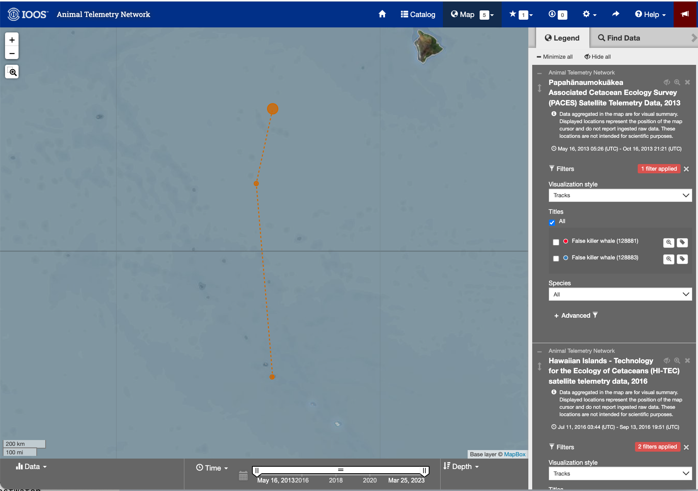
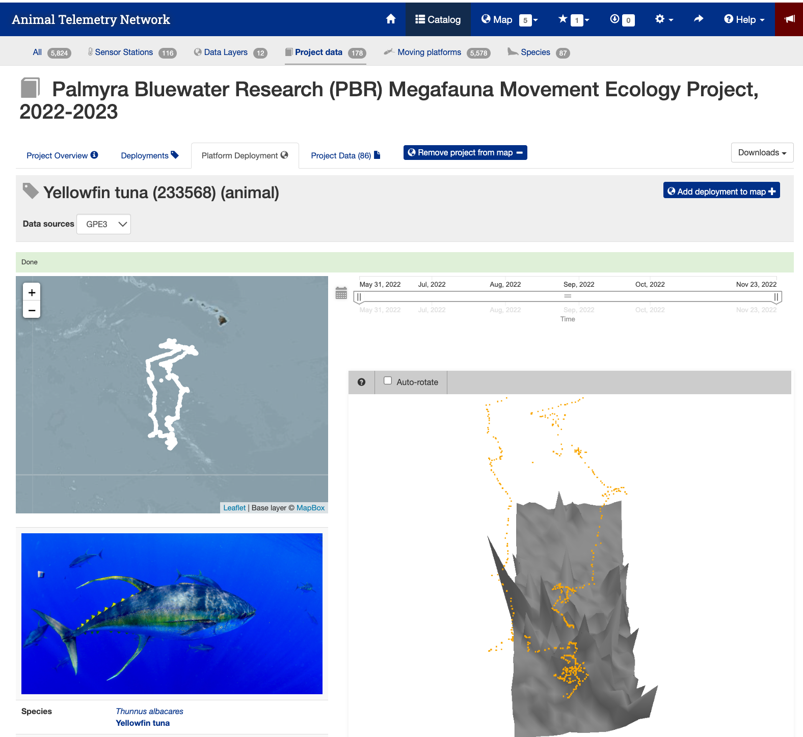
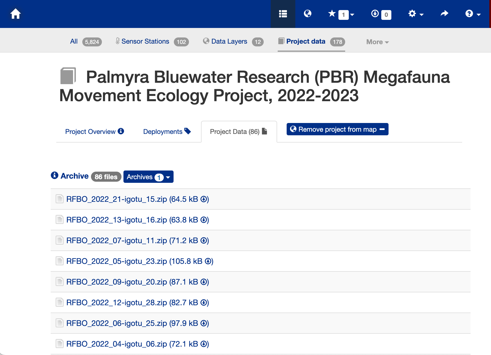
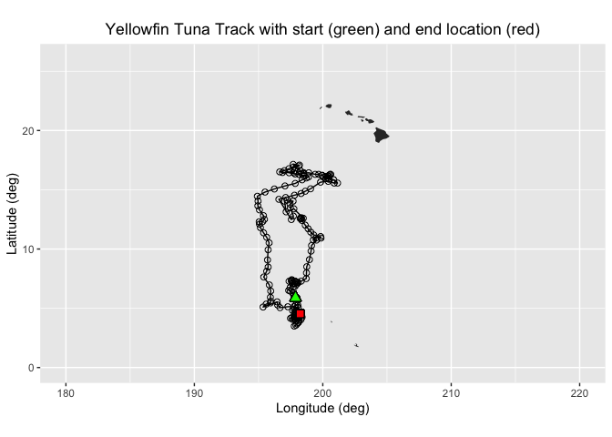
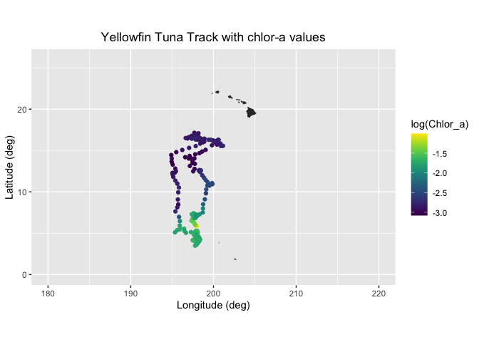

# Matchup Satellite data to track locations

history \| Modified July 2024

## Objective

This tutorial will demonstrate how to extract satellite data around a
set of points defined by longitude, latitude, and time coordinates from
an animal telemetry tag that was acquired from the Animal Telemetry
Network (<https://ioos.noaa.gov/project/atn/>).

## The tutorial demonstrates the following techniques

- Importing track data in csv file to data frame
- Plotting the latitude/longitude points onto a map
- Using rerddapXtraco function to extract satellite data from an ERDDAP
  data server along a track
- Plotting the satellite data onto a map

## Datasets used in this exercise

**Chlorophyll a concentration, the European Space Agency’s Ocean Colour
Climate Change Initiative (OC-CCI) Monthly dataset v6.0**

We’ll use the European Space Agency’s OC-CCI product
(<https://climate.esa.int/en/projects/ocean-colour/>) to obtain
chlorophyll data. This is a merged product combining data from many
ocean color sensors to create a long time series (1997-present).

**Yellowfin tuna telemetry track data**

Marine protected areas (MPAs) in pelagic regions is also called Blue
Water. The Palmyra Bluewater Research (PBR) project seeks to understand
the impact of MPAs on species and ecosystems by tracking at-sea
movements of ten marine animal species at Palmyra Atoll (part of the
U.S. Pacific Remote Islands Marine National Monument). All data were
being collected from adult individuals between May 2022 and June 2023.
They can be accessed via the Animal Telemetry Network (ATN) data portal
for the PBR project under “Project Data”:
(<https://portal.atn.ioos.us/?ls=861Wqpd2#metadata/1f877c4c-7b50-49f5-be86-3354664e0cff/project/files>)

The yellowfin tuna geolocation data is developed as part of the PBR
project. This example track used in the tutorial is from May 2022 to
November 2022. The track data has been previously downloaded, extracted,
and stored in the data folder of this training module.

## Install required packages and load libraries

``` r
# Function to check if pkgs are installed, and install any missing pkgs
pkgTest <- function(x)
{
  if (!require(x,character.only = TRUE))
  {
    install.packages(x,dep=TRUE,repos='http://cran.us.r-project.org')
    if(!require(x,character.only = TRUE)) stop(x, " :Package not found")
  }
}


# Create list of required packages
list.of.packages <- c("rerddap", "plotdap", "parsedate", "ggplot2", "rerddapXtracto",
                       "date", "maps", "mapdata", "RColorBrewer","viridis", "stringr")

# Create list of installed packages
pkges = installed.packages()[,"Package"]

# Install and load all required pkgs
for (pk in list.of.packages) {
  pkgTest(pk)
}
```

## Download animal track data from the ATN website

- **The data you need for this exercise are already in the GitHub
  repository**

- **The following step are show you how to download the data yourself**

### ATN Portal

- Follow the link to the ATN website:
  <https://portal.atn.ioos.us/?ls=O6vlufm7#map>  
- On the right navigational panel, look for the “Palmyra Bluewater
  Research (PBR) Megafauna Movement Ecology Project, 2022-2023” tab.
- Within the tab, scroll to find the telemetry tag labeled “Yellowfin
  tuna (233568)”.
- Click the search icon (maginifying glass) label next to the label to
  zoom into the area the area of the animal track.

<figure>

<figcaption aria-hidden="true">Image of the ATN portal
webpage</figcaption>
</figure>

### Detail page for the Yellowfin tuna (233568)

- Next click the tag icon to the right of the search icon.
- This page shows you details about the animal and the track.

<figure>

<figcaption aria-hidden="true">Image of the detail page for the
Yellowfin Tuna #233568</figcaption>
</figure>

### Data Download Page

- Press the “Project Data” tab near the top of the webpage to bring up
  the data file list.
- Search for the animal id number (233568).
- Click on the link “THUALB_2022_04-PTT_233568.zip (8.6 MB)” to download
  the data.

<figure>

<figcaption aria-hidden="true">Data download page</figcaption>
</figure>

### The Downloaded Data File

- The download will be a zip file. You will need to unzip it.
- The unzipped file folder contains many ancillary data files, but the
  one you are looking for is the CSV file
  (THUALB_2022_04-233568-4-GPE3.csv).
- You don’t have to move this file into the data folder for this
  exercise. It is already there.  
- But if you download the file for a different animal track you would
  need to put the CSV file into the folder.

## Import the track data into a data frame

``` r
# Import csv file into a data frame
file = "../data/THUALB_2022_04-233568-5-GPE3.csv"
pre_tuna_df <- read.csv(file, skip = 5)

# Show 3 rows from the data frame
head(pre_tuna_df, 3)
```

    ##         DeployID    Ptt                 Date Most.Likely.Latitude
    ## 1 THUALB_2022_04 233568 31-May-2022 19:00:00                5.875
    ## 2 THUALB_2022_04 233568 01-Jun-2022 00:00:00                5.875
    ## 3 THUALB_2022_04 233568 01-Jun-2022 04:56:15                5.850
    ##   Most.Likely.Longitude Observation.Type Observed.SST Satellite.SST
    ## 1              -162.125             User           NA            NA
    ## 2              -162.100             None           NA            NA
    ## 3              -161.975     Light - Dusk           NA            NA
    ##   Observed.Depth Bathymetry.Depth Observation.LL..MSS. Observation.Score
    ## 1             NA               NA                   NA          68.60585
    ## 2             NA               NA                   NA                NA
    ## 3            144             2908                   NA          43.16747
    ##                Sunrise               Sunset
    ## 1                                          
    ## 2 01-Jun-2022 16:33:04 02-Jun-2022 04:59:36
    ## 3

``` r
# Convert longitudes to 0~360 (Re-center map to the dateline)
pre_tuna_df['Most.Likely.Longitude'] <- pre_tuna_df['Most.Likely.Longitude'] + 360
# Show converted data frame
head(pre_tuna_df, 3)
```

    ##         DeployID    Ptt                 Date Most.Likely.Latitude
    ## 1 THUALB_2022_04 233568 31-May-2022 19:00:00                5.875
    ## 2 THUALB_2022_04 233568 01-Jun-2022 00:00:00                5.875
    ## 3 THUALB_2022_04 233568 01-Jun-2022 04:56:15                5.850
    ##   Most.Likely.Longitude Observation.Type Observed.SST Satellite.SST
    ## 1               197.875             User           NA            NA
    ## 2               197.900             None           NA            NA
    ## 3               198.025     Light - Dusk           NA            NA
    ##   Observed.Depth Bathymetry.Depth Observation.LL..MSS. Observation.Score
    ## 1             NA               NA                   NA          68.60585
    ## 2             NA               NA                   NA                NA
    ## 3            144             2908                   NA          43.16747
    ##                Sunrise               Sunset
    ## 1                                          
    ## 2 01-Jun-2022 16:33:04 02-Jun-2022 04:59:36
    ## 3

## Convert date string to a date object

``` r
pre_tuna_df$Date <- as.Date(pre_tuna_df$Date, format = "%d-%b-%Y")
head(pre_tuna_df)
```

    ##         DeployID    Ptt       Date Most.Likely.Latitude Most.Likely.Longitude
    ## 1 THUALB_2022_04 233568 2022-05-31                5.875               197.875
    ## 2 THUALB_2022_04 233568 2022-06-01                5.875               197.900
    ## 3 THUALB_2022_04 233568 2022-06-01                5.850               198.025
    ## 4 THUALB_2022_04 233568 2022-06-01                5.900               198.025
    ## 5 THUALB_2022_04 233568 2022-06-01                5.900               198.025
    ## 6 THUALB_2022_04 233568 2022-06-01                5.900               198.025
    ##   Observation.Type Observed.SST Satellite.SST Observed.Depth Bathymetry.Depth
    ## 1             User           NA            NA             NA               NA
    ## 2             None           NA            NA             NA               NA
    ## 3     Light - Dusk           NA            NA            144             2908
    ## 4             None           NA            NA             NA               NA
    ## 5              SST         28.2      28.32458              1             2908
    ## 6     Light - Dawn           NA            NA            112             2908
    ##   Observation.LL..MSS. Observation.Score              Sunrise
    ## 1                   NA          68.60585                     
    ## 2                   NA                NA 01-Jun-2022 16:33:04
    ## 3                   NA          43.16747                     
    ## 4                   NA                NA                     
    ## 5                   NA          76.62995                     
    ## 6                   NA          54.92253                     
    ##                 Sunset
    ## 1                     
    ## 2 02-Jun-2022 04:59:36
    ## 3                     
    ## 4                     
    ## 5                     
    ## 6

## Bin multiple observations from each day into daily mean values

The track data has multiple longitude/latitude/time points for each
date. That temporal resolution is much higher than the daily and month
satellite datasets that are available. So, let’s reduce the multiple
daily values for the animal track data to a single value for each day.
The code below creates a new dataframe that bins data for each date and
calculates the mean for selected columns.

``` r
library(dplyr)
tuna_df <- pre_tuna_df %>% group_by(Date) %>% summarize(Most.Likely.Latitude = mean(Most.Likely.Latitude),
                                         Most.Likely.Longitude = mean(Most.Likely.Longitude),
                                         Satellite.SST = mean(Satellite.SST, na.rm=TRUE),
                                         Observed.SST = mean(Observed.SST, na.rm=TRUE),
                                         Observed.Depth = mean(Observed.Depth, na.rm=TRUE),
                                         Bathymetry.Depth = mean(Bathymetry.Depth, na.rm=TRUE),
                                         )

tuna_df
```

    ## # A tibble: 177 × 7
    ##    Date       Most.Likely.Latitude Most.Likely.Longitude Satellite.SST
    ##    <date>                    <dbl>                 <dbl>         <dbl>
    ##  1 2022-05-31                 5.88                  198.         NaN  
    ##  2 2022-06-01                 5.88                  198           28.3
    ##  3 2022-06-02                 5.92                  198.          28.3
    ##  4 2022-06-03                 5.92                  198.          28.3
    ##  5 2022-06-04                 5.98                  198.          28.3
    ##  6 2022-06-05                 6.11                  198.          28.4
    ##  7 2022-06-06                 6.28                  198.          28.3
    ##  8 2022-06-07                 6.45                  197.          28.3
    ##  9 2022-06-08                 6.51                  197.          28.2
    ## 10 2022-06-09                 6.78                  197.          28.2
    ## # ℹ 167 more rows
    ## # ℹ 3 more variables: Observed.SST <dbl>, Observed.Depth <dbl>,
    ## #   Bathymetry.Depth <dbl>

## Plot the track on a map

``` r
# Download world map
mapWorld <- map_data("world", wrap=c(0,360))

# Map tuna tracks
ggplot(tuna_df, aes(Most.Likely.Longitude,Most.Likely.Latitude)) +
  geom_path(group=1)+
  geom_point(aes(x=Most.Likely.Longitude,y=Most.Likely.Latitude), pch=1, size=2 )+
  geom_point(aes(x=Most.Likely.Longitude[1],y=Most.Likely.Latitude[1]),fill="green", shape=24, size=3)+
  geom_point(aes(x=Most.Likely.Longitude[length(Most.Likely.Longitude)],y=Most.Likely.Latitude[length(Most.Likely.Latitude)]), shape=22, size=3, fill="red")+
  geom_polygon(data = mapWorld, aes(x=long, y = lat, group = group)) + 
  coord_fixed(xlim = c(180,220),ylim = c(0,26))+
  labs(x="Longitude (deg)", y="Latitude (deg)", title="Yellowfin Tuna Track with start (green) and end location (red)")+
  theme(plot.title=element_text(hjust=0.5), aspect.ratio=0.6)
```

<!-- -->

In this exercise, two different ways of extracting data from ERDDAP data
server along a track of xyt points are demonstrated:

1.  Using the **rerddapXtracto** package which was written specifically
    for this task
2.  For those who want to know what goes on “under the hood”, we will
    show how to manually construct ERDDAP data-request URLs to download
    the data.

### Extracting XYT data using the **rerddapXtracto** package

We will use the \``rxtracto` function of the **rerddapXtracto** package,
which was written to simplify data extraction from ERDDAP servers.

**Let’s use data from the monthly product of the OC-CCI datasets.**  

Ideally, we would work with daily data since we have one location per
day. But chlorophyll data are severely affected by clouds (i.e. lots of
missing data), so you might need to use weekly or even monthly data to
get sufficient non-missing data. We will start with the monthly chl-a
data since it contains fewer data gaps.

The ERDDAP URL to the monthly product is below:  
<https://oceanwatch.pifsc.noaa.gov/erddap/griddap/esa-cci-chla-monthly-v6-0>

**A note on dataset selection**  
We have preselected the dataset because we know it will work with this
exercise. If you were selecting datasets on your own, you would want to
check out the dataset to determine if its spatial and temporal coverages
are suitable for your application. Following the link above you will
find:

The latitude range is -89.97916 to 89.97916 and the longitude range is
0.020833 to 359.97916, which covers the track latitude range of 23.72 to
41.77 and longitude range of 175.86 to 248.57.

The time range is 1997-09-04 to 2023-12-01 (at the day of this writing),
which covers the track time range of 2022-05-30 to 2023-01-18.

You should also note the name of the variable you will be downloading.
For this dataset it is “**chlor_a**”

``` r
# Set dataset ID
dataset <- 'esa-cci-chla-monthly-v6-0'

# Get data information from ERDDAP server
dataInfo <- rerddap::info(dataset, url= "https://oceanwatch.pifsc.noaa.gov/erddap")
```

## Examine metadata

`rerddap::info` returns the metadata of the requested dataset. We can
first understand the attributes dataInfo includes then examine each
attribute.

``` r
# Display the metadata
dataInfo
```

    ## <ERDDAP info> esa-cci-chla-monthly-v6-0 
    ##  Base URL: https://oceanwatch.pifsc.noaa.gov/erddap 
    ##  Dataset Type: griddap 
    ##  Dimensions (range):  
    ##      time: (1997-09-04T00:00:00Z, 2023-12-01T00:00:00Z) 
    ##      latitude: (-89.97916666666666, 89.97916666666667) 
    ##      longitude: (0.020833333333314386, 359.97916666666663) 
    ##  Variables:  
    ##      chlor_a: 
    ##          Units: mg m-3 
    ##      chlor_a_log10_bias: 
    ##      chlor_a_log10_rmsd: 
    ##      MERIS_nobs_sum: 
    ##      MODISA_nobs_sum: 
    ##      OLCI_A_nobs_sum: 
    ##      OLCI_B_nobs_sum: 
    ##      SeaWiFS_nobs_sum: 
    ##      total_nobs_sum: 
    ##      VIIRS_nobs_sum:

``` r
# Display data attributes
names(dataInfo)
```

    ## [1] "variables" "alldata"   "base_url"

``` r
# Examine attribute: variables
dataInfo$variables
```

    ##         variable_name data_type actual_range
    ## 1             chlor_a     float             
    ## 2  chlor_a_log10_bias     float             
    ## 3  chlor_a_log10_rmsd     float             
    ## 4      MERIS_nobs_sum     float             
    ## 5     MODISA_nobs_sum     float             
    ## 6     OLCI_A_nobs_sum     float             
    ## 7     OLCI_B_nobs_sum     float             
    ## 8    SeaWiFS_nobs_sum     float             
    ## 9      total_nobs_sum     float             
    ## 10     VIIRS_nobs_sum     float

``` r
# Distribute attributes of dataInfo$alldata
names(dataInfo$alldata)
```

    ##  [1] "NC_GLOBAL"          "time"               "latitude"          
    ##  [4] "longitude"          "chlor_a"            "MERIS_nobs_sum"    
    ##  [7] "MODISA_nobs_sum"    "OLCI_A_nobs_sum"    "OLCI_B_nobs_sum"   
    ## [10] "SeaWiFS_nobs_sum"   "VIIRS_nobs_sum"     "chlor_a_log10_bias"
    ## [13] "chlor_a_log10_rmsd" "total_nobs_sum"

### Extract data using the rxtracto function

First we need to define the bounding box within which to search for
coordinates. The **rxtracto** function allows you to set the size of the
box used to collect data around the track points using the xlen and ylen
arguments. The values for xlen and ylen are in degrees. For our example,
we can use 0.2 degrees for both arguments. Note: You can also submit
vectors for xlen and ylen, as long as they are the same length as
xcoord, ycoord, and tcoord if you want to set a different search radius
around each track point.

``` r
# Set the variable we want to extract data from:
parameter <- 'chlor_a'

# Set xlen, ylen to 0.2 degree
xlen <- 0.2 
ylen <- 0.2

# Create date column using year, month and day in a format ERDDAP will understand (eg. 2008-12-15)
#tuna_df$date <-as.Date(tuna_df$Date, format = "%d-%b-%Y")

# Get variables x, y, t coordinates from tuna track data
xcoords <- tuna_df$Most.Likely.Longitude
ycoords <- tuna_df$Most.Likely.Latitude
tcoords <- tuna_df$Date

# Extract satellite data using x, y, t coordinates from tuna track data
chl_track <- rxtracto(dataInfo, 
                  parameter=parameter, 
                  xcoord=xcoords, ycoord=ycoords, 
                  tcoord=tcoords, xlen=xlen, ylen=ylen)
```

## Check the output of the rxtracto function

``` r
# Check all variables extracted using rxtracto
str(chl_track)
```

    ## List of 13
    ##  $ mean chlor_a     : num [1:177] 0.35 0.34 0.349 0.367 0.276 ...
    ##  $ stdev chlor_a    : num [1:177] 0.373 0.372 0.373 0.407 0.154 ...
    ##  $ n                : int [1:177] 36 36 36 30 25 36 30 36 36 30 ...
    ##  $ satellite date   : chr [1:177] "2022-06-01T00:00:00Z" "2022-06-01T00:00:00Z" "2022-06-01T00:00:00Z" "2022-06-01T00:00:00Z" ...
    ##  $ requested lon min: num [1:177] 198 198 198 198 198 ...
    ##  $ requested lon max: num [1:177] 198 198 198 198 198 ...
    ##  $ requested lat min: num [1:177] 5.78 5.79 5.83 5.83 5.88 ...
    ##  $ requested lat max: num [1:177] 5.97 5.98 6.02 6.02 6.08 ...
    ##  $ requested z min  : logi [1:177] NA NA NA NA NA NA ...
    ##  $ requested z max  : logi [1:177] NA NA NA NA NA NA ...
    ##  $ requested date   : chr [1:177] "2022-05-31" "2022-06-01" "2022-06-02" "2022-06-03" ...
    ##  $ median chlor_a   : num [1:177] 0.235 0.227 0.232 0.236 0.232 ...
    ##  $ mad chlor_a      : num [1:177] 0.017 0.0148 0.0172 0.0151 0.0192 ...
    ##  - attr(*, "row.names")= chr [1:177] "1" "2" "3" "4" ...
    ##  - attr(*, "class")= chr [1:2] "list" "rxtractoTrack"
    ##  - attr(*, "base_url")= chr "https://oceanwatch.pifsc.noaa.gov/erddap/"
    ##  - attr(*, "datasetid")= chr "esa-cci-chla-monthly-v6-0"

**rxtracto** computes statistics using all the pixels found in the
search radius around each track point.

## Plotting the results using plotTrack

We will use the “plotTrack” function to plot the results. “plotTrack” is
a function of the “rerddapXtracto” package designed specifically to plot
the results of the “rxtracto” function. It provides an easy way to make
a quick plot, however it’s not very customizable.

``` r
# Plot tracks with color: algae specifically designed for chlorophyll
plotTrack(chl_track, xcoords, ycoords, tcoords, size=3, plotColor = 'viridis')
```

<!-- -->

## Animating the track

One of the nice features of the “plotTrack” function is that it is very
easy to make an animation of the track data. This will take a minute to
run. It creates an animated gif that will display in the Rstudio viewer
window once the encoding to gif is done. Note: this works with but
doesn’t require the latest versions of R Studio or rerddapXtracto
package (e.g., it works with R Studio Version 2023.12.1+402 and
rerddapXtracto version 1.1.5).

``` r
# Animate tracks

make180 <- function(lon) {
    ind <- which(lon > 180)
    lon[ind] <- lon[ind] - 360
   return(lon)
}

plotTrack(chl_track,
          make180(xcoords),
          ycoords, tcoords,
          plotColor = 'viridis',
          animate = TRUE,
          cumulative = TRUE)
```

    ## # A tibble: 177 × 7
    ##    format width height colorspace matte filesize density
    ##    <chr>  <int>  <int> <chr>      <lgl>    <int> <chr>  
    ##  1 gif      672    480 sRGB       TRUE         0 72x72  
    ##  2 gif      672    480 sRGB       TRUE         0 72x72  
    ##  3 gif      672    480 sRGB       TRUE         0 72x72  
    ##  4 gif      672    480 sRGB       TRUE         0 72x72  
    ##  5 gif      672    480 sRGB       TRUE         0 72x72  
    ##  6 gif      672    480 sRGB       TRUE         0 72x72  
    ##  7 gif      672    480 sRGB       TRUE         0 72x72  
    ##  8 gif      672    480 sRGB       TRUE         0 72x72  
    ##  9 gif      672    480 sRGB       TRUE         0 72x72  
    ## 10 gif      672    480 sRGB       TRUE         0 72x72  
    ## # ℹ 167 more rows

## Plotting the results using ggplot

### Create a data frame with the tuna track and the output of rxtracto

If we to do an customization of the plot, its better to plot the data
using ggplot. We will first create a data frame that contains longitudes
and latitudes from the tuna and associated satellite chlor-a values.

``` r
# Create a data frame of coords from tuna and chlor_a values 
new_df <- as.data.frame(cbind(xcoords, ycoords,  
                              chl_track$`requested lon min`, 
                              chl_track$`requested lon max`, 
                              chl_track$`requested lat min`, 
                              chl_track$`requested lon max`,  
                              chl_track$`mean chlor_a`)
                        )

# Set variable names
names(new_df) <- c("Lon", 
                   "Lat", 
                   "Matchup_Lon_Lower",
                   "Matchup_Lon_Upper",
                   "Matchup_Lat_Lower",
                   "Matchup_Lat_Upper", 
                   "Chlor_a")

write.csv(new_df, "tuna_matchup_df.csv")
```

### Plot using ggplot

``` r
# Import world map
mapWorld <- map_data("world", wrap=c(0,360))

# Draw the track positions with associated chlora values
ggplot(new_df) +
  geom_point(aes(Lon,Lat,color=log(Chlor_a))) +
  geom_polygon(data = mapWorld, aes(x=long, y = lat, group = group)) + 
  coord_fixed(xlim = c(180,220),ylim = c(0,26)) +
  scale_color_viridis(discrete = FALSE) +
  labs(x="Longitude (deg)", y="Latitude (deg)", title="Yellowfin Tuna Track with chlor-a values") +
  theme(plot.title=element_text(hjust=0.5))
```

<!-- -->

### Extracting XYT data by constructing the URL data requests manually

First we need to set up the ERDDAP URL using the datasets ID and the
name of the variable we are interested in. Note that we are requesting
the data as .csv

`data_url = "https://oceanwatch.pifsc.noaa.gov/erddap/griddap/esa-cci-chla-monthly-v6-0.csv?chlor_a"`

For a refresher of how to construct an ERDDAP data-request URL, please
review the ERDDAP tutorial “04-Erddapurl.md” at the following link:
<https://github.com/coastwatch-training/CoastWatch-Tutorials/blob/main/ERDDAP-basics/lessons/>

``` r
# Set erddap address
erddap_base_url <- "https://oceanwatch.pifsc.noaa.gov/erddap/griddap/esa-cci-chla-monthly-v6-0.csv?chlor_a"

# Get longitude and latitude from tuna track data
lon <- tuna_df$Most.Likely.Longitude
lat <- tuna_df$Most.Likely.Latitude

# Get time from tuna track data and convert into ERDDAP date format
dates2 <- as.Date(tuna_df$Date, format = "%d-%b-%Y")

# Initatilize tot variable where data will be downloaded to
tot <- rep(NA, 4)

# Loop through each tuna track data
for (i in 1:dim(tuna_df)[1]) {

  # follow the progress of the loop
  cat("\014")
  cat(" Loop ", i, " of ", dim(tuna_df)[1])
  
  # Create erddap URL by adding lat, lon, dates of each track point 
   url <-  paste(erddap_base_url,
                 "[(", dates2[i], "):1:(", dates2[i],
                 ")][(", lat[i], "):1:(", lat[i],
                 ")][(", lon[i], "):1:(", lon[i], ")]", sep = "")  
   
   # Request and load satelite data from ERDDAP
   new <- read.csv(url, skip=2, header = FALSE) 
   
   # Append the data
   tot <- rbind(tot, new)   
   
}
```

    ##  Loop  1  of  177 Loop  2  of  177 Loop  3  of  177 Loop  4  of  177 Loop  5  of  177 Loop  6  of  177 Loop  7  of  177 Loop  8  of  177 Loop  9  of  177 Loop  10  of  177 Loop  11  of  177 Loop  12  of  177 Loop  13  of  177 Loop  14  of  177 Loop  15  of  177 Loop  16  of  177 Loop  17  of  177 Loop  18  of  177 Loop  19  of  177 Loop  20  of  177 Loop  21  of  177 Loop  22  of  177 Loop  23  of  177 Loop  24  of  177 Loop  25  of  177 Loop  26  of  177 Loop  27  of  177 Loop  28  of  177 Loop  29  of  177 Loop  30  of  177 Loop  31  of  177 Loop  32  of  177 Loop  33  of  177 Loop  34  of  177 Loop  35  of  177 Loop  36  of  177 Loop  37  of  177 Loop  38  of  177 Loop  39  of  177 Loop  40  of  177 Loop  41  of  177 Loop  42  of  177 Loop  43  of  177 Loop  44  of  177 Loop  45  of  177 Loop  46  of  177 Loop  47  of  177 Loop  48  of  177 Loop  49  of  177 Loop  50  of  177 Loop  51  of  177 Loop  52  of  177 Loop  53  of  177 Loop  54  of  177 Loop  55  of  177 Loop  56  of  177 Loop  57  of  177 Loop  58  of  177 Loop  59  of  177 Loop  60  of  177 Loop  61  of  177 Loop  62  of  177 Loop  63  of  177 Loop  64  of  177 Loop  65  of  177 Loop  66  of  177 Loop  67  of  177 Loop  68  of  177 Loop  69  of  177 Loop  70  of  177 Loop  71  of  177 Loop  72  of  177 Loop  73  of  177 Loop  74  of  177 Loop  75  of  177 Loop  76  of  177 Loop  77  of  177 Loop  78  of  177 Loop  79  of  177 Loop  80  of  177 Loop  81  of  177 Loop  82  of  177 Loop  83  of  177 Loop  84  of  177 Loop  85  of  177 Loop  86  of  177 Loop  87  of  177 Loop  88  of  177 Loop  89  of  177 Loop  90  of  177 Loop  91  of  177 Loop  92  of  177 Loop  93  of  177 Loop  94  of  177 Loop  95  of  177 Loop  96  of  177 Loop  97  of  177 Loop  98  of  177 Loop  99  of  177 Loop  100  of  177 Loop  101  of  177 Loop  102  of  177 Loop  103  of  177 Loop  104  of  177 Loop  105  of  177 Loop  106  of  177 Loop  107  of  177 Loop  108  of  177 Loop  109  of  177 Loop  110  of  177 Loop  111  of  177 Loop  112  of  177 Loop  113  of  177 Loop  114  of  177 Loop  115  of  177 Loop  116  of  177 Loop  117  of  177 Loop  118  of  177 Loop  119  of  177 Loop  120  of  177 Loop  121  of  177 Loop  122  of  177 Loop  123  of  177 Loop  124  of  177 Loop  125  of  177 Loop  126  of  177 Loop  127  of  177 Loop  128  of  177 Loop  129  of  177 Loop  130  of  177 Loop  131  of  177 Loop  132  of  177 Loop  133  of  177 Loop  134  of  177 Loop  135  of  177 Loop  136  of  177 Loop  137  of  177 Loop  138  of  177 Loop  139  of  177 Loop  140  of  177 Loop  141  of  177 Loop  142  of  177 Loop  143  of  177 Loop  144  of  177 Loop  145  of  177 Loop  146  of  177 Loop  147  of  177 Loop  148  of  177 Loop  149  of  177 Loop  150  of  177 Loop  151  of  177 Loop  152  of  177 Loop  153  of  177 Loop  154  of  177 Loop  155  of  177 Loop  156  of  177 Loop  157  of  177 Loop  158  of  177 Loop  159  of  177 Loop  160  of  177 Loop  161  of  177 Loop  162  of  177 Loop  163  of  177 Loop  164  of  177 Loop  165  of  177 Loop  166  of  177 Loop  167  of  177 Loop  168  of  177 Loop  169  of  177 Loop  170  of  177 Loop  171  of  177 Loop  172  of  177 Loop  173  of  177 Loop  174  of  177 Loop  175  of  177 Loop  176  of  177 Loop  177  of  177

``` r
# Delete the first row (default column names)
tot <- tot[-1, ]

# Rename columns
names(tot) <- c("chlo_date", "matched_lat", "matched_lon", "matched_chl.m")

# Create data frame combining tuna track data and the chlo-a data
chl_track2 <- data.frame(tuna_df, tot)

# Write the data frame to csv file
write.csv(chl_track2, 'tuna-track-chl.m.csv', row.names = FALSE)
```

### Make a map of the data extracted using ggplot

``` r
# Draw the track positions with associated chlora values
ggplot(chl_track2) +
  geom_point(aes(Most.Likely.Longitude,Most.Likely.Latitude,color=log(matched_chl.m))) +
  geom_polygon(data = mapWorld, aes(x=long, y = lat, group = group)) + 
  coord_fixed(xlim = c(180,220),ylim = c(0,26)) +
  scale_color_viridis(discrete = FALSE) +
  labs(x="Longitude (deg)", y="Latitude (deg)", title="Yellowfin Tuna Track with chlor-a values")+
  theme(plot.title=element_text(hjust=0.5))
```

<!-- -->

### Plot histogram of chlorophyll

How do the chlorophyll values of the tuna track compare to values in the
surrounding environment? Meaning does the tuna seem to have a preference
for certain chlorophyll values? To look at this we will plot a
histograms of the track chl valuesand those of the surrounding area.

First we will get a 3D block of chl data from the region and of the tuna
track over the span of time the tuna was in that area. We will use the
‘xtracto_3d’ function of rerddapXtracto to get the data. This data call
will take a few minutes.

``` r
chl_grid <- rxtracto_3D(dataInfo, 
                  parameter=parameter, 
                  xcoord=c(min(xcoords),max(xcoords)), 
                  ycoord=c(min(ycoords),max(ycoords)), 
                  tcoord=c(min(tcoords),max(tcoords)))

chl_area <- as.vector(chl_grid$chlor_a) 

# remove NA values 
chl_area <- chl_area[!is.na(chl_area)]

# vector or tuna chlorophyll 

chl_tuna <- chl_track$`mean chlor_a`
```

Now we we plot histograms of all the chlorphyll values in the area, and
those of the tuna track.

``` r
ggplot(as.data.frame(chl_area)) + 
      geom_histogram(aes(x=chl_area,y=after_stat(density),color = "darkgray",fill='Area'),color='black', bins=50) + 
      geom_histogram(data=as.data.frame(chl_tuna), aes(x=chl_tuna,y=after_stat(density),color='green', fill='Tuna'),color='black',bins=50, alpha=.4) + 
      scale_x_continuous(limits = c(0,.9), expand = c(0, 0)) + 
      scale_y_continuous(limits = c(0,15), expand = c(0, 0)) +
      labs(x='Chlorophyll values',y='Density') + 
      theme_bw() + 
      scale_fill_manual(values=c("darkgray","green"),'')
```

<!-- -->

##### Exercise 1:

Repeat the steps above with a different satellite dataset. For example,
extract sea surface temperature data using the following dataset:
<https://coastwatch.pfeg.noaa.gov/erddap/griddap/nesdisGeoPolarSSTN5NRT_Lon0360.html>
\\ This dataset is a different ERDDAP, so remember to change the base
URL. \\ Set the new dataset ID and variable name.

##### Exercise 2:

Go to an ERDDAP of your choice, find a dataset of interest, generate the
URL, copy it and edit the script above to run a match up on that
dataset. To find other ERDDAP servers, you can use this search engine:
<http://erddap.com/> \\ This dataset will likely be on a different
ERDDAP, so remember to change the base URL. \\ Set the new dataset ID
and variable name. \\ Check the metadata to make sure the dataset covers
the spatial and temporal range of the track dataset.

##### Optional

Repeat the steps above with a daily version of the OC-CCI dataset to see
how cloud cover can reduce the data you retrieve.
<https://coastwatch.pfeg.noaa.gov/erddap/griddap/pmlEsaCCI60OceanColorDaily_Lon0360.html>
