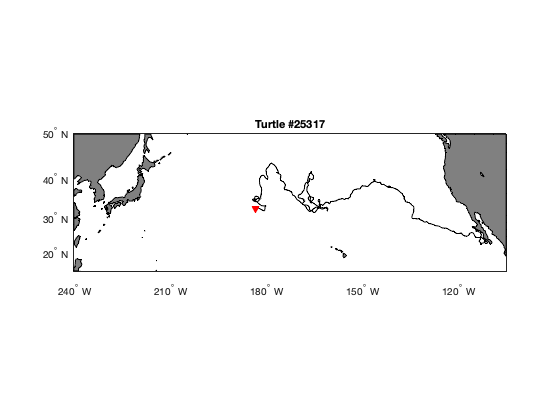
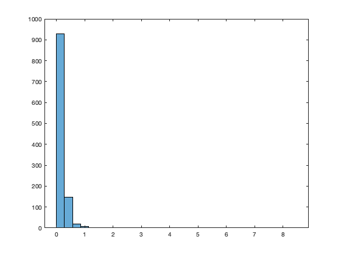
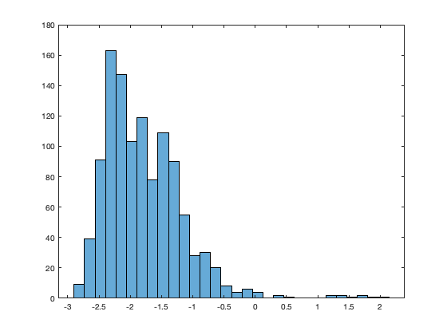
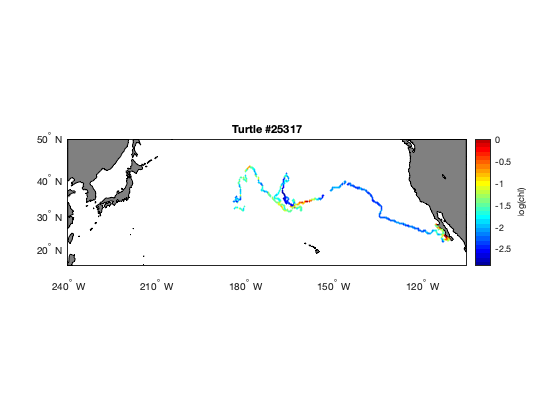
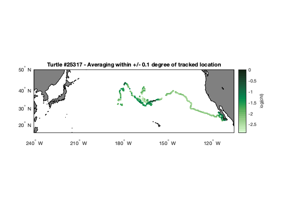

## Extract data along a turtle track

This tutorial will teach you how to plot a loggerhead turtle track on a map.  The turtle was raised in captivity in Japan, then tagged and released on 05/04/2005 in the Central Pacific. It transmitted for over 3 years and went all the way to the southern tip of Baja California!

The track data can be downloaded here: https://oceanwatch.pifsc.noaa.gov/files/25317_05.dat (You may need to copy and save the data.)

We'll extract chlorophyll concentration and SST at each location along the track, and plot the data.

Let's load the track data.

```matlab
turtle = readtable("25317_05.dat", "Delimiter", ",");
```

### Let's plot the track on a map

```matlab
figure
axesm('mercator', 'MapLatLimit', [15 50], 'MapLonLimit', [120 255], 'MeridianLabel', 'on', ...
    'ParallelLabel', 'on', 'MLabelLocation', 120:20:-100, 'PLabelLocation', 20:10:50, ...
    'MLabelParallel', 'south'); % This is the basemap

% Add land and color it grey
geoshow('landareas.shp', 'FaceColor', [0.5 0.5 0.5]);

% Add the turtle track, in black
plotm(turtle.mean_lat, turtle.mean_lon, 'k');

% Mark the first location with a red triangle
plotm(turtle.mean_lat(1), turtle.mean_lon(1), 'rv', 'MarkerFaceColor', 'r');

% Add a title
title('Turtle #25317');
tightmap
```


### Now let's extract data along the track

We are going to grab data from ERDDAP (https://oceanwatch.pifsc.noaa.gov/erddap/griddap) so we need to set up the ERDDAP URL using the datasets ID and the name of the variable we are interested in.  Note that we are requesting the data as .csv


### Chlorophyll-a concentration
Ideally, we would work with daily data since we have one location per day. But chlorophyll data are severely affected by clouds (i.e., lots of missing data), so you might need to use weekly or even monthly data to get sufficient non-missing data. We will start with the monthly chl-a data since it contains fewer gaps.  As a separate exercise, you can run all 3 temporal resolutions, and plot a time-series of each to compare.

```matlab
% Let's start by creating a shortcut to the link we're going to be calling
% repeatedly
MODIS = "https://oceanwatch.pifsc.noaa.gov/erddap/griddap/aqua_chla_monthly_2018_0.csv?chlor_a";

% We also need to format the dates in a way that ERDDAP understands, i.e., 2010-12-15:
turtle_datenum = datenum(turtle.year, turtle.month, turtle.day);
turtle_dates = datestr(turtle_datenum, "yyyy-mm-dd");
```

For each date and location, we'll extract a value of monthly chl-a concentration.  To do this, we need to pass the needed parameters (which dataset, which date, which lon, and which lat) to ERDDAP by building the URL in a loop for each point of the track.

NOTE: Because this is a very long track, running the loop on the entire track will take a while (about 5 mins). You could print the index value to the screen to gauge your progress, but this will slow down the loop.  If the loop takes too long, just run it on the first ~100 points of the track, by changing the for statement below.

If the process breaks in the middle of the loop (sometimes there is an issue connecting to the ERDDAP server, which will cause an error and interrupt the loop), get the value of r, which will tell you which index the loop stopped at, and restart the loop there. For example, if the loop stopped at r = 163, restart the loop this way: for r = 163:1:height(turtle)

```matlab
% First, we'll create an empty matrix to hold the chlorophyll data.  This
% isn't strictly necessary, but it will speed things up a little.
% The data we extract will have 4 columns:
% 1: date
% 2: matched latitude
% 3: matched longitude
% 4: chlor_a
% You can confirm this by pasting the URL below into a browser and viewing
% the resulting data.  
turtle_chl(1:height(turtle), 1:4) = NaN; 

for r = 1:1:height(turtle)
    % Create url from tag position
    url = strcat(MODIS, '[(', num2str(turtle_dates(r, 1:10)), '):1:(', num2str(turtle_dates(r, 1:10)), ...
       ')][(', num2str(turtle.mean_lat(r)), '):1:(', num2str(turtle.mean_lat(r)), ')][(', ...
       num2str(turtle.mean_lon(r)), '):1:(', num2str(turtle.mean_lon(r)), ')]');
    
    % Access url
    chl = webread(url);
    
    % Add data from url to our empty matrix
    % First, time (there's probably a better way to do this...)
    % We're going to keep time in the datenum format for now.
    chl_time = chl.time{:};
    turtle_chl(r,1) = datenum(datetime(chl_time(1:10), 'InputFormat', 'yyyy-MM-dd'));
    
    % Now the remaining variables
    turtle_chl(r,2) = chl.latitude;
    turtle_chl(r,3) = chl.longitude;
    turtle_chl(r,4) = chl.chlor_a;
end
```

We now have a value of monthly chlorophyll-a concentration for each location/date combination along the turtle track.  Let's save this information so we have it for future use. 

```matlab
% There are two options for saving your output.  If you don't care about
% including the header information, you can simply save the turtle_chl
% matrix.
writematrix(turtle_chl, 'turtle_chl_NoHeader.csv');

% To add the header, we just need to turn the matrix into a table.
matched_date = turtle_chl(:,1);
matched_lat = turtle_chl(:,2);
matched_lon = turtle_chl(:,3);
matched_chl = turtle_chl(:,4);
turtle_chl_table = table(matched_date, matched_lat, matched_lon, matched_chl);
writetable(turtle_chl_table, 'turtle_chl_WithHeader.csv');

% Note that: 
% 1) We kept the date in the 'datenum' format.  This can be changed to a
% datevec if you'd like.  See the code in the previous tutorials for help
% with this.
% 2) We saved the files to our working directory.  If you want to save the
% files elsewhere, just edit the path.
```

#### On your own!
* Exercise 1: Repeat the steps above with a different dataset. For example, extract sea surface temperature data using the following dataset: https://oceanwatch.pifsc.noaa.gov/erddap/griddap/CRW_sst_v1_0.html 

* Exercise 2: Go to an ERDDAP of your choice, find a dataset of interest, generate the URL, copy it and edit the script above to run a match up on that dataset.  To find other ERDDAP servers, you can use this search engine: http://erddap.com/ Note: some ERDDAPs are slower than others, so this could take a lot longer. If it takes too long, adjust the for loop to request data for only the first 100 days of our track.

### Plot #2

Let's plot the track, color coded using values of monthly chlorophyll concentration.  To do this, we'll use the turtle_chl matrix we created above.  We'll also need to decide how to color code the track.  Let's take a look at the range of chlorophyll values.

```matlab
% Create a histogram with 30 bins
figure
histogram(turtle_chl(:,4), 30);
```


Notice that the range of value is large, roughly 0 - 8 mg chl per m^3, but that nearly all the values are small.  This suggests that we should log-transform the chlorophyll data.  Let's take a look at the log-transformed values.

```matlab
% Create a histogram with 30 bins
figure
histogram(log(turtle_chl(:,4)), 30);
```



The range of the log-transformed values is roughly -3 - 2, but most of the values are greater than -3 and less than 0.  So, for our plot, we'll use the log-transformed chlorophyll values and set the color range to -2.9 - 0.

```matlab
figure
axesm('mercator', 'MapLatLimit', [15 50], 'MapLonLimit', [120 255], 'MeridianLabel', 'on', ...
    'ParallelLabel', 'on', 'MLabelLocation', 120:20:-100, 'PLabelLocation', 20:10:50, ...
    'MLabelParallel', 'south'); % This is the basemap
% Add land and color it grey
geoshow('landareas.shp', 'FaceColor', [0.5 0.5 0.5]);

% Add the turtle track, with a marker size of 5 
% Note that we're using 'scatterm' here instead of 'plotm'.  This is so
% that we can control the colors of the individual points (here, based on
% the log-transformed chlorophyll value).
scatterm(turtle_chl(:,2), turtle_chl(:,3), 5, log(turtle_chl(:,4)), 'o', 'Filled');
% Set the color map to jet colors, with 30 levels, ranging from -2.9 to 0.
colormap(jet(30));
caxis([-2.9 0]);

% Add a color bar and label it
c = colorbar;
c.Label.String = 'log(chl)';

% Add a title
title('Turtle #25317');
tightmap
```


#### On your own!
* Exercise 3: plot the track, color coded using values of monthly sea surface temperature. You can confirm for yourself that it's not necessary to log-transform SST.

### Additional Options
In the example above, we downloaded data from as close to the track position as possible.  But, you could instead average all points within a given distance of a track position.  Here's how you'd do that.

```matlab
% Like last time, we'll create an empty matrix to hold the chlorophyll data.  This
% isn't strictly necessary, but it will speed things up a little.
% The data we extract will have 4 columns:
% 1: date
% 2: matched latitude
% 3: matched longitude
% 4: chlor_a
% You can confirm this by pasting the URL below into a browser and viewing
% the resulting data.  
turtle_chl_radius(1:height(turtle), 1:4) = NaN; 
% We also need to define the radius of the area we want to average.  
% For this example, let's say that radius is 0.1 degrees.  So, we want all
% values within +/- 0.1 degrees of the track location.
radius = 0.1;

% When we create the url, we'll need to subtract this radius from the
% minimum lat and lon, and add it to the maximum lat and lon.
for r = 1:1:height(turtle)
    % Create url from tag position
    url_rad = strcat(MODIS, '[(', num2str(turtle_dates(r, 1:10)), '):1:(', num2str(turtle_dates(r, 1:10)), ...
       ')][(', num2str(turtle.mean_lat(r) + radius), '):1:(', num2str(turtle.mean_lat(r) - radius), ...
       ')][(', num2str(turtle.mean_lon(r) - radius), '):1:(', num2str(turtle.mean_lon(r) + radius), ')]');
    
    % Access url
    chl_rad = webread(url_rad);
    
    % The data we access via the url now has several lines.  We'll average
    % the chlorophyll-a values.  
    % We'll also average the lat and lon positions, but there are various
    % options for how you could handle this (e.g., using the tag location
    % instead)
    
    % Add data from url to our empty matrix
    % First, time, which is the same for all rows 
    % We're going to keep time in the datenum format for now.
    chl_rad_time = chl_rad.time{1,:};
    turtle_chl_radius(r,1) = datenum(datetime(chl_rad_time(1:10), 'InputFormat', 'yyyy-MM-dd'));
    
    % Now the remaining variables
    turtle_chl_radius(r,2) = mean(chl_rad.latitude);
    turtle_chl_radius(r,3) = mean(chl_rad.longitude);
    turtle_chl_radius(r,4) = mean(chl_rad.chlor_a);
end
```

So far in our tutorials, we've been using Matlab's built-in jet color palette.  However, there are a lot of other color options that we could use.  One tool with a range of palettes is the Climate Data Toolbox for Matlab.  You can read how to install this add-on here: https://chadagreene.com/CDT/CDT_Getting_Started.html.  Now that you've followed those steps, let's use their algae color map to plot the chorlophyll values along the track. 

```matlab
figure
axesm('mercator', 'MapLatLimit', [15 50], 'MapLonLimit', [120 255], 'MeridianLabel', 'on', ...
    'ParallelLabel', 'on', 'MLabelLocation', 120:20:-100, 'PLabelLocation', 20:10:50, ...
    'MLabelParallel', 'south'); % This is the basemap

% Add land and color it grey
geoshow('landareas.shp', 'FaceColor', [0.5 0.5 0.5]);

% Add the turtle track, with a marker size of 10 
% Note that we're using 'scatterm' here instead of 'plotm'.  This is so
% that we can control the colors of the individual points (here, based on
% the log-transformed chlorophyll value).
scatterm(turtle_chl_radius(:,2), turtle_chl_radius(:,3), 10, log(turtle_chl_radius(:,4)), 'o', 'Filled');

% Set the color map to algae, with 30 levels, ranging from -2.9 to 0.
cmocean('algae', 30);
caxis([-2.9 0]);

% Add a color bar and label it
c = colorbar;
c.Label.String = 'log(chl)';

% Add a title
title('Turtle #25317 - Averaging within +/- 0.1 degree of tracked location');
tightmap
```
