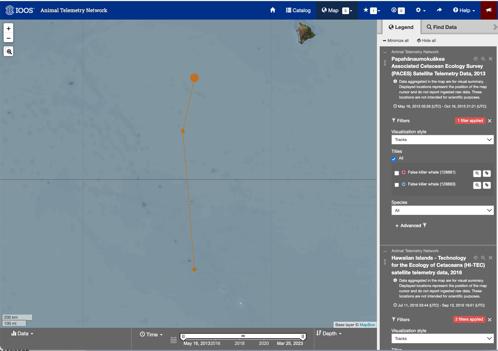
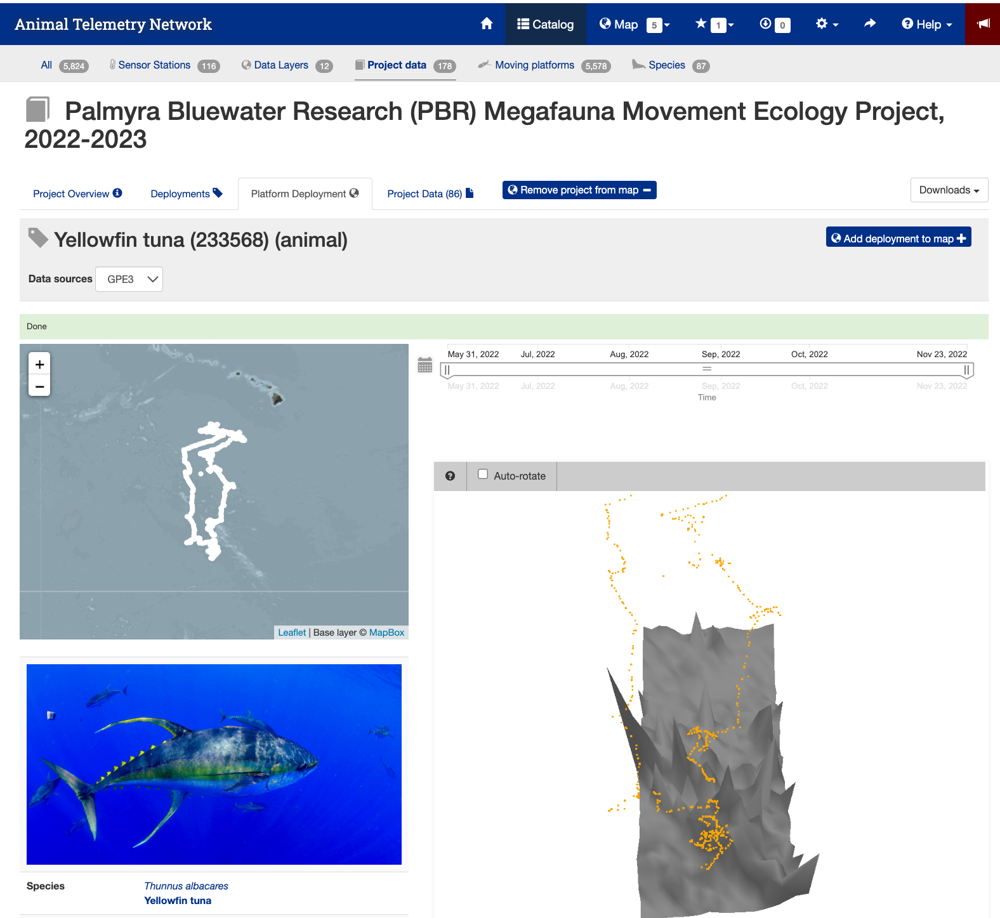
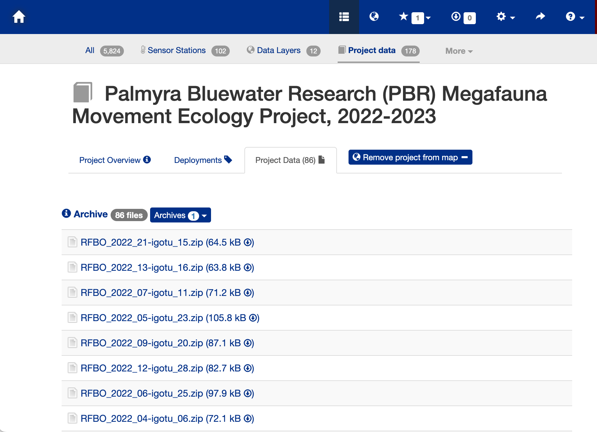

# Matchup Satellite data to track locations

history \| Modified July 2024

## Objective

This tutorial will demonstrate how to extract satellite data around a
set of points defined by longitude, latitude, and time coordinates from
ab animal telemetry tag that was acquired from the Animal Telemetry
Network (<https://ioos.noaa.gov/project/atn/>).

## The tutorial demonstrates the following techniques

- Importing track data in csv file to data frame
- Plotting the latitude/longitude points onto a map
- Using rerddapXtraco function to extract satellite data from an ERDDAP
  data server along a track
- Plotting the satellite data onto a map

## Datasets used in this exercise

**Chlorophyll a concentration, the European Space Agency’s Ocean Colour
Climate Change Initiative (OC-CCI) Monthly dataset v6.0**

We’ll use the European Space Agency’s OC-CCI product
(<https://climate.esa.int/en/projects/ocean-colour/>) to obtain
chlorophyll data. This is a merged product combining data from many
ocean color sensors to create a long time series (1997-present).

**Yellowfin tuna telemetry track data**

Marine protected areas (MPAs) in pelagic regions is also called Blue
Water. The Palmyra Bluewater Research (PBR) project seeks to understand
the impact of MPAs on species and ecosystems by tracking at-sea
movements of ten marine animal species at Palmyra Atoll (part of the
U.S. Pacific Remote Islands Marine National Monument). All data were
being collected from adult individuals between May 2022 and June 2023.
They can be accessed via the Animal Telemetry Network (ATN) data portal
for the PBR project under “Project Data”:
(<https://portal.atn.ioos.us/?ls=861Wqpd2#metadata/1f877c4c-7b50-49f5-be86-3354664e0cff/project/files>)

The yellowfin tuna geolocation data is developed as part of the PBR
project. This example track used in the tutorial is from May 2022 to
November 2022. The track data has been previously downloaded, extracted,
and stored in the data folder of this training module.

## Install required packages and load libraries

``` r
# Function to check if pkgs are installed, and install any missing pkgs
pkgTest <- function(x)
{
  if (!require(x,character.only = TRUE))
  {
    install.packages(x,dep=TRUE,repos='http://cran.us.r-project.org')
    if(!require(x,character.only = TRUE)) stop(x, " :Package not found")
  }
}


# Create list of required packages
list.of.packages <- c("rerddap", "plotdap", "parsedate", "ggplot2", "rerddapXtracto",
                       "date", "maps", "mapdata", "RColorBrewer","viridis", "stringr")

# Create list of installed packages
pkges = installed.packages()[,"Package"]

# Install and load all required pkgs
for (pk in list.of.packages) {
  pkgTest(pk)
}
```

## Download animal track data from the ATN website

- **The data you need for this exercise are already in the GitHub
  repository**

- **The following step are show you how to download the data yourself**

### ATN Portal

- Follow the link to the ATN website:
  <https://portal.atn.ioos.us/?ls=O6vlufm7#map>  
- On the right navigational panel, look for the “Palmyra Bluewater
  Research (PBR) Megafauna Movement Ecology Project, 2022-2023” tab.
- Within the tab, scroll to find the telemetry tag labeled “Yellowfin
  tuna (233568)”.
- Click the search icon (maginifying glass) label next to the label to
  zoom into the area the area of the animal track.

<figure>

<figcaption aria-hidden="true">Image of the ATN portal
webpage</figcaption>
</figure>

### Detail page for the Yellowfin tuna (233568)

- Next click the tag icon to the right of the search icon.
- This page shows you details about the animal and the track.

<figure>

<figcaption aria-hidden="true">Image of the detail page for the
Yellowfin Tuna #233568</figcaption>
</figure>

### Data Download Page

- Press the “Project Data” tab near the top of the webpage to bring up
  the data file list.
- Search for the animal id number (233568).
- Click on the link “THUALB_2022_04-PTT_233568.zip (8.6 MB)” to download
  the data.

<figure>

<figcaption aria-hidden="true">Data download page</figcaption>
</figure>

### The Downloaded Data File

- The download will be a zip file. You will need to unzip it.
- The unzipped file folder contains many ancillary data files, but the
  one you are looking for is the CSV file
  (THUALB_2022_04-233568-4-GPE3.csv).
- You don’t have to move this file into the data folder for this
  exercise. It is already there.  
- But if you download the file for a different animal track you would
  need to put the CSV file into the folder.

## Import the track data into a data frame

``` r
# Import csv file into a data frame
file = "../data/THUALB_2022_04-233568-5-GPE3.csv"
pre_tuna_df <- read.csv(file, skip = 5)

# Show 3 rows from the data frame
head(pre_tuna_df, 3)
```

    ##         DeployID    Ptt                 Date Most.Likely.Latitude
    ## 1 THUALB_2022_04 233568 31-May-2022 19:00:00                5.875
    ## 2 THUALB_2022_04 233568 01-Jun-2022 00:00:00                5.875
    ## 3 THUALB_2022_04 233568 01-Jun-2022 04:56:15                5.850
    ##   Most.Likely.Longitude Observation.Type Observed.SST Satellite.SST
    ## 1              -162.125             User           NA            NA
    ## 2              -162.100             None           NA            NA
    ## 3              -161.975     Light - Dusk           NA            NA
    ##   Observed.Depth Bathymetry.Depth Observation.LL..MSS. Observation.Score
    ## 1             NA               NA                   NA          68.60585
    ## 2             NA               NA                   NA                NA
    ## 3            144             2908                   NA          43.16747
    ##                Sunrise               Sunset
    ## 1                                          
    ## 2 01-Jun-2022 16:33:04 02-Jun-2022 04:59:36
    ## 3

``` r
# Convert longitudes to 0~360 (Re-center map to the dateline)
pre_tuna_df['Most.Likely.Longitude'] <- pre_tuna_df['Most.Likely.Longitude'] + 360
# Show converted data frame
head(pre_tuna_df, 3)
```

    ##         DeployID    Ptt                 Date Most.Likely.Latitude
    ## 1 THUALB_2022_04 233568 31-May-2022 19:00:00                5.875
    ## 2 THUALB_2022_04 233568 01-Jun-2022 00:00:00                5.875
    ## 3 THUALB_2022_04 233568 01-Jun-2022 04:56:15                5.850
    ##   Most.Likely.Longitude Observation.Type Observed.SST Satellite.SST
    ## 1               197.875             User           NA            NA
    ## 2               197.900             None           NA            NA
    ## 3               198.025     Light - Dusk           NA            NA
    ##   Observed.Depth Bathymetry.Depth Observation.LL..MSS. Observation.Score
    ## 1             NA               NA                   NA          68.60585
    ## 2             NA               NA                   NA                NA
    ## 3            144             2908                   NA          43.16747
    ##                Sunrise               Sunset
    ## 1                                          
    ## 2 01-Jun-2022 16:33:04 02-Jun-2022 04:59:36
    ## 3

## Convert date string to a date object

``` r
pre_tuna_df$Date <- as.Date(pre_tuna_df$Date, format = "%d-%b-%Y")
head(pre_tuna_df)
```

    ##         DeployID    Ptt       Date Most.Likely.Latitude Most.Likely.Longitude
    ## 1 THUALB_2022_04 233568 2022-05-31                5.875               197.875
    ## 2 THUALB_2022_04 233568 2022-06-01                5.875               197.900
    ## 3 THUALB_2022_04 233568 2022-06-01                5.850               198.025
    ## 4 THUALB_2022_04 233568 2022-06-01                5.900               198.025
    ## 5 THUALB_2022_04 233568 2022-06-01                5.900               198.025
    ## 6 THUALB_2022_04 233568 2022-06-01                5.900               198.025
    ##   Observation.Type Observed.SST Satellite.SST Observed.Depth Bathymetry.Depth
    ## 1             User           NA            NA             NA               NA
    ## 2             None           NA            NA             NA               NA
    ## 3     Light - Dusk           NA            NA            144             2908
    ## 4             None           NA            NA             NA               NA
    ## 5              SST         28.2      28.32458              1             2908
    ## 6     Light - Dawn           NA            NA            112             2908
    ##   Observation.LL..MSS. Observation.Score              Sunrise
    ## 1                   NA          68.60585                     
    ## 2                   NA                NA 01-Jun-2022 16:33:04
    ## 3                   NA          43.16747                     
    ## 4                   NA                NA                     
    ## 5                   NA          76.62995                     
    ## 6                   NA          54.92253                     
    ##                 Sunset
    ## 1                     
    ## 2 02-Jun-2022 04:59:36
    ## 3                     
    ## 4                     
    ## 5                     
    ## 6

## Bin multiple observations from each day into daily mean values

The track data has multiple longitude/latitude/time points for each
date. That temporal resolution is much higher than the daily and month
satellite datasets that are available. So, let’s reduce the multiple
daily values for the animal track data to a single value for each day.
The code below creates a new dataframe that bins data for each date and
calculates the mean for selected columns.

``` r
library(dplyr)
tuna_df <- pre_tuna_df %>% group_by(Date) %>% summarize(Most.Likely.Latitude = mean(Most.Likely.Latitude),
                                         Most.Likely.Longitude = mean(Most.Likely.Longitude),
                                         Satellite.SST = mean(Satellite.SST, na.rm=TRUE),
                                         Observed.SST = mean(Observed.SST, na.rm=TRUE),
                                         Observed.Depth = mean(Observed.Depth, na.rm=TRUE),
                                         Bathymetry.Depth = mean(Bathymetry.Depth, na.rm=TRUE),
                                         )

tuna_df
```

    ## # A tibble: 177 × 7
    ##    Date       Most.Likely.Latitude Most.Likely.Longitude Satellite.SST
    ##    <date>                    <dbl>                 <dbl>         <dbl>
    ##  1 2022-05-31                 5.88                  198.         NaN  
    ##  2 2022-06-01                 5.88                  198           28.3
    ##  3 2022-06-02                 5.92                  198.          28.3
    ##  4 2022-06-03                 5.92                  198.          28.3
    ##  5 2022-06-04                 5.98                  198.          28.3
    ##  6 2022-06-05                 6.11                  198.          28.4
    ##  7 2022-06-06                 6.28                  198.          28.3
    ##  8 2022-06-07                 6.45                  197.          28.3
    ##  9 2022-06-08                 6.51                  197.          28.2
    ## 10 2022-06-09                 6.78                  197.          28.2
    ## # ℹ 167 more rows
    ## # ℹ 3 more variables: Observed.SST <dbl>, Observed.Depth <dbl>,
    ## #   Bathymetry.Depth <dbl>

## Plot the track on a map

``` r
# Download world map
mapWorld <- map_data("world", wrap=c(0,360))

# Map tuna tracks
ggplot(tuna_df, aes(Most.Likely.Longitude,Most.Likely.Latitude)) +
  geom_path(group=1)+
  geom_point(aes(x=Most.Likely.Longitude,y=Most.Likely.Latitude), pch=1, size=2 )+
  geom_point(aes(x=Most.Likely.Longitude[1],y=Most.Likely.Latitude[1]),fill="green", shape=24, size=3)+
  geom_point(aes(x=Most.Likely.Longitude[length(Most.Likely.Longitude)],y=Most.Likely.Latitude[length(Most.Likely.Latitude)]), shape=22, size=3, fill="red")+
  geom_polygon(data = mapWorld, aes(x=long, y = lat, group = group)) + 
  coord_fixed(xlim = c(180,220),ylim = c(0,26))+
  labs(x="Longitude (deg)", y="Latitude (deg)", title="Yellowfin Tuna Track with start (green) and end location (red)")+
  theme(plot.title=element_text(hjust=0.5), aspect.ratio=0.6)
```

<!-- -->

In this exercise, two different ways of extracting data from ERDDAP data
server along a track of xyt points are demonstrated:

1.  Using the **rerddapXtracto** package which was written specifically
    for this task
2.  For those who want to know what goes on “under the hood”, we will
    show how to manually construct ERDDAP data-request URLs to download
    the data.

### Extracting XYT data using the **rerddapXtracto** package

We will use the \``rxtracto` function of the **rerddapXtracto** package,
which was written to simplify data extraction from ERDDAP servers.

**Let’s use data from the monthly product of the OC-CCI datasets.**  

Ideally, we would work with daily data since we have one location per
day. But chlorophyll data are severely affected by clouds (i.e. lots of
missing data), so you might need to use weekly or even monthly data to
get sufficient non-missing data. We will start with the monthly chl-a
data since it contains fewer data gaps.

The ERDDAP URL to the monthly product is below:  
<https://oceanwatch.pifsc.noaa.gov/erddap/griddap/esa-cci-chla-monthly-v6-0>

**A note on dataset selection**  
We have preselected the dataset because we know it will work with this
exercise. If you were selecting datasets on your own, you would want to
check out the dataset to determine if its spatial and temporal coverages
are suitable for your application. Following the link above you will
find:

The latitude range is -89.97916 to 89.97916 and the longitude range is
0.020833 to 359.97916, which covers the track latitude range of 23.72 to
41.77 and longitude range of 175.86 to 248.57.

The time range is 1997-09-04 to 2023-12-01 (at the day of this writing),
which covers the track time range of 2022-05-30 to 2023-01-18.

You should also note the name of the variable you will be downloading.
For this dataset it is “**chlor_a**”

``` r
# Set dataset ID
dataset <- 'esa-cci-chla-monthly-v6-0'

# Get data information from ERDDAP server
dataInfo <- rerddap::info(dataset, url= "https://oceanwatch.pifsc.noaa.gov/erddap")
```

## Examine metadata

`rerddap::info` returns the metadata of the requested dataset. We can
first understand the attributes dataInfo includes then examine each
attribute.

``` r
# Display the metadata
dataInfo
```

    ## <ERDDAP info> esa-cci-chla-monthly-v6-0 
    ##  Base URL: https://oceanwatch.pifsc.noaa.gov/erddap 
    ##  Dataset Type: griddap 
    ##  Dimensions (range):  
    ##      time: (1997-09-04T00:00:00Z, 2023-12-01T00:00:00Z) 
    ##      latitude: (-89.97916666666666, 89.97916666666667) 
    ##      longitude: (0.020833333333314386, 359.97916666666663) 
    ##  Variables:  
    ##      chlor_a: 
    ##          Units: mg m-3 
    ##      chlor_a_log10_bias: 
    ##      chlor_a_log10_rmsd: 
    ##      MERIS_nobs_sum: 
    ##      MODISA_nobs_sum: 
    ##      OLCI_A_nobs_sum: 
    ##      OLCI_B_nobs_sum: 
    ##      SeaWiFS_nobs_sum: 
    ##      total_nobs_sum: 
    ##      VIIRS_nobs_sum:

``` r
# Display data attributes
names(dataInfo)
```

    ## [1] "variables" "alldata"   "base_url"

``` r
# Examine attribute: variables
dataInfo$variables
```

    ##         variable_name data_type actual_range
    ## 1             chlor_a     float             
    ## 2  chlor_a_log10_bias     float             
    ## 3  chlor_a_log10_rmsd     float             
    ## 4      MERIS_nobs_sum     float             
    ## 5     MODISA_nobs_sum     float             
    ## 6     OLCI_A_nobs_sum     float             
    ## 7     OLCI_B_nobs_sum     float             
    ## 8    SeaWiFS_nobs_sum     float             
    ## 9      total_nobs_sum     float             
    ## 10     VIIRS_nobs_sum     float

``` r
# Distribute attributes of dataInfo$alldata
names(dataInfo$alldata)
```

    ##  [1] "NC_GLOBAL"          "time"               "latitude"          
    ##  [4] "longitude"          "chlor_a"            "MERIS_nobs_sum"    
    ##  [7] "MODISA_nobs_sum"    "OLCI_A_nobs_sum"    "OLCI_B_nobs_sum"   
    ## [10] "SeaWiFS_nobs_sum"   "VIIRS_nobs_sum"     "chlor_a_log10_bias"
    ## [13] "chlor_a_log10_rmsd" "total_nobs_sum"

### Extract data using the rxtracto function

First we need to define the bounding box within which to search for
coordinates. The **rxtracto** function allows you to set the size of the
box used to collect data around the track points using the xlen and ylen
arguments. The values for xlen and ylen are in degrees. For our example,
we can use 0.2 degrees for both arguments. Note: You can also submit
vectors for xlen and ylen, as long as they are the same length as
xcoord, ycoord, and tcoord if you want to set a different search radius
around each track point.

``` r
# Set the variable we want to extract data from:
parameter <- 'chlor_a'

# Set xlen, ylen to 0.2 degree
xlen <- 0.2 
ylen <- 0.2

# Create date column using year, month and day in a format ERDDAP will understand (eg. 2008-12-15)
#tuna_df$date <-as.Date(tuna_df$Date, format = "%d-%b-%Y")

# Get variables x, y, t coordinates from tuna track data
xcoords <- tuna_df$Most.Likely.Longitude
ycoords <- tuna_df$Most.Likely.Latitude
tcoords <- tuna_df$Date

# Extract satellite data using x, y, t coordinates from tuna track data
chl_track <- rxtracto(dataInfo, 
                  parameter=parameter, 
                  xcoord=xcoords, ycoord=ycoords, 
                  tcoord=tcoords, xlen=xlen, ylen=ylen)
```

## Check the output of the rxtracto function

``` r
# Check all variables extracted using rxtracto
chl_track
```

    ## $`mean chlor_a`
    ##   [1] 0.35036845 0.33979354 0.34918477 0.36654727 0.27583055 0.24008992
    ##   [7] 0.24609106 0.23757721 0.22860108 0.22201491 0.18126983 0.17628787
    ##  [13] 0.17973766 0.18107935 0.17854079 0.17170516 0.19291558 0.15203758
    ##  [19] 0.15301031 0.15487252 0.15233969 0.16468014 0.16244490 0.14975501
    ##  [25] 0.15271067 0.15214825 0.13416794 0.13056742 0.10485961 0.08886343
    ##  [31] 0.07579193 0.08689456 0.07836955 0.08020256 0.08413873 0.08413188
    ##  [37] 0.08092971 0.08070824 0.08136239 0.07468786 0.06816751 0.06221280
    ##  [43] 0.06194487 0.06277686 0.06138261 0.06181207 0.06736731 0.05022823
    ##  [49] 0.05113431 0.04647151 0.04666935 0.04937120 0.04987629 0.04864962
    ##  [55] 0.05004742 0.05216593 0.04711644 0.04888644 0.04774474 0.04954049
    ##  [61] 0.05054595 0.05193970 0.05537968 0.05666066 0.05840669 0.06179528
    ##  [67] 0.06058720 0.06057864 0.06166740 0.06292557 0.06247512 0.06238116
    ##  [73] 0.06125197 0.05912673 0.05718568 0.05809533 0.05937567 0.05780809
    ##  [79] 0.06155602 0.06488340 0.06246555 0.05709276 0.06000756 0.05889847
    ##  [85] 0.05937312 0.06015613 0.05768889 0.05230956 0.05558083 0.05652259
    ##  [91] 0.05715265 0.05566140 0.05561182 0.05735372 0.05732640 0.06323478
    ##  [97] 0.06249396 0.05972585 0.06247470 0.05970859 0.05812298 0.05691349
    ## [103] 0.05688088 0.05606291 0.05963878 0.05684055 0.05267483 0.05122833
    ## [109] 0.04785238 0.05432758 0.04950659 0.04601966 0.05149324 0.05464627
    ## [115] 0.05534268 0.05453690 0.05504248 0.05745767 0.06038022 0.05945353
    ## [121] 0.06377728 0.05891031 0.05640728 0.05192275 0.05815413 0.06517879
    ## [127] 0.09398530 0.14182972 0.16505429 0.18172842 0.18346973 0.17269844
    ## [133] 0.16911866 0.17765660 0.16789470 0.16932312 0.17734422 0.18725278
    ## [139] 0.19058114 0.19451759 0.19347897 0.19038743 0.17444819 0.18136249
    ## [145] 0.18426717 0.17747662 0.18439051 0.17793438 0.17358684 0.18070954
    ## [151] 0.17976158 0.18200783 0.18499393 0.17690745 0.19737617 0.17929258
    ## [157] 0.17278176 0.18506944 0.19349303 0.17512485 0.17259552 0.17642625
    ## [163] 0.17645594 0.18286191 0.17185152 0.17185877 0.18519802 0.17901062
    ## [169] 0.16870728 0.18252105 0.17926355 0.17668583 0.17616187 0.17516000
    ## [175] 0.17495804 0.17589869 0.17268915
    ## 
    ## $`stdev chlor_a`
    ##   [1] 0.3729393545 0.3723613877 0.3728894526 0.4066318239 0.1544687257
    ##   [6] 0.0116744813 0.0136909346 0.0322269481 0.0094186318 0.0148229930
    ##  [11] 0.0165983015 0.0181826922 0.0122689133 0.0126051855 0.0127406091
    ##  [16] 0.0140674885 0.0142298837 0.0055126766 0.0063166072 0.0068539030
    ##  [21] 0.0060401701 0.0071348439 0.0060311761 0.0052727830 0.0062986133
    ##  [26] 0.0116526683 0.0072860670 0.0068634369 0.0098028387 0.0057836417
    ##  [31] 0.0050127184 0.0049296194 0.0063159439 0.0052262349 0.0067806485
    ##  [36] 0.0073326982 0.0089486069 0.0041812677 0.0060439575 0.0063634609
    ##  [41] 0.0025723279 0.0035981895 0.0032358621 0.0036791478 0.0035296394
    ##  [46] 0.0037132048 0.0043870649 0.0013936119 0.0015387165 0.0009777997
    ##  [51] 0.0010355459 0.0013563359 0.0016990593 0.0018458193 0.0011612501
    ##  [56] 0.0011056093 0.0009137670 0.0011882301 0.0015738594 0.0015593449
    ##  [61] 0.0014925563 0.0016828361 0.0013458945 0.0018150266 0.0015439476
    ##  [66] 0.0016231214 0.0018989531 0.0016530023 0.0017376297 0.0019619570
    ##  [71] 0.0019821666 0.0019716768 0.0017218313 0.0023017681 0.0022962532
    ##  [76] 0.0025394566 0.0018998067 0.0013937038 0.0026875439 0.0020242606
    ##  [81] 0.0016249370 0.0021529920 0.0022177773 0.0020348880 0.0025025319
    ##  [86] 0.0022468366 0.0019235925 0.0019160380 0.0018415845 0.0018136544
    ##  [91] 0.0027333434 0.0020114501 0.0024926240 0.0015196510 0.0017270442
    ##  [96] 0.0019396292 0.0023003473 0.0024618494 0.0019020643 0.0020431494
    ## [101] 0.0016105577 0.0014006280 0.0014794261 0.0014938987 0.0027908891
    ## [106] 0.0019397950 0.0018469832 0.0021716587 0.0014864043 0.0025666906
    ## [111] 0.0015399379 0.0014533607 0.0059020638 0.0015479937 0.0030461259
    ## [116] 0.0027459383 0.0027726549 0.0024404404 0.0028652203 0.0039679385
    ## [121] 0.0035527762 0.0036437866 0.0023214174 0.0037534877 0.0052259589
    ## [126] 0.0074171326 0.0166197086 0.0332792424 0.0079465984 0.0080231982
    ## [131] 0.0087532947 0.0075673201 0.0053438164 0.0097893179 0.0083612195
    ## [136] 0.0071650361 0.0078060009 0.0070806177 0.0070660801 0.0067505284
    ## [141] 0.0081708650 0.0085581624 0.0059712852 0.0082066457 0.0088069331
    ## [146] 0.0091103994 0.0080198463 0.0075306275 0.0065338899 0.0101291089
    ## [151] 0.0094369205 0.0076128138 0.0073594050 0.0067149254 0.0048006706
    ## [156] 0.0089661537 0.0066912934 0.0082152310 0.0078424404 0.0086052224
    ## [161] 0.0058003630 0.0085002084 0.0077350361 0.0116622151 0.0057131793
    ## [166] 0.0066746173 0.0109121434 0.0070847969 0.0057788617 0.0060931088
    ## [171] 0.0055820471 0.0053531594 0.0056391935 0.0061500858 0.0051783934
    ## [176] 0.0048646429 0.0062421719
    ## 
    ## $n
    ##   [1] 36 36 36 30 25 36 30 36 36 30 36 30 36 36 36 30 36 36 36 36 36 30 36 30 36
    ##  [26] 36 36 30 36 30 36 36 36 36 30 36 36 30 30 36 36 36 36 36 30 36 30 30 30 30
    ##  [51] 30 30 36 36 30 36 36 30 36 25 36 36 36 36 30 25 36 30 36 36 30 30 36 36 30
    ##  [76] 36 36 36 36 36 36 36 36 36 25 36 36 36 30 36 36 30 36 30 36 30 36 36 36 30
    ## [101] 30 36 36 36 30 36 25 36 36 36 30 36 36 36 30 36 36 30 36 36 30 30 36 30 36
    ## [126] 36 36 35 36 36 36 36 30 36 36 36 36 36 30 36 30 36 36 36 30 30 36 36 30 30
    ## [151] 30 36 30 36 36 36 36 30 36 36 30 36 36 30 36 36 36 36 36 36 36 30 36 36 36
    ## [176] 36 36
    ## 
    ## $`satellite date`
    ##   [1] "2022-06-01T00:00:00Z" "2022-06-01T00:00:00Z" "2022-06-01T00:00:00Z"
    ##   [4] "2022-06-01T00:00:00Z" "2022-06-01T00:00:00Z" "2022-06-01T00:00:00Z"
    ##   [7] "2022-06-01T00:00:00Z" "2022-06-01T00:00:00Z" "2022-06-01T00:00:00Z"
    ##  [10] "2022-06-01T00:00:00Z" "2022-06-01T00:00:00Z" "2022-06-01T00:00:00Z"
    ##  [13] "2022-06-01T00:00:00Z" "2022-06-01T00:00:00Z" "2022-06-01T00:00:00Z"
    ##  [16] "2022-06-01T00:00:00Z" "2022-06-01T00:00:00Z" "2022-07-01T00:00:00Z"
    ##  [19] "2022-07-01T00:00:00Z" "2022-07-01T00:00:00Z" "2022-07-01T00:00:00Z"
    ##  [22] "2022-07-01T00:00:00Z" "2022-07-01T00:00:00Z" "2022-07-01T00:00:00Z"
    ##  [25] "2022-07-01T00:00:00Z" "2022-07-01T00:00:00Z" "2022-07-01T00:00:00Z"
    ##  [28] "2022-07-01T00:00:00Z" "2022-07-01T00:00:00Z" "2022-07-01T00:00:00Z"
    ##  [31] "2022-07-01T00:00:00Z" "2022-07-01T00:00:00Z" "2022-07-01T00:00:00Z"
    ##  [34] "2022-07-01T00:00:00Z" "2022-07-01T00:00:00Z" "2022-07-01T00:00:00Z"
    ##  [37] "2022-07-01T00:00:00Z" "2022-07-01T00:00:00Z" "2022-07-01T00:00:00Z"
    ##  [40] "2022-07-01T00:00:00Z" "2022-07-01T00:00:00Z" "2022-07-01T00:00:00Z"
    ##  [43] "2022-07-01T00:00:00Z" "2022-07-01T00:00:00Z" "2022-07-01T00:00:00Z"
    ##  [46] "2022-07-01T00:00:00Z" "2022-07-01T00:00:00Z" "2022-08-01T00:00:00Z"
    ##  [49] "2022-08-01T00:00:00Z" "2022-08-01T00:00:00Z" "2022-08-01T00:00:00Z"
    ##  [52] "2022-08-01T00:00:00Z" "2022-08-01T00:00:00Z" "2022-08-01T00:00:00Z"
    ##  [55] "2022-08-01T00:00:00Z" "2022-08-01T00:00:00Z" "2022-08-01T00:00:00Z"
    ##  [58] "2022-08-01T00:00:00Z" "2022-08-01T00:00:00Z" "2022-08-01T00:00:00Z"
    ##  [61] "2022-08-01T00:00:00Z" "2022-08-01T00:00:00Z" "2022-08-01T00:00:00Z"
    ##  [64] "2022-08-01T00:00:00Z" "2022-08-01T00:00:00Z" "2022-08-01T00:00:00Z"
    ##  [67] "2022-08-01T00:00:00Z" "2022-08-01T00:00:00Z" "2022-08-01T00:00:00Z"
    ##  [70] "2022-08-01T00:00:00Z" "2022-08-01T00:00:00Z" "2022-08-01T00:00:00Z"
    ##  [73] "2022-08-01T00:00:00Z" "2022-08-01T00:00:00Z" "2022-08-01T00:00:00Z"
    ##  [76] "2022-08-01T00:00:00Z" "2022-08-01T00:00:00Z" "2022-08-01T00:00:00Z"
    ##  [79] "2022-09-01T00:00:00Z" "2022-09-01T00:00:00Z" "2022-09-01T00:00:00Z"
    ##  [82] "2022-09-01T00:00:00Z" "2022-09-01T00:00:00Z" "2022-09-01T00:00:00Z"
    ##  [85] "2022-09-01T00:00:00Z" "2022-09-01T00:00:00Z" "2022-09-01T00:00:00Z"
    ##  [88] "2022-09-01T00:00:00Z" "2022-09-01T00:00:00Z" "2022-09-01T00:00:00Z"
    ##  [91] "2022-09-01T00:00:00Z" "2022-09-01T00:00:00Z" "2022-09-01T00:00:00Z"
    ##  [94] "2022-09-01T00:00:00Z" "2022-09-01T00:00:00Z" "2022-09-01T00:00:00Z"
    ##  [97] "2022-09-01T00:00:00Z" "2022-09-01T00:00:00Z" "2022-09-01T00:00:00Z"
    ## [100] "2022-09-01T00:00:00Z" "2022-09-01T00:00:00Z" "2022-09-01T00:00:00Z"
    ## [103] "2022-09-01T00:00:00Z" "2022-09-01T00:00:00Z" "2022-09-01T00:00:00Z"
    ## [106] "2022-09-01T00:00:00Z" "2022-09-01T00:00:00Z" "2022-09-01T00:00:00Z"
    ## [109] "2022-09-01T00:00:00Z" "2022-10-01T00:00:00Z" "2022-10-01T00:00:00Z"
    ## [112] "2022-10-01T00:00:00Z" "2022-10-01T00:00:00Z" "2022-10-01T00:00:00Z"
    ## [115] "2022-10-01T00:00:00Z" "2022-10-01T00:00:00Z" "2022-10-01T00:00:00Z"
    ## [118] "2022-10-01T00:00:00Z" "2022-10-01T00:00:00Z" "2022-10-01T00:00:00Z"
    ## [121] "2022-10-01T00:00:00Z" "2022-10-01T00:00:00Z" "2022-10-01T00:00:00Z"
    ## [124] "2022-10-01T00:00:00Z" "2022-10-01T00:00:00Z" "2022-10-01T00:00:00Z"
    ## [127] "2022-10-01T00:00:00Z" "2022-10-01T00:00:00Z" "2022-10-01T00:00:00Z"
    ## [130] "2022-10-01T00:00:00Z" "2022-10-01T00:00:00Z" "2022-10-01T00:00:00Z"
    ## [133] "2022-10-01T00:00:00Z" "2022-10-01T00:00:00Z" "2022-10-01T00:00:00Z"
    ## [136] "2022-10-01T00:00:00Z" "2022-10-01T00:00:00Z" "2022-10-01T00:00:00Z"
    ## [139] "2022-10-01T00:00:00Z" "2022-11-01T00:00:00Z" "2022-11-01T00:00:00Z"
    ## [142] "2022-11-01T00:00:00Z" "2022-11-01T00:00:00Z" "2022-11-01T00:00:00Z"
    ## [145] "2022-11-01T00:00:00Z" "2022-11-01T00:00:00Z" "2022-11-01T00:00:00Z"
    ## [148] "2022-11-01T00:00:00Z" "2022-11-01T00:00:00Z" "2022-11-01T00:00:00Z"
    ## [151] "2022-11-01T00:00:00Z" "2022-11-01T00:00:00Z" "2022-11-01T00:00:00Z"
    ## [154] "2022-11-01T00:00:00Z" "2022-11-01T00:00:00Z" "2022-11-01T00:00:00Z"
    ## [157] "2022-11-01T00:00:00Z" "2022-11-01T00:00:00Z" "2022-11-01T00:00:00Z"
    ## [160] "2022-11-01T00:00:00Z" "2022-11-01T00:00:00Z" "2022-11-01T00:00:00Z"
    ## [163] "2022-11-01T00:00:00Z" "2022-11-01T00:00:00Z" "2022-11-01T00:00:00Z"
    ## [166] "2022-11-01T00:00:00Z" "2022-11-01T00:00:00Z" "2022-11-01T00:00:00Z"
    ## [169] "2022-11-01T00:00:00Z" "2022-11-01T00:00:00Z" "2022-12-01T00:00:00Z"
    ## [172] "2022-12-01T00:00:00Z" "2022-12-01T00:00:00Z" "2022-12-01T00:00:00Z"
    ## [175] "2022-12-01T00:00:00Z" "2022-12-01T00:00:00Z" "2022-12-01T00:00:00Z"
    ## 
    ## $`requested lon min`
    ##   [1] 197.7750 197.9000 197.8500 197.7550 197.7125 197.6400 197.5600 197.3650
    ##   [9] 197.2450 197.3700 197.5188 197.4833 197.4550 197.4850 197.2750 197.4650
    ##  [17] 197.7200 197.7812 197.8875 197.9900 197.8875 197.6125 197.7350 197.7250
    ##  [25] 197.8200 198.2200 198.6100 198.6300 198.6500 198.8600 198.9875 199.0250
    ##  [33] 199.4050 199.1650 199.3750 199.7350 199.7600 199.1900 198.9625 198.7600
    ##  [41] 198.5375 198.2750 198.1600 198.2400 198.1437 198.2300 198.3833 197.6500
    ##  [49] 197.0450 196.9200 197.1300 197.5900 197.3550 197.3750 197.6125 197.4500
    ##  [57] 196.4812 197.0083 197.6950 198.2100 198.5375 198.9500 199.7200 200.3250
    ##  [65] 200.7875 201.0500 200.7500 200.2950 200.3600 200.5200 200.4900 200.4250
    ##  [73] 200.3125 200.1500 199.9650 200.1438 200.3833 199.8550 199.8250 199.5750
    ##  [81] 199.3100 198.8083 198.2438 198.3917 198.4200 198.1650 197.8050 197.5950
    ##  [89] 198.0850 198.0125 197.6167 197.2625 196.9125 196.5450 196.7650 197.6600
    ##  [97] 197.7250 197.2800 197.7438 198.0500 198.4050 198.7875 198.6150 198.2917
    ## [105] 197.7550 196.9550 196.1300 195.4050 194.8050 194.8600 194.8438 194.9708
    ## [113] 195.2812 195.3583 195.2150 194.9500 194.9688 195.0458 195.2900 195.5312
    ## [121] 195.7208 195.6438 195.5958 195.6450 195.5312 195.3042 195.7375 195.8450
    ## [129] 195.8200 195.8450 195.8292 195.4938 195.2500 196.3450 196.3850 196.5700
    ## [137] 197.1800 197.6550 197.7550 197.8100 197.9550 197.9900 197.9450 198.0950
    ## [145] 198.0000 197.9450 197.8500 197.6900 197.7500 197.9900 198.1700 197.8200
    ## [153] 197.6750 197.7200 197.3850 197.7000 197.7700 197.5600 197.4900 197.7900
    ## [161] 197.9750 197.8550 197.6900 197.5500 197.7250 197.8250 198.2900 198.2000
    ## [169] 198.0100 197.6800 197.8125 197.9000 197.9875 198.0607 197.9833 197.9750
    ## [177] 198.1450
    ## 
    ## $`requested lon max`
    ##   [1] 197.9750 198.1000 198.0500 197.9550 197.9125 197.8400 197.7600 197.5650
    ##   [9] 197.4450 197.5700 197.7188 197.6833 197.6550 197.6850 197.4750 197.6650
    ##  [17] 197.9200 197.9812 198.0875 198.1900 198.0875 197.8125 197.9350 197.9250
    ##  [25] 198.0200 198.4200 198.8100 198.8300 198.8500 199.0600 199.1875 199.2250
    ##  [33] 199.6050 199.3650 199.5750 199.9350 199.9600 199.3900 199.1625 198.9600
    ##  [41] 198.7375 198.4750 198.3600 198.4400 198.3437 198.4300 198.5833 197.8500
    ##  [49] 197.2450 197.1200 197.3300 197.7900 197.5550 197.5750 197.8125 197.6500
    ##  [57] 196.6812 197.2083 197.8950 198.4100 198.7375 199.1500 199.9200 200.5250
    ##  [65] 200.9875 201.2500 200.9500 200.4950 200.5600 200.7200 200.6900 200.6250
    ##  [73] 200.5125 200.3500 200.1650 200.3438 200.5833 200.0550 200.0250 199.7750
    ##  [81] 199.5100 199.0083 198.4437 198.5917 198.6200 198.3650 198.0050 197.7950
    ##  [89] 198.2850 198.2125 197.8167 197.4625 197.1125 196.7450 196.9650 197.8600
    ##  [97] 197.9250 197.4800 197.9437 198.2500 198.6050 198.9875 198.8150 198.4917
    ## [105] 197.9550 197.1550 196.3300 195.6050 195.0050 195.0600 195.0437 195.1708
    ## [113] 195.4812 195.5583 195.4150 195.1500 195.1687 195.2458 195.4900 195.7312
    ## [121] 195.9208 195.8438 195.7958 195.8450 195.7312 195.5042 195.9375 196.0450
    ## [129] 196.0200 196.0450 196.0292 195.6937 195.4500 196.5450 196.5850 196.7700
    ## [137] 197.3800 197.8550 197.9550 198.0100 198.1550 198.1900 198.1450 198.2950
    ## [145] 198.2000 198.1450 198.0500 197.8900 197.9500 198.1900 198.3700 198.0200
    ## [153] 197.8750 197.9200 197.5850 197.9000 197.9700 197.7600 197.6900 197.9900
    ## [161] 198.1750 198.0550 197.8900 197.7500 197.9250 198.0250 198.4900 198.4000
    ## [169] 198.2100 197.8800 198.0125 198.1000 198.1875 198.2607 198.1833 198.1750
    ## [177] 198.3450
    ## 
    ## $`requested lat min`
    ##   [1]  5.775000  5.785000  5.825000  5.825000  5.881250  6.010000  6.175000
    ##   [8]  6.350000  6.410000  6.675000  6.975000  7.170833  7.265000  7.310000
    ##  [15]  7.180000  7.185000  7.200000  7.162500  7.079167  7.065000  6.950000
    ##  [22]  6.712500  6.740000  6.960000  7.110000  7.190000  7.405000  7.885000
    ##  [29]  8.405000  9.005000  9.725000 10.195833 10.655000 10.665000 10.835000
    ##  [36] 10.955000 10.825000 11.090000 11.325000 11.610000 11.912500 12.310000
    ##  [43] 12.515000 12.535000 12.462500 12.450000 12.495833 13.293750 13.035000
    ##  [50] 13.935000 14.030000 13.935000 13.685000 13.375000 12.675000 12.385000
    ##  [57] 14.093750 14.245833 14.440000 14.585000 14.775000 14.980000 15.540000
    ##  [64] 15.610000 15.462500 15.465000 15.745000 15.900000 16.065000 16.185000
    ##  [71] 16.210000 16.150000 16.062500 16.025000 15.970000 15.850000 15.783333
    ##  [78] 16.125000 16.106250 16.200000 16.200000 16.333333 16.281250 16.270833
    ##  [85] 16.335000 16.500000 16.760000 17.040000 16.980000 16.906250 16.820833
    ##  [92] 16.675000 16.512500 16.410000 16.355000 16.340000 16.500000 16.330000
    ##  [99] 16.231250 16.205000 16.090000 15.975000 15.895000 15.737500 15.435000
    ## [106] 15.220000 14.965000 14.705000 14.350000 13.945000 13.550000 13.200000
    ## [113] 12.718750 12.404167 12.205000 12.200000 12.000000 11.700000 11.265000
    ## [120] 10.893750 10.420833  9.837500  8.979167  8.380000  8.025000  7.537500
    ## [127]  6.868750  6.355000  5.830000  5.495000  5.354167  5.250000  5.004167
    ## [134]  5.440000  5.180000  4.950000  5.030000  5.035000  5.150000  5.200000
    ## [141]  5.175000  4.975000  4.655000  4.415000  4.295000  4.335000  4.205000
    ## [148]  4.265000  4.340000  4.335000  4.285000  4.155000  4.095000  3.970000
    ## [155]  4.055000  3.995000  3.875000  3.960000  4.110000  4.325000  4.585000
    ## [162]  4.730000  4.775000  4.700000  4.580000  4.345000  4.155000  3.940000
    ## [169]  3.705000  3.395000  3.475000  3.587500  3.725000  3.900000  4.079167
    ## [176]  4.220000  4.435000
    ## 
    ## $`requested lat max`
    ##   [1]  5.975000  5.985000  6.025000  6.025000  6.081250  6.210000  6.375000
    ##   [8]  6.550000  6.610000  6.875000  7.175000  7.370833  7.465000  7.510000
    ##  [15]  7.380000  7.385000  7.400000  7.362500  7.279167  7.265000  7.150000
    ##  [22]  6.912500  6.940000  7.160000  7.310000  7.390000  7.605000  8.085000
    ##  [29]  8.605000  9.205000  9.925000 10.395833 10.855000 10.865000 11.035000
    ##  [36] 11.155000 11.025000 11.290000 11.525000 11.810000 12.112500 12.510000
    ##  [43] 12.715000 12.735000 12.662500 12.650000 12.695833 13.493750 13.235000
    ##  [50] 14.135000 14.230000 14.135000 13.885000 13.575000 12.875000 12.585000
    ##  [57] 14.293750 14.445833 14.640000 14.785000 14.975000 15.180000 15.740000
    ##  [64] 15.810000 15.662500 15.665000 15.945000 16.100000 16.265000 16.385000
    ##  [71] 16.410000 16.350000 16.262500 16.225000 16.170000 16.050000 15.983333
    ##  [78] 16.325000 16.306250 16.400000 16.400000 16.533333 16.481250 16.470833
    ##  [85] 16.535000 16.700000 16.960000 17.240000 17.180000 17.106250 17.020833
    ##  [92] 16.875000 16.712500 16.610000 16.555000 16.540000 16.700000 16.530000
    ##  [99] 16.431250 16.405000 16.290000 16.175000 16.095000 15.937500 15.635000
    ## [106] 15.420000 15.165000 14.905000 14.550000 14.145000 13.750000 13.400000
    ## [113] 12.918750 12.604167 12.405000 12.400000 12.200000 11.900000 11.465000
    ## [120] 11.093750 10.620833 10.037500  9.179167  8.580000  8.225000  7.737500
    ## [127]  7.068750  6.555000  6.030000  5.695000  5.554167  5.450000  5.204167
    ## [134]  5.640000  5.380000  5.150000  5.230000  5.235000  5.350000  5.400000
    ## [141]  5.375000  5.175000  4.855000  4.615000  4.495000  4.535000  4.405000
    ## [148]  4.465000  4.540000  4.535000  4.485000  4.355000  4.295000  4.170000
    ## [155]  4.255000  4.195000  4.075000  4.160000  4.310000  4.525000  4.785000
    ## [162]  4.930000  4.975000  4.900000  4.780000  4.545000  4.355000  4.140000
    ## [169]  3.905000  3.595000  3.675000  3.787500  3.925000  4.100000  4.279167
    ## [176]  4.420000  4.635000
    ## 
    ## $`requested z min`
    ##   [1] NA NA NA NA NA NA NA NA NA NA NA NA NA NA NA NA NA NA NA NA NA NA NA NA NA
    ##  [26] NA NA NA NA NA NA NA NA NA NA NA NA NA NA NA NA NA NA NA NA NA NA NA NA NA
    ##  [51] NA NA NA NA NA NA NA NA NA NA NA NA NA NA NA NA NA NA NA NA NA NA NA NA NA
    ##  [76] NA NA NA NA NA NA NA NA NA NA NA NA NA NA NA NA NA NA NA NA NA NA NA NA NA
    ## [101] NA NA NA NA NA NA NA NA NA NA NA NA NA NA NA NA NA NA NA NA NA NA NA NA NA
    ## [126] NA NA NA NA NA NA NA NA NA NA NA NA NA NA NA NA NA NA NA NA NA NA NA NA NA
    ## [151] NA NA NA NA NA NA NA NA NA NA NA NA NA NA NA NA NA NA NA NA NA NA NA NA NA
    ## [176] NA NA
    ## 
    ## $`requested z max`
    ##   [1] NA NA NA NA NA NA NA NA NA NA NA NA NA NA NA NA NA NA NA NA NA NA NA NA NA
    ##  [26] NA NA NA NA NA NA NA NA NA NA NA NA NA NA NA NA NA NA NA NA NA NA NA NA NA
    ##  [51] NA NA NA NA NA NA NA NA NA NA NA NA NA NA NA NA NA NA NA NA NA NA NA NA NA
    ##  [76] NA NA NA NA NA NA NA NA NA NA NA NA NA NA NA NA NA NA NA NA NA NA NA NA NA
    ## [101] NA NA NA NA NA NA NA NA NA NA NA NA NA NA NA NA NA NA NA NA NA NA NA NA NA
    ## [126] NA NA NA NA NA NA NA NA NA NA NA NA NA NA NA NA NA NA NA NA NA NA NA NA NA
    ## [151] NA NA NA NA NA NA NA NA NA NA NA NA NA NA NA NA NA NA NA NA NA NA NA NA NA
    ## [176] NA NA
    ## 
    ## $`requested date`
    ##   [1] "2022-05-31" "2022-06-01" "2022-06-02" "2022-06-03" "2022-06-04"
    ##   [6] "2022-06-05" "2022-06-06" "2022-06-07" "2022-06-08" "2022-06-09"
    ##  [11] "2022-06-10" "2022-06-11" "2022-06-12" "2022-06-13" "2022-06-14"
    ##  [16] "2022-06-15" "2022-06-16" "2022-06-17" "2022-06-18" "2022-06-19"
    ##  [21] "2022-06-20" "2022-06-21" "2022-06-22" "2022-06-23" "2022-06-24"
    ##  [26] "2022-06-25" "2022-06-26" "2022-06-27" "2022-06-28" "2022-06-29"
    ##  [31] "2022-06-30" "2022-07-01" "2022-07-02" "2022-07-03" "2022-07-04"
    ##  [36] "2022-07-05" "2022-07-06" "2022-07-07" "2022-07-08" "2022-07-09"
    ##  [41] "2022-07-10" "2022-07-11" "2022-07-12" "2022-07-13" "2022-07-14"
    ##  [46] "2022-07-15" "2022-07-16" "2022-07-17" "2022-07-18" "2022-07-19"
    ##  [51] "2022-07-20" "2022-07-21" "2022-07-22" "2022-07-23" "2022-07-24"
    ##  [56] "2022-07-25" "2022-07-26" "2022-07-27" "2022-07-28" "2022-07-29"
    ##  [61] "2022-07-30" "2022-07-31" "2022-08-01" "2022-08-02" "2022-08-03"
    ##  [66] "2022-08-04" "2022-08-05" "2022-08-06" "2022-08-07" "2022-08-08"
    ##  [71] "2022-08-09" "2022-08-10" "2022-08-11" "2022-08-12" "2022-08-13"
    ##  [76] "2022-08-14" "2022-08-15" "2022-08-16" "2022-08-17" "2022-08-18"
    ##  [81] "2022-08-19" "2022-08-20" "2022-08-21" "2022-08-22" "2022-08-23"
    ##  [86] "2022-08-24" "2022-08-25" "2022-08-26" "2022-08-27" "2022-08-28"
    ##  [91] "2022-08-29" "2022-08-30" "2022-08-31" "2022-09-01" "2022-09-02"
    ##  [96] "2022-09-03" "2022-09-04" "2022-09-05" "2022-09-06" "2022-09-07"
    ## [101] "2022-09-08" "2022-09-09" "2022-09-10" "2022-09-11" "2022-09-12"
    ## [106] "2022-09-13" "2022-09-14" "2022-09-15" "2022-09-16" "2022-09-17"
    ## [111] "2022-09-18" "2022-09-19" "2022-09-20" "2022-09-21" "2022-09-22"
    ## [116] "2022-09-23" "2022-09-24" "2022-09-25" "2022-09-26" "2022-09-27"
    ## [121] "2022-09-28" "2022-09-29" "2022-09-30" "2022-10-01" "2022-10-02"
    ## [126] "2022-10-03" "2022-10-04" "2022-10-05" "2022-10-06" "2022-10-07"
    ## [131] "2022-10-08" "2022-10-09" "2022-10-10" "2022-10-11" "2022-10-12"
    ## [136] "2022-10-13" "2022-10-14" "2022-10-15" "2022-10-16" "2022-10-17"
    ## [141] "2022-10-18" "2022-10-19" "2022-10-20" "2022-10-21" "2022-10-22"
    ## [146] "2022-10-23" "2022-10-24" "2022-10-25" "2022-10-26" "2022-10-27"
    ## [151] "2022-10-28" "2022-10-29" "2022-10-30" "2022-10-31" "2022-11-01"
    ## [156] "2022-11-02" "2022-11-03" "2022-11-04" "2022-11-05" "2022-11-06"
    ## [161] "2022-11-07" "2022-11-08" "2022-11-09" "2022-11-10" "2022-11-11"
    ## [166] "2022-11-12" "2022-11-13" "2022-11-14" "2022-11-15" "2022-11-16"
    ## [171] "2022-11-17" "2022-11-18" "2022-11-19" "2022-11-20" "2022-11-21"
    ## [176] "2022-11-22" "2022-11-23"
    ## 
    ## $`median chlor_a`
    ##   [1] 0.23508727 0.22677632 0.23239919 0.23604802 0.23191604 0.23832429
    ##   [7] 0.24516238 0.22978269 0.22803262 0.22429694 0.17890473 0.17670082
    ##  [13] 0.17931821 0.18098501 0.17787762 0.17358768 0.19199708 0.15196544
    ##  [19] 0.15246718 0.15435445 0.15213300 0.16388601 0.16139499 0.15014178
    ##  [25] 0.15212265 0.15030631 0.13423072 0.12936772 0.10543534 0.08843615
    ##  [31] 0.07611203 0.08702558 0.07930738 0.08011644 0.08286570 0.08333674
    ##  [37] 0.07967136 0.08026569 0.08207771 0.07481952 0.06820505 0.06228212
    ##  [43] 0.06237648 0.06301218 0.06105968 0.06210728 0.06654652 0.05034076
    ##  [49] 0.05104760 0.04662155 0.04673743 0.04939608 0.04972594 0.04872989
    ##  [55] 0.04971104 0.05201872 0.04718383 0.04885631 0.04756788 0.04970428
    ##  [61] 0.05046267 0.05194636 0.05543696 0.05693433 0.05848419 0.06163281
    ##  [67] 0.06065865 0.06047808 0.06110997 0.06278780 0.06207568 0.06176343
    ##  [73] 0.06097542 0.06001924 0.05780576 0.05805363 0.05911248 0.05811767
    ##  [79] 0.06185536 0.06479356 0.06205556 0.05709260 0.06009295 0.05868356
    ##  [85] 0.05922624 0.06012281 0.05765099 0.05247543 0.05536868 0.05624931
    ##  [91] 0.05658141 0.05558046 0.05563048 0.05727573 0.05753520 0.06301863
    ##  [97] 0.06286773 0.05899045 0.06242500 0.05944625 0.05886242 0.05686779
    ## [103] 0.05695825 0.05568521 0.05960348 0.05693020 0.05217929 0.05127387
    ## [109] 0.04791029 0.05416226 0.04933855 0.04617827 0.05013387 0.05462295
    ## [115] 0.05450991 0.05407417 0.05549436 0.05715034 0.06040794 0.05899347
    ## [121] 0.06463226 0.05833396 0.05605524 0.05185957 0.05721099 0.06505797
    ## [127] 0.09383952 0.14291994 0.16547723 0.18195170 0.18368366 0.17088549
    ## [133] 0.17036594 0.17811793 0.16703231 0.16877656 0.17667819 0.18770034
    ## [139] 0.18996596 0.19382169 0.19426026 0.19044614 0.17429602 0.18223384
    ## [145] 0.18581952 0.17796056 0.18576109 0.17838852 0.17277198 0.18251912
    ## [151] 0.17739039 0.18181176 0.18391136 0.17720394 0.19744664 0.17882544
    ## [157] 0.17301754 0.18553830 0.19383425 0.17397306 0.17154724 0.17586517
    ## [163] 0.17618803 0.18355820 0.17113545 0.17104609 0.18320611 0.17947689
    ## [169] 0.16883022 0.18377956 0.17892407 0.17707220 0.17524364 0.17424075
    ## [175] 0.17520132 0.17573202 0.17420340
    ## 
    ## $`mad chlor_a`
    ##   [1] 0.0170243957 0.0148369879 0.0172081166 0.0151054555 0.0192425561
    ##   [6] 0.0127003265 0.0105466871 0.0177771963 0.0071624755 0.0099113410
    ##  [11] 0.0134553916 0.0235902532 0.0121712010 0.0125001246 0.0136965198
    ##  [16] 0.0166281121 0.0143368477 0.0047547396 0.0048285395 0.0064674024
    ##  [21] 0.0056607514 0.0081980927 0.0061261844 0.0056995458 0.0042890526
    ##  [26] 0.0132893336 0.0087669957 0.0067574488 0.0079317239 0.0048174546
    ##  [31] 0.0051628647 0.0033526526 0.0060114527 0.0045662522 0.0070826278
    ##  [36] 0.0090087425 0.0098554085 0.0044750214 0.0070373272 0.0081982032
    ##  [41] 0.0028293595 0.0038736591 0.0041670553 0.0044657840 0.0042451190
    ##  [46] 0.0045703918 0.0035894230 0.0012499777 0.0020589650 0.0009868951
    ##  [51] 0.0012194072 0.0013771584 0.0019789461 0.0020343291 0.0010164797
    ##  [56] 0.0010698523 0.0008641273 0.0011406393 0.0015193455 0.0013907978
    ##  [61] 0.0015497475 0.0018085497 0.0014988465 0.0015952221 0.0011859040
    ##  [66] 0.0011467147 0.0016858288 0.0014605244 0.0010336428 0.0021023739
    ##  [71] 0.0015644280 0.0011979554 0.0008256975 0.0015967271 0.0027113857
    ##  [76] 0.0032743845 0.0017751597 0.0013374831 0.0028053367 0.0016655562
    ##  [81] 0.0020286375 0.0023549653 0.0021760660 0.0016569622 0.0030294288
    ##  [86] 0.0026583334 0.0018705273 0.0015874897 0.0012509580 0.0019830387
    ##  [91] 0.0035175065 0.0017218671 0.0028062563 0.0016210123 0.0015377486
    ##  [96] 0.0018612927 0.0024188539 0.0021733901 0.0019547714 0.0020935369
    ## [101] 0.0012881424 0.0016202087 0.0019760547 0.0014044509 0.0032707254
    ## [106] 0.0017445312 0.0010117298 0.0022880969 0.0015207760 0.0027835121
    ## [111] 0.0016877453 0.0014208242 0.0034185516 0.0012597122 0.0023396221
    ## [116] 0.0033110580 0.0025507487 0.0021264326 0.0034775136 0.0035745907
    ## [121] 0.0031419153 0.0033802378 0.0022388998 0.0036849259 0.0040087904
    ## [126] 0.0061555811 0.0166016398 0.0342199637 0.0070344165 0.0073431808
    ## [131] 0.0070798607 0.0065066497 0.0056103806 0.0088859857 0.0051671837
    ## [136] 0.0053059686 0.0074954862 0.0066967664 0.0075632548 0.0058434119
    ## [141] 0.0090647358 0.0087994164 0.0066329192 0.0102569997 0.0088025425
    ## [146] 0.0117171347 0.0077539238 0.0081150693 0.0066721775 0.0113999642
    ## [151] 0.0098256444 0.0062640082 0.0067020575 0.0073675377 0.0040892815
    ## [156] 0.0074730402 0.0076814053 0.0056102812 0.0077116167 0.0094844263
    ## [161] 0.0049778403 0.0101206450 0.0081317380 0.0184140336 0.0052682899
    ## [166] 0.0076777379 0.0146395918 0.0050216938 0.0059804514 0.0059817107
    ## [171] 0.0063597569 0.0045786406 0.0056317109 0.0070708691 0.0051205355
    ## [176] 0.0043605880 0.0051084730
    ## 
    ## attr(,"row.names")
    ##   [1] "1"   "2"   "3"   "4"   "5"   "6"   "7"   "8"   "9"   "10"  "11"  "12" 
    ##  [13] "13"  "14"  "15"  "16"  "17"  "18"  "19"  "20"  "21"  "22"  "23"  "24" 
    ##  [25] "25"  "26"  "27"  "28"  "29"  "30"  "31"  "32"  "33"  "34"  "35"  "36" 
    ##  [37] "37"  "38"  "39"  "40"  "41"  "42"  "43"  "44"  "45"  "46"  "47"  "48" 
    ##  [49] "49"  "50"  "51"  "52"  "53"  "54"  "55"  "56"  "57"  "58"  "59"  "60" 
    ##  [61] "61"  "62"  "63"  "64"  "65"  "66"  "67"  "68"  "69"  "70"  "71"  "72" 
    ##  [73] "73"  "74"  "75"  "76"  "77"  "78"  "79"  "80"  "81"  "82"  "83"  "84" 
    ##  [85] "85"  "86"  "87"  "88"  "89"  "90"  "91"  "92"  "93"  "94"  "95"  "96" 
    ##  [97] "97"  "98"  "99"  "100" "101" "102" "103" "104" "105" "106" "107" "108"
    ## [109] "109" "110" "111" "112" "113" "114" "115" "116" "117" "118" "119" "120"
    ## [121] "121" "122" "123" "124" "125" "126" "127" "128" "129" "130" "131" "132"
    ## [133] "133" "134" "135" "136" "137" "138" "139" "140" "141" "142" "143" "144"
    ## [145] "145" "146" "147" "148" "149" "150" "151" "152" "153" "154" "155" "156"
    ## [157] "157" "158" "159" "160" "161" "162" "163" "164" "165" "166" "167" "168"
    ## [169] "169" "170" "171" "172" "173" "174" "175" "176" "177"
    ## attr(,"class")
    ## [1] "list"          "rxtractoTrack"
    ## attr(,"base_url")
    ## [1] "https://oceanwatch.pifsc.noaa.gov/erddap/"
    ## attr(,"datasetid")
    ## [1] "esa-cci-chla-monthly-v6-0"

**rxtracto** computes statistics using all the pixels found in the
search radius around each track point.

## Plotting the results using plotTrack

We will use the “plotTrack” function to plot the results. “plotTrack” is
a function of the “rerddapXtracto” package designed specifically to plot
the results of the “rxtracto” function. It provides an easy way to make
a quick plot, however it’s not very customizable.

``` r
# Plot tracks with color: algae specifically designed for chlorophyll
plotTrack(chl_track, xcoords, ycoords, tcoords, size=3, plotColor = 'viridis')
```

<!-- -->

## Animating the track

One of the nice features of the “plotTrack” function is that it is very
easy to make an animation of the track data. This will take a minute to
run. It creates an animated gif that will display in the Rstudio viewer
window once the encoding to gif is done.

``` r
# Animate tracks

make180 <- function(lon) {
    ind <- which(lon > 180)
    lon[ind] <- lon[ind] - 360
   return(lon)
}

plotTrack(chl_track,
          make180(xcoords),
          ycoords, tcoords,
          plotColor = 'viridis',
          animate = TRUE,
          cumulative = TRUE)
```

    ## NULL

## Plotting the results using ggplot

### Create a data frame with the tuna track and the output of rxtracto

If we to do an customization of the plot, its better to plot the data
using ggplot. We will first create a data frame that contains longitudes
and latitudes from the tuna and associated satellite chlor-a values.

``` r
# Create a data frame of coords from tuna and chlor_a values 
new_df <- as.data.frame(cbind(xcoords, ycoords,  
                              chl_track$`requested lon min`, 
                              chl_track$`requested lon max`, 
                              chl_track$`requested lat min`, 
                              chl_track$`requested lon max`,  
                              chl_track$`mean chlor_a`)
                        )

# Set variable names
names(new_df) <- c("Lon", 
                   "Lat", 
                   "Matchup_Lon_Lower",
                   "Matchup_Lon_Upper",
                   "Matchup_Lat_Lower",
                   "Matchup_Lat_Upper", 
                   "Chlor_a")

write.csv(new_df, "tuna_matchup_df.csv")
```

### Plot using ggplot

``` r
# Import world map
mapWorld <- map_data("world", wrap=c(0,360))

# Draw the track positions with associated chlora values
ggplot(new_df) +
  geom_point(aes(Lon,Lat,color=log(Chlor_a))) +
  geom_polygon(data = mapWorld, aes(x=long, y = lat, group = group)) + 
  coord_fixed(xlim = c(180,220),ylim = c(0,26)) +
  scale_color_viridis(discrete = FALSE) +
  labs(x="Longitude (deg)", y="Latitude (deg)", title="Yellowfin Tuna Track with chlor-a values") +
  theme(plot.title=element_text(hjust=0.5))
```

<!-- -->

### Extracting XYT data by constructing the URL data requests manually

First we need to set up the ERDDAP URL using the datasets ID and the
name of the variable we are interested in. Note that we are requesting
the data as .csv

`data_url = "https://oceanwatch.pifsc.noaa.gov/erddap/griddap/esa-cci-chla-monthly-v6-0.csv?chlor_a"`

For a refresher of how to construct an ERDDAP data-request URL, please
review the ERDDAP tutorial “04-Erddapurl.md” at the following link:
<https://github.com/coastwatch-training/CoastWatch-Tutorials/blob/main/ERDDAP-basics/lessons/>

``` r
# Set erddap address
erddap_base_url <- "https://oceanwatch.pifsc.noaa.gov/erddap/griddap/esa-cci-chla-monthly-v6-0.csv?chlor_a"

# Get longitude and latitude from tuna track data
lon <- tuna_df$Most.Likely.Longitude
lat <- tuna_df$Most.Likely.Latitude

# Get time from tuna track data and convert into ERDDAP date format
dates2 <- as.Date(tuna_df$Date, format = "%d-%b-%Y")

# Initatilize tot variable where data will be downloaded to
tot <- rep(NA, 4)

# Loop through each tuna track data
for (i in 1:dim(tuna_df)[1]) {

  # follow the progress of the loop
  cat("\014")
  cat(" Loop ", i, " of ", dim(tuna_df)[1])
  
  # Create erddap URL by adding lat, lon, dates of each track point 
   url <-  paste(erddap_base_url,
                 "[(", dates2[i], "):1:(", dates2[i],
                 ")][(", lat[i], "):1:(", lat[i],
                 ")][(", lon[i], "):1:(", lon[i], ")]", sep = "")  
   
   # Request and load satelite data from ERDDAP
   new <- read.csv(url, skip=2, header = FALSE) 
   
   # Append the data
   tot <- rbind(tot, new)   
   
}
```

    ##  Loop  1  of  177 Loop  2  of  177 Loop  3  of  177 Loop  4  of  177 Loop  5  of  177 Loop  6  of  177 Loop  7  of  177 Loop  8  of  177 Loop  9  of  177 Loop  10  of  177 Loop  11  of  177 Loop  12  of  177 Loop  13  of  177 Loop  14  of  177 Loop  15  of  177 Loop  16  of  177 Loop  17  of  177 Loop  18  of  177 Loop  19  of  177 Loop  20  of  177 Loop  21  of  177 Loop  22  of  177 Loop  23  of  177 Loop  24  of  177 Loop  25  of  177 Loop  26  of  177 Loop  27  of  177 Loop  28  of  177 Loop  29  of  177 Loop  30  of  177 Loop  31  of  177 Loop  32  of  177 Loop  33  of  177 Loop  34  of  177 Loop  35  of  177 Loop  36  of  177 Loop  37  of  177 Loop  38  of  177 Loop  39  of  177 Loop  40  of  177 Loop  41  of  177 Loop  42  of  177 Loop  43  of  177 Loop  44  of  177 Loop  45  of  177 Loop  46  of  177 Loop  47  of  177 Loop  48  of  177 Loop  49  of  177 Loop  50  of  177 Loop  51  of  177 Loop  52  of  177 Loop  53  of  177 Loop  54  of  177 Loop  55  of  177 Loop  56  of  177 Loop  57  of  177 Loop  58  of  177 Loop  59  of  177 Loop  60  of  177 Loop  61  of  177 Loop  62  of  177 Loop  63  of  177 Loop  64  of  177 Loop  65  of  177 Loop  66  of  177 Loop  67  of  177 Loop  68  of  177 Loop  69  of  177 Loop  70  of  177 Loop  71  of  177 Loop  72  of  177 Loop  73  of  177 Loop  74  of  177 Loop  75  of  177 Loop  76  of  177 Loop  77  of  177 Loop  78  of  177 Loop  79  of  177 Loop  80  of  177 Loop  81  of  177 Loop  82  of  177 Loop  83  of  177 Loop  84  of  177 Loop  85  of  177 Loop  86  of  177 Loop  87  of  177 Loop  88  of  177 Loop  89  of  177 Loop  90  of  177 Loop  91  of  177 Loop  92  of  177 Loop  93  of  177 Loop  94  of  177 Loop  95  of  177 Loop  96  of  177 Loop  97  of  177 Loop  98  of  177 Loop  99  of  177 Loop  100  of  177 Loop  101  of  177 Loop  102  of  177 Loop  103  of  177 Loop  104  of  177 Loop  105  of  177 Loop  106  of  177 Loop  107  of  177 Loop  108  of  177 Loop  109  of  177 Loop  110  of  177 Loop  111  of  177 Loop  112  of  177 Loop  113  of  177 Loop  114  of  177 Loop  115  of  177 Loop  116  of  177 Loop  117  of  177 Loop  118  of  177 Loop  119  of  177 Loop  120  of  177 Loop  121  of  177 Loop  122  of  177 Loop  123  of  177 Loop  124  of  177 Loop  125  of  177 Loop  126  of  177 Loop  127  of  177 Loop  128  of  177 Loop  129  of  177 Loop  130  of  177 Loop  131  of  177 Loop  132  of  177 Loop  133  of  177 Loop  134  of  177 Loop  135  of  177 Loop  136  of  177 Loop  137  of  177 Loop  138  of  177 Loop  139  of  177 Loop  140  of  177 Loop  141  of  177 Loop  142  of  177 Loop  143  of  177 Loop  144  of  177 Loop  145  of  177 Loop  146  of  177 Loop  147  of  177 Loop  148  of  177 Loop  149  of  177 Loop  150  of  177 Loop  151  of  177 Loop  152  of  177 Loop  153  of  177 Loop  154  of  177 Loop  155  of  177 Loop  156  of  177 Loop  157  of  177 Loop  158  of  177 Loop  159  of  177 Loop  160  of  177 Loop  161  of  177 Loop  162  of  177 Loop  163  of  177 Loop  164  of  177 Loop  165  of  177 Loop  166  of  177 Loop  167  of  177 Loop  168  of  177 Loop  169  of  177 Loop  170  of  177 Loop  171  of  177 Loop  172  of  177 Loop  173  of  177 Loop  174  of  177 Loop  175  of  177 Loop  176  of  177 Loop  177  of  177

``` r
# Delete the first row (default column names)
tot <- tot[-1, ]

# Rename columns
names(tot) <- c("chlo_date", "matched_lat", "matched_lon", "matched_chl.m")

# Create data frame combining tuna track data and the chlo-a data
chl_track2 <- data.frame(tuna_df, tot)

# Write the data frame to csv file
write.csv(chl_track2, 'tuna-track-chl.m.csv', row.names = FALSE)
```

### Make a map of the data extracted using ggplot

``` r
# Draw the track positions with associated chlora values
ggplot(chl_track2) +
  geom_point(aes(Most.Likely.Longitude,Most.Likely.Latitude,color=log(matched_chl.m))) +
  geom_polygon(data = mapWorld, aes(x=long, y = lat, group = group)) + 
  coord_fixed(xlim = c(180,220),ylim = c(0,26)) +
  scale_color_viridis(discrete = FALSE) +
  labs(x="Longitude (deg)", y="Latitude (deg)", title="Yellowfin Tuna Track with chlor-a values")+
  theme(plot.title=element_text(hjust=0.5))
```

<!-- -->

### Plot histogram of chlorophyll

How do the chlorophyll values of the tuna track compare to values in the
surrounding environment? Meaning does the tuna seem to have a preference
for certain chlorophyll values? To look at this we will plot a
histograms of the track chl valuesand those of the surrounding area.

First we will get a 3D block of chl data from the region and of the tuna
track over the span of time the tuna was in that area. We will use the
‘xtracto_3d’ function of rerddapXtracto to get the data. This data call
will take a few minutes.

``` r
chl_grid <- rxtracto_3D(dataInfo, 
                  parameter=parameter, 
                  xcoord=c(min(xcoords),max(xcoords)), 
                  ycoord=c(min(ycoords),max(ycoords)), 
                  tcoord=c(min(tcoords),max(tcoords)))

chl_area <- as.vector(chl_grid$chlor_a) 

# remove NA values 
chl_area <- chl_area[!is.na(chl_area)]

# vector or tuna chlorophyll 

chl_tuna <- chl_track$`mean chlor_a`
```

Now we we plot histograms of all the chlorphyll values in the area, and
those of the tuna track.

``` r
ggplot(as.data.frame(chl_area)) + 
      geom_histogram(aes(x=chl_area,y=after_stat(density),color = "darkgray",fill='Area'),color='black', bins=50) + 
      geom_histogram(data=as.data.frame(chl_tuna), aes(x=chl_tuna,y=after_stat(density),color='green', fill='Tuna'),color='black',bins=50, alpha=.4) + 
      scale_x_continuous(limits = c(0,.9), expand = c(0, 0)) + 
      scale_y_continuous(limits = c(0,15), expand = c(0, 0)) +
      labs(x='Chlorophyll values',y='Density') + 
      theme_bw() + 
      scale_fill_manual(values=c("darkgray","green"),'')
```

<!-- -->

##### Exercise 1:

Repeat the steps above with a different satellite dataset. For example,
extract sea surface temperature data using the following dataset:
<https://coastwatch.pfeg.noaa.gov/erddap/griddap/nesdisGeoPolarSSTN5NRT_Lon0360.html>
\\ This dataset is a different ERDDAP, so remember to change the base
URL. \\ Set the new dataset ID and variable name.

##### Exercise 2:

Go to an ERDDAP of your choice, find a dataset of interest, generate the
URL, copy it and edit the script above to run a match up on that
dataset. To find other ERDDAP servers, you can use this search engine:
<http://erddap.com/> \\ This dataset will likely be on a different
ERDDAP, so remember to change the base URL. \\ Set the new dataset ID
and variable name. \\ Check the metadata to make sure the dataset covers
the spatial and temporal range of the track dataset.

##### Optional

Repeat the steps above with a daily version of the OC-CCI dataset to see
how cloud cover can reduce the data you retrieve.
<https://coastwatch.pfeg.noaa.gov/erddap/griddap/pmlEsaCCI60OceanColorDaily_Lon0360.html>
