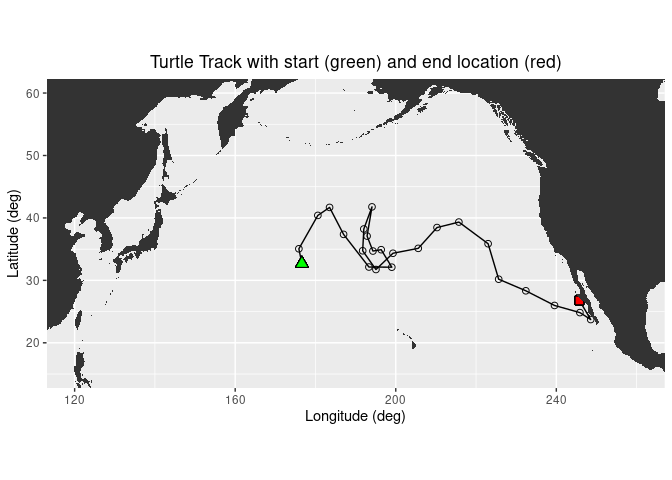
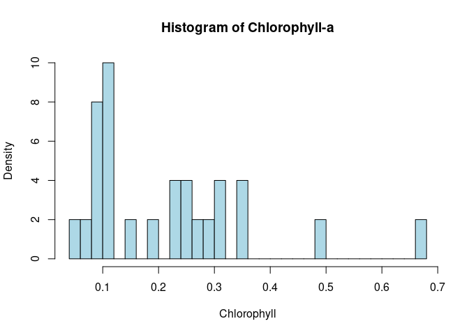
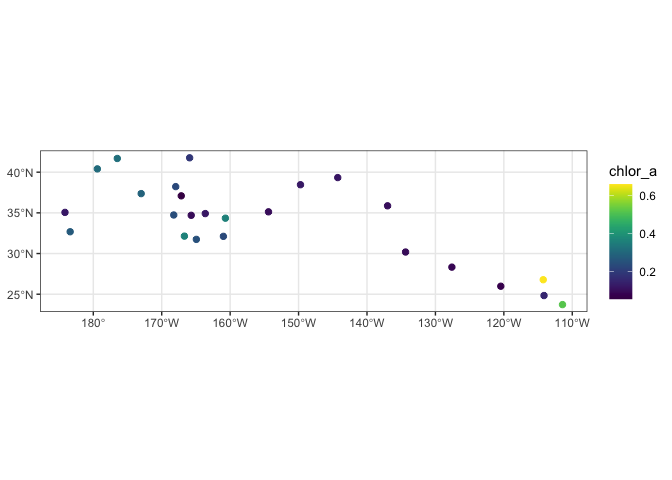
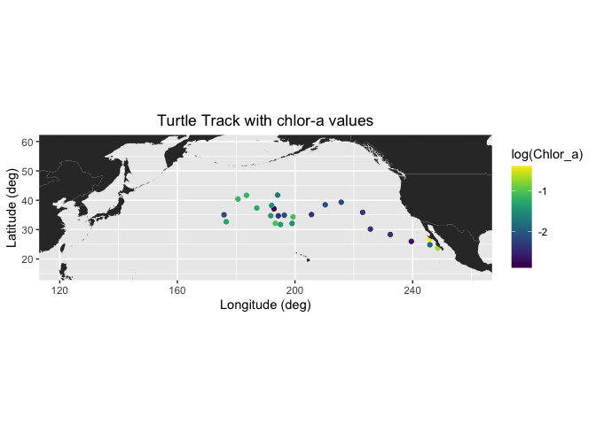

# Matchup Satellite data to track locations

history \| Modified August 2023

## Objective

This tutorial will demonstrate how to extract satellite data around a
set of points defined by longitude, latitude, and time coordinates, like
those produced by an animal telemetry tag, and ship track, or a glider
track.

## The tutorial demonstrates the following techniques

- Importing track data in csv file to data frame
- Plotting the latitude/longitude points onto a map
- Extracting satellite data from an ERDDAP data server along a track
- Plotting the satellite data onto a map

## Datasets used

**Chlorophyll a concentration, the European Space Agency’s Ocean Colour
Climate Change Initiative (OC-CCI) Monthly dataset v6.0**

We’ll use the European Space Agency’s OC-CCI product
(<https://climate.esa.int/en/projects/ocean-colour/>) to obtain
chlorophyll data. This is a merged product combining data from many
ocean color sensors to create a long time series (1997-present).

**Loggerhead turtle telemetry track data**

The turtle was raised in captivity in Japan, then tagged and released on
05/04/2005 in the Central Pacific. Its tag transmitted for over 3 years
and went all the way to the Southern tip of Baja California. This
dataset has been subsampled to reduce the data requests needed for this
tutorial from over 1200 to 25. The track data are stored in the data
folder in this project folder.

## Install required packages and load libraries

``` r
# Function to check if pkgs are installed, and install any missing pkgs
pkgTest <- function(x)
{
  if (!require(x,character.only = TRUE))
  {
    install.packages(x,dep=TRUE,repos='http://cran.us.r-project.org')
    if(!require(x,character.only = TRUE)) stop(x, " :Package not found")
  }
}


# Create list of required packages
list.of.packages <- c("rerddap", "plotdap", "parsedate", "ggplot2", "rerddapXtracto",
                       "date", "maps", "mapdata", "RColorBrewer","viridis")

# Create list of installed packages
pkges = installed.packages()[,"Package"]

# Install and load all required pkgs
for (pk in list.of.packages) {
  pkgTest(pk)
}
```

## Import the track data into a data frame

``` r
# Import csv file into a data frame
turtle_df <- read.csv("../data/25317_05_subsampled.dat")

# Show 3 rows from the data frame
head(turtle_df,3)
```

    ##   mean_lon mean_lat year month day
    ## 1 176.6194 32.67873 2005     5   4
    ## 2 175.8609 35.05773 2005     6  23
    ## 3 180.5926 40.40576 2005     8  12

## Plot the track on a map

``` r
# Download world map
mapWorld <- map_data("world", wrap=c(0,360))

# Map turtle tracks
ggplot(turtle_df, aes(mean_lon,mean_lat)) +
  geom_path(group=1, color="blue")+
  geom_point(aes(x=mean_lon,y=mean_lat), pch=1, size=2 )+
  geom_point(aes(x=mean_lon[1],y=mean_lat[1]),fill="green", shape=24, size=3)+
  geom_point(aes(x=mean_lon[length(mean_lon)],y=mean_lat[length(mean_lat)]), shape=22, size=3, fill="red")+
  geom_polygon(data = mapWorld, aes(x=long, y = lat, group = group)) + 
  coord_fixed(xlim = c(120,260),ylim = c(15,60))+
  labs(x="Longitude (deg)", y="Latitude (deg)", title="Turtle Track with start (green) and end location (red)")+
  theme(plot.title=element_text(hjust=0.5), aspect.ratio=1/2)
```

<!-- -->

## Extract data from a satellite dataset corresponding to points on the track

We are going to download data from an ERDDAP data server using the
following steps:

- Select a dataset and ERDDAP data server
- Get data information using <code>rerddap</code> package
- Extract data using ERDDAP URL request with latitudes and longitudes of
  the turtle track data
- Extract data using <code>rxtracto</code> function with latitudes and
  longitudes of the turtle track data
- Create data frame with the satellite data and turtle tracks

## Select a dataset and get Data Info using erddap URL data request

In this exercise, two different ways of downloading satellite data from
ERDDAP data server are demonstrated:  
1. request data via ERDDAP URL 2. request data by using `rerddap` R
package

### Data request using ERDDAP URL

First we need to set up the ERDDAP URL using the datasets ID and the
name of the variable we are interested in. Note that we are requesting
the data as .csv

`data_url = "https://oceanwatch.pifsc.noaa.gov/erddap/griddap/aqua_chla_1d_2018_0.csv?chlor_a"`

Ideally, we would work with daily data since we have one location per
day. But chlorophyll data is severely affected by clouds (i.e. lots of
missing data), so you might need to use weekly or even monthly data to
get sufficient non-missing data. We will start with the monthly chl-a
data since it contains fewer gaps.

``` r
# Set erddap address
erddap <- "https://oceanwatch.pifsc.noaa.gov/erddap/griddap/aqua_chla_monthly_2018_0.csv?chlor_a"

# Get longitude and latitude from turtle track data
lon = turtle_df$mean_lon
lat = turtle_df$mean_lat

# Get time from turtle track data and convert into ERDDAP date format
dates=mdy.date(turtle_df$month,turtle_df$day,turtle_df$year)
dates2 = format(as.Date(dates), "%Y-%m-%d")

# Initatilize tot variable where data will be downloaded to
tot = rep(NA, 4)

# Loop through each turtle track data
for (i in 1:dim(turtle_df)[1]) {

   # Create erddap URL by adding lat, lon, dates of each track point 
   url = paste(erddap, "[(", dates2[i], "):1:(", dates2[i], ")][(", lat[i], "):1:(", lat[i], ")][(", lon[i], "):1:(", lon[i], ")]", sep = "")  
   
   # Request and load satelite data from ERDDAP
   new = read.csv(url, skip=2, header = FALSE) 
   
   # Append the data
   tot = rbind(tot, new)   
}

# Delete the first row (default column names)
tot = tot[-1, ]

# Rename columns
names(tot) = c("chlo_date", "matched_lat", "matched_lon", "matched_chl.m")

# Create data frame combining turtle track data and the chlo-a data
result = data.frame(turtle_df, tot)

# Write the data frame to csv file
write.csv(result, 'turtle-track-chl.m.csv', row.names = FALSE)
```

### Data request using \``rerddap` function

**Let’s use data from the monthly product of the OC-CCI datasets.**  
The ERDDAP URLs to the monthly product is below:  
<https://oceanwatch.pifsc.noaa.gov/erddap/griddap/esa-cci-chla-monthly-v6-0>

**A note on dataset selection**  
We have preselected the dataset because we know it will work with this
exercise. If you were selecting datasets on your own, you would want to
check out the dataset to determine if its spatial and temporal coverages
are suitable for your application. Following the link above you will
find:

The latitude range is -89.97916 to 89.97916 and the longitude range is
0.020833 to 359.97916, which covers the track latitude range of 23.72 to
41.77 and longitude range of 175.86 to 248.57.

The time range is 1997-09-04 to 2023-03-01 (at the day of this writing),
which covers the track time range of 2005-05-04 to 2008-08-16.

You should also note the name of the variable you will be downloading.
For this dataset it is “**chlor_a**”

``` r
# Deleting all cached files
rerddap::cache_delete_all(force = TRUE)

# Set dataset ID
dataset <- 'esa-cci-chla-monthly-v6-0'

# Get data information from ERDDAP server
dataInfo <- rerddap::info(dataset, url= "https://oceanwatch.pifsc.noaa.gov/erddap")
```

## Examine metadata

`rerddap::info` returns metadata of the requested dataset. We can first
understand the attributes dataInfo includes then examine each attribute.

``` r
# Display the metadata
dataInfo
```

    ## <ERDDAP info> esa-cci-chla-monthly-v6-0 
    ##  Base URL: https://oceanwatch.pifsc.noaa.gov/erddap 
    ##  Dataset Type: griddap 
    ##  Dimensions (range):  
    ##      time: (1997-09-04T00:00:00Z, 2023-03-01T00:00:00Z) 
    ##      latitude: (-89.97916666666666, 89.97916666666667) 
    ##      longitude: (0.020833333333314386, 359.97916666666663) 
    ##  Variables:  
    ##      chlor_a: 
    ##          Units: mg m-3 
    ##      chlor_a_log10_bias: 
    ##      chlor_a_log10_rmsd: 
    ##      MERIS_nobs_sum: 
    ##      MODISA_nobs_sum: 
    ##      OLCI_A_nobs_sum: 
    ##      OLCI_B_nobs_sum: 
    ##      SeaWiFS_nobs_sum: 
    ##      total_nobs_sum: 
    ##      VIIRS_nobs_sum:

``` r
# Display data attributes
names(dataInfo)
```

    ## [1] "variables" "alldata"   "base_url"

``` r
# Examine attribute: variables
dataInfo$variables
```

    ##         variable_name data_type actual_range
    ## 1             chlor_a     float             
    ## 2  chlor_a_log10_bias     float             
    ## 3  chlor_a_log10_rmsd     float             
    ## 4      MERIS_nobs_sum     float             
    ## 5     MODISA_nobs_sum     float             
    ## 6     OLCI_A_nobs_sum     float             
    ## 7     OLCI_B_nobs_sum     float             
    ## 8    SeaWiFS_nobs_sum     float             
    ## 9      total_nobs_sum     float             
    ## 10     VIIRS_nobs_sum     float

``` r
# Distribute attributes of dataInfo$alldata
names(dataInfo$alldata)
```

    ##  [1] "NC_GLOBAL"          "time"               "latitude"          
    ##  [4] "longitude"          "chlor_a"            "MERIS_nobs_sum"    
    ##  [7] "MODISA_nobs_sum"    "OLCI_A_nobs_sum"    "OLCI_B_nobs_sum"   
    ## [10] "SeaWiFS_nobs_sum"   "VIIRS_nobs_sum"     "chlor_a_log10_bias"
    ## [13] "chlor_a_log10_rmsd" "total_nobs_sum"

### Extract data using the rxtracto function

First we need to define the bounding box within which to search for
coordinates. The **rxtracto** function allows you to set the size of the
box used to collect data around the track points using the xlen and ylen
arguments. The values for xlen and ylen are in degrees. For our example,
we can use 0.2 degrees for both arguments. Note: You can also submit
vectors for xlen and ylen, as long as they are the same length as
xcoord, ycoord, and tcoord if you want to set a different search radius
around each track point.

``` r
# Set the variable we want to extract data from:
parameter <- 'chlor_a'

# Set xlen, ylen to 0.2 degree
xlen <- 0.2 
ylen <- 0.2

# Create date column using year, month and day in a format ERDDAP will understand (eg. 2008-12-15)
turtle_df$date <- as.Date(paste(turtle_df$year, turtle_df$month, turtle_df$day, sep="-"))

# Get variables x, y, t coordinates from turtle track data
xcoords <- turtle_df$mean_lon
ycoords <- turtle_df$mean_lat
tcoords <- turtle_df$date

# Extract satellite data using x, y, t coordinates from turtle track data
chl_grid <- rxtracto(dataInfo, 
                  parameter=parameter, 
                  xcoord=xcoords, ycoord=ycoords, 
                  tcoord=tcoords, xlen=xlen, ylen=ylen)
```

## Check the output of the rxtracto function

``` r
# Check all variables extracted using rxtracto
chl_grid
```

    ## $`mean chlor_a`
    ##  [1] 0.26779765 0.12073122 0.30777924 0.31780368 0.28884829 0.36146353
    ##  [7] 0.22923882 0.11644071 0.09268904 0.05536651 0.18447913 0.22765385
    ## [13] 0.23869553 0.24669819 0.35838123 0.09624625 0.12024124 0.11400095
    ## [19] 0.10017463 0.09397742 0.08515869 0.06913812 0.14883095 0.51560753
    ## [25] 0.65806269
    ## 
    ## $`stdev chlor_a`
    ##  [1] 0.032191816 0.007231171 0.036716832 0.041052758 0.027952051 0.053364804
    ##  [7] 0.024394244 0.007282479 0.003880810 0.001490017 0.040774493 0.025363286
    ## [13] 0.014782180 0.013523678 0.036640145 0.004842596 0.004098601 0.003910613
    ## [19] 0.003537558 0.005928580 0.007001476 0.004942355 0.011980482 0.099209610
    ## [25] 0.149563991
    ## 
    ## $n
    ##  [1] 36 36 36 27 36 30 36 36 30 30 30 30 36 30 36 30 36 36 36 30 36 30 36 36 36
    ## 
    ## $`satellite date`
    ##  [1] "2005-05-01T00:00:00Z" "2005-07-01T00:00:00Z" "2005-08-01T00:00:00Z"
    ##  [4] "2005-10-01T00:00:00Z" "2005-12-01T00:00:00Z" "2006-01-01T00:00:00Z"
    ##  [7] "2006-03-01T00:00:00Z" "2006-05-01T00:00:00Z" "2006-06-01T00:00:00Z"
    ## [10] "2006-08-01T00:00:00Z" "2006-09-01T00:00:00Z" "2006-11-01T00:00:00Z"
    ## [13] "2007-01-01T00:00:00Z" "2007-02-01T00:00:00Z" "2007-04-01T00:00:00Z"
    ## [16] "2007-06-01T00:00:00Z" "2007-07-01T00:00:00Z" "2007-09-01T00:00:00Z"
    ## [19] "2007-11-01T00:00:00Z" "2007-12-01T00:00:00Z" "2008-02-01T00:00:00Z"
    ## [22] "2008-04-01T00:00:00Z" "2008-05-01T00:00:00Z" "2008-07-01T00:00:00Z"
    ## [25] "2008-08-01T00:00:00Z"
    ## 
    ## $`requested lon min`
    ##  [1] 176.5194 175.7609 180.4926 183.4102 186.8997 193.2152 198.9158 196.2679
    ##  [9] 194.2116 192.7545 193.9788 191.9444 191.6600 194.9631 199.2066 205.5050
    ## [17] 210.1805 215.6225 222.9073 225.5386 232.3064 239.4530 245.7716 248.4710
    ## [25] 245.6579
    ## 
    ## $`requested lon max`
    ##  [1] 176.7194 175.9609 180.6926 183.6102 187.0997 193.4152 199.1158 196.4679
    ##  [9] 194.4116 192.9545 194.1788 192.1444 191.8600 195.1631 199.4066 205.7050
    ## [17] 210.3805 215.8225 223.1073 225.7386 232.5064 239.6530 245.9716 248.6710
    ## [25] 245.8579
    ## 
    ## $`requested lat min`
    ##  [1] 32.57873 34.95773 40.30576 41.58480 37.26623 32.03793 32.01126 34.81224
    ##  [9] 34.59661 36.99175 41.66933 38.12796 34.63858 31.63964 34.24324 35.02771
    ## [17] 38.36083 39.23749 35.76793 30.08540 28.22859 25.88108 24.73662 23.62417
    ## [25] 26.68177
    ## 
    ## $`requested lat max`
    ##  [1] 32.77873 35.15773 40.50576 41.78480 37.46623 32.23793 32.21126 35.01224
    ##  [9] 34.79661 37.19175 41.86933 38.32796 34.83858 31.83964 34.44324 35.22771
    ## [17] 38.56083 39.43749 35.96793 30.28540 28.42859 26.08108 24.93662 23.82417
    ## [25] 26.88177
    ## 
    ## $`requested z min`
    ##  [1] NA NA NA NA NA NA NA NA NA NA NA NA NA NA NA NA NA NA NA NA NA NA NA NA NA
    ## 
    ## $`requested z max`
    ##  [1] NA NA NA NA NA NA NA NA NA NA NA NA NA NA NA NA NA NA NA NA NA NA NA NA NA
    ## 
    ## $`requested date`
    ##  [1] "2005-05-04" "2005-06-23" "2005-08-12" "2005-10-01" "2005-11-20"
    ##  [6] "2006-01-09" "2006-02-28" "2006-04-19" "2006-06-08" "2006-07-28"
    ## [11] "2006-09-16" "2006-11-05" "2006-12-25" "2007-02-13" "2007-04-04"
    ## [16] "2007-05-24" "2007-07-13" "2007-09-01" "2007-10-21" "2007-12-10"
    ## [21] "2008-01-29" "2008-03-19" "2008-05-08" "2008-06-27" "2008-08-16"
    ## 
    ## $`median chlor_a`
    ##  [1] 0.26985641 0.11935977 0.31413330 0.31312889 0.28226255 0.35456662
    ##  [7] 0.22596541 0.11711950 0.09256660 0.05540323 0.18355133 0.22467585
    ## [13] 0.24202415 0.24848759 0.34953472 0.09518800 0.11983451 0.11379882
    ## [19] 0.10012896 0.09296544 0.08735247 0.06766215 0.14883141 0.49834299
    ## [25] 0.67895702
    ## 
    ## $`mad chlor_a`
    ##  [1] 0.030100095 0.008344179 0.039171724 0.027213317 0.023952735 0.049566912
    ##  [7] 0.022928175 0.009027836 0.003463391 0.001267676 0.035848973 0.026539111
    ## [13] 0.016244819 0.011793729 0.035606685 0.003954114 0.002984454 0.002953619
    ## [19] 0.002999692 0.003767908 0.003242842 0.003565519 0.015092995 0.109981245
    ## [25] 0.133971250
    ## 
    ## attr(,"row.names")
    ##  [1] "1"  "2"  "3"  "4"  "5"  "6"  "7"  "8"  "9"  "10" "11" "12" "13" "14" "15"
    ## [16] "16" "17" "18" "19" "20" "21" "22" "23" "24" "25"
    ## attr(,"class")
    ## [1] "list"          "rxtractoTrack"

**rxtracto** computes statistics using all the pixels found in the
search radius around each track point. Because chl-a concentration tends
to have very high values and very low values, we will work with the
median value around wach track point, **median chlor_a**

### Plot a histogram of median chlor_a

``` r
chlora <- chl_grid$"median chlor_a"

# Histogram of Chlor_a
hist(chlora,
    main="Histogram of Chlorophyll-a",
    xlab="Chlorophyll",
    breaks = 40,
    col="lightblue",
    freq=FALSE
)
```

<!-- --> \## Plot a histogram of the log of the
chlorophyll data

``` r
# Histogram of Log of Chlor_a
hist(log(chlora),
    main="Histogram of Log(Chlorophyll-a)",
    xlab="Chlorophyll",
    breaks = 30,
    col="lightblue",
    freq=FALSE
)
```

<!-- --> After the log transformation the data
looks more normally distributed. The range of log chlorophyll is about
-2.9 to -0.3 but most of the values are between -2.5 and -0.8. Knowing
the distribution of the values can also help to set the color bar range
for our map.

## Plotting the results using plotTrack

We will use the “plotTrack” function to plot the results. “plotTrack” is
a function of the “rerddapXtracto” package designed specifically to plot
the results from “rxtracto”. However it’s not very customizable.

``` r
# Plot tracks with color: algae specifically designed for chlorophyll
plotTrack(chl_grid, xcoords, ycoords, tcoords, size=3, plotColor = 'viridis')
```

    ## Warning in latlon_adjust(table): Invalid longitude values

<!-- -->

## Animating the track

Make a cumulative animation of the track. This will take a minute to
run. It creates an animated gif that will display in the Rstudio viewer
window once the encoding to gif is done.

``` r
# Animate tracks
plotTrack(chl_grid, xcoords, ycoords, tcoords, plotColor = 'viridis',
                    animate = TRUE, cumulative = TRUE)
```

    ## Warning in latlon_adjust(table): Invalid longitude values

## Plotting the results using ggplot

### Create a data frame with the turtle track and the output of rxtracto

We will first create a data frame that contains longitudes and latitudes
from the turtle and associated satellite chlor-a values.

``` r
# Create a data frame of coords from turtle and chlora values 
new_df <- as.data.frame(cbind(xcoords, ycoords,  chl_grid$`requested lon min`, chl_grid$`requested lon max`, chl_grid$`requested lat min`, chl_grid$`requested lon max`,  chlora))

# Set variable names
names(new_df) <- c("Lon", "Lat", "Matchup_Lon_Lower", "Matchup_Lon_Upper", "Matchup_Lat_Lower", "Matchup_Lat_Upper",  "Chlor_a")
write.csv(new_df, "matchup_df.csv")
```

### Plot using ggplot

``` r
# Import world map
mapWorld <- map_data("world", wrap=c(0,360))

# Draw the track positions with associated chlora values
ggplot(new_df) +
  geom_point(aes(Lon,Lat,color=log(Chlor_a))) +
  geom_polygon(data = mapWorld, aes(x=long, y = lat, group = group)) + 
  coord_fixed(xlim = c(120,260),ylim = c(15,60)) +
  scale_color_viridis(discrete = FALSE) +
  labs(x="Longitude (deg)", y="Latitude (deg)", title="Turtle Track with chlor-a values")+
  theme(plot.title=element_text(hjust=0.5))
```

<!-- -->

## On your own!

##### Exercise 1:

Repeat the steps above with a different dataset. For example, extract
sea surface temperature data using the following dataset:
<https://coastwatch.pfeg.noaa.gov/erddap/griddap/nesdisGeoPolarSSTN5NRT_Lon0360.html>  
\* This dataset is a different ERDDAP, so remember to change the base
URL. \* Set the new dataset ID and variable name.

##### Exercise 2:

Go to an ERDDAP of your choice, find a dataset of interest, generate the
URL, copy it and edit the script above to run a match up on that
dataset. To find other ERDDAP servers, you can use this search engine:
<http://erddap.com/>  
\* This dataset will likely be on a different ERDDAP, so remember to
change the base URL. \* Set the new dataset ID and variable name. \*
Check the metadata to make sure the dataset covers the spatial and
temporal range of the track dataset.

##### Optional

Repeat the steps above with a daily version of the OC-CCI dataset to see
how cloud cover can reduce the data you retrieve.
<https://coastwatch.pfeg.noaa.gov/erddap/griddap/pmlEsaCCI60OceanColorDaily_Lon0360.html>
