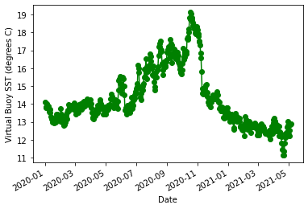
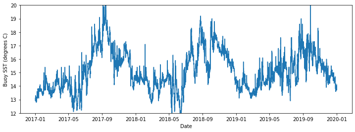
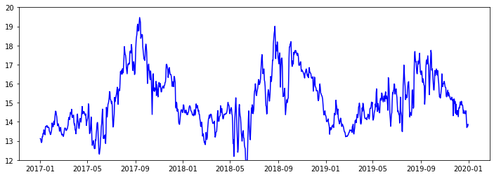
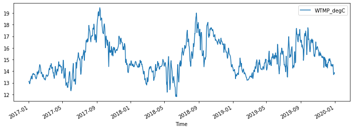
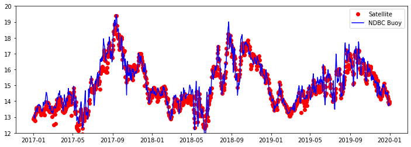
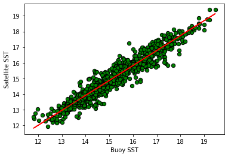

<p style="font-size:14px; text-align: right">CoastWatch Python Exercises</p>   

# Make a virtual buoy with satellite data  
## Background
There are buoys in many locations around the world that provide data streams of oceanic and atmospheric parameters. The data are often available through data centers like the those National Data Buoy Center (NDBC https://www.ndbc.noaa.gov) and ARGO floats program (http://www.argo.ucsd.edu). Despite these impressive efforts to monitor environmental conditions, in situ buoy data may not be available for your area of interest. Some locations are hard to access, making deploying and maintaining a buoy impractical. In addition, buoys are expensive to purchase, deploy and maintain. Therefore, limited funding may  prevent installation of a buoy in the first place or the continued operation of a buoy already in place. Using satellite data to create virual buoys can provide a solution to monitoring surface environmental conditions at locations where it is not feasible to install a buoy. For example, the University of South Florida has developed a virtual buoy system for locations off the Florida coast (https://optics.marine.usf.edu/projects/vbs.html).  

## Overview 
The following exercise will demonstrate the use of the ERDDAP data server to create a virtual buoy. For the scenario, we will envision that a virtual buoy is need to continue the datastream for an *in situ* buoy that was discontinued at the end of 2019. For this exercise we will use the National Data Buoy Center (NDBC) buoy # 49259, which is located off the California coast at 34.767N latitude and -121.497E longitude, and pretend that it was discontinued at the end of 2019. The buoy measures several oceanic variables, but we will continue the sea surface temperature (SST) datastream using NOAA GeoPolar Blended SST satellite dataset.    
 
### Steps in the exercise   
* __Create the virtual buoy using the ERDDAP server__  

* __Bring the virtual buoy data into Python and visualize__  

* __Groundtruth the satellite data__   
 * Download buoy data and virtual buoy (satellite) data for the period from Jan. 2017 through Dec. 2019
 * Resample the buoy data to match the temporal resolution of the virtual buoy data
 * Run a linear regression to model the relationship between virtual buoy SST and buoy SST data

* __Plot the results__


### The exercise demonstrates the following skills:

* __The use of ERDDAP to create a virtual buoy__      
* __The use of the Pandas module to import and manipulate data__  
* __Resampling data to bin into a lower resolution timestep__ 
* __Generating a linear regression model and statistics__
* __Several approaches to plotting timeseries data__  
* __Cleaning data to remove outlying data points__

## Steps involed in this exercise    
### Create the virtual buoy with ERDDAP  

__Visualize the data with a plot__  

__Load buoy data obtained from the National Data Buoy Center (NDBC) website__  
We will load buoy data store in a CSV file (buoy_46259_2016_2019.csv) into a Pandas dataframe. 
* The data were obrtained from the NDBC buoy #46259 (https://www.ndbc.noaa.gov/station_history.php?station=46259). 
* The buoy is at 34.767N latitude and the -121.497E longitude  
The file contains sampling date/time, mean wind direction, and surface water temperature for the years 2016-2019.
* The sampling resolution for the data is a sample every 30 minutes  

__Resample the buoy data to match the temporal resolution of the satellite data__  
The sampling resolution for the buoy data is a sample every 30 minutes. However, the temporal resolution for the satellite dataset is daily. We will downsample the buoy data by generating daily means in order to match the temporal resolution of the satellite. 


__Use the ERDDAP data server to subsample and download the satellite data__  
We will generate ERDDAP URLs to subset the satellite data at the latitude and longitude of the buoy and for each day in the downsampled buoy dataset and then download the data.  

* Generate the ERDDAP data request URLs 
* Download the data and load it into a Pandas dataframe.

__Plot buoy data and overlay the satellite data__

## Import some require Python modules


```python
import numpy as np
#import netCDF4 as nc
import xarray as xr
from datetime import datetime
import statsmodels.api as sm
import os
import pandas as pd
import io
import requests
```

### Create a virtual buoy with ERDDAP
#### Selecting a dataset
A good dataset for sea surface temperature (SST) is the NOAA GeoPolar Blended SST dataset (ERDDAP ID: `nesdisGeoPolarSSTN5SQNRT`). It blends together many satellite sensors to obtain good daily coverage of the globe, and then uses an interpellation method to fill in data gaps. 
#### Query ERDDAP for information about the satellite dataset   
ERDDAP has a feature that allows you to select and download metadata about any and all datasets. Click the link below to bring up the user interface for this feature: https://coastwatch.pfeg.noaa.gov/erddap/tabledap/allDatasets.html.  

Like all data in ERDDAP, even metadata, the values can be downloaded via a URL-based data request. Details about the feature are presented in the ERDDAP tutorial. For the purposes of this exercise, it is enough to know that we are pulling the metadata from this page into a CSV file and using it in Python

__Build a function to harvest metadata from ERDDAP__  

* The function builds the URL-based data request, sends the request to ERDDAP for the metedata, and loads the results into a Pandas data frame.
* The function also uses the xarray module in OpenDAP mode to obtain a list of data variables.
* Inputs to the function are 
 1. The location of the ERDDAP on the Internet: The NOAA GeoPolar blended SST dataset can be found on the CoastWatch West Coast Node ERDDAP at this URL: `https://coastwatch.pfeg.noaa.gov/erddap`
 2. The unique ERDDAP ID for the dataset: For the NOAA GeoPolar blended SST dataset the ID is `nesdisGeoPolarSSTN5SQNRT`


```python
# Variable containing the WCN ERDDAP URL
my_erddap_location = 'https://coastwatch.pfeg.noaa.gov/erddap'

# The dataset ID for NOAA GeoPolar blended SST 
my_ds_ID = 'nesdisGeoPolarSSTN5SQNRT'

# A function to form the metadata request URL and 
# download the metadata into a Pandas data frame
def get_dataset_info(erddapURL, datasetID):
    queryURL = "".join(['?datasetID,minLongitude,maxLongitude,longitudeSpacing,minLatitude,maxLatitude,latitudeSpacing,', 
                        'minAltitude,maxAltitude,', 
                        'minTime,maxTime,timeSpacing,griddap&datasetID="'])
    
    # Form the base URL leading to the allDatasets page
    baseURL = '/'.join([erddapURL, "tabledap", "allDatasets.csv"])
    
    # Form the data query part of the URL. 
    # For this exercise we will only request: 
    # 1) dataset ID, 
    # 2) the distance between values longitude values, 
    # 3) the minimum and maximum latitude, and the distance between values
    # 4) the minimum and maximum altitude values
    # 5) the minimum and maximum and time between time values
    fullURL = ''.join([baseURL, queryURL, datasetID,'"'])
    print(fullURL)
    #import urllib.request
    #s = urllib.request.urlopen(fullURL)
    s=requests.get(fullURL).content
    print(s)
    c=pd.read_csv(io.StringIO(s.decode('utf-8')), skiprows=[1])
    
    #print(c.griddap[0])
    # get the data variables using xarray via OpenDAP 
    c['variables'] = [list(xr.open_dataset(c.griddap[0]).data_vars)]
    return c

```


```python
#c=pd.read_csv(io.StringIO(req.decode('utf-8')), skiprows=[1])
response = urllib2.urlopen(url)
```

__Run the function and view the results__ 


```python
dataset_info = get_dataset_info(my_erddap_location, my_ds_ID)

display(dataset_info.loc[:, 'datasetID':'latitudeSpacing'])
display(dataset_info.loc[:, 'minAltitude':'timeSpacing'])
display(dataset_info.loc[:, 'griddap':'variables'])

print("Metadata helpful for this project are listed below")
print(" ")
print('Time Range:', dataset_info.minTime[0][:10], 'to', dataset_info.maxTime[0][:10] )
print('Data Variables:', dataset_info.variables[0] )
print('Direct dataset URL:', dataset_info.griddap[0]) 
```

    https://coastwatch.pfeg.noaa.gov/erddap/tabledap/allDatasets.csv?datasetID,minLongitude,maxLongitude,longitudeSpacing,minLatitude,maxLatitude,latitudeSpacing,minAltitude,maxAltitude,minTime,maxTime,timeSpacing,griddap&datasetID="nesdisGeoPolarSSTN5SQNRT"
    b'datasetID,minLongitude,maxLongitude,longitudeSpacing,minLatitude,maxLatitude,latitudeSpacing,minAltitude,maxAltitude,minTime,maxTime,timeSpacing,griddap\n,degrees_east,degrees_east,degrees_east,degrees_north,degrees_north,degrees_north,m,m,UTC,UTC,seconds,\nnesdisGeoPolarSSTN5SQNRT,-179.975,179.975,0.049999999999999996,-89.975,89.975,0.049999999999999996,NaN,NaN,2002-09-01T12:00:00Z,2021-05-05T12:00:00Z,86476.06749816581,https://coastwatch.pfeg.noaa.gov/erddap/griddap/nesdisGeoPolarSSTN5SQNRT\n'


<div>
<style scoped>
    .dataframe tbody tr th:only-of-type {
        vertical-align: middle;
    }

    .dataframe tbody tr th {
        vertical-align: top;
    }

    .dataframe thead th {
        text-align: right;
    }
</style>
<table border="1" class="dataframe">
  <thead>
    <tr style="text-align: right;">
      <th></th>
      <th>datasetID</th>
      <th>minLongitude</th>
      <th>maxLongitude</th>
      <th>longitudeSpacing</th>
      <th>minLatitude</th>
      <th>maxLatitude</th>
      <th>latitudeSpacing</th>
    </tr>
  </thead>
  <tbody>
    <tr>
      <th>0</th>
      <td>nesdisGeoPolarSSTN5SQNRT</td>
      <td>-179.975</td>
      <td>179.975</td>
      <td>0.05</td>
      <td>-89.975</td>
      <td>89.975</td>
      <td>0.05</td>
    </tr>
  </tbody>
</table>
</div>


<div>
<style scoped>
    .dataframe tbody tr th:only-of-type {
        vertical-align: middle;
    }

    .dataframe tbody tr th {
        vertical-align: top;
    }

    .dataframe thead th {
        text-align: right;
    }
</style>
<table border="1" class="dataframe">
  <thead>
    <tr style="text-align: right;">
      <th></th>
      <th>minAltitude</th>
      <th>maxAltitude</th>
      <th>minTime</th>
      <th>maxTime</th>
      <th>timeSpacing</th>
    </tr>
  </thead>
  <tbody>
    <tr>
      <th>0</th>
      <td>NaN</td>
      <td>NaN</td>
      <td>2002-09-01T12:00:00Z</td>
      <td>2021-05-05T12:00:00Z</td>
      <td>86476.067498</td>
    </tr>
  </tbody>
</table>
</div>


<div>
<style scoped>
    .dataframe tbody tr th:only-of-type {
        vertical-align: middle;
    }

    .dataframe tbody tr th {
        vertical-align: top;
    }

    .dataframe thead th {
        text-align: right;
    }
</style>
<table border="1" class="dataframe">
  <thead>
    <tr style="text-align: right;">
      <th></th>
      <th>griddap</th>
      <th>variables</th>
    </tr>
  </thead>
  <tbody>
    <tr>
      <th>0</th>
      <td>https://coastwatch.pfeg.noaa.gov/erddap/gridda...</td>
      <td>[analysed_sst, analysis_error, sea_ice_fractio...</td>
    </tr>
  </tbody>
</table>
</div>


    Metadata helpful for this project are listed below
     
    Time Range: 2002-09-01 to 2021-05-05
    Data Variables: ['analysed_sst', 'analysis_error', 'sea_ice_fraction', 'mask']
    Direct dataset URL: https://coastwatch.pfeg.noaa.gov/erddap/griddap/nesdisGeoPolarSSTN5SQNRT


```python
myurl = 'https://coastwatch.pfeg.noaa.gov/erddap/tabledap/allDatasets.csv?datasetID,minLongitude,maxLongitude,longitudeSpacing,minLatitude,maxLatitude,latitudeSpacing,minAltitude,maxAltitude,minTime,maxTime,timeSpacing,griddap&datasetID="nesdisGeoPolarSSTN5SQNRT"'
headers = {"User-Agent": "Mozilla/5.0 (Macintosh; Intel Mac OS X 10.14; rv:66.0) Gecko/20100101 Firefox/66.0"}
req = requests.get(myurl, headers=headers).content

```


```python
c=pd.read_csv(io.StringIO(req.decode('utf-8')), skiprows=[1])
```


```python
c
```


<div>
<style scoped>
    .dataframe tbody tr th:only-of-type {
        vertical-align: middle;
    }

    .dataframe tbody tr th {
        vertical-align: top;
    }

    .dataframe thead th {
        text-align: right;
    }
</style>
<table border="1" class="dataframe">
  <thead>
    <tr style="text-align: right;">
      <th></th>
      <th>datasetID</th>
      <th>minLongitude</th>
      <th>maxLongitude</th>
      <th>longitudeSpacing</th>
      <th>minLatitude</th>
      <th>maxLatitude</th>
      <th>latitudeSpacing</th>
      <th>minAltitude</th>
      <th>maxAltitude</th>
      <th>minTime</th>
      <th>maxTime</th>
      <th>timeSpacing</th>
      <th>griddap</th>
    </tr>
  </thead>
  <tbody>
    <tr>
      <th>0</th>
      <td>nesdisGeoPolarSSTN5SQNRT</td>
      <td>-179.975</td>
      <td>179.975</td>
      <td>0.05</td>
      <td>-89.975</td>
      <td>89.975</td>
      <td>0.05</td>
      <td>NaN</td>
      <td>NaN</td>
      <td>2002-09-01T12:00:00Z</td>
      <td>2021-05-05T12:00:00Z</td>
      <td>86476.067498</td>
      <td>https://coastwatch.pfeg.noaa.gov/erddap/gridda...</td>
    </tr>
  </tbody>
</table>
</div>


```python

```

## Create a virtual buoy with ERDDAP
We can make a virtual buoy very quickly using the ERDDAP visualization (make a graph) interface.   

### Selecting a dataset and generating a timeseries

A good dataset for sea surface temperature (SST) is the NOAA GeoPolar Blended SST dataset. It blends together many satellite sensors to obtain good daily coverage of the globe, and then uses an interpellation method to fill in data gaps. On a separate  can view the dataset on the ERDDAP interface (ERDDAP ID: `nesdisGeoPolarSSTN5SQNRT`). Click on the following link to go to the ERDDAP visualization page for the dataset:  
https://coastwatch.pfeg.noaa.gov/erddap/griddap/nesdisGeoPolarSSTN5SQNRT.graph. 

The NBDC buoy is located at 34.767N latitude and the -121.497E longitude, so we will use those coordinates to view and download data from ERDDAP. Please review the ERDDAP basics tutorial for a refresher on using ERDDAP. 

__On the ERDDAP visualization interface, do the following:__  
* Set the `Graph Type` to linsAndMarkers
* Set the `X Axis` to `time` and the `Y Axis` to `analysed_sst`
* On the time (UTC) widget, set ` Start` to the Jan. 1, 2020 (`2020-01-01T12:00:00Z`) and the `Stop` to the most recent date (`2020-04-01T12:00:00Z` at the time time of this writing).
* Set the `latitude (degrees_north)` to `34.767`, the latitude of our buoy, and the `longitude (degrees_east)` to `-121.497`, the longitude of our buoy. 
* Click `Redraw the Graph`  
* For a review of how to use the ERDDAP data server, please see this online tutorial:
https://coastwatch.pfeg.noaa.gov/projects/erddap/

The data for the virtual buoy will be displayed in the interface:


### You are finished making a virtual buoy!   

This is your virtual buoy. If you wanted, you could get to produce an image for you to put on your virtual buoy website. However, you probably want to bring the data into Python to make better plots and to go through some validation steps.  


## Load the virtual buoy data into Python  
Let's download the virtual buoy data directly from ERDDAP and into Python   

### Generate the ERDDAP data request URL for the data   
* Go to the ERDDAP visualization page for where you created the virtual buoy. 
* Near the top of the ERDDAP interface, click the `Data Access Form` link. Clicking brings you to a new page where you can refine your data request. Our goal on this page is to obtain the data request URL to download the data as a CSV file. 
* Find the `File type:` dropdown and select `.csv`. Then push the "Just `generate the URL button` and copy the link in the box to the right for th button. 

__The data request URL should look like the following URL:__   
>https://coastwatch.pfeg.noaa.gov/erddap/griddap/nesdisGeoPolarSSTN5SQNRT.csv?analysed_sst[(2020-01-01T12:00:00Z):1:(2020-04-01T12:00:00Z)][(34.775):1:(34.775)][(-121.475):1:(-121.475)]   

__Getting the most up-to-date data__  
At the time this tutorial was written, the most recent date was `2020-04-01T12:00:00Z` (April 1, 2020). However, you may be using the tutorial months later, so hardwiring `2020-04-01T12:00:00Z` into the URL will not give you the most recent data. We can use an ERDDAP trick to fix this problem. By changing the the most recent date (`2020-04-01T12:00:00Z`) to `last`, you will request to most recent data. The new URL looks like the following:  
>https://coastwatch.pfeg.noaa.gov/erddap/griddap/nesdisGeoPolarSSTN5SQNRT.csv?analysed_sst[(2020-01-01T12:00:00Z):1:(last)][(34.775):1:(34.775)][(-121.475):1:(-121.475)]  

__Bring the data into a Pandas data frame__  
You could put this URL directly into a browser and the CSV data file would download to your computer, but we will bring it directly into Python as a Pandas data frame.

### Create a function to load the CSV data into Pandas  
We will be making several request to the ERDDAP server for CSV data that we will put into Pandas. Creating a function will save repeating the same code over again. Instead, just call the function.   


```python
# import the needed modules

def get_csvdata(erddapURL):
    
    '''
    The requests module allows you to send a HTTP (URL) request,
    that returns a Response Object with all the response 
    data (content, encoding, status...)
    '''
    response = requests.get(erddapURL).content
    
    '''
    The StringIO class of the io module creates a file-like object 
    or memory file from the request response. 
    
    The decode function decodes the request response from 
    its 'utf-8' URL encoding.
    
    The Pandas (pd) read_csv function imports the csv data 
    from the request response into a Pandas dataframe. 
    
    A CSV file from ERDDAP has the column headers in the 
    first row and the units in the second row. The read_csv 
    function assumes the header is on the first row. 
    skiprows=[1] (below) tells read_csv to import row 0 as the header, 
    then skip row 1 and import the data starting on row 2.
    '''
    my_df = pd.read_csv(io.StringIO(response.decode('utf-8')), skiprows=[1])
    
    return my_df
```

### Use the function to create the Pandas data frame with Virtual Buoy data
The beginning of the resulting is printed below.


```python
erddap_data_request = 'https://coastwatch.pfeg.noaa.gov/erddap/griddap/nesdisGeoPolarSSTN5SQNRT.csv?analysed_sst[(2020-01-01T12:00:00Z):1:(last)][(34.775):1:(34.775)][(-121.475):1:(-121.475)]'
# print(erddap_data_request, 'a')
vir_buoy_df = get_csvdata(erddap_data_request)

# The head method prints out just the top 5 lines of the dataframe
vir_buoy_df.head()
```


<div>
<style scoped>
    .dataframe tbody tr th:only-of-type {
        vertical-align: middle;
    }

    .dataframe tbody tr th {
        vertical-align: top;
    }

    .dataframe thead th {
        text-align: right;
    }
</style>
<table border="1" class="dataframe">
  <thead>
    <tr style="text-align: right;">
      <th></th>
      <th>time</th>
      <th>latitude</th>
      <th>longitude</th>
      <th>analysed_sst</th>
    </tr>
  </thead>
  <tbody>
    <tr>
      <th>0</th>
      <td>2020-01-01T12:00:00Z</td>
      <td>34.775</td>
      <td>-121.475</td>
      <td>14.089994</td>
    </tr>
    <tr>
      <th>1</th>
      <td>2020-01-02T12:00:00Z</td>
      <td>34.775</td>
      <td>-121.475</td>
      <td>13.839994</td>
    </tr>
    <tr>
      <th>2</th>
      <td>2020-01-03T12:00:00Z</td>
      <td>34.775</td>
      <td>-121.475</td>
      <td>13.789994</td>
    </tr>
    <tr>
      <th>3</th>
      <td>2020-01-04T12:00:00Z</td>
      <td>34.775</td>
      <td>-121.475</td>
      <td>14.009994</td>
    </tr>
    <tr>
      <th>4</th>
      <td>2020-01-05T12:00:00Z</td>
      <td>34.775</td>
      <td>-121.475</td>
      <td>13.869994</td>
    </tr>
  </tbody>
</table>
</div>


### Clean up the data  
__The latitude and longitude columns are repetitious.__   

1. Store the latitude and longitude values in a dictionary.  
 

2. Remove the latitude and longitude columns from the data frame with the Panda drop() function. The drop() function removes rows or columns by specifying label names and the axis containing the labels.    


* The first argument is the column to drop, by name. 
* The axis argument indicates if the name is a `row` (0) or a `column` (1). 
* The argument inplace=True argument applies the row or column deletion to the data frame in use (e.g. vir_buoy_df in this case). By default (inplace=False), a new dataframe would be created.  


```python
# location of the buoy 
buoy_location = {'lat':vir_buoy_df.iloc[ 1 , : ].loc['latitude' ],
                 'lon':vir_buoy_df.iloc[ 1 , : ].loc['longitude' ]
                }

# Drop the latitude and longitude columns
vir_buoy_df.drop('latitude', axis=1, inplace=True)
vir_buoy_df.drop('longitude', axis=1, inplace=True)
vir_buoy_df.head()
```


<div>
<style scoped>
    .dataframe tbody tr th:only-of-type {
        vertical-align: middle;
    }

    .dataframe tbody tr th {
        vertical-align: top;
    }

    .dataframe thead th {
        text-align: right;
    }
</style>
<table border="1" class="dataframe">
  <thead>
    <tr style="text-align: right;">
      <th></th>
      <th>time</th>
      <th>analysed_sst</th>
    </tr>
  </thead>
  <tbody>
    <tr>
      <th>0</th>
      <td>2020-01-01T12:00:00Z</td>
      <td>14.089994</td>
    </tr>
    <tr>
      <th>1</th>
      <td>2020-01-02T12:00:00Z</td>
      <td>13.839994</td>
    </tr>
    <tr>
      <th>2</th>
      <td>2020-01-03T12:00:00Z</td>
      <td>13.789994</td>
    </tr>
    <tr>
      <th>3</th>
      <td>2020-01-04T12:00:00Z</td>
      <td>14.009994</td>
    </tr>
    <tr>
      <th>4</th>
      <td>2020-01-05T12:00:00Z</td>
      <td>13.869994</td>
    </tr>
  </tbody>
</table>
</div>


## Visualize the virtual buoy data from the satellite
Use the matplotlib python library. There are many ways to use matplotlib to plot data. Below is a simple approach. 
>Documentation for matplotlib can be found here: https://matplotlib.org


```python
#Import the needed modules
import matplotlib.pyplot as plt
import matplotlib.dates as mdates

# the %matplotlib is a magic function allow displaying results in notebooks
%matplotlib inline

# some tools for Pandas to work will with matplotlib
from pandas.plotting import register_matplotlib_converters
register_matplotlib_converters()

# Create the figure and give it a size
fig = plt.figure(figsize=(6, 4))

# add a subplot
ax = fig.add_subplot()

# Assign the x and y data, 
#    i.e. pd.to_datetime(vir_buoy_df.time), vir_buoy_df.analysed_sst
#    pd.to_datetime changes the datestamp into a date objest
# Design the look of the plots
#    color the plot, color='green'
#    define the marker shape: marker='o' is a filled circle
#        e.g. '+' are pluses
#    define the line type shape: linestyle='-'
#        e.g. '--' is dashed, '-.' is dash-dot
ax.plot(pd.to_datetime(vir_buoy_df.time), vir_buoy_df.analysed_sst,
        color='green', marker='o', linestyle='-')

# format the date for the x axis and autoformat
ax.format_xdata = mdates.DateFormatter('%Y-%m-%d')

# set the axis labels
ax.set_xlabel("Date")
ax.set_ylabel("Virtual Buoy SST (degrees C)")
fig.autofmt_xdate()

```


    

    


## Validate the Virtual Buoy measurements
How confident are we that the virtual buoy measurement are similar to the buoy measurements? Validating or groundtruthing the virtual buoy data is an important step to be certain that your virtual buoy is accurate. Since both the buoy and the satellite data extend back in time before 2020, we can compare a few years of data (2017-2019) from both datastream to determine how well they correlate.    

To do that, we will do the following:
* Download the data from NDBC buoy #49259 for the time period between Jan 1, 2017 and December 31, 2019.  
* Download the data from the satellite SST dataset for the time period same time period.  
* Evaluate, both visually and statistically, how close the two data stream are two one another.  

### Download the data from NDBC buoy

#### Load the buoy data for 2017-2019 

* The data for 2017-2016 has been made available for you already in a CSV file (buoy_49259_2016_2019.csv).  
* If you prefer, you can get the data yourself via the NBDC website.  
https://www.ndbc.noaa.gov/download_data.php?filename=46259h2017.txt.gz&dir=data/historical/stdmet/  
Steps on how to get the data with Python are included in Appendix A


```python
# load the buoy data file into a Pandas data frame and view
buoy_data = pd.read_csv('data/buoy_46259_2017_2019.csv', parse_dates=['Time'])
#buoy_data['Time'] = buoy_data['Time'].dt.date
print('# of timesteps =', buoy_data.shape[0] )
buoy_data.head()

```

    # of timesteps = 50900


<div>
<style scoped>
    .dataframe tbody tr th:only-of-type {
        vertical-align: middle;
    }

    .dataframe tbody tr th {
        vertical-align: top;
    }

    .dataframe thead th {
        text-align: right;
    }
</style>
<table border="1" class="dataframe">
  <thead>
    <tr style="text-align: right;">
      <th></th>
      <th>Time</th>
      <th>WTMP_degC</th>
    </tr>
  </thead>
  <tbody>
    <tr>
      <th>0</th>
      <td>2017-01-01 00:00:00</td>
      <td>13.1</td>
    </tr>
    <tr>
      <th>1</th>
      <td>2017-01-01 00:30:00</td>
      <td>13.0</td>
    </tr>
    <tr>
      <th>2</th>
      <td>2017-01-01 01:00:00</td>
      <td>13.0</td>
    </tr>
    <tr>
      <th>3</th>
      <td>2017-01-01 01:30:00</td>
      <td>13.0</td>
    </tr>
    <tr>
      <th>4</th>
      <td>2017-01-01 02:00:00</td>
      <td>13.0</td>
    </tr>
  </tbody>
</table>
</div>


#### Plot the full resolution buoy data  
Use a slightly different method to plot the data than we used above. The plotting uses the plot() function, which is an integration of the `matplotlib` library into Pandas.


```python
plt.figure(figsize=(12, 4))
plt.ylim(12, 20)
plt.xlabel("Date")
plt.ylabel("Buoy SST (degrees C)")
plt.plot(buoy_data.Time, buoy_data.WTMP_degC)
```


    [<matplotlib.lines.Line2D at 0x7fcc81003f10>]


    

    


### Resample the buoy data
The sampling resolution for the buoy data is a sample every 30 minutes. However, the temporal resolution for the satellite dataset is daily. Pandas makes it easy the downsample the 30 minute buoy data to create daily bins of the data that match the temporal resolution of the satellite.   

Use the Pandas `resample` method (below) to generate daily means.  
* The "D" is the resampling rule that sets the resampling interval. Here, "D" indicates resampling into daily bins. Similarly, using "3D" would resample into three-day bin and "M" would resample into monthly bins. 
* `on='Time'` identifies the column with the Pandas datetime data.  
* `.mean()` defines the math operation to be preformed on the daily bins.
* An overview of the resample method can be found here: https://pandas.pydata.org/pandas-docs/stable/user_guide/timeseries.html#resampling  


```python
print('# of timesteps before =', buoy_data.shape[0] )

buoy_data_resampled = buoy_data.resample('D', on='Time').mean()
print('# of timesteps after =', buoy_data_resampled.shape[0] )

buoy_data_resampled.head()
```

    # of timesteps before = 50900
    # of timesteps after = 1095


<div>
<style scoped>
    .dataframe tbody tr th:only-of-type {
        vertical-align: middle;
    }

    .dataframe tbody tr th {
        vertical-align: top;
    }

    .dataframe thead th {
        text-align: right;
    }
</style>
<table border="1" class="dataframe">
  <thead>
    <tr style="text-align: right;">
      <th></th>
      <th>WTMP_degC</th>
    </tr>
    <tr>
      <th>Time</th>
      <th></th>
    </tr>
  </thead>
  <tbody>
    <tr>
      <th>2017-01-01</th>
      <td>13.120833</td>
    </tr>
    <tr>
      <th>2017-01-02</th>
      <td>13.110417</td>
    </tr>
    <tr>
      <th>2017-01-03</th>
      <td>12.970833</td>
    </tr>
    <tr>
      <th>2017-01-04</th>
      <td>12.912500</td>
    </tr>
    <tr>
      <th>2017-01-05</th>
      <td>12.968750</td>
    </tr>
  </tbody>
</table>
</div>


*Note 1: The resampled data frame (above) contains mean daily values. The "Time" column is now the index (first) column and it is in the Timestamp (datetime64) format.*   

*Note 2: The length the the data frame (# of time steps) is 1398.*   

### Clean up the data
The data is likely to contain data points that are outliers and that contain no data. Let's remove those points from the data frame. 
* Apply a conservative allowable data range. 
 * For the lower end of the range, the freezing point of seawater (ca. -2).  
 * For the high end of the range, value unlikely to be seen in the area of interest (e.g. 45 degrees C). 


```python
# Get # of timesteps before cleaning
b4 = buoy_data_resampled.shape[0] 
print('# of timesteps before cleaning =', b4 )

# Extract the temperature data into a data frame
y = buoy_data_resampled['WTMP_degC']

# Find the data that is within our acceptable range
removed_outliers = y.between(-2, 45)

# Invert the results of removed_outliers to get the 
#   indices of the values outside of the acceptable range 
index_names = buoy_data_resampled[~removed_outliers].index

# Drop values outside of the acceptable range from the data frame 
buoy_data_resampled.drop(index_names, inplace=True)
print('# of timesteps after cleaning =', buoy_data_resampled.shape[0] )
print(b4-buoy_data_resampled.shape[0], 'times were removed')
# buoy_data_resampled.head()
```

    # of timesteps before cleaning = 1095
    # of timesteps after cleaning = 1091
    4 times were removed


__Note that the length the the data frame (# of time steps) went from 1095 to 1091, i.e. four timesteps were outside of the acceptable time range, and they were removed__.    


### Plot the results for the downsampled buoy data. 


```python
plt.figure(figsize=(12, 4))

plt.ylim(12, 20)
plt.plot(buoy_data_resampled.index, buoy_data_resampled.WTMP_degC, "b")

# plt.plot(pd.to_datetime(c.time), c.analysed_sst, 'ro', buoy_data_resampled.time_oj, buoy_data_resampled.WTMP_degC)
```


    [<matplotlib.lines.Line2D at 0x7fcc20bcfd90>]


    

    


```python
buoy_data_resampled.plot(figsize=(12, 4))
```


    <AxesSubplot:xlabel='Time'>


    

    


### Download the data from the NOAA GeoPolar Blended SST dataset
#### Query ERDDAP for information about the satellite dataset   
We will continue to use the NOAA GeoPolar blended SST dataset to validate the virtual buoy. ERDDAP has a feature that allows you to select and download metadata about any and all datasets. The user interface for this feature is at the following URL: https://coastwatch.pfeg.noaa.gov/erddap/tabledap/allDatasets.html.   
Like all data in ERDDAP, even metadata, the values can be downloaded via a URL-based data request. Details about the feature are presented in the ERDDAP tutorial. For the purposes of this exercise, it is enough to know that we are pulling the metadata from this page into a CSV file and using it in Python

__Build a function to harvest metadata from ERDDAP__  

* The function builds the URL-based data request, sends the request to ERDDAP for the metadata, and loads the results into a Pandas data frame.
* The function also uses the xarray module in OpenDAP mode to obtain a list of data variables.
* Inputs to the function are 
 1. The location of the ERDDAP on the internet: The NOAA GeoPolar blended SST dataset can be found on the CoastWatch West Coast Node ERDDAP at this URL: `https://coastwatch.pfeg.noaa.gov/erddap`
 2. The unique ERDDAP ID for the dataset: For the NOAA GeoPolar blended SST dataset the ID is `nesdisGeoPolarSSTN5SQNRT`


```python
# Variable containing the WCN ERDDAP URL
my_erddap_location = 'https://coastwatch.pfeg.noaa.gov/erddap'

# The dataset ID for NOAA GeoPolar blended SST 
my_ds_ID = 'nesdisGeoPolarSSTN5SQNRT'

# A function to form the metadata request URL and 
# download the metadata into a Pandas data frame
def get_dataset_info(erddapURL, datasetID):
    queryURL = "".join(['?datasetID,minLongitude,maxLongitude,longitudeSpacing,minLatitude,maxLatitude,latitudeSpacing,', 
                        'minAltitude,maxAltitude,', 
                        'minTime,maxTime,timeSpacing,griddap&datasetID="'])
    
    # Form the base URL leading to the allDatasets page
    baseURL = os.path.join(erddapURL, "tabledap", "allDatasets.csv")
    
    # Form the data query part of the URL. 
    # For this exercise we will only request: 
    # 1) dataset ID, 
    # 2) the distance between values longitude values, 
    # 3) the minimum and maximum latitude, and the distance between values
    # 4) the minimum and maximum altitude values
    # 5) the minimum and maximum and time between time values
    fullURL = ''.join([baseURL, queryURL, datasetID,'"'])
    
    s=requests.get(fullURL).content
    c=pd.read_csv(io.StringIO(s.decode('utf-8')), skiprows=[1])
    
    #print(c.griddap[0])
    # get the data variables using xarray via OpenDAP 
    c['variables'] = [list(xr.open_dataset(c.griddap[0]).data_vars)]
    return c

```

__Now run the function the function to obtain information about the dataset__


```python
dataset_info = get_dataset_info(my_erddap_location, my_ds_ID)

display(dataset_info.loc[:, 'datasetID':'latitudeSpacing'])
display(dataset_info.loc[:, 'minAltitude':'timeSpacing'])
display(dataset_info.loc[:, 'griddap':'variables'])

print("Metadata helpful for this project are listed below")
print(" ")
print('Time Range:', dataset_info.minTime[0][:10], 'to', dataset_info.maxTime[0][:10] )
print('Data Variables:', dataset_info.variables[0] )
print('Direct dataset URL:', dataset_info.griddap[0]) 

```


<div>
<style scoped>
    .dataframe tbody tr th:only-of-type {
        vertical-align: middle;
    }

    .dataframe tbody tr th {
        vertical-align: top;
    }

    .dataframe thead th {
        text-align: right;
    }
</style>
<table border="1" class="dataframe">
  <thead>
    <tr style="text-align: right;">
      <th></th>
      <th>datasetID</th>
      <th>minLongitude</th>
      <th>maxLongitude</th>
      <th>longitudeSpacing</th>
      <th>minLatitude</th>
      <th>maxLatitude</th>
      <th>latitudeSpacing</th>
    </tr>
  </thead>
  <tbody>
    <tr>
      <th>0</th>
      <td>nesdisGeoPolarSSTN5SQNRT</td>
      <td>-179.975</td>
      <td>179.975</td>
      <td>0.05</td>
      <td>-89.975</td>
      <td>89.975</td>
      <td>0.05</td>
    </tr>
  </tbody>
</table>
</div>


<div>
<style scoped>
    .dataframe tbody tr th:only-of-type {
        vertical-align: middle;
    }

    .dataframe tbody tr th {
        vertical-align: top;
    }

    .dataframe thead th {
        text-align: right;
    }
</style>
<table border="1" class="dataframe">
  <thead>
    <tr style="text-align: right;">
      <th></th>
      <th>minAltitude</th>
      <th>maxAltitude</th>
      <th>minTime</th>
      <th>maxTime</th>
      <th>timeSpacing</th>
    </tr>
  </thead>
  <tbody>
    <tr>
      <th>0</th>
      <td>NaN</td>
      <td>NaN</td>
      <td>2002-09-01T12:00:00Z</td>
      <td>2021-05-05T12:00:00Z</td>
      <td>86476.067498</td>
    </tr>
  </tbody>
</table>
</div>


<div>
<style scoped>
    .dataframe tbody tr th:only-of-type {
        vertical-align: middle;
    }

    .dataframe tbody tr th {
        vertical-align: top;
    }

    .dataframe thead th {
        text-align: right;
    }
</style>
<table border="1" class="dataframe">
  <thead>
    <tr style="text-align: right;">
      <th></th>
      <th>griddap</th>
      <th>variables</th>
    </tr>
  </thead>
  <tbody>
    <tr>
      <th>0</th>
      <td>https://coastwatch.pfeg.noaa.gov/erddap/gridda...</td>
      <td>[analysed_sst, analysis_error, sea_ice_fractio...</td>
    </tr>
  </tbody>
</table>
</div>


    Metadata helpful for this project are listed below
     
    Time Range: 2002-09-01 to 2021-05-05
    Data Variables: ['analysed_sst', 'analysis_error', 'sea_ice_fraction', 'mask']
    Direct dataset URL: https://coastwatch.pfeg.noaa.gov/erddap/griddap/nesdisGeoPolarSSTN5SQNRT


#### Using ERDDAP, subsample the satellite dataset and download the data
##### Get the ERDDAP data request URL
Two options to get the ERDDAP data request URL for the data:  
 
__Option 1.__ Use the the ERDDAP interface to like we did in CSV format, like we did above in the `Make a virtual buoy` section under `Bring the timeseries into Python`: This is quick but is not usable for automating scripts to download data.  

>Go to the ERDDAP interface at https://coastwatch.pfeg.noaa.gov/erddap/griddap/nesdisGeoPolarSSTN5SQNRT.graph and do the following:  
* Set the `Graph Type` to linsAndMarkers
* Set the `X Axis` to `time` and the `Y Axis` to `analysed_sst`
* On the time (UTC) widget, set ` Start` to the Jan. 1, 2017 (`2017-01-01T12:00:00Z`) and the `Stop` to Dec. 31, 2019 (`2019-12-31T12:00:00Z`).
* Set the `latitude (degrees_north)` to `34.767`, the latitude of our buoy, and the `longitude (degrees_east)` to `-121.497`, the longitude of our buoy. 
* Click `Redraw the Graph`
* Near the top of the ERDDAP interface, click the `Data Access Form` link. Clicking brings you to a new page where you can refine your data request. Our goal on this page is to obtain the data request URL to download the data as a CSV file. 
* Find the `File type:` dropdown and select `.csv`. Then push the "Just `generate the URL button` and copy the link in the box to the right for th button. 
>
>The data request URL should look like the following URL:  
>https://coastwatch.pfeg.noaa.gov/erddap/griddap/nesdisGeoPolarSSTN5SQNRT.csv?analysed_sst[(2017-01-01T12:00:00Z):1:(2019-12-31T12:00:00Z)][(34.775):1:(34.775)][(-121.475):1:(-121.475)]

__Option 2.__ Develop a function in Python to generate the data request URL:   

To develop the function, use the URL obtained in Option 1 as a model, and break it down into its components. We will generate the components within Python and then put them together to create the URL.

The URL components  
>1. The direct URL to the dataset: https://coastwatch.pfeg.noaa.gov/erddap/griddap/nesdisGeoPolarSSTN5SQNRT
Get this from our dataset_info data frame as `dataset_info.griddap`
2. The type of file we want to download: `.csv?`  
3. The variable of interest (`analysed_sst`). We can type the name in or get this from our dataset_info data frame as `dataset_info.griddap`  
4. The time range: (`[(2017-01-01T12:00:00Z):1:(2019-12-31T12:00:00Z)]`). Get the time values from the maximum and minimun date/time values in the buoy_data data frame. i.e. buoy_data["Time_iso"].values.min() and buoy_data["Time_iso"].values.max()        
5. The latitude range: `[(34.775):1:(34.775)]`. Get these values from the `buoy_location` dictionary, i.e. buoy_location['lat']    
6. The longitude range:`[(-121.475):1:(-121.475)]`. Get these values from the `buoy_location` dictionary, i.e. buoy_location['lon']   

#### The function for Option 2 is below: 


```python
def make_erddap_url(my_var, ds_info_df, buoy_lt_ln, buoy_df):

    # my_var is the data variable of interest, 
    #    which is 'analysed_sst' in this example
    # ds_info_df is the dataset_info data frame that 
    #    we generated with the get_dataset_info() function
    
    maxTime = datetime.strftime(buoy_df.index.max(), '%Y-%m-%dT%H:%M:%SZ')
    minTime = datetime.strftime(buoy_df.index.min(), '%Y-%m-%dT%H:%M:%SZ')

    import math
    st = '[('
    ed = ')]'
    md = '):('
    url_1 = ''.join([dataset_info.griddap[0], '.csv?', my_var,
             st, minTime, md,
             #buoy_data_resampled["Time_iso"].values.max(), ed])
             maxTime, ed]) 

    # Check for inverted lat
    url_lat = ''.join([st, str(buoy_lt_ln['lat']), ed]) 
    url_lon = ''.join([st, str(buoy_lt_ln['lon']), ed])

    if math.isnan(ds_info_df.minAltitude[0]):
        # print('1')
        my_url = ''.join([url_1, url_lat, url_lon])
        # print(my_url)
    else:
        # print('2')
        url_alt = ''.join([st, str(ds_info_df.minAltitude[0]), ed]) 
        my_url = ''.join([url_1, url_lat, url_lon])
        my_url
        # print(my_url)
    
    return my_url
```

### Create the ERDDAP data request URL


```python
erddap_url = make_erddap_url('analysed_sst', dataset_info, buoy_location, buoy_data_resampled)
erddap_url
```


    'https://coastwatch.pfeg.noaa.gov/erddap/griddap/nesdisGeoPolarSSTN5SQNRT.csv?analysed_sst[(2017-01-01T00:00:00Z):(2019-12-31T00:00:00Z)][(34.775)][(-121.475)]'


### Feed the URL into our get_csvdata() function
The function reaches out to ERDDAP to download the data.  
__Note: Downloading may take a while, depending on your internet speed.  
Note: If you get an error, then run function again. The server probably timed out__


```python
sat_data = get_csvdata(erddap_url)
sat_data.head()
```


<div>
<style scoped>
    .dataframe tbody tr th:only-of-type {
        vertical-align: middle;
    }

    .dataframe tbody tr th {
        vertical-align: top;
    }

    .dataframe thead th {
        text-align: right;
    }
</style>
<table border="1" class="dataframe">
  <thead>
    <tr style="text-align: right;">
      <th></th>
      <th>time</th>
      <th>latitude</th>
      <th>longitude</th>
      <th>analysed_sst</th>
    </tr>
  </thead>
  <tbody>
    <tr>
      <th>0</th>
      <td>2017-01-01T12:00:00Z</td>
      <td>34.775</td>
      <td>-121.475</td>
      <td>12.859994</td>
    </tr>
    <tr>
      <th>1</th>
      <td>2017-01-02T12:00:00Z</td>
      <td>34.775</td>
      <td>-121.475</td>
      <td>12.949994</td>
    </tr>
    <tr>
      <th>2</th>
      <td>2017-01-03T12:00:00Z</td>
      <td>34.775</td>
      <td>-121.475</td>
      <td>12.979994</td>
    </tr>
    <tr>
      <th>3</th>
      <td>2017-01-04T12:00:00Z</td>
      <td>34.775</td>
      <td>-121.475</td>
      <td>12.819994</td>
    </tr>
    <tr>
      <th>4</th>
      <td>2017-01-05T12:00:00Z</td>
      <td>34.775</td>
      <td>-121.475</td>
      <td>12.779994</td>
    </tr>
  </tbody>
</table>
</div>


### Clean up the data
The data may contain data points that are outliers and that contain no data. Let's look for outliers and remove those points from the data frame if they exist. 
* Apply a conservative allowable data range. 
 * For the lower end of the range, the freezing point of seawater (ca. -2).  
 * For the high end of the range, value unlikely to be seen in the area of interest (e.g. 45 degrees C). 


```python
# Get # of timesteps before cleaning
b4 = sat_data.shape[0] 
print('# of timesteps before cleaning =', b4 )

# Extract the temperature data into a data frame
y = sat_data['analysed_sst']

# Find the data that is within our acceptable range
removed_outliers = y.between(-2, 45)

# Invert the results of removed_outliers to get the 
#   indices of the values outside of the acceptable range 
index_names = sat_data[~removed_outliers].index # INVERT removed_outliers!!

# Drop values outside of the acceptable range from the data frame 
sat_data.drop(index_names, inplace=True)
sat_data.shape

print('# of timesteps after cleaning =', buoy_data_resampled.shape[0] )
print(b4-sat_data.shape[0], 'times were removed')
sat_data.head()

```

    # of timesteps before cleaning = 1089
    # of timesteps after cleaning = 1091
    0 times were removed


<div>
<style scoped>
    .dataframe tbody tr th:only-of-type {
        vertical-align: middle;
    }

    .dataframe tbody tr th {
        vertical-align: top;
    }

    .dataframe thead th {
        text-align: right;
    }
</style>
<table border="1" class="dataframe">
  <thead>
    <tr style="text-align: right;">
      <th></th>
      <th>time</th>
      <th>latitude</th>
      <th>longitude</th>
      <th>analysed_sst</th>
    </tr>
  </thead>
  <tbody>
    <tr>
      <th>0</th>
      <td>2017-01-01T12:00:00Z</td>
      <td>34.775</td>
      <td>-121.475</td>
      <td>12.859994</td>
    </tr>
    <tr>
      <th>1</th>
      <td>2017-01-02T12:00:00Z</td>
      <td>34.775</td>
      <td>-121.475</td>
      <td>12.949994</td>
    </tr>
    <tr>
      <th>2</th>
      <td>2017-01-03T12:00:00Z</td>
      <td>34.775</td>
      <td>-121.475</td>
      <td>12.979994</td>
    </tr>
    <tr>
      <th>3</th>
      <td>2017-01-04T12:00:00Z</td>
      <td>34.775</td>
      <td>-121.475</td>
      <td>12.819994</td>
    </tr>
    <tr>
      <th>4</th>
      <td>2017-01-05T12:00:00Z</td>
      <td>34.775</td>
      <td>-121.475</td>
      <td>12.779994</td>
    </tr>
  </tbody>
</table>
</div>


### Change time to match buoy time format and move time to the index location 


```python
# Put the time column into datetime64 format
sat_data['time'] = pd.to_datetime(sat_data['time'], errors='coerce')

# Cut time part of datetime and put into new column "Time"
sat_data['Time'] = sat_data['time'].dt.date

# Put the Time column into datetime64 format
sat_data['Time'] = pd.to_datetime(sat_data['Time'])

# Make the index column the time column
sat_data.set_index('Time', inplace=True)
sat_data.head()
```


<div>
<style scoped>
    .dataframe tbody tr th:only-of-type {
        vertical-align: middle;
    }

    .dataframe tbody tr th {
        vertical-align: top;
    }

    .dataframe thead th {
        text-align: right;
    }
</style>
<table border="1" class="dataframe">
  <thead>
    <tr style="text-align: right;">
      <th></th>
      <th>time</th>
      <th>latitude</th>
      <th>longitude</th>
      <th>analysed_sst</th>
    </tr>
    <tr>
      <th>Time</th>
      <th></th>
      <th></th>
      <th></th>
      <th></th>
    </tr>
  </thead>
  <tbody>
    <tr>
      <th>2017-01-01</th>
      <td>2017-01-01 12:00:00+00:00</td>
      <td>34.775</td>
      <td>-121.475</td>
      <td>12.859994</td>
    </tr>
    <tr>
      <th>2017-01-02</th>
      <td>2017-01-02 12:00:00+00:00</td>
      <td>34.775</td>
      <td>-121.475</td>
      <td>12.949994</td>
    </tr>
    <tr>
      <th>2017-01-03</th>
      <td>2017-01-03 12:00:00+00:00</td>
      <td>34.775</td>
      <td>-121.475</td>
      <td>12.979994</td>
    </tr>
    <tr>
      <th>2017-01-04</th>
      <td>2017-01-04 12:00:00+00:00</td>
      <td>34.775</td>
      <td>-121.475</td>
      <td>12.819994</td>
    </tr>
    <tr>
      <th>2017-01-05</th>
      <td>2017-01-05 12:00:00+00:00</td>
      <td>34.775</td>
      <td>-121.475</td>
      <td>12.779994</td>
    </tr>
  </tbody>
</table>
</div>


### Trim buoy and satellite data to time in both datasets


```python
# keep only the buoy_data_resampled times that are in sat_data
print ('Timesteps before in buoy data =', buoy_data_resampled.shape[0])
buoy_data_final = buoy_data_resampled[buoy_data_resampled.index.isin(sat_data.index)]
print ('Timesteps after in buoy data =', buoy_data_final.shape[0])

# keep only the sat_data times that are in buoy_data_final
print ('Timesteps before in sat data =', sat_data.shape[0])
sat_data_final = sat_data[sat_data.index.isin(buoy_data_final.index)]
print ('Timesteps after in sat data =', sat_data_final.shape[0])
```

    Timesteps before in buoy data = 1091
    Timesteps after in buoy data = 1085
    Timesteps before in sat data = 1089
    Timesteps after in sat data = 1085


### Plot both datasets


```python
plt.figure(figsize=(12, 4))

# set the minimun and maxium for the y axis
plt.ylim(12, 20)

# set the the plot.
# The "ro" indicates a red filled circular marker. The "b" incicates a blue line.
plt.plot(sat_data_final.index, sat_data_final.analysed_sst, "ro", label="Satellite")
plt.plot(buoy_data_final.index, buoy_data_final.WTMP_degC, "b", label="NDBC Buoy")
plt.legend(loc="upper right")
#plt.plot(sat_data_final.index, sat_data_final.analysed_sst, "ro", buoy_data_final.index, buoy_data_final.WTMP_degC, "b")
```


    <matplotlib.legend.Legend at 0x7fcc30b41a90>


    

    


### Generate a linear regression of satellite vs. buoy data


```python
import statsmodels.api as sm
#Y1 = np.array(buoy_data_final.WTMP_degC)
Y1 = np.array(sat_data_final.analysed_sst)
#X1 = np.array(sat_data_final.analysed_sst)
X1 = np.array(buoy_data_final.WTMP_degC)
X1_b=sm.add_constant(X1)
model = sm.OLS(Y1, X1_b, missing='drop')
results = model.fit()


print('Y-Intecept: ', results.params[0])
print('Slope: ', results.params[1])
print('R2: ', results.rsquared)

results.summary()
```

    Y-Intecept:  0.5298046099717714
    Slope:  0.9558409867765579
    R2:  0.9216794169492041


<table class="simpletable">
<caption>OLS Regression Results</caption>
<tr>
  <th>Dep. Variable:</th>            <td>y</td>        <th>  R-squared:         </th> <td>   0.922</td> 
</tr>
<tr>
  <th>Model:</th>                   <td>OLS</td>       <th>  Adj. R-squared:    </th> <td>   0.922</td> 
</tr>
<tr>
  <th>Method:</th>             <td>Least Squares</td>  <th>  F-statistic:       </th> <td>1.274e+04</td>
</tr>
<tr>
  <th>Date:</th>             <td>Thu, 06 May 2021</td> <th>  Prob (F-statistic):</th>  <td>  0.00</td>  
</tr>
<tr>
  <th>Time:</th>                 <td>19:03:37</td>     <th>  Log-Likelihood:    </th> <td> -519.16</td> 
</tr>
<tr>
  <th>No. Observations:</th>      <td>  1085</td>      <th>  AIC:               </th> <td>   1042.</td> 
</tr>
<tr>
  <th>Df Residuals:</th>          <td>  1083</td>      <th>  BIC:               </th> <td>   1052.</td> 
</tr>
<tr>
  <th>Df Model:</th>              <td>     1</td>      <th>                     </th>     <td> </td>    
</tr>
<tr>
  <th>Covariance Type:</th>      <td>nonrobust</td>    <th>                     </th>     <td> </td>    
</tr>
</table>
<table class="simpletable">
<tr>
    <td></td>       <th>coef</th>     <th>std err</th>      <th>t</th>      <th>P>|t|</th>  <th>[0.025</th>    <th>0.975]</th>  
</tr>
<tr>
  <th>const</th> <td>    0.5298</td> <td>    0.128</td> <td>    4.127</td> <td> 0.000</td> <td>    0.278</td> <td>    0.782</td>
</tr>
<tr>
  <th>x1</th>    <td>    0.9558</td> <td>    0.008</td> <td>  112.893</td> <td> 0.000</td> <td>    0.939</td> <td>    0.972</td>
</tr>
</table>
<table class="simpletable">
<tr>
  <th>Omnibus:</th>       <td>31.741</td> <th>  Durbin-Watson:     </th> <td>   0.750</td>
</tr>
<tr>
  <th>Prob(Omnibus):</th> <td> 0.000</td> <th>  Jarque-Bera (JB):  </th> <td>  61.392</td>
</tr>
<tr>
  <th>Skew:</th>          <td>-0.177</td> <th>  Prob(JB):          </th> <td>4.67e-14</td>
</tr>
<tr>
  <th>Kurtosis:</th>      <td> 4.111</td> <th>  Cond. No.          </th> <td>    165.</td>
</tr>
</table><br/><br/>Notes:<br/>[1] Standard Errors assume that the covariance matrix of the errors is correctly specified.


### Plot satellite vs. buoy data and overlay the regression line


```python
Y_predicted=results.predict(X1_b)
plt.scatter(X1,Y1, s=40, facecolors='green', edgecolors='black')
plt.xlabel("Buoy SST")
plt.ylabel("Satellite SST")
plt.plot(X1,Y_predicted, "r")
plt.show()
```


    

    


# DONE

## Appendix A - Get data from NDBC


```python
# select buoy years
buoy_years = ['2017', '2018', '2019']
# select buoy ID
buoy_no = '46259'
# set up url parts
url_base = 'https://www.ndbc.noaa.gov/view_text_file.php?filename='
url_end = '.txt.gz&dir=data/historical/stdmet/'

for i in range(0, len(buoy_years)):
    buoy_url = ''.join([url_base, buoy_no, 'h', buoy_years[i], url_end])
    response = requests.get(buoy_url).content
    print('Got', buoy_years[i])
    if i == 0:
        #print('N')
        buoy_df = pd.read_csv(io.StringIO(response.decode('utf-8')), skiprows=[1], sep=' ', skipinitialspace=True)
        continue
    else:
        #print('Y')
        temp_df = pd.read_csv(io.StringIO(response.decode('utf-8')), skiprows=[1], sep=' ', skipinitialspace=True)
        buoy_df = buoy_df.append(temp_df, ignore_index=True)
        
buoy_df.head()
```

    Got 2017
    Got 2018
    Got 2019


<div>
<style scoped>
    .dataframe tbody tr th:only-of-type {
        vertical-align: middle;
    }

    .dataframe tbody tr th {
        vertical-align: top;
    }

    .dataframe thead th {
        text-align: right;
    }
</style>
<table border="1" class="dataframe">
  <thead>
    <tr style="text-align: right;">
      <th></th>
      <th>#YY</th>
      <th>MM</th>
      <th>DD</th>
      <th>hh</th>
      <th>mm</th>
      <th>WDIR</th>
      <th>WSPD</th>
      <th>GST</th>
      <th>WVHT</th>
      <th>DPD</th>
      <th>APD</th>
      <th>MWD</th>
      <th>PRES</th>
      <th>ATMP</th>
      <th>WTMP</th>
      <th>DEWP</th>
      <th>VIS</th>
      <th>TIDE</th>
    </tr>
  </thead>
  <tbody>
    <tr>
      <th>0</th>
      <td>2017</td>
      <td>1</td>
      <td>1</td>
      <td>0</td>
      <td>0</td>
      <td>999</td>
      <td>99.0</td>
      <td>99.0</td>
      <td>2.99</td>
      <td>11.76</td>
      <td>8.76</td>
      <td>317</td>
      <td>9999.0</td>
      <td>999.0</td>
      <td>13.1</td>
      <td>999.0</td>
      <td>99.0</td>
      <td>99.0</td>
    </tr>
    <tr>
      <th>1</th>
      <td>2017</td>
      <td>1</td>
      <td>1</td>
      <td>0</td>
      <td>30</td>
      <td>999</td>
      <td>99.0</td>
      <td>99.0</td>
      <td>3.00</td>
      <td>12.50</td>
      <td>8.91</td>
      <td>313</td>
      <td>9999.0</td>
      <td>999.0</td>
      <td>13.0</td>
      <td>999.0</td>
      <td>99.0</td>
      <td>99.0</td>
    </tr>
    <tr>
      <th>2</th>
      <td>2017</td>
      <td>1</td>
      <td>1</td>
      <td>1</td>
      <td>0</td>
      <td>999</td>
      <td>99.0</td>
      <td>99.0</td>
      <td>3.14</td>
      <td>11.11</td>
      <td>9.05</td>
      <td>307</td>
      <td>9999.0</td>
      <td>999.0</td>
      <td>13.0</td>
      <td>999.0</td>
      <td>99.0</td>
      <td>99.0</td>
    </tr>
    <tr>
      <th>3</th>
      <td>2017</td>
      <td>1</td>
      <td>1</td>
      <td>1</td>
      <td>30</td>
      <td>999</td>
      <td>99.0</td>
      <td>99.0</td>
      <td>3.36</td>
      <td>12.50</td>
      <td>9.46</td>
      <td>302</td>
      <td>9999.0</td>
      <td>999.0</td>
      <td>13.0</td>
      <td>999.0</td>
      <td>99.0</td>
      <td>99.0</td>
    </tr>
    <tr>
      <th>4</th>
      <td>2017</td>
      <td>1</td>
      <td>1</td>
      <td>2</td>
      <td>0</td>
      <td>999</td>
      <td>99.0</td>
      <td>99.0</td>
      <td>3.12</td>
      <td>11.76</td>
      <td>9.28</td>
      <td>313</td>
      <td>9999.0</td>
      <td>999.0</td>
      <td>13.0</td>
      <td>999.0</td>
      <td>99.0</td>
      <td>99.0</td>
    </tr>
  </tbody>
</table>
</div>


__Edit the dataframe to include only the needed columns__


```python
buoy_df = buoy_df[['#YY', 'MM', 'DD', 'hh', 'mm', 'WTMP']]
buoy_df.head()
```


<div>
<style scoped>
    .dataframe tbody tr th:only-of-type {
        vertical-align: middle;
    }

    .dataframe tbody tr th {
        vertical-align: top;
    }

    .dataframe thead th {
        text-align: right;
    }
</style>
<table border="1" class="dataframe">
  <thead>
    <tr style="text-align: right;">
      <th></th>
      <th>#YY</th>
      <th>MM</th>
      <th>DD</th>
      <th>hh</th>
      <th>mm</th>
      <th>WTMP</th>
    </tr>
  </thead>
  <tbody>
    <tr>
      <th>0</th>
      <td>2017</td>
      <td>1</td>
      <td>1</td>
      <td>0</td>
      <td>0</td>
      <td>13.1</td>
    </tr>
    <tr>
      <th>1</th>
      <td>2017</td>
      <td>1</td>
      <td>1</td>
      <td>0</td>
      <td>30</td>
      <td>13.0</td>
    </tr>
    <tr>
      <th>2</th>
      <td>2017</td>
      <td>1</td>
      <td>1</td>
      <td>1</td>
      <td>0</td>
      <td>13.0</td>
    </tr>
    <tr>
      <th>3</th>
      <td>2017</td>
      <td>1</td>
      <td>1</td>
      <td>1</td>
      <td>30</td>
      <td>13.0</td>
    </tr>
    <tr>
      <th>4</th>
      <td>2017</td>
      <td>1</td>
      <td>1</td>
      <td>2</td>
      <td>0</td>
      <td>13.0</td>
    </tr>
  </tbody>
</table>
</div>


__Set up a dictionary to rename the date/time columns__


```python
rename_dict = dict(zip(['#YY', 'MM', 'DD', 'hh', 'mm'], ('year', 'month', 'day', 'hour', 'minute')))
rename_dict
```


    {'#YY': 'year', 'MM': 'month', 'DD': 'day', 'hh': 'hour', 'mm': 'minute'}


__Use the date columns to create a date object column__  
Put the date object column in the index position


```python
#buoy_df.index = pd.to_datetime(buoy_df[['#YY', 'MM', 'DD', 'hh', 'mm']].rename(columns=mapper))
#df1
buoy_df.index = pd.to_datetime(buoy_df[['#YY', 'MM', 'DD', 'hh', 'mm']].rename(columns=rename_dict))
buoy_df
```


<div>
<style scoped>
    .dataframe tbody tr th:only-of-type {
        vertical-align: middle;
    }

    .dataframe tbody tr th {
        vertical-align: top;
    }

    .dataframe thead th {
        text-align: right;
    }
</style>
<table border="1" class="dataframe">
  <thead>
    <tr style="text-align: right;">
      <th></th>
      <th>#YY</th>
      <th>MM</th>
      <th>DD</th>
      <th>hh</th>
      <th>mm</th>
      <th>WTMP</th>
    </tr>
  </thead>
  <tbody>
    <tr>
      <th>2017-01-01 00:00:00</th>
      <td>2017</td>
      <td>1</td>
      <td>1</td>
      <td>0</td>
      <td>0</td>
      <td>13.1</td>
    </tr>
    <tr>
      <th>2017-01-01 00:30:00</th>
      <td>2017</td>
      <td>1</td>
      <td>1</td>
      <td>0</td>
      <td>30</td>
      <td>13.0</td>
    </tr>
    <tr>
      <th>2017-01-01 01:00:00</th>
      <td>2017</td>
      <td>1</td>
      <td>1</td>
      <td>1</td>
      <td>0</td>
      <td>13.0</td>
    </tr>
    <tr>
      <th>2017-01-01 01:30:00</th>
      <td>2017</td>
      <td>1</td>
      <td>1</td>
      <td>1</td>
      <td>30</td>
      <td>13.0</td>
    </tr>
    <tr>
      <th>2017-01-01 02:00:00</th>
      <td>2017</td>
      <td>1</td>
      <td>1</td>
      <td>2</td>
      <td>0</td>
      <td>13.0</td>
    </tr>
    <tr>
      <th>...</th>
      <td>...</td>
      <td>...</td>
      <td>...</td>
      <td>...</td>
      <td>...</td>
      <td>...</td>
    </tr>
    <tr>
      <th>2019-12-31 21:30:00</th>
      <td>2019</td>
      <td>12</td>
      <td>31</td>
      <td>21</td>
      <td>30</td>
      <td>14.0</td>
    </tr>
    <tr>
      <th>2019-12-31 22:00:00</th>
      <td>2019</td>
      <td>12</td>
      <td>31</td>
      <td>22</td>
      <td>0</td>
      <td>14.1</td>
    </tr>
    <tr>
      <th>2019-12-31 22:30:00</th>
      <td>2019</td>
      <td>12</td>
      <td>31</td>
      <td>22</td>
      <td>30</td>
      <td>14.1</td>
    </tr>
    <tr>
      <th>2019-12-31 23:00:00</th>
      <td>2019</td>
      <td>12</td>
      <td>31</td>
      <td>23</td>
      <td>0</td>
      <td>14.1</td>
    </tr>
    <tr>
      <th>2019-12-31 23:30:00</th>
      <td>2019</td>
      <td>12</td>
      <td>31</td>
      <td>23</td>
      <td>30</td>
      <td>14.1</td>
    </tr>
  </tbody>
</table>
<p>50900 rows × 6 columns</p>
</div>


__Remove the unneeded columns from the dataframe__


```python
#buoy_df = buoy_df[['#YY', 'MM', 'DD', 'hh', 'mm', 'WTMP']]
buoy_df.drop(['#YY','MM', 'DD', 'hh', 'mm'], axis=1, inplace=True)
buoy_df
```


<div>
<style scoped>
    .dataframe tbody tr th:only-of-type {
        vertical-align: middle;
    }

    .dataframe tbody tr th {
        vertical-align: top;
    }

    .dataframe thead th {
        text-align: right;
    }
</style>
<table border="1" class="dataframe">
  <thead>
    <tr style="text-align: right;">
      <th></th>
      <th>WTMP</th>
    </tr>
  </thead>
  <tbody>
    <tr>
      <th>2017-01-01 00:00:00</th>
      <td>13.1</td>
    </tr>
    <tr>
      <th>2017-01-01 00:30:00</th>
      <td>13.0</td>
    </tr>
    <tr>
      <th>2017-01-01 01:00:00</th>
      <td>13.0</td>
    </tr>
    <tr>
      <th>2017-01-01 01:30:00</th>
      <td>13.0</td>
    </tr>
    <tr>
      <th>2017-01-01 02:00:00</th>
      <td>13.0</td>
    </tr>
    <tr>
      <th>...</th>
      <td>...</td>
    </tr>
    <tr>
      <th>2019-12-31 21:30:00</th>
      <td>14.0</td>
    </tr>
    <tr>
      <th>2019-12-31 22:00:00</th>
      <td>14.1</td>
    </tr>
    <tr>
      <th>2019-12-31 22:30:00</th>
      <td>14.1</td>
    </tr>
    <tr>
      <th>2019-12-31 23:00:00</th>
      <td>14.1</td>
    </tr>
    <tr>
      <th>2019-12-31 23:30:00</th>
      <td>14.1</td>
    </tr>
  </tbody>
</table>
<p>50900 rows × 1 columns</p>
</div>


```python
buoy_data
```

<p style="font-size:30px">CoastWatch Satellite Training Course</p>
