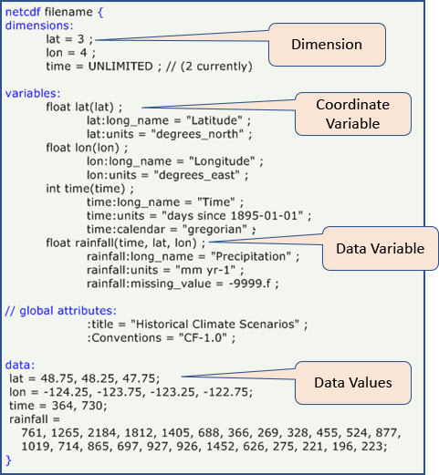
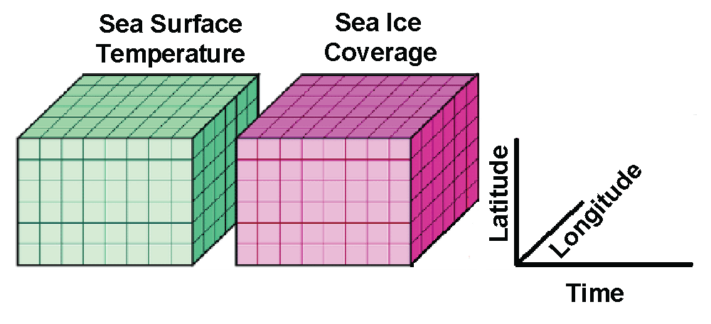
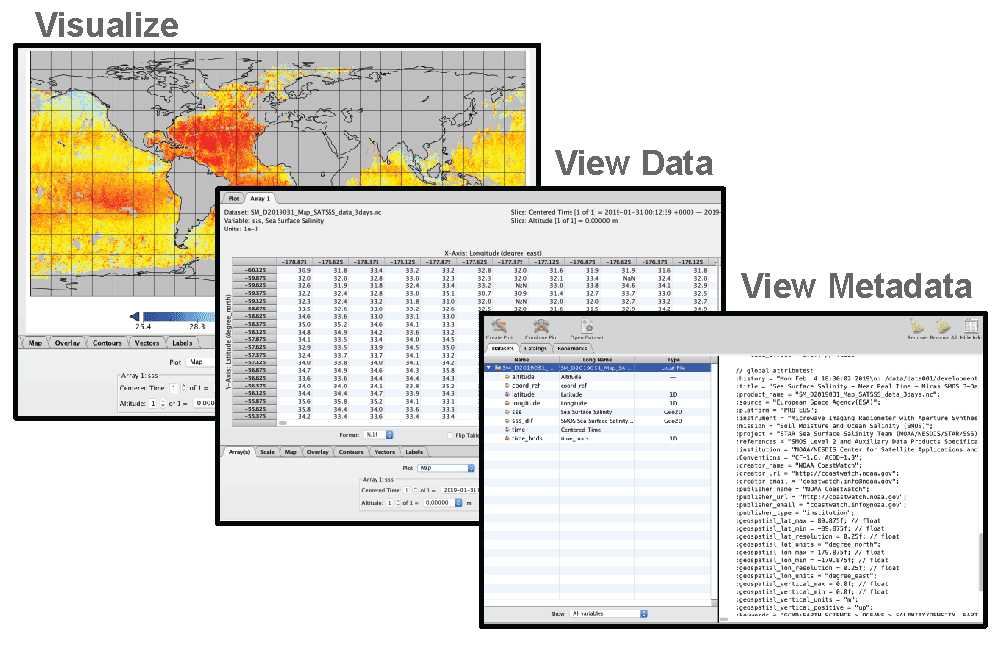
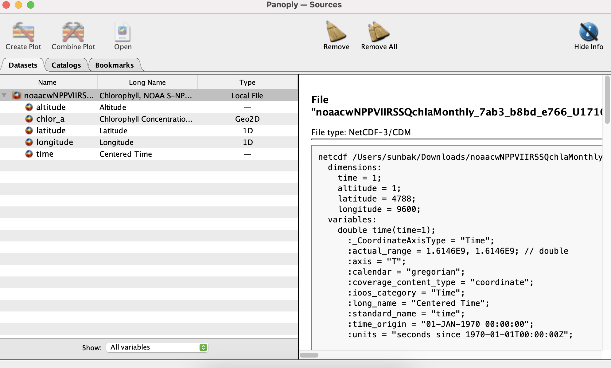
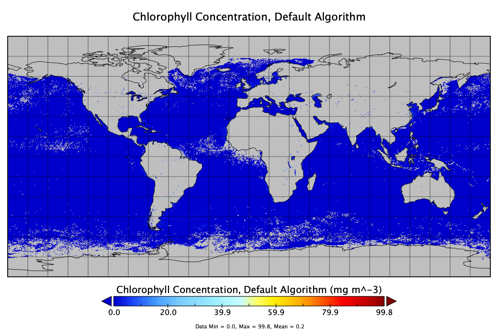
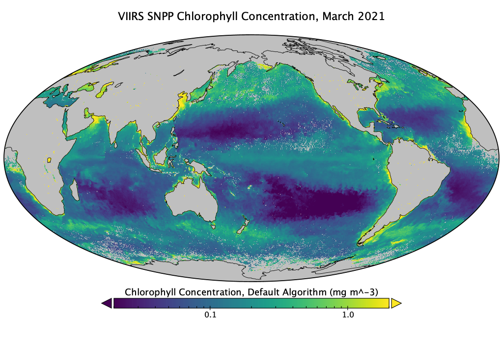
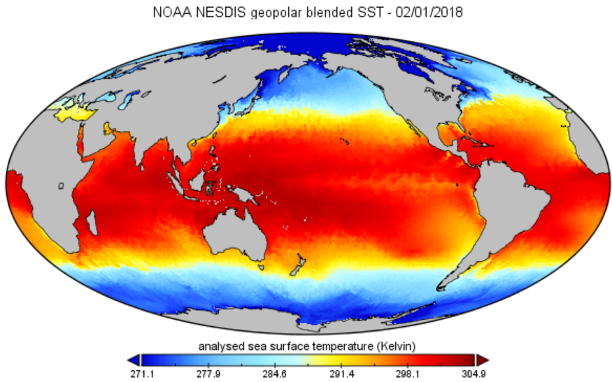
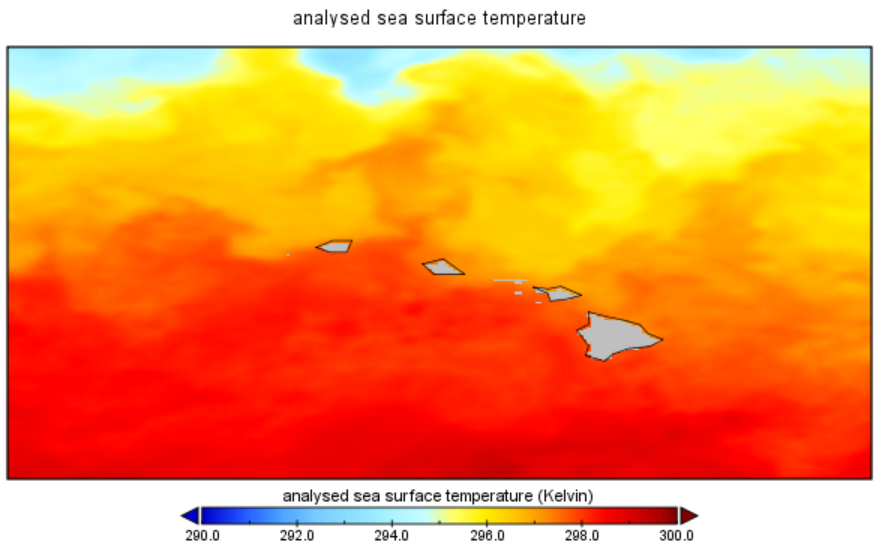
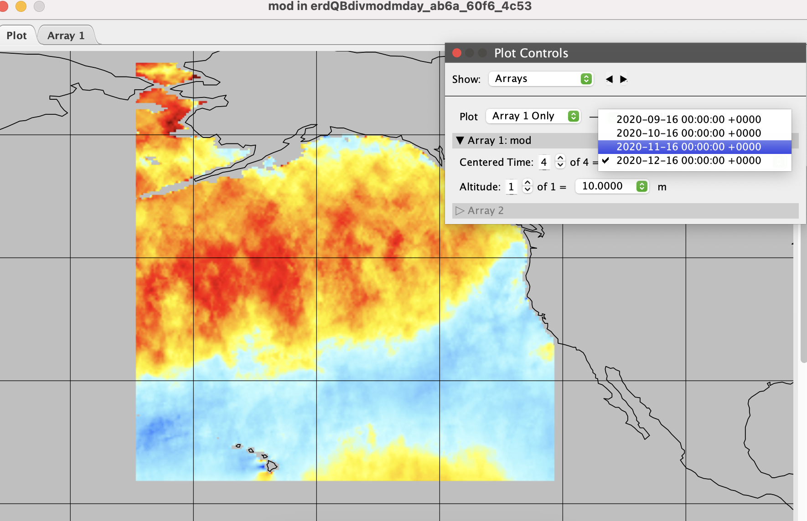

# NetCDF and Panoply tutorial  
> Updated January 2022 

## NetCDF 

**NetCDF (Network Common Data Form)** is a file format for storing multidimensional scientific data (variables), including satellite observations of variable we wll use in the course such as sea surface temperature, salinity, chlorophyll concentration, and wind speed. Many organizations and scientific groups in different countries have adopted netCDF as a standard way to represent some forms of scientific data.

The NetCDF format has many advantages, the most important of which is that it is **self-describing**, meaning that software packages can directly read the data and determine its structure, the variable names and essential metadata such as the units. This self-describing aspect of the netCDF file format means that the information needed to ensure accurate work (reduce the incidence of errors) is available within the data itself (no need for additional files). Secondly, it means that different analysis software, like Matlab, R, Python or ArcGIS (among many others), have utilities to read and work with NetCDF files. Thirdly, plotting software (e.g. Ferret, **Panoply**, ncview) can directly read the netCDF files for visualization.

## NASA Panoply 

NASA developed the Panoply viewer that allows users to view and visualize data held in NetCDF files. Some feature is the software include:

* Visualize data from netCDF and HDF files
* View the metadata
* View the data
* Display the data in many different map projections
* Download visualization as images
* Create animations
* Freeware

Panoply is available for download at: [https://www.giss.nasa.gov/tools/panoply/](https://www.giss.nasa.gov/tools/panoply/) and can be run on Windows, Mac and Linux computers. 

A set of "how to" instructions can be found to the following URL   
[https://www.giss.nasa.gov/tools/panoply/help/](https://www.giss.nasa.gov/tools/panoply/help/)  
Below are a few examples to try out to get you used to visualizing data with the Panoply Viewer.

## Example #1. Make a map of global chlorophyll a concentration 

* Download the a global netCDF file of the NOAA VIIRS, Science Quality Chlorophyll dataset from the West Coast Node ERDDAP by clicking on the link below. The link will open in your default browser and begin the download for the monthly average for March 2021. [https://coastwatch.pfeg.noaa.gov/erddap/griddap/nesdisVHNSQchlaMonthly.nc?chlor_a[(2021-03-01T12:00:00Z)][(0.0)][(89.75625):(-89.75626)][(-179.9812):(179.9813)]&.draw=surface&.vars=longitude|latitude|chlor_a](https://coastwatch.pfeg.noaa.gov/erddap/griddap/nesdisVHNSQchlaMonthly.nc?chlor_a[%282021-03-01T12:00:00Z%29][%280.0%29][%2889.75625%29:%28-89.75626%29][%28-179.9812%29:%28179.9813%29]&.draw=surface&.vars=longitude|latitude|chlor_a)
* Launch Panoply.
* When Panoply opens, it prompts you to open a file. Open the file you just downloaded.

On the left side, Panoply lists the variables contained in the file (time, altitude, longitude, latitude, chlor_a).

On the right side, it displays the file’s metadata. You can scroll down to get more details. For example, in the global attributes, you will find the platform (this is data from the Suomi-NPP satellite), the instrument (VIIRS), the processing version (2018.0), the time coverage (2002 to 2018). Some additional information that might help you use the dataset are: 

* the summary, which briefly describes the dataset:

> summary = Level-3 Standard Mapped Image (SMI), Global, 4km, Chlorophyll, Monthly composite data from the Visible and Infrared Imager/Radiometer Suite (VIIRS). These are science quality data with a 15-day latency. The data, processed by the NOAA/STAR Ocean Color Team, are produced from MSL12 v1.2 using OC-SDR v04 and were release by CoastWatch as of 2017-08-07. VIIRS is a multi-disciplinary instrument that flies on the Suomi-NPP (National Polar-orbiting Partnership) satellite and is the successor to MODIS. Suomi-NPP is the initial spacecraft in the JPSS (Joint Polar Satellite Systems) series of spacecraft. JPSS is our Nation's next generation polar-orbiting operational environmental satellite system. JPSS is a collaborative program between NOAA and its acquisition agent NASA.

* and the license, which tell you how the data may be used and how the acknowledge the data provider.

> license = [https://science.nasa.gov/earth-science/earth-science-data/data-information-policy/](https://science.nasa.gov/earth-science/earth-science-data/data-information-policy/nThe)   
> The data may be used and redistributed for free but is not intended for legal use, since it may contain inaccuracies. Neither the datanContributor, ERD, NOAA, nor the United States Government, nor any of their employees or contractors, makes any warranty, express or implied, including warranties of merchantability and fitness for a particular purpose, or assumes any legal liability for the accuracy, completeness, or usefulness, of this information. Please acknowledge the use of these data with the following statement: "These data were provided by NOAA's Center for Satellite Applications & Research (STAR) and the CoastWatch program and distributed by NOAA/NMFS/SWFSC/ERD." To reference these data as a citation in a paper, please follow the instructions in the license and at this link: [https://coastwatch.pfeg.noaa.gov/erddap/information.html#citeDataset](https://coastwatch.pfeg.noaa.gov/erddap/information.html#citeDataset)"; :map_projection = "geographic";

The metadata may also contain a Digital Object Identifier (DOI ), which is a persistent identifier used to identify objects uniquely, that typically links to a webpage the contains extra information about the data. This dataset file has no DOI in the metadata. Metadata varies from file to file depending on how much information is provided by the person/institution who generated the file.

* Next, on the left side of the screen, double click on the chlor_a variable. Keep the default settings and click Create. (this will take a minute, it’s a big file)

Panoply generated an image of the chlorophyll data contained in the file.

* Above the image, click on the “Array 1” tab. This shows you all the values of chlorophyll concentration contained in the file for each longitude/latitude pixel.

We now need to adjust the color scale and tweak some of the image options. Note: There may be a lag between clicking or adjusting values, and results. It’s a big file.

* Above the image, click back to the the “Plot” tab. 
* Below the image, click on the “scale” submenu.
  * Change the “Units” from “scalar” to “log10”.
  * Adjust the color scale to 0.02 to 2.0.
  * In “Color Table” you have many options of color palettes. Try the “MPL_viridis.rgb” for chlorophyll concentration, but you can choose whichever one you prefer.
* Next click on the “Map” submenu and
  * change the map projection to “Mollweide Oblique”.
  * change “Center on: Lon.” to 180º to center the map on the Pacific.
  * change “Grid: style” to none if you want to remove the longitude/latitude grid.
* Click on the “Labels” submenu
  * uncheck the “Center footnote” box.
  * edit the Title to “VIIRS SNPP Chlorophyll Concentration, March 2021”
* Finally, save the image to your computer (File &gt; Save image).

You can also go to: [https://www.giss.nasa.gov/tools/panoply/colorbars/](https://www.giss.nasa.gov/tools/panoply/colorbars/) to download additional color palettes. Download another palette for chlorophyll, open it in Panoply, then change the color palette for your image to this new one. Save the image to your computer.

## Example #2. Make a map of global SST 

* In a browser, go to the FTP server for the global Sea Surface Temperature from the CoastWatch : ​[ftp://ftp.star.nesdis.noaa.gov/pub/socd2/coastwatch/sst_blended/sst5km/night/ghrsst/2020/](ftp://ftp.star.nesdis.noaa.gov/pub/socd2/coastwatch/sst_blended/sst5km/night/ghrsst/2020/)​
* Download any file.
* Open the file in Panoply. Scroll down the list of metadata. You can see it looks different from the metadata for the previous file.

This is a blended product. Identify the name of the instruments and satellites the data come from. How many satellites were used to create this gap-free SST dataset?

Following the same steps as above, create an image of the “analysed_sst” variable with an appropriate color scale. (You do not need to use a log scale for SST though).

* Change the units to ºC or ºF.
* Click on “Fit to Data” to adjust the color scale or adjust the range of values manually.
* Adjust the title with the file’s date.
* Save to your computer.

## Example #3. Zooming in on a region 

* Close any windows showing maps.
* Double-click on “analysed_sst” again and click ok.
* To zoom in on a region, push the “Ctrl” key with Windows and the "command" key on Mac. You will see that your cursor changes to a magnifying glass. While keeping the “Ctrl” key down, click and drag over a region of interest. This will generate a plot of SST for that region only.

## Files with multiple time steps 

* Download wind data for several months using the following URL: [https://coastwatch.pfeg.noaa.gov/erddap/griddap/erdQBdivmodmday.nc?mod[(2020-09-16T00:00:00Z):1:(2020-12-16T00:00:00Z)][(10.0):1:(10.0)][(17.75):1:(68.75)][(188.0):1:(239.0)]](https://coastwatch.pfeg.noaa.gov/erddap/griddap/erdQBdivmodmday.nc?mod[%282020-09-16T00:00:00Z%29:1:%282020-12-16T00:00:00Z%29][%2810.0%29:1:%2810.0%29][%2817.75%29:1:%2868.75%29][%28188.0%29:1:%28239.0%29])
* Open it in Panoply 
* This is monthly wind speed data from the ASCAT instrument on the MetOps satellite for the Alaska region during September through December, 2020.
* Double click on the "mod" variable ("Modulus of Wind Speed). Keep the default settings and click "Create" to create the global map. 
* Zoom in on the region with data by holding down the “Ctrl” key with Windows and the "command" key on Mac. While keeping the “Ctrl” key down, click and drag over the data region in the Gulf of Alaska. 
* Click on the “Array(s)” tab. There you can select a specific time step. Try repeatedly clicking on the up arrow next to "Centered time" to animate the Gulf of Alaska entering the windy season. 

## References 
* ​[https://www.giss.nasa.gov/tools/panoply/](https://www.giss.nasa.gov/tools/panoply/)
* ​[http://pro.arcgis.com/en/pro-app/help/data/multidimensional/a-quick-tour-of-netcdf-data.htm](http://pro.arcgis.com/en/pro-app/help/data/multidimensional/a-quick-tour-of-netcdf-data.htm)
* ​[https://www.nodc.noaa.gov/woce/woce_v3/wocedata_1/cmdac/primer/why.htm](https://www.nodc.noaa.gov/woce/woce_v3/wocedata_1/cmdac/primer/why.htm)
