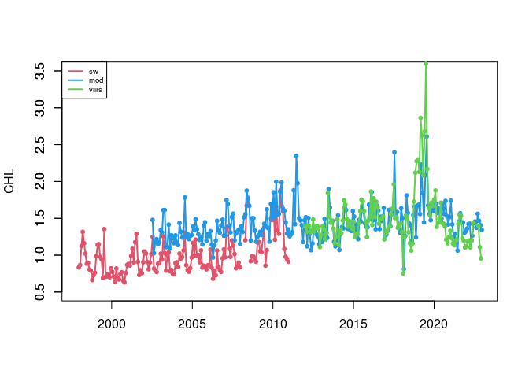
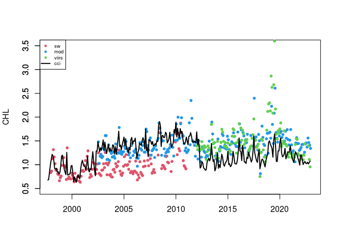

A tidyverse/ggplot version is also available here:
<https://github.com/jebyrnes/noaa_coastwatch_tutorial_1/blob/main/tutorial2-1.md>
Links to an external site.

courtesy of Jarrett Byrnes from UMass Boston - <http://byrneslab.net>
(Thank you Jarrett!!)

## Background

Several ocean color sensors have been launched since 1997 to provide
continuous global coverage for ocean color data. The sensors have
differences in design and calibration, and different algorithms may be
applied to generate chlorophyll values. Consequently, chlorophyll-a
values can vary among the sensors during periods where measurements
overlap.

To examine this phenomenon, we will download and plot time-series of
chlorophyll-a concentrations from various sensors from 1997 to the
present and see how the measurements compare during periods of overlap.

## Objective

This tutorial will show how to extract a time-series from four different
monthly satellite chlorophyll datasets for the period that each was in
operation between 1997-present. It will showcase the use of the rerddap
package, which was developed to make it easier to interact with ERDDAP
servers from R.

More information about the package can be found here:
[https://cran.r-project.org/web/packages/rerddap/index.html](%5Bhttps://cran.r-project.org/web/packages/rerddap/index.html)

and here:
<https://cran.r-project.org/web/packages/rerddap/vignettes/Using_rerddap.html>

## The tutorial demonstrates the following techniques

-   Using **rerddap** to extract data from a rectangular area of the
    ocean over time
-   Retrieve information about a dataset from ERDDAP
-   Comparing results from different sensors
-   Averaging data spatially
-   Producing timeseries plots
-   Drawing maps with satellite data

## Datasets used

SeaWiFS Chlorophyll-a, V.2018, Monthly, Global, 4km, 1997-2012
<https://coastwatch.pfeg.noaa.gov/erddap/griddap/erdSW2018chlamday>

MODIS Aqua, Chlorophyll-a, V.2022, Monthly, Global, 4km, 2002-present
<https://coastwatch.pfeg.noaa.gov/erddap/griddap/erdMH1chlamday_R2022SQ>

NOAA VIIRS S-NPP, Chlorophyll-a, Monthly, Global, 4km, 2012-present
<https://coastwatch.pfeg.noaa.gov/erddap/griddap/nesdisVHNSQchlaMonthly>

ESA CCI Ocean Colour Dataset, v6.0, Monthly, Globsl, 4km, 1997-Present
This dataset was developed by the European Space Agency’s Climate Change
Initiative. The dataset merges data from multiple sensors (MERIS, MODIS,
VIIRS and SeaWiFS) to create a long timeseries (1997 to present) with
better spatial coverage than any single sensor. Parameters include
chlorophyll a, remote sensing reflectance, diffuse attenuation
coefficients, absorption coefficients, backscatter coefficients, and
water classification.
<https://coastwatch.pfeg.noaa.gov/erddap/griddap/pmlEsaCCI60OceanColorMonthly>

## Load packages

    packages <- c( "ncdf4","plyr","lubridate","rerddap","ggplot2")

    # Install packages not yet installed
    installed_packages <- packages %in% rownames(installed.packages())

    if (any(installed_packages == FALSE)) {
      install.packages(packages[!installed_packages])
    }

    # Load packages 
    invisible(lapply(packages, library, character.only = TRUE))

    ## 
    ## Attaching package: 'lubridate'

    ## The following objects are masked from 'package:base':
    ## 
    ##     date, intersect, setdiff, union

## Define the area to extract

First we define the longitude-latitude boundaries of the region:

    xcoord <- c(-95,-90)
    ycoord <- c(25,30)

## Use rerddap to download the data

Next we define the URL of the ERDDAP we will be using:

    ERDDAP_Node <- "https://coastwatch.pfeg.noaa.gov/erddap/"

### Get monthly seawifs data, which starts in 1997.

Go to ERDDAP to find the name of the dataset for monthly SeaWIFS data:
erdSW2018chlamday

You should always examine the dataset in ERDDAP to check the date range,
names of the variables and dataset ID, to make sure your griddap calls
are correct:
<https://coastwatch.pfeg.noaa.gov/erddap/griddap/erdSW2018chlamday>

First we need to know what our variable is called. Let’s retrieve some
metadata using the **info** function:

    dataInfo <- rerddap::info('erdSW2018chlamday', url=ERDDAP_Node)
    var <- dataInfo$variable$variable_name

    var

    ## [1] "chlorophyll"

We are interested in the **chlorophyll** variable, which contains the
values of chlorophyll-a concentration. This is var\[1\].

griddap is a function from the rerddap package. It grabs the data from
ERDDAP based on the parameters we give it.

We are grabbing a lot of data so all the griddap commands might take a
while.

    sw <- griddap(url=ERDDAP_Node, 'erdSW2018chlamday', time = c('1997-12-01', '2010-12-01'), latitude = ycoord, longitude = xcoord, fields = var[1] )

### Plot data to show where it is in the world

    world <- map_data("world")

    ggplot() + 
      geom_polygon(data = world, aes(x = long, y = lat, group = group),
                   fill = "lightgray",
                   colour = "white") + 
      coord_fixed( xlim=c(-100,-80),ylim=c(15,35)) +
      geom_tile(aes(sw$data$longitude,sw$data$latitude,fill=log(sw$data$chlorophyll)))+
      theme_minimal() +
      labs(fill="log(Chl)") +
      scale_fill_viridis_c()

    #Spatially average all the data within the box

    swAVG <- ddply( sw$data, .(time), function(x) mean(x$chlorophyll, na.rm =TRUE) )

### Get monthly MODIS data, which starts in 2002.

    dataInfo <- rerddap::info('erdMH1chlamday_R2022SQ', url=ERDDAP_Node)
    var=dataInfo$variable$variable_name

    MOD <- griddap(url=ERDDAP_Node, 'erdMH1chlamday_R2022SQ', time = c('2002-07-16', '2022-12-16'), latitude = ycoord, longitude = xcoord, fields = var[1])

    #Spatially average all the data within the box:

    MODAVG <- ddply( MOD$data, .(time), function(x) mean(x$chlor_a, na.rm =TRUE) )

### Get monthly VIIRS data, which starts in 2012.

    dataInfo <- rerddap::info('noaacwNPPVIIRSSQchlaMonthly', url="https://coastwatch.noaa.gov/erddap/")
    var=dataInfo$variable$variable_name

    VIIRS <- griddap(url="https://coastwatch.noaa.gov/erddap/", 'noaacwNPPVIIRSSQchlaMonthly', time = c('2012-01-02', '2022-12-01'), latitude = ycoord, longitude = xcoord, fields = var)

    VIIRSAVG <- ddply( VIIRS$data, .(time), function(x) mean(x$chlor_a, na.rm =TRUE) )

### Plot time series for the three datasets

    plot(as.Date(swAVG$time), swAVG$V1, type='l', col=2,lwd=2, xlab="", xlim=as.Date(c("1997-12-01","2022-12-01")), ylim=c(0.5,3.5),
         ylab="CHL")
    axis(2)
    points(as.Date(swAVG$time), swAVG$V1,pch=20,col=2)

    lines(as.Date(MODAVG$time), MODAVG$V1, col=4, lwd=2)
    points(as.Date(MODAVG$time), MODAVG$V1,pch=20,col=4)

    lines(as.Date(VIIRSAVG$time), VIIRSAVG$V1, col=3, lwd=2)
    points(as.Date(VIIRSAVG$time), VIIRSAVG$V1,pch=20,col=3)

    legend('topleft',legend=c('sw','mod','viirs'),cex=0.6,col=c(2,4,3),lwd=2)

You can see that the values of chl-a concentration don’t match between
sensors.

### Get OC-CCI data (September 1997 to Dec 2022)

If you needed a single time series from 1997 to present, you would have
to use the plot above to devise some method to reconcile the difference
in values where two datasets overlap. Alternatively, you could use the
ESA OC-CCI (ocean color climate change initiative) dataset, which blends
data from many satellite missions into a single dataset, including data
from SeaWiFS, MODIS, and VIIRS.

Add the ESA OC-CCI dataset to the plot above to see how it compares with
data from the individual satellite missions.

    dataInfo <- rerddap::info('pmlEsaCCI60OceanColorMonthly', url=ERDDAP_Node)
    var=dataInfo$variable$variable_name
    var

    ##  [1] "adg_412"            "adg_412_bias"       "adg_412_rmsd"      
    ##  [4] "adg_443"            "adg_443_bias"       "adg_443_rmsd"      
    ##  [7] "adg_490"            "adg_490_bias"       "adg_490_rmsd"      
    ## [10] "adg_510"            "adg_510_bias"       "adg_510_rmsd"      
    ## [13] "adg_560"            "adg_560_bias"       "adg_560_rmsd"      
    ## [16] "adg_665"            "adg_665_bias"       "adg_665_rmsd"      
    ## [19] "aph_412"            "aph_412_bias"       "aph_412_rmsd"      
    ## [22] "aph_443"            "aph_443_bias"       "aph_443_rmsd"      
    ## [25] "aph_490"            "aph_490_bias"       "aph_490_rmsd"      
    ## [28] "aph_510"            "aph_510_bias"       "aph_510_rmsd"      
    ## [31] "aph_560"            "aph_560_bias"       "aph_560_rmsd"      
    ## [34] "aph_665"            "aph_665_bias"       "aph_665_rmsd"      
    ## [37] "atot_412"           "atot_443"           "atot_490"          
    ## [40] "atot_510"           "atot_560"           "atot_665"          
    ## [43] "bbp_412"            "bbp_443"            "bbp_490"           
    ## [46] "bbp_510"            "bbp_560"            "bbp_665"           
    ## [49] "chlor_a"            "chlor_a_log10_bias" "chlor_a_log10_rmsd"
    ## [52] "kd_490"             "kd_490_bias"        "kd_490_rmsd"       
    ## [55] "MERIS_nobs_sum"     "MODISA_nobs_sum"    "OLCI_A_nobs_sum"   
    ## [58] "OLCI_B_nobs_sum"    "Rrs_412"            "Rrs_412_bias"      
    ## [61] "Rrs_412_rmsd"       "Rrs_443"            "Rrs_443_bias"      
    ## [64] "Rrs_443_rmsd"       "Rrs_490"            "Rrs_490_bias"      
    ## [67] "Rrs_490_rmsd"       "Rrs_510"            "Rrs_510_bias"      
    ## [70] "Rrs_510_rmsd"       "Rrs_560"            "Rrs_560_bias"      
    ## [73] "Rrs_560_rmsd"       "Rrs_665"            "Rrs_665_bias"      
    ## [76] "Rrs_665_rmsd"       "SeaWiFS_nobs_sum"   "total_nobs_sum"    
    ## [79] "VIIRS_nobs_sum"     "water_class1"       "water_class10"     
    ## [82] "water_class11"      "water_class12"      "water_class13"     
    ## [85] "water_class14"      "water_class2"       "water_class3"      
    ## [88] "water_class4"       "water_class5"       "water_class6"      
    ## [91] "water_class7"       "water_class8"       "water_class9"

This dataset contains many variables. Our variable of interest is
*chlor\_a* , which is var\[49\].

    CCI <- griddap(url=ERDDAP_Node, 'pmlEsaCCI60OceanColorMonthly', time = c('1997-09-04', '2022-12-01'), latitude = ycoord, longitude = xcoord, fields = var[49] )

    #Spatially average all the data within the box:

    CCIAVG <- ddply( CCI$data, .(time), function(x) mean(x$chlor_a, na.rm =TRUE) )

### Make another plot with CCI as well to compare

    plot(as.Date(swAVG$time), swAVG$V1, type='n', col=2,lwd=2, xlab="", xlim=as.Date(c("1997-12-01","2022-12-01")), ylim=c(0.5,3.5), ylab="CHL")
    axis(2)

    points(as.Date(swAVG$time), swAVG$V1,pch=20,col=2)
    points(as.Date(MODAVG$time), MODAVG$V1,pch=20,col=4)
    points(as.Date(VIIRSAVG$time), VIIRSAVG$V1,pch=20,col=3)
    lines(as.Date(CCIAVG$time),CCIAVG$V1,lwd=2)

    legend('topleft',legend=c('sw','mod','viirs','cci'), cex=0.6,col=c(2,4,3,1),pch=c(20,20,20,NA),lty=c(NA,NA,NA,1),lwd=2)  

