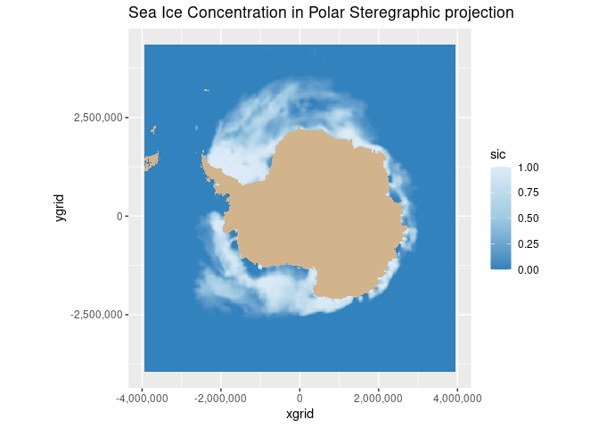
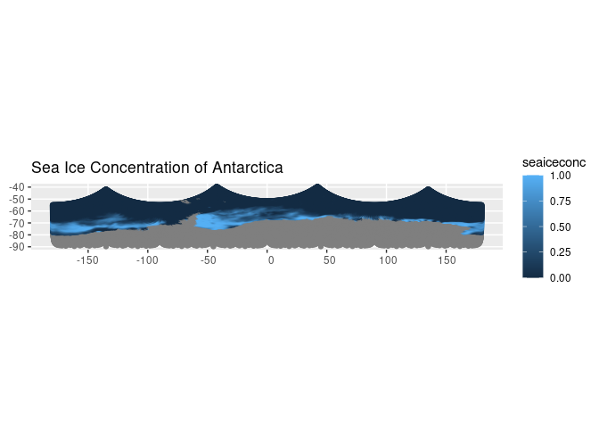

# Transforming satellite data from one map projection to another

> history | Create July 2023 | Updated August 2023 

## Background

Map projections try to portray the earth’s spherical surface on a flat
surface. A coordinate reference system (CRS) defines how the
two-dimensional, projected map relates to real places on the earth.
Which map projection and CRS to use depends on the region in which you
are working and the analysis you will do.

<a href="https://polarwatch.noaa.gov/" target="_blank">NOAA
PolarWatch</a> distributes gridded and tabular oceanographic data for
polar regions.

Most of the satellite data in the PolarWatch data catalog use a
projection based on a Geographic Coordinate Reference System, where the
X and Y coordinates are longitude and latitude, respectively.
Geographical coordinates work well in many parts of the globe, but
within polar regions, features tend to be very distorted. A Polar
Stereographic projection often is a better choice for polar regions. For
example, the NSIDC’s Polar Stereographic Projections, which were
developed to optimize mapping of sea ice, have only a 6% distortion of
the grid at the poles and no distortion at 70º, a latitude close to
where the marginal ice zones occur. The
<a href="https://polarwatch.noaa.gov/catalog/ice-sq-sh-nsidc-cdr-v4/preview/?dataset=daily&var=cdr_seaice_conc">NOAA
NSIDC Sea Ice Concentration Climate Data Record</a> dataset, for
example, is in a polar stereographic projection.

When working with satellite datasets with a mix of map projections, it
is often necessary to transform all the data to a common projection. In
this exercise, we will learn to transform coordinates from one
projection to another.

## Objective

In this tutorial, we will learn to transform dataset coordinates from
one projection to another.

## This tutorial demonstrates the following techniques

-   Downloading and saving a netCDF file from PolarWatch ERDDAP data
    server
-   Accessing satellite data and metadata in polar stereographic
    projection
-   Convert the netcdf data into a dataframe
-   Transforming coordinates using EPSG codes
-   Mapping data using the transformed coordinates

## Dataset used

*Sea Ice Concentration, NOAA/NSIDC Climate Data Record V4, Southern
Hemisphere, 25km, Science Quality, 1978-2022, Monthly* The sea ice
concentration (SIC) dataset used in this exercise is produced by NOAA
NSIDC from passive microwave sensors as part of the Climate Data Record.
It is a science quality dataset of monthly averages that extends from
1978-2022. SIC is reported as the fraction (0 to 1) of each grid cell
that is covered by ice. The data are mapped in the Southern Polar
Stereographic projection (EPSG:3031). The resolution is 25km, meaning
each pixel in this data set represents a value that covers a 25km by
25km area. The dataset can be downloaded directly from the PolarWatch
ERDDAP at the following link:
<https://polarwatch.noaa.gov/erddap/griddap/nsidcG02202v4shmday>

### Install required packages

This code block will check if required packages are installed, and will
install missing packages.

    # Function to check if pkgs are installed, install missing pkgs, and load
    pkgTest <- function(x)
    {
      if (!require(x,character.only = TRUE))
      {
        install.packages(x,dep=TRUE,repos='http://cran.us.r-project.org')
        if(!require(x,character.only = TRUE)) stop(x, " :Package not found")
      }
    }

    list.of.packages <- c("ncdf4" , "sf", "ggplot2","scales", "RColorBrewer")

    # create list of installed packages
    pkges = installed.packages()[,"Package"]
    for (pk in list.of.packages) {
      pkgTest(pk)
    }

### Get data from ERDDAP

    # download the sea ice data NetCDF file
    url <- "https://polarwatch.noaa.gov/erddap/griddap/nsidcG02202v4shmday.nc?cdr_seaice_conc_monthly[(2022-12-01T00:00:00Z):1:(2022-12-01T00:00:00Z)][(4350000.0):1:(-3950000.0)][(-3950000.0):1:(3950000.0)]"

    sic <- download.file(url, destfile="sic.nc", mode='wb')

    # file open
    ds <- nc_open('sic.nc')

    # print metadata
    print(ds)

    ## File sic.nc (NC_FORMAT_CLASSIC):
    ## 
    ##      1 variables (excluding dimension variables):
    ##         float cdr_seaice_conc_monthly[xgrid,ygrid,time]   
    ##             _FillValue: 2.53999996185303
    ##             ancillary_variables: stdev_of_cdr_seaice_conc_monthly qa_of_cdr_seaice_conc_monthly
    ##             colorBarMaximum: 1
    ##             colorBarMinimum: 0
    ##             colorBarPalette: KT_ice
    ##             datum: +ellps=urn:ogc:def:crs:EPSG::4326
    ##             flag_meanings: pole_hole lakes coastal land_mask missing_data
    ##             flag_values: -5
    ##              flag_values: -4
    ##              flag_values: -3
    ##              flag_values: -2
    ##              flag_values: -1
    ##             ioos_category: Ice Distribution
    ##             long_name: NOAA/NSIDC Climate Data Record of Passive Microwave Monthly Southern Hemisphere Sea Ice Concentration
    ##             references: https://nsidc.org/data/g02202/versions/4/
    ##             standard_name: sea_ice_area_fraction
    ##             units: 1
    ##             valid_range: 0
    ##              valid_range: 1
    ## 
    ##      3 dimensions:
    ##         time  Size:1 
    ##             _ChunkSizes: 1024
    ##             _CoordinateAxisType: Time
    ##             actual_range: 1669852800
    ##              actual_range: 1669852800
    ##             axis: T
    ##             calendar: gregorian
    ##             ioos_category: Time
    ##             long_name: ANSI date
    ##             standard_name: time
    ##             time_origin: 01-JAN-1970 00:00:00
    ##             units: seconds since 1970-01-01T00:00:00Z
    ##         ygrid  Size:332 
    ##             _ChunkSizes: 332
    ##             actual_range: -3937500
    ##              actual_range: 4337500
    ##             axis: Y
    ##             ioos_category: Location
    ##             long_name: projection_grid_y_centers
    ##             standard_name: projection_y_coordinate
    ##             units: meters
    ##             valid_range: -3950000
    ##              valid_range: 4350000
    ##         xgrid  Size:316 
    ##             _ChunkSizes: 316
    ##             actual_range: -3937500
    ##              actual_range: 3937500
    ##             axis: X
    ##             ioos_category: Location
    ##             long_name: projection_grid_x_centers
    ##             standard_name: projection_x_coordinate
    ##             units: meters
    ##             valid_range: -3950000
    ##              valid_range: 3950000
    ## 
    ##     65 global attributes:
    ##         acknowledgement: This project was supported in part by a grant from the NOAA Climate Data Record Program. Production of original NASA Team and Bootstrap algorithm estimates supported by the NASA Polar Distributed Active Archive Center. The sea ice concentration algorithms were developed by Donald J. Cavalieri, Josefino C. Comiso, Claire L. Parkinson, and others at the NASA Goddard Space Flight Center in Greenbelt, MD.
    ##         cdm_data_type: Grid
    ##         cdr_variable: cdr_seaice_conc_monthly
    ##         contributor_name: Walter N. Meier, Florence Fetterer, Ann Windnagel, J. Scott Stewart, Trey Stafford, Matt Fisher
    ##         contributor_role: principal investigator, author, author, software developer, software developer, software developer
    ##         Conventions: CF-1.6, ACDD-1.3, COARDS
    ##         creator_email: nsidc@nsidc.org
    ##         creator_name: NSIDC
    ##         creator_type: institution
    ##         creator_url: https://nsidc.org/
    ##         date_created: 2023-02-22T23:17:53Z
    ##         defaultGraphQuery: cdr_seaice_conc_monthly%5Blast%5D%5B(4337500.0):(-3937500.0)%5D%5B(-3937500.0):(3937500.0)%5D&.draw=surface
    ##         grid_mapping_false_easting: 0
    ##         grid_mapping_false_northing: 0
    ##         grid_mapping_GeoTransform: -3950000.0 25000.0 0 4350000.0 0 -25000.0
    ##         grid_mapping_grid_boundary_bottom_projected_y: -3950000
    ##         grid_mapping_grid_boundary_left_projected_x: -3950000
    ##         grid_mapping_grid_boundary_right_projected_x: 3950000
    ##         grid_mapping_grid_boundary_top_projected_y: 4350000
    ##         grid_mapping_latitude_of_projection_origin: -90
    ##         grid_mapping_longitude_of_projection_origin: 0
    ##         grid_mapping_name: polar_stereographic
    ##         grid_mapping_parent_grid_cell_column_subset_end: 316
    ##         grid_mapping_parent_grid_cell_column_subset_start: 0
    ##         grid_mapping_parent_grid_cell_row_subset_end: 332
    ##         grid_mapping_parent_grid_cell_row_subset_start: 0
    ##         grid_mapping_proj4text: +proj=stere +lat_0=-90 +lat_ts=-70 +lon_0=0 +k=1 +x_0=0 +y_0=0 +a=6378273 +b=6356889.449 +units=m +no_defs
    ##         grid_mapping_scaling_factor: 1
    ##         grid_mapping_semimajor_radius: 6378273
    ##         grid_mapping_semiminor_radius: 6356889.449
    ##         grid_mapping_spatial_ref: PROJCS["NSIDC Sea Ice Polar Stereographic South",GEOGCS["Unspecified datum based upon the Hughes 1980 ellipsoid",DATUM["Not_specified_based_on_Hughes_1980_ellipsoid",SPHEROID["Hughes 1980",6378273,298.279411123061,AUTHORITY["EPSG","7058"]],AUTHORITY["EPSG","6054"]],PRIMEM["Greenwich",0,AUTHORITY["EPSG","8901"]],UNIT["degree",0.01745329251994328,AUTHORITY["EPSG","9122"]],AUTHORITY["EPSG","4054"]],UNIT["metre",1,AUTHORITY["EPSG","9001"]],PROJECTION["Polar_Stereographic"],PARAMETER["latitude_of_origin",-70],PARAMETER["central_meridian",0],PARAMETER["scale_factor",1],PARAMETER["false_easting",0],PARAMETER["false_northing",0],AUTHORITY["EPSG","3412"],AXIS["X",UNKNOWN],AXIS["Y",UNKNOWN]]
    ##         grid_mapping_srid: urn:ogc:def:crs:EPSG::3412
    ##         grid_mapping_standard_parallel: -70
    ##         grid_mapping_straight_vertical_longitude_from_pole: 180
    ##         grid_mapping_units: meters
    ##         history: Tue Jan  5 13:40:25 2021: ncks -x -v goddard_merged_seaice_conc_monthly ./previous_blank_ncs/S_monthly_blank.nc ./S_monthly_blank.nc
    ## 2023-09-13T19:25:12Z (local files)
    ## 2023-09-13T19:25:12Z https://polarwatch.noaa.gov/erddap/griddap/nsidcG02202v4shmday.nc?cdr_seaice_conc_monthly[(2022-12-01T00:00:00Z):1:(2022-12-01T00:00:00Z)][(4350000.0):1:(-3950000.0)][(-3950000.0):1:(3950000.0)]
    ##         id: https://doi.org/10.7265/sr8p-kc62
    ##         infoUrl: https://nsidc.org/data/g02202/versions/4/
    ##         institution: NSIDC > National Snow and Ice Data Center
    ##         keywords: algorithm, area, bellingshausen, bootstrap, cdr_seaice_conc_monthly, center, climate, common, concentration, cryosphere, data, defense, deviation, distribution, dmsp, earth, Earth Science > Cryosphere > Sea Ice > Ice Extent, Earth Science > Cryosphere > Sea Ice > Sea Ice Concentration, Earth Science > Oceans > Sea Ice > Ice Extent, estimated, extent, flag, flags, flight, format, fraction, geographic, Geographic Region > Polar, Geographic Region > Southern Hemisphere, goddard, gsfc, hemisphere, ice, ice distribution, meteorological, microwave, month, monthly, nasa, national, network, noaa, noaa/nsidc, nsidc, nsidc_bt_seaice_conc_monthly, nsidc_nt_seaice_conc_monthly, ocean, Ocean > Southern Ocean, Ocean > Southern Ocean > Bellingshausen Sea, Ocean > Southern Ocean > Ross Sea, Ocean > Southern Ocean > Weddell Sea, oceans, passive, polar, processed, program, qa_of_cdr_seaice_conc_monthly, quality, record, region, ross, satellite, science, sea, sea_ice_area_fraction, sea_ice_area_fraction status_flag, snow, source, southern, space, standard, statistics, status, stdev_of_cdr_seaice_conc_monthly, tdim, team, version, weddell
    ##         keywords_vocabulary: GCMD Science Keywords
    ##         license: No constraints on data access or use
    ##         metadata_link: https://nsidc.org/data/g02202/versions/4/
    ##         naming_authority: org.doi.dx
    ##         NCO: "4.5.4"
    ##         platform: DMSP 5D-3/F17 > Defense Meteorological Satellite Program-F17
    ##         processing_level: NOAA Level 3
    ##         product_version: v04r00
    ##         program: NOAA Climate Data Record Program
    ##         proj_crs_code: EPSG:3412
    ##         proj_crs_code_description: The proj_crs_code attribute references a registered projection identifier (i.e. EPSG) when available. If the projection is not registered, non-standard then this attribute references a PolarWatch assigned internal identifier.
    ##         project: NOAA/NSIDC passive microwave sea ice concentration climate data record
    ##         references: Comiso, J. C., and F. Nishio. 2008. Trends in the Sea Ice Cover Using Enhanced and Compatible AMSR-E, SSM/I, and SMMR Data. Journal of Geophysical Research 113, C02S07, doi:10.1029/2007JC0043257. ; Comiso, J. C., D. Cavalieri, C. Parkinson, and P. Gloersen. 1997. Passive Microwave Algorithms for Sea Ice Concentrations: A Comparison of Two Techniques. Remote Sensing of the Environment 60(3):357-84. ; Comiso, J. C. 1984. Characteristics of Winter Sea Ice from Satellite Multispectral Microwave Observations. Journal of Geophysical Research 91(C1):975-94. ; Cavalieri, D. J., P. Gloersen, and W. J. Campbell. 1984. Determination of Sea Ice Parameters with the NIMBUS-7 SMMR. Journal of Geophysical Research 89(D4):5355-5369. ; Cavalieri, D. J., C. l. Parkinson, P. Gloersen, J. C. Comiso, and H. J. Zwally. 1999. Deriving Long-term Time Series of Sea Ice Cover from Satellite Passive-Microwave Multisensor Data Sets. Journal of Geophysical Research 104(7):    15,803-15,814. ; Comiso, J.C., R.A. Gersten, L.V. Stock, J. Turner, G.J. Perez, and K. Cho. 2017. Positive Trend in the Antarctic Sea Ice Cover and Associated Changes in Surface Temperature. J. Climate, 30, 2251–2267, https://doi.org/10.1175/JCLI-D-16-0408.1
    ##         sensor: SSMI/S > Special Sensor Microwave Imager/Sounder
    ##         software_version_id: git@bitbucket.org:nsidc/seaice_cdr.git@c9c632e73530554d8acfac9090baeb1e35755897
    ##         source: ftp://sidads.colorado.edu/pub/DATASETS/NOAA/G02202_V4/south/daily/2022/seaice_conc_daily_sh_20220701_f17_v04r00.nc, ftp://sidads.colorado.edu/pub/DATASETS/NOAA/G02202_V4/south/daily/2022/seaice_conc_daily_sh_20220702_f17_v04r00.nc, ftp://sidads.colorado.edu/pub/DATASETS/NOAA/G02202_V4/south/daily/2022/seaice_conc_daily_sh_20220703_f17_v04r00.nc, ftp://sidads.colorado.edu/pub/DATASETS/NOAA/G02202_V4/south/daily/2022/seaice_conc_daily_sh_20220704_f17_v04r00.nc, ftp://sidads.colorado.edu/pub/DATASETS/NOAA/G02202_V4/south/daily/2022/seaice_conc_daily_sh_20220705_f17_v04r00.nc, ftp://sidads.colorado.edu/pub/DATASETS/NOAA/G02202_V4/south/daily/2022/seaice_conc_daily_sh_20220706_f17_v04r00.nc, ftp://sidads.colorado.edu/pub/DATASETS/NOAA/G02202_V4/south/daily/2022/seaice_conc_daily_sh_20220707_f17_v04r00.nc, ftp://sidads.colorado.edu/pub/DATASETS/NOAA/G02202_V4/south/daily/2022/seaice_conc_daily_sh_20220708_f17_v04r00.nc, ftp://sidads.colorado.edu/pub/DATASETS/NOAA/G02202_V4/south/daily/2022/seaice_conc_daily_sh_20220709_f17_v04r00.nc, ftp://sidads.colorado.edu/pub/DATASETS/NOAA/G02202_V4/south/daily/2022/seaice_conc_daily_sh_20220710_f17_v04r00.nc, ftp://sidads.colorado.edu/pub/DATASETS/NOAA/G02202_V4/south/daily/2022/seaice_conc_daily_sh_20220711_f17_v04r00.nc, ftp://sidads.colorado.edu/pub/DATASETS/NOAA/G02202_V4/south/daily/2022/seaice_conc_daily_sh_20220712_f17_v04r00.nc, ftp://sidads.colorado.edu/pub/DATASETS/NOAA/G02202_V4/south/daily/2022/seaice_conc_daily_sh_20220713_f17_v04r00.nc, ftp://sidads.colorado.edu/pub/DATASETS/NOAA/G02202_V4/south/daily/2022/seaice_conc_daily_sh_20220714_f17_v04r00.nc, ftp://sidads.colorado.edu/pub/DATASETS/NOAA/G02202_V4/south/daily/2022/seaice_conc_daily_sh_20220715_f17_v04r00.nc, ftp://sidads.colorado.edu/pub/DATASETS/NOAA/G02202_V4/south/daily/2022/seaice_conc_daily_sh_20220716_f17_v04r00.nc, ftp://sidads.colorado.edu/pub/DATASETS/NOAA/G02202_V4/south/daily/2022/seaice_conc_daily_sh_20220717_f17_v04r00.nc, ftp://sidads.colorado.edu/pub/DATASETS/NOAA/G02202_V4/south/daily/2022/seaice_conc_daily_sh_20220718_f17_v04r00.nc, ftp://sidads.colorado.edu/pub/DATASETS/NOAA/G02202_V4/south/daily/2022/seaice_conc_daily_sh_20220719_f17_v04r00.nc, ftp://sidads.colorado.edu/pub/DATASETS/NOAA/G02202_V4/south/daily/2022/seaice_conc_daily_sh_20220720_f17_v04r00.nc, ftp://sidads.colorado.edu/pub/DATASETS/NOAA/G02202_V4/south/daily/2022/seaice_conc_daily_sh_20220721_f17_v04r00.nc, ftp://sidads.colorado.edu/pub/DATASETS/NOAA/G02202_V4/south/daily/2022/seaice_conc_daily_sh_20220722_f17_v04r00.nc, ftp://sidads.colorado.edu/pub/DATASETS/NOAA/G02202_V4/south/daily/2022/seaice_conc_daily_sh_20220723_f17_v04r00.nc, ftp://sidads.colorado.edu/pub/DATASETS/NOAA/G02202_V4/south/daily/2022/seaice_conc_daily_sh_20220724_f17_v04r00.nc, ftp://sidads.colorado.edu/pub/DATASETS/NOAA/G02202_V4/south/daily/2022/seaice_conc_daily_sh_20220725_f17_v04r00.nc, ftp://sidads.colorado.edu/pub/DATASETS/NOAA/G02202_V4/south/daily/2022/seaice_conc_daily_sh_20220726_f17_v04r00.nc, ftp://sidads.colorado.edu/pub/DATASETS/NOAA/G02202_V4/south/daily/2022/seaice_conc_daily_sh_20220727_f17_v04r00.nc, ftp://sidads.colorado.edu/pub/DATASETS/NOAA/G02202_V4/south/daily/2022/seaice_conc_daily_sh_20220728_f17_v04r00.nc, ftp://sidads.colorado.edu/pub/DATASETS/NOAA/G02202_V4/south/daily/2022/seaice_conc_daily_sh_20220729_f17_v04r00.nc, ftp://sidads.colorado.edu/pub/DATASETS/NOAA/G02202_V4/south/daily/2022/seaice_conc_daily_sh_20220730_f17_v04r00.nc, ftp://sidads.colorado.edu/pub/DATASETS/NOAA/G02202_V4/south/daily/2022/seaice_conc_daily_sh_20220731_f17_v04r00.nc
    ##         sourceUrl: (local files)
    ##         spatial_resolution: 25km
    ##         standard_name_vocabulary: CF Standard Name Table v70
    ##         summary: This data set provides a passive microwave sea ice concentration climate data record (CDR) based on gridded brightness temperatures (TBs) from the Defense Meteorological Satellite Program (DMSP) series of passive microwave radiometers: the Nimbus-7 Scanning Multichannel Microwave Radiometer (SMMR), the Special Sensor Microwave Imager (SSM/I) and the Special Sensor Microwave Imager/Sounder (SSMIS). The sea ice concentration CDR is an estimate of sea ice concentration that is produced by combining concentration estimates from two algorithms developed at the NASA Goddard Space Flight Center (GSFC): the NASA Team algorithm and the Bootstrap algorithm. The individual algorithms are used to process and combine brightness temperature data at National Snow and Ice Data Center (NSIDC).  This product is designed to provide a consistent time series of sea ice concentrations (the fraction, or percentage, of ocean area covered by sea ice) from November 1978 to the present which spans the coverage of several passive microwave instruments. The data are gridded on the NSIDC polar stereographic grid with 25 x 25 km grid cells, and are available in Network Common Data Format (NetCDF) file format. Each file contains a variable with the CDR concentration values as well as variables that hold the NASA Team and Bootstrap concentrations for reference. Variables containing standard deviation, quality flags, and projection information are also included. Data are available from NSIDC via FTP see https://nsidc.org/data/G02202/versions/4/. Data are also distributed via the PolarWatch ERDDAP at https://polarwatch.noaa.gov/erddap. Note that the data format available through PolarWatch is different from the NSIDC FTP NetCDF files. The PolarWatch data server stores projection information as global attributes (with the prefix grid_mapping) instead of as a variable; and the timestamp is served in different units (seconds since 1970).
    ##         time_coverage_duration: P1M
    ##         time_coverage_end: 2022-12-01T00:00:00Z
    ##         time_coverage_resolution: P1M
    ##         time_coverage_start: 2022-12-01T00:00:00Z
    ##         title: Sea Ice Concentration, NOAA/NSIDC Climate Data Record V4, Southern Hemisphere, 25km, Science Quality, 1978-Present, Monthly

    # get data into r variables 
    xgrid <- ncvar_get(ds, "xgrid")
    ygrid <- ncvar_get(ds, "ygrid")
    sic <- ncvar_get(ds, "cdr_seaice_conc_monthly")  #lat and lon
    dim(sic)

    ## [1] 316 332

    # close 
    nc_close(ds)

### Map the polar stereographic projected data

    # create dataframe
    sicd <- expand.grid(xgrid=xgrid, ygrid=ygrid)
    sicd$sic <- array(sic, dim(xgrid)*dim(ygrid))

    # exclude fillvalue
    sicd$sic[sicd$sic > 2] <- NA 

    # map sea ice concentration
    ggplot(data = sicd, aes(x = xgrid, y = ygrid, fill=sic) ) + 
           geom_tile() + 
           coord_fixed(ratio = 1) + 
           scale_y_continuous(labels=comma) + 
           scale_x_continuous(labels=comma) +
           scale_fill_gradientn(colours=rev(brewer.pal(n = 3, name = "Blues")),na.value="tan")+ggtitle("Sea Ice Concentration in Polar Steregraphic projection")

## Transforming from CRS to CRS

When transforming from one CRS to another, it is important to inspect
CRS definitions and the transformation function for proper
transformation. We will transform from CRS EPSG: 3031 (NSIDC Polar
Stereographic South) to EPSG: 4326 (geographic coordinate system)

    xy_sf <- st_as_sf(sicd, coords=c("xgrid", "ygrid"), crs=3031)

    # st_transform output order: lat , lon
    latlon_sf <- st_transform(xy_sf, crs=4326)

    latlon_df <- as.data.frame(st_coordinates(latlon_sf))
    names(latlon_df) <- c("Lat", "Lon")
    seaiceconc <- sicd$sic
    # create dataframe and add names
    sicdf_latlon <- data.frame(cbind(latlon_df,seaiceconc))
    head(na.omit(sicdf_latlon), 5)

    ##         Lat       Lon seaiceconc
    ## 1 -42.23257 -39.49708          0
    ## 2 -42.05101 -39.62425          0
    ## 3 -41.86840 -39.75110          0
    ## 4 -41.68474 -39.87763          0
    ## 5 -41.50003 -40.00383          0

### Plot data with new coordinates on a global map

    sic_sf <- st_as_sf(sicdf_latlon, coords = c('Lat', 'Lon'))
    st_crs(sic_sf) = "4326"

    # plot sea ice concentration on an unprojected map
    ggplot(sic_sf) + geom_sf(aes(color = seaiceconc)) + labs(title = "Sea Ice Concentration of Antarctica")

Because the data were in the polar stereographic projection, mapping the
data onto a different projection (global map projection) above, doesn’t
make the data fit well on the map.

## References

-   <a href="https://polarwatch.noaa.gov/catalog/ice-sq-nh-nsidc-cdr-v4/preview/?dataset=daily&var=cdr_seaice_conc&time_min=2022-05-31T00:00:00Z&time_max=2022-05-31T00:00:00Z&proj=epsg3413&colorBar=KT_ice|||0|1|" target="_blank">NOAA
    PolarWatch Data Product Page (download, preview)</a>
-   <a href="https://nsidc.org/data/g02202/versions/4" target="_blank">NSIDC
    Data Product Description</a>
-   <a href="https://nsidc.org/sites/default/files/g02202-v004-userguide_1_1.pdf" target="_blank">NSIDC
    Data Product User Guide (pdf)</a>
